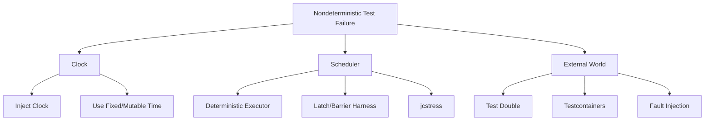

# Part 010 — Testing Time, Concurrency, and Nondeterminism

> Tujuan bagian ini: membuat test untuk time, async workflow, dan concurrency menjadi reliable. Kita tidak ingin test yang “kadang hijau”. Kita ingin test yang menangkap bug nondeterministic dengan desain yang jelas.

Ada kelas bug yang tidak terlihat di unit test biasa:

```text
race condition
lost update
visibility bug
wrong timeout
retry happens too early
retry happens too late
scheduler drift
DST boundary bug
duplicate event under concurrent retry
deadlock
starvation
cancellation ignored
thread interrupt swallowed
flaky async assertion
```

Masalahnya: bug ini sering hilang ketika diberi logging, muncul hanya di CI, atau baru terlihat saat production load.

Testing time dan concurrency tidak bisa hanya mengandalkan intuisi.

Kita butuh mental model:

```text
nondeterminism must be isolated, controlled, or intentionally amplified
```

Artinya:

- waktu harus bisa disuntikkan;
- scheduling harus bisa dikontrol;
- async completion harus ditunggu berdasarkan condition, bukan sleep;
- concurrency harus diberi harness;
- memory/interleaving bug harus diuji dengan tool yang memang dibuat untuk itu;
- flaky test harus diperlakukan sebagai signal desain buruk, bukan “CI sedang aneh”.

---

## 1. Mental Model: Three Sources of Nondeterminism

Dalam Java system, nondeterminism biasanya datang dari tiga sumber besar:

```text
clock nondeterminism
scheduler nondeterminism
external world nondeterminism
```

### 1.1 Clock Nondeterminism

Kode membaca waktu nyata:

```java
Instant now = Instant.now();
```

Test menjadi bergantung pada jam mesin.

Bug muncul di:

```text
midnight boundary
DST transition
timezone conversion
clock skew
slow CI machine
expired token timing
retry delay
```

### 1.2 Scheduler Nondeterminism

Thread scheduling tidak dikontrol test:

```java
executor.submit(taskA);
executor.submit(taskB);
```

Urutan eksekusi bisa berubah.

Bug muncul di:

```text
lost update
out-of-order event
check-then-act race
visibility issue
lock ordering deadlock
callback race
```

### 1.3 External World Nondeterminism

Dependency luar berubah:

```text
network latency
message broker delivery timing
database lock wait
timeout
file system delay
remote service slow/error
```

Testing yang reliable harus memotong atau mengontrol ketiganya.



---

## 2. Testing Time: Never Hide Time Inside Domain Logic

Bad domain code:

```java
public boolean isExpired() {
    return Instant.now().isAfter(expiresAt);
}
```

This is hard to test.

Better:

```java
public boolean isExpiredAt(Instant now) {
    return !now.isBefore(expiresAt);
}
```

Or application service injects `Clock`:

```java
public final class TokenService {
    private final Clock clock;

    public TokenService(Clock clock) {
        this.clock = Objects.requireNonNull(clock, "clock");
    }

    public boolean isExpired(Token token) {
        return !clock.instant().isBefore(token.expiresAt());
    }
}
```

Test:

```java
@Test
void tokenIsExpiredAtExactExpiryInstant() {
    Instant expiry = Instant.parse("2026-07-02T10:00:00Z");
    Clock clock = Clock.fixed(expiry, ZoneOffset.UTC);

    TokenService service = new TokenService(clock);

    assertTrue(service.isExpired(new Token(expiry)));
}
```

### 2.1 Rule: Domain Prefer `Instant` Parameter, Application Uses `Clock`

A good split:

```text
domain object:
    explicit Instant argument

application service:
    injected Clock

infrastructure adapter:
    system clock
```

Example:

```java
public final class CasePolicy {
    private final Instant effectiveFrom;
    private final Instant effectiveUntil;

    public boolean isEffectiveAt(Instant now) {
        return !now.isBefore(effectiveFrom) && now.isBefore(effectiveUntil);
    }
}
```

Service:

```java
public final class ApproveCaseService {
    private final Clock clock;

    public void approve(CaseId caseId, Actor actor) {
        Instant now = clock.instant();
        CaseAggregate c = repository.getRequired(caseId);
        c.approve(actor, now);
        repository.save(c);
    }
}
```

Test domain with explicit `Instant`. Test service with fixed `Clock`.

### 2.2 Mutable Test Clock

For workflows that advance time, `Clock.fixed()` may be too static. Build a mutable test clock.

```java
public final class MutableClock extends Clock {
    private final ZoneId zone;
    private final AtomicReference<Instant> now;

    public MutableClock(Instant initial, ZoneId zone) {
        this.now = new AtomicReference<>(initial);
        this.zone = zone;
    }

    @Override
    public ZoneId getZone() {
        return zone;
    }

    @Override
    public Clock withZone(ZoneId zone) {
        return new MutableClock(now.get(), zone);
    }

    @Override
    public Instant instant() {
        return now.get();
    }

    public void advance(Duration duration) {
        now.updateAndGet(current -> current.plus(duration));
    }
}
```

Test:

```java
@Test
void escalationBecomesDueAfterSlaWindow() {
    MutableClock clock = new MutableClock(
        Instant.parse("2026-07-02T09:00:00Z"),
        ZoneOffset.UTC
    );

    EscalationPolicy policy = EscalationPolicy.after(Duration.ofHours(4));
    CaseAggregate c = CaseFixtures.assignedAt(clock.instant()).build();

    assertFalse(policy.isEscalationDue(c, clock.instant()));

    clock.advance(Duration.ofHours(4));

    assertTrue(policy.isEscalationDue(c, clock.instant()));
}
```

No sleep. No waiting. Pure deterministic time.

---

## 3. Time Boundaries: Instant, LocalDate, ZoneId, Duration

Many time bugs come from using the wrong type.

### 3.1 Choose Type by Meaning

| Meaning | Prefer | Avoid |
|---|---|---|
| machine timestamp | `Instant` | `LocalDateTime` without zone |
| business date | `LocalDate` | `Instant` with arbitrary midnight |
| user-local appointment | `ZonedDateTime` or local + zone | raw epoch millis only |
| elapsed amount | `Duration` | integer seconds without unit |
| calendar amount | `Period` | duration for months/years |
| test clock | `Clock` | `Instant.now()` hidden inside code |

### 3.2 End-of-Day Trap

Bad:

```java
LocalDate dueDate = LocalDate.parse("2026-07-02");
Instant dueAt = dueDate.atStartOfDay(ZoneOffset.UTC).toInstant();
```

If business timezone is Asia/Jakarta, UTC midnight is wrong.

Better:

```java
ZoneId businessZone = ZoneId.of("Asia/Jakarta");
Instant dueAtExclusive = dueDate.plusDays(1)
    .atStartOfDay(businessZone)
    .toInstant();
```

Test:

```java
@Test
void businessDateExpiresAtNextDayStartInBusinessZone() {
    ZoneId zone = ZoneId.of("Asia/Jakarta");
    LocalDate dueDate = LocalDate.of(2026, 7, 2);

    Instant expiresAt = BusinessDates.endExclusive(dueDate, zone);

    assertEquals(
        ZonedDateTime.of(2026, 7, 3, 0, 0, 0, 0, zone).toInstant(),
        expiresAt
    );
}
```

### 3.3 DST Boundary Test

Even if your primary market does not use DST, your platform may serve users or integrations that do.

```java
@Test
void addingCalendarDayIsNotAlwaysTwentyFourHoursInDstZone() {
    ZoneId zone = ZoneId.of("Europe/Berlin");
    ZonedDateTime beforeDstJump = ZonedDateTime.of(2026, 3, 29, 0, 0, 0, 0, zone);

    ZonedDateTime nextCalendarDay = beforeDstJump.plusDays(1);
    Duration elapsed = Duration.between(beforeDstJump.toInstant(), nextCalendarDay.toInstant());

    assertNotEquals(Duration.ofHours(24), elapsed);
}
```

This test teaches a design rule:

```text
calendar arithmetic and elapsed-time arithmetic are different operations
```

---

## 4. Async Testing: Do Not Sleep, Await Conditions

Bad async test:

```java
@Test
void eventuallyPublishesEvent_bad() throws Exception {
    service.approve(caseId);

    Thread.sleep(2000);

    assertThat(outbox.findEvents(caseId)).hasSize(1);
}
```

Problems:

- too slow when system is fast;
- flaky when CI is slow;
- fails without useful diagnosis;
- hides the actual condition.

Better pattern:

```text
trigger async work
await meaningful condition within bounded time
assert final state
```

With Awaitility-style DSL:

```java
@Test
void eventuallyPublishesEvent() {
    service.approve(caseId);

    await()
        .atMost(Duration.ofSeconds(5))
        .pollInterval(Duration.ofMillis(50))
        .untilAsserted(() ->
            assertThat(outbox.findEvents(caseId))
                .extracting(EventRecord::type)
                .contains("CaseApproved")
        );
}
```

### 4.1 Await State, Not Time

Bad:

```text
wait 2 seconds then check
```

Better:

```text
wait until case status becomes APPROVED
wait until event is persisted
wait until message is consumed
wait until retry count reaches 3
wait until metric appears
```

### 4.2 Use Bounded Await

Every async wait must have timeout.

```java
await()
    .atMost(Duration.ofSeconds(3))
    .untilAsserted(() -> assertEquals(CaseStatus.APPROVED, caseRepository.get(caseId).status()));
```

No infinite wait in test.

### 4.3 Assert Intermediate State When Important

Sometimes eventually correct is not enough.

For workflow:

```text
SUBMITTED -> VALIDATING -> PENDING_APPROVAL -> APPROVED
```

If `VALIDATING` has business meaning, test trace:

```java
@Test
void approvalWorkflowEmitsExpectedStateTrace() {
    workflow.start(caseId);

    await().atMost(Duration.ofSeconds(5)).untilAsserted(() ->
        assertThat(stateHistory(caseId))
            .containsSubsequence("SUBMITTED", "VALIDATING", "PENDING_APPROVAL", "APPROVED")
    );
}
```

If intermediate state is implementation detail, do not test it.

---

## 5. Deterministic Executor and Scheduler Abstraction

For many async components, the best test is not “real async”. It is deterministic execution.

### 5.1 Executor as Dependency

Bad:

```java
public void handle(Command command) {
    CompletableFuture.runAsync(() -> process(command));
}
```

This hides executor.

Better:

```java
public final class AsyncCommandHandler {
    private final Executor executor;

    public AsyncCommandHandler(Executor executor) {
        this.executor = executor;
    }

    public void handle(Command command) {
        executor.execute(() -> process(command));
    }
}
```

Test with direct executor:

```java
@Test
void handlesCommandSynchronouslyInUnitTest() {
    Executor directExecutor = Runnable::run;
    AsyncCommandHandler handler = new AsyncCommandHandler(directExecutor);

    handler.handle(new Command("C-1"));

    assertThat(repository.get("C-1").status()).isEqualTo(Status.PROCESSED);
}
```

This removes scheduler nondeterminism when the test is not about concurrency.

### 5.2 Recording Executor

Sometimes you want to assert tasks were scheduled but control when they run.

```java
public final class RecordingExecutor implements Executor {
    private final Queue<Runnable> tasks = new ArrayDeque<>();

    @Override
    public void execute(Runnable command) {
        tasks.add(command);
    }

    public int taskCount() {
        return tasks.size();
    }

    public void runNext() {
        tasks.remove().run();
    }

    public void runAll() {
        while (!tasks.isEmpty()) {
            runNext();
        }
    }
}
```

Test:

```java
@Test
void schedulesNotificationAfterApprovalCommit() {
    RecordingExecutor executor = new RecordingExecutor();
    ApprovalService service = new ApprovalService(repository, notifier, executor);

    service.approve(caseId);

    assertEquals(CaseStatus.APPROVED, repository.get(caseId).status());
    assertEquals(1, executor.taskCount());

    executor.runNext();

    verify(notifier).sendApprovalNotification(caseId);
}
```

This test proves ordering:

```text
commit first, notify after
```

without relying on real thread timing.

### 5.3 Deterministic Scheduler for Retry

```java
public interface Scheduler {
    void schedule(Runnable task, Duration delay);
}
```

Test scheduler:

```java
public final class TestScheduler implements Scheduler {
    private final PriorityQueue<ScheduledTask> tasks = new PriorityQueue<>(Comparator.comparing(ScheduledTask::dueAt));
    private Instant now = Instant.EPOCH;

    @Override
    public void schedule(Runnable task, Duration delay) {
        tasks.add(new ScheduledTask(now.plus(delay), task));
    }

    public void advanceBy(Duration duration) {
        now = now.plus(duration);
        while (!tasks.isEmpty() && !tasks.peek().dueAt().isAfter(now)) {
            tasks.poll().task().run();
        }
    }
}
```

Test retry:

```java
@Test
void retriesAfterConfiguredDelay() {
    TestScheduler scheduler = new TestScheduler();
    FlakyClient client = new FlakyClient(2);
    RetryWorker worker = new RetryWorker(client, scheduler);

    worker.start();

    assertEquals(1, client.attempts());

    scheduler.advanceBy(Duration.ofSeconds(1));
    assertEquals(2, client.attempts());

    scheduler.advanceBy(Duration.ofSeconds(2));
    assertEquals(3, client.attempts());
}
```

No real time. Fully deterministic.

---

## 6. Concurrency Bug Taxonomy

Before writing concurrency tests, classify bug type.

| Bug | Meaning | Example |
|---|---|---|
| Data race | unsynchronized concurrent access where at least one write | mutable map modified from two threads |
| Lost update | two updates overwrite each other | increment not atomic |
| Check-then-act race | state checked then changed by another thread | if absent then insert duplicate |
| Visibility bug | one thread does not observe write | missing volatile/synchronization |
| Ordering bug | operations observed in wrong order | event visible before state commit |
| Deadlock | threads wait forever on locks | lock A then B vs B then A |
| Livelock | system active but no progress | repeated conflict/retry |
| Starvation | one actor never gets resource | unfair lock/queue |
| ABA | value changes A->B->A and CAS misses history | lock-free stack issue |
| False sharing | performance degradation due to cache line sharing | counters adjacent in memory |

Different bugs need different tests.

Unit tests can catch simple lost update. jcstress-style tests are better for memory/interleaving behavior. Load tests reveal contention and starvation. Profilers reveal lock hot spots. Formal models reveal state-space bugs before implementation.

---

## 7. Testing Simple Concurrent Invariants with Latches and Barriers

For application-level concurrency, use coordination primitives.

### 7.1 CountDownLatch for Simultaneous Start

Scenario:

```text
two supervisors try to approve same case concurrently
only one approval event must be created
```

Harness:

```java
@Test
void concurrentApprovalCreatesOnlyOneApprovalEvent() throws Exception {
    CaseId caseId = seedPendingApprovalCase();

    int workers = 2;
    ExecutorService executor = Executors.newFixedThreadPool(workers);
    CountDownLatch ready = new CountDownLatch(workers);
    CountDownLatch start = new CountDownLatch(1);
    CountDownLatch done = new CountDownLatch(workers);
    List<Throwable> failures = new CopyOnWriteArrayList<>();

    Runnable task = () -> {
        ready.countDown();
        try {
            start.await();
            approveCaseService.approve(caseId, TestActors.supervisor());
        } catch (Throwable t) {
            failures.add(t);
        } finally {
            done.countDown();
        }
    };

    executor.submit(task);
    executor.submit(task);

    assertTrue(ready.await(1, TimeUnit.SECONDS));
    start.countDown();
    assertTrue(done.await(5, TimeUnit.SECONDS));

    assertAll(
        () -> assertEquals(CaseStatus.APPROVED, caseRepository.get(caseId).status()),
        () -> assertEquals(1, outboxRepository.countEvents(caseId, "CaseApproved")),
        () -> assertThat(failures)
            .allSatisfy(t -> assertThat(t).isInstanceOfAny(OptimisticLockException.class, DomainRejectedException.class))
    );

    executor.shutdownNow();
}
```

Important details:

- start both workers at the same time;
- bound all waits;
- capture failures;
- assert final invariant;
- shutdown executor.

### 7.2 CyclicBarrier for Repeated Race Attempt

Some races require repeated attempts.

```java
@Test
void concurrentIncrementNeverLosesUpdates() throws Exception {
    int threads = 4;
    int iterations = 10_000;
    Counter counter = new Counter();
    CyclicBarrier barrier = new CyclicBarrier(threads);
    ExecutorService executor = Executors.newFixedThreadPool(threads);

    List<Future<?>> futures = new ArrayList<>();
    for (int i = 0; i < threads; i++) {
        futures.add(executor.submit(() -> {
            barrier.await();
            for (int j = 0; j < iterations; j++) {
                counter.increment();
            }
            return null;
        }));
    }

    for (Future<?> f : futures) {
        f.get(5, TimeUnit.SECONDS);
    }

    assertEquals(threads * iterations, counter.value());
    executor.shutdownNow();
}
```

This catches obvious non-atomic increment if repeated enough, but it is still probabilistic. For lower-level memory behavior, use a stress harness.

---

## 8. jcstress: When Normal Unit Tests Are Not Enough

Some Java concurrency bugs depend on legal interleavings, JIT behavior, CPU memory model, and JVM implementation details.

A regular JUnit test usually cannot exhaust or classify those outcomes.

jcstress is designed as a concurrency stress harness for the JVM.

### 8.1 Example: Unsafe Publication

Class under test:

```java
public final class UnsafeHolder {
    int x;

    public void write() {
        x = 1;
    }

    public int read() {
        return x;
    }
}
```

jcstress-style test sketch:

```java
@JCStressTest
@Outcome(id = "1", expect = Expect.ACCEPTABLE, desc = "Observed write")
@Outcome(id = "0", expect = Expect.ACCEPTABLE_INTERESTING, desc = "Did not observe write")
@State
public class UnsafeHolderStressTest {
    private final UnsafeHolder holder = new UnsafeHolder();

    @Actor
    public void writer() {
        holder.write();
    }

    @Actor
    public void reader(I_Result r) {
        r.r1 = holder.read();
    }
}
```

The goal is not just pass/fail. The goal is to observe allowed outcomes.

### 8.2 When to Use jcstress

Use jcstress for:

```text
lock-free structures
custom synchronization
volatile/publication behavior
atomic/CAS algorithms
racy optimization
low-level concurrent cache
sequence generator
ring buffer
mutable shared state used by multiple threads
```

Do not use jcstress for every service test. It is a precision tool.

### 8.3 What jcstress Teaches

It forces you to specify:

```text
actors
shared state
observed result
acceptable outcomes
forbidden outcomes
interesting outcomes
```

This is close to formal thinking.

---

## 9. Testing CompletableFuture and Async Pipelines

`CompletableFuture` makes async composition easy, but also hides thread behavior.

Pitfalls:

```text
using common pool accidentally
exceptions swallowed inside future
join wraps exception in CompletionException
timeout not tested
cancellation not propagated
callback runs on unexpected executor
```

### 9.1 Inject Executor Explicitly

Bad:

```java
return CompletableFuture.supplyAsync(() -> riskClient.score(request));
```

Better:

```java
return CompletableFuture.supplyAsync(() -> riskClient.score(request), executor);
```

Test with direct executor:

```java
@Test
void quoteCompletesWithRiskScore() {
    Executor direct = Runnable::run;
    QuoteAsyncService service = new QuoteAsyncService(riskClient, direct);

    CompletableFuture<Quote> future = service.quoteAsync(validRequest());

    assertEquals(QuoteStatus.QUOTED, future.join().status());
}
```

### 9.2 Test Exceptional Completion

```java
@Test
void riskFailureCompletesFutureExceptionally() {
    Executor direct = Runnable::run;
    RiskClient riskClient = request -> {
        throw new DownstreamTimeoutException("risk");
    };

    QuoteAsyncService service = new QuoteAsyncService(riskClient, direct);

    CompletionException ex = assertThrows(
        CompletionException.class,
        () -> service.quoteAsync(validRequest()).join()
    );

    assertThat(ex.getCause()).isInstanceOf(DownstreamTimeoutException.class);
}
```

### 9.3 Test Timeout

Prefer not to wait real timeout in unit test. Use abstraction when timeout policy is yours.

If using JDK timeout directly, keep timeout tiny but bounded:

```java
@Test
void futureTimesOutWhenDependencyDoesNotComplete() {
    CompletableFuture<RiskScore> never = new CompletableFuture<>();

    CompletableFuture<RiskScore> withTimeout = never.orTimeout(50, TimeUnit.MILLISECONDS);

    CompletionException ex = assertThrows(CompletionException.class, withTimeout::join);

    assertThat(ex.getCause()).isInstanceOf(TimeoutException.class);
}
```

Use sparingly. Tiny real-time tests can still be flaky under heavy CI load. For critical retry/timeout logic, prefer deterministic scheduler.

---

## 10. Virtual Threads: Testing Behavior, Not Implementation Hype

Modern Java virtual threads change the cost model of blocking concurrency, but they do not eliminate correctness problems.

Still test:

```text
cancellation
thread-local assumptions
transaction context propagation
blocking sections
pinning-sensitive code
bounded downstream resources
connection pool saturation
```

### 10.1 Do Not Equate More Threads with More Capacity

Even with many virtual threads, database connections are finite.

Test resource guard:

```java
@Test
void rejectsWhenDatabasePermitBudgetIsExhausted() throws Exception {
    Semaphore dbPermits = new Semaphore(1);
    DatabaseGuard guard = new DatabaseGuard(dbPermits);

    dbPermits.acquire();

    TooBusyException ex = assertThrows(
        TooBusyException.class,
        () -> guard.execute(() -> "work")
    );

    assertEquals(ErrorCode.DB_CAPACITY_EXHAUSTED, ex.code());

    dbPermits.release();
}
```

The invariant:

```text
concurrency model may change, external bottleneck does not disappear
```

### 10.2 Context Propagation Test

If using request context:

```java
@Test
void asyncWorkReceivesCorrelationId() {
    RecordingLogger logger = new RecordingLogger();
    ContextPropagatingExecutor executor = new ContextPropagatingExecutor(Runnable::run);

    RequestContext.set(new RequestContext("corr-123"));

    executor.execute(() -> logger.info("processing"));

    assertThat(logger.events())
        .anySatisfy(e -> assertEquals("corr-123", e.correlationId()));
}
```

Thread-local context is a frequent source of subtle async bugs.

---

## 11. Deadlock and Timeout Detection in Tests

Deadlock tests must be bounded.

Bad:

```java
future.get(); // can hang forever
```

Better:

```java
future.get(5, TimeUnit.SECONDS);
```

### 11.1 Lock Ordering Test

If you implement explicit locks, enforce ordering.

```java
public final class LockOrder {
    public static List<LockId> canonical(LockId a, LockId b) {
        return Stream.of(a, b).sorted().toList();
    }
}
```

Test:

```java
@Test
void lockOrderIsCanonicalRegardlessOfInputOrder() {
    LockId caseLock = LockId.of("case:C-1");
    LockId accountLock = LockId.of("account:A-1");

    assertEquals(
        LockOrder.canonical(caseLock, accountLock),
        LockOrder.canonical(accountLock, caseLock)
    );
}
```

A lot of deadlock prevention is design, not detection.

### 11.2 Thread Dump on Timeout

For large integration test suites, configure timeout extension that prints thread dump when test exceeds budget.

Pseudo-extension:

```java
class ThreadDumpOnTimeoutExtension implements BeforeEachCallback, AfterEachCallback {
    // production implementation would start watchdog and dump all thread stack traces
}
```

Goal:

```text
when concurrency test hangs, failure output must show who waits on what
```

---

## 12. Testing Eventual Consistency

Eventual consistency does not mean “anything is acceptable for a while”.

It means:

```text
given stable input and healthy dependencies,
system converges to expected state within bounded time
```

### 12.1 Convergence Test

```java
@Test
void projectionEventuallyReflectsApprovedCase() {
    CaseId caseId = seedPendingApprovalCase();

    commandApi.approve(caseId, TestActors.supervisor());

    await()
        .atMost(Duration.ofSeconds(10))
        .untilAsserted(() -> {
            CaseView view = queryApi.getCase(caseId);
            assertEquals("APPROVED", view.status());
            assertNotNull(view.approvedAt());
        });
}
```

### 12.2 No Impossible Intermediate State

If projection may lag, it still must not show impossible combinations.

```java
@Test
void projectionNeverShowsApprovedWithoutApprovedAt() {
    CaseId caseId = seedPendingApprovalCase();

    commandApi.approve(caseId, TestActors.supervisor());

    await()
        .during(Duration.ofSeconds(2))
        .atMost(Duration.ofSeconds(3))
        .untilAsserted(() -> {
            CaseView view = queryApi.getCase(caseId);
            if ("APPROVED".equals(view.status())) {
                assertNotNull(view.approvedAt());
            }
        });
}
```

This is powerful: you are testing invariant during convergence, not only final convergence.

---

## 13. Flaky Tests: Taxonomy and Treatment

A flaky test is not a harmless annoyance. It is a broken signal channel.

### 13.1 Common Causes

| Cause | Symptom | Fix |
|---|---|---|
| real sleep | passes locally, fails CI | await condition |
| hidden current time | fails around midnight | inject clock |
| shared mutable fixture | order-dependent failures | isolate test data |
| shared database state | random conflicts | unique schema/data per test |
| unordered collection assertion | different order | assert set or sort |
| async callback not awaited | missing event | await observable condition |
| port/resource collision | CI-only failure | dynamic ports/resources |
| test depends on wall-clock timeout | slow machine failure | deterministic scheduler |
| parallel test interference | only when parallel enabled | remove globals/static state |

### 13.2 Flaky Test Policy

A mature team treats flaky tests as production incidents for the delivery pipeline.

Policy:

```text
1. mark and quarantine only to unblock delivery
2. create ticket with owner
3. classify cause
4. fix root cause
5. prevent recurrence with pattern/library
6. do not ignore repeated flaky failures
```

Quarantine is not deletion. Quarantine is containment.

### 13.3 Do Not “Fix” Flaky Tests by Increasing Sleep

Bad progression:

```text
sleep 1s failed -> sleep 3s -> sleep 10s -> suite slow and still flaky
```

Better:

```text
replace sleep with condition
make time injectable
make scheduler deterministic
remove shared state
capture diagnostic output
```

---

## 14. Concurrency Test Design Patterns

### 14.1 Start-Gate Pattern

Use when you want multiple workers to start together.

```text
ready latch -> start latch -> done latch
```

### 14.2 Controlled Executor Pattern

Use when concurrency is not the subject, but async API is.

```text
inject direct executor or recording executor
```

### 14.3 Deterministic Scheduler Pattern

Use for retry, timeout, delayed events, polling, SLA, escalation.

```text
advance virtual time, execute due tasks
```

### 14.4 Stress Harness Pattern

Use when bug depends on interleavings.

```text
repeat many times, coordinate start, assert invariant
```

### 14.5 jcstress Pattern

Use for low-level shared memory correctness.

```text
actors + outcomes + allowed/forbidden states
```

### 14.6 Production Probe Pattern

Use when test environment cannot fully reproduce issue.

```text
metric + trace + JFR/custom event + invariant monitor
```

Some concurrency bugs are best detected through production observability plus canary, not unit tests alone.

---

## 15. Example: Testing Concurrent Idempotency

Requirement:

```text
If two identical commands with same idempotency key arrive concurrently,
only one domain transition and one event are produced.
Both callers receive same semantic result.
```

Test:

```java
@Test
void concurrentSameIdempotencyKeyProducesSingleApproval() throws Exception {
    CaseId caseId = seedPendingApprovalCase();
    IdempotencyKey key = IdempotencyKey.of("req-123");
    int workers = 2;

    ExecutorService executor = Executors.newFixedThreadPool(workers);
    CountDownLatch ready = new CountDownLatch(workers);
    CountDownLatch start = new CountDownLatch(1);

    Callable<ApprovalResponse> call = () -> {
        ready.countDown();
        start.await();
        return approveCaseService.approve(caseId, TestActors.supervisor(), key);
    };

    Future<ApprovalResponse> f1 = executor.submit(call);
    Future<ApprovalResponse> f2 = executor.submit(call);

    assertTrue(ready.await(1, TimeUnit.SECONDS));
    start.countDown();

    ApprovalResponse r1 = f1.get(5, TimeUnit.SECONDS);
    ApprovalResponse r2 = f2.get(5, TimeUnit.SECONDS);

    assertAll(
        () -> assertEquals(r1.decisionId(), r2.decisionId()),
        () -> assertEquals(CaseStatus.APPROVED, caseRepository.get(caseId).status()),
        () -> assertEquals(1, outboxRepository.countEvents(caseId, "CaseApproved")),
        () -> assertEquals(1, idempotencyRepository.countByKey(key))
    );

    executor.shutdownNow();
}
```

This test depends on database isolation and unique constraints. Without DB-level uniqueness, app-level locks may still fail under multi-node deployment.

Correct architecture often needs:

```text
unique index on idempotency key
transactional insert winner
duplicate key handling
result replay
outbox uniqueness
```

Testing reveals architecture constraints.

---

## 16. Example: Testing Retry with Deterministic Time

Requirement:

```text
risk scoring retry uses exponential backoff:
attempt 1 immediately
attempt 2 after 100 ms
attempt 3 after 200 ms
then fail with retry budget exceeded
```

Test:

```java
@Test
void retryUsesExpectedBackoffAndStopsAfterBudget() {
    TestScheduler scheduler = new TestScheduler();
    AlwaysFailingRiskClient riskClient = new AlwaysFailingRiskClient();
    RetryPolicy policy = RetryPolicy.exponentialBackoff(
        Duration.ofMillis(100),
        2.0,
        3
    );

    RiskScoringWorker worker = new RiskScoringWorker(riskClient, scheduler, policy);

    worker.start(validRequest());

    assertEquals(1, riskClient.attempts());

    scheduler.advanceBy(Duration.ofMillis(99));
    assertEquals(1, riskClient.attempts());

    scheduler.advanceBy(Duration.ofMillis(1));
    assertEquals(2, riskClient.attempts());

    scheduler.advanceBy(Duration.ofMillis(199));
    assertEquals(2, riskClient.attempts());

    scheduler.advanceBy(Duration.ofMillis(1));
    assertEquals(3, riskClient.attempts());

    scheduler.advanceBy(Duration.ofSeconds(10));
    assertEquals(3, riskClient.attempts());
    assertEquals(ErrorCode.RETRY_BUDGET_EXCEEDED, worker.failure().code());
}
```

This is impossible to test cleanly with `Thread.sleep()`.

---

## 17. Example: Testing Out-of-Order Events

Requirement:

```text
Projection must ignore stale events based on aggregate version.
```

Events:

```text
CaseAssigned version 2
CaseClosed version 3
late CaseAssigned version 2 arrives after CaseClosed
```

Test:

```java
@Test
void projectionIgnoresStaleEventVersion() {
    CaseProjection projection = new CaseProjection();

    projection.apply(new CaseAssigned(caseId, 2, UserId.of("inv-1")));
    projection.apply(new CaseClosed(caseId, 3));
    projection.apply(new CaseAssigned(caseId, 2, UserId.of("inv-2")));

    CaseView view = projection.get(caseId);

    assertAll(
        () -> assertEquals("CLOSED", view.status()),
        () -> assertEquals(3, view.version()),
        () -> assertEquals(UserId.of("inv-1"), view.investigator())
    );
}
```

This is nondeterminism from distributed delivery, not threads. But the testing principle is the same: define allowed orderings and assert invariant.

---

## 18. Observability for Nondeterministic Failures

When concurrency/async test fails, it needs diagnostics.

Capture:

```text
correlation id
thread name
executor queue size
state transition trace
event versions
retry attempt
timeout budget
lock wait duration
transaction id
idempotency key
```

Test can assert observability in critical failure paths:

```java
@Test
void timeoutFailureEmitsDiagnosticEvent() {
    RecordingDiagnostics diagnostics = new RecordingDiagnostics();
    RiskClient riskClient = request -> { throw new DownstreamTimeoutException("risk"); };
    QuoteService service = new QuoteService(riskClient, diagnostics);

    assertThrows(DownstreamTimeoutException.class, () -> service.quote(validRequest()));

    assertThat(diagnostics.events())
        .anySatisfy(event -> {
            assertEquals("risk.timeout", event.name());
            assertEquals("risk", event.attribute("dependency"));
            assertNotNull(event.attribute("correlationId"));
        });
}
```

Do not log everything. Emit the minimum evidence needed to debug rare failures.

---

## 19. Anti-Patterns

### 19.1 Hidden `Instant.now()`

```java
if (Instant.now().isAfter(deadline)) { ... }
```

Inject time or pass `Instant`.

### 19.2 Sleep-Based Async Assertion

```java
Thread.sleep(3000);
```

Await condition or use deterministic scheduler.

### 19.3 Unbounded Future Wait

```java
future.get();
```

Always bound waits in tests.

### 19.4 Ignoring Exceptions in Worker Threads

```java
executor.submit(() -> service.doWork());
// no future checked
```

Always collect and assert failures.

### 19.5 Testing Concurrent Code Only Once

Some bugs need repeated or stress execution.

### 19.6 Sharing Static Mutable State Across Parallel Tests

This is one of the fastest ways to create order-dependent failures.

### 19.7 Treating Eventual Consistency as No Consistency

Eventual consistency still has convergence and invariant requirements.

---

## 20. Production-Grade Checklist

### 20.1 Time

- [ ] Does domain logic avoid hidden `Instant.now()`?
- [ ] Is `Clock` injected at application boundary?
- [ ] Are effective windows tested at start inclusive and end exclusive?
- [ ] Are timezone conversions explicit?
- [ ] Are calendar and elapsed-time arithmetic separated?
- [ ] Are retry/timeout tests free from real sleep?

### 20.2 Async

- [ ] Does async test await condition instead of sleeping?
- [ ] Are waits bounded?
- [ ] Are worker exceptions captured?
- [ ] Is executor injected?
- [ ] Can unit tests use direct/recording executor?
- [ ] Are intermediate states tested only when contractually meaningful?

### 20.3 Concurrency

- [ ] Does test coordinate concurrent start when needed?
- [ ] Does it assert final invariant, not just no exception?
- [ ] Are database uniqueness/locking assumptions tested with real persistence?
- [ ] Are low-level memory assumptions tested with stress harness when needed?
- [ ] Are executors shut down?
- [ ] Are deadlock-prone waits bounded?

### 20.4 Flakiness

- [ ] Is there no arbitrary sleep?
- [ ] Is test data isolated?
- [ ] Is unordered output asserted as unordered?
- [ ] Are dynamic ports/resources used?
- [ ] Is current time controlled?
- [ ] Is failure output diagnostic enough?

---

## 21. Practice Lab

Build a small async case escalation component.

Requirement:

```text
Case assigned at T0 escalates after 4 hours if still unresolved.
Escalation job runs periodically.
Duplicate job execution must not create duplicate escalation event.
Late completion before escalation due must prevent escalation.
Concurrent job executions must produce at most one event.
```

Implement:

```text
CaseAggregate
EscalationPolicy
EscalationJob
MutableClock
TestScheduler
OutboxRepository
Idempotency/unique event guard
```

Write tests:

```text
1. not due before 4 hours
2. due exactly at 4 hours
3. completion before due prevents escalation
4. duplicate job execution creates one event
5. concurrent job execution creates one event
6. retry after transient repository failure
7. no real sleep in unit tests
8. integration test with real DB unique constraint
9. async projection eventually shows escalated status
10. projection never shows ESCALATED without escalatedAt
```

Stretch goal:

```text
model the escalation state machine in TLA+ later, then generate model-based tests for Java implementation
```

---

## 22. Key Takeaways

- Time, scheduling, and external dependencies are the main sources of nondeterminism.
- Hidden `Instant.now()` is a testability smell.
- Use `Clock`, explicit `Instant`, mutable test clock, and deterministic scheduler.
- Async tests should wait for meaningful conditions, not arbitrary time.
- Concurrency tests need harnesses: latches, barriers, bounded futures, captured failures.
- jcstress is appropriate for low-level JVM concurrency and memory behavior.
- Eventual consistency still requires bounded convergence and impossible-state invariants.
- Flaky tests are broken evidence channels and must be fixed structurally.
- The goal is not to make nondeterminism disappear. The goal is to isolate, control, or amplify it intentionally.

---

## References

- Java `Clock` API documentation: `https://docs.oracle.com/javase/8/docs/api/java/time/Clock.html`
- Awaitility documentation: `https://www.awaitility.org/`
- OpenJDK jcstress project: `https://openjdk.org/projects/code-tools/jcstress/`
- JUnit User Guide: `https://docs.junit.org/`
