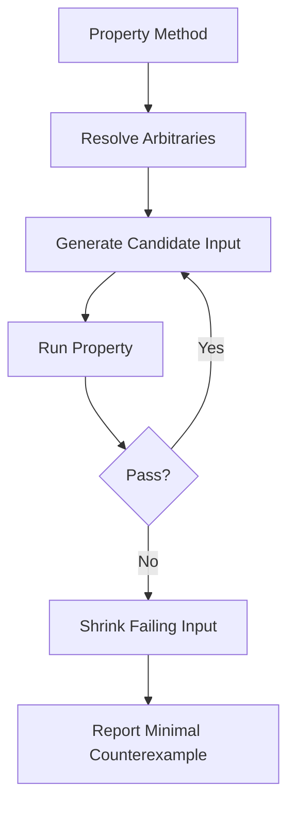
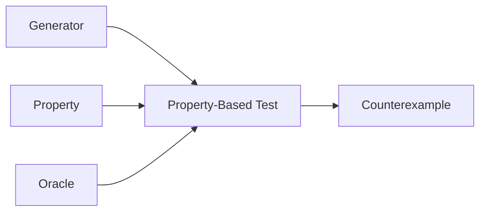
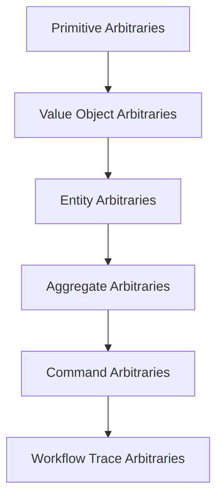

# Part 011 — Property-Based Testing with jqwik

> Tujuan bagian ini: mengubah cara kita menulis test dari “saya punya beberapa contoh input” menjadi “saya tahu hukum yang harus selalu benar”. Property-based testing bukan pengganti unit test. Ia adalah lapisan verification yang menangkap ruang input luas, edge case tak terduga, dan kelemahan oracle test.

Di test biasa, kita menulis contoh:

```java
@Test
void discountCannotMakeTotalNegative() {
    Money total = Pricing.applyDiscount(Money.of("100.00"), Discount.percent(10));

    assertThat(total).isEqualTo(Money.of("90.00"));
}
```

Test ini berguna. Tapi ia hanya membuktikan satu titik.

Pertanyaan production-grade-nya:

```text
Untuk semua harga valid,
untuk semua diskon valid,
apakah hasilnya selalu tidak negatif?

Apakah rounding stabil?
Apakah apply discount idempotent untuk discount 0%?
Apakah total selalu <= subtotal?
Apakah property tetap benar ketika ada tax, voucher, dan currency scale berbeda?
```

Property-based testing mencoba memalsukan klaim kita dengan banyak input yang dihasilkan otomatis.

Mental model-nya:

```text
example-based test = verify known cases
property-based test = search for counterexamples
```

Kalau property gagal, framework akan mencoba memberi contoh minimal yang masih gagal. Proses ini disebut shrinking.

---

## 1. Why Property-Based Testing Exists

Example-based tests punya bias manusia.

Kita cenderung memilih input yang:

- terlihat normal;
- mudah dihitung manual;
- sesuai happy path;
- tidak terlalu besar;
- tidak terlalu kosong;
- tidak terlalu ekstrem;
- tidak mencerminkan kombinasi aneh production data.

Contoh buruk:

```java
@Test
void normalizePhoneNumber() {
    assertThat(normalize("0812-3456-7890")).isEqualTo("6281234567890");
}
```

Production tidak akan sebaik itu.

Input nyata bisa:

```text
""
" "
"+62 812 3456 7890"
"006281234567890"
"0812.3456.7890"
"(021) 123-456"
"+62-812-3456-7890 ext 12"
"abc"
"０８１２３４５６７８９０"  // full-width unicode digits
```

Kalau fungsi punya domain input besar, beberapa contoh tidak cukup.

Property-based testing membantu ketika:

```text
input space large
edge cases hard to enumerate
domain has invariants
operation has algebraic laws
parser/serializer roundtrip exists
state transition can be modeled
bug tends to hide in combinations
```

---

## 2. jqwik Mental Model

jqwik adalah property-based testing engine untuk JVM yang terintegrasi dengan JUnit Platform. Test property ditulis dengan annotation `@Property`, input dihasilkan dari parameter `@ForAll`, dan custom generator dibuat dengan `Arbitrary<T>`.

Bentuk minimal:

```java
import net.jqwik.api.ForAll;
import net.jqwik.api.Property;

class StringProperties {

    @Property
    boolean reversingTwiceReturnsOriginal(@ForAll String value) {
        return new StringBuilder(value).reverse()
            .reverse()
            .toString()
            .equals(value);
    }
}
```

Flow eksekusi:



Yang paling penting: `@Property` bukan “test dengan random input saja”. Ia adalah executable specification.

---

## 3. The Difference Between Example and Property

Example:

```java
@Test
void sortedListExample() {
    List<Integer> result = Sorter.sort(List.of(3, 1, 2));

    assertThat(result).containsExactly(1, 2, 3);
}
```

Property:

```java
@Property
void sortingPreservesSize(@ForAll List<Integer> input) {
    List<Integer> result = Sorter.sort(input);

    assertThat(result).hasSize(input.size());
}

@Property
void sortingReturnsOrderedList(@ForAll List<Integer> input) {
    List<Integer> result = Sorter.sort(input);

    assertThat(result).isSorted();
}

@Property
void sortingPreservesElements(@ForAll List<Integer> input) {
    List<Integer> result = Sorter.sort(input);

    assertThat(result)
        .containsExactlyInAnyOrderElementsOf(input);
}
```

Satu contoh “3,1,2” tidak cukup untuk membuktikan sorting.

Tiga property di atas menangkap struktur sorting:

```text
same cardinality
ordered output
same multiset of elements
```

Itu bukan sekadar “expected output”. Itu hukum operasi.

---

## 4. Property Vocabulary for Java Engineers

Property yang bagus biasanya masuk salah satu kategori ini:

| Property Type | Meaning | Example |
|---|---|---|
| Invariant | Kondisi yang selalu benar | balance never negative |
| Round-trip | encode/decode kembali ke nilai awal | parse(format(x)) == x |
| Idempotence | operasi berulang punya efek sama | normalize(normalize(x)) == normalize(x) |
| Commutativity | urutan tidak penting | a + b == b + a |
| Associativity | grouping tidak penting | `(a+b)+c == a+(b+c)` |
| Monotonicity | arah perubahan stabil | higher discount means lower total |
| Conservation | sesuatu tidak hilang/bertambah | sorted list has same elements |
| Metamorphic | perubahan input punya relasi output | adding whitespace does not change parsed number |
| Oracle equivalence | dibandingkan dengan implementation trusted | fast algorithm == slow reference algorithm |
| State transition | setiap command menjaga invariant | valid workflow never enters illegal state |

Jangan mulai dari jqwik annotation.

Mulai dari kalimat:

```text
For all <valid inputs>, when <operation>, then <property> must hold.
```

Contoh:

```text
For all valid order lines, when calculating subtotal, then subtotal equals sum(quantity * unitPrice).

For all valid draft cases, when submitted, then status becomes SUBMITTED and submittedAt is set exactly once.

For all generated payloads, when serialize then deserialize, then semantic value is preserved.
```

---

## 5. Property-Based Testing Is Not Random Testing

Random testing tanpa model hanya berharap bug muncul.

Property-based testing punya tiga pilar:

```text
generator + property + oracle
```



Generator menentukan input yang valid dan relevan.

Property menentukan klaim yang diuji.

Oracle menentukan cara memutuskan benar/salah.

Bug paling umum dalam PBT bukan framework-nya, tapi:

```text
generator too broad
property too weak
oracle mirrors implementation bug
assumptions filter too much data
shrinking broken by invalid constraints
```

---

## 6. Dependency Setup

Dengan Maven:

```xml
<dependency>
    <groupId>net.jqwik</groupId>
    <artifactId>jqwik</artifactId>
    <version>${jqwik.version}</version>
    <scope>test</scope>
</dependency>
```

Dengan Gradle:

```kotlin
dependencies {
    testImplementation("net.jqwik:jqwik:${jqwikVersion}")
}

tasks.test {
    useJUnitPlatform()
}
```

Karena jqwik berjalan sebagai JUnit Platform engine, ia bisa hidup berdampingan dengan JUnit Jupiter.

Pattern layout:

```text
src/test/java
  com.company.pricing
    PriceCalculatorTest.java        // example-based tests
    PriceCalculatorProperties.java  // property-based tests
    PricingArbitraries.java         // domain generators
```

Naming convention yang saya rekomendasikan:

```text
<X>Test           = example-based tests
<X>Properties     = property-based tests
<X>Arbitraries    = generator DSL
<X>Fixtures       = deterministic fixtures
<X>Assertions     = custom assertions
```

---

## 7. Basic jqwik Anatomy

Contoh:

```java
import net.jqwik.api.*;
import org.assertj.core.api.Assertions;

class MoneyProperties {

    @Property
    void addingZeroDoesNotChangeValue(@ForAll("validMoney") Money money) {
        Money result = money.plus(Money.zero(money.currency()));

        Assertions.assertThat(result).isEqualTo(money);
    }

    @Provide
    Arbitrary<Money> validMoney() {
        Arbitrary<String> currency = Arbitraries.of("IDR", "USD", "EUR");
        Arbitrary<BigDecimal> amount = Arbitraries.bigDecimals()
            .between(BigDecimal.ZERO, new BigDecimal("1000000.00"))
            .ofScale(2);

        return Combinators.combine(currency, amount)
            .as((c, a) -> new Money(c, a));
    }
}
```

Komponen penting:

| jqwik Concept | Role |
|---|---|
| `@Property` | method adalah property test |
| `@ForAll` | parameter diisi generator |
| `@Provide` | named arbitrary provider |
| `Arbitrary<T>` | generator + shrinking strategy |
| `Combinators.combine` | membangun object dari beberapa arbitrary |
| assertion | oracle |

---

## 8. Properties Should Be Strong Enough to Fail Bad Code

Property lemah:

```java
@Property
void totalIsNotNull(@ForAll("orders") Order order) {
    assertThat(calculator.total(order)).isNotNull();
}
```

Ini hampir tidak berguna.

Property kuat:

```java
@Property
void totalEqualsSumOfLineTotalsMinusDiscountPlusTax(
    @ForAll("pricedOrders") Order order
) {
    Money expected = order.lines().stream()
        .map(line -> line.unitPrice().multiply(line.quantity()))
        .reduce(Money.zero(order.currency()), Money::plus)
        .minus(order.discountAmount())
        .plus(order.taxAmount());

    assertThat(calculator.total(order)).isEqualTo(expected);
}
```

Tapi hati-hati: kalau `expected` memakai logic yang sama dengan production implementation, kita hanya menggandakan bug.

Lebih baik:

```text
production implementation = optimized, integrated, complex
reference oracle = simple, slow, obvious, independent
```

Contoh sorting:

```java
@Property
void customSortMatchesJdkSort(@ForAll List<Integer> input) {
    List<Integer> expected = new ArrayList<>(input);
    expected.sort(Integer::compareTo);

    List<Integer> actual = CustomSorter.sort(input);

    assertThat(actual).containsExactlyElementsOf(expected);
}
```

---

## 9. Generator Design: The Real Skill

Property-based testing sering gagal bukan karena property-nya, tapi karena generator-nya buruk.

Generator buruk:

```java
@Property
void validEmailCanBeParsed(@ForAll String email) {
    Email.parse(email);
}
```

Masalah: kebanyakan string bukan email valid. Test ini akan gagal atau penuh assumption discard.

Generator baik:

```java
@Provide
Arbitrary<String> validEmails() {
    Arbitrary<String> localPart = Arbitraries.strings()
        .withChars('a', 'b', 'c', 'd', 'e', 'f')
        .ofMinLength(1)
        .ofMaxLength(20);

    Arbitrary<String> domain = Arbitraries.of("example.com", "company.test", "mail.local");

    return Combinators.combine(localPart, domain)
        .as((local, d) -> local + "@" + d);
}
```

Production generator harus mencerminkan domain constraints.

Bukan:

```text
random object graph
```

Tapi:

```text
valid object graph distributed across meaningful equivalence classes
```

---

## 10. Generator Taxonomy

Untuk codebase besar, susun generator sebagai layer.



### 10.1 Primitive Arbitraries

```java
static Arbitrary<BigDecimal> positiveAmount() {
    return Arbitraries.bigDecimals()
        .between(new BigDecimal("0.01"), new BigDecimal("1000000.00"))
        .ofScale(2);
}
```

### 10.2 Value Object Arbitraries

```java
static Arbitrary<Money> money(String currency) {
    return positiveAmount().map(amount -> new Money(currency, amount));
}
```

### 10.3 Entity Arbitraries

```java
static Arbitrary<OrderLine> orderLine(String currency) {
    return Combinators.combine(
        sku(),
        Arbitraries.integers().between(1, 100),
        money(currency)
    ).as(OrderLine::new);
}
```

### 10.4 Aggregate Arbitraries

```java
static Arbitrary<Order> order() {
    Arbitrary<String> currency = Arbitraries.of("IDR", "USD");

    return currency.flatMap(c ->
        orderLine(c).list().ofMinSize(1).ofMaxSize(20)
            .map(lines -> Order.draft(OrderId.newId(), c, lines))
    );
}
```

### 10.5 Command Arbitraries

```java
static Arbitrary<OrderCommand> commandFor(OrderState state) {
    return switch (state) {
        case DRAFT -> Arbitraries.of(new SubmitOrder(), new CancelOrder());
        case SUBMITTED -> Arbitraries.of(new ApproveOrder(), new RejectOrder());
        case APPROVED -> Arbitraries.of(new FulfillOrder());
        default -> Arbitraries.of();
    };
}
```

### 10.6 Trace Arbitraries

Trace generator menghasilkan urutan command.

```text
Draft -> Submit -> Approve -> Fulfill
Draft -> Cancel
Draft -> Submit -> Reject
Draft -> Submit -> Approve -> Cancel? invalid
```

Trace lebih cocok dibahas di Part 012, karena domain model stateful butuh generator yang sadar state.

---

## 11. Avoid Overusing `Assume`

jqwik punya mechanism assumption untuk membuang input yang tidak memenuhi precondition.

Contoh:

```java
@Property
void divisionRoundtrip(@ForAll int a, @ForAll int b) {
    Assume.that(b != 0);

    assertThat((a / b) * b + (a % b)).isEqualTo(a);
}
```

Ini valid.

Tapi kalau assumption membuang terlalu banyak data, generator salah.

Buruk:

```java
@Property
void validUserCanRegister(@ForAll User user) {
    Assume.that(user.email().isValid());
    Assume.that(user.age() >= 18);
    Assume.that(user.country().isSupported());
    Assume.that(user.username().length() >= 3);

    registration.register(user);
}
```

Lebih baik buat generator valid user:

```java
@Provide
Arbitrary<User> validAdultUsers() {
    return Combinators.combine(
        validEmail(),
        Arbitraries.integers().between(18, 100),
        supportedCountry(),
        validUsername()
    ).as(User::new);
}
```

Rule:

```text
Assumptions are for rare preconditions.
Generators are for domain constraints.
```

---

## 12. Shrinking: The Debugging Superpower

Ketika property gagal, input awal bisa sangat kompleks.

Contoh:

```text
Order(
  currency=IDR,
  lines=[... 17 lines ...],
  discount=DiscountRule(...),
  tax=TaxRule(...)
)
```

Shrinking mencoba mencari input minimal yang masih gagal:

```text
Order(
  currency=IDR,
  lines=[OrderLine(sku=A, quantity=1, unitPrice=0.01)],
  discount=100%,
  tax=0
)
```

Ini sangat penting karena counterexample kecil dapat langsung dijadikan regression test.

Pattern:

```java
@Test
void regression_discount100PercentDoesNotCreateNegativeRounding() {
    Order order = Order.draft(
        OrderId.of("regression-2026-07-02"),
        "IDR",
        List.of(new OrderLine("A", 1, Money.of("IDR", "0.01")))
    ).withDiscount(Discount.percent(new BigDecimal("100.00")));

    assertThat(calculator.total(order)).isEqualTo(Money.zero("IDR"));
}
```

PBT menemukan counterexample. Example test menguncinya sebagai regression test yang mudah dibaca.

---

## 13. Deterministic Replay

Property test memakai pseudo-random generation. Jika gagal, kita harus bisa replay.

Engineering policy:

```text
Every PBT failure must print:
- property name
- seed
- shrunk counterexample
- domain classification if available
- minimal reproduction test if worth preserving
```

Di CI, jangan treat failure PBT sebagai “random flake” sebelum terbukti.

Jika property gagal dengan seed tertentu, simpan:

```text
Property: totalNeverNegative
Seed: 6809460695680213327
Counterexample: Order(...)
```

Lalu reproduksi lokal dengan seed configuration sesuai jqwik support/project convention.

Repository guideline:

```text
docs/testing/pbt-failures.md
src/test/java/.../RegressionTests.java
```

---

## 14. Classification and Coverage Thinking

Property bisa pass 1000 kali tapi semua input masuk kelas yang sama.

Contoh generator order selalu menghasilkan discount kecil. Bug discount 100% tidak pernah kena.

Gunakan classification mindset:

```text
empty / single / many
small / medium / huge
zero / positive / negative
same currency / different currency
with discount / without discount
with tax / without tax
boundary / non-boundary
valid / invalid
terminal / non-terminal state
```

Contoh conceptual:

```java
@Property
void totalIsNeverNegative(@ForAll("orders") Order order) {
    Statistics.label("line-count")
        .collect(classifyLineCount(order.lines().size()));

    Statistics.label("discount")
        .collect(order.hasDiscount() ? "with-discount" : "no-discount");

    Money total = calculator.total(order);

    assertThat(total).isGreaterThanOrEqualTo(Money.zero(order.currency()));
}
```

Classification bukan bukti coverage sempurna. Tapi ia mencegah kita tertipu oleh generator sempit.

---

## 15. Edge Cases Should Be Explicitly Injected

Jangan berharap random generator selalu menemukan edge case.

Inject edge cases:

```java
static Arbitrary<BigDecimal> monetaryAmount() {
    return Arbitraries.oneOf(
        Arbitraries.of(
            BigDecimal.ZERO,
            new BigDecimal("0.01"),
            new BigDecimal("999999999.99")
        ),
        Arbitraries.bigDecimals()
            .between(new BigDecimal("0.00"), new BigDecimal("999999999.99"))
            .ofScale(2)
    );
}
```

Edge case catalog untuk Java backend:

```text
empty string
blank string
unicode string
very long string
zero
one
-1
Integer.MAX_VALUE
Integer.MIN_VALUE
BigDecimal scale mismatch
timezone boundary
DST transition
leap year
empty collection
singleton collection
duplicate elements
same IDs
out-of-order events
repeated commands
missing optional fields
unknown enum value
```

---

## 16. Testing Value Objects with Properties

Value object cocok untuk PBT karena punya invariant kuat.

Contoh `Money`:

```java
public record Money(String currency, BigDecimal amount) {

    public Money {
        Objects.requireNonNull(currency);
        Objects.requireNonNull(amount);
        if (currency.length() != 3) {
            throw new IllegalArgumentException("currency must be ISO-like 3 letters");
        }
        if (amount.scale() > 2) {
            throw new IllegalArgumentException("amount scale must be <= 2");
        }
    }

    public Money plus(Money other) {
        requireSameCurrency(other);
        return new Money(currency, amount.add(other.amount));
    }

    public Money negate() {
        return new Money(currency, amount.negate());
    }

    private void requireSameCurrency(Money other) {
        if (!currency.equals(other.currency)) {
            throw new IllegalArgumentException("currency mismatch");
        }
    }
}
```

Properties:

```java
class MoneyProperties {

    @Property
    void plusIsAssociativeForSameCurrency(
        @ForAll("usdMoney") Money a,
        @ForAll("usdMoney") Money b,
        @ForAll("usdMoney") Money c
    ) {
        assertThat(a.plus(b).plus(c)).isEqualTo(a.plus(b.plus(c)));
    }

    @Property
    void plusHasZeroIdentity(@ForAll("usdMoney") Money money) {
        assertThat(money.plus(Money.zero("USD"))).isEqualTo(money);
    }

    @Property
    void plusHasInverse(@ForAll("usdMoney") Money money) {
        assertThat(money.plus(money.negate())).isEqualTo(Money.zero("USD"));
    }

    @Provide
    Arbitrary<Money> usdMoney() {
        return Arbitraries.bigDecimals()
            .between(new BigDecimal("-1000000.00"), new BigDecimal("1000000.00"))
            .ofScale(2)
            .map(amount -> new Money("USD", amount));
    }
}
```

Catatan: associativity pada `BigDecimal` addition aman untuk scale yang stabil. Untuk floating point `double`, associativity tidak selalu benar karena precision.

PBT memaksa kita menulis property yang sesuai realitas matematika dan realitas runtime.

---

## 17. Testing Parsers and Serializers

Parser/serializer punya property natural:

```text
parse(format(x)) == x
```

Contoh:

```java
@Property
void moneyFormattingRoundtrip(@ForAll("money") Money money) {
    String formatted = MoneyFormatter.format(money);
    Money parsed = MoneyParser.parse(formatted);

    assertThat(parsed).isEqualTo(money);
}
```

Tapi hati-hati:

```text
format(parse(s)) == s
```

biasanya tidak selalu benar karena parser bisa menerima banyak representasi dan formatter melakukan canonicalization.

Lebih benar:

```java
@Property
void parsingThenFormattingProducesCanonicalRepresentation(
    @ForAll("validMoneyStrings") String input
) {
    Money parsed = MoneyParser.parse(input);
    String canonical = MoneyFormatter.format(parsed);

    assertThat(MoneyParser.parse(canonical)).isEqualTo(parsed);
}
```

Mental model:

```text
parse(format(x)) == x           // round-trip from semantic value
format(parse(s)) == canonical   // normalization from textual representation
```

---

## 18. Metamorphic Testing

Kadang kita tidak punya expected value yang mudah dihitung.

Metamorphic property menggunakan relasi antar input-output.

Contoh search ranking:

```text
Jika query sama dan kita menambahkan dokumen yang tidak match,
hasil top-N untuk dokumen lama tidak boleh berubah.
```

Contoh validator:

```text
Jika payload valid,
menambahkan whitespace pada field yang trimmed tidak boleh mengubah semantic result.
```

Contoh pricing:

```text
Jika quantity naik dan unit price positif,
subtotal tidak boleh turun.
```

Kode:

```java
@Property
void subtotalIsMonotonicWithQuantity(
    @ForAll("positiveUnitPrice") Money unitPrice,
    @ForAll @IntRange(min = 1, max = 1000) int q1,
    @ForAll @IntRange(min = 1, max = 1000) int q2
) {
    int lower = Math.min(q1, q2);
    int higher = Math.max(q1, q2);

    Money subtotalLower = unitPrice.multiply(lower);
    Money subtotalHigher = unitPrice.multiply(higher);

    assertThat(subtotalHigher).isGreaterThanOrEqualTo(subtotalLower);
}
```

Metamorphic testing sangat kuat untuk:

```text
ranking
recommendation
search
pricing
validation
normalization
optimization algorithms
caching layers
```

---

## 19. Oracle Design Patterns

PBT butuh oracle. Oracle adalah cara memutuskan hasil benar/salah.

### 19.1 Algebraic Oracle

Gunakan hukum operasi:

```text
normalize(normalize(x)) == normalize(x)
```

### 19.2 Reference Implementation Oracle

Bandingkan implementasi cepat dengan implementasi sederhana:

```java
@Property
void optimizedDedupMatchesReference(@ForAll List<String> input) {
    List<String> expected = referenceDedup(input);
    List<String> actual = optimizedDedup(input);

    assertThat(actual).containsExactlyElementsOf(expected);
}

private static List<String> referenceDedup(List<String> input) {
    List<String> result = new ArrayList<>();
    for (String item : input) {
        if (!result.contains(item)) {
            result.add(item);
        }
    }
    return result;
}
```

### 19.3 Invariant Oracle

Cek kondisi domain setelah operasi:

```java
@Property
void accountNeverExceedsCreditLimit(@ForAll("validCommandSequence") List<AccountCommand> commands) {
    Account account = Account.open(...);

    for (AccountCommand command : commands) {
        account = account.handle(command);
        assertThat(account.outstandingBalance()).isLessThanOrEqualTo(account.creditLimit());
    }
}
```

### 19.4 Metamorphic Oracle

Cek relasi, bukan value final mutlak.

### 19.5 Differential Oracle

Bandingkan dua sistem:

```text
old implementation vs new implementation
library A vs library B
database query vs in-memory reference
legacy service vs rewritten service
```

---

## 20. Testing Collections and Algorithms

Contoh deduplication:

```java
public static <T> List<T> dedupPreservingOrder(List<T> input) {
    Set<T> seen = new HashSet<>();
    List<T> result = new ArrayList<>();
    for (T item : input) {
        if (seen.add(item)) {
            result.add(item);
        }
    }
    return result;
}
```

Properties:

```java
@Property
void dedupDoesNotIntroduceNewElements(@ForAll List<String> input) {
    List<String> result = dedupPreservingOrder(input);

    assertThat(input).containsAll(result);
}

@Property
void dedupResultHasNoDuplicates(@ForAll List<String> input) {
    List<String> result = dedupPreservingOrder(input);

    assertThat(new HashSet<>(result)).hasSize(result.size());
}

@Property
void dedupIsIdempotent(@ForAll List<String> input) {
    List<String> once = dedupPreservingOrder(input);
    List<String> twice = dedupPreservingOrder(once);

    assertThat(twice).isEqualTo(once);
}

@Property
void dedupPreservesFirstOccurrenceOrder(@ForAll List<String> input) {
    List<String> result = dedupPreservingOrder(input);

    assertThat(result).isEqualTo(referenceDedup(input));
}
```

Property set ini jauh lebih kuat daripada satu example test.

---

## 21. Testing Business Rules

Misal rule approval:

```text
A case can be auto-approved if:
- risk score <= 30
- no sanction hit
- requested amount <= customer limit
- customer status ACTIVE
```

Example test biasanya memilih satu happy path.

PBT bisa mengecek rule boundary:

```java
@Property
void autoApprovalRequiresAllEligibilityConditions(
    @ForAll("caseInputs") CaseInput input
) {
    Decision decision = engine.decide(input);

    boolean eligible = input.riskScore() <= 30
        && !input.hasSanctionHit()
        && input.requestedAmount().compareTo(input.customerLimit()) <= 0
        && input.customerStatus() == CustomerStatus.ACTIVE;

    if (eligible) {
        assertThat(decision).isEqualTo(Decision.AUTO_APPROVE);
    } else {
        assertThat(decision).isNotEqualTo(Decision.AUTO_APPROVE);
    }
}
```

Tapi perhatikan: ini berisiko menduplikasi implementation.

Lebih baik pisahkan rule table sebagai source of truth:

```java
record RuleCase(
    int riskScore,
    boolean sanctionHit,
    Money requestedAmount,
    Money customerLimit,
    CustomerStatus status,
    Decision expected
) {}
```

Generator menghasilkan kombinasi sekitar boundary:

```text
risk = 29, 30, 31
amount = limit - 1, limit, limit + 1
status = ACTIVE, SUSPENDED, CLOSED
sanction = true, false
```

Property-nya bukan hanya random; ia sistematis.

---

## 22. PBT for Validation Logic

Validator cocok untuk PBT karena punya banyak kombinasi.

Contoh:

```java
@Property
void validRegistrationRequestsAreAccepted(
    @ForAll("validRegistrationRequests") RegistrationRequest request
) {
    ValidationResult result = validator.validate(request);

    assertThat(result.isValid()).isTrue();
}

@Property
void invalidEmailIsRejected(
    @ForAll("validRegistrationRequests") RegistrationRequest valid,
    @ForAll("invalidEmails") String invalidEmail
) {
    RegistrationRequest mutated = valid.withEmail(invalidEmail);

    ValidationResult result = validator.validate(mutated);

    assertThat(result.errors()).contains(error("email", "invalid"));
}
```

Pattern penting:

```text
generate valid object
mutate one field into invalid state
assert specific error
```

Ini lebih stabil daripada generate semua invalid random object sekaligus.

---

## 23. PBT for Serialization Compatibility

Untuk DTO, schema, event payload, dan API contract:

```java
@Property
void orderEventJsonRoundtrip(@ForAll("orderEvents") OrderEvent event) {
    String json = objectMapper.writeValueAsString(event);
    OrderEvent parsed = objectMapper.readValue(json, OrderEvent.class);

    assertThat(parsed).isEqualTo(event);
}
```

Compatibility property:

```java
@Property
void v1ReaderCanReadV2EventWhenOnlyOptionalFieldsAreAdded(
    @ForAll("v2EventsWithBackwardCompatibleFields") OrderEventV2 event
) {
    String json = v2Mapper.writeValueAsString(event);

    OrderEventV1 parsedByOldReader = v1Mapper.readValue(json, OrderEventV1.class);

    assertThat(parsedByOldReader.orderId()).isEqualTo(event.orderId());
    assertThat(parsedByOldReader.status()).isEqualTo(event.status());
}
```

Ini menangkap schema evolution bug yang sering lolos dari example tests.

---

## 24. PBT for Repository-Like Code

Repository test sulit karena DB stateful.

PBT tetap bisa dipakai dengan batasan:

```java
@Property(tries = 50)
void savingAndLoadingOrderPreservesSemanticFields(
    @ForAll("orders") Order order
) {
    repository.save(order);

    Order loaded = repository.findById(order.id()).orElseThrow();

    assertThat(loaded).usingRecursiveComparison()
        .ignoringFields("version", "createdAt", "updatedAt")
        .isEqualTo(order);
}
```

Tapi jangan generate object terlalu besar kalau tiap run menyentuh DB.

Gunakan:

```text
lower tries
transaction rollback per trial
unique IDs
small aggregate size
classification
separate slow suite tag
```

---

## 25. PBT for Security-Adjacent Robustness

PBT bukan pengganti security testing. Tapi berguna untuk robustness.

Contoh normalizer:

```java
@Property
void normalizerNeverThrowsForAnyString(@ForAll String input) {
    assertThatCode(() -> Normalizer.safeNormalize(input))
        .doesNotThrowAnyException();
}
```

Ini property “no crash”. Tidak cukup untuk correctness, tapi berguna untuk parser/normalizer boundary.

Lebih kuat:

```java
@Property
void normalizedUsernameIsAlwaysWithinAllowedAlphabet(
    @ForAll("userInputStrings") String input
) {
    Optional<Username> result = Username.tryParse(input);

    result.ifPresent(username ->
        assertThat(username.value()).matches("[a-z0-9_]{3,32}")
    );
}
```

---

## 26. When Not to Use PBT

PBT bukan silver bullet.

Kurang cocok untuk:

```text
UI layout exact pixel assertions
one-off integration behavior with expensive external dependency
logic with no clear property
code dominated by side effects and no seam
legacy code with unstable oracle
```

Tapi sering kali masalahnya bukan “PBT tidak cocok”. Masalahnya desain belum testable.

Kalau kamu tidak bisa menulis property, tanyakan:

```text
Apa invariant sistem ini?
Apa domain input validnya?
Apa output relation yang harus selalu benar?
Apa reference implementation sederhananya?
Apa state modelnya?
```

Jika semua tidak bisa dijawab, mungkin requirement-nya belum cukup jelas.

---

## 27. PBT Integration into Test Strategy

Jangan ubah semua unit test menjadi property test.

Gunakan layering:

```text
example tests     = document specific business examples
property tests    = cover input space and laws
mutation tests    = check oracle strength
contract tests    = verify integration boundaries
model tests       = verify state behavior
```

Mapping:

| Area | Example Tests | Property Tests |
|---|---:|---:|
| Value objects | low | high |
| Pure algorithms | medium | high |
| Validators | medium | high |
| Parsers/serializers | medium | high |
| Stateful workflows | medium | high, but advanced |
| External integrations | high | selective |
| UI flows | high | low/selective |

---

## 28. Suite Design and Performance

Property tests bisa mahal.

Practical policy:

```java
@Group
@Target({ElementType.TYPE, ElementType.METHOD})
@Retention(RetentionPolicy.RUNTIME)
@Tag("property")
public @interface PropertySuite {}
```

Run strategy:

```text
local fast: selected property tests
pre-merge: all fast property tests
nightly: expensive property tests + higher tries
release: property + mutation + contract smoke
```

Maven profile example:

```xml
<profile>
    <id>property-tests</id>
    <properties>
        <groups>property</groups>
    </properties>
</profile>
```

The real goal:

```text
high signal, reproducible failures, bounded runtime
```

---

## 29. Anti-Patterns

### 29.1 Property Is Just Example in Disguise

```java
@Property
void bad(@ForAll int x) {
    assertThat(service.calculate(2)).isEqualTo(4);
}
```

### 29.2 Weak Assertion

```java
assertThat(result).isNotNull();
```

### 29.3 Over-Broad Generator

```java
@ForAll String json
```

Padahal butuh valid JSON.

### 29.4 Mirrored Oracle

Expected dihitung memakai function yang sama dengan actual.

### 29.5 Assuming Away the Domain

```java
Assume.that(object.isValid());
```

untuk hampir semua generated object.

### 29.6 Non-Deterministic Side Effects

Property melakukan call ke service eksternal, waktu nyata, atau database shared tanpa isolation.

### 29.7 Too Many Tries Without Better Generator

Menambah tries dari 1000 ke 100000 tidak memperbaiki generator buruk.

---

## 30. Practical Recipe: Converting an Example Test to Property Test

Mulai dari example:

```java
@Test
void normalizesSku() {
    assertThat(Sku.normalize(" abc-123 ")).isEqualTo("ABC123");
}
```

Step 1: cari property.

```text
normalize is idempotent
normalize removes separators
normalize uppercase letters
valid normalized SKU matches allowed alphabet
semantic equivalent raw strings normalize to same value
```

Step 2: tulis generator.

```java
@Provide
Arbitrary<String> rawSkuLikeStrings() {
    Arbitrary<String> chunks = Arbitraries.strings()
        .withChars('a', 'b', 'c', 'A', 'B', 'C', '1', '2', '3')
        .ofMinLength(1)
        .ofMaxLength(12);

    Arbitrary<String> sep = Arbitraries.of("", "-", "_", " ");

    return Combinators.combine(chunks, sep, chunks)
        .as((a, s, b) -> " " + a + s + b + " ");
}
```

Step 3: tulis property.

```java
@Property
void normalizationIsIdempotent(@ForAll("rawSkuLikeStrings") String raw) {
    String once = Sku.normalize(raw);
    String twice = Sku.normalize(once);

    assertThat(twice).isEqualTo(once);
}

@Property
void normalizedSkuUsesAllowedAlphabet(@ForAll("rawSkuLikeStrings") String raw) {
    String normalized = Sku.normalize(raw);

    assertThat(normalized).matches("[A-Z0-9]+", "normalized SKU alphabet");
}
```

Step 4: simpan example sebagai documentation.

```java
@Test
void skuNormalizationExampleForHumanReaders() {
    assertThat(Sku.normalize(" abc-123 ")).isEqualTo("ABC123");
}
```

---

## 31. PBT Review Checklist

Sebelum merge property test, review:

```text
[ ] Property name states a real law/invariant.
[ ] Generator models valid domain, not arbitrary garbage.
[ ] Edge cases are injected intentionally.
[ ] Assertion is stronger than not-null/no-throw unless robustness-only.
[ ] Oracle is independent enough from implementation.
[ ] Failing case can be replayed.
[ ] Runtime is bounded.
[ ] Classification shows meaningful input distribution.
[ ] Side effects are isolated.
[ ] Counterexample can become regression test.
```

---

## 32. How This Connects to the Next Part

Part ini fokus pada basic dan intermediate property-based testing:

```text
properties
arbitraries
shrinking
classification
oracle design
roundtrip
metamorphic properties
```

Part 012 akan naik level ke domain model:

```text
aggregate generator
command generator
event generator
workflow trace generator
stateful property
model-based oracle
regulatory lifecycle testing
cross-entity invariant testing
```

Karena real enterprise system jarang hanya fungsi murni. Ia punya lifecycle, state transition, approval, versioning, idempotency, audit, dan concurrency.

---

## 33. References

- jqwik User Guide: https://jqwik.net/docs/current/user-guide.html
- jqwik main site: https://jqwik.net/
- JUnit Platform User Guide: https://docs.junit.org/current/user-guide/
- Johannes Link — Property-Based Testing in Java: https://blog.johanneslink.net/

---

## 34. Summary

Property-based testing adalah cara berpikir, bukan sekadar library.

Intinya:

```text
Do not only test examples.
Specify laws.
Generate meaningful inputs.
Search for counterexamples.
Shrink failures.
Convert failures into regression tests.
```

Skill top-level-nya bukan menulis `@Property`.

Skill top-level-nya adalah mampu menjawab:

```text
Apa yang harus selalu benar untuk semua input valid?
Apa generator domain yang mewakili realitas?
Apa oracle yang tidak membohongi kita?
Apa counterexample minimal yang menjelaskan bug?
```

Kalau kamu bisa menjawab itu, property-based testing menjadi alat desain, bukan hanya alat testing.
