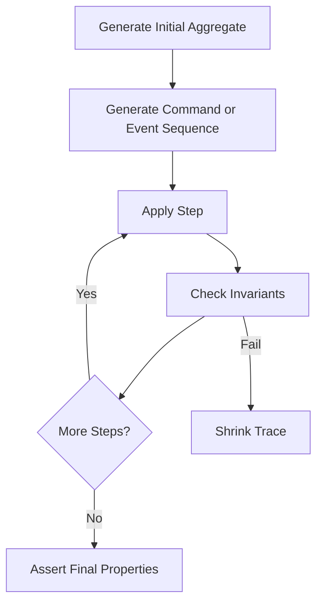
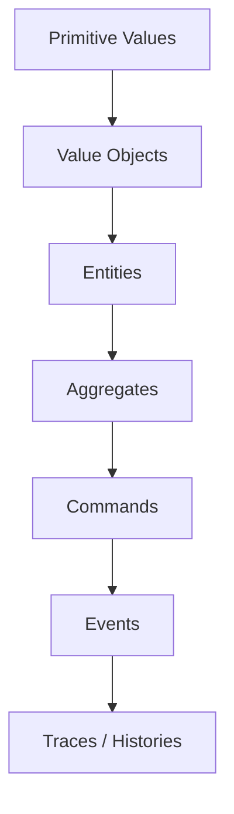
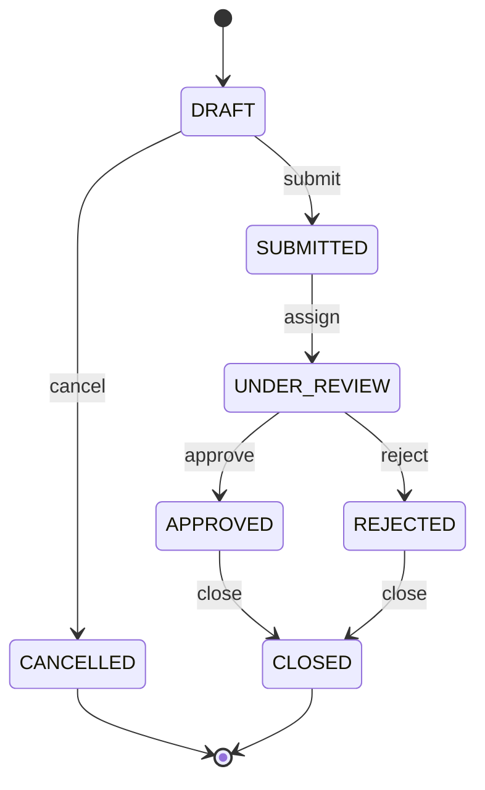
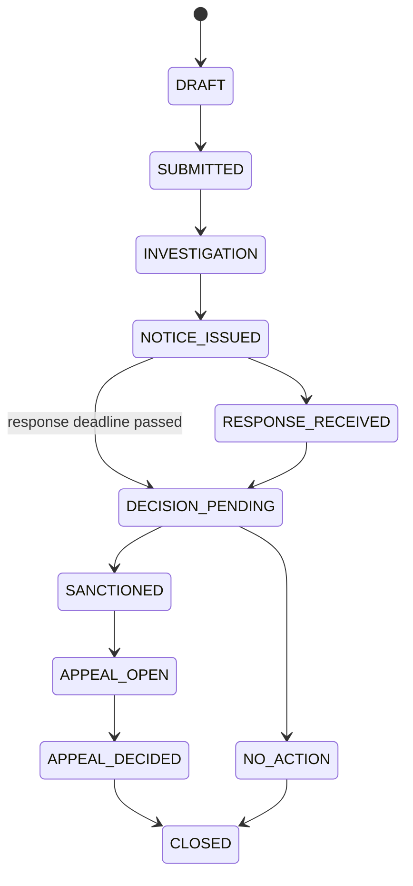
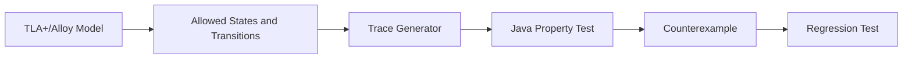

# Part 012 — Generative Testing for Domain Models

> Tujuan bagian ini: membawa property-based testing dari level value object dan fungsi murni ke domain model enterprise: aggregate, command, event, lifecycle, workflow, approval, escalation, idempotency, audit, dan cross-entity invariant.

Part sebelumnya membahas property-based testing sebagai teknik:

```text
property + generator + oracle
```

Bagian ini membahas masalah yang lebih nyata:

```text
Sistem tidak hanya menerima input.
Sistem berubah state.
Sistem memproses command.
Sistem menghasilkan event.
Sistem punya lifecycle.
Sistem punya invariant lintas entity.
Sistem harus benar setelah ratusan kombinasi aksi.
```

Example test untuk domain stateful sering terlihat seperti ini:

```java
@Test
void submittedCaseCanBeApproved() {
    EnforcementCase c = EnforcementCase.draft(...);

    c.submit(...);
    c.approve(...);

    assertThat(c.status()).isEqualTo(CaseStatus.APPROVED);
}
```

Test ini baik sebagai dokumentasi. Tapi production bug sering terjadi dalam urutan aneh:

```text
submit twice
cancel after submit
approve after reject
escalate after close
retry command with same id
receive event out of order
update stale version
apply compensation twice
change owner while approval pending
```

Generative testing untuk domain model mencoba menghasilkan urutan aksi dan mengecek invariant setelah tiap langkah.

Mental model:

```text
Do not only generate values.
Generate histories.
```

---

## 1. Domain Generative Testing in One Sentence

Generative testing untuk domain model adalah teknik untuk menghasilkan banyak object, command, event, dan trace workflow secara otomatis, lalu memeriksa bahwa domain invariant tetap benar setelah setiap operasi.



Perbedaannya dengan Part 011:

| Part 011 | Part 012 |
|---|---|
| generate value | generate aggregate/command/event/history |
| function property | state transition property |
| simple oracle | model-based oracle |
| one input/output | sequence of inputs/outputs |
| counterexample is value | counterexample is trace |

---

## 2. Why Domain Generators Are Hard

Generator primitive mudah.

```java
Arbitraries.integers().between(1, 100)
```

Generator domain sulit karena object valid punya constraints.

Contoh `EnforcementCase`:

```text
caseId required
subject required
jurisdiction required
status must match lifecycle
submittedAt exists only after submit
closedAt exists only after close
assignedOfficer required after assignment
sanction cannot exist before decision
appeal deadline depends on decision date
case cannot be closed while active appeal exists
```

Kalau generator membuat object random tanpa constraint, test menjadi noise.

Buruk:

```java
new EnforcementCase(
    randomId,
    randomStatus,
    randomSubmittedAt,
    randomClosedAt,
    randomDecision,
    randomAppeal
)
```

Object bisa invalid secara domain sebelum operation diuji. Test gagal bukan karena bug production code, tetapi karena generator menciptakan dunia mustahil.

Rule:

```text
A domain generator must generate possible worlds.
Not random field assignments.
```

---

## 3. The Domain Generator Pyramid

Susun generator berlapis.



### 3.1 Primitive Values

```java
static Arbitrary<String> safeAlphaNumeric(int min, int max) {
    return Arbitraries.strings()
        .withChars("abcdefghijklmnopqrstuvwxyz0123456789")
        .ofMinLength(min)
        .ofMaxLength(max);
}
```

### 3.2 Value Objects

```java
static Arbitrary<CaseId> caseIds() {
    return safeAlphaNumeric(8, 16).map(CaseId::new);
}
```

### 3.3 Entities

```java
static Arbitrary<Subject> subjects() {
    return Combinators.combine(
        safeAlphaNumeric(3, 20),
        Arbitraries.of(SubjectType.PERSON, SubjectType.COMPANY)
    ).as(Subject::new);
}
```

### 3.4 Aggregates

```java
static Arbitrary<EnforcementCase> draftCases() {
    return Combinators.combine(
        caseIds(),
        subjects(),
        jurisdictions()
    ).as((id, subject, jurisdiction) ->
        EnforcementCase.openDraft(id, subject, jurisdiction)
    );
}
```

### 3.5 Commands

```java
sealed interface CaseCommand permits SubmitCase, AssignOfficer, ApproveCase, RejectCase, CloseCase {}
```

### 3.6 Traces

```java
record CaseTrace(EnforcementCase initial, List<CaseCommand> commands) {}
```

Trace adalah input stateful.

---

## 4. Possible Worlds, Not Random Objects

Bayangkan domain lifecycle:



Generator aggregate harus menghormati lifecycle.

Jangan generate:

```text
status = DRAFT, submittedAt = 2026-07-02
status = CLOSED, closedAt = null
status = APPROVED, decision = null
status = CANCELLED, approvalEvent exists
```

Lebih baik generate melalui factory/transition method:

```java
static EnforcementCase submittedCase(...) {
    EnforcementCase c = EnforcementCase.openDraft(...);
    c.submit(...);
    return c;
}

static EnforcementCase underReviewCase(...) {
    EnforcementCase c = submittedCase(...);
    c.assign(...);
    return c;
}
```

Principle:

```text
Use domain operations to build states.
Do not bypass invariants through constructors.
```

Kalau test generator perlu constructor khusus, buat `TestDomainBuilder` yang tetap memanggil valid domain methods.

---

## 5. Aggregate Generator Pattern

Contoh aggregate order.

```java
record Order(
    OrderId id,
    String currency,
    List<OrderLine> lines,
    OrderStatus status,
    Instant submittedAt,
    int version
) {}
```

Generator draft order:

```java
final class OrderArbitraries {

    static Arbitrary<Order> draftOrders() {
        Arbitrary<String> currency = Arbitraries.of("IDR", "USD");

        return currency.flatMap(c ->
            Combinators.combine(
                orderIds(),
                orderLines(c).list().ofMinSize(1).ofMaxSize(20)
            ).as((id, lines) -> Order.draft(id, c, lines))
        );
    }

    static Arbitrary<OrderLine> orderLines(String currency) {
        return Combinators.combine(
            skus(),
            Arbitraries.integers().between(1, 100),
            money(currency)
        ).as(OrderLine::new);
    }
}
```

Perhatikan `currency.flatMap(...)`.

Ini penting agar semua line punya currency yang sama dengan order.

Bad generator:

```java
Combinators.combine(orderCurrency(), lineCurrency(), amount())
```

Bisa menghasilkan order USD dengan line IDR, kecuali domain memang mendukung multi-currency.

---

## 6. Valid vs Invalid Domain Generators

Kita butuh dua jenis generator:

```text
valid generator   = object yang harus diterima
invalid generator = object yang harus ditolak
```

Jangan campur.

### 6.1 Valid Generator

```java
@Provide
Arbitrary<Order> validDraftOrders() {
    return OrderArbitraries.draftOrders();
}
```

Property:

```java
@Property
void validDraftOrdersCanBePriced(@ForAll("validDraftOrders") Order order) {
    Money total = pricing.total(order);

    assertThat(total).isGreaterThanOrEqualTo(Money.zero(order.currency()));
}
```

### 6.2 Invalid Generator via Mutation

```java
@Property
void orderWithoutLinesIsRejected(@ForAll("validDraftOrders") Order valid) {
    Order invalid = valid.withLines(List.of());

    assertThatThrownBy(() -> pricing.total(invalid))
        .isInstanceOf(DomainValidationException.class)
        .hasMessageContaining("at least one line");
}
```

Pattern:

```text
generate valid base
mutate one invariant
assert exact rejection
```

Ini jauh lebih kuat daripada generate random invalid object yang punya 10 error sekaligus.

---

## 7. Command Generator Pattern

Untuk aggregate stateful, command generator harus sadar status.

Command:

```java
sealed interface CaseCommand {
    CommandId commandId();
}

record SubmitCase(CommandId commandId, OfficerId submittedBy, Instant submittedAt) implements CaseCommand {}
record AssignOfficer(CommandId commandId, OfficerId officerId) implements CaseCommand {}
record ApproveCase(CommandId commandId, OfficerId approvedBy, Instant decidedAt) implements CaseCommand {}
record RejectCase(CommandId commandId, OfficerId rejectedBy, String reason, Instant decidedAt) implements CaseCommand {}
record CloseCase(CommandId commandId, OfficerId closedBy, Instant closedAt) implements CaseCommand {}
```

Generator command by state:

```java
static Arbitrary<CaseCommand> validCommandFor(CaseStatus status) {
    return switch (status) {
        case DRAFT -> Arbitraries.oneOf(submitCommands(), cancelCommands());
        case SUBMITTED -> assignOfficerCommands();
        case UNDER_REVIEW -> Arbitraries.oneOf(approveCommands(), rejectCommands());
        case APPROVED, REJECTED -> closeCommands();
        case CANCELLED, CLOSED -> Arbitraries.of();
    };
}
```

Tapi property-based frameworks biasanya mengharapkan generator diketahui sebelum value runtime. Untuk state-dependent generation, kita bisa:

1. generate trace dari lifecycle grammar;
2. generate list command lalu filter/apply valid subset;
3. use action sequence/stateful testing support jika framework menyediakan;
4. build custom trace generator dengan finite state machine.

Untuk enterprise domain, custom trace generator sering lebih eksplisit dan maintainable.

---

## 8. Trace Generator as Lifecycle Grammar

Lifecycle grammar:

```text
DraftTrace := Cancel | Submit SubmittedTrace
SubmittedTrace := Assign ReviewTrace
ReviewTrace := Approve ClosedTrace | Reject ClosedTrace
ClosedTrace := Close | epsilon
```

Implementasi conceptual:

```java
static Arbitrary<List<CaseCommand>> validCaseTraces() {
    return Arbitraries.oneOf(
        cancelTrace(),
        submitAssignApproveCloseTrace(),
        submitAssignRejectCloseTrace(),
        submitAssignApproveTrace(),
        submitAssignRejectTrace()
    );
}
```

Ini tidak random-field. Ini random-path.

```java
static Arbitrary<List<CaseCommand>> submitAssignApproveCloseTrace() {
    return Combinators.combine(
        submitCommands(),
        assignOfficerCommands(),
        approveCommands(),
        closeCommands()
    ).as((submit, assign, approve, close) ->
        List.of(submit, assign, approve, close)
    );
}
```

Kelemahan: manual untuk lifecycle besar.

Kelebihan: mudah dibaca, mudah direview, shrinking trace lebih masuk akal.

---

## 9. Stateful Property: Apply Trace, Check Invariant

```java
@Property
void validCaseTraceAlwaysPreservesInvariants(
    @ForAll("draftCases") EnforcementCase initial,
    @ForAll("validCaseTraces") List<CaseCommand> commands
) {
    EnforcementCase c = initial;

    for (CaseCommand command : commands) {
        c = c.handle(command);

        assertCaseInvariants(c);
    }
}
```

Invariant assertion:

```java
private static void assertCaseInvariants(EnforcementCase c) {
    assertThat(c.id()).isNotNull();
    assertThat(c.subject()).isNotNull();

    switch (c.status()) {
        case DRAFT -> {
            assertThat(c.submittedAt()).isNull();
            assertThat(c.closedAt()).isNull();
            assertThat(c.decision()).isNull();
        }
        case SUBMITTED -> {
            assertThat(c.submittedAt()).isNotNull();
            assertThat(c.closedAt()).isNull();
        }
        case UNDER_REVIEW -> {
            assertThat(c.assignedOfficer()).isNotNull();
            assertThat(c.closedAt()).isNull();
        }
        case APPROVED, REJECTED -> {
            assertThat(c.decision()).isNotNull();
            assertThat(c.closedAt()).isNull();
        }
        case CLOSED -> {
            assertThat(c.closedAt()).isNotNull();
            assertThat(c.decision()).isNotNull();
        }
        case CANCELLED -> {
            assertThat(c.cancelledAt()).isNotNull();
        }
    }
}
```

Ini inti generative domain testing:

```text
Generate history.
Execute history.
Assert invariant after each step.
```

---

## 10. Testing Invalid Transitions

Valid traces penting. Invalid traces juga penting.

Kita ingin memastikan domain menolak illegal transition.

Contoh:

```java
@Property
void terminalCasesRejectAllMutatingCommands(
    @ForAll("terminalCases") EnforcementCase terminal,
    @ForAll("mutatingCommands") CaseCommand command
) {
    assertThatThrownBy(() -> terminal.handle(command))
        .isInstanceOf(IllegalStateTransitionException.class);
}
```

Generator terminal cases:

```java
static Arbitrary<EnforcementCase> terminalCases() {
    return Arbitraries.oneOf(
        closedCases(),
        cancelledCases()
    );
}
```

Invalid transition matrix:

| Current State | Invalid Command Examples |
|---|---|
| DRAFT | approve, reject, close |
| SUBMITTED | approve before assign, close |
| UNDER_REVIEW | submit again, cancel maybe invalid depending domain |
| APPROVED | submit, assign, approve again |
| REJECTED | submit, assign, reject again |
| CLOSED | any mutating command |
| CANCELLED | any mutating command |

Property:

```java
@Property
void invalidCommandsAreRejectedWithoutChangingState(
    @ForAll("caseAndInvalidCommand") CaseInvalidCommand sample
) {
    EnforcementCase before = sample.caseAggregate();
    CaseCommand invalid = sample.command();

    assertThatThrownBy(() -> before.handle(invalid))
        .isInstanceOf(IllegalStateTransitionException.class);

    assertThat(before).isEqualTo(sample.caseAggregate());
}
```

Important: for mutable aggregate, snapshot before state.

```java
EnforcementCase snapshot = before.copy();
```

Then compare after rejection.

---

## 11. Idempotency Properties

Enterprise systems retry. Duplicate command happens.

Idempotency property:

```text
Applying the same command twice with the same commandId must not duplicate effects.
```

Example:

```java
@Property
void duplicateSubmitCommandIsIdempotent(
    @ForAll("draftCases") EnforcementCase draft,
    @ForAll("submitCommands") SubmitCase submit
) {
    EnforcementCase once = draft.handle(submit);
    EnforcementCase twice = once.handle(submit);

    assertThat(twice.status()).isEqualTo(once.status());
    assertThat(twice.domainEvents())
        .filteredOn(e -> e instanceof CaseSubmitted)
        .hasSize(1);
}
```

But idempotency semantics must be explicit.

Ada beberapa pilihan:

| Duplicate Case | Possible Semantics |
|---|---|
| same command id, same payload | return same result, no new event |
| same command id, different payload | reject as conflict |
| different command id, same business payload | maybe duplicate, maybe semantic conflict |
| retry after timeout | resume or return known outcome |

Property untuk conflict:

```java
@Property
void sameCommandIdWithDifferentPayloadIsRejected(
    @ForAll("draftCases") EnforcementCase draft,
    @ForAll("submitCommands") SubmitCase submit,
    @ForAll("differentOfficerIds") OfficerId otherOfficer
) {
    SubmitCase conflicting = new SubmitCase(
        submit.commandId(),
        otherOfficer,
        submit.submittedAt()
    );

    EnforcementCase submitted = draft.handle(submit);

    assertThatThrownBy(() -> submitted.handle(conflicting))
        .isInstanceOf(IdempotencyConflictException.class);
}
```

---

## 12. Event Generation and Event-Sourced Domains

Jika domain event-sourced, aggregate dibangun dari event history.

```java
sealed interface CaseEvent {}
record CaseOpened(CaseId id, Subject subject, Jurisdiction jurisdiction) implements CaseEvent {}
record CaseSubmitted(CaseId id, OfficerId by, Instant at) implements CaseEvent {}
record OfficerAssigned(CaseId id, OfficerId officerId) implements CaseEvent {}
record CaseApproved(CaseId id, OfficerId by, Instant at) implements CaseEvent {}
record CaseClosed(CaseId id, OfficerId by, Instant at) implements CaseEvent {}
```

Property:

```java
@Property
void replayingGeneratedValidEventHistoryBuildsValidAggregate(
    @ForAll("validEventHistories") List<CaseEvent> history
) {
    EnforcementCase c = EnforcementCase.replay(history);

    assertCaseInvariants(c);
}
```

Roundtrip property:

```java
@Property
void commandGeneratedEventsCanBeReplayedToSameState(
    @ForAll("draftCases") EnforcementCase initial,
    @ForAll("validCaseTraces") List<CaseCommand> commands
) {
    EnforcementCase live = initial;
    List<CaseEvent> allEvents = new ArrayList<>();

    for (CaseCommand command : commands) {
        HandlingResult result = live.handle(command);
        live = result.newState();
        allEvents.addAll(result.events());
    }

    EnforcementCase replayed = EnforcementCase.replay(allEvents);

    assertThat(replayed).usingRecursiveComparison()
        .ignoringFields("transientRuntimeFields")
        .isEqualTo(live);
}
```

This catches:

```text
event missing field
apply method diverges from command handler
snapshot/replay mismatch
event order bug
version increment bug
```

---

## 13. Model-Based Oracle

Untuk stateful system, oracle paling kuat sering berupa model sederhana.

Production aggregate:

```text
rich entity, validation, audit, events, persistence concerns
```

Reference model:

```text
small immutable state machine with expected transitions
```

Model:

```java
record CaseModel(CaseStatus status, boolean hasAssignee, boolean hasDecision) {

    CaseModel apply(CaseCommand command) {
        return switch (status) {
            case DRAFT -> switch (command) {
                case SubmitCase ignored -> new CaseModel(CaseStatus.SUBMITTED, false, false);
                case CancelCase ignored -> new CaseModel(CaseStatus.CANCELLED, false, false);
                default -> throw new ModelInvalidTransition();
            };
            case SUBMITTED -> switch (command) {
                case AssignOfficer ignored -> new CaseModel(CaseStatus.UNDER_REVIEW, true, false);
                default -> throw new ModelInvalidTransition();
            };
            case UNDER_REVIEW -> switch (command) {
                case ApproveCase ignored -> new CaseModel(CaseStatus.APPROVED, true, true);
                case RejectCase ignored -> new CaseModel(CaseStatus.REJECTED, true, true);
                default -> throw new ModelInvalidTransition();
            };
            case APPROVED, REJECTED -> switch (command) {
                case CloseCase ignored -> new CaseModel(CaseStatus.CLOSED, hasAssignee, hasDecision);
                default -> throw new ModelInvalidTransition();
            };
            case CLOSED, CANCELLED -> throw new ModelInvalidTransition();
        };
    }
}
```

Property:

```java
@Property
void aggregateMatchesReferenceModel(
    @ForAll("validCaseTraces") List<CaseCommand> commands
) {
    EnforcementCase aggregate = EnforcementCase.openDraft(...);
    CaseModel model = new CaseModel(CaseStatus.DRAFT, false, false);

    for (CaseCommand command : commands) {
        aggregate = aggregate.handle(command);
        model = model.apply(command);

        assertThat(aggregate.status()).isEqualTo(model.status());
        assertThat(aggregate.assignedOfficer().isPresent()).isEqualTo(model.hasAssignee());
        assertThat(aggregate.decision().isPresent()).isEqualTo(model.hasDecision());
    }
}
```

This is powerful because model is simpler than implementation.

But model must not be a copy-paste of production logic.

---

## 14. Cross-Entity Invariants

Real systems rarely have one aggregate only.

Examples:

```text
A case cannot be closed if there is an active appeal.
A customer cannot have more active credit exposure than limit.
A quote cannot be ordered after expiry.
A payment cannot be captured above authorized amount.
A user cannot approve their own request.
An enforcement action cannot reference a deleted subject.
```

Cross-entity generator:

```java
record CaseWorld(
    EnforcementCase enforcementCase,
    List<Appeal> appeals,
    List<OfficerAssignment> assignments,
    List<Sanction> sanctions
) {}
```

World generator:

```java
static Arbitrary<CaseWorld> worldsWithActiveAppeal() {
    return Combinators.combine(
        casesWithDecision(),
        activeAppeals().list().ofMinSize(1).ofMaxSize(3),
        assignments(),
        sanctions()
    ).as(CaseWorld::new);
}
```

Property:

```java
@Property
void caseWithActiveAppealCannotBeClosed(
    @ForAll("worldsWithActiveAppeal") CaseWorld world,
    @ForAll("closeCommands") CloseCase close
) {
    CaseService service = serviceWith(world);

    assertThatThrownBy(() -> service.handle(world.enforcementCase().id(), close))
        .isInstanceOf(DomainPolicyViolation.class)
        .hasMessageContaining("active appeal");
}
```

This is beyond aggregate unit test.

Ini menguji policy-level invariant.

---

## 15. Temporal Domain Generators

Banyak domain rule bergantung waktu.

Examples:

```text
appeal must be submitted within 14 days after decision
quote expires after validUntil
SLA escalates after 2 business days
payment capture must happen before authorization expiry
case cannot be reopened after retention lock
```

Generator waktu harus eksplisit.

```java
static Arbitrary<Instant> instantsAround(Instant anchor) {
    return Arbitraries.longs().between(-20, 20)
        .map(days -> anchor.plus(Duration.ofDays(days)));
}
```

Boundary-focused generator:

```java
static Arbitrary<Instant> appealSubmissionTimes(Instant decisionAt) {
    return Arbitraries.of(
        decisionAt,
        decisionAt.plus(Duration.ofDays(13)),
        decisionAt.plus(Duration.ofDays(14)),
        decisionAt.plus(Duration.ofDays(15)),
        decisionAt.minus(Duration.ofSeconds(1))
    );
}
```

Property:

```java
@Property
void appealDeadlineBoundaryIsEnforced(
    @ForAll("decidedCases") EnforcementCase decided,
    @ForAll("appealSubmissionTimes") Instant submittedAt
) {
    boolean withinDeadline = !submittedAt.isAfter(decided.decisionAt().plus(Duration.ofDays(14)));

    if (withinDeadline) {
        assertThatCode(() -> decided.submitAppeal(submittedAt)).doesNotThrowAnyException();
    } else {
        assertThatThrownBy(() -> decided.submitAppeal(submittedAt))
            .isInstanceOf(AppealDeadlineExceeded.class);
    }
}
```

For business calendars, jangan pakai `Duration.ofDays` jika rule memakai working day.

Inject `BusinessCalendar`.

---

## 16. Regulatory Lifecycle Example

Domain:

```text
Case DRAFT
Case submitted
Case assigned
Finding created
Notice issued
Response received
Decision made
Sanction imposed
Appeal possible
Case closed
```

Simplified lifecycle:



Invariants:

```text
notice cannot be issued before investigation starts
response cannot be received before notice issued
decision cannot be made while response window open unless response received
sanction requires adverse decision
appeal exists only for sanction decision
case cannot close with unresolved appeal
all externally visible decisions must be audit logged
```

Trace property:

```java
@Property
void regulatoryLifecycleTracePreservesLegalInvariants(
    @ForAll("regulatoryTraces") RegulatoryTrace trace
) {
    RegulatoryCase c = RegulatoryCase.openDraft(trace.caseId(), trace.subject());

    for (RegulatoryCommand command : trace.commands()) {
        c = c.handle(command);
        assertLegalInvariants(c);
    }
}
```

Legal invariant assertion:

```java
private static void assertLegalInvariants(RegulatoryCase c) {
    if (c.status().isAfterOrEqual(RegulatoryStatus.NOTICE_ISSUED)) {
        assertThat(c.notice()).isPresent();
        assertThat(c.investigationStartedAt()).isPresent();
    }

    if (c.response().isPresent()) {
        assertThat(c.notice()).isPresent();
        assertThat(c.response().get().receivedAt())
            .isAfterOrEqualTo(c.notice().get().issuedAt());
    }

    if (c.sanction().isPresent()) {
        assertThat(c.decision()).isPresent();
        assertThat(c.decision().get().type()).isEqualTo(DecisionType.ADVERSE);
    }

    if (c.status() == RegulatoryStatus.CLOSED) {
        assertThat(c.appeals()).allMatch(Appeal::isResolved);
    }
}
```

This is the kind of testing that finds “legally impossible state” bugs.

---

## 17. Testing Escalation Logic

Escalation is state + time + policy.

Rule:

```text
If a submitted case remains unassigned for more than 2 business days, escalate to supervisor.
```

Generator:

```java
record EscalationScenario(
    EnforcementCase submittedCase,
    Instant now,
    boolean expectedEscalation
) {}
```

```java
static Arbitrary<EscalationScenario> escalationScenarios() {
    Instant submittedAt = Instant.parse("2026-07-01T00:00:00Z");

    return Arbitraries.of(
        new EscalationScenario(submittedCaseAt(submittedAt), submittedAt.plus(1, DAYS), false),
        new EscalationScenario(submittedCaseAt(submittedAt), submittedAt.plus(2, DAYS), false),
        new EscalationScenario(submittedCaseAt(submittedAt), submittedAt.plus(3, DAYS), true)
    );
}
```

Property:

```java
@Property
void escalationPolicyMatchesScenario(
    @ForAll("escalationScenarios") EscalationScenario scenario
) {
    EscalationDecision decision = policy.evaluate(
        scenario.submittedCase(),
        scenario.now()
    );

    assertThat(decision.shouldEscalate()).isEqualTo(scenario.expectedEscalation());
}
```

For richer testing, generate calendars with holidays and weekends.

---

## 18. Testing Approval Rules

Rule:

```text
Requester cannot approve own request.
Approval amount limit depends on approver role.
At least two approvals required for amount > threshold.
```

World:

```java
record ApprovalWorld(
    Request request,
    User requester,
    User approver,
    ApprovalPolicy policy
) {}
```

Property:

```java
@Property
void requesterCannotApproveOwnRequest(
    @ForAll("approvalWorldsWhereApproverIsRequester") ApprovalWorld world
) {
    assertThatThrownBy(() -> approvalService.approve(
        world.request().id(),
        world.approver().id()
    )).isInstanceOf(SelfApprovalNotAllowed.class);
}
```

Limit property:

```java
@Property
void approvalRequiresSufficientAuthority(
    @ForAll("approvalWorlds") ApprovalWorld world
) {
    boolean allowed = world.approver().limit().compareTo(world.request().amount()) >= 0
        && !world.approver().id().equals(world.requester().id());

    if (allowed) {
        assertThatCode(() -> approve(world)).doesNotThrowAnyException();
    } else {
        assertThatThrownBy(() -> approve(world)).isInstanceOf(ApprovalPolicyViolation.class);
    }
}
```

Again, avoid mirrored implementation. If policy comes from decision table, use the table as independent oracle.

---

## 19. Testing Event Ordering and Out-of-Order Delivery

Distributed systems receive events out of order.

Event handler property:

```text
For all valid event histories, if events are delivered with duplicates and permitted reorderings, projection remains eventually consistent.
```

Input:

```java
record DeliveryPlan(
    List<DomainEvent> original,
    List<DomainEvent> delivered
) {}
```

Generator:

```java
static Arbitrary<DeliveryPlan> deliveryPlans() {
    return validEventHistories().flatMap(history ->
        duplicateAndReorderWithinConstraints(history)
            .map(delivered -> new DeliveryPlan(history, delivered))
    );
}
```

Property:

```java
@Property
void projectionIsIdempotentUnderDuplicateDelivery(
    @ForAll("deliveryPlans") DeliveryPlan plan
) {
    Projection projection = new Projection();

    for (DomainEvent event : plan.delivered()) {
        projection.handle(event);
    }

    Projection expected = new Projection();
    for (DomainEvent event : plan.original()) {
        expected.handle(event);
    }

    assertThat(projection.snapshot()).isEqualTo(expected.snapshot());
}
```

This catches:

```text
handler not idempotent
duplicate event increments counters twice
stale event overwrites newer state
missing version guard
projection assumes perfect ordering
```

---

## 20. Testing Optimistic Locking and Versioning

For aggregate version:

```text
successful command increments version by 1
rejected command does not increment version
stale command is rejected
idempotent duplicate returns same version or no-op according to policy
```

Property:

```java
@Property
void successfulCommandIncrementsVersionByOne(
    @ForAll("caseWithValidNextCommand") CaseWithCommand sample
) {
    EnforcementCase before = sample.caseAggregate();
    int versionBefore = before.version();

    EnforcementCase after = before.handle(sample.command());

    assertThat(after.version()).isEqualTo(versionBefore + 1);
}
```

Rejected command property:

```java
@Property
void rejectedCommandDoesNotChangeVersion(
    @ForAll("caseWithInvalidCommand") CaseWithCommand sample
) {
    EnforcementCase before = sample.caseAggregate();
    int versionBefore = before.version();

    assertThatThrownBy(() -> before.handle(sample.command()))
        .isInstanceOf(DomainException.class);

    assertThat(before.version()).isEqualTo(versionBefore);
}
```

For immutable aggregate this is easier. For mutable aggregate, snapshot.

---

## 21. Recursive Generators for Nested Domain Models

Some domains are recursive:

```text
organizational hierarchy
approval delegation tree
product bundle
policy expression tree
query filter expression
workflow graph
```

Example policy expression:

```java
sealed interface PolicyExpr permits And, Or, Not, Condition {}
record And(PolicyExpr left, PolicyExpr right) implements PolicyExpr {}
record Or(PolicyExpr left, PolicyExpr right) implements PolicyExpr {}
record Not(PolicyExpr expr) implements PolicyExpr {}
record Condition(String field, Operator op, String value) implements PolicyExpr {}
```

Generator must bound depth.

Conceptual:

```java
static Arbitrary<PolicyExpr> policyExpressions(int depth) {
    if (depth == 0) {
        return conditions();
    }

    return Arbitraries.oneOf(
        conditions(),
        Combinators.combine(policyExpressions(depth - 1), policyExpressions(depth - 1)).as(And::new),
        Combinators.combine(policyExpressions(depth - 1), policyExpressions(depth - 1)).as(Or::new),
        policyExpressions(depth - 1).map(Not::new)
    );
}
```

Properties:

```java
@Property
void doubleNegationPreservesPolicyMeaning(@ForAll("policyExpressions") PolicyExpr expr,
                                          @ForAll("facts") Facts facts) {
    boolean original = evaluator.evaluate(expr, facts);
    boolean doubleNegated = evaluator.evaluate(new Not(new Not(expr)), facts);

    assertThat(doubleNegated).isEqualTo(original);
}
```

This is excellent for rule engines and policy DSLs.

---

## 22. Shrinking Domain Traces

When trace fails, raw failure can be huge:

```text
open -> submit -> assign -> add finding -> issue notice -> receive response -> update response -> decide -> sanction -> appeal -> update appeal -> close
```

Shrinking should reduce to:

```text
open -> issue notice
```

or:

```text
open -> submit -> assign -> close
```

Good trace design helps shrinker.

Tips:

```text
Keep commands immutable and small.
Avoid random unrelated fields.
Prefer lifecycle grammar over arbitrary object graph.
Use value objects with shrinkable primitives.
Keep max trace length bounded.
Avoid generator constraints that break shrinking.
```

A minimal trace is a better bug report than a page of random JSON.

---

## 23. Classification for Domain Traces

For trace tests, classify by path.

```java
@Property
void validTracePreservesInvariants(@ForAll("validTraces") CaseTrace trace) {
    Statistics.label("trace-path").collect(trace.pathName());
    Statistics.label("trace-length").collect(lengthBucket(trace.commands().size()));
    Statistics.label("terminal-state").collect(trace.expectedTerminalState());

    EnforcementCase c = trace.initial();
    for (CaseCommand command : trace.commands()) {
        c = c.handle(command);
        assertCaseInvariants(c);
    }
}
```

Classification categories:

```text
cancel path
approve path
reject path
appeal path
close path
retry path
duplicate command path
invalid transition path
boundary deadline path
```

If 95% traces are approve path, generator is biased.

Bias can be good if intentional. It is dangerous if accidental.

---

## 24. Domain Generator Governance

For large codebase, domain generators become shared infrastructure.

Recommended structure:

```text
src/testFixtures/java
  com.company.testing.domain
    MoneyArbitraries.java
    OrderArbitraries.java
    CaseArbitraries.java
    ApprovalArbitraries.java
    EventHistoryArbitraries.java
    DomainAssertions.java
```

Guidelines:

```text
Generators must be deterministic under seed.
Generators must be documented by domain intent.
Do not expose low-level random constructors everywhere.
Provide valid and invalid generators separately.
Keep edge cases visible.
Keep max sizes bounded.
Use builders for readability.
Review generators like production code.
```

Generator is not test boilerplate. It is executable domain model.

---

## 25. Handling Persistence in Generative Domain Tests

Pure aggregate property is fast.

Service-level property with DB is slower.

Pattern:

```java
@Property(tries = 25)
void commandHandlingPersistsSameStateAsPureModel(
    @ForAll("validCaseTraces") CaseTrace trace
) {
    CaseId id = repository.save(trace.initial());
    CaseModel model = CaseModel.initial();

    for (CaseCommand command : trace.commands()) {
        service.handle(id, command);
        model = model.apply(command);

        EnforcementCase loaded = repository.findById(id).orElseThrow();
        assertThat(loaded.status()).isEqualTo(model.status());
    }
}
```

Operational constraints:

```text
transaction rollback per property run
small tries
isolated database schema/container
unique IDs
no shared mutable static state
tag as integration/property
```

---

## 26. Generative Testing for APIs

API layer property:

```text
For all valid commands expressible through API payload,
HTTP handler maps payload to domain command correctly,
and response reflects domain result.
```

Example:

```java
@Property(tries = 50)
void submitCaseApiMatchesDomainBehavior(
    @ForAll("submitCaseRequests") SubmitCaseRequest request
) {
    HttpResponse response = api.post("/cases/{id}/submit", request);

    if (request.isValid()) {
        assertThat(response.status()).isEqualTo(200);
    } else {
        assertThat(response.status()).isEqualTo(400);
    }
}
```

Better with valid/invalid separated:

```java
@Property(tries = 50)
void validSubmitRequestsReturnOk(@ForAll("validSubmitRequests") SubmitCaseRequest request) {
    HttpResponse response = api.post(..., request);

    assertThat(response.status()).isEqualTo(200);
}

@Property(tries = 50)
void invalidSubmitRequestsReturnValidationError(@ForAll("invalidSubmitRequests") SubmitCaseRequest request) {
    HttpResponse response = api.post(..., request);

    assertThat(response.status()).isEqualTo(400);
    assertThat(response.body().errors()).isNotEmpty();
}
```

API property should not replace contract tests. It complements them.

---

## 27. Generative Testing for Event Consumers

Consumer property:

```text
For all valid event payloads,
consumer processes event idempotently,
updates projection consistently,
and records poison events without crashing worker.
```

Example:

```java
@Property(tries = 100)
void consumerIsIdempotentForDuplicateEvents(
    @ForAll("caseEvents") CaseEvent event
) {
    consumer.handle(event);
    ProjectionSnapshot once = projection.snapshotFor(event.caseId());

    consumer.handle(event);
    ProjectionSnapshot twice = projection.snapshotFor(event.caseId());

    assertThat(twice).isEqualTo(once);
}
```

Invalid payload property:

```java
@Property(tries = 50)
void malformedEventsGoToDeadLetterWithoutCrashing(
    @ForAll("malformedEventPayloads") byte[] payload
) {
    assertThatCode(() -> consumer.handleRaw(payload))
        .doesNotThrowAnyException();

    assertThat(deadLetterQueue).containsPayload(payload);
}
```

---

## 28. Testing Compensation and Saga-Like Behavior

Saga/domain process has sequence:

```text
reserve inventory
authorize payment
create shipment
capture payment
```

Failures create compensation.

Property:

```text
For all failure points, final world has no leaked reservation or unauthorized capture.
```

Model:

```java
record SagaScenario(Order order, FailurePoint failurePoint) {}
```

```java
@Property
void sagaDoesNotLeakResourcesOnFailure(
    @ForAll("sagaScenarios") SagaScenario scenario
) {
    TestWorld world = TestWorld.withFailureAt(scenario.failurePoint());

    saga.execute(scenario.order(), world);

    assertThat(world.inventory().hasLeakedReservation()).isFalse();
    assertThat(world.payment().hasCapturedWithoutShipment()).isFalse();
}
```

This catches real production incidents:

```text
reserved but never released
authorized but never voided
captured without downstream completion
compensation command emitted twice
retry creates duplicate shipment
```

---

## 29. Combining PBT with Mutation Testing

Generative domain tests can still be weak.

Mutation testing helps answer:

```text
If someone breaks this rule, does the property fail?
```

Example mutant:

```java
// original
if (riskScore <= 30) allow();

// mutant
if (riskScore < 30) allow();
```

A good generator should include boundary 30.

If mutation survives, either:

```text
generator missed boundary
property assertion weak
oracle duplicated mutant behavior
test did not reach rule
```

This is why Part 013 follows immediately after PBT/generative testing.

---

## 30. Combining Generative Testing with Formal Models

Formal model can define valid traces.

Flow:



Practical approach:

```text
Use TLA+/Alloy to discover impossible states.
Encode discovered invariants into Java property assertions.
Encode allowed transition traces into generators.
Use Java PBT for implementation-level verification.
```

Formal model checks design. Generative test checks implementation.

---

## 31. Case Study: Approval Workflow

Domain:

```text
Request starts DRAFT.
Requester submits request.
Approver can approve if not requester and within limit.
Large requests need two distinct approvals.
Rejected request becomes terminal.
Approved request can be executed once.
```

Commands:

```java
sealed interface RequestCommand {}
record Submit(UserId requester) implements RequestCommand {}
record Approve(UserId approver) implements RequestCommand {}
record Reject(UserId approver, String reason) implements RequestCommand {}
record Execute() implements RequestCommand {}
```

Invariant:

```text
executed implies approved
approved large request has at least two distinct approvers
requester not in approvers
terminal request cannot mutate
```

Property:

```java
@Property
void approvalWorkflowPreservesInvariants(
    @ForAll("approvalTraces") ApprovalTrace trace
) {
    ApprovalRequest request = trace.initial();

    for (RequestCommand command : trace.commands()) {
        try {
            request = request.handle(command);
        } catch (DomainException expectedForInvalidCommand) {
            // invalid trace variant: rejection must not corrupt state
        }

        assertApprovalInvariants(request);
    }
}
```

Invariant assertion:

```java
private static void assertApprovalInvariants(ApprovalRequest request) {
    if (request.status() == RequestStatus.EXECUTED) {
        assertThat(request.statusHistory()).contains(RequestStatus.APPROVED);
    }

    if (request.amount().isGreaterThan(request.policy().largeRequestThreshold())
        && request.status().isAtLeast(RequestStatus.APPROVED)) {
        assertThat(request.approvers()).hasSizeGreaterThanOrEqualTo(2);
    }

    assertThat(request.approvers()).doesNotContain(request.requester());

    if (request.status().isTerminal()) {
        assertThat(request.openTasks()).isEmpty();
    }
}
```

---

## 32. Case Study: Pricing Rule Matrix

Pricing domain has combinatorial explosion:

```text
customer tier
region
currency
product family
quantity bracket
voucher
promotion
tax
rounding mode
contract override
```

Generator should produce scenario, not random fields.

```java
record PricingScenario(
    Customer customer,
    Product product,
    int quantity,
    Optional<Voucher> voucher,
    Region region,
    PricingExpectation expectation
) {}
```

Properties:

```java
@Property
void totalIsNeverNegative(@ForAll("pricingScenarios") PricingScenario scenario) {
    Price price = pricing.price(scenario);

    assertThat(price.total()).isGreaterThanOrEqualTo(Money.zero(price.currency()));
}

@Property
void higherQuantityDoesNotIncreaseUnitPriceWhenVolumeDiscountApplies(
    @ForAll("volumeDiscountScenarios") PricingScenario scenario,
    @ForAll @IntRange(min = 1, max = 1000) int extraQuantity
) {
    PricingScenario higher = scenario.withQuantity(scenario.quantity() + extraQuantity);

    Price original = pricing.price(scenario);
    Price increased = pricing.price(higher);

    assertThat(increased.unitPrice()).isLessThanOrEqualTo(original.unitPrice());
}
```

This is metamorphic domain testing.

---

## 33. Case Study: Order Management Idempotency

Commands:

```text
place order
reserve stock
authorize payment
confirm order
cancel order
ship order
```

Properties:

```text
duplicate place order with same idempotency key creates one order
cancel after ship is rejected
payment capture never exceeds authorized amount
shipment cannot exist before confirmation
stock reservation released when order cancelled before shipment
```

Property example:

```java
@Property
void duplicatePlaceOrderCreatesSingleOrder(
    @ForAll("placeOrderCommands") PlaceOrder command
) {
    OrderResult first = service.place(command);
    OrderResult second = service.place(command);

    assertThat(second.orderId()).isEqualTo(first.orderId());
    assertThat(orderRepository.countByIdempotencyKey(command.idempotencyKey())).isEqualTo(1);
    assertThat(eventStore.eventsFor(first.orderId()))
        .filteredOn(e -> e instanceof OrderPlaced)
        .hasSize(1);
}
```

This property catches duplicate side-effect bugs.

---

## 34. Practical Generator Implementation Style

Avoid giant `@Provide` methods.

Bad:

```java
@Provide
Arbitrary<Order> orders() {
    // 150 lines of nested generator code
}
```

Better:

```java
public final class OrderArbitraries {

    public static Arbitrary<Order> draftOrders() { ... }

    public static Arbitrary<Order> submittedOrders() { ... }

    public static Arbitrary<OrderLine> lines(String currency) { ... }

    public static Arbitrary<PlaceOrder> placeOrderCommands() { ... }

    public static Arbitrary<OrderTrace> validOrderTraces() { ... }
}
```

Use domain language:

```java
validSubmittedCases()
casesWithActiveAppeal()
ordersEligibleForCancellation()
expiredQuotes()
paymentsAuthorizedButNotCaptured()
largeRequestsNeedingTwoApprovals()
```

Names matter because generator is executable documentation.

---

## 35. Anti-Patterns in Domain Generative Testing

### 35.1 Random Constructor Abuse

```java
new Case(randomStatus, randomDecision, randomDates)
```

Creates impossible states.

### 35.2 Testing Implementation Against Itself

Reference model copies production transition logic exactly.

### 35.3 No Invariant Assertion After Each Step

Only asserting final state misses transient corruption.

### 35.4 Too Large Object Graphs

Generator creates huge worlds, shrinking becomes useless.

### 35.5 Invalid and Valid Paths Mixed Without Intent

Test failure becomes ambiguous.

### 35.6 No Boundary Events

Deadline tests without exact boundary dates are weak.

### 35.7 State Hidden in External Services

If service uses real clock, random UUID, shared DB, or async queue without seam, trace reproducibility breaks.

---

## 36. Review Checklist

Before merging domain generative tests:

```text
[ ] Generator creates possible domain worlds.
[ ] Valid and invalid generators are separated.
[ ] Aggregates are built through domain operations where possible.
[ ] Trace length is bounded.
[ ] Trace paths are classified.
[ ] Invariants are checked after every step.
[ ] Oracle is independent enough from production logic.
[ ] Idempotency/retry behavior is explicit.
[ ] Temporal boundaries are included.
[ ] Cross-entity invariants are tested at service/world level.
[ ] Persistence tests are isolated and tagged.
[ ] Failing traces shrink to readable counterexamples.
```

---

## 37. How This Connects to Part 013

Part 011 and 012 help us generate strong tests.

Next question:

```text
Are those tests actually strong?
```

Mutation testing answers that by intentionally changing production code and checking whether tests detect it.

If a mutation survives, it tells us:

```text
property too weak
generator missed important input
oracle not independent
path not exercised
assertion not specific
```

That is why Part 013 is mutation testing with PIT.

---

## 38. References

- jqwik User Guide: https://jqwik.net/docs/current/user-guide.html
- jqwik stateful testing article by Johannes Link: https://blog.johanneslink.net/2018/09/06/stateful-testing/
- JUnit Platform User Guide: https://docs.junit.org/current/user-guide/
- Property-based testing concepts, QuickCheck lineage: https://dl.acm.org/doi/10.1145/1988042.1988046

---

## 39. Summary

Generative testing untuk domain model adalah tentang history, bukan hanya value.

Core skill:

```text
Generate possible worlds.
Generate meaningful traces.
Apply commands/events.
Check invariants after every step.
Compare against a simpler model where possible.
Shrink failure into readable story.
```

PBT level dasar menemukan input buruk.

Domain generative testing menemukan cerita buruk:

```text
open -> submit -> assign -> close while appeal active
place order -> duplicate retry -> duplicate event
approve -> stale reject -> overwritten decision
issue notice -> decision before response deadline
```

Itu jenis bug yang sering mahal di production.

Kalau kamu ingin naik level sebagai engineer, belajar menulis generator domain adalah salah satu leverage terbesar. Ia memaksa kita memahami domain, state, invariant, policy, dan failure model secara presisi.
