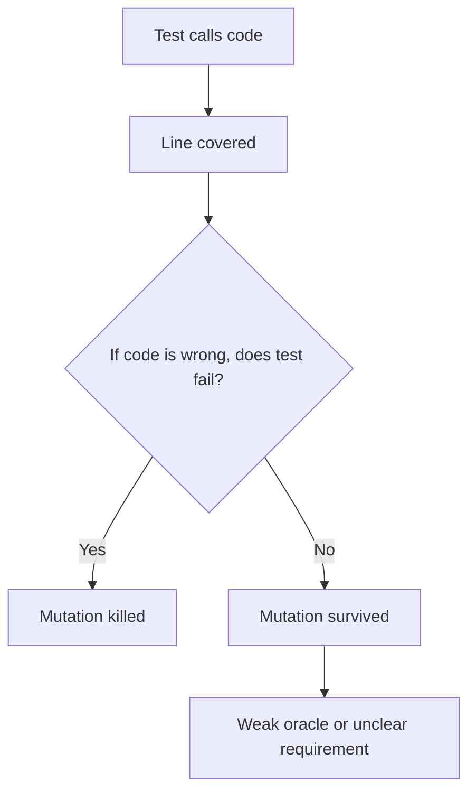
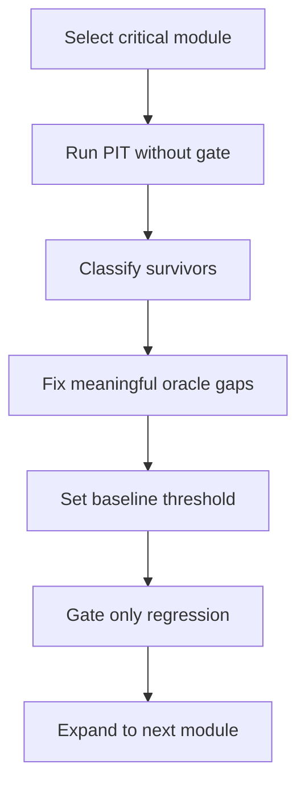
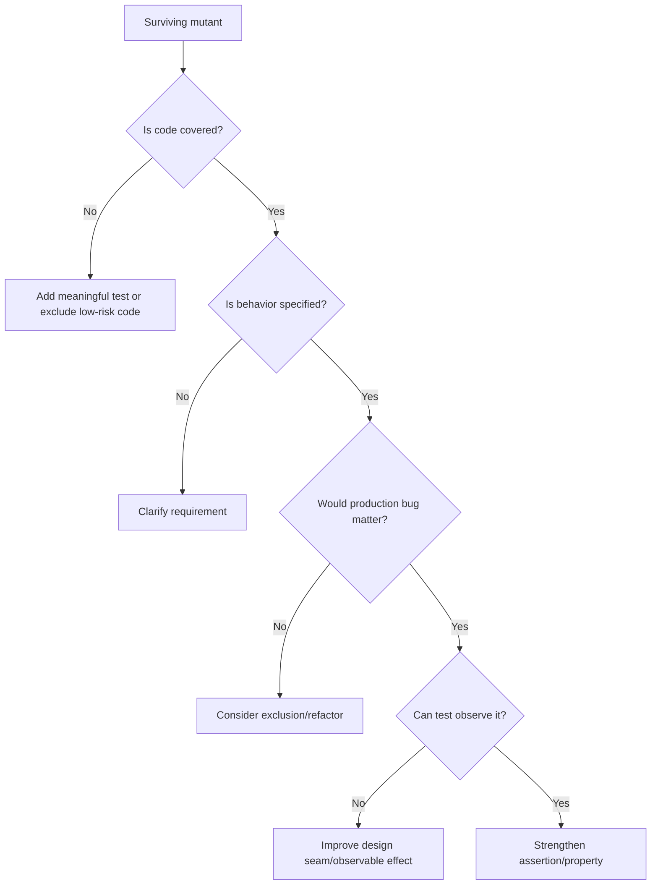
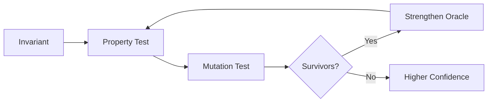

# Part 013 — Mutation Testing with PIT

> Tujuan bagian ini: memahami mutation testing bukan sebagai angka tambahan di report CI, tetapi sebagai teknik untuk mengevaluasi apakah test benar-benar punya **oracle** yang kuat.

Coverage menjawab pertanyaan:

```text
Apakah baris kode ini dieksekusi oleh test?
```

Mutation testing menjawab pertanyaan yang lebih keras:

```text
Jika perilaku kode ini sedikit salah, apakah test akan mengetahuinya?
```

Itulah bedanya **test execution** dan **test detection**.

Banyak tim berhenti di branch coverage 80% atau 90%. Masalahnya: coverage tinggi bisa tetap memiliki test yang tidak mengecek behavior penting. Test mungkin hanya memanggil method, tidak memverifikasi output, tidak mengecek side effect, atau hanya memastikan tidak ada exception.

Mutation testing memaksa test suite untuk membuktikan bahwa ia punya kemampuan mendeteksi bug kecil yang sengaja disisipkan.

Mental model:

```text
production code + injected fault + existing tests = test oracle audit
```

Jika fault membuat test gagal, test suite menangkap fault itu.
Jika fault tidak membuat test gagal, test suite punya lubang.

---

## 1. Apa Itu Mutation Testing?

Mutation testing menjalankan eksperimen terkontrol:

1. Ambil bytecode/source production.
2. Buat variasi kecil yang salah, disebut **mutant**.
3. Jalankan test terhadap mutant tersebut.
4. Lihat apakah test gagal.
5. Hitung mutant yang berhasil dideteksi.

Contoh production code:

```java
public boolean canApprove(CaseRecord record) {
    return record.status() == CaseStatus.SUBMITTED
        && record.assignee() != null
        && record.riskScore() < 80;
}
```

Mutation tool dapat mengubah:

```java
record.riskScore() < 80
```

menjadi:

```java
record.riskScore() <= 80
```

atau:

```java
record.riskScore() >= 80
```

atau bahkan menghapus satu condition.

Jika test tetap hijau setelah perubahan ini, berarti test belum cukup mengunci boundary atau rule yang penting.

---

## 2. Istilah Penting

Mutation testing punya kosakata sendiri.

| Istilah | Makna | Interpretasi Engineering |
|---|---|---|
| Mutant | Versi kode yang diubah secara sengaja | Simulasi bug kecil |
| Mutator | Rule yang menghasilkan mutant | Misalnya ubah `<` menjadi `<=` |
| Killed | Test gagal saat mutant dijalankan | Test mendeteksi fault |
| Survived | Test tetap pass | Oracle test lemah atau behavior tidak penting |
| No coverage | Tidak ada test yang menyentuh mutant | Gap coverage langsung |
| Timed out | Mutant membuat test hang/terlalu lama | Bisa valid bug, bisa test design buruk |
| Non-viable | Mutant tidak bisa dijalankan | Biasanya tidak menjadi signal behavior |
| Equivalent mutant | Mutant berbeda secara sintaks tetapi behavior efektif sama | Tidak realistis untuk dibunuh |

Rumus sederhana mutation score:

```text
mutation score = killed mutants / valid generated mutants
```

Tetapi angka ini bukan tujuan utama.

Tujuan utamanya:

```text
Surviving mutants expose weak assertions, missing boundaries, untested side effects, or unclear specifications.
```

---

## 3. Kenapa Coverage Saja Tidak Cukup

Contoh kode:

```java
public final class FeeCalculator {
    public Money calculateFee(Money principal, CustomerTier tier) {
        if (tier == CustomerTier.PREMIUM) {
            return principal.multiply("0.01");
        }
        return principal.multiply("0.03");
    }
}
```

Test lemah:

```java
@Test
void calculatesFee() {
    FeeCalculator calculator = new FeeCalculator();

    Money fee = calculator.calculateFee(Money.of("1000.00"), CustomerTier.PREMIUM);

    assertThat(fee).isNotNull();
}
```

Coverage menyatakan method dieksekusi. Bahkan branch premium tersentuh.

Tetapi mutant berikut akan survive:

```java
return principal.multiply("0.02");
```

Karena test hanya mengecek `not null`.

Test yang lebih kuat:

```java
@Test
void premiumCustomerPaysOnePercentFee() {
    FeeCalculator calculator = new FeeCalculator();

    Money fee = calculator.calculateFee(Money.of("1000.00"), CustomerTier.PREMIUM);

    assertThat(fee).isEqualTo(Money.of("10.00"));
}
```

Coverage mengukur **execution**.
Mutation mengukur **sensitivity**.



---

## 4. Mutation Testing dalam Verification Ladder

Dalam seri ini, mutation testing berada di antara example-based tests dan generative/formal techniques.

```text
example-based tests answer: do known examples work?
property tests answer: do classes of behavior hold?
mutation tests answer: are our tests able to detect plausible faults?
formal models answer: did we specify the state space correctly?
```

Mutation testing tidak menggantikan property-based testing.
Mutation testing menguji test suite.

Cara berpikirnya:

```text
Unit test memeriksa production code.
Mutation test memeriksa unit test.
```

Karena itu mutation testing sangat cocok setelah tim sudah punya:

- domain tests,
- property tests,
- integration tests penting,
- dan business invariants yang jelas.

Jika requirement belum jelas, mutation report akan menjadi noise.

---

## 5. PIT: Mutation Testing Praktis untuk Java/JVM

PIT atau PITest adalah mutation testing system untuk Java/JVM. PIT bekerja di level bytecode, sehingga relatif praktis untuk project Java modern.

Dalam workflow Maven/JUnit 5, biasanya ada tiga elemen:

1. `pitest-maven` plugin.
2. `pitest-junit5-plugin` agar PIT bisa menjalankan test berbasis JUnit Platform/Jupiter.
3. Konfigurasi target classes dan target tests.

Contoh konfigurasi minimal:

```xml
<plugin>
    <groupId>org.pitest</groupId>
    <artifactId>pitest-maven</artifactId>
    <version>${pitest.version}</version>
    <dependencies>
        <dependency>
            <groupId>org.pitest</groupId>
            <artifactId>pitest-junit5-plugin</artifactId>
            <version>${pitest.junit5.plugin.version}</version>
        </dependency>
    </dependencies>
    <configuration>
        <targetClasses>
            <param>com.acme.casework.domain.*</param>
            <param>com.acme.casework.application.*</param>
        </targetClasses>
        <targetTests>
            <param>com.acme.casework.*Test</param>
            <param>com.acme.casework.*Tests</param>
        </targetTests>
        <mutationThreshold>75</mutationThreshold>
        <coverageThreshold>80</coverageThreshold>
        <timestampedReports>false</timestampedReports>
        <outputFormats>
            <param>HTML</param>
            <param>XML</param>
        </outputFormats>
    </configuration>
</plugin>
```

Jalankan:

```bash
mvn test-compile org.pitest:pitest-maven:mutationCoverage
```

Untuk multi-module project, jangan langsung menjalankan seluruh monorepo tanpa strategi. Mulai dari module domain paling penting.

---

## 6. Jangan Mulai dari Seluruh Codebase

Mutation testing mahal dibanding unit test biasa. Tool harus menjalankan test berkali-kali terhadap banyak mutant.

Mulai dari area dengan high business risk:

```text
pricing
eligibility
approval rules
settlement logic
financial rounding
authorization policy
regulatory workflow
state transition
idempotency
compensation
```

Jangan mulai dari:

```text
DTO getter/setter
generated code
configuration binding
framework bootstrap
simple mapping with no decision logic
logging wrappers
```

Rule praktis:

```text
Mutate code where a one-line bug matters.
```

---

## 7. Apa yang Dimutasi?

Mutation operator merepresentasikan fault kecil.

Contoh umum:

### 7.1 Conditional Boundary Mutation

Production:

```java
return amount.compareTo(limit) < 0;
```

Mutant:

```java
return amount.compareTo(limit) <= 0;
```

Signal:

```text
Boundary value belum diuji.
```

Test yang seharusnya ada:

```java
@Test
void amountEqualToLimitIsNotBelowLimit() {
    assertThat(policy.isBelowLimit(Money.of("100.00"), Money.of("100.00")))
        .isFalse();
}
```

### 7.2 Negated Conditional Mutation

Production:

```java
if (caseRecord.isClosed()) {
    throw new CaseAlreadyClosedException(caseRecord.id());
}
```

Mutant:

```java
if (!caseRecord.isClosed()) {
    throw new CaseAlreadyClosedException(caseRecord.id());
}
```

Signal:

```text
Test tidak cukup mengecek valid path dan invalid path.
```

### 7.3 Math Operator Mutation

Production:

```java
return principal.add(tax).subtract(discount);
```

Mutant:

```java
return principal.add(tax).add(discount);
```

Signal:

```text
Formula tidak dikunci dengan expected value yang bermakna.
```

### 7.4 Return Value Mutation

Production:

```java
return ValidationResult.valid();
```

Mutant:

```java
return ValidationResult.invalid(...);
```

Signal:

```text
Caller mungkin tidak mengecek semantic result.
```

### 7.5 Void Method Call Removal

Production:

```java
auditTrail.record(event);
```

Mutant:

```java
// removed
```

Signal:

```text
Side effect penting tidak diverifikasi.
```

Dalam enterprise system, void call removal sering sangat bernilai karena audit, event publication, notification, cache invalidation, dan persistence side effect sering menjadi sumber bug.

---

## 8. Case Study: Approval Policy

Misalkan kita punya domain policy:

```java
public final class ApprovalPolicy {
    public Decision evaluate(EnforcementCase c, Officer officer) {
        if (c.status() != CaseStatus.SUBMITTED) {
            return Decision.reject("case_not_submitted");
        }
        if (!officer.hasPermission(Permission.APPROVE_CASE)) {
            return Decision.reject("officer_not_authorized");
        }
        if (c.riskScore() >= 90 && !officer.hasPermission(Permission.APPROVE_HIGH_RISK_CASE)) {
            return Decision.reject("high_risk_requires_senior_approval");
        }
        return Decision.approve();
    }
}
```

Test awal:

```java
@Test
void submittedCaseCanBeApprovedByAuthorizedOfficer() {
    EnforcementCase c = CaseFixture.submitted().withRiskScore(40).build();
    Officer officer = OfficerFixture.withPermission(Permission.APPROVE_CASE);

    Decision decision = policy.evaluate(c, officer);

    assertThat(decision.isApproved()).isTrue();
}
```

Test ini hanya membuktikan happy path. PIT akan menghasilkan banyak surviving mutants:

```text
c.status() != SUBMITTED        -> c.status() == SUBMITTED
!officer.hasPermission(...)    -> officer.hasPermission(...)
c.riskScore() >= 90            -> c.riskScore() > 90
return reject(...)             -> return approve()
```

Test suite yang lebih defensible:

```java
@Test
void draftCaseCannotBeApproved() {
    EnforcementCase c = CaseFixture.draft().build();
    Officer officer = OfficerFixture.withPermission(Permission.APPROVE_CASE);

    Decision decision = policy.evaluate(c, officer);

    assertThat(decision).isRejectedWithReason("case_not_submitted");
}

@Test
void officerWithoutApprovalPermissionCannotApprove() {
    EnforcementCase c = CaseFixture.submitted().withRiskScore(40).build();
    Officer officer = OfficerFixture.withoutPermissions();

    Decision decision = policy.evaluate(c, officer);

    assertThat(decision).isRejectedWithReason("officer_not_authorized");
}

@Test
void highRiskCaseRequiresSeniorApprovalAtBoundary() {
    EnforcementCase c = CaseFixture.submitted().withRiskScore(90).build();
    Officer officer = OfficerFixture.withPermission(Permission.APPROVE_CASE);

    Decision decision = policy.evaluate(c, officer);

    assertThat(decision).isRejectedWithReason("high_risk_requires_senior_approval");
}

@Test
void highRiskCaseCanBeApprovedBySeniorOfficer() {
    EnforcementCase c = CaseFixture.submitted().withRiskScore(90).build();
    Officer officer = OfficerFixture.withPermissions(
        Permission.APPROVE_CASE,
        Permission.APPROVE_HIGH_RISK_CASE
    );

    Decision decision = policy.evaluate(c, officer);

    assertThat(decision).isApproved();
}
```

Notice yang berubah:

```text
Kita tidak hanya menambah test.
Kita memperjelas specification.
```

Mutation testing sering memperlihatkan bahwa requirement belum diekspresikan sebagai test.

---

## 9. Mutation Testing adalah Oracle Audit

Surviving mutant dapat berarti beberapa hal:

```text
1. Test tidak menjalankan kode itu.
2. Test menjalankan kode itu tetapi assertion lemah.
3. Requirement tidak jelas.
4. Kode tidak punya behavior observable.
5. Mutant equivalent.
6. Kode memang tidak penting untuk diuji.
```

Jangan langsung menambah assertion secara mekanis. Tanyakan:

```text
Apa observable contract dari behavior ini?
Jika bug ini terjadi di production, siapa yang terdampak?
Apa invariant yang harus gagal?
Apakah behavior ini seharusnya publik, internal, atau implementation detail?
Apakah mutant memperlihatkan desain yang terlalu tersembunyi?
```

Contoh assertion buruk yang hanya mengejar score:

```java
verify(repository).save(any());
```

Assertion lebih baik:

```java
ArgumentCaptor<CaseRecord> saved = ArgumentCaptor.forClass(CaseRecord.class);
verify(repository).save(saved.capture());

assertThat(saved.getValue())
    .hasStatus(CaseStatus.APPROVED)
    .hasDecisionReason("approved_by_senior_officer")
    .hasAuditEvent("case.approved");
```

Mutation score naik bukan karena test lebih banyak, tetapi karena oracle lebih bermakna.

---

## 10. Equivalent Mutants

Equivalent mutant adalah mutant yang secara sintaks berubah, tetapi secara behavior tidak dapat dibedakan oleh test mana pun karena behavior-nya sama.

Contoh:

```java
public int clampPositive(int value) {
    if (value < 0) {
        return 0;
    }
    return Math.max(value, 0);
}
```

Mutasi tertentu mungkin tidak mengubah output karena logic redundant.

Atau:

```java
if (items.size() > 0) {
    return true;
}
return false;
```

Mutant menjadi:

```java
if (items.size() >= 1) {
    return true;
}
return false;
```

Untuk `size()` integer non-negative, `> 0` dan `>= 1` equivalent.

Strategi menghadapi equivalent mutants:

1. Jangan mengejar 100% mutation score secara dogmatis.
2. Dokumentasikan known equivalent mutants jika relevan.
3. Refactor kode redundant bila equivalent mutant menunjukkan expression yang membingungkan.
4. Exclude area yang memang tidak valuable.
5. Gunakan threshold realistis per module.

Rule:

```text
Surviving mutant is a conversation starter, not always a defect.
```

---

## 11. Mutation Score Bukan KPI Mutlak

Mutation score mudah disalahgunakan.

Anti-pattern:

```text
Setiap module wajib 95% mutation score.
Engineer menulis assertion rapuh hanya untuk membunuh mutant.
CI menjadi lambat.
Tim mulai exclude banyak code.
Score terlihat bagus tetapi kualitas tidak naik.
```

Lebih baik:

```text
High-risk pure domain logic: 80-95%
Medium-risk application service: 60-80%
Infrastructure adapter: selective mutation
Generated/boilerplate code: excluded
Legacy code: baseline + improvement trend
```

Gunakan mutation testing untuk:

- menemukan weak assertions,
- menemukan missing negative paths,
- menemukan boundary gaps,
- memvalidasi property tests,
- memperkuat critical modules,
- mengevaluasi testing strategy.

Jangan gunakan mutation score untuk:

- ranking individual engineer,
- vanity dashboard,
- memaksa semua code sama,
- menggantikan review requirement,
- menggantikan observability production.

---

## 12. Membaca PIT Report

PIT report biasanya menunjukkan:

```text
class
line
mutator
status
covering tests
killing tests
```

Cara membaca report:

### Step 1 — Lihat `No Coverage`

Ini gap paling jelas.

```text
Tidak ada test yang menyentuh logic tersebut.
```

Pertanyaan:

```text
Apakah logic itu penting?
Jika ya, test level mana yang seharusnya menutupnya?
```

### Step 2 — Lihat `Survived`

Ini gap oracle.

```text
Kode tersentuh, tetapi salahnya tidak terdeteksi.
```

Pertanyaan:

```text
Apakah assertion terlalu lemah?
Apakah negative path hilang?
Apakah boundary hilang?
Apakah side effect tidak diverifikasi?
```

### Step 3 — Lihat `Timed Out`

Ini butuh hati-hati.

Bisa berarti:

- mutant menciptakan infinite loop,
- timeout test terlalu agresif,
- test terlalu lambat,
- concurrency test nondeterministic,
- external dependency ikut dipanggil.

### Step 4 — Lihat Cluster, Bukan Satu Mutant

Satu surviving mutant bisa noise. Cluster surviving mutants di area yang sama adalah signal desain/test yang kuat.

```text
Banyak survivor di policy class -> oracle policy lemah.
Banyak survivor di mapper -> mapper mungkin tidak critical atau assertion mapping lemah.
Banyak survivor di exception branch -> negative-path testing buruk.
Banyak survivor di event publisher -> side effect tidak diuji.
```

---

## 13. Mutation Testing untuk Property-Based Tests

Property-based tests biasanya membunuh lebih banyak mutant daripada example-based tests karena input space lebih luas.

Contoh property:

```java
@Property
void approvedCaseIsAlwaysTerminal(@ForAll("approvableCases") EnforcementCase c) {
    EnforcementCase approved = c.approve(OfficerFixture.senior());

    assertThat(approved.status()).isEqualTo(CaseStatus.APPROVED);
    assertThat(approved.isTerminal()).isTrue();
    assertThat(approved.allowedCommands()).doesNotContain(Command.APPROVE, Command.REJECT);
}
```

Mutation testing membantu mengecek apakah property terlalu dangkal.

Property dangkal:

```java
assertThat(result).isNotNull();
```

Property kuat:

```java
assertThat(result.total())
    .isEqualTo(result.lines().stream()
        .map(LineAmount::amount)
        .reduce(Money.zero(currency), Money::add));
```

Mutation testing + property testing punya hubungan bagus:

```text
property-based testing explores input/history space.
mutation testing evaluates whether the property oracle catches faults.
```

---

## 14. Mutation Testing untuk State Machine

State machine domain biasanya punya banyak hidden transitions.

Contoh rule:

```text
DRAFT -> SUBMITTED -> UNDER_REVIEW -> APPROVED -> CLOSED
DRAFT -> CANCELLED
SUBMITTED -> WITHDRAWN
UNDER_REVIEW -> REJECTED
```

Mutation testing akan menemukan test yang hanya mengecek valid path tetapi tidak invalid path.

Contoh:

```java
public EnforcementCase approve(Officer officer) {
    if (status != CaseStatus.UNDER_REVIEW) {
        throw new InvalidTransitionException(status, CaseStatus.APPROVED);
    }
    if (!officer.canApprove()) {
        throw new ForbiddenTransitionException(officer.id(), "approve");
    }
    return withStatus(CaseStatus.APPROVED);
}
```

Mutant survival patterns:

| Surviving Mutant | Artinya |
|---|---|
| `status != UNDER_REVIEW` menjadi `status == UNDER_REVIEW` | Invalid transition tidak diuji |
| `!officer.canApprove()` menjadi `officer.canApprove()` | Authorization negative path tidak diuji |
| exception diganti dengan return value | Test tidak mengecek failure semantics |
| `withStatus(APPROVED)` menjadi `withStatus(REJECTED)` | Test tidak mengecek final state |

State machine mutation checklist:

```text
Apakah setiap allowed transition diuji?
Apakah setiap forbidden transition diuji?
Apakah terminal state benar-benar terminal?
Apakah actor permission diuji untuk allowed dan denied?
Apakah event/audit dihasilkan hanya untuk successful transition?
Apakah failed transition tidak mengubah state?
```

---

## 15. Mutation Testing untuk Side Effects

Enterprise bug sering bukan salah return value, tetapi side effect hilang.

Contoh application service:

```java
public ApprovalResult approve(ApproveCaseCommand command) {
    EnforcementCase c = repository.get(command.caseId());
    EnforcementCase approved = c.approve(command.officerId());

    repository.save(approved);
    outbox.append(CaseApprovedEvent.from(approved));
    audit.record(AuditEntry.caseApproved(approved.id(), command.officerId()));

    return ApprovalResult.success(approved.id());
}
```

Mutant dapat menghapus:

```java
repository.save(approved);
outbox.append(...);
audit.record(...);
```

Jika test hanya mengecek return success, mutant akan survive.

Test lebih kuat:

```java
@Test
void approvingCasePersistsStatePublishesEventAndWritesAudit() {
    ApproveCaseCommand command = ApproveCaseCommandFixture.valid();

    ApprovalResult result = service.approve(command);

    assertThat(result).isSuccess();

    assertThat(repository.get(command.caseId()))
        .hasStatus(CaseStatus.APPROVED);

    assertThat(outbox.events())
        .singleElement()
        .satisfies(event -> assertThat(event)
            .hasType("case.approved")
            .hasAggregateId(command.caseId()));

    assertThat(audit.entries())
        .singleElement()
        .satisfies(entry -> assertThat(entry)
            .hasAction("case.approve")
            .hasActor(command.officerId()));
}
```

Production rule:

```text
For application services, verify state + emitted events + durable audit + failure behavior.
```

---

## 16. Mutation Testing untuk Exception Handling

Exception handling sering tampak covered, tetapi tidak benar-benar diuji.

Production:

```java
try {
    gateway.submit(request);
} catch (GatewayTimeoutException e) {
    retryScheduler.schedule(command.id(), RetryPolicy.standard());
    return SubmitResult.pendingRetry(command.id());
} catch (GatewayRejectedException e) {
    audit.recordRejection(command.id(), e.reason());
    return SubmitResult.rejected(command.id(), e.reason());
}
```

Surviving mutants bisa berarti:

```text
timeout path tidak diuji
rejection path tidak diuji
retry side effect tidak diuji
audit side effect tidak diuji
exception type mapping tidak diuji
```

Test matrix:

| Failure | Expected Result | Side Effect | Should Not Happen |
|---|---|---|---|
| Timeout | pending retry | retry scheduled | no rejection audit |
| Rejected | rejected | audit rejection | no retry |
| Unexpected | technical failure | alert/error metric | no success event |

Mutation testing memperjelas apakah matrix itu benar-benar hidup di test suite.

---

## 17. Konfigurasi Target yang Masuk Akal

Jangan mutate semuanya.

Contoh konfigurasi domain-oriented:

```xml
<configuration>
    <targetClasses>
        <param>com.acme.casework.domain.*</param>
        <param>com.acme.casework.application.*</param>
        <param>com.acme.casework.policy.*</param>
    </targetClasses>
    <excludedClasses>
        <param>com.acme.casework.generated.*</param>
        <param>com.acme.casework.config.*</param>
        <param>com.acme.casework.dto.*</param>
    </excludedClasses>
    <excludedMethods>
        <param>toString</param>
        <param>equals</param>
        <param>hashCode</param>
    </excludedMethods>
</configuration>
```

Tetapi hati-hati dengan `excludedMethods`. `equals` dan `hashCode` pada value object critical mungkin harus diuji.

Better rule:

```text
Exclude by risk, not by annoyance.
```

---

## 18. Incremental Mutation Testing

Untuk large codebase, full mutation run bisa lambat.

Strategi:

### 18.1 Local Developer Workflow

```bash
mvn -pl casework-domain test
mvn -pl casework-domain org.pitest:pitest-maven:mutationCoverage
```

Target hanya module yang sedang diubah.

### 18.2 PR Workflow

```text
Run mutation testing only for touched high-risk modules.
Use moderate threshold.
Upload HTML/XML report as artifact.
Do not block on first rollout unless baseline exists.
```

### 18.3 Nightly Workflow

```text
Run broader mutation suite.
Track trend.
Detect slow degradation.
Review clusters of surviving mutants.
```

### 18.4 Release Workflow

```text
Run mutation suite for critical modules.
Gate only on agreed modules and thresholds.
Attach report to release evidence.
```

---

## 19. CI Governance Model

Mutation testing needs governance or it becomes noise.

Recommended rollout:



Governance rules:

```text
1. First run is diagnostic, not punitive.
2. Threshold follows baseline + improvement target.
3. Equivalent mutants may be documented.
4. Exclusions require reason.
5. Critical domain modules get stricter gates.
6. Infrastructure modules are selectively mutated.
7. Mutation report is reviewed during test-quality work, not ignored.
```

Example policy:

```text
casework-domain:
  mutation threshold: 85
  coverage threshold: 90
  gate: required

casework-application:
  mutation threshold: 75
  coverage threshold: 80
  gate: required on changed module

casework-adapters:
  mutation threshold: none
  selected classes only
  gate: advisory
```

---

## 20. How to Triage Surviving Mutants

Use this decision tree:



Triage output should be one of:

```text
fix test oracle
add missing negative test
add boundary test
add property test
refactor code for observability
clarify requirement
exclude with reason
accept equivalent mutant
```

Avoid output:

```text
increase threshold later
ignore report
add random verify call
assert implementation detail
```

---

## 21. Good vs Bad Mutation Fixes

### Bad Fix: Assertion for Implementation Detail

```java
verify(policy).evaluate(any(), any());
```

This kills some mutants but couples test to internal collaboration.

### Good Fix: Assertion for Business Outcome

```java
assertThat(result).isRejectedWithReason("high_risk_requires_senior_approval");
assertThat(repository.get(caseId)).hasStatus(CaseStatus.SUBMITTED);
assertThat(outbox.events()).isEmpty();
```

This verifies semantic contract.

### Bad Fix: Test Mutant Literally

```java
// Added only because PIT changed < to <=
assertThat(policy.evaluate(score(89))).isApproved();
assertThat(policy.evaluate(score(90))).isRejected();
```

This may be okay, but only if boundary is part of domain rule. Otherwise it becomes mutation-chasing.

### Good Fix: Name the Rule

```java
@Test
void highRiskStartsAtScoreNinety() {
    assertThat(policy.evaluate(CaseFixture.submitted().withRiskScore(89), seniorOfficer()))
        .isApproved();

    assertThat(policy.evaluate(CaseFixture.submitted().withRiskScore(90), regularOfficer()))
        .isRejectedWithReason("high_risk_requires_senior_approval");
}
```

The test explains the business boundary.

---

## 22. Mutation Testing and Refactoring

Surviving mutants often reveal design smells:

### 22.1 Hidden Side Effects

If a mutant removes side effect and no test catches it, maybe the side effect is invisible.

Possible fix:

```text
Use outbox fake.
Expose domain events.
Return command result with semantic details.
Persist state through repository fake.
```

### 22.2 Overloaded Methods

If a method has many survived mutants, it may do too much.

Possible fix:

```text
Extract policy.
Extract value object.
Extract transition function.
Extract pricing formula.
```

### 22.3 Primitive Obsession

If boundary mutants survive around numbers/string codes, the domain may need richer types.

Before:

```java
boolean isHighRisk(int score) { return score >= 90; }
```

After:

```java
record RiskScore(int value) {
    boolean isHighRisk() {
        return value >= 90;
    }
}
```

Then test `RiskScore` as a value object.

---

## 23. Example: From Weak Suite to Strong Suite

Initial domain:

```java
public final class PenaltyCalculator {
    public Money penaltyForLateSubmission(Duration lateBy, Money baseAmount) {
        if (lateBy.isNegative() || lateBy.isZero()) {
            return Money.zero(baseAmount.currency());
        }
        if (lateBy.toDays() <= 7) {
            return baseAmount.multiply("0.05");
        }
        if (lateBy.toDays() <= 30) {
            return baseAmount.multiply("0.15");
        }
        return baseAmount.multiply("0.30");
    }
}
```

Weak tests:

```java
@Test
void lateSubmissionHasPenalty() {
    Money penalty = calculator.penaltyForLateSubmission(Duration.ofDays(10), Money.of("1000.00"));
    assertThat(penalty).isPositive();
}
```

Surviving mutants likely:

```text
<= 7 -> < 7
<= 30 -> < 30
0.15 -> 0.05
0.30 -> 0.15
negative/zero condition inverted
```

Stronger example tests:

```java
@ParameterizedTest
@CsvSource({
    "0, 0.00",
    "1, 50.00",
    "7, 50.00",
    "8, 150.00",
    "30, 150.00",
    "31, 300.00"
})
void penaltyDependsOnLateSubmissionDays(long days, String expected) {
    Money penalty = calculator.penaltyForLateSubmission(
        Duration.ofDays(days),
        Money.of("1000.00")
    );

    assertThat(penalty).isEqualTo(Money.of(expected));
}
```

Additional property:

```java
@Property
void penaltyNeverExceedsThirtyPercent(
    @ForAll @LongRange(min = -100, max = 10_000) long days,
    @ForAll("positiveMoney") Money base
) {
    Money penalty = calculator.penaltyForLateSubmission(Duration.ofDays(days), base);

    assertThat(penalty).isLessThanOrEqualTo(base.multiply("0.30"));
}
```

Mutation testing tells whether these tests actually catch formula mistakes.

---

## 24. Mutation Testing Anti-Patterns

### 24.1 Chasing 100%

100% mutation score can be expensive, brittle, or impossible due to equivalent mutants.

### 24.2 Mutating Low-Risk Boilerplate

If you spend time killing mutants in configuration classes while policy logic is weak, priorities are wrong.

### 24.3 Overspecified Interaction Tests

Killing mutants by verifying every internal call makes refactoring painful.

### 24.4 Ignoring Surviving Mutant Clusters

A single survivor may be acceptable. A cluster in critical logic is not.

### 24.5 Running PIT on Unstable Test Suites

Flaky tests make mutation reports untrustworthy.

### 24.6 Treating Mutation Testing as Security Testing

Mutation testing is not fuzzing, not static analysis, and not penetration testing. It is test-suite adequacy analysis.

### 24.7 Using Mutation Score as Individual Performance Metric

This creates gaming behavior.

---

## 25. Where Mutation Testing Fits in a Java Team

A mature team uses mutation testing like this:

```text
During domain module hardening:
  run PIT, inspect survivors, improve tests and design.

During refactoring:
  use PIT to check whether tests protect behavior.

Before regulatory release:
  attach mutation report for critical rules as evidence.

During legacy rescue:
  baseline mutation score, improve risky areas gradually.

During property-test design:
  use PIT to evaluate whether properties are meaningful.
```

It is especially useful for code with:

- deterministic logic,
- high business impact,
- rich branch conditions,
- clear expected outcomes,
- value objects,
- policies,
- state machines,
- calculators,
- validators,
- authorization checks.

It is less useful for:

- glue code,
- generated code,
- framework configuration,
- pure delegation,
- UI-only code,
- code whose correctness is mainly verified through external contract tests.

---

## 26. A Practical Mutation Review Template

Use this template in PR review or test hardening work:

```md
# Mutation Review

## Scope
- Module:
- Classes mutated:
- Reason for scope:

## Summary
- Line coverage:
- Mutation score:
- No coverage count:
- Survived count:
- Timed out count:

## Meaningful Survivors
| Class | Line | Mutator | Interpretation | Action |
|---|---:|---|---|---|
| ApprovalPolicy | 41 | CONDITIONALS_BOUNDARY | Missing high-risk boundary test | Add boundary test |

## Accepted Survivors
| Class | Line | Reason |
|---|---:|---|
| Money | 52 | Equivalent mutant after BigDecimal normalization |

## Follow-up
- [ ] Add missing negative test
- [ ] Add property for total conservation
- [ ] Exclude generated mapper
```

This makes mutation testing auditable.

---

## 27. Mini Case Study: Regulatory Case Lifecycle

Assume lifecycle:

```text
DRAFT -> SUBMITTED -> TRIAGED -> INVESTIGATING -> DECISION_PENDING -> DECIDED -> CLOSED
```

Critical invariants:

```text
Only submitted case can be triaged.
Only assigned officer can start investigation.
Closed case cannot transition.
High severity case requires senior approval before decision.
Every successful transition writes audit.
Every externally visible transition emits outbox event.
Failed transition must not persist partial state.
```

Mutation testing plan:

| Area | Mutate? | Why |
|---|---:|---|
| `CaseLifecyclePolicy` | Yes | Core transition correctness |
| `SeverityPolicy` | Yes | Approval threshold and escalation |
| `CaseApplicationService` | Yes, selective | Persistence/event/audit side effects |
| `CaseRepositoryJdbc` | No initially | Covered through integration tests |
| `CaseDtoMapper` | Maybe | Only if mapping has decision logic |
| Generated OpenAPI models | No | Generated code |

Expected PIT findings:

```text
Missing invalid transition tests.
Missing severity boundary tests.
Missing no-side-effect assertion on failed transition.
Missing event assertion on success.
Missing audit assertion.
```

Improved test architecture:

```text
CaseLifecyclePolicyTest
CaseLifecyclePropertyTest
CaseApplicationServiceMutationTest
CaseTransitionIntegrationTest
```

The goal is not only high mutation score. The goal is to prove lifecycle rules are defended by tests.

---

## 28. Relationship to Formal Methods

Mutation testing and formal methods answer different questions.

| Technique | Question |
|---|---|
| Mutation testing | Would our tests detect plausible code faults? |
| TLA+ | Does our model violate an invariant or liveness property? |
| Alloy | Are our relational constraints consistent? |
| JML/OpenJML | Does code satisfy specified contracts? |
| Property-based testing | Does behavior hold across many generated inputs? |

Combination pattern:

```text
Formal model defines invariant.
Property test checks invariant against implementation.
Mutation testing checks whether property test actually catches implementation mistakes.
```

This is a powerful engineering loop:



---

## 29. Checklist: Before Running PIT

```text
[ ] Test suite is deterministic.
[ ] Unit tests do not depend on real network.
[ ] Important modules are selected.
[ ] Generated code is excluded.
[ ] JUnit 5 plugin is configured if using Jupiter.
[ ] Tests have meaningful assertions.
[ ] Build can run PIT locally.
[ ] CI report is stored as artifact.
[ ] Threshold is advisory until baseline is known.
[ ] Team agrees how to classify equivalent mutants.
```

---

## 30. Checklist: Reviewing Surviving Mutants

```text
[ ] Is the mutated line business-critical?
[ ] Is the behavior observable?
[ ] Is the assertion checking semantic output?
[ ] Is there a negative-path test?
[ ] Is there a boundary-value test?
[ ] Is side effect verified?
[ ] Is failed side effect absence verified?
[ ] Would a property test be better than many examples?
[ ] Is this an equivalent mutant?
[ ] Should the code be refactored rather than tested harder?
```

---

## 31. Practice Exercises

### Exercise 1 — Boundary Mutation

Create a `RiskScore` value object:

```text
0..49    LOW
50..79   MEDIUM
80..100  HIGH
```

Write weak tests first, run PIT, then strengthen tests until boundary mutants are killed.

Expected focus:

```text
49/50
79/80
0
100
invalid values
```

### Exercise 2 — Side Effect Mutation

Create an `ApproveCaseService` that:

```text
loads case
checks policy
saves approved state
writes outbox event
writes audit entry
returns result
```

Run mutation testing and ensure removal of each side effect is detected.

### Exercise 3 — Property + Mutation

Create a `MoneyAllocator` that splits money across N recipients.

Properties:

```text
sum(parts) == original amount
no part is negative
difference between largest and smallest part <= smallest currency unit
```

Run PIT and see whether the property catches arithmetic mutants.

### Exercise 4 — Equivalent Mutant Classification

Find one equivalent mutant. Document why it is equivalent. Then refactor code if the equivalent mutant reveals redundant logic.

---

## 32. Production Heuristics

Use these heuristics when mutation testing real Java systems:

```text
1. Mutation testing is most valuable for pure domain logic.
2. Surviving mutants are stronger evidence than coverage gaps.
3. A weak oracle is more dangerous than a missing test because it creates false confidence.
4. Do not mutate everything; mutate what matters.
5. Mutation testing should improve specification clarity.
6. If a mutant survives because behavior is invisible, improve design seams.
7. If many mutants survive in one class, inspect design complexity.
8. Mutation score is trend + evidence, not a universal target.
9. Combine mutation testing with property-based testing for high-leverage coverage.
10. Attach mutation evidence to critical release decisions, not every trivial change.
```

---

## 33. Final Mental Model

Coverage asks:

```text
Did the test touch this code?
```

Mutation asks:

```text
Did the test care if this code was wrong?
```

That is the entire value.

A mature test suite is not one that executes many lines. It is one that fails for the right reasons when meaningful behavior changes.

Part berikutnya akan move dari “faults injected into code” ke “hostile and malformed inputs injected into system boundaries”: fuzzing dan robustness testing.
