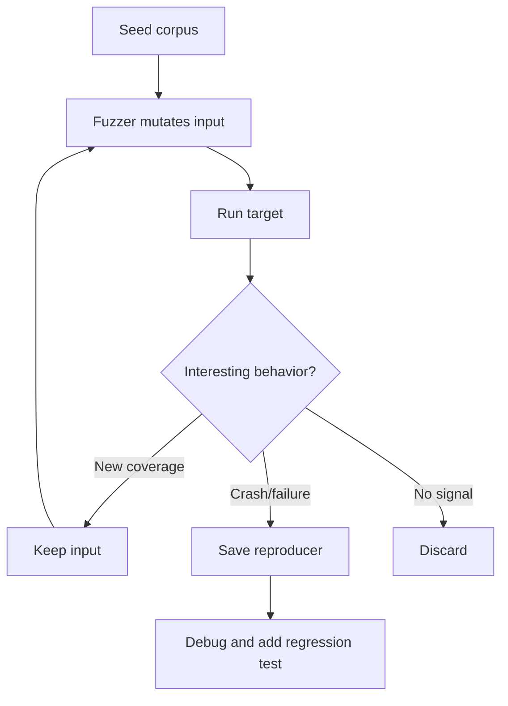
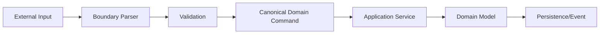
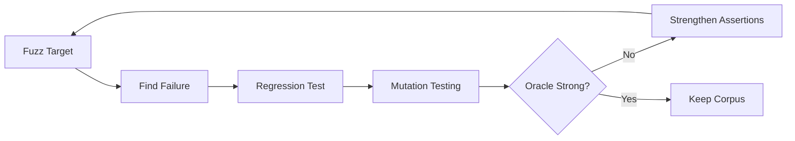

# Part 014 — Fuzzing and Robustness Testing in Java

> Tujuan bagian ini: membangun kemampuan fuzzing sebagai teknik robustness testing untuk boundary Java system: parser, deserializer, API input, schema validation, text processing, file ingestion, dan protocol handling.

Mutation testing dari part sebelumnya menyisipkan fault ke production code untuk menguji kekuatan test suite.

Fuzzing melakukan hal berbeda:

```text
Fuzzing menyisipkan input aneh, rusak, besar, tidak lengkap, salah format, atau tidak terduga ke boundary sistem.
```

Tujuannya bukan hanya mencari security bug. Tujuan engineering yang lebih umum:

```text
Sistem tidak boleh crash, hang, leak memory, corrupt state, melakukan side effect berbahaya, atau menerima data invalid sebagai valid hanya karena input tidak normal.
```

Di Java enterprise systems, fuzzing sangat berguna untuk:

- JSON/XML parser,
- CSV import,
- file upload,
- URL/URI parsing,
- date/time parsing,
- validation pipeline,
- OpenAPI request binding,
- Avro/Protobuf payload,
- message consumer,
- expression language,
- rule DSL,
- search query parser,
- deserialization boundary,
- encryption/token parsing,
- webhook payload,
- legacy integration payload.

Mental model:

```text
If external input can cross the boundary, fuzz the boundary.
```

---

## 1. Apa Itu Fuzzing?

Fuzzing adalah teknik testing otomatis yang memberi program banyak input tidak biasa untuk menemukan crash, exception tidak diharapkan, hang, memory pressure, security issue, atau behavior tidak valid.

Input bisa berupa:

```text
random bytes
malformed JSON
truncated XML
invalid UTF-8
very large strings
nested objects
unexpected enum values
negative numbers
boundary numbers
NaN/Infinity
null-like values
control characters
recursive payloads
serialized objects
invalid protocol frames
```

Fuzzing bukan sekadar random testing. Fuzzing modern sering memakai feedback dari coverage agar input berikutnya lebih mungkin mengeksplor path baru.

Diagram sederhana:



---

## 2. Fuzzing vs Property-Based Testing

Keduanya generative, tetapi orientasinya berbeda.

| Aspect | Property-Based Testing | Fuzzing |
|---|---|---|
| Input | Structured generator | Mutated bytes/values/corpus |
| Goal | Prove property over input space | Find crashes/bugs from weird inputs |
| Oracle | Explicit property | Crash, exception, assertion, sanitizer, invariant |
| Strength | Domain semantic correctness | Boundary robustness and parser weakness |
| Typical target | Domain logic, value object, state machine | Parser, deserializer, API boundary, protocol |
| Feedback | Usually generator-driven | Often coverage-guided |

Property-based test bertanya:

```text
Untuk semua input valid yang digenerate, apakah property benar?
```

Fuzzing bertanya:

```text
Untuk input yang mungkin kacau, apakah program tetap aman dan terkendali?
```

Keduanya bisa digabung.

Contoh:

```text
Fuzzer generates JSON bytes.
Parser either rejects safely or produces command.
If command produced, property checks command invariant.
```

---

## 3. Apa yang Dimaksud Robustness?

Robustness bukan berarti menerima semua input.

Robustness berarti:

```text
valid input diterima dengan benar
invalid input ditolak dengan jelas
malformed input tidak crash/hang
unknown input tidak corrupt state
large input dibatasi
partial input tidak menghasilkan side effect
error tidak membocorkan rahasia
```

Boundary contract:

```text
Input boundary harus total function secara operational.
Untuk setiap input bytes, sistem harus punya outcome terkendali:
  accept valid input
  reject invalid input
  fail closed with safe error
```

Fuzzing membantu menemukan input yang membuat boundary tidak total.

---

## 4. Target Fuzzing di Java System

Prioritaskan target berdasarkan risk.

| Target | Kenapa penting | Contoh bug |
|---|---|---|
| JSON parser/binder | Hampir semua API memakai JSON | Unknown field diterima, overflow, null ambiguity |
| XML parser | Kompleks dan historically risky | XXE, entity expansion, namespace confusion |
| CSV/file import | Banyak format semi-terstruktur | Column shift, encoding issue, large file DoS |
| URI parser | Security boundary | SSRF filter bypass |
| Date/time parser | Ambiguity tinggi | timezone bug, invalid date accepted |
| Message consumer | Input async external | poison message loop |
| Deserialization | Attack surface besar | gadget chain, unsafe type binding |
| Rule DSL/parser | Domain critical | malformed expression accepted |
| Search query parser | User-controlled syntax | expensive query, injection-like behavior |
| Compression/archive | File boundary | zip bomb/path traversal |

Jangan fuzz semua method. Fuzz entrypoint yang menerima input dari luar trust boundary.

---

## 5. Trust Boundary Mental Model

Fuzzing harus ditempatkan di boundary, bukan random internal method.



Fuzz target terbaik:

```text
B + C: parse + validate + canonicalize
```

Jangan langsung fuzz application service yang melakukan database write kecuali semua side effect diganti fake/sandbox dan invariant jelas.

Rule:

```text
Fuzz untrusted input boundary first.
Then fuzz canonical command handlers with generated valid/invalid commands.
```

---

## 6. Jazzer: Coverage-Guided Fuzzing untuk JVM

Jazzer adalah fuzzer untuk JVM yang dapat dipakai dengan JUnit 5 melalui `@FuzzTest`. Ini membuat fuzz tests bisa hidup berdampingan dengan unit tests biasa.

Konfigurasi Maven konseptual:

```xml
<dependency>
    <groupId>com.code-intelligence</groupId>
    <artifactId>jazzer-junit</artifactId>
    <version>${jazzer.version}</version>
    <scope>test</scope>
</dependency>
```

Contoh fuzz test sederhana:

```java
import com.code_intelligence.jazzer.junit.FuzzTest;
import com.code_intelligence.jazzer.api.FuzzedDataProvider;

class CasePayloadFuzzTest {

    private final CasePayloadParser parser = new CasePayloadParser();

    @FuzzTest
    void parserNeverCrashesOnArbitraryInput(FuzzedDataProvider data) {
        String input = data.consumeRemainingAsString();

        try {
            ParseResult result = parser.parse(input);

            if (result.isAccepted()) {
                assertValidCanonicalCommand(result.command());
            }
        } catch (InvalidPayloadException expected) {
            // safe rejection
        }
    }

    private static void assertValidCanonicalCommand(CreateCaseCommand command) {
        assertThat(command.caseType()).isNotBlank();
        assertThat(command.requestId()).isNotNull();
        assertThat(command.subject()).isNotNull();
    }
}
```

Important:

```text
Do not catch Throwable.
Do not hide NullPointerException, OutOfMemoryError, StackOverflowError, AssertionError, or security-relevant failures.
```

Only catch domain-level safe rejection exceptions that are part of the boundary contract.

---

## 7. What Should Count as a Fuzz Failure?

A fuzz test needs a failure oracle.

Good failures:

```text
unexpected RuntimeException
AssertionError from invariant violation
StackOverflowError
OutOfMemoryError
hang/timeout
accepted invalid command
unsafe side effect
secret in error message
path traversal accepted
SSRF-protected URL accepted
malformed input stored as canonical state
```

Expected non-failures:

```text
InvalidPayloadException
ValidationException with safe message
ParseResult.rejected(...)
HTTP 400 equivalent
schema validation error
```

Bad fuzz target:

```java
@FuzzTest
void fuzz(String input) {
    try {
        parser.parse(input);
    } catch (Exception ignored) {
    }
}
```

This hides everything.

Better:

```java
@FuzzTest
void parserEitherRejectsSafelyOrProducesValidCommand(String input) {
    try {
        CreateCaseCommand command = parser.parse(input);

        assertThat(command.requestId()).isNotNull();
        assertThat(command.caseType()).isIn(AllowedCaseTypes.values());
        assertThat(command.subject()).hasSizeBetween(1, 500);
    } catch (InvalidPayloadException expected) {
        assertThat(expected.getMessage()).doesNotContain("password", "secret", "token");
    }
}
```

---

## 8. Parser Fuzzing Pattern

For parsers, use this skeleton:

```java
@FuzzTest
void parseIsSafeForAllInputs(byte[] bytes) {
    ParseOutcome outcome = parser.parse(bytes);

    switch (outcome.kind()) {
        case ACCEPTED -> assertCanonical(outcome.value());
        case REJECTED -> assertSafeRejection(outcome.error());
    }
}
```

The parser should return structured outcome, not arbitrary exceptions.

Example domain outcome:

```java
sealed interface ParseOutcome<T> permits Accepted, Rejected {
    boolean accepted();
}

record Accepted<T>(T value) implements ParseOutcome<T> {
    public boolean accepted() { return true; }
}

record Rejected<T>(String code, String safeMessage) implements ParseOutcome<T> {
    public boolean accepted() { return false; }
}
```

This design makes fuzzing easier because invalid input has a normal safe path.

---

## 9. JSON Fuzzing

Common JSON boundary failures:

```text
empty input
truncated object
huge nesting
huge arrays
duplicate fields
unknown fields
null for required field
number overflow
string where number expected
boolean where string expected
unicode normalization
control characters
large string fields
ambiguous enum values
case-sensitive enum mismatch
```

Example fuzz target:

```java
@FuzzTest
void createCaseJsonEitherRejectsOrProducesValidCommand(FuzzedDataProvider data) {
    String json = data.consumeRemainingAsString();

    try {
        CreateCaseCommand command = mapper.readValue(json, CreateCaseCommand.class);
        validator.validate(command).throwIfInvalid();

        assertThat(command.requestId()).isNotNull();
        assertThat(command.caseType()).isIn(CaseType.values());
        assertThat(command.description()).hasSizeLessThanOrEqualTo(4_000);
    } catch (JsonProcessingException | ValidationException expected) {
        // Safe rejection: parser/validator rejects invalid payload.
    }
}
```

But do not let the test accidentally accept dangerous defaults.

If missing required field maps to `null`, validator must reject.
If unknown field should be rejected, configure mapper accordingly.
If duplicate field matters, decide policy explicitly.

---

## 10. XML Fuzzing

XML has additional risks:

```text
external entity resolution
entity expansion
DTD handling
namespace confusion
XPath injection-like behavior
XSLT execution settings
large tree memory pressure
mixed content ambiguity
encoding confusion
```

Safe XML parser configuration matters before fuzzing.

Fuzz target shape:

```java
@FuzzTest
void xmlImportRejectsMalformedOrUnsafeXml(byte[] bytes) {
    try {
        ImportedCase imported = xmlImporter.importCase(bytes);

        assertThat(imported.caseId()).isNotNull();
        assertThat(imported.events()).allSatisfy(event ->
            assertThat(event.timestamp()).isNotNull()
        );
    } catch (InvalidXmlException expected) {
        assertThat(expected.getSafeMessage()).doesNotContain("file:", "http:", "secret");
    }
}
```

Security baseline:

```text
Disable external entity resolution unless explicitly required.
Disable unsafe DTD behavior unless required.
Limit input size.
Limit parse depth where possible.
Treat XML import as untrusted.
```

Fuzzing will not save an unsafe parser configuration, but it can reveal unsafe behavior faster.

---

## 11. CSV and File Import Fuzzing

CSV looks simple, but production bugs often come from:

```text
quoted commas
escaped quotes
newlines inside fields
missing columns
extra columns
header mismatch
BOM/encoding
very long field
formula injection
invalid date format
numeric overflow
column shift
empty rows
```

Fuzz target:

```java
@FuzzTest
void csvImportNeverPartiallyCommitsMalformedFile(String content) {
    InMemoryCaseRepository repository = new InMemoryCaseRepository();
    InMemoryOutbox outbox = new InMemoryOutbox();
    CaseCsvImporter importer = new CaseCsvImporter(repository, outbox);

    ImportResult result = importer.importCsv(content);

    if (result.isRejected()) {
        assertThat(repository.savedCases()).isEmpty();
        assertThat(outbox.events()).isEmpty();
        assertThat(result.error().safeMessage()).doesNotContain("Exception", "stacktrace");
    } else {
        assertThat(repository.savedCases())
            .allSatisfy(CaseAssertions::assertValidImportedCase);
    }
}
```

Key invariant:

```text
Malformed file must not partially commit state unless import mode explicitly supports partial acceptance.
```

---

## 12. URI and SSRF-Adjacent Fuzzing

If system accepts callback URLs, webhook URLs, import URLs, or external resource references, URI parsing becomes security-sensitive.

Danger cases:

```text
localhost
127.0.0.1
0.0.0.0
::1
private IP ranges
DNS rebinding
userinfo syntax
encoded host
mixed case scheme
scheme confusion
redirect chains
trailing dots
IPv6 brackets
unicode confusables
```

Fuzz target for URL policy:

```java
@FuzzTest
void callbackUrlPolicyNeverAllowsInternalTargets(String raw) {
    UrlDecision decision = policy.evaluate(raw);

    if (decision.isAllowed()) {
        URI uri = decision.normalizedUri();

        assertThat(uri.getScheme()).isIn("https");
        assertThat(networkClassifier.classify(uri)).isEqualTo(NetworkZone.PUBLIC_INTERNET);
        assertThat(uri.getUserInfo()).isNull();
    }
}
```

Important:

```text
Do not perform real network calls inside fuzz test.
Classify syntactically or with mocked deterministic resolver.
```

---

## 13. Date/Time Fuzzing

Date parsing is a rich source of subtle bugs:

```text
invalid dates
leap years
timezone offsets
DST gaps/overlaps
ambiguous local times
very old dates
far future dates
epoch millis overflow
locale-sensitive parsing
partial dates
```

Fuzz target:

```java
@FuzzTest
void deadlineParserRejectsInvalidOrOutOfPolicyDates(String raw) {
    try {
        Deadline deadline = DeadlineParser.parse(raw, ZoneId.of("UTC"));

        assertThat(deadline.instant()).isAfter(Instant.parse("2000-01-01T00:00:00Z"));
        assertThat(deadline.instant()).isBefore(Instant.parse("2100-01-01T00:00:00Z"));
    } catch (InvalidDeadlineException expected) {
        assertThat(expected.code()).isIn("invalid_format", "out_of_range", "ambiguous_time");
    }
}
```

Rule:

```text
Do not fuzz date parsing without clear date policy.
Otherwise every weird date becomes debate instead of signal.
```

---

## 14. Deserialization Fuzzing

Deserialization deserves special treatment.

Avoid unsafe native Java serialization for untrusted input. If legacy constraints force interaction with serialized data, isolate and harden aggressively.

Fuzzing deserialization can reveal:

```text
unexpected type resolution
resource explosion
recursive object graphs
class loading issue
unsafe gadget-like behavior
validation bypass
post-deserialization invariant violation
```

Safe fuzz test shape:

```java
@FuzzTest
void serializedCommandDecoderFailsClosed(byte[] bytes) {
    DecodeResult result = decoder.decode(bytes);

    if (result.accepted()) {
        Command command = result.command();
        assertThat(command).satisfies(CommandAssertions::assertCanonical);
    } else {
        assertThat(result.errorCode()).isIn(
            "malformed_payload",
            "unsupported_type",
            "size_limit_exceeded",
            "validation_failed"
        );
    }
}
```

Rule:

```text
Decode into safe DTO/canonical command, then validate.
Never trust object graph just because deserialization succeeded.
```

---

## 15. Message Consumer Fuzzing

Kafka/Rabbit/JMS consumers receive bytes or strings from distributed systems. They must handle poison messages safely.

Failure modes:

```text
consumer crash loop
message endlessly retried
DLQ missing
invalid event accepted
schema compatibility bug
out-of-order event corrupts projection
huge payload blocks partition
```

Fuzz test target should not run real broker. Test consumer core:

```java
@FuzzTest
void consumerCoreHandlesArbitraryPayloadSafely(byte[] payload) {
    InMemoryDeadLetterQueue dlq = new InMemoryDeadLetterQueue();
    InMemoryProjection projection = new InMemoryProjection();
    CaseEventConsumerCore consumer = new CaseEventConsumerCore(projection, dlq);

    ConsumerOutcome outcome = consumer.handle(payload);

    switch (outcome.kind()) {
        case APPLIED -> assertThat(projection.records()).allSatisfy(ProjectionAssertions::assertValid);
        case REJECTED -> assertThat(dlq.messages()).hasSize(1);
        case IGNORED -> assertThat(projection.records()).isEmpty();
    }
}
```

Core invariant:

```text
Invalid message must not crash consumer and must not corrupt projection.
```

---

## 16. Corpus Design

A corpus is a set of seed inputs. Good seeds help the fuzzer start from meaningful structures.

For JSON API:

```text
valid minimal payload
valid full payload
payload with optional fields
payload with max-size fields
payload with unknown field
payload with null field
payload with nested object
payload with array boundary
```

For XML import:

```text
valid document
missing required element
unknown namespace
large repeated elements
encoded characters
empty document
DTD sample if parser policy rejects it
```

For CSV:

```text
valid header only
one valid row
quoted comma
escaped quote
newline in field
extra column
missing column
large field
```

Corpus principle:

```text
Seeds should represent structure. Fuzzer mutations explore variations.
```

Do not only seed random garbage. Random garbage often dies at first parser check and explores little.

---

## 17. Dictionary Design

Some fuzzers support dictionaries: tokens likely to unlock parser paths.

Useful JSON dictionary tokens:

```text
{
}
[
]
:
,
"caseId"
"caseType"
"requestId"
"description"
null
true
false
```

Useful XML tokens:

```text
<case>
</case>
<!DOCTYPE
<!ENTITY
xmlns
CDATA
```

Useful URI tokens:

```text
http://
https://
localhost
127.0.0.1
%2f
@
:
//
[::1]
```

Dictionary tokens encode domain grammar hints.

---

## 18. Reproducers and Regression Tests

A good fuzzing setup saves failing inputs.

Workflow:

```text
fuzzer finds crash
save reproducer input
minimize input if possible
write deterministic regression test
fix bug
keep reproducer in corpus
```

Example regression test:

```java
@Test
void regression_duplicateFieldWithNullDoesNotBypassValidation() {
    String payload = """
        {
          "requestId": "REQ-1",
          "caseType": "ENFORCEMENT",
          "caseType": null
        }
        """;

    assertThatThrownBy(() -> parser.parse(payload))
        .isInstanceOf(InvalidPayloadException.class)
        .hasMessageContaining("caseType");
}
```

Do not rely only on fuzz job to catch the same bug again. Turn interesting failures into stable unit/regression tests.

---

## 19. Resource Safety

Fuzzing can produce huge or adversarial input. The test target must enforce resource boundaries.

Protect against:

```text
unbounded input size
unbounded recursion
unbounded collection growth
unbounded regex backtracking
unbounded decompression
unbounded parse depth
unbounded thread creation
unbounded retry loop
real network calls
real database writes
```

Fuzz target rules:

```text
No real network.
No real database.
No real filesystem writes except controlled temp dir.
No sleeps.
No background threads left running.
No infinite retries.
No production credentials.
No destructive side effects.
```

If target needs storage, use in-memory fake or temp sandbox.

---

## 20. Regex Fuzzing

Regex can become performance bug due to catastrophic backtracking.

Danger pattern:

```java
Pattern.compile("(a+)+$");
```

Fuzz target:

```java
@FuzzTest
void caseReferenceRegexDoesNotHang(String input) {
    boolean matches = CaseReferencePattern.matches(input);

    if (matches) {
        assertThat(input).startsWith("CASE-");
        assertThat(input.length()).isLessThanOrEqualTo(32);
    }
}
```

Add explicit timeout if framework supports it. But better: design regex safely and keep input length limits.

---

## 21. API Fuzzing vs In-Process Fuzzing

Two levels:

### 21.1 In-Process Fuzzing

Target Java function directly:

```text
parser.parse(bytes)
validator.validate(command)
policy.evaluate(rawUrl)
consumerCore.handle(payload)
```

Pros:

```text
fast
deterministic
good for CI
no network
precise reproducer
```

### 21.2 API Fuzzing

Send requests to running service.

Pros:

```text
exercises real HTTP stack
finds binding/config issues
validates response safety
```

Cons:

```text
slower
harder to minimize
requires environment
side effect risk
more noise
```

Recommended approach:

```text
Use in-process fuzzing for core boundary logic.
Use API fuzzing selectively for deployed boundary behavior.
```

---

## 22. Fuzzing OpenAPI Boundaries

For OpenAPI-first systems, use schema as a source of structured seeds and constraints.

Boundary invariant:

```text
Every request should produce one of:
  valid 2xx/4xx response with safe body
  never 5xx for client-controlled malformed input unless dependency failure is simulated
```

For in-process fuzzing:

```java
@FuzzTest
void httpRequestBinderRejectsMalformedCreateCasePayload(String body) {
    HttpRequest request = HttpRequestFixture.post("/cases")
        .contentType("application/json")
        .body(body);

    HttpResponse response = controller.handle(request);

    assertThat(response.status()).isIn(201, 400, 422);
    assertThat(response.body()).doesNotContain("Exception", "stacktrace", "password", "secret");
}
```

But this test should use fake service dependencies, not real production operations.

---

## 23. Robustness Oracles

Fuzzing needs assertions beyond “does not crash”.

Useful oracles:

### 23.1 Canonicalization Oracle

```text
If input accepted, canonical output must satisfy domain constraints.
```

### 23.2 Roundtrip Oracle

```text
parse(serialize(x)) == x
```

### 23.3 Reject-Invalid Oracle

```text
Known invalid patterns must never be accepted.
```

### 23.4 No Partial Side Effect Oracle

```text
Rejected input must not persist state, emit event, or write audit as success.
```

### 23.5 Error Safety Oracle

```text
Error body must not contain stacktrace/secrets/internal path.
```

### 23.6 Resource Oracle

```text
Input beyond configured size/depth must be rejected quickly.
```

Example:

```java
private static void assertRejectedSafely(ImportResult result, FakeRepository repo, FakeOutbox outbox) {
    assertThat(result.isRejected()).isTrue();
    assertThat(repo.savedRecords()).isEmpty();
    assertThat(outbox.events()).isEmpty();
    assertThat(result.error().safeMessage())
        .doesNotContain("java.", "Exception", "stacktrace", "password", "token");
}
```

---

## 24. Stateful Fuzzing

Some robustness issues require sequences, not one input.

Example:

```text
upload chunk 1
upload chunk 3
complete upload
retry chunk 1
cancel upload
complete again
```

A simple technique: use fuzzed bytes to generate commands.

```java
@FuzzTest
void uploadSessionNeverViolatesStateInvariants(FuzzedDataProvider data) {
    UploadSession session = UploadSession.start(SessionId.newId());

    int steps = data.consumeInt(0, 50);
    for (int i = 0; i < steps; i++) {
        UploadCommand command = generateCommand(data);
        try {
            session = session.handle(command);
        } catch (InvalidTransitionException expected) {
            // safe rejection
        }

        assertUploadSessionInvariants(session);
    }
}
```

This overlaps with property-based stateful testing. Difference: fuzzer uses mutation/coverage feedback from low-level input, while property testing usually uses structured generator.

---

## 25. Fuzzing and Mutation Testing Together

Mutation testing can audit fuzzing oracle quality.

Pattern:

```text
Write fuzz target.
Extract deterministic harness into normal test style.
Run mutation testing against parser/validator.
If mutants survive, fuzz oracle may be too weak.
```

Example:

```text
Fuzz test catches crashes only.
PIT shows validation boundary mutants survive.
Improve fuzz oracle to assert accepted commands satisfy all invariants.
```

Combined loop:



---

## 26. CI Strategy

Fuzzing can be expensive. Split workflow.

### 26.1 PR Smoke Fuzzing

```text
short duration
critical targets only
no network/database
fail on crash
store reproducer artifact
```

Example:

```text
run selected fuzz tests for 30-120 seconds each
```

### 26.2 Nightly Fuzzing

```text
longer duration
larger corpus
more targets
coverage growth tracking
artifact retention
```

### 26.3 Pre-Release Fuzzing

```text
critical boundary fuzzing
known corpus replay
security-sensitive parser targets
regression corpus included
```

### 26.4 Local Developer Fuzzing

```text
run one target while fixing parser/validator
replay known crash input
minimize failing input
```

CI output should include:

```text
failing input/reproducer
seed corpus version
target name
git commit
exception stacktrace
resource limit hit if any
```

---

## 27. Corpus Management

Treat fuzz corpus as engineering asset.

Directory shape:

```text
src/test/resources/fuzz-corpus/
  create-case-json/
    valid-minimal.json
    valid-full.json
    missing-required.json
    null-required.json
    duplicate-field.json
  xml-import/
    valid.xml
    doctype-rejected.xml
    namespace-edge.xml
  csv-import/
    valid-one-row.csv
    quoted-newline.csv
    missing-column.csv
```

Rules:

```text
Keep corpus small and meaningful.
Add minimized regressions.
Do not commit huge generated corpus blindly.
Review corpus diffs.
Name seeds by behavior.
Separate seeds from generated crash artifacts.
```

---

## 28. Fuzzing Error Handling

Error handling must be safe.

Bad response:

```json
{
  "error": "java.lang.NullPointerException at com.acme.SecretTokenValidator...",
  "debug": "databasePassword=..."
}
```

Good response:

```json
{
  "code": "invalid_payload",
  "message": "Request payload is invalid.",
  "correlationId": "..."
}
```

Fuzz oracle:

```java
private static void assertSafeError(ApiResponse response) {
    assertThat(response.status()).isBetween(400, 499);
    assertThat(response.body()).doesNotContain(
        "NullPointerException",
        "SQLException",
        "stacktrace",
        "password",
        "secret",
        "token",
        "/home/",
        "C:\\"
    );
}
```

---

## 29. Avoiding False Positives

Fuzzing can produce noisy failures if contract is unclear.

Before fuzzing, define:

```text
maximum input size
maximum nesting/depth
accepted encodings
unknown field policy
duplicate field policy
null policy
number range
string length
date range
allowed schemes/hosts
partial import behavior
error response format
side effect policy on rejection
```

If these are undefined, fuzzing will surface product ambiguity, not only bugs.

That is still useful, but classify it correctly:

```text
Bug: implementation violates known policy.
Spec gap: no known policy exists.
Test issue: fuzz target hides or misclassifies outcome.
Tool issue: framework configuration mismatch.
```

---

## 30. Fuzzing Anti-Patterns

### 30.1 Catching Everything

```java
catch (Throwable ignored) {}
```

This makes fuzzing useless.

### 30.2 Fuzzing with Real Side Effects

Never let fuzz tests send emails, write production-like databases, hit external URLs, or publish real messages.

### 30.3 No Reproducer Workflow

If crash input is not saved and turned into regression test, learning is lost.

### 30.4 Random Garbage Only

Pure random input often fails before meaningful parser paths. Use structured seeds.

### 30.5 Treating Every Exception as Bug

Domain validation exceptions are expected for invalid input. Unexpected runtime exceptions are bugs.

### 30.6 No Resource Limits

A fuzzer can create pathological inputs. Bound size, depth, time, and resources.

### 30.7 Fuzzing Too Deep First

Do not fuzz the whole service stack before parser/validator boundary is stable.

---

## 31. Case Study: Regulatory Case Intake API

System boundary:

```text
POST /cases/intake
Content-Type: application/json
```

Domain rule:

```text
requestId required
caseType must be known
description length <= 4000
reportedAt must be within allowed range
subject must have at least one identifier
attachments optional but must have safe metadata
unknown fields rejected
invalid payload must not create case
```

Fuzz target:

```java
@FuzzTest
void intakePayloadEitherRejectedSafelyOrCreatesCanonicalDraft(String body) {
    FakeCaseRepository repository = new FakeCaseRepository();
    FakeOutbox outbox = new FakeOutbox();
    IntakeController controller = TestIntakeControllerFactory.create(repository, outbox);

    ApiResponse response = controller.postIntake(body);

    if (response.status() == 201) {
        assertThat(repository.savedCases()).singleElement()
            .satisfies(saved -> {
                assertThat(saved.status()).isEqualTo(CaseStatus.DRAFT);
                assertThat(saved.requestId()).isNotNull();
                assertThat(saved.description()).hasSizeLessThanOrEqualTo(4_000);
            });

        assertThat(outbox.events()).singleElement()
            .satisfies(event -> assertThat(event.type()).isEqualTo("case.intake.accepted"));
    } else {
        assertThat(response.status()).isIn(400, 422);
        assertSafeError(response);
        assertThat(repository.savedCases()).isEmpty();
        assertThat(outbox.events()).isEmpty();
    }
}
```

This test checks:

```text
no server crash
valid accepted output
safe rejected output
no partial side effect on rejection
safe error message
```

This is much stronger than “parser does not throw”.

---

## 32. Fuzzing and Observability

Fuzzing can guide production instrumentation.

If fuzzing reveals repeated invalid inputs, add metrics:

```text
payload_rejected_total{reason="invalid_json"}
payload_rejected_total{reason="size_limit"}
payload_rejected_total{reason="unknown_case_type"}
intake_payload_size_bytes
intake_parse_duration_ms
intake_validation_failure_total
```

But avoid high-cardinality labels:

```text
Do not label metrics with raw invalid value.
Do not label by requestId.
Do not label by user-controlled string.
```

Production feedback loop:

```text
Fuzzing finds malformed classes.
Production metrics show real malformed frequency.
Regression corpus includes representative production-safe samples.
Boundary policy improves.
```

---

## 33. Fuzzing Checklist

Before writing fuzz target:

```text
[ ] Identify trust boundary.
[ ] Define valid vs invalid input.
[ ] Define safe rejection.
[ ] Define resource limits.
[ ] Replace side effects with fakes.
[ ] Build seed corpus.
[ ] Decide which exceptions are expected.
[ ] Add semantic assertions for accepted input.
[ ] Add no-side-effect assertions for rejected input.
[ ] Ensure failure reproducer is stored.
```

During review:

```text
[ ] Does fuzz target catch only expected domain exceptions?
[ ] Does it avoid real network/database/filesystem side effects?
[ ] Does it assert canonical invariants?
[ ] Does it assert safe error messages?
[ ] Does it handle resource bounds?
[ ] Are seeds meaningful?
[ ] Are discovered crashes turned into regression tests?
```

---

## 34. Practice Exercises

### Exercise 1 — JSON Boundary Fuzzing

Create `CreateCaseCommandParser` for JSON payload.

Rules:

```text
requestId required
caseType enum required
description 1..4000 chars
unknown fields rejected
null required fields rejected
```

Write a Jazzer fuzz test that ensures accepted command satisfies all invariants and rejected payload has safe error.

### Exercise 2 — CSV Import Fuzzing

Create a CSV importer with all-or-nothing behavior.

Rules:

```text
valid file imports all rows
invalid row rejects whole file
rejection must not persist partial state
```

Fuzz CSV content and assert no partial commit.

### Exercise 3 — URI Policy Fuzzing

Create callback URL policy.

Rules:

```text
only https
no localhost
no private IP
no userinfo
no empty host
```

Fuzz raw string and assert allowed URLs are normalized and public.

### Exercise 4 — Regression Corpus

Take one failing fuzz input, minimize it manually, add it to corpus, then write normal JUnit regression test.

---

## 35. Production Heuristics

```text
1. Fuzz boundaries before internals.
2. Accepted malformed input is often worse than rejected valid input.
3. Invalid input must fail closed and leave no partial side effect.
4. A fuzz target without oracle is just crash fishing.
5. Crash finding is useful; semantic invariant checking is better.
6. Use structured seeds to unlock meaningful paths.
7. Always save and minimize reproducers.
8. Never fuzz with real external side effects.
9. Convert fuzz failures into deterministic regression tests.
10. Combine fuzzing, property testing, mutation testing, and contract testing for critical boundaries.
```

---

## 36. Final Mental Model

Mutation testing asks:

```text
Can our tests detect wrong code?
```

Fuzzing asks:

```text
Can our code survive hostile or malformed input?
```

A production-grade Java system needs both.

Testing only happy-path valid inputs proves the system works when the world behaves.
Fuzzing tests what happens when the world does not.

The next part moves from advanced testing into contract compatibility: how services keep promises across API/schema evolution and prevent integration drift.
