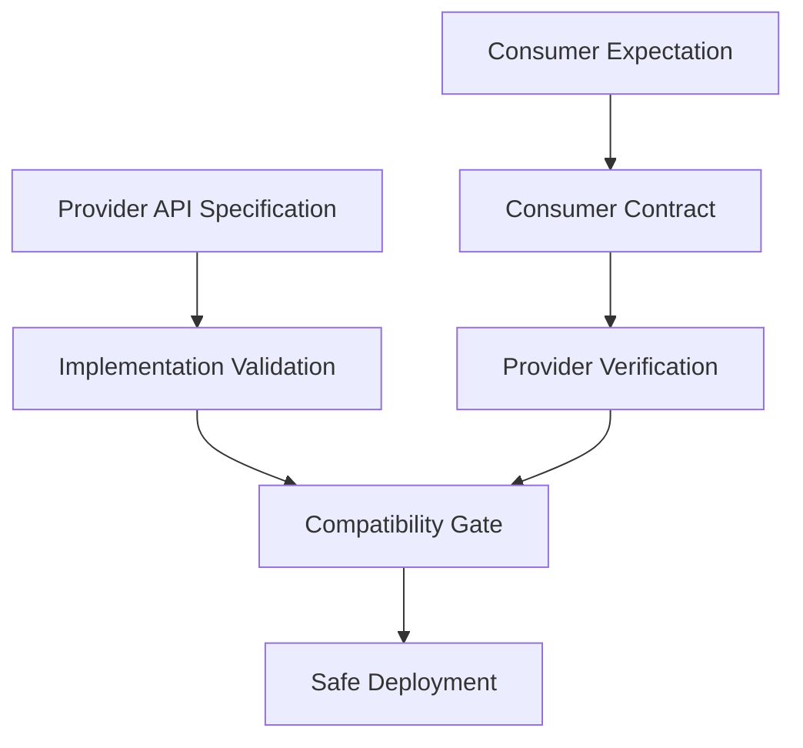
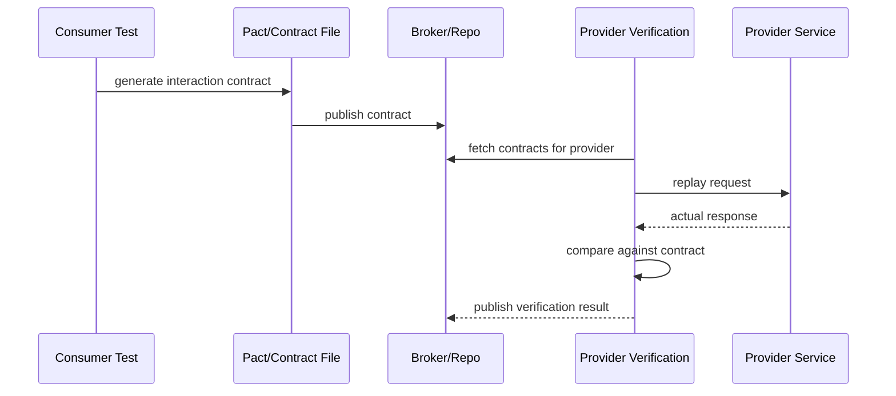
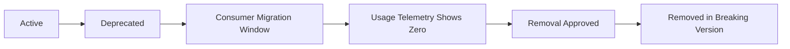
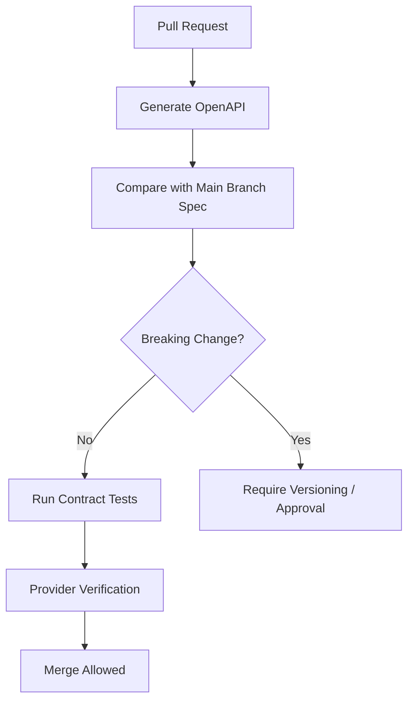
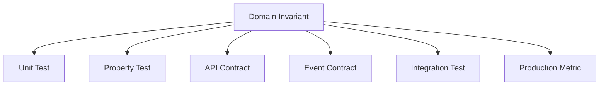

# Part 015 — Contract Testing and Schema Compatibility

> Tujuan bagian ini: membangun kemampuan mendesain, menguji, dan menjaga kontrak antar-sistem agar perubahan Java service tidak diam-diam merusak consumer, workflow, event processing, reporting, atau integrasi eksternal.

Di part sebelumnya kita sudah membahas fuzzing: bagaimana boundary sistem harus tahan input rusak.

Sekarang kita masuk ke masalah yang lebih sering terjadi di organisasi besar:

```text
Kode provider benar menurut test internal,
tetapi consumer rusak setelah deployment.
```

Ini bukan bug unit test.
Ini bug kontrak.

Contract testing menjawab pertanyaan:

```text
Apakah perubahan service masih memenuhi ekspektasi consumer yang nyata?
```

Schema compatibility menjawab pertanyaan:

```text
Apakah bentuk data baru masih aman untuk producer dan consumer lama/baru?
```

Dalam Java enterprise systems, ini muncul pada:

- REST API berbasis OpenAPI,
- JAX-RS resource contract,
- JSON Schema,
- event payload Kafka,
- Avro/Protobuf schema,
- webhook payload,
- internal message envelope,
- BPM/workflow command,
- batch file interface,
- database-facing integration view,
- API error response,
- pagination contract,
- idempotency key behavior,
- callback contract,
- partner integration contract.

Contract testing bukan pengganti integration test.
Contract testing adalah **guardrail perubahan antar-boundary**.

---

## 1. Masalah yang Ingin Diselesaikan

Bayangkan service `case-service` menyediakan endpoint:

```http
GET /cases/{caseId}
```

Consumer `enforcement-dashboard` memakai response:

```json
{
  "caseId": "CASE-1001",
  "status": "UNDER_REVIEW",
  "assignedOfficerId": "OFF-7",
  "priority": "HIGH"
}
```

Lalu provider melakukan refactor:

```json
{
  "id": "CASE-1001",
  "state": "UNDER_REVIEW",
  "owner": {
    "officerId": "OFF-7"
  },
  "priority": "HIGH"
}
```

Provider test mungkin tetap hijau karena test provider hanya memeriksa:

```text
HTTP 200
non-empty response
valid JSON
```

Tetapi dashboard rusak karena field `caseId` dan `assignedOfficerId` hilang.

Masalahnya bukan JSON invalid.
Masalahnya adalah provider melanggar ekspektasi consumer.

Mental model:

```text
Integration tests ask:
Can these components work together now?

Contract tests ask:
Can each component change independently without breaking agreed messages?
```

---

## 2. Apa Itu Contract?

Contract adalah deskripsi eksplisit tentang pesan yang melewati boundary.

Untuk HTTP API, contract mencakup:

```text
method
path
query parameters
headers
request body
response status
response headers
response body shape
allowed values
error format
semantic behavior
```

Untuk event/message, contract mencakup:

```text
topic/channel
message key
headers
payload schema
required fields
optional fields
field meaning
ordering expectation
idempotency semantics
versioning rule
consumer tolerance
```

Untuk command/workflow, contract mencakup:

```text
command type
precondition
allowed source state
expected resulting state
domain error
side effect expectation
audit event
idempotency rule
```

Kontrak yang bagus bukan hanya bentuk data.
Kontrak yang bagus juga menjelaskan **makna stabil**.

Contoh field-level meaning:

```text
caseId:
  stable public identifier of a case.
  must not be database primary key.
  must remain stable across reassignment, escalation, reopen, and archival.
```

Tanpa semantic description, schema bisa valid tapi behavior tetap salah.

---

## 3. API Specification vs Contract Testing

Sering ada kebingungan:

```text
Kami sudah punya OpenAPI, apakah masih perlu contract test?
```

Jawaban praktis:

```text
OpenAPI menjelaskan provider surface.
Consumer-driven contract menjelaskan ekspektasi consumer tertentu.
```

Keduanya berbeda.

| Aspek | OpenAPI / Provider Spec | Consumer-Driven Contract |
|---|---|---|
| Sudut pandang | Provider | Consumer |
| Fokus | API surface yang disediakan | Interaksi yang benar-benar dipakai |
| Risiko utama yang ditangkap | Spec drift, invalid implementation | Breaking consumer expectation |
| Granularity | Endpoint/resource | Interaction/scenario |
| Ownership | Provider/platform/API governance | Consumer + provider |
| Cocok untuk | API documentation, codegen, validation, portal | Independent deployment safety |

Contoh:

Provider OpenAPI bisa menyatakan field `assignedOfficerId` optional.

Consumer tertentu mungkin membutuhkan field itu untuk menampilkan SLA breach.

Dari sisi OpenAPI provider, response tanpa field itu valid.
Dari sisi consumer, response itu breaking.

Karena itu kontrak harus dibaca dalam dua layer:



---

## 4. Jenis Kontrak di Java Systems

Kontrak tidak hanya REST.

### 4.1 Synchronous HTTP Contract

Contoh:

```http
POST /cases/{caseId}/transitions
Content-Type: application/json
Idempotency-Key: 979cfa1e
```

Request:

```json
{
  "action": "ESCALATE",
  "reasonCode": "SLA_BREACH",
  "actorId": "OFF-7"
}
```

Response:

```json
{
  "caseId": "CASE-1001",
  "previousStatus": "UNDER_REVIEW",
  "currentStatus": "ESCALATED",
  "transitionId": "TRN-91"
}
```

Contract risk:

- status code berubah,
- field berubah nama,
- enum berubah,
- error body berubah,
- idempotency behavior berubah,
- request header baru menjadi required,
- response latency naik dan consumer timeout,
- pagination default berubah.

### 4.2 Asynchronous Event Contract

Contoh Kafka event:

```json
{
  "eventId": "evt-1001",
  "eventType": "CaseEscalated",
  "schemaVersion": 2,
  "occurredAt": "2026-07-02T10:15:30Z",
  "caseId": "CASE-1001",
  "previousStatus": "UNDER_REVIEW",
  "currentStatus": "ESCALATED",
  "reasonCode": "SLA_BREACH"
}
```

Contract risk:

- field wajib dihapus,
- enum value baru tidak ditangani consumer,
- timestamp format berubah,
- key partitioning berubah,
- event ordering expectation rusak,
- duplicate handling berubah,
- semantic event digabung/dipecah tanpa migrasi,
- null vs absent berubah.

### 4.3 Batch/File Contract

Contoh CSV regulatory export:

```csv
case_id,status,assigned_officer_id,deadline_at
CASE-1001,ESCALATED,OFF-7,2026-07-05T23:59:59Z
```

Contract risk:

- kolom berubah urutan,
- delimiter berubah,
- timezone berubah,
- header berubah,
- encoding berubah,
- escaping berubah,
- empty string menggantikan null,
- numeric scale berubah.

### 4.4 Database Integration Contract

Kadang consumer membaca view atau replication table.

Ini bukan ideal, tetapi sering nyata.

Contract risk:

- column rename,
- column type change,
- changed nullability,
- changed meaning,
- changed uniqueness,
- changed freshness SLA,
- hidden migration breakage.

Jika database menjadi integration contract, treat schema seperti public API.

---

## 5. Compatibility Mental Model

Compatibility harus dilihat dari empat arah:

```text
old consumer -> old provider
old consumer -> new provider
new consumer -> old provider
new consumer -> new provider
```

Untuk deployment independen, kombinasi paling kritis adalah:

```text
old consumer -> new provider
```

Provider deploy dulu.
Consumer belum tentu ikut deploy.

Maka provider harus menjaga backward compatibility.

Untuk event streaming, lebih kompleks:

```text
old producer -> old consumer
old producer -> new consumer
new producer -> old consumer
new producer -> new consumer
```

Karena producer dan consumer bisa berjalan paralel untuk waktu lama.

Compatibility matrix:

| Perubahan | HTTP Response | Event Schema | Biasanya Aman? | Catatan |
|---|---:|---:|---:|---|
| Tambah optional field | Ya | Ya | Aman | Consumer harus ignore unknown fields |
| Hapus optional field | Tergantung | Tergantung | Hati-hati | Bisa dipakai consumer meski optional di spec |
| Tambah required field pada request | Tidak | Producer-facing: tidak | Breaking | Consumer lama tidak mengirim field |
| Hapus required response field | Tidak | Tidak | Breaking | Consumer lama bisa gagal |
| Rename field | Tidak | Tidak | Breaking | Treat as remove + add |
| Ubah enum dengan value baru | Tergantung | Tergantung | Berisiko | Consumer harus punya unknown handling |
| Widen numeric range | Tergantung | Tergantung | Berisiko | Overflow di consumer |
| Ubah string date format | Tidak | Tidak | Breaking | Parsing consumer gagal |
| Tambah endpoint baru | Ya | N/A | Aman | Tidak memengaruhi consumer lama |
| Ubah status code sukses | Tergantung | N/A | Berisiko | Consumer sering branch by status |
| Ubah error body | Tidak | N/A | Breaking untuk consumer error-aware | Error contract juga contract |

Rule sederhana:

```text
A change is compatible only if every supported consumer can still behave correctly without redeployment.
```

Bukan hanya compile.
Bukan hanya deserialize.
Benar secara behavior.

---

## 6. OpenAPI Contract Design

OpenAPI adalah standard language-agnostic untuk mendeskripsikan HTTP API agar manusia dan komputer bisa memahami kemampuan service.

Dalam Java service, OpenAPI sering digunakan untuk:

- API documentation,
- server stub generation,
- client generation,
- request/response validation,
- test generation,
- compatibility diff,
- governance linting,
- portal/catalog.

Contoh minimal:

```yaml
openapi: 3.1.0
info:
  title: Case Service API
  version: 1.4.0
paths:
  /cases/{caseId}:
    get:
      operationId: getCase
      parameters:
        - name: caseId
          in: path
          required: true
          schema:
            type: string
      responses:
        '200':
          description: Case found
          content:
            application/json:
              schema:
                $ref: '#/components/schemas/CaseView'
        '404':
          description: Case not found
          content:
            application/json:
              schema:
                $ref: '#/components/schemas/Problem'
components:
  schemas:
    CaseView:
      type: object
      required:
        - caseId
        - status
        - priority
      properties:
        caseId:
          type: string
          description: Stable public case identifier.
        status:
          type: string
          enum: [DRAFT, UNDER_REVIEW, ESCALATED, CLOSED]
        assignedOfficerId:
          type: string
          nullable: true
        priority:
          type: string
          enum: [LOW, MEDIUM, HIGH, CRITICAL]
    Problem:
      type: object
      required:
        - code
        - message
      properties:
        code:
          type: string
        message:
          type: string
        correlationId:
          type: string
```

A good OpenAPI contract has:

```text
required fields intentionally chosen
nullable explicitly modeled
additionalProperties policy explicit
error schema stable
pagination schema stable
idempotency header documented
authentication/authorization responses documented
examples realistic
operationId stable
semantic descriptions included
```

Bad OpenAPI contract:

```yaml
CaseView:
  type: object
  additionalProperties: true
```

Ini terlalu longgar.
Ia memberi dokumentasi tetapi sedikit sekali protection.

OpenAPI yang terlalu longgar tidak bisa menjadi compatibility gate yang kuat.

---

## 7. Consumer-Driven Contract Testing

Consumer-driven contract testing dimulai dari consumer.

Consumer mengatakan:

```text
Untuk menjalankan fitur ini, saya membutuhkan provider merespons request X dengan body berbentuk Y.
```

Provider kemudian memverifikasi:

```text
Apakah implementation saya masih memenuhi kontrak consumer tersebut?
```

Flow:



Core advantage:

```text
Provider does not guess what consumers use.
Consumers declare what they need.
```

Core risk:

```text
Consumer contract can become too narrow, too synthetic, or detached from real behavior.
```

Karena itu contract tests harus punya governance.

---

## 8. What Contract Tests Should and Should Not Test

Contract tests should test:

```text
message shape
required fields
status codes
headers that affect behavior
content type
known error schema
provider state setup
semantics that appear in the message
```

Contract tests should not test:

```text
complete business workflow
all internal branches
database implementation
performance
UI rendering
provider's private invariants
consumer's internal logic
```

Contoh buruk:

```text
Consumer contract demands that provider uses PostgreSQL sequence IDs.
```

Itu bukan contract.
Itu implementation leak.

Contoh bagus:

```text
Consumer contract demands that caseId is stable and returned in response body.
```

Itu public behavior.

---

## 9. Provider State

Consumer contracts sering membutuhkan provider berada di state tertentu.

Contoh:

```text
Given case CASE-1001 exists with status UNDER_REVIEW
When GET /cases/CASE-1001
Then response status is 200
And body contains caseId CASE-1001 and status UNDER_REVIEW
```

Provider verification harus bisa menyiapkan state itu.

Di Java test, state setup biasanya berupa:

```java
void givenCaseUnderReview(String caseId) {
    database.truncateAll();
    officerRepository.insert(new Officer("OFF-7", "Nadia"));
    caseRepository.insert(new CaseRecord(caseId, "UNDER_REVIEW", "OFF-7"));
}
```

Provider state harus:

- deterministic,
- cepat,
- isolated,
- idempotent,
- tidak bergantung order test,
- tidak memakai production data,
- tidak membuat hidden dependency antar-contract.

Anti-pattern:

```java
void setup() {
    // assumes previous test already created officer OFF-7
}
```

Contract verification harus bisa berjalan sendiri.

---

## 10. JUnit 5 Provider Verification Shape

Pact JVM menyediakan integrasi JUnit 5 untuk provider verification dengan `@TestTemplate`: satu template test menghasilkan test per interaction dari pact files.

Bentuk konseptual:

```java
@Provider("case-service")
@PactFolder("pacts")
class CaseServiceContractVerificationTest {

    @BeforeEach
    void before(PactVerificationContext context) {
        context.setTarget(new HttpTestTarget("localhost", 8080));
    }

    @TestTemplate
    @ExtendWith(PactVerificationInvocationContextProvider.class)
    void verify(PactVerificationContext context) {
        context.verifyInteraction();
    }

    @State("case CASE-1001 exists with status UNDER_REVIEW")
    void caseUnderReview() {
        resetDatabase();
        insertOfficer("OFF-7");
        insertCase("CASE-1001", "UNDER_REVIEW", "OFF-7");
    }
}
```

Jangan hafal annotation.
Pahami alurnya:

```text
contract interaction -> provider state setup -> real provider call -> response matching -> verification result
```

Yang membuat contract verification bernilai adalah real provider call.
Bukan mocking controller.

---

## 11. Contract Matching: Exact vs Flexible

Consumer contract harus cukup spesifik untuk menangkap breakage, tetapi cukup fleksibel untuk tidak membuat false failure.

Bad exact matching:

```json
{
  "transitionId": "TRN-91",
  "occurredAt": "2026-07-02T10:15:30Z"
}
```

Jika provider menghasilkan ID/timestamp berbeda, contract gagal padahal behavior benar.

Better matcher:

```text
transitionId matches pattern TRN-[0-9]+
occurredAt is ISO-8601 instant
```

Prinsip:

```text
Assert stable semantics exactly.
Assert generated data by type/pattern/range.
```

Exact:

```text
caseId
status
error code
business classification
```

Flexible:

```text
correlationId
timestamp
generated UUID
server metadata
pagination cursor
```

---

## 12. Error Contract

Banyak tim menjaga success response tetapi mengabaikan error response.

Padahal consumer sering bergantung pada error code.

Contoh stable error contract:

```json
{
  "code": "CASE_NOT_TRANSITIONABLE",
  "message": "Case cannot be escalated from CLOSED state.",
  "correlationId": "corr-123",
  "details": {
    "caseId": "CASE-1001",
    "currentStatus": "CLOSED",
    "requestedAction": "ESCALATE"
  }
}
```

Error compatibility rule:

```text
Do not remove stable machine-readable error codes.
Do not change status semantics without migration.
Do not move important fields into human text.
Do not make clients parse natural language messages.
```

Bad API:

```json
{
  "error": "Oops cannot do that because case is closed"
}
```

Good API:

```json
{
  "code": "INVALID_CASE_TRANSITION",
  "message": "Case cannot be transitioned from CLOSED to ESCALATED.",
  "correlationId": "..."
}
```

Consumer harus branch pada `code`, bukan `message`.

---

## 13. Schema Compatibility Rules for JSON

JSON tidak punya compatibility rule sekuat Avro/Protobuf secara default.
Maka tim harus menetapkan aturan.

### 13.1 Safe-ish Changes

Biasanya aman:

```text
add optional response field
add endpoint
add enum field only if consumer is tolerant
relax input validation carefully
add optional request header
add optional query parameter
```

### 13.2 Breaking Changes

Biasanya breaking:

```text
remove response field
rename field
change type
change number to string
change string date format
make optional request field required
change nullability
change error code
change status code semantics
change array to object
change object to array
change pagination semantics
```

### 13.3 Ambiguous Changes

Butuh consumer evidence:

```text
add enum value
change field max length
change numeric precision
remove optional field
change sorting default
change default page size
add required response field
```

Kenapa `remove optional field` ambiguous?

Karena optional di provider spec bukan berarti tidak dipakai consumer.

Consumer bisa punya logic:

```java
if (response.assignedOfficerId() != null) {
    showAssignedOfficer(response.assignedOfficerId());
} else {
    showUnassignedWarning();
}
```

Jika field dihapus, consumer behavior berubah.

Compatibility tidak hanya schema.
Compatibility juga behavior.

---

## 14. Unknown Field Tolerance

Consumer JSON parser harus biasanya ignore unknown fields untuk backward compatibility.

Dengan Jackson:

```java
@JsonIgnoreProperties(ignoreUnknown = true)
public record CaseView(
    String caseId,
    String status,
    String assignedOfficerId,
    String priority
) {}
```

Atau object mapper global:

```java
objectMapper.configure(DeserializationFeature.FAIL_ON_UNKNOWN_PROPERTIES, false);
```

Tetapi jangan asal global.

Trade-off:

| Mode | Benefit | Risk |
|---|---|---|
| Fail on unknown | Menangkap spec drift cepat | Consumer lama rusak ketika provider menambah field |
| Ignore unknown | Lebih compatible | Bisa menyembunyikan typo/misrouted payload |

Practical rule:

```text
For external/provider evolution, consumers should ignore unknown fields.
For internal command validation, reject unknown fields if strictness matters.
```

Contoh:

```text
Inbound public API command: strict unknown fields may prevent user mistakes.
Outbound integration response: tolerant consumer improves compatibility.
```

---

## 15. Required vs Optional Is a Semantic Decision

Jangan tandai field required hanya karena database column NOT NULL.

Required berarti:

```text
A supported consumer may rely on this field always being present.
```

Optional berarti:

```text
Consumer must handle absence/null without failure.
```

Kesalahan umum:

```yaml
assignedOfficerId:
  type: string
required:
  - assignedOfficerId
```

Padahal case baru mungkin belum assigned.

Lebih benar:

```yaml
assignedOfficerId:
  type: string
  nullable: true
```

Atau lebih eksplisit:

```yaml
assignment:
  oneOf:
    - $ref: '#/components/schemas/AssignedCase'
    - $ref: '#/components/schemas/UnassignedCase'
```

Butuh keputusan domain:

```text
Apakah unassigned case valid state?
Jika ya, modelkan eksplisit.
```

---

## 16. Event Schema Compatibility

Event contract berbeda dari HTTP.

HTTP request-response umumnya synchronous dan consumer langsung tahu error.

Event bersifat asynchronous:

```text
producer emits event
consumer may process later
schema may evolve while old events still exist
consumer may replay historical events
```

Compatibility harus mempertimbangkan replay.

Pertanyaan desain:

```text
Apakah consumer baru bisa membaca event lama?
Apakah consumer lama bisa membaca event baru?
Apakah event lama masih disimpan di Kafka/log/archive?
Apakah schema registry enforce compatibility?
Apakah event versioning ada di envelope atau schema registry?
```

Event rule:

```text
Once emitted, an event is history.
Do not pretend you can change it.
```

---

## 17. Event Envelope Pattern

Gunakan envelope stabil:

```json
{
  "eventId": "evt-1001",
  "eventType": "CaseEscalated",
  "schemaVersion": 2,
  "producer": "case-service",
  "occurredAt": "2026-07-02T10:15:30Z",
  "correlationId": "corr-77",
  "causationId": "cmd-55",
  "subjectId": "CASE-1001",
  "payload": {
    "caseId": "CASE-1001",
    "previousStatus": "UNDER_REVIEW",
    "currentStatus": "ESCALATED",
    "reasonCode": "SLA_BREACH"
  }
}
```

Envelope fields should be stable:

```text
eventId: idempotency/deduplication
occurredAt: event time
producer: source service
correlationId: tracing across services
causationId: command/request that caused the event
subjectId: partitioning/query convenience
schemaVersion: compatibility handling
payload: domain data
```

Event contract tests should verify:

- envelope required fields,
- payload schema,
- key/header convention,
- semantic mapping from domain transition to event,
- idempotency fields,
- replay compatibility.

---

## 18. Avro/Protobuf Compatibility Thinking

Walaupun seri ini Java-focused, compatibility mental model penting.

### 18.1 Avro-style Thinking

Avro sering menekankan reader/writer schema resolution.

Practical ideas:

```text
add field with default -> generally compatible
remove field that reader ignores -> may be compatible
rename needs alias strategy
changing type is risky
```

### 18.2 Protobuf-style Thinking

Protobuf compatibility bergantung pada field numbers.

Practical ideas:

```text
never reuse field numbers
reserve removed field numbers/names
adding fields is usually okay
changing type can be dangerous
unknown fields matter
```

### 18.3 JSON-style Thinking

JSON tidak enforce field number/default schema resolution.

Maka governance harus lebih explicit:

```text
schema diff
consumer contracts
unknown field policy
versioned envelope
backward-compatible parser
integration replay tests
```

---

## 19. Contract Testing for Message Consumers

Consumer event contract bisa diuji dari dua sisi.

### 19.1 Producer Contract Test

Producer test memastikan event yang dihasilkan sesuai schema/contract.

```java
@Test
void emitsCaseEscalatedEventContract() {
    CaseAggregate caseAggregate = CaseAggregate.underReview("CASE-1001", "OFF-7");

    List<DomainEvent> events = caseAggregate.handle(
        new EscalateCase("CASE-1001", "SLA_BREACH", "OFF-7")
    );

    CaseEscalated event = onlyEvent(events, CaseEscalated.class);

    assertThat(event.caseId()).isEqualTo("CASE-1001");
    assertThat(event.previousStatus()).isEqualTo("UNDER_REVIEW");
    assertThat(event.currentStatus()).isEqualTo("ESCALATED");
    assertThat(event.reasonCode()).isEqualTo("SLA_BREACH");
}
```

### 19.2 Consumer Contract Test

Consumer test memastikan consumer bisa memproses message sesuai contract.

```java
@Test
void consumesCaseEscalatedEventV2() {
    String message = """
        {
          "eventId": "evt-1001",
          "eventType": "CaseEscalated",
          "schemaVersion": 2,
          "occurredAt": "2026-07-02T10:15:30Z",
          "caseId": "CASE-1001",
          "previousStatus": "UNDER_REVIEW",
          "currentStatus": "ESCALATED",
          "reasonCode": "SLA_BREACH"
        }
        """;

    consumer.handle(message);

    assertThat(readProjection("CASE-1001").status()).isEqualTo("ESCALATED");
}
```

### 19.3 Replay Compatibility Test

Store old sample events as golden corpus.

```text
src/test/resources/contracts/events/case-escalated-v1.json
src/test/resources/contracts/events/case-escalated-v2.json
src/test/resources/contracts/events/case-reopened-v1.json
```

Test:

```java
@ParameterizedTest
@ValueSource(strings = {
    "contracts/events/case-escalated-v1.json",
    "contracts/events/case-escalated-v2.json"
})
void canReplaySupportedHistoricalEvents(String resource) {
    String eventJson = readResource(resource);

    consumer.handle(eventJson);

    assertProjectionConsistent();
}
```

This catches:

```text
consumer parser got stricter
field removed from deserializer
unknown enum not handled
old event format forgotten
migration path broken
```

---

## 20. Versioning Strategy

Versioning is not a magic compatibility machine.

Bad strategy:

```text
Whenever anything changes, create /v2.
```

This creates permanent duplication.

Better strategy:

```text
Make compatible changes by default.
Version only for intentional semantic break.
```

### 20.1 Endpoint Versioning

```http
/api/v1/cases
/api/v2/cases
```

Pros:

- obvious,
- easy routing,
- easy docs separation.

Cons:

- duplicate implementation,
- migration burden,
- consumer fragmentation.

### 20.2 Header Versioning

```http
Accept: application/vnd.company.case.v2+json
```

Pros:

- clean URL,
- media-type semantics.

Cons:

- less visible,
- tooling sometimes harder,
- gateway config more complex.

### 20.3 Schema Version in Event

```json
{
  "eventType": "CaseEscalated",
  "schemaVersion": 2
}
```

Pros:

- consumer can branch,
- replay-friendly,
- explicit.

Cons:

- branching logic accumulates,
- needs deprecation policy.

Versioning rule:

```text
Version only when compatibility cannot be preserved safely.
```

---

## 21. Deprecation Policy

Compatibility requires lifecycle.

A field/endpoint/event cannot simply disappear.

Deprecation lifecycle:



A serious deprecation policy includes:

```text
deprecation marker in spec
date announced
owner named
consumer list known
runtime usage telemetry
migration guide
contract verification passing for migrated consumers
removal review
```

Example OpenAPI marker:

```yaml
assignedOfficerId:
  type: string
  nullable: true
  deprecated: true
  description: Use assignment.officerId. Will be removed after 2026-12-31.
```

But do not trust docs alone.

Add runtime telemetry:

```text
Which consumers still request/use old representation?
```

For HTTP this may require:

- client ID header,
- API gateway access logs,
- feature-specific endpoint logs,
- response field usage is hard to observe directly.

For events:

- consumer group lag,
- schema version consumption,
- dead-letter queue,
- consumer registration,
- replay compatibility tests.

---

## 22. Schema Diff Gates

CI should fail when contract changes are breaking.

Example pipeline:



Breaking detection examples:

```text
removed path
removed method
removed response field
changed requiredness
changed type
changed enum
changed response status
changed content type
```

Do not rely only on tools.
Tools cannot fully detect semantic break.

Example semantic break:

```text
Field status still string enum,
but UNDER_REVIEW now means something different.
```

Only humans/domain tests/consumer tests can catch that.

---

## 23. Contract Test Placement in CI/CD

Recommended layers:

```text
consumer PR:
  run consumer tests
  generate/update contract
  publish contract after merge

provider PR:
  run provider unit/component tests
  run OpenAPI compatibility diff
  verify provider against existing consumer contracts

provider deployment:
  check can-i-deploy style gate
  verify latest contract results
  deploy only if supported consumers safe
```

Provider should not deploy just because provider tests pass.
Provider should deploy when:

```text
provider tests pass
schema diff acceptable
consumer contracts verified
migration policy satisfied
```

---

## 24. Contract Tests vs Integration Tests

Do not confuse them.

| Test Type | Scope | Speed | Main Signal | Failure Meaning |
|---|---|---:|---|---|
| Unit | class/function | fast | local logic | code behavior bug |
| Component | service module | fast-medium | module behavior | boundary adapter bug |
| Contract | message between systems | medium | compatibility | provider/consumer mismatch |
| Integration | real dependency | medium-slow | infrastructure behavior | DB/Kafka/HTTP integration issue |
| E2E | journey | slow | user/system flow | flow/env issue |

Contract test does not prove provider works with database.
Integration test does not prove all consumers are safe.

They answer different questions.

---

## 25. Case Study: Case Transition API

Domain:

```text
A case can transition from UNDER_REVIEW to ESCALATED if SLA breached.
Dashboard consumer needs transition result and error code for invalid transitions.
Audit consumer needs event when transition happens.
```

### 25.1 Provider API Contract

```yaml
paths:
  /cases/{caseId}/transitions:
    post:
      operationId: transitionCase
      parameters:
        - name: caseId
          in: path
          required: true
          schema:
            type: string
        - name: Idempotency-Key
          in: header
          required: true
          schema:
            type: string
      requestBody:
        required: true
        content:
          application/json:
            schema:
              $ref: '#/components/schemas/TransitionCaseRequest'
      responses:
        '200':
          description: Transition accepted or idempotently replayed
          content:
            application/json:
              schema:
                $ref: '#/components/schemas/TransitionCaseResponse'
        '409':
          description: Invalid transition
          content:
            application/json:
              schema:
                $ref: '#/components/schemas/Problem'
```

### 25.2 Request Schema

```yaml
TransitionCaseRequest:
  type: object
  required:
    - action
    - actorId
  properties:
    action:
      type: string
      enum: [ESCALATE, CLOSE, REOPEN]
    reasonCode:
      type: string
      nullable: true
    actorId:
      type: string
```

Potential compatibility issue:

```text
reasonCode nullable means server cannot later require it for all actions without breaking clients.
```

Alternative:

```yaml
oneOf:
  - $ref: '#/components/schemas/EscalateCaseRequest'
  - $ref: '#/components/schemas/CloseCaseRequest'
  - $ref: '#/components/schemas/ReopenCaseRequest'
```

Better contract when commands have different required fields.

### 25.3 Response Schema

```yaml
TransitionCaseResponse:
  type: object
  required:
    - caseId
    - previousStatus
    - currentStatus
    - transitionId
  properties:
    caseId:
      type: string
    previousStatus:
      type: string
    currentStatus:
      type: string
    transitionId:
      type: string
    idempotentReplay:
      type: boolean
      default: false
```

Adding `idempotentReplay` as optional/default is compatible.
Removing `previousStatus` is breaking.

---

## 26. Consumer Contract Scenarios

Dashboard consumer might define:

```text
Scenario: escalation succeeds
Given case CASE-1001 is under review
When POST /cases/CASE-1001/transitions with action ESCALATE
Then response is 200
And body.caseId = CASE-1001
And body.previousStatus = UNDER_REVIEW
And body.currentStatus = ESCALATED
```

Another scenario:

```text
Scenario: cannot escalate closed case
Given case CASE-2001 is closed
When POST /cases/CASE-2001/transitions with action ESCALATE
Then response is 409
And body.code = INVALID_CASE_TRANSITION
And body.details.currentStatus = CLOSED
```

The error scenario is not optional.
If consumer renders specific recovery instructions, error contract matters.

---

## 27. Contract Granularity

Do not create contract for every possible data combination.

Create contracts for:

```text
consumer-visible behavior branches
required response shapes
important error branches
version compatibility boundaries
consumer-specific assumptions
```

Too few contracts:

```text
only happy path -> false confidence
```

Too many contracts:

```text
test suite becomes brittle and expensive
```

Good contract suite shape:

```text
1-2 happy paths per consumed capability
1 contract for each machine-actionable error
1 contract for pagination/filtering if consumed
1 contract for auth/authorization if consumer branches on it
1 contract for idempotency if consumer relies on retry
```

---

## 28. Semantic Compatibility Checklist

Before changing an API/event, ask:

```text
Which consumers exist?
Which fields do they use?
Which errors do they branch on?
Which enum values do they handle?
Which headers are required?
Which timeouts do they assume?
Which sorting/pagination behavior do they assume?
Which event versions can they replay?
Can old consumers read new provider messages?
Can new consumers read old messages?
Is migration observable?
```

This checklist catches more production bugs than arguing about REST purity.

---

## 29. Java Implementation Patterns

### 29.1 Keep API DTO Separate from Domain Model

Bad:

```java
public class CaseEntity {
    public Long id;
    public String status;
    public String internalRiskScore;
    public String deletedFlag;
}
```

Returned directly as API response.

Problem:

```text
Database changes become API changes.
Internal fields leak.
Compatibility becomes accidental.
```

Better:

```java
public record CaseViewResponse(
    String caseId,
    String status,
    String assignedOfficerId,
    String priority
) {}
```

Mapping is explicit:

```java
final class CaseViewMapper {
    CaseViewResponse toResponse(CaseRecord record) {
        return new CaseViewResponse(
            record.publicId(),
            record.status().name(),
            record.assignedOfficerId().orElse(null),
            record.priority().name()
        );
    }
}
```

DTO stability is API stability.

### 29.2 Version DTOs Intentionally

```java
public record CaseViewV1(
    String caseId,
    String status,
    String assignedOfficerId
) {}

public record CaseViewV2(
    String caseId,
    String status,
    AssignmentView assignment
) {}
```

Avoid half-versioning:

```java
public record CaseView(
    String caseId,
    String status,
    String assignedOfficerId, // deprecated but still used
    AssignmentView assignment
) {}
```

This may be acceptable temporarily, but requires removal policy.

### 29.3 Stable Enum Strategy

Java enum exposed as API is risky.

```java
public enum CaseStatus {
    DRAFT,
    UNDER_REVIEW,
    ESCALATED,
    CLOSED
}
```

If you add:

```java
SUSPENDED
```

Consumer may fail if it switches exhaustively.

Consumer should model unknown:

```java
sealed interface RemoteCaseStatus {
    record Known(String value) implements RemoteCaseStatus {}
    record Unknown(String value) implements RemoteCaseStatus {}
}
```

Simpler version:

```java
String status
```

Then validate known values at domain edge.

Producer governance:

```text
Adding enum value is not automatically safe.
Treat it as semantic compatibility review.
```

---

## 30. Golden Samples

Golden samples are committed example messages that represent supported contracts.

Directory:

```text
src/test/resources/contracts/http/cases/get-case-200.json
src/test/resources/contracts/http/cases/transition-case-409.json
src/test/resources/contracts/events/case-escalated-v1.json
src/test/resources/contracts/events/case-escalated-v2.json
```

Use golden samples to test:

```text
serialization remains stable
deserialization remains tolerant
old events can replay
error body remains parseable
sample docs remain realistic
```

But beware snapshot testing anti-pattern:

```text
Huge snapshots that nobody reviews carefully.
```

Golden sample should be:

- small,
- meaningful,
- named by scenario,
- reviewed like public API,
- tied to compatibility policy.

---

## 31. Contract Testing Anti-Patterns

### 31.1 Contract Mirrors Implementation

Bad:

```text
Contract generated from current provider implementation and immediately used to prove provider matches itself.
```

This catches almost nothing.

### 31.2 Consumer Contract Too Synthetic

Bad:

```text
Consumer test creates contract for data it never uses.
```

It creates noise.

### 31.3 Provider Verification Uses Mock Provider

Bad:

```text
Contract verification calls mocked controller response.
```

It proves the mock matches the contract, not the service.

### 31.4 Contract Ignores Errors

Bad:

```text
Only 200 responses are contracted.
```

Real consumers often rely on 400/401/403/404/409/422/429/500 behavior.

### 31.5 No Ownership

Bad:

```text
Contract failed; nobody knows whether consumer or provider should change.
```

Every contract should have consumer owner and provider owner.

---

## 32. Contract Review Heuristics

When reviewing API PR:

```text
Is this field public or internal?
Is this name stable enough for years?
Can this field be null in real life?
Can this enum grow?
Can old clients ignore new fields?
Can old clients survive removed fields?
Is this error code machine-readable?
Is this behavior documented in contract?
Is migration observable?
```

When reviewing event PR:

```text
Can old consumers read this event?
Can new consumers replay old events?
Are field defaults defined?
Are event IDs stable?
Is partition key unchanged?
Is ordering assumption documented?
Can duplicate events be processed safely?
```

When reviewing contract test PR:

```text
Does this contract reflect real consumer behavior?
Is generated data matched flexibly?
Are stable semantics asserted exactly?
Are provider states deterministic?
Are error scenarios covered?
```

---

## 33. Contract and Formal Thinking

Contract testing is executable boundary specification.

Formal methods ask:

```text
What properties must always hold?
```

Contract testing asks:

```text
What external messages must remain valid for known collaborators?
```

They connect through invariants.

Example invariant:

```text
A successful ESCALATE command must emit exactly one CaseEscalated event with the same caseId and a transitionId present in API response.
```

This can become:

- domain unit test,
- event contract test,
- API contract test,
- integration test,
- production observability check.

Same property, different evidence.



---

## 34. Minimal Contract Governance Model

For a serious Java platform, use:

```text
1. API specs live in repo and are reviewed.
2. Consumer contracts are published after consumer tests pass.
3. Provider verifies all supported consumer contracts in PR.
4. Breaking schema diffs require explicit version/migration plan.
5. Runtime telemetry informs deprecation/removal.
6. Golden event samples protect replay compatibility.
7. Error codes are treated as public API.
8. Contract ownership is explicit.
```

This is small enough to implement.
Large enough to prevent many integration incidents.

---

## 35. Practical Exercise

Take any Java service you maintain.

Create a table:

| Boundary | Consumer | Contract Type | Current Protection | Risk |
|---|---|---|---|---|
| `GET /cases/{id}` | dashboard | HTTP/OpenAPI + Pact | weak | field rename |
| `CaseEscalated` | audit-service | Kafka event | sample only | replay break |
| `POST /transitions` | workflow-ui | HTTP | unit tests only | error code drift |

Then for each high-risk boundary:

```text
1. Identify stable fields.
2. Identify optional fields.
3. Identify error codes.
4. Identify compatibility risks.
5. Add one contract test.
6. Add one schema diff gate.
7. Add one golden sample if event/file.
```

The goal is not 100% contract coverage.
The goal is evidence where breakage is expensive.

---

## 36. Checklist

Before you consider this part mastered, you should be able to:

- distinguish OpenAPI/provider spec from consumer-driven contract,
- explain backward compatibility in old/new provider/consumer terms,
- identify breaking vs compatible schema changes,
- design stable DTOs separate from domain/entity models,
- define error response as public API,
- use provider state deterministically,
- avoid exact matching for generated values,
- create golden samples for event replay,
- place contract verification in CI/CD,
- review API changes with semantic compatibility in mind.

---

## 37. Key Takeaways

```text
Contract testing is not about testing everything.
It is about preventing independent deployment from becoming integration roulette.
```

```text
Schema validity is not enough.
Compatibility means supported consumers still behave correctly.
```

```text
A field name is a long-term promise.
An error code is a long-term promise.
An event is history once emitted.
```

```text
Good contract engineering combines provider spec, consumer contracts, schema diff, golden samples, runtime telemetry, and deprecation discipline.
```

---

## 38. References

- OpenAPI Specification: https://swagger.io/specification/
- OpenAPI Initiative: https://www.openapis.org/
- Pact Documentation: https://docs.pact.io/
- Pact JVM: https://docs.pact.io/implementation_guides/jvm/readme
- Pact JVM JUnit 5 Provider Verification: https://docs.pact.io/implementation_guides/jvm/provider/junit5
- JSON Schema: https://json-schema.org/
- Apache Avro Specification: https://avro.apache.org/docs/
- Protocol Buffers Language Guide: https://protobuf.dev/programming-guides/proto3/
