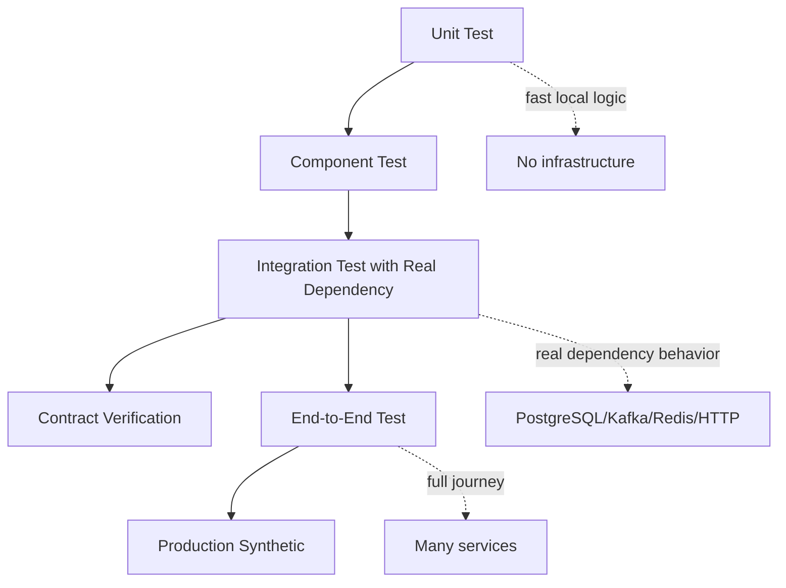
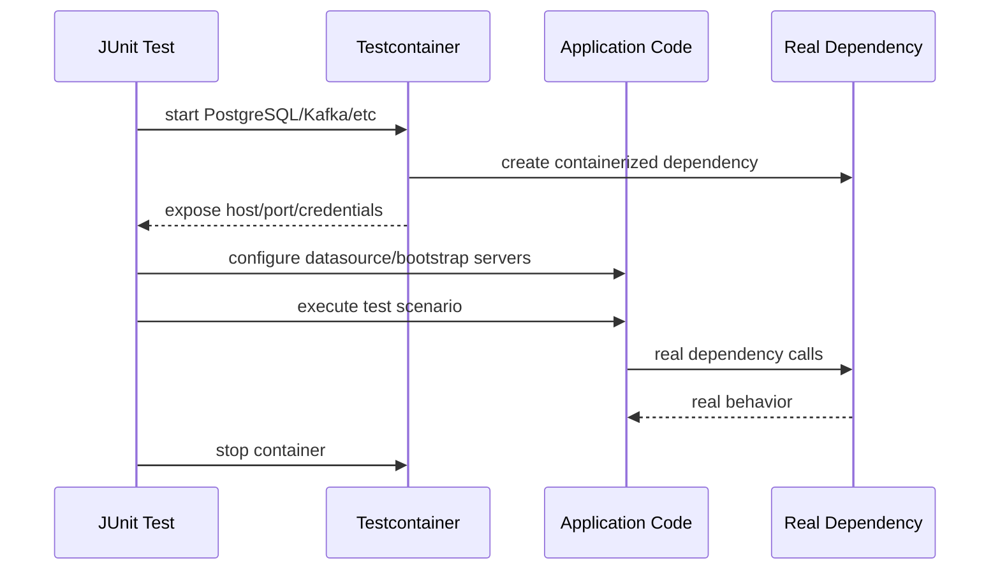

# Part 016 — Integration Testing with Real Infrastructure

> Tujuan bagian ini: membangun kemampuan integration testing Java service dengan dependency nyata seperti PostgreSQL, Kafka, Redis, HTTP services, migration tools, dan containerized infrastructure tanpa membuat test suite lambat, flaky, atau tidak bisa dipercaya.

Part sebelumnya membahas contract testing:

```text
Apakah pesan antar-service masih compatible?
```

Part ini membahas integration testing:

```text
Apakah kode Java kita benar-benar bekerja dengan dependency nyata?
```

Unit test bisa membuktikan domain logic benar.
Contract test bisa membuktikan message shape kompatibel.
Tetapi masih ada kelas bug yang hanya muncul saat bertemu dependency nyata:

```text
SQL syntax berbeda dari H2
PostgreSQL isolation behavior berbeda dari mock repository
Kafka consumer offset salah
transaction boundary bocor
JSONB operator salah
migration gagal
index tidak dipakai
connection pool exhausted
serialization config berbeda
timezone conversion salah
foreign key constraint dilanggar
retry menghasilkan duplicate insert
```

Integration testing adalah evidence untuk boundary implementasi.

---

## 1. Mental Model

Integration test menjawab:

```text
Can our code use a real dependency correctly under controlled conditions?
```

Bukan:

```text
Does the whole business journey work end to end?
```

Bukan juga:

```text
Can I mock everything and still feel safe?
```

Integration test yang baik punya ciri:

- dependency nyata,
- scope terbatas,
- setup deterministic,
- data isolated,
- runtime masih layak untuk CI,
- failure mudah didiagnosis,
- tidak bergantung shared environment,
- tidak memerlukan urutan test,
- tidak menguji hal yang lebih cocok untuk unit/contract/E2E.

Diagram posisi:



---

## 2. Why H2/Mocks Are Not Enough

Mock repository:

```java
when(caseRepository.findById("CASE-1001"))
    .thenReturn(Optional.of(caseRecord));
```

This tests service behavior given repository output.
It does not test:

```text
SQL syntax
transaction behavior
constraint behavior
index behavior
JSONB mapping
timestamp precision
numeric scale
locking semantics
connection pool behavior
migration correctness
```

H2/in-memory database can be useful for some fast tests.
But H2 is not PostgreSQL.

Bug examples that H2/mock might miss:

```sql
SELECT * FROM cases WHERE metadata @> '{"priority":"HIGH"}'::jsonb;
```

This is PostgreSQL-specific.

```sql
INSERT INTO case_transition(case_id, transition_id)
VALUES (?, ?)
ON CONFLICT (case_id, idempotency_key) DO NOTHING;
```

This depends on PostgreSQL conflict semantics.

```sql
SELECT * FROM cases WHERE status = ANY(?);
```

Array binding can differ by driver/database.

Integration test should use the same database engine when behavior matters.

---

## 3. Testcontainers Mental Model

Testcontainers for Java provides lightweight, throwaway instances of common dependencies for tests.

Think of it as:

```text
JUnit test controls disposable infrastructure.
```

Lifecycle:



Important idea:

```text
The dependency is real, but the environment is disposable.
```

This gives realism without shared staging fragility.

---

## 4. What Belongs in Integration Tests?

Good integration test targets:

```text
repository SQL
migration scripts
transaction boundaries
message publication/consumption
serialization/deserialization with real config
HTTP adapter behavior
cache adapter behavior
locking/idempotency behavior
outbox/inbox persistence
retry with real persistence
constraint violations
pagination/query correctness
```

Poor integration test targets:

```text
all domain rule combinations
UI behavior
every service journey
simple getters/setters
mocked repository behavior
performance claims
formal workflow proof
```

Rule:

```text
Use integration tests where the risk is in the integration surface, not pure logic.
```

---

## 5. Integration Test Taxonomy

### 5.1 Adapter Integration Test

Tests one adapter against real dependency.

Example:

```text
PostgresCaseRepositoryTest
KafkaCaseEventPublisherTest
RedisIdempotencyStoreTest
HttpOfficerDirectoryClientTest
```

Scope is small.
Good for fast feedback.

### 5.2 Component Integration Test

Tests application component with real dependencies.

Example:

```text
CaseTransitionApplicationService + PostgreSQL + Kafka test topic
```

Scope includes domain orchestration and adapters.

### 5.3 Slice Integration Test

Tests one vertical slice.

Example:

```text
JAX-RS resource -> application service -> PostgreSQL -> outbox table
```

No full UI.
No unrelated services.

### 5.4 Multi-Dependency Integration Test

Tests interaction between dependencies.

Example:

```text
transaction writes case transition + outbox
publisher reads outbox and publishes Kafka event
consumer stores projection
```

Use sparingly.

---

## 6. PostgreSQL Integration Testing

PostgreSQL integration tests should cover:

```text
schema migration
repository queries
constraints
unique keys
foreign keys
transaction behavior
locking
pagination
JSONB
array binding
timestamp precision
numeric scale
isolation-sensitive logic
```

### 6.1 Basic Testcontainers Shape

```java
@Testcontainers
class PostgresCaseRepositoryTest {

    @Container
    static PostgreSQLContainer<?> postgres = new PostgreSQLContainer<>("postgres:16-alpine")
        .withDatabaseName("case_test")
        .withUsername("test")
        .withPassword("test");

    private CaseRepository repository;

    @BeforeEach
    void setUp() {
        DataSource dataSource = createDataSource(
            postgres.getJdbcUrl(),
            postgres.getUsername(),
            postgres.getPassword()
        );

        migrate(dataSource);
        truncateTables(dataSource);

        repository = new PostgresCaseRepository(dataSource);
    }

    @Test
    void findsCaseByPublicId() {
        repository.insert(new CaseRecord("CASE-1001", "UNDER_REVIEW", "OFF-7"));

        Optional<CaseRecord> result = repository.findByPublicId("CASE-1001");

        assertThat(result).isPresent();
        assertThat(result.get().status()).isEqualTo("UNDER_REVIEW");
    }
}
```

Focus on pattern, not exact imports.

Essential elements:

```text
real PostgreSQL container
real DataSource
real migration
real repository
isolated data per test
assertion on semantic result
```

### 6.2 Migration Must Run in Tests

Bad:

```text
Test creates tables manually with simplified schema.
```

Good:

```text
Test runs the same migration scripts used in production deployment.
```

Why?

Migration itself is an integration boundary.

It can fail because:

```text
invalid SQL
wrong column type
missing index
bad default
incompatible constraint
lock-heavy migration
wrong extension
wrong schema name
```

Integration tests should catch migration drift early.

---

## 7. Data Isolation Strategies

Integration tests often fail because data leaks across tests.

Common strategies:

| Strategy | Benefit | Cost | Use When |
|---|---|---|---|
| Truncate tables before each test | Simple, fast enough | Need FK ordering/cascade | Most repository tests |
| Transaction rollback per test | Fast | Can hide commit behavior | Pure DB reads/writes without async |
| Recreate schema per test class | Strong isolation | Slower | Complex migration/state tests |
| New container per test class | Very isolated | Slower | Different DB config needed |
| New container per test method | Maximum isolation | Expensive | Rare, high-risk isolation bugs |

### 7.1 Truncation Pattern

```sql
TRUNCATE TABLE
    case_transition,
    case_event_outbox,
    cases,
    officers
RESTART IDENTITY CASCADE;
```

Make it explicit.
Do not rely on test order.

### 7.2 Transaction Rollback Trap

Rollback-per-test is useful but can lie.

If production code uses:

```text
commit transaction -> outbox publisher sees row -> Kafka event emitted
```

Then wrapping the whole test in rollback may hide commit-dependent behavior.

Rule:

```text
Do not use rollback isolation for tests that verify commit, outbox, async consumers, locks, or transaction visibility.
```

---

## 8. Testing Constraints

Database constraints are executable domain safeguards.

Example migration:

```sql
CREATE TABLE cases (
    id BIGSERIAL PRIMARY KEY,
    public_id TEXT NOT NULL UNIQUE,
    status TEXT NOT NULL,
    assigned_officer_id TEXT NULL,
    created_at TIMESTAMPTZ NOT NULL DEFAULT now()
);

ALTER TABLE cases
ADD CONSTRAINT cases_status_check
CHECK (status IN ('DRAFT', 'UNDER_REVIEW', 'ESCALATED', 'CLOSED'));
```

Test the constraint intentionally:

```java
@Test
void rejectsInvalidStatusAtDatabaseBoundary() {
    assertThatThrownBy(() -> jdbc.update("""
        INSERT INTO cases(public_id, status)
        VALUES (?, ?)
        """, "CASE-1001", "BROKEN"))
        .hasMessageContaining("cases_status_check");
}
```

Why test database constraint if domain code already validates?

Because defense in depth.

```text
Domain validation prevents normal invalid writes.
Database constraints prevent bypass/corruption.
```

---

## 9. Testing Transaction Boundaries

Transaction bugs are common in Java service code.

Scenarios:

```text
case updated but audit row missing
outbox row inserted but domain update rolled back
exception swallowed and transaction committed
retry duplicates transition
read-your-own-write assumption false
lock timeout not handled
```

Test transaction semantics directly.

Example expected rollback:

```java
@Test
void rollsBackCaseTransitionWhenOutboxInsertFails() {
    insertCase("CASE-1001", "UNDER_REVIEW");
    makeOutboxInsertFailByConstraint();

    assertThatThrownBy(() -> service.escalate("CASE-1001", "SLA_BREACH"))
        .isInstanceOf(OutboxWriteException.class);

    assertCaseStatus("CASE-1001", "UNDER_REVIEW");
    assertNoTransitionRecorded("CASE-1001");
    assertNoOutboxEvent("CASE-1001");
}
```

This test belongs at integration/component layer because transaction behavior depends on real persistence.

---

## 10. Testing Idempotency with Real Database

Idempotency is often incorrectly tested with mocks.

Real test:

```java
@Test
void repeatedCommandWithSameIdempotencyKeyDoesNotDuplicateTransition() {
    insertCase("CASE-1001", "UNDER_REVIEW");

    TransitionResult first = service.escalate(
        new EscalateCase("CASE-1001", "SLA_BREACH", "OFF-7", "idem-1")
    );

    TransitionResult second = service.escalate(
        new EscalateCase("CASE-1001", "SLA_BREACH", "OFF-7", "idem-1")
    );

    assertThat(second.transitionId()).isEqualTo(first.transitionId());
    assertTransitionCount("CASE-1001", 1);
    assertOutboxEventCount("CASE-1001", "CaseEscalated", 1);
}
```

This catches:

```text
unique index missing
conflict handling wrong
transaction retry duplicates outbox
service returns different transitionId
```

Idempotency is a database + application boundary property.

---

## 11. Kafka Integration Testing

Kafka integration tests should cover:

```text
producer serialization
message key
headers
topic config assumption
consumer deserialization
offset commit behavior
idempotent processing
dead-letter behavior
ordering assumptions
outbox publisher integration
```

Testcontainers provides Kafka modules for running Kafka containers in tests.

### 11.1 Producer Test Shape

```java
@Testcontainers
class KafkaCaseEventPublisherTest {

    @Container
    static KafkaContainer kafka = new KafkaContainer("apache/kafka-native:3.8.0");

    private CaseEventPublisher publisher;
    private KafkaConsumer<String, String> consumer;

    @BeforeEach
    void setUp() {
        String bootstrapServers = kafka.getBootstrapServers();
        createTopic(bootstrapServers, "case-events");
        publisher = new KafkaCaseEventPublisher(bootstrapServers, "case-events");
        consumer = createConsumer(bootstrapServers, "test-group");
        consumer.subscribe(List.of("case-events"));
    }

    @Test
    void publishesCaseEscalatedWithCaseIdAsKey() {
        publisher.publish(new CaseEscalated("CASE-1001", "UNDER_REVIEW", "ESCALATED"));

        ConsumerRecord<String, String> record = pollOne(consumer);

        assertThat(record.key()).isEqualTo("CASE-1001");
        assertThat(record.value()).contains("CaseEscalated");
        assertThat(record.headers().lastHeader("eventType").value())
            .isEqualTo("CaseEscalated".getBytes(UTF_8));
    }
}
```

The point is not syntax.
The point is evidence:

```text
real Kafka producer config
real serialization
real topic
real key/header behavior
```

### 11.2 Consumer Test Shape

```java
@Test
void consumesCaseEscalatedAndUpdatesProjection() {
    publishToKafka("case-events", "CASE-1001", caseEscalatedJson());

    await().untilAsserted(() -> {
        CaseProjection projection = projectionRepository.find("CASE-1001").orElseThrow();
        assertThat(projection.status()).isEqualTo("ESCALATED");
    });
}
```

Async integration tests need waiting based on condition, not sleep.

Bad:

```java
Thread.sleep(5000);
```

Better:

```java
await().atMost(Duration.ofSeconds(10)).untilAsserted(...);
```

Sleep makes tests slow and flaky.
Condition waiting makes intent explicit.

---

## 12. Kafka Offset and Idempotent Consumer Testing

Consumer bugs often hide until duplicate messages or restart.

Test duplicate handling:

```java
@Test
void duplicateEventDoesNotDuplicateProjectionHistory() {
    String event = caseEscalatedEvent("evt-1001", "CASE-1001");

    publish(event);
    publish(event);

    await().untilAsserted(() -> {
        assertProjectionStatus("CASE-1001", "ESCALATED");
        assertProjectionHistoryCount("CASE-1001", 1);
        assertProcessedEventExists("evt-1001");
    });
}
```

Test poison message behavior:

```java
@Test
void malformedMessageGoesToDeadLetterTopic() {
    publishRaw("case-events", "CASE-1001", "{not-json");

    ConsumerRecord<String, String> dlqRecord = pollFrom("case-events.dlq");

    assertThat(dlqRecord.key()).isEqualTo("CASE-1001");
    assertThat(dlqRecord.value()).contains("not-json");
}
```

These are integration tests because real consumer runtime behavior matters.

---

## 13. Testing Outbox Pattern

Outbox pattern:

```text
write domain state and event record in same database transaction
publisher later reads outbox and publishes to Kafka
mark event as published
```

Why used:

```text
avoid state committed but event lost
avoid event emitted but state rolled back
```

Integration test should cover the atomic write:

```java
@Test
void transitionWritesCaseStateAndOutboxAtomically() {
    insertCase("CASE-1001", "UNDER_REVIEW");

    service.escalate("CASE-1001", "SLA_BREACH", "idem-1");

    assertCaseStatus("CASE-1001", "ESCALATED");
    assertOutboxContains("CASE-1001", "CaseEscalated");
}
```

And publisher behavior:

```java
@Test
void outboxPublisherPublishesAndMarksEvent() {
    insertOutboxEvent("evt-1001", "CaseEscalated", "CASE-1001");

    publisher.publishPending();

    ConsumerRecord<String, String> record = pollOne(kafkaConsumer);
    assertThat(record.key()).isEqualTo("CASE-1001");
    assertOutboxMarkedPublished("evt-1001");
}
```

And failure behavior:

```java
@Test
void failedPublishLeavesOutboxPendingForRetry() {
    insertOutboxEvent("evt-1001", "CaseEscalated", "CASE-1001");
    makeKafkaUnavailable();

    assertThatThrownBy(() -> publisher.publishPending())
        .isInstanceOf(EventPublishException.class);

    assertOutboxStillPending("evt-1001");
}
```

This last test may require controlled failure injection.

---

## 14. External HTTP Service Integration

If your Java service calls another HTTP service, integration options:

```text
mock server with real HTTP
contract provider/consumer test
sandbox dependency
real local fake service container
```

Avoid pure Java mocks for HTTP adapter tests.

Adapter should be tested with real HTTP semantics:

```text
status code
headers
timeouts
body parsing
connection failure
malformed response
retryable response
non-retryable response
```

Example using a mock HTTP server conceptually:

```java
@Test
void maps404FromOfficerDirectoryToOfficerNotFound() {
    officerDirectoryServer.stubForGet("/officers/OFF-404")
        .respond(404, "application/json", """
            {"code":"OFFICER_NOT_FOUND","message":"Officer not found"}
        """);

    assertThatThrownBy(() -> client.getOfficer("OFF-404"))
        .isInstanceOf(OfficerNotFoundException.class);
}
```

This is integration testing for adapter behavior.

It should verify:

```text
URL path encoding
query params
headers
timeout config
error mapping
JSON parsing
```

---

## 15. Network Failure Testing

Real distributed systems fail through network behavior:

```text
connection refused
connection reset
timeout
slow response
partial response
DNS failure
TLS failure
429 throttling
503 overload
```

Integration tests should cover at least:

```text
timeout is bounded
retry policy does not retry non-idempotent operation blindly
circuit breaker opens after repeated failure
fallback does not corrupt state
error is observable
```

Example:

```java
@Test
void officerLookupTimeoutFailsWithoutChangingCaseState() {
    officerDirectoryServer.respondSlowly(Duration.ofSeconds(30));
    insertCase("CASE-1001", "UNDER_REVIEW");

    assertThatThrownBy(() -> service.assignOfficer("CASE-1001", "OFF-7"))
        .isInstanceOf(OfficerDirectoryTimeoutException.class);

    assertCaseStillUnassigned("CASE-1001");
}
```

The invariant is not just timeout.

The invariant is:

```text
Failure to verify officer must not partially assign case.
```

---

## 16. Redis/Cache Integration Testing

Cache tests should verify:

```text
key format
TTL
serialization
cache miss behavior
cache invalidation
idempotency storage
lock behavior if used
```

Example:

```java
@Test
void idempotencyRecordExpiresAfterTtl() {
    IdempotencyStore store = new RedisIdempotencyStore(redisClient, Duration.ofSeconds(2));

    store.save("idem-1", "TRN-1");

    assertThat(store.find("idem-1")).contains("TRN-1");

    await().atMost(Duration.ofSeconds(5))
        .untilAsserted(() -> assertThat(store.find("idem-1")).isEmpty());
}
```

This test is slower but valuable if TTL correctness matters.

Be careful:

```text
TTL tests are time-based.
Keep them few and isolate them from fast suites.
```

---

## 17. Test Runtime Budget

Integration tests are more expensive than unit tests.

Use suite classification:

```text
unit: every local run, every PR
component: every PR
integration-fast: every PR
integration-full: pre-merge or main branch
soak/load: scheduled or release gate
```

JUnit tags:

```java
@Tag("integration")
class PostgresCaseRepositoryTest {}
```

Maven/Gradle can split suites:

```text
mvn test -Dgroups=unit
mvn verify -Dgroups=integration
```

Or with naming:

```text
*Test.java        unit/component
*IT.java          integration
*E2E.java         end-to-end
```

Naming is not enough.
CI must enforce suite boundaries.

---

## 18. Container Lifecycle Trade-Off

### Static container per class

```java
@Container
static PostgreSQLContainer<?> postgres = ...;
```

Pros:

```text
faster startup
shared within class
```

Cons:

```text
must isolate data manually
class-level shared state risk
```

### Container per test method

```java
@Container
PostgreSQLContainer<?> postgres = ...;
```

Pros:

```text
strong isolation
```

Cons:

```text
slow
resource-heavy
```

Practical default:

```text
Use one container per test class or suite.
Clean data explicitly before each test.
```

Use per-method container only when configuration/state isolation is more important than speed.

---

## 19. Parallel Test Execution Risks

Integration tests can run in parallel only if they isolate:

```text
database schema/table data
topics
consumer groups
ports
files
external mock server state
cache keys
```

Bad parallel setup:

```text
all tests use topic case-events and group test-group
```

They will steal messages from each other.

Better:

```java
String topic = "case-events-" + testRunId();
String consumerGroup = "test-group-" + testRunId();
```

For database:

```text
schema per test class
or truncate + no parallel DB tests
or unique IDs per test
```

Parallelism is not free.

---

## 20. Deterministic Test Data

Use test data builders from Part 006.

Bad:

```java
insertRandomCase();
```

Better:

```java
CaseRecord caseRecord = aCase()
    .withPublicId("CASE-1001")
    .withStatus("UNDER_REVIEW")
    .withAssignedOfficer("OFF-7")
    .build();
```

Deterministic IDs help diagnose failures.

Use randomization only when testing robustness/property behavior, and always log seed.

---

## 21. Diagnosability

Integration test failure should answer:

```text
what dependency failed?
what data was present?
what SQL/message/request happened?
what invariant failed?
```

Improve diagnostics with:

```text
container logs on failure
SQL logging for failed tests
test scenario names
assertions on semantic state
correlation IDs
unique test IDs
captured Kafka records
DB snapshot helper
```

Bad assertion:

```java
assertThat(result).isTrue();
```

Good assertion:

```java
assertThat(findCase("CASE-1001"))
    .as("case should remain UNDER_REVIEW after outbox failure")
    .extracting(CaseRecord::status)
    .isEqualTo("UNDER_REVIEW");
```

---

## 22. Integration Tests and Performance

Do not claim performance from normal integration tests.

Integration tests are not benchmarks because:

```text
container startup noise
shared CI hardware
small datasets
non-representative workload
assertion overhead
JIT warmup not controlled
```

But integration tests can catch performance-adjacent problems:

```text
N+1 queries visible in query count
missing index discovered by explain plan smoke test
connection leak
unbounded query result
slow timeout config
```

Example query count assertion:

```text
Fetching first page of cases should not execute one query per case.
```

This is not a throughput benchmark.
It is a structural performance guard.

---

## 23. Testing SQL Query Plans Carefully

For critical queries, add explain-plan smoke tests.

```sql
EXPLAIN (FORMAT JSON)
SELECT *
FROM cases
WHERE status = 'UNDER_REVIEW'
ORDER BY created_at DESC
LIMIT 50;
```

Test may check:

```text
query uses expected index
query does not do sequential scan for large table shape
query remains under structural plan expectation
```

Be cautious:

```text
query plans depend on data statistics
small test data can mislead
PostgreSQL version changes can alter plans
```

Use this only for critical queries and with representative seed volume.

---

## 24. CI Reliability

Integration tests in CI need infrastructure discipline.

Checklist:

```text
Docker available
container image versions pinned
resource limits known
no dependency on external internet during test
no fixed host ports unless necessary
logs captured on failure
test timeout enforced
parallelism controlled
flaky tests quarantined with owner
images cached where possible
```

Avoid:

```text
latest image tags
shared staging database
fixed topic names across builds
sleep-based async waits
tests that pass only on developer machine
```

Pin images:

```java
new PostgreSQLContainer<>("postgres:16.3-alpine")
```

Using `latest` makes test environment change without code review.

---

## 25. Real Infrastructure Does Not Mean Real Everything

A good integration test may use:

```text
real PostgreSQL
real Kafka
fake external HTTP service
in-memory clock
fake email sender
```

Because the test target is specific.

Example:

```text
Testing case transition persistence + event outbox.
```

Use real:

```text
PostgreSQL
transaction manager
outbox repository
```

Fake:

```text
officer directory
email notification
current time
random ID generator
```

This keeps scope controlled.

Rule:

```text
Make real the dependency whose behavior is the risk.
Fake the dependencies that are irrelevant to the assertion.
```

---

## 26. Integration Test Architecture

Recommended package structure:

```text
src/test/java
  unit/
  component/
  integration/
    postgres/
      PostgresCaseRepositoryIT.java
      PostgresOutboxRepositoryIT.java
    kafka/
      KafkaCaseEventPublisherIT.java
      CaseEventConsumerIT.java
    http/
      OfficerDirectoryClientIT.java
    slices/
      CaseTransitionSliceIT.java
```

Shared support:

```text
src/test/java/support/
  containers/
    PostgresTestContainer.java
    KafkaTestContainer.java
  db/
    DatabaseCleaner.java
    MigrationRunner.java
    TestDataInserter.java
  kafka/
    KafkaTestClient.java
  http/
    MockServerSupport.java
  assertions/
    CaseAssertions.java
```

Keep support code boring.
Complex test infrastructure becomes its own bug factory.

---

## 27. Case Study: Regulatory Case Transition Slice

System slice:

```text
JAX-RS endpoint
  -> CaseTransitionApplicationService
  -> PostgreSQL case tables
  -> outbox table
  -> Kafka publisher job
```

Invariant:

```text
A successful escalation must atomically update case status, record transition history, create outbox event, and eventually publish exactly one CaseEscalated message keyed by caseId.
```

### 27.1 Slice Test

```java
@Test
void escalateCasePersistsTransitionAndCreatesOutboxEvent() {
    insertOfficer("OFF-7");
    insertCase("CASE-1001", "UNDER_REVIEW", "OFF-7");

    Response response = http.post(
        "/cases/CASE-1001/transitions",
        headers("Idempotency-Key", "idem-1"),
        json("""
          {
            "action": "ESCALATE",
            "reasonCode": "SLA_BREACH",
            "actorId": "OFF-7"
          }
        """)
    );

    assertThat(response.status()).isEqualTo(200);
    assertCaseStatus("CASE-1001", "ESCALATED");
    assertTransitionHistory("CASE-1001", "UNDER_REVIEW", "ESCALATED");
    assertOutboxContains("CaseEscalated", "CASE-1001");
}
```

### 27.2 Publisher Test

```java
@Test
void publisherEmitsOutboxEventToKafkaAndMarksPublished() {
    insertOutboxEvent("evt-1001", "CaseEscalated", "CASE-1001");

    outboxPublisher.publishPending();

    ConsumerRecord<String, String> record = pollOne("case-events");

    assertThat(record.key()).isEqualTo("CASE-1001");
    assertThat(record.value()).contains("CaseEscalated");
    assertOutboxPublished("evt-1001");
}
```

### 27.3 End-to-End-ish Slice

Use sparingly:

```java
@Test
void escalationEventuallyAppearsInProjection() {
    postEscalateCase("CASE-1001", "idem-1");
    outboxPublisher.publishPending();

    await().untilAsserted(() -> {
        assertProjectionStatus("CASE-1001", "ESCALATED");
    });
}
```

This test crosses more boundaries.
Keep it few.

---

## 28. Failure Modeling in Integration Tests

From Part 002, failure model should drive tests.

For each dependency, define failure modes:

| Dependency | Failure Mode | Expected Behavior |
|---|---|---|
| PostgreSQL | unique violation | return idempotent result or domain conflict |
| PostgreSQL | deadlock | retry if safe, otherwise fail bounded |
| PostgreSQL | unavailable | no partial side effect |
| Kafka | publish fails | outbox remains pending |
| Kafka | duplicate message | consumer idempotent |
| HTTP service | timeout | bounded failure, no state corruption |
| Redis | unavailable | degrade or fail according to policy |

Then write only high-value tests.

Do not test every possible infrastructure failure.
Test the failures that would corrupt state, duplicate side effects, or break recovery.

---

## 29. Common Integration Testing Anti-Patterns

### 29.1 Shared Staging as Integration Test Dependency

Bad:

```text
Tests depend on dev/staging database.
```

Problems:

```text
non-deterministic data
slow network
team interference
credential/security risk
cannot reproduce locally
```

### 29.2 Sleep-Based Async Test

Bad:

```java
Thread.sleep(10000);
assertProjectionUpdated();
```

Problems:

```text
slow when system fast
flaky when system slow
no diagnostic detail
```

### 29.3 Testing Too Much in One Test

Bad:

```text
create user, login, create case, assign officer, escalate, close, export report, send email
```

That is E2E flow, not integration test.

### 29.4 Mocking the Dependency Under Test

Bad:

```text
Postgres repository integration test mocks DataSource.
```

Then it is not integration testing.

### 29.5 Hidden Test Order Dependency

Bad:

```text
Test B expects data created by Test A.
```

JUnit does not guarantee this as a reliable engineering strategy.

---

## 30. What to Put in Pull Request Review

For integration test PRs, review:

```text
What real dependency behavior is being tested?
Could this be a unit test instead?
Is setup deterministic?
Is data isolated?
Does the test run in CI reliably?
Is async waiting condition-based?
Are image versions pinned?
Is failure diagnostic good?
Does it avoid testing unrelated behavior?
```

For repository tests, ask:

```text
Does it run migrations?
Does it use real PostgreSQL feature if production uses PostgreSQL?
Does it test constraints intentionally?
Does it cover important query branches?
```

For Kafka tests, ask:

```text
Does it verify key/header/payload?
Does it use unique topics/groups?
Does it test duplicate or malformed messages where relevant?
```

---

## 31. Operating Model

A mature Java codebase often has this testing portfolio:

```text
Many unit tests for domain rules.
Moderate component tests for application services.
Focused integration tests for repositories, Kafka, HTTP clients, and critical slices.
Few E2E tests for top business journeys.
Contract tests for service boundaries.
Performance tests separated from correctness integration tests.
```

Integration testing should not become dumping ground.

The discipline is:

```text
Every integration test must justify which real dependency behavior it protects.
```

---

## 32. Practical Exercise

Pick one service with PostgreSQL and Kafka.

Create these tests:

```text
1. Repository IT:
   insert, query, constraint violation, pagination.

2. Transaction IT:
   successful command writes state + outbox atomically.

3. Idempotency IT:
   duplicate command with same idempotency key creates one transition.

4. Producer IT:
   outbox publisher emits Kafka message with correct key/header/payload.

5. Consumer IT:
   duplicate Kafka event is processed once.

6. Failure IT:
   publish failure leaves outbox pending.
```

Then classify each:

```text
runs every PR?
runs nightly?
requires Docker?
parallel safe?
owner?
```

This turns integration testing from random tests into a system.

---

## 33. Checklist

Before you consider this part mastered, you should be able to:

- explain what integration tests prove and do not prove,
- choose real dependency only where behavior matters,
- use Testcontainers for disposable PostgreSQL/Kafka tests,
- run production migrations in tests,
- isolate test data deterministically,
- test transaction rollback/commit behavior,
- test idempotency with real constraints,
- test Kafka producer/consumer behavior with real broker,
- avoid sleep-based async tests,
- structure integration suites for CI reliability,
- diagnose failures with logs/state/correlation IDs,
- avoid turning integration tests into slow E2E tests.

---

## 34. Key Takeaways

```text
Mocked dependencies test your assumptions.
Real dependencies test the integration surface.
```

```text
Integration tests should be realistic where it matters and fake where it does not.
```

```text
Run real migrations in tests, or you are not testing the deployed database contract.
```

```text
The hardest part of integration testing is not starting containers.
It is isolation, scope control, diagnostics, and CI discipline.
```

---

## 35. References

- Testcontainers for Java: https://java.testcontainers.org/
- Testcontainers JUnit 5 Integration: https://java.testcontainers.org/test_framework_integration/junit_5/
- Testcontainers Kafka Module: https://java.testcontainers.org/modules/kafka/
- Testcontainers PostgreSQL Module: https://testcontainers.com/modules/postgresql/
- PostgreSQL Documentation: https://www.postgresql.org/docs/
- Apache Kafka Documentation: https://kafka.apache.org/documentation/
- Awaitility Documentation: https://awaitility.org/
- JUnit User Guide: https://docs.junit.org/
