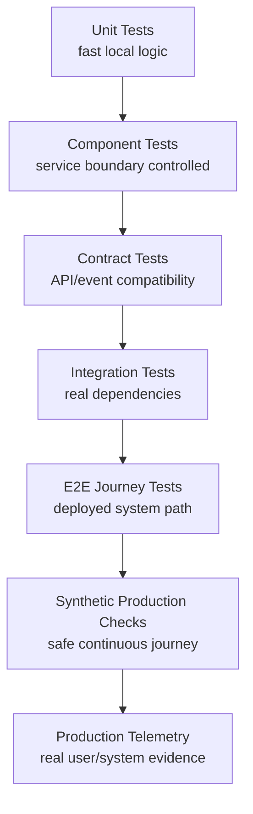
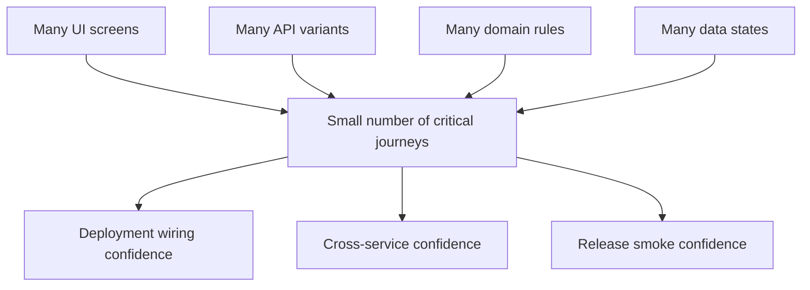
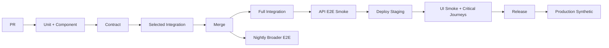

# Part 017 — End-to-End Testing Without Test Pyramid Collapse

> Tujuan bagian ini: membangun E2E testing yang memberi confidence terhadap business journey utama tanpa membuat test suite menjadi lambat, flaky, mahal, dan tidak dipercaya engineer.

Kita sudah membahas:

```text
unit test       -> apakah logic kecil benar?
component test  -> apakah satu komponen benar dengan boundary terkontrol?
contract test   -> apakah service boundary compatible?
integration test-> apakah kode bekerja dengan dependency nyata?
```

E2E test menjawab pertanyaan berbeda:

```text
Can a real user/system journey complete across deployed components?
```

Pertanyaan itu penting.
Tetapi E2E test juga berbahaya.

E2E test yang tidak dikontrol akan berubah menjadi:

```text
slow
flaky
expensive
hard to debug
order-dependent
data-dependent
environment-dependent
owned-by-nobody
```

Dan saat itu terjadi, test suite kehilangan fungsi utamanya:

```text
memberi signal yang dipercaya untuk mengambil keputusan release.
```

Bagian ini bukan tentang “semua harus E2E”.
Bagian ini tentang menggunakan E2E sebagai **thin, high-value, production-like evidence layer**.

---

## 1. Mental Model

E2E test bukan test paling kuat dalam semua hal.
E2E test adalah test dengan **scope paling lebar**.

Scope lebar berarti:

```text
lebih mirip production
lebih banyak komponen nyata
lebih banyak failure mode nyata
lebih banyak latency
lebih banyak nondeterminism
lebih sulit diagnosa
lebih mahal dijalankan
```

Maka E2E test harus dipakai untuk membuktikan hal yang memang tidak bisa dibuktikan dengan layer lebih rendah.

Contoh yang layak E2E:

```text
user can submit regulatory case and see final accepted status
case escalation journey crosses API, workflow engine, event bus, database, notification service
login + authorization + main business action works after deployment
order checkout path still works after service mesh/routing/config change
```

Contoh yang tidak layak E2E:

```text
validation rule for one field
all possible status transitions
all edge cases of date parsing
all pricing rule combinations
all failure branches of retry logic
all schema compatibility cases
```

Hal-hal itu lebih baik diuji dengan unit, property-based, contract, dan integration tests.

### Rule utama

```text
Use E2E tests for journey confidence, not exhaustive correctness.
```

---

## 2. Verification Ladder Position



E2E berada dekat production.
Artinya E2E bukan pengganti test di bawahnya.
E2E adalah **last-mile verification**.

Kalau E2E gagal, penyebabnya bisa banyak:

```text
frontend broken
API broken
auth broken
database migration broken
Kafka lagging
workflow engine down
feature flag wrong
routing wrong
config wrong
secret expired
timeout too aggressive
test data polluted
browser automation flaky
environment unhealthy
```

Itulah kenapa E2E punya high coverage of integration surface tetapi low diagnostic precision.

Layer bawah punya diagnostic precision lebih tinggi.

```text
Unit failure        -> usually points to one function/class.
Contract failure    -> usually points to boundary mismatch.
Integration failure -> usually points to service-dependency interaction.
E2E failure         -> says journey failed, diagnosis requires evidence.
```

---

## 3. Kenapa Test Pyramid Bisa Collapse

Test pyramid collapse terjadi saat terlalu banyak correctness expectation dipindahkan ke E2E.

Gejalanya:

```text
E2E suite takes > 30 minutes on every PR
engineers rerun failed jobs until green
failures are ignored as flaky
one test failure blocks unrelated teams
nobody knows owner of failed journey
shared test data causes random failures
all tests depend on same staging environment
E2E tests assert internal database details
UI tests use CSS selectors that change often
sleep-based waits create random timing failures
```

Penyebab strukturalnya:

```text
1. unclear scope
2. missing lower-level tests
3. weak test data ownership
4. unstable environment
5. poor observability
6. no flakiness governance
7. every team adds tests but nobody removes tests
8. tests verify too many things at once
```

E2E suite runtuh bukan karena tool buruk.
Ia runtuh karena tidak ada architecture.

---

## 4. Decision Rule: Apakah Ini Harus E2E?

Gunakan decision table berikut.

| Pertanyaan | Kalau Ya | Kalau Tidak |
|---|---:|---:|
| Apakah behavior melintasi beberapa deployed component? | kandidat E2E | layer bawah cukup |
| Apakah failure sering muncul karena wiring/config/routing/deployment? | kandidat E2E | integration/contract cukup |
| Apakah journey ini critical untuk revenue/compliance/safety? | kandidat E2E | mungkin smoke kecil |
| Apakah kombinasi state sangat banyak? | jangan exhaust di E2E | property/model-based |
| Apakah oracle membutuhkan internal DB detail? | jangan E2E | integration test |
| Apakah test bisa deterministic dengan data sendiri? | lanjut | desain ulang |
| Apakah failure bisa didiagnosa dengan trace/log/artifact? | lanjut | tambahkan observability dulu |

Prinsip praktis:

```text
E2E should cover the narrow waist of critical journeys.
```

Bukan semua fitur.
Bukan semua branch.
Bukan semua validation.

---

## 5. Jenis E2E Test

Tidak semua E2E sama.

### 5.1 Smoke E2E

Tujuan:

```text
apakah deployment hidup dan core path bisa dilalui?
```

Ciri:

```text
sedikit
cepat
jalan setelah deploy
blocking untuk release
coverage sempit
```

Contoh:

```text
login -> create case -> submit -> see accepted status
```

### 5.2 Journey E2E

Tujuan:

```text
apakah business journey utama berjalan across components?
```

Ciri:

```text
lebih panjang dari smoke
bisa jalan PR/staging/nightly
punya owner jelas
punya test data dedicated
```

Contoh:

```text
create case -> assign investigator -> request evidence -> approve escalation -> close case
```

### 5.3 Regression E2E

Tujuan:

```text
mencegah bug produksi tertentu muncul lagi pada journey penting.
```

Bahaya:

```text
semua production bug dijadikan E2E test
```

Aturan:

```text
Kalau bug bisa dicegah dengan unit/property/contract/integration, jangan jadikan E2E.
```

### 5.4 Synthetic Production E2E

Tujuan:

```text
continuous verification di production dengan safe test account/data.
```

Ciri:

```text
non-destructive
isolated tenant/account
rate limited
alerting-aware
observability-rich
```

Ini bukan pengganti monitoring.
Ini production probe berbasis journey.

---

## 6. API E2E vs UI E2E

Untuk sistem Java backend, tidak semua E2E harus lewat browser.

### API E2E

API E2E menjalankan journey melalui HTTP/API/message boundary.

Cocok untuk:

```text
backend workflow
service orchestration
case lifecycle
order lifecycle
payment lifecycle
eventual consistency
authorization boundary via token
```

Kelebihan:

```text
lebih cepat
lebih stabil
lebih mudah didiagnosa
lebih dekat ke service contract
```

Kekurangan:

```text
tidak membuktikan UI wiring
belum membuktikan browser behavior
belum membuktikan actual user interaction
```

### UI E2E

UI E2E menjalankan journey lewat browser automation.

Cocok untuk:

```text
critical user-facing flows
login/session/cookie behavior
form rendering and submission
navigation
role-based visibility
frontend-backend wiring
```

Kelebihan:

```text
paling dekat dengan human user path
mendeteksi wiring bug antara UI dan backend
```

Kekurangan:

```text
lebih lambat
lebih rentan flake
lebih sulit debug
selector bisa rapuh
async rendering membuat wait rumit
```

### Recommendation

Untuk enterprise Java system:

```text
Most journey E2E should be API-level.
A very small number should be UI-level.
```

UI E2E dipakai untuk membuktikan bahwa UI path utama hidup.
API E2E dipakai untuk membuktikan business journey lebih luas.

---

## 7. Thin Waist Strategy

Bayangkan sistem punya banyak frontend, banyak service, banyak dependency.

Kalau semua kombinasi diuji E2E, suite akan meledak.

Thin waist strategy:

```text
pilih beberapa perjalanan kritikal yang melewati jalur representatif
uji dengan data dan environment production-like
jangan enumerasi semua variasi
pindahkan variasi ke layer bawah
```



Contoh:

```text
Ada 84 validation rules untuk case submission.
Jangan buat 84 UI E2E tests.

Buat:
- unit/property tests untuk validation rules
- contract tests untuk API error shape
- integration tests untuk persistence constraint
- 1 UI E2E untuk happy path submission
- 1 UI E2E untuk representative validation failure
```

Ini bukan menurunkan quality.
Ini meningkatkan signal-to-cost ratio.

---

## 8. Anatomy of a Production-Grade E2E Test

E2E test yang baik punya struktur:

```text
1. declare journey intent
2. create isolated test data
3. authenticate with controlled identity
4. execute user/system actions
5. wait for externally observable state
6. assert business outcome
7. collect diagnostics on failure
8. cleanup or mark data disposable
```

Contoh API E2E dengan JUnit:

```java
@Tag("e2e")
class CaseSubmissionJourneyE2ETest {

    private final CaseApi caseApi = ApiClients.caseApi();
    private final AuthClient auth = ApiClients.auth();

    @Test
    void officerCanSubmitCaseAndSeeAcceptedStatus() {
        var runId = RunId.newRunId();
        var token = auth.loginAs("officer-e2e");

        var draft = caseApi.createDraft(token, new CreateCaseRequest(
            "CASE-" + runId.value(),
            "MARKET_ABUSE",
            "LOW",
            List.of(new PartyRequest("ACME-" + runId.value()))
        ));

        caseApi.submit(token, draft.caseId());

        await().atMost(Duration.ofSeconds(30))
            .pollInterval(Duration.ofMillis(500))
            .untilAsserted(() -> {
                var view = caseApi.getCase(token, draft.caseId());
                assertThat(view.status()).isEqualTo("ACCEPTED");
                assertThat(view.auditTrail())
                    .extracting(AuditEntry::action)
                    .contains("CASE_SUBMITTED", "CASE_ACCEPTED");
            });
    }
}
```

Observe beberapa hal:

```text
runId unique
identity controlled
assertion business-level
async wait uses condition, not Thread.sleep
no internal database assertion
```

---

## 9. E2E Test Should Assert Business Outcome, Not Implementation Detail

Bad E2E assertion:

```java
assertThat(database.query("select workflow_state from wf_case where id=?", caseId))
    .isEqualTo("S7_AWAITING_DISPATCH");
```

Masalah:

```text
E2E test sekarang tahu schema internal
refactor database memecahkan test walaupun behavior benar
failure tidak merepresentasikan user-visible/system-visible outcome
```

Better:

```java
var view = caseApi.getCase(token, caseId);
assertThat(view.status()).isEqualTo("AWAITING_DISPATCH");
assertThat(view.availableActions()).contains("ASSIGN_INVESTIGATOR");
```

Atau untuk event-driven system:

```java
var notification = notificationProbe.findByCorrelationId(correlationId);
assertThat(notification.type()).isEqualTo("CASE_DISPATCH_READY");
```

E2E boleh memakai test probe.
Tetapi probe harus merepresentasikan boundary observable.

```text
Good probe: API, event topic, notification sink, audit endpoint, exported report.
Risky probe: private table, private class, internal cache.
```

---

## 10. Test Data Strategy

E2E flakiness sering berasal dari data.

Anti-pattern:

```text
all tests use same user
all tests use same account/customer/case
manual staging data reused forever
tests depend on data created by previous test
cleanup deletes shared data
```

Production-grade strategy:

```text
1. every test run has runId
2. every entity name includes runId
3. test users are dedicated
4. test tenant/account is dedicated
5. data is disposable
6. cleanup is best-effort, not required for correctness
7. assertions filter by correlation/runId
```

### Run ID

```java
public record RunId(String value) {
    public static RunId newRunId() {
        return new RunId("e2e-" + Instant.now().toEpochMilli() + "-" + UUID.randomUUID());
    }
}
```

Use it everywhere:

```text
case external reference
customer name
idempotency key
correlation id
request header
audit metadata
log context
```

Example:

```java
var correlationId = runId.value();
request.header("X-Correlation-Id", correlationId);
request.header("Idempotency-Key", runId.value() + ":submit-case");
```

Jika test gagal, runId menjadi jangkar investigasi.

---

## 11. Setup Data via API, Not UI

Untuk UI E2E, jangan semua setup dilakukan lewat UI.

Bad:

```text
login -> click admin -> create user -> create account -> create case -> open case -> test one button
```

Masalah:

```text
terlalu panjang
terlalu banyak failure cause
lambat
sulit debug
```

Better:

```text
setup via API/test fixture endpoint
then test UI behavior under target state
```

Contoh:

```java
@BeforeEach
void setup() {
    testDataApi.createCaseReadyForAssignment(runId);
}

@Test
void investigatorCanAssignCaseFromUi() {
    loginPage.loginAs("supervisor-e2e");
    casePage.open(runId.caseReference());
    casePage.assignTo("investigator-e2e");
    casePage.expectStatus("ASSIGNED");
}
```

E2E test bukan berarti semua langkah harus manual seperti manusia.
Yang penting journey target diuji lewat boundary yang tepat.

---

## 12. Fixture Endpoint: Useful but Dangerous

Banyak organisasi membuat test-only endpoint:

```text
POST /test-fixtures/cases/ready-for-assignment
POST /test-fixtures/users/e2e-session
POST /test-fixtures/reset-tenant
```

Ini berguna.
Tetapi berbahaya jika masuk production tanpa guard.

Aturan:

```text
1. endpoint only enabled in non-prod, unless synthetic production explicitly designed
2. protected by strong auth
3. audited
4. cannot create impossible state unless test explicitly needs impossible state
5. owned by platform/test infrastructure team
6. schema/versioned like normal API
```

Fixture endpoint tidak boleh menjadi jalan pintas yang menciptakan state yang tidak mungkin terjadi di production.

Kalau test setup menciptakan impossible state, E2E result tidak valid.

---

## 13. UI Locator Strategy

UI E2E yang memakai selector rapuh akan sering gagal.

Bad:

```text
button:nth-child(3)
.main > div > div > span
text=Submit
```

Better:

```text
role-based locator
label-based locator
stable test id for critical controls
```

Contoh dengan Playwright Java:

```java
page.getByRole(AriaRole.BUTTON,
    new Page.GetByRoleOptions().setName("Submit case")
).click();

page.getByTestId("case-status").textContent();
```

Rule:

```text
Prefer user-facing semantics.
Use test ids for stable business-critical elements.
Avoid CSS structure selectors.
```

Test id bukan dosa.
Test id adalah contract antara UI dan automation.
Tetapi jangan membuat test id untuk semua hal.

Gunakan untuk elemen yang:

```text
critical
hard to locate semantically
likely to be visually refactored
business meaningful
```

---

## 14. Waiting Strategy

Sleep adalah penyebab klasik flaky/slow E2E.

Bad:

```java
Thread.sleep(5000);
assertThat(page.locator("#status").textContent()).isEqualTo("ACCEPTED");
```

Dua masalah:

```text
kalau sistem selesai 100 ms, test membuang waktu
kalau sistem selesai 6 detik, test gagal random
```

Better:

```java
assertThat(page.getByTestId("case-status"))
    .hasText("ACCEPTED", new LocatorAssertions.HasTextOptions()
        .setTimeout(30_000));
```

Untuk API/eventual consistency:

```java
await().atMost(Duration.ofSeconds(30))
    .pollInterval(Duration.ofMillis(500))
    .untilAsserted(() -> {
        var status = caseApi.getCase(token, caseId).status();
        assertThat(status).isEqualTo("ACCEPTED");
    });
```

Rule:

```text
Wait for condition, not time.
```

---

## 15. Async and Eventual Consistency

Banyak Java enterprise system tidak synchronous.

```text
HTTP request returns 202
workflow engine advances later
Kafka event processed later
notification sent later
projection updated later
```

E2E assertion harus memahami eventual consistency.

Bad:

```java
caseApi.submit(token, caseId);
assertThat(caseApi.getCase(token, caseId).status()).isEqualTo("ACCEPTED");
```

Better:

```java
caseApi.submit(token, caseId);

await().atMost(Duration.ofSeconds(45))
    .untilAsserted(() -> {
        var view = caseApi.getCase(token, caseId);
        assertThat(view.status()).isEqualTo("ACCEPTED");
        assertThat(view.auditTrail())
            .extracting(AuditEntry::action)
            .contains("CASE_ACCEPTED");
    });
```

Tetapi jangan gunakan timeout terlalu besar sebagai solusi semua masalah.

Timeout harus berasal dari SLO internal:

```text
case submission projection should update within 10 seconds p99 in staging
```

Maka E2E timeout bisa:

```text
30 seconds hard timeout
poll every 500 ms
record actual latency as metric
```

E2E bisa sekaligus memberi early warning performance degradation.

---

## 16. Correlation ID as E2E Backbone

Setiap E2E request harus membawa correlation ID.

```text
X-Correlation-Id: e2e-20260702-abc123
```

Correlation ID harus muncul di:

```text
API logs
workflow variables
Kafka headers
audit trail
notification metadata
trace spans
E2E report artifact
```

Dengan begitu saat test gagal:

```text
search logs by correlationId
open distributed trace
inspect event stream
inspect audit trail
```

Tanpa correlation ID, E2E failure menjadi detective work.

---

## 17. Diagnostics on Failure

E2E test harus mengumpulkan artifact.

Untuk API E2E:

```text
request/response summary
status code
correlation ID
last known business status
relevant audit trail
recent events by correlation ID
trace URL
logs URL/query
```

Untuk UI E2E:

```text
screenshot
video/trace when possible
browser console logs
network HAR or request summary
DOM snapshot for failure point
```

Example failure report:

```text
Journey: officerCanSubmitCaseAndSeeAcceptedStatus
Run ID: e2e-1720000000-a17f
Case ID: CASE-123
Expected: ACCEPTED within 30s
Actual: SUBMITTED after 30s
Last audit actions: CASE_CREATED, CASE_SUBMITTED
Last workflow state: WAITING_FOR_RISK_SCORE
Trace: <trace-url>
Kafka events found: CaseSubmitted, RiskScoreRequested
Missing: RiskScoreCompleted
```

Ini langsung mengarah ke dependency risk scoring.

Tanpa report seperti ini, engineer hanya melihat:

```text
expected ACCEPTED but was SUBMITTED
```

Itu tidak cukup.

---

## 18. Environment Strategy

E2E membutuhkan environment yang jelas.

### Local E2E

Cocok untuk:

```text
developer debugging
container-compose stack
small API journey
```

Risiko:

```text
not production-like
config differs
limited dependencies
```

### PR Preview Environment

Cocok untuk:

```text
change-specific validation
service branch deployment
contract/integration with deployed stack
```

Risiko:

```text
expensive
slow to provision
shared infrastructure constraints
```

### Shared Staging

Cocok untuk:

```text
release candidate validation
cross-team journey
```

Risiko:

```text
shared state
environment contention
test interference
configuration drift
```

### Production Synthetic

Cocok untuk:

```text
continuous post-deploy confidence
real routing/auth/config verification
```

Risiko:

```text
must be non-destructive
must not pollute business data
must not page teams for test artifact failure unless meaningful
```

Practical model:

```text
PR: unit + component + contract + selected integration
merge/main: integration + selected API E2E
release candidate: smoke UI/API E2E + journey E2E
post-deploy: synthetic smoke E2E
nightly: broader journey E2E
```

---

## 19. Test Ownership

E2E tests often fail because ownership is vague.

Setiap E2E journey harus punya:

```text
business owner
engineering owner
primary service owner
failure triage channel
expected runtime
expected environment
flakiness threshold
retirement rule
```

Example metadata:

```java
@Tag("e2e")
@Tag("journey:case-submission")
@Tag("owner:case-platform")
@Tag("criticality:release-blocking")
class CaseSubmissionE2ETest {
}
```

Di documentation:

```yaml
journey: case-submission
owner: case-platform
criticality: release-blocking
environment: staging, production-synthetic
max_runtime_seconds: 60
failure_channel: '#case-platform-ci'
```

Jika tidak ada owner, test akan mati menjadi noise.

---

## 20. Blocking vs Non-Blocking E2E

Tidak semua E2E harus blocking.

Classification:

```text
release-blocking smoke
release-blocking critical journey
non-blocking exploratory journey
nightly regression journey
production synthetic alerting
```

Policy:

```text
Blocking tests must be few, reliable, fast, owned.
Non-blocking tests may be broader but must still be actionable.
```

Jika test flaky, jangan langsung non-blocking selamanya.

Use quarantine with SLA:

```text
quarantined_at
owner
reason
last_seen_failure
fix_deadline
removal_if_not_fixed
```

Quarantine tanpa deadline adalah graveyard.

---

## 21. Flakiness Taxonomy

Flaky test adalah test yang bisa pass dan fail untuk code yang sama.

Common causes:

```text
1. timing: sleep, race, async wait wrong
2. data: shared mutable data, polluted state
3. environment: unstable dependency, staging deploy in progress
4. order dependency: test relies on previous test
5. concurrency: parallel tests update same entity
6. selector: UI locator unstable
7. external service: third-party sandbox unreliable
8. resource: CPU/memory/network saturation in CI
9. randomness: uncontrolled random data
10. clock/timezone: date assumptions
```

Response harus sesuai cause.

| Cause | Fix |
|---|---|
| Timing | condition wait, deterministic probe |
| Data | unique data, isolated tenant/account |
| Environment | health gates, dedicated env, retry infra setup only |
| Order dependency | independent setup, no shared sequence |
| Selector | semantic locators/test ids |
| External dependency | fake/sandbox contract, test double at boundary |
| Resource | capacity, shard, reduce parallel contention |
| Randomness | seed capture |
| Clock | explicit timezone/clock control |

Jangan memperbaiki semua flake dengan retry.
Retry bisa menyembunyikan bug.

Retry boleh untuk:

```text
infrastructure setup instability
known transient environment health checks
non-blocking diagnostic rerun classification
```

Retry berbahaya untuk:

```text
business assertion failure
race condition
idempotency bug
timeout bug
```

---

## 22. E2E Retry Policy

Practical policy:

```text
1. no automatic retry for release-blocking smoke by default
2. one diagnostic rerun allowed to classify flake, not hide failure
3. if rerun passes, mark as flaky and create owner ticket
4. if same test flakes above threshold, quarantine or delete
5. never allow infinite rerun until green
```

Why?

Karena:

```text
rerun-until-green converts uncertainty into false confidence.
```

Better:

```text
first run: failed
rerun: passed
result: flaky, release decision requires policy
```

For critical systems, flaky blocking tests should trigger engineering attention.

---

## 23. E2E Test Granularity

Bad giant journey:

```text
login
create customer
create account
create case
submit case
assign case
upload evidence
request approval
approve escalation
send notification
generate report
close case
export archive
```

If it fails, which behavior broke?

Better split:

```text
Smoke: login -> create case -> submit -> accepted
Journey A: submitted case -> assign investigator
Journey B: assigned case -> upload evidence -> request approval
Journey C: approved case -> close -> archive available
```

Each journey can setup state via API fixture.

This improves:

```text
runtime
failure localization
parallelization
ownership
```

But do not split too much until it becomes unit tests through UI.

---

## 24. External Dependencies

E2E often depends on external systems:

```text
payment sandbox
identity provider
email provider
SMS provider
credit bureau
regulator endpoint
market data feed
```

Decision:

```text
Should E2E call the real external dependency?
```

Use real external dependency only when:

```text
integration is critical
sandbox is stable
cost is acceptable
rate limits are safe
data is safe
failure is actionable by your team or agreement exists
```

Otherwise:

```text
use controlled simulator
verify provider contract separately
run real external integration on schedule, not every PR
```

E2E should not make your delivery hostage to a third-party sandbox unless that is the point of the test.

---

## 25. Authentication and Authorization in E2E

Auth is often where deployment bugs hide.

Minimum coverage:

```text
one happy-path login/session journey
one role-based access journey for critical boundary
one token/API-auth journey for service integration
```

Avoid testing every role/permission combination with UI E2E.

Better layering:

```text
permission matrix -> unit/property tests
API authorization -> component/integration tests
critical UI visibility -> few UI E2E tests
```

Test accounts:

```text
e2e-officer
e2e-supervisor
e2e-investigator
e2e-admin-readonly
```

Rules:

```text
credentials managed as secrets
no personal accounts
no shared mutation unless isolated by runId
audit marks synthetic/test identity
```

---

## 26. E2E with Event-Driven Systems

For Kafka/event-driven systems, E2E should not rely only on final HTTP view.

Possible observable outcomes:

```text
API projection status
public event emitted
notification received by sink
audit trail entry
workflow task created
read model updated
```

Use probes:

```text
read-only event probe by correlation ID
test notification sink
audit API
workflow query API
```

Avoid:

```text
sleep then consume from production topic destructively
reading private internal topic without ownership
asserting exact sequence if only causal outcome matters
```

For event sequence, distinguish:

```text
must happen before
may happen eventually
may happen in any order
must happen exactly once
must not happen
```

Example:

```java
await().atMost(Duration.ofSeconds(30)).untilAsserted(() -> {
    var events = eventProbe.eventsByCorrelationId(correlationId);

    assertThat(events).extracting(EventView::type)
        .contains("CaseSubmitted", "CaseAccepted")
        .doesNotContain("CaseRejected");

    assertThat(events.stream()
        .filter(e -> e.type().equals("CaseAccepted"))
        .count()).isEqualTo(1);
});
```

---

## 27. E2E and Database Assertions

Database assertions are not always wrong.
But they should be used carefully.

Allowed cases:

```text
data migration verification
integration-level persistence behavior
test fixture diagnostics
internal admin/reporting journey where database is the product boundary
```

Risky cases:

```text
normal user journey asserting private table state
asserting implementation-specific workflow table
asserting exact row count in shared environment
```

If you need DB query in E2E, ask:

```text
Is this an observable business contract or private implementation?
Can the same evidence be exposed through API/audit/event/probe?
Will this break during valid refactor?
```

---

## 28. CI Pipeline Design

A sensible pipeline:



Do not force every E2E into PR if runtime and environment cannot support it.

Better:

```text
PR catches local correctness and boundary drift.
Main/release catches deployed journey issues.
Production synthetic catches environment/config/routing drift.
```

---

## 29. E2E Runtime Budget

Set explicit budgets.

Example:

```text
PR selected E2E: 0-3 minutes
main API smoke: 3-8 minutes
staging critical journeys: 5-15 minutes
nightly broader E2E: 30-90 minutes
production synthetic: continuous, small probes
```

If runtime grows, do not blindly add parallelism.

First inspect:

```text
too many tests?
long setup?
sleep waits?
shared environment bottleneck?
slow login repeated?
unnecessary UI coverage?
external sandbox latency?
```

Parallelism can amplify flakiness if data/env isolation is weak.

---

## 30. Parallelization and Sharding

E2E parallelization requires isolation.

Safe parallelization requires:

```text
unique runId
unique entity names
independent users or role sessions
no global mutable config changes
no shared cleanup that deletes others' data
idempotent fixture setup
```

Sharding strategy:

```text
shard by journey owner
shard by estimated duration
avoid putting all long tests in one shard
keep critical smoke separate
```

Example tags:

```text
@Tag("e2e")
@Tag("e2e:smoke")
@Tag("e2e:ui")
@Tag("e2e:api")
@Tag("owner:case-platform")
```

Maven profile example:

```xml
<profile>
  <id>e2e</id>
  <properties>
    <groups>e2e</groups>
  </properties>
</profile>
```

For JUnit Platform, tags provide discovery/filtering boundaries.

---

## 31. Health Gates Before E2E

Do not run E2E against unhealthy environment.
It creates false failures.

Before E2E:

```text
check application health endpoints
check database migration version
check Kafka broker/topic health
check auth provider health
check required feature flags
check test fixture API version
check deployment version/build SHA
```

If health gate fails, classify as:

```text
environment failure
```

Not:

```text
business journey regression
```

This distinction matters for triage.

---

## 32. E2E Failure Triage

When E2E fails, triage sequence:

```text
1. Did environment health pass?
2. Did authentication/setup succeed?
3. Did action request succeed?
4. Did async processing start?
5. Did expected event/audit state appear?
6. Did projection/UI update?
7. Is failure reproducible locally/staging?
8. Is failure caused by test data collision?
9. Is failure caused by known external dependency?
10. Is this a product bug, environment bug, or test bug?
```

Create failure categories:

```text
PRODUCT_REGRESSION
TEST_BUG
ENVIRONMENT_FAILURE
FLAKY_TIMING
DATA_COLLISION
EXTERNAL_DEPENDENCY
UNKNOWN
```

Why categorize?

Because raw red/green is not enough for operating a large suite.

---

## 33. Case Study: Regulatory Case Lifecycle E2E

Domain:

```text
case intake -> risk scoring -> triage -> assignment -> evidence request -> approval -> closure
```

Naive E2E plan:

```text
100 UI tests for all case types, all risks, all role combinations, all validation errors.
```

This collapses.

Better evidence allocation:

```text
Validation matrix         -> unit/property tests
Transition matrix         -> state-machine tests
Role permission matrix    -> component/API authorization tests
Event schema compatibility-> contract tests
Persistence constraints   -> integration tests
Kafka idempotency         -> integration/property tests
Critical journey          -> API E2E
Main UI path              -> 1-3 UI E2E smoke tests
Production config         -> synthetic smoke
```

E2E candidates:

```text
1. Officer submits valid case and sees accepted status.
2. Supervisor assigns accepted case to investigator.
3. Investigator requests escalation approval and supervisor approves.
4. Closed case appears in archive/report export.
```

Do not E2E every rejection reason.
Do not UI-test every role transition.
Do not test every event payload shape through E2E.

---

## 34. Example API E2E Test Design

```java
@Tag("e2e")
@Tag("e2e:api")
@Tag("journey:case-escalation")
class CaseEscalationJourneyE2ETest {

    private final AuthClient auth = Clients.auth();
    private final CaseApi cases = Clients.cases();
    private final AssignmentApi assignments = Clients.assignments();
    private final EventProbe events = Clients.eventProbe();

    @Test
    void investigatorCanRequestEscalationAndSupervisorCanApprove() {
        var runId = RunId.newRunId();
        var officer = auth.loginAs("officer-e2e");
        var investigator = auth.loginAs("investigator-e2e");
        var supervisor = auth.loginAs("supervisor-e2e");

        var caseId = cases.createAndSubmit(officer, runId.caseReference());

        awaitCaseStatus(caseId, "ACCEPTED");

        assignments.assign(supervisor, caseId, "investigator-e2e");

        cases.requestEscalation(investigator, caseId, new EscalationRequest(
            "POTENTIAL_SYSTEMIC_RISK",
            "Evidence indicates multi-entity pattern"
        ));

        awaitCaseStatus(caseId, "ESCALATION_PENDING_APPROVAL");

        cases.approveEscalation(supervisor, caseId);

        awaitCaseStatus(caseId, "ESCALATED");

        await().atMost(Duration.ofSeconds(30)).untilAsserted(() -> {
            assertThat(events.byCorrelationId(runId.value()))
                .extracting(EventView::type)
                .contains("CaseEscalationRequested", "CaseEscalationApproved");
        });
    }

    private void awaitCaseStatus(String caseId, String expected) {
        await().atMost(Duration.ofSeconds(30))
            .pollInterval(Duration.ofMillis(500))
            .untilAsserted(() -> {
                assertThat(cases.get(caseId).status()).isEqualTo(expected);
            });
    }
}
```

Notice:

```text
business journey is real
assertions are at observable boundaries
timing is condition-based
correlation ID ties request/event/log
roles are explicit
```

---

## 35. Example UI E2E Test Design

UI E2E should be narrower.

```java
@Tag("e2e")
@Tag("e2e:ui")
@Tag("journey:case-submission-ui")
class CaseSubmissionUiE2ETest {

    @Test
    void officerCanSubmitCaseThroughUi(Page page) {
        var runId = RunId.newRunId();

        LoginPage login = new LoginPage(page);
        CaseFormPage form = new CaseFormPage(page);
        CaseViewPage view = new CaseViewPage(page);

        login.loginAs("officer-e2e");

        form.openNewCase();
        form.enterReference(runId.caseReference());
        form.selectType("Market Abuse");
        form.selectPriority("Low");
        form.addParty("ACME " + runId.value());
        form.submit();

        view.expectStatus("Accepted");
        view.expectAuditAction("Case submitted");
    }
}
```

Page object should not hide assertions too much.

Bad page object:

```java
form.completeEverything();
```

Better page object:

```java
form.enterReference(...);
form.selectType(...);
form.submit();
```

The test should still read like a journey.

---

## 36. Page Object Discipline

Page object exists to reduce UI mechanics, not to hide business intent.

Good page object methods:

```text
loginAs(role)
openNewCase()
enterReference(reference)
submit()
expectStatus(status)
```

Bad page object methods:

```text
doHappyPath()
createCaseAndApproveEverything()
magicSetup()
clickThirdButton()
```

Page object should encapsulate:

```text
locators
wait mechanics
common UI interactions
semantic assertions
```

It should not encapsulate:

```text
entire business journey
hidden data creation
branching test logic
uncontrolled retry
```

---

## 37. Anti-Patterns

### 37.1 E2E as Unit Test Replacement

Symptom:

```text
UI E2E checks every validation branch.
```

Fix:

```text
move validation matrix to unit/property tests.
keep one representative UI validation smoke.
```

### 37.2 Chain Tests

Symptom:

```text
Test B depends on data from Test A.
```

Fix:

```text
each test creates its own state or uses fixture endpoint.
```

### 37.3 Shared Mutable User

Symptom:

```text
all tests mutate e2e-admin account preferences/session/cart.
```

Fix:

```text
separate accounts per role/journey or unique run data.
```

### 37.4 Sleep-Based Waits

Symptom:

```text
Thread.sleep everywhere.
```

Fix:

```text
condition waits with timeout and diagnostics.
```

### 37.5 Assert Everything

Symptom:

```text
one E2E asserts UI text, DB rows, Kafka payloads, email content, report file, and all audit details.
```

Fix:

```text
assert minimal business outcome.
move detailed checks to lower layers.
```

---

## 38. E2E Coverage Model

E2E coverage should be mapped to journeys, not lines.

Example matrix:

| Journey | Entry | Components | Risk | E2E Type | Frequency |
|---|---|---|---|---|---|
| Case submission | UI/API | UI, API, DB, workflow | high | smoke + API | every deploy |
| Case assignment | API | API, DB, workflow | high | API journey | main/nightly |
| Escalation approval | API | API, workflow, event bus | high | API journey | main/nightly |
| Report export | UI/API | API, storage, DB | medium | UI/API | nightly |
| Invalid field validation | UI | UI/API | low | one smoke only | release |

This prevents accidental overtesting.

---

## 39. Retirement Rule

E2E tests should be retired when:

```text
journey no longer exists
journey is covered by better lower-level tests and no longer needs E2E
failure has not been actionable for long period
ownership disappeared
test is permanently quarantined
cost exceeds risk reduction
```

Deleting bad E2E tests improves quality.

A noisy test suite is worse than a smaller trusted suite.

---

## 40. Checklist

Before you consider this part mastered, you should be able to:

- explain why E2E is high-scope but low-diagnostic-precision,
- decide which behavior belongs in E2E vs lower layers,
- design thin high-value E2E journeys,
- choose API E2E vs UI E2E intentionally,
- design isolated E2E test data with run IDs,
- avoid shared mutable staging state,
- wait for conditions instead of sleeping,
- test eventual consistency with bounded polling,
- attach correlation IDs and diagnostics,
- classify flaky failures,
- build CI gates with blocking and non-blocking E2E,
- retire low-value E2E tests.

---

## 41. Key Takeaways

```text
E2E tests are for journey confidence, not exhaustive correctness.
```

```text
The broader the test scope, the more discipline you need around data, diagnostics, and ownership.
```

```text
A small trusted E2E suite is better than a large ignored one.
```

```text
If a failure cannot be diagnosed, the E2E test is incomplete.
```

---

## 42. References

- Playwright Documentation: https://playwright.dev/
- Playwright Best Practices: https://playwright.dev/docs/best-practices
- Selenium Documentation: https://www.selenium.dev/documentation/
- Selenium WebDriver Documentation: https://www.selenium.dev/documentation/webdriver/
- JUnit User Guide: https://docs.junit.org/
- Awaitility Documentation: https://awaitility.org/
- Google Testing Blog — Flaky Tests at Google and How We Mitigate Them: https://testing.googleblog.com/2016/05/flaky-tests-at-google-and-how-we.html
