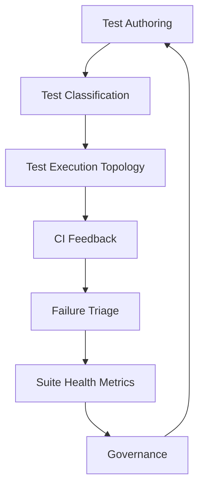
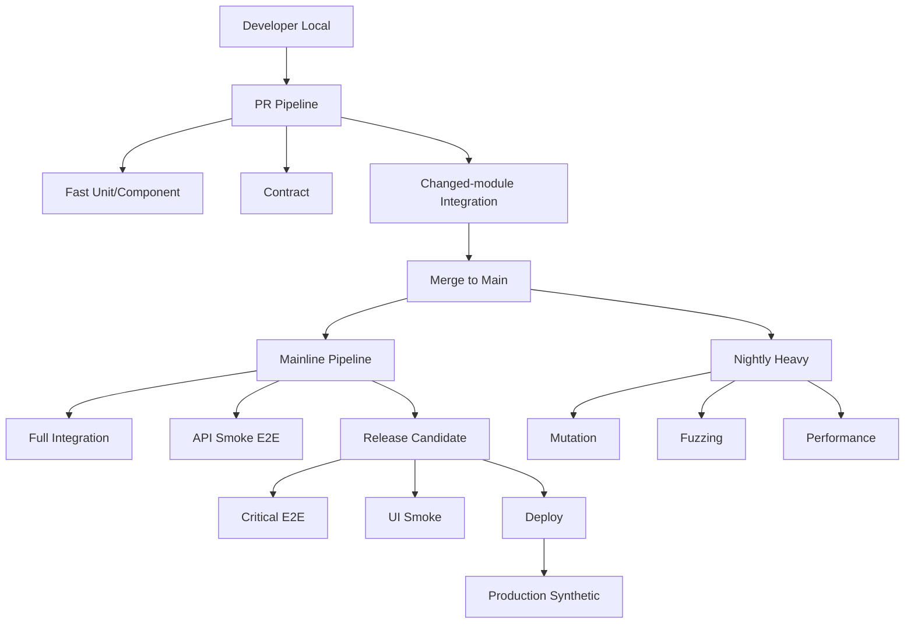

# Part 018 — Test Suite Architecture for Large Codebases

> Tujuan bagian ini: membangun architecture test suite untuk Java codebase besar agar tetap cepat, dipercaya, scalable, owned, dan memberi signal release yang tajam.

Sampai titik ini kita sudah membahas banyak jenis test:

```text
unit
component
mock/fake
state machine
negative path
time/concurrency
property-based
mutation
fuzzing
contract
integration
E2E
```

Masalah berikutnya bukan lagi:

```text
Can we write a test?
```

Masalah berikutnya:

```text
Can thousands of tests remain useful over years of codebase evolution?
```

Di large codebase, test suite adalah sistem produksi internal.
Ia punya architecture, ownership, performance profile, failure modes, observability, lifecycle, dan governance.

Kalau tidak dirancang, test suite akan menjadi legacy system paling mahal di engineering organization.

---

## 1. Mental Model: Test Suite as a Production System

Test suite punya users:

```text
developers
reviewers
release managers
SRE/platform engineers
security/compliance teams
```

Test suite punya SLA implisit:

```text
PR feedback cepat
failure actionable
false negative rendah
false positive rendah
release confidence tinggi
maintenance cost terkendali
```

Test suite punya failure modes:

```text
flaky tests
slow tests
unclear failures
missing ownership
environment contention
data collision
duplicate coverage
obsolete tests
hidden dependencies
non-deterministic ordering
CI runner saturation
```

Karena itu test suite harus di-architecture seperti sistem lain.



---

## 2. What a Test Suite Must Optimize

Test suite bukan hanya mengoptimalkan coverage.

Ia mengoptimalkan beberapa objective yang saling konflik:

```text
confidence
speed
diagnostic precision
cost
maintainability
determinism
scope realism
```

Trade-off:

| Test Type | Confidence Scope | Speed | Diagnostic Precision | Cost |
|---|---:|---:|---:|---:|
| Unit | narrow | very high | high | low |
| Component | medium | high | medium-high | low-medium |
| Contract | boundary | high | high | medium |
| Integration | dependency-realistic | medium | medium | medium-high |
| E2E | journey-realistic | low-medium | low | high |
| Performance | workload-specific | low | medium | high |
| Formal/model | design-level | medium | high for modeled property | medium |

Architecture test suite adalah seni menempatkan evidence di layer termurah yang masih valid.

```text
Cheapest valid evidence wins.
```

---

## 3. Classification Dimensions

Setiap test harus diklasifikasikan dengan beberapa dimensi.

Minimal:

```text
scope
speed
owner
risk
stability
dependency
execution frequency
blocking policy
```

Contoh taxonomy:

```yaml
scope:
  - unit
  - component
  - contract
  - integration
  - e2e
  - performance
  - formal

speed:
  - fast      # < 1s/test or very small suite
  - medium    # seconds
  - slow      # minutes

stability:
  - deterministic
  - async-controlled
  - environment-sensitive
  - flaky-quarantined

blocking:
  - pr-blocking
  - merge-blocking
  - release-blocking
  - non-blocking
  - nightly-only

owner:
  - team name
```

JUnit tags can encode part of this:

```java
@Tag("scope:integration")
@Tag("owner:case-platform")
@Tag("risk:critical")
@Tag("speed:medium")
class CaseRepositoryIT {
}
```

But not all metadata should live in annotations.
For large orgs, maintain a test inventory.

---

## 4. Test Inventory

A test inventory is a machine-readable registry of important suites/journeys.

Example:

```yaml
suites:
  - name: case-platform-unit
    scope: unit
    owner: case-platform
    command: mvn -pl case-domain test
    blocking: pr
    target_runtime: 2m

  - name: case-platform-integration
    scope: integration
    owner: case-platform
    command: mvn -pl case-service verify -Pintegration
    dependencies:
      - postgresql
      - kafka
    blocking: merge
    target_runtime: 8m

  - name: case-submission-e2e
    scope: e2e
    owner: case-platform
    environment: staging
    blocking: release
    target_runtime: 3m
    flake_budget: 0.5%
```

Why inventory matters:

```text
new engineers can understand suite topology
CI can route tests intelligently
ownership is visible
runtime budget is explicit
obsolete suites can be retired
```

---

## 5. Package and Module Topology

For Java, test architecture should be visible in project structure.

Example Maven multi-module layout:

```text
case-platform/
  case-domain/
    src/main/java/...
    src/test/java/...              # unit/property tests
  case-application/
    src/main/java/...
    src/test/java/...              # component tests
  case-adapters-postgres/
    src/main/java/...
    src/test/java/...              # repository unit tests if any
    src/integrationTest/java/...   # PostgreSQL integration tests
  case-adapters-kafka/
    src/integrationTest/java/...   # Kafka integration tests
  case-service/
    src/test/java/...              # controller/component tests
    src/integrationTest/java/...   # full service integration
  case-contract-tests/
    src/test/java/...
  case-e2e-tests/
    src/test/java/...
  case-performance-tests/
    src/jmh/java/...
```

The structure communicates:

```text
what test belongs where
what dependencies are allowed
what command runs it
what runtime to expect
```

Avoid dumping every test into:

```text
src/test/java
```

When all tests live in one undifferentiated folder, execution architecture becomes invisible.

---

## 6. Naming Conventions

Names should reveal scope.

Common convention:

```text
*Test      -> unit/component fast tests
*IT        -> integration tests
*E2ETest   -> end-to-end tests
*ContractTest -> contract tests
*PropertyTest -> property-based tests
*Benchmark -> JMH benchmark class
```

Example:

```text
CaseTransitionPolicyTest
CaseLifecyclePropertyTest
CaseRepositoryIT
CaseApiContractTest
CaseSubmissionE2ETest
CaseTransitionBenchmark
```

This helps:

```text
IDE discovery
Maven Surefire/Failsafe filtering
human navigation
CI partitioning
```

---

## 7. Maven Execution Topology

Common Java split:

```text
maven-surefire-plugin  -> unit tests
maven-failsafe-plugin  -> integration tests
```

Example:

```xml
<build>
  <plugins>
    <plugin>
      <groupId>org.apache.maven.plugins</groupId>
      <artifactId>maven-surefire-plugin</artifactId>
      <version>${maven.surefire.version}</version>
      <configuration>
        <includes>
          <include>**/*Test.java</include>
          <include>**/*PropertyTest.java</include>
        </includes>
        <excludedGroups>slow,integration,e2e</excludedGroups>
      </configuration>
    </plugin>

    <plugin>
      <groupId>org.apache.maven.plugins</groupId>
      <artifactId>maven-failsafe-plugin</artifactId>
      <version>${maven.failsafe.version}</version>
      <configuration>
        <includes>
          <include>**/*IT.java</include>
          <include>**/*E2ETest.java</include>
        </includes>
      </configuration>
      <executions>
        <execution>
          <goals>
            <goal>integration-test</goal>
            <goal>verify</goal>
          </goals>
        </execution>
      </executions>
    </plugin>
  </plugins>
</build>
```

For large codebases, do not rely only on naming.
Combine:

```text
module boundaries
tags
profiles
CI workflow selection
```

---

## 8. JUnit Tag Strategy

Tagging should be deliberate.

Good tags:

```text
scope:unit
scope:integration
scope:e2e
owner:case-platform
risk:critical
feature:case-lifecycle
requires:postgres
requires:kafka
stability:quarantined
```

Bad tags:

```text
important
new
bob
random
slowmaybe
```

Tag names are API.
Once CI depends on them, changing tags is a breaking change.

Define a controlled vocabulary:

```text
scope:*     exactly one required
owner:*     exactly one required for non-unit suites
risk:*      optional but recommended
requires:*  for external dependency needs
stability:* for quarantine/flaky management
```

JUnit tag filtering can then run:

```bash
mvn test -Dgroups='scope:unit | scope:component'
mvn verify -Dgroups='scope:integration & requires:postgres'
mvn verify -Dgroups='scope:e2e & risk:critical'
```

Exact syntax depends on build plugin configuration, but the concept is stable:

```text
tags are routing metadata.
```

---

## 9. Suite Layers

A production-grade Java test suite often has these layers:

```text
1. Local fast tests
2. PR required tests
3. Merge/main tests
4. Release candidate tests
5. Nightly/weekly heavy tests
6. Production synthetic checks
```

### 9.1 Local Fast Tests

Goal:

```text
developer feedback in seconds/minutes
```

Contains:

```text
unit
component
small property tests
small contract tests
```

Should avoid:

```text
Docker
network
shared environment
long sleeps
```

### 9.2 PR Required Tests

Goal:

```text
block obvious regressions before merge
```

Contains:

```text
unit
component
contract
selected integration for changed modules
static checks
```

### 9.3 Merge/Main Tests

Goal:

```text
validate integrated mainline
```

Contains:

```text
full integration suite
API smoke E2E
migration checks
```

### 9.4 Release Candidate Tests

Goal:

```text
validate deployable artifact and environment config
```

Contains:

```text
critical E2E journeys
selected UI smoke
backward compatibility checks
```

### 9.5 Nightly Heavy Tests

Goal:

```text
catch expensive/rare problems without blocking every PR
```

Contains:

```text
broader E2E
mutation testing
fuzzing
long-running property tests
soak tests
performance regression checks
```

---

## 10. CI Topology



Key point:

```text
not every test belongs to every pipeline.
```

A test that is valuable nightly may be destructive in PR.
A test that is blocking release must be reliable enough to deserve that power.

---

## 11. Runtime Budgets

Without budgets, suite runtime grows forever.

Example targets:

```text
local core tests:       < 2 minutes
PR required pipeline:   < 10 minutes
mainline integration:   < 20 minutes
release E2E smoke:      < 15 minutes
nightly heavy:          < 2 hours
```

Budgets must be visible.

Track:

```text
runtime by module
runtime by test class
runtime trend
slowest tests
queue time
setup time
container startup time
```

If runtime grows 20% month-over-month, that is a regression.

Test performance is production performance for your engineering process.

---

## 12. Test Impact Analysis

Large codebases cannot always run everything on every PR.

Test impact analysis maps changed files to relevant tests.

Simple version:

```text
changed module -> run module tests
changed API schema -> run contract tests
changed migration -> run DB integration tests
changed shared library -> run dependent modules
changed workflow definition -> run lifecycle tests + E2E smoke
```

More advanced:

```text
build graph dependency analysis
historical failure mapping
coverage mapping
service ownership mapping
risk-based selection
```

But beware false confidence.

Test impact analysis should be combined with:

```text
full mainline tests
nightly full suite
periodic random selection
```

PR optimization must not permanently hide regressions.

---

## 13. Flaky Test Governance

A flaky test is not a minor annoyance.
It is a trust leak.

Definition:

```text
same code + same test + inconsistent result
```

Policy:

```text
1. detect flake
2. classify cause
3. assign owner
4. quarantine if blocking signal is harmed
5. fix or delete within SLA
6. track recurrence
```

Do not allow:

```text
rerun until green
permanent quarantine
unknown owner
ignored red builds
```

Flakiness budget example:

```text
PR required suite: < 0.1% flaky failure rate
mainline suite: < 0.5%
nightly exploratory: < 2% but must be classified
release blocking: effectively zero tolerated known flakes
```

---

## 14. Quarantine System

Quarantine is a controlled isolation mechanism.
It is not a trash can.

Metadata required:

```yaml
test: CaseEscalationJourneyE2ETest
owner: case-platform
quarantined_at: 2026-07-02
reason: intermittent timeout waiting for projection
suspected_cause: async projection lag or weak wait condition
tracking_ticket: CASE-12345
expires_at: 2026-07-16
blocking_removed_from: release
```

Quarantine behavior:

```text
still run quarantined tests in non-blocking lane
publish failures separately
notify owner
expire quarantine automatically
```

If expired without fix:

```text
escalate or delete test
```

A permanently quarantined test is dead code.

---

## 15. Failure Classification

Every CI failure should be classifiable.

Useful categories:

```text
PRODUCT_BUG
TEST_BUG
ENVIRONMENT_FAILURE
FLAKY_TEST
INFRASTRUCTURE_FAILURE
DATA_COLLISION
CONTRACT_DRIFT
PERFORMANCE_REGRESSION
UNKNOWN
```

Why classify?

Because raw failure count hides reality.

Example:

```text
100 failures this month
70 environment failures
20 flaky tests
8 product bugs
2 contract drifts
```

This tells you platform environment is the bottleneck, not necessarily product quality.

Use classification to drive investment.

---

## 16. Ownership Model

Every non-trivial suite needs owner.

Ownership levels:

```text
test method owner
suite owner
module owner
platform CI owner
quality architecture owner
```

In practice:

```text
unit tests -> owning module team
integration tests -> owning service/team
contract tests -> provider + consumer ownership
E2E journeys -> business capability owner
CI runners/build infra -> platform team
```

Ownership must be visible in:

```text
code annotations or metadata
CODEOWNERS
test inventory
CI dashboard
failure notification routing
```

No owner means no maintenance.

---

## 17. Test Code Quality

Test code is production code for confidence.

Quality standards:

```text
readable names
small tests
clear arrangement
no hidden global state
no sleeps
no random without seed capture
semantic assertions
helper methods with clear intent
minimal mocking
controlled fixture builders
```

Bad test utility:

```java
TestHelper.doEverything();
```

Better:

```java
var caseId = fixtures.caseReadyForAssignment()
    .withPriority(HIGH)
    .ownedBy("team-a")
    .create();
```

Test helpers should create readability, not hide behavior.

---

## 18. Test Data Architecture

For large suites, test data must be engineered.

Patterns:

```text
builder for domain objects
fixture factory for persistence state
scenario factory for workflows
golden samples for contracts
corpus for fuzzing
seeded generators for property tests
runId for E2E/integration isolation
```

Avoid:

```text
one giant shared SQL fixture
one static JSON reused everywhere
manual staging data
hidden dependency on execution order
```

Data ownership:

```text
unit data: generated in test
integration data: inserted via repository/API/migration-aware fixture
E2E data: created via public/test fixture API with runId
contract data: stored as versioned samples
fuzz corpus: curated with minimized failures
```

---

## 19. Test Environment Architecture

Environments are part of suite architecture.

Types:

```text
in-process fake environment
Testcontainers environment
local compose environment
PR preview environment
shared staging
production synthetic environment
```

Each environment must have a contract:

```text
who owns it?
what data isolation exists?
what dependencies are real?
how often is it reset?
what observability exists?
what health gate exists?
what tests can run there?
```

Shared staging without policy becomes a flakiness factory.

---

## 20. Parallel Execution

Parallel execution is not free.

Safe if:

```text
tests are independent
fixtures are isolated
ports are not hardcoded
temporary directories are unique
containers are not mutated globally
database schemas/tenants/data are isolated
external accounts are not shared unsafely
```

Unsafe if:

```text
tests mutate global feature flags
tests clear shared tables
tests reuse same username/account
one test changes JVM global timezone/default locale
static mutable state leaks across tests
```

JUnit parallel execution can speed up suites, but it also exposes hidden coupling.

If enabling parallel tests causes failures, do not only disable parallelism.
Investigate coupling.

---

## 21. Global State Hazards

Java tests often leak global state:

```text
System properties
static fields
default timezone
default locale
security manager/policies
logging configuration
shared ExecutorService
shared Clock
singletons
random seeds
MDC context
```

Rules:

```text
1. avoid mutable global state
2. restore global state after test
3. isolate tests that must mutate global state
4. mark non-parallel-safe tests explicitly
```

Example:

```java
@Test
@ResourceLock("default-time-zone")
void formatsDateInJakartaTimezone() {
    var previous = TimeZone.getDefault();
    try {
        TimeZone.setDefault(TimeZone.getTimeZone("Asia/Jakarta"));
        // test
    } finally {
        TimeZone.setDefault(previous);
    }
}
```

The best test suite is parallel-safe by design.
But some global state requires explicit locks.

---

## 22. Flakiness Detection

You cannot govern what you do not measure.

Detect flakiness by tracking:

```text
fail then pass on rerun
pass/fail pattern across same commit
failure frequency per test
failure category
failure environment
failure duration
```

Tools aside, the model is:

```text
TestResult(testId, commitSha, environment, status, duration, failureHash, timestamp)
```

Then query:

```text
same testId + same commitSha + both pass and fail => flaky candidate
```

Failure hash should normalize stack trace noise.

Example hash inputs:

```text
exception type
top stack frame
assertion message category
failure category
```

---

## 23. Diagnostics Architecture

A large suite needs automatic diagnostics.

For unit/component:

```text
clear assertion message
seed on property failure
minimal reproduction input
```

For integration:

```text
container logs
database state snapshot if safe
migration version
Kafka topic offsets
application logs by test run id
```

For E2E:

```text
screenshots/videos/traces
request/response summary
correlation ID
observability links
last known business state
```

For performance:

```text
benchmark parameters
hardware/runner info
JVM flags
GC logs/JFR/flamegraphs
baseline comparison
```

Diagnostics must be captured automatically.
Do not rely on engineer memory after CI failure.

---

## 24. Assertion Architecture

Assertions should be semantic.

Bad:

```java
assertEquals(3, result.size());
assertEquals("A", result.get(0).getStatus());
```

Better:

```java
assertThat(result)
    .hasExactlyOneOpenCaseFor(customerId)
    .hasNoDuplicateCaseReferences()
    .containsAuditAction("CASE_ACCEPTED");
```

Custom assertions encode domain language.

Benefit:

```text
failures are readable
intent is clear
implementation details hidden
assertion reuse improves consistency
```

But avoid assertion libraries that become too magical.

A good custom assertion fails with evidence:

```text
Expected case CASE-123 to be ACCEPTED
Actual status: SUBMITTED
Audit trail: CASE_CREATED, CASE_SUBMITTED
Last transition error: risk-score-timeout
```

---

## 25. Test Helper Governance

Test helpers rot faster than production code if not governed.

Common bad helpers:

```text
global TestUtils class with 300 methods
helper that creates hidden database state
helper that catches exceptions silently
helper that sleeps/retries internally
helper that makes network calls without naming it
```

Governance:

```text
helpers live near domain/module
helper names reveal scope and side effects
no hidden sleeps
no hidden random without seed
no catch-and-ignore
helper APIs evolve with tests
```

Prefer:

```text
DomainFixture
RepositoryFixture
ApiFixture
E2EJourneyFixture
```

Not:

```text
CommonUtil
TestMagic
BaseTestEverything
```

---

## 26. Base Test Classes

Large Java suites often abuse base classes.

Bad:

```java
class BaseIntegrationTest {
    // starts containers
    // creates users
    // resets database
    // creates HTTP clients
    // mocks auth
    // configures Kafka
    // contains 80 helper methods
}
```

Problems:

```text
hidden setup
slow tests by default
hard to understand dependency
subclass coupling
difficult parallelization
```

Better:

```text
compose extensions/fixtures explicitly
```

Example:

```java
@ExtendWith(PostgresTestExtension.class)
@ExtendWith(KafkaTestExtension.class)
class CaseOutboxPublisherIT {
}
```

Or explicit fixture fields:

```java
class CaseRepositoryIT {
    private final PostgresFixture postgres = PostgresFixture.shared();
    private CaseRepository repository;
}
```

Inheritance hides cost.
Composition exposes it.

---

## 27. Testcontainers at Scale

Testcontainers are excellent, but large suite use requires discipline.

Decisions:

```text
container per test?
container per class?
container per suite?
reusable containers locally?
unique database/schema per test?
network per suite?
```

Trade-off:

| Strategy | Isolation | Speed | Risk |
|---|---:|---:|---|
| container per test | high | low | slow |
| container per class | medium-high | medium | class coupling |
| shared container + schema per test | medium | high | cleanup/schema discipline |
| shared environment | low | high | flakiness/data collision |

For CI:

```text
prefer deterministic startup
avoid relying on manually shared containers
capture logs
use health checks
use unique schemas/databases where possible
```

Container startup time should be measured.

---

## 28. Contract Test Architecture

Contract tests need owner boundaries.

Provider contract tests:

```text
provider verifies it satisfies published contract
```

Consumer contract tests:

```text
consumer verifies it uses provider contract correctly
```

Schema compatibility tests:

```text
new schema must read old messages
old consumers must tolerate new compatible messages where required
```

Architecture:

```text
contracts stored/versioned centrally or per provider
contract changes reviewed by consumers
CI verifies provider before publish
breaking changes require migration path
```

Contract tests fail best when they point to:

```text
which field changed
which consumer affected
whether change is backward/forward compatible
```

---

## 29. Property and Fuzz Suite Architecture

Property/fuzz tests can be expensive.

Split into:

```text
small deterministic property suite for PR
larger generated suite for main/nightly
long fuzz campaign for scheduled runs
failure corpus regression suite for PR
```

Important:

```text
always capture seed
minimize failing input
promote discovered bug input into regression corpus
```

Example:

```text
src/test/resources/corpus/case-parser/
  malformed-date-001.json
  nested-array-depth-attack.json
  duplicate-field-id.json
```

Then PR tests replay corpus quickly.
Nightly fuzz searches for new inputs.

---

## 30. Mutation Test Architecture

Mutation testing is rarely good as every-PR full gate on large codebase.

Use layers:

```text
PR: targeted mutation for changed critical modules if affordable
main: selected mutation on core domain
nightly/weekly: broader mutation report
release: review mutation trend for critical areas
```

Use mutation score carefully.

Bad policy:

```text
mutation score must be 100% everywhere
```

Better:

```text
critical domain modules require threshold
surviving mutants must be triaged
equivalent mutants documented/excluded
trend should not regress without review
```

Mutation testing is a test oracle audit, not a vanity metric.

---

## 31. Performance Test Architecture

Performance tests are part of the suite but should not be mixed with normal correctness tests.

Separate:

```text
microbenchmarks -> JMH module/profile
macrobenchmarks -> deployed workload harness
load tests -> staging/performance environment
regression checks -> controlled CI runners
```

Track metadata:

```text
JDK version
JVM flags
hardware/runner type
container limits
GC configuration
dataset size
warmup
measurement duration
baseline version
```

Never compare performance results without environment context.

Performance tests need their own governance because noise can create false decisions.

---

## 32. Test Suite Metrics

Measure suite health.

Useful metrics:

```text
total runtime
runtime by suite/module
test count by type
failure rate
flake rate
rerun rate
quarantine count
quarantine age
slowest tests
coverage trend where useful
mutation score for critical modules
contract break count
mean time to fix broken test
```

Dangerous metrics if abused:

```text
line coverage as sole quality metric
test count as productivity metric
mutation score without equivalent mutant review
flake rate without owner accountability
```

Metrics should improve decisions, not create perverse incentives.

---

## 33. Coverage Governance

Coverage is useful but incomplete.

Line coverage tells:

```text
this line executed
```

It does not tell:

```text
assertion was meaningful
edge cases covered
invariant was checked
concurrency was safe
performance did not regress
```

Better coverage questions:

```text
Are critical invariants tested?
Are state transitions covered?
Are failure modes tested?
Are contracts verified?
Are compatibility paths tested?
Are performance-sensitive paths benchmarked?
```

Coverage should be combined with:

```text
mutation testing
property testing
contract testing
review of risk matrix
```

---

## 34. Risk-Based Test Planning

Large suites should prioritize by risk.

Risk dimensions:

```text
business criticality
compliance impact
change frequency
historical defect density
complexity
external dependency
concurrency/asynchrony
blast radius
observability quality
```

Example:

| Area | Risk | Test Investment |
|---|---:|---|
| case lifecycle transition | high | unit + property + integration + API E2E |
| report label formatting | low | unit + snapshot/golden sample |
| payment/idempotency | high | formal model + property + integration + load |
| admin UI theme | low | minimal smoke/manual review |

Top engineers do not test everything equally.
They test according to risk.

---

## 35. Review Checklist for New Tests

When reviewing tests, ask:

```text
1. What behavior does this test prove?
2. Is this the cheapest valid layer?
3. Is the assertion semantic enough?
4. Is setup minimal and explicit?
5. Is data isolated?
6. Is time/randomness controlled?
7. Is failure diagnostic?
8. Is test parallel-safe?
9. Does it have an owner if non-unit?
10. Is it likely to become flaky?
11. Does it duplicate existing evidence?
12. What is the retirement condition?
```

This review is as important as production code review.

---

## 36. Example End-to-End Suite Inventory

```yaml
suites:
  - id: case-domain-fast
    command: mvn -pl case-domain test
    scope:
      - unit
      - property-small
    owner: case-platform
    blocking: pr
    target_runtime: 90s

  - id: case-service-contract
    command: mvn -pl case-contract-tests test
    scope:
      - contract
    owner: case-platform
    blocking: pr
    target_runtime: 120s

  - id: case-service-integration
    command: mvn -pl case-service verify -Pintegration
    scope:
      - integration
    requires:
      - postgres
      - kafka
    owner: case-platform
    blocking: main
    target_runtime: 8m

  - id: case-critical-e2e
    command: mvn -pl case-e2e-tests verify -Pe2e-critical
    scope:
      - e2e
    owner: case-platform
    blocking: release
    target_runtime: 10m

  - id: case-domain-mutation
    command: mvn -pl case-domain org.pitest:pitest-maven:mutationCoverage
    scope:
      - mutation
    owner: case-platform
    blocking: non-blocking
    schedule: nightly
```

This can feed dashboards and CI routing.

---

## 37. Example CI Failure Report

A useful report:

```text
Suite: case-service-integration
Test: CaseOutboxPublisherIT.publishesPendingOutboxRowsExactlyOnce
Commit: abc123
Owner: case-platform
Category: PRODUCT_BUG candidate
Duration: 22s
Environment: CI runner linux-x64 / JDK 21 / PostgreSQL 16 container
Correlation ID: it-20260702-9f3a
Failure:
  Expected exactly one Kafka event with key CASE-123
  Found two events
Evidence:
  outbox rows: one marked PUBLISHED
  Kafka events: two CaseAccepted events
  application logs: duplicate publish after retry timeout
Suggested triage:
  inspect transaction boundary around publish confirmation
```

Bad report:

```text
expected 1 but was 2
```

Engineering velocity depends heavily on failure quality.

---

## 38. Governance Operating Model

A test suite operating model:

```text
Daily:
  triage broken blocking suites
  assign flaky tests
  monitor CI runtime

Weekly:
  review quarantine list
  review slowest tests
  review new flaky candidates
  review suite ownership gaps

Monthly:
  review test inventory
  retire obsolete tests
  review coverage/evidence by risk area
  review mutation/performance trends for critical modules

Before major release:
  run full integration/E2E/performance suites
  review known flakes
  review contract compatibility
  review production synthetic readiness
```

This is not bureaucracy.
It is maintenance for the evidence system that protects delivery.

---

## 39. Anti-Patterns

### 39.1 Test Suite as Junk Drawer

Symptom:

```text
every test in src/test/java with no classification.
```

Fix:

```text
classify scope, split modules/profiles, define tags.
```

### 39.2 Coverage Theater

Symptom:

```text
90% coverage, weak assertions, many bugs escape.
```

Fix:

```text
mutation testing, invariant review, risk-based test design.
```

### 39.3 Permanent Quarantine

Symptom:

```text
100 quarantined tests, nobody cares.
```

Fix:

```text
expiry, owner, delete-or-fix policy.
```

### 39.4 All Tests Block PR

Symptom:

```text
PR waits 60 minutes for tests unrelated to change.
```

Fix:

```text
layered pipeline, test impact analysis, mainline/nightly full coverage.
```

### 39.5 Shared Staging Roulette

Symptom:

```text
E2E fails randomly because staging is shared and dirty.
```

Fix:

```text
runId isolation, health gates, fixture ownership, preview env where possible.
```

---

## 40. Practical Migration Plan

If you already have messy suite, do not rewrite everything.

Step-by-step:

```text
1. inventory existing tests
2. classify by runtime/scope/owner
3. identify top 20 slowest tests
4. identify top flaky tests
5. split fast PR suite from slow suite
6. add quarantine with expiry
7. add diagnostics for integration/E2E failures
8. move obvious E2E-overcoverage down the pyramid
9. add contract/integration tests where E2E is carrying too much
10. create monthly suite health review
```

Start with visibility.
Then enforce policy.
Then optimize architecture.

---

## 41. The Architecture Principle

The core principle:

```text
A test suite is an evidence pipeline.
```

Each test should answer:

```text
What claim about the system does this test support?
At what cost?
With what false-positive/false-negative risk?
Who owns the claim?
When should this claim be checked?
```

That framing changes everything.

You stop asking:

```text
Do we have enough tests?
```

You start asking:

```text
Do we have the right evidence at the right layer with the right feedback time?
```

---

## 42. Checklist

Before you consider this part mastered, you should be able to:

- design a layered test suite for a Java multi-module codebase,
- classify tests by scope, speed, owner, dependency, and blocking policy,
- use naming and tags to support CI routing,
- split unit, integration, E2E, mutation, fuzzing, and performance suites,
- define runtime budgets,
- design quarantine with expiry and ownership,
- detect and measure flakiness,
- capture diagnostics automatically,
- use risk-based test planning,
- review tests for semantic value,
- retire low-value tests,
- treat the test suite as an evidence system.

---

## 43. Key Takeaways

```text
A large test suite without architecture becomes a legacy system.
```

```text
Tags, naming, modules, and CI profiles are not cosmetic. They are execution architecture.
```

```text
Flaky tests are trust leaks. Permanent quarantine is dead code.
```

```text
The goal is not more tests. The goal is cheaper, faster, more trustworthy evidence.
```

---

## 44. References

- JUnit User Guide: https://docs.junit.org/
- JUnit Parallel Execution: https://docs.junit.org/6.0.3/writing-tests/parallel-execution.html
- Maven Surefire Plugin: https://maven.apache.org/surefire/maven-surefire-plugin/
- Maven Failsafe Plugin: https://maven.apache.org/surefire/maven-failsafe-plugin/
- Testcontainers for Java: https://java.testcontainers.org/
- Google Testing Blog — Flaky Tests at Google and How We Mitigate Them: https://testing.googleblog.com/2016/05/flaky-tests-at-google-and-how-we.html
- Google Research — De-Flake Your Tests: https://research.google/pubs/de-flake-your-tests-automatically-locating-root-causes-of-flaky-tests-in-code-at-google/
