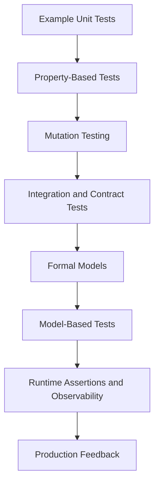
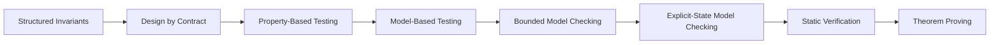
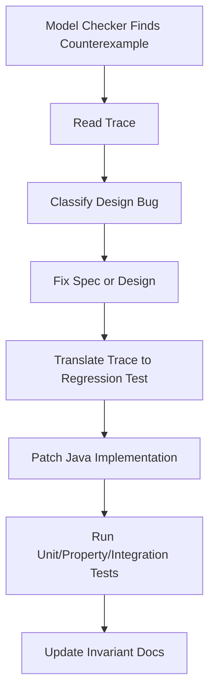
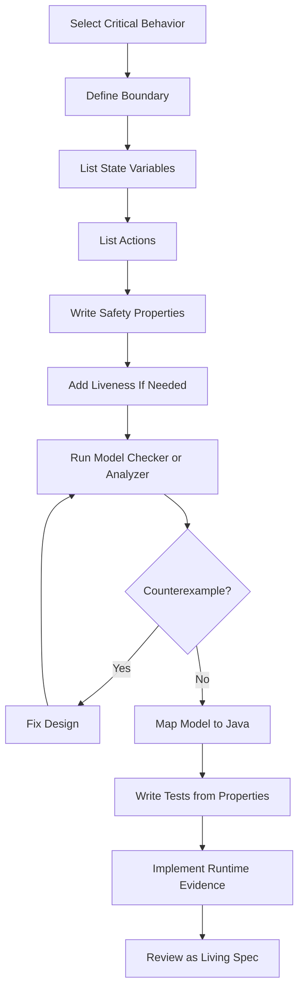
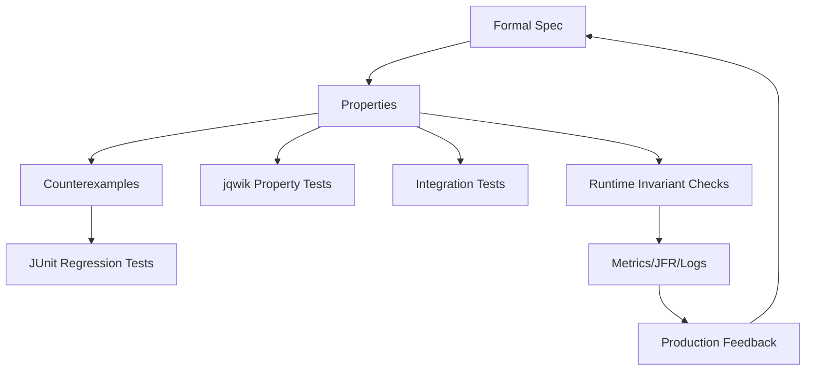

# Part 019 — Formal Methods for Working Engineers

> Tujuan bagian ini: membuat formal methods menjadi alat kerja engineer Java, bukan topik akademik yang jauh dari implementasi.

Formal methods sering terdengar seperti ini:

```text
theorem proving
mathematical logic
temporal formulas
state space exploration
proof obligations
```

Bagi working engineer, framing itu terlalu berat di awal.

Framing yang lebih berguna:

```text
Formal methods = cara menulis desain sistem secara cukup presisi sehingga mesin atau manusia dapat menemukan kesalahan desain sebelum kode produksi dibuat.
```

Formal methods bukan pengganti engineering judgement.
Ia memperkuat judgement.

Formal methods bukan pengganti test.
Ia menemukan jenis bug yang test biasa sering lewatkan.

Formal methods bukan kewajiban untuk seluruh codebase.
Ia adalah alat khusus untuk area yang failure cost-nya tinggi, state-space-nya rumit, atau concurrency/distributed behavior-nya sulit dipikirkan manual.

---

## 1. Masalah Nyata yang Ingin Diselesaikan

Test biasa biasanya menanyakan:

```text
Untuk contoh input ini, apakah output-nya benar?
```

Formal methods menanyakan:

```text
Untuk semua state yang mungkin di model ini, apakah properti penting selalu benar?
```

Perbedaannya besar.

Dalam sistem Java production, bug paling mahal sering bukan bug syntax atau salah mapping DTO. Bug mahal biasanya berbentuk:

```text
state lifecycle invalid
retry menyebabkan double side effect
concurrent command melanggar invariant
approval/resolution terjadi dalam urutan salah
event diterbitkan tanpa perubahan state yang sah
compensation tidak mengembalikan invariant
timeout menghasilkan status ambigu
cache dan database disagree
message redelivery membuat transaksi tidak idempotent
optimistic locking gagal tetapi caller menganggap sukses
```

Bug seperti ini jarang ditemukan oleh satu unit test sederhana.
Mereka muncul dari kombinasi interleaving, ordering, duplicate delivery, stale reads, dan partial failure.

Formal methods memberi bahasa untuk menyatakan:

```text
Apa state sistem?
Apa action yang mengubah state?
Properti apa yang tidak boleh dilanggar?
Progress apa yang akhirnya harus terjadi?
Abstraksi implementasi mana yang harus tetap konsisten dengan model?
```

---

## 2. Formal Methods dalam Evidence Ladder

Dari Part 003, kita sudah punya verification ladder. Formal methods menempati posisi yang berbeda dari test biasa.



Kekuatan formal methods bukan karena ia lebih “tinggi” dari test.
Kekuatannya karena ia menjawab pertanyaan berbeda.

| Evidence | Pertanyaan yang Dijawab | Kelemahan |
|---|---|---|
| Unit test | Contoh perilaku ini benar? | Lemah terhadap kombinasi state besar |
| Property-based test | Properti ini bertahan untuk banyak input generated? | Generator dan oracle bisa salah |
| Mutation test | Test suite benar-benar mendeteksi perubahan salah? | Tidak membuktikan desain benar |
| Integration test | Komponen benar saat dependency nyata dipakai? | Mahal, lambat, tidak exhaustive |
| Formal model | Semua state di model kecil ini aman? | Model bisa tidak merepresentasikan realitas |
| Production telemetry | Sistem aktual sehat? | Biasanya setelah risiko terjadi |

Formal methods berguna ketika pertanyaan utamanya adalah:

```text
Can this design fail in some ordering we did not imagine?
```

---

## 3. Definisi Kerja: Model, State, Action, Property

Agar tidak abstrak, gunakan empat konsep inti.

### 3.1 Model

Model adalah representasi sengaja-disederhanakan dari sistem.

Model bukan kode produksi.
Model juga bukan diagram cantik.

Model harus cukup presisi untuk dieksekusi atau dianalisis.

Contoh sistem Java:

```text
Case Management Service
- menerima command submit/assign/escalate/resolve
- menyimpan case state di PostgreSQL
- menerbitkan domain event melalui outbox
- memakai optimistic locking
- command bisa retry karena timeout
- event consumer bisa menerima duplicate event
```

Model tidak perlu memasukkan semua field database.
Ia cukup memasukkan state yang relevan terhadap correctness.

```text
caseStatus
caseVersion
processedCommandIds
outboxEvents
assignedOfficer
escalationFlag
```

### 3.2 State

State adalah snapshot informasi yang menentukan perilaku berikutnya.

Dalam Java system, state bisa tersebar:

```text
heap object
database row
message queue
cache
scheduler
external service state
clock-derived state
```

Formal model memaksa kita memilih state yang relevan.

Kalau state penting tidak masuk model, model bisa memberi confidence palsu.

### 3.3 Action

Action adalah perubahan state.

Dalam Java, action bisa berupa:

```text
HTTP request handler
message consumer handler
scheduled job
database transaction
retry attempt
compensation step
manual admin action
```

Dalam model, action harus eksplisit.

Contoh:

```text
SubmitCase
AssignCase
EscalateCase
ResolveCase
RetryCommand
PublishOutboxEvent
ConsumeEvent
CrashBeforeCommit
CrashAfterCommitBeforeAck
```

### 3.4 Property

Property adalah klaim yang ingin kita pertahankan.

Ada dua keluarga utama:

```text
safety  = bad thing never happens
liveness = good thing eventually happens
```

Safety:

```text
Resolved case must never become InReview again.
One case must never have two active assignees.
A domain event must never be published without corresponding committed state.
The same command id must never cause two different outcomes.
```

Liveness:

```text
A submitted case is eventually reviewed if reviewers are available.
An outbox event is eventually published if publisher keeps running.
A retryable command eventually either succeeds or returns a stable failure.
```

Safety biasanya lebih mudah dan lebih sering dimulai.
Liveness sering lebih sulit karena membutuhkan fairness assumption.

---

## 4. Formal Methods Tidak Harus Dimulai dari Theorem Proving

Ada spektrum.



Untuk Java engineer, urutan praktis biasanya:

1. tulis invariant secara eksplisit;
2. validasi invariant dengan unit/property tests;
3. buat model kecil untuk lifecycle atau concurrency protocol;
4. jalankan model checker untuk mencari counterexample;
5. ubah counterexample menjadi regression test;
6. pasang runtime checks/telemetry untuk invariant yang penting;
7. ulangi saat desain berubah.

Theorem proving berguna, tetapi bukan entry point paling produktif untuk kebanyakan team.

---

## 5. Kapan Formal Methods Layak Dipakai

Formal methods tidak perlu untuk semua hal.

Gunakan ketika ada kombinasi berikut:

```text
stateful behavior
concurrency
retries
idempotency
distributed consistency
lifecycle rules
cross-entity constraints
financial/regulatory impact
expensive incident cost
hard-to-reproduce bugs
ambiguous requirements
```

Contoh area Java yang cocok:

| Area | Kenapa Cocok |
|---|---|
| Workflow lifecycle | Banyak state dan transition invalid |
| Payment/order processing | Double charge, lost update, idempotency risk |
| Outbox/inbox messaging | Ordering, duplicate, crash windows |
| Distributed lock/lease | Expiry, split brain, stale owner |
| Approval/escalation rules | Guard priority dan conflict rule |
| Cache invalidation | Stale read dan write/read reordering |
| Authorization policy | Constraint kombinatorial |
| Scheduler/retry system | Time, retry, failure, backoff interaction |
| Case management | State, actor, SLA, audit, assignment, terminality |

Jangan gunakan formal methods untuk:

```text
straightforward CRUD mapping
simple DTO validation
UI layout logic
low-impact glue code
behavior yang sudah jelas dan murah diuji biasa
```

Formal methods harus dipakai seperti microscope: untuk bagian kecil tetapi kritikal.

---

## 6. Invariant-First Engineering

Top engineer tidak memulai dari class diagram.
Mereka memulai dari invariant.

Contoh requirement lemah:

```text
Case should be assigned correctly.
```

Requirement ini tidak cukup.

Ubah menjadi invariant:

```text
A case in ASSIGNED state has exactly one active assignee.
A case in NEW state has no active assignee.
A RESOLVED case has no active escalation timer.
A CLOSED case cannot receive any domain-changing command.
Every emitted CaseAssigned event corresponds to exactly one committed assignment transition.
```

Invariant yang baik punya ciri:

```text
observable
falsifiable
state-based
small enough to test
important enough to protect
independent from implementation detail where possible
```

Contoh Java assertion-level representation:

```java
public final class CaseInvariants {
    public static void assertValid(CaseAggregate c) {
        if (c.status() == CaseStatus.NEW && c.assignee().isPresent()) {
            throw new InvariantViolation("NEW case must not have assignee");
        }

        if (c.status() == CaseStatus.ASSIGNED && c.assignee().isEmpty()) {
            throw new InvariantViolation("ASSIGNED case must have assignee");
        }

        if (c.status().isTerminal() && c.hasActiveEscalationTimer()) {
            throw new InvariantViolation("terminal case must not have active escalation timer");
        }
    }
}
```

Ini belum formal verification.
Tetapi ini langkah formalization.

Setelah invariant eksplisit, ia bisa dipakai oleh:

```text
unit tests
property-based tests
model-based tests
runtime checks
migration validation
production diagnostics
```

---

## 7. Safety vs Liveness dengan Contoh Java

### 7.1 Safety

Safety berarti sesuatu yang buruk tidak pernah terjadi.

Contoh:

```text
No duplicate terminal event is emitted for the same case.
```

Dalam Java, bug safety bisa muncul seperti ini:

```java
@Transactional
public void resolve(ResolveCaseCommand command) {
    CaseEntity entity = repository.findById(command.caseId());

    if (entity.status() == RESOLVED) {
        return;
    }

    entity.resolve(command.resolution());
    repository.save(entity);
    outbox.insert(CaseResolvedEvent.from(entity));
}
```

Kelihatannya idempotent.
Tetapi dua transaksi concurrent bisa sama-sama membaca status belum `RESOLVED` bila locking/versioning salah.
Hasilnya bisa dua outbox event.

Safety property:

```text
For each caseId, at most one CaseResolved event exists.
```

### 7.2 Liveness

Liveness berarti sesuatu yang baik akhirnya terjadi.

Contoh:

```text
If an outbox event exists and the publisher keeps running, the event is eventually published.
```

Tetapi liveness selalu bergantung pada assumption:

```text
publisher thread eventually gets CPU
message broker eventually accepts publish
network eventually recovers
database remains available
```

Tanpa assumption, liveness tidak realistis.

Formal modeling memaksa kita menyebut assumption ini, bukan menyembunyikannya di kata “eventually”.

---

## 8. Refinement: Dari Model Abstrak ke Implementasi Java

Model formal biasanya abstrak.
Java implementation detail biasanya konkret.

Refinement adalah klaim bahwa implementasi konkret tidak menunjukkan behavior yang melanggar model abstrak.

Contoh model abstrak:

```text
ResolveCase atomically changes status to RESOLVED and appends CaseResolved event.
```

Implementasi konkret:

```text
HTTP request
parse JSON
authorize actor
load aggregate
validate transition
update PostgreSQL row
insert outbox row
commit transaction
publisher later sends Kafka event
consumer eventually handles event
```

Refinement mapping menghubungkan keduanya:

| Abstract Model | Java Implementation |
|---|---|
| caseStatus[id] | `case_table.status` |
| outbox[id] | `outbox_event` rows |
| processedCommands | `idempotency_key` table |
| ResolveCase action | DB transaction in command handler |
| Publish action | outbox poller transaction |
| terminal invariant | domain + DB constraint + tests + telemetry |

Tujuan bukan membuktikan seluruh implementation bit-by-bit.
Tujuan praktisnya:

```text
setiap konsep correctness penting punya mapping implementasi yang jelas.
```

Kalau tidak ada mapping, model hanya dokumentasi.

---

## 9. Counterexample adalah Hadiah

Formal methods sering dianggap gagal ketika model checker menemukan violation.
Sebaliknya, itu sukses.

Counterexample adalah execution trace yang menunjukkan bug desain.

Contoh trace:

```text
1. Case C is SUBMITTED
2. Worker A reads C
3. Worker B reads C
4. Worker A resolves C and emits event E1
5. Worker B resolves C and emits event E2
6. invariant AtMostOneTerminalEvent violated
```

Trace ini jauh lebih valuable daripada error message biasa.

Workflow yang benar:



Counterexample harus menjadi artifact engineering.
Simpan sebagai:

```text
issue link
spec file
trace explanation
regression test
design decision record
```

---

## 10. Tooling Map untuk Java Engineer

| Tool/Approach | Cocok Untuk | Output |
|---|---|---|
| Structured invariants | Semua domain penting | Invariant catalog |
| JML/OpenJML | Method/class contract Java | Contract checks, static/runtime verification |
| TLA+/TLC | Concurrent/distributed/stateful protocols | Counterexample trace, checked invariants/liveness |
| PlusCal | Algorithmic process-style models | TLA+ spec generated from pseudo-code-like syntax |
| Alloy | Relational/domain constraints | Counterexample instance, model visualization |
| jqwik | Executable generated tests | Failing seed, shrunk input |
| Model-based testing | Model-to-test bridge | Generated command sequences |
| jcstress | Java memory/concurrency edge behavior | Observed outcomes across interleavings |
| Runtime assertions | Production guardrail | Early violation signal |
| JFR/custom events | Production evidence | Traceable runtime behavior |

Pilih tool berdasarkan shape masalah, bukan popularitas.

```text
Relational constraint? Alloy.
Concurrent/distributed transition? TLA+.
Java method-level contract? JML/OpenJML.
Runtime concurrency primitive? jcstress.
Input/domain generator? jqwik.
```

---

## 11. Formal Methods Workflow yang Realistis

Gunakan workflow ini untuk feature kritikal.



### Step 1 — Select Critical Behavior

Jangan mulai dari seluruh service.
Pilih satu behavior.

Contoh:

```text
idempotent resolve command
outbox publish semantics
case escalation timer
approval matrix
assignment transfer
```

### Step 2 — Define Boundary

Tentukan apa yang masuk model.

```text
In scope:
- command status
- case status
- processed command ids
- outbox events
- retry behavior

Out of scope:
- HTTP serialization
- database index structure
- JSON field names
- UI behavior
```

Boundary buruk membuat model tidak berguna.

### Step 3 — List State Variables

Gunakan variabel abstrak.

```text
caseStatus
caseVersion
commands
outbox
locks
published
```

Jangan langsung menyalin schema database.
Model bukan ERD.

### Step 4 — List Actions

Action harus mewakili semua cara state berubah.

```text
ReceiveCommand
ProcessCommand
CommitState
AppendOutbox
PublishEvent
RetryCommand
Crash
Recover
```

Jika crash/retry tidak dimodelkan, model tidak bisa menemukan bug crash/retry.

### Step 5 — Write Safety Properties

Mulai dari invariant paling mahal.

```text
NoDuplicateResolution
NoEventWithoutStateChange
TerminalStateImmutable
VersionMonotonic
ProcessedCommandOutcomeStable
```

### Step 6 — Add Liveness If Needed

Tambahkan liveness hanya jika progress penting.

```text
Every queued outbox event is eventually published under fair publisher scheduling.
```

### Step 7 — Run Model Checker or Analyzer

Gunakan scope kecil.

```text
2 cases
2 commands
2 workers
2 retries
```

Scope kecil sering cukup untuk menemukan bug desain besar.

### Step 8 — Translate Counterexample to Tests

Setiap counterexample penting harus menjadi regression test.

```java
@Test
void concurrentResolveMustNotEmitDuplicateTerminalEvents() {
    // Reproduce the trace found by the model.
}
```

### Step 9 — Keep Model Alive

Model mati kalau tidak ikut berubah saat desain berubah.

Masukkan ke review checklist:

```text
Does this change affect a modeled invariant?
Does the model need a new action?
Does a new failure mode appear?
Do existing counterexample tests still represent the risk?
```

---

## 12. Pattern: Modeling Idempotency

Idempotency adalah area paling sering disalahpahami.

Statement lemah:

```text
Request is idempotent.
```

Statement kuat:

```text
For the same idempotency key and semantically same request body, repeated execution returns the same stable outcome and does not create additional domain side effects.
```

State yang perlu dimodelkan:

```text
processedKeys
keyToOutcome
domainState
sideEffects
inFlightCommands
```

Safety properties:

```text
same key never maps to two outcomes
same key never creates two domain events
same key with different body is rejected
in-flight failure does not create ambiguous visible state
```

Java implementation mapping:

```text
idempotency_key table
unique index on key
request hash
stored response or outcome reference
transaction around domain mutation + idempotency record
retry-safe status transitions
```

Test mapping:

```text
unit: duplicate command returns same result
integration: unique index prevents race
property: generated duplicate/reordered commands keep invariant
model: crash/retry interleaving cannot duplicate side effect
load test: retry storm does not violate invariant
```

---

## 13. Pattern: Modeling Outbox Correctness

Outbox pattern sering dianggap selesai hanya dengan tabel outbox.
Tidak cukup.

Invariant yang perlu dijaga:

```text
No published event without committed state.
No committed transition that requires event is permanently invisible.
No event is interpreted twice by non-idempotent consumers.
Event payload corresponds to committed version.
```

State model:

```text
dbState
outboxRows
publishedEvents
consumerState
```

Actions:

```text
CommitBusinessTransaction
PollOutbox
PublishToBroker
MarkPublished
ConsumerHandle
ConsumerRetry
```

Failure windows:

```text
crash before commit
crash after commit before publish
crash after publish before mark published
broker accepts but ack lost
consumer processes but offset commit fails
```

Formal thinking reveals a core truth:

```text
Outbox gives atomicity between DB state and event record, not exactly-once end-to-end processing.
```

Therefore Java design still needs:

```text
idempotent publisher
idempotent consumer
unique event id
consumer deduplication or natural idempotency
observable publish lag
reconciliation job
```

---

## 14. Pattern: Modeling Workflow Terminality

Terminal state bugs are common.

Example invariant:

```text
Once CLOSED, a case cannot transition to any non-terminal state.
```

But real systems have admin correction.
So invariant may need refinement:

```text
Only a correction action with explicit audit reason can reopen a closed case.
Normal workflow commands cannot reopen terminal cases.
```

This distinction matters.

Bad invariant:

```text
Closed cases never change.
```

Better invariant:

```text
Closed cases never change through normal workflow actions.
Correction actions create a new audit-linked revision and preserve terminal history.
```

Java mapping:

```text
command type hierarchy
transition guard
permission check
audit table
case revision number
history event
```

Formal model should include correction action only if it exists.
Otherwise the implementation will eventually “exception-case” its way around the model.

---

## 15. Pattern: Modeling Authorization and Separation of Duties

Authorization bugs are relational.
They often fit Alloy better than TLA+.

Example invariant:

```text
The officer who recommends enforcement action cannot be the same officer who approves it.
```

Related constraints:

```text
case has assigned investigator
case has reviewer
reviewer belongs to permitted department
approver has required role
same user cannot occupy conflicting roles
emergency override requires audit reason
```

This can be represented as relational constraints.

Java test mapping:

```text
role matrix tests
policy engine tests
generated user/role/case graph tests
negative authorization tests
audit trail tests
```

Formal point:

```text
If the problem is about relationships and constraints, do not force it into example tests only.
```

---

## 16. Formal Specification as Design Review Artifact

A formal spec is not just a file.
It is a design review tool.

Good design review questions:

```text
What are the state variables?
What actions can change them?
What states are invalid?
What failure windows exist?
What happens on retry?
What happens on duplicate message?
What happens if two actors act concurrently?
What progress assumptions are needed?
Which properties are safety and which are liveness?
What implementation elements enforce each invariant?
What telemetry proves the invariant is holding in production?
```

This moves review away from taste:

```text
I prefer this design.
```

Toward evidence:

```text
This design permits duplicate terminal events under this interleaving.
```

---

## 17. Common Anti-Patterns

### 17.1 Modeling Code Instead of Behavior

Bad:

```text
Model every class, repository, DTO, and mapper.
```

Good:

```text
Model the state transitions and failure windows that determine correctness.
```

### 17.2 Hiding the Environment

If retry, duplicate delivery, timeout, crash, and stale read are possible in production, they must appear in the model.

A model that assumes perfect execution proves little.

### 17.3 Only Checking Happy Path Invariants

Bad invariant:

```text
Resolved case has resolved status.
```

This is almost tautological.

Better:

```text
A case has at most one terminal resolution event across all retries and concurrent attempts.
```

### 17.4 Treating Model Checker Pass as Proof of Production Correctness

Model checker pass means:

```text
No violation found within this model and configuration.
```

It does not mean:

```text
The production system is correct.
```

The model may omit a failure mode.
The scope may be too small.
The invariant may be wrong.
The Java implementation may not refine the model.

### 17.5 No Counterexample-to-Test Workflow

If a counterexample does not become a regression test, the same bug can return.

Formal methods should feed the normal engineering pipeline.

---

## 18. Example: From Requirement to Formal Artifact

Requirement:

```text
A case can be escalated if it remains assigned but unresolved past the SLA threshold.
```

Hidden ambiguity:

```text
What if case is resolved exactly when escalation job runs?
What if assignment changes?
What if SLA clock is paused?
What if escalation command is retried?
What if two scheduler instances run?
What if case is closed by correction?
```

Formalization:

State:

```text
status
assignee
assignedAt
slaPaused
escalated
version
processedEscalationKeys
```

Actions:

```text
Assign
PauseSla
ResumeSla
Resolve
RunEscalationJob
RetryEscalation
AdminClose
```

Safety:

```text
Resolved or closed case is not escalated by normal job.
Case is escalated at most once per assignment epoch.
Escalation event references the assignment epoch it escalated.
Duplicate escalation command does not create duplicate event.
```

Liveness:

```text
If a case remains assigned, unresolved, unpaused, and scheduler keeps running after SLA threshold, then escalation eventually occurs.
```

Java design implications:

```text
assignmentEpoch column
unique index: case_id + assignment_epoch + event_type
transactional check of current status and epoch
scheduler idempotency key
outbox event includes assignmentEpoch
consumer deduplication by eventId
```

This is formal methods doing real work.
It changes schema, command design, and event payload.

---

## 19. Integration with Java Test Strategy

Formal methods should not live alone.



Mapping example:

| Formal Artifact | Java Artifact |
|---|---|
| Invariant | assertion/helper/test oracle |
| Action | command handler test step |
| Counterexample trace | regression test scenario |
| State variable | aggregate field/table/message state |
| Environment action | fake dependency/failure injector |
| Liveness assumption | scheduler/load/integration test condition |
| Refinement mapping | architecture decision record |

---

## 20. What to Put in the Repository

A mature codebase can include:

```text
/specs
  /tla
    CaseEscalation.tla
    CaseEscalation.cfg
    README.md
  /alloy
    SeparationOfDuties.als
  /jml
    Money.jml-notes.md
/src/test/java
  ... counterexample regression tests
/docs/adr
  ADR-014-idempotent-case-resolution.md
```

README for each spec should explain:

```text
problem modeled
state variables
actions
properties checked
known abstractions
known omissions
how to run
last meaningful design change
linked tests
```

Without this, specs become archaeology.

---

## 21. Review Checklist

Use this checklist before modeling:

```text
Is the behavior stateful?
Can two actors operate concurrently?
Can commands/messages be retried?
Can external failures happen between important steps?
Is there an invariant with high business/regulatory/financial value?
Can we define a small finite model?
Can counterexamples be translated to tests?
Is the team willing to maintain the spec?
```

Use this checklist after modeling:

```text
Did we model the dangerous failure windows?
Did we check non-trivial safety properties?
Did we document liveness assumptions?
Did we avoid modeling irrelevant implementation detail?
Did we map abstract variables to Java/database/event artifacts?
Did we create regression tests for discovered bugs?
Did we add telemetry for production invariant evidence?
```

---

## 22. Mental Model Final

Formal methods are not about proving that you are smart.
They are about making system behavior explicit enough that hidden design bugs have fewer places to hide.

A strong Java engineer uses formal methods like this:

```text
not everywhere
not ceremonially
not as a replacement for tests
not as academic theater

but surgically,
for critical stateful behavior,
with executable specs,
linked to tests,
linked to implementation,
linked to production evidence.
```

The practical formula:

```text
invariant + state + action + failure mode + counterexample + regression test + runtime evidence
```

That is the bridge from formal reasoning to production engineering.

---

## 23. What Comes Next

Part 020 will go deeper into TLA+.

We will model Java system behavior with:

```text
state variables
actions
Init
Next
Spec
invariants
liveness
TLC model checking
counterexample interpretation
Java implementation mapping
```

The focus will not be syntax for its own sake.
The focus will be using TLA+ to design Java systems that involve:

```text
workflow state
idempotent commands
retry
outbox
concurrency
optimistic locking
failure windows
```
