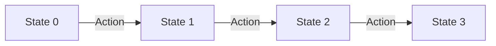
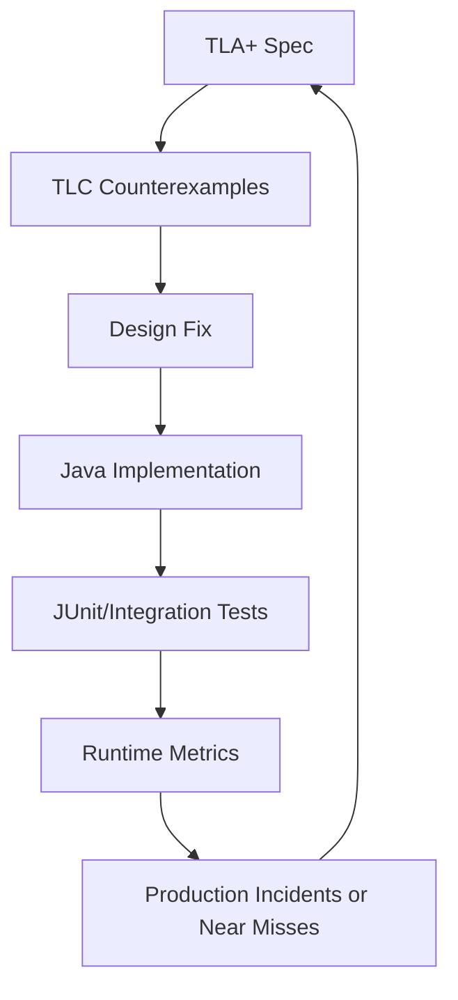

# Part 020 — TLA+ for Java System Design

> Tujuan bagian ini: memakai TLA+ sebagai alat desain untuk Java services yang stateful, concurrent, retry-prone, dan sulit divalidasi hanya dengan test contoh.

TLA+ bukan bahasa pemrograman.
TLA+ adalah bahasa spesifikasi.

Cara berpikirnya berbeda dari Java:

```text
Java asks: how do we execute this?
TLA+ asks: what behaviors are possible?
```

Itu membuat TLA+ sangat cocok untuk area yang sering menjadi sumber incident:

```text
concurrent workflow transitions
idempotent commands
outbox/inbox messaging
retry and timeout
optimistic locking
scheduler race
state machine terminality
distributed coordination
```

Pada bagian ini, kita akan memakai contoh yang dekat dengan Java production system:

```text
Case Command Processor
- menerima command ResolveCase
- harus idempotent
- memakai case status dan version
- menulis outbox event
- command bisa dikirim ulang
- dua worker bisa memproses case yang sama
- publisher bisa menerbitkan outbox event belakangan
```

Kita tidak akan mencoba memodelkan HTTP, JSON, JDBC, atau Kafka secara penuh.
Kita akan memodelkan behavior correctness-nya.

---

## 1. TLA+ Mental Model

TLA+ melihat sistem sebagai sequence of states.

```text
state0 -> state1 -> state2 -> state3 -> ...
```

Setiap transition dari satu state ke state berikutnya disebabkan oleh action.



Spesifikasi biasanya punya elemen inti:

```text
CONSTANTS  = nilai yang ditentukan oleh model checker
VARIABLES  = state sistem
Init       = kondisi state awal
Next       = semua action yang boleh mengubah state
Spec       = Init dan selalu Next
Invariant  = properti yang harus selalu benar
Liveness   = properti yang akhirnya harus terjadi
```

Skeleton:

```tla
---- MODULE Example ----
EXTENDS Naturals, FiniteSets, Sequences

CONSTANTS Cases, Commands

VARIABLES status, processed, outbox

vars == << status, processed, outbox >>

Init ==
  /\ status = [c \in Cases |-> "OPEN"]
  /\ processed = {}
  /\ outbox = << >>

Next ==
  \/ SomeAction
  \/ SomeOtherAction

Spec == Init /\ [][Next]_vars

Invariant == TRUE
====
```

Makna `[][Next]_vars` secara praktis:

```text
Setelah Init, setiap langkah berikutnya harus mengikuti salah satu action di Next atau stuttering step yang tidak mengubah vars.
```

Stuttering penting karena TLA+ memodelkan behavior temporal, dan sistem boleh “tidak melakukan apa-apa” pada satu step.

---

## 2. Jangan Modelkan Kode; Modelkan Risiko

Java implementation mungkin terlihat seperti ini:

```java
@Transactional
public ResolveResult resolve(ResolveCaseCommand command) {
    IdempotencyRecord existing = idempotency.find(command.idempotencyKey());
    if (existing != null) {
        return existing.toResult();
    }

    CaseEntity entity = caseRepository.findByIdForUpdate(command.caseId());

    if (entity.status().isTerminal()) {
        ResolveResult result = ResolveResult.alreadyTerminal(entity.id());
        idempotency.save(command.idempotencyKey(), command.requestHash(), result);
        return result;
    }

    entity.resolve(command.resolution());
    caseRepository.save(entity);
    outbox.insert(CaseResolvedEvent.from(entity));

    ResolveResult result = ResolveResult.resolved(entity.id(), entity.version());
    idempotency.save(command.idempotencyKey(), command.requestHash(), result);
    return result;
}
```

TLA+ tidak perlu memodelkan:

```text
class name
repository interface
JSON deserialization
JDBC statement
transaction annotation
logging format
```

TLA+ perlu memodelkan risiko:

```text
same command processed twice
same case resolved twice
outbox event without committed state
command outcome changes across retries
two workers interleave
failure occurs between state update and outbox append
```

---

## 3. Domain Abstraction

Kita mulai dengan domain kecil.

```text
Case status:
- OPEN
- RESOLVED

Command:
- command id
- case id
```

Kita abaikan detail resolution body.
Kita fokus pada idempotency dan terminal event.

Desired properties:

```text
P1: A case can have at most one CaseResolved event.
P2: A processed command id always maps to stable outcome.
P3: No CaseResolved event exists unless the case is RESOLVED.
P4: A RESOLVED case never returns to OPEN.
```

TLA+ state variables:

```text
status     : case -> status
processed  : set of processed command ids
outcome    : command id -> outcome
outbox     : sequence of events
```

Nondeterministic environment:

```text
which command arrives
whether duplicate command arrives
which worker processes it
whether publisher runs
```

---

## 4. First TLA+ Model: Naive Resolve

Model pertama sengaja salah.
Tujuannya agar model checker menemukan bug.

```tla
---- MODULE CaseResolveNaive ----
EXTENDS Naturals, FiniteSets, Sequences

CONSTANTS Cases, Commands

VARIABLES status, processed, outcome, outbox

vars == << status, processed, outcome, outbox >>

Statuses == {"OPEN", "RESOLVED"}
Outcomes == {"RESOLVED", "ALREADY_TERMINAL"}

Init ==
  /\ status = [c \in Cases |-> "OPEN"]
  /\ processed = {}
  /\ outcome = [cmd \in Commands |-> "NONE"]
  /\ outbox = << >>

Resolve(cmd, c) ==
  /\ cmd \in Commands
  /\ c \in Cases
  /\ status[c] = "OPEN"
  /\ status' = [status EXCEPT ![c] = "RESOLVED"]
  /\ processed' = processed \cup {cmd}
  /\ outcome' = [outcome EXCEPT ![cmd] = "RESOLVED"]
  /\ outbox' = Append(outbox, [type |-> "CaseResolved", case |-> c, command |-> cmd])

RetryAlreadyProcessed(cmd) ==
  /\ cmd \in processed
  /\ UNCHANGED << status, processed, outcome, outbox >>

Next ==
  \/ \E cmd \in Commands, c \in Cases : Resolve(cmd, c)
  \/ \E cmd \in Commands : RetryAlreadyProcessed(cmd)

Spec == Init /\ [][Next]_vars

ResolvedEvents(c) ==
  {i \in 1..Len(outbox) : outbox[i].type = "CaseResolved" /\ outbox[i].case = c}

AtMostOneResolvedEvent ==
  \A c \in Cases : Cardinality(ResolvedEvents(c)) <= 1

TerminalNeverReopens ==
  \A c \in Cases : status[c] \in Statuses
====
```

Model ini terlihat aman karena `Resolve` hanya boleh berjalan saat `status[c] = "OPEN"`.
Namun ia belum memodelkan concurrency read/write race.

Jika kita hanya memodelkan atomic resolve, bug interleaving tidak muncul.
Ini pelajaran penting:

```text
If your model action is too atomic, you can hide the exact race you wanted to find.
```

---

## 5. Modeling Interleaving: Read Then Commit

Dalam sistem Java dengan dua worker, operasi tidak selalu satu langkah abstrak.

Realistic flow:

```text
1. worker reads case
2. worker decides case is open
3. worker commits resolution
4. worker appends outbox event
```

Kalau dua worker membaca sebelum salah satu commit, keduanya bisa berpikir case masih open.

Kita tambahkan state `inflight`.

```text
inflight[worker] = case read by worker and decision captured
```

Model:

```tla
---- MODULE CaseResolveRace ----
EXTENDS Naturals, FiniteSets, Sequences

CONSTANTS Cases, Commands, Workers

VARIABLES status, processed, outcome, outbox, inflight

vars == << status, processed, outcome, outbox, inflight >>

Statuses == {"OPEN", "RESOLVED"}
Outcomes == {"NONE", "RESOLVED", "ALREADY_TERMINAL"}

NoWork == [cmd |-> "NONE", case |-> "NONE", observed |-> "NONE"]

Init ==
  /\ status = [c \in Cases |-> "OPEN"]
  /\ processed = {}
  /\ outcome = [cmd \in Commands |-> "NONE"]
  /\ outbox = << >>
  /\ inflight = [w \in Workers |-> NoWork]

BeginResolve(w, cmd, c) ==
  /\ w \in Workers
  /\ cmd \in Commands
  /\ c \in Cases
  /\ inflight[w] = NoWork
  /\ cmd \notin processed
  /\ inflight' = [inflight EXCEPT ![w] = [cmd |-> cmd, case |-> c, observed |-> status[c]]]
  /\ UNCHANGED << status, processed, outcome, outbox >>

CommitResolveNaive(w) ==
  LET work == inflight[w] IN
  /\ w \in Workers
  /\ work # NoWork
  /\ work.observed = "OPEN"
  /\ status' = [status EXCEPT ![work.case] = "RESOLVED"]
  /\ processed' = processed \cup {work.cmd}
  /\ outcome' = [outcome EXCEPT ![work.cmd] = "RESOLVED"]
  /\ outbox' = Append(outbox, [type |-> "CaseResolved", case |-> work.case, command |-> work.cmd])
  /\ inflight' = [inflight EXCEPT ![w] = NoWork]

CommitAlreadyTerminal(w) ==
  LET work == inflight[w] IN
  /\ w \in Workers
  /\ work # NoWork
  /\ work.observed = "RESOLVED"
  /\ processed' = processed \cup {work.cmd}
  /\ outcome' = [outcome EXCEPT ![work.cmd] = "ALREADY_TERMINAL"]
  /\ inflight' = [inflight EXCEPT ![w] = NoWork]
  /\ UNCHANGED << status, outbox >>

Next ==
  \/ \E w \in Workers, cmd \in Commands, c \in Cases : BeginResolve(w, cmd, c)
  \/ \E w \in Workers : CommitResolveNaive(w)
  \/ \E w \in Workers : CommitAlreadyTerminal(w)

Spec == Init /\ [][Next]_vars

ResolvedEvents(c) ==
  {i \in 1..Len(outbox) : outbox[i].type = "CaseResolved" /\ outbox[i].case = c}

AtMostOneResolvedEvent ==
  \A c \in Cases : Cardinality(ResolvedEvents(c)) <= 1
====
```

Dengan `Cases = {c1}`, `Commands = {cmd1, cmd2}`, dan `Workers = {w1, w2}`, TLC dapat menemukan interleaving seperti:

```text
w1 begins resolve c1, observes OPEN
w2 begins resolve c1, observes OPEN
w1 commits, appends event
w2 commits, appends event
AtMostOneResolvedEvent violated
```

Ini bug desain.
Unit test happy path tidak akan menemukannya.

---

## 6. Fixing the Model: Optimistic Commit Check

Di Java, salah satu fix adalah optimistic locking/version check atau conditional update.

Abstract behavior:

```text
A worker may decide based on old read, but commit must check current state/version.
```

Ubah commit action:

```tla
CommitResolveWithCheck(w) ==
  LET work == inflight[w] IN
  /\ w \in Workers
  /\ work # NoWork
  /\ work.observed = "OPEN"
  /\ status[work.case] = "OPEN"
  /\ status' = [status EXCEPT ![work.case] = "RESOLVED"]
  /\ processed' = processed \cup {work.cmd}
  /\ outcome' = [outcome EXCEPT ![work.cmd] = "RESOLVED"]
  /\ outbox' = Append(outbox, [type |-> "CaseResolved", case |-> work.case, command |-> work.cmd])
  /\ inflight' = [inflight EXCEPT ![w] = NoWork]
```

Lalu tambahkan action untuk stale decision:

```tla
CommitStaleDecision(w) ==
  LET work == inflight[w] IN
  /\ w \in Workers
  /\ work # NoWork
  /\ work.observed = "OPEN"
  /\ status[work.case] = "RESOLVED"
  /\ processed' = processed \cup {work.cmd}
  /\ outcome' = [outcome EXCEPT ![work.cmd] = "ALREADY_TERMINAL"]
  /\ inflight' = [inflight EXCEPT ![w] = NoWork]
  /\ UNCHANGED << status, outbox >>
```

Sekarang `AtMostOneResolvedEvent` seharusnya aman untuk model kecil.

Java mapping:

```sql
UPDATE case_table
SET status = 'RESOLVED', version = version + 1
WHERE case_id = :caseId
  AND status = 'OPEN'
  AND version = :observedVersion;
```

atau:

```java
int updated = caseRepository.resolveIfOpen(caseId, observedVersion, resolution);

if (updated == 1) {
    outbox.insert(CaseResolvedEvent.of(caseId, observedVersion + 1));
    return resolved();
}

return alreadyTerminalOrConflict();
```

Critical detail:

```text
outbox insert must happen in the same transaction as the successful state update.
```

Otherwise the model fix does not refine the implementation.

---

## 7. Idempotency Is Not Just “Already Processed”

The model above only partly handles command idempotency.

A stronger idempotency model needs:

```text
command id
request hash
stored outcome
side effect count
```

Properties:

```text
same command id never maps to two outcomes
same command id never creates two resolved events
same command id with different request hash is rejected
```

TLA abstraction:

```tla
CONSTANTS Cases, Commands, RequestHashes, Workers

VARIABLES status, processed, requestHash, outcome, outbox, inflight
```

Invariant:

```tla
StableProcessedOutcome ==
  \A cmd \in processed : outcome[cmd] # "NONE"
```

But this is weak.
It only says processed commands have outcomes.

Stronger property needs history. Add `outcomeHistory`:

```tla
VARIABLES outcomeHistory
```

Whenever an outcome is recorded:

```tla
outcomeHistory' = Append(outcomeHistory, [cmd |-> work.cmd, result |-> "RESOLVED"])
```

Invariant:

```tla
NoTwoOutcomesForSameCommand ==
  \A cmd \in Commands :
    Cardinality({r \in Outcomes :
      \E i \in 1..Len(outcomeHistory) :
        outcomeHistory[i].cmd = cmd /\ outcomeHistory[i].result = r}) <= 1
```

This is common in TLA+ modeling:

```text
If you want to check history-dependent properties, explicitly model history.
```

Do not keep history in production just because the model does.
The model history is a verification device.

---

## 8. Modeling Outbox Atomicity

A common mistake:

```text
Update aggregate in one transaction, insert outbox in another transaction.
```

Bug window:

```text
state changed but no event exists
```

Model the bad design:

```tla
CommitStateOnly(w) ==
  LET work == inflight[w] IN
  /\ work # NoWork
  /\ status[work.case] = "OPEN"
  /\ status' = [status EXCEPT ![work.case] = "RESOLVED"]
  /\ processed' = processed \cup {work.cmd}
  /\ outcome' = [outcome EXCEPT ![work.cmd] = "RESOLVED"]
  /\ inflight' = [inflight EXCEPT ![w] = NoWork]
  /\ UNCHANGED outbox
```

Then model a crash or simply stop taking steps. Safety invariant:

```tla
ResolvedHasOutbox ==
  \A c \in Cases :
    status[c] = "RESOLVED" =>
      \E i \in 1..Len(outbox) : outbox[i].case = c /\ outbox[i].type = "CaseResolved"
```

This invariant will fail after `CommitStateOnly`.

The model teaches:

```text
The atomic unit is not “case row update”.
The atomic unit is “case row update + outbox row insert”.
```

Correct abstract action:

```tla
CommitStateAndOutbox(w) ==
  LET work == inflight[w] IN
  /\ work # NoWork
  /\ status[work.case] = "OPEN"
  /\ status' = [status EXCEPT ![work.case] = "RESOLVED"]
  /\ processed' = processed \cup {work.cmd}
  /\ outcome' = [outcome EXCEPT ![work.cmd] = "RESOLVED"]
  /\ outbox' = Append(outbox, [type |-> "CaseResolved", case |-> work.case, command |-> work.cmd])
  /\ inflight' = [inflight EXCEPT ![w] = NoWork]
```

Java mapping:

```java
@Transactional
public ResolveResult resolve(ResolveCaseCommand command) {
    int updated = caseRepository.resolveIfOpen(command.caseId(), command.observedVersion());

    if (updated == 1) {
        outboxRepository.insert(new CaseResolvedOutboxEvent(...));
        idempotencyRepository.record(command.key(), RESOLVED);
        return ResolveResult.resolved();
    }

    idempotencyRepository.record(command.key(), ALREADY_TERMINAL);
    return ResolveResult.alreadyTerminal();
}
```

Test mapping:

```text
integration test verifies case update and outbox insert commit/rollback together
property test generates duplicate resolve commands
model counterexample becomes regression test
production metric tracks resolved cases without outbox event
```

---

## 9. TLC Configuration

TLC checks finite models.
You provide small finite sets.

Example `.cfg`:

```text
SPECIFICATION Spec

CONSTANTS
  Cases = {c1}
  Commands = {cmd1, cmd2}
  Workers = {w1, w2}

INVARIANTS
  AtMostOneResolvedEvent
  ResolvedHasOutbox
```

Small scope is not a weakness.
For many concurrency bugs, two workers and one entity are enough.

```text
If a design fails with 1 case and 2 workers, it will fail in production.
```

Increase scope gradually:

```text
1 case, 2 commands, 2 workers
2 cases, 2 commands, 2 workers
2 cases, 3 commands, 3 workers
```

Watch state explosion.

---

## 10. Reading Counterexamples

A TLC counterexample is a trace of states/actions.

Treat it like a production incident replay.

Ask:

```text
What was the first state where the invariant became doomed?
What action created the unsafe condition?
Was the action unrealistic or correctly modeled?
Did we omit a guard?
Did we make an action too atomic or not atomic enough?
Did the invariant overstate the requirement?
```

Counterexample classification:

| Type | Meaning | Response |
|---|---|---|
| Real design bug | Model found valid bad behavior | Fix design |
| Missing environment constraint | Model allowed impossible behavior | Add assumption/guard |
| Over-strong invariant | Requirement was too strict | Refine property |
| Under-abstracted model | Too much irrelevant state | Simplify |
| Over-abstracted model | Hidden important detail | Add state/action |

Do not silence counterexamples until you understand them.

---

## 11. Safety Properties for Java Services

Useful TLA+ invariants for Java service design:

### 11.1 No Duplicate Terminal Event

```tla
NoDuplicateTerminalEvent ==
  \A c \in Cases : Cardinality(ResolvedEvents(c)) <= 1
```

Java enforcement:

```text
unique index on event semantic key
conditional update
idempotency key
consumer deduplication
```

### 11.2 Event Corresponds to State

```tla
NoEventWithoutResolvedState ==
  \A i \in 1..Len(outbox) :
    outbox[i].type = "CaseResolved" => status[outbox[i].case] = "RESOLVED"
```

Java enforcement:

```text
same transaction for state and outbox
payload generated from persisted aggregate version
transactional tests
```

### 11.3 Terminal State Immutable

```tla
TerminalStateValid ==
  \A c \in Cases : status[c] \in {"OPEN", "RESOLVED"}
```

Better with history:

```tla
NeverReopened ==
  \A c \in Cases :
    WasResolved(c) => status[c] = "RESOLVED"
```

Where `WasResolved` uses event/state history.

### 11.4 Stable Idempotency Outcome

```tla
StableOutcome ==
  \A cmd \in Commands :
    cmd \in processed => outcome[cmd] # "NONE"
```

Stronger with history:

```tla
NoOutcomeChange ==
  \A cmd \in Commands :
    Cardinality(OutcomesObservedFor(cmd)) <= 1
```

---

## 12. Liveness and Fairness

Safety says bad things never happen.
Liveness says good things eventually happen.

Example:

```text
Every outbox event is eventually published.
```

TLA+ style:

```tla
VARIABLES outbox, published

Publish(i) ==
  /\ i \in 1..Len(outbox)
  /\ i \notin published
  /\ published' = published \cup {i}
  /\ UNCHANGED outbox

AllOutboxEventuallyPublished ==
  \A i \in 1..Len(outbox) : <> (i \in published)
```

But this property is not true unless publishing action is fairly scheduled.

Fairness says, roughly:

```text
If an action remains continuously enabled, it eventually occurs.
```

Spec with weak fairness:

```tla
Spec == Init /\ [][Next]_vars /\ WF_vars(PublishNext)
```

Practical Java interpretation:

```text
If publisher keeps running and broker/database eventually respond, queued events should drain.
```

Without these assumptions, liveness is false in any real system.
The publisher can be stopped forever.
The broker can be down forever.
The database can be unavailable forever.

So in engineering docs, write liveness properties with assumptions:

```text
Assuming publisher is scheduled, database is available, and broker eventually accepts writes, every committed outbox row is eventually published or moved to a terminal dead-letter state.
```

---

## 13. Mapping TLA+ to Java Implementation

Use a mapping table.

| TLA+ Concept | Java/Production Artifact |
|---|---|
| `status[c]` | `case_table.status` |
| `processed` | `idempotency_key` table |
| `outcome[cmd]` | stored idempotency outcome/result reference |
| `outbox` | `outbox_event` table |
| `published` | broker ack + outbox publication marker |
| `BeginResolve` | load aggregate / read status/version |
| `CommitResolveWithCheck` | conditional update in DB transaction |
| `AtMostOneResolvedEvent` | unique semantic event constraint + tests |
| `ResolvedHasOutbox` | transactional outbox integration test |
| liveness publisher property | outbox lag SLO and dead-letter policy |

This table is not bureaucracy.
It prevents a common failure:

```text
The model is correct, but nobody knows which part of Java enforces it.
```

---

## 14. Turning Counterexamples into JUnit Tests

Suppose TLC found:

```text
w1 reads OPEN
w2 reads OPEN
w1 commits resolved event
w2 commits resolved event
```

Translate to a deterministic test harness.

```java
@Test
void twoConcurrentResolveAttemptsMustProduceSingleResolvedEvent() throws Exception {
    CaseId caseId = fixtures.openCase();

    CyclicBarrier bothRead = new CyclicBarrier(2);
    CountDownLatch allowCommit = new CountDownLatch(1);

    ResolveWorker worker1 = new ResolveWorker(caseId, bothRead, allowCommit);
    ResolveWorker worker2 = new ResolveWorker(caseId, bothRead, allowCommit);

    Future<ResolveResult> f1 = executor.submit(worker1);
    Future<ResolveResult> f2 = executor.submit(worker2);

    bothRead.await(5, TimeUnit.SECONDS);
    allowCommit.countDown();

    ResolveResult r1 = f1.get(5, TimeUnit.SECONDS);
    ResolveResult r2 = f2.get(5, TimeUnit.SECONDS);

    assertThat(List.of(r1, r2))
        .filteredOn(ResolveResult::resolved)
        .hasSize(1);

    assertThat(outboxRepository.findByCaseId(caseId))
        .filteredOn(event -> event.type().equals("CaseResolved"))
        .hasSize(1);
}
```

The exact test implementation depends on repository seams.
The important part:

```text
The test reproduces the interleaving from the formal counterexample.
```

---

## 15. TLA+ and Property-Based Testing Together

TLA+ explores abstract state space.
jqwik explores generated concrete test data.

They complement each other.

TLA+ property:

```text
No duplicate terminal event under any modeled interleaving.
```

jqwik property:

```text
For generated command sequences with duplicate ids and random order, Java implementation maintains domain invariant.
```

Example structure:

```java
@Property
void generatedResolveCommandsDoNotCreateDuplicateTerminalEvents(
        @ForAll("resolveCommandSequences") List<ResolveCaseCommand> commands) {

    CaseId caseId = fixtures.openCase();

    for (ResolveCaseCommand command : commands) {
        service.resolve(command.withCaseId(caseId));
    }

    assertThat(outboxRepository.caseResolvedEvents(caseId)).hasSizeLessThanOrEqualTo(1);
}
```

TLA+ gives confidence about behavior shape.
Property-based tests check implementation over more data combinations.

---

## 16. Modeling Time Carefully

Time is dangerous in models.

Bad model:

```text
time increases automatically and continuously
```

Better model:

```text
Tick is an action
scheduler behavior is explicit
SLA threshold is abstracted into small finite values
```

Example:

```tla
VARIABLES age, status, escalated

Tick(c) ==
  /\ c \in Cases
  /\ age' = [age EXCEPT ![c] = age[c] + 1]
  /\ UNCHANGED << status, escalated >>

Escalate(c) ==
  /\ c \in Cases
  /\ status[c] = "ASSIGNED"
  /\ age[c] >= SlaLimit
  /\ escalated' = escalated \cup {c}
  /\ UNCHANGED << status, age >>
```

Java mapping:

```text
Clock injection
scheduler test harness
assignment epoch
SLA pause/resume state
idempotent escalation command
```

Do not model wall-clock details unless wall-clock behavior is the risk.

---

## 17. State Explosion Control

TLC explores state spaces.
State space can explode.

Control techniques:

```text
use small finite constants
model only relevant state
avoid unbounded sequences when possible
abstract payloads into symbols
reduce number of workers/entities
split specs by concern
check safety before liveness
add symmetry when appropriate
```

Bad:

```text
Cases = 1000
Commands = 10000
Workers = 50
full event payload records
full user objects
full timestamp values
```

Good:

```text
Cases = {c1, c2}
Commands = {cmd1, cmd2, cmd3}
Workers = {w1, w2}
Status = symbolic values
Time = 0..2
```

Remember:

```text
A concurrency design that is wrong often fails with tiny numbers.
```

---

## 18. Modeling Checklist for Java Services

Before writing a TLA+ spec:

```text
What production incident are we trying to prevent?
What is the smallest subsystem that contains the risk?
What are the state variables?
What actions change state?
Which actions are concurrent?
Which actions can retry?
Which actions can fail halfway?
Which operation must be atomic?
What invariant would be expensive to violate?
What progress condition matters?
```

While writing:

```text
Are actions too atomic?
Are actions not atomic enough?
Are duplicate messages modeled?
Are stale reads modeled?
Are crash windows modeled?
Are terminal states modeled?
Are environment assumptions explicit?
```

After TLC passes:

```text
Did we run with at least two workers where concurrency matters?
Did we try at least two commands where duplication matters?
Did we check non-trivial invariants?
Did we document what the model omits?
Did we map each invariant to Java enforcement?
Did we create tests for previous counterexamples?
```

---

## 19. What Not to Do

### 19.1 Do Not Translate Java Line-by-Line

TLA+ is not pseudo-Java.
If the spec has the same accidental complexity as implementation, it loses value.

### 19.2 Do Not Trust a Passing Spec Blindly

Passing TLC means:

```text
No violation found in this finite model with these properties.
```

It does not mean production is correct.

### 19.3 Do Not Hide Retry

If production has retry but model has no retry, model is probably too optimistic.

### 19.4 Do Not Hide Duplicate Delivery

If message brokers, HTTP clients, or job schedulers can duplicate execution, model duplicates.

### 19.5 Do Not Skip Mapping to Implementation

A formal model with no Java mapping becomes a detached artifact.

---

## 20. Minimal Repository Layout

Recommended layout:

```text
/specs/tla/case-resolve
  CaseResolve.tla
  CaseResolve.cfg
  README.md
/src/test/java/.../CaseResolveConcurrencyTest.java
/src/test/java/.../CaseResolvePropertyTest.java
/docs/adr/ADR-021-idempotent-case-resolution.md
```

README should include:

```text
Purpose
State variables
Actions
Invariants
Liveness assumptions
How to run TLC
Known omissions
Counterexamples found
Java mapping
Related tests
```

Example README section:

```md
## Java Mapping

- `status[c]` maps to `case_table.status`.
- `processed` maps to `idempotency_key.command_id`.
- `outbox` maps to `outbox_event`.
- `CommitResolveWithCheck` maps to `resolveIfOpen(caseId, observedVersion)`.
- `AtMostOneResolvedEvent` is enforced by conditional update and unique semantic event key.
```

---

## 21. From TLA+ to Production Evidence

A strong engineering loop does not stop at model checking.



Production metrics linked to this model:

```text
resolved_case_without_outbox_count
case_resolved_event_duplicate_count
idempotency_key_conflict_count
outbox_publish_lag_seconds
resolve_optimistic_lock_conflict_count
stale_command_attempt_count
```

Logs/events:

```text
command id
case id
observed version
committed version
idempotency key
outbox event id
worker id
correlation id
```

Now the model is not just design-time assurance.
It shapes runtime observability.

---

## 22. A Practical TLA+ Adoption Path

Do not start by mandating TLA+ for every team.

Start with one high-value design.

```text
Week 1: pick one painful stateful/concurrent risk
Week 1: write invariant catalog
Week 2: write small TLA+ model
Week 2: run TLC and collect counterexamples
Week 3: patch Java design and tests
Week 3: document mapping and assumptions
Week 4: use spec in design review
```

Good first candidates:

```text
idempotent command processing
outbox correctness
workflow terminality
lease ownership
scheduler duplicate execution
approval separation-of-duties handoff
```

Poor first candidates:

```text
entire platform architecture
all business rules
large database schema
full Kafka topology
all HTTP endpoints
```

Start small.
Win with one real bug.
Then expand.

---

## 23. Closing Mental Model

TLA+ helps Java engineers because production systems are not just code.
They are possible behaviors.

Java implementation gives one execution at a time.
TLA+ explores many executions in a small model.

The value is not the syntax.
The value is the shift:

```text
from example thinking
to state-space thinking

from “this path works”
to “no allowed path violates the invariant”

from “we think retry is safe”
to “duplicate and stale retries were modeled”

from “outbox exists”
to “state + outbox atomicity is enforced”
```

Use TLA+ when the cost of a design mistake is higher than the cost of modeling.

For top-level engineering maturity, that is often the difference between:

```text
finding a concurrency bug in a model trace today
```

and:

```text
explaining a production incident months later
```

---

## 24. What Comes Next

Part 021 will cover PlusCal and algorithmic specifications.

TLA+ is powerful but mathematically shaped.
PlusCal gives an algorithm/process-oriented way to write specs and translate them to TLA+.

That is useful when the system behavior naturally looks like:

```text
workers
queues
locks
retry loops
publishers
consumers
scheduler processes
```
