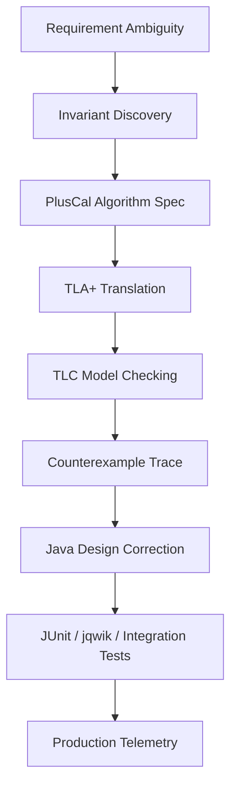
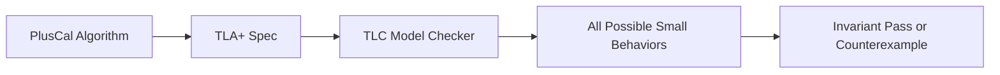
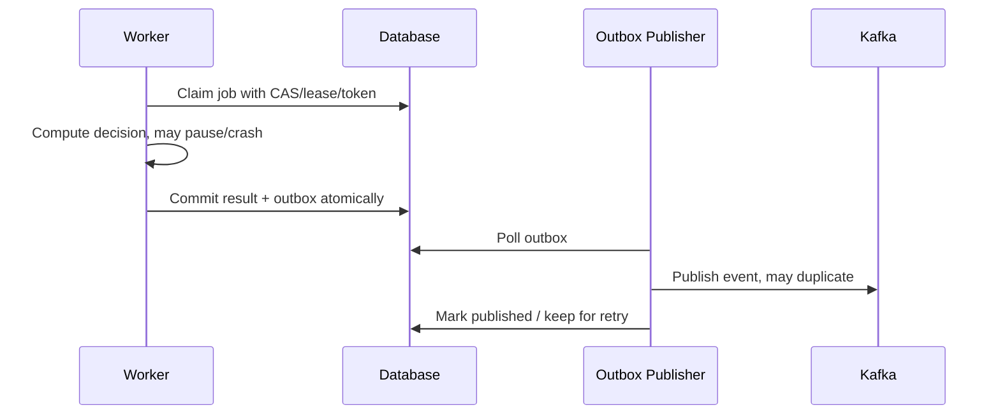
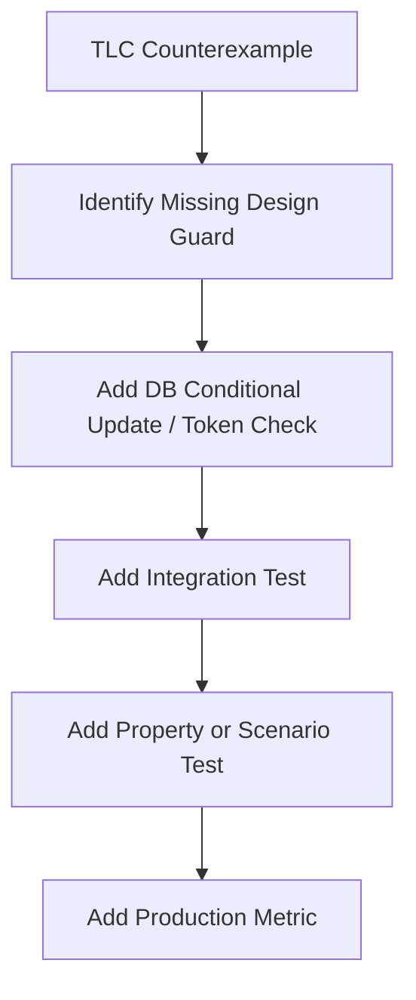

# Part 021 — PlusCal and Algorithmic Specifications

> Tujuan bagian ini: memakai PlusCal sebagai jembatan dari pseudocode engineering ke spesifikasi TLA+ yang bisa dicek oleh model checker, lalu menghubungkannya kembali ke desain dan test Java.

Di Part 020 kita menulis TLA+ langsung.
Itu kuat, tetapi bagi banyak engineer Java, bentuk TLA+ murni terasa terlalu deklaratif pada awalnya.
PlusCal memberi jalur yang lebih familiar.

```text
Java engineer biasanya berpikir:
1. ambil job
2. cek status
3. lock / claim
4. update state
5. publish event
6. retry kalau gagal

PlusCal memungkinkan kita menulis struktur algoritmik seperti itu,
tetapi hasilnya tetap diterjemahkan menjadi spesifikasi TLA+.
```

PlusCal bukan replacement untuk Java.
PlusCal adalah alat untuk menjawab pertanyaan yang lebih awal:

```text
Apakah algoritma ini benar di bawah semua interleaving kecil yang masuk akal?
Apakah worker bisa double-process?
Apakah retry bisa menciptakan duplicate terminal event?
Apakah job bisa stuck?
Apakah state terminal bisa berubah lagi?
Apakah fairness assumption kita masuk akal?
```

Kalau pertanyaan itu baru dijawab setelah implementasi, biasanya biaya koreksi sudah mahal.

---

## 1. PlusCal dalam Verification Ladder

Letakkan PlusCal di posisi ini:



PlusCal paling berguna ketika kita punya **algoritma stateful**:

```text
scheduler
worker pool
retry loop
outbox publisher
lease/claim protocol
approval workflow
case escalation engine
deduplication processor
compensation coordinator
multi-step order/case lifecycle
```

PlusCal kurang cocok kalau masalahnya hanya:

```text
validasi field sederhana
format JSON
mapping DTO
business formula stateless
single-threaded CRUD tanpa race meaningful
```

Mental model yang benar:

```text
Unit test checks examples.
Property-based test checks generated examples.
PlusCal checks all small interleavings in a bounded model.
```

Bounded bukan berarti lemah.
Banyak bug concurrency ditemukan pada state space kecil:

```text
2 workers
2 jobs
2 attempts
2 statuses
1 delayed publisher
```

Kalau desain gagal pada ruang kecil, desain tidak perlu diuji pada ruang besar.

---

## 2. Apa yang Ditulis di PlusCal?

PlusCal menulis algoritma dalam bentuk:

```text
variables
processes
labels
assignments
if/else
while
await
either/or
with
macro
```

Kemudian PlusCal diterjemahkan menjadi TLA+.
Model checker tidak menjalankan Java.
Model checker mengeksplorasi semua kemungkinan state transition yang diperbolehkan oleh spesifikasi.



Yang penting bukan sintaksnya.
Yang penting adalah keputusan modelling:

```text
Apa state minimal?
Apa action atomic?
Apa nondeterministic choice?
Apa invariant?
Apa liveness property?
Apa fairness assumption?
```

---

## 3. PlusCal vs TLA+ Murni

Gunakan PlusCal ketika algoritma punya struktur procedural yang jelas.
Gunakan TLA+ murni ketika state machine lebih mudah dijelaskan sebagai action relation.

| Situasi | Lebih cocok |
|---|---|
| Worker loop | PlusCal |
| Retry algorithm | PlusCal |
| Lock acquisition protocol | PlusCal |
| Queue consumer | PlusCal |
| Saga coordinator step-by-step | PlusCal |
| Domain lifecycle transition relation | TLA+ murni |
| Abstract distributed protocol | TLA+ murni |
| Constraint antar entity | Alloy |
| Method-level contract Java | JML/OpenJML |

Praktisnya:

```text
Kalau kamu bisa menjelaskan desain sebagai pseudocode,
PlusCal biasanya lebih cepat untuk iterasi awal.

Kalau kamu bisa menjelaskan desain sebagai himpunan action yang boleh terjadi,
TLA+ murni sering lebih bersih.
```

---

## 4. Case Study: Escalation Scheduler dengan Multiple Worker

Kita akan memodelkan sistem kecil tetapi realistic.

### 4.1 Problem

Ada case management service.
Case bisa memiliki escalation job.
Beberapa worker mengambil due job secara paralel.
Setiap job harus diproses paling banyak sekali secara efektif.
Retry boleh terjadi.
Event harus diterbitkan untuk escalation yang sukses.
Case terminal tidak boleh dieskalasi.

```text
Entities:
- Case
- EscalationJob
- Worker
- OutboxEvent

Risks:
- dua worker memproses job yang sama
- job diproses setelah case terminal
- event publish tanpa state update
- state update tanpa event
- retry menciptakan duplicate event
- worker crash setelah claim
- job stuck karena lease tidak pernah expire
```

Kita tidak akan memodelkan database, HTTP, atau thread pool.
Kita hanya memodelkan protocol correctness.

### 4.2 Desired Properties

```text
Safety:
1. terminal case tidak pernah dieskalasi
2. satu job tidak menghasilkan lebih dari satu effective escalation event
3. event escalation hanya ada kalau case memang escalated
4. job done tidak kembali pending
5. worker tidak memiliki dua job sekaligus dalam model sederhana ini

Liveness:
6. due job yang claimable akhirnya selesai, jika worker terus berjalan dan crash tidak permanen
```

Safety adalah “bad thing never happens”.
Liveness adalah “good thing eventually happens”.

Untuk awal, fokuskan safety dulu.
Liveness butuh fairness assumption dan sering lebih sulit.

---

## 5. PlusCal Skeleton

Contoh skeleton PlusCal biasanya ditulis di dalam file `.tla` sebagai komentar khusus.

```tla
---- MODULE EscalationScheduler ----
EXTENDS Naturals, Sequences, TLC

CONSTANTS Cases, Jobs, Workers

(* --algorithm Escalation
variables
  caseStatus = [c \in Cases |-> "OPEN"],
  jobState   = [j \in Jobs  |-> "PENDING"],
  jobCase    = [j \in Jobs  |-> CHOOSE c \in Cases : TRUE],
  claimedBy  = [j \in Jobs  |-> "NONE"],
  events     = <<>>;

process (Worker \in Workers)
variables myJob = "NONE";
begin
WorkerLoop:
  while TRUE do
    either
      with j \in Jobs do
        await myJob = "NONE" /\ jobState[j] = "PENDING";
        jobState[j] := "CLAIMED";
        claimedBy[j] := self;
        myJob := j;
      end with;
    or
      await myJob # "NONE";
      if caseStatus[jobCase[myJob]] # "TERMINAL" then
        caseStatus[jobCase[myJob]] := "ESCALATED";
        events := Append(events, [type |-> "CASE_ESCALATED", job |-> myJob]);
      end if;
      jobState[myJob] := "DONE";
      myJob := "NONE";
    end either;
  end while;
end process;
end algorithm; *)
====
```

Ini belum sempurna.
Justru itu poinnya.
PlusCal membantu kita membuat bug terlihat.

Catatan modelling:

```text
Cases, Jobs, Workers = finite constants
caseStatus = fungsi Case -> Status
jobState = fungsi Job -> State
jobCase = mapping job ke case
claimedBy = mapping job ke worker atau NONE
events = sequence event
```

---

## 6. Atomicity: Bagian Paling Penting

Di PlusCal, label menentukan atomic step.
Semua statement di antara label tertentu dan label berikutnya diterjemahkan sebagai satu action, dengan aturan tertentu.

Ini adalah keputusan desain paling penting.

Kesalahan umum:

```text
Membuat terlalu banyak statement atomic -> bug race hilang dari model.
Membuat terlalu sedikit atomic -> model menampilkan interleaving yang tidak mungkin terjadi di implementasi.
```

Production mapping:

| Java operation | Atomic di model? | Catatan |
|---|---:|---|
| Single SQL `UPDATE ... WHERE version = ?` | biasanya ya | atomic compare-and-set database |
| Read status lalu update status dalam transaksi yang sama | bisa ya | jika isolation dan lock benar |
| Read dari DB lalu update di request berbeda | tidak | race harus dimodelkan |
| Publish Kafka event setelah commit DB | tidak | outbox needed |
| Insert outbox row di transaksi yang sama dengan state update | ya | atomic dengan DB commit |
| Poll outbox lalu publish Kafka | tidak | publisher terpisah |
| Claim job dengan lease update conditional | ya | kalau satu SQL CAS |
| Claim job lalu process lalu mark done | tidak | worker bisa crash di tengah |

Jangan modelkan atomicity berdasarkan harapan.
Modelkan berdasarkan primitive nyata.

---

## 7. Memperbaiki Skeleton: Claim dengan Lease

Skeleton pertama punya bug: job yang `CLAIMED` tidak punya lease expiry.
Kalau worker crash, job stuck.

Kita tambahkan logical time sederhana.

```tla
variables
  now = 0,
  jobState = [j \in Jobs |-> "PENDING"],
  leaseUntil = [j \in Jobs |-> 0],
  claimedBy = [j \in Jobs |-> "NONE"];
```

Claimable:

```tla
define
  Claimable(j) ==
    jobState[j] = "PENDING" \/
    (jobState[j] = "CLAIMED" /\ leaseUntil[j] <= now)
end define;
```

Claim action:

```tla
Claim:
  with j \in Jobs do
    await myJob = "NONE" /\ Claimable(j);
    jobState[j] := "CLAIMED";
    claimedBy[j] := self;
    leaseUntil[j] := now + 2;
    myJob := j;
  end with;
```

Tick action:

```tla
Tick:
  now := now + 1;
```

Tapi ini membuka pertanyaan baru:

```text
Kalau lease expire saat worker masih process,
bisakah worker lain claim job yang sama?
```

Jawabannya: ya, kalau implementasi tidak renew lease atau tidak memakai fencing/version.

PlusCal membantu memaksa kita mengakui konsekuensi ini.

---

## 8. Fencing Token: Menghindari Worker Lama Menang Setelah Lease Expire

Lease tanpa fencing sering berbahaya.
Worker lama bisa bangun setelah pause panjang lalu menulis hasil lama.

Tambahkan `claimToken`.

```tla
variables
  claimToken = [j \in Jobs |-> 0],
  workerToken = [w \in Workers |-> 0];
```

Saat claim:

```tla
claimToken[j] := claimToken[j] + 1;
workerToken[self] := claimToken[j] + 1;
```

Lebih rapi gunakan temporary token.
Dalam PlusCal assignment ke variable yang sama punya aturan yang perlu hati-hati.
Bentuk yang lebih jelas:

```tla
with t = claimToken[j] + 1 do
  claimToken[j] := t;
  workerToken[self] := t;
end with;
```

Saat complete:

```tla
await myJob # "NONE";
if workerToken[self] = claimToken[myJob] then
  \* boleh commit result
end if;
```

Java mapping:

```sql
UPDATE escalation_job
SET state = 'CLAIMED',
    claimed_by = ?,
    claim_token = claim_token + 1,
    lease_until = ?
WHERE id = ?
  AND (state = 'PENDING' OR lease_until <= now());
```

Complete harus conditional:

```sql
UPDATE escalation_job
SET state = 'DONE'
WHERE id = ?
  AND claimed_by = ?
  AND claim_token = ?;
```

Dan state update/outbox insert harus berada dalam transaksi yang mempertahankan token validity.

---

## 9. Modelling Crash, Retry, dan Stale Worker

Production tidak hanya punya happy path.
Worker bisa crash, pause, timeout, atau retry.

Di PlusCal, kita bisa tambahkan nondeterministic branch:

```tla
either
  \* normal complete
or
  \* crash / lose local job
  myJob := "NONE";
end either;
```

Tetapi hati-hati: crash yang menghapus `myJob` tidak sama dengan worker pause.
Untuk stale worker, local state tetap ada tetapi waktu berjalan dan worker lain bisa reclaim.

Model:

```tla
Pause:
  await myJob # "NONE";
  skip;
```

Lalu ada `Tick` process yang menaikkan `now`.

```tla
process Clock = "clock"
begin
ClockLoop:
  while TRUE do
    now := now + 1;
  end while;
end process;
```

Sekarang TLC bisa menemukan trace:

```text
worker A claim job J token 1
clock tick until lease expired
worker B claim job J token 2
worker B complete
worker A resumes and tries complete with token 1
```

Invariant harus memastikan worker A tidak bisa menghasilkan duplicate side effect.

---

## 10. Event Exactly-Once: Jangan Modelkan Fantasi

Kafka/event publishing biasanya at-least-once.
Database commit dan broker publish bukan satu atomic action, kecuali menggunakan mekanisme khusus dan tetap ada caveat.

Model aman:

```text
state update + outbox insert = atomic DB transaction
outbox publish = separate action
consumer dedup = separate concern
```

PlusCal variables:

```tla
outbox = [j \in Jobs |-> FALSE]
published = [j \in Jobs |-> 0]
```

Complete action:

```tla
if ValidToken(myJob, self) /\ caseStatus[jobCase[myJob]] # "TERMINAL" then
  caseStatus[jobCase[myJob]] := "ESCALATED";
  outbox[myJob] := TRUE;
end if;
jobState[myJob] := "DONE";
```

Publisher process:

```tla
process Publisher = "publisher"
begin
PublishLoop:
  while TRUE do
    with j \in Jobs do
      await outbox[j] = TRUE;
      published[j] := published[j] + 1;
      \* if outbox is not marked published, this can happen many times
    end with;
  end while;
end process;
```

Kalau invariant kamu adalah:

```tla
AtMostOncePublished == \A j \in Jobs : published[j] <= 1
```

maka model akan gagal kalau publisher bisa retry tanpa mark published.

Pertanyaannya bukan “bagaimana membuat Kafka exactly-once secara ajaib”.
Pertanyaannya:

```text
Di boundary mana kita butuh exactly-once effect?
Apakah outbox row boleh dipublish lebih dari sekali?
Apakah consumer idempotent?
Apakah event punya idempotency key?
Apakah downstream punya unique constraint?
```

Correct invariant mungkin bukan `published <= 1`.
Correct invariant bisa:

```tla
ConsumerEffectAtMostOnce == \A j \in Jobs : consumedEffect[j] <= 1
```

Kemudian model consumer dedup.

---

## 11. PlusCal `await`: Blocking Condition, Bukan If

`await` berarti action tidak enabled sampai condition benar.

```tla
await jobState[j] = "PENDING";
```

Ini berbeda dari:

```tla
if jobState[j] = "PENDING" then
  ...
end if;
```

Dalam model checking, enabled/disabled action mempengaruhi state space dan liveness.

Production mapping:

| PlusCal | Java analogy |
|---|---|
| `await condition` | worker hanya bisa lanjut kalau condition terpenuhi |
| disabled action | SQL update affected rows = 0, poll kosong, queue empty |
| `if condition` | action tetap terjadi, tetapi branch berbeda |

Contoh bug modelling:

```tla
await HasPendingJob;
```

Kalau sistem bisa mencapai state tanpa pending job tetapi masih valid, worker loop disabled.
Itu bukan bug.
Tapi kalau liveness property mengatakan semua process harus selalu progress, model bisa misleading.

Jangan tulis liveness sebelum memahami disabled actions.

---

## 12. `either/or`: Nondeterminism sebagai Adversary

`either/or` bukan random.
Ia merepresentasikan semua pilihan yang mungkin.

```tla
either
  NormalComplete;
or
  Crash;
or
  Pause;
end either;
```

Model checker akan mencoba semua pilihan.
Ini sangat berguna untuk failure modelling.

Tetapi jangan memasukkan pilihan yang mustahil.
Kalau production tidak bisa “menghapus row database tanpa sebab”, jangan modelkan sebagai branch.
Kalau production bisa “publish duplicate event karena retry”, modelkan.

Rule:

```text
Nondeterminism harus merepresentasikan uncertainty nyata,
bukan imagination tanpa boundary.
```

---

## 13. `with`: Memilih Elemen dari Set

`with` memilih value dari set secara nondeterministic.

```tla
with j \in Jobs do
  ...
end with;
```

Ini berarti worker bisa memilih job mana pun yang memenuhi guard.

Production mapping:

```text
SELECT ... ORDER BY due_at LIMIT 1
```

bukan sepenuhnya nondeterministic kalau order deterministic.
Tetapi dalam concurrent environment, order bisa berubah karena lock, commit timing, dan pagination.
Untuk safety, nondeterministic choice sering lebih konservatif.

Kalau correctness bergantung pada ordering detail, desain rapuh.

---

## 14. Labels dan Granularitas Atomic Step

Contoh terlalu atomic:

```tla
ProcessJob:
  await Claimable(j);
  jobState[j] := "CLAIMED";
  caseStatus[jobCase[j]] := "ESCALATED";
  outbox[j] := TRUE;
  jobState[j] := "DONE";
```

Ini menyembunyikan crash antara claim dan complete.

Contoh terlalu granular:

```tla
ReadStatus:
  localStatus := caseStatus[c];
UpdateStatus:
  caseStatus[c] := "ESCALATED";
InsertOutbox:
  outbox[j] := TRUE;
```

Kalau update status dan insert outbox sebenarnya satu DB transaction, granularitas ini bisa menciptakan false counterexample.

Better:

```tla
Claim:
  \* atomic conditional claim

Compute:
  \* non-atomic local processing can pause/crash

Commit:
  \* atomic DB transaction: validate token, update case, insert outbox, mark done

Publish:
  \* separate outbox publisher
```

Diagram:



PlusCal harus mengikuti boundary ini.

---

## 15. Invariant untuk Escalation Scheduler

Invariants harus ditulis dekat dengan domain.

```tla
TerminalNeverEscalated ==
  \A c \in Cases : caseStatus[c] = "TERMINAL" =>
    ~\E j \in Jobs : jobCase[j] = c /\ outbox[j] = TRUE
```

Tetapi ini tergantung apakah status terminal bisa ada dari awal atau bisa terjadi setelah escalation.
Kalau status bisa berubah dari escalated ke terminal setelahnya, invariant ini salah.

Better model status set:

```text
OPEN
ESCALATED
RESOLVED
CLOSED
```

Terminal statuses:

```tla
TerminalStatuses == {"RESOLVED", "CLOSED"}
```

Invariant:

```tla
NoEscalationEventForInitiallyTerminal ==
  \A j \in Jobs : initialTerminal[jobCase[j]] => outbox[j] = FALSE
```

This is more precise.

Event consistency:

```tla
OutboxImpliesEscalated ==
  \A j \in Jobs : outbox[j] => caseStatus[jobCase[j]] \in {"ESCALATED", "RESOLVED", "CLOSED"}
```

Done monotonicity:

```tla
DoneNeverReopened ==
  \A j \in Jobs : jobState[j] = "DONE" => claimedBy[j] # "NONE"
```

At-most-one effective event:

```tla
AtMostOneConsumerEffect ==
  \A j \in Jobs : consumedEffect[j] <= 1
```

Token safety:

```tla
OnlyLatestTokenCanComplete ==
  \A w \in Workers :
    workerCompleting[w] # "NONE" =>
      workerToken[w] = claimToken[workerCompleting[w]]
```

Model invariants need to match business semantics, not implementation details only.

---

## 16. Liveness dan Fairness: Hati-Hati

Liveness example:

```tla
EventuallyDone ==
  \A j \in Jobs : <> (jobState[j] = "DONE")
```

Ini terlalu kuat kalau:

```text
case terminal sejak awal
worker boleh crash forever
job not due
dependency unavailable
retry exhausted
```

Better:

```text
If job remains eligible and at least one worker continues to run,
then eventually job becomes DONE or SKIPPED.
```

Dalam TLA+/PlusCal, liveness butuh fairness.
Fairness memberi asumsi bahwa action yang terus enabled akhirnya dipilih.
Tanpa fairness, model checker boleh membuat infinite behavior yang hanya melakukan `Tick` selamanya dan worker tidak pernah jalan.

Engineering translation:

```text
Fairness is not free.
Fairness corresponds to scheduler assumptions, worker health, queue polling, and retry policy.
```

Jangan tulis liveness property yang mengasumsikan platform sempurna kalau production tidak punya guarantee itu.

---

## 17. PlusCal Process Design

Ada tiga pola umum.

### 17.1 One Process per Worker

```tla
process (Worker \in Workers)
```

Gunakan untuk:

```text
worker pool
parallel consumers
concurrent request handlers
multiple scheduler nodes
```

### 17.2 Single Named Process

```tla
process Clock = "clock"
```

Gunakan untuk:

```text
logical time
publisher
external actor
admin transition
```

### 17.3 Environment Process

Environment process memodelkan dunia luar.

```tla
process Env = "env"
begin
EnvLoop:
  while TRUE do
    either
      \* new command arrives
    or
      \* case externally closed
    or
      \* dependency recovers
    end either;
  end while;
end process;
```

Environment penting karena bug sering muncul dari interaksi luar:

```text
user closes case while worker processes escalation
admin cancels job while publisher retries event
new evidence arrives while approval pending
```

---

## 18. Environment Modelling: Jangan Terlalu Baik

Environment yang terlalu baik menyembunyikan bug.

Bad environment:

```text
command always valid
dependency always responds
event never duplicated
clock always progresses sanely
only one worker active
```

Useful adversarial environment:

```text
command can duplicate
worker can pause
event publish can duplicate
case can be closed concurrently
lease can expire
consumer can process replayed event
```

Tetapi environment juga tidak boleh terlalu liar.

Invalid environment:

```text
database row mutates arbitrarily
outbox disappears without action
case status becomes impossible value
worker token changes magically
```

Rule:

```text
Environment may do what external actors can do.
Environment may not violate storage invariants unless storage corruption is in scope.
```

---

## 19. Mapping PlusCal Counterexample ke Java Test

Counterexample biasanya berbentuk trace:

```text
State 1: job pending, case open
State 2: Worker A claims J with token 1
State 3: time advances, lease expires
State 4: Worker B claims J with token 2
State 5: Worker B commits escalation
State 6: Worker A commits stale result
Invariant violation: duplicate consumer effect
```

Jangan hanya memperbaiki spec.
Lakukan mapping:



Java integration test sketch:

```java
@Test
void staleWorkerCannotCommitAfterLeaseReclaimed() {
    CaseId caseId = fixtures.openCase();
    JobId jobId = fixtures.dueEscalationJob(caseId);

    Claim claimA = worker.claim(jobId).orElseThrow();
    clock.advance(Duration.ofMinutes(10));
    Claim claimB = worker.claim(jobId).orElseThrow();

    worker.complete(claimB, EscalationDecision.escalate());

    assertThatThrownBy(() -> worker.complete(claimA, EscalationDecision.escalate()))
        .isInstanceOf(StaleClaimException.class);

    assertThat(outbox.eventsFor(jobId))
        .hasSize(1);
}
```

Database assertion:

```java
assertThat(jdbc.queryForObject("""
    select count(*)
    from outbox_event
    where aggregate_id = ?
      and event_type = 'CASE_ESCALATED'
""", Integer.class, caseId.value()))
    .isEqualTo(1);
```

Production metric:

```text
escalation.stale_claim_rejected.count
outbox.duplicate_publish_attempt.count
consumer.duplicate_effect_rejected.count
```

A formal counterexample should become an executable regression test and an operational signal.

---

## 20. From PlusCal to Java Design Rules

A good PlusCal model should produce design rules.

Example output:

```text
Rule 1: Claim must return a fencing token.
Rule 2: Complete must validate latest token.
Rule 3: Case transition and outbox insert must be one transaction.
Rule 4: Publisher may duplicate messages; consumers must deduplicate by event id.
Rule 5: DONE job is monotonic.
Rule 6: Terminal case check must happen at commit time, not only at claim time.
```

These become Java contracts.

```java
public interface EscalationJobRepository {
    Optional<Claim> claimDueJob(WorkerId workerId, Instant now);

    CompletionResult complete(
        ClaimToken token,
        EscalationDecision decision,
        Instant completedAt
    );
}
```

Important: `complete()` should not accept only `JobId`.
It must accept a token/claim identity.

Bad API:

```java
void complete(JobId jobId);
```

Better API:

```java
CompletionResult complete(Claim claim, EscalationDecision decision);
```

The type system should make stale completion harder.

---

## 21. PlusCal for Idempotent Command Processing

Another common Java backend problem:

```text
Client sends command SubmitAppeal(commandId, caseId)
Client retries due to timeout
Two app nodes receive same command
Only one appeal should be created
Response should be stable for duplicate command
```

Core state:

```tla
processed = [cmd \in Commands |-> FALSE]
result = [cmd \in Commands |-> "NONE"]
appeals = {}
```

Buggy algorithm:

```tla
if processed[cmd] = FALSE then
  appeals := appeals \cup {[cmd |-> cmd, case |-> c]};
  processed[cmd] := TRUE;
end if;
```

If read and write are not atomic across nodes, duplicate appeal can happen.

Correct design rule:

```text
idempotency record insert must be atomic unique constraint
or command effect must be guarded by unique command id
```

Java/PostgreSQL pattern:

```sql
INSERT INTO idempotency_record(command_id, status)
VALUES (?, 'STARTED')
ON CONFLICT DO NOTHING;
```

Then only owner proceeds.
But what about crash after `STARTED`?
Need status/expiry/recovery protocol.
PlusCal can model that before production.

---

## 22. PlusCal for Approval Workflow

Approval workflows look simple until concurrency appears.

Risk:

```text
manager approves while case is cancelled
second approver approves stale version
system escalates after rejection
appeal submitted after final closure
```

Model actions:

```text
Submit
Approve
Reject
Cancel
Escalate
Close
```

State:

```text
caseStatus
approvalStatus
version
audit
```

Invariant examples:

```text
Rejected approval never becomes approved.
Closed case never receives new approval decision.
Every terminal transition has an audit event.
Approval decision must reference current case version.
Escalation cannot happen after cancellation.
```

PlusCal is helpful when workflow is procedural:

```text
wait for assigned reviewer
claim task
decide
write audit
notify next actor
```

For pure lifecycle transition relation, TLA+ murni may be cleaner.
For relationship/cardinality constraints, Alloy may be cleaner.

---

## 23. Common PlusCal Mistakes

### 23.1 Modelling Implementation Noise

Bad:

```text
HTTP status code
JSON field names
logger calls
DTO mapping
framework callback
```

Better:

```text
command accepted/rejected
state transition
event creation
idempotency effect
retry behavior
```

### 23.2 Missing Environment Actions

If model only contains internal happy path, TLC proves little.
Add external actions that production can do.

### 23.3 Over-Atomic Transaction

If you model `claim + compute + commit + publish` as one action, you removed most failure modes.

### 23.4 Invalid Liveness

Liveness without fairness understanding creates noise.
Start with safety invariants.

### 23.5 Constants Too Large Too Early

Start small:

```text
Workers = {w1, w2}
Jobs = {j1, j2}
Cases = {c1, c2}
```

If invariant fails here, fix design.
Only then increase scope.

### 23.6 Treating Counterexample as Tool Bug

Most useful counterexamples look “weird” at first.
Ask:

```text
Is this behavior impossible in production?
If impossible, what guarantee makes it impossible?
Did we model that guarantee?
If possible, what design rule prevents it?
```

---

## 24. PlusCal File Organization for Engineering Teams

Suggested repo layout:

```text
formal/
  escalation-scheduler/
    EscalationScheduler.tla
    EscalationScheduler.cfg
    README.md
    traces/
      stale-worker-counterexample.md
  idempotency/
    IdempotentCommand.tla
    IdempotentCommand.cfg
  approval-workflow/
    ApprovalWorkflow.tla
    ApprovalWorkflow.cfg
```

Each formal spec should include:

```text
1. problem statement
2. modelling assumptions
3. out-of-scope details
4. constants/scopes
5. invariants
6. known counterexamples and fixes
7. Java mapping
8. test mapping
9. production telemetry mapping
```

Do not store formal models as academic artifacts disconnected from code.
Treat them like design tests.

---

## 25. Review Checklist for PlusCal Specs

Use this before trusting a model.

```text
State:
[ ] Are variables minimal but sufficient?
[ ] Are impossible values excluded?
[ ] Are initial states realistic and adversarial enough?

Actions:
[ ] Are atomic boundaries mapped to real guarantees?
[ ] Are crash/pause/retry/duplicate actions represented where relevant?
[ ] Are environment actions included?
[ ] Are nondeterministic choices realistic?

Properties:
[ ] Are safety invariants domain-level, not only technical?
[ ] Are liveness properties not overclaiming?
[ ] Are fairness assumptions explicit?

Mapping:
[ ] Does each invariant map to Java test or production metric?
[ ] Does each counterexample map to a design decision?
[ ] Are false positives documented with justification?
```

---

## 26. Practice Drill: Build a Model in 90 Minutes

For a new workflow:

```text
Minute 0-10:
  write state variables and actors

Minute 10-25:
  write happy-path PlusCal

Minute 25-40:
  add obvious failure branches

Minute 40-55:
  write 3 safety invariants

Minute 55-70:
  run TLC small scope and read counterexample

Minute 70-85:
  fix model or design rule

Minute 85-90:
  write Java test scenario from the trace
```

Output should be:

```text
not “formal model exists”
but “we changed design because the model found this trace”
```

---

## 27. Production-Grade Decision Heuristic

Use PlusCal when all are true:

```text
1. Multiple actors can touch the same state.
2. Retry, timeout, or duplicate delivery exists.
3. Correctness depends on ordering/interleaving.
4. A bug would be expensive or regulatory-significant.
5. The state space can be abstracted to small finite sets.
```

Do not use PlusCal just to look sophisticated.
Use it where ordinary test examples do not explore the dangerous space.

---

## 28. Summary

PlusCal is a practical bridge for Java engineers.
It lets you write algorithm-like specs while still getting TLA+ model checking.

The key skill is not syntax.
The key skill is modelling:

```text
minimal state
realistic atomicity
adversarial environment
precise invariants
explicit fairness
counterexample-to-code feedback
```

A useful PlusCal model changes implementation.
It produces:

```text
a better API
a stronger database constraint
a safer transaction boundary
a clearer retry rule
a regression test
a production metric
```

That is the standard: formal methods as part of engineering evidence, not as documentation theater.

---

## References

- Leslie Lamport, *The PlusCal Algorithm Language*.
- TLA+ / PlusCal learning materials and tools.
- TLC model checker documentation and TLA+ Toolbox usage notes.
