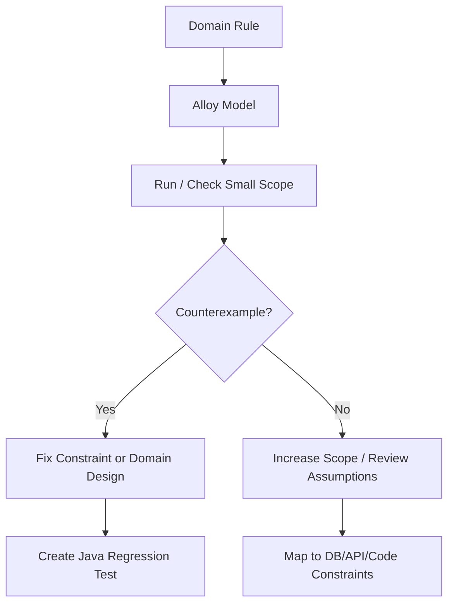

# Part 022 — Alloy for Domain Modeling and Constraint Analysis

> Tujuan bagian ini: memakai Alloy untuk menemukan bug pada domain model, relationship, cardinality, ownership, authorization, dan consistency rule sebelum semuanya terkunci di schema database, Java entity, API contract, dan workflow implementation.

TLA+ dan PlusCal bagus untuk behavior sepanjang waktu.
Alloy sangat kuat untuk **struktur dan constraint**.

```text
TLA+ asks:
What sequences of states are possible?

Alloy asks:
What structures are possible under these constraints?
Can you show me an instance?
Can you show me a counterexample?
```

Banyak bug enterprise system bukan bug algoritma rumit.
Banyak bug datang dari model domain yang tidak konsisten:

```text
case punya dua owner aktif
appeal dibuat untuk order yang tidak appealable
user approve case milik team sendiri padahal conflict-of-interest dilarang
task masih open setelah case closed
policy rule overlap dan menghasilkan dua outcome
evidence attached ke entity yang tidak boleh menerima evidence
assignment graph punya cycle
delegation memberi privilege lebih luas dari delegator
```

Unit test bisa menangkap contoh.
Alloy bisa menghasilkan contoh dan counterexample dari ruang model kecil.

---

## 1. Kapan Memakai Alloy?

Gunakan Alloy ketika pertanyaanmu berbentuk:

```text
Apakah kombinasi entity ini mungkin?
Apakah constraint ini cukup untuk mencegah state ilegal?
Apakah ada contoh valid untuk rule ini?
Apakah assertion ini selalu benar di semua model kecil?
Apakah ada conflict antar rule?
Apakah relationship ini bisa membentuk cycle?
Apakah cardinality kita benar?
```

Alloy sangat cocok untuk:

```text
domain model
authorization model
role/permission relation
ownership and assignment
approval and delegation
policy matrix
schema cardinality
configuration consistency
state classification
constraint-heavy workflows
```

Alloy kurang cocok untuk:

```text
low-level Java performance
JVM memory model
long-running liveness
queue retry timing
throughput analysis
```

Untuk behavior temporal, gunakan TLA+/PlusCal.
Untuk method contract Java, gunakan JML/OpenJML.
Untuk relational domain constraints, gunakan Alloy.

---

## 2. Alloy Mental Model

Alloy berbicara dalam:

```text
signatures: sets of atoms/entities
fields: relations between signatures
facts: constraints that always hold
predicates: named reusable constraints/scenarios
assertions: claims to be checked
commands: run/check with finite scope
```

Contoh kecil:

```alloy
sig User {}
sig Team {}

sig Case {
  owner: one Team,
  assignee: lone User
}
```

Artinya:

```text
User = set of user atoms
Team = set of team atoms
Case = set of case atoms
owner: setiap Case punya tepat satu Team
assignee: setiap Case punya nol atau satu User
```

Cardinality keywords:

| Keyword | Meaning |
|---|---|
| `one` | exactly one |
| `lone` | zero or one |
| `some` | one or more |
| `set` | zero or more |

Alloy bukan ORM.
Alloy tidak peduli table, foreign key, lazy loading, atau DTO.
Alloy peduli structure correctness.

---

## 3. Alloy sebagai Counterexample Machine

Alloy sering lebih berguna sebagai refuter daripada prover absolut.
Kita menulis assertion.
Alloy mencari counterexample dalam finite scope.

```alloy
assert EveryOpenCaseHasOwner {
  all c: Case | c.status = Open implies one c.owner
}

check EveryOpenCaseHasOwner for 5
```

Kalau assertion gagal, Alloy memberi instance kecil yang melanggar.

Engineering value:

```text
Counterexample kecil sering langsung menjadi fixture test.
```

Workflow:



---

## 4. Case Study: Regulatory Case Domain

Kita modelkan domain yang cukup kompleks tetapi masih kecil.

### 4.1 Domain

```text
Case
Party
Officer
Team
Assignment
Task
Evidence
Decision
Appeal
```

Rules:

```text
1. Open case must have exactly one owning team.
2. Open case may have one active assignee.
3. Closed case must not have open tasks.
4. Evidence must belong to exactly one case.
5. Officer cannot approve a case if they are conflicted with any party.
6. Appeal can only exist for decided case.
7. Appeal reviewer must not be the original decision maker.
8. Active assignment must belong to owning team.
9. Team hierarchy must be acyclic.
10. Delegation must not grant permission outside delegator's scope.
```

This is not a testing problem first.
This is a modelling problem.

---

## 5. Basic Alloy Model

```alloy
abstract sig CaseStatus {}
one sig Draft, Open, Decided, Closed extends CaseStatus {}

sig Team {
  parent: lone Team
}

sig Officer {
  memberOf: some Team,
  conflictedWith: set Party
}

sig Party {}

sig Case {
  status: one CaseStatus,
  owner: lone Team,
  assignee: lone Officer,
  parties: set Party,
  tasks: set Task,
  evidence: set Evidence,
  decision: lone Decision,
  appeal: lone Appeal
}

abstract sig TaskStatus {}
one sig TaskOpen, TaskDone extends TaskStatus {}

sig Task {
  taskStatus: one TaskStatus
}

sig Evidence {}

sig Decision {
  decidedBy: one Officer
}

sig Appeal {
  reviewer: one Officer
}
```

Ini belum memasukkan constraints.
Artinya Alloy boleh membuat banyak struktur absurd.
Itu bagus untuk awal.
Kita akan menambahkan facts perlahan.

---

## 6. Facts: Constraint yang Selalu Berlaku

### 6.1 Open Case Ownership

```alloy
fact OpenCaseOwnership {
  all c: Case |
    c.status = Open implies one c.owner
}
```

Tapi bagaimana Draft/Closed?
Mungkin Draft belum punya owner.
Closed tetap punya owner untuk audit.
Rule perlu precise.

```alloy
fact NonDraftCaseHasOwner {
  all c: Case |
    c.status != Draft implies one c.owner
}
```

### 6.2 Closed Case Has No Open Tasks

```alloy
fact ClosedCaseHasNoOpenTasks {
  all c: Case |
    c.status = Closed implies no t: c.tasks | t.taskStatus = TaskOpen
}
```

### 6.3 Evidence Belongs to Exactly One Case

Field `evidence: set Evidence` tidak otomatis mencegah evidence yang sama dimiliki banyak case.
Tambahkan:

```alloy
fact EvidenceBelongsToAtMostOneCase {
  all e: Evidence |
    lone c: Case | e in c.evidence
}
```

Kalau business rule mengatakan evidence harus selalu attached:

```alloy
fact EvidenceBelongsToExactlyOneCase {
  all e: Evidence |
    one c: Case | e in c.evidence
}
```

Perbedaan ini penting.
`lone` vs `one` adalah keputusan domain.

---

## 7. Assertion: Klaim yang Kita Uji

Facts mendefinisikan world.
Assertions memeriksa konsekuensi.

```alloy
assert NoClosedCaseWithOpenTask {
  no c: Case | c.status = Closed and some t: c.tasks | t.taskStatus = TaskOpen
}

check NoClosedCaseWithOpenTask for 5
```

Kalau fact `ClosedCaseHasNoOpenTasks` sudah ada, assertion ini harus pass.
Tapi assertion yang terlalu identik dengan fact tidak memberi insight.
Better assertion menanyakan konsekuensi lanjutan.

Contoh:

```alloy
assert ClosedCaseCannotHaveAppealWithOpenTask {
  no c: Case |
    c.status = Closed and
    some c.appeal and
    some t: c.tasks | t.taskStatus = TaskOpen
}
```

Lebih baik lagi: modelkan appeal tasks secara eksplisit.

---

## 8. Predicates: Scenario yang Ingin Dicari

`run` digunakan untuk mencari contoh yang memenuhi predicate.

```alloy
pred DecidedCaseWithAppeal {
  some c: Case |
    c.status = Decided and
    some c.decision and
    some c.appeal
}

run DecidedCaseWithAppeal for 5
```

Kalau Alloy tidak bisa menemukan instance, mungkin constraints terlalu kuat atau model salah.

Ini berguna untuk validating design:

```text
Bukan hanya “tidak ada counterexample”.
Kita juga perlu memastikan valid scenario masih mungkin.
```

Rule:

```text
For every important forbidden state, write check.
For every important valid state, write run.
```

---

## 9. Ownership dan Assignment Consistency

Rule:

```text
Active assignee must be member of owning team.
```

```alloy
fact AssigneeBelongsToOwnerTeam {
  all c: Case |
    some c.assignee implies c.owner in c.assignee.memberOf
}
```

But what about team hierarchy?
Maybe assignee can belong to child team.
Define ancestry:

```alloy
fun ancestors[t: Team]: set Team {
  t.^parent
}

fun teamScope[t: Team]: set Team {
  t + t.~parent
}
```

Careful: `~parent` gives children if `parent: Team -> Team`.
Transitive children:

```alloy
fun descendants[t: Team]: set Team {
  t.^~parent
}

fun ownerScope[t: Team]: set Team {
  t + descendants[t]
}
```

Then:

```alloy
fact AssigneeInOwnerScope {
  all c: Case |
    some c.assignee implies some (c.assignee.memberOf & ownerScope[c.owner])
}
```

This catches unclear hierarchy semantics early.

---

## 10. Acyclic Team Hierarchy

Tree/hierarchy models often accidentally allow cycles.

```alloy
fact TeamHierarchyAcyclic {
  no t: Team | t in t.^parent
}
```

This means no team can reach itself by following parent one or more times.

Java/database mapping:

```text
Relational DB foreign key alone does not prevent hierarchy cycles.
Need recursive constraint, application check, closure table rule, trigger, or materialized path validation.
```

Alloy gives you the counterexample:

```text
TeamA.parent = TeamB
TeamB.parent = TeamA
```

That counterexample becomes test:

```java
@Test
void teamHierarchyRejectsCycle() {
    TeamId a = teams.create("A");
    TeamId b = teams.create("B");

    teams.setParent(b, a);

    assertThatThrownBy(() -> teams.setParent(a, b))
        .isInstanceOf(HierarchyCycleException.class);
}
```

---

## 11. Conflict of Interest

Rule:

```text
Officer cannot decide case if officer is conflicted with any party in that case.
```

Alloy:

```alloy
fact NoConflictedDecisionMaker {
  all c: Case |
    some c.decision implies
      no (c.decision.decidedBy.conflictedWith & c.parties)
}
```

Appeal rule:

```text
Appeal reviewer must not be original decision maker.
Appeal reviewer must not be conflicted with case parties.
```

```alloy
fact AppealReviewerIndependent {
  all c: Case |
    some c.appeal implies {
      some c.decision
      c.appeal.reviewer != c.decision.decidedBy
      no (c.appeal.reviewer.conflictedWith & c.parties)
    }
}
```

This is where Alloy shines.
Java tests often miss combinatorial combinations:

```text
same reviewer as decision maker
reviewer in same team
reviewer conflicted with one of multiple parties
case has no decision but appeal exists
appeal exists after closed state
```

Alloy explores small combinations systematically.

---

## 12. Appeal Validity

Rule:

```text
Appeal can only exist for decided or closed-with-decision case.
```

```alloy
fact AppealRequiresDecision {
  all c: Case |
    some c.appeal implies some c.decision
}

fact AppealOnlyForDecidedOrClosedCase {
  all c: Case |
    some c.appeal implies c.status in Decided + Closed
}
```

Potential issue:

```text
Closed case can have appeal, but closed case has no open tasks.
If appeal requires review task, then closed appeal may be impossible.
```

This kind of rule conflict is exactly what `run` finds.

```alloy
pred ClosedCaseWithAppeal {
  some c: Case | c.status = Closed and some c.appeal
}

run ClosedCaseWithAppeal for 5
```

If no instance exists, ask:

```text
Is this intended?
If yes, rule should say appeal cannot exist after closure.
If no, closed appeal should have no open task or closure semantics are wrong.
```

---

## 13. Delegation Model

Authorization bugs often hide in delegation.

Domain:

```text
Officer can delegate permission to another officer.
Delegate must not gain permission outside delegator's scope.
Delegation graph must be acyclic or explicitly bounded.
Delegation expires or can be revoked.
```

Static Alloy model:

```alloy
abstract sig Permission {}
one sig ViewCase, DecideCase, ReassignCase extends Permission {}

sig Delegation {
  from: one Officer,
  to: one Officer,
  permission: some Permission,
  scope: some Team
}
```

Rule:

```alloy
fact NoSelfDelegation {
  no d: Delegation | d.from = d.to
}
```

Delegation graph acyclic:

```alloy
fun delegatesTo: Officer -> Officer {
  Delegation.from -> Delegation.to
}

fact DelegationAcyclic {
  no o: Officer | o in o.^delegatesTo
}
```

Scope rule needs define officer base scope.

```alloy
fun officerBaseScope[o: Officer]: set Team {
  o.memberOf + o.memberOf.^~parent
}

fact DelegationWithinDelegatorScope {
  all d: Delegation |
    d.scope in officerBaseScope[d.from]
}
```

This catches privilege escalation:

```text
Officer in Team A delegates DecideCase on Team B.
```

---

## 14. Policy Matrix Overlap

Suppose we have classification policy:

```text
Case priority depends on category, risk, and party type.
Exactly one policy rule should match any case.
```

Alloy can model overlap.

```alloy
abstract sig Risk {}
one sig Low, Medium, High extends Risk {}

abstract sig Category {}
one sig Fraud, Safety, Licensing extends Category {}

sig PolicyRule {
  risk: set Risk,
  category: set Category,
  output: one Priority
}

abstract sig Priority {}
one sig Normal, Urgent, Critical extends Priority {}
```

Overlap assertion:

```alloy
pred overlaps[r1, r2: PolicyRule] {
  r1 != r2
  some (r1.risk & r2.risk)
  some (r1.category & r2.category)
}

assert NoPolicyOverlap {
  no r1, r2: PolicyRule | overlaps[r1, r2]
}

check NoPolicyOverlap for 6
```

Coverage assertion:

```alloy
assert EveryCombinationCovered {
  all r: Risk, c: Category |
    one pr: PolicyRule | r in pr.risk and c in pr.category
}
```

In Java, this maps to:

```text
policy configuration validation at startup
admin UI validation before activation
migration check before deployment
property-based test generating category/risk combinations
```

---

## 15. Alloy and Java Type Design

Alloy findings should influence Java model.

Bad Java model:

```java
class CaseRecord {
    UUID ownerTeamId;       // nullable? unknown
    UUID assigneeUserId;    // nullable? unknown
    String status;          // invalid values possible
}
```

Better:

```java
record CaseRecord(
    CaseId id,
    CaseStatus status,
    Optional<TeamId> ownerTeamId,
    Optional<OfficerId> assigneeId
) {}
```

But Optional alone does not encode conditional rules:

```text
status != DRAFT implies owner exists
closed implies no open tasks
assignee belongs to owner scope
```

Those need:

```text
domain service validation
database constraints
foreign keys
unique indexes
transactional checks
policy engine validation
property tests
startup config validation
```

Alloy clarifies which constraints belong where.

---

## 16. Mapping Alloy to Database Constraints

Some constraints map directly:

| Alloy rule | DB mapping |
|---|---|
| evidence belongs to one case | `evidence.case_id NOT NULL` FK |
| one active assignment per case | partial unique index |
| no duplicate policy key | unique index on normalized key |
| appeal requires decision | FK / check / application transaction |
| no self delegation | check constraint |
| acyclic hierarchy | recursive check / trigger / closure table |
| conflict of interest | application/domain transaction check |
| assignee in owner scope | application check or materialized permission table |

Example partial unique index:

```sql
CREATE UNIQUE INDEX ux_active_assignment_per_case
ON case_assignment(case_id)
WHERE active = true;
```

Alloy assertion:

```alloy
assert AtMostOneActiveAssignmentPerCase {
  all c: Case |
    lone a: Assignment | a.case = c and a.active = True
}
```

Java integration test:

```java
@Test
void caseCannotHaveTwoActiveAssignments() {
    CaseId caseId = fixtures.openCase();
    assignments.assign(caseId, officerA);

    assertThatThrownBy(() -> assignments.assign(caseId, officerB))
        .isInstanceOf(DuplicateActiveAssignmentException.class);
}
```

---

## 17. Alloy Scope: Small but Sharp

Alloy checks finite scopes.

```alloy
check NoPolicyOverlap for 5
```

Meaning: search counterexamples with up to 5 atoms per top-level signature unless customized.

Small scopes are useful:

```text
2 teams can reveal cycle
2 officers can reveal conflict
2 policy rules can reveal overlap
3 nodes can reveal hierarchy issue
```

Do not start huge.
Start with the smallest scope that can express the bug.

Example:

```alloy
check DelegationAcyclic for 3 Officer, 3 Delegation
```

If no counterexample appears, increase selectively.

---

## 18. Integer Pitfalls

Alloy integer support is bounded.
Do not model money, latency, or quantity-heavy logic naively unless you understand bitwidth and overflow behavior.

For enterprise Java systems, prefer symbolic categories where possible:

```text
Risk = Low, Medium, High
AmountBand = Small, Large
AgeBand = Fresh, Stale, Expired
```

Instead of:

```text
amount > 1000000
now - createdAt > 30 days
```

Use Alloy to model classification consistency, not arithmetic performance.
For detailed numeric testing, combine Java property-based tests with boundary values.

---

## 19. Temporal Alloy

Alloy 6 supports temporal modelling.
This allows modelling state transitions over traces.

Use it when:

```text
you have mostly relational constraints,
but need a few temporal transitions.
```

Use TLA+/PlusCal when:

```text
behavior/interleaving/fairness/retry is central.
```

Heuristic:

```text
If the hard part is “what structures are legal?” -> Alloy.
If the hard part is “what can happen over time?” -> TLA+.
If both are hard, use Alloy first for structural constraints, then TLA+ for protocol behavior.
```

---

## 20. Model Validation: `run` Is as Important as `check`

A model with too many facts can be inconsistent.
Then assertions pass vacuously because no valid instance exists.

Always write scenario predicates:

```alloy
pred ValidOpenAssignedCase {
  some c: Case |
    c.status = Open and
    one c.owner and
    one c.assignee
}

run ValidOpenAssignedCase for 5
```

```alloy
pred ValidAppealedDecision {
  some c: Case |
    c.status = Decided and
    some c.decision and
    some c.appeal
}

run ValidAppealedDecision for 5
```

If important valid scenarios cannot be generated, your constraints may be overfitted.

Rule:

```text
Never trust checks until you have run representative valid scenarios.
```

---

## 21. From Alloy Counterexample to Java Regression Test

Counterexample:

```text
Case0.status = Decided
Case0.decision.decidedBy = Officer0
Case0.appeal.reviewer = Officer0
```

Violation:

```text
Appeal reviewer is original decision maker.
```

Java test:

```java
@Test
void appealReviewerCannotBeOriginalDecisionMaker() {
    OfficerId officer = fixtures.officer();
    CaseId caseId = fixtures.decidedCase(decidedBy(officer));

    assertThatThrownBy(() -> appeals.assignReviewer(caseId, officer))
        .isInstanceOf(ConflictOfInterestException.class)
        .hasMessageContaining("original decision maker");
}
```

API contract test:

```java
@Test
void assignAppealReviewerReturnsConflictForOriginalDecisionMaker() {
    given()
        .contentType(JSON)
        .body(assignReviewerPayload(originalDecisionMakerId))
    .when()
        .post("/cases/{id}/appeal/reviewer", caseId)
    .then()
        .statusCode(409)
        .body("code", equalTo("APPEAL_REVIEWER_NOT_INDEPENDENT"));
}
```

Database/domain invariant check:

```sql
-- not always expressible as simple check constraint if it crosses tables
-- enforce in domain service transaction and audit rejected attempt
```

Production metric:

```text
appeal.reviewer_assignment_rejected.conflict.count
```

---

## 22. Alloy as Design Review Artifact

For complex domain changes, include Alloy model in design review.

Design review question set:

```text
1. What are the core signatures?
2. What relations carry ownership, permission, or lifecycle meaning?
3. What states are forbidden?
4. What valid examples must exist?
5. What assertions were checked?
6. What counterexamples changed the design?
7. Which constraints map to DB/API/domain code/tests?
```

This is much more useful than a diagram alone.

A diagram shows intended structure.
Alloy asks whether unintended structure is still possible.

---

## 23. Suggested Repository Layout

```text
formal/
  alloy/
    case-domain/
      case-domain.als
      README.md
      counterexamples/
        duplicate-active-assignment.md
        conflicted-appeal-reviewer.md
    authorization/
      delegation.als
    policy/
      priority-policy.als
```

README template:

```text
# Model Purpose

# Domain Scope

# Out of Scope

# Important Signatures

# Facts

# Assertions

# Run Scenarios

# Counterexamples Found

# Mapping to Java/DB/API Tests
```

---

## 24. Alloy Review Checklist

```text
Model shape:
[ ] Are signatures minimal and domain-named?
[ ] Are relations explicit instead of hidden in comments?
[ ] Are cardinalities intentional?
[ ] Are facts not overconstraining the model?

Validation:
[ ] Are valid scenarios tested with run?
[ ] Are forbidden states tested with check?
[ ] Are scopes selected intentionally?
[ ] Are integer/ordering assumptions explicit?

Domain correctness:
[ ] Ownership constraints are represented.
[ ] Terminal-state constraints are represented.
[ ] Authorization/delegation constraints are represented.
[ ] Conflict-of-interest constraints are represented.
[ ] Cross-entity invariants are represented.

Engineering mapping:
[ ] Each important fact maps to DB constraint, domain code, API contract, or config validation.
[ ] Each important counterexample maps to a Java regression test.
[ ] Each rejected business operation has a clear error contract.
```

---

## 25. Alloy vs Tests: What Each One Owns

Alloy does not replace Java tests.
It tells you what tests and constraints matter.

| Concern | Best evidence |
|---|---|
| Entity relationship consistency | Alloy + DB constraints |
| Business lifecycle examples | Unit/component tests |
| Cross-service API compatibility | Contract tests |
| Retry/interleaving behavior | TLA+/PlusCal + integration tests |
| Method pre/postcondition | JML/OpenJML or unit/property tests |
| Performance | JMH/load/profiling |

Alloy is strongest before implementation ossifies.
Use it during design and schema evolution.

---

## 26. Practice Drill: Model a Permission System

Try this:

```text
Domain:
- User belongs to groups.
- Group has permissions over resources.
- Resource belongs to tenant.
- User may be delegated permission by another user.
- Delegation cannot cross tenant.
- Admin can revoke delegation.

Find:
1. A valid delegated access example.
2. A counterexample where delegation crosses tenant.
3. A counterexample where delegation cycle exists.
4. An assertion that effective permission never exceeds source permission.
5. A Java test for the smallest counterexample.
```

Expected output:

```text
not “I wrote Alloy syntax”
but “I discovered this missing tenant boundary constraint”
```

---

## 27. Summary

Alloy gives Java engineers a compact way to reason about domain structure.
It is especially valuable when correctness depends on relationships:

```text
ownership
assignment
authorization
delegation
approval independence
policy overlap
schema cardinality
hierarchy acyclicity
cross-entity invariants
```

The production-grade workflow is:

```text
define signatures
add minimal facts
run valid scenarios
check forbidden assertions
inspect counterexamples
map findings to Java/DB/API/tests
keep model with design docs
```

The goal is not to “prove the whole system”.
The goal is to prevent structurally invalid worlds from entering your implementation unnoticed.

That is already a major engineering advantage.

---

## References

- Alloy official documentation: language, expressions, constraints, sets, relations, analyzer.
- Alloy 6 documentation and temporal modelling notes.
- Daniel Jackson, *Software Abstractions: Logic, Language, and Analysis*.
