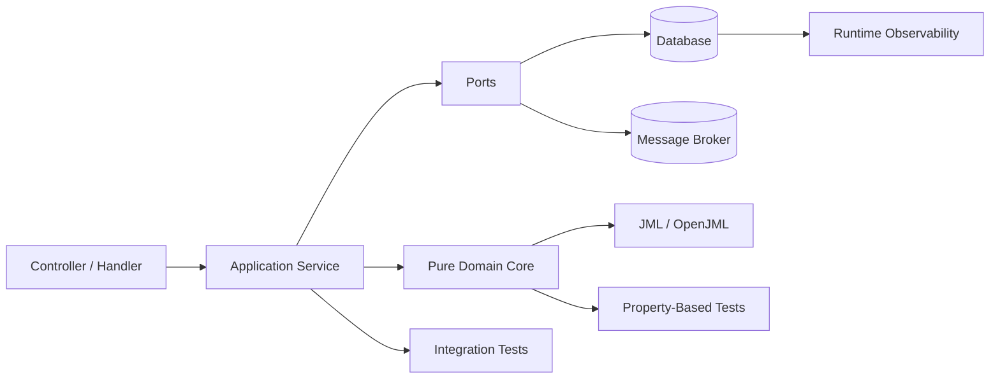
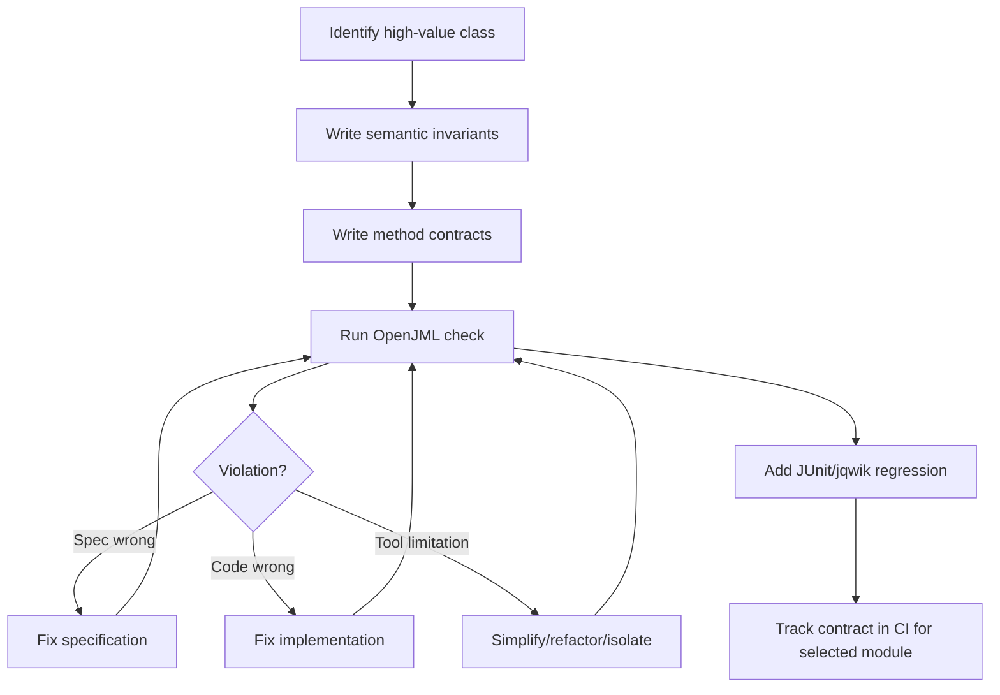
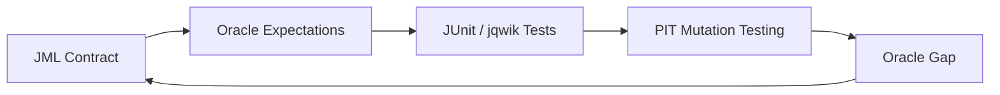

# Part 023 — OpenJML and Design by Contract in Java

> Tujuan bagian ini: memakai Design by Contract dan JML/OpenJML secara praktis untuk mengubah asumsi kode Java menjadi kontrak yang bisa dibaca, dites, dan pada subset tertentu diverifikasi.

Di bagian sebelumnya kita memakai TLA+ untuk behavior lintas waktu dan Alloy untuk struktur domain.
Sekarang kita turun ke level Java source code.

Pertanyaan utamanya berubah dari:

```text
Apakah workflow ini punya interleaving buruk?
Apakah domain graph ini punya struktur yang invalid?
```

menjadi:

```text
Apakah method ini menjaga invariant object?
Apakah return value memenuhi postcondition?
Apakah method ini hanya mengubah field yang memang boleh berubah?
Apakah exception path meninggalkan object dalam keadaan aman?
Apakah arithmetic edge case bisa overflow?
Apakah null contract eksplisit?
```

Itulah wilayah **Design by Contract**.

OpenJML bukan pengganti unit test.
Ia adalah lapisan evidence berbeda:

```text
JUnit examples       -> contoh perilaku
jqwik properties    -> keluarga perilaku
PIT mutation        -> kekuatan oracle test
TLA+/Alloy          -> model sistem/domain
JML/OpenJML         -> kontrak source-level Java
JFR/metrics         -> evidence runtime production
```

Mental model yang benar:

```text
JML tidak membuat kode otomatis benar.
JML membuat janji kode menjadi eksplisit.
OpenJML mencoba memeriksa apakah implementasi menepati janji itu.
```

---

## 1. Problem yang Diselesaikan Design by Contract

Banyak Java code tampak sederhana tetapi membawa kontrak tersembunyi.

Contoh:

```java
public Money allocate(Money available, int requestedUnits) {
    if (requestedUnits <= 0) throw new IllegalArgumentException();
    return available.divide(requestedUnits);
}
```

Kontrak tersembunyinya:

```text
available tidak boleh null
available amount tidak boleh negatif
requestedUnits harus positif
division rounding harus deterministic
return value tidak boleh negatif
method tidak boleh mengubah available
exception path tidak boleh punya side effect
```

Tanpa kontrak eksplisit, requirement ini tersebar di:

```text
nama method
unit test
caller assumptions
review comments
dokumentasi yang cepat basi
tribal knowledge
```

Design by Contract memaksa kita menulis:

```text
caller wajib memenuhi apa?
method menjamin apa?
object selalu menjaga apa?
method boleh mengubah apa?
exception path menjamin apa?
```

---

## 2. Vocabulary Kontrak

Gunakan vocabulary ini sebelum masuk syntax JML.

| Konsep | Pertanyaan | Contoh |
|---|---|---|
| Precondition | Apa yang wajib benar sebelum method dipanggil? | `amount >= 0`, `caseId != null` |
| Postcondition | Apa yang dijamin setelah method sukses? | `status == APPROVED`, `result >= 0` |
| Invariant | Apa yang selalu benar untuk object valid? | `balance >= 0`, `closedAt != null iff status == CLOSED` |
| Frame condition | State mana yang boleh berubah? | hanya `status`, `updatedAt`, `version` |
| Exceptional postcondition | Apa yang benar jika exception dilempar? | tidak ada state change, audit failure tercatat |
| Pure method | Method yang bisa dipakai dalam spec karena tidak mengubah state | getter/computation deterministic |
| Model field | Abstraksi spec yang tidak harus sama dengan representasi private field | logical balance, visible owner set |

Kontrak yang baik tidak sekadar menulis tipe Java.
Kontrak yang baik menangkap **semantic constraint**.

```text
int amount
```

bukan kontrak cukup.

```text
amount is non-negative
amount uses minor currency unit
amount must fit configured currency precision
amount must not overflow when accumulated
```

baru mulai masuk wilayah engineering.

---

## 3. JML dalam Satu Gambar

JML ditulis sebagai komentar khusus, sehingga tetap valid Java untuk compiler biasa.

```java
public final class Counter {
    private int value;

    //@ invariant value >= 0;

    //@ requires delta > 0;
    //@ ensures value == \old(value) + delta;
    //@ assignable value;
    public void increment(int delta) {
        value += delta;
    }

    //@ ensures 
esult == value;
    //@ pure
    public int value() {
        return value;
    }
}
```

Baca kontraknya:

```text
object valid jika value >= 0
increment hanya boleh dipanggil dengan delta > 0
setelah increment sukses, value bertambah delta
increment hanya boleh mengubah field value
value() pure dan return current value
```

Yang menarik bukan syntax.
Yang menarik adalah **frame condition**:

```java
//@ assignable value;
```

Banyak bug enterprise datang dari method yang mengubah terlalu banyak state.
Frame condition membuat efek samping menjadi explicit.

---

## 4. Apa yang Bisa dan Tidak Bisa Diharapkan dari OpenJML

Gunakan OpenJML sebagai alat engineering, bukan silver bullet.

### Cocok

```text
small pure domain logic
value object
bounded arithmetic
state transition guard
collection size constraint
nullness contract
method-level invariant
frame condition
exception contract
helper method correctness
```

### Sulit atau mahal

```text
complex framework lifecycle
reflection-heavy code
ORM lazy proxy semantics
network/database side effect
large heap object graph
floating point numerical proof
highly concurrent implementation
full distributed system behavior
```

Aturan praktis:

```text
JML paling efektif di pure core.
JML paling rapuh di effectful shell.
```

Maka desain dari Part 004 kembali penting:



Letakkan kontrak JML pada core yang deterministic.
Biarkan IO diverifikasi dengan integration test, contract test, dan production evidence.

---

## 5. Precondition: Jangan Menyembunyikan Kewajiban Caller

Contoh buruk:

```java
public int approve(CaseRecord c, User actor) {
    Objects.requireNonNull(c);
    Objects.requireNonNull(actor);
    if (!actor.canApprove(c)) throw new ForbiddenException();
    if (c.isClosed()) throw new IllegalStateException();
    return c.approveBy(actor);
}
```

Kode ini tampak defensive, tapi kontraknya kabur.
Mana yang programmer error?
Mana yang business rejection?
Mana yang recoverable?

Dengan kontrak:

```java
public final class CaseApprovalPolicy {

    //@ public normal_behavior
    //@   requires c != null;
    //@   requires actor != null;
    //@   requires !c.isClosed();
    //@   ensures 
esult == actor.canApprove(c);
    //@ pure
    public boolean mayApprove(CaseRecord c, User actor) {
        return !c.isClosed() && actor.canApprove(c);
    }
}
```

Di sini `mayApprove` pure.
Ia tidak approve.
Ia hanya menyatakan predicate.

Lalu application service bisa memakai predicate itu:

```java
public ApprovalResult approve(CaseId id, UserId actorId) {
    CaseRecord c = repository.getForUpdate(id);
    User actor = userDirectory.get(actorId);

    if (!policy.mayApprove(c, actor)) {
        return ApprovalResult.rejected("not eligible");
    }

    c.approve(actorId, clock.instant());
    repository.save(c);
    return ApprovalResult.approved(c.id());
}
```

Insight:

```text
Kontrak formal lebih mudah ditulis jika decision logic dipisahkan dari side effect.
```

---

## 6. Postcondition: Jangan Hanya Assert Output, Assert Meaning

Contoh value object:

```java
public final class Percentage {
    private final int basisPoints;

    //@ invariant 0 <= basisPoints && basisPoints <= 10000;

    //@ requires 0 <= basisPoints && basisPoints <= 10000;
    //@ ensures this.basisPoints == basisPoints;
    public Percentage(int basisPoints) {
        this.basisPoints = basisPoints;
    }

    //@ ensures 0 <= 
esult && 
esult <= amount;
    //@ ensures 
esult == amount * basisPoints / 10000;
    //@ pure
    public long applyTo(long amount) {
        return amount * basisPoints / 10000;
    }
}
```

Tapi ada bug tersembunyi:

```text
amount * basisPoints bisa overflow long
```

Kontrak harus memperjelas batas:

```java
//@ requires amount >= 0;
//@ requires amount <= Long.MAX_VALUE / basisPoints;
//@ ensures 0 <= 
esult && 
esult <= amount;
//@ pure
public long applyTo(long amount) {
    return amount * basisPoints / 10000;
}
```

Tetapi `basisPoints` bisa 0, sehingga precondition `Long.MAX_VALUE / basisPoints` bermasalah.
Kontrak yang lebih aman:

```java
//@ requires amount >= 0;
//@ requires basisPoints == 0 || amount <= Long.MAX_VALUE / basisPoints;
//@ ensures 0 <= 
esult && 
esult <= amount;
//@ pure
public long applyTo(long amount) {
    return amount * basisPoints / 10000;
}
```

Inilah nilai formal thinking:

```text
Spesifikasi memaksa kita melihat edge case yang test contoh sering lewatkan.
```

---

## 7. Invariant: Object Harus Selalu Valid

Misal domain enforcement case:

```java
public final class EnforcementCase {
    private CaseStatus status;
    private Instant openedAt;
    private Instant closedAt;
    private int version;

    //@ invariant openedAt != null;
    //@ invariant version >= 0;
    //@ invariant (status == CaseStatus.CLOSED) ==> closedAt != null;
    //@ invariant closedAt != null ==> status == CaseStatus.CLOSED;
}
```

Invariant bukan validasi input.
Invariant adalah hukum internal object.

Artinya:

```text
constructor harus membangun object valid
setiap public method harus masuk dari state valid
setiap public method harus keluar dalam state valid
exception path tidak boleh meninggalkan object rusak
```

Kalau method sementara membuat state invalid di tengah execution, itu bisa diterima selama tidak observable dan tool bisa memahaminya.
Namun semakin banyak temporary invalid state, semakin susah verification.

Desain yang lebih baik:

```java
public void close(Instant now) {
    requireOpen();
    this.status = CaseStatus.CLOSED;
    this.closedAt = now;
    this.version++;
}
```

lebih mudah daripada:

```java
public void close(Instant now) {
    this.closedAt = null;
    recalculateSomething();
    this.status = CaseStatus.CLOSED;
    emitInternalSideEffects();
    this.closedAt = now;
}
```

Invariant menyukai kode yang **linear, kecil, dan deterministic**.

---

## 8. Frame Condition: Senjata Melawan Side Effect Tak Terkontrol

Dalam Java enterprise code, bug sering bukan output salah, tapi efek samping salah.

Contoh:

```text
approve case ternyata mengubah owner
retry command ternyata mengganti createdAt
validation method ternyata memutasi status
read method ternyata mengisi lazy cache secara observable
```

JML memakai `assignable` untuk menyatakan state yang boleh berubah.

```java
//@ requires canApprove(actorId);
//@ ensures status == CaseStatus.APPROVED;
//@ ensures approvedBy.equals(actorId);
//@ assignable status, approvedBy, approvedAt, version;
public void approve(UserId actorId, Instant now) {
    this.status = CaseStatus.APPROVED;
    this.approvedBy = actorId;
    this.approvedAt = now;
    this.version++;
}
```

Jika method mengubah `owner`, kontrak dilanggar.

Mental model:

```text
Postcondition bicara tentang apa yang harus benar.
Frame condition bicara tentang apa yang tidak boleh berubah.
```

Untuk domain kompleks, frame condition sering lebih penting daripada postcondition.

---

## 9. Exceptional Behavior: Exception Tidak Boleh Menjadi Lubang Kontrak

Banyak sistem punya test sukses, tetapi exception path merusak state.

Contoh buruk:

```java
public void approve(UserId actorId, Instant now) {
    this.status = CaseStatus.APPROVING;

    if (!policyAllows(actorId)) {
        throw new ForbiddenException();
    }

    this.status = CaseStatus.APPROVED;
    this.approvedBy = actorId;
    this.approvedAt = now;
}
```

Jika `policyAllows` false, object tertinggal di `APPROVING`.

Kontrak yang diinginkan:

```text
Jika ForbiddenException terjadi, status tidak berubah.
```

Gaya JML konseptual:

```java
//@ requires actorId != null;
//@ requires now != null;
//@ assignable status, approvedBy, approvedAt, version;
//@ ensures status == CaseStatus.APPROVED;
//@ signals (ForbiddenException e) status == \old(status);
public void approve(UserId actorId, Instant now) {
    if (!policyAllows(actorId)) {
        throw new ForbiddenException();
    }
    this.status = CaseStatus.APPROVED;
    this.approvedBy = actorId;
    this.approvedAt = now;
    this.version++;
}
```

Prinsip implementasi:

```text
Validate first.
Mutate second.
Publish side effects last.
```

JML membuat pola ini bukan sekadar style, tetapi kontrak.

---

## 10. Pure Methods: Memisahkan Predicate dari Command

JML spec sering perlu memanggil method dalam kontrak.
Method itu harus pure secara konsep.

```java
//@ pure
public boolean isTerminal() {
    return status == CaseStatus.CLOSED || status == CaseStatus.REJECTED;
}
```

Pure method harus:

```text
tidak mengubah field
tidak melakukan IO
tidak publish event
tidak membaca waktu sekarang
tidak membaca random
tidak tergantung mutable global state
```

Ini mengarah ke desain domain yang sehat:

```text
canApprove(...)     -> pure predicate
approve(...)        -> command mutation
approvalReason(...) -> pure explanation jika deterministic
publishApproved(...) -> effectful adapter
```

Anti-pattern:

```java
public boolean canApprove(UserId actorId) {
    audit.log("checking approval");
    return permissionService.isAllowed(actorId, id);
}
```

Method ini bukan predicate murni.
Ia melakukan IO/logical side effect.
Pisahkan:

```java
public boolean canApprove(PermissionSnapshot permissions, UserId actorId) {
    return permissions.canApprove(actorId, id);
}
```

Application service yang mengambil `PermissionSnapshot` dari luar.

---

## 11. Nullness Contract

Java modern punya banyak annotation nullness, tapi formal contract tetap berguna.

```java
//@ requires input != null;
//@ ensures 
esult != null;
public NormalizedName normalize(String input) {
    String trimmed = input.trim();
    if (trimmed.isEmpty()) throw new IllegalArgumentException();
    return new NormalizedName(trimmed.toUpperCase(Locale.ROOT));
}
```

Kontrak ini belum lengkap karena exception path tidak disebut.

Lebih baik:

```java
//@ requires input != null;
//@ ensures 
esult != null;
//@ signals (IllegalArgumentException e) input.trim().isEmpty();
public NormalizedName normalize(String input) {
    String trimmed = input.trim();
    if (trimmed.isEmpty()) throw new IllegalArgumentException();
    return new NormalizedName(trimmed.toUpperCase(Locale.ROOT));
}
```

Namun berhati-hati: memanggil `trim()` di spec bisa punya detail Unicode/locale/implementation concern.
Untuk formal spec, sering lebih baik memakai predicate helper kecil:

```java
//@ public normal_behavior
//@   requires s != null;
//@   ensures 
esult <==> s.trim().isEmpty();
//@ pure
public static boolean isBlankAfterTrim(String s) {
    return s.trim().isEmpty();
}
```

Lalu kontrak method utama menjadi lebih readable.

---

## 12. Arithmetic Contract: Java Overflow Adalah Silent Bug

Java integer overflow tidak otomatis exception untuk primitive arithmetic.
Ini penting untuk pricing, quotas, counters, penalty, scoring, billing, dan regulatory fines.

Bug:

```java
public long total(long unitPrice, int quantity) {
    return unitPrice * quantity;
}
```

Kontrak minimal:

```java
//@ requires unitPrice >= 0;
//@ requires quantity >= 0;
//@ requires quantity == 0 || unitPrice <= Long.MAX_VALUE / quantity;
//@ ensures 
esult >= 0;
//@ ensures 
esult == unitPrice * quantity;
//@ pure
public long total(long unitPrice, int quantity) {
    return unitPrice * quantity;
}
```

Atau gunakan API yang explicit overflow:

```java
public long total(long unitPrice, int quantity) {
    return Math.multiplyExact(unitPrice, quantity);
}
```

Kemudian kontrak berubah:

```text
normal behavior jika tidak overflow
exception behavior jika overflow
```

Spec yang bagus memaksa keputusan:

```text
Apakah overflow ditolak?
Apakah overflow saturating?
Apakah overflow memakai BigDecimal?
Apakah overflow impossible by domain constraint?
```

Jangan biarkan arithmetic policy implicit.

---

## 13. Contract untuk Value Object

Value object ideal untuk JML karena:

```text
small
immutable
pure
no IO
strong invariant
```

Contoh `Money` sederhana:

```java
public final class Money {
    private final long minorUnits;
    private final CurrencyCode currency;

    //@ invariant currency != null;
    //@ invariant minorUnits >= 0;

    //@ requires currency != null;
    //@ requires minorUnits >= 0;
    //@ ensures this.currency.equals(currency);
    //@ ensures this.minorUnits == minorUnits;
    public Money(CurrencyCode currency, long minorUnits) {
        this.currency = currency;
        this.minorUnits = minorUnits;
    }

    //@ requires other != null;
    //@ requires currency.equals(other.currency);
    //@ requires Long.MAX_VALUE - minorUnits >= other.minorUnits;
    //@ ensures 
esult.currency.equals(currency);
    //@ ensures 
esult.minorUnits == minorUnits + other.minorUnits;
    //@ pure
    public Money plus(Money other) {
        return new Money(currency, minorUnits + other.minorUnits);
    }
}
```

Kontrak membuat domain rule eksplisit:

```text
cannot add different currencies
cannot create negative money
cannot overflow accumulated amount
```

Unit test tetap dibutuhkan:

```java
@Test
void cannotAddDifferentCurrencies() {
    Money usd = Money.usd(100);
    Money eur = Money.eur(100);

    assertThrows(CurrencyMismatchException.class, () -> usd.plus(eur));
}
```

Property test juga cocok:

```java
@Property
void plusIsCommutativeForSameCurrency(@ForAll("money") Money a,
                                      @ForAll("money") Money b) {
    assumeNoOverflow(a, b);
    assumeSameCurrency(a, b);

    assertThat(a.plus(b)).isEqualTo(b.plus(a));
}
```

JML, unit test, dan property test saling melengkapi.

---

## 14. Contract untuk State Transition

Contoh aggregate:

```java
public final class CaseRecord {
    private CaseStatus status;
    private UserId assignedTo;
    private UserId approvedBy;
    private Instant approvedAt;
    private long version;

    //@ invariant status != null;
    //@ invariant version >= 0;
    //@ invariant (status == CaseStatus.APPROVED) ==> approvedBy != null;
    //@ invariant (status == CaseStatus.APPROVED) ==> approvedAt != null;

    //@ requires actor != null;
    //@ requires now != null;
    //@ requires status == CaseStatus.UNDER_REVIEW;
    //@ requires assignedTo != null;
    //@ requires !assignedTo.equals(actor);
    //@ ensures status == CaseStatus.APPROVED;
    //@ ensures approvedBy.equals(actor);
    //@ ensures approvedAt.equals(now);
    //@ ensures version == \old(version) + 1;
    //@ assignable status, approvedBy, approvedAt, version;
    public void approve(UserId actor, Instant now) {
        if (status != CaseStatus.UNDER_REVIEW) throw new IllegalStateException();
        if (assignedTo.equals(actor)) throw new ConflictOfInterestException();

        this.status = CaseStatus.APPROVED;
        this.approvedBy = actor;
        this.approvedAt = now;
        this.version++;
    }
}
```

Perhatikan ada duplikasi antara precondition dan runtime check.
Itu normal.

```text
Runtime check protects production.
JML precondition documents caller obligation and enables verification reasoning.
```

Namun untuk business rejection, sering lebih baik tidak menjadikan semua sebagai precondition.

Bedakan:

```text
Programming precondition: actor != null
Business condition: actor cannot approve own case
```

Business condition bisa menjadi return result, bukan thrown programming error.

---

## 15. Precondition vs Business Rejection

Ini keputusan desain penting.

### Option A — Business rule as precondition

```java
//@ requires canApprove(actor);
public void approve(UserId actor, Instant now) { ... }
```

Maknanya:

```text
caller salah jika memanggil approve saat tidak boleh
```

Cocok untuk internal domain method yang hanya dipanggil setelah validation.

### Option B — Business rule as result

```java
public ApprovalDecision decideApproval(UserId actor) {
    if (!canApprove(actor)) return ApprovalDecision.rejected(...);
    return ApprovalDecision.allowed();
}
```

Maknanya:

```text
rejection adalah bagian normal domain behavior
```

Cocok untuk API/application boundary.

### Option C — Business rule as exception

```java
public void approve(UserId actor, Instant now) throws ConflictOfInterestException { ... }
```

Maknanya:

```text
invalid transition direpresentasikan sebagai exceptional control flow
```

Bisa cocok, tetapi hati-hati jika exception dipakai untuk normal decision path.

Rule:

```text
Di boundary: return explicit domain decision.
Di pure domain core: precondition boleh lebih kuat.
Di persistence/IO layer: exception biasanya technical failure.
```

---

## 16. Menulis Kontrak yang Tidak Menjadi Noise

Kontrak buruk:

```java
//@ ensures 
esult != null;
public String toString() { ... }
```

Bisa berguna, tapi sering noise.

Kontrak bernilai:

```java
//@ ensures 
esult.caseId().equals(caseId);
//@ ensures 
esult.version() == version;
//@ ensures 
esult.status() == status;
//@ ensures 
esult.events().isEmpty();
```

Untuk memilih kontrak, tanyakan:

```text
Apakah bug di area ini mahal?
Apakah rule ini sering disalahpahami?
Apakah rule ini sulit dicakup dengan contoh test?
Apakah rule ini invariant domain/regulatory?
Apakah perubahan kode sering merusaknya diam-diam?
```

Jika ya, kontrak layak ditulis.

---

## 17. Contract Granularity

Jangan memulai dari semua class.
Mulai dari hot spots.

Prioritas tinggi:

```text
money/quantity/percentage/rate
identifier normalization
state transition aggregate
policy decision predicate
authorization predicate
date window/rule calculation
quota/counter
deduplication key
idempotency result
serialization canonicalization
```

Prioritas rendah:

```text
DTO trivial
controller glue
framework configuration
repository implementation
logging wrapper
simple mapper yang sudah covered oleh contract test
```

Kontrak harus membuat sistem lebih jelas, bukan lebih berat.

---

## 18. Runtime Assertion Checking vs Static Verification

Ada dua mode mental:

```text
runtime checking: jalankan program, cek kontrak saat runtime
automated/static checking: tool mencoba membuktikan kontrak tanpa menjalankan semua input
```

Runtime checking dekat dengan testing:

```text
lebih mudah dipahami
menemukan violation saat test berjalan
terbatas input test
```

Static checking lebih kuat tetapi lebih menuntut:

```text
butuh spec lebih lengkap
bisa menghasilkan proof obligation sulit
terbatas subset bahasa/tool support
mungkin perlu refactor agar tool paham
```

Praktik realistis:

```text
1. Tulis kontrak untuk domain core kecil.
2. Jalankan runtime/spec checking pada test penting.
3. Tambah static checking untuk value object/predicate kritis.
4. Gunakan counterexample/error sebagai input test baru.
5. Jangan paksa semua production code diverifikasi formal.
```

---

## 19. Workflow OpenJML yang Praktis

Workflow yang disarankan:



Jangan mulai dari legacy monster class.
Mulai dari class kecil yang domain-critical.

Contoh target awal:

```text
Money
Percentage
PenaltyWindow
CaseTransitionPolicy
IdempotencyKey
EscalationDeadline
OwnershipRule
```

---

## 20. Mapping JML Violation ke Test

Saat OpenJML menemukan violation, jangan berhenti di “tool error”.
Ubah menjadi learning artifact.

| Violation | Kemungkinan arti | Aksi |
|---|---|---|
| Precondition might not hold | caller tidak menjamin input | tambah guard atau perkuat caller contract |
| Postcondition might not hold | implementation tidak cukup kuat | fix logic atau spec terlalu kuat |
| Invariant might not hold | constructor/method bisa membuat object invalid | fix mutation order/state representation |
| Assignable violation | method punya side effect tak diizinkan | hapus mutation atau update contract jika memang intended |
| Arithmetic overflow | domain bound kurang jelas | tambah bound, gunakan exact arithmetic, atau BigInteger/BigDecimal |
| Null dereference | nullness contract tidak lengkap | tambah require/guard/object invariant |

Lalu buat regression test:

```java
@Test
void approveDoesNotChangeOwner() {
    CaseRecord c = CaseRecord.underReview(owner, assignee);

    c.approve(reviewer, fixedNow);

    assertThat(c.owner()).isEqualTo(owner);
}
```

Kontrak yang menangkap bug harus meninggalkan test yang bisa dibaca team.

---

## 21. Contract dan Mutation Testing

Mutation testing memberi pertanyaan:

```text
Jika implementasi diubah sedikit, apakah test gagal?
```

JML memberi pertanyaan:

```text
Apakah implementasi memenuhi kontrak formal?
```

Gabungkan keduanya.

Contoh:

```java
//@ ensures status == CaseStatus.APPROVED;
//@ ensures version == \old(version) + 1;
```

Mutation yang menghapus `version++` harus:

```text
ditangkap oleh JML postcondition
atau dibunuh oleh unit/property test
atau tampak sebagai survived mutant yang menunjukkan oracle lemah
```

Jika JML menangkap sesuatu yang test tidak tangkap, tambahkan test.
Jika mutation testing menangkap blind spot yang JML tidak spesifikasikan, pertimbangkan kontrak baru.

Evidence loop:



---

## 22. Contract dan Property-Based Testing

Property-based testing sangat cocok menjadi executable companion untuk JML.

JML:

```java
//@ requires other != null;
//@ requires sameCurrency(other);
//@ ensures 
esult.amount() == amount() + other.amount();
```

jqwik property:

```java
@Property
void addingSameCurrencyPreservesCurrency(@ForAll("sameCurrencyPair") Pair<Money, Money> pair) {
    Money result = pair.first().plus(pair.second());

    assertThat(result.currency()).isEqualTo(pair.first().currency());
}
```

JML membuat contract local.
Property test menjelajahi input space.

Rule:

```text
Jika JML precondition kompleks, buat generator yang menghasilkan input valid.
Jika JML signals behavior penting, buat generator untuk input invalid.
```

---

## 23. Contract dan Database Constraint

JML invariant harus punya saudara di persistence layer bila invariant menyangkut persisted data.

Contoh invariant:

```java
//@ invariant status == CLOSED ==> closedAt != null;
```

Mapping:

```sql
ALTER TABLE enforcement_case
ADD CONSTRAINT closed_case_has_closed_at
CHECK (status <> 'CLOSED' OR closed_at IS NOT NULL);
```

Jangan puas dengan Java contract jika data bisa ditulis lewat:

```text
migration script
batch job
admin tool
legacy service
direct SQL repair
message replay
```

Layering:

```text
JML invariant       -> source-level contract
JUnit/property test -> executable behavior
DB constraint       -> persisted data guard
metrics             -> production drift detection
```

---

## 24. Contract dan API Schema

Jika domain method punya precondition:

```text
amount >= 0
currency != null
caseId format valid
```

API schema juga harus membawa constraint itu.

OpenAPI/JSON Schema equivalent:

```yaml
amountMinor:
  type: integer
  minimum: 0
currency:
  type: string
  pattern: '^[A-Z]{3}$'
caseId:
  type: string
  pattern: '^CASE-[0-9]{8}$'
```

Kalau tidak, boundary menerima input yang core tidak mau.

Prinsip:

```text
Precondition internal harus dipenuhi oleh adapter/boundary.
Boundary validation adalah cara sistem menepati precondition sebelum memanggil core.
```

---

## 25. Contract dan Observability

Kontrak domain penting harus punya runtime signal.

Contoh invariant:

```text
closed case must not have open task
```

JML mungkin tidak cocok karena melibatkan cross-entity repository.
Tetapi production metric cocok:

```text
case.closed_with_open_tasks.count
```

Atau scheduled invariant checker:

```java
public final class CaseInvariantProbe {
    public void run() {
        long violations = repository.countClosedCasesWithOpenTasks();
        metrics.gauge("case.closed_with_open_tasks", violations);
        if (violations > 0) {
            alert.warn("Closed cases with open tasks detected", violations);
        }
    }
}
```

JML tidak harus memikul semua invariant.
Yang penting adalah invariant punya evidence layer.

---

## 26. Mini Case Study: Idempotency Result

Domain:

```text
A command with the same idempotency key must return the same result if previously completed.
A failed validation must not reserve the key as completed.
A completed key must not be overwritten with a different result.
```

Value object:

```java
public final class IdempotencyRecord {
    private final IdempotencyKey key;
    private final CommandHash commandHash;
    private final ResultHash resultHash;
    private final boolean completed;

    //@ invariant key != null;
    //@ invariant commandHash != null;
    //@ invariant completed ==> resultHash != null;

    //@ requires key != null;
    //@ requires commandHash != null;
    //@ ensures this.key.equals(key);
    //@ ensures this.commandHash.equals(commandHash);
    //@ ensures !this.completed;
    public IdempotencyRecord(IdempotencyKey key, CommandHash commandHash) {
        this.key = key;
        this.commandHash = commandHash;
        this.resultHash = null;
        this.completed = false;
    }

    //@ requires resultHash != null;
    //@ requires !completed;
    //@ ensures completed;
    //@ ensures this.resultHash.equals(resultHash);
    public IdempotencyRecord complete(ResultHash resultHash) {
        return new IdempotencyRecord(key, commandHash, resultHash, true);
    }

    private IdempotencyRecord(IdempotencyKey key,
                              CommandHash commandHash,
                              ResultHash resultHash,
                              boolean completed) {
        this.key = key;
        this.commandHash = commandHash;
        this.resultHash = resultHash;
        this.completed = completed;
    }
}
```

Test companion:

```java
@Test
void newRecordIsNotCompleted() {
    IdempotencyRecord r = new IdempotencyRecord(key, commandHash);

    assertThat(r.completed()).isFalse();
    assertThat(r.resultHash()).isEmpty();
}
```

Property:

```java
@Property
void completingRecordPreservesKeyAndCommandHash(@ForAll IdempotencyKey key,
                                                @ForAll CommandHash commandHash,
                                                @ForAll ResultHash resultHash) {
    IdempotencyRecord r = new IdempotencyRecord(key, commandHash);

    IdempotencyRecord completed = r.complete(resultHash);

    assertThat(completed.key()).isEqualTo(key);
    assertThat(completed.commandHash()).isEqualTo(commandHash);
    assertThat(completed.resultHash()).contains(resultHash);
}
```

Database constraint:

```sql
ALTER TABLE idempotency_record
ADD CONSTRAINT completed_requires_result_hash
CHECK (completed = false OR result_hash IS NOT NULL);
```

This is the pattern:

```text
JML for local object contract
property test for generated examples
DB constraint for persisted invariant
integration test for concurrency/upsert behavior
TLA+ for duplicate/retry interleavings
```

---

## 27. Anti-Patterns

### Anti-pattern 1 — Spec hanya menyalin kode

Buruk:

```java
//@ ensures 
esult == a + b;
public int add(int a, int b) { return a + b; }
```

Jika domain cuma arithmetic trivial, ini noise.
Kecuali overflow policy penting.

### Anti-pattern 2 — Semua business rule jadi precondition

Jika user bisa mengirim invalid request secara normal, jangan ubah semuanya menjadi programmer error.
Boundary harus memberi rejection yang jelas.

### Anti-pattern 3 — Kontrak terlalu implementation-specific

```text
ensures internalList.get(0) == x
```

Jika yang penting adalah set membership, jangan mengikat ordering internal.

### Anti-pattern 4 — Kontrak hanya ditulis tapi tidak dijalankan

Spec tanpa check/review/test menjadi dokumentasi mati.

### Anti-pattern 5 — Memaksakan OpenJML ke framework-heavy code

Controller, repository, ORM entity dengan lazy loading, proxy, reflection, dan annotations kompleks biasanya bukan target pertama.

---

## 28. Review Checklist

Saat review JML/contract, cek:

```text
[ ] Apakah invariant menangkap domain rule mahal?
[ ] Apakah precondition membedakan programmer obligation vs business rejection?
[ ] Apakah postcondition menyatakan semantic guarantee, bukan implementation trivia?
[ ] Apakah assignable clause melindungi state penting?
[ ] Apakah exception path punya guarantee?
[ ] Apakah arithmetic overflow diputuskan eksplisit?
[ ] Apakah nullness contract jelas?
[ ] Apakah pure method benar-benar pure?
[ ] Apakah kontrak punya companion test/property?
[ ] Apakah persisted invariant punya DB/schema guard?
[ ] Apakah cross-entity invariant punya production probe?
```

---

## 29. Practice Drill

Ambil satu class domain dari codebase.
Pilih yang memenuhi:

```text
business-critical
small enough
no IO
has state/invariant
has edge cases
```

Tugas:

1. Tulis 3 invariant.
2. Tulis kontrak untuk constructor.
3. Tulis kontrak untuk 2 command method.
4. Tambahkan `assignable` untuk command method.
5. Tambahkan exceptional behavior untuk satu invalid transition.
6. Jalankan checker jika tersedia.
7. Ubah satu violation menjadi JUnit regression test.
8. Tambahkan satu jqwik property dari postcondition utama.
9. Mapping satu invariant ke DB/API/metric.

Deliverable bukan “semua formal”.
Deliverable adalah **satu domain object yang lebih jujur tentang kontraknya**.

---

## 30. Summary

Design by Contract untuk Java bukan tentang menulis komentar akademik.
Ini tentang menaikkan kualitas reasoning:

```text
Apa yang caller wajib jamin?
Apa yang method wajib hasilkan?
Apa yang object wajib pertahankan?
Apa yang method boleh ubah?
Apa yang terjadi jika gagal?
```

JML/OpenJML berguna ketika ditempatkan di area yang tepat:

```text
pure domain core
value object
state transition
policy predicate
arithmetic-sensitive calculation
```

Jangan memakainya untuk semua hal.
Gunakan sebagai evidence layer untuk bagian yang mahal jika salah.

Setelah bagian ini, kita akan mengubah formal spec dan model menjadi test executable melalui model-based testing.
