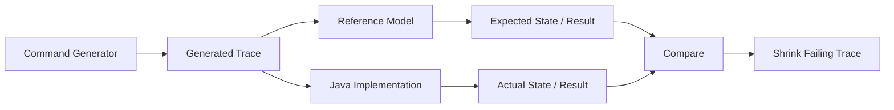

# Part 024 — Model-Based Testing from Formal Specs

> Tujuan bagian ini: mengubah model, invariant, dan counterexample dari formal methods menjadi test executable di Java. Bukan sekadar “punya model”, tetapi memakai model sebagai oracle untuk implementation.

Formal spec tanpa koneksi ke implementation mudah menjadi artefak indah yang mati.
Test tanpa model mudah menjadi kumpulan contoh yang tidak tahu ruang perilaku.

Model-based testing menyambungkan keduanya.

```text
Formal model says: these states and transitions are allowed.
Implementation says: this code handles commands.
Model-based test asks: for generated command traces, do both behave the same?
```

Ini sangat kuat untuk:

```text
state machine
workflow lifecycle
idempotency
retry behavior
cache consistency
order/payment lifecycle
case management
approval process
quota/counter
reservation system
saga/compensation
```

Unit test biasa bagus untuk contoh.
Model-based testing bagus untuk **ruang perilaku**.

---

## 1. Core Mental Model

Ada tiga hal:

```text
Model            -> representasi sederhana dari expected behavior
System Under Test -> implementasi Java nyata
Trace            -> urutan command/event yang dijalankan ke keduanya
```

Diagram:



Jika gagal, property-based engine mencoba mengecilkan trace:

```text
100 commands -> 12 commands -> 4 commands -> minimal reproduction
```

Inilah nilai besar dibanding test manual.

---

## 2. Model Bukan Implementasi Kedua yang Sama Rumit

Kesalahan umum: model-based testing berubah menjadi implementasi ulang sistem.
Itu buruk.

Model harus:

```text
lebih kecil
lebih abstrak
lebih deterministic
lebih lambat tidak masalah
lebih jelas daripada production code
```

Production implementation:

```text
repository
locking
transaction
outbox
event publishing
DTO mapping
validation layer
audit
metrics
framework annotations
```

Model:

```text
Map<Id, State>
Set<ProcessedCommand>
List<Event>
small enum state
pure transition function
```

Jika model sama kompleks dengan implementation, kamu membuat dua sistem yang sama-sama bisa salah.

---

## 3. Kapan Model-Based Testing Layak?

Gunakan jika domain punya:

```text
banyak state
banyak command
urutan command penting
edge case muncul dari kombinasi
manual examples cepat meledak
bug sering berupa illegal transition
idempotency/retry penting
concurrency/eventual consistency penting
formal model sudah ada
```

Tidak perlu untuk:

```text
mapper trivial
simple CRUD tanpa lifecycle
pure one-shot calculation yang cukup property test biasa
controller glue
formatting sederhana
```

Rule:

```text
Jika correctness bergantung pada urutan kejadian, pertimbangkan model-based testing.
```

---

## 4. Bentuk Minimal Model-Based Test

Contoh domain: case lifecycle.

Allowed states:

```text
DRAFT -> SUBMITTED -> UNDER_REVIEW -> APPROVED -> CLOSED
DRAFT -> CANCELLED
SUBMITTED -> REJECTED
UNDER_REVIEW -> REJECTED
```

Model:

```java
record CaseModel(CaseStatus status, long version) {
    CaseModel submit() {
        if (status != CaseStatus.DRAFT) return this;
        return new CaseModel(CaseStatus.SUBMITTED, version + 1);
    }

    CaseModel startReview() {
        if (status != CaseStatus.SUBMITTED) return this;
        return new CaseModel(CaseStatus.UNDER_REVIEW, version + 1);
    }

    CaseModel approve() {
        if (status != CaseStatus.UNDER_REVIEW) return this;
        return new CaseModel(CaseStatus.APPROVED, version + 1);
    }
}
```

SUT:

```java
CaseRecord sut = CaseRecord.draft();
```

Command abstraction:

```java
sealed interface CaseCommand permits Submit, StartReview, Approve {
    CaseModel applyToModel(CaseModel model);
    void applyToSut(CaseRecord sut);
}

record Submit() implements CaseCommand {
    public CaseModel applyToModel(CaseModel model) { return model.submit(); }
    public void applyToSut(CaseRecord sut) { sut.submit(); }
}
```

Property:

```java
@Property
void implementationFollowsModel(@ForAll("caseTraces") List<CaseCommand> commands) {
    CaseModel model = new CaseModel(CaseStatus.DRAFT, 0);
    CaseRecord sut = CaseRecord.draft();

    for (CaseCommand command : commands) {
        model = command.applyToModel(model);
        command.applyToSut(sut);

        assertThat(sut.status()).isEqualTo(model.status());
        assertThat(sut.version()).isEqualTo(model.version());
    }
}
```

Ini skeleton.
Production version harus menangani invalid command behavior secara jelas.

---

## 5. Handling Invalid Commands

Ada dua design.

### Design A — Invalid command is no-op in model

```java
CaseModel approve() {
    if (status != UNDER_REVIEW) return this;
    return new CaseModel(APPROVED, version + 1);
}
```

SUT harus juga no-op atau return rejection.

### Design B — Invalid command returns expected failure

Lebih baik untuk domain enterprise.

```java
record TransitionOutcome(CaseModel model, ExpectedResult result) {}

record CaseModel(CaseStatus status, long version) {
    TransitionOutcome approve() {
        if (status != CaseStatus.UNDER_REVIEW) {
            return new TransitionOutcome(this, ExpectedResult.rejected("invalid state"));
        }
        return new TransitionOutcome(
            new CaseModel(CaseStatus.APPROVED, version + 1),
            ExpectedResult.accepted()
        );
    }
}
```

Command:

```java
ExpectedResult actual = sut.approve(actor, now);
assertThat(actual.kind()).isEqualTo(expected.result().kind());
```

Rule:

```text
Model harus mencakup success dan rejection, bukan hanya happy path.
```

---

## 6. Command Trace Generator

Generator yang buruk hanya random list command.

```java
Arbitraries.of(new Submit(), new Approve(), new Close()).list()
```

Ini bisa menghasilkan terlalu banyak invalid noise.

Generator yang baik punya beberapa mode:

```text
mostly valid traces
invalid transition traces
duplicate command traces
retry traces
boundary traces
long random traces
known counterexample traces
```

Contoh konseptual jqwik:

```java
@Provide
Arbitrary<List<CaseCommand>> caseTraces() {
    Arbitrary<CaseCommand> command = Arbitraries.oneOf(
        Arbitraries.just(new Submit()),
        Arbitraries.just(new StartReview()),
        Arbitraries.just(new Approve()),
        Arbitraries.just(new Reject()),
        Arbitraries.just(new Close()),
        Arbitraries.just(new Cancel())
    );

    return command.list().ofMinSize(0).ofMaxSize(50);
}
```

Lalu tambah generator targeted:

```java
@Provide
Arbitrary<List<CaseCommand>> duplicateSensitiveTraces() {
    return Arbitraries.of(
        List.of(new Submit(), new Submit()),
        List.of(new Submit(), new StartReview(), new StartReview()),
        List.of(new Submit(), new StartReview(), new Approve(), new Approve())
    );
}
```

Jangan hanya random.
Gunakan **risk-shaped generation**.

---

## 7. Oracle: Apa yang Dibandingkan?

Jangan membandingkan semua field.
Bandingkan observable contract.

| Domain | Observable yang relevan |
|---|---|
| Case lifecycle | status, version, terminal flag, audit event kind |
| Payment | authorization status, captured amount, ledger entries |
| Idempotency | result replayed, command hash consistency, no duplicate side effect |
| Cache | visible value, staleness bound, invalidation event |
| Quota | remaining quota, rejected/accepted decision |
| Workflow | active tasks, terminal state, escalation status |

Hindari oracle yang terlalu implementation-specific:

```text
internal list order jika domain tidak peduli order
private cache size jika tidak observable
repository call count jika bukan contract
exact exception class jika boundary contract memakai domain result
```

Oracle bagus menanyakan:

```text
Apa yang user/system lain boleh andalkan?
```

---

## 8. Turning TLA+ Counterexample into Java Test

Misal TLC menghasilkan trace:

```text
1. WorkerA reads command C as NEW
2. WorkerB reads command C as NEW
3. WorkerA writes APPROVED
4. WorkerB writes APPROVED again
5. Two outbox events exist
```

Trace ini harus menjadi regression test.

```java
@Test
void duplicateWorkersMustNotPublishTwoApprovedEvents() throws Exception {
    CommandId commandId = CommandId.random();
    CaseId caseId = createSubmittedCase();

    CountDownLatch bothRead = new CountDownLatch(2);
    CountDownLatch allowWrite = new CountDownLatch(1);

    processor.installHook(new ProcessorHook() {
        @Override
        public void afterRead(Command command) {
            if (command.id().equals(commandId)) {
                bothRead.countDown();
                await(allowWrite);
            }
        }
    });

    Future<?> a = executor.submit(() -> processor.process(commandId));
    Future<?> b = executor.submit(() -> processor.process(commandId));

    assertThat(bothRead.await(5, TimeUnit.SECONDS)).isTrue();
    allowWrite.countDown();

    a.get();
    b.get();

    assertThat(outbox.findByCaseId(caseId, EventType.CASE_APPROVED)).hasSize(1);
}
```

Ini bukan full model-based property.
Ini counterexample-to-test.
Keduanya valid.

Rule:

```text
Every formal counterexample that represents a real bug should become an executable regression test.
```

---

## 9. Turning Alloy Counterexample into Java Test

Alloy counterexample:

```text
Case C is CLOSED
Task T belongs to C
Task T is OPEN
```

Java regression:

```java
@Test
void closedCaseCannotHaveOpenTasks() {
    CaseRecord c = CaseRecord.closed();
    Task t = Task.openFor(c.id());

    assertThatThrownBy(() -> invariantChecker.validate(c, List.of(t)))
        .isInstanceOf(InvariantViolation.class)
        .hasMessageContaining("closed case cannot have open task");
}
```

Better: property generator.

```java
@Property
void closedCasesRejectOpenTasks(@ForAll CaseId caseId,
                                @ForAll("openTasks") List<Task> tasks) {
    CaseRecord c = CaseRecord.closed(caseId);

    assertThat(invariantChecker.validate(c, tasks))
        .isEqualTo(ValidationResult.invalid("closed case cannot have open task"));
}
```

Alloy gives structure.
Java test makes it executable against production rule implementation.

---

## 10. Turning JML Contract into Property Test

JML:

```java
//@ requires amount >= 0;
//@ requires basisPoints >= 0 && basisPoints <= 10000;
//@ ensures 0 <= 
esult && 
esult <= amount;
```

Property:

```java
@Property
void percentageResultIsWithinInput(@ForAll @LongRange(min = 0, max = 1_000_000_000L) long amount,
                                   @ForAll @IntRange(min = 0, max = 10_000) int basisPoints) {
    Percentage p = new Percentage(basisPoints);

    long result = p.applyTo(amount);

    assertThat(result).isBetween(0L, amount);
}
```

JML gives specification.
Property test gives executable randomized evidence.

Do this systematically:

| JML clause | Property test translation |
|---|---|
| `requires` | generator constraint / assumption |
| `ensures` | assertion after call |
| `invariant` | assertion before and after each command |
| `assignable` | snapshot unchanged fields |
| `signals` | invalid-input property |

Frame condition property:

```java
@Property
void approveDoesNotChangeOwner(@ForAll("underReviewCases") CaseRecord c,
                               @ForAll("reviewers") UserId reviewer) {
    UserId ownerBefore = c.owner();

    c.approve(reviewer, fixedNow);

    assertThat(c.owner()).isEqualTo(ownerBefore);
}
```

---

## 11. Stateful Model with Snapshot Comparison

For mutable aggregates, assert invariant after each command.

```java
@Property
void caseAggregateMaintainsInvariants(@ForAll("caseCommandTraces") List<CaseCommand> commands) {
    CaseRecord sut = CaseRecord.draft();
    CaseModel model = CaseModel.draft();

    for (CaseCommand command : commands) {
        ExpectedStep expected = model.step(command);
        ActualStep actual = command.applyTo(sut);

        assertStep(expected, actual);
        assertInvariants(sut);

        model = expected.nextModel();
    }
}
```

Invariant assertion:

```java
private void assertInvariants(CaseRecord c) {
    assertThat(c.status()).isNotNull();
    assertThat(c.version()).isGreaterThanOrEqualTo(0);

    if (c.status() == CaseStatus.APPROVED) {
        assertThat(c.approvedBy()).isPresent();
        assertThat(c.approvedAt()).isPresent();
    }

    if (c.status().isTerminal()) {
        assertThat(c.hasOpenInternalTransition()).isFalse();
    }
}
```

Model-based testing tidak harus menunggu tool formal.
Kamu bisa mulai dari domain model manual.

---

## 12. Modeling Idempotency

Idempotency adalah target ideal karena bug muncul dari urutan.

Rules:

```text
same key + same command hash after success returns same result
same key + different command hash is conflict
failed validation does not complete key
technical failure may leave key pending
completed key cannot be overwritten
side effect occurs at most once
```

Model:

```java
record IdempotencyModel(Map<Key, RecordState> records,
                        int sideEffectCount) {

    StepResult handle(Key key, CommandHash hash, CommandValidity validity) {
        RecordState existing = records.get(key);

        if (existing instanceof Completed c) {
            if (!c.commandHash().equals(hash)) {
                return StepResult.conflict(this);
            }
            return StepResult.replayed(this, c.result());
        }

        if (!validity.valid()) {
            return StepResult.rejected(this);
        }

        ResultHash result = ResultHash.of(key, hash);
        Map<Key, RecordState> next = new HashMap<>(records);
        next.put(key, new Completed(hash, result));

        return StepResult.accepted(new IdempotencyModel(next, sideEffectCount + 1), result);
    }
}
```

Property:

```java
@Property
void idempotencyImplementationFollowsModel(@ForAll("idempotencyCommands") List<IdempotencyCommand> commands) {
    IdempotencyModel model = IdempotencyModel.empty();
    IdempotencyService sut = newInMemoryService();

    for (IdempotencyCommand command : commands) {
        StepResult expected = model.handle(command.key(), command.hash(), command.validity());
        ActualResult actual = sut.handle(command.toRequest());

        assertEquivalent(expected, actual);
        assertThat(sut.sideEffectCount()).isEqualTo(expected.nextModel().sideEffectCount());

        model = expected.nextModel();
    }
}
```

This catches bugs like:

```text
invalid command stores completed key
conflict overwrites old result
retry executes side effect again
same key with different payload returns stale success
```

---

## 13. Modeling Workflow Tasks

Workflow domain often has cross-entity state.

Model:

```java
record WorkflowModel(CaseStatus caseStatus,
                     Set<Task> openTasks,
                     Set<EventType> emittedEvents) {

    WorkflowModel submit() {
        if (caseStatus != DRAFT) return this;
        return new WorkflowModel(
            SUBMITTED,
            Set.of(Task.review()),
            plus(emittedEvents, CASE_SUBMITTED)
        );
    }

    WorkflowModel approve() {
        if (caseStatus != UNDER_REVIEW) return this;
        return new WorkflowModel(
            APPROVED,
            closeReviewTasks(openTasks),
            plus(emittedEvents, CASE_APPROVED)
        );
    }

    boolean invariantHolds() {
        return !(caseStatus.isTerminal() && hasOpenBlockingTask());
    }
}
```

SUT might involve:

```text
case table
task table
outbox table
audit table
workflow engine API
```

Model-based integration test can still compare observable projection:

```java
WorkflowProjection actual = projectionReader.read(caseId);
assertThat(actual.caseStatus()).isEqualTo(model.caseStatus());
assertThat(actual.openTaskTypes()).isEqualTo(model.openTaskTypes());
assertThat(actual.emittedEventTypes()).containsAll(model.emittedEvents());
```

Model tidak perlu mengetahui persistence detail.

---

## 14. Model-Based Testing with Real Infrastructure

Ada dua level.

### Level 1 — In-memory SUT

```text
fast
pure JVM
good for aggregate/domain service
runs often
```

### Level 2 — Real infrastructure SUT

```text
Postgres/Testcontainers
Kafka/Testcontainers
real transaction/repository
slower
catches mapping/locking/serialization bug
```

Strategy:

```text
Run model-based unit properties on every PR.
Run smaller model-based integration traces on CI verify/nightly.
Run known counterexample traces always.
```

Example split:

```text
case lifecycle model, max trace 50, in-memory -> PR
case lifecycle model, max trace 15, Postgres -> PR verify
case lifecycle model, max trace 100, Postgres+Kafka -> nightly
```

---

## 15. Shrinking and Reproducibility

The value of model-based testing depends on reproduction.

Always capture:

```text
random seed
shrunk command trace
initial state
clock instants
generated IDs
thread schedule hints if any
SUT version/build hash
```

Format failing trace as artifact:

```json
{
  "seed": "774219331",
  "initial": { "status": "DRAFT", "version": 0 },
  "commands": [
    { "type": "SUBMIT" },
    { "type": "START_REVIEW" },
    { "type": "APPROVE", "actor": "assignee" }
  ],
  "expected": { "result": "REJECTED", "status": "UNDER_REVIEW" },
  "actual": { "result": "ACCEPTED", "status": "APPROVED" }
}
```

Then add deterministic regression:

```java
@Test
void assigneeCannotApproveOwnCase_counterexample774219331() {
    replay(List.of(
        new Submit(),
        new StartReview(),
        new Approve(ASSIGNEE)
    ));
}
```

Generated failure should become permanent knowledge.

---

## 16. Avoiding False Confidence

Model-based testing can lie if the model is wrong.

Mitigations:

```text
review model like production code
trace model rules back to requirements/spec
compare with TLA+/Alloy/JML where available
seed model with known historical bugs
write example tests for model itself
keep model small enough to inspect
```

Model test should not be mystical.
It should read like executable requirements.

---

## 17. Model Coverage

Coverage here is not line coverage.
Important coverage dimensions:

```text
state coverage
transition coverage
invalid transition coverage
pairwise transition coverage
terminal state coverage
retry/duplicate coverage
boundary value coverage
exception path coverage
cross-entity invariant coverage
```

Add classification:

```java
Statistics.label("final-state")
    .collect(model.status().name());

Statistics.label("trace-length")
    .collect(bucket(commands.size()));

Statistics.label("contains-duplicate")
    .collect(hasDuplicate(commands));
```

Use statistics to detect generator blind spots.

If 95% traces never reach terminal state, your generator is poor.

---

## 18. Risk-Shaped Trace Generation

Instead of pure random generation, define command distributions.

```text
Normal journey: submit -> review -> approve -> close
Invalid early command: approve before review
Duplicate command: submit twice, approve twice
Conflict: assignee approves own case
Retry: same command ID repeated
Compensation: approve then rollback/void if allowed
Timeout: deadline expires before action
```

Generator families:

```java
@Provide
Arbitrary<List<CaseCommand>> caseCommandTraces() {
    return Arbitraries.oneOf(
        validJourneys(),
        invalidTransitionJourneys(),
        duplicateJourneys(),
        conflictOfInterestJourneys(),
        timeoutJourneys(),
        randomLongJourneys()
    );
}
```

This mirrors production risk better than uniform randomness.

---

## 19. Stateful Property Anatomy

A good stateful property has this shape:

```java
@Property(tries = 1_000)
void propertyName(@ForAll("traces") List<Command> trace) {
    Model model = Model.initial();
    Sut sut = newSut();

    for (Command command : trace) {
        Expected expected = model.next(command);
        Actual actual = sut.execute(command);

        assertEquivalent(expected, actual);
        assertGlobalInvariants(sut);

        model = expected.model();
    }
}
```

Key details:

```text
model update must be explicit
assert after every step, not only at end
global invariants checked repeatedly
command result compared, not only final state
trace reproducible
```

---

## 20. Side Effects and Event Assertions

Many domain bugs are side-effect bugs.

Model should track side effect abstraction:

```java
record Model(State state, List<EventType> events) {}
```

SUT assertion:

```java
List<EventType> actualEvents = outbox.findTypesByAggregateId(caseId);
assertThat(actualEvents).containsExactlyElementsOf(model.events());
```

But be careful with ordering.

If ordering is part of contract:

```java
containsExactlyElementsOf
```

If ordering is not part of contract:

```java
containsExactlyInAnyOrderElementsOf
```

Never accidentally make ordering contractual.

---

## 21. Testing Version and Optimistic Locking

Model:

```text
successful mutation increments version
rejected business command does not increment version
technical failure does not commit version
stale write is rejected
```

Property step:

```java
long versionBefore = sut.version();
ActualResult actual = sut.execute(command);

if (actual.accepted()) {
    assertThat(sut.version()).isEqualTo(versionBefore + 1);
} else {
    assertThat(sut.version()).isEqualTo(versionBefore);
}
```

For stale writes:

```java
@Test
void staleVersionCannotOverwriteNewerState() {
    CaseRecord a = repository.get(id);
    CaseRecord b = repository.get(id);

    a.submit();
    repository.save(a);

    b.cancel();

    assertThatThrownBy(() -> repository.save(b))
        .isInstanceOf(OptimisticLockingFailure.class);
}
```

Formal model can generate stale interleavings.
Integration test confirms storage layer enforces it.

---

## 22. Model-Based Testing for Eventual Consistency

For async systems, exact immediate state may be wrong oracle.
Use bounded eventual assertion.

Model says:

```text
After command accepted, projection eventually reflects event.
```

Test:

```java
ActualResult result = api.submitCase(request);
assertThat(result.accepted()).isTrue();

await().atMost(Duration.ofSeconds(5)).untilAsserted(() -> {
    CaseProjection p = projectionApi.get(result.caseId());
    assertThat(p.status()).isEqualTo(CaseStatus.SUBMITTED);
});
```

Model should distinguish:

```text
strongly consistent state
asynchronously derived projection
event log
external notification
```

Do not assert immediate projection consistency unless architecture promises it.

---

## 23. Concurrency: Where Model-Based Testing Ends

Sequential model-based testing does not prove all concurrent interleavings.

For concurrency, combine:

```text
TLA+/PlusCal for interleaving model
jcstress for low-level concurrency primitives
controlled integration tests for known races
model-based sequential tests for lifecycle behavior
production telemetry for duplicate/violation detection
```

Do not pretend random parallel tests prove concurrency correctness.
They can find bugs, but they are weak proof.

---

## 24. Model-Based Test Suite Governance

Model-based tests can become slow.
Govern them intentionally.

Suggested layers:

| Suite | Trace count | Infra | Frequency |
|---|---:|---|---|
| Smoke model examples | 5-20 fixed traces | in-memory | every commit |
| Property model unit | 500-2000 traces | in-memory | every PR |
| Model integration | 50-200 traces | DB/Testcontainers | PR verify/nightly |
| Counterexample regression | fixed traces | real relevant infra | every PR |
| Stress/long model | 10k+ traces | selected infra | nightly/weekly |

Always separate:

```text
fast evidence
expensive evidence
historical bug regression
exploratory generation
```

---

## 25. Case Study: Enforcement Lifecycle

Domain:

```text
case starts DRAFT
submit creates review task
reviewer can request information
request information pauses SLA
response resumes SLA
approval closes review task
closed case cannot have open blocking tasks
appeal can be opened only after closed with appealable decision
```

Model state:

```java
record EnforcementModel(
    CaseStatus status,
    boolean reviewTaskOpen,
    boolean infoRequested,
    boolean slaPaused,
    boolean appealOpen,
    long version
) {
    EnforcementModel submit() { ... }
    EnforcementModel requestInfo() { ... }
    EnforcementModel receiveInfo() { ... }
    EnforcementModel approve() { ... }
    EnforcementModel close() { ... }
    EnforcementModel appeal() { ... }
}
```

Invariant:

```java
boolean invariantHolds() {
    if (status == CLOSED && reviewTaskOpen) return false;
    if (infoRequested != slaPaused) return false;
    if (appealOpen && status != CLOSED) return false;
    return version >= 0;
}
```

Property:

```java
@Property
void enforcementLifecycleFollowsModel(@ForAll("enforcementTraces") List<EnforcementCommand> trace) {
    EnforcementModel model = EnforcementModel.initial();
    EnforcementCase sut = fixture.newDraftCase();

    for (EnforcementCommand command : trace) {
        Step expected = model.step(command);
        Step actual = command.execute(sut);

        assertEquivalent(expected, actual);
        assertProductionInvariants(sut);

        model = expected.model();
    }
}
```

This is the pattern regulatory systems need:

```text
lifecycle rule -> model transition
legal/business invariant -> invariant assertion
historical defect -> fixed trace
unexpected generated failure -> regression test
```

---

## 26. Model as Living Documentation

Model-based tests become valuable documentation if written clearly.

Bad command names:

```text
Cmd1
Cmd2
DoThing
ChangeState
```

Good command names:

```text
SubmitCase
AssignReviewer
RequestInformation
ReceiveInformation
ApproveCase
CloseCase
OpenAppeal
```

Bad expected result:

```java
assertThat(x).isEqualTo(y);
```

Better:

```java
assertThat(actual.status())
    .as("case status after %s", command)
    .isEqualTo(expected.status());
```

When a generated test fails, the report should read like a story.

---

## 27. Common Failure Patterns Found by Model-Based Testing

Model-based tests often find:

```text
invalid transition accidentally accepted
rejected command increments version
duplicate command emits duplicate event
terminal state still allows mutation
side effect occurs before validation
retry changes result
case closed with open task
appeal allowed before final decision
stale update overwrites newer state
projection assumes event ordering that broker does not guarantee
```

These are exactly the bugs example tests miss because each step looks plausible in isolation.

---

## 28. Integration with CI

CI output should include:

```text
seed
shrunk trace
command list
expected vs actual state
last successful step
SUT logs by correlation ID
outbox events
DB rows snapshot if relevant
```

Store failing trace as artifact.
Make replay easy:

```bash
./mvnw -Dtest=EnforcementModelPropertyTest   -Djqwik.seed=774219331   -Dtrace.file=target/failing-traces/774219331.json test
```

Do not let generated failures become “cannot reproduce”.

---

## 29. Checklist

Before adding model-based testing, verify:

```text
[ ] Domain has stateful behavior worth modeling.
[ ] Model is smaller than implementation.
[ ] Commands are named in business language.
[ ] Generator covers valid and invalid traces.
[ ] Oracle checks result and state.
[ ] Invariants are asserted after every step.
[ ] Side effects are modeled at semantic level.
[ ] Failing trace is reproducible.
[ ] Counterexamples become fixed regression tests.
[ ] Slow model tests are separated from fast PR suite.
```

---

## 30. Practice Drill

Pick one lifecycle from your system.

Build:

1. Enum state model.
2. Command sealed interface.
3. Pure model transition function.
4. SUT adapter for aggregate/service.
5. jqwik generator for traces.
6. Assertion comparing model and SUT.
7. Invariant assertion after each command.
8. Three fixed traces from historical/imagined bugs.
9. One trace derived from TLA+/Alloy/JML finding.
10. CI profile split: fast property vs slower integration.

Do not model everything.
Model the behavior where ordering creates risk.

---

## 31. Summary

Model-based testing is the practical bridge between formal thinking and Java implementation.

It turns:

```text
state machine diagram
TLA+ counterexample
Alloy invalid structure
JML contract
business lifecycle rule
```

into:

```text
executable generated tests
shrunk failing traces
regression artifacts
CI evidence
living documentation
```

The essence:

```text
A model defines the expected world.
A trace explores behavior.
The SUT must follow the model.
Every counterexample becomes a test.
```

This completes the formal-spec-to-test bridge.
Next, the series moves into benchmarking and performance measurement theory.
