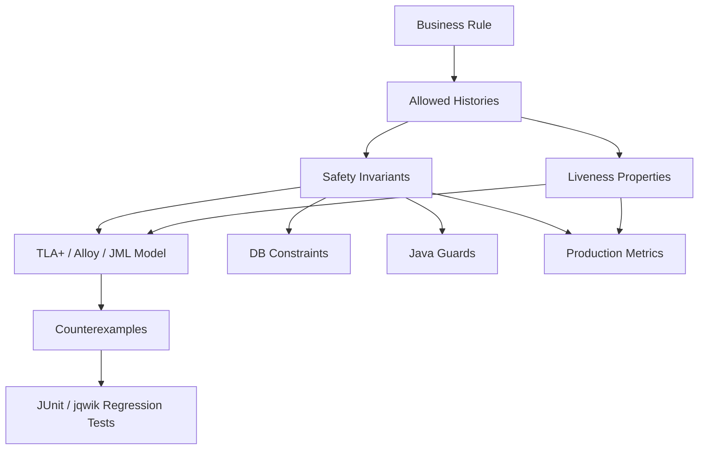
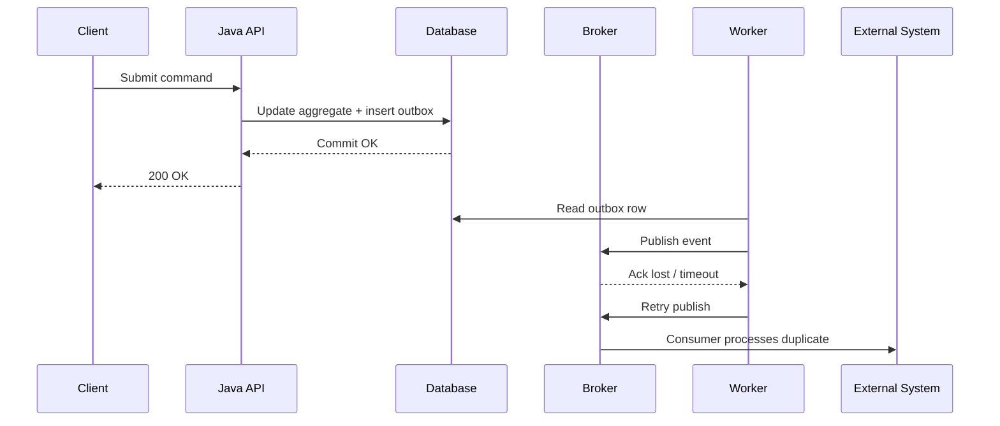
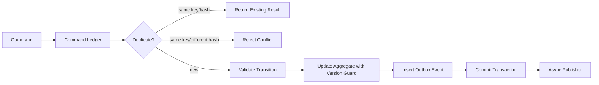
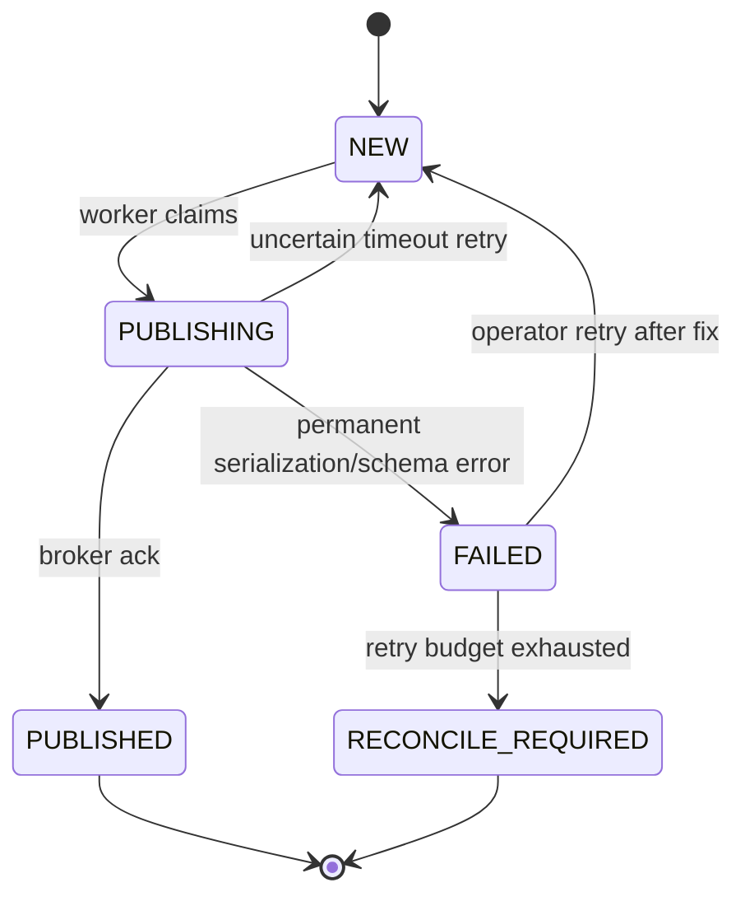
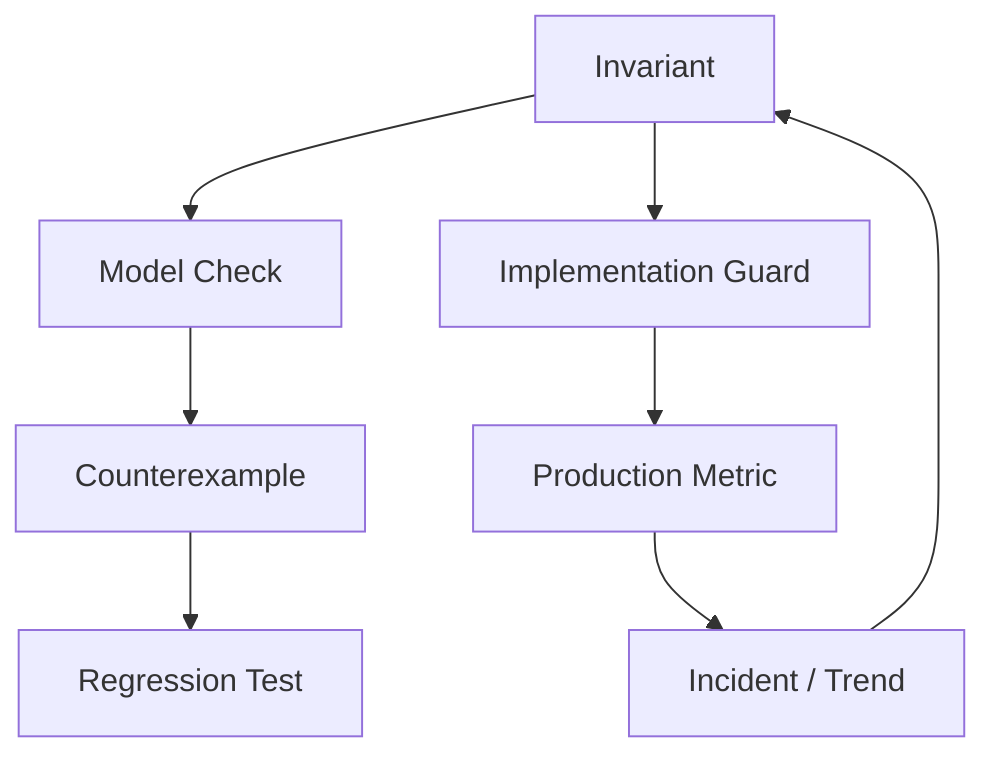

# Part 025 — Formalizing Concurrency, Idempotency, and Distributed Behavior

Most severe production bugs in enterprise Java systems are not caused by a missing `if` statement. They are caused by an implicit model that was never written down.

A payment is captured twice.  
A case is escalated after it was already closed.  
An order is shipped after cancellation.  
A retry worker republishes an old event.  
A scheduled job processes the same record concurrently on two nodes.  
A consumer handles events out of order and overwrites a newer state with an older one.  
A lock expires while the owner is still running, and a second owner starts doing the same work.

The implementation might be full of unit tests. The code might be clean. The database might have indexes. The message broker might be healthy. The problem is deeper: the system's **allowed histories** were never specified.

This part is about turning concurrency and distributed behavior into explicit properties.

Not just:

> “Use optimistic locking.”

But:

> “For every business key, no two successful command executions may produce two externally visible irreversible effects for the same logical intent, regardless of retry, duplicate delivery, worker crash, stale reads, delayed messages, or interleaving between command handlers.”

That sentence is an engineering asset. It can become a TLA+ invariant, a database constraint, a Java test oracle, a property-based generator, a production metric, and a post-incident review checklist.

---

## 1. The real unit of reasoning is the history, not the method

A normal unit test usually checks one call:

```java
var result = service.approve(caseId, reviewerId);
assertThat(result.status()).isEqualTo(APPROVED);
```

A concurrency bug is rarely inside one call. It lives in the **history**:

```text
T1 reads case status = SUBMITTED
T2 reads case status = SUBMITTED
T1 approves and emits CaseApproved
T2 rejects and emits CaseRejected
```

The question is not “does `approve()` work?”

The question is:

> Across all possible interleavings, duplicate messages, retries, stale reads, crashes, and delayed effects, are the histories allowed by the implementation a subset of the histories allowed by the business model?

That is the bridge between formal methods and production Java.



The model does not replace tests. It tells tests what truth looks like.

---

## 2. Safety and liveness for Java engineers

Formal methods often sound abstract because they use vocabulary like safety, liveness, fairness, state space, and temporal property. For working Java engineers, use this translation.

| Formal term | Practical meaning | Java example |
|---|---|---|
| State | The values that matter now | order status, version, outbox rows, lock owner, retry count |
| Action | One atomic transition in the model | accept command, commit transaction, publish event, consume message |
| Behavior / trace | A sequence of states/actions over time | command received → DB updated → crash → retry → event republished |
| Safety | Something bad never happens | no double capture, no illegal transition, no stale overwrite |
| Liveness | Something good eventually happens | queued outbox event is eventually published |
| Fairness | If an enabled action remains possible, it eventually gets a chance | retry worker eventually runs |
| Invariant | A safety property true in every reachable state | terminal case has exactly one terminal outcome |
| Counterexample | A concrete bad history | worker A and worker B both acquired expired lease |

The simplest mental model:

```text
Safety  = never wrong
Liveness = not stuck forever
```

Most business systems need both.

A system that never processes any command may satisfy many safety rules because it never does anything bad. It is still useless because it violates liveness.

A system that eventually processes everything but sometimes emits duplicate irreversible effects violates safety.

Top-tier engineering requires both:

```text
No illegal history.
No permanent stuck state.
```

---

## 3. Distributed behavior is not only “microservices”

You do not need Kubernetes, Kafka, and twenty services to have distributed behavior. A single Java application can have distributed behavior if it has:

- multiple threads,
- scheduled jobs,
- async callbacks,
- database transactions,
- external APIs,
- retries,
- caches,
- queues,
- lock timeouts,
- multiple JVM instances,
- browser/client retries,
- or delayed side effects.

The moment one operation is split across time or across resources, you have partial failure.



The local transaction succeeded. The publish acknowledgment was uncertain. The worker retried. The consumer saw a duplicate.

This is not an edge case. This is the normal shape of distributed systems.

---

## 4. The failure model must be explicit

A weak design says:

> “Kafka guarantees ordering.”  
> “The database transaction protects us.”  
> “The API is idempotent.”  
> “Retries should fix it.”

A strong design says:

> “We tolerate duplicate command delivery, duplicate event delivery, lost response, worker crash before/after commit, stale read, retry after timeout, event reordering across aggregate keys, and consumer restart. We do not tolerate Byzantine corruption, malicious DB writes, or permanent broker data loss.”

A failure model is the boundary of what the design claims to handle.

## 4.1 Common failure modes to model

| Failure mode | What can go wrong | Required property |
|---|---|---|
| Duplicate command | Client retries after timeout | same logical command must not create duplicate effect |
| Duplicate event | Broker redelivery or publisher retry | consumer must be idempotent |
| Lost response | Server committed but client timed out | retry must return same logical result |
| Crash before commit | No state persisted | retry may process normally |
| Crash after commit before response | State persisted, caller thinks failed | retry must discover prior result |
| Crash after DB update before event publish | State changed, event missing | outbox must eventually publish |
| Crash after event publish before marking sent | Event may publish again | consumer must tolerate duplicate |
| Stale read | Actor uses old version | stale update must fail or be ignored |
| Out-of-order event | Consumer receives version 5 then version 4 | version monotonicity must be preserved |
| Lock expiry | First worker still running after lease expiry | fencing token or conditional write required |
| Clock skew | Lease validity interpreted differently | avoid wall-clock-only correctness |
| Split ownership | Two nodes believe they own same work | effect must be guarded by token/version |
| Rebalance | Consumer partition moves during processing | commit strategy must avoid loss/duplication bugs |

Notice the pattern: almost every failure mode requires the same small family of design ideas:

- stable identity,
- versioning,
- conditional update,
- idempotency key,
- deduplication record,
- transactional boundary,
- outbox/inbox,
- monotonic transition,
- fencing token,
- reconciliation.

Formalization tells you where each idea is actually needed.

---

## 5. Idempotency: the most abused word in backend engineering

People often say “make it idempotent” when they mean different things.

| Kind | Meaning | Example |
|---|---|---|
| HTTP method idempotency | Same request has same intended effect | `PUT /resource/{id}` |
| Business idempotency | Same logical command processed once | same payment capture request ID |
| Consumer idempotency | Same event can be consumed repeatedly | same event ID ignored after first success |
| Effect idempotency | External side effect is naturally repeatable | setting a field to value X |
| Deduplication | Duplicate recognized and skipped | insert into processed_event(event_id) |
| Replay safety | Old event does not corrupt newer state | ignore version lower than current |

The dangerous version is this:

```java
if (repository.existsByIdempotencyKey(key)) {
    return repository.findResult(key);
}

externalPaymentGateway.capture(...);
repository.saveResult(key, success);
```

This is not safe if the JVM crashes after `capture()` and before `saveResult()`.

A better design asks:

```text
Where is the irreversible effect?
Can the effect itself accept an idempotency key?
Can we persist intent before effect?
Can we reconcile uncertain attempts?
Can retries observe prior outcome?
Can we prevent double effect even under concurrent execution?
```

## 5.1 Idempotency property

For a command identified by `(tenantId, commandKey)`, define:

```text
At most one successful logical result may be committed.
Every retry of the same command key must either:
  - return the same committed result,
  - observe the command still in progress,
  - or safely resume/reconcile the incomplete attempt.
```

This property is stronger than “check duplicate key”. It includes partial progress.

---

## 6. A production Java pattern: command ledger + aggregate version + outbox

For many enterprise services, a robust baseline looks like this:

```text
command_ledger
  tenant_id
  command_key
  command_type
  status: RECEIVED | PROCESSING | SUCCEEDED | FAILED | RECONCILE_REQUIRED
  request_hash
  result_payload
  aggregate_id
  created_at
  updated_at

business_aggregate
  id
  status
  version
  ...

outbox_event
  id
  aggregate_id
  aggregate_version
  event_type
  payload
  status: NEW | PUBLISHED | FAILED
  created_at
```

The important invariant is not the table structure. It is the relationship:

```text
If a command is SUCCEEDED and it produced an externally observable business state change,
then the aggregate version reflects that change and the corresponding outbox event exists.
```



## 6.1 Java sketch

```java
public final class CommandHandler {
    private final CommandLedger ledger;
    private final CaseRepository cases;
    private final OutboxRepository outbox;
    private final TransactionRunner tx;
    private final Clock clock;

    public CommandResult handle(ApproveCaseCommand command) {
        return tx.inTransaction(() -> {
            var existing = ledger.find(command.tenantId(), command.commandKey());

            if (existing.isPresent()) {
                return existing.get().replayOrReject(command.requestHash());
            }

            ledger.insertReceived(command.toLedgerRecord(clock.instant()));

            var current = cases.findForUpdate(command.caseId())
                .orElseThrow(() -> new CaseNotFound(command.caseId()));

            var next = current.approve(command.reviewerId(), clock.instant());

            cases.updateIfVersion(
                next,
                current.version()
            ).orElseThrow(() -> new ConcurrentModificationException("stale case version"));

            outbox.insert(OutboxEvent.caseApproved(
                next.id(),
                next.version(),
                command.commandKey()
            ));

            var result = CommandResult.succeeded(next.id(), next.version());
            ledger.markSucceeded(command.tenantId(), command.commandKey(), result);
            return result;
        });
    }
}
```

This code is not automatically correct. It is merely shaped so correctness has places to attach:

| Property | Implementation hook |
|---|---|
| command deduplication | unique `(tenant_id, command_key)` |
| request conflict detection | stored request hash |
| aggregate race prevention | version guard / row lock |
| event eventual publication | outbox row in same transaction |
| event idempotency | stable event ID / command key correlation |
| traceability | ledger result + outbox event correlation |

The design is good only if the database constraints and transaction semantics match the intended model.

---

## 7. Formal model: reduce the world until the bug is visible

A useful formal model is smaller than production.

Do not model:

- every Java class,
- every database column,
- every DTO field,
- every framework detail,
- every exception type,
- every thread pool.

Model only the state needed to prove or falsify the property.

For idempotent command handling, you may only need:

```text
Commands
Aggregates
Ledger status
Aggregate version
Outbox rows
Published events
Worker state
Failure points
```

## 7.1 TLA+-style state sketch

This is not a complete spec; it is the shape of the model.

```tla
VARIABLES
  aggStatus,
  aggVersion,
  ledger,
  outbox,
  published

Init ==
  /\ aggStatus = [a \in Aggregates |-> "SUBMITTED"]
  /\ aggVersion = [a \in Aggregates |-> 0]
  /\ ledger = [c \in Commands |-> "NONE"]
  /\ outbox = {}
  /\ published = <<>>

Approve(c) ==
  /\ ledger[c] = "NONE"
  /\ aggStatus[CaseOf[c]] = "SUBMITTED"
  /\ ledger' = [ledger EXCEPT ![c] = "SUCCEEDED"]
  /\ aggStatus' = [aggStatus EXCEPT ![CaseOf[c]] = "APPROVED"]
  /\ aggVersion' = [aggVersion EXCEPT ![CaseOf[c]] = @ + 1]
  /\ outbox' = outbox \cup { [cmd |-> c, version |-> aggVersion[CaseOf[c]] + 1] }
  /\ UNCHANGED published

Publish(e) ==
  /\ e \in outbox
  /\ published' = Append(published, e)
  /\ UNCHANGED <<aggStatus, aggVersion, ledger, outbox>>
```

The spec is intentionally small. It ignores JSON, REST, Spring, JPA, logging, and object mappers. Those are not the source of the invariant.

## 7.2 Safety invariant examples

```text
NoDoubleSuccess ==
  For every command key, there is at most one successful logical result.

NoConflictingTerminalState ==
  A case cannot be both APPROVED and REJECTED.

OutboxCompleteness ==
  If aggregate version advanced due to a command, an outbox event exists for that version.

PublishedVersionExists ==
  Every published event corresponds to a committed aggregate version.

MonotonicConsumerState ==
  A consumer never moves from version N to version M when M < N.
```

The invariant should be boring to read. If it sounds clever, it is probably too indirect.

---

## 8. Formalizing stale writes

A common production bug:

```java
var order = repository.find(orderId);
order.cancel();
repository.save(order);
```

If two actors update concurrently, the last writer may silently win.

The formal property:

```text
A write based on version v may only commit if the current aggregate version is still v.
```

Implementation:

```sql
update orders
set status = ?, version = version + 1
where id = ? and version = ?;
```

Java guard:

```java
int rows = jdbc.update(sql, nextStatus, orderId, expectedVersion);
if (rows != 1) {
    throw new StaleAggregateVersion(orderId, expectedVersion);
}
```

Test oracle:

```text
Given two commands derived from the same original version,
at most one may commit.
```

Property-based trace:

```text
read(v0) by actor A
read(v0) by actor B
commit(A, expected=v0) succeeds
commit(B, expected=v0) fails
```

Production metric:

```text
aggregate.stale_write.rejected.count
```

This is how a formal property becomes an operating mechanism.

---

## 9. Formalizing outbox correctness

The outbox pattern is often introduced as:

> “Write event to DB in same transaction, publish later.”

That is a good implementation pattern, but the correctness property is richer.

## 9.1 Safety properties

```text
No phantom event:
  No event is published for a state transition that never committed.

No missing committed event:
  Every committed state transition that requires publication has a corresponding outbox row.

Stable event identity:
  Retrying publication of the same outbox row does not create a different logical event.

Version alignment:
  Event aggregateVersion equals the committed aggregate version.
```

## 9.2 Liveness properties

```text
Eventual publication:
  Every NEW outbox event is eventually either PUBLISHED or marked RECONCILE_REQUIRED.

No permanent invisible transition:
  A business transition requiring downstream reaction cannot remain forever without either publication or operator-visible repair.
```

Notice the escape hatch: `RECONCILE_REQUIRED` may be a valid terminal state for automation. Liveness does not require magic. It requires the system not to silently stall.



## 9.3 Implementation checks

| Risk | Guard |
|---|---|
| duplicate worker claims | `select ... for update skip locked` or claim token |
| duplicate publication | stable event ID and idempotent consumer |
| missing event | insert outbox in same DB transaction as aggregate update |
| stale event | include aggregate version and monotonic consumer logic |
| silent stuck row | outbox age metric and alert |
| poison message loop | retry budget and dead-letter/reconcile state |

---

## 10. Formalizing consumer idempotency

A consumer should not say:

```java
public void on(Event event) {
    projection.apply(event);
}
```

Unless `apply` is safe under duplicates and reordering.

A stronger consumer has a version-aware contract:

```java
public void on(CaseApproved event) {
    tx.inTransaction(() -> {
        var current = projection.find(event.caseId());

        if (current.lastVersion() >= event.aggregateVersion()) {
            return; // duplicate or old event
        }

        if (current.lastVersion() + 1 != event.aggregateVersion()) {
            throw new GapDetected(event.caseId(), current.lastVersion(), event.aggregateVersion());
        }

        projection.apply(event);
        processedEvents.record(event.eventId());
    });
}
```

Formal consumer properties:

```text
Duplicate safety:
  Applying the same event twice leaves projection equal to applying it once.

Monotonic version:
  Projection version never decreases.

Gap detection:
  If event version skips expected version, consumer must not pretend it has a complete projection.

Causal consistency:
  A derived projection may only expose a state if all required prior events have been applied.
```

This is more than “idempotent consumer”. It is a clear behavioral contract.

---

## 11. Formalizing leases and locks

A distributed lock is not a correctness proof. A lock is a coordination hint unless every irreversible write is protected by a token or conditional guard.

Bug shape:

```text
Worker A acquires lease token 1 for job J.
A pauses for GC or network.
Lease expires.
Worker B acquires lease token 2 for job J.
B completes job.
A resumes and also writes result.
```

If the write only checks “I once had a lock”, it is unsafe.

A stronger property:

```text
Only the current fencing token owner may commit a protected effect.
A write with token t may commit only if t equals the latest token for the resource.
```

Implementation:

```sql
update jobs
set status = 'COMPLETED', result = ?, version = version + 1
where id = ?
  and lease_token = ?
  and status = 'PROCESSING';
```

Java guard:

```java
var updated = jobRepository.completeIfTokenMatches(jobId, token, result);
if (!updated) {
    throw new LostLease(jobId, token);
}
```

Safety property:

```text
NoLostLeaseWrite ==
  A worker that no longer owns the latest token cannot commit the protected effect.
```

Liveness property:

```text
If a job is claimable and workers continue running, the job eventually becomes COMPLETED or RECONCILE_REQUIRED.
```

Do not put correctness solely in the lock service. Put correctness at the write boundary.

---

## 12. Formalizing retry

Retry is a correctness risk disguised as resilience.

A retry can:

- duplicate a command,
- amplify load,
- reorder effects,
- hide partial failure,
- exhaust thread pools,
- violate timeout budgets,
- or turn a small outage into a retry storm.

A retry policy needs properties.

## 12.1 Retry safety

```text
Retrying an operation must not create more logical effects than executing it once.
```

This requires one of:

- the operation is naturally idempotent,
- the operation has an idempotency key,
- the operation is guarded by a unique constraint,
- the operation is a read-only query,
- the operation can be reconciled after uncertainty,
- or the operation is not retried automatically.

## 12.2 Retry liveness

```text
Transient failures should eventually make progress if the dependency recovers.
```

This requires:

- bounded retry with backoff,
- jitter,
- error classification,
- retry budget,
- dead-letter/reconcile path,
- and operator visibility.

## 12.3 Retry anti-pattern

```java
@Retryable(maxAttempts = 3)
public CaptureResult capturePayment(Payment payment) {
    return gateway.capture(payment.card(), payment.amount());
}
```

This is unsafe unless the gateway call is idempotent with a stable key or the system has reconciliation for uncertain outcomes.

Better shape:

```java
public CaptureResult capturePayment(Payment payment, CommandKey key) {
    var attempt = attempts.startOrResume(payment.id(), key);
    return gateway.capture(new CaptureRequest(
        payment.gatewayCustomerId(),
        payment.amount(),
        attempt.externalIdempotencyKey()
    ));
}
```

The retry policy is not the design. The idempotency semantics are the design.

---

## 13. Formalizing ordering

Ordering is usually local, not global.

Common wrong assumption:

> “Events are ordered because Kafka preserves order.”

Better statement:

> “For a given partition key, events are consumed in broker order by one consumer group, but retries, reprocessing, multiple topics, projection rebuilds, manual replay, and cross-service causality may still expose duplicates or stale events.”

Formal properties should say which order matters.

| Ordering type | Property |
|---|---|
| per-aggregate order | events for one aggregate apply by version |
| command order | command B may require command A committed first |
| causal order | dependent event cannot be applied before its cause |
| user-visible order | UI must not display impossible transition |
| ledger order | financial/accounting entries must preserve sequence |
| regulatory order | audit log must reconstruct legal chronology |

## 13.1 Version beats timestamp

Timestamps are useful for audit. They are weak for correctness.

Prefer:

```text
aggregateId + aggregateVersion
```

Over:

```text
updatedAt
```

A timestamp can be equal, skewed, delayed, or generated by a different clock. A version is a logical ordering mechanism inside the aggregate.

---

## 14. Turning counterexamples into tests

The purpose of a model checker is not to make the team admire a red trace. The purpose is to generate a regression asset.

TLA+ counterexample:

```text
1. Command C received
2. Handler writes aggregate version 1
3. Handler crashes before outbox insert
4. Retry sees command ledger SUCCEEDED
5. No outbox event exists
```

Java regression test:

```java
@Test
void committedBusinessTransitionMustHaveOutboxEventEvenIfHandlerCrashes() {
    var crash = crashPoint.afterAggregateUpdateBeforeOutboxInsert();

    assertThatThrownBy(() -> handler.handle(command, crash))
        .isInstanceOf(SimulatedCrash.class);

    handler.handle(command); // retry

    assertThat(cases.find(command.caseId()).status()).isEqualTo(APPROVED);
    assertThat(outbox.findByAggregate(command.caseId()))
        .singleElement()
        .extracting(OutboxEvent::aggregateVersion)
        .isEqualTo(1L);
}
```

If this test cannot be written, the implementation has no controllable failure seam. That is a design smell.

---

## 15. Property-based traces for distributed behavior

Example-based tests are good for known incidents. Property-based traces are better for families of failures.

A trace generator can create sequences like:

```text
submit(commandA)
duplicate(commandA)
readProjection(case1)
publish(outbox1)
crash(worker1)
publish(outbox1 again)
consume(event1)
consume(event1 again)
submit(conflictingCommandB)
```

Invariant after every step:

```text
projection version never decreases
aggregate has one terminal status
no command key has two different successful results
published event version corresponds to committed aggregate version
```

Pseudo-jqwik shape:

```java
@Property
void commandPipelinePreservesInvariants(@ForAll("traces") Trace trace) {
    var system = InMemorySystemModel.initial();

    for (var action : trace.actions()) {
        system = system.apply(action);
        assertThat(system).satisfies(Invariants::noDoubleSuccess);
        assertThat(system).satisfies(Invariants::noConflictingTerminalState);
        assertThat(system).satisfies(Invariants::publishedEventsComeFromCommittedVersions);
    }
}
```

The in-memory model is not a mock of the database. It is a reference model of allowed behavior.

---

## 16. Concurrency testing in Java: know the level

Not all concurrency tests test the same thing.

| Tool/style | Best for | Not enough for |
|---|---|---|
| latch/barrier tests | forcing a specific interleaving at service level | memory model subtleties |
| property trace tests | many logical histories | real JVM scheduling |
| Testcontainers integration | real DB/broker semantics | exhaustive interleavings |
| jcstress | Java Memory Model / low-level concurrency | business workflow logic |
| TLA+ | protocol/design state space | framework/config errors |
| production telemetry | real workload evidence | proving absence of bugs |

A serious system uses multiple layers, but each has a clear job.

## 16.1 Barrier test shape

```java
@Test
void twoConcurrentApprovalsCannotBothCommit() throws Exception {
    var ready = new CountDownLatch(2);
    var start = new CountDownLatch(1);
    var pool = Executors.newFixedThreadPool(2);

    Callable<Result> task = () -> {
        ready.countDown();
        start.await();
        return handler.approve(commandForSameCase());
    };

    var f1 = pool.submit(task);
    var f2 = pool.submit(task);

    ready.await();
    start.countDown();

    var results = List.of(resultOf(f1), resultOf(f2));

    assertThat(results.stream().filter(Result::succeeded)).hasSize(1);
    assertThat(cases.find(caseId).version()).isEqualTo(1L);
}
```

This test is useful, but it is not exhaustive. It checks one forced race. Formal modeling checks many interleavings over a reduced state space.

---

## 17. Production metrics derived from formal properties

A strong invariant should have an operational shadow.

| Formal property | Production signal |
|---|---|
| no duplicate successful command result | `command.duplicate_conflict.count` |
| no stale write commit | `aggregate.stale_write.rejected.count` |
| outbox eventually publishes | `outbox.oldest_new_age.seconds` |
| consumer version monotonic | `consumer.stale_event.ignored.count` |
| no event gap ignored | `consumer.version_gap.count` |
| retry does not storm | `retry.attempts`, `retry.budget_exhausted.count` |
| lease owner cannot commit after expiry | `lease.lost_before_commit.count` |
| reconciliation not silent | `reconcile_required.count` |

This is the feedback loop:



Formal methods are not only pre-production. They improve what you monitor in production.

---

## 18. Anti-patterns

## 18.1 “Exactly-once” as a magic phrase

Exactly-once semantics, where available, are scoped and conditional. Do not use the phrase as a substitute for idempotent business effects.

Ask:

```text
Exactly once at which boundary?
Broker append?
Consumer processing?
Database write?
External API effect?
User-visible business outcome?
```

If the answer is not the last one, your business invariant still needs protection.

## 18.2 Idempotency key without request hash

If the same idempotency key is reused for a different request body, returning the old result can be dangerous.

Guard:

```text
same key + same request hash = replay
same key + different request hash = conflict
```

## 18.3 Lock without fencing

A lock that expires can create split ownership. Use a fencing token or conditional write at the effect boundary.

## 18.4 Retrying non-idempotent effects

Never add automatic retry around an irreversible external effect unless the external system provides idempotency or you have a reconciliation protocol.

## 18.5 Testing only the happy interleaving

If your test always runs:

```text
commit → publish → consume
```

It does not test the real system. Real systems also run:

```text
commit → crash → retry → duplicate publish → duplicate consume
```

---

## 19. A compact design review checklist

Before approving a concurrent/distributed Java design, ask:

1. What are the business keys?
2. Which effects are irreversible?
3. Which operations can be retried by client/framework/broker/operator?
4. What is the idempotency key and where is it persisted?
5. What happens if the request body differs for the same key?
6. Which aggregate writes need version guards?
7. What happens if a worker crashes before commit?
8. What happens if a worker crashes after commit before response?
9. What happens if an event publishes twice?
10. What happens if an event arrives out of order?
11. What happens if an event is missing?
12. What happens if a lease expires while work is still running?
13. What state requires reconciliation instead of silent retry?
14. Which invariant is enforced by DB constraint?
15. Which invariant is enforced by Java guard?
16. Which invariant is enforced by consumer idempotency?
17. Which invariant is only monitored but not prevented?
18. Which failure mode is explicitly out of scope?
19. Which model counterexample has a regression test?
20. Which production metric proves the property is being stressed?

A team that can answer these questions is operating at a different level from a team that only says “we have integration tests”.

---

## 20. Practice: model a case escalation workflow

Use this mini-domain:

```text
Case status:
  OPEN -> UNDER_REVIEW -> ESCALATED -> RESOLVED -> CLOSED
  OPEN -> CLOSED
  UNDER_REVIEW -> CLOSED
  ESCALATED -> CLOSED

Rules:
  - A closed case cannot be escalated.
  - A case can have at most one active escalation.
  - Duplicate escalation commands must not create duplicate escalation records.
  - If escalation is committed, an audit event must eventually be published.
  - A stale reviewer cannot close over a newer escalation decision.
```

Model state:

```text
caseStatus
caseVersion
commandLedger
activeEscalation
outbox
publishedAuditEvents
```

Safety invariants:

```text
NoEscalationForClosedCase
AtMostOneActiveEscalation
NoDuplicateEscalationForCommand
PublishedAuditRequiresCommittedEscalation
NoStaleCloseAfterEscalation
```

Liveness properties:

```text
CommittedEscalationEventuallyAuditedOrReconciled
OpenEscalationEventuallyResolvedOrOperatorVisible
```

Implementation hooks:

```text
unique(case_id) where escalation_status = 'ACTIVE'
case version guard
command ledger unique key
outbox row in same transaction
consumer event ID dedupe
reconciliation dashboard for stuck outbox rows
```

This is the pattern you should repeat across payment, order, case, workflow, quote, entitlement, and compliance systems.

---

## 21. What to internalize

Formalizing distributed behavior is not about writing impressive specs. It is about refusing to let production correctness depend on accidental timing.

The key mental model:

```text
A Java service is correct only if every allowed interleaving and failure path preserves the business invariants or lands in an explicit repair state.
```

The strongest engineers do not merely ask:

> “Does the test pass?”

They ask:

> “What histories does this implementation permit, and are those histories allowed by the system's invariants?”

That question changes architecture.

---

## References

- Leslie Lamport, TLA+ home page: https://lamport.azurewebsites.net/tla/tla.html
- Leslie Lamport, TLA+ tools and TLC model checker: https://lamport.azurewebsites.net/tla/tools.html
- TLA+ Foundation / tlaplus resources: https://github.com/tlaplus
- OpenJDK jcstress: https://openjdk.org/projects/code-tools/jcstress/
- jqwik property-based testing: https://jqwik.net/
- Martin Kleppmann, Designing Data-Intensive Applications, for distributed-system failure and consistency reasoning.
