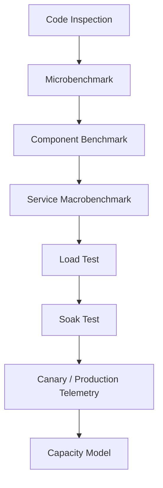
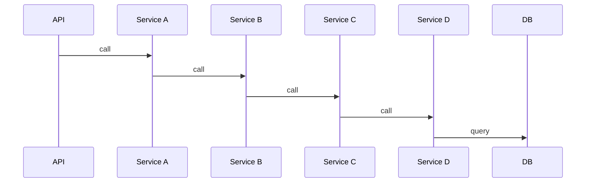
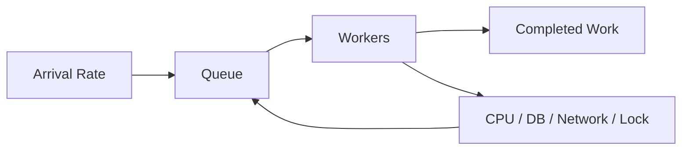
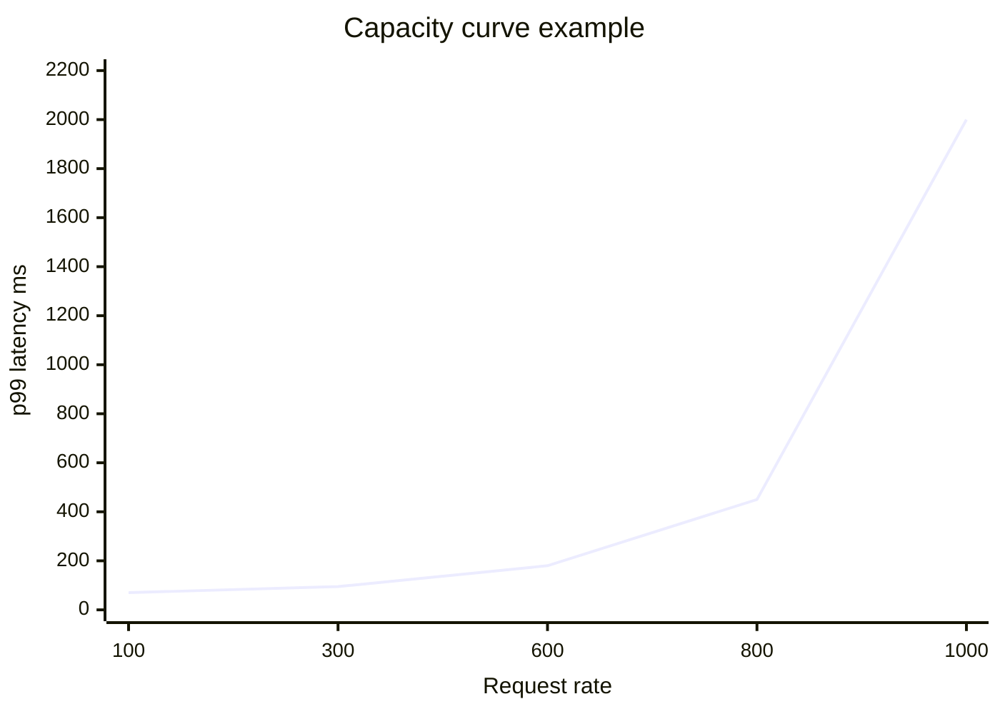
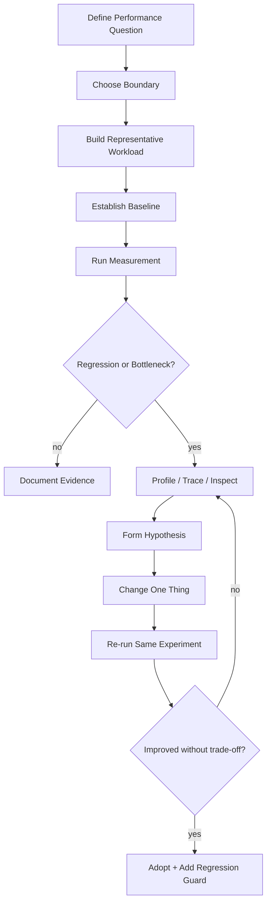

# Part 026 — Performance Measurement Theory for Java

Performance engineering starts with a harsh rule:

> If the measurement is invalid, the optimization is fiction.

Java makes this especially important because the JVM is dynamic. The code you write is not exactly the code that runs after warmup. The runtime profiles your program, compiles hot paths, inlines methods, removes allocations, deoptimizes assumptions, triggers garbage collection, reaches safepoints, interacts with the operating system scheduler, and competes with other processes for CPU caches and memory bandwidth.

So this part is not yet “how to write JMH benchmark code.” That comes next.

This part builds the measurement model. Without it, JMH annotations, profiler screenshots, and load-test dashboards become decoration.

The goal is to answer performance questions like a serious engineer:

```text
What exactly are we measuring?
Under which workload?
Against which baseline?
With which sources of noise?
Using which statistical interpretation?
At which system boundary?
For which user-visible or business outcome?
```

---

## 1. Performance is not one number

A weak performance claim says:

> “This is faster.”

A strong performance claim says:

> “For a representative 70/25/5 read/write/admin workload at 600 requests/second, p99 end-to-end latency decreased from 240 ms to 155 ms over ten 15-minute runs on the same instance class, with no increase in error rate, GC pause time, allocation rate, or database CPU.”

The difference is not verbosity. The difference is truth.

Performance has dimensions:

| Dimension | Question |
|---|---|
| Latency | How long does one operation take? |
| Throughput | How much work is completed per unit time? |
| Utilization | How busy is a resource? |
| Saturation | How much queued work exists because the resource cannot keep up? |
| Efficiency | How much work per CPU/memory/network/database unit? |
| Scalability | How does performance change as load/resources grow? |
| Stability | Does performance remain steady over time? |
| Tail behavior | What happens to the slowest requests? |
| Correctness under load | Does the system remain correct when stressed? |
| Cost | What infrastructure cost is required for the target SLO? |

A benchmark that only reports average latency is not an engineering result. It is a hint.

---

## 2. The performance evidence ladder

Performance evidence has levels, just like correctness evidence.



Each level answers a different question.

| Level | Good for | Dangerous if used to claim |
|---|---|---|
| Code inspection | spotting obvious allocation/IO/algorithm issues | actual runtime performance |
| Microbenchmark | isolated method/algorithm cost | end-to-end service latency |
| Component benchmark | serializer/cache/repository behavior | whole-system scalability |
| Service macrobenchmark | API behavior under controlled workload | production behavior under unknown traffic |
| Load test | saturation curve, capacity, bottleneck | exact production latency if workload differs |
| Soak test | leak, fragmentation, drift, GC stability | peak capacity |
| Canary | real production signal for small traffic | complete safety for all traffic |
| Production telemetry | reality | controlled causal attribution by itself |

Do not ask one level to answer the question of another level.

---

## 3. Measurement is an experiment

A benchmark is not a ritual. It is an experiment.

A good performance experiment has:

1. **Question** — What decision will this measurement support?
2. **Hypothesis** — What do we expect and why?
3. **Boundary** — What system/component is measured?
4. **Workload** — What inputs, rates, concurrency, data shape, and dependency behavior?
5. **Metrics** — What will be measured?
6. **Controls** — What remains fixed?
7. **Baseline** — What are we comparing against?
8. **Procedure** — How many runs, warmup, duration, environment?
9. **Analysis** — How do we interpret variance and outliers?
10. **Decision rule** — What result is enough to change code/config/capacity?

## 3.1 Example

Bad:

```text
Benchmark JSON library A vs B.
```

Better:

```text
Question:
  Should the order service replace Jackson configuration X with configuration Y?

Hypothesis:
  Configuration Y reduces serialization allocation rate and improves p99 encode time for typical order responses.

Boundary:
  Serialization only, not network or controller framework.

Workload:
  10 representative payload families: small, medium, large, nested, null-heavy, enum-heavy, polymorphic, error payload, audit payload, bulk response.

Metrics:
  ops/s, average time, p95/p99 time if measured at component level, allocation/op, GC events, output equivalence.

Decision rule:
  Accept only if output remains semantically equal, p99 improves by >15%, allocation/op drops by >20%, and no payload family regresses by >10%.
```

The decision rule matters. Without it, teams cherry-pick results.

---

## 4. Latency: measure the distribution, not just the center

Latency is a distribution.

Average latency can improve while user experience worsens if the tail gets worse.

Example:

| Request | Old latency | New latency |
|---:|---:|---:|
| 1 | 50 ms | 20 ms |
| 2 | 50 ms | 20 ms |
| 3 | 50 ms | 20 ms |
| 4 | 50 ms | 20 ms |
| 5 | 50 ms | 250 ms |

Old average: 50 ms.  
New average: 66 ms.  
Here average caught the regression.

But with a large population, rare slow requests may barely move the average while p99/p99.9 explodes.

## 4.1 Percentiles

| Percentile | Meaning |
|---|---|
| p50 | half of requests are faster, half slower |
| p90 | 90% faster, 10% slower |
| p95 | 95% faster, 5% slower |
| p99 | 99% faster, 1% slower |
| p99.9 | 999 out of 1000 faster; tail-sensitive |

For high-volume systems, p99 is not rare.

If a service handles 10,000 requests per second, 1% is 100 requests per second. A bad p99 means many users are affected.

## 4.2 Tail latency compounds

If a request calls five services sequentially, and each service has independent p99 behavior, the end-to-end p99 may be much worse than any individual median suggests.



Sequential dependencies add latency. Fan-out dependencies amplify tail risk.

---

## 5. Throughput, utilization, and saturation

Throughput is completed work per time:

```text
requests/second
messages/second
orders/minute
rows/second
MB/second
```

Utilization is how busy a resource is:

```text
CPU 82%
DB connections 95% used
Kafka consumer lag rising
thread pool active count maxed
```

Saturation means demand exceeds capacity and queues grow.



A system near saturation often shows:

- rising latency,
- growing queues,
- timeout spikes,
- retries,
- higher CPU or lock contention,
- increased GC pressure,
- lower useful throughput despite more attempted work.

The classic failure shape:

```text
load increases → latency rises → clients retry → more load → queues grow → latency rises further → throughput collapses
```

Performance engineering is often about preventing this positive feedback loop.

---

## 6. Little's Law as a sanity check

A simple but powerful relationship:

```text
L = λ × W
```

Where:

- `L` = average number of items in the system,
- `λ` = arrival/completion rate,
- `W` = average time in the system.

Example:

```text
Throughput: 500 requests/second
Average latency: 200 ms = 0.2 second
Average in-flight requests ≈ 500 × 0.2 = 100
```

If your dashboard says you have 1,500 in-flight requests under those numbers, something is inconsistent:

- latency measurement boundary differs,
- requests are queued elsewhere,
- throughput is not steady,
- or metrics are wrong.

Do not overuse the formula, but use it to catch impossible stories.

---

## 7. Open vs closed workload

This distinction is critical.

## 7.1 Closed workload

A fixed number of clients repeatedly send the next request only after receiving the previous response.

```text
client sends request
client waits
client receives response
client sends next request
```

If the system slows down, clients naturally send fewer requests. This can hide overload.

## 7.2 Open workload

Requests arrive according to an external rate independent of response time.

```text
send 500 requests/second whether the service is fast or slow
```

This better models many real systems: public APIs, message ingestion, scheduled bursts, partner traffic, or user traffic during campaigns.

| Workload | Useful for | Risk |
|---|---|---|
| Closed | interactive user think-time, limited client pool | hides coordinated omission and overload |
| Open | arrival-rate capacity, SLO testing | can overload quickly; must be controlled |

---

## 8. Coordinated omission

Coordinated omission happens when the measurement system unintentionally avoids measuring the latency that users would experience during stalls.

Simple example:

```text
A tester sends one request.
The server stalls for 10 seconds.
The tester waits.
After response, tester sends the next request.
```

The tester measured one 10-second request. But if real traffic was supposed to arrive at 100 requests/second, about 1,000 requests would have been delayed by the stall.

The measurement omitted the coordinated missing requests.

## 8.1 Why Java engineers should care

Java systems can stall due to:

- GC pauses,
- safepoints,
- lock convoys,
- thread pool exhaustion,
- database pool starvation,
- DNS stalls,
- downstream timeouts,
- synchronized logging appenders,
- container CPU throttling.

A closed benchmark may under-report the real user impact of these stalls.

## 8.2 Practical defense

- Use arrival-rate based load when capacity/SLO matters.
- Record intended start time as well as actual start time where possible.
- Use latency histograms that can capture extreme values.
- Report percentiles, not only average.
- Correlate latency with stall sources: GC, safepoints, CPU throttling, DB waits, locks.
- Treat “no requests during pause” as suspicious, not comforting.

---

## 9. JVM-specific measurement traps

The JVM is built to optimize long-running programs. This is good for production and dangerous for naive benchmarks.

## 9.1 Warmup

The first execution is not representative. Code may run interpreted first, then compiled by C1/C2, then optimized or deoptimized based on profile feedback.

Bad benchmark:

```java
long start = System.nanoTime();
methodUnderTest();
long elapsed = System.nanoTime() - start;
```

This measures startup, classloading, interpretation, compilation side effects, cache coldness, and the method.

## 9.2 Dead-code elimination

If a benchmark computes a value that is never used, the JIT may remove it.

```java
for (int i = 0; i < n; i++) {
    expensiveComputation(i); // result ignored
}
```

A benchmark can report that an operation is “free” because the JVM proved its result irrelevant.

## 9.3 Constant folding

If all inputs are compile-time constants or effectively stable, the JIT may precompute or simplify the result.

```java
@Benchmark
public int constant() {
    return Integer.parseInt("123");
}
```

This may not represent parsing real inputs from production.

## 9.4 Unrealistic profiles

A microbenchmark may train the JVM on branch probabilities and receiver types that differ from production.

Example:

```text
Benchmark input: 100% valid requests
Production input: 80% valid, 15% validation errors, 5% malformed partner payloads
```

The benchmark may optimize a path that production does not use so cleanly.

## 9.5 Escape analysis and allocation elimination

The JVM may remove allocations that do not escape the benchmark method. This is valid optimization, but it may not happen in real application context.

## 9.6 Garbage collection

Allocation rate matters. A change that reduces CPU per operation but doubles allocation may regress under real load because it increases GC pressure.

## 9.7 Safepoints and deoptimization

Some pauses are not visible if you only measure application-level timing. JFR/profilers become necessary to explain unexplained stalls.

---

## 10. Microbenchmark, component benchmark, macrobenchmark

Use the right tool.

## 10.1 Microbenchmark

Measures a small unit, often method-level.

Good questions:

- Is parser A faster than parser B for this payload family?
- Does this cache key representation allocate less?
- Is this data structure faster for this access pattern?

Bad questions:

- Will the whole order service meet p99 SLO?
- Should we scale to 12 pods?
- Is the database pool correctly sized?

## 10.2 Component benchmark

Measures a subsystem:

- repository + local database,
- serializer + realistic payloads,
- cache + eviction strategy,
- rule engine + policy matrix,
- workflow transition engine.

## 10.3 Macrobenchmark

Measures a service or system boundary:

- HTTP endpoint,
- Kafka consumer group,
- batch job,
- workflow processor,
- API gateway + service + database path.

Macrobenchmarks answer system questions, but attribution is harder. That is why you combine them with profiling.

---

## 11. What makes a workload representative?

A workload is not representative because it has many requests. It is representative because it matches the important shapes of production.

Workload dimensions:

| Dimension | Examples |
|---|---|
| operation mix | 80% read, 15% write, 5% admin |
| data size | small/medium/large payloads |
| data distribution | hot keys, cold keys, skew, tenant size |
| state shape | new, active, terminal, errored, historical |
| dependency behavior | cache hit/miss, DB latency, broker lag |
| concurrency | same aggregate vs different aggregates |
| invalid input | validation errors, malformed payloads |
| temporal behavior | burst, steady, ramp, scheduled batch |
| user behavior | think time, retries, cancellation |
| failure behavior | timeouts, 429, 5xx, partial outage |

For enterprise Java systems, the most commonly missed dimension is **data distribution**.

A benchmark with random uniform keys may look excellent while production has a hot tenant, hot account, hot case, hot product, hot queue partition, or hot lock.

---

## 12. Benchmark validity matrix

Before trusting a result, classify it.

| Validity question | Weak answer | Strong answer |
|---|---|---|
| What is measured? | “the service” | `POST /cases/{id}/approve`, including API/service/repository/outbox commit |
| What is excluded? | unclear | external notification is stubbed; DB is real Postgres |
| Input shape? | random | sampled from 12 production-like payload families |
| Data state? | clean DB | seeded with active/closed/escalated/historical cases |
| Load shape? | 100 users | 800 req/s open workload, 70/25/5 operation mix |
| Warmup? | none | 10 min warmup, 20 min measurement |
| Runs? | one | 10 runs, compare distribution |
| Metrics? | average response time | p50/p95/p99/p99.9, throughput, error, CPU, allocation, GC, DB waits |
| Environment? | developer laptop | pinned instance type, fixed JVM flags, isolated runner |
| Baseline? | none | compared to previous release under same workload |
| Decision? | “looks faster” | accept if p99 improves >15% without error/GC/CPU regression |

If you cannot fill this table, the result is not yet evidence.

---

## 13. Noise and variance

Performance measurements vary.

Sources of noise:

- OS scheduling,
- CPU frequency scaling,
- thermal throttling,
- noisy neighbors,
- container CPU throttling,
- GC timing,
- JIT compilation timing,
- background daemons,
- network jitter,
- database checkpointing,
- page cache state,
- disk IO,
- DNS/TLS connection behavior,
- random workload distribution,
- clock source behavior.

Your job is not to eliminate all noise. Your job is to design experiments that keep noise from dominating the decision.

Practical controls:

- run enough iterations,
- use warmup,
- isolate environment,
- pin versions/config,
- record JVM flags,
- record machine/container resources,
- capture GC/JFR/profiler artifacts,
- compare against a same-run baseline,
- use confidence intervals or at least distribution comparison,
- avoid declaring victory on tiny differences.

A 2% improvement on a noisy laptop benchmark is usually not evidence.

---

## 14. Baselines and deltas

Never optimize against memory.

A benchmark needs a baseline:

```text
current main branch
previous release
old implementation
known simple implementation
SLO target
capacity target
```

Report deltas:

```text
old p99 = 240 ms
new p99 = 155 ms
change = -35.4%
```

But also report trade-offs:

```text
allocation/op increased 18%
CPU decreased 9%
DB queries unchanged
GC pause p99 increased from 11 ms to 19 ms
```

A performance improvement in one metric can be a regression in another.

---

## 15. Performance and correctness cannot be separated

Under load, correctness bugs appear.

Examples:

- timeout causes client retry, causing duplicate command,
- queue lag causes stale data exposure,
- thread pool exhaustion causes scheduled reconciliation to stop,
- GC pause causes lease expiry and split ownership,
- backpressure missing causes OOM,
- retries reorder events,
- database pool saturation causes transaction timeout after partial external effect.

A serious performance test includes correctness assertions:

```text
No duplicate successful command keys.
No illegal terminal transitions.
No negative inventory.
No outbox rows older than threshold after drain.
No consumer version gaps ignored.
No error-rate spike hidden by successful retries.
```

Performance engineering without correctness checks can certify a system that is fast at doing the wrong thing.

---

## 16. SLO-oriented measurement

Business systems should not optimize everything. They should protect what matters.

Example SLO:

```text
99% of approve-case API requests complete under 300 ms over a 10-minute window,
excluding client network time,
when dependency health is nominal,
with error rate below 0.1%.
```

Good SLOs define:

- boundary,
- time window,
- percentile,
- threshold,
- exclusions,
- traffic class,
- error budget,
- measurement source.

Bad SLO:

```text
The system should be fast.
```

Performance work becomes rational when tied to SLOs:

```text
If p99 is already 80 ms and SLO is 300 ms, reducing it to 60 ms may not matter.
If batch reconciliation takes 7 hours and operational window is 4 hours, that matters.
```

---

## 17. The measurement boundary

Always define where the clock starts and stops.

Possible boundaries:

| Boundary | Start | Stop |
|---|---|---|
| method | before method call | after return |
| repository | before SQL call | after result mapped |
| transaction | before begin | after commit |
| HTTP server | request accepted | response written |
| client-observed | client send | client receive |
| queue processing | message visible | handler commit |
| business completion | command received | all required side effects observable |

A request can be “fast” at the API boundary while slow at business completion if outbox publishing lags.

For asynchronous systems, measure both:

```text
command acknowledgment latency
business completion latency
```

Example:

```text
POST /orders returns 202 in 40 ms.
OrderConfirmed event reaches downstream projection in p99 18 seconds.
```

Both numbers matter.

---

## 18. Capacity curves

One load point is not enough.

You want a curve:

```text
100 req/s  -> p99 70 ms,  error 0%
300 req/s  -> p99 95 ms,  error 0%
600 req/s  -> p99 180 ms, error 0%
800 req/s  -> p99 450 ms, error 0.2%
1000 req/s -> p99 2 s,    error 4%
```

The curve reveals:

- safe operating region,
- knee point,
- saturation point,
- collapse behavior,
- headroom,
- autoscaling threshold,
- capacity cost.



The knee matters more than the maximum.

Operating permanently near the knee is risky because small traffic or dependency changes can create large latency jumps.

---

## 19. What to capture with every serious run

A benchmark result without artifacts is hard to trust.

Capture:

- git commit SHA,
- JVM version,
- JVM flags,
- OS/kernel/container info,
- CPU/memory limits,
- dependency versions,
- database schema version,
- workload config,
- random seed,
- warmup duration,
- measurement duration,
- raw latency histogram,
- throughput over time,
- error distribution,
- GC logs or JFR recording,
- CPU/allocation profile,
- database metrics,
- broker lag if relevant,
- application metrics snapshot,
- logs for errors/timeouts.

This turns a benchmark from a screenshot into a reproducible artifact.

---

## 20. Common Java performance anti-patterns

## 20.1 Stopwatch benchmark in a unit test

```java
@Test
void fastEnough() {
    long start = System.nanoTime();
    service.run();
    assertThat(System.nanoTime() - start).isLessThan(10_000_000);
}
```

This is usually flaky and misleading.

Use JMH for microbenchmarking. Use controlled macro/load tests for system boundaries.

## 20.2 Measuring only average

Average hides tail behavior and multimodal distributions.

## 20.3 Benchmarking with unrealistic data

A benchmark over 10 clean rows does not represent a table with 200 million rows, skewed tenants, bloated indexes, and historical partitions.

## 20.4 Ignoring allocation

Lower CPU but higher allocation can regress under load.

## 20.5 Ignoring correctness

A faster implementation that drops events, ignores validation, or returns stale data is not an optimization.

## 20.6 Using concurrency as a workload description

“100 users” is not enough. Say arrival rate, operation mix, think time, connection behavior, and data distribution.

## 20.7 Optimizing before finding the bottleneck

Guessing is expensive. Measure first, profile second, change third, re-measure fourth.

---

## 21. A practical performance investigation loop



The important discipline: change one thing, then re-measure under the same workload.

---

## 22. Example: investigating slow case approval

Symptom:

```text
Approve case p99 increased from 180 ms to 620 ms after adding audit enrichment.
```

Bad response:

```text
Rewrite the service to use async.
```

Good investigation:

```text
Question:
  Which added path increased p99?

Boundary:
  API request start to response write.

Workload:
  600 req/s, same case distribution, same DB snapshot, same auth mode.

Metrics:
  p50/p95/p99, DB query time, allocation rate, GC, lock contention, external call time.

Baseline:
  previous release.

Evidence:
  JFR shows allocation rate doubled.
  DB metrics unchanged.
  CPU profile shows audit enrichment serializes large object graph.
  p99 correlates with payloads having >200 related notes.

Change:
  Replace full object graph serialization with compact audit event payload.

Result:
  p99 returns to 205 ms, allocation/op drops 42%, output audit semantics unchanged.
```

This is performance engineering: causal, measured, and correctness-preserving.

---

## 23. Benchmark result template

Use this template in engineering docs and PRs.

```md
## Performance Question

## Hypothesis

## Boundary

## Workload
- Operation mix:
- Data distribution:
- Request rate/concurrency:
- Duration:
- Warmup:
- Dependencies:

## Environment
- Commit:
- JVM:
- Machine/container:
- DB/broker:
- Relevant flags/config:

## Metrics
- Throughput:
- Latency p50/p95/p99/p99.9:
- Error rate:
- CPU:
- Memory/allocation:
- GC:
- DB/broker/dependency metrics:

## Baseline

## Result Summary

## Variance / Confidence

## Profiles / Artifacts

## Correctness Checks

## Decision

## Follow-up Regression Guard
```

A team that writes this template consistently will make better performance decisions than a team that shares screenshots in chat.

---

## 24. What to internalize

Performance engineering is not about making Java code “fast” in the abstract.

It is about making a system satisfy explicit workload, latency, throughput, correctness, stability, and cost goals under real constraints.

The core invariant of measurement:

```text
A performance result is only meaningful relative to a workload, boundary, baseline, environment, and decision rule.
```

Next, we will use that model to write JVM microbenchmarks correctly with JMH.

---

## References

- OpenJDK JMH project: https://openjdk.org/projects/code-tools/jmh/
- OpenJDK JMH source repository: https://github.com/openjdk/jmh
- Oracle, Avoiding Benchmarking Pitfalls on the JVM: https://www.oracle.com/technical-resources/articles/java/architect-benchmarking.html
- Gil Tene / wrk2 coordinated omission notes: https://github.com/giltene/wrk2
- Mechanical Sympathy discussion on coordinated omission: https://groups.google.com/g/mechanical-sympathy/c/icNZJejUHfE/m/BfDekfBEs_sJ
- HdrHistogram: https://hdrhistogram.github.io/HdrHistogram/
- JDK Flight Recorder API: https://docs.oracle.com/en/java/javase/21/docs/api/jdk.jfr/module-summary.html
