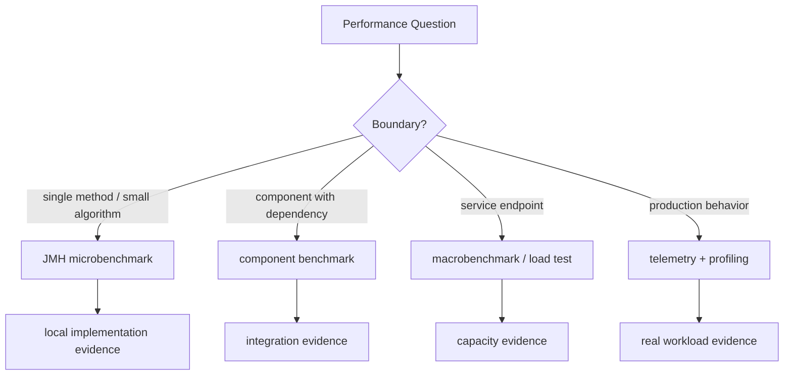
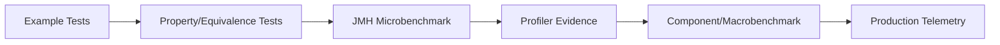

# Part 027 — JMH Deep Dive and Microbenchmark Correctness

JMH is not a magic truth machine.

It is a harness that helps you ask performance questions on the JVM without being destroyed immediately by warmup, dead-code elimination, tiered compilation, inlining, constant folding, and measurement overhead. But it cannot decide whether your benchmark represents production. It cannot know whether your input distribution is honest. It cannot know whether your benchmark accidentally measures a hot cache path while production suffers cold cache misses. It cannot know whether the JVM profile collected during the benchmark is completely different from the profile collected inside the real service.

So the rule is:

> JMH makes JVM benchmarking possible. Engineering discipline makes it meaningful.

This part is a practical deep dive into JMH as an evidence tool.

We will focus on correctness before speed.

A wrong benchmark is worse than no benchmark because it gives confidence to the wrong decision.

---

## 1. What microbenchmarks are for

A microbenchmark answers a narrow question:

```text
Under controlled JVM/runtime conditions, how does this small unit of code behave under a specified workload shape?
```

Good uses:

- comparing two parsing strategies;
- measuring allocation rate of two object construction paths;
- choosing between data structure strategies under a specific lookup/write distribution;
- understanding whether an optimization changes CPU cost, allocation cost, or branch behavior;
- proving a local performance regression before changing an implementation;
- building repeatable evidence for a method-level performance patch.

Bad uses:

- proving end-to-end service capacity;
- predicting database latency from an in-memory mock;
- claiming a framework is faster from one synthetic request path;
- choosing production architecture from a benchmark that ignores network, GC, data size, contention, and error paths;
- ranking code using average latency only.

The boundary matters.



A microbenchmark is most valuable when you can clearly say:

```text
This benchmark does not prove the whole system is fast.
It proves this local implementation behaves better/worse under this defined workload.
```

---

## 2. Minimal Maven setup

A serious Java codebase should keep JMH benchmarks separate from normal tests.

A common layout:

```text
project/
  src/main/java/...
  src/test/java/...
  src/jmh/java/...
  pom.xml
```

A minimal Maven configuration can look like this:

```xml
<properties>
    <jmh.version>1.37</jmh.version>
</properties>

<dependencies>
    <dependency>
        <groupId>org.openjdk.jmh</groupId>
        <artifactId>jmh-core</artifactId>
        <version>${jmh.version}</version>
        <scope>test</scope>
    </dependency>
    <dependency>
        <groupId>org.openjdk.jmh</groupId>
        <artifactId>jmh-generator-annprocess</artifactId>
        <version>${jmh.version}</version>
        <scope>test</scope>
    </dependency>
</dependencies>
```

For production-grade usage, create a separate benchmark module:

```text
service-core/
service-adapters/
service-benchmarks/
```

Why?

Because benchmarks often need:

- larger fixtures;
- multiple implementations;
- benchmark-specific dependencies;
- generated data files;
- custom JVM arguments;
- CI isolation;
- result archives.

Do not pollute normal test execution with benchmark execution. Benchmarks are evidence jobs, not regular unit tests.

---

## 3. Minimal benchmark class

Example: compare two normalization strategies.

```java
package com.acme.benchmark;

import org.openjdk.jmh.annotations.Benchmark;
import org.openjdk.jmh.annotations.BenchmarkMode;
import org.openjdk.jmh.annotations.Fork;
import org.openjdk.jmh.annotations.Measurement;
import org.openjdk.jmh.annotations.Mode;
import org.openjdk.jmh.annotations.OutputTimeUnit;
import org.openjdk.jmh.annotations.Param;
import org.openjdk.jmh.annotations.Scope;
import org.openjdk.jmh.annotations.Setup;
import org.openjdk.jmh.annotations.State;
import org.openjdk.jmh.annotations.Warmup;

import java.util.Locale;
import java.util.concurrent.TimeUnit;

@BenchmarkMode(Mode.AverageTime)
@OutputTimeUnit(TimeUnit.NANOSECONDS)
@Warmup(iterations = 5, time = 1, timeUnit = TimeUnit.SECONDS)
@Measurement(iterations = 10, time = 1, timeUnit = TimeUnit.SECONDS)
@Fork(value = 3)
public class NormalizationBenchmark {

    @State(Scope.Thread)
    public static class InputState {
        @Param({"SMALL", "MEDIUM", "LARGE"})
        public String size;

        public String input;

        @Setup
        public void setup() {
            input = switch (size) {
                case "SMALL" -> "  Case-123  ";
                case "MEDIUM" -> "  Regulatory Case Submission 12345 / Region APAC  ";
                case "LARGE" -> "  ".repeat(32) + "Regulatory Case Submission 12345 / Region APAC" + "  ".repeat(32);
                default -> throw new IllegalArgumentException(size);
            };
        }
    }

    @Benchmark
    public String trimThenLowercase(InputState state) {
        return state.input.trim().toLowerCase(Locale.ROOT);
    }

    @Benchmark
    public String lowercaseThenTrim(InputState state) {
        return state.input.toLowerCase(Locale.ROOT).trim();
    }
}
```

This benchmark already shows several important rules:

- benchmark methods are annotated with `@Benchmark`;
- parameters are explicit with `@Param`;
- input setup is separated from measurement;
- warmup and measurement are configured;
- multiple forks isolate JVM runs;
- result is returned so the JVM cannot simply discard the computation;
- output time unit is explicit;
- locale is explicit, not environment-dependent.

A benchmark should read like an experiment, not like a random code snippet.

---

## 4. Benchmark modes

JMH supports multiple benchmark modes. Choose based on the question.

| Mode | Measures | Use when |
|---|---|---|
| `Mode.AverageTime` | average time per operation | comparing operation cost |
| `Mode.Throughput` | operations per time unit | maximizing completed operations |
| `Mode.SampleTime` | sampled latency distribution | understanding tail-ish behavior in micro context |
| `Mode.SingleShotTime` | one invocation timing | cold-start-ish operations, setup-heavy paths |
| `Mode.All` | all modes | exploration, not final evidence |

Avoid defaulting to throughput because it looks impressive.

For small local operations, `AverageTime` is often easier to reason about:

```java
@BenchmarkMode(Mode.AverageTime)
@OutputTimeUnit(TimeUnit.NANOSECONDS)
```

For batch-oriented operations, throughput may be more natural:

```java
@BenchmarkMode(Mode.Throughput)
@OutputTimeUnit(TimeUnit.SECONDS)
```

For latency-sensitive code, average time is not enough. Consider `SampleTime`, but remember: microbenchmark latency distribution is not the same as service p99. Service tail latency includes queueing, locks, IO, GC, scheduling, network, database, and downstream services.

---

## 5. Warmup, measurement, and forks

The JVM changes behavior while your program runs.

During warmup:

- methods become hot;
- bytecode is interpreted, then compiled;
- call sites collect type profiles;
- branches collect probability profiles;
- allocations may be optimized;
- methods may be inlined;
- speculative assumptions may be made;
- deoptimization can happen later if assumptions fail.

So a benchmark with no warmup is usually measuring startup/transient behavior, not steady-state behavior.

```java
@Warmup(iterations = 5, time = 1, timeUnit = TimeUnit.SECONDS)
@Measurement(iterations = 10, time = 1, timeUnit = TimeUnit.SECONDS)
@Fork(value = 3)
```

Interpretation:

- each fork launches a fresh JVM;
- warmup iterations are not reported as final measurement;
- measurement iterations are reported;
- multiple forks reduce single-JVM accident risk.

A serious benchmark result should include:

```text
Benchmark: ValidationEngineBenchmark.evaluate
JDK: Eclipse Temurin 21.0.x / OpenJDK 25.x
OS: Linux x86_64
CPU: c6i.2xlarge / local machine model
Forks: 5
Warmup: 10 x 1s
Measurement: 20 x 1s
Mode: AverageTime
Unit: ns/op
Params: rules=100, facts=20, hitRate=0.25
Profiler: gc
```

Do not compare benchmark results from different machines unless the purpose is explicitly cross-machine comparison.

---

## 6. State scope

`@State` controls how benchmark state is shared.

| Scope | Meaning | Use when |
|---|---|---|
| `Scope.Thread` | each benchmark thread gets its own state | no sharing, per-thread local work |
| `Scope.Benchmark` | state shared across all benchmark threads | shared data structure, contention, cache, global registry |
| `Scope.Group` | state shared within a benchmark group | producer/consumer or mixed read/write group |

Example:

```java
@State(Scope.Thread)
public static class PerThreadState {
    byte[] payload;

    @Setup
    public void setup() {
        payload = new byte[1024];
    }
}
```

For concurrent data structure benchmarking:

```java
@State(Scope.Benchmark)
public static class SharedMapState {
    ConcurrentHashMap<String, String> map = new ConcurrentHashMap<>();
}
```

Wrong state scope can invalidate the benchmark.

If production has shared contention but your benchmark uses `Scope.Thread`, you measured a fantasy.

If production has per-request local state but your benchmark uses shared state, you measured artificial contention.

---

## 7. Setup levels

JMH supports setup at different levels:

```java
@Setup(Level.Trial)
public void setupOncePerFork() {}

@Setup(Level.Iteration)
public void setupBeforeEachIteration() {}

@Setup(Level.Invocation)
public void setupBeforeEachInvocation() {}
```

Use them carefully.

| Level | Cost included in measured operation? | Typical use |
|---|---:|---|
| `Trial` | no | large immutable fixtures, lookup tables |
| `Iteration` | mostly no | reset moderate state per measurement iteration |
| `Invocation` | setup overhead can dominate | avoid unless operation mutates state and must be reset every call |

`Level.Invocation` is dangerous because it can dominate or distort tiny benchmark operations.

Example of dangerous benchmark:

```java
@Setup(Level.Invocation)
public void setup() {
    list = new ArrayList<>(initialData);
}

@Benchmark
public Object removeFirst() {
    return list.remove(0);
}
```

This may measure copying/setup more than removal. Better options:

- benchmark a batch operation;
- include setup intentionally and name the benchmark accordingly;
- use larger operation granularity;
- use `@OperationsPerInvocation` if applicable;
- write separate benchmarks for setup cost and operation cost.

---

## 8. Returning values vs Blackhole

The JVM is allowed to remove work if the result is unused and observable behavior does not change.

Bad:

```java
@Benchmark
public void bad() {
    expensiveComputation();
}
```

If `expensiveComputation()` has no observable side effects, the optimizer may eliminate it.

Better:

```java
@Benchmark
public Result good() {
    return expensiveComputation();
}
```

Or use `Blackhole`:

```java
@Benchmark
public void goodWithBlackhole(Blackhole blackhole) {
    blackhole.consume(expensiveComputation());
}
```

Prefer returning the result when natural.

Use `Blackhole` when:

- there are multiple intermediate results;
- the method naturally returns void but produces values internally;
- you need to consume several outputs;
- returning would distort benchmark structure.

But do not use `Blackhole` as ritual decoration. It is a tool for preserving benchmark semantics.

---

## 9. Dead-code elimination

Dead-code elimination happens when the JVM concludes work has no observable effect.

Example:

```java
@Benchmark
public void eliminated() {
    int x = 1 + 2;
}
```

This benchmark may measure almost nothing.

Correct benchmark:

```java
@Benchmark
public int notEliminated() {
    return 1 + 2;
}
```

But even this can be suspicious because constant folding can precompute the result.

---

## 10. Constant folding

The JVM can precompute constant expressions.

Bad:

```java
@Benchmark
public int bad() {
    return hash("constant-input");
}
```

If the method is pure and input constant, the optimizer may simplify more than production would.

Better:

```java
@State(Scope.Thread)
public static class Inputs {
    @Param({"case-123", "case-456", "case-789"})
    String input;
}

@Benchmark
public int better(Inputs inputs) {
    return hash(inputs.input);
}
```

Even better: use a representative corpus.

```java
@State(Scope.Thread)
public static class Corpus {
    List<String> values;
    int index;

    @Setup
    public void setup() {
        values = List.of("case-123", "submission-456", "appeal-789");
    }

    String next() {
        String value = values.get(index);
        index = (index + 1) % values.size();
        return value;
    }
}

@Benchmark
public int hashCorpus(Corpus corpus) {
    return hash(corpus.next());
}
```

But be careful: the benchmark now includes index update and list access. That may be fine if the operation is large enough. If not, increase operation granularity.

---

## 11. Loop benchmarks

A common mistake is putting a loop inside a benchmark and reporting per-call time incorrectly.

```java
@Benchmark
public int loopInsideBenchmark() {
    int sum = 0;
    for (int i = 0; i < 1_000; i++) {
        sum += compute(i);
    }
    return sum;
}
```

This measures a batch of 1,000 operations. That is not wrong, but the unit is now “batch operation,” not one `compute()`.

If you want to express that, use:

```java
@OperationsPerInvocation(1_000)
@Benchmark
public int batchedCompute() {
    int sum = 0;
    for (int i = 0; i < 1_000; i++) {
        sum += compute(i);
    }
    return sum;
}
```

Batching is useful when each operation is too small and measurement overhead dominates.

But batching can hide:

- branch behavior;
- cache misses;
- allocation bursts;
- per-request setup cost;
- synchronization cost;
- real data distribution.

Use batching intentionally.

---

## 12. Avoid benchmarking the wrong thing

A benchmark method contains three kinds of work:

```text
measured operation = target work + harness work + accidental work
```

Accidental work includes:

- generating random values per invocation;
- parsing fixtures per invocation;
- allocating test data per invocation;
- logging;
- calling assertions;
- using synchronized fixture access;
- using nonrepresentative adapters;
- consuming data structure setup cost accidentally.

Example of accidental benchmark:

```java
@Benchmark
public boolean contains() {
    List<String> data = loadData();        // accidental setup
    String key = UUID.randomUUID().toString(); // accidental random generation
    return data.contains(key);
}
```

Better:

```java
@State(Scope.Thread)
public static class ContainsState {
    List<String> data;
    String[] keys;
    int index;

    @Setup(Level.Trial)
    public void setup() {
        data = loadDataOnce();
        keys = loadKeysOnce();
    }

    String nextKey() {
        String key = keys[index];
        index = (index + 1) % keys.length;
        return key;
    }
}

@Benchmark
public boolean contains(ContainsState state) {
    return state.data.contains(state.nextKey());
}
```

Now the benchmark measures lookup plus lightweight key selection.

If key selection is still significant, benchmark key selection separately or increase operation granularity.

---

## 13. Workload realism

The most dangerous benchmark is technically correct but semantically irrelevant.

Example:

```text
Production:
- 80% small payloads
- 15% medium payloads
- 5% very large payloads
- 70% successful validation
- 20% rejected validation
- 10% exceptional/edge path

Benchmark:
- one small successful payload repeated forever
```

The benchmark will collect a clean JVM profile:

- predictable branches;
- stable receiver types;
- hot cache paths;
- no error allocation;
- no large payload pressure;
- no branch misprediction;
- no polymorphic call sites.

Then it may claim a speedup that disappears in production.

A representative benchmark needs workload dimensions:

| Dimension | Example |
|---|---|
| Input size | small / medium / large / pathological |
| Hit ratio | cache hit / cache miss |
| Branch mix | valid / invalid / exceptional |
| Data shape | flat / nested / sparse / duplicated |
| Type profile | one implementation / many implementations |
| State | empty / warm / saturated |
| Allocation | no allocation / moderate / bursty |
| Locality | sequential / random |
| Concurrency | single-threaded / contended / mixed role |

Do not benchmark only the happy path unless production only has happy paths.

---

## 14. Parametrize the experiment

Use `@Param` to expose workload dimensions.

```java
@State(Scope.Thread)
public static class ValidationState {
    @Param({"10", "100", "1000"})
    int ruleCount;

    @Param({"0.10", "0.50", "0.90"})
    double hitRate;

    RuleEngine engine;
    List<Request> requests;
    int index;

    @Setup(Level.Trial)
    public void setup() {
        engine = RuleEngineFactory.create(ruleCount);
        requests = RequestCorpus.generate(ruleCount, hitRate, 10_000);
    }

    Request next() {
        Request request = requests.get(index);
        index = (index + 1) % requests.size();
        return request;
    }
}

@Benchmark
public Decision evaluate(ValidationState state) {
    return state.engine.evaluate(state.next());
}
```

Now the benchmark is not one number. It is a matrix.

```text
ruleCount=10, hitRate=0.10
ruleCount=10, hitRate=0.50
ruleCount=10, hitRate=0.90
ruleCount=100, hitRate=0.10
...
```

This often reveals nonlinear behavior:

- algorithm performs well for small `n`, badly for large `n`;
- cache works at 90% hit rate, collapses at 50%;
- branchy code wins for predictable input, loses for mixed input;
- allocation strategy is fine until payload size crosses threshold.

The purpose of `@Param` is not convenience. It is experimental structure.

---

## 15. Benchmarking allocation

For Java, allocation rate is often more important than raw CPU time.

Two implementations with similar `ns/op` may differ drastically in `B/op`.

Run with GC profiler:

```bash
java -jar target/benchmarks.jar ValidationBenchmark -prof gc
```

Example result shape:

```text
Benchmark                       Mode  Cnt     Score    Error   Units
oldEngine                       avgt   30   820.000 ± 20.000   ns/op
oldEngine:·gc.alloc.rate.norm   avgt   30  2048.000           B/op
newEngine                       avgt   30   760.000 ± 18.000   ns/op
newEngine:·gc.alloc.rate.norm   avgt   30   128.000           B/op
```

Interpretation:

```text
The new engine is only ~7% faster by average time, but reduces allocation by ~94%.
This may reduce GC pressure and improve tail latency under service load.
Need macrobenchmark/load test to confirm system-level effect.
```

Allocation is not automatically evil. Short-lived allocation can be cheap. But high allocation rate can create GC pressure, memory bandwidth pressure, cache churn, and latency instability.

Benchmark reports should include allocation evidence when optimization changes object creation.

---

## 16. Benchmarking polymorphism and call-site profile

JVM performance depends heavily on call-site profiles.

A benchmark with one implementation may become monomorphic:

```java
interface Rule {
    boolean applies(Request request);
}

final class CountryRule implements Rule { ... }
```

Bad benchmark:

```java
Rule rule = new CountryRule();
```

Production may use many rule implementations:

```text
CountryRule
ProductRule
CustomerSegmentRule
RiskRule
DateWindowRule
ManualOverrideRule
```

The JIT may optimize the monomorphic benchmark aggressively, while production sees polymorphic or megamorphic dispatch.

Better benchmark:

```java
@State(Scope.Thread)
public static class RuleState {
    List<Rule> rules;
    Request request;

    @Param({"MONOMORPHIC", "POLYMORPHIC", "MEGAMORPHIC"})
    String profile;

    @Setup
    public void setup() {
        rules = switch (profile) {
            case "MONOMORPHIC" -> List.of(
                new CountryRule(), new CountryRule(), new CountryRule()
            );
            case "POLYMORPHIC" -> List.of(
                new CountryRule(), new ProductRule(), new DateWindowRule()
            );
            case "MEGAMORPHIC" -> List.of(
                new CountryRule(), new ProductRule(), new DateWindowRule(),
                new RiskRule(), new SegmentRule(), new OverrideRule()
            );
            default -> throw new IllegalArgumentException(profile);
        };
        request = RequestFixtures.valid();
    }
}

@Benchmark
public int evaluateRules(RuleState state) {
    int matched = 0;
    for (Rule rule : state.rules) {
        if (rule.applies(state.request)) {
            matched++;
        }
    }
    return matched;
}
```

This does not perfectly reproduce production, but it makes type profile an explicit variable.

That is the point.

---

## 17. Benchmarking branch behavior

Branch predictability matters.

Bad:

```java
@Benchmark
public int alwaysValid() {
    return validator.validate(validRequest).score();
}
```

If the branch is always true, the CPU and JIT can optimize for that path.

Better:

```java
@Param({"0.00", "0.25", "0.50", "0.75", "1.00"})
double invalidRate;
```

Generate a corpus with controlled invalid rate:

```java
requests = RequestCorpus.withInvalidRate(invalidRate, 10_000);
```

This reveals behavior under branch mix.

The fastest implementation under 0% invalid may not be fastest under 50% invalid.

---

## 18. Benchmarking cache effects

Repeatedly benchmarking the same object may measure a hot-cache fantasy.

Bad:

```java
@Benchmark
public Decision sameRequestEveryTime(State state) {
    return state.engine.evaluate(state.request);
}
```

Better:

```java
@Benchmark
public Decision corpus(State state) {
    return state.engine.evaluate(state.nextRequest());
}
```

But even corpus cycling can become predictable.

For local microbenchmarks, this may be acceptable if the corpus is large enough and the benchmark question is local. For realistic cache/memory behavior, move to component or macrobenchmark.

Use this decision rule:

```text
If cache locality is central to the performance question, do not hide it.
Make cache state a benchmark parameter.
```

Example:

```java
@Param({"100", "10000", "1000000"})
int corpusSize;
```

---

## 19. Multi-threaded JMH benchmarks

Use multi-threaded JMH when the unit under test is shared or contention-sensitive.

Example:

```java
@State(Scope.Benchmark)
public static class SharedCounterState {
    AtomicLong counter = new AtomicLong();
}

@Benchmark
@Threads(8)
public long increment(SharedCounterState state) {
    return state.counter.incrementAndGet();
}
```

This measures contention on one shared counter.

But ask:

- Does production have one shared counter?
- How many threads contend?
- Are threads CPU-bound or blocking?
- Is the contention local or distributed?
- Does production use batching/sharding?

A contention microbenchmark is useful, but easy to overgeneralize.

For mixed workloads, use groups.

```java
@State(Scope.Group)
public static class SharedMap {
    ConcurrentHashMap<String, String> map = new ConcurrentHashMap<>();
    String[] keys;
    int index;
}

@Group("map")
@GroupThreads(3)
@Benchmark
public String read(SharedMap state) {
    return state.map.get(state.keys[state.index++ & 1023]);
}

@Group("map")
@GroupThreads(1)
@Benchmark
public String write(SharedMap state) {
    return state.map.put(state.keys[state.index++ & 1023], "value");
}
```

This models a 3:1 reader/writer group.

Still, it is not a service load test. It is local contention evidence.

---

## 20. False sharing and state layout

False sharing happens when independent variables used by different threads occupy the same cache line, causing unnecessary coherence traffic.

In benchmarks, false sharing can appear accidentally in state objects.

Example danger:

```java
@State(Scope.Benchmark)
public static class Counters {
    volatile long a;
    volatile long b;
}
```

Thread 1 updates `a`, thread 2 updates `b`. They may still contend at the cache-line level.

JMH has tools and annotations to reduce this kind of issue in some contexts, but the deeper rule is:

```text
If your benchmark is concurrent, think about memory layout and sharing.
```

Do not benchmark concurrent performance without looking at:

- shared mutable state;
- cache line interaction;
- synchronization path;
- allocation path;
- object graph locality;
- thread count;
- CPU topology.

---

## 21. Profilers in JMH

JMH can run with profilers:

```bash
java -jar target/benchmarks.jar MyBenchmark -prof gc
java -jar target/benchmarks.jar MyBenchmark -prof stack
java -jar target/benchmarks.jar MyBenchmark -prof perfasm
```

Common use:

| Profiler | Useful for |
|---|---|
| `gc` | allocation rate, GC count/time |
| `stack` | rough stack sampling |
| `perf` / `perfasm` | native profiling / assembly-level analysis on supported platforms |
| external async-profiler | CPU/allocation/wall/lock analysis outside or alongside JMH |

Do not start with assembly unless needed.

A practical flow:

```text
1. Run benchmark normally.
2. Run with -prof gc.
3. If CPU question remains, use async-profiler/flamegraph.
4. If compiler/codegen question remains, inspect perfasm/JIT logs.
5. Confirm with macrobenchmark or production profiling if the change is system-relevant.
```

---

## 22. Reading JMH output

Example:

```text
Benchmark                       (size)  Mode  Cnt     Score    Error   Units
ParserBenchmark.regex            SMALL  avgt   30   410.230 ± 12.100  ns/op
ParserBenchmark.manual           SMALL  avgt   30   180.840 ±  8.540  ns/op
ParserBenchmark.regex           MEDIUM  avgt   30  1550.120 ± 60.120  ns/op
ParserBenchmark.manual          MEDIUM  avgt   30   780.440 ± 35.230  ns/op
```

Do not report only:

```text
manual is faster
```

Report:

```text
For SMALL and MEDIUM input sizes, manual parser is ~2.0x faster in avgt mode under the benchmarked corpus. However, we need to compare correctness coverage, maintenance risk, Unicode handling, allocation rate, and behavior on malformed/pathological input before replacing regex globally.
```

Performance decision requires engineering context.

---

## 23. The benchmark review checklist

Every serious benchmark should pass review.

### 23.1 Question

```text
What decision will this benchmark inform?
```

Bad:

```text
See which one is faster.
```

Good:

```text
Decide whether replacing regex-based case reference parsing with manual scanning reduces CPU/allocation cost for the top 5 production input shapes without breaking malformed-input behavior.
```

### 23.2 Boundary

```text
Is this method-level, component-level, or service-level evidence?
```

### 23.3 Workload

```text
Are input sizes, hit rates, branch mix, and data shape representative?
```

### 23.4 State

```text
Is benchmark state shared or per-thread in the same way as production?
```

### 23.5 Setup

```text
Is setup excluded or included intentionally?
```

### 23.6 JVM behavior

```text
Are warmup, forks, compiler profile, and allocation behavior considered?
```

### 23.7 Result use

```text
Will this result trigger direct code change, deeper profiling, or macrobenchmark confirmation?
```

---

## 24. Common anti-patterns

### Anti-pattern 1: One input forever

```java
@Benchmark
public Output benchmark() {
    return parser.parse("CASE-123");
}
```

Why it lies:

- branch profile too clean;
- cache too hot;
- no malformed input;
- no size variation;
- may be constant-folded or over-specialized.

### Anti-pattern 2: Benchmarking random generation

```java
@Benchmark
public Output benchmark() {
    return parser.parse(UUID.randomUUID().toString());
}
```

Why it lies:

- random generation dominates;
- input distribution may not match production;
- benchmark becomes noisy.

### Anti-pattern 3: Measuring logging

```java
@Benchmark
public void benchmark() {
    log.info("value {}", service.compute());
}
```

Why it lies:

- logging backend/config dominates;
- async logging may move cost elsewhere;
- result may depend on environment.

### Anti-pattern 4: Benchmarking assertions

```java
@Benchmark
public void benchmark() {
    assertThat(service.compute()).isEqualTo(expected);
}
```

Why it lies:

- assertion library cost is included;
- benchmark becomes a test;
- use tests for correctness, benchmark for cost.

### Anti-pattern 5: Comparing without allocation evidence

```text
Implementation A: 200 ns/op
Implementation B: 190 ns/op
```

But:

```text
A: 16 B/op
B: 2,048 B/op
```

The faster local operation may create worse system behavior under load.

---

## 25. Benchmarking correctness oracle

A benchmark must not replace correctness tests.

Before benchmarking two implementations, prove they are semantically equivalent for the intended domain.

```java
class ParserEquivalenceTest {

    @Property
    void manualAndRegexParserAgree(@ForAll("caseReferences") String input) {
        ParseResult regex = RegexParser.parse(input);
        ParseResult manual = ManualParser.parse(input);

        assertThat(manual).isEqualTo(regex);
    }
}
```

Then benchmark:

```java
@Benchmark
public ParseResult regex(ParserState state) {
    return RegexParser.parse(state.next());
}

@Benchmark
public ParseResult manual(ParserState state) {
    return ManualParser.parse(state.next());
}
```

The evidence chain is:



Never optimize into semantic drift.

---

## 26. Case study: validation rule engine

Suppose a regulatory case platform has a rule engine:

```java
public interface Rule {
    boolean applies(CaseSubmission submission);
    Violation violation();
}

public final class RuleEngine {
    private final List<Rule> rules;

    public ValidationResult validate(CaseSubmission submission) {
        List<Violation> violations = new ArrayList<>();
        for (Rule rule : rules) {
            if (rule.applies(submission)) {
                violations.add(rule.violation());
            }
        }
        return new ValidationResult(violations);
    }
}
```

A proposed optimization changes rule storage from list scan to indexed rules.

Weak benchmark:

```java
@Benchmark
public ValidationResult validate() {
    return engine.validate(validSubmission);
}
```

Better benchmark design:

| Dimension | Values |
|---|---|
| rule count | 10 / 100 / 1000 |
| submission size | small / medium / large |
| violation rate | 0% / 10% / 50% |
| rule profile | monomorphic / polymorphic |
| result allocation | full list / early exit / lazy result |
| corpus size | 100 / 10,000 |

Benchmark state:

```java
@State(Scope.Thread)
public static class RuleEngineState {
    @Param({"10", "100", "1000"})
    int ruleCount;

    @Param({"0.0", "0.1", "0.5"})
    double violationRate;

    @Param({"LIST", "INDEXED"})
    String implementation;

    RuleEngine engine;
    List<CaseSubmission> submissions;
    int index;

    @Setup(Level.Trial)
    public void setup() {
        RuleCorpus corpus = RuleCorpus.generate(ruleCount, violationRate, 10_000);
        this.engine = switch (implementation) {
            case "LIST" -> RuleEngineFactory.listBased(corpus.rules());
            case "INDEXED" -> RuleEngineFactory.indexed(corpus.rules());
            default -> throw new IllegalArgumentException(implementation);
        };
        this.submissions = corpus.submissions();
    }

    CaseSubmission next() {
        CaseSubmission submission = submissions.get(index);
        index = (index + 1) % submissions.size();
        return submission;
    }
}

@Benchmark
public ValidationResult validate(RuleEngineState state) {
    return state.engine.validate(state.next());
}
```

Now the benchmark can reveal:

- indexed engine wins only after `ruleCount >= 100`;
- indexed engine allocates more during setup but less per validation;
- list engine wins for small rule sets;
- indexed engine has worse cold-start cost;
- polymorphic rules reduce the expected win;
- violation-heavy workloads allocate more result data.

This is decision-grade evidence.

---

## 27. JMH in CI

Do not run every benchmark on every commit by default.

Better layers:

| Layer | Trigger | Purpose |
|---|---|---|
| local benchmark | developer command | explore implementation alternatives |
| PR smoke benchmark | opt-in label or changed performance-sensitive path | catch obvious regression |
| nightly benchmark | scheduled dedicated runner | trend tracking |
| release benchmark | before release candidate | release confidence |
| investigation benchmark | incident/regression analysis | root cause support |

CI benchmark rules:

- use dedicated runners if possible;
- pin JDK version;
- record CPU/machine metadata;
- avoid noisy shared runners for strict gates;
- compare against historical baseline, not arbitrary threshold;
- archive raw JMH JSON;
- archive profiler artifacts for important runs;
- do not block PRs on statistically weak evidence;
- require human review for benchmark meaning.

JMH can output JSON:

```bash
java -jar target/benchmarks.jar \
  -rf json \
  -rff target/jmh-results.json
```

Store it.

Benchmark evidence that cannot be revisited becomes tribal memory.

---

## 28. From benchmark to decision

A benchmark result should end with a decision frame:

```md
## Decision

We will replace RegexCaseReferenceParser with ManualCaseReferenceParser for the hot ingestion path only.

## Evidence

- Manual parser is 1.8x-2.4x faster across representative SMALL/MEDIUM/LARGE corpora.
- Allocation decreases from 320 B/op to 48 B/op.
- Property-based equivalence tests pass for generated valid/malformed case references.
- Fuzz corpus found two malformed-input differences; fixed before merge.
- Component benchmark shows ingestion CPU decreases by 11% at 800 msg/s.

## Limits

- Does not prove end-to-end p99 improvement.
- Does not cover non-ASCII normalization outside accepted product scope.
- Production canary must watch parse failure rate and ingestion latency.
```

This is how top engineers use benchmarks: as one layer in an evidence chain.

---

## 29. Practical command patterns

Run all benchmarks:

```bash
java -jar target/benchmarks.jar
```

Run one benchmark class:

```bash
java -jar target/benchmarks.jar '.*ParserBenchmark.*'
```

Run with GC profiler:

```bash
java -jar target/benchmarks.jar '.*ParserBenchmark.*' -prof gc
```

Run with JSON output:

```bash
java -jar target/benchmarks.jar \
  '.*ParserBenchmark.*' \
  -rf json \
  -rff target/parser-benchmark-results.json
```

Override forks/warmup/measurement from CLI:

```bash
java -jar target/benchmarks.jar \
  '.*ParserBenchmark.*' \
  -f 5 \
  -wi 10 \
  -i 20
```

List benchmarks:

```bash
java -jar target/benchmarks.jar -l
```

---

## 30. What to put in the repository

Recommended structure:

```text
benchmarks/
  README.md
  pom.xml
  src/jmh/java/com/acme/benchmark/
    ParserBenchmark.java
    RuleEngineBenchmark.java
    SerializationBenchmark.java
  src/jmh/resources/
    corpora/
      case-references-small.txt
      case-references-large.txt
  results/
    README.md
```

Benchmark README should explain:

```md
# Benchmarks

## Purpose
These benchmarks support local implementation decisions for parser, validation, and serialization hot paths.
They do not replace service-level load tests.

## Running
...

## Interpreting Results
Always run with at least 3 forks for decision-making.
Use `-prof gc` when comparing allocation-sensitive paths.

## Hardware
Record CPU, OS, JDK, and JVM args with every result.

## Review Rules
Every new benchmark must include a workload explanation and correctness oracle.
```

A benchmark without documentation decays quickly.

---

## 31. Exercises

### Exercise 1 — parser benchmark

Take a parser from your codebase.

Create:

- example tests;
- property-based equivalence tests if replacing implementation;
- JMH benchmark with SMALL/MEDIUM/LARGE input;
- GC profiler output;
- decision note.

### Exercise 2 — rule engine benchmark

Model:

- 10, 100, 1000 rules;
- different violation rates;
- monomorphic vs polymorphic rule implementations;
- result allocation strategy.

Find where the algorithm changes behavior.

### Exercise 3 — benchmark review

Pick an old benchmark and answer:

```text
What decision did this benchmark support?
What workload did it model?
What production assumption did it encode?
What source of invalidity is most likely?
```

If you cannot answer, rewrite or delete the benchmark.

---

## 32. Final mental model

JMH is a microscope.

A microscope is powerful because it narrows attention. But if you put the wrong sample under it, you will confidently study the wrong thing.

Use JMH when:

- the boundary is local;
- workload dimensions are explicit;
- correctness equivalence is already protected;
- JVM optimization traps are considered;
- allocation and profile effects are visible;
- the result feeds into a broader evidence chain.

Do not ask:

```text
Which code is faster?
```

Ask:

```text
Under this workload, with this state, on this JVM, for this boundary, with this correctness oracle, what changed and what decision does that justify?
```

That is performance engineering.

---

## References

- OpenJDK JMH project: https://openjdk.org/projects/code-tools/jmh/
- OpenJDK JMH repository and samples: https://github.com/openjdk/jmh
- JMH Blackhole source: https://github.com/openjdk/jmh/blob/master/jmh-core/src/main/java/org/openjdk/jmh/infra/Blackhole.java
