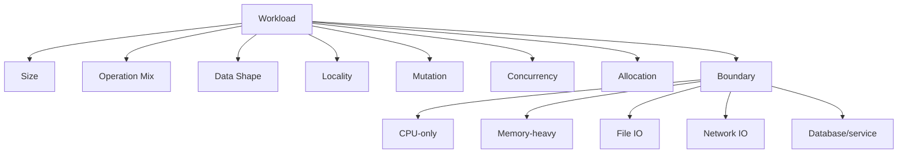
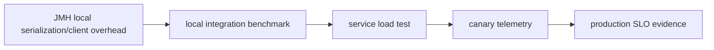

# Part 028 — Benchmarking Data Structures, Algorithms, and IO

This part is about a dangerous transition.

Part 027 taught how to write a JMH benchmark that is mechanically less wrong. This part asks a harder question:

> What exactly should we benchmark when the code involves data structures, algorithms, parsing, serialization, file IO, network boundaries, or shared state?

The weak engineer benchmarks an implementation.

The strong engineer benchmarks a workload.

That difference matters because data structures and algorithms do not have absolute performance. They have performance under:

- specific size ranges;
- access patterns;
- mutation ratios;
- cache locality;
- key distribution;
- branch predictability;
- allocation pressure;
- concurrency level;
- IO buffering;
- error path frequency;
- production data shape.

This part is not a catalog of “ArrayList is faster than LinkedList.” That kind of advice is usually too shallow.

The goal is to build a repeatable method for answering performance questions in Java without lying to yourself.

---

## 1. Benchmark the decision, not the object

Bad question:

```text
Is HashMap faster than TreeMap?
```

Better question:

```text
For case lookup during ingestion, with 50k active cases, 95% reads, 5% inserts, mostly exact IDs, and periodic iteration by creation time, should we use HashMap plus separate sorted index, TreeMap, or database-backed lookup?
```

The benchmarkable decision includes:

| Element | Example |
|---|---|
| Operation mix | 95% read, 5% write |
| Size range | 10k, 50k, 500k entries |
| Key distribution | sequential, random, skewed, prefix-heavy |
| Access locality | repeated hot keys vs uniform random |
| Mutation behavior | append-only, update-heavy, delete-heavy |
| Ordering needs | no order, insertion order, sorted order |
| Memory pressure | object-heavy vs primitive/compact |
| Concurrency | single thread, many readers, mixed writers |

A benchmark without a decision context becomes trivia.

---

## 2. Workload taxonomy for local Java benchmarks

Before writing benchmark code, classify the workload.



For every benchmark, write a workload card:

```md
## Workload Card

Operation: case reference normalization and lookup
Boundary: in-memory local operation
Size: 100k active references
Operation mix: 90% lookup, 10% insert
Key distribution: 80% recent hot keys, 20% random historical keys
Input quality: 98% valid, 2% malformed
Concurrency: single-threaded in current ingestion worker
Correctness oracle: lookup result must match reference implementation
Decision: choose lookup/index implementation for ingestion path
```

This card prevents benchmark drift.

---

## 3. Data structure benchmarks

Data structure performance depends on usage pattern.

### 3.1 List benchmark questions

Do not benchmark `ArrayList` vs `LinkedList` abstractly.

Ask:

- Are we appending?
- Are we inserting in the middle?
- Are we removing from the front?
- Are we iterating sequentially?
- Are we accessing by index?
- Is the list tiny or huge?
- Is allocation locality important?
- Is the data immutable after construction?

Example benchmark matrix:

| Operation | Sizes | Implementations |
|---|---|---|
| append | 10 / 1k / 100k | ArrayList, LinkedList |
| index access | 10 / 1k / 100k | ArrayList, LinkedList |
| iteration | 10 / 1k / 100k | ArrayList, LinkedList |
| remove first | 10 / 1k / 100k | ArrayList, LinkedList, ArrayDeque |

Benchmark:

```java
@State(Scope.Thread)
public static class ListState {
    @Param({"10", "1000", "100000"})
    int size;

    @Param({"ARRAY_LIST", "LINKED_LIST", "ARRAY_DEQUE"})
    String type;

    List<Integer> list;
    ArrayDeque<Integer> deque;

    @Setup(Level.Iteration)
    public void setup() {
        switch (type) {
            case "ARRAY_LIST" -> {
                list = new ArrayList<>(size);
                for (int i = 0; i < size; i++) list.add(i);
            }
            case "LINKED_LIST" -> {
                list = new LinkedList<>();
                for (int i = 0; i < size; i++) list.add(i);
            }
            case "ARRAY_DEQUE" -> {
                deque = new ArrayDeque<>(size);
                for (int i = 0; i < size; i++) deque.addLast(i);
            }
            default -> throw new IllegalArgumentException(type);
        }
    }
}

@Benchmark
public int iterateList(ListState state) {
    int sum = 0;
    for (Integer value : state.list) {
        sum += value;
    }
    return sum;
}
```

But note: this benchmark is invalid for `ARRAY_DEQUE` in `iterateList` because `state.list` is null for that type.

This illustrates a deeper point: benchmark matrices should not combine impossible cases.

Better: separate benchmark classes or enforce valid combinations.

---

## 4. Map benchmark questions

Map performance is shaped by:

- key type;
- hash quality;
- map size;
- hit/miss ratio;
- mutation ratio;
- iteration needs;
- ordering needs;
- memory overhead;
- concurrency;
- collision behavior;
- hot key distribution.

A useful map benchmark might compare:

```text
HashMap
LinkedHashMap
TreeMap
ConcurrentHashMap
custom index
```

But only if the decision allows those options.

Example: lookup by case ID.

```java
@State(Scope.Thread)
public static class MapLookupState {
    @Param({"1000", "100000", "1000000"})
    int size;

    @Param({"HASH_MAP", "TREE_MAP", "LINKED_HASH_MAP"})
    String type;

    @Param({"0.00", "0.10", "0.50"})
    double missRate;

    Map<String, CaseRecord> map;
    String[] keys;
    int index;

    @Setup(Level.Trial)
    public void setup() {
        map = createMap(type);
        for (int i = 0; i < size; i++) {
            map.put("CASE-" + i, new CaseRecord(i));
        }
        keys = KeyCorpus.lookupKeys(size, missRate, 100_000);
    }

    private static Map<String, CaseRecord> createMap(String type) {
        return switch (type) {
            case "HASH_MAP" -> new HashMap<>();
            case "TREE_MAP" -> new TreeMap<>();
            case "LINKED_HASH_MAP" -> new LinkedHashMap<>();
            default -> throw new IllegalArgumentException(type);
        };
    }

    String nextKey() {
        String key = keys[index];
        index = (index + 1) % keys.length;
        return key;
    }
}

@Benchmark
public CaseRecord lookup(MapLookupState state) {
    return state.map.get(state.nextKey());
}
```

Things to inspect:

- `ns/op`;
- `B/op`;
- hit vs miss behavior;
- size scaling;
- effect of key length;
- behavior with poor hash distribution;
- iteration order requirement.

Do not choose a map solely from lookup speed if the production path also requires sorted iteration.

---

## 5. Key design can dominate map performance

Sometimes the map is not the problem. The key is.

Example:

```java
record CaseKey(String jurisdiction, String caseType, String reference) {}
```

Lookup cost includes:

- key allocation;
- `hashCode()` computation;
- equality checks;
- string comparison;
- object graph traversal;
- cache locality;
- normalization.

Bad benchmark:

```java
@Benchmark
public CaseRecord lookup(State state) {
    return state.map.get(new CaseKey("ID", "ENFORCEMENT", "CASE-123"));
}
```

This measures key allocation plus lookup.

That may be correct if production allocates keys per lookup.

But if production reuses canonical keys, benchmark separately:

```java
@Benchmark
public CaseRecord lookupWithPrecomputedKey(State state) {
    return state.map.get(state.nextKey());
}

@Benchmark
public CaseRecord allocateAndLookup(State state) {
    String reference = state.nextReference();
    return state.map.get(new CaseKey("ID", "ENFORCEMENT", reference));
}
```

Then report both:

```text
Lookup itself is cheap. Key construction and normalization dominate.
Optimization should target key canonicalization, not map implementation.
```

That is the kind of conclusion that saves engineering time.

---

## 6. Algorithm benchmarks

Algorithm benchmarks should expose complexity curves, not just one point.

Example: duplicate detection.

Options:

- nested loop;
- sort then scan;
- hash set;
- Bloom filter plus verification;
- database unique constraint;
- streaming deduplication.

Benchmark matrix:

| Parameter | Values |
|---|---|
| item count | 10 / 100 / 10k / 1M |
| duplicate rate | 0% / 1% / 10% / 50% |
| key length | short / medium / long |
| input order | random / sorted / clustered duplicates |

Benchmark:

```java
@State(Scope.Thread)
public static class DedupState {
    @Param({"10", "100", "10000"})
    int itemCount;

    @Param({"0.00", "0.01", "0.10"})
    double duplicateRate;

    List<String> values;

    @Setup(Level.Trial)
    public void setup() {
        values = DedupCorpus.generate(itemCount, duplicateRate);
    }
}

@Benchmark
public boolean nestedLoop(DedupState state) {
    return DedupAlgorithms.nestedLoopHasDuplicates(state.values);
}

@Benchmark
public boolean hashSet(DedupState state) {
    return DedupAlgorithms.hashSetHasDuplicates(state.values);
}

@Benchmark
public boolean sortThenScan(DedupState state) {
    return DedupAlgorithms.sortThenScanHasDuplicates(state.values);
}
```

Expected result pattern:

```text
nested loop may win for tiny n because overhead is low.
hash set may win for medium/large n.
sort-then-scan may allocate less or more depending implementation.
```

The decision is not “always use HashSet.” The decision is:

```text
For our production item counts, duplicate rate, and memory budget, choose this implementation.
```

---

## 7. Complexity curves beat single measurements

A single benchmark point can hide asymptotic behavior.

Plot or tabulate across `n`:

```text
n=10
n=100
n=1_000
n=10_000
n=100_000
```

Look for:

- linear behavior;
- quadratic blow-up;
- threshold effects;
- cache boundary changes;
- GC pressure changes;
- allocation cliffs;
- branch behavior changes.

Example interpretation:

```text
The nested loop version is fastest up to n=30, acceptable up to n=100, and collapses after n=1,000. Production p95 item count is 40 but p99.9 is 5,000 during bulk imports. Therefore nested loop is unsafe for the import path but acceptable for interactive single-case validation.
```

This is engineering nuance.

---

## 8. String benchmarks

String-heavy Java code often hides performance problems.

Benchmark candidates:

- concatenation;
- normalization;
- case conversion;
- substring/search;
- regex;
- manual scanner;
- `StringBuilder`;
- `String.format`;
- `MessageFormat`;
- UTF-8 encoding/decoding;
- Base64;
- canonicalization.

Common trap: benchmarking only ASCII.

If production receives international data, test:

- ASCII;
- Latin extended;
- CJK;
- emoji/surrogate pairs;
- mixed whitespace;
- combining marks;
- malformed or rejected inputs.

Example parser benchmark:

```java
@State(Scope.Thread)
public static class ReferenceState {
    @Param({"ASCII", "UNICODE", "MALFORMED", "LONG"})
    String corpus;

    List<String> references;
    int index;

    @Setup(Level.Trial)
    public void setup() {
        references = ReferenceCorpus.load(corpus);
    }

    String next() {
        String value = references.get(index);
        index = (index + 1) % references.size();
        return value;
    }
}

@Benchmark
public ParsedReference regex(ReferenceState state) {
    return RegexReferenceParser.parse(state.next());
}

@Benchmark
public ParsedReference manual(ReferenceState state) {
    return ManualReferenceParser.parse(state.next());
}
```

Before replacing regex with manual parsing, require:

- example tests;
- property-based equivalence tests;
- fuzzing for malformed input;
- benchmark for representative corpora;
- maintenance review.

Manual parsing can be faster and more fragile.

---

## 9. Regex benchmarks

Regex can be perfectly fine. Regex can also be catastrophic.

Benchmark:

- valid input;
- invalid input;
- near-miss input;
- long input;
- adversarial input;
- precompiled pattern vs compile per call.

Bad:

```java
@Benchmark
public boolean bad() {
    return Pattern.matches("CASE-[0-9]+", input);
}
```

This compiles the pattern repeatedly.

Better:

```java
private static final Pattern CASE_REF = Pattern.compile("CASE-[0-9]+");

@Benchmark
public boolean precompiled(State state) {
    return CASE_REF.matcher(state.next()).matches();
}
```

But if production compiles dynamically because patterns are configurable, benchmark that path too.

The point is not to make regex look good or bad. The point is to match the real lifecycle.

---

## 10. BigDecimal and numeric benchmarks

Financial, pricing, and regulatory calculations often use `BigDecimal`.

Benchmark questions:

- construction from `String` vs `long`/`int`;
- scale normalization;
- rounding;
- repeated arithmetic;
- object allocation;
- storing cents as `long` internally;
- conversion boundary to `BigDecimal`;
- correctness constraints.

Never optimize money calculations by switching to floating point unless the domain explicitly permits it.

Example:

```java
@Benchmark
public BigDecimal bigDecimalPricing(PricingState state) {
    return state.calculator.calculate(state.nextLineItems());
}

@Benchmark
public long longCentsPricing(PricingState state) {
    return state.longCalculator.calculateCents(state.nextLineItems());
}
```

The benchmark is incomplete without correctness tests:

```java
@Property
void pricingModelsAgree(@ForAll("validBaskets") Basket basket) {
    BigDecimal decimal = decimalCalculator.calculate(basket);
    long cents = longCalculator.calculateCents(basket);

    assertThat(BigDecimal.valueOf(cents, 2)).isEqualByComparingTo(decimal);
}
```

Performance without numeric correctness is unacceptable.

---

## 11. Serialization benchmarks

Serialization benchmarks are easily misleading.

Dimensions:

| Dimension | Examples |
|---|---|
| format | JSON, XML, Avro, Protobuf, custom binary |
| payload size | small, medium, large |
| shape | flat, nested, arrays, optional fields |
| field types | string, numeric, enum, date/time, decimal |
| unknown fields | absent, present |
| schema evolution | old/new versions |
| validation | none, schema validation, business validation |
| allocation | tree model vs streaming |

Do not benchmark one tiny DTO and generalize to all payloads.

Example JMH state:

```java
@State(Scope.Thread)
public static class SerializationState {
    @Param({"SMALL", "MEDIUM", "LARGE"})
    String size;

    @Param({"VALID", "UNKNOWN_FIELDS", "MISSING_OPTIONAL"})
    String shape;

    CaseEvent event;
    byte[] jsonBytes;

    ObjectMapper objectMapper;

    @Setup(Level.Trial)
    public void setup() throws Exception {
        objectMapper = new ObjectMapper();
        event = CaseEventCorpus.event(size, shape);
        jsonBytes = objectMapper.writeValueAsBytes(event);
    }
}

@Benchmark
public byte[] serializeJson(SerializationState state) throws Exception {
    return state.objectMapper.writeValueAsBytes(state.event);
}

@Benchmark
public CaseEvent deserializeJson(SerializationState state) throws Exception {
    return state.objectMapper.readValue(state.jsonBytes, CaseEvent.class);
}
```

Also run with allocation profiler.

Serialization performance is often allocation-bound.

---

## 12. Parser and validator benchmark structure

A parser benchmark should include:

- parse success path;
- rejected input path;
- malformed input path;
- large input path;
- near-valid input;
- invalid Unicode/encoding when relevant;
- allocation profile;
- error object strategy;
- exception vs error-value approach.

Example decision:

```text
Should invalid input return ValidationError or throw ParseException?
```

Benchmark both:

```java
@Benchmark
public ParseResult errorValue(ParserState state) {
    return ErrorValueParser.parse(state.nextInvalid());
}

@Benchmark
public ParseResult exceptionPath(ParserState state) {
    try {
        return ExceptionParser.parse(state.nextInvalid());
    } catch (ParseException e) {
        return ParseResult.invalid(e.getMessage());
    }
}
```

But do not decide from performance alone.

Consider:

- API clarity;
- expected invalid rate;
- stack trace cost;
- observability;
- caller ergonomics;
- security of error detail;
- failure semantics.

If invalid input is common, exceptions-as-control-flow can be expensive and semantically misleading.

---

## 13. File IO benchmarks

File IO benchmarks are not pure microbenchmarks.

They involve:

- OS page cache;
- disk/device characteristics;
- filesystem;
- buffer size;
- encoding;
- allocation;
- GC;
- kernel scheduling;
- container limits;
- storage throttling.

JMH can measure local file-processing code, but interpret carefully.

Example: line parsing from file.

```java
@State(Scope.Thread)
public static class FileState {
    @Param({"SMALL", "LARGE"})
    String size;

    Path path;

    @Setup(Level.Trial)
    public void setup() throws IOException {
        path = TestFiles.createCaseFile(size);
    }

    @TearDown(Level.Trial)
    public void tearDown() throws IOException {
        Files.deleteIfExists(path);
    }
}

@Benchmark
public int bufferedReader(FileState state) throws IOException {
    int count = 0;
    try (BufferedReader reader = Files.newBufferedReader(state.path, StandardCharsets.UTF_8)) {
        while (reader.readLine() != null) {
            count++;
        }
    }
    return count;
}

@Benchmark
public int readAllLines(FileState state) throws IOException {
    return Files.readAllLines(state.path, StandardCharsets.UTF_8).size();
}
```

This benchmark may mostly measure page-cache reads after the first iteration.

That may be useful if production repeatedly reads hot local files.

It is misleading if production reads cold files from network storage.

State the cache assumption explicitly:

```text
This benchmark measures warm local page-cache behavior, not cold disk read latency.
```

---

## 14. Buffer size benchmarks

When benchmarking IO buffering, expose buffer size:

```java
@Param({"4096", "8192", "65536", "1048576"})
int bufferSize;
```

Example:

```java
@Benchmark
public long copyWithBuffer(BufferState state) throws IOException {
    try (InputStream in = Files.newInputStream(state.source);
         OutputStream out = Files.newOutputStream(state.target)) {
        byte[] buffer = new byte[state.bufferSize];
        long copied = 0;
        int read;
        while ((read = in.read(buffer)) != -1) {
            out.write(buffer, 0, read);
            copied += read;
        }
        return copied;
    }
}
```

But this includes buffer allocation per invocation.

If production allocates buffer per copy, keep it.

If production reuses buffers, move buffer to state:

```java
byte[] buffer;

@Setup(Level.Trial)
public void setup() {
    buffer = new byte[bufferSize];
}
```

Benchmark lifecycle should mirror production lifecycle.

---

## 15. Memory-mapped file benchmarks

Memory-mapped IO can be fast for specific access patterns but has complexity:

- page faults;
- unmapping behavior;
- address space usage;
- OS-specific behavior;
- cold vs warm cache;
- random vs sequential access;
- error handling;
- file lifecycle.

Benchmark both sequential and random access if relevant.

```text
Sequential scan may favor streaming.
Random reads may favor mmap.
Small files may not justify complexity.
Large files may be dominated by page cache and memory pressure.
```

Do not adopt memory-mapped IO from a tiny benchmark alone.

Require an operational review.

---

## 16. Network and HTTP client benchmarks

Be careful using JMH for network benchmarks.

Network performance includes:

- DNS;
- connection setup;
- TLS handshake;
- connection pooling;
- request serialization;
- server behavior;
- kernel buffers;
- Nagle/TCP behavior;
- packet loss;
- remote tail latency;
- retries;
- timeouts;
- backpressure.

A JMH benchmark can measure local client overhead:

```text
request object creation
header construction
JSON serialization
URI building
response parsing
```

But it is usually the wrong tool for end-to-end HTTP latency.

For HTTP path performance, prefer:

- component benchmark for serialization/client overhead;
- integration benchmark with local server for protocol behavior;
- load test for service capacity;
- production telemetry for real tail latency.

Evidence ladder:



---

## 17. Database operation benchmarks

JMH is usually not the right primary tool for database performance.

Database performance depends on:

- query plan;
- indexes;
- data distribution;
- locks;
- transaction isolation;
- connection pool;
- network;
- WAL/fsync;
- cache state;
- vacuum/statistics;
- concurrent workload.

But JMH can still measure local pieces:

- SQL string construction;
- parameter binding logic;
- row mapping cost;
- object allocation in mapper;
- validation before persistence;
- batch preparation;
- JSON column serialization.

Example row mapping benchmark:

```java
@Benchmark
public CaseRecord mapRow(RowMappingState state) throws SQLException {
    return state.mapper.map(state.resultSet);
}
```

But real DB evidence should come from integration/macrobenchmark with realistic dataset and concurrent workload.

Do not claim “database optimization” from a mock ResultSet microbenchmark.

---

## 18. Concurrent data structure benchmarks

Benchmarking concurrent structures requires modeling role mix.

Example: cache with readers and writers.

```java
@State(Scope.Group)
public static class CacheState {
    ConcurrentHashMap<String, CaseRecord> cache;
    String[] keys;
    AtomicInteger index;

    @Setup(Level.Trial)
    public void setup() {
        cache = new ConcurrentHashMap<>();
        keys = KeyCorpus.generate(100_000);
        index = new AtomicInteger();
        for (String key : keys) {
            cache.put(key, new CaseRecord(key));
        }
    }

    String nextKey() {
        return keys[index.getAndIncrement() & (keys.length - 1)];
    }
}

@Group("cache")
@GroupThreads(7)
@Benchmark
public CaseRecord get(CacheState state) {
    return state.cache.get(state.nextKey());
}

@Group("cache")
@GroupThreads(1)
@Benchmark
public CaseRecord put(CacheState state) {
    String key = state.nextKey();
    return state.cache.put(key, new CaseRecord(key));
}
```

Caveats:

- `AtomicInteger` may become a bottleneck;
- key selection overhead may dominate;
- corpus size should avoid unrealistic cache locality;
- thread count should reflect machine and production behavior;
- benchmark may not represent real request scheduling.

For serious concurrency correctness, use jcstress/model checking/property tests. For service-level contention, use load tests and production profiling.

---

## 19. Async and executor benchmarks

Benchmarking async code is tricky.

Bad:

```java
@Benchmark
public CompletableFuture<Result> async(State state) {
    return service.computeAsync(state.next());
}
```

This may only measure future creation and task submission, not completion.

Better:

```java
@Benchmark
public Result asyncCompleted(State state) throws Exception {
    return service.computeAsync(state.next()).get();
}
```

But now you measure blocking wait, scheduling, executor behavior, and compute cost.

That may be correct if the caller blocks. It is wrong if production composes futures asynchronously.

Benchmark alternatives:

- task submission overhead;
- completed future pipeline cost;
- end-to-end async completion;
- executor saturation under macrobenchmark;
- virtual thread blocking path;
- structured concurrency scope overhead.

Always state which lifecycle is measured.

---

## 20. Exception path benchmarks

Exception cost depends on stack trace capture, frequency, and handling.

Example:

```java
@Benchmark
public ValidationResult errorObject(State state) {
    return validator.validateWithErrorObject(state.nextInvalid());
}

@Benchmark
public ValidationResult exception(State state) {
    try {
        validator.validateWithException(state.nextInvalid());
        return ValidationResult.valid();
    } catch (ValidationException e) {
        return ValidationResult.invalid(e.code());
    }
}
```

If invalid input is rare, exception path may be acceptable.

If invalid input is part of normal control flow, error values may be clearer and cheaper.

Do not benchmark exceptions only on happy path.

---

## 21. Allocation-focused benchmarks

When comparing allocation strategies, include `-prof gc`.

Examples:

- creating DTOs vs reusing mutable object;
- stream pipeline vs loop;
- regex matcher allocation;
- JSON tree vs streaming parser;
- `Optional` in hot path;
- boxing/unboxing;
- collection creation;
- defensive copies;
- immutable snapshots.

But beware of unsafe optimization:

```text
Reducing allocation by object reuse can introduce data races, stale state, accidental mutation, and lifecycle bugs.
```

Benchmark decision must include correctness risk.

Example:

```text
Mutable object reuse reduced allocation by 95%, but introduced thread confinement requirements. We reject it for shared service path and only allow it inside single-threaded batch importer with tests verifying object reset invariant.
```

Performance engineering is not allocation worship.

---

## 22. Benchmarking Java Streams vs loops

Do not argue abstractly about streams vs loops.

Benchmark the actual pipeline.

Dimensions:

- item count;
- predicate selectivity;
- map complexity;
- boxing;
- primitive streams;
- short-circuit behavior;
- allocation;
- readability/maintainability;
- parallel stream risk.

Example:

```java
@Benchmark
public int stream(StreamState state) {
    return state.items.stream()
        .filter(Item::active)
        .mapToInt(Item::score)
        .sum();
}

@Benchmark
public int loop(StreamState state) {
    int sum = 0;
    for (Item item : state.items) {
        if (item.active()) {
            sum += item.score();
        }
    }
    return sum;
}
```

Interpretation should not be simplistic:

```text
Loop is faster for this hot path and allocation-sensitive service method.
Streams remain acceptable in cold administrative/reporting code where clarity matters more than local CPU cost.
```

Context decides.

---

## 23. Benchmarking caches

Cache benchmarks are commonly fake.

A real cache benchmark needs:

- hit ratio;
- key distribution;
- value size;
- load cost;
- eviction policy;
- TTL behavior;
- concurrency;
- stampede behavior;
- stale value semantics;
- memory budget;
- failure mode.

Bad benchmark:

```java
@Benchmark
public Value get() {
    return cache.get("same-key");
}
```

Better:

```java
@Param({"0.50", "0.90", "0.99"})
double hitRate;

@Param({"UNIFORM", "ZIPFIAN"})
String distribution;
```

A cache benchmark that does not model misses is not a cache benchmark. It is a map lookup benchmark.

---

## 24. Benchmarking batch operations

Batching can radically change performance.

Examples:

- JDBC batch insert;
- Kafka producer batch;
- JSON array processing;
- file write buffering;
- validation batch;
- aggregation windows.

Benchmark batch size:

```java
@Param({"1", "10", "100", "1000"})
int batchSize;
```

Expected pattern:

```text
batchSize=1: high overhead per item
batchSize=10: better amortization
batchSize=100: good throughput
batchSize=1000: memory pressure or latency too high
```

Throughput is not enough. Include latency and memory.

Large batches improve throughput but may violate latency SLO or increase failure blast radius.

---

## 25. Benchmarking with production corpora

Synthetic data is useful for exploration. Production-shaped data is necessary for decisions.

A good corpus strategy:

```text
synthetic-small
synthetic-large
synthetic-pathological
sanitized-production-sample
top-errors-sample
regression-corpus-from-incidents
```

Keep corpora versioned.

```text
src/jmh/resources/corpora/
  case-ref-v1-small.txt
  case-ref-v1-large.txt
  case-ref-v1-malformed.txt
  case-ref-v2-sanitized-prod-2026q2.txt
```

Do not commit sensitive production data. Sanitize and minimize.

Every corpus should have a README:

```md
# case-ref-v2-sanitized-prod-2026q2

Source: sanitized ingestion logs from 2026-Q2
Rows: 50,000
PII: removed
Distribution: preserves length, charset class, malformed ratio, jurisdiction mix
Use: parser/normalization benchmarks
```

Benchmark data is part of engineering infrastructure.

---

## 26. Benchmark result template

Use a consistent template:

```md
# Benchmark Result: Case Reference Parser

## Decision
Replace regex parser with manual scanner in ingestion hot path.

## Workload
- Corpora: ASCII, Unicode, malformed, long
- Input distribution: based on sanitized 2026-Q2 ingestion sample
- JDK: 21.0.x
- Machine: dedicated Linux runner
- Mode: AverageTime
- Forks: 5
- Warmup: 10 x 1s
- Measurement: 20 x 1s
- Profiler: gc

## Results
| Corpus | Regex ns/op | Manual ns/op | Regex B/op | Manual B/op |
|---|---:|---:|---:|---:|
| ASCII | ... | ... | ... | ... |
| Unicode | ... | ... | ... | ... |
| Malformed | ... | ... | ... | ... |

## Correctness Evidence
- Example tests pass.
- Property equivalence tests pass.
- Fuzz corpus differences resolved.

## Limits
- Does not prove service-level p99 improvement.
- Does not measure ingestion queue behavior.
- Canary must monitor parse failure rate.
```

Without this context, a benchmark table is just numbers.

---

## 27. Decision matrix

When choosing where to benchmark:

| Question | Better evidence |
|---|---|
| Which local parser allocates less? | JMH + GC profiler |
| Which rule engine algorithm scales by rule count? | JMH param matrix |
| Does service p99 improve? | macrobenchmark/load test |
| Does GC pause improve? | JFR/GC logs under workload |
| Does DB query improve? | DB integration benchmark + query plan |
| Does cache reduce downstream load? | component benchmark + load test |
| Does concurrency remain correct? | model checking / jcstress / property tests |
| Does production behavior improve? | canary telemetry |

Use the smallest evidence tool that answers the question, then climb the ladder when the question crosses boundaries.

---

## 28. Complete example: choosing an index strategy

Problem:

```text
A case management service frequently checks whether a case has an active enforcement action by reference number.
Current implementation scans a list of actions inside the aggregate.
Proposal: maintain a HashMap index inside the aggregate snapshot.
```

Correctness invariant:

```text
For every active action in actions, index[action.reference] points to that action.
For every index entry, the referenced action exists and is active.
```

Test first:

```java
@Property
void indexAndListAgree(@ForAll("caseAggregates") CaseAggregate aggregate,
                       @ForAll("references") String reference) {
    Optional<Action> fromScan = aggregate.findActiveActionByScan(reference);
    Optional<Action> fromIndex = aggregate.findActiveActionByIndex(reference);

    assertThat(fromIndex).isEqualTo(fromScan);
}
```

Benchmark:

```java
@State(Scope.Thread)
public static class ActiveActionState {
    @Param({"10", "100", "1000"})
    int actionCount;

    @Param({"0.50", "0.90", "0.99"})
    double hitRate;

    CaseAggregate aggregate;
    String[] references;
    int index;

    @Setup(Level.Trial)
    public void setup() {
        aggregate = CaseAggregateCorpus.withActions(actionCount);
        references = CaseAggregateCorpus.references(aggregate, hitRate, 10_000);
    }

    String nextReference() {
        String reference = references[index];
        index = (index + 1) % references.length;
        return reference;
    }
}

@Benchmark
public Optional<Action> scan(ActiveActionState state) {
    return state.aggregate.findActiveActionByScan(state.nextReference());
}

@Benchmark
public Optional<Action> index(ActiveActionState state) {
    return state.aggregate.findActiveActionByIndex(state.nextReference());
}
```

Decision interpretation:

```text
If action count is usually below 10, scan may be simpler and fast enough.
If action count frequently reaches 100+ and lookup is hot, index may be justified.
But index adds consistency invariant and mutation complexity.
Therefore we only introduce index if benchmark improvement maps to production CPU hotspot and invariant is protected by tests.
```

This is the right shape of performance decision.

---

## 29. Final mental model

Benchmarking data structures, algorithms, and IO is not about memorizing which API is fast.

It is about making workload assumptions explicit.

For every benchmark, ask:

```text
What operation mix?
What size distribution?
What data shape?
What hit/miss ratio?
What mutation rate?
What cache state?
What allocation rate?
What concurrency level?
What IO boundary?
What correctness invariant?
What decision?
```

Then choose evidence:

```text
JMH for local CPU/allocation behavior.
Profilers for where time/allocation goes.
Integration benchmarks for real dependencies.
Load tests for service capacity.
Production telemetry for actual user impact.
```

The advanced engineer does not ask “which is faster?”

The advanced engineer asks:

```text
Under the workload that matters, what cost dominates, what invariant must remain true, and what evidence is sufficient to change the system?
```

That is the difference between microbenchmarking and performance engineering.

---

## References

- OpenJDK JMH project: https://openjdk.org/projects/code-tools/jmh/
- OpenJDK JMH repository and samples: https://github.com/openjdk/jmh
- JMH profiler sample: https://github.com/openjdk/jmh/blob/master/jmh-samples/src/main/java/org/openjdk/jmh/samples/JMHSample_35_Profilers.java
