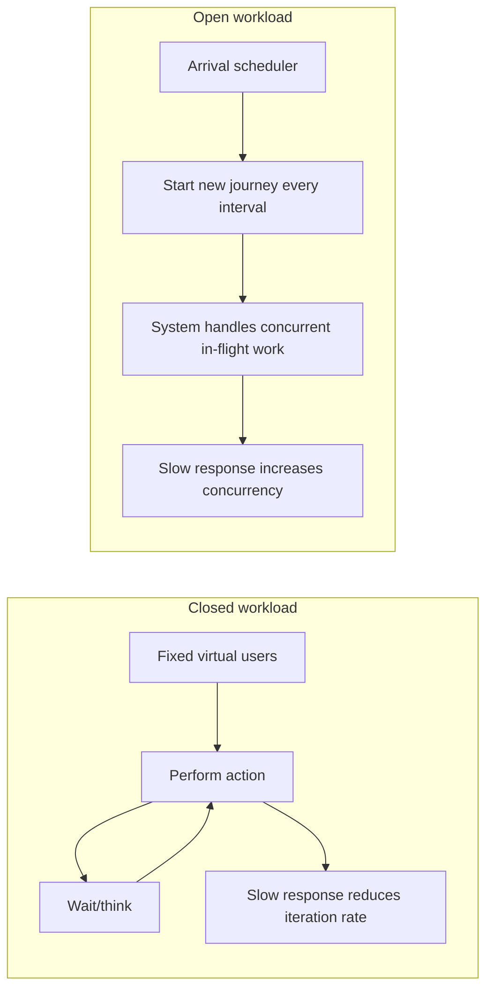
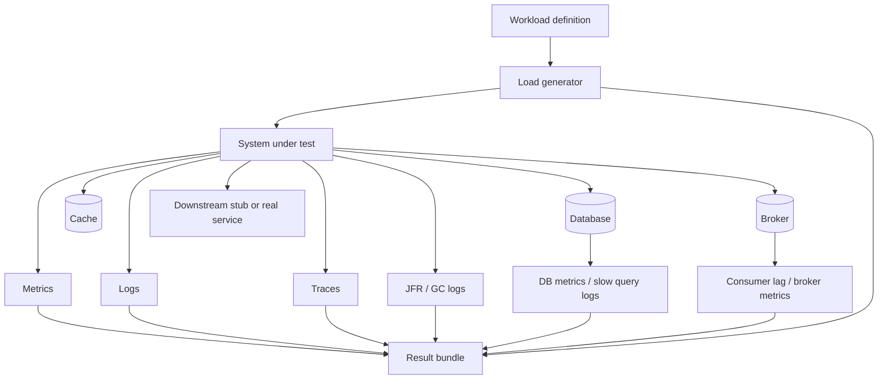
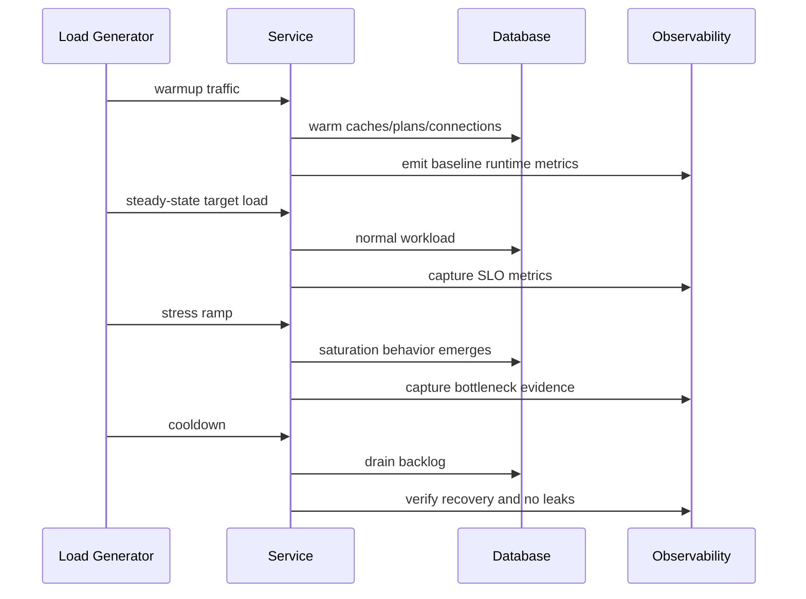
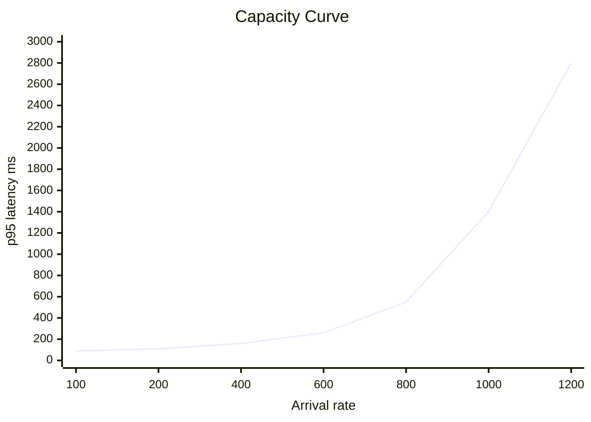
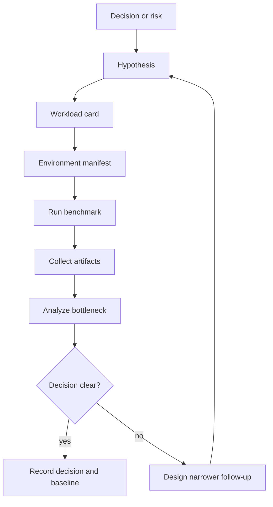

# Part 029 — Macrobenchmarking Services and Workloads

Microbenchmarks answer a narrow question:

> Is this code path faster under controlled conditions?

Macrobenchmarks answer a more dangerous question:

> Does this service behave acceptably under a workload that resembles the world it will face?

The second question is harder because a Java service is not just code. It is a running system shaped by:

- JVM warmup;
- heap size;
- garbage collector behavior;
- connection pools;
- thread pools;
- event loops;
- database locks;
- indexes;
- network latency;
- serialization;
- downstream services;
- retry policy;
- queue depth;
- cache hit ratio;
- data size;
- production traffic shape;
- deployment topology;
- observability overhead.

A macrobenchmark can be useful evidence.

It can also be expensive theater.

This part teaches how to design service-level performance experiments that produce defensible engineering decisions.

---

## 1. What macrobenchmarking is actually for

A macrobenchmark is not merely “running many requests.”

A useful macrobenchmark tests a hypothesis about a system under a defined workload.

Examples:

```text
Hypothesis A:
At 600 case submissions/minute, the case-intake service keeps p95 API latency below 350 ms,
keeps async validation lag below 10 seconds, and produces no duplicate lifecycle events.
```

```text
Hypothesis B:
Increasing JDBC pool size from 16 to 48 improves throughput for approval retrieval without
causing database saturation or worse p99 latency.
```

```text
Hypothesis C:
Switching from synchronous audit insert to outbox publishing reduces request latency without
weakening the audit-completeness invariant.
```

A bad macrobenchmark asks:

```text
How many users can the system handle?
```

A good macrobenchmark asks:

```text
For this traffic mix, data shape, deployment topology, and correctness expectation, where is
the first bottleneck, what fails first, and what margin do we have before SLO breach?
```

The difference is scope.

---

## 2. Macrobenchmark vs load test vs stress test vs capacity test

The terms overlap, but the distinction is useful.

| Experiment | Main question | Typical output |
|---|---|---|
| Macrobenchmark | How does a full service path perform under a representative workload? | Comparative evidence and bottleneck analysis |
| Load test | Does the system handle expected load? | SLO pass/fail at target traffic |
| Stress test | Where does the system break? | Saturation point and failure mode |
| Spike test | What happens when traffic rises suddenly? | Elasticity, queue growth, recovery behavior |
| Soak test | What happens over long duration? | leak, fragmentation, cache drift, connection exhaustion |
| Capacity test | How much safe headroom exists? | capacity curve and scaling plan |
| Resilience perf test | What happens under partial dependency failure? | degraded-mode latency/error behavior |

A mature team does not run one giant “performance test.”

It keeps a portfolio of experiments.

---

## 3. The benchmarkable service boundary

Before generating load, define the boundary.

Possible scopes:

| Scope | Includes | Excludes | Good for |
|---|---|---|---|
| Single process macrobenchmark | Java process, local fake dependencies | network, real DB | algorithmic service overhead |
| Service + real DB | Java process, real database | downstream services | transaction and query behavior |
| Service slice | API, DB, cache, broker | unrelated platform services | realistic bounded subsystem |
| Full environment E2E | gateway, service mesh, auth, DB, broker, dependencies | little | release confidence |
| Production canary | real production infra and traffic subset | controlled repeatability | final truth, risk-managed |

You should not start with the biggest scope.

Start with the smallest scope that can falsify the hypothesis.

Example:

```text
Hypothesis:
Case search p99 is high because JSON serialization is expensive.

Wrong first experiment:
Full E2E load test through gateway, auth, DB, cache, and UI.

Better first experiment:
Service + representative response corpus + JFR allocation profile.
Then service + DB if serialization is not the bottleneck.
```

Macrobenchmarking is not about realism at any cost. It is about enough realism to answer a decision.

---

## 4. The workload card

Every macrobenchmark should start with a workload card.

```yaml
title: Case Intake Baseline Load
system_under_test: case-intake-service
version: git:8f31a12
hypothesis: >
  The service can sustain 600 submissions/minute with p95 API latency < 350 ms,
  p99 < 900 ms, async validation lag < 10s, and zero duplicate case-created events.
traffic_model:
  model: open
  arrival_rate:
    warmup: 5m ramp 0 -> 300/min
    steady: 20m at 600/min
    spike: 2m at 1200/min
journey_mix:
  submit_valid_case: 70%
  submit_case_with_validation_warning: 15%
  submit_duplicate_idempotency_key: 5%
  submit_invalid_payload: 5%
  query_submission_status: 5%
data_shape:
  case_payload_size:
    p50: 6 KB
    p95: 90 KB
    p99: 350 KB
  involved_parties:
    p50: 2
    p95: 20
  attachments:
    excluded: true
correctness_expectations:
  - no duplicate case id
  - no missing audit record
  - invalid payload never creates case
  - duplicate idempotency key returns same logical result
metrics:
  api_latency: p50,p95,p99,max
  error_rate: by endpoint and by error class
  throughput: accepted submissions/minute
  async_lag: p50,p95,p99
  db: CPU, locks, active connections, slow queries
  jvm: heap, allocation rate, GC pause, threads
environment:
  replicas: 3
  cpu_per_replica: 2
  memory_per_replica: 2Gi
  jdk: 25
  gc: G1
  database: postgres 17 dedicated test instance
exit_criteria:
  pass:
    - p95 API latency < 350 ms during steady phase
    - p99 API latency < 900 ms during steady phase
    - error_rate < 0.1% excluding expected 4xx
    - duplicate_case_created_events = 0
  fail:
    - any correctness invariant violation
    - database CPU > 85% sustained for 5 minutes
    - validation lag p99 > 30s
artifacts:
  - raw load generator output
  - service metrics snapshot
  - JFR recording
  - GC logs
  - DB slow query log
  - deployment manifest
```

The workload card prevents two common failures:

1. Running a test with no decision to make.
2. Interpreting results after moving the goalposts.

---

## 5. Open vs closed workload models

This is one of the most important load-testing distinctions.

In a closed model, a fixed population of virtual users loops through work. If the system slows down, each user completes fewer iterations. The system naturally receives less arrival pressure.

In an open model, requests or user journeys arrive at a target rate independent of system response time. If the system slows down, concurrency grows.



Neither model is universally right.

Use a closed model when the real system has a bounded active population that waits before doing more work.

Examples:

- internal back-office users;
- finite call-center agents;
- batch workers with fixed worker count;
- bounded queue consumers.

Use an open model when arrivals are mostly independent of service latency.

Examples:

- public API traffic;
- webhook ingestion;
- payment callback handling;
- external partner file submissions;
- event streams where producers keep producing.

Many enterprise systems need a mixed model.

Example:

```text
- Public case submission API: open arrival model.
- Back-office reviewer actions: closed user model.
- Kafka validation workers: closed worker model over an open backlog.
```

If you choose the wrong model, you can hide the real failure mode.

Closed tests often hide queue collapse because arrival rate falls when response time rises.

Open tests expose queue growth but can overload a system unrealistically if arrival rates are not calibrated.

---

## 6. Arrival rate is not concurrency

A common mistake:

```text
We tested 1,000 users.
```

That number is nearly meaningless by itself.

You need:

```text
arrival rate × service time = concurrency
```

Little’s Law, used carefully, gives the intuition:

```text
L = λ × W
```

Where:

- `L` is average number of items in the system;
- `λ` is arrival rate;
- `W` is average time in the system.

If 100 requests/second arrive and average response time is 200 ms:

```text
concurrency ≈ 100 × 0.2 = 20 in-flight requests
```

If the same arrival rate experiences 2 seconds average response time:

```text
concurrency ≈ 100 × 2 = 200 in-flight requests
```

The arrival rate did not change.

The in-flight pressure changed by 10x.

That is why open workload tests are useful for finding collapse behavior.

---

## 7. A service-level benchmark architecture

A defensible macrobenchmark needs more than a load generator.



At minimum, capture:

| Layer | Evidence |
|---|---|
| Load generator | request rate, failed checks, latency distribution, generator CPU |
| API gateway | routing latency, errors, throttling |
| Java service | request latency, allocation rate, GC pause, thread pool utilization, connection pool wait |
| Database | CPU, IO, locks, slow queries, active sessions |
| Broker | publish latency, consumer lag, rebalance, dead letters |
| Cache | hit ratio, evictions, latency |
| Downstream | latency, error rate, timeout rate |
| Business correctness | invariant counters and reconciliation queries |

A benchmark without internal telemetry is a black-box complaint.

It tells you the system is slow.

It does not tell you why.

---

## 8. Correctness under load

Performance tests often make a fatal mistake:

```text
Status code 200 = success.
```

That is not enough.

A system can return 200 while corrupting data, duplicating events, dropping audit records, or weakening idempotency.

A service-level macrobenchmark should validate correctness under load.

Example checks:

| Endpoint/path | Performance check | Correctness check |
|---|---|---|
| Submit case | p95 latency, error rate | exactly one case per idempotency key |
| Approve case | p99 latency | illegal state transition rejected |
| Publish event | publish delay | no missing outbox event |
| Search cases | query latency | result set respects authorization filter |
| Bulk import | throughput | invalid rows quarantined, valid rows committed |

Load generators should run semantic checks where possible.

Example pseudo-check:

```javascript
check(res, {
  'accepted or expected duplicate': r => r.status === 201 || r.status === 200,
  'has caseId': r => JSON.parse(r.body).caseId !== undefined,
  'idempotency stable': r => stableResultForKey(key, JSON.parse(r.body).caseId)
});
```

That check is not enough for full correctness, but it catches obvious corruption while load is running.

After the run, execute reconciliation queries:

```sql
-- no duplicate case created for same idempotency key
select idempotency_key, count(*)
from case_submission
where benchmark_run_id = :run_id
group by idempotency_key
having count(*) > 1;

-- every created case has an audit record
select c.case_id
from case_file c
left join audit_event a
  on a.entity_id = c.case_id
 and a.event_type = 'CASE_CREATED'
where c.benchmark_run_id = :run_id
  and a.event_id is null;

-- no invalid payload created a case
select c.case_id
from case_file c
join benchmark_payload p on p.payload_id = c.source_payload_id
where p.expected_valid = false;
```

The strongest macrobenchmark treats correctness violation as an immediate failure, even if latency looks beautiful.

---

## 9. Workload realism: the five realism axes

A representative workload is not just “same request count as production.”

You need realism along five axes.

### 9.1 Traffic realism

Questions:

- What are the real arrival rates by endpoint?
- What is peak-to-average ratio?
- Are arrivals bursty?
- Are there cron/batch spikes?
- Are there partner-specific bursts?
- Is traffic diurnal?

Use production telemetry where possible.

Do not use uniform random traffic if production has hot keys and bursts.

### 9.2 Data realism

Questions:

- How large are payloads?
- How many child entities exist per aggregate?
- How skewed are tenants, users, accounts, or cases?
- Which records are old vs fresh?
- What is the cardinality of filter fields?
- How big are indexes?

Small test data hides index, cache, and memory problems.

A query that is fast on 10k rows may be unacceptable on 200 million rows.

### 9.3 Dependency realism

Questions:

- Is the database real?
- Are caches warm or cold?
- Are downstream services real, stubbed, or simulated?
- Does the broker have realistic partition count?
- Are network latencies realistic?
- Are TLS, auth, and service mesh included?

A stub that always returns in 1 ms can make the service look better than production.

A real unstable dependency can make benchmark results noisy and non-reproducible.

Choose deliberately.

### 9.4 Behavior realism

Questions:

- Do users retry?
- Are duplicate requests common?
- Do invalid requests happen?
- Are there cancellations?
- Are there long-running sessions?
- Do clients poll status?
- Do clients send requests in correlated bursts?

The error path is part of the workload.

A benchmark with only happy path traffic is a marketing demo.

### 9.5 State realism

Questions:

- Is the system empty at benchmark start?
- Is there existing backlog?
- Are caches warm?
- Are sequence values realistic?
- Are tables bloated?
- Are partitions aged?
- Are there long-running transactions?

An empty database is rarely representative.

A fresh environment with no historical state often hides production failure modes.

---

## 10. Designing the benchmark dataset

A benchmark dataset should be versioned like code.

At minimum, define:

```yaml
dataset:
  name: case-platform-scale-v3
  tenants: 200
  users: 50000
  cases:
    total: 20000000
    open: 2000000
    closed: 18000000
  case_age_distribution:
    last_7_days: 5%
    last_90_days: 20%
    older: 75%
  parties_per_case:
    p50: 2
    p95: 15
    p99: 80
  regulatory_flags:
    none: 80%
    simple: 15%
    complex: 5%
  indexes:
    same_as_production: true
  generated_by: benchmark-data-generator:1.8.0
  seed: 73491823
```

Rules:

1. The dataset must have a name and version.
2. Generation must be reproducible.
3. Shape must be documented.
4. Size must be large enough to trigger realistic plans, caches, and memory behavior.
5. Data must contain edge cases.
6. Sensitive production data should not be copied casually.

For enterprise systems, build a dedicated benchmark data generator.

Do not handcraft tiny fixtures.

---

## 11. Benchmark phases

A macrobenchmark usually has phases.



Typical phases:

| Phase | Purpose | Common duration |
|---|---|---|
| Environment sanity | verify deployment, data, metrics | 2-5 min |
| JVM warmup | allow JIT, caches, connection pools to stabilize | 5-20 min |
| Steady state | measure target workload | 15-60 min |
| Stress ramp | find saturation knee | 10-30 min |
| Spike | test burst handling | 1-10 min |
| Soak | detect long-term drift | hours |
| Cooldown | drain queues and observe recovery | 5-30 min |

Do not mix all questions into one run.

A steady-state SLO test and saturation-discovery stress test are different experiments.

---

## 12. JVM warmup in service benchmarks

JVM services have dynamic performance.

The first minutes can be shaped by:

- class loading;
- JIT compilation;
- tiered compilation;
- profile collection;
- cache warming;
- connection pool creation;
- lazy object mapper initialization;
- JPA/metamodel initialization;
- TLS session setup;
- database plan cache warming.

A service benchmark must separate warmup from measurement.

Bad result:

```text
p95 over whole 10-minute run: 780 ms
```

Better result:

```text
warmup 0-5m: p95 1.4s
steady 5-25m: p95 310 ms
stress 25-35m: p95 2.2s at 1,200/min
```

A single aggregate hides the story.

---

## 13. The load generator can become the bottleneck

A common false failure:

```text
The service p99 is terrible.
```

Actually:

```text
The load generator is CPU saturated and cannot schedule requests accurately.
```

Monitor the generator:

- CPU;
- memory;
- network throughput;
- DNS resolution;
- TLS overhead;
- connection reuse;
- request scheduling lag;
- dropped iterations;
- local GC if generator runs on JVM;
- time synchronization.

Rules:

1. Run the generator separately from the system under test.
2. Keep generator CPU comfortably below saturation.
3. Use multiple generators when needed.
4. Verify the actual achieved arrival rate.
5. Capture generator-side errors separately from service errors.
6. Prefer a generator model that matches the workload hypothesis.

A benchmark cannot prove service capacity beyond generator capacity.

---

## 14. Choosing Gatling, k6, JMeter, or custom harness

Tool choice matters less than experiment design, but tools have different strengths.

| Tool style | Strength | Watch out |
|---|---|---|
| Gatling | code-driven scenarios, strong HTTP load testing, JVM ecosystem options | generator JVM must be sized/monitored |
| k6 | developer-friendly JavaScript, open/closed executors, thresholds, good CI ergonomics | JS scenario code can become its own abstraction trap |
| JMeter | broad protocol support, mature ecosystem | GUI-era test plans can become hard to review |
| Custom Java harness | domain-specific protocol/control, deep correctness checks | easy to build a biased generator |
| Production replay | realistic traffic shape | privacy, safety, determinism, repeatability |

For Java service teams, two common patterns work well:

1. Use k6/Gatling for HTTP-level workload generation.
2. Use Java/JUnit/Testcontainers/JMH/JFR for local and component-level evidence.

Do not force one tool to answer every question.

---

## 15. Service benchmark assertions

A macrobenchmark should have acceptance criteria.

Examples:

```text
Performance acceptance:
- steady-state p95 POST /cases < 350 ms
- steady-state p99 POST /cases < 900 ms
- status polling p95 < 120 ms
- validation lag p95 < 5 s
- validation lag p99 < 15 s

Reliability acceptance:
- 5xx rate < 0.1%
- timeout rate < 0.05%
- no sustained connection-pool starvation

Correctness acceptance:
- duplicate_case_created_count = 0
- missing_audit_event_count = 0
- illegal_transition_count = 0
- invalid_payload_created_case_count = 0

Resource acceptance:
- service CPU < 75% during steady state
- database CPU < 80% during steady state
- heap occupancy returns to baseline after GC
- GC pause p99 < 100 ms
```

Assertions should include both:

- load-generator-visible outcomes;
- system-internal outcomes.

HTTP response time alone is too shallow.

---

## 16. Percentiles and why averages lie

Average latency is almost never enough.

Example:

| Request count | Latency |
|---:|---:|
| 9,900 | 100 ms |
| 100 | 10,000 ms |

Average:

```text
(9900*100 + 100*10000) / 10000 = 199 ms
```

The average looks fine.

But 1% of users wait 10 seconds.

Use:

- p50 for typical experience;
- p90/p95 for normal tail;
- p99/p99.9 for severe tail;
- max carefully, because it is noisy but useful for diagnostics;
- error rate by class;
- queue lag;
- saturation metrics.

Do not compare percentiles without checking sample size and phase boundaries.

A p99 over 500 requests is weak evidence.

A p99 over 5 million requests is stronger, but only if the workload is representative and measurement is valid.

---

## 17. Coordinated omission in service tests

Coordinated omission happens when the measurement process stops sending or measuring work while the system is stalled, causing latency to look better than reality.

Example:

```text
A closed-loop test sends request, waits for response, then sends next request.
The service stalls for 5 seconds.
During that stall, the client sends no new requests.
The measured latency captures one slow request, but misses the waiting time that real arrivals would have experienced.
```

Open-model arrival tests help expose this.

But open-model tests also require careful safety controls because they can overload the system aggressively.

When interpreting results, ask:

1. Did the generator maintain target arrival rate during stalls?
2. Did it queue scheduled iterations locally?
3. Did it drop iterations?
4. Does reported latency include time spent waiting to be scheduled?
5. Does the tool expose scheduling delay?
6. Are response-time percentiles corrected or raw?

Tail latency without measurement model is not a fact.

It is a number.

---

## 18. Capacity curve and saturation knee

Capacity is not a single number.

It is a curve.



The important point is the knee.

Before the knee, adding load increases latency gradually.

After the knee, small load increases produce large latency increases.

A good capacity test identifies:

- target operating zone;
- safe headroom;
- saturation knee;
- first saturated resource;
- failure behavior;
- recovery behavior.

Example conclusion:

```text
The service meets SLO up to 650 submissions/minute.
The knee begins around 800/minute when DB CPU exceeds 85% and connection-pool wait time rises.
At 1,000/minute, async validation lag grows without recovery.
Safe capacity should be treated as 600/minute unless DB indexing and validation batching are improved.
```

That is actionable.

```text
The system handled 1,000 users.
```

That is not.

---

## 19. Resource bottleneck taxonomy

When the benchmark fails, classify the bottleneck.

| Bottleneck | Evidence | Typical fix |
|---|---|---|
| CPU bound Java code | high service CPU, CPU flamegraph hotspot | algorithm, allocation, batching, caching |
| Allocation/GC bound | high allocation rate, frequent GC, pause tail | reduce allocation, object reuse carefully, data representation |
| DB CPU bound | high DB CPU, slow queries | index, query rewrite, denormalization, batching |
| DB lock bound | lock waits, deadlocks, transaction latency | shorter transactions, lock ordering, optimistic concurrency |
| Connection pool bound | high pending acquisitions, low DB CPU | pool sizing, blocking call reduction, timeout tuning |
| Thread pool bound | queue depth, active threads maxed | sizing, isolation, backpressure |
| Network bound | high RTT, retransmits, bandwidth | payload reduction, compression, locality |
| Downstream bound | timeout/retry rate | circuit breaker, fallback, async decoupling |
| Broker bound | publish latency, consumer lag | partitioning, batch size, consumer scaling |
| Cache bound | low hit ratio, evictions | key design, TTL, warming, memory sizing |

Do not tune before identifying the bottleneck.

Performance tuning without diagnosis is superstition.

---

## 20. Java service instrumentation for macrobenchmarks

Add benchmark-friendly observability.

At minimum:

```java
public final class PerformanceTags {
    public static final String BENCHMARK_RUN_ID = "benchmark.run.id";
    public static final String JOURNEY = "benchmark.journey";
    public static final String PAYLOAD_CLASS = "benchmark.payload.class";
}
```

Attach tags to metrics and logs carefully.

Example Micrometer-style metrics:

```java
Timer.builder("case.submit.latency")
    .tag("journey", journey)
    .tag("payloadClass", payloadClass)
    .register(meterRegistry)
    .record(() -> submitCase(command));
```

But avoid high-cardinality explosion.

Do not tag metrics with raw case ID, idempotency key, user ID, or request ID.

Use logs/traces for high-cardinality correlation.

Use metrics for aggregated signal.

Useful service metrics:

| Metric | Why it matters |
|---|---|
| request latency by endpoint | user-facing SLO |
| error rate by class | distinguish expected invalid input vs system failure |
| connection pool wait | DB pressure before DB CPU is saturated |
| executor queue depth | backpressure signal |
| async processing lag | hidden latency outside API response |
| outbox unpublished count | durability and downstream pressure |
| allocation rate | GC pressure |
| GC pause | tail latency contributor |
| lock wait | concurrency bottleneck |
| retry count | failure amplification |

Benchmark-only metrics are fine if they are guarded and low-cardinality.

---

## 21. JFR in macrobenchmarks

JFR is useful during service benchmarks because it captures runtime events without turning the benchmark into a debugger session.

Capture:

- allocation hotspots;
- CPU method samples;
- lock contention;
- socket reads/writes;
- file IO;
- GC pauses;
- thread park events;
- exceptions;
- class loading;
- safepoints.

Example run approach:

```bash
java \
  -XX:StartFlightRecording=filename=case-intake-${RUN_ID}.jfr,duration=30m,settings=profile \
  -Xlog:gc*:file=gc-${RUN_ID}.log:tags,uptime,time,level \
  -jar case-intake-service.jar
```

For long runs, use continuous recording or time-windowed recordings around interesting phases.

Do not only capture JFR when the system is already burning.

Capture baseline and failure windows so you can compare.

---

## 22. Database realism and query evidence

For Java services, the database is often the real system.

Capture:

- slow query log;
- query plans for hot statements;
- CPU/IO utilization;
- locks and waits;
- active sessions;
- connection pool usage;
- transaction duration;
- deadlocks;
- index hit ratio;
- table/index bloat where relevant.

Benchmark questions:

1. Are query plans stable under benchmark data size?
2. Do prepared statements use good plans for skewed parameters?
3. Are indexes realistic?
4. Does pagination degrade with offset size?
5. Are transactions holding locks during remote calls?
6. Does batch size improve throughput or cause lock spikes?
7. Are connection pools hiding DB saturation or causing queueing inside Java?

Do not celebrate Java optimization while the database is melting.

---

## 23. Dependency simulation: fake, stub, or real?

Downstream dependency choice is a modeling decision.

| Choice | Use when | Risk |
|---|---|---|
| Fake in-process | measuring local service logic | hides network and serialization |
| Stub HTTP service | need controllable latency/errors | may oversimplify downstream behavior |
| Real dependency test env | need integration realism | noisy, costly, harder to reproduce |
| Production shadow/canary | need final confidence | operational risk, limited control |

A good downstream simulator supports:

- latency distribution, not fixed sleep;
- error rate by endpoint;
- timeout behavior;
- payload-size effects;
- rate limits;
- partial outage;
- correlation IDs;
- deterministic scripted scenarios.

Example simulator config:

```yaml
downstream_profile:
  identity-service:
    p50_latency_ms: 20
    p95_latency_ms: 120
    p99_latency_ms: 800
    error_rate: 0.2%
    timeout_rate: 0.05%
  document-service:
    p50_latency_ms: 80
    p95_latency_ms: 900
    p99_latency_ms: 3000
    error_rate: 1.0%
```

A dependency that always succeeds instantly is not a dependency.

It is a lie.

---

## 24. Retry amplification

Retries can turn a small failure into a self-inflicted outage.

Example:

```text
Base traffic: 500 requests/second
Downstream timeout rate: 10%
Each failed request retries up to 3 times immediately
```

Worst-case downstream attempt rate can jump dramatically.

During benchmark, measure:

- original request rate;
- downstream attempt rate;
- retry count;
- retry delay distribution;
- retry success rate;
- timeout rate;
- circuit breaker open events;
- queue depth.

Model retry traffic separately.

Acceptance criteria should include retry amplification limits:

```text
During 10% downstream timeout injection:
- customer-facing 5xx remains < 2%
- downstream attempt rate does not exceed 1.4x baseline
- circuit breaker opens within 30s
- service recovers within 2m after dependency recovery
```

Performance engineering and resilience engineering are not separate topics.

---

## 25. Cache benchmark traps

Cache can make macrobenchmarks look falsely good.

Questions:

1. Is the cache cold, warm, or production-shaped?
2. What is the hit ratio during the run?
3. Are keys realistic?
4. Is the hot-key distribution realistic?
5. Does the benchmark accidentally reuse too few keys?
6. Are TTLs realistic?
7. Are invalidation events included?
8. Does cache memory fill over time?
9. Does cache stampede occur on miss?

Bad benchmark:

```text
All virtual users query one of 20 case IDs.
Cache hit ratio becomes 99.9%.
Search looks extremely fast.
```

Better benchmark:

```text
Key distribution follows production:
- 5% very hot cases;
- 20% warm cases;
- 75% cold/rare cases;
- includes tenant-specific skew;
- includes cache invalidation after updates.
```

Cache benchmarks must model access distribution.

---

## 26. Async workloads and hidden latency

Many Java services respond quickly by moving work to queues.

That can be good architecture.

It can also hide user-visible failure.

Example:

```text
POST /cases returns in 80 ms.
Validation event is processed 12 minutes later.
The API benchmark looks excellent.
The business process is broken.
```

For async systems, measure:

- enqueue latency;
- publish success;
- broker lag;
- consumer lag;
- time from command accepted to business completion;
- retry/dead-letter count;
- outbox age;
- compensation count;
- duplicate message rate;
- ordering violations.

Define end-to-end business latency:

```text
case_submission_business_latency = time(CASE_VALIDATED or CASE_REJECTED) - time(command accepted)
```

Use that as a first-class metric.

API latency alone is insufficient.

---

## 27. Benchmarking event-driven Java services

For event-driven workloads, the load generator may be a producer, not an HTTP client.

Workload dimensions:

| Dimension | Example |
|---|---|
| Topic/queue | case-submitted |
| Partition count | 24 |
| Key distribution | tenantId + caseId, skewed |
| Message size | p50 4 KB, p99 200 KB |
| Arrival model | open at 2,000 events/sec |
| Consumer group size | 12 instances |
| Processing outcome | success, retry, dead-letter |
| Ordering expectation | per case ID |
| Duplicate rate | 0.5% |

Correctness checks:

```sql
-- no event processed twice as final side effect
select event_id, count(*)
from processed_event_effect
where benchmark_run_id = :run_id
group by event_id
having count(*) > 1;

-- no missing terminal outcome for accepted event
select e.event_id
from benchmark_input_event e
left join event_processing_result r on r.event_id = e.event_id
where e.benchmark_run_id = :run_id
  and r.event_id is null;
```

Metrics:

- consumer lag;
- processing latency;
- handler duration;
- retry count;
- dead-letter count;
- partition skew;
- rebalance events;
- DB write latency;
- external call latency;
- idempotency conflict count.

Event-driven performance is usually about lag and recovery, not just per-message speed.

---

## 28. Environment invariants

A benchmark environment must be documented.

Environment manifest:

```yaml
environment:
  cluster: perf-east-1
  kubernetes_version: 1.33.x
  node_type: c7i.2xlarge
  region: us-east-1
  service_mesh: enabled
  replicas: 3
  cpu_limit: "2"
  memory_limit: 2Gi
  jdk: 25.0.1
  jvm_flags:
    - -XX:+UseG1GC
    - -Xms1536m
    - -Xmx1536m
  image: case-intake:8f31a12
  database:
    engine: postgres
    version: "17"
    instance_class: dedicated-perf-large
  schema_version: 2026.07.03.4
  dataset: case-platform-scale-v3
  load_generator:
    tool: k6
    version: 1.x
    workers: 4
```

If you cannot reproduce the environment, you cannot trust trend comparisons.

Important invariants:

- same instance class;
- same CPU limit/request;
- same heap flags;
- same JDK;
- same container image;
- same dataset version;
- same database version/config;
- same indexes;
- same load generator version;
- same network topology;
- same feature flags.

Performance is sensitive to context.

Treat context as part of the experiment.

---

## 29. Kubernetes/container benchmark traps

For Java services in containers, watch for:

- CPU throttling;
- memory limits and heap sizing;
- noisy neighbors;
- pod rescheduling;
- autoscaling during measurement;
- service mesh overhead;
- DNS latency;
- connection reuse across pod restarts;
- cold starts;
- node-level IO contention;
- observability sidecar overhead.

Benchmark rule:

```text
Disable uncontrolled autoscaling during measurement unless autoscaling behavior is the thing being tested.
```

If autoscaling is included, define:

- scaling policy;
- warmup period;
- expected scale-out time;
- allowed transient SLO breach;
- recovery expectation;
- cost/resource impact.

Autoscaling can hide a bottleneck or create a new one.

---

## 30. Interpreting a macrobenchmark result

A good result summary has this shape:

```md
## Benchmark Summary

### Hypothesis
The service can sustain 600 case submissions/minute with p95 API latency < 350 ms and validation lag p99 < 15s.

### Result
Partially passed.

### Evidence
- API p95 during steady state: 290 ms
- API p99 during steady state: 870 ms
- 5xx rate: 0.03%
- validation lag p99: 42s after minute 18
- DB CPU: 78-92%
- consumer lag: grows from 0 to 180k messages during steady phase
- duplicate case events: 0
- missing audit events: 0

### Bottleneck
Validation consumer throughput is limited by document-service p95 latency and synchronous DB update per validation result.

### Decision
API path is acceptable at 600/minute only if validation lag SLO is relaxed or validation consumer capacity is improved.

### Next experiment
Benchmark validation worker with:
- batch status updates;
- 2x consumer replicas;
- downstream timeout profile unchanged.
```

Notice the conclusion does not say “the system is fast.”

It says what passed, what failed, why, and what to do next.

---

## 31. Performance experiment design loop



Do not run performance tests as rituals.

Run experiments.

---

## 32. Case study: case-intake service

Imagine this service path:

```text
POST /cases
  -> validate request
  -> check idempotency key
  -> insert case
  -> insert audit event
  -> insert outbox event
  -> return case ID

Async worker:
  -> reads outbox
  -> publishes CASE_CREATED
  -> validation service consumes event
  -> enriches case
  -> updates lifecycle state
```

Initial benchmark:

```text
Target: 600 submissions/minute
Result:
- API p95: 410 ms, fail
- API p99: 1.8s, fail
- 5xx: 0.01%, pass
- duplicate cases: 0, pass
- missing audit: 0, pass
- DB CPU: 65%, not saturated
- connection pool pending: high
- service CPU: 45%
- JFR: many threads parked waiting for connection
```

Naive conclusion:

```text
Increase database size.
```

Better conclusion:

```text
The database is not CPU saturated. Java connection pool wait is high because transactions are held while synchronous audit serialization and idempotency lookup occur under the same transaction. Reduce transaction scope and inspect pool sizing before increasing database capacity.
```

Follow-up experiment:

```text
Change:
- move large audit serialization outside transaction;
- keep atomic audit insert inside transaction;
- pool size unchanged.

Result:
- API p95: 260 ms
- p99: 720 ms
- connection wait: near zero
- correctness invariants: pass
```

Decision:

```text
Accept transaction-scope refactor. No database scale-up needed.
```

Macrobenchmarking is valuable when it prevents expensive wrong fixes.

---

## 33. Common anti-patterns

### 33.1 Testing only the happy path

Production includes invalid inputs, duplicates, retries, and partial failure.

### 33.2 Reporting only average latency

Average hides tail pain.

### 33.3 Ignoring correctness

Fast corruption is still corruption.

### 33.4 Running against tiny data

Tiny data hides query and memory behavior.

### 33.5 Using closed workload for open-arrival systems

This can hide collapse.

### 33.6 Letting the load generator saturate

Then you are benchmarking the generator.

### 33.7 Mixing warmup and measurement

Then you do not know what you measured.

### 33.8 Changing environment between runs

Then comparisons are weak.

### 33.9 Tuning multiple things at once

Then attribution is unclear.

### 33.10 Treating pass/fail thresholds as understanding

Thresholds tell you whether you passed.

They do not explain why.

---

## 34. Macrobenchmark review checklist

Before run:

- [ ] Hypothesis is written.
- [ ] Workload card exists.
- [ ] Environment manifest exists.
- [ ] Dataset version is known.
- [ ] Traffic model is justified.
- [ ] Journey mix is realistic.
- [ ] Correctness checks are defined.
- [ ] Observability is ready.
- [ ] Load generator capacity is verified.
- [ ] Warmup and measurement phases are separated.
- [ ] Exit criteria are agreed before run.

During run:

- [ ] Achieved arrival rate matches target.
- [ ] Generator is not saturated.
- [ ] Service metrics are flowing.
- [ ] DB metrics are flowing.
- [ ] Error rate is classified.
- [ ] Queue/lag metrics are monitored.
- [ ] Correctness sentinel metrics are monitored.

After run:

- [ ] Reconciliation queries pass.
- [ ] Artifacts are saved.
- [ ] Phase-specific percentiles are reported.
- [ ] Bottleneck is identified or uncertainty is stated.
- [ ] Decision is recorded.
- [ ] Follow-up experiment is defined if needed.

---

## 35. The mental model

Macrobenchmarking is not about making a chart.

It is about turning a performance risk into evidence.

The sequence is:

```text
risk -> hypothesis -> workload -> controlled run -> telemetry -> bottleneck -> decision
```

A top-tier engineer does not ask:

```text
Did the benchmark pass?
```

They ask:

```text
What did this benchmark prove, what did it fail to prove, what context does it depend on,
and what decision can we safely make from it?
```

That is the difference between load testing and performance engineering.

---

## References

- OpenJDK JMH project: https://openjdk.org/projects/code-tools/jmh/
- k6 open and closed models: https://grafana.com/docs/k6/latest/using-k6/scenarios/concepts/open-vs-closed/
- k6 constant arrival rate executor: https://grafana.com/docs/k6/latest/using-k6/scenarios/executors/constant-arrival-rate/
- k6 thresholds: https://grafana.com/docs/k6/latest/using-k6/thresholds/
- Gatling load testing concepts: https://docs.gatling.io/testing-concepts/
- Gatling assertions: https://docs.gatling.io/concepts/assertions/
