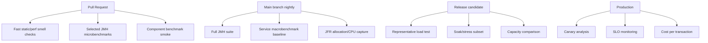
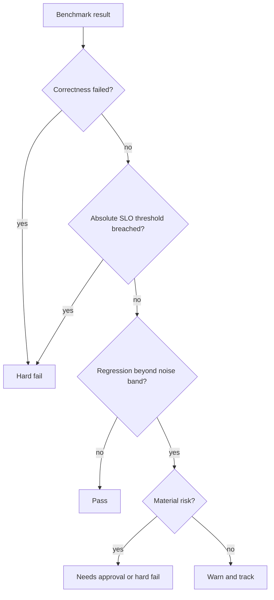
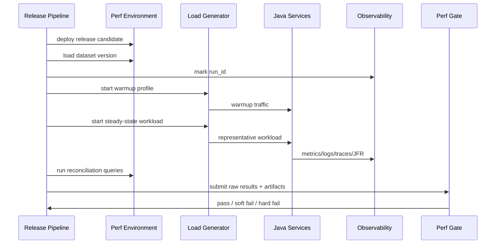
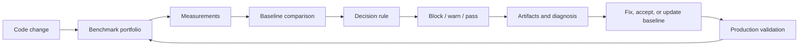

# Part 030 — Performance Regression Testing in CI

Correctness CI asks:

> Did the behavior break?

Performance CI asks:

> Did the cost of the behavior change enough to matter?

That cost may be:

- latency;
- throughput;
- allocation rate;
- CPU time;
- memory footprint;
- GC pause;
- query count;
- lock wait;
- queue lag;
- startup time;
- warmup time;
- binary size;
- network payload size;
- cloud cost per request.

Performance regression testing is hard because performance is noisy.

A functional test usually has a crisp result:

```text
expected: APPROVED
actual: REJECTED
```

A performance test usually has a distribution:

```text
baseline p95: 22.4 ms
candidate p95: 25.1 ms
observed delta: +12.1%
noise band: ±6%
```

The engineering question is not “is the number different?”

The question is:

> Is the difference real, material, reproducible, and relevant enough to block or investigate?

This part teaches how to build CI performance gates that are useful rather than annoying.

---

## 1. What counts as a performance regression?

A regression is a material negative change in an agreed performance signal under comparable conditions.

Examples:

| Signal | Regression example |
|---|---|
| Latency | p95 increased from 120 ms to 170 ms under same workload |
| Throughput | max sustainable throughput dropped by 20% |
| Allocation | bytes/op increased from 1.2 KB to 4.8 KB |
| GC | p99 pause increased beyond SLO budget |
| Query count | endpoint now issues 80 queries instead of 5 |
| CPU | CPU/request increased by 30% |
| Startup | app startup increased from 8s to 19s |
| Queue lag | async processing cannot drain target load |
| Payload size | response grew from 40 KB to 400 KB |

Not every slowdown is worth blocking.

A useful performance gate distinguishes:

- measurement noise;
- acceptable trade-off;
- local regression;
- system regression;
- SLO-risking regression;
- correctness-preserving but cost-increasing change;
- correctness fix that intentionally costs more.

Performance CI should force explicit trade-off discussion.

It should not pretend all performance deltas are equal.

---

## 2. Performance CI cannot be one test

Use a portfolio.



Different stages answer different questions.

| Stage | Goal | Gate style |
|---|---|---|
| PR fast path | catch obvious regressions early | lightweight warning/block for severe deltas |
| PR targeted | benchmark changed hot paths | selective, owner-reviewed |
| Main nightly | detect trends with lower pressure | alert and issue creation |
| Release candidate | validate service workload | formal pass/fail |
| Production canary | validate real environment | automated rollback or human approval |

Trying to run every performance test on every PR will usually fail socially and technically.

The suite becomes slow, noisy, and ignored.

---

## 3. Decide what belongs in PR CI

PR CI should include performance checks only when they are:

- fast enough;
- stable enough;
- relevant to changed code;
- diagnosable when they fail;
- cheap enough to run frequently.

Good PR candidates:

- JMH benchmarks for critical algorithms;
- serialization/deserialization benchmarks;
- allocation-sensitive parsers;
- SQL query count tests;
- startup smoke benchmarks;
- small service benchmark with fake/local dependencies;
- payload-size regression check;
- dependency graph/classpath size check;
- targeted benchmark selected by path ownership.

Poor PR candidates:

- 4-hour soak tests;
- full production-like load tests;
- noisy cloud environment capacity tests;
- benchmarks that require manual interpretation every run;
- tests that fail frequently without actionable output.

Put expensive tests in nightly, release, or scheduled pipelines.

PR performance CI should be sharp, not huge.

---

## 4. Benchmark inventory

Create a benchmark registry.

```yaml
benchmarks:
  - id: case-id-normalizer-jmh
    type: jmh
    owner: platform/case-core
    risk: allocation-regression
    command: ./mvnw -pl benchmarks -Dbenchmark=CaseIdNormalizerBenchmark verify
    expected_runtime: 2m
    gate:
      bytes_per_op: max +10%
      score: max +8%
    trigger_paths:
      - case-core/src/main/java/com/acme/caseid/**
      - benchmarks/src/jmh/java/com/acme/caseid/**

  - id: case-submit-component-smoke
    type: component-benchmark
    owner: platform/case-intake
    risk: api-latency-regression
    command: ./ci/perf/case-submit-smoke.sh
    expected_runtime: 6m
    gate:
      p95_latency_ms: max 250
      error_rate: max 0.1%
    trigger_paths:
      - case-intake/**
      - case-domain/**

  - id: nightly-case-intake-load
    type: macrobenchmark
    owner: platform/performance
    risk: service-capacity-regression
    schedule: nightly
    gate:
      p95_latency_delta: max +10%
      validation_lag_delta: max +15%
```

A registry makes performance CI governable.

Without inventory, tests become tribal knowledge.

---

## 5. Baseline strategy

A performance gate needs a baseline.

Common baselines:

| Baseline | Use when | Risk |
|---|---|---|
| Fixed absolute threshold | SLO or hard requirement exists | may miss slow drift below threshold |
| Previous main branch | PR regression detection | noisy if baseline run is bad |
| Rolling median | trend stability | can normalize gradual degradation |
| Last release | release readiness | less sensitive to small PR changes |
| Golden environment capacity | capacity planning | expensive and slower feedback |

Best practice is often layered:

```text
Gate 1: absolute safety threshold.
Gate 2: relative regression vs recent baseline.
Gate 3: trend alert over time.
```

Example:

```yaml
gates:
  absolute:
    p95_latency_ms: "< 350"
    error_rate: "< 0.1%"
  relative:
    p95_latency_delta_vs_main: "< +10%"
    allocation_delta_vs_main: "< +15%"
  trend:
    seven_day_median_delta: "warn if +8%"
```

Absolute thresholds protect users.

Relative thresholds catch regressions before users notice.

Trend thresholds catch slow decay.

---

## 6. Noise model

Performance measurements vary because of:

- CPU frequency scaling;
- OS scheduler noise;
- background processes;
- cloud noisy neighbors;
- JIT compilation timing;
- GC timing;
- thermal throttling;
- network jitter;
- dependency jitter;
- database cache state;
- data distribution;
- test order;
- runner image changes;
- kernel changes;
- JVM version changes.

You cannot eliminate all noise.

You can reduce, measure, and account for it.

Noise control checklist:

- [ ] Pin JDK version.
- [ ] Pin benchmark tool version.
- [ ] Record OS/kernel/runner image.
- [ ] Run on dedicated or larger runners for important gates.
- [ ] Separate benchmark runner from load generator where applicable.
- [ ] Warm up before measurement.
- [ ] Use forks/repetitions for JMH.
- [ ] Avoid running unrelated heavy jobs on same machine.
- [ ] Disable uncontrolled autoscaling for benchmark environment.
- [ ] Use fixed dataset version.
- [ ] Store raw results, not only summary.
- [ ] Compare distributions, not just one number.

Noise is not an excuse to avoid performance CI.

It is a design constraint.

---

## 7. The three-level gate model

A practical CI gate should classify results.



Gate levels:

| Level | Meaning | Action |
|---|---|---|
| Hard fail | correctness violation or severe SLO breach | block |
| Soft fail | likely regression but may be accepted trade-off | require owner approval |
| Warning | measurable but low-risk drift | track trend |
| Pass | no material issue | continue |

This avoids two extremes:

- blocking every tiny noisy delta;
- ignoring performance until production hurts.

---

## 8. Statistical thinking without overcomplication

You do not need a PhD to improve performance gates.

You need humility about variance.

Bad gate:

```text
candidate score must be <= baseline score
```

This fails randomly.

Better gate:

```text
candidate median must not exceed baseline median by more than 8%,
and candidate p95 must not exceed baseline p95 by more than 12%,
using at least 5 measurement iterations.
```

Better still:

```text
Run baseline and candidate in same CI job when possible.
Alternate order or randomize order to reduce temporal bias.
Compare median and confidence interval.
Require repeated failure before blocking if signal is near threshold.
```

Simple robust approach:

1. Run baseline build and candidate build on same runner class.
2. Perform warmup.
3. Collect multiple samples.
4. Use median as central signal.
5. Use p95/p99 for tail-sensitive checks.
6. Ignore deltas below historical noise band.
7. Block only when delta is material and reproducible.

The goal is not perfect statistics.

The goal is fewer false alarms and fewer missed regressions.

---

## 9. JMH in CI

JMH can run in CI, but it needs care.

Recommended JMH CI practices:

- keep benchmarks in a dedicated module;
- package benchmarks as a standalone jar;
- pin JDK and JVM flags;
- use forks;
- use enough warmup/measurement iterations;
- export JSON results;
- include GC/allocation profilers where useful;
- compare against stored baseline;
- avoid IDE-based runs for official results;
- do not run all benchmarks on every PR;
- classify benchmarks by runtime and stability.

Example Maven structure:

```text
repo/
  case-core/
  case-intake/
  benchmarks/
    pom.xml
    src/jmh/java/
      com/acme/caseid/CaseIdNormalizerBenchmark.java
      com/acme/json/CasePayloadSerializationBenchmark.java
```

Example JMH command:

```bash
java -jar benchmarks/target/benchmarks.jar \
  '.*CasePayloadSerializationBenchmark.*' \
  -wi 5 \
  -i 10 \
  -f 3 \
  -rf json \
  -rff build/perf/jmh-case-payload.json
```

For allocation-sensitive checks:

```bash
java -jar benchmarks/target/benchmarks.jar \
  '.*CasePayloadSerializationBenchmark.*' \
  -prof gc \
  -rf json \
  -rff build/perf/jmh-case-payload-gc.json
```

What to gate:

| JMH signal | Good for |
|---|---|
| score | throughput/latency style microbenchmarks |
| score error | measurement uncertainty |
| allocation rate | parser/serializer hot paths |
| GC count/time | allocation-heavy regressions |
| parameter-specific result | data-size sensitivity |

Do not compare one noisy JMH number blindly.

Store and compare structured results.

---

## 10. Example JMH regression comparator

A simple comparator can be enough.

```java
public final class PerfGate {
    public Decision compare(BenchmarkMetric baseline, BenchmarkMetric candidate, Gate gate) {
        double delta = (candidate.median() - baseline.median()) / baseline.median();

        if (candidate.correctnessFailed()) {
            return Decision.hardFail("Correctness failed during benchmark");
        }

        if (candidate.value() > gate.absoluteMax()) {
            return Decision.hardFail("Absolute performance threshold breached");
        }

        if (Math.abs(delta) <= gate.noiseBand()) {
            return Decision.pass("Delta inside historical noise band");
        }

        if (delta > gate.hardRegressionThreshold()) {
            return Decision.hardFail("Material regression: " + percent(delta));
        }

        if (delta > gate.warningThreshold()) {
            return Decision.warn("Possible regression: " + percent(delta));
        }

        return Decision.pass("No regression");
    }
}
```

This is not statistically perfect.

But it encodes a better policy than “number got worse.”

---

## 11. Component performance tests in CI

Some regressions do not show up in JMH because they involve framework wiring, serialization, database interaction, or HTTP stack behavior.

Use component performance tests for bounded service paths.

Example:

```text
Start service with Testcontainers PostgreSQL.
Load dataset with 100k representative cases.
Run 2-minute warmup.
Run 5-minute local HTTP workload.
Assert:
- p95 < 250 ms;
- error_rate = 0;
- duplicate count = 0;
- query count per request < 8;
- allocation rate does not exceed baseline by > 15%.
```

This is not a replacement for full macrobenchmarking.

It catches regressions earlier.

Component benchmark scope:

| Include | Exclude |
|---|---|
| real service process | production gateway |
| real database container | full cloud network |
| realistic dataset subset | all downstream services |
| HTTP client | global load balancer |
| correctness reconciliation | long soak behavior |

Use it as a fast smoke alarm.

---

## 12. Macrobenchmark gates in CI/CD

Full service benchmarks usually belong in nightly or release pipelines.

Example gate:

```yaml
release_performance_gate:
  workload: case-intake-baseline-v4
  duration: 45m
  compare_to: last_release
  hard_fail:
    - duplicate_case_created_count > 0
    - missing_audit_event_count > 0
    - steady_state_5xx_rate > 0.1%
    - steady_state_p95_latency_ms > 350
    - validation_lag_p99_seconds > 15
  soft_fail:
    - steady_state_p95_latency_delta > +10%
    - db_cpu_delta > +15%
    - allocation_rate_delta > +20%
  artifacts_required:
    - load_generator_raw.json
    - service_metrics_snapshot.json
    - jfr_recording.jfr
    - gc.log
    - db_slow_queries.log
    - environment_manifest.yaml
```

The key is that correctness invariants are part of the performance gate.

A release candidate that is fast but duplicates cases must fail.

---

## 13. Thresholds are policy, not science

A threshold is a decision rule.

Example:

```text
p95 < 350 ms
```

That threshold may come from:

- user experience requirement;
- SLO budget;
- downstream timeout budget;
- capacity plan;
- cost constraint;
- regulatory processing deadline;
- previous release baseline;
- product promise.

Document why the threshold exists.

Bad threshold:

```text
p95 must be < 100 ms because it sounds good.
```

Good threshold:

```text
p95 POST /cases must be < 350 ms because the gateway timeout budget is 2s,
case-intake owns 500 ms of that budget, and downstream validation is async.
```

Thresholds without rationale decay into folklore.

---

## 14. CI artifact contract

Every performance CI run should produce artifacts.

Minimum artifact set:

```text
perf-run/
  metadata.yaml
  environment.yaml
  git.txt
  jdk.txt
  benchmark-tool-version.txt
  raw-results/
    jmh.json
    k6-summary.json
    gatling-results/
  metrics/
    service-prometheus-range.json
    db-metrics.json
    broker-metrics.json
  runtime/
    app.jfr
    gc.log
    thread-dump-before.txt
    thread-dump-after.txt
  analysis/
    summary.md
    decision.json
```

`metadata.yaml` example:

```yaml
run_id: perf-2026-07-03-00192
trigger: pull_request
repo: acme/case-platform
branch: feature/faster-validation
commit: 91c7eab
baseline_commit: main:8f31a12
jdk: 25.0.1
os: ubuntu-24.04
kernel: 6.8.x
runner_type: github-larger-runner-8cpu
benchmark_suite: case-submit-component-smoke
started_at: 2026-07-03T09:15:00Z
```

Artifacts turn a failed gate from argument into diagnosis.

---

## 15. Example GitHub Actions workflow for JMH PR smoke

```yaml
name: perf-pr-smoke

on:
  pull_request:
    paths:
      - 'case-core/**'
      - 'benchmarks/**'
      - '.github/workflows/perf-pr-smoke.yml'

jobs:
  jmh-smoke:
    runs-on: ubuntu-latest
    timeout-minutes: 20

    steps:
      - uses: actions/checkout@v4
        with:
          fetch-depth: 0

      - name: Set up JDK
        uses: actions/setup-java@v4
        with:
          distribution: temurin
          java-version: '25'
          cache: maven

      - name: Build benchmarks
        run: ./mvnw -pl benchmarks -am -DskipTests package

      - name: Run JMH smoke
        run: |
          mkdir -p build/perf
          java -jar benchmarks/target/benchmarks.jar \
            '.*CaseIdNormalizerBenchmark.*' \
            -wi 3 -i 5 -f 2 \
            -rf json \
            -rff build/perf/jmh-candidate.json

      - name: Compare with baseline
        run: |
          ./ci/perf/compare-jmh.sh \
            --baseline .ci/perf-baselines/main/jmh-caseid.json \
            --candidate build/perf/jmh-candidate.json \
            --gate .ci/perf-gates/caseid.yaml

      - name: Upload performance artifacts
        if: always()
        uses: actions/upload-artifact@v4
        with:
          name: perf-pr-smoke
          path: build/perf/**
```

This is a skeleton, not a universal template.

For serious gates, prefer stable runners and baseline/candidate runs under comparable conditions.

---

## 16. Example release macrobenchmark pipeline



Release performance gate should not depend on someone staring at dashboards.

Dashboards are for diagnosis.

The gate must produce a decision.

---

## 17. Baseline storage

Store baselines as versioned artifacts.

Options:

| Storage | Use case |
|---|---|
| Git repository | small curated baseline files |
| Object storage | large raw result artifacts |
| Time-series database | trend dashboards |
| Benchmark service | organization-wide comparison |
| Build artifact system | per-run evidence bundle |

Baseline record:

```yaml
benchmark_id: case-submit-component-smoke
baseline_type: rolling-main-median
created_from_runs:
  - perf-2026-07-01-00091
  - perf-2026-07-01-00108
  - perf-2026-07-02-00130
metrics:
  p95_latency_ms:
    median: 218
    noise_band_percent: 6
  allocation_mb_per_sec:
    median: 142
    noise_band_percent: 9
  db_queries_per_request:
    median: 4
    noise_band_percent: 0
valid_for:
  jdk: 25.0.1
  dataset: case-component-v7
  runner_type: perf-large-8cpu
```

A baseline is not just numbers.

It is numbers plus context.

---

## 18. Handling benchmark flakes

Performance flakes are not the same as functional flaky tests.

A performance flake may be caused by:

- noisy runner;
- dependency jitter;
- cold cache;
- one-off GC behavior;
- background process;
- cloud host issue;
- benchmark bug;
- real intermittent performance issue.

Do not immediately quarantine every flaky performance test.

Classify it.

Flake triage:

```text
1. Did correctness fail?
   -> hard failure, not a perf flake.

2. Did runner/environment metadata change?
   -> rerun on stable runner.

3. Is delta near threshold?
   -> require repeated signal.

4. Is there internal telemetry explaining the spike?
   -> investigate as real issue.

5. Is artifact missing/incomplete?
   -> fix benchmark infrastructure.
```

Quarantine policy:

- Quarantine only with owner and ticket.
- Quarantine has expiration date.
- Quarantined benchmark still runs but does not block.
- Results still trend.
- Re-enable requires stability evidence.

Never silently delete a noisy benchmark.

It may be the only detector for a real class of regressions.

---

## 19. Path-based benchmark selection

Not every PR needs every benchmark.

Map changed files to benchmark suites.

Example:

```yaml
rules:
  - paths:
      - case-core/src/main/java/com/acme/caseid/**
    benchmarks:
      - case-id-normalizer-jmh

  - paths:
      - case-intake/src/main/java/com/acme/intake/**
      - case-domain/src/main/java/com/acme/workflow/**
    benchmarks:
      - case-submit-component-smoke
      - lifecycle-transition-property-perf

  - paths:
      - pom.xml
      - '**/pom.xml'
      - buildSrc/**
    benchmarks:
      - startup-smoke
      - dependency-footprint-check
```

Path-based selection reduces cost.

But keep scheduled full runs to catch missed coupling.

Performance regressions often cross module boundaries.

---

## 20. Query-count and allocation gates

Some of the most valuable CI performance gates are not load tests.

### Query-count gate

Example:

```text
GET /cases/{id}/details must execute <= 6 SQL statements.
```

This catches N+1 regressions immediately.

### Allocation gate

Example:

```text
CasePayloadParser must allocate <= 12 KB/op for p50 payload and <= 140 KB/op for p99 payload.
```

This catches parser/object mapping regressions before they become GC incidents.

### Payload-size gate

Example:

```text
CaseSearchResult response p95 payload size must not increase by more than 10% unless approved.
```

This catches accidental field expansion and overfetching.

These gates are cheap, targeted, and actionable.

Do not define performance CI too narrowly as “load test.”

---

## 21. Performance regression review template

When a gate fails, require a structured review.

```md
# Performance Regression Review

## Summary
What changed and what benchmark failed?

## Signal
- benchmark_id:
- baseline:
- candidate:
- delta:
- noise band:
- absolute threshold:

## Reproducibility
- rerun count:
- same runner/environment:
- same dataset:
- artifacts available:

## Correctness
Did any correctness invariant fail?

## Diagnosis
What does telemetry show?
- JFR:
- GC:
- DB:
- thread pools:
- external calls:

## Decision
- block
- accept trade-off
- require optimization before merge
- move to follow-up with explicit risk acceptance

## Owner
Who owns remediation?

## Follow-up
What benchmark or production metric will confirm the decision?
```

This turns performance from opinion into engineering process.

---

## 22. Accepting intentional regressions

Sometimes a regression is acceptable.

Examples:

- correctness fix adds validation cost;
- security fix adds cryptographic verification;
- audit requirement adds durable write;
- regulatory requirement adds immutable evidence;
- accessibility/product change increases payload;
- resilience change adds timeout/fallback logic.

Acceptance must be explicit.

```yaml
accepted_performance_tradeoff:
  change: Add mandatory audit signature verification
  benchmark: case-submit-component-smoke
  regression:
    p95_latency: +7%
    allocation: +4%
  reason: Regulatory audit defensibility requirement
  mitigation:
    - cache parsed public keys
    - monitor CPU/request after release
  approved_by:
    - platform-owner
    - compliance-engineering
  expires: 2026-09-30
```

Do not hide intentional regressions.

Document them.

Then update baseline only after approval.

---

## 23. Updating baselines safely

Baseline update is dangerous.

If anyone can update baseline casually, the gate becomes useless.

Rules:

1. Baseline updates require review.
2. The performance delta must be explained.
3. Correctness invariants must pass.
4. Environment must match baseline context.
5. Accepted regressions must link to decision record.
6. Improvements must be verified as real, not noise.
7. Old baseline should remain accessible.

Baseline update commit example:

```text
perf-baseline: update case-submit baseline after audit signature change

- p95 latency baseline: 218 ms -> 232 ms
- allocation baseline: 142 MB/s -> 148 MB/s
- reason: mandatory audit signature verification
- approval: PERF-1842
- artifacts: s3://perf-runs/perf-2026-07-03-00192
```

A baseline is part of the contract.

Treat it like production configuration.

---

## 24. CI runner strategy

Performance tests need stable infrastructure.

Options:

| Runner | Pros | Cons |
|---|---|---|
| Standard hosted runner | easy, cheap, elastic | noisy, changing images, weak for hard gates |
| Larger hosted runner | more resources, better governance options | cost, still managed environment |
| Self-hosted dedicated runner | stable, controllable | maintenance, security, capacity management |
| Dedicated perf environment | realistic service tests | expensive, slower, scheduling complexity |
| Production canary | real truth | risk, requires mature rollout controls |

Use the weakest infrastructure that gives adequate signal for the gate.

For PR smoke, standard runners may be enough if thresholds account for noise.

For release gates, use dedicated or controlled infrastructure.

---

## 25. Environment drift detection

Before comparing performance, compare environment.

```bash
java -version > build/perf/jdk.txt
uname -a > build/perf/kernel.txt
lscpu > build/perf/cpu.txt
free -m > build/perf/memory.txt
./mvnw -version > build/perf/maven.txt
```

For container/Kubernetes benchmarks, capture:

```bash
kubectl get deploy case-intake -o yaml > deployment.yaml
kubectl get nodes -o wide > nodes.txt
kubectl top pods > pod-usage-before.txt
```

If environment changes materially, do not compare blindly.

Example:

```text
Candidate looked 15% slower.
But baseline ran on JDK 25.0.1 and candidate ran on JDK 26 EA.
Conclusion: invalid comparison. Re-run with pinned JDK before judging code.
```

Performance comparison without context is weak evidence.

---

## 26. Regression localization

When a benchmark fails, find where the cost moved.

Localization ladder:

```text
1. Did request count / workload shape change?
2. Did correctness errors appear?
3. Did latency increase at client only or inside service too?
4. Did CPU/request increase?
5. Did allocation/request increase?
6. Did query count or query latency increase?
7. Did lock wait or connection wait increase?
8. Did downstream attempts/retries increase?
9. Did payload size increase?
10. Did JFR/flamegraph show a new hotspot?
```

Do not jump straight to code speculation.

Use artifacts.

---

## 27. Bisecting performance regressions

For main/nightly regressions, automate or semi-automate bisection.

Process:

1. Identify last known good run.
2. Identify first known bad run.
3. List commits between.
4. Re-run benchmark on midpoint commit.
5. Narrow range.
6. Confirm culprit with candidate/baseline repeated runs.
7. Attach artifact bundle to issue.

Pseudo-script:

```bash
#!/usr/bin/env bash
set -euo pipefail

good=$1
bad=$2
benchmark=$3

git bisect start "$bad" "$good"
git bisect run ./ci/perf/run-and-gate.sh "$benchmark"
git bisect reset
```

Automated bisect works best for deterministic, reasonably fast benchmarks.

For noisy macrobenchmarks, use guided bisection with repeated runs.

---

## 28. Linking performance CI to observability

CI performance metrics should use the same vocabulary as production.

Example:

| CI metric | Production metric |
|---|---|
| `case_submit_p95_latency_ms` | `http.server.requests{uri=/cases,quantile=.95}` |
| `validation_lag_p99_seconds` | `case.validation.lag.p99` |
| `allocation_mb_per_sec` | JFR allocation / runtime telemetry |
| `db_queries_per_request` | trace span DB query count |
| `outbox_unpublished_age_seconds` | production outbox age gauge |

This alignment matters.

If CI says performance passed but production SLO burns, your CI workload or metric is wrong.

If CI fails but production has no corresponding risk, your gate may be too synthetic.

---

## 29. Production canary as final performance gate

Some performance properties cannot be proven in CI.

Use canaries for:

- real traffic shape;
- real network;
- real caches;
- real tenant skew;
- real downstream behavior;
- real data size;
- real GC/container behavior.

Canary guardrails:

```yaml
canary_perf_gate:
  duration: 30m
  traffic_percentage: 5
  compare_to: stable_version
  metrics:
    - http_p95_latency
    - http_p99_latency
    - error_rate
    - cpu_per_request
    - allocation_rate
    - gc_pause_p99
    - db_query_latency
    - queue_lag
    - business_invariant_violations
  rollback_if:
    - error_rate_delta > +0.5%
    - p95_latency_delta > +20% for 10m
    - duplicate_case_created_count > 0
    - outbox_age_p99 > 2x stable
```

Canary does not replace CI.

It closes the evidence loop.

---

## 30. Governance model

Performance CI needs ownership.

Define:

| Role | Responsibility |
|---|---|
| Benchmark owner | maintains benchmark and workload validity |
| Service owner | owns remediation for service regressions |
| Performance reviewer | reviews gates, baselines, trade-offs |
| Platform team | maintains runners/environments/artifacts |
| Release owner | decides release risk acceptance |

Policies:

- Every benchmark has an owner.
- Every hard failure blocks until resolved or formally waived.
- Every waiver has expiry.
- Every baseline update is reviewed.
- Every flaky benchmark has a ticket.
- Every release gate artifact is retained.
- Every major regression gets a postmortem-style note.

Without governance, performance tests rot.

---

## 31. Case study: allocation regression in case search

A PR changes case search mapping.

Functional tests pass.

PR performance smoke fails:

```text
Benchmark: CaseSearchResultMappingBenchmark
Baseline allocation: 38 KB/op
Candidate allocation: 96 KB/op
Delta: +152%
Latency delta: +18%
Noise band: ±7%
Gate: hard fail if allocation > +30%
```

Artifact:

```text
JFR allocation hotspot:
- java.util.stream.ReferencePipeline.toList
- CaseDtoMapper.mapParties
- String.format in display label generation
```

Diagnosis:

```text
New mapper creates formatted display labels for every party even when API response does not request display labels.
```

Fix:

```text
Compute display labels lazily only for expanded response view.
Replace String.format with simple builder in hot path.
```

Re-run:

```text
Allocation: 41 KB/op
Latency delta: +2%
Gate: pass
```

The value of performance CI here is not catching a catastrophic outage.

It prevents gradual heap pressure from entering main.

---

## 32. Case study: macrobenchmark release failure

Release candidate passes PR checks.

Nightly macrobenchmark fails:

```text
Workload: case-intake-baseline-v4
Baseline p95: 280 ms
Candidate p95: 330 ms
Absolute threshold: 350 ms, pass
Relative delta: +17.8%, soft fail
Validation lag p99: 11s -> 29s, hard fail
Correctness: pass
```

Telemetry:

```text
- API service CPU unchanged
- DB CPU +8%
- validation worker CPU +65%
- allocation rate +90%
- JFR shows new JSON tree conversion in validation enrichment
```

Decision:

```text
Block release. The API SLO still passes, but async business latency fails.
```

Fix:

```text
Avoid converting full case payload to JsonNode for enrichment rule subset.
Precompile JSON pointer paths.
```

Result:

```text
Validation lag p99: 13s
Release gate: pass
```

This is why macrobenchmark gates must include hidden business latency.

---

## 33. Anti-patterns

### 33.1 Running performance tests with no owner

Nobody trusts or fixes them.

### 33.2 Blocking on noisy tiny deltas

Developers learn to hate the gate.

### 33.3 Ignoring trend because absolute threshold passes

Slow decay reaches production eventually.

### 33.4 Updating baselines to make red builds green

This destroys the control system.

### 33.5 Comparing across different environments

You may be measuring the runner, not the code.

### 33.6 Keeping only summary output

When it fails, no one can diagnose.

### 33.7 Running huge tests on every PR

The suite becomes too slow and gets bypassed.

### 33.8 Treating canary as the first performance test

Then users become the benchmark harness.

### 33.9 Measuring only latency

Cost can regress through CPU, memory, DB pressure, or async lag before latency breaches.

### 33.10 Forgetting correctness

Fast wrong behavior must fail.

---

## 34. Performance CI maturity ladder

| Level | Behavior |
|---|---|
| 0 | No performance checks before production |
| 1 | Manual load test before major release |
| 2 | JMH or simple benchmark exists but not gated |
| 3 | PR smoke benchmarks for critical hot paths |
| 4 | Nightly macrobenchmarks and trend dashboard |
| 5 | Release performance gates with artifacts and owner review |
| 6 | Canary analysis tied to CI workload and SLOs |
| 7 | Performance budget is part of architecture governance |

The goal is not to reach level 7 immediately.

The goal is to stop being blind.

---

## 35. Final checklist

For each performance gate:

- [ ] What decision does this gate support?
- [ ] What metric does it guard?
- [ ] What is the baseline?
- [ ] What is the noise band?
- [ ] What is the absolute threshold?
- [ ] What is the relative threshold?
- [ ] What artifacts are captured?
- [ ] Who owns failure triage?
- [ ] How is the benchmark triggered?
- [ ] How is the baseline updated?
- [ ] What correctness invariants are checked?
- [ ] What production metric validates this gate?

If you cannot answer these, you do not have performance CI.

You have a slow script.

---

## 36. The mental model

Performance regression testing is a control system.



The control system only works if:

- measurements are meaningful;
- baselines are trustworthy;
- thresholds reflect real risk;
- artifacts make failures diagnosable;
- owners respond;
- production feedback recalibrates the suite.

Top-tier teams do not treat performance as a heroic late-stage activity.

They make performance regression visible while the change is still small enough to understand.

---

## References

- OpenJDK JMH project: https://openjdk.org/projects/code-tools/jmh/
- JMH source repository and usage notes: https://github.com/openjdk/jmh
- k6 thresholds: https://grafana.com/docs/k6/latest/using-k6/thresholds/
- k6 baseline learning path: https://grafana.com/docs/learning-paths/establish-k6-baseline/
- Gatling assertions: https://docs.gatling.io/concepts/assertions/
- GitHub-hosted runners: https://docs.github.com/actions/using-github-hosted-runners/about-github-hosted-runners
- GitHub larger runners: https://docs.github.com/actions/using-github-hosted-runners/managing-larger-runners
