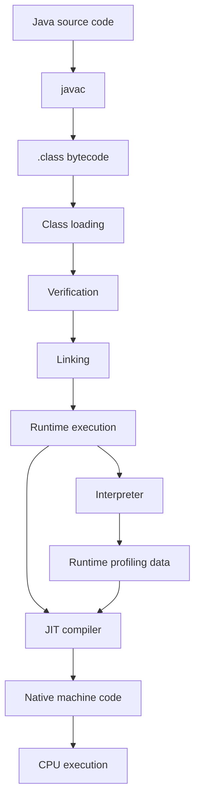
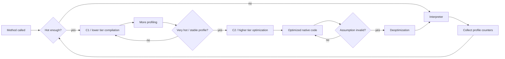
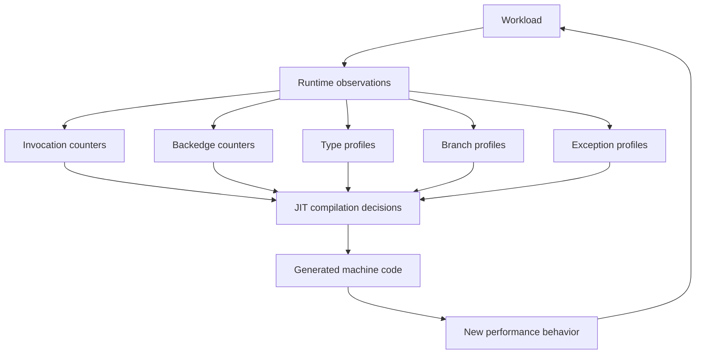
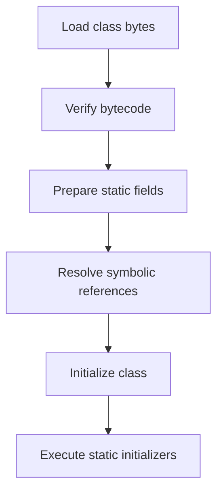
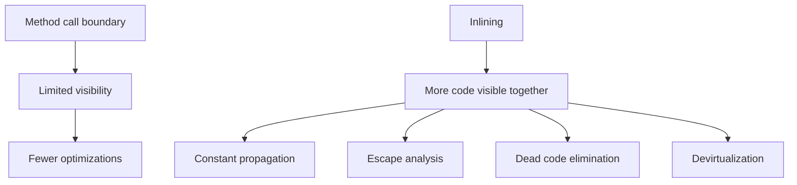
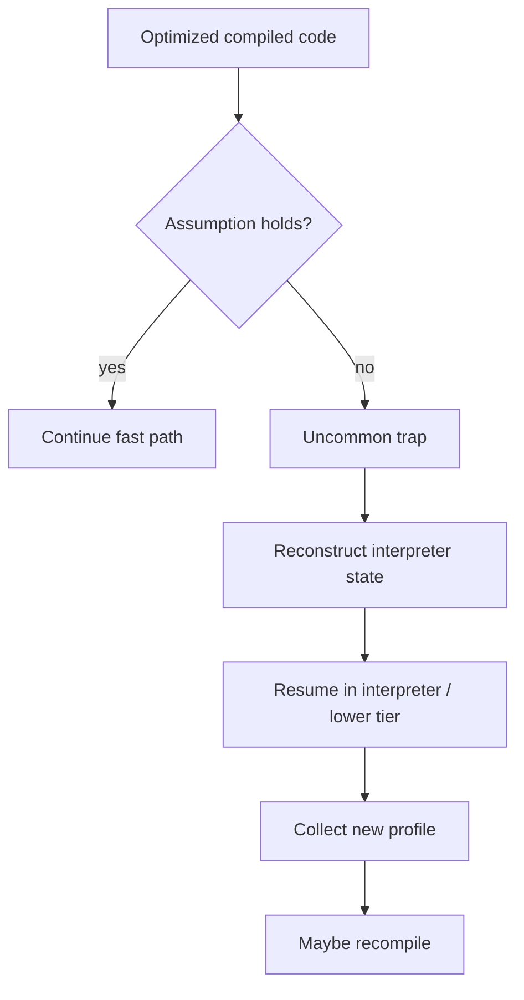
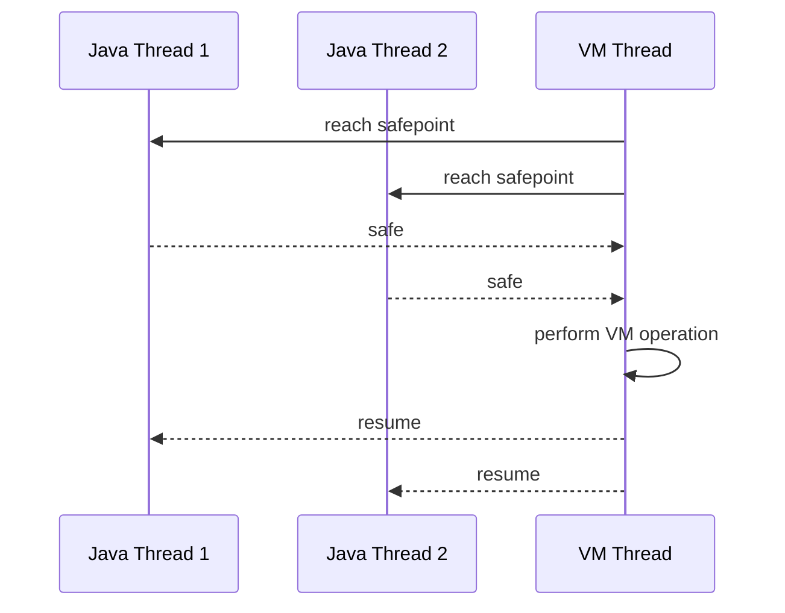
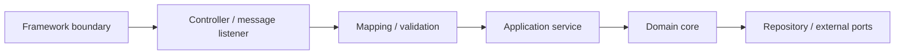
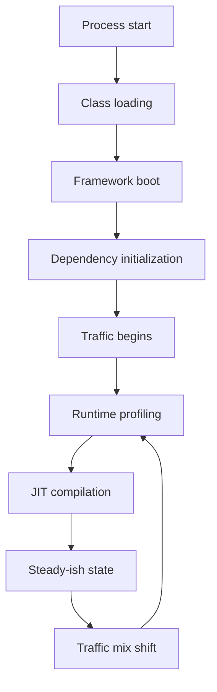
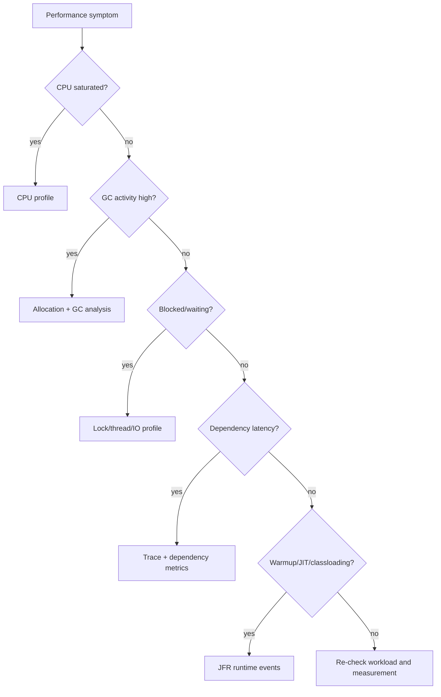

# Part 031 — JVM Runtime Mental Model

A weak Java performance engineer asks:

> Which code is faster?

A strong Java performance engineer asks:

> Under which runtime state, workload shape, JIT profile, allocation pressure, GC behavior, safepoint behavior, and dependency boundary does this code become faster or slower?

That distinction matters because Java performance is not static.

A Java method does not have one fixed performance profile. It may run through several execution modes during the lifetime of the process:

1. interpreted bytecode;
2. profiled interpreted execution;
3. baseline compiled execution;
4. optimized compiled execution;
5. deoptimized execution;
6. recompiled execution with different assumptions;
7. execution affected by GC, safepoints, lock states, uncommon traps, class loading, and CPU/cache behavior.

So the question is not simply:

```text
How fast is this Java code?
```

The better question is:

```text
What runtime path is this code currently taking, and what evidence proves it?
```

This part builds the mental model required before serious JVM profiling, GC diagnosis, concurrency tuning, and production performance engineering.

---

## 1. The JVM is not just an interpreter

At a high level, Java source goes through this pipeline:



The important point:

> The JVM executes a dynamic program whose optimization decisions depend on runtime evidence.

The same bytecode may produce different machine code depending on:

- method call frequency;
- loop hotness;
- receiver types observed at call sites;
- branch probability;
- exception frequency;
- escape analysis result;
- object allocation pattern;
- class loading state;
- polymorphism level;
- deoptimization history;
- VM flags;
- JVM version;
- CPU architecture;
- container CPU/memory limits;
- GC selected;
- warmup duration;
- profiling pollution from previous workload phases.

That is why JVM performance engineering is evidence-driven.

You do not guess what the JIT did.

You inspect.

---

## 2. The engineering model of HotSpot execution

Most production Java systems run on a HotSpot-derived JVM.

The exact implementation details vary by JDK release and vendor build, but the practical model is stable enough for engineering diagnosis.



In simplified language:

- the interpreter starts quickly but is slower;
- lower-tier compilation gives faster startup and can collect profiling data;
- higher-tier compilation spends more CPU compiling but produces better optimized code;
- optimized code depends on assumptions;
- invalid assumptions trigger deoptimization;
- runtime behavior can change after deployment traffic shifts.

This is why a benchmark result from the first 5 seconds of execution may say almost nothing about steady-state service behavior.

It is also why a production latency incident may appear only after a new traffic mix changes polymorphism, allocation, locking, or branch profile.

---

## 3. Runtime performance is a feedback loop

The JVM observes execution and adapts.



This feedback loop creates a core invariant for measurement:

> A performance measurement is valid only if the workload used to train the runtime resembles the workload being measured.

Example: suppose your service has this method:

```java
interface PriceRule {
    Money apply(QuoteContext context);
}
```

In production, 95% of calls may hit `StandardDiscountRule`, 4% hit `EnterpriseContractRule`, and 1% hit `ManualOverrideRule`.

In a benchmark, you accidentally generate a uniform distribution across 20 rule implementations.

That benchmark is not measuring the production behavior of your system.

It is measuring a different call-site profile.

The JIT may make different inlining and dispatch decisions.

---

## 4. Class loading: performance cost and semantic boundary

Class loading is often ignored until startup or latency spikes happen.

A class is not fully ready just because a `.class` file exists.

The JVM has to load, verify, prepare, resolve, and initialize classes.



Class loading can affect performance in several ways:

- startup latency;
- first-request latency;
- unexpected work during lazy path;
- classloader leaks;
- reflection-heavy frameworks;
- dynamic proxies;
- bytecode generation;
- annotation scanning;
- large dependency graphs;
- container cold start;
- GraalVM/native-image decisions if used;
- service warmup strategy.

### 4.1 First-request latency example

A service looks fine in a local benchmark:

```text
p95 after warmup: 12 ms
```

But the first production request after deployment takes:

```text
first request: 2.4 s
```

Possible causes:

- classes initialized lazily;
- JSON serializers generated lazily;
- regex compiled lazily;
- TLS/client pool initialized lazily;
- database driver initialized lazily;
- JIT compilation started under real traffic;
- caches populated lazily;
- metrics/logging exporters initialized lazily.

The fix is not always “optimize method X”.

Often the fix is to define startup and warmup as explicit lifecycle states.

```java
public interface WarmupTask {
    String name();
    void warmup();
}
```

Production-grade Java services often need a warmup policy:

```text
READY only after:
- dependency connection pools initialized;
- schema metadata loaded;
- hot serializers initialized;
- hot code paths executed with representative samples;
- baseline caches populated or explicitly marked cold;
- first JFR recording started if required.
```

---

## 5. Bytecode is the contract between javac and JVM

Java source is not what the JVM executes.

The JVM executes bytecode.

Most of the time you should not hand-optimize bytecode, but you should understand that source-level intuition can be misleading.

Example source:

```java
public int total(List<OrderLine> lines) {
    int total = 0;
    for (OrderLine line : lines) {
        total += line.amount();
    }
    return total;
}
```

This contains several possible runtime costs:

- iterator allocation or elimination;
- virtual call to `amount()`;
- bounds checks if indexed loop;
- integer overflow semantics;
- null checks;
- interface dispatch;
- inlining opportunity;
- escape analysis opportunity;
- branch profile from collection implementation;
- deoptimization if collection types vary.

Source code shape influences bytecode, and bytecode shape influences optimization opportunity.

But the relationship is not mechanical enough to guess reliably.

Use evidence:

- JMH for isolated benchmark;
- JFR for runtime behavior;
- async-profiler for CPU/allocation stacks;
- JIT logs for compilation decisions when needed;
- JOL for object layout;
- `javap` for bytecode inspection;
- GC logs for allocation pressure and collection behavior.

---

## 6. Hot code is not necessarily important code

The JIT optimizes hot code.

The business cares about important code.

Those sets overlap but are not identical.

| Code type | Runtime frequency | Business importance | Example |
|---|---:|---:|---|
| Hot and important | high | high | authorization checks, pricing calculation, request routing |
| Hot but not important | high | medium | metrics formatting, logging guard, object mapping |
| Cold but important | low | high | fraud escalation, settlement reversal, legal hold |
| Cold and not important | low | low | admin-only export |

The JIT focuses on frequency.

Engineering judgment focuses on consequences.

A cold path can still need careful testing and formal reasoning.

A hot path needs careful measurement.

A hot and important path needs both.

---

## 7. Inlining: the optimization that unlocks other optimizations

Inlining means replacing a method call with the body of the target method.

Conceptually:

```java
Money total = calculator.calculate(order);
```

may become something closer to:

```java
Money total = new Money(order.subtotal().amount() - discount.amount());
```

Inlining matters because it exposes more context to the optimizer.

After inlining, the JIT may see:

- constants;
- branch outcomes;
- allocation lifetime;
- redundant null checks;
- redundant field loads;
- monomorphic call sites;
- scalar replacement opportunities;
- loop optimization opportunities.



### 7.1 Why small methods are often fine

A common premature optimization is to merge methods because “method calls are expensive”.

On modern JVMs, small hot methods are often inlined.

Readable code with small methods is usually fine if the call sites are stable.

Bad reason to merge methods:

```text
Method calls are always expensive.
```

Better reason to change shape:

```text
JFR/async-profiler/JMH evidence shows this call boundary remains hot, uninlined, and material under production workload.
```

### 7.2 Why abstraction sometimes costs

Abstraction becomes a performance problem when it creates unstable or opaque runtime behavior:

- megamorphic call sites;
- reflection-heavy dispatch;
- proxy chains;
- deep decorator stacks;
- lambda allocation not optimized away;
- hidden synchronization;
- exception-driven control flow;
- excessive allocation around every call.

The correct response is not “avoid abstraction”.

The correct response is:

> Put abstraction at the right boundary and verify hot-path cost with evidence.

---

## 8. Call-site polymorphism: monomorphic, bimorphic, megamorphic

A call site is where a method call occurs.

Example:

```java
rule.apply(context);
```

At runtime, `rule` may have one or many concrete classes.

| Call-site shape | Meaning | Optimization consequence |
|---|---|---|
| Monomorphic | one receiver type observed | easiest to inline/devirtualize |
| Bimorphic | two common receiver types | often still optimizable |
| Polymorphic | several receiver types | harder |
| Megamorphic | many receiver types | much harder |

Domain code often accidentally creates megamorphic call sites.

Example:

```java
public Money evaluate(List<Rule> rules, Context context) {
    Money result = Money.zero();
    for (Rule rule : rules) {
        result = result.plus(rule.apply(context));
    }
    return result;
}
```

This is clean design.

It may also be a performance problem if:

- the loop is hot;
- there are many implementations;
- implementations are tiny;
- dispatch cost dominates;
- rule list order changes unpredictably;
- JIT cannot inline through the interface.

Possible responses:

1. keep as-is if cost is irrelevant;
2. group rules by type;
3. compile rule graph into a smaller execution plan;
4. use generated code for a stable decision table;
5. specialize hot cases;
6. move polymorphism outside the tight loop;
7. use data-oriented representation;
8. accept cost for maintainability if SLO is safe.

Top-level principle:

> Do not remove abstraction until measurement proves abstraction is material.

---

## 9. Devirtualization: turning dynamic calls into direct calls

The JVM can sometimes transform a virtual/interface call into a direct call if runtime evidence makes the target predictable.

```java
PaymentMethod method = new CardPaymentMethod();
method.authorize(request);
```

If the call site always sees `CardPaymentMethod`, the JIT can optimize as if the call were direct.

But this is an assumption.

If later a new implementation appears in the same call site, the optimized code may become invalid.

That can trigger deoptimization.

### 9.1 Production pitfall: traffic-mix shift

Before release:

```text
99% StandardWorkflow
1% ManualWorkflow
```

After a customer migration:

```text
40% StandardWorkflow
30% ManualWorkflow
30% MigrationWorkflow
```

Same code.

Different runtime profile.

Potential outcomes:

- inlining decisions change;
- branch prediction changes;
- allocation changes;
- GC pressure increases;
- latency distribution widens;
- compiled code invalidates assumptions;
- benchmark from old workload becomes misleading.

Performance evidence must be tied to workload assumptions.

---

## 10. Escape analysis and scalar replacement

Escape analysis asks:

> Can this object be proven not to escape its scope?

If an object does not escape, the JVM may avoid allocating it on the heap or may replace it with scalar values.

Example:

```java
record Point(int x, int y) {}

int distanceSquared(int x, int y) {
    Point p = new Point(x, y);
    return p.x() * p.x() + p.y() * p.y();
}
```

The source code creates a `Point`.

The optimized machine code may not allocate a heap object.

This affects performance reasoning.

A source-level allocation is not always a runtime heap allocation.

A source-level “zero allocation” design can still allocate indirectly.

Evidence matters.

### 10.1 Common escape blockers

Objects are more likely to escape when they are:

- returned from the method;
- stored in a field;
- stored in an array reachable elsewhere;
- passed to opaque methods;
- captured by lambdas that escape;
- passed to reflection/proxy/native code;
- stored in a collection that escapes;
- used across thread boundaries;
- logged or observed in ways the optimizer cannot reason about.

Example:

```java
Money calculate(Order order) {
    Money subtotal = Money.of(order.subtotal());
    audit.debug("subtotal={}", subtotal);
    return subtotal.minus(discount(order));
}
```

The logging call may make optimization harder depending on path, logging framework behavior, and whether the call is eliminated when disabled.

Do not guess.

Profile allocation.

---

## 11. Dead-code elimination and why benchmarks lie

The JVM removes work whose result is unused.

This is good for production.

It is dangerous for benchmarks.

Bad benchmark:

```java
@Benchmark
public void parse() {
    parser.parse(payload);
}
```

If the result does not affect observable state, the optimizer may remove or reshape work.

Better benchmark:

```java
@Benchmark
public ParsedDocument parse() {
    return parser.parse(payload);
}
```

Or:

```java
@Benchmark
public void parse(Blackhole blackhole) {
    blackhole.consume(parser.parse(payload));
}
```

The benchmark must preserve a realistic observable effect.

But do not overuse `Blackhole` as magic.

A benchmark can still be invalid if:

- payload corpus is unrealistic;
- state setup is wrong;
- warmup trains the wrong profile;
- benchmark isolates code that is only slow due to integration effects;
- the real bottleneck is IO, lock contention, or GC;
- the benchmark ignores correctness.

---

## 12. Constant folding and benchmark contamination

The JIT can precompute constant expressions.

Bad benchmark:

```java
@Benchmark
public int hash() {
    return Objects.hash("REG-001", "CASE-123", 2026);
}
```

This may measure a constant-folded path rather than real workload.

Better:

```java
@State(Scope.Thread)
public class HashState {
    @Param({"CASE-123", "CASE-456", "CASE-789"})
    String caseId;
}

@Benchmark
public int hash(HashState state) {
    return Objects.hash("REG-001", state.caseId, 2026);
}
```

Even better, use a realistic corpus and validate result distribution.

Benchmark setup must prevent the optimizer from solving an easier problem than production solves.

---

## 13. Deoptimization: when optimized code becomes invalid

Optimized code relies on assumptions.

Examples:

- this call site usually sees type `A`;
- this branch is rarely taken;
- this null check is redundant;
- this class hierarchy is stable;
- this exception path is uncommon;
- this lock is usually uncontended;
- this allocation does not escape.

If an assumption fails, the JVM may deoptimize and return to a safer execution mode.



Deoptimization can cause:

- latency spikes;
- profile instability;
- benchmark variance;
- first-hit slowness for rare branch;
- performance cliff after new traffic mix;
- confusing profiler output.

### 13.1 Example: rare exception path becomes common

```java
public Decision evaluate(Request request) {
    try {
        return ruleEngine.evaluate(request);
    } catch (MissingReferenceException e) {
        return Decision.manualReview(e.referenceId());
    }
}
```

If `MissingReferenceException` is truly rare, the JVM may treat it as uncommon.

If a bad data migration makes it common, performance can collapse.

Do not use exception-driven control flow for expected high-frequency branches.

Use explicit result types when the branch is part of normal domain behavior.

```java
sealed interface RuleResult {
    record Approved(Decision decision) implements RuleResult {}
    record NeedsManualReview(String referenceId) implements RuleResult {}
    record Rejected(String reason) implements RuleResult {}
}
```

---

## 14. Safepoints: the JVM's coordination mechanism

A safepoint is a point where Java threads can be brought to a known safe state so the JVM can perform certain operations.

Operations associated with safepoints may include:

- some GC phases;
- deoptimization;
- biased-locking era operations in older JVMs;
- class unloading;
- thread dump coordination;
- code cache operations;
- heap inspection;
- some JVMTI/tooling operations.

The practical performance lesson:

> A Java service can pause even if your code is not blocked on a Java lock.



Modern JVMs have improved coordination mechanisms, but the engineering model remains important:

- pauses can be VM-level;
- thread-local behavior can still affect global progress;
- profiler and JFR evidence are required;
- latency outliers may correlate with safepoint/GC/JIT/classloading events.

### 14.1 Safepoint diagnosis checklist

When latency spikes appear with low application CPU:

Check:

- JFR safepoint events;
- GC pause events;
- thread dumps around spike time;
- code cache full events;
- class loading/unloading events;
- biased locking flags only if old JVM/version relevant;
- container CPU throttling;
- native library calls;
- long-running counted loops in older pathological cases;
- logging/diagnostic tools that trigger VM operations.

Avoid blaming application locks until evidence supports it.

---

## 15. Intrinsics: library calls the JVM understands specially

Some Java methods are recognized by the JVM and replaced with highly optimized machine-specific implementations.

These are called intrinsics.

Typical areas include:

- array copy;
- string operations;
- math operations;
- cryptography primitives;
- memory fences/VarHandle operations;
- object methods;
- vectorized or CPU-specific operations in some cases.

Engineering consequence:

> Reimplementing core JDK functionality manually is often slower and riskier than using the JDK primitive the VM already understands.

Example:

```java
System.arraycopy(src, 0, dst, 0, len);
```

This is often better than a handwritten copy loop.

But again: measure under workload.

---

## 16. Reflection, method handles, lambdas, and dynamic dispatch

Modern Java frameworks use reflection, proxies, method handles, bytecode generation, and lambda metafactories.

These mechanisms are not automatically bad.

But they change performance shape.

| Mechanism | Typical use | Performance concern |
|---|---|---|
| Reflection | framework metadata, dynamic invocation | access checks, opaque call boundary, warmup |
| Dynamic proxy | AOP, clients, interceptors | call chain overhead, allocation, megamorphic dispatch |
| CGLIB/ByteBuddy-style proxies | subclass interception | class generation, call path complexity |
| MethodHandle | dynamic invocation | can optimize well when stable, complex when not |
| Lambda | callbacks, functional style | allocation/capture, invokedynamic warmup |
| Annotation scanning | startup config | startup/cold path cost |

The right question:

```text
Is this dynamic mechanism on a latency-critical hot path or startup-critical path?
```

If yes, inspect.

If no, avoid premature tuning.

### 16.1 Practical rule for framework-heavy services

Use this boundary model:



Framework reflection/proxy overhead is usually acceptable at the boundary.

It becomes more dangerous when it leaks into tight inner loops:

- rule evaluation per item;
- serializer lookup per field per row;
- reflection-based mapper in high-volume batch;
- proxy-wrapped domain object methods;
- dynamic expression evaluator inside hot loop;
- annotation lookup on every request instead of cached metadata.

---

## 17. JIT warmup: startup is a different performance regime

A JVM service has phases:



Avoid treating performance as one number.

Track at least:

- cold start latency;
- readiness latency;
- first-request latency;
- warmup-to-steady-state duration;
- steady-state latency;
- performance after deployment traffic shift;
- performance after cache eviction;
- performance after GC pressure changes;
- performance after dependency degradation.

### 17.1 Warmup-aware service readiness

A readiness check should not simply mean:

```text
HTTP server started.
```

For performance-sensitive systems, readiness may require:

```text
- DB pool initialized;
- migrations complete;
- hot serializers initialized;
- cache state known;
- critical classpath loaded;
- representative warmup calls executed;
- JIT not necessarily complete, but cold cliffs understood;
- first telemetry recording active.
```

Be careful: aggressive warmup can create startup storms during rolling deploys.

Warmup itself needs capacity planning.

---

## 18. Code cache: compiled code needs memory too

The JVM stores compiled native code in a code cache.

If the code cache becomes constrained, the JVM may stop compiling or spend more time managing compiled code.

Symptoms can include:

- degraded steady-state throughput;
- unexpected fallback to lower performance;
- warning logs;
- changed JIT behavior;
- odd benchmark variance;
- production performance drift after deploying more code/frameworks.

Causes:

- very large application;
- many generated classes;
- heavy proxy/bytecode generation;
- many benchmark variants in same JVM;
- dynamic language use on JVM;
- excessive method specialization;
- long-running service with changing generated code;
- low memory/container constraints.

Practical diagnostic inputs:

- JVM logs;
- JFR code cache events;
- compiler statistics if enabled;
- number of loaded classes;
- generated class count;
- framework behavior.

---

## 19. Startup, peak throughput, and tail latency trade-offs

Performance tuning is not one-dimensional.

A tuning that improves peak throughput may harm startup.

A tuning that reduces tail latency may cost throughput.

A tuning that reduces allocation may reduce readability or increase CPU.

| Goal | Possible optimization | Possible cost |
|---|---|---|
| Faster startup | reduce classpath scanning, lazy init | first-request latency |
| Lower steady latency | warmup, caching, specialization | memory footprint, complexity |
| Higher throughput | batching, async, larger pools | latency, backpressure risk |
| Lower allocation | reuse objects, primitive structures | bugs, complexity, aliasing |
| Lower GC pause | different GC, heap sizing | CPU, footprint |
| Better tail | reduce contention, isolate resources | lower average throughput |

Do not ask:

```text
What is the fastest setting?
```

Ask:

```text
Which trade-off matches the service SLO and failure model?
```

---

## 20. A practical runtime diagnosis workflow

When a Java service is slow, do not start by editing code.

Start by classifying the bottleneck.



### 20.1 Evidence map

| Symptom | First evidence to collect |
|---|---|
| High CPU | async-profiler CPU flamegraph, JFR execution sample |
| High allocation | JFR allocation events, async-profiler alloc |
| Long GC pause | GC logs, JFR GC pause events |
| Slow startup | class loading events, startup profiler, framework logs |
| First request slow | JFR from startup, class init, serializer/client init |
| Tail latency | JFR + tracing + GC + lock events |
| Lock contention | JFR Java monitor/lock events, thread dumps |
| Async lag | queue depth, consumer throughput, CPU/GC evidence |
| Benchmark variance | JIT logs/JFR, warmup, fork isolation, CPU noise |
| Throughput collapse | saturation analysis, pool sizing, DB metrics, GC |

---

## 21. Runtime flags: use carefully, document aggressively

JVM flags can change runtime behavior significantly.

But flags are not a substitute for understanding.

Dangerous pattern:

```text
We copied these JVM flags from another service.
```

Better pattern:

```text
This service has a latency-sensitive workload, 8 GiB container memory, G1 selected, max pause target X, heap Y, JFR continuous profile enabled, and benchmark evidence attached.
```

A JVM flag change should have:

- reason;
- expected effect;
- target metric;
- rollback plan;
- benchmark evidence;
- canary evidence;
- production monitoring;
- owner;
- expiration/review date if experimental.

Example flag decision record:

```md
## JVM Flag Decision Record

Service: quote-decision-service
Date: 2026-07-03
Change: increase reserved code cache size
Reason: JFR showed code cache pressure after enabling generated rule plans
Expected effect: reduce compilation disablement risk and p95 drift
Evidence: JFR recording link, benchmark run 2026-07-02, canary dashboard
Rollback: restore previous JVM options
Owner: runtime-platform
Review date: 2026-08-03
```

---

## 22. Common wrong mental models

### 22.1 “Java is slow because it is interpreted”

Wrong.

HotSpot spends much of steady-state execution in native code generated by JIT compilers.

The real issue is often warmup, allocation, GC, dispatch shape, lock contention, IO, dependency latency, or poor measurement.

### 22.2 “Microbenchmark proves production performance”

Wrong.

Microbenchmark proves one isolated cost under its setup.

It does not prove production behavior unless workload shape, runtime profile, allocation pressure, and integration effects are relevant.

### 22.3 “Inlining means abstraction is free”

Wrong.

Inlining can make some abstraction effectively cheap in hot stable paths.

But megamorphic call sites, proxies, reflection, generated code, or unstable receiver profiles can keep abstraction expensive.

### 22.4 “Object allocation is always expensive”

Wrong.

Allocation can be very cheap when short-lived and collected efficiently.

But high allocation rate can create GC pressure, memory bandwidth pressure, and tail latency.

The question is allocation rate and lifetime, not merely allocation existence.

### 22.5 “GC tuning fixes memory leaks”

Wrong.

GC tuning changes collection behavior.

A leak or unbounded retention must be fixed at ownership/lifetime level.

### 22.6 “Virtual threads remove performance engineering”

Wrong.

Virtual threads change the concurrency cost model.

They do not remove CPU limits, database limits, lock contention, heap pressure, backpressure, or dependency latency.

---

## 23. Runtime-aware code review checklist

Use this when reviewing performance-sensitive Java code.

### Hot path shape

Ask:

- Is this code on a hot path?
- Is the hot path proven by profiling or assumed?
- Is the workload latency-sensitive, throughput-sensitive, or batch-oriented?
- Is the code executed per request, per item, per field, or per byte?

### Dispatch and abstraction

Ask:

- Is there a virtual/interface call inside a tight loop?
- How many receiver implementations are expected?
- Is dispatch stable in production traffic?
- Are proxies/interceptors present on the hot path?
- Is reflection used per operation or cached?

### Allocation

Ask:

- What is the allocation rate per operation?
- Are objects short-lived or retained?
- Can allocation be eliminated by the JIT?
- Does the code allocate inside loops?
- Does logging/exception/mapping allocate unexpectedly?

### Exceptions

Ask:

- Are exceptions used for normal control flow?
- Can a rare exception become common under bad data?
- Are stack traces material to cost?
- Are failure paths benchmarked or load-tested?

### Warmup

Ask:

- Does this code suffer first-use initialization?
- Are serializers, regexes, mappers, clients, or metadata lazy-loaded?
- Is startup/readiness defined correctly?
- Does benchmark warmup match service warmup?

### Observability

Ask:

- Can we see CPU cost?
- Can we see allocation cost?
- Can we correlate latency with GC/JIT/classloading?
- Are high-cardinality tags controlled?
- Is there a diagnostic artifact when regression happens?

---

## 24. Runtime-aware benchmark checklist

Before trusting a JVM benchmark:

```text
[ ] Warmup exists and is justified.
[ ] Fork count isolates profile pollution.
[ ] State scope matches expected sharing.
[ ] Input corpus is realistic.
[ ] Result is consumed or returned.
[ ] Constant folding is prevented.
[ ] Dead-code elimination is prevented.
[ ] Allocation profile is collected when relevant.
[ ] GC activity is observed.
[ ] Benchmark includes representative polymorphism.
[ ] Benchmark includes failure/edge path if relevant.
[ ] Benchmark includes correctness oracle.
[ ] Benchmark result is compared against production signal.
[ ] JVM version and flags are recorded.
[ ] CPU/container environment is recorded.
```

---

## 25. Runtime-aware production checklist

For production Java services:

```text
[ ] JDK version is explicit.
[ ] JVM flags are documented.
[ ] GC selection is deliberate.
[ ] Container CPU/memory limits are known.
[ ] JFR can be enabled or is continuously sampled.
[ ] GC logs can be captured.
[ ] Thread dumps can be captured safely.
[ ] Build includes debug symbols/line numbers.
[ ] Deployment has warmup/readiness policy.
[ ] First-request latency is tracked.
[ ] Allocation rate is tracked.
[ ] Dependency latency is separated from app latency.
[ ] Tail latency has correlation evidence.
[ ] Performance regressions attach artifacts.
```

---

## 26. Case study: rule engine regression after plugin rollout

A regulatory decision service evaluates case transitions.

Before rollout:

```text
p95 decision latency: 18 ms
allocation/request: 90 KB
CPU: 45%
```

After rollout:

```text
p95 decision latency: 47 ms
allocation/request: 410 KB
CPU: 72%
```

The team suspects database slowness.

Tracing shows DB latency unchanged.

JFR shows:

- increased allocation in rule context mapping;
- more class loading during first requests after deploy;
- CPU samples in expression evaluation;
- more polymorphic rule dispatch;
- exception path used for optional field lookup.

Root causes:

1. new plugin system introduced many small `Rule` implementations;
2. rule evaluation loop became megamorphic;
3. expression metadata was resolved per evaluation;
4. missing optional fields were handled using exceptions;
5. benchmark used only one rule implementation, so regression was invisible.

Fixes:

- cache expression metadata per rule plan;
- replace exception-driven optional lookup with explicit result;
- group rules by execution strategy;
- add representative rule corpus to JMH benchmark;
- add JFR artifact to nightly macrobenchmark;
- add allocation threshold to performance CI;
- add canary dashboard for rule count and allocation/request.

Lesson:

> The regression was not “Java got slower”. The runtime profile changed.

---

## 27. What you should be able to do after this part

You should now be able to:

- explain why Java performance changes over process lifetime;
- distinguish source code, bytecode, interpreted execution, and compiled execution;
- reason about JIT profile feedback;
- identify how inlining unlocks other optimizations;
- recognize polymorphism and megamorphic call-site risk;
- understand escape analysis and scalar replacement at a practical level;
- detect why benchmarks lie through dead-code elimination and constant folding;
- explain deoptimization and traffic-mix risk;
- treat safepoints as runtime coordination evidence;
- evaluate reflection/proxy/method-handle overhead in context;
- design warmup-aware services;
- use a runtime diagnosis workflow before changing code;
- review JVM flags as engineering decisions, not cargo cult settings.

---

## 28. Practice tasks

### Task 1 — Bytecode inspection

Pick one hot method from your codebase.

Run:

```bash
javap -c -p target/classes/com/example/YourClass.class
```

Write down:

- virtual/interface calls;
- object creation points;
- branches;
- exception table;
- invokedynamic usage;
- method size.

Then answer:

```text
What runtime assumptions would the JIT need to optimize this well?
```

### Task 2 — Benchmark profile realism

Take an existing JMH benchmark.

Add a workload card:

```md
## Workload Card

Production operation:
Traffic mix:
Input size distribution:
Receiver type distribution:
Warmup behavior:
Allocation expectation:
Failure/edge path frequency:
Observed production metric:
Benchmark limitation:
```

If you cannot fill it, the benchmark is not yet decision-grade.

### Task 3 — First-request latency

Instrument one service startup path.

Measure:

- process start to port open;
- port open to readiness;
- first request latency;
- 10th request latency;
- steady-state p95 after warmup.

Then identify which work is lazy.

### Task 4 — Dispatch shape experiment

Create a JMH benchmark for an interface call with:

- one implementation;
- two implementations;
- ten implementations;
- randomized implementation order;
- production-like weighted distribution.

Compare results and profiler evidence.

Do not generalize beyond the measured workload.

---

## 29. Further reading

- OpenJDK JMH: https://openjdk.org/projects/code-tools/jmh/
- OpenJDK JOL: https://openjdk.org/projects/code-tools/jol/
- JDK Flight Recorder API: https://docs.oracle.com/en/java/javase/21/docs/api/jdk.jfr/module-summary.html
- OpenJDK JEP 312 — Thread-Local Handshakes: https://openjdk.org/jeps/312
- OpenJDK JEP 333 — ZGC: https://openjdk.org/jeps/333
- async-profiler: https://github.com/async-profiler/async-profiler

---

## 30. Key takeaway

The JVM is an adaptive runtime.

Performance emerges from a feedback loop between workload, profiling data, JIT decisions, allocation behavior, GC, synchronization, class loading, and hardware.

Therefore:

> Do not optimize Java code as if it were static text. Optimize Java systems as dynamic runtime processes with evidence.
