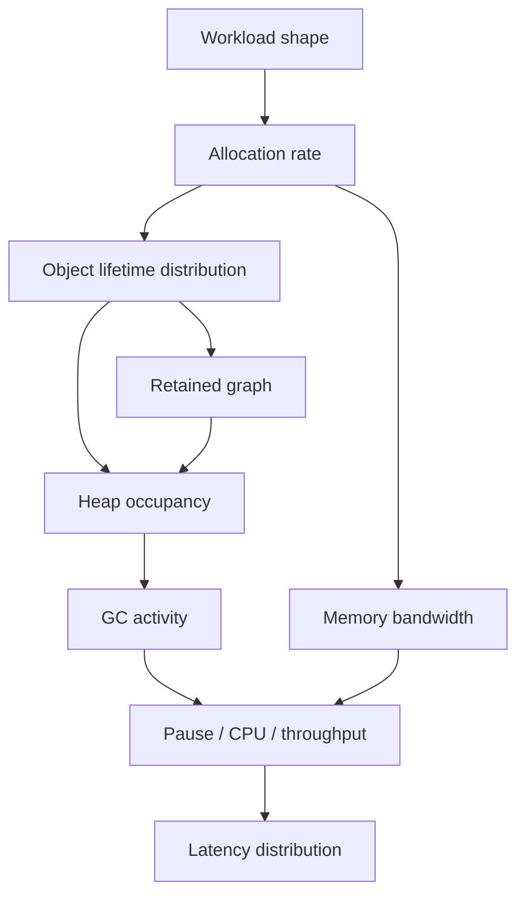
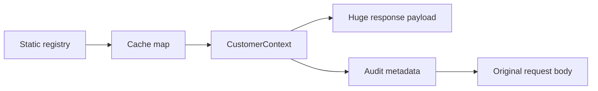
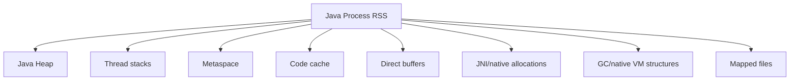
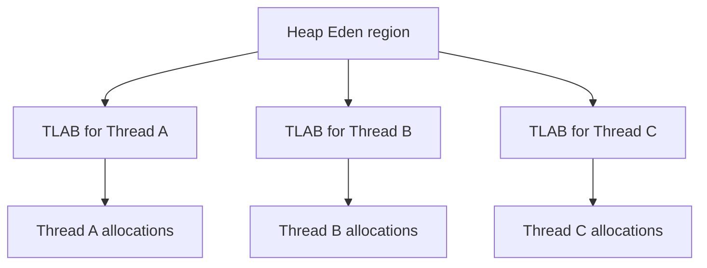
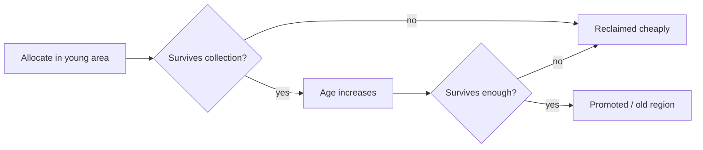
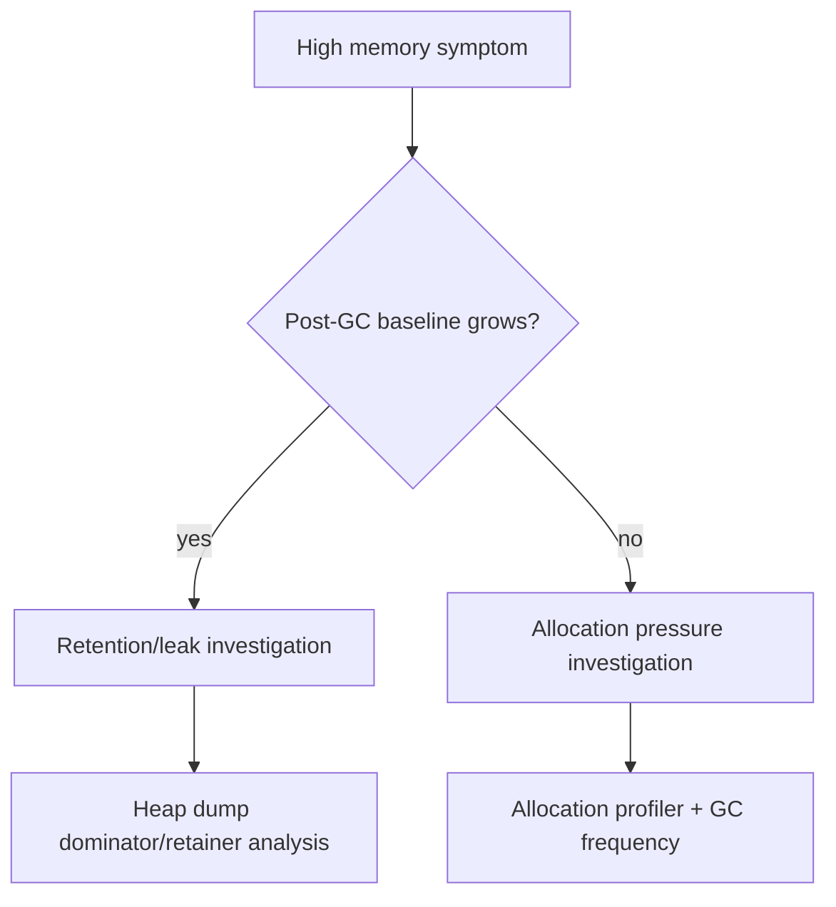
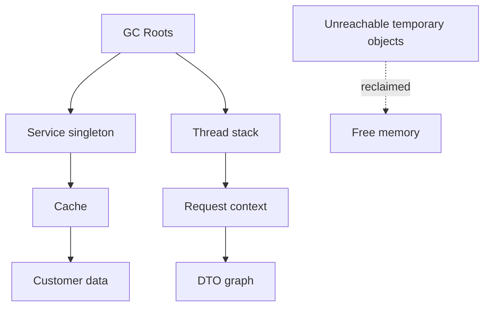
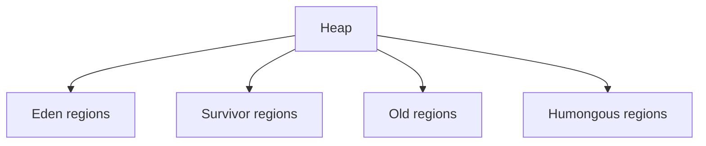
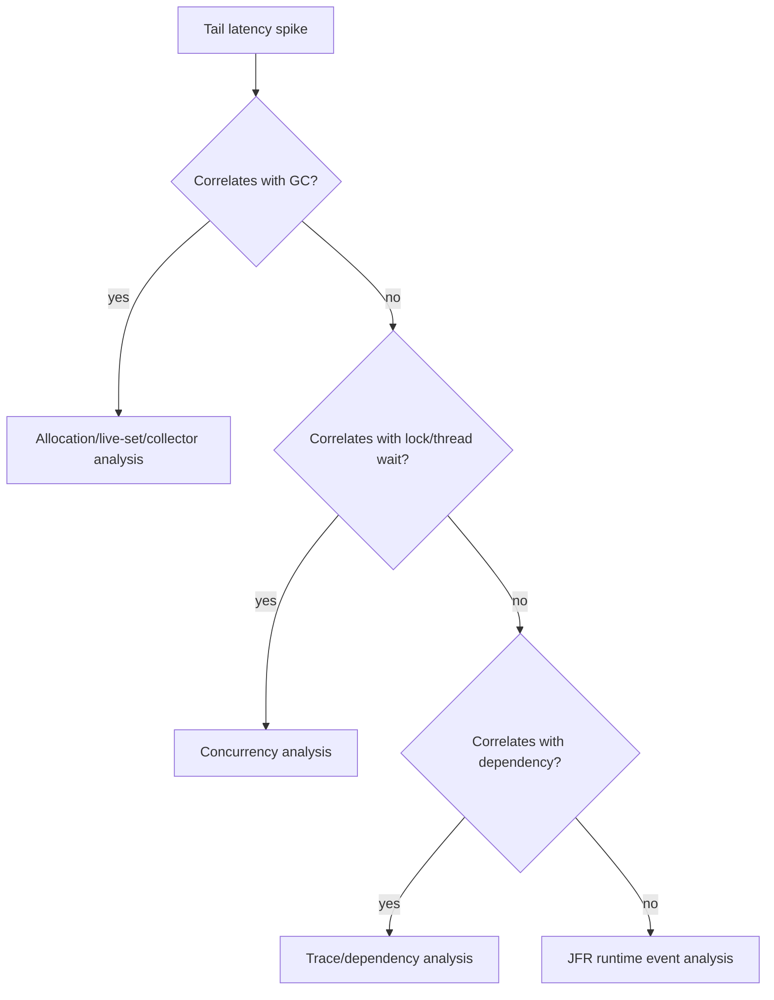

# Part 032 — Memory Allocation, Object Layout, and GC

A weak memory optimization discussion says:

> Object allocation is slow. Avoid objects.

A strong memory engineering discussion says:

> What is the allocation rate, object lifetime distribution, retained graph shape, reference density, promotion behavior, GC algorithm, pause budget, memory bandwidth pressure, container limit, and tail-latency impact?

Java allocation can be extremely cheap.

Java allocation can also destroy latency and throughput.

Both statements are true depending on workload.

This part gives you a practical JVM memory model for production engineering.

The goal is not to memorize every collector implementation detail.

The goal is to reason from evidence:

```text
allocation rate -> object lifetime -> heap pressure -> GC behavior -> latency/throughput/cost
```

---

## 1. Memory performance is not only heap size

Many teams reduce JVM memory engineering to this:

```text
Increase -Xmx.
```

Sometimes that helps.

Often it hides the real problem.

A Java service can have bad memory performance because of:

- high allocation rate;
- large retained object graph;
- memory leak;
- accidental caching;
- unbounded collections;
- too many duplicate strings;
- inefficient object layout;
- boxing;
- wrapper-heavy domain objects;
- excessive intermediate collections;
- large response serialization buffers;
- per-request mapper allocation;
- exception stack trace allocation;
- thread-local retention;
- direct buffer retention;
- native memory pressure;
- classloader leaks;
- code cache pressure;
- container memory limits;
- GC choice mismatch;
- incorrect heap sizing;
- workload burstiness.

A heap dump alone is not enough.

A GC log alone is not enough.

A profiler alone is not enough.

You need a causal chain.



---

## 2. The three questions of JVM memory diagnosis

When memory matters, ask these three questions first.

### 2.1 How much are we allocating?

Allocation rate is usually expressed as:

```text
bytes/sec
bytes/request
objects/sec
bytes/message
bytes/batch item
```

High allocation rate can cause:

- frequent young collections;
- higher GC CPU;
- memory bandwidth pressure;
- cache pressure;
- tail-latency spikes;
- higher cloud cost;
- lower throughput under saturation.

### 2.2 How long do objects live?

Short-lived objects are usually easier for generational collectors.

Long-lived or accidentally retained objects are more dangerous.

Object lifetimes:

| Lifetime | Example | Risk |
|---|---|---|
| Very short | temporary parser object | allocation rate, young GC |
| Request-scoped | DTO, validation context | allocation/request |
| Transaction-scoped | unit-of-work, persistence context | retention until commit |
| Session/user-scoped | auth context, UI state | memory grows with users |
| Cache-scoped | loaded metadata, rule plan | unbounded growth/staleness |
| Process-scoped | registry, singleton map | leak risk |
| Classloader-scoped | static references, thread locals | redeploy leak risk |

### 2.3 What retains memory?

A memory problem is often not caused by the object that is large.

It is caused by the reference that keeps it alive.



The question is:

```text
Why is this still reachable?
```

Not merely:

```text
What is large?
```

---

## 3. Heap, stack, metaspace, code cache, native memory

The Java process uses more memory than heap.



### 3.1 Java heap

Stores most Java objects.

Most GC tuning discussions focus here.

### 3.2 Thread stacks

Each platform thread has stack memory.

Large thread pools can create significant native memory use even if heap looks fine.

Virtual threads change this cost model but do not eliminate all memory concerns.

### 3.3 Metaspace

Stores class metadata.

Heavy frameworks, generated classes, plugins, dynamic proxies, and classloader leaks can affect metaspace.

### 3.4 Code cache

Stores compiled native code generated by the JIT.

Large applications and generated code can pressure code cache.

### 3.5 Direct buffers and native memory

Network libraries, NIO, compression, crypto, database drivers, and off-heap caches may allocate outside the Java heap.

A service can be killed by container memory limit even when heap usage looks safe.

Production memory engineering must track process RSS, not only heap.

---

## 4. Object layout: Java objects have shape and overhead

A Java object is not only its fields.

At runtime, an object usually includes:

- object header;
- class pointer/metadata reference;
- mark word;
- fields;
- padding/alignment;
- references to other objects.

Exact layout depends on JVM implementation, architecture, compressed references, object alignment, and JVM flags.

Use JOL when exact layout matters.

Conceptual example:

```java
final class Money {
    private final long cents;
    private final String currency;
}
```

This is not just:

```text
8 bytes for cents + reference size for currency
```

It includes object header and alignment.

Also, `currency` points to another object.

```mermaid
flowchart LR
    A[Money object] --> B[cents: long]
    A --> C[currency reference]
    C --> D[String object]
    D --> E[byte[] / internal storage]
```

### 4.1 Object graph cost beats object field cost

A domain model may look small in source code but huge as an object graph.

Example:

```java
record CaseDecision(
    CaseId caseId,
    CustomerId customerId,
    List<Violation> violations,
    Map<String, Object> attributes,
    Instant decidedAt
) {}
```

Potential object graph:

```text
CaseDecision
 -> CaseId
 -> String
 -> CustomerId
 -> String
 -> ArrayList
    -> Object[]
       -> Violation
          -> ViolationCode
          -> String
          -> BigDecimal
          -> Metadata map
 -> HashMap
    -> Node[]
       -> Node
       -> String key
       -> Object value
 -> Instant
```

The source line count is irrelevant.

The runtime object graph is what matters.

---

## 5. References are not free

Object-oriented design creates pointer-rich graphs.

Pointer-rich graphs can hurt performance because they create:

- more objects;
- more allocation;
- more GC scanning;
- poor cache locality;
- more indirection;
- more memory bandwidth use;
- larger retained graph;
- higher serialization cost.

Compare:

```java
List<PricePoint> points;

record PricePoint(long timestamp, long amount) {}
```

versus arrays:

```java
long[] timestamps;
long[] amounts;
```

The object-oriented version is often clearer.

The array version may be faster and smaller for large hot datasets.

Do not blindly choose either.

Use the workload:

| Workload | Likely shape |
|---|---|
| Small domain aggregate | object-oriented model is fine |
| Large numeric/time-series data | array/data-oriented representation may win |
| Hot serialization path | avoid wrapper-heavy intermediate model |
| Complex rules with auditability | object model may be worth cost |
| Million-row batch | object graph may dominate |

---

## 6. Allocation is cheap until allocation rate matters

Modern JVM allocation is often a pointer bump in a thread-local allocation buffer.

Conceptually:

```text
object address = tlab.current
if enough space:
    tlab.current += object_size
else:
    refill TLAB / slow path
```

This is why small short-lived objects are not automatically bad.

But allocation rate still matters.

Example:

```text
2 KB/request * 1,000 req/s = 2 MB/s
200 KB/request * 1,000 req/s = 200 MB/s
2 MB/request * 1,000 req/s = 2 GB/s
```

At high enough allocation rates, you pay through:

- young GC frequency;
- CPU spent collecting;
- memory bandwidth;
- cache pollution;
- promotion pressure;
- pause risk;
- larger heap requirement;
- cloud cost.

### 6.1 Allocation budget per request

For performance-sensitive APIs, define an allocation budget.

Example:

```md
## Allocation Budget

Endpoint: POST /cases/{id}/decision
Target throughput: 1,500 req/s
Latency SLO: p95 < 80 ms, p99 < 180 ms
Allocation target: < 120 KB/request under representative payload
Known exceptions: first request after deployment excluded
Measurement: JFR allocation profile + macrobenchmark
Gate: fail nightly if allocation/request increases > 25% without approval
```

This is not premature optimization.

It is cost control.

---

## 7. TLABs: why thread-local allocation is fast

A Thread-Local Allocation Buffer allows a thread to allocate without contending with other threads for every object.



TLABs help make allocation fast.

But they do not make allocation free.

TLAB-related issues can appear when:

- objects are too large for TLAB;
- allocation rate is very high;
- many threads allocate heavily;
- TLAB waste is material;
- virtual thread workload creates different allocation patterns;
- large arrays bypass normal cheap path;
- allocation spikes create GC pressure.

Most application engineers do not tune TLAB flags directly.

But understanding TLABs prevents simplistic claims like:

```text
Every new object is expensive because allocation locks the heap.
```

That is not how normal fast-path allocation works.

---

## 8. Escape analysis: source allocation may disappear

As introduced in Part 031, the JIT may eliminate some allocations.

Example:

```java
record Range(int start, int end) {}

boolean contains(int start, int end, int value) {
    Range range = new Range(start, end);
    return value >= range.start() && value <= range.end();
}
```

The `Range` object may not exist as a heap object after optimization.

So source code allocation count is not the same as runtime heap allocation count.

### 8.1 But do not rely on escape analysis blindly

Escape analysis may fail or become less effective when:

- object crosses method boundary that cannot be inlined;
- object is stored in a field;
- object is stored in a collection;
- object is returned;
- object is passed to reflective/proxy/native code;
- call site becomes megamorphic;
- debug/logging makes object observable;
- exception path captures state;
- benchmark differs from production;
- JIT does not reach steady state.

Use allocation profiling.

---

## 9. Boxing: small syntax, large allocation risk

Autoboxing can silently allocate or increase indirection.

Example:

```java
Map<Long, Integer> counts = new HashMap<>();
for (long id : ids) {
    counts.merge(id, 1, Integer::sum);
}
```

This can involve boxed `Long` keys and boxed `Integer` values.

For small maps, fine.

For millions of entries, dangerous.

Common boxing sources:

- generic collections of primitives;
- streams over boxed types;
- varargs with primitive wrappers;
- reflection APIs;
- `Map<String, Object>` attribute bags;
- `Optional<Integer>` in large data structures;
- `BigDecimal` for every intermediate calculation;
- lambda captures involving wrappers.

### 9.1 Boxing review rule

Ask:

```text
Is this boxed value part of a small domain model or a massive/hot data path?
```

If small, readability may win.

If massive/hot, consider:

- primitive arrays;
- primitive specialized collections;
- compact representation;
- batching;
- avoiding intermediate streams;
- domain-specific encoding.

---

## 10. Strings: the hidden memory multiplier

Strings are everywhere:

- IDs;
- JSON fields;
- enum names;
- currency codes;
- status values;
- error messages;
- map keys;
- log messages;
- SQL fragments;
- header names;
- attribute names.

String-related memory problems often come from duplication.

Example:

```text
1,000,000 case records each store status string "UNDER_REVIEW"
```

Even if each string is small, duplicates can dominate.

Potential approaches:

- use enums for bounded domain states;
- canonicalize repeated identifiers carefully;
- avoid storing full raw payload in long-lived objects;
- avoid `Map<String, Object>` for hot internal representation;
- compress or externalize large text;
- design caches with size limits;
- inspect retained string graph.

Do not blindly call `intern()`.

String interning has lifecycle implications and can create its own memory risks.

---

## 11. Collections: default choices are not neutral

Common Java collections are optimized for general use, not every workload.

| Collection | Typical strength | Common memory/perf trap |
|---|---|---|
| `ArrayList` | compact indexed list | over-retained backing array, resizing |
| `LinkedList` | cheap node insertion in theory | node overhead, poor locality, rarely best |
| `HashMap` | fast lookup | node/table overhead, resizing, boxing |
| `ConcurrentHashMap` | concurrent lookup/update | memory overhead, contention patterns |
| `CopyOnWriteArrayList` | read-heavy listener lists | terrible write-heavy behavior |
| `EnumMap` | enum keys | underused compact option |
| `EnumSet` | enum set | underused compact option |
| `TreeMap` | sorted keys | per-node overhead, compare cost |

### 11.1 Pre-sizing matters in hot paths

Bad:

```java
Map<String, Object> map = new HashMap<>();
for (Field f : fields) {
    map.put(f.name(), f.value());
}
```

Better when size is known:

```java
Map<String, Object> map = new HashMap<>(expectedCapacity(fields.size()));
```

But be careful: over-sizing also wastes memory.

Use pre-sizing when:

- collection is created frequently;
- size is known or bounded;
- resizing appears in profile;
- memory overhead is acceptable.

### 11.2 Avoid collection churn

A common source of allocation is intermediate collections:

```java
List<Violation> active = violations.stream()
    .filter(Violation::active)
    .toList();

List<ViolationCode> codes = active.stream()
    .map(Violation::code)
    .toList();
```

For small lists, this is fine.

For hot large workloads, consider a single pass:

```java
List<ViolationCode> codes = new ArrayList<>(violations.size());
for (Violation violation : violations) {
    if (violation.active()) {
        codes.add(violation.code());
    }
}
```

This is not an argument against streams.

It is an argument against ignoring allocation in hot paths.

---

## 12. Object lifetime and generational hypothesis

Most JVM collectors exploit a common observation:

> Many objects die young.

This is the generational hypothesis.

Application code often creates temporary objects per operation.

If those objects die quickly, young-generation collection can reclaim them efficiently.



Problems arise when:

- too many objects survive young collections;
- request-scoped objects are retained accidentally;
- caches hold large graphs;
- queues grow faster than consumers drain;
- old generation fills;
- large objects bypass normal young behavior;
- remembered-set/card-table overhead grows;
- GC cannot keep up with allocation.

---

## 13. Allocation pressure vs memory leak

Allocation pressure and memory leak are different.

### 13.1 Allocation pressure

The application allocates many objects, but most eventually die.

Symptoms:

- high allocation rate;
- frequent young GC;
- heap returns to normal after GC;
- CPU cost in GC;
- throughput degradation;
- possible tail spikes.

Typical fixes:

- reduce intermediate allocation;
- batch more efficiently;
- reuse immutable metadata;
- avoid accidental boxing;
- optimize parser/serializer path;
- reduce per-request object graph;
- tune heap/GC if allocation is legitimate.

### 13.2 Memory leak / retention bug

Objects remain reachable when they should not.

Symptoms:

- old generation grows over time;
- post-GC heap baseline trends upward;
- eventually OOM or heavy GC;
- heap dump shows unexpected retainers;
- problem may correlate with tenant/customer/workflow.

Typical fixes:

- bound cache;
- remove stale references;
- fix listener deregistration;
- clear thread locals;
- fix queue drain;
- avoid static registries holding request data;
- fix classloader lifecycle;
- fix persistence/session retention.

### 13.3 Diagnostic difference



---

## 14. GC fundamentals: what the collector is trying to do

Garbage collection answers:

```text
Which objects are still reachable, and which memory can be reused?
```

Conceptual roots include:

- thread stacks;
- static fields;
- JNI/native references;
- VM internals;
- class metadata;
- active references from registers/compiled frames.

Reachability graph:



Collectors differ in how they perform marking, moving, compacting, concurrency, generations, barriers, region management, and pause reduction.

But the application-level questions remain:

- How much garbage do we create?
- How much data survives?
- How fragmented is memory?
- How much pause can we tolerate?
- How much CPU can GC use?
- How large can the heap be?
- What is the workload burst pattern?

---

## 15. GC costs: pause, CPU, footprint, throughput

GC is not free.

It has trade-offs.

| Cost dimension | Meaning |
|---|---|
| Pause time | application threads stopped or delayed |
| Throughput | percentage of CPU left for application work |
| Footprint | memory required for heap and collector metadata |
| Latency stability | tail behavior under pressure |
| CPU overhead | concurrent/background collector work |
| Complexity | tuning and diagnosis difficulty |

A low-pause collector may use more CPU or memory.

A throughput-oriented collector may allow longer pauses.

A larger heap may reduce GC frequency but increase worst-case collection cost or memory cost.

There is no universal best collector.

There is a collector/workload/SLO fit.

---

## 16. G1 mental model

G1 is a region-based generational collector and has been the default collector for many mainstream Java server workloads for years.

At a practical level, think of the heap as split into regions.



G1 attempts to balance throughput and pause predictability by collecting sets of regions.

Practical concepts:

- young collections reclaim eden/survivor regions;
- mixed collections include old regions;
- remembered sets track cross-region references;
- humongous objects can be special/problematic;
- pause target is a goal, not a guarantee;
- allocation rate and live set size strongly matter;
- too-small heap can cause excessive GC;
- too-large heap can hide issues and increase cost.

### 16.1 G1-friendly application behavior

Usually helpful:

- reduce allocation rate on hot paths;
- avoid huge temporary arrays/buffers;
- bound caches;
- avoid retaining request graphs;
- stream large payloads when possible;
- reuse immutable metadata safely;
- avoid queue buildup;
- choose sane heap size;
- measure GC with real workload.

### 16.2 G1 warning signs

Investigate when you see:

- frequent young collections;
- long mixed collections;
- humongous allocation pressure;
- to-space exhausted events;
- evacuation failures;
- high remembered-set update cost;
- old generation steadily rising;
- p99 latency correlated with GC;
- high GC CPU under normal load.

---

## 17. ZGC mental model

ZGC is designed for low-latency garbage collection with most work concurrent with application threads.

Practical model:

- designed to keep pauses very short;
- uses load barriers and colored/metadata-enhanced pointers internally;
- does much work concurrently;
- trades CPU/throughput/footprint considerations for low pauses;
- useful when pause time dominates SLO risk;
- still requires controlling allocation rate and live set.

Do not think:

```text
ZGC means memory no longer matters.
```

Think:

```text
ZGC changes the pause/cpu/footprint trade-off, but allocation and retention remain application responsibilities.
```

Use ZGC when the service has:

- strict tail-latency pause sensitivity;
- large heaps;
- enough CPU headroom;
- evidence that GC pauses are material;
- operational maturity to observe and validate the trade-off.

---

## 18. Shenandoah mental model

Shenandoah is also a low-pause collector designed to perform much evacuation/compaction work concurrently.

Practical model:

- low pause goals;
- concurrent compaction;
- barrier overhead trade-offs;
- useful for latency-sensitive workloads;
- available/support varies by JDK vendor/version;
- still subject to allocation pressure and live-set effects.

Engineering rule:

> Choose collectors based on SLO evidence and runtime support constraints, not fashion.

---

## 19. Collector selection framework

Use this table as a starting point, not as gospel.

| Workload | Likely concern | Collector thinking |
|---|---|---|
| General Java service | balanced latency/throughput | G1 often a sane default |
| Large heap, strict pause | tail latency | evaluate ZGC/Shenandoah |
| Batch throughput | total runtime/throughput | throughput-oriented tuning may matter |
| Small container service | footprint/startup | heap sizing and startup dominate |
| High allocation API | young GC pressure | reduce allocation first, then tune |
| Cache-heavy service | live set/retention | cache policy and heap sizing dominate |
| Event consumer | queue lag + allocation | allocation, batching, backpressure |

Collector choice should come after evidence:

```text
Symptom -> JFR/GC logs -> allocation/lifetime/live-set diagnosis -> collector/tuning decision
```

---

## 20. Heap sizing: too small and too large both hurt

Too small heap:

- frequent GC;
- promotion pressure;
- low throughput;
- OOM risk;
- tail latency spikes;
- GC thrashing.

Too large heap:

- higher memory cost;
- slower cold start/warmup in some cases;
- longer time to detect leaks;
- possible larger collection work depending on collector;
- more container memory pressure;
- reduced density per node.

Good heap sizing considers:

- live set after warmup;
- allocation rate;
- traffic burst;
- cache size;
- GC collector;
- pause budget;
- container limit;
- off-heap/native memory;
- safety margin;
- cost target.

### 20.1 Heap sizing decision record

```md
## Heap Sizing Decision

Service: case-workflow-service
JDK: 21
Collector: G1
Container memory: 4 GiB
Heap: 2.5 GiB
Observed live set after warmup: 850 MiB
Peak live set under load: 1.4 GiB
Allocation rate: 350 MiB/s at 1,200 req/s
Pause target: p99 < 180 ms end-to-end
Evidence: JFR + GC logs + macrobenchmark 2026-07-02
Risk: direct buffer usage during bulk export
Monitoring: RSS, heap used after GC, allocation rate, GC pause p99
```

---

## 21. Container memory: heap is only part of the process

In Kubernetes or containerized deployments, the process can be killed because RSS exceeds limit.

RSS includes:

- Java heap;
- metaspace;
- code cache;
- thread stacks;
- direct buffers;
- native allocations;
- memory-mapped files;
- libc/native overhead;
- GC structures.

Bad configuration:

```text
container memory limit: 2 GiB
-Xmx: 2 GiB
```

This leaves no room for non-heap memory.

Better thinking:

```text
container limit = heap + non-heap + native + stack + direct buffers + safety margin
```

For services using Netty, Kafka, compression, TLS, native libraries, or many threads, non-heap memory can be significant.

---

## 22. Direct buffers and off-heap memory

Direct buffers are outside the normal Java heap but still part of process memory.

Common users:

- NIO;
- Netty;
- HTTP clients;
- Kafka clients;
- database drivers;
- compression libraries;
- memory-mapped files;
- off-heap caches.

Symptoms of off-heap pressure:

- container OOM kill without Java heap OOM;
- RSS grows while heap looks stable;
- direct buffer OOM;
- native memory tracking indicates growth;
- Netty leak detector warnings;
- memory-mapped file retention.

Practical actions:

- track RSS and heap separately;
- inspect direct buffer usage if available;
- bound off-heap caches;
- close buffers/resources;
- check client/library pooling;
- use Native Memory Tracking when needed;
- avoid setting heap equal to container limit.

---

## 23. Memory leaks: common Java retention patterns

### 23.1 Unbounded cache

```java
private final Map<String, CustomerProfile> cache = new ConcurrentHashMap<>();
```

Without size/TTL/eviction, this is not a cache.

It is a memory leak with a nicer name.

### 23.2 Static registry holding request data

```java
static final List<RequestContext> contexts = new ArrayList<>();
```

A static reference can retain data for process lifetime.

### 23.3 ThreadLocal not cleared

```java
REQUEST_CONTEXT.set(context);
// missing remove()
```

Always use `try/finally`:

```java
try {
    REQUEST_CONTEXT.set(context);
    return handler.handle(request);
} finally {
    REQUEST_CONTEXT.remove();
}
```

### 23.4 Listener/subscriber not deregistered

Objects registered with event buses, observers, schedulers, or callbacks can remain reachable.

### 23.5 Queue accumulation

A queue is a memory retention structure.

If producers outpace consumers, memory grows.

Backpressure is a memory safety mechanism.

### 23.6 ORM/persistence context retention

Long transactions or large unit-of-work sessions can retain many entities.

Batch processing should flush/clear intentionally.

### 23.7 Classloader leak

Common in plugin/redeploy systems when static references, threads, or caches retain classes from old classloaders.

---

## 24. Allocation-driven design patterns

### 24.1 Reuse metadata, not mutable request objects

Good reuse:

```java
final class CompiledRulePlan {
    private final List<RuleStep> steps;
}
```

Dangerous reuse:

```java
static final MutableEvaluationContext SHARED = new MutableEvaluationContext();
```

Reuse immutable, thread-safe, expensive-to-build structures.

Avoid sharing mutable request state.

### 24.2 Compile plans instead of interpreting metadata repeatedly

Bad hot path:

```java
for (RuleConfig config : configs) {
    Expression expr = parser.parse(config.expression());
    if (expr.evaluate(context)) {
        // ...
    }
}
```

Better:

```java
CompiledRulePlan plan = rulePlanCache.get(ruleSetId);
return plan.evaluate(context);
```

Move expensive allocation from per-request to configuration-load time.

### 24.3 Stream large payloads

Bad:

```java
byte[] allBytes = input.readAllBytes();
String json = new String(allBytes, UTF_8);
```

For large payloads, prefer streaming parser/processing when possible.

### 24.4 Avoid retaining raw request unnecessarily

Auditability is important.

But retaining full raw payload inside every domain object is dangerous.

Use explicit retention policy:

```text
Raw payload stored in object store with retention policy.
Domain object stores reference/hash/metadata only.
```

### 24.5 Bound everything that grows with users, tenants, cases, rules, or time

Anything that grows with an external dimension needs a bound:

- cache size;
- queue size;
- batch size;
- page size;
- result set size;
- retry buffer;
- audit buffer;
- in-memory aggregation window;
- metrics cardinality;
- thread pool queue;
- file upload size.

Unbounded growth is a correctness bug, not just a performance smell.

---

## 25. Memory and correctness invariants

Memory engineering belongs in correctness modeling.

Examples:

```text
Invariant: no tenant can cause unbounded in-memory cache growth.
Invariant: one failed export cannot retain full result payload after failure.
Invariant: queue depth must be bounded and backpressure must activate before OOM.
Invariant: request context must not be reachable after request completion.
Invariant: retry buffer must expire or dead-letter messages after bounded attempts/time.
Invariant: batch job must process in windows, not retain all rows.
```

These invariants can be tested.

Example test for `ThreadLocal` cleanup:

```java
@Test
void clearsRequestContextAfterFailure() {
    RuntimeException thrown = assertThrows(RuntimeException.class, () -> {
        filter.handle(request, () -> {
            throw new RuntimeException("boom");
        });
    });

    assertThat(RequestContextHolder.current()).isEmpty();
}
```

Memory leaks are often invariant violations.

---

## 26. Profiling allocation with JFR

JFR can capture allocation-related evidence with low enough overhead for many diagnostic workflows.

Useful event categories include:

- object allocation in new TLAB;
- object allocation outside TLAB;
- allocation samples;
- GC pause;
- heap summary;
- object count after GC depending on settings;
- class loading;
- thread allocation statistics in some views/tools.

Practical workflow:

```text
1. Capture JFR during representative workload.
2. Find top allocation classes.
3. Find allocation stack traces.
4. Classify allocation as expected or accidental.
5. Determine object lifetime if possible.
6. Correlate allocation spikes with latency/GC.
7. Fix highest-impact accidental allocation first.
8. Re-run same workload and compare.
```

### 26.1 Allocation triage table

| Finding | Interpretation | Action |
|---|---|---|
| Many DTOs per request | maybe expected | check mapping strategy |
| Many `String`/`byte[]` | parsing/serialization/payload | inspect corpus and buffering |
| Many exceptions | exception control flow | replace expected branch with result |
| Many `HashMap$Node` | maps created frequently | pre-size, replace map, cache metadata |
| Many regex objects | repeated compilation | precompile pattern |
| Many `BigDecimal` | numeric intermediate churn | inspect arithmetic path |
| Many logging objects | logging allocation | check disabled log path and structured logging |
| Large arrays outside TLAB | buffers/payloads | stream/chunk/bound size |

---

## 27. Heap dump analysis: retained graph, not just class histogram

A class histogram says what exists.

A dominator/retained-size view helps explain why it remains.

Example:

```text
Top shallow class: byte[]
```

This alone is not enough.

You need retainers:

```text
byte[] retained by
 -> RawRequestPayload
 -> AuditEnvelope
 -> FailedJob
 -> retryQueue
 -> static JobRetryRegistry
```

Now you have a fix path.

### 27.1 Heap dump safety

Heap dumps may contain sensitive data:

- tokens;
- PII;
- credentials;
- request payloads;
- legal/regulatory data;
- secrets in strings;
- customer data.

Treat heap dumps as sensitive artifacts.

Define:

- who may capture;
- where dumps are stored;
- retention period;
- encryption;
- redaction policy;
- incident process;
- deletion process.

---

## 28. GC logs: the time-series view

GC logs show collector behavior over time.

They help answer:

- how often GC occurs;
- how long pauses last;
- how heap occupancy changes before/after GC;
- whether old generation is growing;
- whether humongous allocations occur;
- whether concurrent cycles keep up;
- whether full GC occurs;
- whether GC correlates with latency spikes.

Use GC logs with workload timeline.

A pause of 120 ms may be acceptable in one service and catastrophic in another.

### 28.1 Post-GC baseline

Track heap used after GC.

If the post-GC baseline trends upward under stable workload, suspect retention.

```text
After GC heap used:
10:00 820 MB
10:15 930 MB
10:30 1.1 GB
10:45 1.4 GB
11:00 1.8 GB
```

This is not just “GC is slow”.

Something is being retained.

---

## 29. Tail latency and GC

Average latency can hide GC impact.

Example:

```text
avg latency: 18 ms
p95 latency: 45 ms
p99 latency: 420 ms
max latency: 2.1 s
```

If p99 spikes correlate with GC pauses, the average is irrelevant.

But do not assume all p99 spikes are GC.

Correlate with:

- GC events;
- safepoints;
- lock contention;
- CPU throttling;
- dependency latency;
- queueing;
- network retransmits;
- disk IO;
- logging stalls;
- JIT/classloading.



---

## 30. Case study: high p99 after harmless DTO refactor

A team refactors API response construction.

Before:

```java
response.addViolation(code, amount, status);
```

After:

```java
ViolationDto dto = ViolationDto.builder()
    .code(code.toString())
    .amount(amount.toPlainString())
    .status(status.name())
    .metadata(Map.of(
        "caseId", caseId.value(),
        "rule", rule.name(),
        "source", source.name()
    ))
    .build();
response.add(dto);
```

Functionally correct.

Tests pass.

Latency regresses under load:

```text
p95: +18%
p99: +160%
allocation/request: 3.8x
GC CPU: +22%
```

Evidence:

- JFR allocation stack shows `Map.of`, strings, builders, metadata DTOs;
- p99 correlates with young GC frequency;
- response metadata mostly unused by consumers;
- benchmark used tiny response with one violation;
- production responses often have 300+ violations.

Fix:

- remove unused metadata from default response;
- expose metadata only in debug/expanded representation;
- pre-size response list;
- avoid `toPlainString()` until serialization boundary;
- add representative large-response benchmark;
- add allocation/request metric to macrobenchmark.

Lesson:

> DTO refactors can be memory architecture changes.

---

## 31. Case study: cache leak disguised as GC problem

Symptoms:

```text
Old gen grows all day.
GC pauses become longer.
Service restarts every 36 hours.
```

Initial reaction:

```text
Tune GC.
```

Evidence:

- post-GC heap baseline rises steadily;
- heap dump dominator shows `ConcurrentHashMap` retaining `RulePlan` objects;
- key includes tenant ID + rule set version + timestamp;
- timestamp creates near-infinite key cardinality;
- no maximum size;
- no eviction.

Root cause:

```text
Unbounded cache key cardinality.
```

Fix:

- normalize key to stable rule version;
- add maximum size;
- add TTL only if semantically valid;
- expose cache cardinality metric;
- add test for bounded cache behavior;
- add production invariant: cache entries <= configured max.

Lesson:

> GC was the messenger. Retention policy was the bug.

---

## 32. Allocation optimization hierarchy

Optimize in this order.

### 32.1 Remove accidental retention

Leaks and unbounded structures first.

No GC tuning compensates for unbounded growth.

### 32.2 Remove accidental allocation

Examples:

- repeated regex compilation;
- repeated metadata parsing;
- exception-driven control flow;
- unnecessary intermediate collections;
- repeated serializer construction;
- per-request reflection lookup.

### 32.3 Reduce object graph size

Examples:

- use enums for bounded states;
- avoid generic attribute bags in hot model;
- compact repeated values;
- store IDs as compact domain primitives where useful;
- split debug/audit representation from hot representation.

### 32.4 Improve data locality

Examples:

- arrays for large numeric datasets;
- compact batch representation;
- avoid pointer-heavy structures in large hot loops.

### 32.5 Tune GC/heap

After application allocation/retention is understood.

### 32.6 Change collector

When SLO evidence says collector trade-off is the limiting factor.

---

## 33. Memory-aware code review checklist

### Allocation

Ask:

```text
[ ] Is this path hot?
[ ] What is allocated per operation?
[ ] Are allocations short-lived or retained?
[ ] Are intermediate collections necessary?
[ ] Is boxing happening in a hot/large path?
[ ] Are strings duplicated?
[ ] Are exceptions used for expected control flow?
[ ] Are builders/map literals used inside loops?
[ ] Are regex/parser/serializer objects created repeatedly?
```

### Retention

Ask:

```text
[ ] What owns this object?
[ ] When is it released?
[ ] Is the collection/cache bounded?
[ ] Is the key cardinality bounded?
[ ] Can tenant/customer/time create unbounded growth?
[ ] Are ThreadLocals cleared?
[ ] Are listeners deregistered?
[ ] Can queues grow without backpressure?
[ ] Are raw payloads retained longer than necessary?
```

### GC impact

Ask:

```text
[ ] What is allocation/request?
[ ] What is allocation/sec at target load?
[ ] What is live set after warmup?
[ ] Does p99 correlate with GC?
[ ] Does post-GC heap baseline grow?
[ ] Are humongous objects present?
[ ] Is container memory configured with non-heap headroom?
```

---

## 34. Benchmark checklist for memory-heavy code

A benchmark for memory-heavy code should record:

```text
[ ] bytes/op
[ ] objects/op when available
[ ] allocation stack profile
[ ] GC count/time during benchmark
[ ] input size distribution
[ ] output size distribution
[ ] retained data after operation
[ ] warm vs cold behavior
[ ] small/medium/large payload cases
[ ] failure path allocation
[ ] concurrency level
[ ] heap size and collector
[ ] JDK version
[ ] container memory limit if relevant
```

Do not report only throughput.

Throughput without allocation evidence can hide future GC failures.

---

## 35. Production metrics for memory safety

Track at least:

- heap used;
- heap used after GC;
- allocation rate;
- GC pause time;
- GC CPU/time ratio;
- old generation occupancy;
- metaspace usage;
- direct buffer usage if available;
- process RSS;
- container memory working set;
- OOM kill count;
- cache sizes;
- queue sizes;
- thread count;
- class count;
- p99 latency correlation with GC.

Business-specific memory metrics:

- rule plan cache entries;
- active workflow contexts;
- pending retries;
- tenant cache cardinality;
- batch rows in memory;
- audit buffer size;
- raw payload retention count;
- outbox backlog;
- consumer lag.

Memory metrics should connect to domain growth dimensions.

---

## 36. Practice task: allocation profile a real endpoint

Pick one endpoint or message consumer.

Run a representative workload and capture JFR.

Fill this out:

```md
## Allocation Profile Report

Operation:
Load:
Payload distribution:
Throughput:
Latency p50/p95/p99:
Allocation/request:
Top allocation classes:
Top allocation stack:
Expected allocations:
Accidental allocations:
Objects retained after request:
GC events during run:
Recommended changes:
Follow-up benchmark:
```

Then make one change and re-run the exact same workload.

---

## 37. Practice task: find a retention invariant

Choose one cache, queue, registry, or context holder.

Write its retention invariant.

Example:

```text
RulePlanCache must never retain more than 10,000 plans per service instance, and a plan must be evictable when no active request references it.
```

Then implement:

- unit test for bounded behavior;
- metric for current size;
- alert threshold;
- load test that exercises cardinality;
- heap dump verification if risk is high.

---

## 38. Practice task: compare object graph shapes

Implement two representations for a hot batch workload:

1. object-oriented list of records;
2. compact arrays or specialized representation.

Benchmark:

- construction time;
- memory footprint;
- traversal time;
- serialization time;
- readability/maintenance cost;
- correctness risk.

Write a decision record.

Do not assume the compact version is always worth it.

---

## 39. Further reading

- OpenJDK JOL: https://openjdk.org/projects/code-tools/jol/
- OpenJDK JMH: https://openjdk.org/projects/code-tools/jmh/
- JDK Flight Recorder API: https://docs.oracle.com/en/java/javase/21/docs/api/jdk.jfr/module-summary.html
- OpenJDK JEP 333 — ZGC: https://openjdk.org/jeps/333
- OpenJDK JEP 379 — Shenandoah: https://openjdk.org/jeps/379
- OpenJDK JEP 439 — Generational ZGC: https://openjdk.org/jeps/439

---

## 40. Key takeaway

Java memory performance is not about fearing every object.

It is about controlling allocation rate, object lifetime, reference graphs, retention policies, collector behavior, and process memory limits.

The practical invariant is:

> Every object graph must have a reason to exist, a bounded lifetime, and observable evidence when it violates that expectation.
