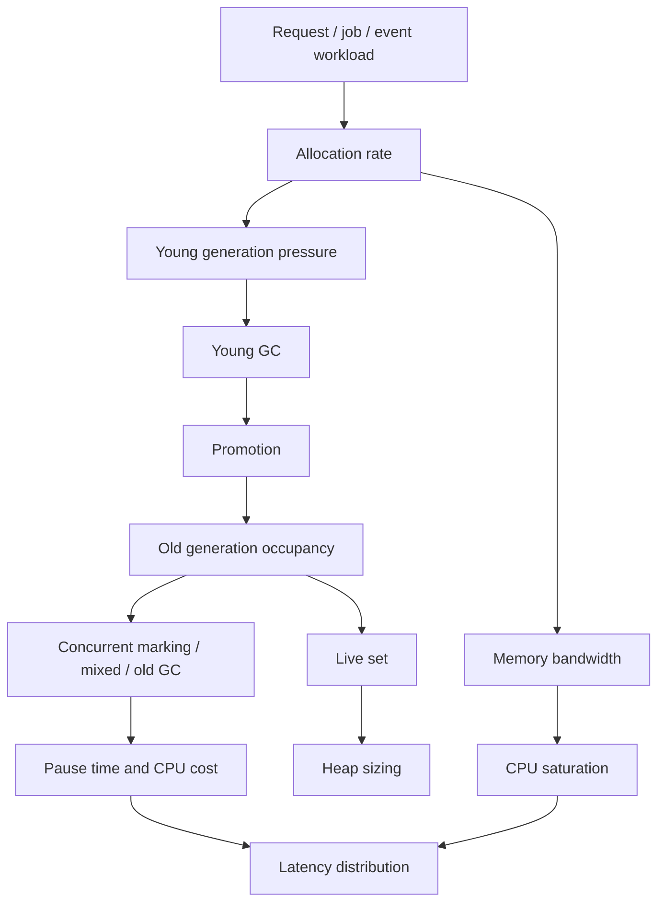
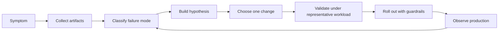
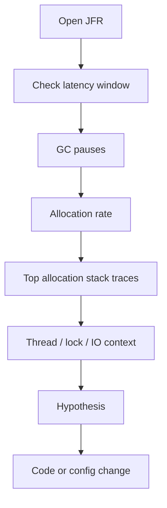
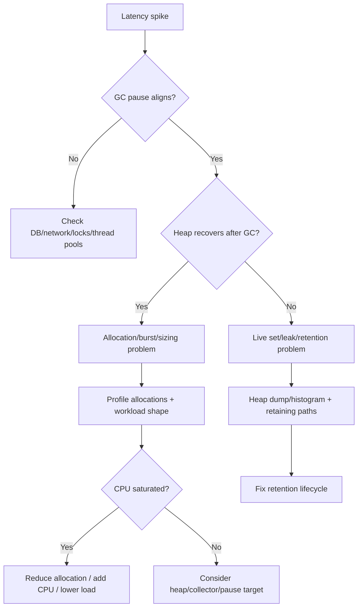
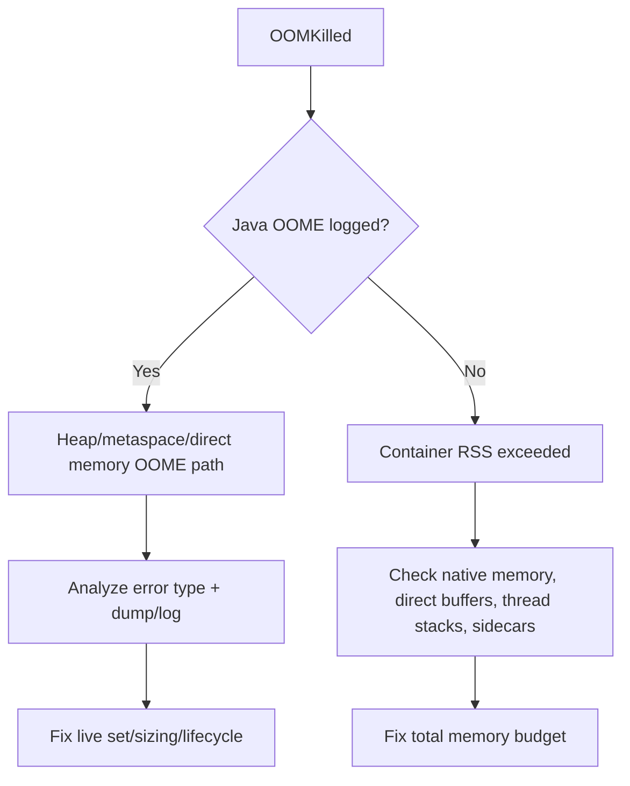

# Part 033 — GC Analysis and Tuning in Production

A weak GC discussion says:

> Which collector is fastest?

A strong GC discussion says:

> What is our live set, allocation rate, promotion rate, pause budget, tail-latency objective, CPU budget, container memory limit, workload burst shape, and collector failure mode?

Garbage collection is not magic.

It is a runtime subsystem that trades CPU, memory, pause time, throughput, predictability, and implementation complexity.

You do not tune GC by memorizing flags.

You tune GC by building evidence.

```text
symptom -> measurement -> hypothesis -> controlled change -> validation -> rollout guardrail
```

This part is about the production workflow.

Not classroom GC theory.

Not random JVM flag cargo culting.

---

## 1. The production GC mental model

A Java service has three memory stories happening at the same time.



The service allocates objects.

Some objects die quickly.

Some survive long enough to be promoted.

Some remain reachable forever because they are valid live data.

Some remain reachable forever because you accidentally leaked them.

GC behavior is mainly shaped by:

- allocation rate;
- object lifetime distribution;
- live-set size;
- reference graph shape;
- promotion rate;
- fragmentation pressure;
- collector algorithm;
- heap sizing;
- CPU availability;
- container memory limit;
- latency objective;
- workload burstiness.

When GC hurts production, the cause is rarely just “the JVM is slow”.

Usually the cause is one of these:

```text
allocation pressure is too high
live set is too large
heap is too small for the live set + allocation bursts
heap is too large for the pause objective
collector choice mismatches the latency target
container limit is incompatible with JVM memory demand
application retains data accidentally
application creates too much garbage per unit of business work
```

---

## 2. Do not start with flags

Bad GC tuning starts with this:

```text
Try -XX:MaxGCPauseMillis=50.
Try larger Xmx.
Try ZGC.
Try more CPU.
```

Good GC tuning starts with this:

```text
What changed?
What is the user-visible symptom?
What evidence do we have?
What hypothesis explains the evidence?
What smallest change can falsify or validate the hypothesis?
```

### 2.1 The GC tuning loop



A GC change is not valid because a single benchmark looks better.

It is valid when:

- latency distribution improves under representative workload;
- error rate does not regress;
- throughput does not collapse;
- CPU cost is acceptable;
- memory headroom is acceptable;
- startup/warmup behavior is acceptable;
- production telemetry confirms the improvement;
- rollback is simple.

### 2.2 Every tuning change needs a reason

Good tuning note:

```text
Observation:
  p99 latency spikes align with G1 mixed collections.
  Old generation occupancy stays above 82% after mixed cycle.
  Allocation rate increased from 250 MB/s to 900 MB/s after serializer change.
  No evidence of leak; live set stabilizes around 5.2 GB.

Hypothesis:
  Heap is too small for current allocation burst + live set, causing frequent mixed cycles.

Change:
  Increase Xmx from 8g to 12g and cap MaxRAMPercentage accordingly.

Expected result:
  Lower mixed collection frequency, lower p99 spike frequency, modest memory cost increase.

Rollback:
  Revert deployment JVM memory profile.
```

Bad tuning note:

```text
Changed GC flags to improve performance.
```

That is not engineering.

That is folklore.

---

## 3. Symptoms are not root causes

GC problems often show up as vague service problems.

| Symptom | Possible GC relation | Non-GC alternatives |
|---|---:|---:|
| p99 latency spikes | STW pause, allocation stalls, CPU stolen by GC | DB lock, network timeout, thread pool queueing |
| Throughput collapse | GC CPU saturation, allocation pressure | downstream saturation, rate limiting, lock contention |
| OOMKilled in Kubernetes | container memory limit exceeded | native memory leak, sidecar overhead, cgroup mismatch |
| `OutOfMemoryError: Java heap space` | heap exhausted | unbounded cache, bad batch, leak, too small heap |
| `OutOfMemoryError: Metaspace` | class metadata growth | classloader leak, dynamic proxy generation |
| High CPU | GC cycles consume CPU | busy loop, crypto, serialization, logging |
| Slow startup | classloading/JIT/heap initialization | dependency init, migrations, cold cache |
| Intermittent timeout | pause or saturation | request fan-out, retries, DNS, TLS, queue backlog |

Do not classify something as a GC issue just because the JVM is involved.

The JVM is always involved.

The question is whether GC evidence explains the user-visible symptom better than alternatives.

---

## 4. The minimum production evidence package

When you investigate GC, collect artifacts before changing flags.

Minimum package:

```text
1. JVM version and vendor
2. JVM flags
3. container memory/CPU limit
4. heap sizing behavior
5. GC logs
6. JFR recording during symptom window
7. service metrics: latency, throughput, error rate
8. allocation rate if available
9. thread pool / queue metrics
10. deployment diff or traffic diff
```

Better package:

```text
11. heap histogram before/during/after
12. heap dump if safe and necessary
13. native memory tracking snapshot
14. async-profiler allocation profile
15. database/downstream latency metrics
16. request class breakdown
17. business operation volume
18. canary vs baseline comparison
```

### 4.1 Commands you should know

These are common production commands. Adjust to your environment, permissions, and JDK version.

List JVM processes:

```bash
jcmd
```

Print JVM flags:

```bash
jcmd <pid> VM.flags
jcmd <pid> VM.command_line
```

Print heap summary:

```bash
jcmd <pid> GC.heap_info
```

Class histogram:

```bash
jcmd <pid> GC.class_histogram
```

Start JFR:

```bash
jcmd <pid> JFR.start name=gc-investigation settings=profile duration=120s filename=/tmp/gc-investigation.jfr
```

Dump running JFR:

```bash
jcmd <pid> JFR.dump name=gc-investigation filename=/tmp/gc-investigation.jfr
```

Native memory summary if NMT is enabled:

```bash
jcmd <pid> VM.native_memory summary
```

Force GC only as a diagnostic in controlled environments:

```bash
jcmd <pid> GC.run
```

Do not run diagnostic commands blindly on overloaded production nodes.

A heap dump can be huge.

A class histogram can pause the application depending on options and version.

A forced GC can distort the incident.

Use operational judgment.

---

## 5. Enable GC logging before you need it

You cannot debug yesterday’s GC problem if you did not retain yesterday’s GC evidence.

For modern HotSpot, unified logging is the normal GC logging mechanism.

Example starting point:

```bash
-Xlog:gc*,safepoint:file=/var/log/app/gc.log:time,uptime,level,tags:filecount=10,filesize=50M
```

This gives you:

- timestamp;
- uptime;
- log level;
- tags;
- file rotation;
- GC and safepoint context.

Use environment-specific paths.

Make sure logs are collected by your logging pipeline.

Make sure they do not fill the node disk.

### 5.1 What to extract from GC logs

At minimum, extract:

```text
pause duration
pause cause
young GC frequency
old/mixed GC frequency
heap before/after
survivor/old occupancy
promotion behavior
concurrent cycle duration
humongous allocation events
full GC events
allocation stalls
to-space exhausted / evacuation failure
metaspace changes
safepoint timing
```

You are looking for shape, not isolated numbers.

A single 300 ms pause may be acceptable for a back-office batch worker.

A single 300 ms pause may violate a low-latency trading or API gateway SLO.

The same GC event has different meaning under different product constraints.

---

## 6. Reading GC behavior by pattern

This section gives you fast pattern recognition.

Do not overfit it.

Use it to ask better questions.

### 6.1 High young GC frequency

Shape:

```text
young GC every few milliseconds/seconds
heap recovers well after young GC
old generation stable
latency spikes correlate with young pauses
high allocation rate
```

Likely causes:

- request path allocates too much;
- serialization creates intermediate buffers;
- mapper creates many short-lived objects;
- stream pipeline allocates heavily;
- regex/date parsing per request;
- excessive logging string construction;
- batch size creates burst allocations;
- decompression/parsing path is allocation-heavy.

Good actions:

- profile allocations;
- compute bytes/request;
- reduce intermediate objects;
- reuse immutable metadata safely;
- batch carefully;
- avoid per-request parser construction;
- consider heap/young sizing only after code/workload evidence.

Bad actions:

- blindly switch collector;
- increase heap without understanding allocation rate;
- pool arbitrary objects and create retention bugs.

### 6.2 Old generation climbs and never returns

Shape:

```text
old gen occupancy grows over time
after full/mixed GC, old gen remains higher than before
class histogram shows growing object families
heap dump dominator tree has suspicious retainers
```

Likely causes:

- unbounded cache;
- map keyed by request/user/tenant without eviction;
- static collection;
- listener/subscriber not removed;
- ThreadLocal retention;
- CompletableFuture chain retention;
- queue backlog;
- classloader leak;
- ORM persistence context grows;
- large batch keeps references until batch end;
- metrics label cardinality explosion.

Good actions:

- compare histograms over time;
- capture heap dump at multiple occupancy points;
- inspect dominator tree;
- find retaining paths;
- add bounded cache and eviction;
- clear lifecycle-bound references;
- reduce metrics cardinality;
- shorten object lifetime.

Bad actions:

- increase heap forever;
- call `System.gc()`;
- blame the collector.

### 6.3 Sawtooth is normal; upward staircase is suspicious

Normal heap shape:

```text
heap rises -> GC -> heap drops -> heap rises -> GC -> heap drops
```

Potential leak shape:

```text
heap rises -> GC -> drops less -> rises -> GC -> drops less -> rises ...
```

But be careful.

A service can show an upward staircase during warmup, cache fill, or daily workload shift.

Leak diagnosis requires stable workload context.

### 6.4 Full GC appears

Full GC is not automatically catastrophic.

But in latency-sensitive services, it is a serious signal.

Possible causes:

- heap exhausted;
- metadata pressure;
- humongous allocation pressure;
- promotion failure;
- explicit `System.gc()`;
- collector fallback;
- allocation spike;
- fragmentation;
- insufficient CPU for concurrent phases.

Actions:

```text
1. Identify Full GC cause.
2. Check heap before/after.
3. Check if full GC recovers memory.
4. If it recovers: pressure/burst/sizing may be involved.
5. If it does not recover: live set/leak likely involved.
6. Correlate with latency and traffic.
```

### 6.5 GC CPU saturation

Shape:

```text
application throughput falls
CPU high
GC time percentage high
latency rises
heap occupancy high or allocation rate high
```

Possible causes:

- allocation rate too high;
- heap too small;
- live set too close to heap size;
- concurrent collector starved of CPU;
- too many JVMs packed on node;
- container CPU limit too low;
- workload burst exceeds capacity;
- retry storm amplifies traffic.

Do not tune pause target tighter if CPU is already saturated.

A tighter pause target can increase GC work and worsen throughput.

---

## 7. JFR for GC diagnosis

GC logs show collector events.

JFR shows runtime context.

JFR can connect GC symptoms to:

- allocation sites;
- object allocation in new TLAB/outside TLAB;
- GC pauses;
- heap summary;
- thread activity;
- lock contention;
- socket/file IO;
- exception rate;
- CPU hotspots;
- virtual thread pinning events on relevant JDKs;
- safepoints;
- class loading;
- native memory signals depending on configuration.

### 7.1 JFR investigation flow



Questions to ask inside JFR:

```text
Which allocation sites dominate?
Are allocations tied to one endpoint/job/message type?
Are large objects allocated frequently?
Are exceptions allocated on hot path?
Are locks blocking request threads?
Are socket reads/writes correlated with backlog?
Do GC pauses align with latency spikes?
Is CPU dominated by GC, serialization, compression, crypto, logging, or business logic?
```

### 7.2 Custom JFR events

For complex services, add custom JFR events around business operations.

Example:

```java
import jdk.jfr.Event;
import jdk.jfr.Label;
import jdk.jfr.Category;

@Category({"Application", "Order"})
@Label("Order Transition")
public class OrderTransitionEvent extends Event {
    @Label("Tenant")
    String tenant;

    @Label("From State")
    String fromState;

    @Label("To State")
    String toState;

    @Label("Rule Count")
    int ruleCount;

    @Label("Item Count")
    int itemCount;
}
```

Usage:

```java
OrderTransitionEvent event = new OrderTransitionEvent();
event.tenant = tenantId;
event.fromState = from.name();
event.toState = to.name();
event.ruleCount = rules.size();
event.itemCount = order.items().size();
event.begin();
try {
    transitionEngine.apply(order, command);
} finally {
    event.commit();
}
```

Now allocation and pause evidence can be correlated with domain operation type.

This is how performance engineering becomes business-aware.

---

## 8. Heap dumps: powerful, expensive, easy to misuse

Heap dumps answer this question:

```text
What object graph is retained at this point in time?
```

They do not directly answer:

```text
Who allocated these objects?
Why were they allocated?
Are they supposed to be live?
How did latency behave?
```

For those, combine heap dump with JFR, GC logs, and application metrics.

### 8.1 Heap dump workflow

```text
1. Confirm it is safe to capture.
2. Capture during meaningful state.
3. Record traffic/workload context.
4. Load into analyzer.
5. Inspect dominator tree.
6. Find largest retained sets.
7. Inspect retaining paths.
8. Map retainers to ownership/lifecycle rules.
9. Validate with second dump or histogram.
10. Fix lifecycle boundary, not just object count.
```

### 8.2 What to look for

Suspicious signs:

- millions of domain objects retained by cache;
- `ConcurrentHashMap` with unbounded keys;
- `ArrayList` backing arrays much larger than size expectation;
- large `byte[]`, `char[]`, `String`, `StringBuilder`;
- retained HTTP response/request bodies;
- ORM session/persistence context retaining entities;
- `ThreadLocalMap` retaining request state;
- `CompletableFuture` graph retaining closures;
- logging/event buffer retaining payloads;
- metric registry retaining high-cardinality labels;
- classloader retaining application classes after redeploy.

### 8.3 The “largest object” trap

The largest single object is not always the problem.

A million small objects retained by one root can be worse than one large array.

Look at retained size and retaining path.

Not just shallow size.

---

## 9. Native memory and container memory

Heap is not total JVM memory.

A Java process also uses memory for:

- metaspace;
- code cache;
- thread stacks;
- direct buffers;
- mapped files;
- GC structures;
- JIT/compiler memory;
- native libraries;
- TLS/crypto buffers;
- allocator fragmentation;
- JVM internal data structures;
- sidecar/container overhead outside process depending on platform.

Container memory failures often look like this:

```text
No Java heap OOME.
Pod is OOMKilled.
GC logs do not show heap exhaustion.
RSS approaches cgroup limit.
```

That points to total process/container memory, not just Java heap.

### 9.1 Container sizing rule of thumb

Do not set heap equal to container limit.

You need headroom for non-heap/native memory.

Example mental budget:

```text
container limit = 4096 MB
heap max       = 2500-3000 MB
metaspace      = 100-300 MB
code cache     = 100-300 MB
thread stacks  = depends on platform threads
direct buffers = workload dependent
native/JVM      = workload dependent
safety margin   = required
```

This is not a universal formula.

It is a reminder that `-Xmx` is not the whole memory story.

### 9.2 Investigating OOMKilled

Checklist:

```text
1. Was there Java OutOfMemoryError?
2. Was process killed by container runtime?
3. What was RSS before kill?
4. What was heap occupancy before kill?
5. Was direct memory high?
6. Were thread counts high?
7. Was metaspace growing?
8. Were heap dumps absent because the JVM never threw OOME?
9. Did sidecar/proxy/log agent consume memory?
10. Did memory limit change recently?
```

---

## 10. Collector choice is a product decision

Collector choice depends on workload and objective.

Simplified decision view:

| Objective | Typical collector direction | Watch out |
|---|---|---|
| Balanced throughput/latency for server apps | G1 | mixed cycle tuning, humongous objects, pause target realism |
| Very low pause objective with larger heaps | ZGC or Shenandoah | CPU overhead, JDK version, operational maturity, memory headroom |
| Small services/simple workloads | default collector may be enough | avoid premature tuning |
| Batch throughput | throughput-oriented tuning may matter | pause may be acceptable |
| Legacy JDK constraints | limited choices | upgrade may be best tuning |

Do not treat collector choice as permanent identity.

Treat it as an operational decision under constraints.

### 10.1 Collector comparison questions

Ask:

```text
What is max acceptable pause?
What is p99/p999 objective?
What is heap size?
How much CPU headroom exists?
How allocation-heavy is workload?
Is workload latency-sensitive or throughput-sensitive?
Can we upgrade JDK?
What observability support exists?
What is rollback plan?
```

---

## 11. G1 production diagnosis

G1 is often the default mental model for server-side Java.

It divides heap into regions and tries to meet a pause-time goal by selecting collection work.

The important production concepts:

- young collection;
- survivor regions;
- old regions;
- humongous regions;
- concurrent marking;
- mixed collections;
- remembered sets;
- evacuation;
- pause target;
- heap occupancy trigger;
- full GC fallback.

### 11.1 G1 symptoms and likely directions

| Symptom | Meaning | Direction |
|---|---|---|
| frequent young pauses | allocation pressure | profile allocation, adjust sizing only after evidence |
| mixed GCs too frequent | old occupancy pressure | inspect live set, heap size, promotion |
| evacuation failure | insufficient free regions/fragmentation | heap headroom, reduce humongous allocation, tune carefully |
| humongous allocation | large arrays/buffers/strings | inspect payload/batching/serialization |
| concurrent mark too late | old fills faster than marking | start marking earlier, reduce allocation/promotion, add CPU/headroom |
| full GC | fallback/severe pressure | incident-level analysis |

### 11.2 G1 pause target realism

`MaxGCPauseMillis` is a goal.

Not a guarantee.

If you set an unrealistic pause target, the collector may do smaller collections more often and burn more CPU.

This can improve median latency while worsening throughput or p99 under saturation.

Tuning is a system trade-off.

---

## 12. ZGC and Shenandoah diagnosis mindset

Low-pause collectors reduce stop-the-world pause impact by doing more work concurrently.

That does not mean they make allocation free.

They still need:

- CPU;
- memory headroom;
- enough time to finish concurrent work;
- stable allocation rate;
- compatible JDK/runtime behavior;
- production validation.

### 12.1 When low-pause collectors help

They are strong candidates when:

- tail latency is dominated by GC pauses;
- heap is large;
- product cannot tolerate long pauses;
- CPU headroom exists;
- application is not primarily bottlenecked elsewhere;
- upgrade/testing path is acceptable.

### 12.2 When they will not save you

They will not fix:

- unbounded memory leak;
- extreme allocation caused by bad request path;
- database latency;
- lock contention;
- thread pool starvation;
- retry storm;
- oversized response payloads;
- wrong load model;
- insufficient CPU.

A different collector can hide symptoms for a while.

It cannot make invalid lifetime design correct.

---

## 13. Tuning levers: classify before touching

### 13.1 Sizing levers

Common levers:

```text
-Xms
-Xmx
-XX:InitialRAMPercentage
-XX:MaxRAMPercentage
-XX:MinRAMPercentage
```

Use fixed `Xms = Xmx` when predictable heap reservation and fewer runtime resizing surprises matter.

Use percentage flags carefully in containerized environments.

Document the effective heap, not just the configured flags.

### 13.2 Collector levers

Common high-level choices:

```text
-XX:+UseG1GC
-XX:+UseZGC
-XX:+UseShenandoahGC
```

Availability depends on JDK distribution/version/platform.

Validate in your actual runtime.

### 13.3 Pause target levers

Example:

```text
-XX:MaxGCPauseMillis=200
```

This is a goal.

Not a contract.

Tightening it can increase CPU and collection frequency.

### 13.4 Explicit GC behavior

If libraries call `System.gc()`, you may see unexpected full collections.

Investigate before disabling.

Potential flag:

```text
-XX:+DisableExplicitGC
```

But disabling explicit GC can affect libraries relying on it for direct buffer cleanup behavior in older patterns.

Use evidence.

### 13.5 String deduplication

G1 supports string deduplication in some JVM versions/configurations.

Potentially useful when duplicate strings dominate memory.

Potentially harmful if CPU overhead exceeds memory benefit.

Validate with heap evidence.

### 13.6 Object pooling

Object pooling is often the wrong fix for allocation pressure.

Modern JVM allocation is cheap for short-lived objects.

Pooling can introduce:

- retention;
- synchronization;
- lifecycle bugs;
- data leakage across requests;
- false sharing;
- memory bloat;
- worse cache behavior.

Pool scarce external resources.

Do not casually pool ordinary domain objects.

---

## 14. Code-level GC fixes

The best GC tuning is often code tuning.

### 14.1 Reduce bytes per business operation

Track:

```text
bytes/request
bytes/message
bytes/order transition
bytes/report row
bytes/import record
```

Optimize where business volume is high.

Not where code looks ugly.

### 14.2 Common allocation reductions

- avoid rebuilding static metadata;
- avoid parsing the same schema/config repeatedly;
- avoid intermediate `List`/`Map` chains in hot paths;
- stream large payloads instead of materializing;
- pre-size collections when size is known;
- avoid boxing on hot paths;
- avoid exception-driven control flow;
- avoid regex compilation per request;
- avoid `String.split()` in hot parsing loops;
- avoid per-request `ObjectMapper` construction;
- avoid retaining full request/response body after use;
- avoid accidental closure capture in async chains;
- avoid high-cardinality metrics labels.

### 14.3 But preserve correctness

Do not optimize allocation by breaking invariants.

Bad optimization:

```java
// Reuses mutable response object globally.
// Fast in benchmark, corrupt in production.
static final Response RESPONSE = new Response();
```

Better optimization:

```java
// Reuse immutable metadata, not mutable request state.
private static final Set<State> TERMINAL_STATES = Set.of(CLOSED, CANCELLED, REJECTED);
```

Performance changes need correctness tests.

Correctness changes need performance guardrails.

---

## 15. Incident decision tree

When latency spikes and GC is suspected:



When pod is OOMKilled:



---

## 16. GC runbook template

Use this as a production checklist.

```md
# GC Investigation

## Context
- Service:
- Version:
- JDK:
- Collector:
- Container CPU/memory:
- Xms/Xmx/effective heap:
- Incident window:
- User-visible symptom:

## Evidence
- Latency before/during/after:
- Throughput before/during/after:
- Error rate:
- GC pause frequency:
- Max/avg pause:
- GC time percentage:
- Allocation rate:
- Heap before/after GC:
- Old gen trend:
- Full GC events:
- Humongous allocation:
- JFR file:
- GC log file:
- Heap dump/histogram:

## Classification
- Allocation pressure:
- Live-set growth:
- Leak suspected:
- Sizing issue:
- Collector mismatch:
- Container/native memory issue:
- Non-GC bottleneck:

## Hypothesis
...

## Change
...

## Validation
...

## Rollback
...
```

---

## 17. Case study: regulatory case search latency spikes

Imagine a Java service that searches regulatory cases.

Symptom:

```text
p99 latency jumps from 300 ms to 4 s every few minutes.
CPU rises.
No DB latency spike.
GC logs show frequent G1 mixed collections.
```

Recent change:

```text
Search response now includes expanded violation history and attachment metadata.
```

Evidence:

```text
Allocation rate increased from 300 MB/s to 1.4 GB/s.
Old generation occupancy rises during search bursts.
Heap dump shows many retained DTOs in an in-memory response aggregation list.
JFR shows large allocation in CaseSearchAssembler.expandHistory().
```

Bad fix:

```text
Increase Xmx and call it solved.
```

Better fix:

```text
1. Stream attachment metadata instead of materializing full graph.
2. Page violation history separately.
3. Pre-size bounded result collections.
4. Remove accidental debug retention of assembled DTOs.
5. Keep modest heap increase only if capacity model requires it.
6. Add bytes/search metric and response graph size metric.
7. Add JMH benchmark for assembler allocation.
8. Add macrobenchmark search workload.
```

Why this is better:

- fixes allocation source;
- reduces live data per request;
- protects DB and network payload size;
- adds regression guardrail;
- improves p99 without hiding the issue.

---

## 18. Anti-patterns

### 18.1 Flag soup

A JVM command line with dozens of unexplained flags is operational debt.

Every flag should have:

- reason;
- owner;
- date;
- validation result;
- rollback rule.

### 18.2 Benchmark-only GC tuning

A load test can miss production memory shape.

Production has:

- tenant skew;
- cache warmup;
- real payload diversity;
- retry storms;
- long-lived sessions;
- sidecars;
- noisy neighbors;
- deployment waves;
- traffic seasonality.

Use benchmark evidence.

Do not worship it.

### 18.3 Heap dump without context

A heap dump from quiet time can mislead you about incident time.

Capture context.

### 18.4 Tuning around a leak

If live set grows without bound, tuning only delays failure.

Delay can be useful in an incident.

It is not a fix.

### 18.5 Over-reducing allocation

You can reduce allocation and make code less correct, less readable, less maintainable, or slower due to cache/branch/lock costs.

Optimization must be justified by measured impact.

---

## 19. Practice drills

### Drill 1 — GC log classification

Take a GC log from a staging service.

Classify:

```text
young GC frequency
old/mixed frequency
max pause
allocation trend
heap recovery
full GC presence
humongous allocation presence
```

Write one hypothesis.

Do not tune yet.

### Drill 2 — Allocation budget

Pick one hot endpoint.

Measure:

```text
requests/sec
allocation rate
bytes/request
p99 latency
response size
```

Then reduce allocation by one code change.

Validate correctness and latency.

### Drill 3 — Heap retention investigation

Create a controlled leak in a test service:

```java
private static final Map<String, byte[]> leak = new ConcurrentHashMap<>();
```

Capture two histograms over time.

Find the growth.

Then fix it with bounded retention.

### Drill 4 — Container memory budget

For one service, document:

```text
container memory limit
max heap
metaspace estimate
thread count * stack size estimate
direct memory estimate
code cache
native memory margin
```

Compare to actual RSS.

---

## 20. Review checklist

Before approving a GC tuning PR or deployment change:

- What symptom is being fixed?
- What evidence shows GC is involved?
- What collector/version/platform is used?
- What changed recently?
- What is allocation rate?
- What is live-set size?
- Does heap recover after GC?
- Is there a leak suspicion?
- Is CPU saturated?
- Is the container memory budget safe?
- Is the pause target realistic?
- Was the change tested under representative load?
- Are GC logs and JFR artifacts retained?
- Is rollback simple?
- Are correctness tests unaffected?
- Are production guardrails defined?

---

## 21. Key takeaways

GC analysis is evidence work.

Collector flags are the last mile, not the first move.

The strongest GC engineers can connect:

```text
business workload -> allocation shape -> object lifetime -> heap behavior -> collector behavior -> latency/cost -> code/config decision
```

Your job is not to “make GC fast”.

Your job is to make the service predictable under its real workload.

---

## References

- OpenJDK JMH: `https://openjdk.org/projects/code-tools/jmh/`
- OpenJDK Java Object Layout: `https://openjdk.org/projects/code-tools/jol/`
- Oracle Java SE GC Tuning Guide: `https://docs.oracle.com/en/java/javase/21/gctuning/`
- Oracle `java` command unified logging documentation: `https://docs.oracle.com/en/java/javase/21/docs/specs/man/java.html`
- JDK Flight Recorder API: `https://docs.oracle.com/en/java/javase/21/docs/api/jdk.jfr/jdk/jfr/package-summary.html`
- JDK Mission Control: `https://www.oracle.com/java/technologies/jdk-mission-control.html`
