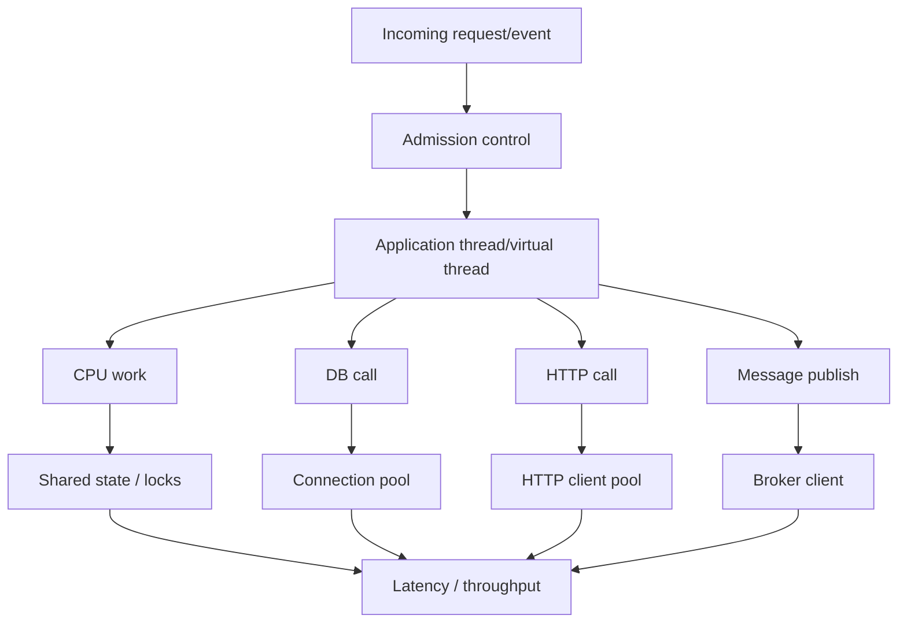
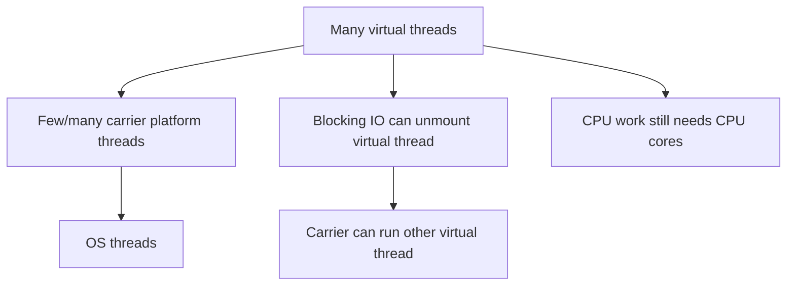

# Part 034 — Concurrency Performance, Locks, and Virtual Threads

A weak concurrency performance discussion says:

> Add more threads.

A strong concurrency performance discussion says:

> What is the workload type, blocking ratio, CPU demand, wait time, shared state, lock contention, queueing model, resource bottleneck, timeout budget, backpressure strategy, and failure amplification path?

Concurrency does not automatically make software faster.

Concurrency makes more work overlap.

That overlap can improve throughput.

It can also create contention, queueing, memory pressure, tail latency, deadlocks, starvation, retry storms, and operational opacity.

This part is about performance engineering for concurrent Java systems.

Not syntax.

Not “use CompletableFuture everywhere”.

Not “virtual threads solve concurrency”.

The goal is to choose the right concurrency model for the workload and prove that it behaves under pressure.

---

## 1. Concurrency is a capacity design problem

A Java service usually has several work zones:



Throughput is not determined by thread count alone.

It is shaped by:

- arrival rate;
- service time;
- waiting time;
- CPU cores;
- blocking ratio;
- downstream capacity;
- connection pool size;
- lock contention;
- queue size;
- allocation rate;
- GC pressure;
- retry behavior;
- timeout policy;
- backpressure.

If a service is blocked on a database pool of 20 connections, creating 2,000 threads does not create 2,000 database capacity.

It creates 1,980 waiters.

---

## 2. The first concurrency question: CPU-bound or waiting-bound?

Classify the workload before choosing concurrency style.

| Workload | Dominant cost | Useful concurrency shape | Risk |
|---|---|---|---|
| CPU-bound computation | CPU cycles | bounded parallelism near core count | context switching, cache misses |
| Blocking IO service | waiting on DB/HTTP/file | many lightweight waiters, bounded external resources | downstream overload |
| Mixed request path | CPU + IO | separate budgets per resource | hidden bottleneck |
| Event consumer | broker + DB + processing | partition-aware concurrency | ordering violation, retry storm |
| Batch processing | CPU/IO bursts | controlled partitioning and batching | memory explosion |
| Shared mutable state | lock/coordination | minimize sharing | contention/deadlock |

### 2.1 CPU-bound rule

For CPU-bound work, more threads than cores rarely helps.

It often hurts through:

- context switching;
- cache thrashing;
- allocation pressure;
- run queue latency;
- lock convoying.

For CPU-bound work, optimize:

```text
algorithm
allocation
data locality
parallel partitioning
contention
batch size
core utilization
```

### 2.2 Waiting-bound rule

For IO-bound work, more concurrency can help because many tasks are waiting.

But only if external resources can handle it.

You need explicit limits:

```text
DB pool size
HTTP max connections
broker in-flight records
remote service rate limit
tenant quota
semaphore per scarce resource
queue size
```

Virtual threads make waiting cheaper.

They do not remove the need for resource limits.

---

## 3. Little’s Law for Java services

Little’s Law:

```text
L = λ * W
```

Where:

```text
L = average number of items in system
λ = arrival rate
W = average time in system
```

In service terms:

```text
concurrency ≈ throughput * latency
```

If a service handles:

```text
500 requests/second
average latency = 200 ms = 0.2 sec
```

Then average in-flight requests:

```text
500 * 0.2 = 100
```

If latency rises to 2 seconds under downstream slowness:

```text
500 * 2 = 1000
```

If your system admits unlimited work, thread count, queue size, memory, and retries can explode.

This is why concurrency performance is inseparable from backpressure.

---

## 4. Thread pools are queues with workers

A thread pool is not just “threads”.

It is:

```text
admission policy + queue + workers + rejection policy + lifecycle + monitoring
```

### 4.1 The dangerous default mental model

Bad reasoning:

```text
The service is slow. Increase max threads.
```

Better reasoning:

```text
What is queued?
Why is it queued?
Which resource is saturated?
Is the queue bounded?
What is the rejection behavior?
Does timeout include queue wait?
Does the caller retry?
```

### 4.2 Thread pool failure modes

| Failure mode | Cause | Production symptom |
|---|---|---|
| queue explosion | unbounded queue | memory growth, stale work |
| thread explosion | unbounded executor | context switching, OOM, CPU collapse |
| starvation | tasks wait for tasks in same pool | deadlock-like timeout |
| priority inversion | low-value work blocks high-value work | SLO violation |
| hidden blocking | CPU pool performs IO | throughput collapse |
| retry amplification | failures create more work | incident cascade |
| missing rejection | caller waits forever | tail latency explosion |

### 4.3 Bounded executor pattern

A production executor needs explicit capacity.

```java
ThreadPoolExecutor executor = new ThreadPoolExecutor(
    16,
    16,
    0L,
    TimeUnit.MILLISECONDS,
    new ArrayBlockingQueue<>(1000),
    new ThreadFactoryBuilder().nameFormat("case-worker-%d").build(),
    new ThreadPoolExecutor.CallerRunsPolicy()
);
```

This example is not universally correct.

The important design choices are:

- bounded queue;
- named threads;
- explicit rejection/backpressure behavior;
- metrics;
- lifecycle shutdown;
- resource-specific pool.

### 4.4 Queue wait is part of latency

If a request waits 900 ms in a queue and executes in 50 ms, its user-visible latency is 950 ms.

Measure queue wait.

Not just execution time.

---

## 5. Lock contention

Locks are not bad.

Uncontrolled contention is bad.

A lock protects an invariant.

The design question is:

```text
What invariant requires mutual exclusion, and can we reduce the scope of that exclusion?
```

### 5.1 Lock performance model

Lock cost depends on:

- contention frequency;
- critical section duration;
- number of contenders;
- fairness policy;
- blocking behavior inside lock;
- allocation inside lock;
- IO inside lock;
- cache coherence cost;
- JVM lock optimization;
- OS scheduling;
- virtual thread interaction on relevant JDKs.

### 5.2 Lock smell checklist

Investigate when:

- many threads blocked on same monitor;
- request latency aligns with lock wait;
- CPU low but throughput low;
- thread dump shows `BLOCKED` or waiting on same lock;
- JFR shows Java monitor blocked events;
- async-profiler lock profile has one dominant lock;
- queue depth grows while CPU is available.

### 5.3 Shrink critical sections

Bad:

```java
synchronized Decision evaluate(Command command) {
    RuleSet rules = remoteRuleClient.fetchRules(command.tenant());
    Decision decision = expensiveEngine.evaluate(rules, command);
    auditPublisher.publish(decision);
    return decision;
}
```

The lock covers network IO and publication.

Better:

```java
Decision evaluate(Command command) {
    RuleSet rules = remoteRuleClient.fetchRules(command.tenant());
    Decision decision = expensiveEngine.evaluate(rules, command);

    synchronized (stateLock) {
        invariantCheckedState.apply(decision);
    }

    auditPublisher.publish(decision);
    return decision;
}
```

Better still may be no shared mutable state at all.

But if a lock is needed, protect only the invariant.

### 5.4 Do not hold locks across callbacks

Bad:

```java
synchronized void update(Listener listener) {
    state = state.next();
    listener.onChanged(state);
}
```

The callback can re-enter, block, throw, call remote systems, or acquire other locks.

Better:

```java
void update(Listener listener) {
    State snapshot;
    synchronized (this) {
        state = state.next();
        snapshot = state;
    }
    listener.onChanged(snapshot);
}
```

---

## 6. Choosing synchronization primitives

### 6.1 `synchronized`

Use when:

- mutual exclusion is simple;
- lock scope is small;
- condition waiting is simple;
- clarity matters;
- you do not need timed/interruptible lock acquisition.

Watch:

- blocking inside monitor;
- lock ordering;
- hidden monitor on public object;
- large critical sections;
- virtual thread pinning behavior depending on JDK version and blocking operation.

### 6.2 `ReentrantLock`

Use when you need:

- `tryLock()`;
- timed acquisition;
- interruptible lock acquisition;
- multiple conditions;
- explicit fairness option;
- advanced lock management.

Do not use it just because it sounds faster.

Use it because the semantics fit.

### 6.3 `ReadWriteLock`

Useful when:

```text
many readers
few writers
read section is non-trivial
contention is real
```

Bad when:

```text
writes are frequent
critical sections are tiny
readers must see very fresh state
upgrade/downgrade logic gets complex
```

### 6.4 `StampedLock`

Can be useful for optimistic reads.

But it is easier to misuse.

Use when:

- read-heavy workload;
- stale retry is acceptable;
- code is small and carefully tested;
- performance evidence justifies complexity.

### 6.5 Atomics and CAS

Atomic classes avoid blocking but do not remove contention.

Under heavy contention, CAS loops can waste CPU.

Use atomics for small independent state.

Do not build a complex distributed workflow out of casual atomics.

### 6.6 `LongAdder`

Useful for high-contention counters where exact immediate value is less important than scalable updates.

Good for metrics counters.

Bad for invariants requiring exact synchronous value.

---

## 7. Shared state is the performance enemy

The fastest lock is often no lock.

Strategies:

- immutable objects;
- thread confinement;
- actor/queue ownership;
- partition by key;
- copy-on-write for rare updates;
- database as concurrency boundary;
- optimistic concurrency with version;
- event sourcing with append-only log;
- reduce global registries;
- avoid mutable singletons.

### 7.1 Partition by key

Instead of one global lock:

```java
synchronized void apply(Command command) {
    cases.get(command.caseId()).apply(command);
}
```

Partition by aggregate ID:

```java
Lock lock = locks.forKey(command.caseId());
lock.lock();
try {
    cases.get(command.caseId()).apply(command);
} finally {
    lock.unlock();
}
```

But key locks need lifecycle management.

Otherwise the lock map becomes a leak.

### 7.2 Database optimistic locking

For many business systems, DB version columns are better than JVM locks.

```sql
UPDATE case_file
SET status = ?, version = version + 1
WHERE id = ? AND version = ?
```

This protects cross-node concurrency.

A JVM lock only protects one process.

---

## 8. False sharing and cache effects

Concurrency performance can collapse even without obvious locks.

False sharing happens when independent variables used by different cores occupy the same cache line, causing coherence traffic.

Symptoms:

- high CPU;
- poor scaling with more threads;
- no obvious lock contention;
- benchmark gets slower with more threads;
- counters or ring-buffer-like structures involved.

Do not diagnose false sharing by intuition.

Use benchmark/profiling evidence.

Tools like JOL can help inspect object layout, but layout is JVM-specific and can change with flags/version.

### 8.1 Practical advice

Most business services should not start with padding fields.

Start with:

- reduce shared writes;
- use `LongAdder` for metrics counters;
- partition state;
- avoid global hot counters;
- use mature queues/data structures;
- benchmark under contention.

---

## 9. CompletableFuture performance and failure model

`CompletableFuture` is powerful.

It also hides concurrency mistakes elegantly.

### 9.1 Common mistakes

- using common pool for blocking IO;
- forgetting timeout;
- joining inside the same pool that must execute continuations;
- creating unbounded fan-out;
- losing cancellation semantics;
- swallowing exceptions;
- retaining large closures;
- mixing CPU and IO work in same executor;
- returning success before side effects complete;
- ignoring downstream rate limits.

### 9.2 Fan-out needs a budget

Bad:

```java
List<CompletableFuture<Result>> futures = ids.stream()
    .map(id -> CompletableFuture.supplyAsync(() -> client.fetch(id), executor))
    .toList();
```

If `ids` has 10,000 entries, this can create 10,000 queued tasks.

Better:

```java
Semaphore limit = new Semaphore(50);

CompletableFuture<Result> fetchBounded(String id) {
    return CompletableFuture.supplyAsync(() -> {
        try {
            limit.acquire();
            return client.fetch(id);
        } catch (InterruptedException e) {
            Thread.currentThread().interrupt();
            throw new CompletionException(e);
        } finally {
            limit.release();
        }
    }, executor);
}
```

Even this needs careful timeout/cancellation handling.

The main point: fan-out must have a budget.

### 9.3 Timeout is part of the contract

Every async boundary needs:

```text
timeout
cancellation
fallback/compensation
exception mapping
resource release
observability
```

A future without timeout can become a memory retention mechanism.

---

## 10. Virtual threads: what they solve

Virtual threads are lightweight Java threads intended to make thread-per-request style scalable for blocking workloads.

They are excellent when you have many concurrent tasks that mostly wait on blocking IO.

They do not make CPU-bound code faster.

They do not make databases accept unlimited connections.

They do not remove the need for admission control.

### 10.1 Platform thread vs virtual thread mental model



A virtual thread can block without occupying an OS thread in many common blocking operations.

That is the scalability win.

The win is mostly about simplifying blocking code and reducing the cost of waiting.

### 10.2 What not to do with virtual threads

Do not pool virtual threads to limit concurrency.

Virtual threads are already cheap.

Limit the scarce resource instead:

- DB connections;
- remote API calls;
- tenant operations;
- CPU-heavy work;
- file descriptors;
- broker in-flight messages.

Use semaphores, rate limiters, bounded queues, connection pools, or admission control.

### 10.3 Virtual threads and JDBC

Virtual threads can make blocking JDBC code easier to scale at the thread level.

But JDBC still uses database connections.

If your pool has 30 connections, only 30 DB operations can run at a time.

Virtual threads waiting for a connection are cheaper than platform threads waiting.

But the queue still exists.

Measure pool wait time.

### 10.4 Virtual thread pinning

On Java 21, virtual threads can be pinned when blocking inside `synchronized` or native/foreign calls.

Later JDK work reduces synchronized-related pinning, but native/foreign and other runtime constraints still matter.

The practical rule:

```text
Do not block inside critical sections.
Do not assume virtual threads eliminate all carrier capture.
Use JFR and runtime diagnostics to verify.
```

If you target multiple JDK versions, document pinning behavior per runtime.

### 10.5 Virtual threads for request-per-thread services

Good fit:

```text
HTTP request handler
calls DB
calls remote service
waits on IO
simple imperative code
bounded external resources
```

Poor fit:

```text
CPU-heavy image processing
large parallel computation
global lock-heavy workflow
unbounded fan-out
reactive system already tuned for nonblocking IO
```

---

## 11. Structured concurrency mindset

Structured concurrency treats related subtasks as one unit of work.

The idea is simple:

```text
If a request forks subtasks, those subtasks should complete, fail, or be cancelled within the request scope.
```

This improves:

- cancellation;
- timeout handling;
- error propagation;
- observability;
- lifecycle reasoning;
- preventing orphan tasks.

### 11.1 The unstructured fan-out problem

Bad shape:

```text
request starts async work
request returns/throws
a child task keeps running
child task holds memory or connection
error is logged later without request context
```

Structured shape:

```text
request scope starts children
scope waits/joins/cancels
failure policy is explicit
scope exits only after children resolved
```

Even if you do not use a structured concurrency API, design your concurrency boundaries with this shape.

---

## 12. Backpressure is correctness for performance

Without backpressure, a system accepts more work than it can finish.

That creates:

- queues;
- memory growth;
- stale work;
- timeout storms;
- retries;
- cascading failure.

Backpressure mechanisms:

- bounded queue;
- rate limit;
- semaphore;
- circuit breaker;
- adaptive concurrency limit;
- load shedding;
- tenant quota;
- consumer pause;
- HTTP 429/503;
- caller timeout;
- bulkhead.

### 12.1 Backpressure must be visible

Expose metrics:

```text
queue depth
queue wait time
active workers
rejected tasks
semaphore wait time
pool wait time
timeout count
cancellation count
bulkhead open/reject count
retry count
```

If you cannot observe backpressure, you cannot tune concurrency.

---

## 13. Diagnosing concurrency performance

### 13.1 Thread dump

Thread dump answers:

```text
What are threads doing now?
```

Look for:

- many threads blocked on same monitor;
- many threads waiting on same pool/queue;
- deadlock report;
- runaway thread creation;
- all workers blocked on downstream;
- common pool starvation;
- request threads waiting on futures;
- event consumer threads blocked on DB.

### 13.2 JFR

JFR helps with:

- Java monitor blocked;
- thread sleep/park;
- socket read/write;
- file IO;
- executor activity depending on instrumentation;
- allocation pressure;
- CPU hotspots;
- virtual thread events on supported JDKs;
- exception rate;
- GC interaction.

### 13.3 async-profiler

Use profiles:

```text
CPU profile
wall-clock profile
lock profile
allocation profile
```

CPU profile tells where CPU is burned.

Wall-clock profile helps when threads wait.

Lock profile helps identify contention.

Allocation profile shows memory pressure from concurrency mechanisms.

### 13.4 Metrics

Required concurrency metrics:

```text
executor active count
executor queue depth
executor completed task rate
executor rejection count
pool wait time
DB pool active/idle/pending
HTTP client pool pending
consumer lag
retry rate
timeout rate
lock wait if instrumented
request in-flight
virtual thread count if relevant
```

---

## 14. Concurrency testing strategy

Concurrency performance bugs need both correctness and performance evidence.

Test layers:

```text
unit tests for state transitions
property tests for interleavings/traces
jcstress for low-level concurrency primitives
integration tests for DB optimistic locking
load tests for pool/backpressure behavior
JFR/profiler run for contention evidence
production canary for real workload
```

### 14.1 Test the invariant, not the implementation trick

Bad test:

```text
assert method uses synchronized
```

Better test:

```text
under concurrent duplicate commands, only one transition commits
under concurrent approvals, final state is one valid state
under timeout, no orphan child task continues holding resources
under overload, service rejects within bounded time
```

### 14.2 Concurrency property examples

```text
No duplicate effect for same idempotency key.
No negative inventory.
No case assigned to two exclusive owners.
No transition after terminal state.
No queue grows unbounded under configured overload.
No task continues after parent cancellation.
```

---

## 15. Case study: escalation worker throughput collapse

Scenario:

A Java service processes regulatory case escalation jobs.

Symptoms:

```text
consumer lag grows
CPU is only 35%
DB pool is fully active
worker threads are blocked
p99 job duration rises from 200 ms to 15 s
retry rate increases
```

Naive response:

```text
Increase worker threads from 32 to 256.
```

Result:

```text
DB pool wait increases
more jobs time out
retries increase
lag gets worse
```

Evidence-based response:

```text
1. DB pool is bottleneck.
2. Worker count exceeds DB capacity.
3. Retry policy amplifies pressure.
4. Escalation query scans too much data.
5. Jobs hold transaction while publishing audit event.
```

Fix:

```text
1. Limit worker concurrency to DB capacity + measured headroom.
2. Shorten transaction scope.
3. Move audit publish to outbox.
4. Add retry jitter and max attempts.
5. Add consumer pause/backpressure when DB pool wait exceeds threshold.
6. Optimize escalation query/index.
7. Add metrics for pool wait and job queue age.
```

Why this works:

- reduces bottleneck pressure;
- removes transaction-held IO;
- prevents retry storm;
- improves throughput by reducing waiting;
- makes overload visible.

More threads would only hide the queue in memory.

---

## 16. Review checklist

Before approving concurrency changes:

- Is workload CPU-bound, IO-bound, or mixed?
- What resource is the bottleneck?
- What limits concurrency?
- Are queues bounded?
- What happens on rejection?
- Are timeouts explicit?
- Are cancellations propagated?
- Are retries bounded and jittered?
- Does fan-out have a budget?
- Are external pools sized intentionally?
- Is shared state minimized?
- Are locks held across IO/callbacks?
- Is lock ordering documented?
- Are thread pools separated by workload type?
- Are virtual threads used for waiting-bound work, not CPU parallelism?
- Are virtual-thread pinning/runtime assumptions validated on the target JDK?
- Are executor/pool/queue metrics exported?
- Is there a load test for overload behavior?
- Is there a correctness test for concurrent invariants?

---

## 17. Practice drills

### Drill 1 — Thread pool audit

Pick one Java service.

List every executor.

For each:

```text
purpose
core/max size
queue type and size
rejection policy
metrics
shutdown behavior
CPU-bound or IO-bound
```

If you cannot answer, the executor is unmanaged risk.

### Drill 2 — Lock profiling

Create a JFR recording under load.

Find:

```text
monitor blocked events
park events
thread states
hot synchronized methods
```

Write one lock-scope reduction proposal.

### Drill 3 — Virtual thread migration review

For one blocking service path, document:

```text
blocking calls
DB pool size
HTTP client pool size
timeouts
synchronized sections
native calls
ThreadLocal usage
request fan-out
```

Then decide whether virtual threads improve the path.

Do not migrate blindly.

### Drill 4 — Backpressure test

Run a load test above capacity.

Expected healthy behavior:

```text
bounded latency for accepted work
bounded queue depth
controlled rejection
no OOM
no retry storm
clear metrics
fast recovery after load drops
```

If overload creates unbounded waiting, the system is not production-ready.

---

## 18. Key takeaways

Concurrency performance is not about maximizing thread count.

It is about matching work admission to real capacity.

The best Java concurrency engineers reason in this chain:

```text
workload -> resource bottleneck -> concurrency limit -> queueing behavior -> timeout/retry policy -> observability -> correctness invariant
```

Virtual threads are a major simplification for blocking concurrent code.

They are not a license for unlimited work.

Locks are not evil.

Hidden contention is evil.

Thread pools are not magic.

They are queues with workers.

Backpressure is not optional.

It is the difference between graceful degradation and collapse.

---

## References

- JEP 444: Virtual Threads: `https://openjdk.org/jeps/444`
- JEP 491: Synchronize Virtual Threads without Pinning: `https://openjdk.org/jeps/491`
- JEP 505: Structured Concurrency: `https://openjdk.org/jeps/505`
- Java `java.util.concurrent` package: `https://docs.oracle.com/en/java/javase/21/docs/api/java.base/java/util/concurrent/package-summary.html`
- Java Flight Recorder API: `https://docs.oracle.com/en/java/javase/21/docs/api/jdk.jfr/jdk/jfr/package-summary.html`
- OpenJDK jcstress: `https://openjdk.org/projects/code-tools/jcstress/`
- OpenJDK JOL: `https://openjdk.org/projects/code-tools/jol/`
