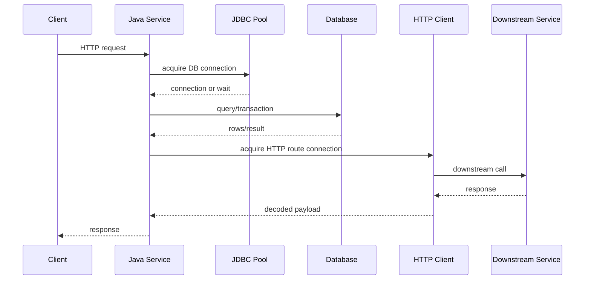
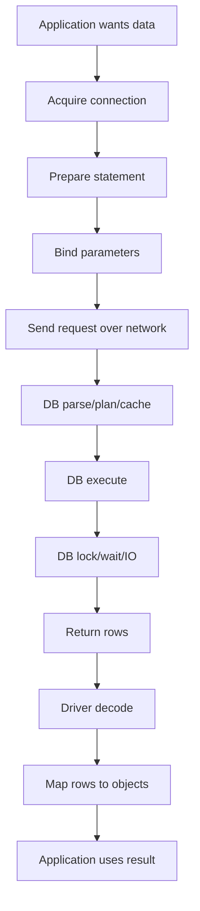
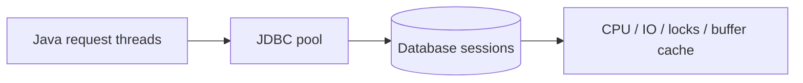
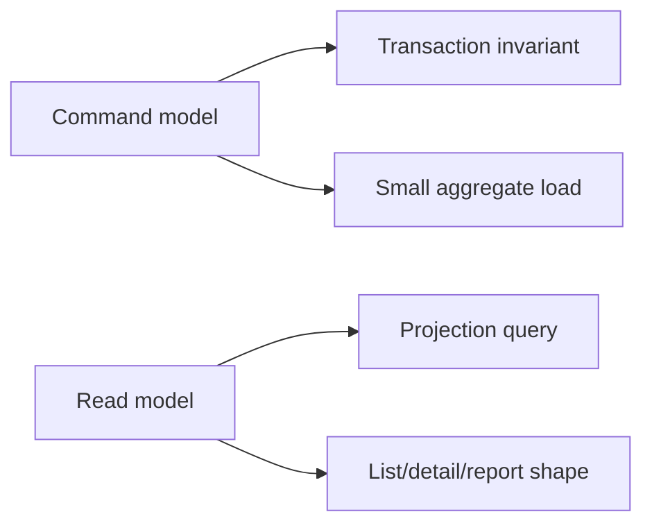
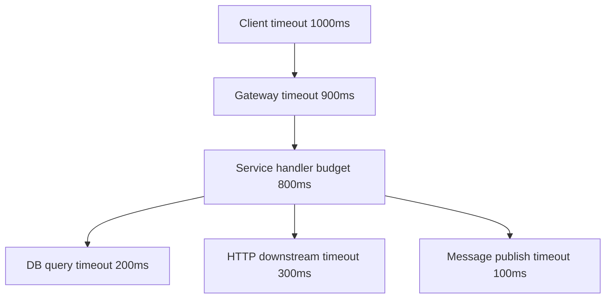
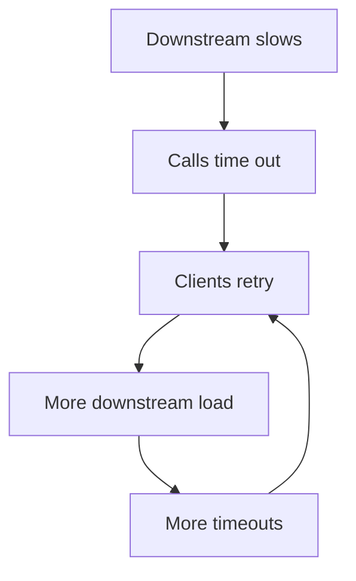
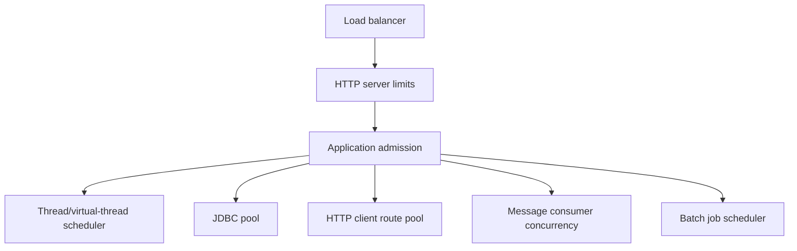
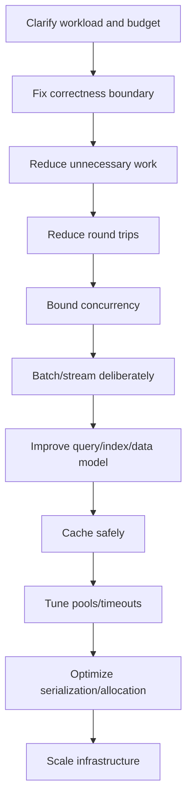

# Part 035 — Database and Network Performance from Java

A weak performance discussion says:

> The Java code is slow.

A stronger performance discussion says:

> Which boundary dominates the latency budget: database execution, database wait, connection acquisition, network round trip, serialization, TLS, downstream queueing, retry amplification, lock wait, GC, or application CPU?

Most production Java services are not pure CPU machines.

They are boundary machines.

They spend a large fraction of request time crossing boundaries:

- database;
- message broker;
- cache;
- object storage;
- HTTP service;
- identity provider;
- policy engine;
- schema registry;
- payment gateway;
- search index;
- external regulatory system;
- file system;
- TLS/network stack.

This part is about performance engineering at those boundaries.

Not “use indexing”.

Not “increase pool size”.

Not “make timeout longer”.

The goal is to build a causal model of Java service performance when work leaves the JVM.

---

## 1. Boundary performance is queueing plus protocol cost

A single API request often looks like this:



The request latency is not just Java method execution.

It is closer to:

```text
request_latency = admission_wait
                + application_cpu
                + connection_pool_wait
                + database_round_trips
                + database_execution
                + database_lock_wait
                + result_transfer
                + serialization_deserialization
                + downstream_connection_wait
                + downstream_network_time
                + downstream_service_time
                + retry_cost
                + queueing_cost
                + GC/safepoint interference
```

The important shift:

> Boundary performance failures are rarely local. They are usually coupled-resource failures.

A slow database can cause Java thread buildup.

Thread buildup can cause memory pressure.

Memory pressure can cause GC pauses.

GC pauses can cause client timeouts.

Client timeouts can trigger retries.

Retries can increase database load.

Database load can make the original slowness worse.

That is the production loop.

---

## 2. Build the end-to-end latency budget first

Before tuning any pool, define a latency budget.

Example for a `POST /cases/{id}/escalations` endpoint:

| Segment | Budget |
|---|---:|
| admission + routing | 5 ms |
| request validation | 10 ms |
| authz/policy call | 40 ms |
| DB connection acquire | 10 ms |
| DB transaction | 80 ms |
| outbox insert | included in DB transaction |
| response serialization | 5 ms |
| network overhead | 10 ms |
| margin | 40 ms |
| **p95 target** | **200 ms** |

The exact numbers depend on your system.

The technique matters more than the example.

Without a budget, teams tune blindly.

With a budget, every measurement has a target.

### 2.1 Budget invariants

A boundary-heavy service should have explicit invariants:

```text
connection_acquire_p95 <= 10ms under normal load
transaction_duration_p95 <= 80ms for workflow transition command
external_policy_call_p95 <= 40ms
retry_attempts_per_request <= 1 under normal load
http_client_pending_queue == 0 for steady-state p95 target load
```

These are not only metrics.

They are system contracts.

If they break, the service is no longer operating in its designed region.

### 2.2 Budget must include tails, not only averages

Average latency hides queueing.

If p50 is fine but p99 explodes, the system is probably saturating a shared resource:

- JDBC pool;
- DB CPU;
- DB lock;
- HTTP route pool;
- thread pool;
- Kafka partition;
- Redis connection;
- GC;
- kernel socket buffer;
- downstream service.

A performance investigation should ask:

```text
Which queue appears first as load increases?
Which queue creates the largest tail?
Which queue triggers retries or timeouts?
```

---

## 3. Database performance from Java: the real components

A Java database call has multiple phases:



When someone says “the query is slow”, it can mean many different things:

| Symptom | Possible cause |
|---|---|
| connection acquisition slow | pool too small, DB overloaded, leak, long transactions |
| query execution slow | bad plan, missing index, stale stats, full scan |
| transaction slow | lock wait, too much work in transaction, remote call inside transaction |
| result processing slow | too many rows, poor fetch size, heavy mapping, allocation churn |
| intermittent tail | pool contention, lock conflict, checkpoint, GC, network jitter |
| CPU high in app | mapping/serialization, ORM hydration, reflection, conversion |
| DB CPU high | query plan, overfetch, repeated queries, missing batching |
| DB connection count high | oversizing pool, leaked connections, too many replicas/services |

The Java engineer must separate these phases.

Do not tune JDBC pool size to fix an indexing problem.

Do not add an index to fix over-fetching.

Do not increase query timeout to hide lock contention.

---

## 4. Connection pools are not throughput multipliers

A JDBC connection pool is a concurrency limiter.

It does not make the database faster.

It controls how many requests can use database connections at the same time.



If the pool is too small, requests wait even though the database may have spare capacity.

If the pool is too large, the database may become saturated and every request becomes slower.

The correct size is not “as big as possible”.

It is the size that maximizes useful throughput while keeping latency, lock contention, and database resource usage inside the target envelope.

### 4.1 Pool sizing mental model

For database-bound work:

```text
useful_db_concurrency = number of queries/transactions the database can execute efficiently
```

Not:

```text
number of incoming HTTP requests
number of application threads
number of CPU cores in the app container
```

A service with 1,000 concurrent HTTP requests may need only 20 database connections.

A service with 20 database connections may already overload the database if each transaction is heavy.

### 4.2 Measure pool wait separately from DB time

You need at least these metrics:

```text
jdbc.pool.active
jdbc.pool.idle
jdbc.pool.pending
jdbc.pool.acquire.duration
jdbc.connection.usage.duration
jdbc.transaction.duration
jdbc.query.duration by operation
```

Interpretation:

| Observation | Meaning |
|---|---|
| acquire duration high, active near max | pool saturated |
| acquire duration low, query duration high | database/query problem |
| usage duration high, query duration low | application holding connection too long |
| active high, DB CPU low | lock wait, IO wait, slow network, idle-in-transaction, blocked clients |
| active low, pending high | pool configuration/bug or acquisition leak |
| active high after exceptions | connection leak or bad cleanup |

A connection should be held only for the minimal unit of database work.

### 4.3 Transaction scope controls pool pressure

Bad pattern:

```java
@Transactional
public Decision approve(UUID caseId, ApproveCommand command) {
    CaseEntity entity = repository.findById(caseId).orElseThrow();
    PolicyDecision policy = policyClient.evaluate(command); // remote call inside transaction
    entity.approve(policy.reason());
    auditClient.send(...); // another remote call inside transaction
    return mapper.toDecision(entity);
}
```

The database connection is held while waiting on remote systems.

That is a capacity bug.

Better pattern:

```java
public Decision approve(UUID caseId, ApproveCommand command) {
    PolicyDecision policy = policyClient.evaluate(command);

    return transactionTemplate.execute(tx -> {
        CaseEntity entity = repository.findByIdForUpdate(caseId).orElseThrow();
        entity.approve(policy.reason());
        outboxRepository.insert(AuditEvent.caseApproved(caseId, policy.reason()));
        return mapper.toDecision(entity);
    });
}
```

The transaction contains the state change and durable outbox record.

The remote policy call happens before acquiring the DB transaction.

The audit delivery happens asynchronously from the outbox.

### 4.4 Pool sizing experiment

Do not guess pool size.

Run a controlled experiment:

| Pool size | Throughput | p95 latency | p99 latency | DB CPU | lock wait | acquire p95 | errors |
|---:|---:|---:|---:|---:|---:|---:|---:|
| 5 | | | | | | | |
| 10 | | | | | | | |
| 20 | | | | | | | |
| 40 | | | | | | | |
| 80 | | | | | | | |

Look for the knee:

```text
The point where more connections stop increasing throughput but increase latency, lock wait, or DB CPU.
```

That knee is usually more important than the absolute maximum throughput.

Production systems need margin.

---

## 5. JDBC batching: reduce round trips, but preserve semantics

Single-row operations are often dominated by round trips.

Instead of:

```java
for (EscalationEvent event : events) {
    jdbc.update("insert into escalation_event (...) values (...) ", ...);
}
```

Prefer batch execution:

```java
jdbc.batchUpdate(
    "insert into escalation_event (id, case_id, type, created_at) values (?, ?, ?, ?)",
    events,
    500,
    (ps, event) -> {
        ps.setObject(1, event.id());
        ps.setObject(2, event.caseId());
        ps.setString(3, event.type());
        ps.setObject(4, event.createdAt());
    }
);
```

Batching reduces protocol overhead.

But batching changes failure behavior.

### 5.1 Batch failure invariants

For every batch path, define:

```text
If row N fails, what happened to rows 0..N-1?
Is the batch inside a transaction?
Can the batch be safely retried?
Can duplicate records be inserted?
Do constraints enforce idempotency?
Can partial success be observed by downstream readers?
```

Performance optimization without failure semantics is dangerous.

### 5.2 Batch size is a tuning parameter

Too small:

- many round trips;
- poor throughput;
- excessive overhead.

Too large:

- large memory buffers;
- long transaction;
- lock amplification;
- longer rollback;
- worse p99;
- bigger retry blast radius.

A practical starting experiment:

```text
batch_size = 50, 100, 250, 500, 1000
measure throughput, p95, p99, transaction duration, DB CPU, lock wait, memory allocation
```

Choose by evidence.

---

## 6. Fetch size and result streaming

Fetching 1,000,000 rows is not one operation.

It is a stream of protocol messages, driver buffers, row objects, mapping work, and memory pressure.

Default fetch behavior depends on driver and configuration.

The engineering rule:

> If result size can be large, make fetching behavior explicit.

Example:

```java
try (PreparedStatement ps = connection.prepareStatement(sql)) {
    ps.setFetchSize(500);
    try (ResultSet rs = ps.executeQuery()) {
        while (rs.next()) {
            handler.accept(mapRow(rs));
        }
    }
}
```

Fetch size can reduce round trips or memory pressure depending on database/driver behavior.

It is not universally “larger is better”.

### 6.1 Result shape matters more than fetch size

Bad query contract:

```sql
select * from enforcement_case
where status in ('OPEN', 'UNDER_REVIEW')
```

Better query contract:

```sql
select id, status, owner_id, updated_at
from enforcement_case
where status in ('OPEN', 'UNDER_REVIEW')
  and updated_at >= ?
order by updated_at asc
limit ?
```

Do not fetch what you do not need.

Do not map what you do not use.

Do not hydrate an object graph for a list page.

### 6.2 Streaming must not become long transaction abuse

Streaming huge result sets can hold database resources for a long time.

For operational jobs, consider chunking:

```text
read page/chunk -> process -> commit progress -> next chunk
```

Use stable pagination keys:

```sql
where updated_at > ? or (updated_at = ? and id > ?)
order by updated_at, id
limit 1000
```

Offset pagination becomes expensive for large offsets and can be unstable under concurrent writes.

---

## 7. N+1 query is a shape bug, not an ORM bug only

N+1 means:

```text
1 query to load parent rows
N queries to load related data for each parent
```

It is common with ORM lazy loading, but the underlying bug is broader:

> The code expresses data access as object traversal instead of workload-shaped data retrieval.

Bad shape:

```java
List<CaseEntity> cases = caseRepository.findOpenCases();
for (CaseEntity c : cases) {
    Owner owner = c.getOwner();       // hidden query
    List<Task> tasks = c.getTasks();  // hidden query
    render(c, owner, tasks);
}
```

Better shape:

```java
List<CaseSummaryRow> rows = caseReadModel.findOpenCaseSummaries(page);
```

Or explicitly batch-load:

```java
List<UUID> caseIds = cases.stream().map(CaseEntity::id).toList();
Map<UUID, Owner> owners = ownerRepository.findByCaseIds(caseIds);
Map<UUID, List<Task>> tasks = taskRepository.findByCaseIds(caseIds);
```

### 7.1 Query count should be a testable invariant

For important paths, test query count.

```text
List open case summaries must execute <= 3 SQL statements for page size 100.
```

This is not micro-optimization.

It prevents accidental workload explosion.

### 7.2 Read model separation

A command aggregate is optimized for correctness of state transition.

A read model is optimized for query shape.

Do not force the same object graph to serve both.



---

## 8. Transaction duration is a performance metric and correctness signal

Long transactions hurt performance by holding:

- locks;
- MVCC snapshots;
- database sessions;
- undo/redo resources;
- row versions;
- pool connections.

A transaction should be sized around a consistency boundary.

Not around a whole user journey.

Not around remote calls.

Not around rendering.

Not around message delivery.

### 8.1 Good transaction design

A good transaction has:

```text
small read set
small write set
clear invariant
bounded duration
no remote calls
idempotency key if command can retry
durable outbox if event must be emitted
explicit lock strategy
```

### 8.2 Lock strategy must be deliberate

Common strategies:

| Strategy | Use case | Risk |
|---|---|---|
| optimistic version | low conflict command updates | retry path required |
| pessimistic row lock | high-value single resource transition | lock wait, deadlock |
| unique constraint | idempotency/deduplication | error handling must be semantic |
| advisory lock | cross-row coordination | misuse creates hidden global bottleneck |
| queue partitioning | ordered per-key processing | hot partition |

Performance and correctness are linked.

A correctness fix can degrade throughput.

A throughput fix can break invariants.

Top engineers model both.

---

## 9. Timeout budgets: never configure timeouts independently

A Java service often has multiple timeouts:



Timeouts must be nested.

Bad:

```text
client timeout = 2s
service timeout = 5s
database timeout = 30s
http downstream timeout = 60s
```

The caller already gave up, but the service keeps working.

That creates waste and retry amplification.

Better:

```text
client timeout = 1000ms
gateway timeout = 950ms
service request budget = 850ms
database timeout = 150ms
policy service timeout = 200ms
message broker timeout = 100ms
```

### 9.1 Timeout is not failure handling

A timeout only stops waiting.

It does not tell you:

- whether the downstream operation happened;
- whether the database transaction committed;
- whether the broker accepted the message;
- whether retry is safe;
- whether compensation is needed.

Timeout requires semantic design.

```text
If command times out after DB commit but before response, client retry must be idempotent.
```

That is not a transport concern.

That is a domain invariant.

---

## 10. Retries: capacity amplifier or reliability tool

Retries are useful only when failures are transient and retry is safe.

Bad retry policy:

```text
retry every error 3 times immediately
```

Better policy:

```text
retry only retryable failures
use exponential backoff with jitter
respect request deadline
use idempotency key
limit retry budget
record retry attempts
avoid retrying overload signals blindly
```

### 10.1 Retry amplification

If each request retries three times, a dependency outage can multiply load by four.



A retry policy is part of capacity planning.

### 10.2 Deadline-aware retry

```java
public <T> T callWithDeadline(Deadline deadline, Supplier<T> call) {
    int attempt = 0;
    while (true) {
        attempt++;
        Duration remaining = deadline.remaining();
        if (remaining.compareTo(Duration.ofMillis(50)) < 0) {
            throw new DeadlineExceededException();
        }

        try {
            return call.get();
        } catch (TransientDependencyException e) {
            if (attempt >= 3 || !deadline.hasTimeForRetry()) {
                throw e;
            }
            sleep(jitteredBackoff(attempt, deadline.remaining()));
        }
    }
}
```

The retry must respect the caller’s budget.

---

## 11. HTTP client performance from Java

An outbound HTTP call includes:

```text
DNS lookup
connection acquisition
TCP connect if new connection
TLS handshake if new TLS session
request serialization
network transfer
downstream queueing/service time
response transfer
response decompression/decoding
JSON/XML/protobuf deserialization
application mapping
```

The slow part may not be the downstream service logic.

It may be connection churn, TLS, payload size, route pool wait, DNS, or client-side decoding.

### 11.1 HTTP connection pooling

For Java HTTP clients, measure:

```text
route connection pool active
route connection pool pending
connection acquisition duration
connect duration
TLS handshake duration
request write duration
first byte latency
response read duration
payload bytes
status code distribution
retry attempts
```

If route pool pending is high, increasing application threads will make things worse.

If connect/TLS time is high, connection reuse may be broken.

If response read time is high, payload size or downstream streaming may dominate.

### 11.2 Keep route-specific limits

Global max connections is not enough.

A single hot downstream can consume the whole client pool.

Use route/host-specific limits if your client supports them.

```text
payment-service: max 50 connections
policy-service: max 30 connections
search-service: max 20 connections
```

Resource isolation prevents one dependency from starving others.

### 11.3 HTTP/2 changes the model, not the budget

HTTP/2 multiplexing can reduce connection count and head-of-line behavior at the application protocol level.

But capacity still exists:

- server concurrent stream limit;
- client stream limit;
- TCP congestion;
- TLS overhead;
- downstream CPU;
- payload decoding;
- backpressure.

Do not replace connection pool analysis with “we use HTTP/2”.

---

## 12. Serialization and payload engineering

Payload performance is often ignored because it looks like “just JSON”.

But payload shape affects:

- CPU;
- allocation rate;
- GC;
- network transfer;
- compression cost;
- client latency;
- schema evolution;
- cacheability.

### 12.1 Measure bytes, not only time

For each endpoint/event:

```text
request bytes p50/p95/p99
response bytes p50/p95/p99
serialized object count
deserialization allocation rate
compressed vs uncompressed size
schema version
field usage
```

A 20 MB JSON response is not an API response.

It is a batch export disguised as an API response.

### 12.2 DTO shape must match use case

Bad:

```java
record CaseDto(
    UUID id,
    String status,
    List<InvestigationDto> investigations,
    List<DocumentDto> documents,
    List<CommentDto> comments,
    List<AuditEntryDto> auditTrail
) {}
```

This is not a DTO.

It is an accidental graph dump.

Better:

```java
record CaseListItemDto(
    UUID id,
    String referenceNumber,
    String status,
    String ownerName,
    Instant updatedAt
) {}

record CaseDetailDto(
    UUID id,
    String referenceNumber,
    String status,
    OwnerDto owner,
    List<CurrentTaskDto> currentTasks
) {}
```

List views, detail views, exports, and audit views deserve different contracts.

### 12.3 Compression is a trade-off

Compression reduces network bytes.

It increases CPU.

It can improve latency for large payloads and hurt latency for small payloads.

Measure:

```text
payload size before/after compression
CPU cost
p95/p99 response latency
client compatibility
cache behavior
```

---

## 13. Cache performance: latency win, correctness risk

Caches reduce repeated boundary work.

They also introduce correctness problems:

- stale data;
- invalidation race;
- cache stampede;
- inconsistent authorization;
- memory pressure;
- hot keys;
- serialization overhead;
- split-brain behavior if distributed.

The first question is not “can we cache this?”

The first question is:

```text
What stale result is allowed, for how long, for which user, under which state transition?
```

### 13.1 Cache decision table

| Data | Cacheable? | TTL | Invalidation | Risk |
|---|---:|---:|---|---|
| reference country list | yes | hours-days | deploy/admin update | low |
| user permissions | maybe | seconds-minutes | role change event | security risk |
| case workflow state | rarely | very short | transition event | stale decision |
| pricing/policy rule | yes with version | rule publish event | wrong decision |
| audit trail | maybe | immutable chunks | append event | incomplete view |

### 13.2 Cache stampede control

When a hot key expires, many threads may recompute it.

Use:

- request coalescing;
- stale-while-revalidate;
- jittered TTL;
- per-key lock with timeout;
- background refresh;
- admission policy;
- circuit breaker for backing dependency.

---

## 14. Backpressure and admission control

If the service accepts more work than it can process, queues grow.

If queues grow without bound, latency becomes unbounded.

If latency becomes unbounded, clients retry.

If clients retry, load increases.

Backpressure is not optional.

### 14.1 Places to apply backpressure



Useful controls:

- max concurrent requests;
- queue limit;
- pending acquisition timeout;
- request deadline;
- per-tenant quota;
- per-operation concurrency limit;
- circuit breaker;
- adaptive load shedding;
- broker consumer pause/resume;
- batch job rate limit.

### 14.2 Reject early, not late

Late rejection wastes work.

If the service cannot acquire a required dependency within its budget, fail fast with a meaningful response.

```text
503 Service Unavailable
Retry-After: small bounded value if retry is safe
```

For commands, make idempotency explicit.

For queries, allow safe retry.

For long-running jobs, enqueue only when capacity exists.

---

## 15. Database/network performance diagnostics workflow

Use this order during investigation.

### Step 1 — Capture user-visible symptom

```text
endpoint: POST /cases/{id}/approve
load window: 2026-07-03 10:00-10:30 Asia/Jakarta
symptom: p99 increased from 450ms to 4s
error: gateway timeout increased from 0.1% to 3%
```

### Step 2 — Segment latency

Break down:

```text
server request duration
JDBC acquire duration
transaction duration
query durations
HTTP downstream durations
serialization duration
GC pause/safepoint
thread pool queue time
```

### Step 3 — Check saturation indicators

```text
CPU
heap/allocation rate
GC pause
JDBC pool active/pending
DB CPU/wait/locks
HTTP client pending
downstream latency/error
retry count
queue lag
```

### Step 4 — Identify first constrained resource

The first constrained resource is usually the cause.

Later queues are often symptoms.

### Step 5 — Reproduce with workload

Do not patch based only on production panic.

Build a representative benchmark/load test:

- same endpoint mix;
- same data shape;
- same transaction conflict rate;
- same payload size;
- same downstream latency distribution;
- same retry policy;
- same pool limits.

### Step 6 — Change one variable at a time

Example variables:

```text
JDBC max pool size
transaction scope
query index
batch size
fetch size
HTTP route limit
timeout budget
retry count
payload fields
cache TTL
consumer concurrency
```

Measure before/after.

---

## 16. Case study: approval workflow collapse

### 16.1 Initial design

A Java service handles case approval.

Path:

```text
HTTP request
-> start DB transaction
-> load case aggregate
-> call policy service
-> update case
-> call notification service
-> insert audit
-> commit
```

Symptoms under load:

```text
p95 = 180 ms at 50 rps
p95 = 1200 ms at 120 rps
p99 = 8000 ms at 120 rps
JDBC pool active = max
JDBC acquire p99 = 5000 ms
DB CPU = 35%
policy service p95 = 300 ms
notification service p95 = 500 ms
```

Weak conclusion:

> Increase JDBC pool.

Actual diagnosis:

> DB connections are held while waiting on remote services. The pool is not too small; transaction scope is wrong.

### 16.2 Refactored design

```text
HTTP request
-> call policy service before transaction
-> start DB transaction
-> load case for update
-> validate transition against current state and policy result
-> update case
-> insert audit/outbox event
-> commit
-> notification sent asynchronously from outbox
```

New invariants:

```text
no remote call inside transaction
transaction p95 <= 80ms
JDBC acquire p95 <= 10ms
approval command is idempotent by command_id
notification delivery is at-least-once and deduplicated by event_id
```

Expected result:

- lower connection usage duration;
- lower pool wait;
- higher stable throughput;
- less tail amplification;
- safer retry semantics.

The performance fix came from correctness boundary design.

---

## 17. Java code review checklist for boundary performance

Ask these questions in review.

### 17.1 Database

- Is query shape explicit?
- Is result size bounded?
- Is pagination stable?
- Is fetch size/batch size deliberate for large data?
- Is transaction scope minimal?
- Are remote calls outside transaction?
- Are locks deliberate?
- Is idempotency enforced by constraint?
- Are connection acquisition and transaction duration measured?
- Is N+1 prevented by design or test?

### 17.2 Network/HTTP

- Are connect/read/request timeouts set?
- Are timeouts nested inside caller deadline?
- Are retries limited, jittered, and deadline-aware?
- Is retry safe by idempotency key?
- Is route-specific connection limit configured?
- Is payload size bounded?
- Is response streaming/chunking needed?
- Are downstream errors classified semantically?
- Are circuit breaker/backpressure rules defined?

### 17.3 System behavior

- What happens when DB slows by 5x?
- What happens when downstream p99 becomes 10s?
- What happens when connection pool is exhausted?
- What happens when client times out but command committed?
- What happens when retry duplicates a command?
- What happens when cache returns stale policy?
- What happens when batch partially succeeds?

---

## 18. Metrics contract

For every production Java service, expose at least:

```text
http.server.request.duration by route/status
http.client.request.duration by dependency/route/status
jdbc.connection.acquire.duration
jdbc.connection.usage.duration
jdbc.query.duration by operation
transaction.duration by use case
connection.pool.active/idle/pending/max
retry.attempts by dependency
circuit.breaker.state
payload.bytes by route
serialization.duration by format/route
queue.depth and queue.lag
consumer.processing.duration
consumer.retry.count
outbox.pending.count
outbox.publish.delay
```

But raw metrics are not enough.

You need interpretation rules:

```text
If jdbc.acquire.p95 > 20ms and pool.active == max, inspect transaction duration and DB wait.
If http.client.pending > 0 and route.active == route.max, inspect downstream latency and route limit.
If retry.count increases with downstream 5xx, check retry budget and circuit breaker.
If payload.p99 grows, inspect schema and response field expansion.
```

---

## 19. Performance improvement hierarchy

Do not start with low-level tuning.

Use this order:



Scaling infrastructure before fixing workload shape is expensive.

Tuning pools before fixing transaction scope is misleading.

Caching before defining staleness contract is dangerous.

---

## 20. The core lesson

Database and network performance from Java is not a library problem.

It is a boundary design problem.

The top-level skill is to connect:

```text
business invariant
-> transaction boundary
-> query shape
-> resource pool
-> timeout budget
-> retry semantics
-> observability signal
-> benchmark/load test
-> production SLO
```

A top engineer does not ask only:

> How do I make this call faster?

They ask:

> What resource does this call consume, how is that resource bounded, what happens when it saturates, what invariant must still hold, and what evidence proves it?

That is the difference between tuning and performance engineering.

---

## References

- Oracle Java SE API: `java.sql.Statement#setFetchSize` and JDBC concepts.
- Oracle JDBC performance documentation on prefetch/fetch size and round trips.
- HikariCP Wiki: pool sizing principles.
- Java `HttpClient` API and client behavior.
- Earlier series parts: Part 026 on performance measurement theory, Part 029 on macrobenchmarking, Part 030 on performance regression, and Part 034 on concurrency performance.
