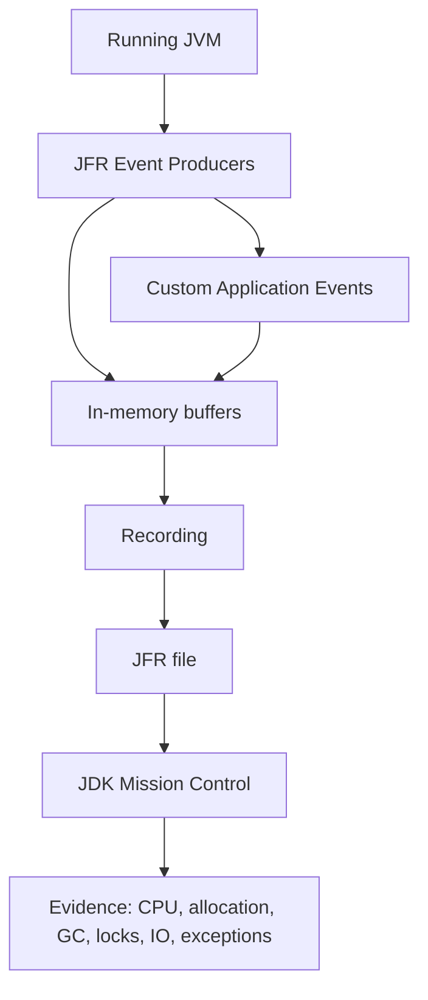
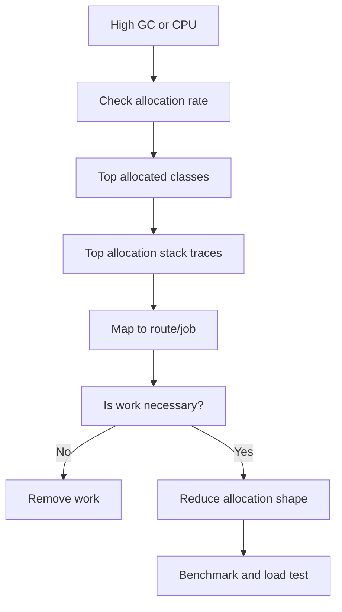
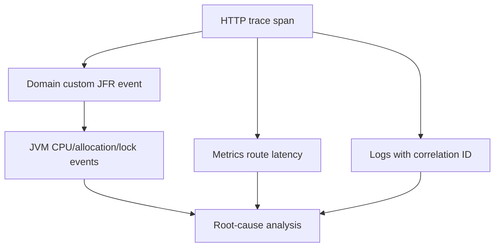

# Part 036 — JFR and JMC Production Profiling

A weak profiling discussion says:

> The CPU is high. Run a profiler.

A stronger profiling discussion says:

> Which hypothesis are we testing: allocation pressure, lock contention, blocked IO, GC pause, hot method, exception storm, class loading, safepoint delay, thread starvation, virtual-thread pinning, or downstream wait? What recording settings capture that evidence with acceptable overhead?

Java Flight Recorder changes how you should think about production diagnostics.

It is not just “a profiler”.

It is an event recorder built into the JDK.

JDK Mission Control is the analysis tool that helps inspect recordings.

Together, they let you answer questions that logs and metrics often cannot answer:

- Which methods consumed CPU?
- Which allocation sites created memory pressure?
- Which locks caused blocking?
- Which threads were waiting?
- Which file/socket operations were slow?
- Which exceptions were thrown frequently?
- Which GC phases occurred?
- Which classes loaded?
- Which custom business operation was active when the runtime degraded?

This part is about using JFR/JMC as production evidence.

Not screenshots.

Not “click around until something looks suspicious”.

The goal is a repeatable workflow.

---

## 1. Why JFR matters

Traditional profiling often has one of two failure modes.

First, it is too invasive for production.

Second, it is disconnected from runtime context.

JFR is useful because it records structured events from the JVM and application with relatively low operational friction.

A recording can include:

```text
CPU execution samples
allocation events
GC events
thread states
lock events
socket/file IO events
exception events
class loading events
compiler/JIT events
safepoint events
custom application events
```

That combination matters.

CPU alone does not explain allocation.

Allocation alone does not explain lock wait.

Lock wait alone does not explain HTTP timeout.

JFR gives you a timeline.

### 1.1 JFR is event-based evidence

A JFR event is structured data.

Conceptually:

```text
event_type
start_time / duration
thread
stack_trace if enabled
payload fields
metadata
```

Example event classes include runtime events such as execution sample, allocation, monitor enter, socket read, file write, garbage collection, exception statistics, and many others depending on JDK/version/settings.

You should think in questions:

```text
What event would prove or disprove this hypothesis?
```

Not:

```text
What chart looks red?
```

---

## 2. JFR/JMC mental model



JFR records events.

JMC analyzes recordings.

A recording is not a metric dashboard.

It is a forensic artifact.

Use it when you need causal detail beyond aggregates.

### 2.1 Metrics vs logs vs traces vs JFR

| Signal | Strength | Weakness |
|---|---|---|
| metrics | cheap trends, alerting, SLO | low detail, aggregation hides cause |
| logs | semantic breadcrumbs | noisy, incomplete, high-cardinality risk |
| traces | request/dependency path | may miss JVM internals |
| JFR | JVM/runtime detail + stack/context | needs interpretation, recording settings matter |

The best production diagnosis uses all four.

Example:

```text
Metrics: p99 latency and allocation rate increased.
Traces: slow route is /cases/{id}/timeline.
Logs: no functional errors.
JFR: allocation hotspot in JSON serialization of audit history.
```

---

## 3. Recording strategy

There are three common strategies.

### 3.1 Always-on low-overhead recording

Run continuous recording with conservative settings and a rolling disk repository.

Purpose:

- capture evidence before incident disappears;
- support post-incident analysis;
- avoid “cannot reproduce” loop;
- inspect rare tails.

Conceptual JVM option:

```bash
-XX:StartFlightRecording=name=continuous,settings=profile,disk=true,maxage=1h,maxsize=512m,filename=/var/log/app/continuous.jfr
```

Exact settings depend on your JDK, container, filesystem, and operational policy.

### 3.2 On-demand incident recording

Start recording when symptoms occur.

Using `jcmd` conceptually:

```bash
jcmd <pid> JFR.start name=incident settings=profile duration=120s filename=/tmp/incident.jfr
```

Or dump an existing recording:

```bash
jcmd <pid> JFR.dump name=continuous filename=/tmp/incident-snapshot.jfr
```

### 3.3 Reproduction recording

Use JFR during benchmark/load test reproduction.

Purpose:

- compare baseline vs regression;
- validate fix;
- capture allocation/CPU/lock differences;
- produce evidence for performance review.

---

## 4. Do not record blindly: start from hypotheses

A JFR investigation should begin with a hypothesis table.

| Symptom | Hypothesis | JFR evidence |
|---|---|---|
| high CPU | hot code path | execution samples, method profiling |
| high GC | allocation pressure | allocation events, heap summary, GC events |
| high p99 | lock contention | monitor enter/blocking events, thread states |
| slow file export | file IO bottleneck | file read/write events |
| slow downstream call | socket wait | socket read/write events, thread states |
| random latency spikes | safepoint/GC/class loading | safepoint, GC, class loading events |
| memory growth | retention/leak suspicion | allocation + heap dump outside JFR if needed |
| error CPU spike | exception storm | exception statistics/events |

Recording without a hypothesis produces noise.

Hypothesis-driven recording produces evidence.

---

## 5. JMC analysis workflow

When you open a `.jfr` file in JMC, do not start by clicking random tabs.

Use a fixed path.

### Step 1 — Confirm recording context

Capture:

```text
service name
version/git SHA
JDK version
container CPU/memory limits
recording start/end time
environment
load level
incident ticket
symptom
```

A recording without context is weak evidence.

### Step 2 — Look at overview timeline

Ask:

- When did latency spike?
- Was CPU high at the same time?
- Did GC pause align with the spike?
- Did allocation rate increase before GC?
- Did thread count increase?
- Did blocking increase?
- Did IO wait increase?

### Step 3 — CPU view

Look for:

- hot methods;
- unexpected frameworks dominating CPU;
- serialization/deserialization hotspots;
- regex/parser hotspots;
- logging overhead;
- reflection/method-handle-heavy paths;
- security/crypto hotspots;
- compression hotspots.

Important:

CPU hotspot means “where CPU was spent”.

It does not automatically mean “bug”.

The hotspot may be legitimate work caused by a higher-level shape problem.

### Step 4 — Allocation view

Look for:

- allocation rate by class;
- allocation rate by stack trace;
- short-lived object churn;
- large arrays/byte buffers;
- object graph creation in list endpoints;
- boxing;
- string creation;
- JSON/XML intermediate objects;
- exception allocation;
- per-request formatter/parser allocation.

Allocation is often a better first signal than heap usage.

Heap usage tells you what remains.

Allocation rate tells you how much garbage you produce.

### Step 5 — GC view

Look for:

- GC frequency;
- pause duration;
- cause;
- heap before/after;
- promotion pressure;
- humongous allocation if relevant;
- concurrent phase behavior;
- allocation rate preceding pauses.

Do not tune GC until you understand allocation source.

### Step 6 — Threads and locks

Look for:

- blocked threads;
- monitor contention;
- executor starvation;
- virtual-thread pinning indicators where available;
- lock owner stack;
- high contention region;
- deadlock-like wait patterns;
- long synchronized sections.

Lock contention is often a design problem, not a primitive problem.

### Step 7 — IO view

Look for:

- slow socket reads/writes;
- file IO duration;
- unexpected blocking in request threads;
- large payload transfer;
- DNS/TLS/client behavior if visible through surrounding events;
- dependency correlation using thread and timestamp.

JFR may not replace distributed tracing, but it can show that the thread was blocked in socket read during the latency spike.

### Step 8 — Exceptions

Look for:

- high exception throw rate;
- exceptions used for control flow;
- repeated parsing failures;
- retry loops throwing repeatedly;
- stack traces from validation/parsing boundary.

Exceptions have CPU and allocation cost.

They also reveal semantic failures.

---

## 6. CPU profiling with JFR

CPU samples answer:

```text
Where was execution time spent while threads were runnable/on CPU?
```

Example findings:

| Finding | Interpretation |
|---|---|
| JSON serializer dominates | payload shape or serialization config issue |
| regex dominates | inefficient pattern or repeated compilation |
| logging layout dominates | excessive sync/formatting/log volume |
| security crypto dominates | TLS/signature/encryption cost |
| mapper reflection dominates | DTO/object mapping overhead |
| collection sorting dominates | algorithm/data-size issue |
| hash/equality dominates | key design or map usage issue |

### 6.1 CPU hotspot review template

For each hotspot:

```text
Method/class:
Percentage of samples:
Route/job involved:
Input size:
Expected or unexpected:
Can work be avoided:
Can work be batched/cached:
Can algorithm change:
Can object allocation reduce:
Correctness risk of change:
Benchmark needed:
```

Do not optimize a method because it appears in flame view.

Optimize only when the work is unnecessary, inefficient, or outside the latency budget.

---

## 7. Allocation profiling with JFR

Allocation pressure is a major JVM performance driver.

High allocation can cause:

- young GC frequency;
- promotion pressure;
- cache misses;
- memory bandwidth pressure;
- p99 spikes;
- container memory pressure;
- CPU consumed by GC;
- poorer locality.

### 7.1 Common allocation culprits

| Culprit | Example |
|---|---|
| accidental graph hydration | ORM loads full aggregate for list page |
| serialization intermediates | object -> map -> JSON -> byte array |
| string manipulation | split/regex/substring/chained concatenation |
| boxing | `Long`, `Integer`, streams on primitives poorly used |
| per-call formatter | new date/number formatter repeatedly |
| exceptions | exception-heavy validation path |
| collection churn | create many short-lived lists/maps |
| byte arrays | compression, buffering, payload copy |
| logging | structured field conversion and message formatting |

### 7.2 Allocation diagnosis flow



### 7.3 Allocation optimization hierarchy

Use this order:

1. Do less work.
2. Fetch less data.
3. Serialize fewer fields.
4. Avoid intermediate representations.
5. Reuse immutable/static expensive helpers.
6. Use primitive-specialized paths where justified.
7. Tune buffers/batches.
8. Consider pooling only with strong evidence.

Object pooling is usually a last resort in modern JVM applications.

It can worsen locality, retention, and correctness.

---

## 8. Lock and blocking analysis

Lock contention appears as waiting time, not necessarily CPU.

A service can have low CPU and terrible latency because threads are blocked.

Common sources:

- `synchronized` hot path;
- single shared cache lock;
- global rate limiter lock;
- logging appender lock;
- connection pool wait;
- bounded executor queue;
- class initialization lock;
- static synchronized utility;
- per-tenant global lock;
- poor key partitioning;
- virtual thread pinned in synchronized/blocking native region.

### 8.1 Lock investigation questions

```text
Which monitor/lock is contended?
Who owns it?
How long is it held?
What work is inside the critical section?
Is IO inside the lock?
Is logging inside the lock?
Is allocation inside the lock?
Can the lock be sharded by key?
Can immutable snapshot replace locking?
Can concurrent data structure replace coarse lock?
```

### 8.2 Coarse lock example

Bad:

```java
public synchronized Decision evaluate(Command command) {
    RuleSet rules = ruleRepository.loadCurrent(); // IO under lock
    return engine.evaluate(rules, command);
}
```

Better:

```java
public Decision evaluate(Command command) {
    RuleSet snapshot = currentRuleSet.get();
    return engine.evaluate(snapshot, command);
}
```

Update snapshot separately:

```java
public void refreshRules() {
    RuleSet loaded = ruleRepository.loadCurrent();
    currentRuleSet.set(loaded);
}
```

This changes the concurrency model.

You must define staleness semantics.

Performance fix must preserve correctness.

---

## 9. IO profiling: sockets and files

JFR socket/file events help answer:

```text
Was the thread executing Java code or waiting on IO?
```

Slow endpoint example:

```text
p99 request = 5s
CPU normal
GC normal
threads blocked in SocketRead
stack trace points to policyClient.evaluate()
```

The likely issue is downstream wait, not application CPU.

Next step is to correlate with:

- distributed trace span;
- HTTP client metrics;
- downstream status;
- connection pool metrics;
- timeout/retry policy;
- payload size.

### 9.1 File IO example

If JFR shows long file writes during request path:

- audit log may be synchronous;
- export may write local temp file;
- logging may block;
- container filesystem may be slow;
- disk pressure may affect latency.

File IO in request path should be deliberate.

---

## 10. Exception profiling

High exception rate is both correctness smell and performance smell.

Examples:

- parser fails repeatedly on invalid payloads;
- validation uses exceptions for normal branch;
- retry loop throws every attempt;
- optional/missing domain state encoded as exception;
- deserializer fallback throws internally;
- unauthorized requests produce expensive stack traces.

### 10.1 Exception storm review

```text
Exception type:
Throw rate:
Top stack trace:
Route/job:
Expected or unexpected:
Input source:
Can validation reject earlier:
Can control flow avoid exception:
Should stack trace be disabled/customized:
Does exception trigger retry:
```

Do not hide exceptions just to reduce noise.

First decide whether they represent real failure, malicious/noisy input, or poor control-flow design.

---

## 11. Custom JFR events

JFR becomes much stronger when application events connect domain operations to runtime behavior.

Example custom event:

```java
import jdk.jfr.Category;
import jdk.jfr.Event;
import jdk.jfr.Label;
import jdk.jfr.Name;

@Name("com.acme.CaseTransition")
@Label("Case Transition")
@Category({"Acme", "Workflow"})
public class CaseTransitionEvent extends Event {
    @Label("Case ID")
    public String caseId;

    @Label("From State")
    public String fromState;

    @Label("To State")
    public String toState;

    @Label("Command Type")
    public String commandType;

    @Label("Outcome")
    public String outcome;
}
```

Usage:

```java
public Decision transition(CaseId id, Command command) {
    CaseTransitionEvent event = new CaseTransitionEvent();
    event.caseId = id.value().toString();
    event.commandType = command.type();

    event.begin();
    try {
        CaseAggregate before = repository.load(id);
        event.fromState = before.status().name();

        CaseAggregate after = before.apply(command);
        repository.save(after);

        event.toState = after.status().name();
        event.outcome = "SUCCESS";
        return Decision.accepted(after.status());
    } catch (RuntimeException e) {
        event.outcome = "FAILURE";
        throw e;
    } finally {
        event.commit();
    }
}
```

Now JFR can answer:

```text
Which domain transition was active during allocation spike?
Which workflow command correlates with lock wait?
Which operation had long duration and which stack trace caused it?
```

### 11.1 Custom event design rules

Good custom events are:

- low-cardinality enough for analysis;
- semantically meaningful;
- safe for privacy/security;
- cheap when disabled;
- bounded in payload size;
- tied to use cases, not every trivial method;
- stable enough for operational workflows.

Avoid:

- dumping full JSON payload;
- logging PII/secrets;
- recording unbounded strings;
- creating event per tiny loop iteration;
- using custom event as replacement for metrics/logs/traces.

### 11.2 Event taxonomy

Useful event categories:

| Category | Example event |
|---|---|
| domain command | case transition, order submit, payment authorize |
| workflow | escalation rule evaluation, approval chain step |
| infrastructure | outbox publish batch, idempotency lookup |
| integration | external policy decision, schema validation |
| batch/job | reconciliation chunk, report generation |
| performance guard | slow path fallback, cache stampede suppression |

---

## 12. Continuous profiling operating model

JFR is most valuable when it is part of normal operations.

### 12.1 Standard artifacts

For every performance incident, collect:

```text
incident timeline
service version
JDK version
container limits
metrics dashboard snapshot
representative traces
JFR recording
GC logs if enabled
thread dump if needed
heap dump only if retention/leak suspected
load level
recent deploy/config change
```

### 12.2 Recording retention policy

Define:

```text
where recordings are stored
how long they are retained
who can access them
what data may appear in custom events
how recordings are attached to incident tickets
how to sanitize before sharing
```

A JFR file may contain sensitive operational data.

Treat it as production evidence, not casual debug output.

---

## 13. JFR in CI and performance regression

JFR is not only for production incidents.

Use it in controlled performance tests.

### 13.1 Baseline vs candidate comparison

For a benchmark/load test, capture JFR for baseline and candidate build.

Compare:

```text
CPU top methods
allocation rate
top allocation stack traces
GC count/duration
lock contention
socket/file IO
exception rate
thread count
custom domain event duration
```

A performance regression gate should not say only:

```text
p95 got worse by 18%
```

It should say:

```text
p95 got worse by 18%.
Allocation rate increased by 2.3x.
Top new allocation site is CaseTimelineMapper.toDto.
Response payload p99 grew from 220 KB to 2.4 MB.
```

That is actionable.

### 13.2 Attach JFR to failed perf gate

When a performance gate fails, store:

```text
JMH JSON result
load test summary
JFR file
GC log
application config
commit SHA
container limits
flamegraph if generated
```

Do not make engineers reproduce from memory.

---

## 14. Production incident playbooks

### 14.1 High CPU incident

1. Start/dump JFR.
2. Confirm CPU saturation from metrics.
3. Inspect CPU samples.
4. Identify route/job using traces/custom events.
5. Check allocation and exceptions to avoid false CPU conclusion.
6. Mitigate if needed: traffic shaping, disable feature flag, reduce payload, rollback.
7. Reproduce with load test.
8. Fix and compare JFR before/after.

### 14.2 High memory/GC incident

1. Capture JFR and GC logs.
2. Inspect allocation rate and top allocation sites.
3. Check heap after GC trend.
4. If retention suspected, take heap dump using approved policy.
5. Distinguish leak from allocation pressure.
6. Reduce data shape/object churn before tuning GC.
7. Validate under representative load.

### 14.3 High p99 with normal CPU

1. Inspect thread states and blocking events.
2. Check socket/file IO durations.
3. Check lock contention.
4. Check JDBC/HTTP pool metrics.
5. Correlate with traces.
6. Inspect timeout/retry behavior.
7. Apply backpressure/resource isolation if needed.

### 14.4 Exception storm

1. Inspect exception events/statistics.
2. Find top exception type and stack trace.
3. Map to route/input/downstream.
4. Determine whether exception is expected validation or unexpected fault.
5. Stop retry amplification if present.
6. Fix parsing/validation/control-flow path.

---

## 15. Reading JFR without fooling yourself

### 15.1 Sampling bias

CPU profiling is sampled.

Short-lived methods may be underrepresented.

Very frequent small allocations may matter even if individual method looks harmless.

Use multiple views.

### 15.2 Correlation is not causation

A GC pause during latency spike may be cause or symptom.

If allocation rate spiked first, GC is likely consequence.

If GC pause happened before request delays, it may be cause.

Use timeline ordering.

### 15.3 Top method is not always fix target

If JSON serialization dominates CPU, the real fix may be reducing payload size.

If database driver dominates socket read, the fix may be query/DB/downstream, not driver tuning.

If lock appears hot, the fix may be removing shared mutable state.

### 15.4 Recording settings change evidence

Some events require thresholds or stack traces.

Higher detail can increase overhead and file size.

Use stronger settings during controlled reproduction than always-on production.

---

## 16. Example: diagnosing slow case timeline endpoint

### 16.1 Symptom

```text
GET /cases/{id}/timeline
p95: 180 ms -> 900 ms
p99: 600 ms -> 5 s
CPU: +40%
GC: young GC frequency increased
DB query p95: stable
```

### 16.2 JFR findings

```text
Top allocation:
- java.lang.String
- byte[]
- AuditEntryDto
- ArrayList growth

Top CPU:
- JSON serialization
- date formatting
- CaseTimelineMapper.toDto

Custom event:
- CaseTimelineRender duration aligns with allocation spike

DB:
- one query, stable duration
```

### 16.3 Actual cause

A new field added nested document metadata to every audit entry.

Payload grew from:

```text
p95 response bytes: 180 KB
```

to:

```text
p95 response bytes: 2.8 MB
```

Database was not the bottleneck.

Serialization and allocation were.

### 16.4 Fix

- Split timeline summary from document detail.
- Add field expansion parameter.
- Cap page size.
- Cache immutable reference labels.
- Add payload-size test.
- Add performance regression scenario.

New invariant:

```text
case timeline page response p95 payload <= 300 KB for page size 100
```

---

## 17. Example: slow approval command with normal CPU

### 17.1 Symptom

```text
POST /cases/{id}/approve
p99: 8 s
CPU: normal
GC: normal
JDBC pool: active max
JDBC acquire p99: 5 s
```

### 17.2 JFR findings

```text
Thread states:
- many request threads waiting for JDBC connection

Socket read:
- policy service call waits 300-700ms

Custom CaseTransition event:
- duration includes policy call

Stack trace:
- policy call happens inside @Transactional method
```

### 17.3 Actual cause

Connections were held while waiting for remote policy service.

### 17.4 Fix

- Move policy call outside transaction.
- Keep transaction limited to aggregate transition and outbox insert.
- Add custom JFR event around transaction only.
- Add metric for transaction duration.
- Add test preventing remote call inside transaction boundary by architectural rule.

Performance improved by changing correctness boundary.

---

## 18. Custom JFR event + metrics + trace integration

Strong observability connects signals.



A practical pattern:

- trace ID in logs;
- route/span labels in metrics;
- custom JFR event with operation name and bounded IDs;
- JFR recording time aligned with incident timeline;
- benchmark reproduces same operation and captures JFR.

Do not overstuff JFR events.

Use them as join points.

---

## 19. JFR review checklist

Before accepting a performance fix, ask:

- Was there a JFR recording before and after?
- What symptom did it explain?
- Which hypothesis did it prove or disprove?
- What were the top CPU methods before/after?
- What were the top allocation sites before/after?
- Did GC behavior improve or merely shift?
- Did lock/blocked time change?
- Did exception rate change?
- Did payload size change?
- Did downstream wait change?
- Are custom events sufficient to map runtime behavior to business operation?
- Is the fix validated under representative load?

---

## 20. The core lesson

JFR and JMC are not magic buttons.

They are evidence tools.

The expert move is not “run JFR”.

The expert move is:

```text
define symptom
-> form hypothesis
-> capture right recording
-> inspect timeline
-> map runtime events to business operation
-> identify causal path
-> change one thing
-> validate with benchmark/load test
-> keep artifact for regression history
```

JFR makes JVM behavior visible.

JMC makes that behavior inspectable.

Engineering judgment turns the recording into a correct decision.

---

## References

- Oracle Java SE API: `jdk.jfr` package and `FlightRecorder` API.
- Oracle JDK Mission Control documentation.
- JDK tools documentation for `jcmd` and JFR commands.
- Earlier series parts: Part 031 on JVM runtime mental model, Part 032 on memory/allocation/GC, Part 033 on GC analysis, Part 034 on concurrency performance, and Part 035 on database/network boundaries.
