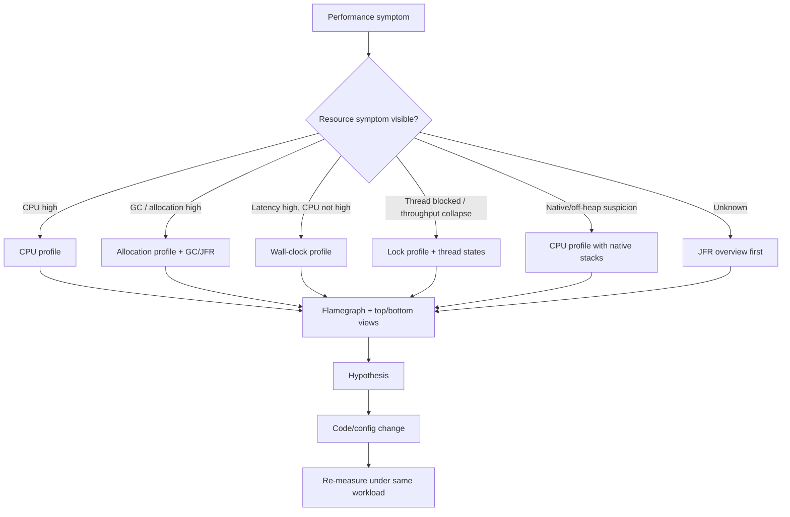
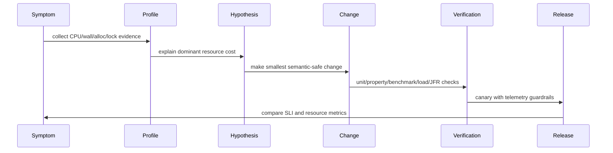

# Part 037 — async-profiler, Flamegraphs, and Native Stacks

A weak performance investigation says:

> CPU is high. Let us optimize the slow method.

A strong performance investigation says:

> Which resource is actually saturated? CPU, allocation bandwidth, lock wait, wall-clock wait, kernel time, IO, GC, scheduler delay, or downstream latency? Which evidence isolates the hot path? Which workload produced the evidence? Which code change will reduce the dominant resource cost without breaking correctness?

This part is about using **async-profiler** and flamegraphs to answer those questions.

You already learned JFR and JMC in Part 036.

JFR is excellent for broad runtime evidence. async-profiler is excellent when you need sharper sampling evidence, native stacks, kernel frames, allocation hot paths, and flamegraphs that make cost shape visible.

The goal is not to become a profiler operator.

The goal is to become the engineer who can look at a performance incident and say:

> The system is not slow because Java is slow. It is slow because 38% of CPU is spent parsing the same payload repeatedly, 24% of wall time is blocked behind a pool, allocation rate doubled after the new DTO mapper, and one synchronized cache invalidation path serializes all workers.

Then you can change the right thing.

---

## 1. What async-profiler gives you

async-profiler is a low-overhead sampling profiler for HotSpot-based JVMs.

Its value is not only that it samples Java stacks.

Its value is that it can show **mixed-mode** behavior:

```text
Java frames
JIT-compiled frames
native library frames
kernel frames
GC/JIT/compiler threads
allocation sites
lock contention sites
wall-clock waiting stacks
```

That matters because many Java performance issues do not live fully inside Java source code.

Examples:

- gzip compression is partly native and CPU-heavy
- TLS and socket operations enter native/kernel space
- direct buffer behavior crosses heap/off-heap boundary
- GC/JIT threads consume CPU during runtime adaptation
- allocation pressure appears as application code but becomes GC pressure later
- blocking code may look cheap in CPU profile but expensive in wall-clock profile
- synchronized sections may look small until lock profiling shows serialization

A normal CPU-only Java stack can miss those boundaries.

async-profiler helps you see them.

---

## 2. The core mental model: sample the scarce resource

A profiler is not a magic truth machine.

It samples something.

You must choose the thing that matches the question.

| Investigation question | Better profiling mode | Why |
|---|---:|---|
| Why is CPU high? | CPU | Samples executing threads |
| Why is latency high but CPU moderate? | wall-clock | Captures blocked/waiting time |
| Why is GC frequent? | allocation | Finds allocation sites |
| Why do requests serialize? | lock | Finds monitor/lock contention |
| Why does Java time disappear into native code? | CPU with native stacks | Shows native/kernel frames |
| Why is a request slow only under load? | wall + lock + traces | Latency often comes from queueing/waiting |
| Why did memory pressure increase after deploy? | allocation diff | Compares allocation flamegraphs before/after |

The mistake is to always start with CPU.

CPU profiling answers:

> Where does executing CPU time go?

It does not answer:

> Where does elapsed request time go?

A request can spend 10 milliseconds on CPU and 900 milliseconds waiting for a database connection.

A CPU profile may show nothing interesting.

A wall-clock profile may show the truth.

---

## 3. A simple decision flow

Use this before running anything.



The invariant:

> Do not optimize before you know which resource you are optimizing.

---

## 4. Safepoint bias, in plain language

A JVM can only observe some information safely at certain points.

Traditional profilers can accidentally sample Java threads only when they reach safepoints.

That can distort the profile.

Imagine two loops:

```java
void fastSafepointFriendlyLoop() {
    for (int i = 0; i < n; i++) {
        helper(i); // frequent safepoint opportunities
    }
}

void tightNativeOrCompiledLoop() {
    // long-running compiled code with fewer visible sampling points
}
```

If a profiler samples mostly at safepoints, it may overrepresent code that reaches safepoints often and underrepresent code that burns CPU away from them.

This is why safepoint bias matters.

async-profiler avoids many of these pitfalls by using mechanisms that can sample running code more accurately on HotSpot.

For you as an engineer, the practical meaning is:

> Prefer profiler evidence that is not biased toward JVM safepoint visibility, especially for CPU-hot code.

---

## 5. Install and run: minimal workflow

Exact commands vary by version and packaging, but the operating model is stable.

You attach to a Java process, collect samples for a bounded duration, and export an artifact.

Typical flow:

```bash
# Find the Java process
jps -l

# Record CPU profile for 60 seconds and emit HTML flamegraph
./asprof -d 60 -e cpu -f cpu.html <pid>

# Record allocation profile
./asprof -d 60 -e alloc -f alloc.html <pid>

# Record wall-clock profile
./asprof -d 60 -e wall -f wall.html <pid>

# Record lock profile
./asprof -d 60 -e lock -f lock.html <pid>
```

Some older distributions use `profiler.sh`; newer distributions commonly use `asprof`.

Do not memorize command syntax as the skill.

Memorize the workflow:

```text
choose event -> choose duration -> attach -> export -> inspect -> form hypothesis -> change one thing -> remeasure
```

---

## 6. Production constraints

Profiling production is not only a technical action.

It is an operational action.

Before profiling production, define:

| Constraint | Required decision |
|---|---|
| Target process | Which JVM PID/container/pod? |
| Workload window | What traffic shape is being sampled? |
| Duration | Long enough for signal, short enough for safety |
| Event type | CPU, wall, alloc, lock, etc. |
| Permissions | Can the profiler access perf/JVM attach? |
| Artifact location | Where will flamegraph/JFR be stored? |
| Privacy | Could stack names, args, paths, or env leak sensitive details? |
| Blast radius | Is overhead acceptable? |
| Rollback | How to stop and remove profiler process? |

Containerized environments may require additional capability or host settings, depending on event type and OS.

Common friction points:

```text
Linux perf_event_paranoid too restrictive
missing CAP_PERFMON or CAP_SYS_ADMIN
container cannot see host process namespace
JVM attach disabled or restricted
stripped native symbols
missing debug symbols
security agent blocks attach
read-only filesystem blocks artifact writing
```

The right response is not “profiling does not work in Kubernetes”.

The right response is to design a profiling runbook.

---

## 7. Flamegraph fundamentals

A flamegraph is a compressed visualization of sampled stack traces.

The most important rule:

> Width means aggregate sample count, not chronological order.

A wide frame means many samples included that frame.

It does not mean that method ran first, later, or continuously.

Typical reading:

```text
bottom frame: root / thread entry
higher frames: callees
width: total cost represented by stack samples
color: usually not semantically important unless configured
```

Example conceptual stack:

```text
RequestThread.run
  OrderController.submit
    OrderService.submit
      JsonMapper.readValue
        UTF8StreamJsonParser.nextToken
```

If `UTF8StreamJsonParser.nextToken` is wide in a CPU flamegraph, parsing consumes CPU.

If `OrderService.submit` is wide but children are fragmented, the cost is spread across many callees.

If a method is wide in a wall-clock flamegraph but narrow in CPU flamegraph, it may be waiting.

---

## 8. Flamegraph reading algorithm

Use this process.

### Step 1 — Check profile type

Ask:

```text
Am I looking at CPU, wall, allocation, or lock samples?
```

A wide frame in CPU means CPU consumption.

A wide frame in allocation means allocation volume.

A wide frame in wall means elapsed time.

A wide frame in lock means contention.

Do not interpret all flamegraphs the same way.

### Step 2 — Identify dominant towers

Look for wide towers.

A tower is a stack path that dominates the graph.

Ask:

```text
Is this cost concentrated in one path or distributed across many paths?
```

Concentrated cost is often easier to fix.

Distributed cost often means architectural/workload issue.

### Step 3 — Separate application code from framework/runtime code

Framework frames are often symptoms.

Example:

```text
com.fasterxml.jackson...
```

might mean:

```text
application serializes too much
application serializes too often
application uses inefficient DTO shape
application misses caching
application parses payload repeatedly
```

Do not blame the library before understanding why your application invokes it.

### Step 4 — Find ownership boundaries

Mark frames as:

```text
owned application code
owned configuration
library/framework usage
JDK/runtime
native/kernel
external wait
```

The best optimization target is often the highest owned frame before the expensive subtree.

### Step 5 — Convert graph into hypothesis

Bad:

```text
Jackson is slow.
```

Good:

```text
OrderSearchController maps 1,000 records to nested DTOs on every request. Allocation profile shows 42% of allocation under SearchResultMapper.toResponse. CPU profile shows serialization as the dominant subtree. Hypothesis: reduce response shape or stream/paginate fields to reduce CPU and allocation.
```

---

## 9. CPU profiling workflow

Use CPU profiling when CPU is saturated or cost per operation is suspicious.

Good starting questions:

```text
Which request/job consumes CPU?
Which code path dominates CPU?
Is CPU in application logic, serialization, crypto, compression, regex, logging, GC/JIT, or native code?
Did CPU move after the latest deployment?
```

Example command:

```bash
./asprof -d 60 -e cpu -f order-submit-cpu.html <pid>
```

During analysis, classify dominant CPU frames:

| Frame pattern | Possible meaning | Next check |
|---|---|---|
| JSON parser/serializer | Payload or mapping overhead | response size, DTO nesting, repeated parse |
| regex | expensive validation/matching | input shape, compiled Pattern reuse |
| crypto/TLS | security/compression overhead | connection reuse, TLS termination, payload size |
| logging formatter | excessive structured logging | log volume, sync appenders |
| stream/lambda overhead | allocation/call overhead | replace hot path with loop only if evidence supports |
| equals/hashCode | poor map/set/key behavior | hash distribution, collection size |
| BigDecimal | precision-heavy numeric logic | scale, rounding, repeated conversions |
| GC/JIT/compiler threads | runtime overhead | allocation profile, warmup, code cache |

A CPU profile is a cost map.

It is not automatically an optimization plan.

---

## 10. CPU case study: repeated validation tree

Symptom:

```text
CPU increased 35% after adding policy validation.
p95 latency increased from 80 ms to 140 ms.
GC stayed stable.
```

CPU flamegraph shows:

```text
PolicyValidator.validate
  ExpressionEvaluator.evaluate
    JsonPath.parse
      PathCompiler.compile
```

The code:

```java
boolean valid(Policy policy, JsonNode payload) {
    return policy.rules().stream()
        .allMatch(rule -> JsonPath.parse(payload.toString()).read(rule.path()) != null);
}
```

The profile suggests repeated parse/compile.

A better design:

```java
final class CompiledPolicy {
    private final List<CompiledRule> rules;

    boolean valid(JsonNode payload) {
        return rules.stream().allMatch(rule -> rule.matches(payload));
    }
}
```

Benchmark the hot operation with realistic policy/rule cardinality.

Then verify correctness with property/example tests.

Do not skip correctness.

Performance fixes often change semantics accidentally.

---

## 11. Wall-clock profiling workflow

Use wall-clock profiling when latency is high but CPU is not saturated.

Common causes:

```text
waiting for database connection
waiting for downstream service
blocked on lock
sleep/retry/backoff
thread pool queueing
file/socket IO
future join/get
rate limiter wait
GC pause visible as elapsed time
```

Command:

```bash
./asprof -d 60 -e wall -f wall.html <pid>
```

Wall-clock flamegraphs answer:

> Where does elapsed time go?

A wide frame might be blocked, parked, sleeping, waiting, or executing.

So classify the frame:

| Wide wall frame | Likely meaning |
|---|---|
| `Unsafe.park` | thread parked; executor/lock/future wait |
| `CompletableFuture.get/join` | async boundary waiting |
| JDBC driver read | waiting on database/network |
| HTTP client read | waiting downstream/network |
| `Thread.sleep` | backoff, poll, retry, throttle |
| pool borrow | resource pool saturation |
| lock monitor enter | contention |

Wall profiles are powerful because many service latency problems are not CPU problems.

---

## 12. Wall-clock case study: hidden pool bottleneck

Symptom:

```text
HTTP p95 jumps from 120 ms to 1.8 s under moderate traffic.
CPU is 35%.
GC is stable.
DB CPU is 40%.
```

CPU profile: boring.

Wall profile:

```text
OrderController.submit
  OrderService.place
    TransactionTemplate.execute
      HikariPool.getConnection
        ConcurrentBag.borrow
          LockSupport.park
```

Interpretation:

> Threads spend elapsed time waiting for a database connection.

But do not immediately increase pool size.

Possible root causes:

```text
transactions too long
N+1 queries hold connection longer
downstream call inside transaction
connection leak
pool too small for workload
DB cannot handle more concurrent work
```

Correct investigation:

1. Measure connection acquisition time.
2. Measure transaction duration.
3. Inspect slow queries.
4. Check whether HTTP/downstream calls occur inside transaction.
5. Check pool usage metrics.
6. Load test with fixed arrival rate.
7. Change one factor.

The wall profile found the bottleneck class.

It did not decide the fix.

---

## 13. Allocation profiling workflow

Use allocation profiling when:

```text
GC frequency increased
allocation rate increased
CPU profile shows GC/JVM work
latency spikes correlate with GC
memory bandwidth is high
container memory pressure appears
```

Command:

```bash
./asprof -d 60 -e alloc -f alloc.html <pid>
```

Allocation profiles answer:

> Which stack traces allocate objects?

Not all allocations are bad.

Modern JVM allocation can be very fast.

The question is whether allocation volume causes downstream cost:

```text
higher GC frequency
higher CPU due to object creation
cache churn
promotion pressure
memory bandwidth pressure
container RSS pressure
```

Read allocation flamegraphs differently from CPU flamegraphs.

A wide allocation frame means allocation volume, not necessarily CPU time.

---

## 14. Allocation case study: DTO mapper explosion

Symptom:

```text
After adding an enrichment field, young GC frequency doubled.
p99 latency worsened.
CPU profile shows no single obvious application hotspot.
```

Allocation profile shows:

```text
CaseSearchService.search
  CaseSearchMapper.toResponse
    Stream.map
      CaseDto.<init>
      ArrayList.grow
      Optional.map
      BigDecimal.setScale
```

Root cause might be response shape expansion.

Possible fixes:

```text
pagination
field projection
avoid creating nested DTOs not requested
pre-size collections
avoid Optional in hot internal mapping path
avoid repeated BigDecimal scale conversion
cache immutable lookup values
stream response instead of materializing huge object graph
```

Verification plan:

```text
unit/property tests for response semantics
JMH benchmark for mapper with realistic cardinality
macrobenchmark for search endpoint
JFR/async-profiler allocation profile before/after
production metric: allocation rate, GC pause, response payload size
```

The best performance fix includes a correctness plan.

---

## 15. Lock profiling workflow

Use lock profiling when:

```text
throughput collapses under concurrency
CPU is not saturated
threads are BLOCKED or WAITING
wall profile shows monitor/future/pool wait
```

Command:

```bash
./asprof -d 60 -e lock -f lock.html <pid>
```

Lock contention often hides in innocent code:

```java
public synchronized CaseSnapshot snapshot(String caseId) {
    return cache.computeIfAbsent(caseId, this::loadAndBuildSnapshot);
}
```

One global synchronized method can serialize unrelated keys.

Better direction:

```java
final class CaseSnapshotCache {
    private final ConcurrentHashMap<String, CompletableFuture<CaseSnapshot>> cache = new ConcurrentHashMap<>();

    CompletableFuture<CaseSnapshot> snapshot(String caseId) {
        return cache.computeIfAbsent(caseId, id -> CompletableFuture.supplyAsync(() -> loadAndBuildSnapshot(id)));
    }
}
```

But this is not automatically correct either.

You introduced async behavior, failure caching questions, cancellation questions, executor pressure, and cache eviction questions.

Performance engineering is system design.

---

## 16. Native stack profiling

Java applications often spend meaningful time outside Java frames.

Examples:

```text
zlib compression
TLS / OpenSSL / JSSE native paths
socket read/write
file IO
memory copy
JNI libraries
kernel scheduling
container cgroup accounting
```

Native stack visibility helps answer:

```text
Is CPU in Java code or native library?
Is wall time in kernel IO?
Is compression dominating response generation?
Is the process spending CPU in GC/JIT/native threads?
```

A native-heavy flamegraph often changes the optimization options.

If compression dominates, rewriting Java loops will not help.

Better levers might be:

```text
compress only above size threshold
avoid compressing already-compressed payloads
use faster compression level
move compression boundary
reduce payload size
cache compressed representation
change protocol or response shape
```

---

## 17. Profiling virtual-thread applications

Virtual threads improve scalability for blocking-style code.

They do not eliminate bottlenecks.

In virtual-thread systems, ask:

```text
Are virtual threads blocked on downstream resources?
Are they pinned by synchronized/native sections?
Is the carrier pool saturated?
Is a resource pool still small?
Did latency move from thread scarcity to database scarcity?
```

A wall profile can show many virtual threads waiting.

That may be normal.

The question is whether they wait on expected external latency or unexpected serialization.

Common problems:

```text
synchronized hot path pins carrier threads on some JDKs/scenarios
blocking call inside global lock
connection pool still limits throughput
retry storm creates too many blocked virtual threads
unbounded concurrency overwhelms downstream
```

Virtual threads require **concurrency control**, not just thread creation.

A good service still needs:

```text
timeouts
bulkheads
rate limits
connection pool limits
backpressure
structured cancellation
observability of in-flight work
```

---

## 18. Differential profiling

A single profile can identify a dominant cost.

A pair of profiles can identify regression shape.

Use differential thinking after a release:

```text
baseline profile: previous known-good build
candidate profile: new build under same workload
compare: CPU, allocation, wall, lock
```

Look for:

```text
new wide frames
expanded existing frames
disappeared fast path
new serialization/deserialization subtree
new logging subtree
more allocation under mapper
more time waiting on pool
```

A useful regression report says:

```text
Before: 8% samples under CaseMapper.toResponse
After: 31% samples under CaseMapper.toResponse, mostly CaseHistoryDto allocation and date formatting
Candidate cause: new timeline field added to search response
Proposed fix: remove timeline from default projection and expose opt-in expansion
```

Not:

```text
The new version is slower.
```

---

## 19. Combining async-profiler with JFR

JFR and async-profiler overlap, but they are not substitutes in every case.

Use them together.

| Need | Better starting point |
|---|---|
| Broad JVM health overview | JFR |
| CPU flamegraph with native/kernel frames | async-profiler |
| Allocation hot path flamegraph | async-profiler or JFR allocation view |
| GC pause/event timeline | JFR |
| Custom business events | JFR / app telemetry |
| Lock/thread overview | JFR |
| Precise hot stack visualization | async-profiler |
| Incident artifact with many event types | JFR |
| Diffable before/after cost shape | async-profiler flamegraphs |

A strong incident workflow:

```text
1. JFR: broad timeline and event context
2. async-profiler CPU/wall/alloc/lock: dominant stack evidence
3. metrics/traces/logs: request/user/business impact
4. code/config review: change candidate
5. benchmark/load test: reproduce under controlled workload
6. production canary: validate under real traffic
```

---

## 20. The profiling evidence package

Every profile artifact should be accompanied by context.

Without context, flamegraphs become performance screenshots.

Use this template.

```md
# Profiling Evidence Package

## Symptom
- What changed?
- Which SLI/SLO degraded?
- Since when?

## Environment
- service:
- version/commit:
- JDK:
- instance size/container limit:
- GC:
- traffic shape:

## Profile
- tool: async-profiler
- event: cpu | wall | alloc | lock
- duration:
- sampling interval:
- PID/pod:
- time window:

## Workload
- endpoint/job/topic:
- request rate:
- data cardinality:
- payload size:
- cache state:

## Main finding
- dominant stack:
- resource represented:
- approximate share:

## Hypothesis
- why this stack explains the symptom:

## Proposed change
- code/config/data/workload change:

## Verification
- unit/property/benchmark/load/JFR/production canary:
```

This template forces engineering discipline.

---

## 21. Common interpretation traps

### Trap 1 — Optimizing leaf frames only

A leaf frame may be expensive because the caller uses it incorrectly.

Example:

```text
DateTimeFormatter.format
```

Maybe the formatter is slow.

More likely:

```text
formatting thousands of dates in a default response projection
```

Fix the response shape before micro-optimizing date formatting.

### Trap 2 — Ignoring workload representativeness

A profile from a synthetic endpoint with tiny payloads may hide production costs.

A profile from a production spike may overrepresent one customer/data shape.

Always document workload.

### Trap 3 — Reading wall profile as CPU profile

Wide wall frames can be waiting.

Do not optimize code that is parked behind a database connection.

### Trap 4 — Ignoring allocation because CPU looks fine

Allocation can degrade latency through GC and memory pressure even if CPU flamegraph is not dramatic.

### Trap 5 — Assuming library frame means library problem

Library code is often where your design choices execute.

### Trap 6 — Overfitting to one run

Sampling has noise.

Run multiple profiles when stakes are high.

### Trap 7 — Forgetting warmup

JIT compilation, cache warmup, class loading, and data initialization can dominate early profiles.

Profile steady state unless startup is the target.

### Trap 8 — Ignoring correctness after optimization

Replacing a synchronized map with lock-free logic can break semantics.

Changing batching can break ordering.

Changing caching can break freshness.

Every performance fix needs a correctness regression plan.

---

## 22. From profile to code change: a disciplined loop

Do not jump from graph to refactor.

Use this loop.



A strong profile-driven change is small enough to verify.

Bad:

```text
Rewrite service with reactive framework.
```

Good:

```text
Move downstream call outside transaction, add timeout, and verify connection acquisition p95 drops while idempotency invariant still holds.
```

---

## 23. Case study: CPU dominated by logging

Symptom:

```text
CPU high during error spike.
Error rate increases.
Latency worsens.
```

CPU profile:

```text
OrderWorker.process
  Logger.error
    JsonLayout.toSerializable
      ThrowableProxyConverter.throwableProxyToString
```

Possible cause:

```text
error path logs full exception stack and large payload for every retry attempt
```

Dangerous fix:

```text
remove logging entirely
```

Better fix:

```text
log one structured error per command attempt group
include correlation ID, command ID, error class, retry attempt, decision
sample repeated stack traces
move full payload to secure diagnostic store only when needed
```

Verification:

```text
unit test: error decision still logged
load test: error storm CPU reduced
observability: error cardinality remains useful
security review: no sensitive payload leakage
```

Performance, diagnosability, and privacy must all survive.

---

## 24. Case study: allocation from immutable wrappers

Symptom:

```text
No obvious CPU hotspot.
GC time rises.
Allocation profile wide under domain validation.
```

Allocation profile:

```text
CaseValidator.validate
  RuleResult.success
    Optional.of
    List.copyOf
    Map.copyOf
```

Immutability is good.

But repeated defensive copying inside a hot validation loop may be expensive.

Possible fix:

```text
make internal validation accumulator mutable but not externally visible
copy once at boundary
preserve immutable public result
```

Code shape:

```java
final class ValidationAccumulator {
    private final List<Violation> violations = new ArrayList<>();

    void add(Violation violation) {
        violations.add(violation);
    }

    ValidationResult freeze() {
        return new ValidationResult(List.copyOf(violations));
    }
}
```

The invariant:

> Internal mutability is acceptable when the observable boundary remains immutable and tested.

---

## 25. Case study: lock contention in cache refresh

Symptom:

```text
Throughput collapses every five minutes.
CPU drops.
Latency spikes.
```

Lock profile:

```text
ConfigCache.get
  synchronized ConfigCache.refreshIfNeeded
    RemoteConfigClient.fetch
```

Bug:

```text
remote IO occurs while holding global lock
```

Better pattern:

```text
single-flight refresh per key
serve stale value within tolerance
perform remote fetch outside global lock
publish atomically
```

Sketch:

```java
final class ConfigCache {
    private final AtomicReference<ConfigSnapshot> current = new AtomicReference<>();
    private final AtomicBoolean refreshInProgress = new AtomicBoolean(false);

    ConfigSnapshot get() {
        ConfigSnapshot snapshot = current.get();
        if (snapshot.isFresh()) return snapshot;

        if (refreshInProgress.compareAndSet(false, true)) {
            CompletableFuture.runAsync(this::refreshSafely);
        }

        return snapshot; // bounded stale read policy
    }

    private void refreshSafely() {
        try {
            current.set(fetchNewSnapshot());
        } finally {
            refreshInProgress.set(false);
        }
    }
}
```

This is a performance fix only if the domain allows bounded stale reads.

If freshness is legally or financially critical, this design may be invalid.

Profiling does not override domain correctness.

---

## 26. Production runbook: emergency CPU spike

Use a short, safe, repeatable path.

```text
1. Confirm symptom
   - CPU per pod/host
   - request rate
   - error rate
   - latency
   - deploy/change time

2. Capture context
   - JFR short recording if available
   - async-profiler CPU 30-60s
   - thread dump if safe
   - top endpoints/jobs

3. Interpret profile
   - dominant stack
   - app vs library vs JVM/native
   - new vs known cost

4. Mitigate
   - reduce traffic to bad endpoint
   - disable feature flag
   - rollback
   - scale only if bottleneck is CPU and downstream can handle it

5. Fix
   - smallest code/config change
   - benchmark/load verify
   - canary validate
```

Scaling is not always wrong.

But scaling without understanding can amplify downstream failure.

---

## 27. Production runbook: latency spike with low CPU

```text
1. Confirm low CPU + high latency
2. Check connection pool acquisition metrics
3. Check downstream latency metrics
4. Capture wall-clock profile
5. Capture lock profile if thread blocking appears
6. Inspect traces for waiting span
7. Decide whether bottleneck is:
   - DB pool
   - downstream service
   - lock
   - executor queue
   - retry/backoff
   - rate limiter
8. Fix queue/wait source, not random code path
```

A common anti-pattern:

```text
CPU is low, so add more pods.
```

If the bottleneck is the database pool, adding pods may create more queued requests and more database pressure.

---

## 28. Production runbook: GC pressure

```text
1. Confirm allocation rate and GC behavior
2. Capture JFR allocation/GC evidence
3. Capture async-profiler allocation flamegraph
4. Identify allocation owner path
5. Check payload/cardinality/data shape change
6. Fix allocation source or response shape
7. Re-test with representative data
8. Validate GC and latency after deploy
```

Do not start with GC tuning.

If application allocation rate doubled because a mapper now creates 20x objects, GC tuning is secondary.

---

## 29. How to profile a benchmark

Profiling microbenchmarks is useful when the benchmark result is surprising.

JMH can integrate profiler output depending on setup.

Questions:

```text
Is the benchmark measuring the intended code?
Did dead-code elimination occur?
Is allocation real?
Is the faster implementation using less work or skipping semantics?
Is branch prediction/data distribution unrealistic?
```

A benchmark without profiling can tell you **which is faster**.

A benchmark with profiling can help explain **why**.

But never treat microbenchmark profile as service profile.

Service performance includes:

```text
request parsing
auth
validation
DB/network
serialization
logging
GC under full workload
thread scheduling
queueing
```

---

## 30. Profiling in CI and release pipelines

Do not run heavy profiling on every PR by default.

Better layers:

| Pipeline layer | Profile usage |
|---|---|
| PR microbenchmark | optional allocation/CPU profile on regression |
| nightly performance run | generate flamegraph artifacts |
| release candidate | compare baseline vs candidate |
| incident reproduction | targeted CPU/wall/alloc/lock profiles |
| canary | continuous/JFR/profile sampling with guardrails |

Store artifacts with metadata:

```text
commit SHA
JDK version
hardware/container shape
workload config
profile event
duration
benchmark/load result
```

Without metadata, profile artifacts lose forensic value.

---

## 31. How this connects to formal methods and testing

Profiling finds cost.

Formal/testing evidence protects meaning.

When you change code based on a profile, ask:

```text
Which invariant could this optimization break?
Which property test should guard it?
Which contract test should guard API behavior?
Which load test should verify the performance hypothesis?
Which production metric should verify real impact?
```

Example:

```text
Profile finding: duplicate idempotency check causes DB roundtrip on every retry.
Optimization: cache idempotency decision for 10 minutes.
Correctness risk: stale decision after compensation/reversal.
Required evidence: formal invariant for command decision lifecycle, property test for duplicate commands, integration test with compensation, production metric for duplicate cache hit and stale decision detection.
```

This is the difference between performance hacking and performance engineering.

---

## 32. Checklist: async-profiler readiness

Before using async-profiler in a team, define:

```text
[ ] approved production profiling policy
[ ] Kubernetes/VM permission model
[ ] profiling image or debug sidecar approach
[ ] artifact storage location
[ ] PII/secrets review for artifacts
[ ] standard CPU/wall/alloc/lock commands
[ ] profile evidence template
[ ] incident runbook
[ ] benchmark-profile integration
[ ] before/after comparison workflow
[ ] training examples for flamegraph interpretation
```

A tool without a runbook becomes tribal knowledge.

A profiler with a runbook becomes an engineering capability.

---

## 33. Practical heuristics

Keep these in memory.

```text
CPU high + wide app frame -> optimize or reduce work in that path
CPU high + wide native frame -> inspect compression/TLS/IO/native library
latency high + CPU low -> wall-clock profile
GC high -> allocation profile before GC tuning
throughput collapse -> wall + lock + pool metrics
library frame wide -> inspect application usage pattern
one endpoint dominates -> workload/design issue may beat code micro-optimization
allocation wide under mapper -> response shape/projection/cardinality issue
lock wide around IO -> move IO out of critical section if semantics allow
profile after deploy -> compare to baseline, not your intuition
```

---

## 34. Mini exercise

Take a Java service you own or can simulate.

Create three load paths:

```text
1. CPU-heavy path: JSON parse + validation + serialization
2. waiting-heavy path: simulated DB call + limited connection pool
3. allocation-heavy path: large DTO mapping
```

For each path:

```text
run CPU profile
run wall profile
run allocation profile
write evidence package
make one code/config change
remeasure
write what changed and what did not
```

Expected learning:

```text
CPU profile explains CPU burn
wall profile explains waiting latency
allocation profile explains GC pressure
one profiler mode cannot explain every symptom
```

---

## 35. Closing model

async-profiler is not primarily a performance tool.

It is an evidence tool.

A flamegraph is not a conclusion.

It is a map of sampled resource cost.

The engineer's job is to connect that cost to:

```text
workload
system design
code ownership
correctness constraints
operational constraints
business impact
```

When you can do that, profiling stops being an emergency trick.

It becomes part of how you design and operate Java systems.
