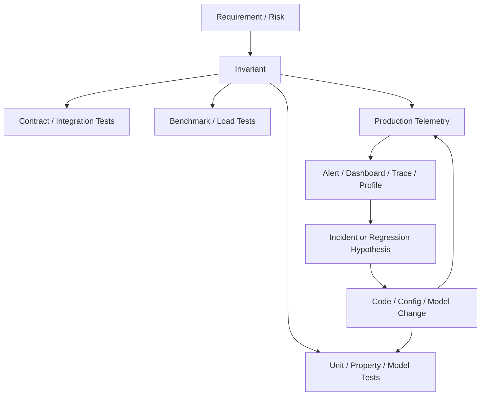
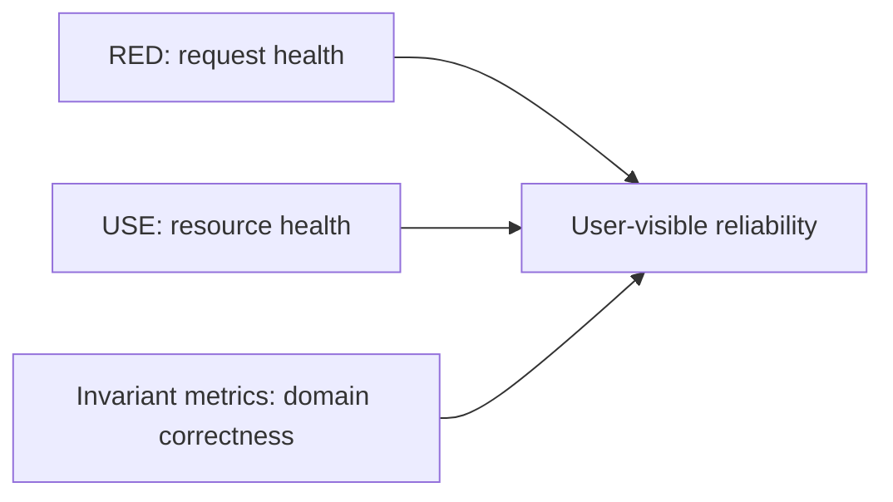

# Part 038 — Observability for Correctness and Performance

A weak observability strategy says:

> We have logs, dashboards, and alerts.

A strong observability strategy says:

> We know which user-visible outcomes matter, which invariants must never be violated, which latency budget belongs to each dependency, which business workflows can get stuck, and which telemetry proves or disproves those conditions in production.

This part is about observability as **runtime verification**.

Not only “is CPU high?”

But also:

```text
Did an illegal state transition happen?
Did duplicate command handling work?
Did outbox events publish within the expected window?
Did compensation increase after the deploy?
Did p99 latency degrade only for one data shape?
Did retries amplify downstream failure?
Are rejected requests safe rejections or correctness bugs?
Is one tenant/customer/case type experiencing a hidden failure mode?
```

Testing and formal methods tell you what should be true.

Observability tells you whether production still behaves that way.

---

## 1. Observability is not monitoring with more charts

Monitoring usually starts with known questions:

```text
Is the service up?
Is CPU high?
Is error rate high?
Is latency above threshold?
```

Observability should support unknown questions:

```text
Why did only appeal workflows with cross-region assignment stall?
Why did retry-safe commands start producing duplicate downstream notifications?
Why is p99 high only when payload contains many attachments?
Why did throughput drop although CPU and memory look normal?
Why did an invariant that tests cover start failing in production?
```

The difference is not the tool.

The difference is the information model.

---

## 2. The runtime verification loop

Good engineering connects specification, tests, benchmarks, and production telemetry.



The key idea:

> A production metric is often a runtime form of a test oracle.

Example:

```text
Test invariant: closed case cannot receive new evidence.
Production metric: case_illegal_transition_total{from="CLOSED", command="ADD_EVIDENCE"}
Alert: any non-zero increase in a short window after deploy.
Trace attribute: case.state.previous=CLOSED, command=ADD_EVIDENCE, decision=REJECTED
Log event: structured rejection with correlation ID and rule ID
```

Now the invariant exists in code, tests, and production.

---

## 3. The five observability signals

Most teams discuss three signals:

```text
metrics
logs
traces
```

For Java performance engineering, include two more:

```text
profiles
runtime events / JFR
```

| Signal | Best for | Weakness |
|---|---|---|
| Metrics | trends, alerts, SLOs, rates, distributions | low detail, cardinality risk |
| Logs | discrete events, decisions, errors, audit trail | volume, noise, query cost |
| Traces | request path, dependency timing, causality | sampling, overhead, partial coverage |
| Profiles | CPU/allocation/wall/lock cost shape | needs workload context |
| JFR/runtime events | JVM internals and application events | requires analysis discipline |

A mature Java system uses all five.

But not everywhere equally.

---

## 4. What to observe: outcomes, not internals first

Start from outcomes.

For a service, define:

```text
What user/business operation matters?
What is success?
What is failure?
What is slow?
What is unsafe?
What is stuck?
What is duplicated?
What is lost?
What is late?
```

Then map to telemetry.

Example operation:

```text
Submit enforcement case
```

Observable outcomes:

| Outcome | Telemetry |
|---|---|
| request accepted | `case_submit_total{result="accepted"}` |
| validation rejected | `case_submit_total{result="rejected", reason="..."}` |
| illegal transition prevented | `case_illegal_transition_total{from="...", command="..."}` |
| duplicate command detected | `idempotency_duplicate_total{operation="submit-case"}` |
| outbox event created | `outbox_created_total{event_type="CaseSubmitted"}` |
| event published | `outbox_published_total{event_type="CaseSubmitted"}` |
| workflow stuck | `case_workflow_stuck_total{state="..."}` or age gauge |
| latency distribution | `http_server_request_duration_seconds_bucket` |
| DB latency | span/metric around repository call |
| downstream wait | trace span + dependency metric |

This is more valuable than only:

```text
CPU, memory, request count
```

Infrastructure metrics are necessary.

They are not sufficient.

---

## 5. RED, USE, and business invariants

For request-serving services, RED is a useful base:

```text
Rate
Errors
Duration
```

For resources, USE is useful:

```text
Utilization
Saturation
Errors
```

But complex systems also need invariant telemetry.

Add a third layer:

```text
Correctness / domain invariants
```



Examples:

```text
illegal transition count
compensation count
duplicate command count
stale write rejection count
outbox lag
consumer lag by event type
workflow age by state
reconciliation mismatch count
schema validation failure count
authorization denied by policy
state repair job corrections
manual override count
```

These are the metrics that tell you whether the system is still semantically healthy.

---

## 6. Metric type mental model

Use metric types intentionally.

| Metric type | Use for | Example |
|---|---|---|
| Counter | monotonic event count | total requests, rejected transitions |
| Gauge | current value | queue depth, in-flight commands |
| Histogram | latency/size distribution | request duration, DB call time |
| Summary | client-side quantiles in some stacks | less portable for aggregation |

Rules:

```text
Use counters for things that happen.
Use gauges for things that exist now.
Use histograms for distributions.
Do not average latency as your main signal.
Prefer server-side histogram aggregation when you need fleet-wide percentiles.
```

Latency is a distribution.

Averages hide the users who suffer.

---

## 7. Histograms and latency budgets

A latency histogram is only useful if buckets match decisions.

Bad buckets:

```text
0.1s, 1s, 10s
```

For an API with a 250 ms SLO, those buckets are too coarse.

Better buckets might include:

```text
25ms, 50ms, 100ms, 150ms, 200ms, 250ms, 500ms, 1s, 2s
```

Bucket design should reflect:

```text
SLO threshold
timeout budget
downstream expected latency
human UX thresholds
batch/job deadlines
```

PromQL example:

```promql
histogram_quantile(
  0.95,
  sum(rate(http_server_request_duration_seconds_bucket{service="case-service"}[5m])) by (le, route)
)
```

But remember:

> Percentiles from histograms are approximations shaped by bucket boundaries.

If buckets are wrong, the percentile is less useful.

---

## 8. Cardinality: the silent observability outage

High-cardinality labels can break metrics systems.

Dangerous labels:

```text
user_id
case_id
request_id
email
full URL with IDs
exception message
free-form reason
SQL text
tenant if tenant count is huge and unbounded
```

Better labels:

```text
route template
operation name
state
command type
error class
decision code
dependency name
tenant tier, not tenant ID, unless explicitly designed
```

Bad:

```text
case_transition_total{case_id="CASE-991827", from="OPEN", to="CLOSED"}
```

Better:

```text
case_transition_total{from="OPEN", to="CLOSED", command="CLOSE_CASE"}
```

Put high-cardinality identifiers in logs/traces, not metric labels.

---

## 9. Structured logs as decision records

Logs should not be string dumps.

They should be decision records.

Weak log:

```text
Validation failed
```

Strong log:

```json
{
  "event": "case.command.rejected",
  "correlation_id": "d7a...",
  "case_id": "CASE-123",
  "command_id": "CMD-456",
  "command_type": "ADD_EVIDENCE",
  "previous_state": "CLOSED",
  "decision": "REJECTED",
  "rule_id": "CASE_CLOSED_NO_NEW_EVIDENCE",
  "retryable": false
}
```

This log supports:

```text
incident investigation
audit/reconciliation
trace correlation
invariant debugging
customer support
regulatory defensibility
```

But logs must also respect privacy.

Do not log sensitive payloads by default.

Log identifiers, decisions, and safe metadata.

---

## 10. Trace design for Java services

A trace is a causality graph for one operation.

For Java services, trace these boundaries:

```text
inbound HTTP/RPC request
message consumption
command handler
validation/domain decision
database transaction
outbox write
external HTTP/RPC call
cache call if material
message publish
async worker execution
```

A good trace answers:

```text
Where did request time go?
Which dependency dominated?
Which command/event caused this work?
Which state transition happened?
Which retry attempt was this?
Which tenant/workload class was involved?
```

Trace attributes should be stable and bounded.

Good attributes:

```text
service.name
operation.name
command.type
case.state.previous
case.state.next
decision.code
dependency.name
retry.attempt
idempotency.result
outbox.event_type
```

Bad attributes:

```text
full payload
raw SQL with values
user email
case title
large exception message
```

---

## 11. Correlation IDs and causality

Every meaningful operation should have a correlation path.

Common identifiers:

```text
trace_id
span_id
correlation_id
request_id
command_id
event_id
idempotency_key
case_id / aggregate_id
```

They are not identical.

| ID | Meaning |
|---|---|
| trace ID | one distributed execution trace |
| correlation ID | business/request correlation across async boundaries |
| command ID | one requested state change |
| event ID | one emitted fact |
| idempotency key | duplicate-detection identity |
| aggregate ID | domain entity identity |

Do not overload one ID to mean everything.

For asynchronous systems, correlation ID is especially important because one business operation may span multiple traces or jobs.

---

## 12. OpenTelemetry Java operating model

OpenTelemetry gives you APIs, SDKs, semantic conventions, exporters, and instrumentation ecosystem for telemetry.

For Java, there are two major adoption paths:

```text
zero-code Java agent instrumentation
manual instrumentation for domain-specific spans/metrics/log attributes
```

Agent instrumentation is good for edges:

```text
HTTP server/client
JDBC
messaging
frameworks
common libraries
```

Manual instrumentation is needed for meaning:

```text
command type
domain decision
state transition
idempotency result
outbox event type
workflow state
business invariant violation
```

Do not expect auto-instrumentation to understand your domain.

It can show a database call.

It cannot know that the database call is part of a legally meaningful case closure decision unless you tell it.

---

## 13. Example: manual domain span

Conceptual Java shape:

```java
final class CaseCommandHandler {
    private final Tracer tracer;
    private final Meter meter;
    private final Counter illegalTransitionCounter;

    CommandResult handle(Command command) {
        Span span = tracer.spanBuilder("case.command.handle")
            .setAttribute("command.type", command.type())
            .setAttribute("case.id", command.caseId())
            .startSpan();

        try (Scope ignored = span.makeCurrent()) {
            CommandResult result = execute(command);

            span.setAttribute("decision", result.decision().name());
            span.setAttribute("case.state.previous", result.previousState().name());
            span.setAttribute("case.state.next", result.nextState().name());

            if (result.isIllegalTransition()) {
                illegalTransitionCounter.add(1, Attributes.of(
                    stringKey("command.type"), command.type(),
                    stringKey("from"), result.previousState().name(),
                    stringKey("decision"), "rejected"
                ));
            }

            return result;
        } catch (RuntimeException e) {
            span.recordException(e);
            span.setStatus(StatusCode.ERROR);
            throw e;
        } finally {
            span.end();
        }
    }
}
```

Do not copy this mechanically.

The point is the shape:

```text
span around meaningful operation
bounded attributes
exception recording
metric for invariant-relevant event
```

---

## 14. Business invariant metrics

For advanced systems, define invariant metrics explicitly.

### State transition invariants

```text
case_transition_total{from,to,command,result}
case_illegal_transition_total{from,command,decision}
case_terminal_mutation_attempt_total{state,command}
```

Useful queries:

```promql
increase(case_illegal_transition_total[5m]) > 0
```

But not all illegal attempts are incidents.

Some are expected safe rejections.

Distinguish:

```text
attempted illegal command rejected safely
illegal mutation committed
```

Metrics:

```text
case_illegal_transition_rejected_total
case_illegal_transition_committed_total
```

The second should usually be zero forever.

### Idempotency invariants

```text
idempotency_first_seen_total{operation}
idempotency_duplicate_total{operation,result}
idempotency_conflict_total{operation}
idempotency_replay_total{operation}
```

Important distinction:

```text
duplicate same payload -> replay previous result
duplicate conflicting payload -> reject conflict
```

### Outbox invariants

```text
outbox_created_total{event_type}
outbox_published_total{event_type}
outbox_failed_total{event_type,error_class}
outbox_oldest_unpublished_age_seconds{event_type}
outbox_publish_lag_seconds_bucket{event_type}
```

Important alert:

```text
oldest unpublished age > allowed delay
```

### Workflow liveness invariants

```text
workflow_state_age_seconds{workflow,state}
workflow_stuck_total{workflow,state}
workflow_transition_total{workflow,from,to}
workflow_manual_repair_total{workflow,state,reason}
```

Stuck workflows are often not errors in logs.

They are absence of progress.

Metrics are better than logs for absence-of-progress detection.

---

## 15. Correctness metric severity

Not every correctness metric should page.

Classify.

| Metric | Severity |
|---|---|
| illegal mutation committed | page immediately |
| illegal command safely rejected | dashboard / anomaly alert |
| outbox lag above SLO | page if user-impacting |
| duplicate command replayed | normal unless spike |
| duplicate conflicting command | alert if spike |
| compensation increased | investigate / release alert |
| manual repair count increased | product/ops review |
| reconciliation mismatch | page if financial/legal impact |

A page should mean human action is needed now.

A metric can be important without being a page.

---

## 16. SLI, SLO, and error budget

A Service Level Indicator is a measurement.

A Service Level Objective is a target.

An error budget is the tolerated gap.

Example:

```text
SLI: percentage of submit-case requests that return a successful or valid rejection response within 300 ms
SLO: 99.5% over 30 days
Error budget: 0.5% bad events over 30 days
```

Notice the wording:

```text
successful or valid rejection
```

Some rejected requests are correct.

If a user sends an invalid command, a fast, clear rejection may be healthy behavior.

A bad event might be:

```text
5xx error
timeout
invalid rejection due to bug
accepted request that later fails to create required outbox event
response slower than threshold
```

SLOs must match user/business meaning.

---

## 17. Alerting: symptoms before causes

Good alerts are user-impacting or invariant-impacting.

Weak alert:

```text
CPU > 80%
```

Better alert:

```text
p95 submit-case latency violates SLO and error budget burn is high
```

Weak alert:

```text
Kafka lag > 1000
```

Better alert:

```text
CaseSubmitted event publish lag exceeds business deadline for 10 minutes
```

Cause metrics belong on dashboards.

Symptom/invariant metrics belong in paging alerts.

There are exceptions, but this default avoids alert fatigue.

---

## 18. Burn-rate alerting

Burn-rate alerting asks:

> How quickly are we consuming the error budget?

This is better than static thresholds for many services.

Conceptually:

```text
error rate allowed by SLO = 1 - SLO
burn rate = current bad event rate / allowed bad event rate
```

For a 99.9% SLO:

```text
allowed bad rate = 0.1%
if current bad rate = 1%
burn rate = 10x
```

A multi-window approach catches both:

```text
fast severe incidents
slow sustained degradation
```

This is important because one short spike and one slow leak should not be handled the same way.

---

## 19. Dashboard design as investigation map

A dashboard should encode how to think.

For a Java service, use layers.

```text
Layer 1: user-visible SLO
Layer 2: operation breakdown
Layer 3: dependency/resource breakdown
Layer 4: correctness/invariant telemetry
Layer 5: JVM/runtime telemetry
Layer 6: deployment/version/change markers
```

Example dashboard sections:

```text
SLO / error budget
Request rate, error rate, latency by route/operation
Dependency latency: DB, HTTP, messaging, cache
Correctness metrics: illegal transitions, idempotency conflicts, outbox lag
Queue/pool metrics: DB pool, executor queue, consumer lag
JVM: heap, allocation rate, GC pause, threads, CPU
Traces/profiles links
Recent deploys / feature flags
```

The user should be able to move from symptom to hypothesis in minutes.

---

## 20. Traces and metrics must agree

A common observability failure:

```text
metrics show high latency
traces do not show it
```

Possible reasons:

```text
trace sampling missed bad requests
latency metric includes queue time before trace starts
route labels differ
client-side latency includes network/load balancer time
async work happens after response
histogram buckets hide tail
clock skew
```

Another failure:

```text
traces show DB is slow
DB metrics look fine
```

Possible reasons:

```text
waiting for connection pool, not database execution
client-side retries
network latency
one query shape affects only app but not DB average
sampling bias
```

Observability signals are evidence pieces.

They must be reconciled.

---

## 21. Logging, tracing, and metrics duplication

Do not put everything everywhere.

Use this rule:

```text
Metrics: count and alert
Traces: causality and timing
Logs: decisions and details
Profiles: resource cost shape
JFR: JVM/runtime event context
```

Example: idempotency duplicate.

Metric:

```text
idempotency_duplicate_total{operation,result}
```

Trace attributes:

```text
idempotency.result = replayed
idempotency.key_hash = safe hash if allowed
command.type = submit-case
```

Log:

```json
{
  "event": "idempotency.duplicate.detected",
  "operation": "submit-case",
  "result": "replayed_previous_response",
  "command_id": "CMD-123",
  "correlation_id": "..."
}
```

Profile/JFR:

```text
only needed if idempotency path is performance-costly
```

---

## 22. Performance observability for Java

For Java services, baseline runtime telemetry:

```text
CPU usage per process/container
heap used after GC
allocation rate
GC pause duration/count
thread count
blocked/waiting/runnable threads
DB pool active/idle/pending/acquire time
executor queue depth
HTTP client pool usage
request duration histogram
dependency duration histogram
serialization/deserialization time if material
payload size histogram
```

But avoid collecting everything at high cardinality.

Observability has cost.

Every metric should answer a known class of question.

---

## 23. Latency budget decomposition

Define a latency budget per operation.

Example:

```text
submit-case p95 target: 300 ms
```

Budget:

```text
auth: 20 ms
validation/domain: 40 ms
DB transaction: 100 ms
outbox write: 20 ms
serialization: 20 ms
network/framework overhead: 30 ms
buffer: 70 ms
```

Telemetry mapping:

```text
span duration per stage
histogram per dependency
JFR/profile when stage CPU/allocates heavily
logs for decision outcome
```

When p95 becomes 600 ms, ask:

```text
Which budget was exceeded?
Was it CPU, DB, downstream, lock, pool, GC, serialization, or queueing?
```

This prevents random optimization.

---

## 24. Observability for async/event-driven Java systems

HTTP request observability is not enough.

Event-driven systems need:

```text
producer event creation rate
outbox lag
publish success/failure
broker append latency
consumer lag
consumer processing latency
retry count
dead-letter count
event age at consumption
duplicate event detection
ordering violation detection
handler idempotency outcome
workflow progress age
```

Important metric:

```text
event_age_at_consume_seconds_bucket{event_type,consumer}
```

This shows how stale work is when processed.

Another important metric:

```text
workflow_state_age_seconds{workflow,state}
```

This reveals liveness failure.

Logs do not naturally show absence of progress.

Metrics do.

---

## 25. Production assertions

A production assertion checks that a condition remains true during runtime.

It should not crash the system by default.

It should record evidence and trigger action.

Example:

```java
void publishCaseClosed(CaseRecord record) {
    if (record.state() != CaseState.CLOSED) {
        invariantViolationCounter.add(1, Attributes.of(
            stringKey("invariant"), "publish_closed_requires_closed_state",
            stringKey("actual_state"), record.state().name()
        ));
        logger.error("Invariant violation before publishing CaseClosed", ...);
        throw new IllegalStateException("Cannot publish CaseClosed for non-closed case");
    }

    publisher.publish(new CaseClosed(record.id()));
}
```

Some assertions should fail fast.

Some should only report.

Decide based on damage model.

| Invariant violation | Action |
|---|---|
| would corrupt data | fail fast |
| indicates upstream invalid attempt but safe rejection possible | reject + count |
| indicates background lag | report + alert by age |
| indicates rare repairable inconsistency | quarantine + repair workflow |
| indicates observability mismatch | report for investigation |

---

## 26. Canary analysis and release verification

A canary should compare behavior, not just uptime.

Compare:

```text
request success/error/latency
business result distribution
illegal transition count
idempotency conflict rate
outbox lag
DB query count/duration
allocation rate
GC pause
dependency retry count
payload size
manual repair count
```

If a new version reduces latency but increases compensation rate, it may be worse.

If a new version reduces CPU but emits fewer required events, it is broken.

Performance improvement without correctness evidence is not safe.

---

## 27. Observability for feature flags

Feature flags create multiple runtime behaviors.

Telemetry must expose which behavior executed.

But be careful with cardinality.

Good:

```text
feature.case_new_validation = enabled|disabled
validation.version = v2
```

Bad:

```text
flag_user_id = every user ID
```

During rollout, compare:

```text
latency by validation version
rejection rate by validation version
appeal success/failure by version
invariant violation by version
allocation/CPU if hot path changed
```

Feature flags without telemetry are hidden forks in production behavior.

---

## 28. Observability and regulatory defensibility

For enforcement/case-management-like systems, observability supports defensibility.

You may need to prove:

```text
why a decision was made
which rules were evaluated
which state existed at decision time
which user/system actor performed the action
whether retries duplicated the action
whether notification/event was emitted
whether deadlines/escalations were met
whether manual override occurred
```

This is not generic logging.

It is decision provenance.

Telemetry should separate:

```text
operational observability
business audit trail
security audit trail
diagnostic debug data
```

Do not rely on debug logs for audit obligations.

But design diagnostic telemetry so it can link to audit records through correlation IDs.

---

## 29. Anti-patterns

### Anti-pattern 1 — dashboard-driven superstition

Many charts, no decision model.

Fix:

```text
organize dashboards around SLO, dependency, invariant, runtime, deployment
```

### Anti-pattern 2 — high-cardinality metrics everywhere

Metrics backend becomes expensive or unstable.

Fix:

```text
bounded labels; IDs in traces/logs
```

### Anti-pattern 3 — logging everything

High cost, low signal, privacy risk.

Fix:

```text
structured decision logs; sampled diagnostics; secure payload capture only when justified
```

### Anti-pattern 4 — tracing without domain attributes

Traces show HTTP and DB but not meaning.

Fix:

```text
manual spans/attributes around domain operations
```

### Anti-pattern 5 — alerts on causes only

CPU alert pages even when users are fine; no alert when workflow stuck.

Fix:

```text
page on SLO/invariant impact; dashboard causes
```

### Anti-pattern 6 — no version/change markers

Teams cannot correlate regressions with deploys.

Fix:

```text
include version/commit/deployment environment as resource attributes and dashboard annotations
```

---

## 30. Observability design checklist for a Java service

For each service, define:

```text
[ ] top user/business operations
[ ] success/failure semantics per operation
[ ] latency SLO per operation
[ ] correctness invariants
[ ] invalid-but-safe rejection events
[ ] corruption/impossible-state events
[ ] idempotency metrics
[ ] outbox/event lag metrics
[ ] workflow liveness metrics
[ ] dependency latency metrics
[ ] resource/pool saturation metrics
[ ] JVM allocation/GC/thread metrics
[ ] structured decision logs
[ ] trace attributes for domain context
[ ] correlation ID propagation across async boundaries
[ ] profiling/JFR runbook
[ ] alert severity model
[ ] dashboard investigation map
[ ] canary comparison dimensions
```

If this list feels large, that is the point.

Production systems are observed by design, not by accident.

---

## 31. Example: case closure observability design

Operation:

```text
Close enforcement case
```

Invariant:

```text
A case can close only when all mandatory evidence, review, and notification requirements are satisfied.
```

Telemetry:

```text
case_close_attempt_total{result,reason}
case_transition_total{from="UNDER_REVIEW",to="CLOSED",command="CLOSE_CASE",result}
case_illegal_transition_committed_total{from,command}
case_close_validation_duration_seconds_bucket
case_close_db_transaction_duration_seconds_bucket
outbox_created_total{event_type="CaseClosed"}
outbox_published_total{event_type="CaseClosed"}
outbox_oldest_unpublished_age_seconds{event_type="CaseClosed"}
notification_publish_lag_seconds_bucket{type="case-closed"}
```

Trace attributes:

```text
command.type=CLOSE_CASE
case.state.previous=UNDER_REVIEW
case.state.next=CLOSED
validation.result=passed
outbox.event_type=CaseClosed
idempotency.result=first_seen|replayed|conflict
```

Structured log events:

```text
case.close.accepted
case.close.rejected
case.transition.committed
case.outbox.created
case.notification.scheduled
```

Alerts:

```text
case_illegal_transition_committed_total increases -> page
CaseClosed outbox oldest unpublished age > business deadline -> page
case_close 5xx/error-budget burn high -> page
case_close rejected reason distribution changes sharply after deploy -> release investigation
```

This is observability for correctness and performance.

---

## 32. Example: performance regression observability

Change:

```text
New response field adds full case history to search results.
```

Expected risks:

```text
larger payload
more DTO allocation
more serialization CPU
higher latency
higher GC
possibly more database reads
```

Telemetry to compare:

```text
search_response_payload_bytes_bucket
search_result_count_bucket
http_server_request_duration_seconds_bucket{route="/cases/search"}
case_search_db_query_count
case_search_mapping_duration_seconds_bucket
process_runtime_jvm_memory_usage_after_gc_bytes
jvm_gc_pause_seconds_bucket
allocation rate from JFR/profiling
CPU profile under search workload
```

Correctness guard:

```text
search_result_semantic_diff_total{version="new"}
```

Canary decision:

```text
roll forward only if latency, allocation, payload size, and semantic diff remain within guardrails
```

---

## 33. The observability review

Add observability to code review.

For risky changes, reviewers should ask:

```text
What invariant could fail?
How would production reveal it?
What metric/log/trace proves success?
What telemetry proves safe rejection?
What telemetry proves no event was lost?
What SLO or latency budget might change?
What cardinality does this add?
What sensitive data could leak?
How will canary compare old vs new behavior?
```

Observability is not an afterthought.

It is part of the design contract.

---

## 34. How this connects to the previous parts

From Part 001 to now, the ladder becomes clear.

```text
Invariant -> test oracle -> formal model -> benchmark hypothesis -> profiler evidence -> production telemetry
```

Example:

```text
Invariant: duplicate command must not duplicate side effects
Unit test: same command ID returns same result
Property test: random duplicate traces produce one committed transition
TLA+ model: retries and crashes cannot create duplicate committed event
Integration test: DB unique constraint + outbox atomicity
Load test: duplicate storm does not collapse service
Observability: idempotency_duplicate_total, idempotency_conflict_total, outbox_created_total vs command_committed_total
Alert: duplicate side effect metric non-zero
```

This is top-tier engineering because correctness and performance are treated as a continuous evidence system.

---

## 35. Closing model

Observability is not about collecting more data.

It is about making production answer the questions your system design creates.

For Java systems, the best observability connects:

```text
domain invariants
request outcomes
latency budgets
dependency behavior
JVM runtime behavior
profiles and JFR evidence
deploy/change context
```

When this is done well, production is no longer a black box.

It becomes the final stage of verification.
