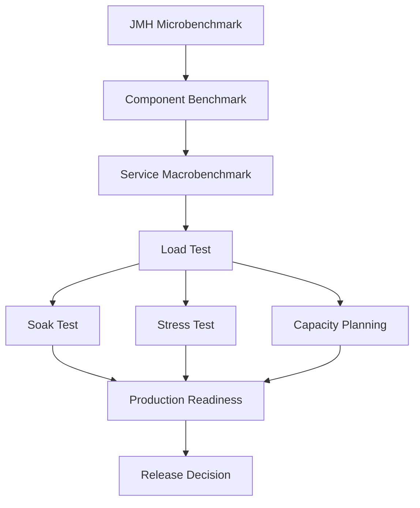
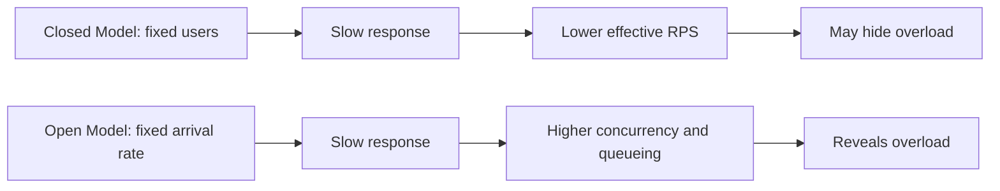
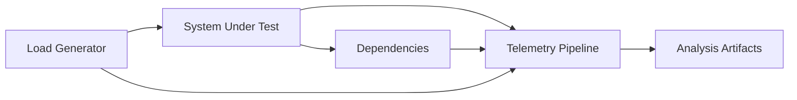
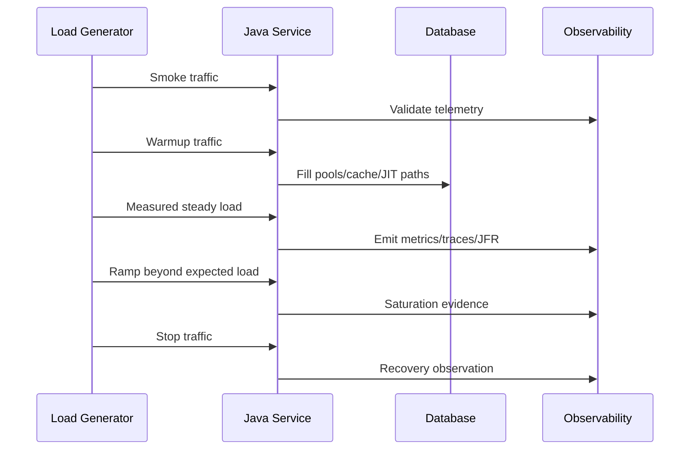
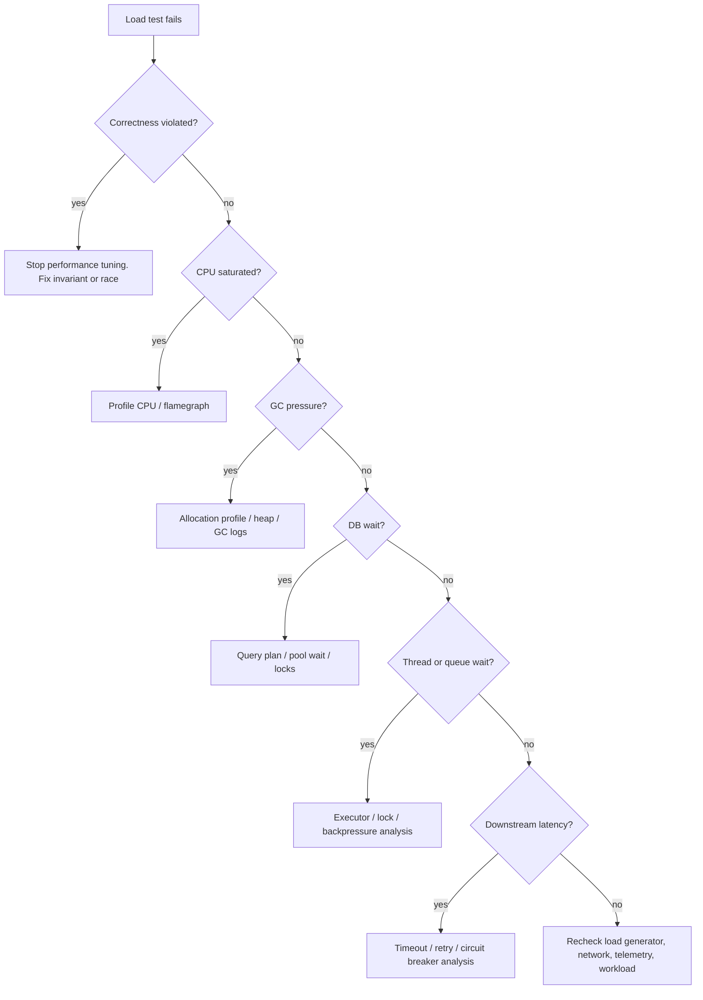

# Part 039 — Load Testing, Soak Testing, and Capacity Planning

A weak load test says:

> We ran 500 users for 10 minutes and the service looked okay.

A strong load test says:

> At 240 requests per second with a production-like tenant mix, realistic payload distribution, warm JVM, realistic database cardinality, and downstream latency profile, the system sustained p99 under 750 ms for 45 minutes, consumed 63% CPU, kept Postgres p95 under 35 ms, produced no illegal workflow transitions, did not increase retry amplification above 1.08x, and saturated first at the database connection pool around 310 requests per second.

The difference is not tooling.

The difference is **experiment design**.

This part is about designing load and capacity experiments that can be trusted.

We are not trying to generate impressive charts. We are trying to answer production questions:

```text
Can this Java service survive the expected traffic?
Where does it saturate?
What breaks first?
Does it fail safely?
How much headroom do we have?
Which bottleneck should we remove first?
Can the next release ship without violating SLOs?
```

If the answer cannot guide an engineering decision, the test is not finished.

---

## 1. The core mental model

Load testing is not one activity. It is a family of experiments.

Each experiment needs:

```text
Hypothesis
Workload model
System boundary
Data shape
Environment
Observability package
Acceptance criteria
Result interpretation
Decision
```

Without those, a load test becomes theater.

A load test is a controlled way to ask:

```text
Given this workload,
under these constraints,
with this data and dependency behavior,
what does the system do?
```

The key phrase is **given this workload**.

Most misleading performance tests fail at workload modeling, not at scripting.

---

## 2. Load testing is not the same as benchmarking

Earlier parts separated microbenchmarking, macrobenchmarking, profiling, and observability. Load testing sits above them.



Microbenchmarking asks:

```text
Is this code path faster/slower under controlled JVM conditions?
```

Service macrobenchmarking asks:

```text
How does one service behave with representative workload and dependencies?
```

Load testing asks:

```text
How does the service/system behave under expected or projected traffic?
```

Soak testing asks:

```text
Does behavior degrade over time?
```

Stress testing asks:

```text
Where is the breaking point and failure mode?
```

Capacity planning asks:

```text
How much resource do we need to meet SLOs with headroom?
```

These are related, but not interchangeable.

---

## 3. Terminology that must be precise

### Smoke performance test

A small test that proves the script, environment, credentials, test data, dashboards, and telemetry work.

It does not prove capacity.

Example:

```text
Duration: 3 minutes
Traffic: 5 RPS
Goal: verify the test harness and observability path
```

### Load test

A test at expected traffic level.

Example:

```text
Expected peak: 150 RPS
Test target: 150 RPS for 30 minutes
Goal: prove normal peak behavior
```

### Stress test

A test beyond expected traffic to find saturation and failure mode.

Example:

```text
Ramp: 100 -> 500 RPS
Goal: identify first bottleneck and degradation behavior
```

### Spike test

A sudden increase in load.

Example:

```text
Baseline: 50 RPS
Spike: 400 RPS for 5 minutes
Goal: observe autoscaling, queue growth, pool exhaustion, retry storms
```

### Soak test

A long-duration test at meaningful load.

Example:

```text
Traffic: 70% of expected peak
Duration: 8 hours
Goal: detect leaks, fragmentation, thread accumulation, cache growth, stuck workflows
```

### Capacity test

A test that maps load to resource usage and SLO behavior.

Example:

```text
100 RPS -> CPU 35%, p99 420 ms
150 RPS -> CPU 52%, p99 510 ms
200 RPS -> CPU 71%, p99 680 ms
250 RPS -> CPU 88%, p99 1.6 s
```

Capacity testing is about the curve, not one point.

---

## 4. Open model vs closed model

This distinction matters.

A **closed workload** keeps a fixed number of concurrent virtual users.

```text
10 users execute request -> wait for response -> think time -> next request
```

If the system slows down, each user sends fewer requests. The arrival rate naturally drops.

A **open workload** generates arrivals at a target rate independent of response time.

```text
150 requests per second arrive whether the system is slow or fast
```

If the system slows down, concurrency rises.

This difference changes the result completely.



For many backend APIs, message processors, public traffic, webhook receivers, and event ingestion systems, the real world is closer to open arrival.

For interactive user journeys where a human waits before making the next move, a closed model may be reasonable.

Do not pick the model based on tool convenience.

Pick it based on production reality.

---

## 5. Arrival rate, concurrency, and Little's Law

A common mistake:

```text
We tested 1,000 concurrent users, therefore we tested high load.
```

Not necessarily.

Concurrency alone does not define load.

Little's Law gives the rough relation:

```text
L = λ × W
```

Where:

```text
L = average concurrency / number of items in system
λ = arrival rate / throughput
W = average time in system
```

If response time is 100 ms and the system receives 100 RPS:

```text
L = 100 req/s × 0.1 s = 10 concurrent in-flight requests
```

If response time becomes 2 seconds at the same arrival rate:

```text
L = 100 req/s × 2 s = 200 concurrent in-flight requests
```

Concurrency can explode because latency increased.

That is why open-model tests are valuable: they expose queue growth.

A service does not only fail when CPU is 100%.

It often fails when queues quietly grow:

```text
HTTP server queue
executor queue
connection pool wait queue
Kafka consumer lag
DB lock wait queue
GC allocation pressure
retry queue
outbox backlog
```

Capacity planning is mostly queue management.

---

## 6. The workload card

Every serious load test needs a workload card.

Use this template before writing scripts.

```md
# Workload Card

## Business goal
What production risk are we testing?

## System under test
Which services, databases, queues, caches, and external systems are included?

## Traffic model
Open or closed model? Why?

## Arrival/concurrency profile
RPS, users, event rate, batch size, ramp-up, steady-state duration.

## Scenario mix
Example:
- 55% search/read case
- 20% create case
- 15% update workflow state
- 5% upload document metadata
- 5% appeal/escalation path

## Payload distribution
Small/medium/large payload percentages.

## Data distribution
Tenant mix, status mix, old/new records, hot/cold cache, skew.

## Dependency behavior
Real dependencies, containers, mocks, latency injection, error injection.

## Correctness checks
What invariant must hold under load?

## SLO targets
Latency, error rate, throughput, lag, saturation.

## Observability package
Dashboards, logs, traces, JFR, profiler, DB metrics, queue metrics.

## Exit criteria
What result means pass, fail, inconclusive?
```

The workload card forces the team to state assumptions.

Hidden assumptions become production incidents.

---

## 7. Production-like does not mean production-sized

A test can be useful without being identical to production.

But it must preserve the **performance-relevant properties**.

Examples:

```text
Wrong question:
Can we clone production exactly?

Better question:
Which production properties affect the result?
```

Performance-relevant properties include:

```text
Payload size distribution
Tenant skew
Database cardinality
Index selectivity
Cache hit ratio
Network latency
Downstream timeout behavior
Transaction contention
Message partition distribution
Object allocation rate
JVM warmup profile
GC ergonomics
Thread pool sizing
Connection pool sizing
Autoscaling rules
```

A small environment with realistic ratios can teach more than a large environment with fake data.

---

## 8. The load test environment

A production-grade load test environment has four components:



### Load generator

Must have enough capacity to generate traffic without becoming the bottleneck.

Watch:

```text
load-generator CPU
load-generator memory
network egress
dropped connections
client-side timeouts
script errors
DNS resolution
TLS overhead
```

A saturated load generator can make a bad system look good or a good system look bad.

### System under test

Must use known configuration:

```text
JDK version
JVM flags
container limits
CPU request/limit
heap size
GC collector
thread pools
connection pools
HTTP server config
feature flags
schema version
application build SHA
```

### Dependencies

Decide explicitly:

```text
real database?
real Kafka?
real cache?
mock downstream service?
latency injection?
fault injection?
```

A mocked dependency can be valid if the test is about service CPU behavior.

A mocked dependency is invalid if the bottleneck is expected at the database or remote service boundary.

### Telemetry pipeline

Do not start the test unless dashboards and artifacts are ready.

Required:

```text
application latency histogram
HTTP status/error rate
CPU, memory, GC, allocation
thread pool metrics
connection pool metrics
DB latency and locks
queue lag/backlog
retry counters
timeout counters
business invariant counters
JFR recording profile
logs with correlation ID
```

The test is only as good as the evidence it captures.

---

## 9. Java-specific load test traps

### Trap 1 — testing cold JVM only

A cold JVM can behave very differently from a warmed JVM.

The JIT compiler needs profile information. Classloading, lazy initialization, connection pool filling, cache population, and JIT compilation can distort early latency.

Use a warmup phase:

```text
5-15 minutes warmup for service tests
or until latency/allocation/throughput stabilizes
```

Then measure.

### Trap 2 — measuring only average latency

Average latency hides tail pain.

Use percentiles:

```text
p50
p90
p95
p99
p99.9 if volume is high enough
max with caution
```

But also inspect histograms, not only percentile snapshots.

### Trap 3 — ignoring allocation rate

Java services often degrade because allocation rate drives GC pressure.

Track:

```text
bytes allocated per second
allocation per request
young GC frequency
old-gen occupancy
promotion rate
humongous allocation
TLAB refill rate
```

A service can pass at 100 RPS and fail at 180 RPS because allocation pressure crosses a GC threshold.

### Trap 4 — wrong connection pool interpretation

A database connection pool is not only a performance knob.

It is a concurrency limiter.

If the pool is too small, requests wait.

If the pool is too large, the database may collapse.

Measure:

```text
active connections
idle connections
pending acquisition
acquisition latency
query latency
transaction duration
DB CPU
DB locks
DB wait events
```

### Trap 5 — retry amplification

Retries can multiply traffic during downstream failure.

If one request triggers three downstream attempts, 200 RPS can become 600 downstream RPS.

Track:

```text
incoming requests
outgoing attempts
retry count
retry reason
timeout count
circuit breaker state
fallback count
```

The retry ratio should be a first-class performance metric.

### Trap 6 — ignoring correctness under load

A load test that only measures latency is incomplete.

Under high load, correctness can fail before performance visibly fails:

```text
duplicate command accepted
outbox event skipped
workflow stuck
illegal transition allowed
partial update committed
idempotency key race
stale lock overwrite
approval generated twice
```

Load tests must include correctness assertions.

---

## 10. Scenario modeling

A system rarely has one traffic shape.

Model scenario mix.

Example for a regulatory case platform:

```text
40% read case summary
20% search case list
10% submit new case
10% assign investigator
8% update investigation notes
5% escalate case
4% close case
2% appeal decision
1% bulk export
```

This mix matters because each scenario exercises different bottlenecks:

```text
read summary -> cache, index, serialization
search -> query plan, pagination, index selectivity
submit -> validation, transaction, outbox
assign -> optimistic lock, audit, notification
escalate -> rule engine, workflow transition
bulk export -> streaming, memory, DB cursor
```

If your script only tests the cheapest path, you are measuring optimism.

---

## 11. Data modeling for load tests

Fake data usually lies.

Production data has shape:

```text
many small tenants
few huge tenants
hot records
old records
skewed statuses
large text fields
optional fields
wide JSON/XML blobs
uneven partition keys
historical audit rows
soft-deleted records
```

A test dataset should preserve the distributions that affect performance.

### Example data card

```md
# Test Data Card

Tenants:
- 2 large tenants: 1M cases each
- 20 medium tenants: 50k cases each
- 200 small tenants: 1k cases each

Case status distribution:
- 45% CLOSED
- 20% INVESTIGATION
- 15% TRIAGE
- 10% SUBMITTED
- 5% APPEAL
- 5% ESCALATED

Payload sizes:
- 70% small: < 8 KB
- 25% medium: 8-64 KB
- 5% large: 64 KB-1 MB

Access skew:
- 80% traffic hits last 30 days
- 15% traffic hits last 12 months
- 5% traffic hits archived cases
```

This is not bureaucracy.

This is what makes a load test useful.

---

## 12. Load script design

A load script is production simulation code.

Treat it like engineering code:

```text
version controlled
reviewed
parameterized
observable
reproducible
validated by smoke tests
kept near system knowledge
```

### Script requirements

A serious script should:

```text
use realistic headers and authentication
model user/session/tenant distribution
generate or select realistic data
check response semantics, not only status code
capture correlation IDs
fail fast on script errors
separate setup from measured path
avoid client-side bottlenecks
export raw metrics
```

### Bad check

```text
status == 200
```

### Better check

```text
status == 200
response.caseId is present
response.status is one of allowed states
response.version increased by exactly one
response.auditId is present
response.transition == expected transition
```

Performance without correctness is a trap.

---

## 13. k6-style open arrival model example

This is a simplified example, not a complete production script.

```js
import http from 'k6/http';
import { check } from 'k6';

export const options = {
  scenarios: {
    submit_case_peak: {
      executor: 'constant-arrival-rate',
      rate: 150,
      timeUnit: '1s',
      duration: '30m',
      preAllocatedVUs: 300,
      maxVUs: 1000,
    },
  },
  thresholds: {
    http_req_failed: ['rate<0.005'],
    http_req_duration: ['p(95)<500', 'p(99)<900'],
  },
};

export default function () {
  const payload = JSON.stringify({
    tenantId: selectTenant(),
    caseType: selectCaseType(),
    idempotencyKey: crypto.randomUUID(),
    subject: 'load-test-case',
  });

  const res = http.post(`${__ENV.BASE_URL}/cases`, payload, {
    headers: {
      'Content-Type': 'application/json',
      'X-Test-Run': __ENV.TEST_RUN_ID,
    },
  });

  check(res, {
    'created or idempotent': r => r.status === 201 || r.status === 200,
    'case id exists': r => JSON.parse(r.body).caseId !== undefined,
    'status submitted': r => JSON.parse(r.body).status === 'SUBMITTED',
  });
}
```

The important part is not JavaScript.

The important part is this:

```text
executor expresses workload model
rate expresses arrival rate
thresholds express SLO approximation
checks express correctness
```

---

## 14. Gatling-style injection thinking

Gatling lets you express open and closed injection profiles.

The conceptual choice matters more than syntax.

Open style:

```scala
setUp(
  scn.injectOpen(
    rampUsersPerSec(50).to(200).during(10.minutes),
    constantUsersPerSec(200).during(30.minutes)
  )
)
```

Closed style:

```scala
setUp(
  scn.injectClosed(
    rampConcurrentUsers(10).to(500).during(10.minutes),
    constantConcurrentUsers(500).during(30.minutes)
  )
)
```

Use open injection when production arrivals do not wait for the system.

Use closed injection when the real actor waits for completion before producing the next action.

---

## 15. Correctness assertions under load

For a Java service, correctness under load must be checked at several levels.

### Response-level assertion

```text
HTTP status is expected
schema is valid
business status is expected
version is monotonic
idempotency response is stable
```

### Database-level assertion

```sql
-- no duplicate active assignment for same case
select case_id, count(*)
from case_assignment
where active = true
group by case_id
having count(*) > 1;
```

Expected result:

```text
0 rows
```

### Event-level assertion

```sql
-- no committed case transition without outbox event
select t.id
from case_transition t
left join outbox_event e
  on e.aggregate_id = t.case_id
 and e.aggregate_version = t.case_version
where e.id is null;
```

Expected result:

```text
0 rows
```

### Workflow-level assertion

```text
No case remains in PROCESSING for more than 15 minutes.
No terminal case receives mutable command.
No appeal exists without final decision.
No escalation changes owner without audit record.
```

### Telemetry-level assertion

```text
illegal_transition_total == 0
idempotency_conflict_total == 0
outbox_lag_p99 < 30s
workflow_stuck_total == 0
retry_amplification_ratio < 1.10
```

A load test should fail if correctness is broken, even when latency is good.

---

## 16. The load test timeline

A useful test has phases.



Recommended phases:

```text
1. Smoke: prove script and telemetry.
2. Warmup: stabilize JVM/application behavior.
3. Baseline: expected load.
4. Peak: expected peak.
5. Stress: beyond peak to saturation.
6. Recovery: stop or reduce load and observe queue drain.
7. Post-check: verify data correctness.
```

Do not analyze only the steady state.

Recovery behavior is often where hidden damage appears.

---

## 17. Reading the capacity curve

Capacity is not one number.

It is a curve.

Example:

```text
RPS | p95 | p99  | CPU | DB CPU | Pool Wait | Error Rate
----|-----|------|-----|--------|-----------|-----------
100 | 180 | 320  | 35% | 22%    | 2 ms      | 0.00%
150 | 240 | 430  | 48% | 35%    | 4 ms      | 0.00%
200 | 330 | 610  | 62% | 48%    | 8 ms      | 0.01%
250 | 520 | 980  | 76% | 69%    | 25 ms     | 0.03%
300 | 900 | 2100 | 88% | 86%    | 160 ms    | 0.40%
350 | 1800| 5200 | 94% | 96%    | 900 ms    | 4.50%
```

The useful conclusion is not:

```text
It can do 350 RPS.
```

The useful conclusion is:

```text
The safe operating range is <= 250 RPS.
At 300 RPS, DB pool wait becomes nonlinear.
At 350 RPS, DB CPU and pool wait cause tail latency explosion.
Recommended capacity target: 200 RPS per deployment unit with 30% headroom.
Next bottleneck: database query/index/connection pool/transaction duration.
```

A capacity curve should identify the first nonlinear region.

That is where saturation begins.

---

## 18. Saturation analysis

Saturation means a constrained resource cannot absorb more work without queueing or errors.

Common saturation signals:

```text
CPU close to limit
run queue increases
GC time increases
old-gen occupancy cannot recover
thread pool queue grows
connection pool pending acquisition grows
DB lock wait grows
Kafka consumer lag grows
HTTP client pending queue grows
retry ratio increases
p99 latency grows faster than p50
```

Saturation is usually visible as divergence:

```text
p50 stays okay
p95 worsens
p99 explodes
queue grows
errors begin later
```

That means the service is not equally slow for everyone. It is punishing unlucky requests.

Tail latency is where queueing hides.

---

## 19. Bottleneck isolation workflow

When a test fails, do not randomly tune flags.

Use an isolation workflow.



The first question is correctness.

If the system becomes fast by violating invariants, performance improved in the wrong universe.

---

## 20. Soak testing

A soak test answers:

```text
Does the system remain stable over time?
```

Soak testing is not about maximum throughput.

It is about accumulation.

Things that accumulate:

```text
heap retention
classloader references
thread leaks
native memory
direct buffers
file descriptors
HTTP connections
DB connections
cache entries
outbox backlog
Kafka lag
scheduled tasks
temporary files
exception objects
metrics label cardinality
log volume
```

### Soak test shape

Example:

```text
Traffic: 60-70% of expected peak
Duration: 8-24 hours
Data: production-like, rotating tenants
Assertions:
  - p99 stable within band
  - heap after GC stable
  - thread count stable
  - FD count stable
  - direct memory stable
  - outbox lag stable
  - retry ratio stable
  - no workflow stuck accumulation
```

A good soak test includes periodic snapshots:

```text
JFR recording every hour
heap histogram every hour
thread dump on anomaly
DB wait snapshot
queue lag snapshot
application invariant query
```

### Soak test failure pattern

A leak often looks like:

```text
hour 1: p99 500 ms, heap after GC 1.2 GB
hour 2: p99 560 ms, heap after GC 1.5 GB
hour 4: p99 850 ms, heap after GC 2.4 GB
hour 6: p99 2.1 s, heap after GC 3.7 GB
hour 7: OOM or GC death spiral
```

Do not call this “random instability”.

It is accumulation.

---

## 21. Stress testing and failure-mode quality

Stress testing is not only about the breaking point.

It is about how the system breaks.

Bad failure mode:

```text
latency increases
retries increase
DB collapses
queues grow without bound
outbox stops
workflow state corrupts
manual cleanup required
```

Better failure mode:

```text
service rejects excess work quickly
backpressure activates
retry budget limits amplification
queue size is bounded
idempotency remains correct
outbox eventually drains
system recovers after load drops
```

The stress test should answer:

```text
What resource saturates first?
Is overload contained?
Are errors explicit and safe?
Does the system recover automatically?
Did any invariant break?
What is the safe operating envelope?
```

### Overload quality checklist

```text
Does the service return 429/503 instead of timing out everything?
Are timeouts shorter than caller deadlines?
Are retry attempts bounded and jittered?
Are queues bounded?
Are bulkheads effective?
Does circuit breaking reduce downstream load?
Does graceful degradation preserve critical paths?
Is idempotency preserved under retry storm?
Does recovery drain backlog without manual intervention?
```

---

## 22. Capacity planning

Capacity planning turns experiment results into operating limits.

It needs:

```text
current peak traffic
growth projection
seasonality
burst factor
SLO target
resource utilization target
headroom policy
failure-domain policy
cost constraint
```

### Simple capacity model

Suppose one pod safely handles:

```text
200 RPS at p99 < 750 ms
CPU 65%
DB pool wait p99 < 20 ms
error rate < 0.1%
```

Expected peak next quarter:

```text
900 RPS
```

Headroom policy:

```text
30%
```

Required capacity:

```text
900 × 1.30 = 1170 RPS
```

Pods required:

```text
ceil(1170 / 200) = 6 pods
```

But this is not enough.

Check shared dependencies:

```text
DB can handle total query load?
Kafka partitions enough?
cache bandwidth enough?
downstream service quota enough?
load balancer limits enough?
```

Horizontal scaling the Java service can move the bottleneck to the database.

Capacity planning must model the whole path.

---

## 23. N+1 capacity trap

A service may scale linearly while its dependency does not.

Example:

```text
one API request does 1 case query + N attachment queries
```

At 100 RPS and N=5:

```text
600 DB queries/s
```

At 300 RPS and N=5:

```text
1800 DB queries/s
```

If some tenants have N=50:

```text
300 RPS × 51 = 15300 DB queries/s
```

Average workload hides tenant-specific collapse.

Capacity models need high-cardinality data shape awareness.

---

## 24. Event-driven capacity

For Kafka/event-driven Java systems, capacity is not only HTTP latency.

Track:

```text
ingress event rate
consumer processing rate
consumer lag
partition skew
retry topic growth
dead-letter rate
outbox lag
transaction duration
handler latency
commit latency
rebalance frequency
```

Capacity question:

```text
Can consumers drain events faster than producers create them?
```

Backlog growth formula:

```text
backlog growth per second = incoming rate - processing rate
```

If incoming rate is 10,000 events/min and processing rate is 8,000 events/min:

```text
backlog grows by 2,000 events/min
```

At that point “service is up” means little.

The system is falling behind.

---

## 25. Autoscaling and load tests

Autoscaling changes the experiment.

You need to decide whether the test is measuring:

```text
single-unit capacity
or autoscaling behavior
```

### Single-unit test

Goal:

```text
How much can one pod/node handle?
```

Control:

```text
disable autoscaling
fixed resource limits
fixed pod count
```

### Autoscaling test

Goal:

```text
Can the platform respond to load changes fast enough?
```

Measure:

```text
scale-up trigger delay
pod startup time
JVM warmup time
readiness behavior
traffic shift behavior
scale-down safety
queue growth during scale-up
```

Autoscaling is not magic.

New Java pods may need:

```text
classloading
JIT warmup
connection pool creation
cache warmup
schema metadata loading
TLS handshakes
```

A pod can be “ready” but not performance-ready.

---

## 26. JVM warmup and readiness

For Java services, readiness must be more than “HTTP port open”.

Performance readiness may include:

```text
application context initialized
critical classloading done
connection pool established
cache or metadata warmed
JIT warmup path exercised if necessary
first DB query completed
message consumers assigned
```

Be careful: artificial warmup can hide production cold-start reality.

Use two tests:

```text
cold-start scaling test
steady-state capacity test
```

They answer different questions.

---

## 27. Release readiness gate

A release performance gate should be explicit.

Example:

```md
# Release Performance Gate

## Required tests
- smoke performance test passed
- expected peak load test passed
- correctness invariant checks passed
- no performance regression beyond threshold
- no new high-severity profiler hotspot
- no GC regression beyond threshold
- capacity headroom >= 30%

## Required artifacts
- workload card
- environment manifest
- build SHA
- test script version
- dashboard snapshot
- raw result file
- JFR recording
- GC log
- DB metrics snapshot
- invariant query result
- decision summary
```

This is how performance becomes engineering evidence, not opinion.

---

## 28. Result interpretation template

Use this after every load test.

```md
# Load Test Result Summary

## Decision
PASS / FAIL / INCONCLUSIVE

## Workload
Describe RPS, scenario mix, duration, data shape, environment.

## Key result
State the highest safe operating point.

## SLO evidence
Latency, error rate, saturation, queue lag.

## Correctness evidence
Invariant checks, duplicate handling, outbox, workflow stuck checks.

## Bottleneck
First nonlinear resource.

## Risk
What remains unknown?

## Recommendation
Ship / tune / retest / redesign / increase capacity.

## Artifacts
Links to raw data, dashboards, JFR, profiler, DB snapshots.
```

If a result cannot be summarized like this, the experiment was not well-defined.

---

## 29. Common anti-patterns

### Anti-pattern: testing only happy-path reads

Reads are often cheaper than writes.

Write paths include:

```text
validation
locking
transactions
audit
outbox
index updates
cache invalidation
notifications
```

Include them.

### Anti-pattern: using empty database

Query plans and index behavior depend on cardinality.

An empty database proves almost nothing.

### Anti-pattern: ignoring ramp-up

Instantly sending peak traffic can be useful for spike tests, but it is not the same as normal ramp behavior.

### Anti-pattern: no post-test invariant check

Some correctness bugs appear after the test:

```text
stuck queue
missing event
orphan row
duplicate assignment
incomplete compensation
```

### Anti-pattern: assuming p99 is enough

p99 hides the worst 1%.

At 10,000 requests per second, 1% is 100 bad requests per second.

Also inspect error distribution, tenant-specific latency, and scenario-specific latency.

### Anti-pattern: tuning everything at once

Change one major variable at a time.

Otherwise, you cannot learn.

---

## 30. Practical operating checklist

Before test:

```text
[ ] workload card reviewed
[ ] environment manifest captured
[ ] test data distribution validated
[ ] telemetry dashboards ready
[ ] load generator capacity validated
[ ] correctness assertions implemented
[ ] JFR/GC/profiler artifact plan ready
[ ] rollback/cleanup plan ready
```

During test:

```text
[ ] watch client errors
[ ] watch p95/p99 latency
[ ] watch CPU and run queue
[ ] watch allocation and GC
[ ] watch DB pool and DB wait
[ ] watch queue lag/backlog
[ ] watch retry amplification
[ ] watch invariant violation counters
[ ] mark timeline events
```

After test:

```text
[ ] run invariant queries
[ ] capture final metrics snapshot
[ ] inspect JFR/profiler when needed
[ ] compare against baseline
[ ] identify first bottleneck
[ ] record decision
[ ] create follow-up tasks
```

---

## 31. Study case: case submission load test

Assume this endpoint:

```http
POST /cases
```

Business behavior:

```text
validate submission
insert case
insert audit record
insert outbox event
return case ID
```

Invariant:

```text
Every committed case submission must have exactly one audit record and one outbox event.
```

Expected peak:

```text
120 RPS
```

Test plan:

```text
Smoke: 5 RPS, 3 minutes
Warmup: 50 RPS, 10 minutes
Peak: 120 RPS, 30 minutes
Stress: ramp 120 -> 300 RPS over 20 minutes
Recovery: 20 RPS, 10 minutes
Post-check: invariant SQL queries
```

Acceptance:

```text
p95 < 400 ms
p99 < 800 ms
error rate < 0.1%
outbox lag p99 < 15s
retry amplification < 1.05
no invariant violations
CPU < 75% at expected peak
DB pool pending p99 < 25 ms
```

Result example:

```text
At 120 RPS:
- p95 310 ms
- p99 620 ms
- CPU 58%
- DB CPU 42%
- pool wait p99 7 ms
- outbox lag p99 4.8s
- invariant violations 0

At 260 RPS:
- p95 900 ms
- p99 2400 ms
- CPU 82%
- DB CPU 91%
- pool wait p99 410 ms
- outbox lag p99 51s
```

Conclusion:

```text
Safe operating capacity: 120 RPS with >30% headroom.
First bottleneck: database write path / pool wait.
Next actions: inspect transaction duration, indexes, audit insert, outbox insert, and connection pool behavior.
Do not increase pool blindly before DB wait analysis.
```

This is the level of conclusion that matters.

---

## 32. What top engineers do differently

They do not ask:

```text
How many users can it handle?
```

They ask:

```text
What workload are we modeling?
What invariant must hold under load?
What is the first bottleneck?
What is the safe operating range?
What is the failure mode beyond that range?
Can the system recover?
What evidence supports the decision?
```

Load testing is not about pressure.

It is about truth under pressure.

---

## References

- Grafana k6 documentation — Open and closed workload models: https://grafana.com/docs/k6/latest/using-k6/scenarios/concepts/open-vs-closed/
- Grafana k6 documentation — Constant arrival rate executor: https://grafana.com/docs/k6/latest/using-k6/scenarios/executors/constant-arrival-rate/
- Grafana k6 documentation — Thresholds: https://grafana.com/docs/k6/latest/using-k6/thresholds/
- Gatling documentation — Injection profiles: https://docs.gatling.io/concepts/injection/
- OpenJDK JMH project: https://openjdk.org/projects/code-tools/jmh/
- Google SRE Workbook — Alerting on SLOs: https://sre.google/workbook/alerting-on-slos/

---

## End of Part 039

Part 039 gave us a practical operating model for load testing, soak testing, stress testing, and capacity planning.

Part 040 closes the whole series with a full case study and team operating model that connects formal methods, testing, benchmarking, profiling, observability, and production feedback into one engineering discipline.
