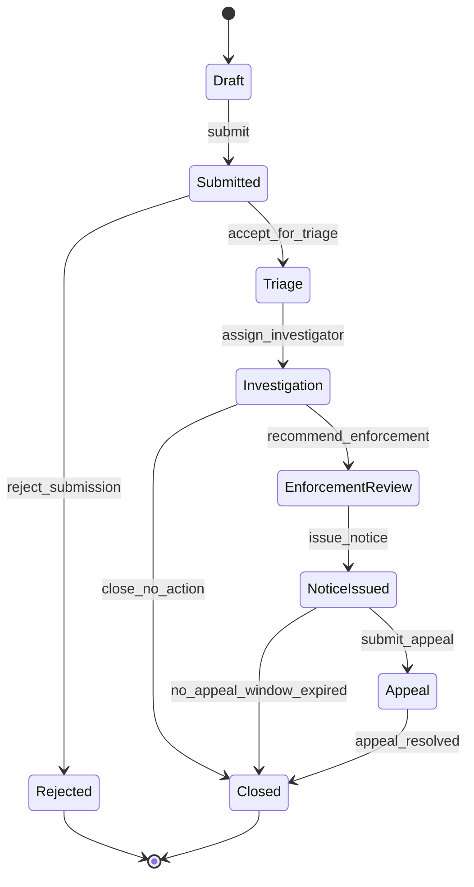
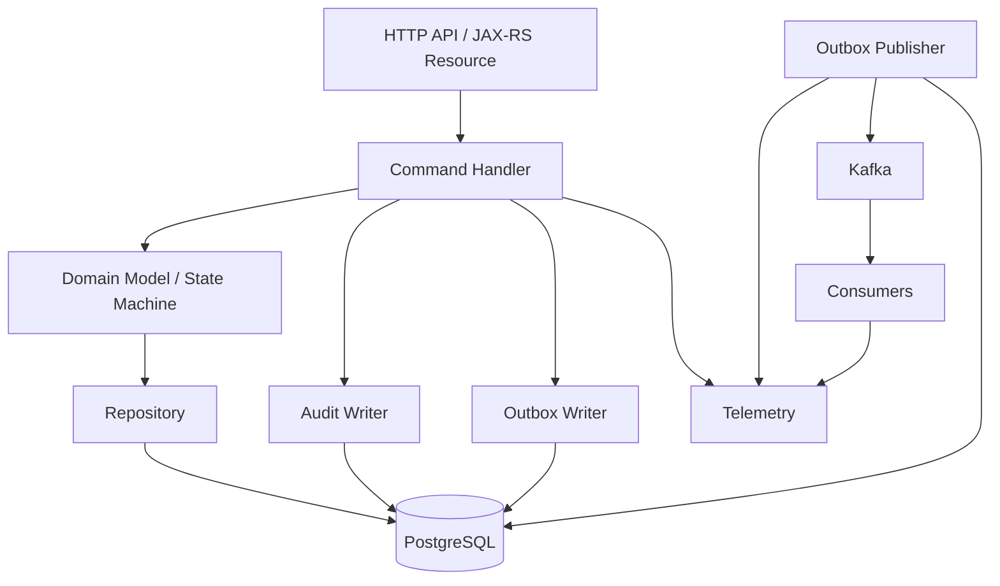
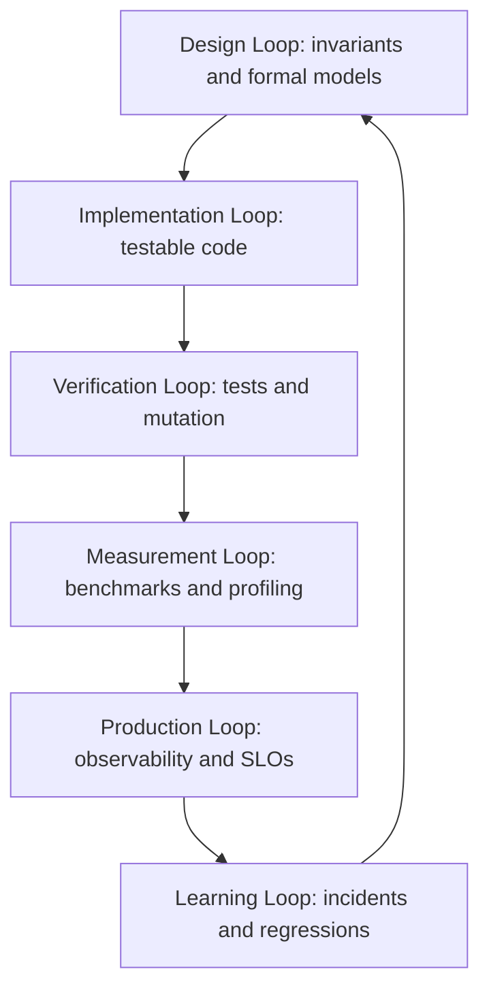
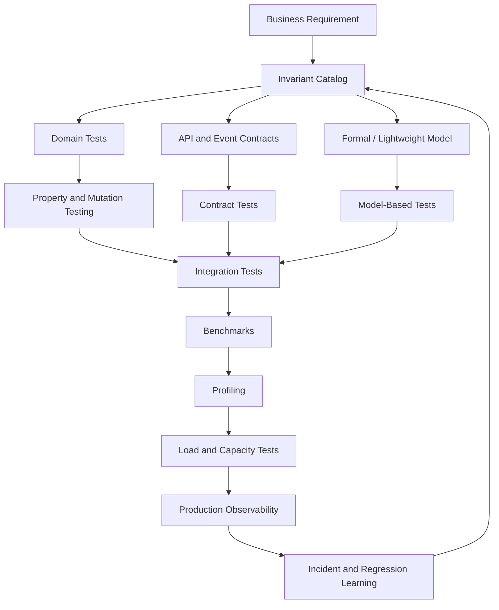

# Part 040 — Performance Engineering Case Study and Operating Model

This is the closing part of the series.

The goal is not to introduce another tool.

The goal is to connect everything into one operating model:

```text
formal reasoning
example-based testing
property-based testing
mutation testing
integration testing
contract testing
model-based testing
benchmarking
profiling
observability
load testing
capacity planning
release governance
incident feedback
```

A top engineer does not treat these as separate rituals.

A top engineer builds an **evidence system**.

The system answers:

```text
What must be true?
How do we know before release?
How do we know under load?
How do we know in production?
What do we do when evidence changes?
```

That is the discipline this series has been building.

---

## 1. The case study system

We will use a production-grade Java regulatory case management platform.

The domain:

```text
citizens or institutions submit cases
cases enter triage
investigators are assigned
evidence is collected
cases may escalate to enforcement
notices may be issued
parties may appeal
cases eventually close
all state changes require auditability
important changes publish events
```

The implementation context:

```text
Java 17+
JAX-RS/Jersey-style HTTP API
PostgreSQL
transactional outbox
Kafka-style event publishing
workflow/state machine logic
OpenAPI/schema-first contract
JUnit/Jupiter
jqwik
PIT
Testcontainers
JMH
JFR/JMC
async-profiler
OpenTelemetry
load testing with open/closed workload models
```

The exact framework is less important than the engineering pattern.

---

## 2. The production risk

The business does not care whether we use JUnit, TLA+, JMH, or JFR.

The business cares about outcomes:

```text
No illegal case transition.
No missing audit trail.
No lost event after committed state change.
No duplicate enforcement notice.
No stale command overwrites newer decision.
No closed case is mutated.
No appeal exists without eligible final decision.
No SLA breach is hidden.
No release causes unacceptable latency or throughput regression.
No overload corrupts state.
```

This is the first important lesson:

> Tools are not the root. Invariants are the root.

---

## 3. The core lifecycle

Simplified case lifecycle:



This diagram is not documentation decoration.

It is the start of the evidence system.

From it, we derive:

```text
allowed transitions
forbidden transitions
terminal state invariants
audit requirements
event requirements
authorization requirements
performance scenarios
observability dimensions
```

---

## 4. The invariant catalog

A serious system needs an invariant catalog.

Example:

```md
# Invariant Catalog

## CASE-LIFECYCLE-001: Terminal immutability
A case in CLOSED or REJECTED state must not accept mutable commands.

## CASE-LIFECYCLE-002: Transition validity
Every case status change must follow the allowed transition graph.

## CASE-AUDIT-001: Audit completeness
Every committed command that changes case state must produce exactly one audit entry.

## CASE-OUTBOX-001: Event completeness
Every committed externally visible state change must produce an outbox event in the same transaction.

## CASE-IDEMPOTENCY-001: Idempotent command stability
For the same idempotency key and command semantic identity, repeated attempts must return the same logical result.

## CASE-CONCURRENCY-001: Optimistic version monotonicity
A command may only update a case version if it was based on the current version.

## CASE-APPEAL-001: Appeal eligibility
An appeal may only exist after an appealable notice or decision.

## CASE-SLA-001: Triage deadline visibility
A submitted case older than the triage SLA must be visible as overdue.
```

Each invariant should have evidence across multiple layers.

Not all layers need to prove all invariants.

But critical invariants need defense in depth.

---

## 5. Evidence matrix

The evidence matrix maps each invariant to verification techniques.

```md
| Invariant | Unit | Property | Mutation | Integration | Contract | Formal | Load | Production |
|---|---:|---:|---:|---:|---:|---:|---:|---:|
| Terminal immutability | yes | yes | yes | yes | partial | yes | yes | yes |
| Transition validity | yes | yes | yes | yes | partial | yes | yes | yes |
| Audit completeness | partial | partial | yes | yes | no | partial | yes | yes |
| Outbox completeness | partial | partial | yes | yes | no | yes | yes | yes |
| Idempotency stability | yes | yes | yes | yes | yes | yes | yes | yes |
| Version monotonicity | yes | yes | partial | yes | no | yes | yes | yes |
| Appeal eligibility | yes | yes | yes | yes | yes | yes | yes | yes |
| SLA visibility | yes | yes | partial | yes | yes | partial | yes | yes |
```

This is how a team stops arguing abstractly about test coverage.

The question becomes:

```text
What evidence do we have for this invariant?
Where is the evidence weak?
What failure mode is still untested?
```

Coverage percentage cannot answer that.

---

## 6. Architecture under test

Simplified architecture:



The correctness boundary is not only the Java object.

It includes:

```text
HTTP contract
command validation
state transition logic
transactional persistence
audit record
outbox event
publisher behavior
consumer idempotency
observability
```

Therefore the evidence system must span all of these.

---

## 7. Data contract first

Before implementation, define the API behavior.

Example command:

```http
POST /cases/{caseId}/transitions
Idempotency-Key: 8b3e4e2b-...
Content-Type: application/json
```

```json
{
  "commandId": "cmd-123",
  "expectedVersion": 7,
  "transition": "ASSIGN_INVESTIGATOR",
  "investigatorId": "user-42",
  "reason": "Initial assignment"
}
```

Response:

```json
{
  "caseId": "case-1001",
  "previousStatus": "TRIAGE",
  "currentStatus": "INVESTIGATION",
  "version": 8,
  "auditId": "audit-9001",
  "eventId": "evt-7001"
}
```

Contract-level invariant:

```text
If response is success, version must increase and auditId/eventId must exist.
```

Error behavior:

```text
409 CONFLICT for stale expectedVersion
422 UNPROCESSABLE_ENTITY for invalid transition
409 or 200 stable response for idempotent replay depending on API decision
403 FORBIDDEN for unauthorized transition
```

Contract clarity reduces test ambiguity.

---

## 8. Domain model evidence

Domain object:

```java
public final class CaseAggregate {
    private final CaseId id;
    private final CaseStatus status;
    private final long version;

    public TransitionResult transition(TransitionCommand command) {
        if (status.isTerminal()) {
            throw new InvalidTransitionException("terminal case cannot transition");
        }

        if (!AllowedTransitions.canMove(status, command.transition())) {
            throw new InvalidTransitionException("transition not allowed");
        }

        CaseStatus next = AllowedTransitions.apply(status, command.transition());
        return new TransitionResult(id, status, next, version + 1);
    }
}
```

Example-based tests verify representative paths:

```java
@Test
void closedCaseCannotTransition() {
    var caze = CaseFixtures.closedCase();

    assertThatThrownBy(() -> caze.transition(assignInvestigator()))
        .isInstanceOf(InvalidTransitionException.class);
}
```

This is useful, but insufficient.

The transition graph has many paths.

So we add property-based tests.

```java
@Property
void terminalStatesRejectAllMutableTransitions(
    @ForAll("terminalCases") CaseAggregate caze,
    @ForAll("mutableCommands") TransitionCommand command
) {
    assertThatThrownBy(() -> caze.transition(command))
        .isInstanceOf(InvalidTransitionException.class);
}
```

The unit test documents a known example.

The property test attacks the invariant.

---

## 9. Mutation testing evidence

Suppose someone changes:

```java
if (!AllowedTransitions.canMove(status, command.transition())) {
```

to:

```java
if (AllowedTransitions.canMove(status, command.transition())) {
```

A strong test suite should fail.

Mutation testing asks:

```text
If the implementation is subtly wrong, do tests detect it?
```

For critical lifecycle code, mutation testing is valuable because statement coverage is not enough.

A test may execute the line but not assert the behavior.

Mutation score is not the goal.

The goal is oracle strength.

---

## 10. Formal model evidence

Some bugs do not appear in one command.

They appear in histories.

Example:

```text
submit command succeeds
client times out
client retries
publisher crashes
outbox restarts
second command arrives with stale version
consumer receives duplicate event
```

This is not just a unit testing problem.

It is a system behavior problem.

A TLA+/PlusCal-style model can capture abstract state:

```text
caseStatus
caseVersion
idempotencyStore
outbox
publishedEvents
consumerState
```

Safety properties:

```text
No invalid transition occurs.
Case version is monotonic.
Every committed visible transition has an outbox event.
Idempotent replay does not create a second transition.
```

Liveness property:

```text
Every outbox event is eventually either published or marked permanently failed.
```

Formal modeling gives you counterexamples before production gives you incidents.

The best output of a formal model is not the spec file.

The best output is a sharper engineering question.

---

## 11. Counterexample to regression test

Formal tools often produce traces.

Example counterexample:

```text
1. Command A reads version 7.
2. Command B reads version 7.
3. Command A updates to version 8.
4. Command B updates to version 8 without version guard.
5. Audit has two transitions from version 7.
```

Turn this into a Java integration test.

```java
@Test
void concurrentCommandsCannotBothCommitFromSameVersion() throws Exception {
    var caseId = givenCaseInStatus(TRIAGE, 7);

    var barrier = new CyclicBarrier(2);

    var first = executor.submit(() -> transitionAfterBarrier(caseId, 7, ASSIGN_INVESTIGATOR, barrier));
    var second = executor.submit(() -> transitionAfterBarrier(caseId, 7, CLOSE_NO_ACTION, barrier));

    var results = List.of(first.get(), second.get());

    assertThat(results).filteredOn(TransitionResponse::isSuccess).hasSize(1);
    assertThat(results).filteredOn(TransitionResponse::isConflict).hasSize(1);

    assertSingleVersionIncrement(caseId, 8);
    assertNoDuplicateAuditForVersion(caseId, 8);
}
```

Counterexamples should not remain in a PDF or notebook.

They should become executable regression evidence.

---

## 12. Integration evidence

The critical path uses PostgreSQL.

Therefore pure unit tests are not enough.

Integration test with real database verifies:

```text
transaction boundaries
unique constraints
optimistic locking
outbox atomicity
migration compatibility
query behavior
audit persistence
idempotency key uniqueness
```

Example invariant query:

```sql
select case_id, version, count(*)
from case_audit
where command_type = 'TRANSITION'
group by case_id, version
having count(*) > 1;
```

Expected result:

```text
0 rows
```

Critical constraints should exist in both Java and database when possible.

Java guard gives early failure.

Database constraint gives last-line defense.

---

## 13. Contract evidence

The API contract should encode stable expectations:

```text
required fields
status codes
error body shape
idempotency behavior
schema compatibility
auth/authz expectations
pagination semantics
retry semantics
```

Consumer-driven contracts are useful when other teams depend on API behavior.

Provider contracts are useful when the API spec is the source of truth.

For events, contract evidence includes:

```text
event type
event version
aggregate ID
aggregate version
occurredAt
schema compatibility
required fields
semantic meaning of status
```

A breaking event change can be worse than an HTTP breaking change because consumers may fail asynchronously.

---

## 14. Benchmark evidence

Now suppose we optimize transition validation.

Bad engineering:

```text
This feels faster.
```

Better engineering:

```text
JMH benchmark shows validation allocation drops from 2.1 KB/op to 480 B/op for representative transition matrix sizes.
No behavior change. Property tests pass. Mutation score unaffected.
```

JMH is useful for isolated code paths:

```text
transition validation
schema validation
serialization
rule matching
ID parsing
collection transformation
mapping layer
```

But JMH does not prove service capacity.

It proves a local performance property under controlled conditions.

Use it as one evidence layer.

---

## 15. Profiling evidence

Suppose load test shows p99 regression.

Do not guess.

Capture evidence:

```text
JFR recording
async-profiler CPU profile
allocation profile
GC log
DB query snapshot
thread dump if blocked
```

Diagnosis example:

```text
Symptom: p99 increased from 650 ms to 1.4 s.
JFR: allocation rate doubled.
async-profiler allocation: 38% from JSON serialization of audit snapshot.
GC log: young GC frequency increased from every 8s to every 2s.
Conclusion: new audit snapshot creates large intermediate maps.
Fix: stream/compact audit payload and avoid duplicate object graph conversion.
```

This is performance engineering.

Not tuning.

---

## 16. Observability evidence

Production must verify the same things tests care about.

Metrics:

```text
case_transition_total{from,to,result}
illegal_transition_total{from,to,command}
idempotency_replay_total{result}
idempotency_conflict_total
outbox_lag_seconds
outbox_publish_failure_total
workflow_stuck_total{status}
audit_missing_total
case_command_latency_seconds{command,status}
retry_amplification_ratio
```

Logs:

```text
correlationId
caseId
commandId
idempotencyKey hash
actorId
previousStatus
nextStatus
version
result
errorCode
```

Traces:

```text
HTTP request
command validation
repository load
state transition
audit insert
outbox insert
transaction commit
```

Production telemetry should be shaped by invariants.

Not by whatever the framework emits by default.

---

## 17. Load evidence

Now run the system under expected traffic.

Workload:

```text
40% case read
20% search
15% transition command
10% submit case
5% appeal
5% evidence metadata update
5% export/status report
```

Success criteria:

```text
p95 < 500 ms for interactive APIs
p99 < 900 ms for command APIs
error rate < 0.1%
outbox lag p99 < 30s
illegal_transition_total = 0
idempotency_conflict_total = 0 except expected semantic conflicts
workflow_stuck_total = 0
CPU < 75% at expected peak
DB pool wait p99 < 25 ms
```

Load test is not only performance proof.

It is correctness under pressure proof.

---

## 18. Release decision

A mature release decision is evidence-based.

```md
# Release Decision Record

## Feature
Case transition audit snapshot v2

## Build
service-case-command: 7f4a9c2
schema: 2026.07.03.001

## Correctness evidence
- unit tests pass
- property-based transition tests pass
- PIT threshold passed for lifecycle package
- integration outbox/audit tests pass
- contract tests pass

## Formal/spec evidence
- TLA+ idempotency/outbox model unchanged
- no new counterexample for command replay scenario

## Performance evidence
- JMH: audit snapshot allocation reduced 31%
- macrobenchmark: command p99 unchanged
- load test: expected peak passed with 35% headroom
- JFR: no new allocation hotspot

## Production readiness
- dashboards updated
- invariant metrics emitted
- canary alert configured
- rollback path verified

## Decision
Ship canary to 5%, observe for 60 minutes, then ramp.
```

This is a different engineering culture from:

```text
All tests passed. Ship it.
```

---

## 19. Operating model overview

The operating model has six loops.



The loop matters because systems change.

A one-time verification effort decays.

An operating model keeps evidence alive.

---

## 20. Design loop

Inputs:

```text
business requirement
risk analysis
domain lifecycle
data contract
failure model
```

Outputs:

```text
invariant catalog
state machine
formal model for high-risk behavior
API/event contract
test strategy
observability requirements
```

Design review questions:

```text
What must never happen?
What must eventually happen?
What can be retried?
What is idempotent?
What is the concurrency model?
What state is authoritative?
What evidence will prove this behavior?
```

---

## 21. Implementation loop

Coding rules:

```text
pure domain core where possible
effectful shell at boundaries
explicit time source
explicit randomness source
explicit command identity
explicit idempotency key
transaction boundary visible
side effects represented intentionally
metrics/logging at semantic boundaries
```

Implementation review questions:

```text
Can this be tested without real time?
Can this be tested without random behavior?
Can this fail halfway?
What happens if called twice?
What happens if two commands race?
What happens if event publishing fails after commit?
What database constraint backs the Java guard?
```

---

## 22. Verification loop

Test portfolio:

```text
unit tests for local behavior
property tests for invariant families
mutation tests for oracle strength
integration tests for database/queue boundaries
contract tests for consumers/providers
model-based tests from formal traces
E2E smoke journeys for deployment confidence
```

Verification review questions:

```text
Which invariant does this test protect?
Would this test fail if the implementation were wrong?
Does the test assert semantics or implementation noise?
Is the fixture realistic enough?
Is the test deterministic?
Is the failure diagnostic?
```

---

## 23. Measurement loop

Measurement portfolio:

```text
JMH for isolated JVM code path
component benchmark for local subsystem
macrobenchmark for service workload
load test for production-like traffic
soak test for accumulation
stress test for failure mode
capacity test for operating envelope
```

Measurement review questions:

```text
What is the hypothesis?
What workload is modeled?
What is controlled?
What is measured?
What is the baseline?
What is the noise level?
What decision will this result drive?
```

---

## 24. Production loop

Production verification includes:

```text
SLO dashboards
business invariant metrics
burn-rate alerts
canary analysis
continuous profiling
JFR-on-incident
structured logs
trace exemplars
synthetic journeys
reconciliation jobs
```

Production review questions:

```text
Can we detect an invariant violation?
Can we detect stuck workflows?
Can we detect retry amplification?
Can we detect tenant-specific degradation?
Can we detect p99 regression during canary?
Can we connect telemetry to a release/build?
Can we reconstruct a case history for audit?
```

---

## 25. Learning loop

Every incident, regression, and near miss should update the evidence system.

Example:

```text
Incident: duplicate enforcement notice emitted under retry storm.
Root cause: idempotency key scoped to HTTP request only, not business command identity.
Evidence gap: no property test for replay after partial timeout; no production metric for duplicate notice suppression.
Actions:
- update invariant catalog
- add TLA+ replay scenario
- add integration race test
- add idempotency property test
- add unique DB constraint
- add duplicate_notice_suppressed_total metric
- add load test scenario with timeout/retry storm
```

The incident is not closed when the hotfix is deployed.

It is closed when the evidence system has learned.

---

## 26. Engineering governance without bureaucracy

The goal is not to create paperwork.

The goal is to prevent vague engineering.

Lightweight artifacts:

```text
Invariant Catalog
Failure Model
Evidence Matrix
Workload Card
Benchmark Result Summary
Release Decision Record
Incident Evidence Gap Review
```

These artifacts should be short, living, and linked to code/tests/dashboards.

They are useful only if they change decisions.

---

## 27. Definition of Done for high-risk Java changes

For high-risk lifecycle/concurrency/performance changes:

```md
# Definition of Done

## Correctness
- invariants identified or updated
- unit tests added for representative cases
- property tests added for invariant families
- mutation testing reviewed for critical package
- integration tests cover transaction and persistence behavior
- contract tests updated if API/event changes

## Formal/specification
- formal model updated if concurrency/idempotency/distributed behavior changed
- counterexamples converted to regression tests where applicable

## Performance
- JMH/component benchmark added if hot code path changed
- macrobenchmark/load test updated if service path changed
- profiler evidence captured for suspicious regression

## Production readiness
- metrics/logs/traces updated
- alerts/dashboards updated for new invariant or SLO
- canary/rollback plan documented
```

This does not apply to every small change.

Use risk-based depth.

Top engineers do not apply every technique everywhere.

They apply the right level of evidence to the right risk.

---

## 28. Risk-based verification depth

Use this rough scale.

```md
| Risk Level | Example | Required Evidence |
|---|---|---|
| Low | formatting, harmless refactor | existing tests, review |
| Medium | new validation rule | unit + property where useful + contract if exposed |
| High | lifecycle transition change | invariant update + unit + property + mutation + integration |
| Critical | idempotency/concurrency/outbox | formal/model-based + integration race + load correctness + production metric |
| Performance-sensitive | hot path/serialization/query | benchmark + profiler + regression gate |
```

The point is not maximal testing.

The point is proportional evidence.

---

## 29. Team ownership model

For a large Java codebase, ownership must be explicit.

```text
Domain team owns invariants and domain tests.
Platform team owns CI, test infrastructure, profiling toolchain, telemetry baseline.
SRE/platform team owns production SLOs and incident feedback loop.
Database owners review query/index/transaction capacity.
Security/compliance owners review auditability and access invariants.
```

But ownership cannot become silos.

Invariants cross boundaries.

Example:

```text
Outbox completeness requires domain, database, eventing, and observability ownership.
```

Create shared evidence reviews for critical workflows.

---

## 30. The performance review meeting

A useful performance review is not a dashboard walkthrough.

Agenda:

```text
1. What changed since last review?
2. Which SLOs or invariants are at risk?
3. Which performance regressions appeared?
4. Which capacity curve changed?
5. Which production profiles show new hotspots?
6. Which tests are flaky or low-value?
7. Which incidents revealed evidence gaps?
8. Which bottleneck matters next?
```

Artifacts:

```text
trend dashboard
benchmark baseline diff
load test result summaries
incident evidence gaps
capacity plan
top profiler diffs
flaky test report
mutation/evidence gaps for critical modules
```

Cadence depends on system risk.

For a critical platform, monthly or per major release is reasonable.

---

## 31. The release pipeline as evidence pipeline

A release pipeline should not be only build automation.

It should be evidence automation.

```mermaid
flowchart LR
    A[Commit] --> B[Static Checks]
    B --> C[Unit Tests]
    C --> D[Property Tests]
    D --> E[Mutation Sample / Critical Packages]
    E --> F[Integration Tests]
    F --> G[Contract Tests]
    G --> H[Benchmark Regression]
    H --> I[Deploy to Staging]
    I --> J[Load/Smoke Test]
    J --> K[Canary]
    K --> L[Production SLO Observation]
```



Not every stage runs on every commit.

Use tiers:

```text
PR: fast deterministic evidence
nightly: expensive evidence
release: full risk evidence
production: canary and SLO evidence
```

---

## 32. Final integrated example

Feature request:

```text
Add ability to reopen a closed case within 30 days if appeal evidence is accepted.
```

Weak implementation path:

```text
Add status transition.
Add unit test.
Ship.
```

Strong engineering path:

### Step 1 — update lifecycle model

```text
Closed -> Reopened allowed only if:
- closedReason is appealable
- appealEvidenceAccepted is true
- closedAt <= 30 days ago
- actor has permission
```

### Step 2 — update invariant catalog

```text
Closed cases remain immutable except explicit reopen command satisfying reopen eligibility.
Reopened case must create audit record.
Reopened case must publish CaseReopened event.
Reopen must not erase previous closure history.
```

### Step 3 — update API/event contract

```text
POST /cases/{caseId}/reopen
CaseReopened event v1
error codes for expired window, invalid evidence, unauthorized actor
```

### Step 4 — update tests

```text
unit tests for representative cases
property tests for window boundary and eligibility matrix
mutation testing for conditional logic
integration test for audit/outbox atomicity
contract tests for API/event shape
```

### Step 5 — update formal/model-based checks

```text
state model includes Reopened
terminal immutability invariant refined
counterexamples checked for illegal reopen loops
```

### Step 6 — update performance evidence

```text
benchmark eligibility rule if heavy
macrobenchmark reopen command if hot path
load test scenario if expected volume meaningful
```

### Step 7 — update observability

```text
case_reopen_total{result,reason}
case_reopen_latency_seconds
illegal_reopen_attempt_total
case_reopened_event_lag_seconds
```

### Step 8 — release decision

```text
ship behind feature flag
canary to internal tenant
watch invalid reopen attempts, event lag, audit completeness, p99 latency
```

This is what “production-grade” means.

It is not heavier for the sake of process.

It is heavier where the risk is real.

---

## 33. What to keep practicing after this series

To internalize the material, practice in loops.

### Exercise 1 — build an invariant catalog

Pick one real workflow.

Write:

```text
10 safety invariants
5 liveness expectations
5 failure modes
5 production metrics
```

### Exercise 2 — convert invariants to tests

For each invariant, decide:

```text
unit?
property?
integration?
contract?
formal?
production metric?
```

### Exercise 3 — write one property test

Choose one domain rule with many combinations.

Write a generator and a property.

### Exercise 4 — run mutation testing

Run PIT on a critical package.

Do not chase score blindly.

Find weak oracles.

### Exercise 5 — write one JMH benchmark

Benchmark one hot code path.

Include:

```text
warmup
forks
state
Blackhole if needed
representative parameters
allocation profiler
```

### Exercise 6 — capture one JFR

Run a realistic scenario.

Inspect:

```text
CPU
allocation
GC
locks
exceptions
IO
```

### Exercise 7 — design one load test

Write a workload card before scripting.

Include correctness assertions.

---

## 34. The top 1% mental model

A top 1% engineer does not merely know more tools.

They see systems as interacting constraints:

```text
domain invariants
state transitions
data contracts
transaction boundaries
concurrency histories
runtime behavior
resource bottlenecks
queueing dynamics
production feedback
human operating process
```

They ask better questions:

```text
What must be true?
What can go wrong?
What evidence would detect it?
What evidence would prevent it?
What is the smallest useful model?
What is the cheapest reliable test?
What is the first bottleneck?
What happens under retry, timeout, and concurrency?
What does production say?
```

They do not trust green tests blindly.

They do not trust benchmarks blindly.

They do not trust dashboards blindly.

They triangulate.

---

## 35. Final synthesis

The complete stack looks like this:



This is the practical meaning of the whole series:

```text
Correctness is not a unit test.
Performance is not a benchmark.
Reliability is not a dashboard.

They are all parts of an evidence system.
```

---

## 36. Series completion

This is the final part of:

```text
Learn Java Formal Methods, Testing, Benchmarking, and Performance Engineering
```

The series has covered:

```text
correctness/performance evidence maps
invariants and failure models
test taxonomy and testable design
JUnit/testing architecture
fixtures and test doubles
state machine/workflow testing
exception and edge-case testing
time/concurrency/nondeterminism
property-based and generative testing
mutation testing
fuzzing
contract/schema testing
integration/E2E testing
test suite architecture
formal methods with TLA+, PlusCal, Alloy, OpenJML
model-based testing
concurrency/idempotency/distributed behavior
performance measurement theory
JMH and benchmarking
macrobenchmarking and regression testing
JVM runtime, memory, GC, concurrency
DB/network performance
JFR/JMC and async-profiler
observability as runtime verification
load/soak/stress testing and capacity planning
integrated operating model
```

A good next step is not to reread everything.

A good next step is to apply it to one real service.

Pick one critical workflow.

Build the evidence system around it.

That is how the material becomes engineering skill.

---

## References

- OpenJDK JMH project: https://openjdk.org/projects/code-tools/jmh/
- OpenTelemetry Java documentation: https://opentelemetry.io/docs/languages/java/
- Google SRE Workbook — Alerting on SLOs: https://sre.google/workbook/alerting-on-slos/
- Grafana k6 documentation — Open and closed models: https://grafana.com/docs/k6/latest/using-k6/scenarios/concepts/open-vs-closed/
- Gatling documentation — Injection profiles: https://docs.gatling.io/concepts/injection/
- OpenJDK JFR API package: https://docs.oracle.com/en/java/javase/21/docs/api/jdk.jfr/jdk/jfr/package-summary.html

---

## End of Part 040

This is the final part of the series.
