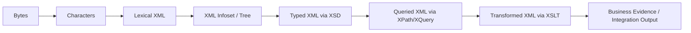
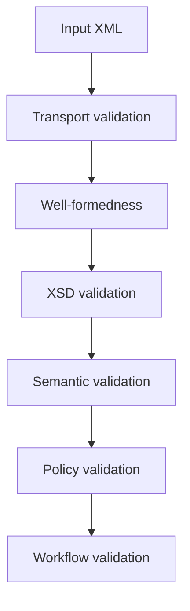
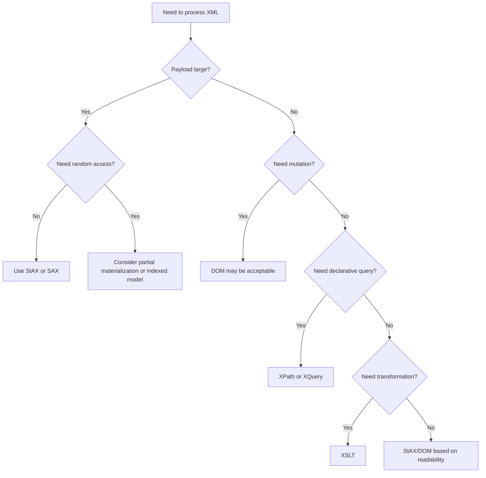
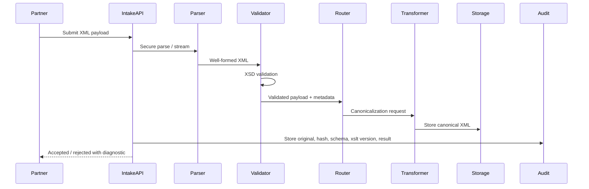

# Part 001 — Kaufman Skill Map

## Tujuan Part Ini

Part pertama ini bukan tutorial XML dasar. Tujuannya adalah membuat **peta kemampuan** supaya seluruh seri tidak berubah menjadi kumpulan API, snippet, dan template yang terpisah-pisah.

Setelah menyelesaikan part ini, kamu harus punya mental model yang jelas untuk menjawab pertanyaan seperti:

1. Kapan XML harus diperlakukan sebagai **dokumen**, kapan sebagai **message**, kapan sebagai **contract**, dan kapan sebagai **evidence artifact**?
2. Kapan harus memakai DOM, SAX, StAX, XPath, XQuery, XSLT, JAXB/Jakarta XML Binding, atau processor seperti Saxon?
3. Apa batasan correctness XML: well-formedness, namespace correctness, schema validity, semantic validity, compatibility, dan operational safety?
4. Bagaimana membangun pipeline Java XML yang aman, measurable, bisa diaudit, dan tahan terhadap payload besar maupun payload berbahaya?
5. Bagaimana belajar XML technologies secara efisien berdasarkan pendekatan Josh Kaufman: deconstruct, learn enough to self-correct, remove barriers, dan deliberate practice?

Kita akan memakai XML bukan sebagai “format lama”, tetapi sebagai **teknologi kontrak dan transformasi** yang masih banyak muncul di sistem finansial, regulatory reporting, insurance, telco, healthcare, government, ERP, B2B integration, SOAP, batch file exchange, digital document, dan platform case-management lama yang tetap critical.

---

## Cara Seri Ini Memakai Framework Kaufman

Dalam *The First 20 Hours*, pendekatan skill acquisition bukan “belajar semua teori dulu”. Pendekatannya lebih praktis:

1. **Set target performance level** — tentukan kemampuan nyata yang ingin dicapai.
2. **Deconstruct the skill** — pecah skill besar menjadi sub-skill yang bisa dilatih.
3. **Learn enough to self-correct** — pelajari cukup teori agar bisa mendeteksi error dan memperbaiki arah.
4. **Remove practice barriers** — siapkan environment, fixture, dan feedback loop.
5. **Practice deliberately for at least 20 hours** — latihan dengan skenario nyata, bukan membaca pasif.

Untuk seri ini, targetnya bukan “tahu XML”. Targetnya:

> Mampu mendesain, mengimplementasikan, mengamankan, menguji, mengobservasi, dan mengoperasikan pipeline XML production-grade di Java untuk workload enterprise/regulatory yang membutuhkan contract validation, transformation, auditability, compatibility, dan failure isolation.

Itu berarti skill finalnya mencakup code, design, diagnosis, trade-off, dan governance.

---

## Target Performance Level

Di akhir seri, kamu harus mampu membangun service dengan karakteristik berikut:

- menerima XML dari partner, queue, object storage, API, atau batch file;
- melakukan parser hardening terhadap XXE, DTD abuse, entity expansion, external schema fetch, dan payload bombs;
- memvalidasi terhadap XSD dengan diagnostic yang bisa dipakai user/support engineer;
- melakukan XPath extraction untuk routing, metadata, dan assertion;
- melakukan XSLT transformation untuk canonicalization, enrichment, XML-to-XML, XML-to-HTML, atau XML-to-text;
- memakai streaming parser ketika payload besar;
- menghindari DOM ketika memory footprint tidak bisa dikendalikan;
- mengelola namespace secara benar;
- menyimpan lineage: original payload, normalized payload, validation report, transformation version, correlation ID, dan replay metadata;
- membangun test suite berbasis fixture, XMLUnit, XPath assertion, schema contract test, dan golden file;
- mengelola versioning XSD/XSLT tanpa mematahkan partner lama;
- menulis incident report ketika validasi/transformation production gagal.

Kalau disederhanakan, seorang engineer kuat dalam Java XML tidak hanya bisa menulis:

```java
Document doc = builder.parse(inputStream);
```

Ia paham bahwa baris itu menyembunyikan pertanyaan production:

- Apakah parser namespace-aware?
- Apakah external entity dinonaktifkan?
- Apakah schema resolver boleh melakukan network call?
- Apakah ukuran payload bounded?
- Apakah input stream bisa dibaca ulang untuk audit?
- Apakah parser error menyimpan line/column?
- Apakah XML encoding dihormati?
- Apakah pipeline bisa replay tanpa side effect?
- Apakah transformation deterministic?
- Apakah output compare stabil walau attribute order berubah?

---

## Deconstruct: Skill Besar Dipecah Menjadi Sub-Skill

Skill “Java XML In Action” bisa dipecah menjadi 12 sub-skill besar.

```mermaid
graph TD
    A[Java XML Production Skill] --> B[XML Core Model]
    A --> C[Java XML APIs]
    A --> D[Secure Processing]
    A --> E[XSD Contract Design]
    A --> F[Validation Pipeline]
    A --> G[XPath Extraction]
    A --> H[XQuery Querying]
    A --> I[XSLT Transformation]
    A --> J[Serialization and Generation]
    A --> K[Performance Engineering]
    A --> L[Testing and Diagnostics]
    A --> M[Governance and Operations]

    B --> B1[Infoset, tree, text, attributes]
    B --> B2[Namespace and QName]
    B --> B3[Encoding and entity model]

    C --> C1[DOM]
    C --> C2[SAX]
    C --> C3[StAX]
    C --> C4[JAXP factories]
    C --> C5[Provider discovery]

    D --> D1[XXE]
    D --> D2[DTD control]
    D --> D3[Processing limits]
    D --> D4[Resolvers]

    E --> E1[Elements and complex types]
    E --> E2[Datatypes and facets]
    E --> E3[Versioning]

    F --> F1[SchemaFactory]
    F --> F2[Validator]
    F --> F3[ValidatorHandler]

    I --> I1[XSLT 1.0 with JAXP]
    I --> I2[XSLT 2.0/3.0 with Saxon]
    I --> I3[Templates cache]
```



### Skill Matrix

| Sub-skill | Yang Harus Dikuasai | Output Praktis |
|---|---|---|
| XML core model | Tree, node, text, attribute, namespace, entity, encoding | Bisa membaca XML tanpa salah memahami prefix, whitespace, dan typed value |
| DOM | In-memory tree, navigation, mutation | Cocok untuk payload kecil/menengah dan operasi random access |
| SAX | Event push parsing | Cocok untuk extraction cepat dan validation callback |
| StAX | Pull streaming parser/writer | Cocok untuk pipeline payload besar dan controlled iteration |
| XSD | Contract, type, constraint, namespace, versioning | Bisa mendesain schema yang kompatibel dan defensible |
| Validation | SchemaFactory, Validator, resolver, error collector | Bisa membedakan parse error, schema error, dan semantic error |
| XPath | Node selection, predicates, namespaces, compiled expressions | Bisa extraction metadata dan assertion dengan aman |
| XQuery | Query over XML collections/documents | Bisa query XML secara declarative ketika XPath tidak cukup |
| XSLT | Template matching, transformation, modes, parameters | Bisa mapping XML-to-XML/HTML/text secara maintainable |
| Processor | JDK JAXP vs Saxon | Bisa memilih processor sesuai versi XPath/XSLT/XQuery yang dibutuhkan |
| Security | XXE, DTD, external access, limits | Bisa menerima XML untrusted tanpa membuka SSRF/file disclosure/DoS |
| Operations | Logging, audit, replay, metrics, incident handling | Bisa menjalankan XML pipeline di production |

---

## Mental Model Utama: XML Adalah Multi-Layer Artifact

Kesalahan umum engineer ketika belajar XML adalah menganggap XML hanya “string dengan tag”. Ini terlalu dangkal. Di production, XML harus dilihat sebagai artifact dengan beberapa layer.



### 1. Bytes Layer

XML datang sebagai bytes. Di layer ini, masalahnya adalah:

- encoding declaration;
- BOM;
- stream truncation;
- decompression;
- file size;
- transport integrity;
- checksum;
- duplicate transfer;
- storage durability.

Bug di layer ini sering terlihat seperti parse error, padahal akar masalahnya adalah file tidak lengkap, encoding salah, atau payload sudah diubah oleh transport.

### 2. Lexical Layer

Lexical XML adalah representasi text-nya: tag, attribute, entity, CDATA, comment, processing instruction. Di layer ini, XML harus **well-formed**. Well-formed berarti parser XML bisa membentuk tree yang valid secara sintaksis.

Contoh error lexical:

```xml
<case>
  <id>CASE-001</case>
</case>
```

Ini bukan schema error. Ini parse error karena tag tidak seimbang.

### 3. Infoset / Tree Layer

Setelah parsing, XML menjadi tree: element node, text node, attribute node, namespace node, comment, dan lain-lain. Di sini prefix namespace tidak boleh dipahami sebagai identitas utama. Yang penting adalah expanded name: `{namespace-uri}local-name`.

Contoh berikut bisa semantik sama bagi namespace-aware processor:

```xml
<reg:case xmlns:reg="urn:example:regulatory:v1">
  <reg:id>CASE-001</reg:id>
</reg:case>
```

```xml
<x:case xmlns:x="urn:example:regulatory:v1">
  <x:id>CASE-001</x:id>
</x:case>
```

Prefix berbeda, namespace URI sama. XPath, XSD, dan XSLT harus dirancang dengan pemahaman ini.

### 4. Typed Layer

XSD menambahkan constraint dan type:

- elemen wajib atau optional;
- cardinality;
- datatype;
- enumeration;
- pattern;
- precision;
- namespace;
- identity constraint;
- substitution/extension.

Tetapi valid menurut XSD belum tentu valid secara bisnis. XSD bisa memastikan `penaltyAmount` adalah decimal, tetapi tidak selalu bisa memastikan amount sesuai policy escalation yang sedang berlaku.

### 5. Query Layer

XPath dan XQuery memberi cara declarative untuk mengambil informasi dari tree/XDM:

- route berdasarkan `/Case/Header/Type`;
- ambil correlation ID;
- validasi assertion ringan;
- cari node tertentu;
- join antar dokumen XML;
- query collection dokumen.

XPath salah namespace adalah salah satu penyebab bug paling sering: expression terlihat benar tetapi mengembalikan empty result.

### 6. Transformation Layer

XSLT mengubah XML menjadi bentuk lain. Ia bukan sekadar templating. XSLT adalah rule-based transformation language.

Transformation sering dipakai untuk:

- canonicalization;
- partner-specific mapping;
- XML-to-HTML rendering;
- report generation;
- XML-to-text fixed-width;
- normalization before persistence;
- migration antar schema version.

### 7. Evidence Layer

Di sistem regulatory dan enterprise, XML sering menjadi evidence artifact. Artinya:

- original payload harus disimpan;
- validation result harus bisa diaudit;
- stylesheet version harus diketahui;
- schema version harus diketahui;
- output harus reproducible;
- transformasi harus explainable;
- redaction harus konsisten;
- replay tidak boleh mengubah history tanpa kontrol.

---

## Invariant yang Harus Dipegang

### Invariant 1 — Jangan Percaya XML Untrusted

Setiap XML dari luar trust boundary harus dianggap hostile sampai terbukti aman. Parser harus dikonfigurasi sebelum dipakai. Jangan mengandalkan default parser tanpa membaca behaviour-nya.

Minimum concern:

- disable DTD jika tidak diperlukan;
- disable external entity;
- batasi external schema/stylesheet access;
- aktifkan secure processing;
- set processing limits;
- gunakan resolver yang eksplisit;
- batasi payload size;
- jangan log payload mentah tanpa redaction.

### Invariant 2 — Namespace URI Lebih Penting dari Prefix

Prefix hanyalah alias lexical. Sistem yang membandingkan prefix sebagai business identity akan rapuh.

Salah:

```java
if (element.getTagName().equals("reg:case")) { ... }
```

Lebih benar:

```java
if ("urn:example:regulatory:v1".equals(element.getNamespaceURI())
        && "case".equals(element.getLocalName())) {
    // process
}
```

### Invariant 3 — Validasi Tidak Sama dengan Kebenaran Bisnis

Pipeline production biasanya membutuhkan beberapa layer validation:



Contoh:

- Well-formed: tag benar.
- XSD-valid: `dueDate` bertipe date.
- Semantic-valid: `dueDate` tidak sebelum `issuedDate`.
- Policy-valid: due date sesuai aturan SLA untuk tipe case.
- Workflow-valid: transition yang diminta memang legal dari state saat ini.

### Invariant 4 — Transformation Harus Deterministic

Di sistem audit, transformasi harus bisa diulang dan menghasilkan output yang sama untuk input, schema, stylesheet, parameter, dan runtime version yang sama.

Catat minimal:

- input payload hash;
- XSD version;
- XSLT version;
- processor name/version;
- transformation parameters;
- timestamp processing;
- timezone rules;
- output hash.

### Invariant 5 — Streaming Adalah Default untuk Payload Besar

DOM mudah dipakai tetapi mahal. Payload XML 200 MB tidak hanya memakai 200 MB memory ketika menjadi object tree; overhead object dapat berkali-kali lipat. Gunakan SAX/StAX atau streaming XSLT jika payload besar dan akses random tidak diperlukan.

### Invariant 6 — Error Message Adalah Bagian dari Product

XML processing sering gagal karena partner mengirim payload salah. Error diagnostic harus actionable:

Buruk:

```text
Invalid XML.
```

Lebih baik:

```text
Schema validation failed at line 42, column 17.
Element '{urn:reg:v1}PenaltyAmount' has value 'ABC'. Expected decimal with fractionDigits <= 2.
correlationId=CASE-2026-00091, schema=regulatory-case-v1.3.xsd
```

---

## Decision Model: Pilih API Berdasarkan Shape Masalah

Jangan mulai dengan “pakai DOM karena familiar”. Mulai dari pertanyaan tentang workload.



### API Selection Table

| Problem | Recommended Starting Point | Why |
|---|---|---|
| Small XML config file | DOM or XPath | Simple random access and readability |
| Large batch XML extraction | StAX | Pull control, low memory, easier state handling than SAX for many cases |
| Event callback integration | SAX | Push model works well for validation/event-driven pipelines |
| XML-to-XML mapping | XSLT | Declarative transformation, reusable templates, easier mapping governance |
| XML report rendering | XSLT to HTML/text | Strong fit for document transformation |
| Contract validation | XSD + JAXP Validation | Standard validation boundary |
| Complex XML query | XQuery/Saxon | Better than imperative traversal for document collections |
| Object model integration | JAXB/Jakarta XML Binding | Useful when domain object model is stable and schema-bound |
| High-risk untrusted payload | Hardened parser + strict limits | Security before convenience |
| Regulatory audit pipeline | Store original + validation + transformation metadata | Reproducibility and defensibility |

---

## Learn Enough to Self-Correct

Dalam framework Kaufman, kita tidak perlu membaca semua spesifikasi sebelum praktik. Tetapi kita harus belajar cukup agar bisa mendeteksi kesalahan dan memperbaiki arah.

Berikut self-correction map untuk Java XML.

| Gejala | Kemungkinan Akar Masalah | Cara Self-Correct |
|---|---|---|
| XPath selalu empty | Namespace context salah | Print namespace URI/localName; jangan match prefix mentah |
| Validasi XSD gagal padahal XML “terlihat benar” | Element order salah, namespace salah, datatype salah | Baca line/column; cek schema sequence/choice/type |
| XML besar membuat heap naik drastis | DOM materialization | Pindah ke StAX/SAX; partial extraction; streaming transform |
| Transform lambat | Stylesheet compile berulang | Cache `Templates`, bukan `Transformer` mutable instance |
| Processor mengambil file/network tanpa sadar | External entity/schema/stylesheet access | Set resolver dan external access property strict |
| Output XML beda-beda sehingga golden test flaky | Pretty print, namespace prefix, attribute order | Gunakan canonical comparison/XMLUnit; jangan compare string mentah |
| Partner payload valid di mereka tetapi gagal di kita | Schema version mismatch | Catat namespace/schema version; compatibility matrix |
| Error production tidak bisa direplay | Original payload tidak disimpan | Simpan input immutable + config version + transform params |
| Encoding karakter rusak | Reader/InputStream salah | Biarkan parser membaca encoding dari XML bytes; jangan paksa wrong charset |
| XSLT sulit dipahami | Template/mode tidak didesain | Gunakan mode per phase dan identity transform pattern |

---

## Remove Practice Barriers

Untuk belajar efektif, environment harus siap. Jangan habiskan energi mengulang setup.

### Minimum Toolchain

Gunakan baseline berikut:

- JDK modern, idealnya JDK 21+ atau JDK yang kamu gunakan di production;
- Maven atau Gradle;
- JUnit 5;
- XMLUnit untuk assertion XML;
- Saxon HE untuk XPath/XQuery/XSLT modern;
- sample payload folder;
- schema folder;
- stylesheet folder;
- golden output folder;
- script untuk menjalankan semua latihan.

Contoh struktur project latihan:

```text
java-xml-lab/
  pom.xml
  src/main/java/
    com/example/xml/
      XmlSecurity.java
      XmlParsers.java
      XmlValidators.java
      XmlTransformers.java
      XmlDiagnostics.java
  src/main/resources/
    schemas/
      regulatory-case-v1.xsd
    xslt/
      case-to-canonical-v1.xsl
      case-to-review-html-v1.xsl
    samples/
      valid-case.xml
      invalid-case-wrong-namespace.xml
      invalid-case-wrong-type.xml
      malicious-xxe.xml
      large-cases.xml
  src/test/java/
    com/example/xml/
      ValidationTest.java
      XPathExtractionTest.java
      TransformationTest.java
      SecurityTest.java
      StreamingTest.java
  src/test/resources/
    expected/
      canonical-case.xml
      review-page.html
```

### Maven Dependency Awal

```xml
<dependencies>
    <dependency>
        <groupId>org.junit.jupiter</groupId>
        <artifactId>junit-jupiter</artifactId>
        <version>5.11.4</version>
        <scope>test</scope>
    </dependency>

    <dependency>
        <groupId>org.xmlunit</groupId>
        <artifactId>xmlunit-core</artifactId>
        <version>2.10.0</version>
        <scope>test</scope>
    </dependency>

    <dependency>
        <groupId>net.sf.saxon</groupId>
        <artifactId>Saxon-HE</artifactId>
        <version>12.5</version>
    </dependency>
</dependencies>
```

Catatan: versi dependency harus disesuaikan dengan repository production dan vulnerability policy organisasi. Seri ini memakai contoh dependency untuk latihan konsep, bukan rekomendasi final tanpa review security.

---

## First 20 Hours Practice Plan untuk Java XML

Ini bukan keseluruhan seri, tetapi 20 jam pertama agar kamu mendapat traction cepat.

| Jam | Fokus | Latihan Konkret | Feedback Loop |
|---:|---|---|---|
| 1 | XML core | Buat 5 XML kecil dengan namespace berbeda | Bisa jelaskan namespace URI vs prefix |
| 2 | Parser hardening | Buat parser factory aman | Test malicious XXE gagal aman |
| 3 | DOM | Parse payload kecil dan extract data | XPath/DOM result benar |
| 4 | SAX | Buat handler untuk menghitung case per status | Memory stabil |
| 5 | StAX | Stream 10.000 case dari file | Tidak materialize seluruh file |
| 6 | XSD basic | Tulis schema untuk case | Valid dan invalid sample jelas |
| 7 | Validation diagnostics | Kumpulkan semua error validasi | Error message actionable |
| 8 | XPath | Extract header/correlation ID/status | Namespace-aware expression benar |
| 9 | XPath tests | Tulis assertion XMLUnit/XPath | Test tidak flaky |
| 10 | XSLT identity | Tulis identity transform + override | Output canonical benar |
| 11 | XSLT params | Parameterize output berdasarkan channel | Same input, different target output |
| 12 | Transformer cache | Cache compiled stylesheet | Benchmark compile vs reuse |
| 13 | Serialization | Tulis XML dengan StAX writer | Escaping dan encoding benar |
| 14 | XML binding | Mapping XML ke object | Pahami kapan binding membantu/berbahaya |
| 15 | Large payload | Bandingkan DOM vs StAX | Catat memory/time |
| 16 | Error taxonomy | Klasifikasi 20 failure sample | Parse/schema/business/security terpisah |
| 17 | Pipeline | Implement ingest-validate-transform | Status transition jelas |
| 18 | Observability | Tambahkan metrics/logs redacted | Bisa triage failure |
| 19 | Replay | Simpan input/hash/config version | Output reproducible |
| 20 | Capstone mini | End-to-end partner case intake | Semua test dan checklist lewat |

---

## Reference Domain untuk Latihan: Regulatory Case Intake

Agar pembelajaran tidak dummy, kita akan memakai domain latihan yang realistis: **regulatory enforcement case intake**.

Skenarionya:

- partner mengirim XML case;
- payload punya header, subject, allegation, evidence, timeline, requested action;
- sistem melakukan XSD validation;
- sistem mengekstrak metadata untuk routing;
- sistem menormalisasi payload menjadi canonical XML;
- sistem membuat HTML review page untuk officer;
- sistem menyimpan audit trail;
- sistem menolak payload yang tidak aman atau tidak valid.

Contoh payload awal:

```xml
<?xml version="1.0" encoding="UTF-8"?>
<reg:CaseIntake xmlns:reg="urn:example:regulatory:case:v1"
                xmlns:common="urn:example:regulatory:common:v1">
    <reg:Header>
        <common:CorrelationId>CASE-2026-000001</common:CorrelationId>
        <common:SourceSystem>PARTNER-A</common:SourceSystem>
        <common:SubmittedAt>2026-07-02T10:15:30+07:00</common:SubmittedAt>
    </reg:Header>
    <reg:Body>
        <reg:CaseType>ENFORCEMENT</reg:CaseType>
        <reg:Priority>HIGH</reg:Priority>
        <reg:Subject>
            <common:EntityId>ENT-991</common:EntityId>
            <common:EntityName>PT Example Regulated Entity</common:EntityName>
        </reg:Subject>
        <reg:Allegation>
            <reg:Code>REPORTING_DELAY</reg:Code>
            <reg:Description>Late submission of mandatory operational report.</reg:Description>
        </reg:Allegation>
    </reg:Body>
</reg:CaseIntake>
```

Payload ini cukup kecil, tetapi mengandung elemen penting untuk latihan:

- multiple namespace;
- timestamp dengan timezone;
- header/body separation;
- correlation ID;
- enum-like field;
- nested structure;
- text content;
- audit relevance.

---

## Pipeline Target yang Akan Dibangun Bertahap



Kita akan menghindari desain yang terlalu framework-heavy. Fokusnya adalah XML mechanics, bukan membuat microservice boilerplate.

---

## Apa yang Membedakan Engineer Top 1% di Area Ini

### 1. Tidak Terjebak Nostalgia atau Anti-Legacy Bias

Engineer kuat tidak berkata “XML jelek, pakai JSON saja” tanpa memahami constraint. Ia bertanya:

- Apakah data document-centric?
- Apakah schema contract sudah ada?
- Apakah partner/regulator mensyaratkan XML?
- Apakah perlu transformation declarative?
- Apakah perlu signed canonical document?
- Apakah ecosystem sudah berbasis XSD/XSLT?
- Apakah payload harus human-reviewable?

### 2. Paham XML Sebagai Operational Artifact

Ia tahu bahwa XML production bukan hanya parsing. Ia mencakup:

- lifecycle payload;
- validation evidence;
- schema governance;
- transformation reproducibility;
- audit retention;
- redaction;
- incident replay;
- partner compatibility.

### 3. Bisa Memilih Abstraction Level

Kadang solusi terbaik adalah XPath 3 baris. Kadang XSLT 200 baris. Kadang StAX state machine. Kadang schema redesign. Kadang bukan XML problem sama sekali, tetapi contract governance problem.

### 4. Punya Security Reflex

Setiap kali melihat `DocumentBuilderFactory.newInstance()`, engineer kuat langsung memikirkan:

- secure processing;
- DTD;
- external entity;
- resolver;
- processing limits;
- payload size;
- logging;
- trust boundary.

### 5. Bisa Debug Namespace Dalam Menit, Bukan Hari

Namespace bug terlihat sederhana tetapi sering memakan waktu. Engineer kuat cepat melihat difference antara:

- prefix;
- namespace declaration;
- default namespace;
- local name;
- XPath namespace context;
- schema target namespace;
- elementFormDefault;
- import/include.

---

## Minimum Vocabulary yang Harus Stabil

Sebelum lanjut ke part berikutnya, pastikan istilah berikut tidak lagi kabur.

| Istilah | Makna Praktis |
|---|---|
| Well-formed | XML valid secara sintaksis dan bisa diparse |
| Valid | XML sesuai grammar/schema tertentu |
| Namespace URI | Identitas vocabulary, bukan URL yang harus selalu bisa dibuka |
| Prefix | Alias lexical untuk namespace URI |
| QName | Qualified name yang perlu interpretasi namespace |
| DOM | Object tree XML in-memory |
| SAX | Event-driven push parser |
| StAX | Streaming pull parser/writer |
| XSD | Schema language untuk struktur dan datatype XML |
| XPath | Expression language untuk memilih node/value |
| XQuery | Query language untuk XML/XDM data |
| XSLT | Transformation language untuk XML |
| JAXP | Java API family untuk parser, validation, XPath, transformation |
| XDM | Data model untuk XPath/XQuery/XSLT modern |
| Resolver | Komponen yang mengontrol cara external resource diselesaikan |
| Canonicalization | Membuat bentuk output stabil/normal untuk compare, signing, audit, atau integration |

---

## Latihan Part 001

### Exercise 1 — Explain the Pipeline

Ambil payload `CaseIntake` di atas. Jelaskan apa yang terjadi di setiap layer:

1. bytes;
2. lexical XML;
3. tree;
4. namespace-expanded names;
5. XSD typed validation;
6. XPath extraction;
7. XSLT transformation;
8. audit evidence.

Output yang diharapkan: satu halaman catatan yang menjelaskan failure mode di tiap layer.

### Exercise 2 — API Choice Drill

Untuk tiap situasi berikut, pilih DOM/SAX/StAX/XPath/XQuery/XSLT/binding dan jelaskan alasannya:

1. File 2 GB berisi 1 juta record case, hanya perlu menghitung status.
2. Payload 30 KB perlu diedit 3 elemen lalu disimpan kembali.
3. Partner-specific XML harus diubah ke canonical XML dengan mapping kompleks.
4. Harus mencari semua case yang punya `PenaltyAmount > 1000000` di koleksi XML.
5. Harus mengambil `CorrelationId` dari header untuk routing.
6. Harus membuat HTML review page dari case XML.
7. Harus membuktikan di audit bahwa payload yang ditolak memang gagal schema version tertentu.

### Exercise 3 — Invariant Review

Untuk setiap invariant di part ini, tulis satu contoh bug production yang akan terjadi jika invariant tersebut dilanggar.

---

## Checklist Part 001

Sebelum lanjut, kamu harus bisa menjawab dengan percaya diri:

- [ ] Apa perbedaan parse error, schema validation error, dan semantic validation error?
- [ ] Mengapa prefix namespace tidak boleh dijadikan identitas bisnis?
- [ ] Kapan DOM menjadi pilihan buruk?
- [ ] Mengapa `Templates` XSLT layak dicache tetapi `Transformer` perlu hati-hati?
- [ ] Mengapa original payload harus disimpan dalam regulatory XML pipeline?
- [ ] Apa saja security concern ketika menerima XML untrusted?
- [ ] Apa hasil akhir 20 jam pertama dalam seri ini?

---

## Referensi Resmi dan Lanjutan

- Oracle Java SE `java.xml` module documentation — JAXP, StAX, SAX, DOM, XPath, validation, transformation.
- Oracle JAXP Security Guide — secure processing, processing limits, external access properties, resolvers.
- OWASP XML External Entity Prevention Cheat Sheet — XXE, DTD, SSRF, denial-of-service mitigation.
- W3C XML, Namespaces in XML, XML Schema, XPath, XQuery, XDM, and XSLT specifications.
- Saxonica Saxon documentation — Java processor untuk XPath/XQuery/XSLT/XSD modern.
- Josh Kaufman, *The First 20 Hours* — rapid skill acquisition framework yang dipakai sebagai struktur latihan.

---

## Ringkasan

Part ini membangun fondasi cara berpikir. XML production-grade adalah gabungan dari:

- data modeling;
- parsing strategy;
- contract validation;
- declarative query;
- declarative transformation;
- security hardening;
- diagnostics;
- performance;
- auditability;
- governance.

Mulai part berikutnya, kita akan masuk ke pertanyaan penting: **mengapa XML masih menjadi data model enterprise yang relevan**, dan kapan ia lebih masuk akal dibanding JSON, Avro, Protobuf, CSV, atau database row model.
