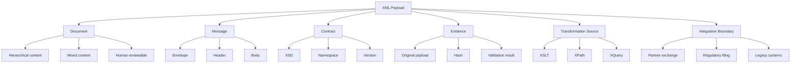
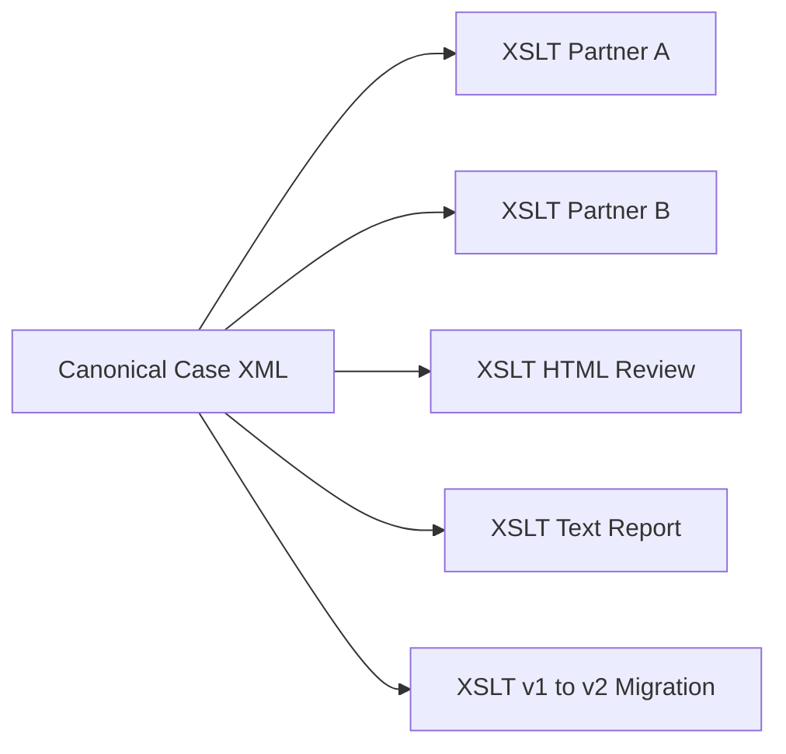
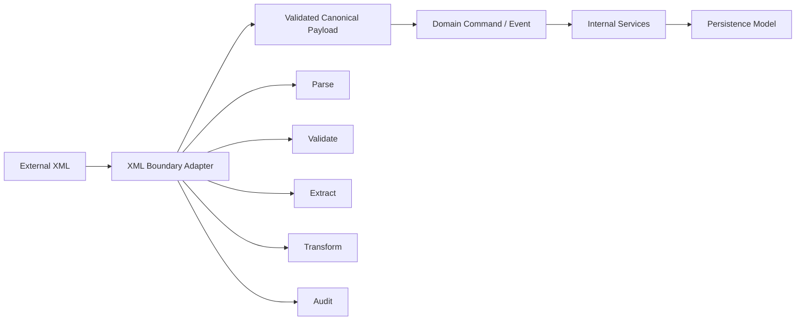
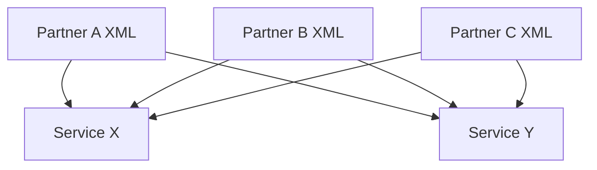
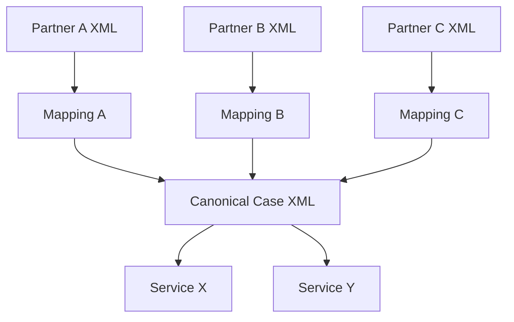
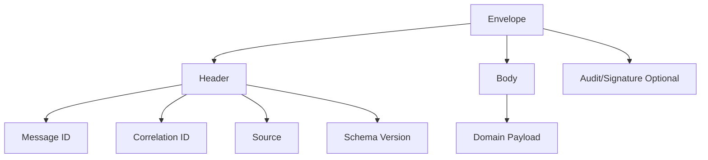
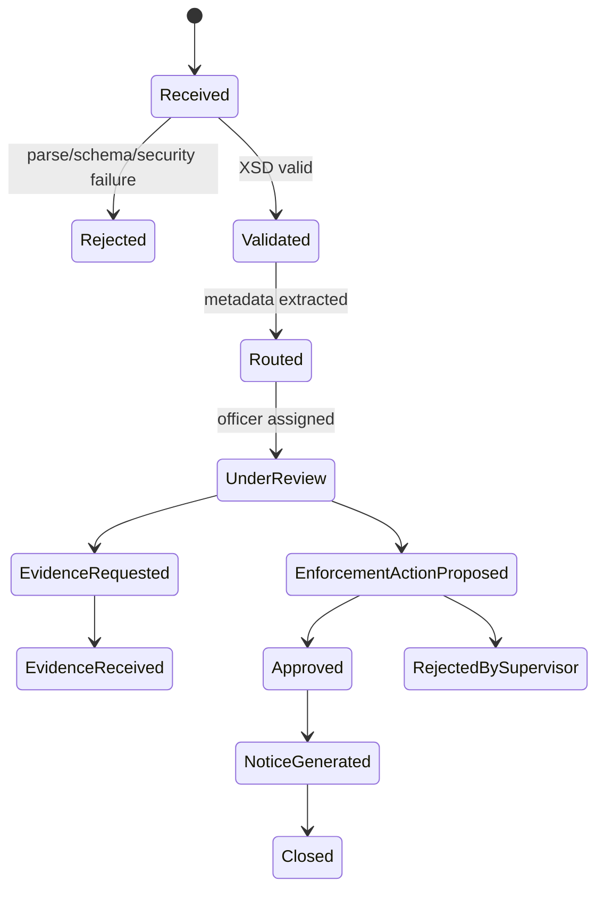
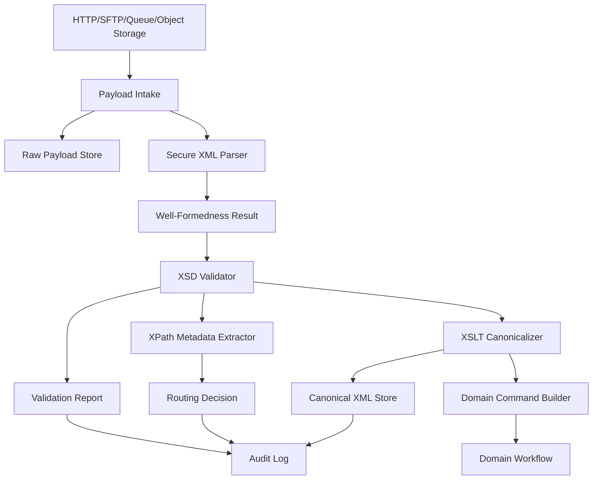
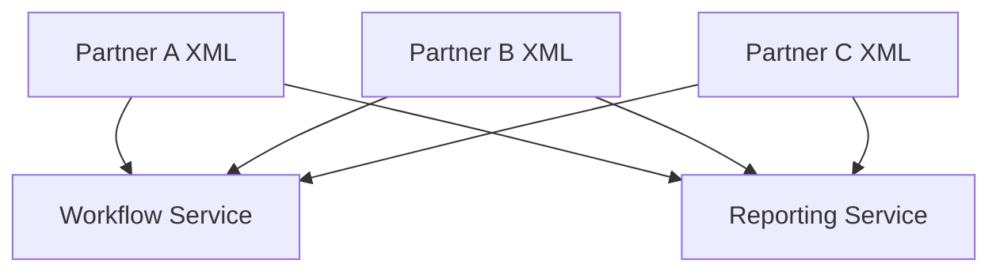
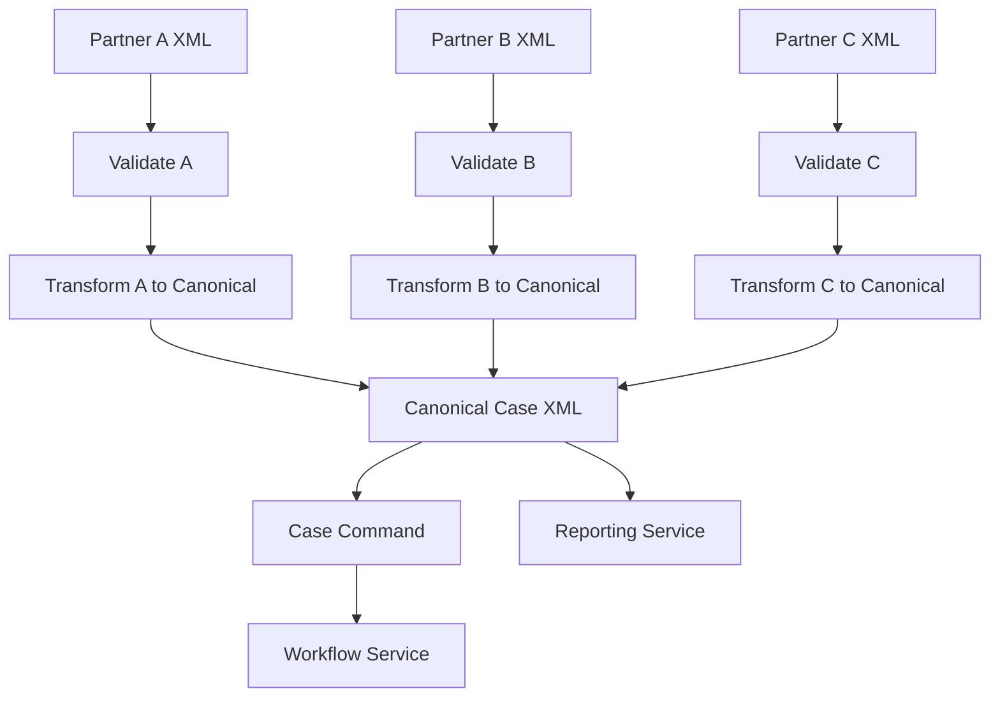

# Part 002 — XML as Enterprise Data Model

## Tujuan Part Ini

Part ini menjawab pertanyaan arsitektural yang sering diremehkan:

> Dalam sistem modern, kapan XML masih layak dipakai, dan bagaimana memakainya tanpa terjebak legacy design?

Kita tidak akan membela XML secara emosional. XML punya kelemahan nyata: verbose, parsing bisa mahal, namespace membingungkan, security default bisa berbahaya jika salah konfigurasi, dan developer modern sering lebih nyaman dengan JSON. Tetapi XML juga punya kekuatan yang tidak mudah digantikan:

- document-centric modeling;
- schema-rich contract;
- namespace-based vocabulary composition;
- transformation ecosystem;
- mature validation;
- audit-friendly textual artifact;
- legacy/regulatory/B2B compatibility;
- mixed content support;
- long-lived data interchange;
- tooling untuk XPath, XQuery, XSLT, XSD, digital signature, canonicalization, dan document rendering.

Tujuan kita adalah membangun judgement: **memilih XML ketika constraint-nya cocok**, dan menolak XML ketika ia hanya menambah friction.

---

## XML Bukan Sekadar Format; XML Adalah Model Integrasi

Dalam enterprise system, “format data” jarang netral. Format memengaruhi:

- contract negotiation;
- validation strategy;
- backward compatibility;
- operational debugging;
- data lineage;
- transformation cost;
- governance;
- partner onboarding;
- audit evidence;
- toolchain;
- security surface.

XML sangat kuat ketika data perlu diperlakukan sebagai **dokumen berstruktur** yang bisa divalidasi, ditransformasi, dan disimpan sebagai evidence.



---

## Kapan XML Menjadi Pilihan yang Masuk Akal

XML masuk akal ketika minimal beberapa kondisi berikut benar.

### 1. Data Bersifat Document-Centric

Document-centric berarti struktur data mengikuti bentuk dokumen, bukan sekadar resource object sederhana.

Contoh:

- insurance policy document;
- regulatory case filing;
- financial report;
- invoice dengan line item, tax section, payment term, legal note;
- medical clinical document;
- legal judgment;
- procurement tender document;
- enterprise form submission;
- claim assessment pack;
- audit evidence bundle.

Document-centric data biasanya memiliki:

- hierarchy dalam;
- section/subsection;
- optional clause;
- repeated groups;
- annotation;
- text yang bermakna;
- metadata;
- versioned form;
- kebutuhan rendering.

JSON bisa merepresentasikan sebagian besar struktur ini, tetapi XML punya ekosistem lebih matang untuk schema, namespace, transformation, dan document processing.

### 2. Contract Harus Ketat dan Stabil Bertahun-Tahun

XML cocok untuk kontrak yang hidup lama. XSD bisa mendefinisikan:

- struktur;
- cardinality;
- datatype;
- enumeration;
- regex;
- namespace;
- type reuse;
- modular schema;
- extension point;
- identity constraint.

Dalam B2B/regulatory integration, kontrak sering tidak bisa diganti semaunya. Partner butuh predictable compatibility.

Contoh:

```xml
<reg:PenaltyAmount currency="IDR">15000000.00</reg:PenaltyAmount>
```

XSD bisa mengatur bahwa:

- elemen wajib muncul dalam urutan tertentu;
- nilainya decimal;
- fraction digits maksimal 2;
- attribute `currency` wajib;
- currency harus enum tertentu;
- elemen berada dalam namespace tertentu.

### 3. Data Perlu Ditransformasi ke Banyak Bentuk

XML punya XSLT, salah satu alasan utama XML tetap bertahan di enterprise.

Satu canonical XML bisa diubah menjadi:

- partner-specific XML;
- HTML review page;
- plain text report;
- fixed-width batch file;
- another XML schema version;
- printable document source;
- intermediate canonical form.



Di Java, transformasi sederhana bisa memakai JAXP `TransformerFactory`. Untuk XSLT 2.0/3.0, XPath/XQuery modern, dan XDM lebih kaya, Saxon sering menjadi pilihan penting.

### 4. Banyak Vocabulary Harus Digabung

Namespace XML memungkinkan beberapa vocabulary hidup dalam satu dokumen.

Contoh:

```xml
<reg:CaseIntake xmlns:reg="urn:example:regulatory:case:v1"
                xmlns:party="urn:example:party:v1"
                xmlns:evidence="urn:example:evidence:v1"
                xmlns:common="urn:example:common:v1">
    <reg:Header>
        <common:CorrelationId>CASE-2026-000001</common:CorrelationId>
    </reg:Header>
    <reg:Subject>
        <party:Organization>
            <party:RegistrationNumber>123456789</party:RegistrationNumber>
        </party:Organization>
    </reg:Subject>
    <reg:EvidenceList>
        <evidence:DocumentEvidence id="EVD-1" />
    </reg:EvidenceList>
</reg:CaseIntake>
```

Ini cocok untuk enterprise model yang memiliki domain vocabulary berbeda:

- common;
- party;
- address;
- payment;
- case;
- evidence;
- document;
- product;
- compliance;
- workflow.

Tetapi namespace juga bisa menjadi sumber kompleksitas. Rule penting:

> Namespace harus dipakai untuk memisahkan vocabulary yang memang punya ownership dan lifecycle berbeda, bukan untuk memberi prefix dekoratif.

### 5. Payload Perlu Menjadi Evidence

Dalam sistem regulatory, enforcement, audit, claim, payment dispute, dan compliance, payload bukan sekadar data input. Payload adalah bukti.

Artinya:

- original XML harus disimpan immutable;
- hash harus dicatat;
- schema version harus diketahui;
- validation error harus direkam;
- transformation version harus diketahui;
- output harus bisa direproduksi;
- akses payload harus diaudit;
- data sensitif harus direduksi di log;
- replay harus terkendali.

XML yang verbose justru kadang membantu karena lebih human-reviewable dibanding binary encoding.

### 6. Partner atau Regulator Mensyaratkan XML

Banyak sistem tidak memilih format karena preferensi engineering internal. Format ditentukan oleh:

- regulator;
- payment network;
- government agency;
- insurance exchange;
- banking partner;
- ERP vendor;
- document standard;
- procurement standard;
- legacy platform.

Dalam kondisi seperti itu, pertanyaannya bukan “apakah kita suka XML?”, tetapi:

> Bagaimana membangun boundary XML yang aman, maintainable, observable, dan tidak menginfeksi seluruh domain internal?

---

## Kapan XML Tidak Layak Dipilih

XML bukan default untuk semua hal.

Hindari XML ketika:

- payload hanya resource sederhana untuk web/mobile API;
- client ecosystem lebih natural dengan JSON;
- latency sangat sensitif dan payload besar tetapi tidak butuh document semantics;
- schema evolution lebih cocok dengan Avro/Protobuf;
- binary compactness penting;
- team tidak punya kebutuhan XSD/XSLT/XPath;
- format dipilih hanya karena “enterprise terlihat serius”;
- data lebih tabular dan CSV/Parquet lebih tepat;
- tidak ada kebutuhan long-lived document contract.

Contoh: internal high-throughput event antar microservice yang hanya memuat state change kecil sering lebih cocok memakai Avro/Protobuf/JSON daripada XML.

---

## XML vs JSON vs Avro vs Protobuf vs CSV

| Dimension | XML | JSON | Avro | Protobuf | CSV |
|---|---|---|---|---|---|
| Human readability | Medium-high | High | Low | Low | Medium |
| Verbosity | High | Medium | Low | Low | Low |
| Schema richness | High with XSD | Medium with JSON Schema | High | High | Low |
| Document-centric data | Strong | Medium | Weak-medium | Weak-medium | Weak |
| Mixed content | Strong | Weak | Weak | Weak | Weak |
| Transformation ecosystem | Strong with XSLT | Medium | Low | Low | Low |
| Query ecosystem | XPath/XQuery | JSONPath/JMESPath/etc. | Engine-specific | Engine-specific | SQL after load |
| Namespace/vocabulary composition | Strong but complex | Weak-medium | Weak | Weak | None |
| Binary efficiency | Poor | Poor-medium | Strong | Strong | Strong-ish |
| Long-lived B2B contract | Strong | Medium | Medium | Medium | Weak |
| Streaming parse | Strong | Strong | Strong | Strong | Strong |
| Regulatory artifact | Strong | Medium | Weak | Weak | Weak-medium |
| Browser/API friendliness | Weak-medium | Strong | Weak | Medium | Medium |

### Decision Heuristic

Gunakan XML jika:

```text
document-centric + schema-heavy + transformation-heavy + long-lived external contract + audit requirement
```

Gunakan JSON jika:

```text
web/API centric + human developer experience + flexible object data + broad client compatibility
```

Gunakan Avro/Protobuf jika:

```text
high-throughput machine-to-machine + strict schema + compact encoding + internal/event-driven platform
```

Gunakan CSV jika:

```text
tabular exchange + simple batch + low nesting + spreadsheet/tool compatibility
```

---

## XML sebagai Boundary, Bukan Internal Disease

Salah satu production pattern paling sehat adalah **XML at the boundary, canonical domain internally**.



Prinsipnya:

1. XML masuk di adapter boundary.
2. Boundary melakukan security hardening.
3. Boundary melakukan XSD validation.
4. Boundary mengekstrak metadata routing.
5. Boundary mengubah payload ke canonical internal representation.
6. Domain internal tidak perlu tahu semua detail XSD partner.
7. Original XML tetap disimpan untuk audit/replay.

Anti-pattern-nya adalah membiarkan detail XML partner bocor sampai domain core:

```java
class EnforcementCase {
    private String regPrefix;
    private String partnerXmlElementName;
    private Document originalDom;
}
```

Itu membuat domain model tergantung representasi transport.

Lebih sehat:

```java
record EnforcementCaseCommand(
        String correlationId,
        String sourceSystem,
        String caseType,
        String priority,
        Subject subject,
        Allegation allegation,
        PayloadEvidence evidence
) {}
```

`PayloadEvidence` boleh menyimpan pointer ke original XML, hash, schema version, dan validation report. Tetapi domain command tidak perlu membawa DOM mentah.

---

## XML Payload Anatomy untuk Enterprise Integration

Payload XML enterprise yang sehat biasanya punya struktur seperti ini:

```xml
<case:CaseIntake xmlns:case="urn:example:case:v1"
                 xmlns:common="urn:example:common:v1"
                 schemaVersion="1.3">
    <case:Header>
        <common:MessageId>MSG-2026-000001</common:MessageId>
        <common:CorrelationId>CASE-2026-000001</common:CorrelationId>
        <common:CausationId>UPLOAD-7781</common:CausationId>
        <common:SourceSystem>PARTNER-A</common:SourceSystem>
        <common:SubmittedAt>2026-07-02T10:15:30+07:00</common:SubmittedAt>
    </case:Header>

    <case:Body>
        <case:CaseType>ENFORCEMENT</case:CaseType>
        <case:Priority>HIGH</case:Priority>
        <case:Subject>
            <common:EntityId>ENT-991</common:EntityId>
            <common:EntityName>PT Example Regulated Entity</common:EntityName>
        </case:Subject>
        <case:Allegation>
            <case:Code>REPORTING_DELAY</case:Code>
            <case:Description>Late submission of mandatory operational report.</case:Description>
        </case:Allegation>
    </case:Body>

    <case:Attachments>
        <case:AttachmentRef id="ATT-1" contentType="application/pdf" />
    </case:Attachments>
</case:CaseIntake>
```

### Header

Header adalah tempat metadata transport/business-routing.

Biasanya berisi:

- message ID;
- correlation ID;
- causation ID;
- source system;
- tenant/partner;
- submitted timestamp;
- schema version;
- priority;
- signature reference;
- retry indicator;
- test/production indicator.

Jangan meletakkan business fact utama hanya di header jika ia bagian dari domain. Header untuk routing dan operational metadata.

### Body

Body berisi domain payload. Body harus stabil dan jelas:

- element name bermakna;
- optionality eksplisit;
- collection wrapper konsisten;
- date/time typed;
- identifier typed secara semantic;
- code list dikelola.

### Attachments

XML sering membawa reference ke attachment, bukan file binary langsung. Embedding base64 bisa diterima untuk kasus tertentu, tetapi perlu hati-hati:

- ukuran payload membesar;
- streaming lebih kompleks;
- virus scanning perlu strategi;
- storage dan retention terpisah;
- hashing attachment perlu jelas.

### Signature / Audit Section

Jika payload menjadi evidence, mungkin ada digital signature, hash, atau metadata audit. Seri ini tidak akan mendalami XML Signature secara penuh, tetapi akan menyinggung implikasinya terhadap canonicalization dan transformasi.

---

## Modeling Rules: Element vs Attribute

Salah satu pertanyaan klasik: kapan memakai element, kapan attribute?

### Gunakan Element Jika

- nilai adalah data bisnis utama;
- nilai bisa kompleks/nested;
- nilai bisa punya struktur masa depan;
- nilai bisa muncul berulang;
- nilai perlu whitespace/mixed content;
- nilai mungkin perlu annotation;
- nilai perlu nil/optional semantics yang jelas.

Contoh:

```xml
<case:PenaltyAmount>
    <common:Currency>IDR</common:Currency>
    <common:Value>15000000.00</common:Value>
</case:PenaltyAmount>
```

### Gunakan Attribute Jika

- nilai adalah metadata kecil untuk element;
- nilai bukan struktur nested;
- nilai berfungsi sebagai qualifier;
- nilai jarang berubah menjadi complex content;
- nilai cocok sebagai ID/reference/type marker.

Contoh:

```xml
<case:AttachmentRef id="ATT-1" contentType="application/pdf" />
```

### Hindari Attribute untuk Data yang Akan Berevolusi

Salah satu design trap:

```xml
<case:Penalty amount="15000000.00" currency="IDR" />
```

Ini terlihat ringkas. Tetapi jika kemudian butuh:

- original amount;
- converted amount;
- exchange rate;
- calculation method;
- rounding rule;
- tax component;
- fee component;

attribute design menjadi sempit.

---

## Modeling Rules: Collection Wrapper

Untuk payload enterprise, collection wrapper biasanya lebih maintainable.

Lebih baik:

```xml
<case:EvidenceList>
    <case:Evidence id="EVD-1" />
    <case:Evidence id="EVD-2" />
</case:EvidenceList>
```

Daripada:

```xml
<case:Evidence id="EVD-1" />
<case:Evidence id="EVD-2" />
```

Wrapper membantu:

- menambahkan metadata collection;
- menambahkan pagination/summary;
- membedakan empty vs missing;
- membuat XPath lebih stabil;
- membuat schema extension lebih mudah.

Contoh evolusi:

```xml
<case:EvidenceList total="2" verified="false">
    <case:Evidence id="EVD-1" />
    <case:Evidence id="EVD-2" />
</case:EvidenceList>
```

---

## Modeling Rules: Date, Time, Money, and Identifiers

### Date/Time

Jangan menyimpan tanggal sebagai string bebas:

```xml
<case:SubmittedAt>2 July 2026</case:SubmittedAt>
```

Lebih baik gunakan format yang bisa divalidasi:

```xml
<case:SubmittedAt>2026-07-02T10:15:30+07:00</case:SubmittedAt>
```

Pertanyaan penting:

- Apakah timezone wajib?
- Apakah nilai merepresentasikan instant atau local date?
- Apakah precision sampai detik/millisecond/nanosecond?
- Bagaimana daylight saving/timezone policy?
- Apakah comparison dilakukan berdasarkan instant atau local business calendar?

### Money

Jangan gunakan floating point mental model.

```xml
<case:PenaltyAmount currency="IDR">15000000.00</case:PenaltyAmount>
```

Validasi perlu mempertimbangkan:

- decimal precision;
- fraction digits;
- currency code;
- negative value allowed atau tidak;
- rounding;
- tax/fee breakdown;
- local regulatory rules.

### Identifier

Identifier perlu jelas scope-nya.

Buruk:

```xml
<case:Id>123</case:Id>
```

Lebih baik:

```xml
<common:CorrelationId>CASE-2026-000001</common:CorrelationId>
<common:SourceMessageId>PARTNER-A-MSG-7781</common:SourceMessageId>
<common:EntityId scheme="REGULATED_ENTITY_ID">ENT-991</common:EntityId>
```

Pertanyaan desain:

- Apakah ID global unik?
- Apakah ID hanya unik per partner?
- Apakah ID stabil?
- Apakah ID bisa berubah karena merger/migration?
- Apakah ID bisa mengandung PII?

---

## XML sebagai Canonical Model

Canonical model adalah format internal bersama untuk mengurangi mapping chaos.

Tanpa canonical model:



Dengan canonical model:



Canonical XML cocok ketika:

- banyak partner format;
- domain relatif stabil;
- mapping perlu diaudit;
- transformasi declarative berguna;
- output ke banyak target;
- schema governance kuat.

Tetapi canonical model bisa menjadi bottleneck jika terlalu ambisius.

### Canonical Model Anti-Pattern

1. **God Schema** — satu XSD mencoba mencakup semua kebutuhan semua partner.
2. **Lowest Common Denominator** — model terlalu miskin karena dipaksa cocok untuk semua.
3. **Leaky Partner Fields** — field partner-specific masuk ke canonical tanpa governance.
4. **Version Freeze** — schema tidak bisa berevolusi karena terlalu banyak consumer.
5. **Optional Everything** — semua dibuat optional sehingga validasi kehilangan nilai.

### Canonical Model yang Sehat

Canonical model sehat memiliki:

- owner jelas;
- namespace versioning;
- extension point terkendali;
- compatibility policy;
- mapping rule terdokumentasi;
- test fixture per partner;
- schema linting/review;
- governance untuk code list;
- deprecation policy.

---

## XML sebagai Message Envelope

Untuk integration, envelope memisahkan metadata dari domain body.



Envelope membantu:

- routing;
- idempotency;
- retry;
- tracing;
- version selection;
- partner identification;
- operational diagnostics.

Tetapi envelope tidak boleh menjadi dumping ground. Jangan memasukkan business data sembarangan ke header hanya karena mudah di-XPath.

---

## XML di Regulatory Case Management

Dalam domain regulatory/enforcement, XML sering cocok karena prosesnya document-heavy dan evidence-heavy.

Contoh lifecycle:



XML artifact bisa muncul di beberapa titik:

- intake filing;
- evidence metadata;
- notice generation;
- decision document;
- partner response;
- appeal submission;
- reporting export;
- audit package.

### Design Implication

Jangan hanya simpan parsed fields. Simpan juga artifact:

```text
case_payload/
  original.xml
  normalized.xml
  validation-report.json
  schema-version.txt
  transform-version.txt
  hashes.txt
  redaction-policy.txt
```

Kenapa?

Karena ketika ada sengketa, pertanyaan auditor bukan hanya:

> “Status case sekarang apa?”

Tetapi:

> “Payload apa yang diterima, kapan diterima, divalidasi dengan schema apa, diubah dengan stylesheet apa, siapa yang melihat, dan apakah output bisa direproduksi?”

---

## XML Boundary Architecture untuk Java Service

Berikut arsitektur boundary yang akan menjadi acuan seri ini.



### Key Components

| Component | Responsibility | Must Not Do |
|---|---|---|
| Payload Intake | Accept bytes, size limit, correlation | Parse with unsafe default |
| Raw Payload Store | Immutable original payload | Mutate/reformat original |
| Secure XML Parser | Hardened parsing | Resolve arbitrary external entity |
| XSD Validator | Contract validation | Hide actionable diagnostics |
| XPath Extractor | Metadata extraction | Encode business policy too deeply |
| XSLT Canonicalizer | Declarative mapping | Fetch remote stylesheet dynamically |
| Domain Command Builder | Convert valid canonical payload into domain input | Carry DOM everywhere |
| Audit Log | Record evidence and lineage | Store PII without redaction policy |

---

## Common Architecture Patterns

### Pattern 1 — Validate at the Edge

Validasi XML sebaiknya dilakukan sedekat mungkin dengan boundary.

```text
External input -> raw store -> parse -> schema validation -> reject/accept
```

Jangan menunggu sampai payload masuk ke workflow engine baru divalidasi. Itu membuat failure terjadi terlambat dan lebih mahal.

### Pattern 2 — Store Raw Before Transform

Simpan original payload sebelum transformasi.

Alasannya:

- transformation bisa bug;
- mapping bisa berubah;
- audit butuh original;
- replay butuh input awal;
- forensic analysis butuh artifact yang belum disentuh.

### Pattern 3 — Separate Contract Validation and Business Validation

XSD bukan tempat semua business rule.

XSD cocok untuk:

- structure;
- datatype;
- cardinality;
- simple code list;
- pattern;
- required/optional.

Business validation cocok untuk:

- state transition;
- policy threshold;
- cross-entity lookup;
- temporal rule;
- authorization;
- duplicate detection;
- SLA calculation.

### Pattern 4 — Make Transformation Versioned

XSLT harus diperlakukan seperti code artifact.

Catat:

- name;
- version;
- checksum;
- release date;
- compatible schema;
- processor requirement;
- test fixtures;
- rollback path.

### Pattern 5 — Use XPath for Metadata, Not Whole Domain Logic

XPath sangat baik untuk extraction:

```text
/case:CaseIntake/case:Header/common:CorrelationId
```

Tetapi jangan membuat seluruh policy engine tersembunyi dalam expression panjang yang sulit dites.

Buruk:

```text
//case:Penalty[case:Amount > 1000000 and ../case:Priority='HIGH' and not(../case:Appeal)]/...
```

Lebih baik:

- XPath mengambil field;
- Java/domain service mengevaluasi policy;
- rule engine digunakan jika policy kompleks.

---

## XML Data Governance

XML enterprise membutuhkan governance. Tanpa governance, XSD dan XSLT berubah menjadi spaghetti contract.

### Governance Artefacts

| Artifact | Fungsi |
|---|---|
| Namespace registry | Menghindari benturan vocabulary |
| Schema catalog | Menyimpan XSD version dan dependency |
| Code list registry | Mengelola enum/code value |
| Transformation registry | Mengelola XSLT version dan target |
| Compatibility matrix | Menjelaskan producer/consumer/schema version |
| Payload fixture library | Contoh valid/invalid untuk regression test |
| Error catalog | Mapping validation error ke pesan user/support |
| Deprecation policy | Mengatur field/schema lama |
| Replay policy | Mengatur kapan payload boleh diproses ulang |
| Redaction policy | Mengatur data sensitif di log/audit |

### Ownership

Setiap schema harus punya owner. Tanpa owner, schema menjadi “shared nobody owns it”.

Minimum metadata schema:

```yaml
schema: regulatory-case-v1.3.xsd
namespace: urn:example:regulatory:case:v1
owner: Regulatory Case Platform Team
status: active
compatibleWith:
  - regulatory-case-v1.2.xsd
consumers:
  - case-intake-service
  - officer-review-service
  - reporting-export-service
producers:
  - partner-a-gateway
  - partner-b-batch
changePolicy: backward-compatible minor changes only within v1 namespace
```

---

## Failure Modes Ketika XML Dipakai Sebagai Enterprise Model

### Failure Mode 1 — Namespace Drift

Partner mengirim namespace baru tanpa koordinasi:

```xml
<reg:CaseIntake xmlns:reg="urn:example:regulatory:case:v2">
```

Sistem hanya support v1. XPath v1 kosong. Validator gagal. Jika error handling buruk, message masuk dead letter tanpa diagnostic jelas.

Mitigasi:

- validate namespace early;
- route berdasarkan namespace URI;
- compatibility matrix;
- clear rejection error;
- dual-stack validator saat migration.

### Failure Mode 2 — Optional Everything

Schema terlalu longgar:

```xml
<xs:element name="PenaltyAmount" minOccurs="0" />
```

Semua payload valid, tetapi domain service gagal karena field penting hilang.

Mitigasi:

- pisahkan optional karena business-optional vs optional karena migration;
- gunakan schema version;
- tambahkan semantic validation;
- jangan takut membuat required field untuk invariant domain.

### Failure Mode 3 — DOM Everywhere

Payload partner tumbuh dari 50 KB menjadi 200 MB. Service yang dulu aman mulai OOM.

Mitigasi:

- payload size policy;
- streaming parser;
- load test dengan large fixtures;
- memory budget;
- batch segmentation;
- backpressure.

### Failure Mode 4 — Transformation Without Lineage

XSLT berubah, tetapi output lama tidak bisa direproduksi.

Mitigasi:

- version stylesheet;
- store checksum;
- store transformation parameter;
- store processor version;
- maintain release artifact archive.

### Failure Mode 5 — Schema Fetch from Network

Validator mengambil XSD/import dari network saat runtime. Ketika network lambat atau endpoint berubah, validasi production gagal.

Mitigasi:

- local schema catalog;
- resolver strict;
- no arbitrary external access;
- deploy schema as artifact;
- fail closed.

---

## Practical Design Checklist

Gunakan checklist ini sebelum memilih XML untuk sistem baru atau memperbaiki sistem XML lama.

### Business Fit

- [ ] Apakah data document-centric?
- [ ] Apakah ada external/regulatory requirement?
- [ ] Apakah contract perlu bertahan lama?
- [ ] Apakah transformation penting?
- [ ] Apakah payload perlu audit/replay?
- [ ] Apakah XML menjadi boundary saja atau menyebar ke domain internal?

### Contract Fit

- [ ] Apakah XSD owner jelas?
- [ ] Apakah namespace strategy jelas?
- [ ] Apakah versioning policy jelas?
- [ ] Apakah code list dikelola?
- [ ] Apakah compatibility matrix tersedia?
- [ ] Apakah invalid payload fixture tersedia?

### Operational Fit

- [ ] Apakah payload size bounded?
- [ ] Apakah parser hardened?
- [ ] Apakah DTD/external access policy jelas?
- [ ] Apakah validation error actionable?
- [ ] Apakah transformation versioned?
- [ ] Apakah original payload disimpan immutable?
- [ ] Apakah logs redacted?
- [ ] Apakah replay aman dan idempotent?

### Engineering Fit

- [ ] Apakah team memahami namespace?
- [ ] Apakah ada test suite XML?
- [ ] Apakah DOM/SAX/StAX choice sesuai workload?
- [ ] Apakah XSLT dikelola seperti source code?
- [ ] Apakah schema review masuk CI?
- [ ] Apakah XMLUnit/golden file strategy tersedia?

---

## Mini Case Study: Partner XML Intake

### Problem

Tiga partner mengirim case intake dengan struktur berbeda:

- Partner A memakai XML v1 dengan namespace `urn:partner:a:case:v1`.
- Partner B memakai XML v2 dengan field tambahan.
- Partner C memakai format regulator yang tidak bisa diubah.

Internal platform butuh canonical case command.

### Bad Design

Setiap service membaca format partner langsung:



Akibat:

- mapping duplikatif;
- bug fix harus diulang;
- schema change berdampak luas;
- audit sulit;
- test matrix meledak.

### Better Design

Bangun XML boundary adapter:



### Design Decisions

| Decision | Recommended Choice | Reason |
|---|---|---|
| Store raw partner payload? | Yes | Audit/replay |
| Validate before transform? | Yes | Fail early with contract diagnostic |
| Use XSLT for mapping? | Often yes | Declarative, versionable, testable |
| Use XPath for routing? | Yes | Extract header metadata |
| Expose DOM to workflow? | No | Keep XML boundary isolated |
| Keep canonical XML? | Yes if audit/reporting need it | Stable evidence and replay |
| Convert to Java command? | Yes | Domain logic should not depend on XML tree |

---

## Latihan Part 002

### Exercise 1 — Format Decision

Untuk setiap skenario, pilih XML/JSON/Avro/Protobuf/CSV dan jelaskan trade-off:

1. Mobile app mengambil profile user.
2. Regulator menerima laporan kepatuhan tahunan.
3. Internal event `PaymentCaptured` high-throughput.
4. Partner mengirim invoice legal dengan attachment reference dan clause text.
5. Data warehouse menerima export tabular harian.
6. Workflow engine perlu menerima case intake dari 12 partner dengan contract berbeda.

### Exercise 2 — Boundary Design

Desain boundary untuk XML partner intake:

- input transport;
- raw store;
- parser;
- validator;
- metadata extractor;
- transformer;
- domain command;
- audit log;
- rejection response.

Gunakan Mermaid diagram.

### Exercise 3 — Payload Anatomy Review

Ambil contoh `CaseIntake` di part ini. Tandai:

- header field;
- business field;
- operational metadata;
- candidate XPath extraction;
- candidate XSD constraint;
- candidate semantic validation;
- audit metadata yang belum ada.

### Exercise 4 — Failure Mode Drill

Buat 10 invalid payload:

1. wrong namespace;
2. missing correlation ID;
3. invalid timestamp;
4. unknown enum;
5. missing required business field;
6. duplicate ID;
7. payload too large;
8. malicious DTD;
9. schema version unsupported;
10. attachment reference missing.

Untuk masing-masing, tentukan apakah error-nya parse, security, schema, semantic, atau operational.

---

## Checklist Part 002

Sebelum lanjut, pastikan kamu bisa menjawab:

- [ ] Kapan XML lebih cocok daripada JSON?
- [ ] Kapan XML lebih buruk daripada Avro/Protobuf?
- [ ] Apa bedanya XML sebagai document, message, contract, dan evidence?
- [ ] Mengapa XML sebaiknya sering dibatasi di boundary adapter?
- [ ] Apa risiko canonical model yang terlalu ambisius?
- [ ] Mengapa original payload harus disimpan sebelum transformasi?
- [ ] Apa perbedaan schema validation dan business validation?
- [ ] Bagaimana namespace membantu dan sekaligus bisa menyulitkan enterprise integration?

---

## Ringkasan

XML masih relevan bukan karena modern atau lama, tetapi karena ia menyelesaikan kelas masalah tertentu dengan baik:

- dokumen hierarkis;
- kontrak stabil;
- validasi schema;
- vocabulary composition;
- transformasi declarative;
- audit evidence;
- B2B/regulatory interoperability.

Namun XML harus dipakai dengan disiplin:

- letakkan di boundary;
- validasi lebih awal;
- amankan parser;
- simpan original;
- transformasi harus versioned;
- jangan bocorkan DOM ke domain core;
- jangan membuat schema menjadi dumping ground;
- kelola namespace dan compatibility secara eksplisit.

Part berikutnya akan masuk ke **XML Core Model: well-formedness, Infoset, namespaces, QName, default namespace, prefix binding, dan bug namespace yang paling sering menghancurkan integrasi Java XML**.

---

## Referensi Resmi dan Lanjutan

- W3C XML and Namespaces specifications — dasar vocabulary, qualified names, dan namespace URI.
- W3C XML Schema specifications — struktur dan constraint dokumen XML.
- W3C XPath, XQuery, XDM, and XSLT specifications — query dan transformation model.
- Oracle Java XML/JAXP documentation — API Java untuk parser, validation, XPath, dan transformation.
- OWASP XML External Entity Prevention Cheat Sheet — security control untuk untrusted XML.
- Saxonica Saxon documentation — Java processor untuk XSLT/XQuery/XPath modern.
