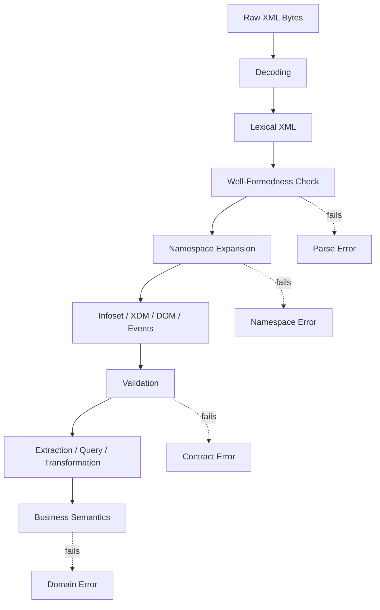
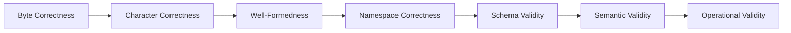
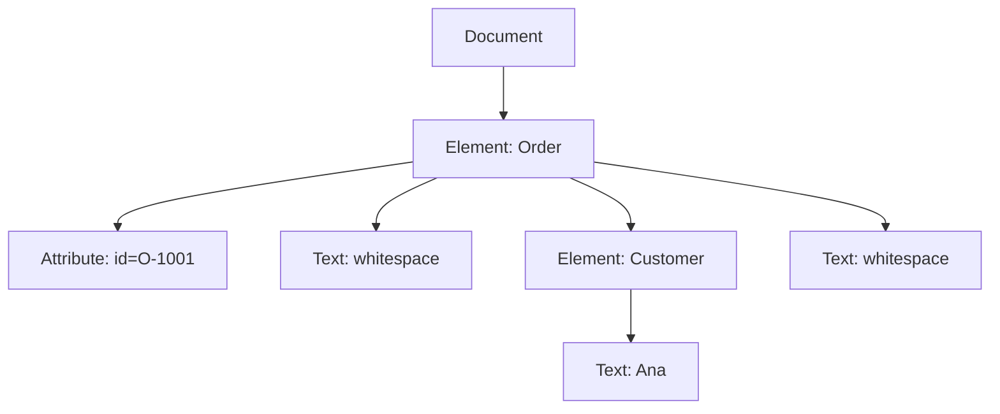

# Part 003 — XML Core Model: Well-Formedness, Infoset, Namespaces

## Tujuan Part Ini

Part ini membangun **mental model XML core** yang akan dipakai terus di seluruh seri.

Banyak bug XML production bukan muncul karena engineer tidak tahu cara memanggil `DocumentBuilderFactory` atau `XMLInputFactory`. Bug biasanya muncul karena salah memahami model dasar XML:

- menganggap prefix namespace adalah identitas permanen;
- lupa bahwa default namespace tidak berlaku untuk atribut;
- membaca `getNodeName()` padahal yang dibutuhkan adalah `getLocalName()` dan `getNamespaceURI()`;
- menganggap XML yang *well-formed* pasti sesuai contract bisnis;
- menganggap whitespace tidak berarti;
- menganggap XML adalah string biasa, bukan byte stream dengan encoding declaration;
- mengabaikan entity, DTD, dan external reference;
- melakukan string replace untuk mengubah XML;
- membuat XPath yang tidak namespace-aware;
- menyimpan XML hasil pretty print lalu golden test rusak karena whitespace berubah.

Setelah part ini, kamu harus mampu menjawab:

1. Apa beda **well-formed**, **namespace-correct**, **schema-valid**, dan **semantically valid**?
2. Apa yang benar-benar dilihat parser: bytes, characters, token, event, tree, atau infoset?
3. Apa arti QName, expanded name, prefix, local name, dan namespace URI?
4. Kenapa dua XML yang terlihat mirip bisa berbeda secara semantik?
5. Kenapa XML tidak boleh diproses dengan regex/string concatenation untuk kasus non-trivial?
6. Invariant apa yang harus dijaga sebelum XML masuk ke pipeline Java?

---

## Posisi Part Ini dalam Framework Kaufman

Dalam pendekatan Kaufman, part ini masuk ke tahap **learn enough to self-correct**.

Tujuannya bukan menghafal seluruh spesifikasi XML. Tujuannya adalah belajar cukup dalam agar ketika parser, validator, XPath, atau XSLT gagal, kamu bisa men-debug secara sistematis.



Kalau pipeline gagal, kamu harus bisa tahu di layer mana error terjadi. Jangan semua error disebut “XML invalid”. Itu terlalu kasar.

---

## Mental Model Utama: XML Bukan String

XML sering terlihat seperti string:

```xml
<Order id="O-1001">
  <Customer>Ana</Customer>
</Order>
```

Namun di production, XML harus dipahami sebagai beberapa representasi berbeda:

| Representasi | Dilihat oleh | Contoh concern |
|---|---|---|
| Bytes | transport/storage | encoding, BOM, compression, truncation |
| Characters | XML lexer | `UTF-8`, `UTF-16`, invalid char |
| Markup tokens | parser | start element, attribute, text, end element |
| Event stream | SAX/StAX | streaming extraction, validation handler |
| Tree model | DOM/XDM | navigation, transformation, XPath |
| Contract instance | XSD validator | type, occurrence, required elements |
| Business document | domain layer | order status, regulatory evidence, lifecycle rules |

Kesalahan umum adalah memakai operasi di representasi yang salah.

Contoh:

```java
String fixed = xml.replace("<Status>NEW</Status>", "<Status>READY</Status>");
```

Ini rapuh karena:

- prefix namespace bisa berbeda;
- whitespace bisa berbeda;
- status bisa berada di namespace berbeda;
- ada escaping;
- ada CDATA;
- ada mixed content;
- ada lebih dari satu `Status`;
- ada `Status` di envelope dan payload;
- ada komentar atau processing instruction;
- XML bisa valid secara string tetapi salah secara infoset.

Untuk XML production-grade, operasi utama harus dilakukan pada **node**, **event**, **expanded name**, atau **typed value**, bukan string mentah.

---

## Layer Correctness XML

XML correctness berlapis.



### 1. Byte Correctness

Payload harus bisa dibaca sebagai byte stream lengkap.

Contoh failure:

- file terpotong;
- gzip corrupt;
- transfer berhenti di tengah;
- payload terlalu besar;
- checksum tidak cocok;
- encoding declaration tidak sesuai actual bytes.

### 2. Character Correctness

XML memiliki karakter legal dan encoding. Parser harus bisa mengubah bytes menjadi character stream yang valid.

Contoh failure:

```text
Invalid byte 1 of 1-byte UTF-8 sequence
```

Ini bukan XSD error. Ini error decoding/parsing awal.

### 3. Well-Formedness

XML harus mematuhi aturan struktural dasar:

- tepat satu document element/root element;
- setiap start tag punya end tag yang cocok;
- elemen tidak overlap;
- atribut tidak duplikat dalam elemen yang sama;
- karakter khusus di-escape;
- entity reference valid;
- komentar tidak memakai `--` di dalam body;
- processing instruction tidak salah format.

### 4. Namespace Correctness

Nama elemen/atribut yang memakai prefix harus punya binding namespace valid.

Contoh:

```xml
<ord:Order>
  <ord:Id>O-1001</ord:Id>
</ord:Order>
```

Ini tidak namespace-correct karena prefix `ord` tidak dideklarasikan.

### 5. Schema Validity

Dokumen sesuai XSD atau schema lain.

Contoh XML well-formed tetapi tidak schema-valid:

```xml
<Order xmlns="urn:example:order:v1">
  <Id>O-1001</Id>
</Order>
```

Jika XSD mewajibkan `<CustomerId>`, dokumen ini gagal validasi walaupun parser bisa membaca XML-nya.

### 6. Semantic Validity

Dokumen valid menurut rule bisnis.

Contoh:

```xml
<Order xmlns="urn:example:order:v1">
  <Id>O-1001</Id>
  <Status>CANCELLED</Status>
  <ShipmentDate>2026-07-02</ShipmentDate>
</Order>
```

XSD mungkin mengizinkan semua field itu. Namun domain rule bisa melarang `ShipmentDate` ketika status `CANCELLED`.

### 7. Operational Validity

Dokumen bisa diproses dengan aman dan masuk akal di environment production.

Contoh:

- payload 2 GB valid secara XML tetapi melebihi batas service;
- dokumen berisi 5 juta node dan menyebabkan heap pressure;
- dokumen memerlukan external DTD dari internet;
- dokumen valid tetapi tidak bisa direplay karena correlation ID hilang;
- dokumen valid tetapi tidak boleh diproses karena partner belum di-onboard.

Top engineer tidak berhenti di “valid XML”. Mereka bertanya: **valid untuk layer mana?**

---

## XML Well-Formedness

Well-formedness adalah minimum agar XML dapat diparse sebagai XML.

### Root Element Tunggal

Valid:

```xml
<Orders>
  <Order id="O-1"/>
  <Order id="O-2"/>
</Orders>
```

Tidak well-formed:

```xml
<Order id="O-1"/>
<Order id="O-2"/>
```

Dalam XML, document harus punya satu document element. Jika kamu ingin mengirim banyak record, bungkus dalam envelope atau batch root.

### Tag Harus Tersarang Benar

Tidak well-formed:

```xml
<a><b></a></b>
```

Valid:

```xml
<a><b></b></a>
```

XML tidak mengizinkan overlap seperti beberapa markup lama.

### Atribut Harus Unik per Element

Tidak well-formed:

```xml
<Order id="O-1" id="O-2"/>
```

Namun ini perlu hati-hati dengan namespace:

```xml
<Order xmlns:a="urn:a" xmlns:b="urn:b" a:id="1" b:id="2"/>
```

Atribut `a:id` dan `b:id` berbeda karena expanded name-nya berbeda.

### Escape Karakter Khusus

Di text node:

| Karakter | Escape |
|---|---|
| `<` | `&lt;` |
| `&` | `&amp;` |
| `>` | `&gt;` biasanya tidak wajib kecuali konteks tertentu |

Di attribute value:

| Karakter | Escape |
|---|---|
| `"` | `&quot;` jika attribute pakai double quote |
| `'` | `&apos;` jika attribute pakai single quote |
| `<` | `&lt;` |
| `&` | `&amp;` |

Jangan bangun XML dengan string interpolation tanpa escaping.

Buruk:

```java
String xml = "<Customer>" + customerName + "</Customer>";
```

Jika `customerName` bernilai `A & B`, XML rusak.

Lebih aman:

```java
XMLStreamWriter writer = outputFactory.createXMLStreamWriter(outputStream, "UTF-8");
writer.writeStartDocument("UTF-8", "1.0");
writer.writeStartElement("Customer");
writer.writeCharacters(customerName);
writer.writeEndElement();
writer.writeEndDocument();
```

`writeCharacters` melakukan escaping yang sesuai.

---

## XML Declaration dan Encoding

XML dapat memiliki declaration:

```xml
<?xml version="1.0" encoding="UTF-8"?>
```

Di production, encoding adalah sumber bug serius.

### InputStream vs Reader

Jika kamu memberikan `InputStream` ke parser, parser bisa membaca XML declaration dan menentukan encoding.

```java
Document document = builder.parse(inputStream);
```

Jika kamu sudah mengubah bytes menjadi `Reader`, kamu mengambil alih tanggung jawab decoding.

```java
Reader reader = new InputStreamReader(inputStream, StandardCharsets.UTF_8);
InputSource source = new InputSource(reader);
Document document = builder.parse(source);
```

Ini bisa benar jika kamu yakin encoding-nya UTF-8. Namun jika XML declaration menyatakan encoding lain, keputusan decoding sudah terjadi sebelum parser melihat declaration.

Rule praktis:

- untuk payload XML dari file/network, prefer `InputStream` agar parser bisa menghormati XML declaration;
- gunakan `Reader` hanya jika transport contract sudah menjamin encoding;
- simpan raw bytes untuk audit/replay jika XML punya nilai evidentiary;
- jangan convert XML ke `String` terlalu awal untuk payload besar atau sensitif.

### Encoding Mismatch

Contoh masalah:

```xml
<?xml version="1.0" encoding="ISO-8859-1"?>
<Customer>José</Customer>
```

Jika bytes sebenarnya UTF-8 tetapi declaration berkata ISO-8859-1, hasil parsing bisa salah atau karakter rusak.

Pipeline production perlu menyimpan metadata:

- source system;
- content type;
- declared encoding;
- detected BOM;
- byte size;
- checksum;
- parser error jika decoding gagal.

---

## XML Infoset: Apa yang Dilihat Parser

XML text bukan final truth. Parser membentuk representasi informasi.

Contoh:

```xml
<Order id="O-1001">
  <Customer>Ana</Customer>
</Order>
```

Secara konseptual, tree-nya:



Perhatikan: whitespace antar element bisa muncul sebagai text node.

Ini sering mengejutkan ketika memakai DOM:

```java
NodeList children = order.getChildNodes();
```

`children` bisa berisi text node whitespace, bukan hanya element node.

Cara aman untuk navigasi DOM:

```java
for (Node child = order.getFirstChild(); child != null; child = child.getNextSibling()) {
    if (child.getNodeType() == Node.ELEMENT_NODE) {
        Element element = (Element) child;
        // process element
    }
}
```

Jangan asumsi index child:

```java
// Rapuh: child pertama mungkin whitespace text node
Node customer = order.getChildNodes().item(0);
```

---

## Node Model Penting

Walau DOM, SAX, StAX, XPath, dan XSLT punya representasi berbeda, kamu perlu paham node konseptual berikut.

| Node/Item | Arti | Production concern |
|---|---|---|
| Document | keseluruhan dokumen | root tunggal, doctype, declaration tidak selalu tersedia di model |
| Element | struktur utama | namespace, urutan, cardinality, nested payload |
| Attribute | metadata pada element | default namespace tidak berlaku, order tidak signifikan |
| Text | karakter di dalam element | whitespace, mixed content, normalization |
| Comment | komentar XML | biasanya tidak masuk business logic |
| Processing Instruction | instruksi aplikasi | jarang dipakai, tapi bisa muncul di dokumen lama |
| Namespace declaration | binding prefix ke URI | bukan attribute bisnis biasa |
| Entity reference | referensi entity | perlu hati-hati karena security |

### Attribute Order Tidak Signifikan

Dua XML ini semantik XML-nya sama dari sisi atribut:

```xml
<Order id="O-1" status="NEW"/>
```

```xml
<Order status="NEW" id="O-1"/>
```

Jangan buat golden test yang gagal hanya karena urutan atribut berubah. Gunakan XML-aware comparison.

### Element Order Bisa Signifikan

Dua XML ini bisa berbeda jika XSD atau domain mengharuskan urutan:

```xml
<Customer>
  <FirstName>Ana</FirstName>
  <LastName>Wijaya</LastName>
</Customer>
```

```xml
<Customer>
  <LastName>Wijaya</LastName>
  <FirstName>Ana</FirstName>
</Customer>
```

Dalam XSD dengan `xs:sequence`, urutan element signifikan.

---

## Whitespace: Tidak Selalu Kosmetik

Whitespace dalam XML punya beberapa kategori.

### Insignificant Formatting Whitespace

```xml
<Order>
  <Id>O-1</Id>
</Order>
```

Whitespace sebelum `<Id>` biasanya hanya formatting.

### Significant Text Whitespace

```xml
<Message>Hello Ana</Message>
```

Spasi antara `Hello` dan `Ana` signifikan.

### Mixed Content

```xml
<p>Hello <b>Ana</b>, your order is ready.</p>
```

Dalam mixed content, text dan element bercampur. Ini umum di document-centric XML seperti HTML-like content, legal clause, medical narrative, atau template dokumen.

Jangan normalisasi whitespace sembarangan jika XML bersifat document-centric.

### `xml:space`

XML bisa memakai atribut special:

```xml
<Clause xml:space="preserve">
  Payment must be received within  30 days.
</Clause>
```

`xml:space="preserve"` memberi sinyal bahwa whitespace harus dipertahankan.

Rule praktis:

- untuk message-centric XML, whitespace antar element biasanya bisa diabaikan;
- untuk document-centric XML, whitespace bisa menjadi bagian makna;
- untuk legal/regulatory evidence, jangan ubah whitespace tanpa alasan dan audit trail;
- untuk test, gunakan canonical comparison atau XML-aware assertions.

---

## CDATA: Bukan Escape Hatch untuk Semua Masalah

CDATA memungkinkan text berisi karakter markup tanpa escape satu per satu:

```xml
<Script><![CDATA[
if (a < b && b > c) {
  alert("test");
}
]]></Script>
```

Namun CDATA tetap menghasilkan text content. CDATA bukan nested XML.

Ini:

```xml
<Payload><![CDATA[<Order><Id>O-1</Id></Order>]]></Payload>
```

berarti isi `Payload` adalah text string `"<Order><Id>O-1</Id></Order>"`, bukan element `Order`.

Jika kamu perlu XML di dalam XML, lebih baik:

```xml
<Payload>
  <Order>
    <Id>O-1</Id>
  </Order>
</Payload>
```

atau gunakan contract yang eksplisit bahwa payload adalah escaped XML text. Jangan diam-diam membuat XML-in-string kecuali ada alasan compatibility kuat.

---

## Entity dan DTD: Pahami Konsepnya, Harden di Part Security

XML mengenal entity.

Built-in entity:

```xml
&lt; &gt; &amp; &quot; &apos;
```

DTD bisa mendefinisikan entity tambahan:

```xml
<!DOCTYPE note [
  <!ENTITY company "ACME Corp">
]>
<note>&company;</note>
```

Dalam production modern, DTD dan external entity adalah area berisiko karena bisa menyebabkan XXE, SSRF, local file disclosure, atau entity expansion attack. Detail hardening akan dibahas di part security, tetapi mental model-nya harus sudah jelas:

> Entity expansion bukan sekadar fitur text replacement. Ia bisa mengubah perilaku parser, I/O, memory, dan security boundary.

Rule sementara sampai part security:

- jangan menerima DTD dari untrusted source;
- jangan izinkan external entity resolution by default;
- jangan izinkan parser melakukan network access diam-diam;
- jangan menganggap XML parsing adalah operasi murni CPU;
- treat parser configuration as security-critical code.

---

## Namespace: Sumber Bug XML Paling Mahal

Namespace memecahkan konflik nama. Tanpa namespace, dua sistem bisa sama-sama memakai `<Id>` tetapi maknanya berbeda.

Contoh:

```xml
<Order xmlns="urn:example:order:v1">
  <Id>O-1001</Id>
</Order>
```

`Order` dan `Id` di sini bukan sekadar `Order` dan `Id`. Expanded name-nya:

| Lexical name | Namespace URI | Local name |
|---|---|---|
| `Order` | `urn:example:order:v1` | `Order` |
| `Id` | `urn:example:order:v1` | `Id` |

### Prefix Bukan Identitas

Dua dokumen ini equivalent dari sisi expanded name:

```xml
<ord:Order xmlns:ord="urn:example:order:v1">
  <ord:Id>O-1001</ord:Id>
</ord:Order>
```

```xml
<x:Order xmlns:x="urn:example:order:v1">
  <x:Id>O-1001</x:Id>
</x:Order>
```

Prefix `ord` dan `x` hanya alias lokal. Identitas sebenarnya adalah namespace URI + local name.

Jangan bandingkan nama element dengan prefix literal:

```java
// Rapuh
if ("ord:Order".equals(element.getNodeName())) {
    ...
}
```

Gunakan expanded name:

```java
if ("urn:example:order:v1".equals(element.getNamespaceURI())
        && "Order".equals(element.getLocalName())) {
    ...
}
```

### Default Namespace Berlaku untuk Element, Bukan Atribut

Ini salah satu aturan yang paling sering dilupakan.

```xml
<Order xmlns="urn:example:order:v1" id="O-1001"/>
```

Expanded names:

| Node | Namespace URI | Local name |
|---|---|---|
| element `Order` | `urn:example:order:v1` | `Order` |
| attribute `id` | no namespace | `id` |

Default namespace tidak masuk ke unprefixed attribute.

Jika atribut ingin berada dalam namespace, harus pakai prefix:

```xml
<Order xmlns="urn:example:order:v1"
       xmlns:meta="urn:example:metadata:v1"
       meta:id="O-1001"/>
```

Namun untuk banyak message XML, atribut bisnis biasanya dibiarkan no namespace agar sederhana. Yang penting: lakukan dengan sadar.

### Namespace Declaration Bukan Atribut Bisnis

```xml
<Order xmlns="urn:example:order:v1" xmlns:meta="urn:example:metadata:v1"/>
```

`xmlns` declaration adalah namespace binding, bukan field domain. Jangan treat sebagai attribute biasa untuk business logic.

### QName dalam Nilai Atribut/Text

Kadang QName muncul bukan sebagai nama element, tetapi sebagai nilai:

```xml
<Rule xmlns:t="urn:example:type:v1" type="t:PremiumCustomer"/>
```

Di sini `t:PremiumCustomer` adalah string yang secara domain mungkin harus diinterpretasikan sebagai QName. Parser tidak otomatis menjadikannya expanded name kecuali schema/type/logic memintanya.

Production implication:

- kalau field bertipe QName di XSD, validator bisa memberi type awareness;
- kalau hanya string, aplikasi harus resolve prefix berdasarkan namespace context element tersebut;
- jangan resolve QName value tanpa context.

---

## Namespace Scope dan Shadowing

Namespace declaration punya scope dari element tempat dideklarasikan ke descendant-nya.

```xml
<Envelope xmlns="urn:example:envelope:v1">
  <Header>
    <Id>MSG-1</Id>
  </Header>
  <Payload xmlns="urn:example:order:v1">
    <Order>
      <Id>O-1</Id>
    </Order>
  </Payload>
</Envelope>
```

Di sini:

- `Envelope`, `Header`, dan `Header/Id` berada di `urn:example:envelope:v1`;
- `Payload`, `Order`, dan `Payload/Order/Id` berada di `urn:example:order:v1` karena default namespace diubah pada `Payload`.

Ini legal, tetapi bisa membingungkan. Untuk XML enterprise, hindari default namespace shadowing berlebihan.

Lebih eksplisit:

```xml
<env:Envelope xmlns:env="urn:example:envelope:v1"
              xmlns:ord="urn:example:order:v1">
  <env:Header>
    <env:Id>MSG-1</env:Id>
  </env:Header>
  <env:Payload>
    <ord:Order>
      <ord:Id>O-1</ord:Id>
    </ord:Order>
  </env:Payload>
</env:Envelope>
```

Trade-off:

- prefix eksplisit lebih verbose;
- debugging lebih mudah;
- XPath lebih jelas;
- transformasi multi-namespace lebih aman.

---

## Namespace-Aware Parsing di Java

Kesalahan klasik Java XML:

```java
DocumentBuilderFactory factory = DocumentBuilderFactory.newInstance();
DocumentBuilder builder = factory.newDocumentBuilder();
Document doc = builder.parse(inputStream);
```

Secara default historis, banyak contoh lupa mengaktifkan namespace awareness. Untuk XML production, default posture harus:

```java
DocumentBuilderFactory factory = DocumentBuilderFactory.newInstance();
factory.setNamespaceAware(true);

DocumentBuilder builder = factory.newDocumentBuilder();
Document doc = builder.parse(inputStream);
```

Lalu baca element dengan namespace:

```java
Element root = doc.getDocumentElement();

String namespace = root.getNamespaceURI();
String localName = root.getLocalName();

if (!"urn:example:order:v1".equals(namespace) || !"Order".equals(localName)) {
    throw new IllegalArgumentException("Unexpected root element: " + root.getNodeName());
}
```

### `getNodeName()` vs `getLocalName()`

| Method | Hasil | Kapan dipakai |
|---|---|---|
| `getNodeName()` | lexical/prefixed name seperti `ord:Order` | logging/debugging |
| `getLocalName()` | local name seperti `Order` | matching namespace-aware |
| `getNamespaceURI()` | namespace URI | matching namespace-aware |
| `getPrefix()` | prefix lexical seperti `ord` | serialization/debugging, bukan identity utama |

Rule:

> Untuk logic, pakai namespace URI + local name. Untuk log, boleh tampilkan node name.

---

## Contoh: Dua XML Sama Secara Bisnis, Tidak Sama Secara String

```xml
<ord:Order xmlns:ord="urn:example:order:v1" id="O-1">
  <ord:Customer>Ana</ord:Customer>
</ord:Order>
```

```xml
<x:Order id="O-1" xmlns:x="urn:example:order:v1"><x:Customer>Ana</x:Customer></x:Order>
```

Perbedaan:

- prefix beda;
- whitespace beda;
- posisi namespace declaration beda;
- formatting beda.

Namun expanded names dan value bisnis sama.

Test yang baik tidak memakai string equality untuk XML semacam ini. Gunakan XML-aware comparison atau XPath assertions.

---

## Contoh: Dua XML Terlihat Mirip, Tapi Berbeda Secara Semantik

```xml
<Order xmlns="urn:example:order:v1">
  <Id>O-1</Id>
</Order>
```

```xml
<Order>
  <Id>O-1</Id>
</Order>
```

Secara tampilan mirip. Secara expanded name berbeda:

| XML | Root namespace | `Id` namespace |
|---|---|---|
| pertama | `urn:example:order:v1` | `urn:example:order:v1` |
| kedua | none | none |

XPath namespace-aware untuk dokumen pertama:

```xpath
/o:Order/o:Id
```

XPath untuk dokumen kedua:

```xpath
/Order/Id
```

Jika XSD mengharapkan namespace `urn:example:order:v1`, dokumen kedua gagal validasi.

---

## Element vs Attribute: Jangan Sekadar Selera

XML memberi dua cara merepresentasikan data:

```xml
<Order id="O-1" status="NEW"/>
```

atau:

```xml
<Order>
  <Id>O-1</Id>
  <Status>NEW</Status>
</Order>
```

### Attribute Cocok untuk

- metadata ringkas;
- identifier teknis;
- flag sederhana;
- informasi yang tidak punya struktur nested;
- nilai yang tidak perlu mixed content;
- nilai yang tidak akan muncul berkali-kali.

Contoh:

```xml
<Order id="O-1" version="3"/>
```

### Element Cocok untuk

- data bisnis utama;
- nilai opsional/berulang;
- nilai dengan struktur nested;
- content panjang;
- content yang mungkin punya atribut sendiri;
- data yang ingin divalidasi kompleks di XSD.

Contoh:

```xml
<Order>
  <Customer>
    <Id>C-1</Id>
    <Name>Ana Wijaya</Name>
  </Customer>
</Order>
```

### Rule Production

Untuk contract enterprise, pilih konsisten:

- jangan membuat sebagian field utama sebagai atribut dan sebagian sebagai element tanpa alasan;
- jangan taruh payload besar dalam atribut;
- jangan taruh JSON besar dalam attribute value;
- jangan memakai attribute untuk list;
- jangan membuat attribute names yang berubah-ubah sebagai data.

Buruk:

```xml
<Metrics cpu="80" memory="70" disk="90"/>
```

Mungkin terlihat ringkas, tetapi jika metric dinamis, lebih scalable:

```xml
<Metrics>
  <Metric name="cpu" value="80"/>
  <Metric name="memory" value="70"/>
  <Metric name="disk" value="90"/>
</Metrics>
```

---

## Envelope vs Payload

Banyak XML enterprise memakai envelope.

```xml
<env:Message xmlns:env="urn:example:message:v1"
             xmlns:ord="urn:example:order:v1">
  <env:Header>
    <env:MessageId>MSG-1001</env:MessageId>
    <env:SourceSystem>PARTNER-A</env:SourceSystem>
    <env:CreatedAt>2026-07-02T10:15:30Z</env:CreatedAt>
  </env:Header>
  <env:Body>
    <ord:Order>
      <ord:Id>O-1001</ord:Id>
    </ord:Order>
  </env:Body>
</env:Message>
```

Envelope concerns:

- routing;
- correlation;
- source identity;
- retry metadata;
- signature/encryption metadata;
- schema version;
- audit metadata.

Payload concerns:

- domain data;
- business validation;
- transformation;
- persistence;
- downstream contract.

Jangan campur rule envelope dan payload tanpa boundary. XPath extraction untuk routing boleh membaca header. Domain validation payload jangan bergantung pada metadata transport kecuali explicit.

---

## XML Namespaces untuk Versioning

Namespace sering dipakai sebagai version boundary:

```xml
<Order xmlns="urn:example:order:v1">
  ...
</Order>
```

Versi baru:

```xml
<Order xmlns="urn:example:order:v2">
  ...
</Order>
```

Ini jelas tetapi mahal: XPath, XSD, XSLT, dan routing harus sadar versi.

Alternatif:

```xml
<Order xmlns="urn:example:order" version="2">
  ...
</Order>
```

Ini menjaga namespace stabil tetapi schema governance menjadi lebih kompleks.

Tidak ada satu jawaban universal. Rule praktis:

- gunakan namespace versioning jika structural contract berubah besar;
- gunakan field version jika perubahan minor dan backward-compatible;
- jangan ubah makna field tanpa mengubah contract version;
- jangan recycle namespace yang sudah dipakai partner;
- simpan compatibility matrix.

Versioning akan dibahas lebih dalam di part 029.

---

## XML Name Design

Nama XML bukan detail kosmetik. Nama menjadi contract lintas sistem.

### Gunakan Nama Domain yang Stabil

Baik:

```xml
<CustomerId>C-1001</CustomerId>
```

Buruk:

```xml
<CustNo>C-1001</CustNo>
```

kecuali istilah `CustNo` memang vocabulary resmi domain.

### Hindari Nama yang Bergantung UI

Buruk:

```xml
<ScreenCustomerName>Ana</ScreenCustomerName>
```

Contract data sebaiknya tidak mengikuti label UI.

### Hindari Nama yang Mengandung Type Teknis Berlebihan

Buruk:

```xml
<CustomerNameString>Ana</CustomerNameString>
```

XSD bisa menyatakan type. Nama field sebaiknya membawa meaning, bukan implementasi.

### Konsisten Singular/Plural

```xml
<Orders>
  <Order>...</Order>
</Orders>
```

lebih jelas daripada:

```xml
<OrderList>
  <Orders>...</Orders>
</OrderList>
```

---

## Anti-Pattern Core XML

### 1. Regex Parsing

```java
Pattern p = Pattern.compile("<Id>(.*?)</Id>");
```

Gagal untuk namespace, whitespace, CDATA, escaping, nested elements, comments, dan multiline content.

Gunakan XPath/StAX sesuai kebutuhan.

### 2. Prefix-Based Matching

```java
if (node.getNodeName().equals("ord:Id")) { ... }
```

Prefix bisa berubah. Gunakan namespace URI + local name.

### 3. String Concatenation XML

```java
return "<Name>" + name + "</Name>";
```

Gagal escaping. Gunakan XML writer, DOM builder, template engine, atau XSLT.

### 4. Menghapus Whitespace Global

```java
xml = xml.replaceAll(">\\s+<", "><");
```

Bisa merusak mixed content atau evidence document.

### 5. Menganggap Validasi XSD Sama dengan Validasi Bisnis

XSD tidak selalu bisa atau layak memodelkan semua rule domain. Gunakan layer semantic validation.

### 6. Default Namespace Tidak Disadari

```xml
<Order xmlns="urn:example:order:v1">
  <Id>O-1</Id>
</Order>
```

XPath `/Order/Id` tidak match dokumen ini jika engine namespace-aware.

---

## Debugging Taxonomy

Ketika XML gagal, klasifikasikan error dengan cepat.

| Gejala | Kemungkinan layer | Pertanyaan debug |
|---|---|---|
| `Content is not allowed in prolog` | byte/character/prolog | Ada BOM aneh? Ada whitespace sebelum XML declaration? File bukan XML? |
| `The element type must be terminated` | well-formedness | Ada tag tidak ditutup? Payload terpotong? |
| `The prefix "x" is not bound` | namespace | Prefix dideklarasikan? Scope benar? |
| XPath tidak menemukan node | namespace/query | XPath namespace-aware? Prefix XPath di-bind? Dokumen pakai default namespace? |
| XSD bilang element tidak expected | schema validity | Namespace benar? Urutan sesuai `xs:sequence`? Versi schema benar? |
| Transform output kosong | XSLT match failure | Template match pakai namespace? Mode benar? Source root sesuai? |
| Golden test gagal karena attribute order | test strategy | Test XML-aware atau string compare? |
| Production heap naik | processing model | DOM dipakai untuk payload besar? Entity expansion? Tree terlalu besar? |

---

## Production Invariants untuk XML Core

Sebelum masuk part Java API, tetapkan invariant berikut.

### Invariant 1: Parsing Harus Namespace-Aware

Untuk XML enterprise modern, parser non-namespace-aware hampir selalu hutang teknis.

### Invariant 2: Logic Harus Berbasis Expanded Name

Element identity = namespace URI + local name.

### Invariant 3: XML Tidak Dibangun dengan Concatenation

Gunakan writer/serializer/transformer yang melakukan escaping.

### Invariant 4: Whitespace Policy Harus Explicit

Apakah whitespace boleh diabaikan, dipertahankan, atau dinormalisasi? Jawab per document type.

### Invariant 5: Raw Payload dan Parsed View Dipisah

Raw bytes berguna untuk audit, replay, signature, dan forensic. Parsed view berguna untuk logic.

### Invariant 6: Well-Formedness Bukan Akhir Validasi

Setelah parse sukses, masih ada namespace, schema, semantic, dan operational validation.

### Invariant 7: Prefix Tidak Boleh Menjadi Business Dependency

Prefix boleh berubah tanpa mengubah makna. Jangan simpan business rule berdasarkan prefix lexical.

---

## Latihan 20–30 Menit

Buat tiga XML berikut dan analisis expanded name-nya.

### Fixture A

```xml
<Order xmlns="urn:example:order:v1" id="O-1">
  <CustomerId>C-1</CustomerId>
</Order>
```

### Fixture B

```xml
<o:Order xmlns:o="urn:example:order:v1" id="O-1">
  <o:CustomerId>C-1</o:CustomerId>
</o:Order>
```

### Fixture C

```xml
<Order id="O-1">
  <CustomerId>C-1</CustomerId>
</Order>
```

Jawab:

1. Apakah A dan B equivalent dari sisi namespace?
2. Apakah A dan C equivalent?
3. Namespace apa yang dimiliki attribute `id` pada A?
4. XPath apa yang benar untuk membaca `CustomerId` di A?
5. XPath apa yang benar untuk membaca `CustomerId` di C?

Expected reasoning:

- A dan B equivalent untuk element karena namespace URI sama;
- A dan C tidak equivalent karena C tidak punya namespace;
- attribute `id` di A tidak punya namespace;
- XPath A harus namespace-aware, misalnya `/o:Order/o:CustomerId` dengan prefix `o` di-bind ke `urn:example:order:v1`;
- XPath C bisa `/Order/CustomerId`.

---

## Mini Utility: Expanded Name Printer

Gunakan utility kecil ini untuk melihat node identity.

```java
import org.w3c.dom.*;
import javax.xml.parsers.*;
import java.io.*;

public final class ExpandedNamePrinter {
    public static void main(String[] args) throws Exception {
        DocumentBuilderFactory factory = DocumentBuilderFactory.newInstance();
        factory.setNamespaceAware(true);

        DocumentBuilder builder = factory.newDocumentBuilder();
        Document doc = builder.parse(new File(args[0]));

        print(doc.getDocumentElement(), 0);
    }

    private static void print(Element element, int depth) {
        String indent = "  ".repeat(depth);
        System.out.printf(
                "%sElement nodeName=%s namespaceURI=%s localName=%s prefix=%s%n",
                indent,
                element.getNodeName(),
                element.getNamespaceURI(),
                element.getLocalName(),
                element.getPrefix()
        );

        NamedNodeMap attributes = element.getAttributes();
        for (int i = 0; i < attributes.getLength(); i++) {
            Attr attr = (Attr) attributes.item(i);
            if (attr.getName().startsWith("xmlns")) {
                continue;
            }
            System.out.printf(
                    "%s  Attribute nodeName=%s namespaceURI=%s localName=%s value=%s%n",
                    indent,
                    attr.getNodeName(),
                    attr.getNamespaceURI(),
                    attr.getLocalName(),
                    attr.getValue()
            );
        }

        for (Node child = element.getFirstChild(); child != null; child = child.getNextSibling()) {
            if (child.getNodeType() == Node.ELEMENT_NODE) {
                print((Element) child, depth + 1);
            }
        }
    }
}
```

Jalankan terhadap Fixture A, B, dan C. Ini latihan kecil tetapi sangat efektif untuk membongkar miskonsepsi namespace.

---

## Checklist Part 003

Sebelum lanjut ke Java XML stack, pastikan kamu bisa menjawab tanpa melihat referensi:

- Apa beda well-formedness dan schema validity?
- Kenapa XML bisa well-formed tetapi tetap salah secara bisnis?
- Apa itu namespace URI?
- Kenapa prefix bukan identitas?
- Kenapa default namespace tidak berlaku untuk atribut?
- Apa itu expanded name?
- Kenapa `getNodeName()` tidak cukup untuk production matching?
- Kapan whitespace harus dipertahankan?
- Kenapa XML tidak boleh dibuat dengan string concatenation?
- Kenapa parser bisa melakukan I/O tambahan jika entity/DTD/external reference tidak dikendalikan?

---

## Ringkasan

XML production-grade dimulai dari model dasar yang benar.

Poin terpenting:

1. XML bukan string. XML punya byte layer, character layer, lexical layer, event/tree layer, contract layer, dan semantic layer.
2. Well-formedness hanya syarat minimal agar parser bisa membaca dokumen.
3. Namespace adalah bagian identitas element/attribute.
4. Prefix hanya alias lokal; namespace URI + local name adalah identity yang benar.
5. Default namespace berlaku untuk element, bukan unprefixed attribute.
6. Whitespace dan mixed content bisa bermakna, terutama untuk document-centric XML.
7. Java XML code harus namespace-aware sejak awal.
8. Parser configuration adalah bagian dari correctness dan security boundary.

Part berikutnya akan membahas **Java XML Stack and JAXP Architecture**: bagaimana DOM, SAX, StAX, XPath, Validation, dan XSLT berada di dalam `java.xml`, bagaimana factory/provider bekerja, dan bagaimana membangun fondasi konfigurasi Java XML yang aman dan konsisten.

---

## Referensi

- W3C — Extensible Markup Language XML 1.0.
- W3C — Namespaces in XML 1.0.
- W3C — XML Information Set.
- Oracle Java Documentation — Module `java.xml`.
- Oracle Java Documentation — Java API for XML Processing Security Guide.
