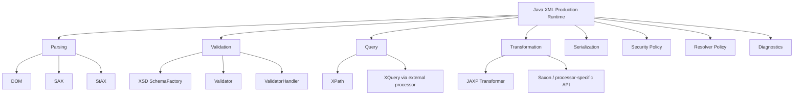
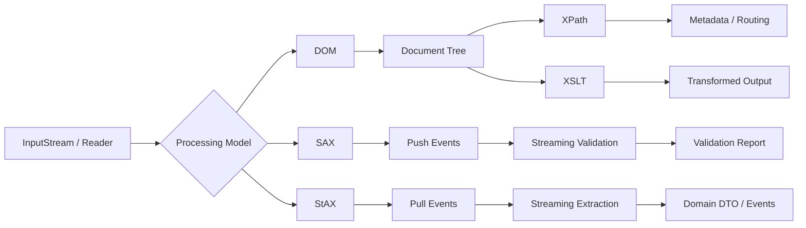

# Part 004 — Java XML Stack and JAXP Architecture

## Tujuan Part Ini

Part ini membahas **arsitektur Java XML stack** sebelum kita masuk detail DOM, SAX, StAX, XSD validation, XPath, XQuery, dan XSLT.

Banyak engineer memakai XML API seperti kumpulan class acak:

```java
DocumentBuilderFactory.newInstance()
TransformerFactory.newInstance()
XPathFactory.newInstance()
SchemaFactory.newInstance(XMLConstants.W3C_XML_SCHEMA_NS_URI)
```

Padahal secara production, ini adalah **runtime architecture**:

- factory menentukan provider/implementation;
- provider menentukan feature support, default behavior, limit, bug, dan performance;
- konfigurasi security harus konsisten lintas parser/validator/transformer;
- object tertentu boleh di-cache, object lain tidak aman dipakai bersama;
- JDK default processor bisa cukup untuk XSLT 1.0, tetapi tidak cukup untuk XSLT/XPath/XQuery modern;
- module/classpath memengaruhi provider discovery;
- error handling harus dinormalisasi agar pipeline observable.

Setelah part ini, kamu harus punya mental model untuk mendesain satu komponen seperti:

```text
XmlProcessingRuntime
  ├── parser factories
  ├── schema registry
  ├── XPath compiler
  ├── XSLT template cache
  ├── resolver policy
  ├── security limits
  ├── error normalizer
  └── metrics hooks
```

Bukan sekadar copy-paste snippet parser dari internet.

---

## Posisi Part Ini dalam Framework Kaufman

Part ini masih berada di tahap **learn enough to self-correct** dan mulai masuk **remove practice barriers**.

Sebelum latihan DOM/SAX/StAX, kamu perlu tahu:

- API mana dipakai untuk workload apa;
- object mana yang mahal dibuat;
- konfigurasi mana yang wajib distandarkan;
- bagaimana menghindari default behavior yang tidak eksplisit;
- bagaimana membuat lab XML yang bisa dipakai ulang untuk part berikutnya.



---

## `java.xml`: Module Inti XML di Java

Sejak Java Platform Module System, XML API utama berada dalam module:

```java
module java.xml
```

Dalam aplikasi modular, kamu menambahkan:

```java
module com.example.xmlservice {
    requires java.xml;
}
```

`java.xml` mencakup API untuk:

- JAXP;
- DOM;
- SAX;
- StAX;
- XPath;
- XSLT transformation;
- XSD validation;
- XML constants dan datatype utilities.

Package penting:

| Package | Fungsi |
|---|---|
| `javax.xml.parsers` | DOM dan SAX factory API |
| `org.w3c.dom` | DOM interfaces |
| `org.xml.sax` | SAX interfaces dan handlers |
| `javax.xml.stream` | StAX reader/writer |
| `javax.xml.xpath` | XPath API |
| `javax.xml.validation` | XSD/schema validation API |
| `javax.xml.transform` | transform API umum |
| `javax.xml.transform.dom` | transform source/result berbasis DOM |
| `javax.xml.transform.sax` | transform source/result berbasis SAX |
| `javax.xml.transform.stax` | transform source/result berbasis StAX |
| `javax.xml.transform.stream` | transform source/result berbasis stream |
| `javax.xml.datatype` | XML datatype seperti duration dan XMLGregorianCalendar |
| `javax.xml.namespace` | QName dan NamespaceContext |

Secara architecture, `java.xml` adalah baseline. Library eksternal seperti Saxon, XMLUnit, Woodstox, Jakarta XML Binding, atau Apache Santuario menambah kemampuan di atas baseline tersebut.

---

## JAXP: Abstraction Layer, Bukan Satu Parser

JAXP adalah API abstraksi. Kamu biasanya tidak membuat implementation langsung, melainkan meminta factory:

```java
DocumentBuilderFactory factory = DocumentBuilderFactory.newInstance();
```

Factory kemudian memilih provider. Provider bisa berasal dari:

- implementation bawaan JDK;
- library di classpath/module-path;
- konfigurasi system property;
- service provider mechanism;
- explicit factory class yang kamu panggil sendiri.

Production implication:

> Jangan menganggap `newInstance()` selalu menghasilkan implementation yang sama di semua environment.

Di laptop, test, container, dan application server, provider bisa berbeda jika dependency berbeda.

### Factory Utama

| Concern | Factory/API | Output utama |
|---|---|---|
| DOM parsing | `DocumentBuilderFactory` | `DocumentBuilder` |
| SAX parsing | `SAXParserFactory` | `SAXParser` / `XMLReader` |
| StAX reading/writing | `XMLInputFactory`, `XMLOutputFactory` | `XMLStreamReader`, `XMLEventReader`, `XMLStreamWriter` |
| XPath | `XPathFactory` | `XPath` / `XPathExpression` |
| XSD validation | `SchemaFactory` | `Schema` / `Validator` / `ValidatorHandler` |
| XSLT | `TransformerFactory` | `Transformer` / `Templates` |

Factory model ini memberi flexibility, tetapi juga menciptakan risiko:

- default feature berbeda;
- property tidak didukung provider tertentu;
- exception baru muncul di runtime;
- dependency transitive mengganti provider tanpa sengaja;
- testing tidak merepresentasikan production.

Rule production:

- eksplisitkan provider jika behavior harus deterministik;
- log provider class saat startup;
- fail fast jika feature/property security tidak bisa diterapkan;
- jangan diam-diam fallback ke parser yang lebih permisif;
- buat integration test terhadap runtime image/container yang sama dengan production.

---

## Peta Besar Processing API



Tidak ada satu API terbaik. Pilih berdasarkan workload.

| Workload | API awal yang masuk akal |
|---|---|
| payload kecil, perlu random access/mutation | DOM |
| payload besar, event-driven extraction | SAX |
| payload besar, imperative pull processing | StAX |
| routing/extract beberapa field | XPath atau StAX |
| contract validation | XSD Validation API |
| XML-to-XML/HTML/text mapping | XSLT |
| query kompleks atas koleksi XML | XQuery processor |
| object binding schema-first | Jakarta XML Binding / JAXB-like approach |

---

## DOM dalam Stack Java

DOM membangun tree penuh di memory.

```java
DocumentBuilderFactory factory = DocumentBuilderFactory.newInstance();
factory.setNamespaceAware(true);

DocumentBuilder builder = factory.newDocumentBuilder();
Document document = builder.parse(inputStream);
```

DOM cocok ketika:

- payload relatif kecil;
- kamu butuh random access;
- perlu XPath berulang pada dokumen yang sama;
- perlu mutation sebelum serialization;
- perlu integrasi dengan XSLT yang menerima `DOMSource`;
- test fixture kecil dan readability lebih penting dari throughput.

DOM buruk ketika:

- payload besar;
- hanya butuh beberapa field;
- service high-throughput;
- memory limit ketat;
- input untrusted tanpa size bound;
- dokumen punya jutaan node.

### DOM sebagai Boundary Object

Dalam sistem production, jangan biarkan `Document` menyebar ke seluruh codebase.

Buruk:

```java
public void process(Document doc) {
    billingService.handle(doc);
    auditService.handle(doc);
    riskService.handle(doc);
}
```

Lebih baik:

```java
public OrderEnvelope parseOrderEnvelope(InputStream input) {
    Document doc = secureDomParser.parse(input);
    return orderEnvelopeMapper.map(doc);
}
```

DOM adalah representation detail, bukan domain model.

---

## SAX dalam Stack Java

SAX adalah push parser. Parser memanggil handler ketika event terjadi.

```java
SAXParserFactory factory = SAXParserFactory.newInstance();
factory.setNamespaceAware(true);

SAXParser parser = factory.newSAXParser();
parser.parse(inputStream, new DefaultHandler() {
    @Override
    public void startElement(String uri, String localName, String qName, Attributes attributes) {
        // handle start
    }

    @Override
    public void characters(char[] ch, int start, int length) {
        // handle text chunks
    }

    @Override
    public void endElement(String uri, String localName, String qName) {
        // handle end
    }
});
```

SAX cocok ketika:

- payload besar;
- proses linear;
- logic bisa dimodelkan sebagai state machine;
- ingin memory footprint rendah;
- ingin streaming validation atau transformation chain;
- ingin stop lebih awal setelah field ditemukan.

SAX sulit ketika:

- logic butuh parent/sibling random access;
- mapping nested kompleks;
- handler berubah menjadi state machine besar yang susah dibaca;
- error context perlu banyak surrounding data.

### Concern Penting: `characters()` Bisa Dipanggil Berkali-kali

Jangan asumsi text element datang dalam satu callback.

Buruk:

```java
@Override
public void characters(char[] ch, int start, int length) {
    currentValue = new String(ch, start, length);
}
```

Lebih aman:

```java
private final StringBuilder text = new StringBuilder();

@Override
public void startElement(String uri, String localName, String qName, Attributes attributes) {
    text.setLength(0);
}

@Override
public void characters(char[] ch, int start, int length) {
    text.append(ch, start, length);
}

@Override
public void endElement(String uri, String localName, String qName) {
    String value = text.toString();
    // process full text for current element
}
```

Detail SAX akan dibahas di part 006.

---

## StAX dalam Stack Java

StAX adalah pull parser. Aplikasi meminta event berikutnya.

```java
XMLInputFactory factory = XMLInputFactory.newFactory();
XMLStreamReader reader = factory.createXMLStreamReader(inputStream);

while (reader.hasNext()) {
    int event = reader.next();
    if (event == XMLStreamConstants.START_ELEMENT) {
        String namespace = reader.getNamespaceURI();
        String localName = reader.getLocalName();
    }
}
```

StAX cocok ketika:

- payload besar;
- kamu ingin kontrol flow eksplisit;
- parsing perlu diintegrasikan dengan pipeline imperative;
- ingin membaca sebagian dokumen;
- ingin membangun DTO tanpa tree penuh;
- ingin membuat XML output streaming.

Dibanding SAX, StAX biasanya lebih mudah dibaca untuk code business extraction karena flow berada di tangan aplikasi.

### Cursor API vs Event API

StAX punya dua gaya:

| Gaya | API | Karakteristik |
|---|---|---|
| Cursor | `XMLStreamReader` | cepat, imperative, low allocation |
| Event | `XMLEventReader` | object event, lebih nyaman untuk beberapa pipeline |

Untuk high-throughput extraction, cursor API sering dipilih.

Detail StAX akan dibahas di part 007.

---

## XPath dalam Stack Java

XPath API dipakai untuk memilih node atau value dari XML tree.

```java
XPathFactory factory = XPathFactory.newInstance();
XPath xpath = factory.newXPath();
xpath.setNamespaceContext(new NamespaceContext() {
    @Override
    public String getNamespaceURI(String prefix) {
        return switch (prefix) {
            case "o" -> "urn:example:order:v1";
            case XMLConstants.XML_NS_PREFIX -> XMLConstants.XML_NS_URI;
            case XMLConstants.XMLNS_ATTRIBUTE -> XMLConstants.XMLNS_ATTRIBUTE_NS_URI;
            default -> XMLConstants.NULL_NS_URI;
        };
    }

    @Override
    public String getPrefix(String namespaceURI) {
        throw new UnsupportedOperationException();
    }

    @Override
    public Iterator<String> getPrefixes(String namespaceURI) {
        throw new UnsupportedOperationException();
    }
});

XPathExpression expression = xpath.compile("/o:Order/o:CustomerId/text()");
String customerId = expression.evaluate(document);
```

XPath cocok untuk:

- metadata extraction;
- routing;
- assertions dalam test;
- validasi ringan;
- lookup field kecil dari DOM;
- transformation support.

XPath kurang cocok untuk:

- payload sangat besar jika harus membangun DOM dulu;
- query kompleks atas koleksi dokumen;
- logic bisnis besar yang tersembunyi dalam string expression;
- XPath dynamic dari user tanpa kontrol.

JDK XPath baseline umumnya XPath 1.0. Untuk XPath 2.0/3.1, typed values, sequence, map/array, dan fitur modern, gunakan processor seperti Saxon. Ini akan dibahas di part 015.

---

## XSD Validation dalam Stack Java

XSD validation memakai `SchemaFactory`.

```java
SchemaFactory schemaFactory = SchemaFactory.newInstance(XMLConstants.W3C_XML_SCHEMA_NS_URI);
Schema schema = schemaFactory.newSchema(new File("order-v1.xsd"));

Validator validator = schema.newValidator();
validator.validate(new StreamSource(inputStream));
```

Object penting:

| Object | Peran |
|---|---|
| `SchemaFactory` | membuat compiled schema dari XSD |
| `Schema` | representasi schema yang sudah dikompilasi |
| `Validator` | melakukan validasi satu dokumen/source |
| `ValidatorHandler` | validasi dalam SAX pipeline |
| `LSResourceResolver` | resolve import/include schema |
| `ErrorHandler` | menerima warning/error/fatal error |

Production rule:

- compile schema sekali dan cache;
- buat `Validator` baru per validasi;
- pasang `ErrorHandler` untuk diagnostic;
- kontrol `LSResourceResolver` agar schema import tidak network call sembarangan;
- set security properties untuk external schema/DTD access;
- pisahkan schema validity dari semantic validation.

Detail XSD dan validation pipeline akan dibahas di part 010–013.

---

## XSLT Transformation dalam Stack Java

XSLT memakai `TransformerFactory`.

```java
TransformerFactory factory = TransformerFactory.newInstance();
Templates templates = factory.newTemplates(new StreamSource(new File("order-to-canonical.xsl")));

Transformer transformer = templates.newTransformer();
transformer.setParameter("sourceSystem", "PARTNER-A");
transformer.transform(
        new StreamSource(inputStream),
        new StreamResult(outputStream)
);
```

Object penting:

| Object | Peran |
|---|---|
| `TransformerFactory` | membuat transformer atau compiled templates |
| `Templates` | stylesheet compiled/reusable |
| `Transformer` | instance transform dengan parameter/runtime state |
| `Source` | input transform: stream, DOM, SAX, StAX |
| `Result` | output transform: stream, DOM, SAX, StAX |
| `URIResolver` | resolve `xsl:include`, `xsl:import`, `document()` |
| `ErrorListener` | warning/error/fatal transform |

Production rule:

- compile stylesheet menjadi `Templates` dan cache;
- buat `Transformer` baru per request;
- jangan share `Transformer` antar thread;
- kontrol `URIResolver`;
- log stylesheet version/hash;
- gunakan deterministic output setting;
- jangan campur business side effect dalam resolver.

JDK built-in transformer cukup untuk banyak kebutuhan XSLT 1.0. Untuk XSLT 2.0/3.0, Saxon adalah pilihan umum di Java ecosystem. Detail akan dibahas di part 018–019.

---

## Source dan Result: Abstraksi Pipeline

JAXP transformation API memakai `Source` dan `Result`.

### Source

| Source | Use case |
|---|---|
| `StreamSource` | input dari file, stream, reader |
| `DOMSource` | input dari DOM tree |
| `SAXSource` | input dari SAX parser/reader |
| `StAXSource` | input dari StAX reader |

### Result

| Result | Use case |
|---|---|
| `StreamResult` | output ke file, stream, writer |
| `DOMResult` | output menjadi DOM tree |
| `SAXResult` | output dikirim ke SAX handler |
| `StAXResult` | output ke StAX writer |

Ini memungkinkan pipeline hybrid:

```text
InputStream -> StreamSource -> XSLT -> StreamResult
DOM -> DOMSource -> XSLT -> StreamResult
StAX reader -> StAXSource -> XSLT -> StAXResult
SAX parser -> SAXSource -> ValidatorHandler -> SAXResult
```

Namun jangan membuat pipeline terlalu abstrak sampai sulit di-debug. Pilih kombinasi paling sederhana yang memenuhi requirement.

---

## Provider Discovery dan Determinism

Karena JAXP memakai provider model, aplikasi perlu sadar implementation.

Contoh logging startup:

```java
DocumentBuilderFactory domFactory = DocumentBuilderFactory.newInstance();
SAXParserFactory saxFactory = SAXParserFactory.newInstance();
XMLInputFactory staxInputFactory = XMLInputFactory.newFactory();
TransformerFactory transformerFactory = TransformerFactory.newInstance();
XPathFactory xpathFactory = XPathFactory.newInstance();
SchemaFactory schemaFactory = SchemaFactory.newInstance(XMLConstants.W3C_XML_SCHEMA_NS_URI);

log.info("DOM factory: {}", domFactory.getClass().getName());
log.info("SAX factory: {}", saxFactory.getClass().getName());
log.info("StAX input factory: {}", staxInputFactory.getClass().getName());
log.info("Transformer factory: {}", transformerFactory.getClass().getName());
log.info("XPath factory: {}", xpathFactory.getClass().getName());
log.info("Schema factory: {}", schemaFactory.getClass().getName());
```

Ini terlihat sederhana, tetapi sangat membantu incident debugging.

Contoh incident:

- test memakai JDK provider;
- production image membawa Saxon dependency;
- `TransformerFactory.newInstance()` memilih provider berbeda;
- stylesheet yang sebelumnya gagal sekarang berhasil, atau sebaliknya;
- output serialization berbeda;
- performance berubah.

Untuk sistem critical, tentukan policy:

1. boleh memakai default JDK provider jika feature baseline cukup;
2. explicit provider untuk XSLT/XPath modern;
3. startup check wajib memastikan provider class sesuai allowlist;
4. dependency review harus melihat transitive XML providers.

---

## Thread Safety dan Object Lifecycle

JAXP object lifecycle harus dipahami agar tidak membuat bug concurrency atau overhead besar.

| Object | Lifecycle praktis | Catatan |
|---|---|---|
| `DocumentBuilderFactory` | configure once, use to create builders | jangan ubah config setelah dipakai bersama |
| `DocumentBuilder` | per parse/per thread | tidak aman diasumsikan thread-safe |
| `SAXParserFactory` | configure once | create parser/reader per operation |
| `SAXParser` / `XMLReader` | per parse/per thread | handler punya state |
| `XMLInputFactory` | configure once | create reader per input |
| `XMLStreamReader` | per input | stateful cursor |
| `XMLOutputFactory` | configure once | create writer per output |
| `XMLStreamWriter` | per output | stateful writer |
| `XPathFactory` | configure once | create XPath as needed |
| `XPath` | per context/use | namespace context/function resolver stateful |
| `XPathExpression` | cache cautiously | depends on provider; avoid sharing if unsure |
| `SchemaFactory` | compile schema | setup resolver/security |
| `Schema` | cache reusable | compiled schema representation |
| `Validator` | per validation | stateful; do not share |
| `TransformerFactory` | configure once | provider-specific features |
| `Templates` | cache reusable | compiled stylesheet |
| `Transformer` | per transform | parameters/state; do not share |

Practical rule:

> Cache compiled immutable artifacts, not stateful execution objects.

Cache:

- `Schema`;
- `Templates`;
- possibly compiled XPath expressions if provider docs and usage allow it.

Do not cache globally:

- `DocumentBuilder` used concurrently;
- `Validator`;
- `Transformer`;
- `XMLStreamReader`;
- SAX handler with mutable state.

---

## Secure Processing as Cross-Cutting Architecture

Security configuration tidak boleh tercecer di setiap call site.

Buruk:

```java
public Document parseA(InputStream input) {
    DocumentBuilderFactory f = DocumentBuilderFactory.newInstance();
    return f.newDocumentBuilder().parse(input);
}

public Document parseB(InputStream input) {
    DocumentBuilderFactory f = DocumentBuilderFactory.newInstance();
    f.setNamespaceAware(true);
    return f.newDocumentBuilder().parse(input);
}
```

Lebih baik:

```java
public final class XmlFactories {
    public DocumentBuilderFactory newDomFactory() {
        DocumentBuilderFactory factory = DocumentBuilderFactory.newInstance();
        factory.setNamespaceAware(true);
        factory.setXIncludeAware(false);
        factory.setExpandEntityReferences(false);
        // security features/properties configured here
        return factory;
    }

    public XMLInputFactory newStaxInputFactory() {
        XMLInputFactory factory = XMLInputFactory.newFactory();
        // security properties configured here
        return factory;
    }

    public TransformerFactory newTransformerFactory() {
        TransformerFactory factory = TransformerFactory.newInstance();
        // security attributes/resolver configured here
        return factory;
    }
}
```

Nanti di part 009 kita akan membahas konfigurasi detail. Untuk sekarang, prinsip architecture-nya:

- satu tempat untuk policy parser;
- satu tempat untuk policy resolver;
- satu tempat untuk policy limit;
- fail fast jika policy tidak bisa diterapkan;
- test semua factory configuration;
- log provider dan enabled feature.

---

## Resolver Policy

Banyak XML API bisa melakukan resolving:

- DTD external entity;
- XSD `xs:include` / `xs:import`;
- XSLT `xsl:include` / `xsl:import`;
- XSLT `document()` function;
- external URI dalam schema/stylesheet;
- XML catalog mapping.

Resolver adalah boundary penting.

| Concern | Resolver/API |
|---|---|
| SAX entity | `EntityResolver` |
| DOM parse entity | via underlying parser/entity resolver |
| XSD resource | `LSResourceResolver` |
| XSLT URI | `URIResolver` |
| XML catalog | catalog resolver / JDK catalog support depending setup |

Default resolver yang mengizinkan network/file access bisa menciptakan masalah:

- SSRF;
- build tidak reproducible;
- validasi lambat karena fetch internet;
- production outage karena host schema eksternal down;
- environment-dependent behavior;
- data exfiltration.

Production resolver policy:

```text
External resolution default: DENY
Allowed schema/stylesheet imports: explicit allowlist
Network access during parse/validate/transform: disabled unless justified
Catalog: prefer local pinned resources
Audit: log every resolved URI and resource version
```

---

## Dependency Boundary: JDK vs External Libraries

### Baseline JDK

Cukup untuk:

- XML 1.0 parsing;
- DOM/SAX/StAX baseline;
- XPath baseline;
- XSD validation baseline;
- XSLT 1.0 baseline;
- simple XML generation/serialization.

### External Libraries Umum

| Library/Tool | Kapan dipakai |
|---|---|
| Saxon | XPath 2/3, XQuery, XSLT 2/3, XDM, advanced transformation |
| XMLUnit | XML-aware testing dan comparison |
| Woodstox | StAX implementation populer dengan tuning/performance features |
| Jakarta XML Binding | object binding XML ke Java object |
| Apache Santuario | XML Signature/XML Encryption |
| Xerces | parser/schema implementation dalam beberapa environment lama |

### JAXB/Jakarta XML Binding Catatan

JAXB pernah sangat umum di Java SE lama. Di Java modern, binding XML biasanya dikelola sebagai dependency Jakarta XML Binding atau library terkait, bukan diasumsikan selalu tersedia dari JDK. Dalam seri ini, binding akan dibahas sebagai strategy, bukan sebagai default jawaban untuk semua XML.

Rule:

- jangan tambahkan library XML hanya karena familiar;
- mulai dari requirement: schema versioning, streaming, transformation, typing, performance, security;
- pilih provider berdasarkan capability matrix;
- lock version dan test provider behavior.

---

## Error Handling Architecture

XML API melempar banyak exception berbeda.

| API | Exception umum |
|---|---|
| DOM/SAX parse | `SAXParseException`, `ParserConfigurationException`, `SAXException`, `IOException` |
| StAX | `XMLStreamException` |
| XPath | `XPathExpressionException` |
| XSD validation | `SAXException`, `SAXParseException`, `IOException` |
| XSLT | `TransformerException`, `TransformerConfigurationException` |

Production service sebaiknya menormalisasi error ke taxonomy internal.

Contoh:

```java
public enum XmlFailureType {
    INPUT_IO_ERROR,
    DECODING_OR_PARSE_ERROR,
    NAMESPACE_ERROR,
    SCHEMA_VALIDATION_ERROR,
    XPATH_EVALUATION_ERROR,
    TRANSFORMATION_COMPILE_ERROR,
    TRANSFORMATION_RUNTIME_ERROR,
    SECURITY_POLICY_VIOLATION,
    RESOURCE_RESOLUTION_DENIED,
    PAYLOAD_LIMIT_EXCEEDED,
    UNKNOWN_XML_ERROR
}
```

Error object:

```java
public record XmlProcessingError(
        XmlFailureType type,
        String message,
        Integer line,
        Integer column,
        String publicId,
        String systemId,
        String component,
        String operation,
        String schemaVersion,
        String stylesheetVersion
) {}
```

Kenapa penting?

- user/support butuh diagnostic jelas;
- metrics bisa dikelompokkan;
- retry decision berbeda per error;
- incident analysis lebih cepat;
- regulatory evidence butuh alasan rejection yang reproducible.

---

## Startup Validation untuk XML Runtime

Aplikasi production sebaiknya melakukan startup check.

Checklist:

- provider class sesuai expected;
- namespace-aware parser aktif;
- security features berhasil diset;
- external access policy sesuai;
- schema files bisa dikompilasi;
- stylesheet files bisa dikompilasi;
- XPath expressions critical bisa dikompilasi;
- XML catalog/resource resolver berjalan;
- sample fixture parse/validate/transform smoke test sukses;
- version/hash schema dan stylesheet tercatat.

Contoh startup metadata:

```text
xml.runtime.domFactory=com.sun.org.apache.xerces.internal.jaxp.DocumentBuilderFactoryImpl
xml.runtime.saxFactory=com.sun.org.apache.xerces.internal.jaxp.SAXParserFactoryImpl
xml.runtime.staxInputFactory=com.sun.xml.internal.stream.XMLInputFactoryImpl
xml.runtime.transformerFactory=com.sun.org.apache.xalan.internal.xsltc.trax.TransformerFactoryImpl
xml.runtime.xpathFactory=com.sun.org.apache.xpath.internal.jaxp.XPathFactoryImpl
xml.schema.order.v1.sha256=...
xml.stylesheet.order-to-canonical.v3.sha256=...
xml.policy.externalDtd=deny
xml.policy.externalSchema=deny
xml.policy.externalStylesheet=deny
```

Jangan treat ini sebagai noise. Saat incident XML terjadi, metadata seperti ini mempercepat RCA.

---

## Reference Skeleton: `XmlProcessingRuntime`

Berikut skeleton konseptual untuk menyatukan XML runtime.

```java
public final class XmlProcessingRuntime {
    private final XmlFactoryProvider factories;
    private final XmlSchemaRegistry schemas;
    private final XsltTemplateRegistry templates;
    private final NamespaceRegistry namespaces;
    private final XmlErrorNormalizer errorNormalizer;

    public XmlProcessingRuntime(
            XmlFactoryProvider factories,
            XmlSchemaRegistry schemas,
            XsltTemplateRegistry templates,
            NamespaceRegistry namespaces,
            XmlErrorNormalizer errorNormalizer
    ) {
        this.factories = factories;
        this.schemas = schemas;
        this.templates = templates;
        this.namespaces = namespaces;
        this.errorNormalizer = errorNormalizer;
    }

    public Document parseDom(InputStream input) {
        try {
            DocumentBuilder builder = factories.newDocumentBuilder();
            return builder.parse(input);
        } catch (Exception ex) {
            throw errorNormalizer.toException("dom-parse", ex);
        }
    }

    public void validate(String schemaId, Source source) {
        try {
            Validator validator = schemas.get(schemaId).newValidator();
            validator.setErrorHandler(new CollectingValidationErrorHandler());
            validator.validate(source);
        } catch (Exception ex) {
            throw errorNormalizer.toException("xsd-validate:" + schemaId, ex);
        }
    }

    public void transform(String stylesheetId, Source source, Result result, Map<String, ?> params) {
        try {
            Transformer transformer = templates.get(stylesheetId).newTransformer();
            for (Map.Entry<String, ?> entry : params.entrySet()) {
                transformer.setParameter(entry.getKey(), entry.getValue());
            }
            transformer.transform(source, result);
        } catch (Exception ex) {
            throw errorNormalizer.toException("xslt-transform:" + stylesheetId, ex);
        }
    }
}
```

Ini bukan final implementation, tetapi direction:

- parsing, validation, dan transform punya lifecycle jelas;
- schema dan stylesheet compiled artifact dicache;
- execution object dibuat per request;
- error dinormalisasi;
- namespace registry terpusat;
- factory policy tidak tercecer.

---

## Namespace Registry Pattern

XPath, XSLT, validation diagnostic, dan mapping code membutuhkan namespace yang konsisten.

Buat registry:

```java
public final class XmlNamespaces {
    public static final String ORDER_V1 = "urn:example:order:v1";
    public static final String MESSAGE_V1 = "urn:example:message:v1";
    public static final String XML = XMLConstants.XML_NS_URI;
    public static final String XMLNS = XMLConstants.XMLNS_ATTRIBUTE_NS_URI;

    private XmlNamespaces() {
    }
}
```

Untuk XPath:

```java
public final class StaticNamespaceContext implements NamespaceContext {
    private final Map<String, String> prefixToNamespace;

    public StaticNamespaceContext(Map<String, String> prefixToNamespace) {
        this.prefixToNamespace = Map.copyOf(prefixToNamespace);
    }

    @Override
    public String getNamespaceURI(String prefix) {
        if (prefix == null) {
            throw new IllegalArgumentException("prefix must not be null");
        }
        return prefixToNamespace.getOrDefault(prefix, XMLConstants.NULL_NS_URI);
    }

    @Override
    public String getPrefix(String namespaceURI) {
        return prefixToNamespace.entrySet().stream()
                .filter(e -> e.getValue().equals(namespaceURI))
                .map(Map.Entry::getKey)
                .findFirst()
                .orElse(null);
    }

    @Override
    public Iterator<String> getPrefixes(String namespaceURI) {
        return prefixToNamespace.entrySet().stream()
                .filter(e -> e.getValue().equals(namespaceURI))
                .map(Map.Entry::getKey)
                .iterator();
    }
}
```

Rule:

- prefix internal XPath tidak harus sama dengan prefix dokumen;
- prefix internal harus stabil dalam codebase;
- namespace URI adalah contract;
- jangan duplikasi literal namespace di banyak file.

---

## XML Processing Decision Matrix

Gunakan matrix ini sebelum memilih API.

| Pertanyaan | Jika ya | API/Pattern yang cenderung cocok |
|---|---|---|
| Perlu random access ke banyak bagian dokumen? | ya | DOM atau XDM |
| Payload bisa sangat besar? | ya | SAX/StAX/streaming validation |
| Hanya butuh beberapa field untuk routing? | ya | StAX atau XPath jika dokumen kecil |
| Perlu transform deklaratif XML-to-XML? | ya | XSLT |
| Perlu XSLT 2/3 atau XPath 3? | ya | Saxon |
| Perlu validasi contract formal? | ya | XSD Validation API |
| Perlu object domain Java lengkap? | ya | Binding/manual mapper setelah validation |
| Perlu audit exact original payload? | ya | simpan raw bytes sebelum parse |
| Input untrusted? | hampir selalu ya | secure processing policy wajib |
| Perlu process jutaan dokumen? | ya | streaming, cache schema/templates, benchmark |

---

## Mini Lab Setup untuk Part Berikutnya

Buat struktur folder seperti ini:

```text
xml-lab/
  src/main/java/com/example/xml/
    runtime/
      XmlFactoryProvider.java
      XmlProcessingRuntime.java
      XmlNamespaces.java
      StaticNamespaceContext.java
    dom/
    sax/
    stax/
    validation/
    transform/
  src/main/resources/xml/
    fixtures/
      order-v1-valid.xml
      order-v1-invalid-namespace.xml
      order-v1-invalid-shape.xml
    schemas/
      order-v1.xsd
    xslt/
      order-to-canonical-v1.xsl
  src/test/java/com/example/xml/
```

Minimal fixture:

```xml
<?xml version="1.0" encoding="UTF-8"?>
<ord:Order xmlns:ord="urn:example:order:v1" id="O-1001">
  <ord:CustomerId>C-1001</ord:CustomerId>
  <ord:Status>NEW</ord:Status>
</ord:Order>
```

Di part berikutnya, fixture ini akan dipakai untuk DOM parsing.

---

## Common Production Failure Modes di Level JAXP

### 1. Provider Berubah Tanpa Disadari

Gejala:

- output XSLT berubah;
- XPath behavior berubah;
- feature tidak supported;
- performance berubah setelah dependency upgrade.

Mitigasi:

- log provider;
- pin dependency;
- startup check;
- regression test output.

### 2. Parser Tidak Namespace-Aware

Gejala:

- `getLocalName()` null;
- XPath namespace-aware tidak match;
- validation error membingungkan.

Mitigasi:

- factory policy terpusat;
- test expanded name;
- ban raw factory creation via code review/static analysis.

### 3. Stateful Object Dishare Antar Thread

Gejala:

- parameter XSLT bocor antar request;
- validator error random;
- race condition sulit direproduce.

Mitigasi:

- cache `Templates` dan `Schema`, bukan `Transformer` dan `Validator`;
- buat execution object per request.

### 4. Resolver Melakukan Network Call

Gejala:

- parse/validate lambat;
- production tergantung host eksternal;
- SSRF risk;
- hasil berbeda antar environment.

Mitigasi:

- deny by default;
- XML catalog lokal;
- resolver allowlist;
- audit resolved URI.

### 5. Error Tidak Bisa Dipakai User

Gejala:

- semua error menjadi `500 XML failed`;
- support tidak tahu line/column;
- partner tidak bisa memperbaiki payload;
- validasi ulang manual.

Mitigasi:

- error taxonomy;
- capture `SAXParseException` line/column;
- validation report;
- correlation ID;
- sample rejected payload handling.

---

## Practice Drill

Implementasikan class kecil:

```java
public final class XmlRuntimeSmokeTest {
    public static void main(String[] args) throws Exception {
        // 1. create DOM factory namespace-aware
        // 2. log provider class
        // 3. parse fixture order-v1-valid.xml
        // 4. print root namespace URI and local name
        // 5. compile XPath /o:Order/o:CustomerId/text()
        // 6. evaluate and print customer id
        // 7. create TransformerFactory and log provider
    }
}
```

Acceptance criteria:

- output root namespace `urn:example:order:v1`;
- output local name `Order`;
- XPath menghasilkan `C-1001`;
- provider class tercetak;
- tidak ada string matching terhadap `ord:Order`;
- namespace context explicit.

Latihan ini kecil, tetapi membangun friction-free lab untuk part berikutnya.

---

## Checklist Part 004

Sebelum lanjut, pastikan kamu bisa menjawab:

- Apa isi besar module `java.xml`?
- Apa itu JAXP factory/provider model?
- Kenapa `newInstance()` bisa menjadi sumber nondeterminism?
- Kapan DOM cocok dan kapan buruk?
- Kapan SAX lebih cocok daripada DOM?
- Kapan StAX lebih nyaman daripada SAX?
- Kenapa XPath harus namespace-aware?
- Apa beda `Schema`, `Validator`, `Templates`, dan `Transformer` dari sisi lifecycle?
- Object apa yang boleh dicache?
- Kenapa resolver policy penting?
- Kenapa XML security harus jadi factory-level policy, bukan snippet per call site?

---

## Ringkasan

Java XML stack bukan kumpulan API terpisah. Ia adalah runtime architecture.

Poin utama:

1. `java.xml` menyediakan baseline DOM, SAX, StAX, XPath, XSD validation, dan XSLT API.
2. JAXP memakai factory/provider model, sehingga provider harus diketahui dan dikendalikan.
3. DOM, SAX, dan StAX adalah processing model berbeda, bukan variasi syntax.
4. XPath, validation, dan XSLT berada di atas model input yang berbeda melalui abstraction seperti `Source` dan `Result`.
5. Cache compiled artifacts seperti `Schema` dan `Templates`, bukan execution object stateful seperti `Validator` dan `Transformer`.
6. Resolver policy dan secure processing adalah cross-cutting architecture.
7. Buat `XmlProcessingRuntime` agar konfigurasi, provider, error handling, schema, stylesheet, dan namespace tidak tercecer.

Part berikutnya akan masuk ke **DOM Processing in Action**: parsing DOM secara aman, navigasi tree, mutation, namespace-aware access, memory trade-off, dan kapan DOM menjadi pilihan tepat atau salah.

---

## Referensi

- Oracle Java Documentation — Module `java.xml`.
- Oracle Java Documentation — Java API for XML Processing Security Guide.
- W3C — Document Object Model.
- SAX Project — Simple API for XML.
- Java Documentation — Streaming API for XML.
- W3C — XSL Transformations.
- W3C — XML Schema.
