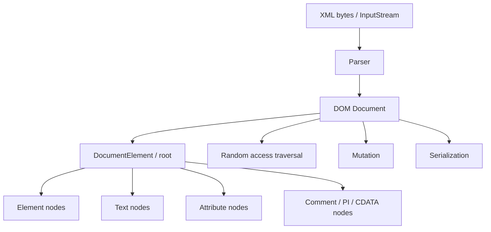
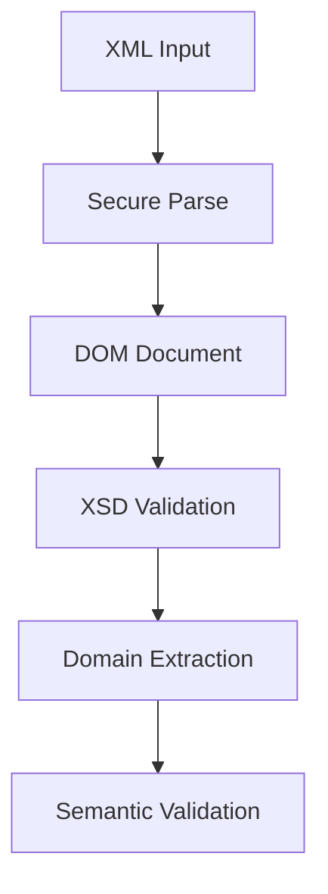

# Part 005 — DOM Processing in Action

## Tujuan Part Ini

Part ini membahas **DOM processing** dari sudut pandang engineer yang harus membangun sistem production, bukan sekadar membaca tag XML.

DOM terlihat sederhana:

```java
Document document = builder.parse(inputStream);
Element root = document.getDocumentElement();
```

Namun di production, DOM adalah keputusan arsitektural:

- seluruh dokumen dibaca menjadi **tree object graph** di memory;
- parsing behavior dipengaruhi oleh konfigurasi factory;
- namespace awareness menentukan apakah lookup element benar atau diam-diam gagal;
- whitespace, CDATA, comment, dan text node dapat mengubah hasil traversal;
- mutation bisa menghasilkan dokumen yang terlihat benar tetapi namespace-nya rusak;
- serialization bisa mengubah format output, encoding, indentation, dan urutan atribut;
- parser yang tidak di-hardening dapat membuka risiko XXE, SSRF, local file disclosure, dan XML bomb.

Target part ini: kamu mampu memakai DOM secara sadar, aman, efisien, dan bisa menjelaskan kapan DOM adalah pilihan tepat atau pilihan buruk.

---

## Posisi Part Ini dalam Framework Kaufman

Dalam pendekatan Josh Kaufman, bagian ini masuk tahap:

1. **Deconstruct the skill** — kita pisahkan DOM menjadi parsing, traversal, extraction, mutation, serialization, diagnostics, dan hardening.
2. **Learn enough to self-correct** — kamu akan belajar bug umum DOM yang harus bisa dikenali sendiri.
3. **Remove barriers** — kita buat utility dan pattern yang mengurangi friction saat latihan.
4. **Deliberate practice** — di akhir ada drill yang memaksa kamu men-debug namespace, whitespace, dan memory trade-off.

DOM bukan skill menghafal method `getElementsByTagName`. DOM adalah skill mengendalikan tree representation dari XML.

---

## Mental Model: DOM adalah Snapshot Tree, Bukan Stream

DOM memodelkan XML sebagai tree node di memory.



Konsekuensinya:

- DOM cocok jika kamu butuh **random access** ke banyak bagian dokumen.
- DOM cocok jika kamu perlu **mengubah struktur** dokumen.
- DOM cocok jika payload relatif kecil-menengah dan perlu inspeksi berulang.
- DOM buruk jika payload besar, misalnya ratusan MB atau GB.
- DOM buruk jika hanya butuh ekstraksi beberapa field dari file besar.
- DOM buruk jika pipeline harus streaming dengan memory konstan.

Rule praktis:

> Jika kamu tidak butuh melihat dokumen sebagai tree penuh, jangan otomatis pilih DOM.

---

## Kapan DOM Layak Dipakai

DOM layak ketika salah satu kondisi berikut benar:

| Kebutuhan | DOM Cocok? | Alasan |
|---|---:|---|
| Membaca konfigurasi XML kecil | Ya | Tree kecil, akses random mudah. |
| Mengambil banyak field dari berbagai lokasi | Ya | Traversal berulang lebih mudah daripada state machine. |
| Memodifikasi element/attribute | Ya | DOM memang mutable tree. |
| Menandatangani sebagian dokumen setelah canonicalization | Mungkin | DOM sering dipakai, tetapi butuh perhatian namespace dan canonical XML. |
| Validasi ringan lalu transformasi kecil | Mungkin | Bisa sederhana, asal ukuran payload terkendali. |
| Membaca batch file besar partner 1 GB | Tidak | Memory blow-up dan GC pressure. |
| Mengambil 3 field dari XML besar | Tidak | SAX/StAX lebih cocok. |
| Low-latency high-throughput gateway | Biasanya tidak | DOM allocation mahal. |

DOM adalah tool yang bagus jika dipakai di boundary yang tepat.

---

## Java API yang Terlibat

DOM di Java biasanya melibatkan:

```text
javax.xml.parsers.DocumentBuilderFactory
javax.xml.parsers.DocumentBuilder
org.w3c.dom.Document
org.w3c.dom.Element
org.w3c.dom.Node
org.w3c.dom.NodeList
org.w3c.dom.NamedNodeMap
org.xml.sax.ErrorHandler
org.xml.sax.InputSource
javax.xml.transform.Transformer
```

`DocumentBuilderFactory` membuat `DocumentBuilder`. `DocumentBuilder` membaca XML menjadi `Document`. `Document` adalah root object dari DOM tree.

Oracle Java API mendeskripsikan `DocumentBuilder` sebagai API untuk memperoleh DOM `Document` dari dokumen XML, dan `DocumentBuilderFactory` sebagai factory untuk membuat parser yang menghasilkan DOM object tree.

---

## Baseline Production Parser: Jangan Pakai Default Mentah

Kode tutorial sering seperti ini:

```java
DocumentBuilderFactory factory = DocumentBuilderFactory.newInstance();
DocumentBuilder builder = factory.newDocumentBuilder();
Document document = builder.parse(file);
```

Untuk production, ini belum cukup karena:

- namespace awareness default historis sering tidak sesuai kebutuhan;
- external entity bisa menjadi celah security jika tidak dimatikan;
- XInclude bisa membuka sumber eksternal;
- DTD bisa memicu entity expansion;
- error handling default tidak cukup untuk observability;
- parser behavior bisa beda jika provider berubah.

Gunakan baseline factory yang eksplisit.

```java
import javax.xml.XMLConstants;
import javax.xml.parsers.DocumentBuilder;
import javax.xml.parsers.DocumentBuilderFactory;
import javax.xml.parsers.ParserConfigurationException;

public final class DomFactories {

    private DomFactories() {
    }

    public static DocumentBuilderFactory secureNamespaceAwareFactory() {
        DocumentBuilderFactory factory = DocumentBuilderFactory.newInstance();

        factory.setNamespaceAware(true);
        factory.setXIncludeAware(false);
        factory.setExpandEntityReferences(false);
        factory.setIgnoringComments(false);
        factory.setCoalescing(false);
        factory.setIgnoringElementContentWhitespace(false);

        setFeatureIfSupported(factory, XMLConstants.FEATURE_SECURE_PROCESSING, true);

        setFeatureIfSupported(factory,
                "http://apache.org/xml/features/disallow-doctype-decl",
                true);
        setFeatureIfSupported(factory,
                "http://xml.org/sax/features/external-general-entities",
                false);
        setFeatureIfSupported(factory,
                "http://xml.org/sax/features/external-parameter-entities",
                false);
        setFeatureIfSupported(factory,
                "http://apache.org/xml/features/nonvalidating/load-external-dtd",
                false);

        factory.setAttribute(XMLConstants.ACCESS_EXTERNAL_DTD, "");
        factory.setAttribute(XMLConstants.ACCESS_EXTERNAL_SCHEMA, "");

        return factory;
    }

    public static DocumentBuilder newSecureDocumentBuilder() {
        try {
            DocumentBuilderFactory factory = secureNamespaceAwareFactory();
            DocumentBuilder builder = factory.newDocumentBuilder();
            builder.setEntityResolver((publicId, systemId) -> new org.xml.sax.InputSource(new java.io.StringReader("")));
            builder.setErrorHandler(new ThrowingXmlErrorHandler());
            return builder;
        } catch (ParserConfigurationException ex) {
            throw new IllegalStateException("Cannot create secure DOM parser", ex);
        }
    }

    private static void setFeatureIfSupported(
            DocumentBuilderFactory factory,
            String feature,
            boolean value
    ) {
        try {
            factory.setFeature(feature, value);
        } catch (ParserConfigurationException | RuntimeException ex) {
            throw new IllegalStateException("Required XML parser feature not supported: " + feature, ex);
        }
    }
}
```

Error handler:

```java
import org.xml.sax.ErrorHandler;
import org.xml.sax.SAXException;
import org.xml.sax.SAXParseException;

public final class ThrowingXmlErrorHandler implements ErrorHandler {

    @Override
    public void warning(SAXParseException exception) throws SAXException {
        throw enrich("XML warning", exception);
    }

    @Override
    public void error(SAXParseException exception) throws SAXException {
        throw enrich("XML error", exception);
    }

    @Override
    public void fatalError(SAXParseException exception) throws SAXException {
        throw enrich("XML fatal error", exception);
    }

    private SAXException enrich(String category, SAXParseException ex) {
        String message = "%s at line=%d column=%d publicId=%s systemId=%s: %s".formatted(
                category,
                ex.getLineNumber(),
                ex.getColumnNumber(),
                ex.getPublicId(),
                ex.getSystemId(),
                ex.getMessage()
        );
        return new SAXException(message, ex);
    }
}
```

Important production invariant:

> XML parser configuration belongs in one central module, not scattered across services.

---

## Parsing dari InputStream, String, File, dan Byte Array

### Prefer InputStream atau Reader yang Dikontrol

```java
import org.w3c.dom.Document;

import java.io.InputStream;

public final class DomParser {

    public Document parse(InputStream xml) {
        try {
            DocumentBuilder builder = DomFactories.newSecureDocumentBuilder();
            Document document = builder.parse(xml);
            document.getDocumentElement().normalize();
            return document;
        } catch (Exception ex) {
            throw new XmlParsingException("Cannot parse XML document", ex);
        }
    }
}
```

Custom exception:

```java
public final class XmlParsingException extends RuntimeException {
    public XmlParsingException(String message, Throwable cause) {
        super(message, cause);
    }
}
```

### Parsing dari String

Untuk test atau payload yang memang sudah di memory:

```java
import org.w3c.dom.Document;
import org.xml.sax.InputSource;

import java.io.StringReader;

public Document parseString(String xml) {
    try {
        DocumentBuilder builder = DomFactories.newSecureDocumentBuilder();
        Document document = builder.parse(new InputSource(new StringReader(xml)));
        document.getDocumentElement().normalize();
        return document;
    } catch (Exception ex) {
        throw new XmlParsingException("Cannot parse XML string", ex);
    }
}
```

Namun hati-hati: jika XML declaration punya encoding seperti `<?xml version="1.0" encoding="ISO-8859-1"?>`, lalu kamu sudah mengubah bytes menjadi `String`, informasi encoding asli sudah tidak lagi menentukan decoding. Untuk production ingest, lebih aman parse dari byte stream agar parser membaca encoding declaration.

### Parsing dari File

Parsing langsung dari `File` nyaman, tetapi path dan URI handling bisa punya implikasi external resource resolution.

```java
public Document parseFile(Path path) {
    try (InputStream in = Files.newInputStream(path)) {
        return parse(in);
    } catch (IOException ex) {
        throw new UncheckedIOException("Cannot read XML file: " + path, ex);
    }
}
```

Dengan wrapper ini, kamu punya satu entry point untuk metrics, size limit, timeout, dan audit.

---

## Size Guard: DOM Harus Punya Batas Ukuran

DOM memuat dokumen penuh ke memory. Jadi parser DOM harus punya size guard sebelum parse.

```java
import java.io.FilterInputStream;
import java.io.IOException;
import java.io.InputStream;

public final class BoundedInputStream extends FilterInputStream {
    private final long maxBytes;
    private long readBytes;

    public BoundedInputStream(InputStream in, long maxBytes) {
        super(in);
        this.maxBytes = maxBytes;
    }

    @Override
    public int read() throws IOException {
        int value = super.read();
        if (value != -1) {
            increment(1);
        }
        return value;
    }

    @Override
    public int read(byte[] b, int off, int len) throws IOException {
        int count = super.read(b, off, len);
        if (count > 0) {
            increment(count);
        }
        return count;
    }

    private void increment(long count) throws IOException {
        readBytes += count;
        if (readBytes > maxBytes) {
            throw new IOException("XML payload exceeds DOM limit: " + maxBytes + " bytes");
        }
    }
}
```

Usage:

```java
public Document parseSmallDocument(InputStream raw) {
    long maxDomPayloadBytes = 5 * 1024 * 1024; // example policy, tune per service
    return parse(new BoundedInputStream(raw, maxDomPayloadBytes));
}
```

Batasnya bukan universal. Tetapkan berdasarkan:

- heap service;
- concurrency maksimum;
- payload partner;
- retention object setelah parse;
- apakah dokumen langsung dibuang atau disimpan di cache;
- SLA latency;
- GC behavior.

Mental model:

```text
Concurrent DOM memory ≈ request concurrency × expanded DOM footprint
```

Expanded DOM footprint bisa jauh lebih besar daripada ukuran file karena node object, string, attribute, namespace, dan object graph overhead.

---

## Node Model: Jangan Anggap Semua Child adalah Element

XML seperti ini:

```xml
<order>
    <id>O-100</id>
    <amount currency="USD">42.50</amount>
</order>
```

Dalam DOM, child dari `<order>` bukan hanya `id` dan `amount`. Whitespace/newline juga bisa menjadi `Text` node.

```text
order
  #text "\n    "
  element id
  #text "\n    "
  element amount
  #text "\n"
```

Bug umum:

```java
Node first = order.getFirstChild();
// Kamu berharap <id>, tetapi bisa jadi whitespace text node.
```

Gunakan filter node type.

```java
import org.w3c.dom.Element;
import org.w3c.dom.Node;
import org.w3c.dom.NodeList;

import java.util.ArrayList;
import java.util.List;

public final class DomNodes {

    private DomNodes() {
    }

    public static List<Element> childElements(Element parent) {
        NodeList children = parent.getChildNodes();
        List<Element> result = new ArrayList<>();

        for (int i = 0; i < children.getLength(); i++) {
            Node node = children.item(i);
            if (node.getNodeType() == Node.ELEMENT_NODE) {
                result.add((Element) node);
            }
        }

        return result;
    }
}
```

Filter berdasarkan local name dan namespace:

```java
public static List<Element> childElements(
        Element parent,
        String namespaceUri,
        String localName
) {
    List<Element> result = new ArrayList<>();

    for (Element child : childElements(parent)) {
        if (namespaceUri.equals(child.getNamespaceURI())
                && localName.equals(child.getLocalName())) {
            result.add(child);
        }
    }

    return result;
}
```

Rule:

> Di DOM production, traversal harus eksplisit terhadap node type.

---

## Namespace-Aware Traversal

XML enterprise hampir selalu memakai namespace.

```xml
<ord:Order xmlns:ord="urn:example:order:v1">
    <ord:Id>O-100</ord:Id>
</ord:Order>
```

Jika parser tidak `namespaceAware`, `getLocalName()` bisa `null`, dan lookup namespace-aware tidak bekerja.

Production parser harus:

```java
factory.setNamespaceAware(true);
```

Lalu baca dengan namespace URI dan local name, bukan prefix.

```java
public static Element requiredChild(
        Element parent,
        String namespaceUri,
        String localName
) {
    List<Element> matches = childElements(parent, namespaceUri, localName);

    if (matches.isEmpty()) {
        throw new XmlStructureException("Missing required child {%s}%s under {%s}%s".formatted(
                namespaceUri,
                localName,
                parent.getNamespaceURI(),
                parent.getLocalName()
        ));
    }

    if (matches.size() > 1) {
        throw new XmlStructureException("Expected one child {%s}%s under {%s}%s but found %d".formatted(
                namespaceUri,
                localName,
                parent.getNamespaceURI(),
                parent.getLocalName(),
                matches.size()
        ));
    }

    return matches.get(0);
}
```

Exception:

```java
public final class XmlStructureException extends RuntimeException {
    public XmlStructureException(String message) {
        super(message);
    }
}
```

Anti-pattern:

```java
// Fragile: prefix can change.
document.getElementsByTagName("ord:Id");
```

Better:

```java
NodeList ids = document.getElementsByTagNameNS("urn:example:order:v1", "Id");
```

Namun `getElementsByTagNameNS` mencari descendant di seluruh subtree, bukan hanya direct child. Itu bisa berbahaya jika struktur punya nested element dengan nama sama.

Contoh:

```xml
<Order xmlns="urn:example:order:v1">
    <Id>ORDER-1</Id>
    <Line>
        <Id>LINE-1</Id>
    </Line>
</Order>
```

`document.getElementsByTagNameNS(ns, "Id")` mengembalikan dua node. Untuk invariant struktur, pakai direct-child helper.

---

## Text Extraction yang Aman

`getTextContent()` terlihat mudah, tetapi ia menggabungkan semua descendant text.

```xml
<Customer>
    <Name>Ana</Name>
    <Address>
        <Line1>Main Street</Line1>
    </Address>
</Customer>
```

`customer.getTextContent()` akan menggabungkan `Ana Main Street` secara whitespace-dependent. Itu jarang yang kamu mau.

Untuk simple leaf element:

```java
public static String requiredLeafText(Element element) {
    NodeList children = element.getChildNodes();
    StringBuilder text = new StringBuilder();

    for (int i = 0; i < children.getLength(); i++) {
        Node node = children.item(i);

        if (node.getNodeType() == Node.TEXT_NODE || node.getNodeType() == Node.CDATA_SECTION_NODE) {
            text.append(node.getNodeValue());
        } else if (node.getNodeType() == Node.ELEMENT_NODE) {
            throw new XmlStructureException("Expected leaf text but found child element under {%s}%s".formatted(
                    element.getNamespaceURI(),
                    element.getLocalName()
            ));
        }
    }

    String value = text.toString().trim();
    if (value.isEmpty()) {
        throw new XmlStructureException("Expected non-empty text for {%s}%s".formatted(
                element.getNamespaceURI(),
                element.getLocalName()
        ));
    }
    return value;
}
```

Untuk optional text:

```java
public static Optional<String> optionalLeafText(Element parent, String ns, String localName) {
    List<Element> matches = childElements(parent, ns, localName);
    if (matches.isEmpty()) {
        return Optional.empty();
    }
    if (matches.size() > 1) {
        throw new XmlStructureException("Expected zero or one {%s}%s but found %d".formatted(
                ns, localName, matches.size()
        ));
    }
    String value = requiredLeafText(matches.get(0));
    return Optional.of(value);
}
```

Production decision:

- `trim()` cocok untuk field bisnis yang whitespace tidak signifikan.
- Jangan `trim()` untuk field yang whitespace signifikan, misalnya signed content, narrative text, atau preformatted payload.
- Jangan normalize whitespace sebelum digital signature/canonicalization kecuali spesifikasi jelas.

---

## Attribute Extraction

Attribute tidak berada di child node traversal biasa. Gunakan namespace-aware attribute API.

```xml
<Amount currency="USD">42.50</Amount>
```

```java
public static String requiredAttribute(Element element, String name) {
    if (!element.hasAttribute(name)) {
        throw new XmlStructureException("Missing attribute '%s' on {%s}%s".formatted(
                name,
                element.getNamespaceURI(),
                element.getLocalName()
        ));
    }
    return element.getAttribute(name);
}
```

Untuk attribute namespace-aware:

```xml
<doc:Document
    xmlns:doc="urn:example:doc:v1"
    xmlns:xlink="http://www.w3.org/1999/xlink"
    xlink:href="https://example.com/doc/1" />
```

```java
public static String requiredAttributeNS(Element element, String ns, String localName) {
    if (!element.hasAttributeNS(ns, localName)) {
        throw new XmlStructureException("Missing attribute {%s}%s on {%s}%s".formatted(
                ns,
                localName,
                element.getNamespaceURI(),
                element.getLocalName()
        ));
    }
    return element.getAttributeNS(ns, localName);
}
```

Important nuance:

- Default namespace berlaku untuk elements.
- Default namespace tidak otomatis berlaku untuk unprefixed attributes.
- Attribute tanpa prefix biasanya `namespaceURI == null`.

Ini salah satu sumber bug paling sering dalam integrasi XML.

---

## Mapping DOM ke Domain Object

DOM tidak boleh bocor ke seluruh aplikasi. Biasanya DOM hanya ada di adapter layer.


Contoh domain object:

```java
import java.math.BigDecimal;
import java.util.List;

public record OrderDocument(
        String orderId,
        String customerId,
        List<OrderLine> lines
) {
}

public record OrderLine(
        String sku,
        int quantity,
        BigDecimal unitPrice,
        String currency
) {
}
```

Extractor:

```java
import org.w3c.dom.Document;
import org.w3c.dom.Element;

import java.math.BigDecimal;
import java.util.ArrayList;
import java.util.List;

public final class OrderDomExtractor {
    private static final String NS = "urn:example:order:v1";

    public OrderDocument extract(Document document) {
        Element root = document.getDocumentElement();
        requireElement(root, NS, "Order");

        String orderId = requiredLeafText(requiredChild(root, NS, "Id"));
        String customerId = requiredLeafText(requiredChild(root, NS, "CustomerId"));

        Element linesElement = requiredChild(root, NS, "Lines");
        List<OrderLine> lines = new ArrayList<>();

        for (Element line : childElements(linesElement, NS, "Line")) {
            String sku = requiredLeafText(requiredChild(line, NS, "Sku"));
            int quantity = parseInt(requiredLeafText(requiredChild(line, NS, "Quantity")), "Quantity");

            Element price = requiredChild(line, NS, "UnitPrice");
            BigDecimal unitPrice = parseDecimal(requiredLeafText(price), "UnitPrice");
            String currency = requiredAttribute(price, "currency");

            lines.add(new OrderLine(sku, quantity, unitPrice, currency));
        }

        if (lines.isEmpty()) {
            throw new XmlStructureException("Order must contain at least one line");
        }

        return new OrderDocument(orderId, customerId, List.copyOf(lines));
    }

    private static void requireElement(Element element, String ns, String localName) {
        if (!ns.equals(element.getNamespaceURI()) || !localName.equals(element.getLocalName())) {
            throw new XmlStructureException("Expected root {%s}%s but found {%s}%s".formatted(
                    ns,
                    localName,
                    element.getNamespaceURI(),
                    element.getLocalName()
            ));
        }
    }

    private static int parseInt(String value, String field) {
        try {
            return Integer.parseInt(value);
        } catch (NumberFormatException ex) {
            throw new XmlStructureException("Invalid integer for " + field + ": " + value);
        }
    }

    private static BigDecimal parseDecimal(String value, String field) {
        try {
            return new BigDecimal(value);
        } catch (NumberFormatException ex) {
            throw new XmlStructureException("Invalid decimal for " + field + ": " + value);
        }
    }
}
```

Key design:

- DOM is adapter detail.
- Domain object should not expose `Node`, `Element`, or `Document`.
- Extractor should enforce local structural invariants.
- XSD validation may catch schema problems, but extractor still validates semantic assumptions needed by business code.

---

## Avoid `getElementsByTagName` untuk Business Extraction

`getElementsByTagName` sering menyebabkan bug karena:

- tidak namespace-safe jika memakai qualified string;
- mencari seluruh descendant, bukan direct child;
- mudah salah jika element name muncul di beberapa level;
- hasil order mengikuti document order, bukan domain relation yang eksplisit.

Contoh buruk:

```java
String orderId = document.getElementsByTagName("Id")
        .item(0)
        .getTextContent();
```

Masalah:

- Jika `<Line><Id>...</Id></Line>` muncul sebelum `<Order><Id>...</Id>`, hasil salah.
- Jika namespace dipakai, lookup bisa gagal.
- Jika element optional, `item(0)` null.
- Jika payload malicious atau malformed secara semantic, error menjadi `NullPointerException`.

Gunakan helper yang menyatakan invariant:

```java
Element orderIdElement = requiredChild(root, ORDER_NS, "Id");
String orderId = requiredLeafText(orderIdElement);
```

Top 1% engineer bukan hanya tahu API, tetapi membuat illegal state sulit terjadi.

---

## Mutation: Membuat dan Mengubah DOM

DOM mutable. Ini berguna untuk:

- menambah metadata envelope;
- mengubah namespace versi;
- menyisipkan audit marker;
- membangun dokumen XML kecil;
- menormalisasi payload sebelum transformasi.

Membuat dokumen baru:

```java
import org.w3c.dom.Document;
import org.w3c.dom.Element;

public final class OrderDomWriter {
    private static final String NS = "urn:example:order:v1";

    public Document toDocument(OrderDocument order) {
        try {
            DocumentBuilder builder = DomFactories.newSecureDocumentBuilder();
            Document document = builder.newDocument();

            Element root = document.createElementNS(NS, "ord:Order");
            document.appendChild(root);

            appendText(document, root, NS, "ord:Id", order.orderId());
            appendText(document, root, NS, "ord:CustomerId", order.customerId());

            Element lines = document.createElementNS(NS, "ord:Lines");
            root.appendChild(lines);

            for (OrderLine line : order.lines()) {
                Element lineElement = document.createElementNS(NS, "ord:Line");
                lines.appendChild(lineElement);

                appendText(document, lineElement, NS, "ord:Sku", line.sku());
                appendText(document, lineElement, NS, "ord:Quantity", Integer.toString(line.quantity()));

                Element price = document.createElementNS(NS, "ord:UnitPrice");
                price.setAttribute("currency", line.currency());
                price.setTextContent(line.unitPrice().toPlainString());
                lineElement.appendChild(price);
            }

            return document;
        } catch (Exception ex) {
            throw new XmlWritingException("Cannot build order DOM", ex);
        }
    }

    private static void appendText(
            Document document,
            Element parent,
            String namespaceUri,
            String qualifiedName,
            String value
    ) {
        Element child = document.createElementNS(namespaceUri, qualifiedName);
        child.setTextContent(value);
        parent.appendChild(child);
    }
}
```

Exception:

```java
public final class XmlWritingException extends RuntimeException {
    public XmlWritingException(String message, Throwable cause) {
        super(message, cause);
    }
}
```

### Namespace Mutation Pitfall

Jangan membuat namespaced element dengan `createElement` lalu set `xmlns` manual.

Buruk:

```java
Element root = document.createElement("Order");
root.setAttribute("xmlns", "urn:example:order:v1");
```

Ini bisa menghasilkan XML yang terlihat namespaced saat diserialize, tetapi node di DOM tidak punya `namespaceURI` yang benar.

Benar:

```java
Element root = document.createElementNS("urn:example:order:v1", "ord:Order");
```

DOM node identity namespace ditentukan saat node dibuat, bukan hanya dari string output.

---

## Importing dan Adopting Nodes

Jika kamu memindahkan node antar dokumen, jangan langsung append node dari `Document` lain.

```java
Document target = ...;
Document source = ...;
Element sourceElement = source.getDocumentElement();

Node imported = target.importNode(sourceElement, true);
target.getDocumentElement().appendChild(imported);
```

`importNode(node, true)` melakukan deep import. Jika `false`, hanya node itu tanpa anaknya.

Use case:

- membuat envelope lalu menyisipkan payload;
- menggabungkan hasil transformasi;
- membuat audit document berisi original fragment.

Caveat:

- Namespace declaration mungkin perlu dicek setelah import.
- ID attributes tidak selalu otomatis dikenali sebagai ID tanpa schema/explicit registration.
- Signature/canonicalization bisa berubah jika context namespace berubah.

---

## Normalization: Apa yang Dilakukan dan Tidak Dilakukan

`normalize()` menggabungkan adjacent text node dan membersihkan empty text node tertentu pada subtree.

```java
document.getDocumentElement().normalize();
```

Ini berguna setelah mutation yang membuat text nodes bersebelahan. Namun jangan mengira normalize berarti:

- schema validation;
- whitespace canonicalization;
- namespace repair;
- semantic cleanup;
- security sanitization.

Normalize adalah operasi DOM tree housekeeping, bukan validasi bisnis.

---

## Serialization: DOM ke XML String/Bytes

DOM tidak otomatis menjadi XML output. Gunakan transformer atau serializer.

```java
import javax.xml.transform.OutputKeys;
import javax.xml.transform.Transformer;
import javax.xml.transform.TransformerFactory;
import javax.xml.transform.dom.DOMSource;
import javax.xml.transform.stream.StreamResult;
import java.io.ByteArrayOutputStream;
import java.nio.charset.StandardCharsets;

public final class DomSerializer {

    public byte[] toUtf8Bytes(Document document) {
        try {
            TransformerFactory factory = TransformerFactory.newInstance();
            factory.setFeature(XMLConstants.FEATURE_SECURE_PROCESSING, true);
            factory.setAttribute(XMLConstants.ACCESS_EXTERNAL_DTD, "");
            factory.setAttribute(XMLConstants.ACCESS_EXTERNAL_STYLESHEET, "");

            Transformer transformer = factory.newTransformer();
            transformer.setOutputProperty(OutputKeys.ENCODING, "UTF-8");
            transformer.setOutputProperty(OutputKeys.OMIT_XML_DECLARATION, "no");
            transformer.setOutputProperty(OutputKeys.INDENT, "no");

            ByteArrayOutputStream out = new ByteArrayOutputStream();
            transformer.transform(new DOMSource(document), new StreamResult(out));
            return out.toByteArray();
        } catch (Exception ex) {
            throw new XmlWritingException("Cannot serialize DOM document", ex);
        }
    }

    public String toUtf8String(Document document) {
        return new String(toUtf8Bytes(document), StandardCharsets.UTF_8);
    }
}
```

Production notes:

- Indentation can change text layout around elements.
- Attribute order is not a business invariant.
- XML declaration matters if partner requires it.
- Encoding should be explicit.
- For signed XML, do not use generic pretty printing before verification.
- For stable tests, use canonical comparison rather than raw string comparison.

---

## DOM dan XPath

DOM sering dipakai dengan XPath karena XPath bekerja pada node tree.

```java
XPathFactory xPathFactory = XPathFactory.newInstance();
XPath xpath = xPathFactory.newXPath();
xpath.setNamespaceContext(new SimpleNamespaceContext(Map.of(
        "ord", "urn:example:order:v1"
)));

String id = xpath.evaluate("/ord:Order/ord:Id/text()", document);
```

Namun XPath akan dibahas detail di part 014–015. Di part DOM ini, cukup pegang prinsip:

- XPath cocok untuk query deklaratif kecil-menengah.
- XPath string harus dikelola seperti code, bukan magic string tersebar.
- NamespaceContext wajib jika XML namespaced.
- Jangan membangun XPath dari input user tanpa sanitasi/parameterization strategy.
- XPath bisa menyembunyikan struktur dan error handling jika overused.

Untuk extractor yang harus sangat eksplisit dan punya error detail bagus, helper DOM sering lebih jelas daripada XPath.

---

## DOM dengan XSD Validation

DOM bisa diparse lalu divalidasi, atau divalidasi saat parse. Detail XSD ada di part 010–013. Untuk sekarang, pahami boundary-nya:



Ada dua pendekatan:

1. **Parse + validate while parsing** dengan `factory.setSchema(schema)`.
2. **Parse first, validate later** dengan `Validator.validate(new DOMSource(document))`.

Trade-off:

| Approach | Kelebihan | Risiko |
|---|---|---|
| Validate during parse | Error cepat, pipeline sederhana | Coupling parser dengan schema, tidak fleksibel untuk multi-schema routing. |
| Validate after parse | Bisa route schema berdasar root/version | Dokumen sudah masuk memory sebelum validasi. |

Di production, untuk payload besar biasanya gunakan SAX/StAX validation, bukan DOM.

---

## DOM Lifecycle dan Thread Safety

Praktik aman:

- Cache configuration object atau factory wrapper, bukan `DocumentBuilder` global shared.
- Buat `DocumentBuilder` per parse atau pakai pool dengan hati-hati.
- Jangan share `Document` mutable lintas thread.
- Jangan menyimpan DOM di cache jangka panjang kecuali ukuran dan mutation policy jelas.
- Jangan expose DOM object ke consumer yang bisa mengubahnya tanpa kontrol.

Pattern:

```java
public final class XmlDomRuntime {

    public Document parse(InputStream inputStream) {
        DocumentBuilder builder = DomFactories.newSecureDocumentBuilder();
        try {
            return builder.parse(inputStream);
        } catch (Exception ex) {
            throw new XmlParsingException("DOM parse failed", ex);
        }
    }
}
```

Jika throughput tinggi, benchmark dulu sebelum pooling. Banyak bug parser terjadi karena object state dipakai ulang tanpa dipahami.

---

## Diagnostics: Error yang Berguna untuk Incident

Error XML buruk:

```text
NullPointerException
```

Error XML yang berguna:

```text
Missing required child {urn:example:order:v1}CustomerId under {urn:example:order:v1}Order, documentId=abc, partner=PartnerA, schemaVersion=v1
```

Error parse yang berguna:

```text
XML fatal error at line=18 column=42 systemId=partner-a-order.xml: The element type "Line" must be terminated by the matching end-tag "</Line>".
```

Buat context object:

```java
public record XmlDocumentContext(
        String documentId,
        String partnerId,
        String documentType,
        String schemaVersion
) {
}
```

Gunakan di exception:

```java
public final class XmlProcessingException extends RuntimeException {
    private final XmlDocumentContext context;

    public XmlProcessingException(String message, XmlDocumentContext context, Throwable cause) {
        super(message, cause);
        this.context = context;
    }

    public XmlDocumentContext context() {
        return context;
    }
}
```

Production diagnostic harus menjawab:

- dokumen mana yang gagal;
- partner/source mana;
- tahap mana: parse, validate, extract, transform, route;
- line/column jika tersedia;
- root element dan namespace apa;
- schema version apa;
- apakah error retryable atau permanent.

---

## DOM Pattern: Structural Reader

Untuk menghindari helper static tersebar, buat reader kecil.

```java
public final class DomElementReader {
    private final Element element;

    public DomElementReader(Element element) {
        this.element = element;
    }

    public DomElementReader requiredChild(String ns, String localName) {
        return new DomElementReader(DomNodes.requiredChild(element, ns, localName));
    }

    public Optional<DomElementReader> optionalChild(String ns, String localName) {
        List<Element> matches = DomNodes.childElements(element, ns, localName);
        if (matches.isEmpty()) {
            return Optional.empty();
        }
        if (matches.size() > 1) {
            throw new XmlStructureException("Expected zero or one child {%s}%s but found %d".formatted(
                    ns, localName, matches.size()
            ));
        }
        return Optional.of(new DomElementReader(matches.get(0)));
    }

    public List<DomElementReader> children(String ns, String localName) {
        return DomNodes.childElements(element, ns, localName).stream()
                .map(DomElementReader::new)
                .toList();
    }

    public String requiredText() {
        return DomNodes.requiredLeafText(element);
    }

    public String requiredAttribute(String name) {
        return DomNodes.requiredAttribute(element, name);
    }

    public Element raw() {
        return element;
    }
}
```

Usage:

```java
DomElementReader order = new DomElementReader(document.getDocumentElement());
String id = order.requiredChild(NS, "Id").requiredText();
```

Pattern ini membuat traversal lebih readable dan invariant lebih konsisten.

---

## DOM Pattern: Envelope Injection

Misalnya partner mengirim payload:

```xml
<Order xmlns="urn:example:order:v1">
    <Id>O-100</Id>
</Order>
```

Sistem internal butuh envelope:

```xml
<Message xmlns="urn:example:message:v1">
    <Header>
        <CorrelationId>...</CorrelationId>
    </Header>
    <Body>
        <Order xmlns="urn:example:order:v1">...</Order>
    </Body>
</Message>
```

Implementation:

```java
public Document wrapWithEnvelope(Document payload, String correlationId) {
    DocumentBuilder builder = DomFactories.newSecureDocumentBuilder();
    Document envelope = builder.newDocument();

    String msgNs = "urn:example:message:v1";
    Element message = envelope.createElementNS(msgNs, "msg:Message");
    envelope.appendChild(message);

    Element header = envelope.createElementNS(msgNs, "msg:Header");
    message.appendChild(header);

    Element corr = envelope.createElementNS(msgNs, "msg:CorrelationId");
    corr.setTextContent(correlationId);
    header.appendChild(corr);

    Element body = envelope.createElementNS(msgNs, "msg:Body");
    message.appendChild(body);

    Node importedPayload = envelope.importNode(payload.getDocumentElement(), true);
    body.appendChild(importedPayload);

    return envelope;
}
```

Perhatikan `importNode`. Tanpa itu, DOM akan menolak node dari dokumen berbeda.

---

## DOM Pattern: Patch Attribute Idempotently

Contoh: tambahkan processing marker tanpa menggandakan attribute.

```java
public void markProcessed(Document document, String processorName, Instant processedAt) {
    Element root = document.getDocumentElement();
    root.setAttribute("processedBy", processorName);
    root.setAttribute("processedAt", processedAt.toString());
}
```

Idempotent karena `setAttribute` overwrite nilai existing.

Namun untuk element, idempotency harus lebih hati-hati:

```java
public void ensureAuditElement(Document document, String auditId) {
    String ns = "urn:example:audit:v1";
    Element root = document.getDocumentElement();

    List<Element> existing = DomNodes.childElements(root, ns, "Audit");
    if (!existing.isEmpty()) {
        return;
    }

    Element audit = document.createElementNS(ns, "aud:Audit");
    Element id = document.createElementNS(ns, "aud:Id");
    id.setTextContent(auditId);
    audit.appendChild(id);
    root.appendChild(audit);
}
```

Rule:

> Mutation production harus idempotent jika bisa dieksekusi ulang saat retry.

---

## DOM Anti-Patterns

### Anti-Pattern 1: Parsing XML Tanpa Namespace Awareness

```java
factory.setNamespaceAware(false);
```

Ini hampir selalu salah untuk enterprise XML. Namespace bukan dekorasi, namespace adalah bagian dari nama.

### Anti-Pattern 2: `getTextContent()` di Parent Kompleks

```java
String customer = customerElement.getTextContent();
```

Jika parent punya nested element, hasilnya gabungan semua descendant text.

### Anti-Pattern 3: Silent Optionality

```java
Node node = list.item(0);
return node == null ? null : node.getTextContent();
```

Ini menyembunyikan contract violation. Bedakan:

- missing allowed;
- missing invalid;
- duplicate invalid;
- blank invalid;
- malformed datatype invalid.

### Anti-Pattern 4: DOM untuk File Besar

Jika file besar dan hanya butuh streaming extraction, DOM membuat sistem rentan OOM.

### Anti-Pattern 5: Manual Namespace Declaration

```java
root.setAttribute("xmlns", ns);
```

Gunakan `createElementNS`.

### Anti-Pattern 6: Raw String XML Concatenation

```java
String xml = "<Id>" + id + "</Id>";
```

Ini rawan escaping bug dan injection. Gunakan DOM writer, StAX writer, JAXB, atau template transformation yang aman.

### Anti-Pattern 7: Treat XML as Map

XML punya order, mixed content, namespace, attributes, text node, CDATA, processing instruction. Memaksa XML menjadi map sederhana sering merusak semantics.

---

## Failure Modes yang Harus Bisa Kamu Kenali

| Symptom | Kemungkinan Penyebab | Cara Investigasi |
|---|---|---|
| `getLocalName()` null | Parser tidak namespace-aware | Log factory config, cek `setNamespaceAware(true)`. |
| `getFirstChild()` bukan element | Whitespace text node | Print node type child. |
| `getElementsByTagNameNS` menemukan terlalu banyak | Descendant search terlalu luas | Ganti direct-child traversal. |
| Payload kecil tapi parse lambat | External DTD/schema lookup | Matikan external access, log resolver. |
| OOM saat parse | DOM untuk payload besar/concurrent | Tambahkan size guard, pindah StAX/SAX. |
| Output XML namespace aneh | `createElement` + manual xmlns | Gunakan `createElementNS`. |
| Signature invalid setelah serialize | Formatting/namespace/canonicalization berubah | Jangan pretty-print; gunakan canonicalization sesuai spec. |
| Data hilang setelah trim | Whitespace signifikan | Bedakan field bisnis vs narrative/signed content. |

---

## Testing DOM Code

### Test Namespaced Lookup

```java
@Test
void extractsOrderIdFromNamespacedDocument() {
    String xml = """
            <Order xmlns="urn:example:order:v1">
                <Id>O-100</Id>
                <CustomerId>C-9</CustomerId>
                <Lines>
                    <Line>
                        <Sku>SKU-1</Sku>
                        <Quantity>2</Quantity>
                        <UnitPrice currency="USD">12.50</UnitPrice>
                    </Line>
                </Lines>
            </Order>
            """;

    Document document = parseString(xml);
    OrderDocument order = new OrderDomExtractor().extract(document);

    assertEquals("O-100", order.orderId());
}
```

### Test Prefix Irrelevance

```java
@Test
void extractionDoesNotDependOnPrefix() {
    String xml = """
            <x:Order xmlns:x="urn:example:order:v1">
                <x:Id>O-100</x:Id>
                <x:CustomerId>C-9</x:CustomerId>
                <x:Lines>
                    <x:Line>
                        <x:Sku>SKU-1</x:Sku>
                        <x:Quantity>2</x:Quantity>
                        <x:UnitPrice currency="USD">12.50</x:UnitPrice>
                    </x:Line>
                </x:Lines>
            </x:Order>
            """;

    Document document = parseString(xml);
    OrderDocument order = new OrderDomExtractor().extract(document);

    assertEquals("O-100", order.orderId());
}
```

### Test Duplicate Element

```java
@Test
void rejectsDuplicateRequiredChild() {
    String xml = """
            <Order xmlns="urn:example:order:v1">
                <Id>O-100</Id>
                <Id>O-101</Id>
            </Order>
            """;

    Document document = parseString(xml);

    assertThrows(XmlStructureException.class, () ->
            DomNodes.requiredChild(document.getDocumentElement(), "urn:example:order:v1", "Id")
    );
}
```

### Test XXE Rejection

```java
@Test
void rejectsDoctype() {
    String xml = """
            <!DOCTYPE foo [ <!ENTITY xxe SYSTEM "file:///etc/passwd"> ]>
            <foo>&xxe;</foo>
            """;

    assertThrows(XmlParsingException.class, () -> parseString(xml));
}
```

Test ini wajib untuk semua XML entry point yang menerima input tidak trusted.

---

## Production Readiness Checklist untuk DOM

Sebelum DOM parser dipakai di production, pastikan:

- [ ] Factory centralized.
- [ ] Namespace aware aktif.
- [ ] External DTD disabled.
- [ ] External general entities disabled.
- [ ] External parameter entities disabled.
- [ ] XInclude disabled.
- [ ] Secure processing aktif.
- [ ] Access external DTD/schema kosong atau allowlist eksplisit.
- [ ] EntityResolver default-deny.
- [ ] ErrorHandler menghasilkan line/column.
- [ ] Size guard sebelum parse.
- [ ] Payload size policy terdokumentasi.
- [ ] DOM tidak digunakan untuk large streaming file.
- [ ] Traversal filter node type.
- [ ] Lookup menggunakan namespace URI + local name.
- [ ] Required/optional/duplicate semantics eksplisit.
- [ ] Domain layer tidak menerima raw DOM.
- [ ] Serialization encoding eksplisit.
- [ ] Test XXE dan namespace prefix variation tersedia.
- [ ] Metrics parse latency dan failure category tersedia.

---

## Latihan Deliberate Practice

### Drill 1 — Namespace Bug

Buat XML dengan default namespace:

```xml
<Order xmlns="urn:example:order:v1">
    <Id>O-1</Id>
</Order>
```

Tulis dua extractor:

1. extractor salah dengan `getElementsByTagName("Id")`;
2. extractor benar dengan namespace URI + local name.

Ubah prefix/default namespace dan buktikan extractor benar tetap bekerja.

### Drill 2 — Whitespace Node Trap

Parse XML pretty-printed. Print semua child node root:

```java
NodeList children = root.getChildNodes();
for (int i = 0; i < children.getLength(); i++) {
    Node node = children.item(i);
    System.out.println(i + " type=" + node.getNodeType() + " name=" + node.getNodeName());
}
```

Amati bahwa whitespace adalah node.

### Drill 3 — DOM Memory Guard

Buat payload XML synthetic berisi 100.000 line. Parse dengan DOM dan catat:

- ukuran file;
- waktu parse;
- memory sebelum/sesudah;
- GC behavior.

Lalu bandingkan dengan SAX/StAX di part berikutnya.

### Drill 4 — Mutation Namespace

Buat dokumen dengan dua cara:

1. `createElement` + `setAttribute("xmlns", ns)`;
2. `createElementNS`.

Setelah parse ulang, bandingkan `getNamespaceURI()` dan `getLocalName()`.

### Drill 5 — Error Message Quality

Buat extractor yang gagal jika `CustomerId` hilang. Pastikan error message menyebut:

- expected namespace;
- expected local name;
- parent element;
- document context.

---

## Ringkasan

DOM adalah tree model yang powerful untuk XML kecil-menengah yang membutuhkan random access, mutation, atau inspeksi berulang. Namun DOM bukan default universal. Ia membawa biaya memory, allocation, dan risiko security jika parser tidak di-hardening.

Mental model yang harus tertanam:

- DOM memuat seluruh dokumen menjadi object graph.
- Namespace URI + local name lebih penting daripada prefix.
- Child node tidak selalu element; whitespace juga node.
- `getTextContent()` harus dipakai dengan sadar.
- `getElementsByTagName` sering terlalu lebar untuk business extraction.
- Mutation harus menggunakan namespace-aware creation.
- DOM harus berhenti di adapter layer, lalu diterjemahkan ke domain object.
- DOM entry point production wajib punya size guard, parser hardening, error handler, dan observability.

Jika kamu menguasai ini, kamu tidak hanya “bisa parse XML”. Kamu bisa membuat XML parser yang aman, bisa di-debug, dan tahan terhadap variasi payload nyata.

---

## Referensi Resmi dan Lanjutan

- Oracle Java SE 25 API — `DocumentBuilderFactory`
- Oracle Java SE 25 API — `DocumentBuilder`
- Oracle Java SE 25 API — `org.w3c.dom`
- Oracle JAXP Security Guide
- OWASP XML External Entity Prevention Cheat Sheet
- W3C XML, Namespaces in XML, DOM specifications
