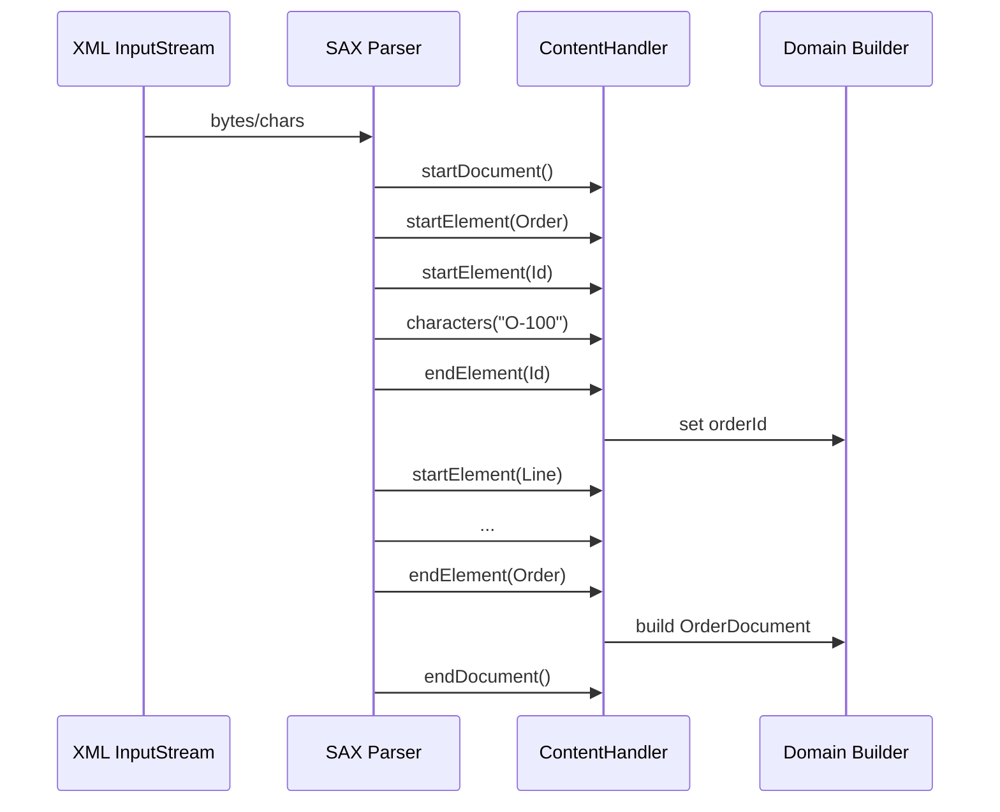
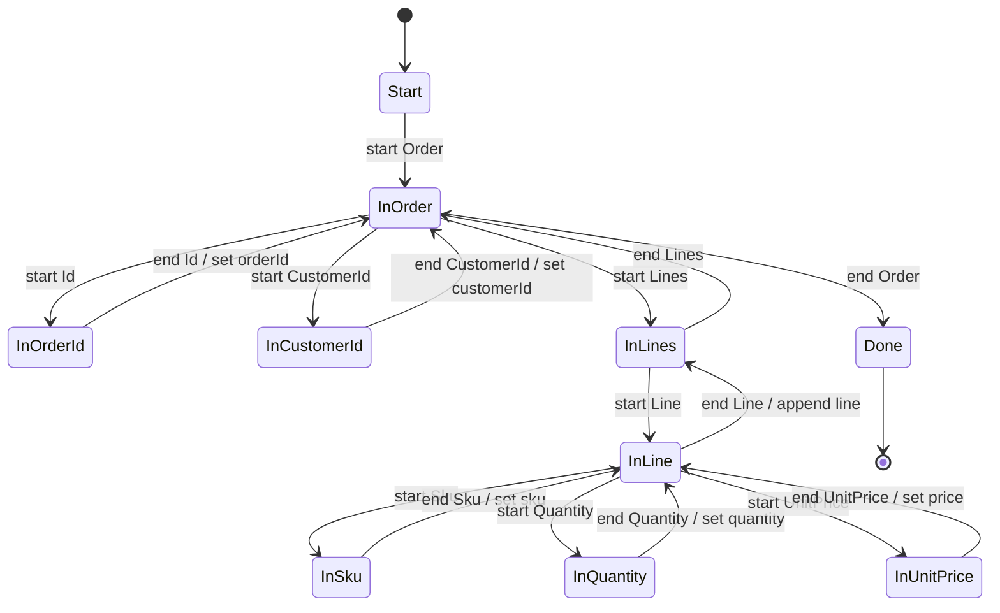
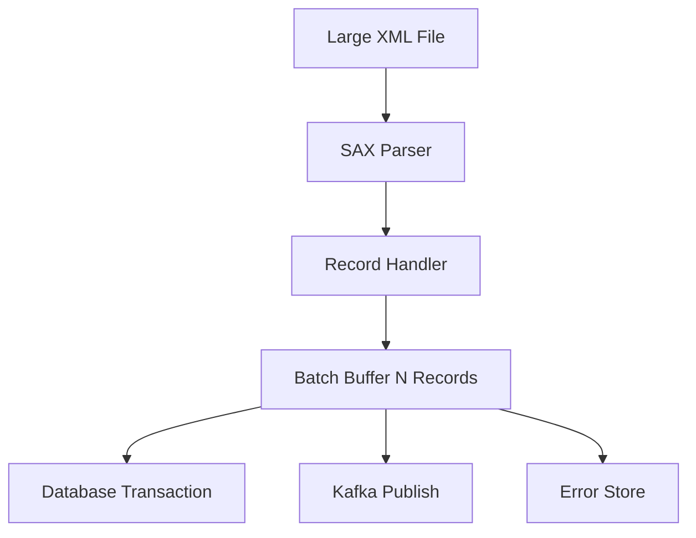

# Part 006 — SAX Event-Driven Processing

## Tujuan Part Ini

Part ini membahas **SAX** sebagai pendekatan event-driven untuk memproses XML di Java.

Jika DOM bertanya:

> “Bagaimana jika seluruh XML kita ubah menjadi tree lalu dibaca kapan saja?”

SAX bertanya:

> “Bagaimana jika parser berjalan sekali dari awal sampai akhir, lalu memanggil handler setiap menemukan event?”

SAX adalah API lama, tetapi tetap relevan untuk production karena:

- memory footprint bisa rendah;
- cocok untuk file besar;
- cocok untuk ekstraksi subset field;
- cocok untuk pipeline batch dan regulatory feed;
- cocok untuk validasi streaming;
- tidak memaksa object graph penuh;
- dapat dibuat sangat cepat jika state machine-nya rapi.

Namun SAX juga punya trade-off besar:

- tidak random access;
- logic mudah berubah menjadi spaghetti handler;
- state harus dikelola manual;
- text callback bisa dipanggil beberapa kali untuk satu logical text value;
- error handling dan context stack harus dirancang eksplisit.

Target part ini: kamu mampu membangun parser SAX yang aman, deterministik, observable, dan maintainable.

---

## Posisi Part Ini dalam Framework Kaufman

Part ini adalah latihan kuat untuk tahap **learn enough to self-correct**.

SAX memaksa kamu memahami XML sebagai aliran event, bukan hanya object tree. Ini memperkuat skill penting:

- membaca struktur XML secara incremental;
- menjaga state dengan disiplin;
- mendeteksi invalid structure lebih awal;
- mengelola error dengan line/column;
- membedakan parser event, domain event, dan business command;
- membuat memory behavior yang predictable.

Dalam Kaufman-style deliberate practice, SAX adalah latihan bagus karena feedback-nya cepat: jika state machine salah, parser langsung menghasilkan data salah atau error struktur.

---

## Mental Model: SAX adalah Push Event Stream

SAX parser membaca dokumen dan mendorong event ke handler.



DOM memberi kamu tree. SAX memberi kamu event:

```text
startDocument
startPrefixMapping
startElement
characters
endElement
endPrefixMapping
endDocument
```

Kamu tidak bertanya “ambil element X dari dokumen”. Kamu berkata “ketika parser melewati element X dalam context Y, kumpulkan data”.

---

## Java API yang Terlibat

SAX di Java biasanya memakai:

```text
javax.xml.parsers.SAXParserFactory
javax.xml.parsers.SAXParser
org.xml.sax.XMLReader
org.xml.sax.helpers.DefaultHandler
org.xml.sax.ContentHandler
org.xml.sax.Attributes
org.xml.sax.ErrorHandler
org.xml.sax.SAXParseException
org.xml.sax.InputSource
```

`SAXParserFactory` mengkonfigurasi dan membuat parser SAX. `SAXParser` membungkus `XMLReader`. Saat parsing, parser memanggil method handler seperti `startElement`, `characters`, dan `endElement`.

---

## SAX vs DOM: Perbedaan Operasional

| Dimensi | DOM | SAX |
|---|---|---|
| Model | Tree di memory | Event stream |
| Access | Random access | Forward-only |
| Memory | Tinggi, tergantung ukuran dokumen | Rendah, tergantung state handler |
| Mutation | Mudah | Tidak cocok |
| Query | Mudah dengan traversal/XPath | Manual state machine |
| Payload besar | Buruk | Cocok |
| Debuggability | Mudah inspeksi tree | Butuh trace event/context |
| Code style | Object navigation | Callback/stateful |
| Error early | Setelah node terbangun atau saat parse | Sangat early |

Rule praktis:

> Gunakan SAX ketika ukuran payload besar atau data yang dibutuhkan bisa diproses secara forward-only.

---

## Secure SAX Parser Factory

Seperti DOM, SAX harus di-hardening.

```java
import javax.xml.XMLConstants;
import javax.xml.parsers.ParserConfigurationException;
import javax.xml.parsers.SAXParser;
import javax.xml.parsers.SAXParserFactory;

public final class SaxFactories {

    private SaxFactories() {
    }

    public static SAXParserFactory secureNamespaceAwareFactory() {
        SAXParserFactory factory = SAXParserFactory.newInstance();
        factory.setNamespaceAware(true);
        factory.setXIncludeAware(false);
        factory.setValidating(false);

        setFeature(factory, XMLConstants.FEATURE_SECURE_PROCESSING, true);
        setFeature(factory, "http://apache.org/xml/features/disallow-doctype-decl", true);
        setFeature(factory, "http://xml.org/sax/features/external-general-entities", false);
        setFeature(factory, "http://xml.org/sax/features/external-parameter-entities", false);
        setFeature(factory, "http://apache.org/xml/features/nonvalidating/load-external-dtd", false);

        return factory;
    }

    public static SAXParser newSecureSaxParser() {
        try {
            return secureNamespaceAwareFactory().newSAXParser();
        } catch (ParserConfigurationException | org.xml.sax.SAXException ex) {
            throw new IllegalStateException("Cannot create secure SAX parser", ex);
        }
    }

    private static void setFeature(SAXParserFactory factory, String feature, boolean value) {
        try {
            factory.setFeature(feature, value);
        } catch (ParserConfigurationException | org.xml.sax.SAXNotRecognizedException |
                 org.xml.sax.SAXNotSupportedException ex) {
            throw new IllegalStateException("Required SAX feature not supported: " + feature, ex);
        }
    }
}
```

Setelah parser dibuat, kamu juga bisa harden `XMLReader`:

```java
SAXParser parser = SaxFactories.newSecureSaxParser();
XMLReader reader = parser.getXMLReader();
reader.setEntityResolver((publicId, systemId) -> new InputSource(new StringReader("")));
reader.setErrorHandler(new ThrowingSaxErrorHandler());
```

Error handler:

```java
import org.xml.sax.ErrorHandler;
import org.xml.sax.SAXException;
import org.xml.sax.SAXParseException;

public final class ThrowingSaxErrorHandler implements ErrorHandler {
    @Override
    public void warning(SAXParseException exception) throws SAXException {
        throw enrich("XML warning", exception);
    }

    @Override
    public void error(SAXParseException exception) throws SAXException {
        throw enrich("XML error", exception);
    }

    @Override
    public void fatalError(SAXParseException exception) throws SAXException {
        throw enrich("XML fatal error", exception);
    }

    private SAXException enrich(String category, SAXParseException ex) {
        return new SAXException("%s at line=%d column=%d: %s".formatted(
                category,
                ex.getLineNumber(),
                ex.getColumnNumber(),
                ex.getMessage()
        ), ex);
    }
}
```

---

## Minimal SAX Handler

Contoh XML:

```xml
<Order xmlns="urn:example:order:v1">
    <Id>O-100</Id>
</Order>
```

Handler sederhana:

```java
import org.xml.sax.Attributes;
import org.xml.sax.SAXException;
import org.xml.sax.helpers.DefaultHandler;

public final class MinimalOrderHandler extends DefaultHandler {
    private static final String NS = "urn:example:order:v1";

    private boolean insideId;
    private final StringBuilder text = new StringBuilder();
    private String orderId;

    @Override
    public void startElement(String uri, String localName, String qName, Attributes attributes) {
        if (NS.equals(uri) && "Id".equals(localName)) {
            insideId = true;
            text.setLength(0);
        }
    }

    @Override
    public void characters(char[] ch, int start, int length) {
        if (insideId) {
            text.append(ch, start, length);
        }
    }

    @Override
    public void endElement(String uri, String localName, String qName) {
        if (NS.equals(uri) && "Id".equals(localName)) {
            orderId = text.toString().trim();
            insideId = false;
        }
    }

    public String orderId() {
        return orderId;
    }
}
```

Parser usage:

```java
public String parseOrderId(InputStream input) {
    try {
        SAXParser parser = SaxFactories.newSecureSaxParser();
        MinimalOrderHandler handler = new MinimalOrderHandler();
        parser.parse(input, handler);
        return handler.orderId();
    } catch (Exception ex) {
        throw new XmlParsingException("Cannot parse order id", ex);
    }
}
```

Ini cukup untuk demo, tetapi belum cukup untuk production karena:

- `insideId` tidak membedakan `Order/Id` dan `Line/Id`;
- duplicate Id tidak dicegah;
- missing Id tidak dicek;
- text callback fragmentation sudah di-handle, tetapi context belum kuat;
- error tidak menyertakan path/context.

---

## Penting: `characters()` Bisa Dipanggil Berkali-kali

Jangan asumsikan satu element text menghasilkan satu callback.

Salah:

```java
@Override
public void characters(char[] ch, int start, int length) {
    currentText = new String(ch, start, length);
}
```

Benar:

```java
@Override
public void characters(char[] ch, int start, int length) {
    if (capturingText) {
        textBuffer.append(ch, start, length);
    }
}
```

Parser boleh membagi character data menjadi beberapa event karena buffer internal, entity boundary, CDATA, atau implementasi parser.

Invariant:

> Text value selesai hanya saat `endElement` dari element target tercapai.

---

## Context Stack: Fondasi SAX yang Maintainable

Boolean flag cepat rusak saat struktur makin kompleks. Gunakan stack.

```java
import java.util.ArrayDeque;
import java.util.Deque;

public final class ElementPath {
    private final Deque<QNameKey> stack = new ArrayDeque<>();

    public void push(String namespaceUri, String localName) {
        stack.addLast(new QNameKey(namespaceUri, localName));
    }

    public QNameKey pop() {
        return stack.removeLast();
    }

    public QNameKey current() {
        return stack.peekLast();
    }

    public boolean endsWith(QNameKey... suffix) {
        if (suffix.length > stack.size()) {
            return false;
        }
        QNameKey[] values = stack.toArray(QNameKey[]::new);
        int offset = values.length - suffix.length;
        for (int i = 0; i < suffix.length; i++) {
            if (!values[offset + i].equals(suffix[i])) {
                return false;
            }
        }
        return true;
    }

    public String asDebugPath() {
        return stack.stream()
                .map(q -> "{" + q.namespaceUri() + "}" + q.localName())
                .reduce((a, b) -> a + "/" + b)
                .orElse("/");
    }

    public int depth() {
        return stack.size();
    }

    public void clear() {
        stack.clear();
    }

    public void popExpecting(QNameKey expected) throws org.xml.sax.SAXException {
        QNameKey actual = stack.removeLast();
        if (!actual.equals(expected)) {
            throw new org.xml.sax.SAXException("Expected to close " + expected + " but closed " + actual);
        }
    }
}

public record QNameKey(String namespaceUri, String localName) {
}
```

Usage di handler:

```java
private final ElementPath path = new ElementPath();

@Override
public void startElement(String uri, String localName, String qName, Attributes attributes) {
    path.push(uri, localName);
}

@Override
public void endElement(String uri, String localName, String qName) throws SAXException {
    QNameKey ended = path.pop();
    if (!ended.equals(new QNameKey(uri, localName))) {
        throw new SAXException("Parser path mismatch at " + path.asDebugPath());
    }
}
```

Meskipun parser well-formed XML seharusnya menjaga matching start/end, path stack tetap berguna untuk business extraction.

---

## Production SAX Extractor: Order Parser

Target XML:

```xml
<Order xmlns="urn:example:order:v1">
    <Id>O-100</Id>
    <CustomerId>C-9</CustomerId>
    <Lines>
        <Line>
            <Sku>SKU-1</Sku>
            <Quantity>2</Quantity>
            <UnitPrice currency="USD">12.50</UnitPrice>
        </Line>
    </Lines>
</Order>
```

Domain:

```java
public record OrderDocument(
        String orderId,
        String customerId,
        List<OrderLine> lines
) {
}

public record OrderLine(
        String sku,
        int quantity,
        BigDecimal unitPrice,
        String currency
) {
}
```

Handler:

```java
import org.xml.sax.Attributes;
import org.xml.sax.SAXException;
import org.xml.sax.helpers.DefaultHandler;

import java.math.BigDecimal;
import java.util.ArrayList;
import java.util.List;

public final class OrderSaxHandler extends DefaultHandler {
    private static final String NS = "urn:example:order:v1";

    private static final QNameKey ORDER = new QNameKey(NS, "Order");
    private static final QNameKey ORDER_ID = new QNameKey(NS, "Id");
    private static final QNameKey CUSTOMER_ID = new QNameKey(NS, "CustomerId");
    private static final QNameKey LINES = new QNameKey(NS, "Lines");
    private static final QNameKey LINE = new QNameKey(NS, "Line");
    private static final QNameKey SKU = new QNameKey(NS, "Sku");
    private static final QNameKey QUANTITY = new QNameKey(NS, "Quantity");
    private static final QNameKey UNIT_PRICE = new QNameKey(NS, "UnitPrice");

    private final ElementPath path = new ElementPath();
    private final StringBuilder text = new StringBuilder();

    private String orderId;
    private String customerId;
    private final List<OrderLine> lines = new ArrayList<>();

    private String currentSku;
    private Integer currentQuantity;
    private BigDecimal currentUnitPrice;
    private String currentCurrency;

    private boolean capturingText;

    @Override
    public void startDocument() {
        path.clear();
        text.setLength(0);
        orderId = null;
        customerId = null;
        lines.clear();
    }

    @Override
    public void startElement(String uri, String localName, String qName, Attributes attributes) throws SAXException {
        QNameKey current = new QNameKey(uri, localName);
        path.push(uri, localName);

        if (path.endsWith(ORDER, LINES, LINE)) {
            startLine();
            return;
        }

        if (isTextField(current)) {
            capturingText = true;
            text.setLength(0);
        }

        if (path.endsWith(ORDER, LINES, LINE, UNIT_PRICE)) {
            currentCurrency = requiredAttribute(attributes, "currency");
        }
    }

    @Override
    public void characters(char[] ch, int start, int length) {
        if (capturingText) {
            text.append(ch, start, length);
        }
    }

    @Override
    public void endElement(String uri, String localName, String qName) throws SAXException {
        QNameKey current = new QNameKey(uri, localName);

        if (capturingText && isTextField(current)) {
            applyText(current, text.toString().trim());
            text.setLength(0);
            capturingText = false;
        }

        if (path.endsWith(ORDER, LINES, LINE)) {
            endLine();
        }

        path.popExpecting(current);
    }

    @Override
    public void endDocument() throws SAXException {
        if (orderId == null || orderId.isBlank()) {
            throw new SAXException("Missing required Order/Id");
        }
        if (customerId == null || customerId.isBlank()) {
            throw new SAXException("Missing required Order/CustomerId");
        }
        if (lines.isEmpty()) {
            throw new SAXException("Order must contain at least one Line");
        }
    }

    public OrderDocument result() {
        return new OrderDocument(orderId, customerId, List.copyOf(lines));
    }

    private void startLine() {
        currentSku = null;
        currentQuantity = null;
        currentUnitPrice = null;
        currentCurrency = null;
    }

    private void endLine() throws SAXException {
        if (currentSku == null || currentSku.isBlank()) {
            throw new SAXException("Missing Line/Sku at " + path.asDebugPath());
        }
        if (currentQuantity == null) {
            throw new SAXException("Missing Line/Quantity at " + path.asDebugPath());
        }
        if (currentUnitPrice == null) {
            throw new SAXException("Missing Line/UnitPrice at " + path.asDebugPath());
        }
        if (currentCurrency == null || currentCurrency.isBlank()) {
            throw new SAXException("Missing UnitPrice/@currency at " + path.asDebugPath());
        }

        lines.add(new OrderLine(currentSku, currentQuantity, currentUnitPrice, currentCurrency));
    }

    private boolean isTextField(QNameKey current) {
        return current.equals(ORDER_ID)
                || current.equals(CUSTOMER_ID)
                || current.equals(SKU)
                || current.equals(QUANTITY)
                || current.equals(UNIT_PRICE);
    }

    private void applyText(QNameKey current, String value) throws SAXException {
        if (path.endsWith(ORDER, ORDER_ID)) {
            if (orderId != null) {
                throw new SAXException("Duplicate Order/Id");
            }
            orderId = requireNonBlank(value, "Order/Id");
            return;
        }

        if (path.endsWith(ORDER, CUSTOMER_ID)) {
            if (customerId != null) {
                throw new SAXException("Duplicate Order/CustomerId");
            }
            customerId = requireNonBlank(value, "Order/CustomerId");
            return;
        }

        if (path.endsWith(ORDER, LINES, LINE, SKU)) {
            currentSku = requireNonBlank(value, "Line/Sku");
            return;
        }

        if (path.endsWith(ORDER, LINES, LINE, QUANTITY)) {
            currentQuantity = parseInt(value, "Line/Quantity");
            return;
        }

        if (path.endsWith(ORDER, LINES, LINE, UNIT_PRICE)) {
            currentUnitPrice = parseDecimal(value, "Line/UnitPrice");
        }
    }

    private String requiredAttribute(Attributes attributes, String localName) throws SAXException {
        String value = attributes.getValue("", localName);
        if (value == null || value.isBlank()) {
            throw new SAXException("Missing required attribute '" + localName + "' at " + path.asDebugPath());
        }
        return value;
    }

    private String requireNonBlank(String value, String field) throws SAXException {
        if (value == null || value.isBlank()) {
            throw new SAXException("Missing required text for " + field + " at " + path.asDebugPath());
        }
        return value;
    }

    private int parseInt(String value, String field) throws SAXException {
        try {
            return Integer.parseInt(requireNonBlank(value, field));
        } catch (NumberFormatException ex) {
            throw new SAXException("Invalid integer for " + field + ": " + value, ex);
        }
    }

    private BigDecimal parseDecimal(String value, String field) throws SAXException {
        try {
            return new BigDecimal(requireNonBlank(value, field));
        } catch (NumberFormatException ex) {
            throw new SAXException("Invalid decimal for " + field + ": " + value, ex);
        }
    }
}
```

Parser service:

```java
public final class OrderSaxParser {

    public OrderDocument parse(InputStream input) {
        try {
            SAXParser parser = SaxFactories.newSecureSaxParser();
            OrderSaxHandler handler = new OrderSaxHandler();
            parser.parse(input, handler);
            return handler.result();
        } catch (Exception ex) {
            throw new XmlParsingException("Cannot parse order XML with SAX", ex);
        }
    }
}
```

---

## State Machine Design

SAX handler sebenarnya adalah state machine.



Ada dua pendekatan umum:

1. **Path-based state** — current meaning ditentukan dari suffix path.
2. **Enum-based state** — current state eksplisit sebagai enum.

Path-based lebih fleksibel untuk XML hierarchical. Enum-based lebih ketat untuk grammar sederhana.

Contoh enum:

```java
public enum OrderParseState {
    START,
    IN_ORDER,
    IN_ORDER_ID,
    IN_CUSTOMER_ID,
    IN_LINES,
    IN_LINE,
    IN_SKU,
    IN_QUANTITY,
    IN_UNIT_PRICE,
    DONE
}
```

Gunakan enum jika:

- struktur sangat ketat;
- error transition harus eksplisit;
- kamu ingin membuat parser seperti finite-state automaton.

Gunakan path jika:

- struktur banyak nested;
- namespace/localName adalah sumber kebenaran;
- kamu butuh path untuk error message;
- XML punya extension elements.

---

## Handling Unknown Elements

Dalam enterprise XML, unknown element bisa berarti:

- extension yang diizinkan;
- versi schema baru;
- partner mengirim field tidak dikenal;
- typo;
- malicious payload;
- backward compatibility scenario.

Policy harus eksplisit.

### Strict Mode

Reject unknown element:

```java
private void validateAllowedElement(QNameKey current) throws SAXException {
    if (!ALLOWED_ELEMENTS.contains(current)) {
        throw new SAXException("Unexpected element " + current + " at " + path.asDebugPath());
    }
}
```

### Extension Mode

Izinkan unknown di extension point:

```java
private boolean insideExtensionPoint() {
    return path.endsWith(ORDER, new QNameKey(NS, "Extensions"));
}
```

Policy yang baik:

- strict untuk command/message yang mengubah state bisnis;
- extension-tolerant untuk metadata/annotation area yang memang didesain extension;
- log/metric unknown extension agar evolution terlihat;
- jangan silent-ignore unknown element di area core business.

---

## Streaming Large File: Process per Record, Jangan Kumpulkan Semua

Misalnya file besar:

```xml
<Orders xmlns="urn:example:order:v1">
    <Order>...</Order>
    <Order>...</Order>
    <Order>...</Order>
</Orders>
```

Jika handler mengumpulkan semua `OrderDocument` ke list, memory tetap bisa membesar. Untuk file besar, proses record satu per satu.

```java
public interface OrderConsumer {
    void accept(OrderDocument order) throws Exception;
}
```

Handler:

```java
public final class StreamingOrdersSaxHandler extends DefaultHandler {
    private final OrderConsumer consumer;
    private OrderSaxHandler currentOrderHandler;
    private int orderDepth;

    public StreamingOrdersSaxHandler(OrderConsumer consumer) {
        this.consumer = consumer;
    }

    @Override
    public void startElement(String uri, String localName, String qName, Attributes attributes) throws SAXException {
        if (isOrderStart(uri, localName) && currentOrderHandler == null) {
            currentOrderHandler = new OrderSaxHandler();
            currentOrderHandler.startDocument();
            orderDepth = 0;
        }

        if (currentOrderHandler != null) {
            orderDepth++;
            currentOrderHandler.startElement(uri, localName, qName, attributes);
        }
    }

    @Override
    public void characters(char[] ch, int start, int length) throws SAXException {
        if (currentOrderHandler != null) {
            currentOrderHandler.characters(ch, start, length);
        }
    }

    @Override
    public void endElement(String uri, String localName, String qName) throws SAXException {
        if (currentOrderHandler != null) {
            currentOrderHandler.endElement(uri, localName, qName);
            orderDepth--;

            if (orderDepth == 0) {
                currentOrderHandler.endDocument();
                OrderDocument order = currentOrderHandler.result();
                consume(order);
                currentOrderHandler = null;
            }
        }
    }

    private boolean isOrderStart(String uri, String localName) {
        return "urn:example:order:v1".equals(uri) && "Order".equals(localName);
    }

    private void consume(OrderDocument order) throws SAXException {
        try {
            consumer.accept(order);
        } catch (Exception ex) {
            throw new SAXException("Order consumer failed for orderId=" + order.orderId(), ex);
        }
    }
}
```

This pattern enables:

- parse huge file;
- validate per record;
- write per record;
- batch every N records;
- stop early on fatal error;
- keep memory bounded.

But be careful: side effects during parsing require idempotency and checkpointing.

---

## Backpressure dan Transaction Boundary

SAX parser is push-based. Once parsing starts, handler gets called by parser. If consumer is slow, parser blocks inside handler.

For batch ingestion:



Design options:

| Pattern | Kapan Dipakai | Risiko |
|---|---|---|
| Consume per record | Low latency, simple | Banyak transaksi kecil. |
| Batch N records | Throughput lebih baik | Partial failure lebih kompleks. |
| Write staging table | Audit dan replay kuat | Butuh storage tambahan. |
| Publish to queue | Decouple downstream | Ordering/idempotency perlu desain. |
| Stop on first error | Strict regulatory input | Satu record buruk menghentikan file. |
| Collect record errors | Partner batch correction | Harus punya error report lengkap. |

Untuk regulatory atau financial batch, biasanya lebih defensible jika ingestion menghasilkan:

- file-level audit record;
- record-level status;
- raw payload reference;
- validation error report;
- replay mechanism.

---

## Locator: Line dan Column untuk Business Error

SAX menyediakan `Locator` lewat `setDocumentLocator`.

```java
import org.xml.sax.Locator;

public abstract class LocatingHandler extends DefaultHandler {
    private Locator locator;

    @Override
    public void setDocumentLocator(Locator locator) {
        this.locator = locator;
    }

    protected String location() {
        if (locator == null) {
            return "line=?, column=?";
        }
        return "line=" + locator.getLineNumber() + ", column=" + locator.getColumnNumber();
    }
}
```

Gunakan untuk error bisnis:

```java
throw new SAXException("Missing Line/Sku at " + path.asDebugPath() + " (" + location() + ")");
```

Ini sangat penting saat partner mengirim file 500 MB. Tanpa line/column, debugging menjadi mahal.

---

## Attributes Handling

`Attributes` menyediakan access berdasarkan index, qName, atau namespace/localName.

Untuk unnamespaced attribute:

```java
String value = attributes.getValue("", "currency");
```

Untuk namespaced attribute:

```java
String href = attributes.getValue("http://www.w3.org/1999/xlink", "href");
```

Jangan bergantung pada prefix:

```java
// Fragile
attributes.getValue("xlink:href");
```

Attribute order tidak boleh dianggap stabil.

---

## Prefix Mapping Events

SAX menyediakan:

```java
@Override
public void startPrefixMapping(String prefix, String uri) {
}

@Override
public void endPrefixMapping(String prefix) {
}
```

Biasanya kamu tidak perlu memakainya untuk extraction karena `startElement` sudah memberikan `uri` dan `localName` jika namespace-aware. Namun prefix mapping berguna untuk:

- preserving prefixes;
- custom serializer;
- canonicalization/debugging;
- detecting namespace policy violation;
- logging namespace context.

Contoh policy:

```java
@Override
public void startPrefixMapping(String prefix, String uri) throws SAXException {
    if ("".equals(prefix) && !ALLOWED_DEFAULT_NAMESPACES.contains(uri)) {
        throw new SAXException("Unexpected default namespace: " + uri);
    }
}
```

Tapi hati-hati: prefix adalah syntactic binding, bukan identity element. Jangan jadikan prefix sebagai business identity.

---

## Validation dengan SAX

SAX dapat divalidasi saat parse via schema.

```java
SchemaFactory schemaFactory = SchemaFactory.newInstance(XMLConstants.W3C_XML_SCHEMA_NS_URI);
schemaFactory.setProperty(XMLConstants.ACCESS_EXTERNAL_DTD, "");
schemaFactory.setProperty(XMLConstants.ACCESS_EXTERNAL_SCHEMA, "");
Schema schema = schemaFactory.newSchema(schemaFile);

SAXParserFactory factory = SaxFactories.secureNamespaceAwareFactory();
factory.setSchema(schema);
SAXParser parser = factory.newSAXParser();
parser.parse(input, handler);
```

Kelebihan:

- tidak perlu DOM;
- invalid document gagal saat streaming;
- cocok untuk batch besar;
- error line/column tersedia.

Trade-off:

- schema selection harus diketahui sebelum parse atau dilakukan dengan pre-scan/root sniffing;
- error aggregation lebih kompleks;
- validation dan extraction coupling harus dijaga.

Pattern production:

```text
root sniff -> choose schema -> streaming validate + extract -> record-level processing
```

Root sniff bisa dilakukan dengan SAX/StAX kecil yang hanya membaca root element.

---

## SAX untuk Early Termination

Kadang kamu hanya butuh membaca root, version, atau satu field. SAX bisa berhenti lebih awal dengan exception kontrol.

```java
public final class StopParsingException extends SAXException {
}
```

Handler:

```java
@Override
public void endElement(String uri, String localName, String qName) throws SAXException {
    if (path.endsWith(ORDER, ORDER_ID)) {
        orderId = text.toString().trim();
        throw new StopParsingException();
    }
    path.popExpecting(new QNameKey(uri, localName));
}
```

Parser wrapper:

```java
try {
    parser.parse(input, handler);
} catch (StopParsingException done) {
    return handler.orderId();
}
```

Gunakan secara hati-hati:

- jangan swallow fatal parse error sebagai stop normal;
- bedakan exception kontrol internal dari error XML;
- dokumentasikan bahwa input belum diparse penuh.

Untuk security validation, early termination tidak membuktikan seluruh dokumen aman/valid. Ia hanya cocok untuk metadata sniffing.

---

## SAX dan Error Aggregation

Default SAX biasanya fail-fast. Namun untuk partner batch, kamu mungkin ingin mengumpulkan error per record dan lanjut.

Strategi:

1. SAX parser membaca file besar.
2. Handler mengenali record boundary.
3. Untuk setiap record, handler membangun minimal record object atau error object.
4. Jika satu record invalid secara semantic, simpan error, reset record state, lanjut record berikutnya.
5. Jika XML not well-formed, parsing harus berhenti karena stream tidak dapat dipercaya.

Pembedaan penting:

| Error Type | Bisa Lanjut? | Alasan |
|---|---:|---|
| XML not well-formed | Tidak | Parser tidak bisa menjamin struktur berikutnya. |
| XSD invalid global | Biasanya tidak | Tergantung validator dan recovery. |
| Record semantic invalid | Bisa | Jika record boundary masih diketahui. |
| Downstream DB transient | Mungkin | Butuh retry/checkpoint. |
| Unknown required namespace | Tidak | Contract mismatch. |

SAX handler untuk error aggregation harus sangat disiplin agar tidak menghasilkan partial state ambigu.

---

## Observability untuk SAX Pipeline

Metrics minimal:

```text
xml.sax.parse.duration
xml.sax.records.total
xml.sax.records.success
xml.sax.records.failed
xml.sax.bytes.read
xml.sax.validation.errors
xml.sax.first_error.line
xml.sax.partner
xml.sax.document_type
xml.sax.schema_version
```

Structured log example:

```json
{
  "event": "xml_record_failed",
  "stage": "sax_extract",
  "documentId": "file-2026-07-02-001",
  "partnerId": "partner-a",
  "recordIndex": 2819,
  "path": "{urn:example:order:v1}Orders/{urn:example:order:v1}Order/{urn:example:order:v1}Lines/{urn:example:order:v1}Line",
  "line": 91822,
  "column": 17,
  "errorCode": "MISSING_REQUIRED_FIELD",
  "field": "Sku"
}
```

Untuk file besar, logging setiap record sukses bisa terlalu mahal. Gunakan metrics dan sampling. Log detail untuk error, summary untuk sukses.

---

## Performance Notes

SAX biasanya cepat dan hemat memory, tetapi handler bisa membuatnya lambat.

Hal yang sering membunuh performance:

- membuat `String` untuk setiap event yang tidak diperlukan;
- path string dibangun setiap callback;
- regex berat di setiap element;
- logging di hot path;
- menyimpan semua record ke list;
- BigDecimal parsing terlalu awal jika tidak perlu;
- downstream call synchronous per tiny field;
- exception dipakai untuk control flow terlalu sering selain early stop yang disengaja.

Optimasi aman:

- hanya capture text untuk field target;
- gunakan `StringBuilder` reuse;
- pakai QNameKey constants;
- process per record;
- batch downstream write;
- buat debug path hanya saat error;
- benchmark dengan payload realistis.

---

## SAX Handler Design Rules

### Rule 1 — Handler Harus Punya Scope Jelas

Handler yang parse semua jenis dokumen akan jadi sulit diuji. Lebih baik:

```text
OrderFileHandler
  -> OrderRecordHandler
     -> LineHandler? optional decomposition
```

### Rule 2 — Jangan Campur Parsing dan Business Side Effect Terlalu Dalam

Buruk:

```java
@Override
public void endElement(...) {
    if (endLine) {
        database.insert(line);
        kafka.send(event);
        billing.charge(...);
    }
}
```

Lebih baik:

```java
handler -> emits domain record -> application service handles transaction/outbox
```

### Rule 3 — State Reset Harus Eksplisit

Setiap start/end record harus membersihkan state.

### Rule 4 — Missing dan Duplicate Harus Dicek

Jangan hanya overwrite field jika element muncul dua kali.

### Rule 5 — Namespace URI adalah Identity

Prefix tidak boleh jadi dasar logic.

### Rule 6 — Well-formed Error Berhenti

Jangan mencoba recovery dari XML stream yang tidak well-formed kecuali kamu sedang membangun parser khusus, bukan memakai SAX normal.

### Rule 7 — Handler Tidak Boleh Reused Sembarangan

Buat handler baru per parse atau pastikan `startDocument` reset semua state.

---

## SAX Anti-Patterns

### Anti-Pattern 1: Boolean Flag Explosion

```java
boolean inOrder;
boolean inLine;
boolean inPrice;
boolean inDiscount;
boolean inTax;
```

Jika flag makin banyak, gunakan path stack atau handler decomposition.

### Anti-Pattern 2: Ignoring `uri` dan `localName`

```java
if ("Id".equals(qName)) { ... }
```

Ini fragile terhadap prefix dan namespace.

### Anti-Pattern 3: One Handler for Entire Enterprise Schema

Satu handler ribuan baris akan sulit diuji dan rentan state leak. Pecah berdasarkan record atau aggregate.

### Anti-Pattern 4: Accumulate Entire File

Jika kamu menyimpan semua record di list, kamu kehilangan manfaat streaming.

### Anti-Pattern 5: Characters Assignment Instead of Append

`characters()` bisa multiple callback. Selalu append saat capture.

### Anti-Pattern 6: Silent Unknown Element

Mengabaikan unknown element tanpa policy bisa menyembunyikan contract drift.

### Anti-Pattern 7: No Locator

Tanpa line/column, production support untuk file besar sangat mahal.

---

## Testing SAX Parser

### Test Text Fragmentation

Kamu bisa memanggil handler langsung untuk memastikan append logic benar.

```java
@Test
void appendsFragmentedCharacters() throws Exception {
    MinimalOrderHandler handler = new MinimalOrderHandler();

    handler.startDocument();
    handler.startElement("urn:example:order:v1", "Order", "Order", emptyAttributes());
    handler.startElement("urn:example:order:v1", "Id", "Id", emptyAttributes());
    handler.characters("O-".toCharArray(), 0, 2);
    handler.characters("100".toCharArray(), 0, 3);
    handler.endElement("urn:example:order:v1", "Id", "Id");
    handler.endElement("urn:example:order:v1", "Order", "Order");
    handler.endDocument();

    assertEquals("O-100", handler.orderId());
}
```

### Test Prefix Independence

```java
@Test
void prefixDoesNotMatter() {
    String xml = """
            <x:Order xmlns:x="urn:example:order:v1">
                <x:Id>O-100</x:Id>
                <x:CustomerId>C-1</x:CustomerId>
                <x:Lines>
                    <x:Line>
                        <x:Sku>SKU-1</x:Sku>
                        <x:Quantity>1</x:Quantity>
                        <x:UnitPrice currency="USD">10.00</x:UnitPrice>
                    </x:Line>
                </x:Lines>
            </x:Order>
            """;

    OrderDocument order = new OrderSaxParser().parse(toInputStream(xml));
    assertEquals("O-100", order.orderId());
}
```

### Test Nested Same Name

```xml
<Order xmlns="urn:example:order:v1">
    <Id>ORDER-1</Id>
    <Lines>
        <Line>
            <Id>LINE-1</Id>
            ...
        </Line>
    </Lines>
</Order>
```

Pastikan parser tidak mengambil `Line/Id` sebagai `Order/Id`. Ini menguji path-based logic.

### Test XXE Rejection

```java
@Test
void rejectsDoctype() {
    String xml = """
            <!DOCTYPE foo [ <!ENTITY xxe SYSTEM "file:///etc/passwd"> ]>
            <foo>&xxe;</foo>
            """;

    assertThrows(XmlParsingException.class, () -> new OrderSaxParser().parse(toInputStream(xml)));
}
```

### Test Large File Does Not Accumulate

Buat synthetic file 100.000 order. Consumer hanya count record. Pastikan memory stabil.

```java
AtomicInteger count = new AtomicInteger();
StreamingOrdersSaxHandler handler = new StreamingOrdersSaxHandler(order -> count.incrementAndGet());
parser.parse(input, handler);
assertEquals(100_000, count.get());
```

---

## Production Readiness Checklist untuk SAX

- [ ] Parser factory centralized.
- [ ] Namespace aware aktif.
- [ ] External entities disabled.
- [ ] External DTD disabled.
- [ ] XInclude disabled.
- [ ] Secure processing aktif.
- [ ] EntityResolver default-deny.
- [ ] ErrorHandler throws enriched error.
- [ ] Locator digunakan untuk diagnostics.
- [ ] Handler baru per parse atau full reset di `startDocument`.
- [ ] `characters()` append, bukan overwrite.
- [ ] Context path atau enum state eksplisit.
- [ ] Unknown element policy eksplisit.
- [ ] Missing field dicek.
- [ ] Duplicate field dicek.
- [ ] Namespace URI/localName dipakai, bukan prefix.
- [ ] Record-level processing tidak mengumpulkan seluruh file jika file besar.
- [ ] Side effect dipisahkan dari parser jika perlu transaction control.
- [ ] Metrics record count, failure count, parse duration tersedia.
- [ ] Test prefix variation, nested same-name element, fragmented text, XXE, large file tersedia.

---

## Latihan Deliberate Practice

### Drill 1 — Event Trace

Buat handler yang hanya mencetak event:

```text
startDocument
startElement {ns}Order
characters "..."
endElement {ns}Order
endDocument
```

Parse XML pretty-printed dan amati whitespace character events.

### Drill 2 — Build Path Stack

Implementasikan `ElementPath` sendiri. Tambahkan method:

- `push`
- `popExpecting`
- `endsWith`
- `asDebugPath`
- `depth`

Gunakan untuk membedakan `Order/Id` dan `Line/Id`.

### Drill 3 — Fragmented Text Simulation

Panggil `characters()` manual dua sampai tiga kali untuk satu field dan buktikan hasil tetap benar.

### Drill 4 — Large File Streaming

Generate file dengan 100.000 `<Order>`. Parser harus:

- count record;
- tidak menyimpan semua record;
- menghasilkan summary;
- gagal dengan line/column jika satu record invalid.

### Drill 5 — Strict vs Extension Mode

Tambahkan `<Extensions>` di schema mental kamu. Unknown element di luar `<Extensions>` harus gagal. Unknown element di dalam `<Extensions>` boleh lewat tetapi dihitung metric-nya.

### Drill 6 — Record-Level Error Report

Buat parser batch yang menghasilkan:

```java
public record RecordError(
        int recordIndex,
        int line,
        int column,
        String path,
        String errorCode,
        String message
) {
}
```

Bedakan error structural fatal dan semantic per-record.

---

## Ringkasan

SAX adalah tool penting untuk XML production karena memberi processing forward-only dengan memory rendah. Ia cocok untuk file besar, batch feed, extraction subset field, dan validasi streaming. Namun SAX menukar kenyamanan DOM dengan tanggung jawab state management.

Mental model yang harus tertanam:

- SAX parser mendorong event ke handler.
- Handler adalah state machine.
- `characters()` bisa dipanggil berkali-kali untuk satu logical text.
- Namespace URI + local name adalah identity, bukan prefix.
- Context stack membuat parsing maintainable.
- Locator membuat incident debugging realistis.
- Untuk file besar, proses record per record; jangan akumulasi seluruh file.
- Unknown element policy harus eksplisit.
- Side effect harus didesain dengan transaction, idempotency, dan checkpointing.
- Parser hardening sama wajibnya seperti di DOM.

Jika DOM membuat kamu nyaman membaca XML, SAX membuat kamu disiplin memproses XML sebagai stream. Skill ini sangat penting untuk sistem enterprise yang menerima file partner besar, report regulatory, atau feed historical yang tidak mungkin dimuat penuh ke memory.

---

## Referensi Resmi dan Lanjutan

- Oracle Java SE 25 API — `SAXParserFactory`
- Oracle Java SE 25 API — `SAXParser`
- Oracle Java SE 25 API — `org.xml.sax`
- SAX Project Quickstart
- Oracle JAXP Security Guide
- OWASP XML External Entity Prevention Cheat Sheet
- W3C XML and Namespaces specifications
