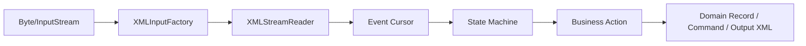
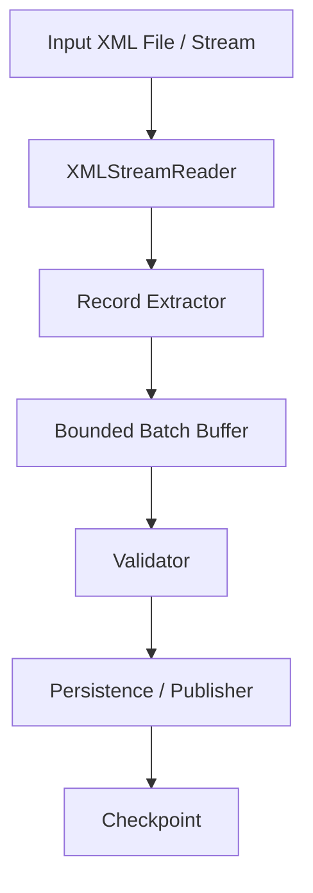

# Part 007 — StAX Streaming Processing

## Tujuan Part Ini

Part ini membahas **StAX** atau **Streaming API for XML** sebagai model parsing dan writing XML yang sangat penting untuk sistem Java production.

Kita sudah melihat dua ekstrem:

- **DOM**: nyaman karena seluruh XML menjadi tree di memory, tetapi mahal untuk payload besar.
- **SAX**: hemat memory dan cepat, tetapi control flow tersebar di callback.

StAX berada di tengah:

- tetap **streaming** seperti SAX;
- tetapi bersifat **pull-based**, sehingga aplikasi yang menentukan kapan membaca event berikutnya;
- dapat digunakan untuk **read** dan **write** XML;
- lebih natural untuk business extraction dibanding SAX callback;
- sangat cocok untuk batch XML besar, partner feed, regulatory file, invoice bundle, statement file, dan message envelope.

Mental model utamanya:

> StAX bukan XML object mapper. StAX adalah cursor/event stream API. Kita tidak “memiliki dokumen”; kita “melewati dokumen sekali” sambil mengambil keputusan.

Di production, StAX sering menjadi pilihan utama saat dokumen terlalu besar untuk DOM tetapi business logic terlalu kompleks untuk SAX callback sederhana.

---

## 1. Posisi StAX dalam Java XML Stack

StAX berada dalam package:

```java
javax.xml.stream
```

API utamanya:

| Komponen | Fungsi |
|---|---|
| `XMLInputFactory` | Factory untuk membuat reader. |
| `XMLStreamReader` | Cursor API: low-level, forward-only XML reader. |
| `XMLEventReader` | Iterator event object API. Lebih object-oriented, sedikit lebih verbose. |
| `XMLOutputFactory` | Factory untuk writer. |
| `XMLStreamWriter` | Cursor-style XML writer. |
| `XMLEventWriter` | Event-style XML writer. |
| `XMLResolver` | Resolusi external entity/resource. Di production sebaiknya default-deny. |
| `XMLReporter` | Reporting non-fatal XML issues. |
| `Location` | Line/column/systemId diagnostic. |

Secara praktis:

- pakai `XMLStreamReader` untuk throughput dan control penuh;
- pakai `XMLEventReader` bila ingin memodelkan event sebagai object dan membangun pipeline/filter;
- pakai `XMLStreamWriter` untuk generate XML besar tanpa membangun DOM.

---

## 2. Cursor API vs Event API

StAX menyediakan dua gaya.

### 2.1 Cursor API

Cursor API memakai `XMLStreamReader`.

Reader berada pada satu event saat ini. Aplikasi memanggil:

```java
int event = reader.next();
```

lalu membaca informasi event saat ini:

```java
if (event == XMLStreamConstants.START_ELEMENT) {
    String localName = reader.getLocalName();
}
```

Cursor API cocok ketika:

- payload besar;
- kita ingin overhead minimal;
- parsing logic cukup jelas;
- kita ingin explicit state machine;
- kita perlu skip subtree atau extract record berulang.

### 2.2 Event API

Event API memakai `XMLEventReader`.

Aplikasi membaca object event:

```java
while (eventReader.hasNext()) {
    XMLEvent event = eventReader.nextEvent();
}
```

Event API cocok ketika:

- kita ingin pipeline yang lebih mudah dikomposisi;
- kita perlu pass event ke layer lain;
- readability lebih penting daripada overhead minimal;
- kita membangun filter/transform kecil berbasis event.

### 2.3 Production Rule

Untuk production XML service, default awal yang masuk akal:

- **read large feed**: `XMLStreamReader`;
- **write large output**: `XMLStreamWriter`;
- **complex transformation**: XSLT, bukan manual writer;
- **random access small document**: DOM;
- **pure validation**: XSD validation pipeline;
- **query expression**: XPath/XQuery.

---

## 3. Mental Model: Stream, Cursor, State, Action

StAX memaksa kita berpikir dalam empat layer:



Event cursor hanya memberi sinyal:

- start document;
- start element;
- namespace declaration;
- attribute;
- characters;
- CDATA;
- comment;
- processing instruction;
- end element;
- end document.

Business meaning tidak ada di parser. Business meaning muncul dari **state machine** milik aplikasi.

Contoh:

```xml
<orders>
  <order id="O-1001">
    <customer>C-77</customer>
    <total currency="USD">120.50</total>
  </order>
</orders>
```

Parser hanya melihat:

```text
START_ELEMENT orders
START_ELEMENT order
ATTRIBUTE id=O-1001
START_ELEMENT customer
CHARACTERS C-77
END_ELEMENT customer
START_ELEMENT total
ATTRIBUTE currency=USD
CHARACTERS 120.50
END_ELEMENT total
END_ELEMENT order
END_ELEMENT orders
```

Aplikasi harus menyimpulkan:

```text
New order record:
- id = O-1001
- customer = C-77
- total = 120.50 USD
```

Ini alasan mengapa StAX code production harus rapi: tanpa state discipline, StAX berubah menjadi `if-else` spaghetti.

---

## 4. Kapan StAX Cocok

Gunakan StAX ketika minimal satu kondisi berikut benar:

1. XML terlalu besar untuk DOM.
2. Kita hanya butuh subset dokumen.
3. Dokumen berisi banyak record berulang.
4. Pipeline bersifat sequential.
5. Kita perlu generate XML besar secara streaming.
6. Kita perlu low memory footprint.
7. Kita ingin control flow lebih natural daripada SAX.
8. Kita ingin parse sambil route, validate ringan, enrich, atau write output.

Contoh production use case:

| Use Case | Kenapa StAX Cocok |
|---|---|
| Import file invoice 2 GB | Tidak feasible memakai DOM. |
| Extract `<transaction>` dari bank statement | Record berulang dapat diproses satu per satu. |
| Convert partner feed ke canonical envelope | Bisa read-write streaming. |
| Split satu XML besar menjadi banyak message kecil | Bisa emit record saat closing element. |
| Audit ingestion dengan line number | `Location` dapat ditangkap saat event tertentu. |
| Redact PII dalam XML besar | Bisa copy stream sambil mengganti elemen tertentu. |

Jangan gunakan StAX sebagai default bila:

- dokumen kecil dan butuh random access kompleks;
- transformasi lebih cocok ditulis declarative dengan XSLT;
- query ad-hoc lebih cocok XPath/XQuery;
- schema-to-object mapping lebih penting daripada streaming;
- business rule butuh melihat seluruh dokumen sekaligus.

---

## 5. Secure XMLInputFactory Baseline

Jangan membuat StAX reader langsung tanpa hardening.

Contoh buruk:

```java
XMLInputFactory factory = XMLInputFactory.newFactory();
XMLStreamReader reader = factory.createXMLStreamReader(inputStream);
```

Masalahnya:

- DTD mungkin masih diaktifkan;
- external entity resolution bisa membuka SSRF/local file read risk;
- implementasi provider dapat berbeda;
- property support tidak selalu sama;
- tidak ada resolver default-deny;
- error diagnostics belum distandardkan.

Gunakan factory wrapper.

```java
package com.example.xml.stax;

import javax.xml.stream.XMLInputFactory;
import javax.xml.stream.XMLResolver;
import javax.xml.stream.XMLStreamException;

public final class SecureStaxFactory {

    private SecureStaxFactory() {
    }

    public static XMLInputFactory newInputFactory() {
        XMLInputFactory factory = XMLInputFactory.newFactory();

        setIfSupported(factory, XMLInputFactory.IS_NAMESPACE_AWARE, true);
        setIfSupported(factory, XMLInputFactory.IS_COALESCING, true);
        setIfSupported(factory, XMLInputFactory.SUPPORT_DTD, false);
        setIfSupported(factory, XMLInputFactory.IS_SUPPORTING_EXTERNAL_ENTITIES, false);

        factory.setXMLResolver(rejectingResolver());

        return factory;
    }

    private static XMLResolver rejectingResolver() {
        return (publicId, systemId, baseURI, namespace) -> {
            throw new XMLStreamException(
                "External XML resource access is disabled. " +
                "publicId=" + publicId + ", systemId=" + systemId
            );
        };
    }

    private static void setIfSupported(XMLInputFactory factory, String property, Object value) {
        try {
            factory.setProperty(property, value);
        } catch (IllegalArgumentException unsupported) {
            // In production, log this once at startup and assert behavior in integration tests.
            // Some providers do not support all properties.
        }
    }
}
```

Important nuance:

- `SUPPORT_DTD=false` mencegah DTD support bila provider mendukung property tersebut.
- `IS_SUPPORTING_EXTERNAL_ENTITIES=false` mencegah external entity expansion bila provider mendukungnya.
- `XMLResolver` default-deny adalah defense tambahan.
- Jangan mengandalkan satu flag saja.
- Test security behavior dengan payload XXE dan DTD bomb fixture.

Production posture:

```text
untrusted XML input => DTD disabled + external entities disabled + resolver deny + input size limit + parser limits + schema controls
```

---

## 6. Basic XMLStreamReader Loop

Contoh XML:

```xml
<?xml version="1.0" encoding="UTF-8"?>
<orders xmlns="urn:example:order:v1">
  <order id="O-1001">
    <customerId>C-77</customerId>
    <total currency="USD">120.50</total>
  </order>
  <order id="O-1002">
    <customerId>C-88</customerId>
    <total currency="EUR">75.00</total>
  </order>
</orders>
```

Minimal loop:

```java
XMLInputFactory factory = SecureStaxFactory.newInputFactory();

try (InputStream in = Files.newInputStream(Path.of("orders.xml"))) {
    XMLStreamReader reader = factory.createXMLStreamReader(in, "UTF-8");

    try {
        while (reader.hasNext()) {
            int event = reader.next();

            if (event == XMLStreamConstants.START_ELEMENT) {
                System.out.println("START " + reader.getName());
            } else if (event == XMLStreamConstants.CHARACTERS) {
                String text = reader.getText().trim();
                if (!text.isEmpty()) {
                    System.out.println("TEXT " + text);
                }
            } else if (event == XMLStreamConstants.END_ELEMENT) {
                System.out.println("END " + reader.getName());
            }
        }
    } finally {
        reader.close();
    }
}
```

Gunakan `reader.close()` karena reader dapat memegang resource provider internal. Namun tetap tutup `InputStream` dengan try-with-resources.

---

## 7. Namespace-Aware Matching

Kesalahan umum:

```java
if (reader.getLocalName().equals("order")) {
    // dangerous if multiple namespaces may contain order
}
```

Lebih aman:

```java
private static final String ORDER_NS = "urn:example:order:v1";

static boolean isStart(XMLStreamReader reader, String namespaceUri, String localName) {
    return reader.getEventType() == XMLStreamConstants.START_ELEMENT
        && namespaceUri.equals(reader.getNamespaceURI())
        && localName.equals(reader.getLocalName());
}
```

Pemakaian:

```java
if (isStart(reader, ORDER_NS, "order")) {
    String orderId = reader.getAttributeValue(null, "id");
}
```

Untuk attribute namespaced:

```java
String externalId = reader.getAttributeValue("urn:example:partner:v1", "externalId");
```

Ingat:

- default namespace berlaku untuk element, bukan unprefixed attribute;
- `getLocalName()` tidak cukup untuk contract enforcement;
- prefix tidak boleh menjadi basis business logic;
- namespace URI adalah identitas stabil;
- QName comparison harus explicit.

---

## 8. Extract Record Berulang dengan State Machine

Kita ingin membaca banyak `<order>` tanpa menyimpan semua dokumen.

Target domain:

```java
public record OrderRecord(
    String orderId,
    String customerId,
    String currency,
    BigDecimal total,
    int line,
    int column
) {
}
```

Extractor:

```java
package com.example.xml.stax;

import javax.xml.stream.XMLStreamConstants;
import javax.xml.stream.XMLStreamException;
import javax.xml.stream.XMLStreamReader;
import java.math.BigDecimal;
import java.util.ArrayList;
import java.util.List;

public final class OrderStaxExtractor {

    private static final String NS = "urn:example:order:v1";

    public List<OrderRecord> extract(XMLStreamReader reader) throws XMLStreamException {
        List<OrderRecord> result = new ArrayList<>();

        while (reader.hasNext()) {
            int event = reader.next();

            if (event == XMLStreamConstants.START_ELEMENT && is(reader, NS, "order")) {
                result.add(readOrder(reader));
            }
        }

        return result;
    }

    private OrderRecord readOrder(XMLStreamReader reader) throws XMLStreamException {
        String orderId = requiredAttribute(reader, null, "id");
        int line = reader.getLocation() != null ? reader.getLocation().getLineNumber() : -1;
        int column = reader.getLocation() != null ? reader.getLocation().getColumnNumber() : -1;

        String customerId = null;
        String currency = null;
        BigDecimal total = null;

        int depth = 1;

        while (reader.hasNext() && depth > 0) {
            int event = reader.next();

            if (event == XMLStreamConstants.START_ELEMENT) {
                depth++;

                if (is(reader, NS, "customerId")) {
                    customerId = readElementText(reader, NS, "customerId");
                    depth--; // readElementText consumes the matching END_ELEMENT
                } else if (is(reader, NS, "total")) {
                    currency = requiredAttribute(reader, null, "currency");
                    String totalText = readElementText(reader, NS, "total");
                    total = new BigDecimal(totalText);
                    depth--; // readElementText consumes the matching END_ELEMENT
                } else {
                    skipSubtree(reader);
                    depth--; // skipSubtree consumes the matching END_ELEMENT
                }
            } else if (event == XMLStreamConstants.END_ELEMENT) {
                depth--;
            }
        }

        return new OrderRecord(
            orderId,
            requireValue(customerId, "customerId", line, column),
            currency,
            requireValue(total, "total", line, column),
            line,
            column
        );
    }

    private static String readElementText(
        XMLStreamReader reader,
        String expectedNamespace,
        String expectedLocalName
    ) throws XMLStreamException {
        if (!is(reader, expectedNamespace, expectedLocalName)) {
            throw new XMLStreamException("Expected element " + expectedLocalName, reader.getLocation());
        }

        StringBuilder text = new StringBuilder();
        int depth = 1;

        while (reader.hasNext() && depth > 0) {
            int event = reader.next();

            if (event == XMLStreamConstants.START_ELEMENT) {
                throw new XMLStreamException(
                    "Nested element is not allowed inside " + expectedLocalName,
                    reader.getLocation()
                );
            } else if (event == XMLStreamConstants.CHARACTERS || event == XMLStreamConstants.CDATA) {
                text.append(reader.getText());
            } else if (event == XMLStreamConstants.END_ELEMENT) {
                depth--;
            }
        }

        return text.toString().trim();
    }

    private static void skipSubtree(XMLStreamReader reader) throws XMLStreamException {
        int depth = 1;
        while (reader.hasNext() && depth > 0) {
            int event = reader.next();
            if (event == XMLStreamConstants.START_ELEMENT) {
                depth++;
            } else if (event == XMLStreamConstants.END_ELEMENT) {
                depth--;
            }
        }
    }

    private static boolean is(XMLStreamReader reader, String namespaceUri, String localName) {
        return namespaceUri.equals(reader.getNamespaceURI()) && localName.equals(reader.getLocalName());
    }

    private static String requiredAttribute(XMLStreamReader reader, String namespaceUri, String localName)
        throws XMLStreamException {
        String value = reader.getAttributeValue(namespaceUri, localName);
        if (value == null || value.isBlank()) {
            throw new XMLStreamException("Missing required attribute: " + localName, reader.getLocation());
        }
        return value;
    }

    private static <T> T requireValue(T value, String field, int line, int column) throws XMLStreamException {
        if (value == null) {
            throw new XMLStreamException("Missing required field: " + field + " near line=" + line + ", column=" + column);
        }
        return value;
    }
}
```

Lesson:

> Manual streaming parser memberi performa dan control, tetapi correctness harus dijaga dengan test fixture dan domain builder yang jelas. Untuk record kompleks, hindari constructor panjang yang rawan salah urutan field.

---

## 9. Cleaner Pattern: Builder per Record

Agar tidak salah urutan field, gunakan builder internal.

```java
public final class OrderBuilder {
    String orderId;
    String customerId;
    String currency;
    BigDecimal total;
    int line;
    int column;

    OrderRecord build() throws XMLStreamException {
        if (orderId == null || orderId.isBlank()) {
            throw new XMLStreamException("order.id is required at line=" + line);
        }
        if (customerId == null || customerId.isBlank()) {
            throw new XMLStreamException("customerId is required at line=" + line);
        }
        if (currency == null || currency.isBlank()) {
            throw new XMLStreamException("total.currency is required at line=" + line);
        }
        if (total == null) {
            throw new XMLStreamException("total value is required at line=" + line);
        }
        return new OrderRecord(orderId, customerId, currency, total, line, column);
    }
}
```

Lalu parser mengisi builder:

```java
private OrderRecord readOrder(XMLStreamReader reader) throws XMLStreamException {
    OrderBuilder builder = new OrderBuilder();
    builder.orderId = requiredAttribute(reader, null, "id");
    builder.line = reader.getLocation().getLineNumber();
    builder.column = reader.getLocation().getColumnNumber();

    int depth = 1;
    while (reader.hasNext() && depth > 0) {
        int event = reader.next();

        if (event == XMLStreamConstants.START_ELEMENT) {
            depth++;
            if (is(reader, NS, "customerId")) {
                builder.customerId = readElementText(reader, NS, "customerId");
                depth--;
            } else if (is(reader, NS, "total")) {
                builder.currency = requiredAttribute(reader, null, "currency");
                builder.total = new BigDecimal(readElementText(reader, NS, "total"));
                depth--;
            } else {
                skipSubtree(reader);
                depth--;
            }
        } else if (event == XMLStreamConstants.END_ELEMENT) {
            depth--;
        }
    }

    return builder.build();
}
```

Production preference:

- gunakan builder untuk record kompleks;
- validasi field di `build()`;
- simpan line/column di builder;
- jangan passing 12 argument ke constructor;
- jangan campur parsing, mapping, dan persistence dalam satu method.

---

## 10. Streaming Callback per Record

Jangan selalu return `List<T>`.

Untuk file besar, `List<T>` mengalahkan tujuan streaming.

Lebih baik:

```java
@FunctionalInterface
public interface RecordConsumer<T> {
    void accept(T record) throws Exception;
}
```

Extractor:

```java
public void extract(XMLStreamReader reader, RecordConsumer<OrderRecord> consumer) throws Exception {
    while (reader.hasNext()) {
        int event = reader.next();

        if (event == XMLStreamConstants.START_ELEMENT && is(reader, NS, "order")) {
            OrderRecord order = readOrder(reader);
            consumer.accept(order);
        }
    }
}
```

Pemakaian:

```java
extractor.extract(reader, order -> {
    validator.validate(order);
    repository.insert(order);
    audit.logImported(order.orderId(), order.line(), order.column());
});
```

Tetapi hati-hati:

- jangan melakukan DB insert satu per satu untuk jutaan record;
- gunakan batching;
- gunakan transaction boundary yang masuk akal;
- simpan checkpoint jika file sangat besar;
- pisahkan parse error, validation error, dan persistence error.

Pattern batch:

```java
public final class BatchingConsumer<T> implements RecordConsumer<T>, AutoCloseable {
    private final int batchSize;
    private final List<T> buffer = new ArrayList<>();
    private final Consumer<List<T>> batchHandler;

    public BatchingConsumer(int batchSize, Consumer<List<T>> batchHandler) {
        this.batchSize = batchSize;
        this.batchHandler = batchHandler;
    }

    @Override
    public void accept(T record) {
        buffer.add(record);
        if (buffer.size() >= batchSize) {
            flush();
        }
    }

    public void flush() {
        if (!buffer.isEmpty()) {
            batchHandler.accept(List.copyOf(buffer));
            buffer.clear();
        }
    }

    @Override
    public void close() {
        flush();
    }
}
```

---

## 11. Error Model untuk StAX Parser

StAX parser production perlu error taxonomy.

Jangan hanya lempar `XMLStreamException` ke atas tanpa context.

Buat domain exception:

```java
public final class XmlImportException extends RuntimeException {
    private final String fileName;
    private final int line;
    private final int column;
    private final String code;

    public XmlImportException(
        String code,
        String message,
        String fileName,
        int line,
        int column,
        Throwable cause
    ) {
        super(message, cause);
        this.code = code;
        this.fileName = fileName;
        this.line = line;
        this.column = column;
    }

    public String code() {
        return code;
    }

    public String fileName() {
        return fileName;
    }

    public int line() {
        return line;
    }

    public int column() {
        return column;
    }
}
```

Wrap StAX exception:

```java
static XmlImportException wrap(String fileName, String code, String message, XMLStreamException e) {
    int line = -1;
    int column = -1;

    if (e.getLocation() != null) {
        line = e.getLocation().getLineNumber();
        column = e.getLocation().getColumnNumber();
    }

    return new XmlImportException(code, message, fileName, line, column, e);
}
```

Error categories:

| Category | Meaning | Retriable? |
|---|---|---|
| `XML_NOT_WELL_FORMED` | XML syntax invalid. | No, unless upstream resends. |
| `XML_SECURITY_REJECTED` | DTD/entity/resource rejected. | No, unless contract changes. |
| `XML_CONTRACT_INVALID` | Required XML structure missing. | No. |
| `XML_SEMANTIC_INVALID` | XML parseable but domain rule fails. | Usually no. |
| `XML_PROCESSING_FAILED` | Internal bug/infrastructure failure. | Maybe. |
| `XML_PERSISTENCE_FAILED` | Downstream storage error. | Often yes. |

---

## 12. Skipping Subtrees Safely

Skipping unknown or irrelevant subtree is core StAX skill.

```java
static void skipSubtree(XMLStreamReader reader) throws XMLStreamException {
    if (reader.getEventType() != XMLStreamConstants.START_ELEMENT) {
        throw new IllegalStateException("skipSubtree requires START_ELEMENT");
    }

    int depth = 1;
    while (reader.hasNext() && depth > 0) {
        int event = reader.next();
        if (event == XMLStreamConstants.START_ELEMENT) {
            depth++;
        } else if (event == XMLStreamConstants.END_ELEMENT) {
            depth--;
        }
    }
}
```

Use cases:

- ignore extension point;
- skip unsupported optional section;
- extract only headers from large document;
- reject unknown element after logging location;
- fast-forward to next record.

Decision:

```text
unknown element in strict contract => fail
unknown element in extension point => skip
unknown element in partner-specific area => route to compatibility handler
```

Jangan diam-diam skip semua unknown element. Itu bisa menyembunyikan contract drift.

---

## 13. Reading Element Text: Built-in vs Custom

`XMLStreamReader` punya method:

```java
String text = reader.getElementText();
```

Method ini membaca text content element saat cursor berada di `START_ELEMENT` dan bergerak sampai matching `END_ELEMENT`.

Cocok untuk simple text element:

```java
if (is(reader, NS, "customerId")) {
    customerId = reader.getElementText().trim();
}
```

Namun custom method lebih baik bila:

- ingin melarang nested element;
- ingin custom whitespace policy;
- ingin line/column error yang lebih jelas;
- ingin limit panjang text;
- ingin capture CDATA behavior;
- ingin deteksi empty element berbeda dari missing element.

Production guard untuk panjang text:

```java
static String readLimitedElementText(XMLStreamReader reader, int maxChars)
    throws XMLStreamException {

    StringBuilder text = new StringBuilder();

    while (reader.hasNext()) {
        int event = reader.next();

        if (event == XMLStreamConstants.CHARACTERS || event == XMLStreamConstants.CDATA) {
            text.append(reader.getText());
            if (text.length() > maxChars) {
                throw new XMLStreamException("Element text exceeds limit: " + maxChars, reader.getLocation());
            }
        } else if (event == XMLStreamConstants.START_ELEMENT) {
            throw new XMLStreamException("Nested element is not allowed", reader.getLocation());
        } else if (event == XMLStreamConstants.END_ELEMENT) {
            return text.toString();
        }
    }

    throw new XMLStreamException("Unexpected end of document while reading text", reader.getLocation());
}
```

---

## 14. Streaming XML Writer

StAX bukan hanya parser. `XMLStreamWriter` sangat berguna untuk generate XML besar.

Contoh output:

```xml
<?xml version="1.0" encoding="UTF-8"?>
<orders xmlns="urn:example:order:v1">
  <order id="O-1001">
    <customerId>C-77</customerId>
    <total currency="USD">120.50</total>
  </order>
</orders>
```

Writer:

```java
XMLOutputFactory outputFactory = XMLOutputFactory.newFactory();

try (OutputStream out = Files.newOutputStream(Path.of("orders-out.xml"))) {
    XMLStreamWriter writer = outputFactory.createXMLStreamWriter(out, "UTF-8");
    try {
        writer.writeStartDocument("UTF-8", "1.0");
        writer.writeStartElement("orders");
        writer.writeDefaultNamespace(NS);

        for (OrderRecord order : orders) {
            writer.writeStartElement("order");
            writer.writeAttribute("id", order.orderId());

            writer.writeStartElement("customerId");
            writer.writeCharacters(order.customerId());
            writer.writeEndElement();

            writer.writeStartElement("total");
            writer.writeAttribute("currency", order.currency());
            writer.writeCharacters(order.total().toPlainString());
            writer.writeEndElement();

            writer.writeEndElement();
        }

        writer.writeEndElement();
        writer.writeEndDocument();
        writer.flush();
    } finally {
        writer.close();
    }
}
```

Key point:

- `writeCharacters()` melakukan escaping untuk text;
- `writeAttribute()` melakukan escaping untuk attribute;
- writer tidak otomatis menjamin semua struktur business valid;
- urutan `writeStartElement()` dan `writeEndElement()` adalah tanggung jawab aplikasi;
- namespace harus ditulis dengan disiplin;
- output determinism penting untuk test dan audit.

---

## 15. Safer Writer Wrapper

Manual writer mudah salah `writeEndElement()`.

Buat helper:

```java
public final class XmlWriting {

    private XmlWriting() {
    }

    public static void element(XMLStreamWriter writer, String localName, String text)
        throws XMLStreamException {
        writer.writeStartElement(localName);
        if (text != null) {
            writer.writeCharacters(text);
        }
        writer.writeEndElement();
    }

    public static void requiredElement(XMLStreamWriter writer, String localName, String text)
        throws XMLStreamException {
        if (text == null || text.isBlank()) {
            throw new IllegalArgumentException("Required XML element is blank: " + localName);
        }
        element(writer, localName, text);
    }
}
```

Pemakaian:

```java
writer.writeStartElement("order");
writer.writeAttribute("id", order.orderId());
XmlWriting.requiredElement(writer, "customerId", order.customerId());
writer.writeEndElement();
```

Untuk dokumen besar, helper kecil seperti ini mengurangi noise dan bug.

---

## 16. Read-Transform-Write Streaming Pattern

Salah satu kekuatan StAX adalah membaca XML lalu menulis XML lain tanpa DOM.

Contoh: redact `<nationalId>`.

```java
public void redactNationalId(InputStream in, OutputStream out) throws XMLStreamException {
    XMLInputFactory inputFactory = SecureStaxFactory.newInputFactory();
    XMLOutputFactory outputFactory = XMLOutputFactory.newFactory();

    XMLStreamReader reader = inputFactory.createXMLStreamReader(in, "UTF-8");
    XMLStreamWriter writer = outputFactory.createXMLStreamWriter(out, "UTF-8");

    try {
        while (reader.hasNext()) {
            int event = reader.next();

            switch (event) {
                case XMLStreamConstants.START_DOCUMENT -> writer.writeStartDocument("UTF-8", "1.0");
                case XMLStreamConstants.START_ELEMENT -> {
                    copyStartElement(reader, writer);

                    if ("nationalId".equals(reader.getLocalName())) {
                        reader.getElementText();
                        writer.writeCharacters("***REDACTED***");
                        writer.writeEndElement();
                    }
                }
                case XMLStreamConstants.CHARACTERS -> writer.writeCharacters(reader.getText());
                case XMLStreamConstants.CDATA -> writer.writeCData(reader.getText());
                case XMLStreamConstants.COMMENT -> writer.writeComment(reader.getText());
                case XMLStreamConstants.END_ELEMENT -> writer.writeEndElement();
                case XMLStreamConstants.END_DOCUMENT -> writer.writeEndDocument();
                default -> {
                    // Processing instructions, DTD, entity references, etc. should be handled by policy.
                }
            }
        }
        writer.flush();
    } finally {
        try {
            reader.close();
        } finally {
            writer.close();
        }
    }
}
```

Start element copy helper:

```java
static void copyStartElement(XMLStreamReader reader, XMLStreamWriter writer)
    throws XMLStreamException {

    String prefix = reader.getPrefix();
    String namespaceUri = reader.getNamespaceURI();
    String localName = reader.getLocalName();

    if (namespaceUri != null && !namespaceUri.isBlank()) {
        writer.writeStartElement(prefix == null ? "" : prefix, localName, namespaceUri);
    } else {
        writer.writeStartElement(localName);
    }

    for (int i = 0; i < reader.getNamespaceCount(); i++) {
        String nsPrefix = reader.getNamespacePrefix(i);
        String nsUri = reader.getNamespaceURI(i);
        if (nsPrefix == null) {
            writer.writeDefaultNamespace(nsUri);
        } else {
            writer.writeNamespace(nsPrefix, nsUri);
        }
    }

    for (int i = 0; i < reader.getAttributeCount(); i++) {
        String attrPrefix = reader.getAttributePrefix(i);
        String attrNs = reader.getAttributeNamespace(i);
        String attrLocal = reader.getAttributeLocalName(i);
        String attrValue = reader.getAttributeValue(i);

        if (attrNs != null && !attrNs.isBlank()) {
            writer.writeAttribute(attrPrefix == null ? "" : attrPrefix, attrNs, attrLocal, attrValue);
        } else {
            writer.writeAttribute(attrLocal, attrValue);
        }
    }
}
```

Caveat:

- copying namespace correctly is tricky;
- redaction by `localName` alone is unsafe in multi-namespace documents;
- mixed content can be subtle;
- if transformation becomes complex, use XSLT.

---

## 17. StAX + Validation

StAX sendiri bukan schema validator. Untuk XSD validation, Java menyediakan Validation API.

Ada beberapa pola:

### 17.1 Validate Before Stream Processing

```text
InputStream -> XSD Validator -> InputStream lagi -> StAX extraction
```

Masalah:

- input harus bisa dibaca dua kali;
- file besar perlu temporary storage;
- error cepat ditemukan sebelum business processing;
- pipeline lebih sederhana secara mental.

### 17.2 Validate and Process in One Pipeline

```text
InputStream -> XMLStreamReader/StAXSource -> Validator
```

`javax.xml.transform.stax.StAXSource` dapat membungkus `XMLStreamReader` untuk dipakai oleh API berbasis `Source`.

Namun jika validator mengonsumsi reader, posisi reader ikut maju. Jangan berharap bisa validate lalu lanjut membaca dari awal dengan reader yang sama.

### 17.3 Streaming Business Validation

```text
StAX parse -> record extracted -> domain validation -> batch persist
```

Ini bukan pengganti XSD, tetapi melengkapi:

- XSD memvalidasi struktur dan datatype XML;
- domain validator memvalidasi business invariant;
- persistence layer memvalidasi uniqueness/idempotency.

Production recommendation:

| Scenario | Strategy |
|---|---|
| Partner contract strict dan file tidak terlalu besar | Validate XSD first, then process. |
| File sangat besar, record independent | StAX extract record + per-record validation, dengan optional schema validation upstream. |
| Regulatory output | Generate XML, validate final output against XSD before submission. |
| Streaming low-latency gateway | Validate envelope first, process payload selectively. |

---

## 18. StAX + Backpressure-Friendly Design

StAX API sendiri blocking dan pull-based. Tetapi design-nya bisa backpressure-friendly karena aplikasi mengontrol kapan `next()` dipanggil.

Architecture:



Backpressure rules:

1. Jangan parse jauh lebih cepat dari downstream.
2. Gunakan bounded buffer.
3. Flush batch berdasarkan size dan memory.
4. Simpan checkpoint record index atau business key.
5. Pisahkan retry parse dari retry persist.
6. Jangan taruh seluruh record hasil parse dalam `List` untuk file besar.

Pseudo-flow:

```java
try (BatchingConsumer<OrderRecord> batch = new BatchingConsumer<>(500, repository::insertAll)) {
    extractor.extract(reader, order -> {
        domainValidator.validate(order);
        batch.accept(order);
    });
}
```

Jika downstream gagal di batch ke-200, kita perlu tahu:

- file apa;
- checksum file;
- batch number;
- first/last order id dalam batch;
- line/column record;
- apakah batch sudah partial persisted;
- apakah idempotency key tersedia.

---

## 19. Handling Large Files

Untuk file besar:

- jangan pakai `String` untuk seluruh XML;
- jangan pakai DOM;
- jangan return `List` besar;
- jangan log payload mentah;
- jangan parse dari `Reader` tanpa encoding policy jelas;
- jangan generate output ke memory;
- jangan lupa input size limit dan decompression limit.

Baseline:

```java
Path path = Path.of("partner-orders.xml");
long size = Files.size(path);

if (size > maxAllowedBytes) {
    throw new IllegalArgumentException("XML file is too large: " + size);
}

try (InputStream raw = Files.newInputStream(path);
     InputStream buffered = new BufferedInputStream(raw, 64 * 1024)) {

    XMLStreamReader reader = factory.createXMLStreamReader(buffered, "UTF-8");
    extractor.extract(reader, consumer);
}
```

Untuk compressed XML:

```java
try (InputStream file = Files.newInputStream(path);
     InputStream gzip = new GZIPInputStream(file);
     InputStream limited = new BoundedInputStream(gzip, maxUncompressedBytes)) {

    XMLStreamReader reader = factory.createXMLStreamReader(limited, "UTF-8");
    extractor.extract(reader, consumer);
}
```

Jika tidak ada `BoundedInputStream`, implementasi sendiri harus memastikan read berhenti setelah limit.

Reasoning:

> Security limit harus diterapkan pada ukuran setelah decompression, bukan hanya ukuran file `.gz`.

---

## 20. StAX Diagnostics

`XMLStreamReader#getLocation()` memberi lokasi parser.

```java
Location location = reader.getLocation();
int line = location.getLineNumber();
int column = location.getColumnNumber();
String systemId = location.getSystemId();
```

Gunakan untuk:

- error message;
- audit record source;
- rejected record report;
- reconciliation;
- support incident.

Contoh rejected record report:

```json
{
  "fileName": "partner-orders-2026-07-01.xml",
  "recordType": "order",
  "recordId": "O-1001",
  "line": 14288,
  "column": 9,
  "errorCode": "ORDER_TOTAL_INVALID",
  "message": "total must be greater than zero"
}
```

Jangan masukkan payload sensitif mentah ke log. Simpan:

- checksum;
- file id;
- correlation id;
- partner id;
- record key;
- line/column;
- normalized error code;
- redacted sample bila perlu.

---

## 21. Cursor State Invariants

StAX bug sering terjadi karena method mengubah posisi reader tanpa terlihat.

Contoh:

```java
String text = reader.getElementText();
```

Setelah method ini, cursor sudah berada di `END_ELEMENT`.

Maka setiap helper harus punya contract jelas:

```text
readOrder(reader)
Precondition : reader is positioned at START_ELEMENT order
Postcondition: reader is positioned at END_ELEMENT order or just after it? Decide and document.
```

Saran contract:

| Helper | Precondition | Postcondition |
|---|---|---|
| `readElementText` | Cursor at target `START_ELEMENT` | Cursor at matching `END_ELEMENT` |
| `skipSubtree` | Cursor at subtree `START_ELEMENT` | Cursor at matching `END_ELEMENT` |
| `readOrder` | Cursor at `START_ELEMENT order` | Cursor at `END_ELEMENT order` |
| `extract` | Cursor before/at document start | Cursor consumed to end document |

Jangan campur helper dengan postcondition berbeda tanpa nama yang jelas.

---

## 22. Event Constants Cheat Sheet

| Event | Meaning | Common Handling |
|---|---|---|
| `START_DOCUMENT` | Awal dokumen | Initialize metadata. |
| `START_ELEMENT` | Element mulai | Match QName, read attributes, enter state. |
| `CHARACTERS` | Text content | Accumulate if relevant. |
| `CDATA` | CDATA text | Treat as text or preserve depending policy. |
| `SPACE` | Ignorable whitespace | Usually ignore unless mixed content. |
| `COMMENT` | Comment | Ignore or preserve for document fidelity. |
| `PROCESSING_INSTRUCTION` | PI | Usually reject/ignore by policy. |
| `DTD` | DTD | Usually disabled/rejected for untrusted input. |
| `ENTITY_REFERENCE` | Entity reference | Avoid in untrusted input. |
| `END_ELEMENT` | Element selesai | Exit state, emit record if complete. |
| `END_DOCUMENT` | Dokumen selesai | Flush batch, close audit. |

---

## 23. State Machine Pattern yang Lebih Formal

Untuk parser kompleks, jangan hanya `if localName`.

Gunakan enum state.

```java
enum OrderParseState {
    OUTSIDE_ORDER,
    INSIDE_ORDER,
    INSIDE_CUSTOMER_ID,
    INSIDE_TOTAL,
    INSIDE_IGNORED_EXTENSION
}
```

Skeleton:

```java
OrderParseState state = OrderParseState.OUTSIDE_ORDER;
OrderBuilder builder = null;

while (reader.hasNext()) {
    int event = reader.next();

    switch (state) {
        case OUTSIDE_ORDER -> {
            if (event == XMLStreamConstants.START_ELEMENT && is(reader, NS, "order")) {
                builder = new OrderBuilder();
                builder.orderId = requiredAttribute(reader, null, "id");
                state = OrderParseState.INSIDE_ORDER;
            }
        }
        case INSIDE_ORDER -> {
            if (event == XMLStreamConstants.START_ELEMENT && is(reader, NS, "customerId")) {
                state = OrderParseState.INSIDE_CUSTOMER_ID;
            } else if (event == XMLStreamConstants.START_ELEMENT && is(reader, NS, "total")) {
                builder.currency = requiredAttribute(reader, null, "currency");
                state = OrderParseState.INSIDE_TOTAL;
            } else if (event == XMLStreamConstants.END_ELEMENT && is(reader, NS, "order")) {
                consumer.accept(builder.build());
                builder = null;
                state = OrderParseState.OUTSIDE_ORDER;
            }
        }
        case INSIDE_CUSTOMER_ID -> {
            if (event == XMLStreamConstants.CHARACTERS || event == XMLStreamConstants.CDATA) {
                builder.customerId = reader.getText().trim();
            } else if (event == XMLStreamConstants.END_ELEMENT && is(reader, NS, "customerId")) {
                state = OrderParseState.INSIDE_ORDER;
            }
        }
        case INSIDE_TOTAL -> {
            if (event == XMLStreamConstants.CHARACTERS || event == XMLStreamConstants.CDATA) {
                builder.total = new BigDecimal(reader.getText().trim());
            } else if (event == XMLStreamConstants.END_ELEMENT && is(reader, NS, "total")) {
                state = OrderParseState.INSIDE_ORDER;
            }
        }
        default -> throw new IllegalStateException("Unhandled parser state: " + state);
    }
}
```

Kelebihan:

- behavior eksplisit;
- mudah di-test per transition;
- mudah menambahkan diagnostics;
- mengurangi nested loop;
- cocok untuk format partner yang kompleks.

Kekurangan:

- verbose;
- perlu discipline;
- untuk XML sederhana, nested helper lebih readable.

---

## 24. StAX Anti-Patterns

### 24.1 Local Name Only Matching

```java
if ("id".equals(reader.getLocalName())) { ... }
```

Masalah:

- ambigu antar namespace;
- rawan collision;
- gagal ketika partner menambah extension.

### 24.2 Building Huge List

```java
List<OrderRecord> all = extractor.extract(reader);
```

Masalah:

- memory tetap membesar;
- streaming benefit hilang;
- latency flush tinggi.

### 24.3 Parser and Persistence in One Method

```java
if (isOrderEnd) {
    jdbcTemplate.update(...);
}
```

Masalah:

- sulit test;
- sulit retry;
- parsing error bercampur DB error;
- transaction boundary tidak jelas.

### 24.4 Silent Unknown Element Skip

```java
else {
    skipSubtree(reader);
}
```

Tanpa policy, ini menyembunyikan contract drift.

### 24.5 No Cursor Contract

Helper yang diam-diam mengonsumsi event menyebabkan parser lompat.

### 24.6 Writing XML by String Concatenation

```java
return "<name>" + userInput + "</name>";
```

Masalah:

- escaping salah;
- injection;
- encoding issue;
- namespace rusak;
- output tidak well-formed.

### 24.7 Assuming Writer Checks Everything

`XMLStreamWriter` membantu escaping text/attribute, tetapi tidak menggantikan schema validation atau domain validation.

---

## 25. Production Checklist

Sebelum memakai StAX di production, cek:

### Security

- DTD disabled.
- External entities disabled.
- XMLResolver default-deny.
- Input size limit.
- Decompression limit.
- Parser behavior tested dengan malicious fixture.

### Correctness

- Namespace-aware matching.
- Cursor helper contract terdokumentasi.
- Required field validation jelas.
- Unknown element policy jelas.
- Mixed content policy jelas.
- Encoding policy jelas.

### Performance

- Tidak membangun `List` besar.
- Batch downstream bounded.
- StAX factory reuse policy jelas.
- Reader/writer ditutup.
- Large payload tested.

### Operability

- Error code normalized.
- Line/column captured.
- File checksum captured.
- Record key captured.
- Rejected record report tersedia.
- Audit tidak menyimpan PII mentah.

### Testing

- Happy path.
- Missing required element.
- Invalid number/date.
- Unknown element strict mode.
- Extension element tolerant mode.
- Namespace mismatch.
- XXE payload.
- Large file.
- Fragmented character events.
- Writer output compared canonically.

---

## 26. Deliberate Practice

Latihan 1 — Basic extractor:

- Buat XML `<orders>` dengan 10 `<order>`.
- Extract `orderId`, `customerId`, `currency`, `total` memakai `XMLStreamReader`.
- Jangan return DOM.
- Simpan line/column.

Latihan 2 — Large file:

- Generate XML 1 juta order.
- Parse dengan StAX.
- Proses per batch 1.000 record.
- Pastikan memory tidak naik linear terhadap jumlah record.

Latihan 3 — Namespace mismatch:

- Buat dua namespace yang sama-sama memiliki `<order>`.
- Pastikan parser hanya menerima namespace contract yang benar.

Latihan 4 — Unknown element policy:

- Tambahkan `<extension>` yang boleh di-skip.
- Tambahkan `<unexpected>` yang harus gagal.
- Implementasikan policy berbeda.

Latihan 5 — Writer:

- Generate XML output dengan `XMLStreamWriter`.
- Validate output against XSD pada part berikutnya.
- Bandingkan output memakai canonical comparison, bukan string raw.

Latihan 6 — Security:

- Buat payload dengan DTD dan external entity.
- Pastikan parser menolak.
- Pastikan test gagal jika resolver tidak default-deny.

---

## 27. Ringkasan Mental Model

StAX adalah **streaming cursor**.

Gunakan ketika:

- XML besar;
- kita membaca sequentially;
- record bisa diproses satu per satu;
- memory harus stabil;
- callback SAX terlalu tidak nyaman;
- writer streaming dibutuhkan.

Ingat invariants:

1. Cursor bergerak maju saja.
2. Helper harus punya precondition/postcondition jelas.
3. Namespace URI, bukan prefix, adalah identitas contract.
4. `characters()` dapat muncul lebih dari sekali.
5. Unknown element harus punya policy.
6. XML writer bukan validator.
7. Streaming benefit hilang jika semua record dikumpulkan dalam memory.
8. Security hardening harus dilakukan sebelum parse input untrusted.

Dengan StAX, kita mulai masuk ke level production XML engineering: bukan sekadar membaca tag, tetapi membangun parser yang aman, hemat memory, observable, testable, dan bisa menjadi fondasi pipeline besar.

---

## Referensi

- Oracle Java SE API — `java.xml` module.
- Oracle Java SE API — `XMLStreamReader`.
- Oracle Java SE API — `XMLStreamWriter`.
- Oracle Java Tutorials — StAX API.
- OWASP XML External Entity Prevention Cheat Sheet.
