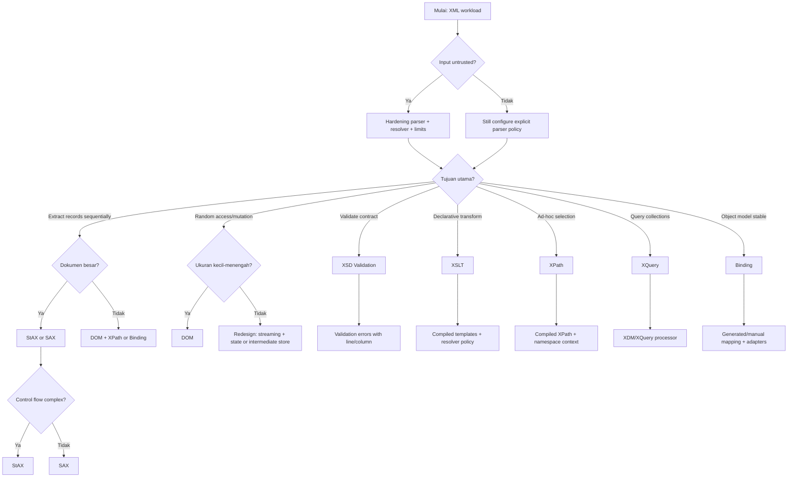
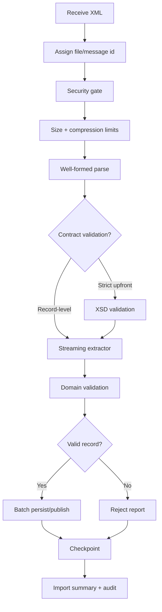
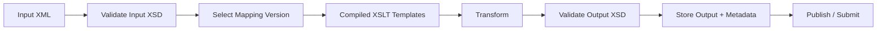
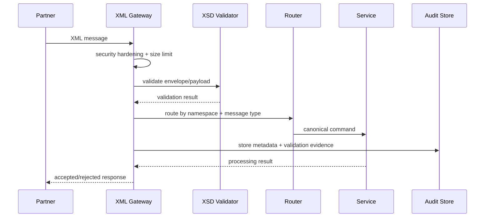

# Part 008 — Parser Selection and Processing Strategy

## Tujuan Part Ini

Part ini menjawab pertanyaan yang lebih penting daripada “bagaimana cara parse XML?”:

> Processing model apa yang paling tepat untuk masalah ini?

Engineer yang kuat tidak memilih DOM, SAX, StAX, XPath, XSD, XSLT, XQuery, atau binding karena familiar. Mereka memilih berdasarkan:

- ukuran dokumen;
- akses data;
- bentuk transformasi;
- kebutuhan validasi;
- latency;
- memory;
- auditability;
- evolusi contract;
- security;
- failure mode;
- skill tim;
- maintainability jangka panjang.

Part ini adalah decision framework.

Setelah part ini, kita punya peta praktis sebelum masuk ke XSD, XPath, XQuery, dan XSLT secara lebih dalam.

---

## 1. The Core Question

Pertanyaan yang salah:

```text
Parser XML mana yang terbaik?
```

Pertanyaan yang benar:

```text
Apa bentuk pekerjaan XML yang sedang dilakukan?
```

Ada beberapa bentuk pekerjaan:

| Work Type | Pertanyaan Praktis |
|---|---|
| Parse | Bagaimana membaca XML menjadi event/tree/object? |
| Validate | Apakah XML sesuai contract? |
| Extract | Field/record apa yang perlu diambil? |
| Query | Bagian mana yang memenuhi ekspresi tertentu? |
| Transform | Bagaimana mengubah XML menjadi format lain? |
| Generate | Bagaimana membuat XML valid dan deterministic? |
| Bind | Bagaimana XML dipetakan ke object domain/DTO? |
| Route | Ke mana dokumen/record dikirim berdasarkan isi? |
| Audit | Bagaimana membuktikan input-output processing? |
| Evolve | Bagaimana contract berubah tanpa merusak partner? |

Parser hanya salah satu komponen.

---

## 2. Processing Models dalam Java XML

Ringkasan:

| Model | Mental Model | Cocok Untuk | Hindari Untuk |
|---|---|---|---|
| DOM | XML menjadi tree object graph | Dokumen kecil-menengah, random access, mutation | File besar, high-throughput streaming |
| SAX | Push event callback | Large file extraction sederhana, low-level streaming | Business flow kompleks, readability tinggi |
| StAX | Pull event cursor | Large file extraction, streaming writer, controlled pipeline | Random access, complex global rules |
| XPath | Declarative node selection | Query kecil atas DOM/XDM, assertions, extraction targeted | Scan jutaan record besar tanpa strategy |
| XSD | Declarative contract validation | Structure/datatype validation, partner contract | Business rule kompleks lintas sistem |
| XSLT | Declarative transformation | XML-to-XML/HTML/text mapping, canonicalization | Imperative side-effect heavy logic |
| XQuery | Declarative XML query | Query/aggregation atas XML collections atau complex XML | Simple single-document extraction |
| Binding | XML <-> object mapping | Stable schema, object-centric business layer | Large streaming, mixed content, schema fleksibel |
| Hybrid | Kombinasi model | Production pipeline kompleks | Jika tanpa boundary jelas |

---

## 3. Decision Tree



Decision tree ini bukan hukum absolut. Ini guardrail agar pilihan awal tidak salah arah.

---

## 4. First Principle: Access Pattern Beats Tool Preference

XML document dapat dilihat dari beberapa access pattern.

### 4.1 Full Document Access

Kita perlu melihat seluruh dokumen:

- compare header dan footer total;
- validate cross-section consistency;
- mutate beberapa node berdasarkan node lain;
- render UI preview;
- apply XPath berulang;
- sign/canonicalize subset.

Cenderung cocok:

- DOM;
- XDM/Saxon tree;
- binding object model;
- XSLT/XQuery jika declarative.

Tidak cocok:

- raw SAX jika logic butuh global context;
- raw StAX jika harus banyak look-back/look-ahead.

### 4.2 Sequential Record Access

Dokumen berisi banyak record berulang:

```xml
<records>
  <record>...</record>
  <record>...</record>
  <record>...</record>
</records>
```

Kita bisa proses record satu per satu.

Cenderung cocok:

- StAX;
- SAX;
- streaming XSLT jika processor mendukung dan stylesheet streamable;
- batch validation/extraction hybrid.

Tidak cocok:

- DOM untuk jutaan record;
- binding seluruh file ke object graph besar.

### 4.3 Targeted Lookup

Kita hanya butuh beberapa value:

```text
/header/messageId
/header/sender
/body/order/@id
```

Cenderung cocok:

- XPath untuk dokumen kecil/menengah;
- StAX untuk file besar;
- SAX jika lookup sederhana.

Trade-off:

- XPath lebih expressive;
- StAX lebih predictable untuk memory;
- DOM + XPath mudah tetapi dapat mahal.

### 4.4 Declarative Mapping

Kita mengubah struktur XML:

```text
PartnerOrderXML -> CanonicalOrderXML
```

Cenderung cocok:

- XSLT;
- XQuery untuk query-heavy mapping;
- StAX manual untuk mapping sederhana/performance-critical;
- binding + mapper jika business object layer penting.

### 4.5 Object-Centric Business Logic

Domain logic ingin object:

```java
Order order = xmlMapper.read(...);
pricingEngine.price(order);
```

Cenderung cocok:

- JAXB/Jakarta XML Binding;
- generated classes from XSD;
- partial StAX extraction into domain record;
- DOM-to-domain mapper untuk dokumen kecil.

Tidak cocok:

- XSLT bila logic sangat imperative dan stateful;
- raw parser tersebar di business service.

---

## 5. Size and Memory Strategy

Ukuran XML bukan hanya bytes di disk.

DOM object graph bisa jauh lebih besar daripada ukuran file karena:

- setiap element menjadi object;
- attribute menjadi object;
- text node menjadi object/string;
- namespace metadata;
- internal parser structure;
- Java object overhead.

Practical guideline:

| XML Size | Default Thinking |
|---:|---|
| < 1 MB | DOM/XPath/binding biasanya aman jika volume rendah. |
| 1–20 MB | Evaluasi memory, concurrency, dan access pattern. |
| 20–100 MB | Mulai serius pertimbangkan StAX/SAX/hybrid. |
| > 100 MB | Jangan default DOM. Streaming atau staged processing. |
| GB-level | StAX/SAX/pipeline/checkpoint. |

Ini bukan angka absolut. Yang menentukan:

```text
memory impact = file size × object expansion × concurrency × retention time
```

Contoh:

```text
10 MB XML × 8x expansion × 100 concurrent requests = 8 GB heap pressure
```

Maka DOM yang aman di laptop bisa menjadi incident di service concurrent.

---

## 6. Latency vs Throughput

Ada dua profil berbeda.

### 6.1 Low-Latency Request/Response

Contoh:

- SOAP-like request;
- partner API XML payload;
- small regulatory lookup;
- synchronous validation gateway.

Prioritas:

- cepat fail;
- error message jelas;
- memory bounded;
- timeout;
- security hardening;
- no unbounded transform.

Pilihan umum:

- XSD validate envelope;
- DOM/XPath untuk dokumen kecil;
- StAX untuk extraction targeted;
- XSLT compiled template jika mapping declarative.

### 6.2 High-Throughput Batch

Contoh:

- nightly bank statement;
- telco CDR XML;
- large claims file;
- invoice bundle;
- government report ingestion.

Prioritas:

- streaming;
- batching;
- checkpoint;
- reject report;
- idempotency;
- resumability;
- audit trail.

Pilihan umum:

- StAX extraction;
- XSD validation stage;
- per-record domain validation;
- batch persistence;
- output generation with writer/XSLT;
- reconciliation summary.

---

## 7. Security as Selection Constraint

Processing model apa pun harus melewati security baseline.

Untrusted XML risks:

- XXE;
- SSRF through external entity/schema/stylesheet references;
- local file disclosure;
- XML bomb/entity expansion;
- oversized payload;
- decompression bomb;
- XPath injection;
- XSLT external resource access;
- dangerous extension functions;
- log leakage of sensitive payload.

Security constraints dapat mengubah pilihan tool.

Contoh:

| Requirement | Impact |
|---|---|
| External DTD forbidden | Parser harus disable DTD/entity resolver. |
| Stylesheet supplied by partner | Jangan execute blindly; treat as code/config. |
| XPath expression supplied by user | Parameterize or whitelist; avoid expression injection. |
| Huge compressed input | Need decompression limit and streaming. |
| PII in XML | Logging, audit, test fixture harus redacted. |
| Strict outbound compliance | Generate then validate against XSD. |

Decision rule:

> Jangan pilih processor yang tidak bisa dikunci sesuai threat model.

---

## 8. Maintainability and Team Skill

Tool paling powerful belum tentu paling maintainable untuk tim.

### DOM Maintainability

Pros:

- mudah dipahami;
- debugging mudah;
- banyak contoh;
- cocok untuk small document.

Cons:

- traversal verbose;
- namespace bugs umum;
- memory risk;
- mutation bisa merusak struktur.

### SAX Maintainability

Pros:

- efficient;
- low memory;
- cocok untuk parser sederhana.

Cons:

- callback state tersebar;
- sulit untuk logic kompleks;
- testing perlu disiplin.

### StAX Maintainability

Pros:

- control flow natural;
- streaming;
- read/write;
- cocok untuk state machine explicit.

Cons:

- cursor contract rawan;
- manual mapping verbose;
- correctness perlu fixture kuat.

### XPath Maintainability

Pros:

- concise;
- expressive;
- bagus untuk assertion/extraction kecil.

Cons:

- namespace context sering salah;
- expression bisa brittle;
- performance buruk jika dipakai sembarangan dalam loop besar.

### XSLT Maintainability

Pros:

- transform declarative;
- cocok untuk XML-to-XML;
- identity transform pattern powerful;
- stylesheet bisa versioned sebagai contract artifact.

Cons:

- tim perlu skill khusus;
- stylesheet spaghetti mungkin terjadi;
- debugging berbeda dari Java imperative;
- external resource policy harus dikunci.

### XQuery Maintainability

Pros:

- powerful untuk query XML;
- cocok untuk collections;
- FLWOR expressive.

Cons:

- lebih niche;
- processor dependency;
- governance query penting.

### Binding Maintainability

Pros:

- object-centric;
- baik untuk stable schema;
- business code lebih Java-like.

Cons:

- generated model bisa besar;
- schema evolution rumit;
- mixed content sulit;
- streaming benefit hilang jika bind seluruh dokumen.

---

## 9. Decision Matrix

| Constraint | DOM | SAX | StAX | XPath | XSD | XSLT | XQuery | Binding |
|---|---:|---:|---:|---:|---:|---:|---:|---:|
| Small XML | Excellent | Good | Good | Excellent | Excellent | Excellent | Good | Excellent |
| Huge XML | Poor | Excellent | Excellent | Risky | Good* | Depends | Depends | Poor* |
| Random access | Excellent | Poor | Poor | Good | N/A | Good | Good | Good |
| Streaming extraction | Poor | Excellent | Excellent | Poor | Good* | Depends | Depends | Poor* |
| Mutation | Good | Poor | Poor | Poor | N/A | Good | Good | Good |
| Declarative transform | Poor | Poor | Poor | Poor | N/A | Excellent | Good | Medium |
| Schema contract | Medium | Medium | Medium | Poor | Excellent | Medium | Medium | Good |
| Low memory | Poor | Excellent | Excellent | Medium | Medium | Depends | Depends | Poor* |
| Team familiarity | High | Medium | Medium | High | Medium | Medium | Low | Medium |
| Auditability | Medium | Medium | High | Medium | High | High | Medium | Medium |

Notes:

- `Good*` untuk XSD pada huge XML bergantung pipeline dan validator behavior.
- `Poor*` untuk binding seluruh dokumen; partial/unmarshal fragment dapat lebih baik.
- `Depends` untuk XSLT/XQuery karena processor dan stylesheet/query design sangat menentukan.

---

## 10. Workload Recipes

### 10.1 Small Request Validation and Extraction

Scenario:

```text
Synchronous XML request < 200 KB.
Need validate structure, extract messageId, route by type.
```

Recommended:

```text
InputStream
  -> Secure parser config
  -> XSD validation
  -> DOM parse
  -> XPath extraction
  -> route
```

Reasoning:

- small payload makes DOM acceptable;
- XSD gives contract error;
- XPath concise for route fields;
- diagnostics easy.

Avoid:

- raw string regex;
- XPath without namespace context;
- parsing twice without reason.

### 10.2 Large Batch Import

Scenario:

```text
Nightly partner file 5 GB.
Contains millions of transactions.
Need persist valid records and report rejected records.
```

Recommended:

```text
File stream
  -> checksum + size/decompression guard
  -> StAX record extraction
  -> per-record validation
  -> batch persist with idempotency
  -> reject report
  -> import summary
```

Reasoning:

- DOM impossible or dangerous;
- StAX pull loop allows bounded processing;
- record-level validation gives partial acceptance;
- line/column improves support.

Avoid:

- `List<Transaction>` for entire file;
- single huge transaction;
- logging full rejected payload;
- no checkpoint.

### 10.3 XML-to-XML Canonical Transformation

Scenario:

```text
Partner-specific order XML -> internal canonical order XML.
Mapping mostly structural with renames, default values, normalization.
```

Recommended:

```text
Input XML
  -> secure parse/validation
  -> XSLT compiled stylesheet
  -> canonical XML
  -> XSD validate output
```

Reasoning:

- XSLT is designed for XML transformation;
- stylesheet can be versioned per partner;
- output validation catches mapping bugs;
- transformation audit is reproducible.

Avoid:

- Java code with hundreds of manual writer calls;
- stylesheet with uncontrolled external document access;
- mixing business side effects into transformation.

### 10.4 XML Report Generation

Scenario:

```text
Generate regulatory XML report from database rows.
Need deterministic, validated output.
```

Recommended:

```text
DB cursor/page
  -> domain aggregation
  -> XMLStreamWriter or XSLT
  -> output file
  -> XSD validation
  -> checksum + audit metadata
```

Choose writer if:

- output structure straightforward;
- data already in Java objects;
- file large.

Choose XSLT if:

- source is XML;
- mapping is declarative;
- template reuse matters.

Avoid:

- string concatenation;
- non-deterministic order;
- no final validation;
- no checksum.

### 10.5 XML Search Service

Scenario:

```text
Need query many XML documents by fields and sometimes return fragments.
```

Options:

- Index extracted fields into relational/search store.
- Store XML plus metadata.
- Use XQuery-capable XML database/processor if XML query is core capability.
- Use XPath only for small local documents, not as unindexed search over large archive.

Reasoning:

> XML parser is not a search engine.

If queries are frequent and large-scale, create indexed projections.

---

## 11. Hybrid Strategies

Real systems often combine models.

### 11.1 StAX Envelope + DOM Island

Use StAX to scan huge document, but build DOM only for a selected subtree.

```text
Large XML file
  -> StAX scan
  -> when <case> found, materialize that subtree as DOM
  -> XPath/DOM processing for that case
  -> discard DOM island
```

Use when:

- full document huge;
- individual subtree manageable;
- subtree logic needs random access.

Risk:

- subtree may still be too large;
- need subtree size limit.

### 11.2 XSD First + StAX Business Processing

```text
Input file
  -> XSD validation stage
  -> StAX extraction stage
```

Use when:

- invalid XML should be rejected early;
- business extraction assumes contract validity;
- file can be staged/read twice.

Risk:

- doubles I/O;
- not ideal for very large streams without staging.

### 11.3 StAX Extract + XPath on Fragment

```text
StAX extracts <order>
  -> fragment converted to DOM/XDM
  -> XPath assertions/extractions
```

Use when:

- record is manageable;
- XPath rules are configurable;
- full file too large.

Risk:

- fragment materialization overhead;
- namespace context must be preserved.

### 11.4 XSLT Transform + Java Validation

```text
Partner XML
  -> XSLT normalize
  -> canonical XML
  -> Java domain validation
```

Use when:

- structural mapping is declarative;
- domain validation needs Java services/reference data;
- canonical XML is an integration boundary.

Risk:

- transformation and validation responsibilities blur;
- error traceability must map back to input.

### 11.5 Binding for Header + StAX for Line Items

```text
Document header -> bind to object
Millions of line items -> StAX stream
```

Use when:

- header small/stable;
- body massive/repeated;
- domain code benefits from typed header object.

Risk:

- two models in one parser;
- contract boundaries must be documented.

---

## 12. Architecture Pattern: XML Ingestion Pipeline



Boundary discipline:

| Stage | Responsibility | Should Not Do |
|---|---|---|
| Security gate | Prevent unsafe XML processing | Interpret business meaning |
| XSD validation | Structure/datatype contract | Call database/services |
| Extractor | Convert XML event/tree to record | Persist directly |
| Domain validation | Business invariants | Parse raw XML manually |
| Persistence/publish | Durable side effect | Decide XML contract |
| Audit | Evidence and traceability | Store unnecessary PII |

---

## 13. Architecture Pattern: XML Transformation Service



Design concerns:

- mapping version must be explicit;
- stylesheet dependency must be controlled;
- input/output checksum should be stored;
- transformation parameters should be recorded;
- output should be validated;
- errors should include stylesheet version and line/column if available;
- retries must be idempotent.

---

## 14. Architecture Pattern: XML Contract Gateway



Gateway rule:

> A gateway should enforce XML boundary rules, not become a dumping ground for all business logic.

---

## 15. Choosing Between XPath and StAX

Both can extract data, but from different mental models.

### XPath Example

```java
String orderId = xpath.evaluate(
    "/o:orders/o:order[1]/@id",
    document
);
```

Great when:

- document is already a tree;
- query is concise;
- extraction points are few;
- readability matters;
- testing assertions.

### StAX Example

```java
while (reader.hasNext()) {
    int event = reader.next();
    if (event == START_ELEMENT && is(reader, NS, "order")) {
        OrderRecord order = readOrder(reader);
        consumer.accept(order);
    }
}
```

Great when:

- file is large;
- records are repeated;
- memory must be bounded;
- extraction is sequential;
- downstream batching matters.

Rule:

```text
XPath selects nodes from a model.
StAX walks a stream to produce actions.
```

If there is no model because we intentionally avoid building one, XPath is not the primary tool.

---

## 16. Choosing Between XSLT and Java Mapping

### Use XSLT When

- input and output are XML-centric;
- mapping is structural;
- identity transform plus overrides is natural;
- partner-specific mappings must be versioned;
- business wants declarative mapping artifacts;
- output should be reproducible;
- transformation has little side effect.

### Use Java Mapping When

- logic depends on services/database/reference data;
- output is object/domain command, not XML;
- mapping is imperative and stateful;
- team cannot maintain XSLT safely;
- transformation must be deeply integrated with domain validation;
- debugging through Java stack is critical.

### Hybrid

Often best:

```text
XSLT: structural normalization
Java: domain validation/enrichment
```

Do not force all business rules into XSLT just because XML is involved.

Do not write unmaintainable Java tree manipulation just because team avoids XSLT.

---

## 17. Choosing Between XSD and Java Validation

XSD validates XML contract:

- required element/attribute;
- order and occurrence;
- simple datatype;
- enumerations;
- pattern/facet constraints;
- namespace structure;
- type composition.

Java validates domain semantics:

- account must exist;
- order total must match pricing service;
- submission date cannot violate business calendar;
- user has permission;
- duplicate idempotency key;
- cross-record aggregation;
- state transition validity.

Rule:

```text
Use XSD for syntax/structure/type contract.
Use Java for business truth.
```

Bad design:

- XSD too weak: everything is `xs:string`, all rules in Java.
- XSD too strong: business rules encoded as fragile regex/facets.
- Java duplicates XSD checks with inconsistent error messages.

Good design:

- XSD catches contract violations early;
- Java assumes contract-normalized shape;
- errors are categorized separately;
- both validation layers are tested.

---

## 18. Choosing Binding vs Manual Parsing

### Binding is Good When

- schema stable;
- object model maps naturally;
- payload size manageable;
- downstream code wants typed object graph;
- generated code governance is acceptable;
- unknown extension policy is clear.

### Manual StAX/SAX is Good When

- payload huge;
- only subset needed;
- records independent;
- object graph would be wasteful;
- input structure is awkward;
- partial acceptance required.

### DOM Mapper is Good When

- document small;
- mapping needs flexible navigation;
- schema has mixed content or variable structure;
- you need custom diagnostics.

Binding anti-pattern:

```text
Generate 700 classes from huge XSD, expose them as domain model, then couple all business logic to generated schema classes.
```

Better:

```text
XML binding DTO -> anti-corruption mapper -> domain model
```

---

## 19. Versioning Pressure Changes the Choice

If XML contract evolves frequently, processing strategy must handle change.

| Evolution Pattern | Better Strategy |
|---|---|
| Add optional elements | XSD versioning + tolerant reader. |
| Partner-specific mapping | XSLT per partner/version. |
| Multiple schema versions active | Router by namespace/version. |
| Need backward compatibility | Canonical model + adapters. |
| Frequent field renames | Transformation layer, not scattered XPath strings. |
| Complex extension points | DOM/XDM island or extensible binding strategy. |

Avoid:

- hardcoding XPath strings across codebase;
- generated classes leaking everywhere;
- one parser method that handles all partner versions;
- namespace-less XML contracts;
- silent fallback for unknown versions.

---

## 20. Error Handling Strategy by Model

| Model | Typical Error | Diagnostic Need |
|---|---|---|
| DOM | Parse failure, missing node, namespace lookup failure | line/column often parse-level only; node context needed |
| SAX | Callback state bug, invalid event sequence | locator, current path, state |
| StAX | cursor misuse, missing field, malformed XML | location, current path, record key |
| XPath | empty result, namespace context bug, expression error | expression id, namespace map, document version |
| XSD | validation violation | line/column, schema version, error code mapping |
| XSLT | template error, missing parameter, resource issue | stylesheet version, template/mode, source location |
| XQuery | query error, type error, missing collection | query id/version, parameters, processor diagnostics |
| Binding | unmarshal error, unexpected element, adapter failure | schema/class version, field path, line/column |

Normalize errors for callers:

```text
XML_PARSE_ERROR
XML_SECURITY_REJECTED
XML_SCHEMA_INVALID
XML_MAPPING_FAILED
XML_DOMAIN_INVALID
XML_TRANSFORMATION_FAILED
XML_OUTPUT_INVALID
```

Do not expose raw internal stack traces as partner-facing contract.

---

## 21. Observability by Processing Strategy

Production XML systems need evidence.

Capture:

- parser type/version if relevant;
- schema version;
- stylesheet/query version;
- mapping version;
- input checksum;
- output checksum;
- file/message id;
- partner id;
- namespace/message type;
- record count;
- accepted count;
- rejected count;
- processing duration;
- first error code;
- line/column for rejected record;
- memory/size guard metrics.

Example import summary:

```json
{
  "importId": "imp-20260702-0001",
  "partnerId": "partner-a",
  "fileName": "orders-2026-07-01.xml.gz",
  "inputSha256": "...",
  "schemaVersion": "order-v1.4",
  "parserModel": "StAX",
  "totalRecords": 1000000,
  "acceptedRecords": 999970,
  "rejectedRecords": 30,
  "durationMs": 184000,
  "status": "COMPLETED_WITH_REJECTIONS"
}
```

---

## 22. Testing Strategy by Model

| Model | Test Focus |
|---|---|
| DOM | namespace lookup, missing nodes, mutation result, serialization |
| SAX | event order, state transitions, fragmented characters |
| StAX | cursor postcondition, skip subtree, batch behavior, large file |
| XPath | namespace context, empty/multiple result, compiled expression |
| XSD | valid/invalid fixtures, error mapping, version compatibility |
| XSLT | golden output, parameters, resolver policy, output validation |
| XQuery | query result, type behavior, collection fixtures |
| Binding | generated class compatibility, adapter behavior, unknown elements |

Golden rule:

> Test XML semantically, not only as raw strings.

Use canonical comparison where possible. Whitespace, attribute ordering, and namespace prefixes can differ while XML meaning remains equivalent.

---

## 23. Anti-Decision Patterns

### 23.1 “Always Use DOM, It Is Easier”

Fine for small payload. Dangerous for batch and high concurrency.

### 23.2 “Always Use Streaming, It Is Faster”

Streaming can make code more complex. If payload small and logic needs random access, DOM/XPath may be better.

### 23.3 “XSD Handles Validation, We Are Done”

XSD cannot verify database existence, authorization, state transition, or business calendar.

### 23.4 “XSLT Is Old, Use Java”

For XML-to-XML transformation, XSLT can be cleaner, more auditable, and less error-prone than manual Java tree manipulation.

### 23.5 “Generated Classes Are Domain Model”

Generated XML classes represent contract shape, not necessarily domain truth.

### 23.6 “Namespace Prefix Is Stable”

Prefix is syntax. Namespace URI is identity.

### 23.7 “We Can Regex XML”

XML is not regular text. Use XML parser.

### 23.8 “Validation Before Processing Is Always Better”

For huge files, upfront validation may double I/O or block partial acceptance. Choose deliberately.

---

## 24. Practical Selection Examples

### Example A — Extract Message ID from Small SOAP Envelope

Choice:

```text
DOM + XPath
```

Reason:

- small document;
- header lookup;
- namespace-aware XPath expressive;
- easy diagnostics.

### Example B — Import 20 Million Transaction Lines

Choice:

```text
StAX + batch consumer + domain validator
```

Reason:

- huge record stream;
- bounded memory;
- partial acceptance;
- line/column per rejection.

### Example C — Convert XML to HTML Statement

Choice:

```text
XSLT
```

Reason:

- template-driven rendering;
- XML-to-HTML is native XSLT use case;
- output reproducible.

### Example D — Validate Partner Payload Against Contract

Choice:

```text
XSD Validation API
```

Reason:

- schema is executable contract;
- standardized error locations;
- decouples contract shape from business semantics.

### Example E — Search Archive by Invoice Number

Choice:

```text
Extract invoice number into index; do not scan XML with XPath every time
```

Reason:

- parser is not indexing system;
- operational query needs indexed projection.

### Example F — Partner-Specific Canonicalization

Choice:

```text
XSLT per partner/version + output XSD validation
```

Reason:

- mapping is versioned artifact;
- canonical output contract must be enforced;
- audit can store stylesheet version.

---

## 25. Parser Selection Checklist

Before choosing, answer:

1. Is input trusted or untrusted?
2. What is max compressed and uncompressed size?
3. What is expected concurrency?
4. Do we need full document access?
5. Can records be processed independently?
6. Do we need partial acceptance?
7. Is transformation structural or business-heavy?
8. Is schema stable?
9. Is output XML or Java domain command?
10. Do we need audit trail?
11. Do we need line/column rejected record report?
12. What is versioning strategy?
13. Who maintains mapping rules?
14. What is the failure recovery model?
15. What should happen to unknown elements?
16. What security features must be disabled/enforced?
17. What tests prove the selected model is safe?
18. How will we detect performance regression?

If you cannot answer these, parser choice is premature.

---

## 26. Recommended Defaults

For production Java XML systems, these defaults are usually sane:

| Situation | Default |
|---|---|
| Small XML request | Secure parse + XSD if contract exists + DOM/XPath or binding |
| Large XML file | StAX extraction + batch processing |
| Simple event extraction | SAX or StAX; prefer StAX if team wants pull control |
| XML-to-XML mapping | XSLT with compiled templates |
| Output XML report | XMLStreamWriter or XSLT, then XSD validate |
| Contract enforcement | XSD + domain validation separation |
| Repeated query over many XML docs | Extract/index metadata, consider XQuery/XML DB only if XML query is core |
| Versioned partner formats | Namespace/version router + adapter/stylesheet per version |
| Auditable transformation | Store input/output checksum + mapping version + validation result |

---

## 27. Deliberate Practice

Latihan 1 — Decision exercise:

Ambil 10 XML scenarios berikut dan pilih modelnya:

1. SOAP request 50 KB.
2. Regulatory output 300 MB.
3. Partner invoice file 4 GB.
4. XML config 20 KB.
5. XML-to-HTML rendering.
6. Query 10.000 XML documents by customer id.
7. Validate schema compatibility.
8. Extract only `<header>` from huge document.
9. Convert old partner XML v1 to canonical v3.
10. Parse mixed-content legal document.

Untuk setiap scenario, tulis:

```text
- selected model
- why
- rejected alternatives
- security controls
- failure mode
- test fixture required
```

Latihan 2 — Hybrid design:

Desain pipeline:

```text
Input: 2 GB XML file containing <case> records.
Need: validate header, stream cases, reject invalid cases, persist valid cases, generate reject XML.
```

Buat diagram Mermaid dan tentukan:

- stage boundary;
- parser model;
- validation model;
- batch size;
- error taxonomy;
- audit evidence.

Latihan 3 — Refactor bad design:

Diberikan service yang:

- parse XML memakai DOM;
- load file 1 GB;
- XPath di dalam loop;
- persist per record;
- log full payload saat error.

Refactor menjadi design production.

---

## 28. Ringkasan Mental Model

Parser selection adalah architecture decision.

Rule yang paling penting:

```text
Choose based on access pattern, not habit.
```

Mental model akhir:

- **DOM**: tree, random access, memory cost.
- **SAX**: push event, efficient, callback complexity.
- **StAX**: pull event, streaming control, explicit state machine.
- **XPath**: declarative selection over a model.
- **XSD**: executable structural contract.
- **XSLT**: declarative XML transformation.
- **XQuery**: query language for XML data model/collections.
- **Binding**: XML contract mapped to object graph.
- **Hybrid**: production-grade composition with explicit boundaries.

Top-level principle:

> Good XML engineering is not knowing every API. It is choosing the smallest processing model that satisfies correctness, security, performance, evolvability, and operability.

Part berikutnya akan masuk ke XSD foundations sebagai contract design, karena setelah kita tahu cara memilih processing model, kita perlu mendesain contract XML yang bisa divalidasi, dievolusi, dan dipertahankan di production.

---

## Referensi

- Oracle Java SE API — `java.xml` module.
- Oracle Java SE API — DOM, SAX, StAX, XPath, Validation, and Transformation packages.
- Oracle Java Tutorials — JAXP and StAX.
- W3C XML, XML Namespaces, XPath, XQuery, XSLT, and XML Schema specifications.
- OWASP XML External Entity Prevention Cheat Sheet.
