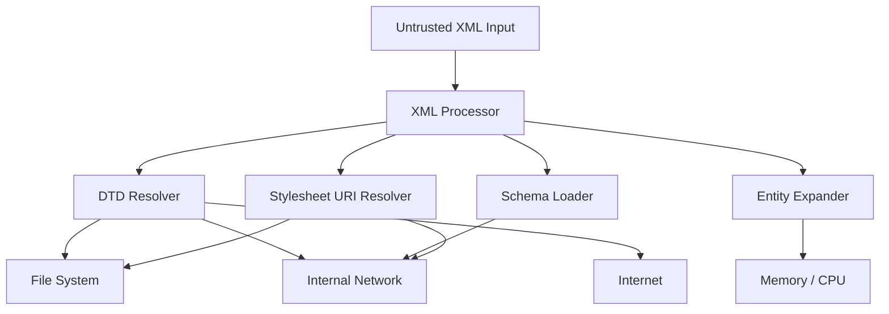
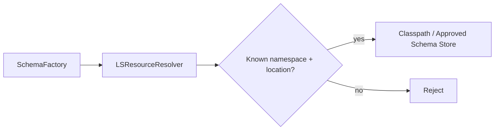
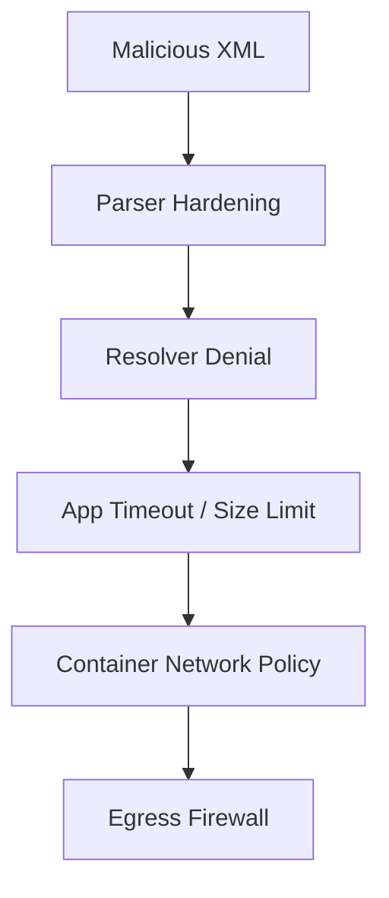
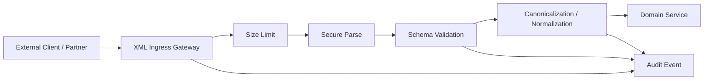

# Part 009 — Secure XML Processing: XXE and Parser Hardening

## Tujuan Part Ini

Part ini membahas cara memproses XML secara aman di Java.

Targetnya bukan sekadar hafal checklist seperti “disable XXE”. Targetnya adalah membangun mental model yang cukup kuat untuk menjawab pertanyaan production seperti:

- Apakah parser ini boleh membaca DTD?
- Apakah schema validator boleh mengambil XSD dari internet?
- Apakah XSLT boleh mengakses file atau URL eksternal?
- Apakah payload kecil bisa memakan CPU/memory sangat besar karena entity expansion?
- Apakah resolver kita membuka SSRF?
- Apakah konfigurasi aman berlaku konsisten untuk DOM, SAX, StAX, XPath, XSD validation, dan XSLT?
- Bagaimana membuktikan konfigurasi ini aman lewat test?

XML security adalah boundary concern. Ia harus ditentukan sebelum data masuk ke domain system.

---

## 1. Mental Model: XML Parser Is Not Just a Parser

Parser XML tidak hanya membaca karakter menjadi node atau event.

Parser bisa melakukan pekerjaan tambahan:

| Capability | Dampak Security |
|---|---|
| Resolve external entity | Bisa membaca file lokal, URL internal, atau network resource |
| Process DTD | Bisa mengaktifkan entity expansion dan resource resolution |
| Expand entity | Bisa menyebabkan memory/CPU blow-up |
| Load external schema | Bisa membuat network call tak terkontrol |
| Load external stylesheet | Bisa membuat network/file access pada XSLT |
| Resolve URI | Bisa menjadi SSRF/file disclosure vector |
| Follow nested includes/imports | Bisa membuka dependency chain yang tidak terkontrol |
| Produce huge tree | Bisa menyebabkan heap pressure |

Karena itu, parser harus diperlakukan seperti komponen I/O, bukan utility biasa.



Production rule:

> Every XML processor must have an explicit external resource policy.

Jangan mengandalkan default.

---

## 2. Threat Model Dasar

Sebelum konfigurasi API, pahami kelas serangan.

### 2.1 XXE: XML External Entity

XXE terjadi ketika XML mengandung definisi entity eksternal dan parser mengizinkan entity itu di-resolve.

Contoh payload berbahaya:

```xml
<?xml version="1.0" encoding="UTF-8"?>
<!DOCTYPE order [
  <!ENTITY secret SYSTEM "file:///etc/passwd">
]>
<order>
  <customer>&secret;</customer>
</order>
```

Jika parser memperbolehkan external entity, isi file lokal bisa masuk ke hasil parse.

XXE bisa berdampak pada:

- local file disclosure;
- SSRF ke metadata service atau service internal;
- port scanning internal;
- denial-of-service;
- data exfiltration lewat error message atau outbound request.

### 2.2 SSRF via XML

Payload tidak harus membaca file. Ia bisa memaksa server melakukan request HTTP.

```xml
<!DOCTYPE order [
  <!ENTITY xxe SYSTEM "http://169.254.169.254/latest/meta-data/">
]>
<order>&xxe;</order>
```

Walaupun aplikasi tidak punya HTTP client eksplisit pada path tersebut, XML processor bisa menjadi HTTP client tersembunyi.

### 2.3 Billion Laughs / Entity Expansion

Entity internal bisa dibuat recursive atau sangat besar.

```xml
<!DOCTYPE lolz [
 <!ENTITY lol "lol">
 <!ENTITY lol1 "&lol;&lol;&lol;&lol;&lol;&lol;&lol;&lol;&lol;&lol;">
 <!ENTITY lol2 "&lol1;&lol1;&lol1;&lol1;&lol1;&lol1;&lol1;&lol1;&lol1;&lol1;">
]>
<root>&lol2;</root>
```

Payload terlihat kecil, tetapi expansion-nya besar.

### 2.4 Quadratic Blowup

Serangan ini tidak selalu recursive. Ia bisa mengulang entity besar berkali-kali.

```xml
<!DOCTYPE bomb [
  <!ENTITY a "aaaaaaaaaaaaaaaaaaaaaaaaaaaaaaaaaaaaaaaaaaaa">
]>
<root>&a;&a;&a;&a;&a;&a;&a;&a;&a;&a;</root>
```

Risikonya tetap CPU/memory exhaustion.

### 2.5 External Schema Import

XSD bisa memiliki `xs:import` atau `xs:include`.

```xml
<xs:import namespace="urn:partner:v1" schemaLocation="http://internal.example/schema.xsd"/>
```

Jika `SchemaFactory` bebas mengambil resource eksternal, validation bisa membuat network access.

### 2.6 XSLT External Access

XSLT bisa menggunakan mekanisme seperti `document()` atau include/import stylesheet.

```xml
<xsl:stylesheet version="1.0"
  xmlns:xsl="http://www.w3.org/1999/XSL/Transform">

  <xsl:template match="/">
    <xsl:value-of select="document('file:///etc/passwd')"/>
  </xsl:template>
</xsl:stylesheet>
```

JAXP menyediakan property akses eksternal untuk DTD, schema, dan stylesheet. Policy-nya harus eksplisit.

---

## 3. Security Invariants

Untuk production XML processing, tetapkan invariant berikut.

| Invariant | Makna Praktis |
|---|---|
| No implicit external access | Parser tidak boleh mengambil file/URL tanpa policy eksplisit |
| DTD disabled by default | DTD hanya boleh aktif untuk use case yang sangat jelas dan terisolasi |
| Entity expansion bounded | Entity expansion harus dikurangi atau dibatasi |
| Schema resolution controlled | Semua schema import/include harus lewat catalog/resolver terpercaya |
| Stylesheet resolution controlled | XSLT include/import/document harus dibatasi |
| Parser config centralized | Tidak boleh ada konfigurasi parser ad hoc tersebar |
| Input size bounded | Payload XML punya ukuran maksimum |
| Error output sanitized | Error tidak membocorkan path, URI internal, atau isi file |
| Tests prove denial | Test harus membuktikan XXE/DTD/network access ditolak |

Rule yang paling mudah dioperasionalkan:

```text
Untrusted XML must be parsed in no-network, no-file, no-DTD mode unless there is a documented exception.
```

---

## 4. Classify XML Trust Boundary

Tidak semua XML sama. Pisahkan berdasarkan asal dan fungsi.

| Source | Trust Level | Default Policy |
|---|---:|---|
| Public API request | Untrusted | DTD off, external access off, strict size limit |
| Partner feed | Semi-trusted | DTD off, catalog-only schema resolution |
| Internal generated XML | Controlled | Still hardened; may relax only if necessary |
| Regulatory batch file | Semi-trusted | Validate strongly; external access off |
| Legacy SOAP with DTD | High-risk exception | Isolated parser profile and explicit resolver |
| Admin-uploaded stylesheet | Untrusted code-like input | Usually reject or sandbox heavily |

Important:

> “Trusted partner” does not mean “trusted payload”.

Partner bisa salah konfigurasi, compromised, atau mengirim payload corrupted. Trust boundary tetap berada pada input edge.

---

## 5. Centralize XML Security Profiles

Jangan biarkan setiap service membuat parser sendiri-sendiri.

Gunakan factory utility dengan profile eksplisit:

```text
XmlSecurityProfile.UNTRUSTED_INPUT
XmlSecurityProfile.TRUSTED_INTERNAL
XmlSecurityProfile.SCHEMA_VALIDATION_CATALOG_ONLY
XmlSecurityProfile.XSLT_NO_EXTERNAL_ACCESS
XmlSecurityProfile.LEGACY_DTD_ISOLATED
```

Contoh struktur:

```java
public enum XmlSecurityProfile {
    UNTRUSTED_INPUT,
    CATALOG_SCHEMA_VALIDATION,
    XSLT_NO_EXTERNAL_ACCESS,
    LEGACY_DTD_ISOLATED
}
```

Lalu buat konfigurasi terpusat:

```java
public final class SecureXmlFactories {

    private SecureXmlFactories() {
    }

    public static DocumentBuilderFactory secureDocumentBuilderFactory() {
        DocumentBuilderFactory factory = DocumentBuilderFactory.newInstance();
        factory.setNamespaceAware(true);
        factory.setXIncludeAware(false);
        factory.setExpandEntityReferences(false);

        setFeature(factory, javax.xml.XMLConstants.FEATURE_SECURE_PROCESSING, true);
        setFeature(factory, "http://apache.org/xml/features/disallow-doctype-decl", true);
        setFeature(factory, "http://xml.org/sax/features/external-general-entities", false);
        setFeature(factory, "http://xml.org/sax/features/external-parameter-entities", false);
        setFeature(factory, "http://apache.org/xml/features/nonvalidating/load-external-dtd", false);

        setAttributeIfSupported(factory, javax.xml.XMLConstants.ACCESS_EXTERNAL_DTD, "");
        setAttributeIfSupported(factory, javax.xml.XMLConstants.ACCESS_EXTERNAL_SCHEMA, "");

        return factory;
    }

    private static void setFeature(DocumentBuilderFactory factory, String feature, boolean value) {
        try {
            factory.setFeature(feature, value);
        } catch (ParserConfigurationException e) {
            throw new IllegalStateException("XML parser does not support required feature: " + feature, e);
        }
    }

    private static void setAttributeIfSupported(DocumentBuilderFactory factory, String name, String value) {
        try {
            factory.setAttribute(name, value);
        } catch (IllegalArgumentException ex) {
            throw new IllegalStateException("XML parser does not support required attribute: " + name, ex);
        }
    }
}
```

Production stance:

- For security-critical settings, fail closed if unsupported.
- Jangan silent ignore kecuali benar-benar non-security optional behavior.
- Catat parser provider/version di startup diagnostic.

---

## 6. DOM Hardening

DOM nyaman, tetapi berisiko besar karena membangun tree lengkap. Untuk untrusted XML, DOM hanya aman jika:

- ukuran input dibatasi;
- DTD/external entity dimatikan;
- parser namespace-aware;
- error handler dikendalikan;
- resolver menolak resource eksternal;
- hasil parse tidak dipakai untuk logging raw tanpa redaction.

### 6.1 Secure DOM Parser

```java
import org.w3c.dom.Document;
import org.xml.sax.InputSource;
import org.xml.sax.SAXException;

import javax.xml.XMLConstants;
import javax.xml.parsers.DocumentBuilder;
import javax.xml.parsers.DocumentBuilderFactory;
import javax.xml.parsers.ParserConfigurationException;
import java.io.IOException;
import java.io.StringReader;

public final class SecureDomParser {

    public Document parse(String xml) {
        try {
            DocumentBuilderFactory factory = DocumentBuilderFactory.newInstance();
            factory.setNamespaceAware(true);
            factory.setXIncludeAware(false);
            factory.setExpandEntityReferences(false);

            factory.setFeature(XMLConstants.FEATURE_SECURE_PROCESSING, true);
            factory.setFeature("http://apache.org/xml/features/disallow-doctype-decl", true);
            factory.setFeature("http://xml.org/sax/features/external-general-entities", false);
            factory.setFeature("http://xml.org/sax/features/external-parameter-entities", false);
            factory.setFeature("http://apache.org/xml/features/nonvalidating/load-external-dtd", false);

            factory.setAttribute(XMLConstants.ACCESS_EXTERNAL_DTD, "");
            factory.setAttribute(XMLConstants.ACCESS_EXTERNAL_SCHEMA, "");

            DocumentBuilder builder = factory.newDocumentBuilder();
            builder.setEntityResolver((publicId, systemId) -> new InputSource(new StringReader("")));

            try (StringReader reader = new StringReader(xml)) {
                return builder.parse(new InputSource(reader));
            }
        } catch (ParserConfigurationException | SAXException | IOException e) {
            throw new XmlParseException("Failed to parse XML safely", e);
        }
    }
}
```

### 6.2 Why Multiple Settings?

Karena XML security surface tidak satu flag.

| Setting | Tujuan |
|---|---|
| `disallow-doctype-decl` | Menolak DOCTYPE sepenuhnya |
| `external-general-entities=false` | Menolak general external entity |
| `external-parameter-entities=false` | Menolak parameter entity |
| `load-external-dtd=false` | Mencegah loading DTD eksternal |
| `ACCESS_EXTERNAL_DTD=""` | Menutup protocol eksternal untuk DTD |
| `ACCESS_EXTERNAL_SCHEMA=""` | Menutup protocol eksternal untuk schema |
| custom `EntityResolver` | Defense-in-depth untuk resource resolution |
| `FEATURE_SECURE_PROCESSING=true` | Mengaktifkan secure processing limit tertentu |

Production rule:

> Treat secure XML parser setup as layered defense, not single-feature configuration.

---

## 7. SAX Hardening

SAX juga perlu hardening. Walaupun tidak membuat tree besar, SAX tetap bisa resolve DTD/entity.

```java
import org.xml.sax.InputSource;
import org.xml.sax.XMLReader;
import org.xml.sax.helpers.DefaultHandler;

import javax.xml.XMLConstants;
import javax.xml.parsers.SAXParser;
import javax.xml.parsers.SAXParserFactory;
import java.io.StringReader;

public final class SecureSaxParser {

    public void parse(String xml, DefaultHandler handler) {
        try {
            SAXParserFactory factory = SAXParserFactory.newInstance();
            factory.setNamespaceAware(true);
            factory.setXIncludeAware(false);

            factory.setFeature(XMLConstants.FEATURE_SECURE_PROCESSING, true);
            factory.setFeature("http://apache.org/xml/features/disallow-doctype-decl", true);
            factory.setFeature("http://xml.org/sax/features/external-general-entities", false);
            factory.setFeature("http://xml.org/sax/features/external-parameter-entities", false);
            factory.setFeature("http://apache.org/xml/features/nonvalidating/load-external-dtd", false);

            SAXParser parser = factory.newSAXParser();
            XMLReader reader = parser.getXMLReader();
            reader.setEntityResolver((publicId, systemId) -> new InputSource(new StringReader("")));
            reader.setContentHandler(handler);
            reader.setErrorHandler(handler);

            reader.parse(new InputSource(new StringReader(xml)));
        } catch (Exception e) {
            throw new XmlParseException("Failed to parse XML safely", e);
        }
    }
}
```

### 7.1 SAX State Machine Security

SAX handler sering punya state internal.

Jangan biarkan state parser bocor antar dokumen.

Bad:

```java
@Component
public class ReusedOrderHandler extends DefaultHandler {
    private String currentOrderId;
    private final List<String> items = new ArrayList<>();
}
```

Jika handler singleton dipakai ulang secara concurrent, hasil parsing bisa korup.

Better:

```java
public final class OrderSaxExtractor {

    public Order parse(String xml) {
        OrderHandler handler = new OrderHandler();
        secureSaxParser.parse(xml, handler);
        return handler.result();
    }
}
```

Security tidak hanya tentang XXE. Race condition di parser state juga bisa merusak integrity.

---

## 8. StAX Hardening

StAX menggunakan `XMLInputFactory`. Properti yang umum dipakai:

- `XMLInputFactory.SUPPORT_DTD`;
- `XMLInputFactory.IS_SUPPORTING_EXTERNAL_ENTITIES`;
- `XMLConstants.ACCESS_EXTERNAL_DTD` jika provider mendukung;
- resolver yang menolak resource eksternal.

```java
import javax.xml.XMLConstants;
import javax.xml.stream.XMLInputFactory;
import javax.xml.stream.XMLStreamException;
import javax.xml.stream.XMLStreamReader;
import java.io.StringReader;

public final class SecureStaxReaderFactory {

    public XMLStreamReader newReader(String xml) {
        try {
            XMLInputFactory factory = XMLInputFactory.newFactory();
            factory.setProperty(XMLInputFactory.SUPPORT_DTD, false);
            factory.setProperty(XMLInputFactory.IS_SUPPORTING_EXTERNAL_ENTITIES, false);
            setProperty(factory, XMLConstants.ACCESS_EXTERNAL_DTD, "");

            factory.setXMLResolver((publicId, systemId, baseUri, namespace) -> {
                throw new XMLStreamException("External XML resource resolution is disabled");
            });

            return factory.createXMLStreamReader(new StringReader(xml));
        } catch (XMLStreamException e) {
            throw new XmlParseException("Failed to create secure StAX reader", e);
        }
    }

    private static void setProperty(XMLInputFactory factory, String name, Object value) {
        if (factory.isPropertySupported(name)) {
            factory.setProperty(name, value);
        }
    }
}
```

Note:

- StAX providers tidak selalu mendukung semua property secara sama.
- Security-critical property harus diverifikasi lewat tests.
- Resolver denial test lebih reliable daripada percaya bahwa property diterapkan.

---

## 9. XSD Validation Hardening

Validasi XSD sering dianggap aman karena “hanya validate”. Ini salah.

`SchemaFactory` bisa load XSD yang punya import/include eksternal. Validator bisa berinteraksi dengan DTD/entity pada instance document jika pipeline sebelumnya tidak harden.

### 9.1 Disable External Schema Access

```java
import javax.xml.XMLConstants;
import javax.xml.transform.Source;
import javax.xml.transform.stream.StreamSource;
import javax.xml.validation.Schema;
import javax.xml.validation.SchemaFactory;
import java.io.StringReader;

public final class SecureSchemaLoader {

    public Schema loadSchema(String xsd) {
        try {
            SchemaFactory factory = SchemaFactory.newInstance(XMLConstants.W3C_XML_SCHEMA_NS_URI);
            factory.setFeature(XMLConstants.FEATURE_SECURE_PROCESSING, true);
            factory.setProperty(XMLConstants.ACCESS_EXTERNAL_DTD, "");
            factory.setProperty(XMLConstants.ACCESS_EXTERNAL_SCHEMA, "");
            factory.setResourceResolver(new DenyAllLsResourceResolver());

            Source source = new StreamSource(new StringReader(xsd));
            return factory.newSchema(source);
        } catch (Exception e) {
            throw new XmlSchemaException("Failed to load schema safely", e);
        }
    }
}
```

### 9.2 Catalog-Only Schema Resolution

Dalam enterprise, schema modular sering butuh `xs:include` dan `xs:import`.

Solusinya bukan membuka internet. Solusinya adalah catalog/resolver controlled.



Resolver policy:

```text
Only load schema resources from approved immutable locations.
No http:// or file:// from input-controlled schemaLocation.
Namespace must match expected schema set.
Schema version must be pinned.
```

Skeleton:

```java
import org.w3c.dom.ls.LSInput;
import org.w3c.dom.ls.LSResourceResolver;

public final class CatalogOnlySchemaResolver implements LSResourceResolver {

    private final SchemaCatalog catalog;

    public CatalogOnlySchemaResolver(SchemaCatalog catalog) {
        this.catalog = catalog;
    }

    @Override
    public LSInput resolveResource(
            String type,
            String namespaceURI,
            String publicId,
            String systemId,
            String baseURI
    ) {
        return catalog.find(namespaceURI, systemId)
                .orElseThrow(() -> new XmlSchemaException(
                        "Schema resource is not allowed: namespace=" + namespaceURI + ", systemId=" + systemId));
    }
}
```

---

## 10. XSLT Hardening

XSLT harus diperlakukan sebagai transformation code.

Risikonya:

- stylesheet include/import eksternal;
- `document()` function;
- extension functions;
- processor-specific features;
- infinite/expensive transformation;
- output injection;
- uncontrolled result documents;
- access ke file/network.

### 10.1 JAXP TransformerFactory External Access

```java
import javax.xml.XMLConstants;
import javax.xml.transform.Templates;
import javax.xml.transform.TransformerFactory;
import javax.xml.transform.stream.StreamSource;
import java.io.StringReader;

public final class SecureXsltCompiler {

    public Templates compile(String xslt) {
        try {
            TransformerFactory factory = TransformerFactory.newInstance();
            factory.setFeature(XMLConstants.FEATURE_SECURE_PROCESSING, true);
            factory.setAttribute(XMLConstants.ACCESS_EXTERNAL_DTD, "");
            factory.setAttribute(XMLConstants.ACCESS_EXTERNAL_STYLESHEET, "");
            factory.setURIResolver((href, base) -> {
                throw new XmlTransformationException("External stylesheet access is disabled: " + href);
            });

            return factory.newTemplates(new StreamSource(new StringReader(xslt)));
        } catch (Exception e) {
            throw new XmlTransformationException("Failed to compile XSLT safely", e);
        }
    }
}
```

### 10.2 Stylesheet Trust Classification

| Stylesheet Source | Policy |
|---|---|
| Bundled application stylesheet | Compile at startup; no external access |
| Partner-provided stylesheet | Avoid; require review/sandbox if unavoidable |
| Admin-uploaded stylesheet | Treat as code upload; usually disallow |
| Dynamic generated stylesheet | Strongly avoid; prefer parameterized static stylesheet |

Production rule:

> Do not let users upload arbitrary XSLT unless you are intentionally operating a sandboxed transformation platform.

---

## 11. Input Size and Resource Limits

Hardening parser feature saja tidak cukup.

Tambahkan limit eksternal:

- request body size limit;
- decompressed size limit;
- max XML file size;
- max record count;
- max processing duration;
- max validation errors collected;
- max transformation output size;
- max nested depth jika memungkinkan;
- worker isolation untuk batch besar.

### 11.1 Avoid Compression Bombs

Jika XML datang sebagai ZIP/GZIP:

```text
compressed input size != real processing size
```

Control:

- limit compressed size;
- limit decompressed bytes;
- reject suspicious compression ratio;
- stream decompression;
- avoid extracting arbitrary paths;
- validate filename and media type.

### 11.2 Bound Error Collection

Bad:

```java
List<SAXParseException> errors = new ArrayList<>();
// collect all errors from hostile huge payload
```

Better:

```java
public final class BoundedValidationErrorCollector extends org.xml.sax.helpers.DefaultHandler {
    private final int maxErrors;
    private final List<SAXParseException> errors = new ArrayList<>();

    public BoundedValidationErrorCollector(int maxErrors) {
        this.maxErrors = maxErrors;
    }

    @Override
    public void error(SAXParseException e) throws SAXException {
        if (errors.size() >= maxErrors) {
            throw new SAXException("Too many XML validation errors");
        }
        errors.add(e);
    }
}
```

---

## 12. Resolver Policy Patterns

Resolver adalah titik penting.

### 12.1 Deny-All Resolver

Untuk untrusted input:

```java
import org.xml.sax.EntityResolver;
import org.xml.sax.InputSource;

import java.io.StringReader;

public final class DenyAllEntityResolver implements EntityResolver {
    @Override
    public InputSource resolveEntity(String publicId, String systemId) {
        return new InputSource(new StringReader(""));
    }
}
```

Alternative: throw exception agar terlihat eksplisit.

```java
public final class FailingEntityResolver implements EntityResolver {
    @Override
    public InputSource resolveEntity(String publicId, String systemId) throws SAXException {
        throw new SAXException("External entity resolution is disabled: " + systemId);
    }
}
```

Trade-off:

| Resolver | Kelebihan | Kekurangan |
|---|---|---|
| Return empty | Compatibility lebih tinggi | Bisa menyembunyikan masalah contract |
| Throw exception | Fail-fast dan jelas | Bisa break legacy payload yang diam-diam punya DTD |

Untuk production security, prefer throw exception untuk input boundary.

### 12.2 Allowlist Resolver

Untuk schema catalog:

```java
public interface XmlResourcePolicy {
    boolean isAllowed(String namespaceUri, String systemId, String baseUri);
}
```

Rules:

- allow by namespace, not just URL;
- reject relative path traversal;
- reject unknown protocol;
- reject hostnames from payload;
- prefer classpath resources or immutable artifact store;
- log rejection reason without leaking sensitive path.

---

## 13. Safe Error Handling

XML error sering mengandung line/column, system ID, URI, dan snippet.

Jangan mengirim raw exception ke client.

Bad:

```json
{
  "error": "Could not read file:///etc/passwd"
}
```

Better:

```json
{
  "code": "XML_PARSE_REJECTED",
  "message": "XML document is not allowed by the configured security policy.",
  "line": 2,
  "column": 15,
  "correlationId": "9c0d..."
}
```

Internal log boleh lebih detail, tetapi tetap redacted.

Recommended error taxonomy:

| Code | Meaning |
|---|---|
| `XML_BODY_TOO_LARGE` | Payload melewati batas ukuran |
| `XML_DTD_NOT_ALLOWED` | DOCTYPE/DTD ditolak |
| `XML_EXTERNAL_RESOURCE_NOT_ALLOWED` | External file/URL/schema/stylesheet ditolak |
| `XML_PARSE_FAILED` | XML tidak well-formed |
| `XML_SCHEMA_INVALID` | XML tidak valid terhadap XSD |
| `XML_TRANSFORM_FAILED` | XSLT gagal |
| `XML_PROCESSING_TIMEOUT` | Processing melebihi batas waktu |

---

## 14. Security Tests That Actually Prove Something

Jangan hanya test happy path.

### 14.1 XXE File Disclosure Test

```java
@Test
void shouldRejectDoctypeWithExternalEntity() {
    String xml = """
        <?xml version="1.0"?>
        <!DOCTYPE foo [ <!ENTITY xxe SYSTEM "file:///etc/passwd"> ]>
        <foo>&xxe;</foo>
        """;

    assertThrows(XmlParseException.class, () -> parser.parse(xml));
}
```

### 14.2 SSRF Denial Test

```java
@Test
void shouldRejectHttpExternalEntity() {
    String xml = """
        <?xml version="1.0"?>
        <!DOCTYPE foo [ <!ENTITY xxe SYSTEM "http://127.0.0.1:9999/private"> ]>
        <foo>&xxe;</foo>
        """;

    assertThrows(XmlParseException.class, () -> parser.parse(xml));
}
```

Lebih kuat lagi: jalankan local fake server dan assert tidak ada request masuk.

### 14.3 DTD Rejection Test

```java
@Test
void shouldRejectAnyDoctype() {
    String xml = """
        <!DOCTYPE note [ <!ELEMENT note ANY> ]>
        <note>Hello</note>
        """;

    assertThrows(XmlParseException.class, () -> parser.parse(xml));
}
```

### 14.4 Schema External Import Test

```java
@Test
void shouldRejectExternalSchemaImport() {
    String xsd = """
        <xs:schema xmlns:xs="http://www.w3.org/2001/XMLSchema"
                   targetNamespace="urn:test">
          <xs:import namespace="urn:evil" schemaLocation="http://127.0.0.1:9999/evil.xsd"/>
        </xs:schema>
        """;

    assertThrows(XmlSchemaException.class, () -> secureSchemaLoader.loadSchema(xsd));
}
```

### 14.5 XSLT External Document Test

```java
@Test
void shouldRejectXsltDocumentFunctionExternalAccess() {
    String xslt = """
        <xsl:stylesheet version="1.0"
          xmlns:xsl="http://www.w3.org/1999/XSL/Transform">
          <xsl:template match="/">
            <xsl:value-of select="document('file:///etc/passwd')"/>
          </xsl:template>
        </xsl:stylesheet>
        """;

    Templates templates = secureXsltCompiler.compile(xslt);

    assertThrows(XmlTransformationException.class, () -> transform(templates, "<root/>"));
}
```

Security tests harus masuk CI dan regression suite.

---

## 15. Production Startup Validation

A common failure mode: code sets security property, but provider ignores or does not support it.

Tambahkan startup self-test.

```java
public final class XmlSecuritySelfTest {

    public void verify() {
        verifyDomRejectsDoctype();
        verifySaxRejectsDoctype();
        verifyStaxRejectsExternalEntities();
        verifySchemaFactoryRejectsExternalImport();
        verifyTransformerFactoryRejectsExternalStylesheet();
    }
}
```

Self-test bukan pengganti unit test, tetapi membantu mendeteksi perubahan runtime/provider.

Log yang berguna:

```text
xml.security.profile=UNTRUSTED_INPUT
xml.dom.factory=com.sun.org.apache.xerces.internal.jaxp.DocumentBuilderFactoryImpl
xml.sax.factory=com.sun.org.apache.xerces.internal.jaxp.SAXParserFactoryImpl
xml.stax.factory=com.sun.xml.internal.stream.XMLInputFactoryImpl
xml.transformer.factory=com.sun.org.apache.xalan.internal.xsltc.trax.TransformerFactoryImpl
xml.external.dtd=disabled
xml.external.schema=disabled
xml.external.stylesheet=disabled
```

Jangan log full XML payload secara default.

---

## 16. Operational Controls

### 16.1 Network Egress

Application-level hardening harus didukung infrastructure control:

- block unexpected egress;
- deny metadata service access from application container if possible;
- restrict DNS resolution;
- apply service mesh egress policies;
- monitor unexpected outbound calls from XML-processing services.

Defense-in-depth:



### 16.2 Timeouts

JAXP API tidak selalu punya per-call timeout sederhana.

Operational options:

- process large XML in bounded worker pool;
- set request timeout at web layer;
- isolate batch processing workers;
- use future cancellation with caution;
- avoid parsing unbounded input on request threads;
- cap output generation.

### 16.3 Redaction

XML payload sering mengandung PII/regulatory data.

Logging policy:

| Data | Log? |
|---|---|
| correlation ID | Yes |
| document type | Yes |
| schema version | Yes |
| validation error code | Yes |
| line/column | Usually yes |
| raw payload | No by default |
| sensitive field values | No |
| external URI from attacker | Redacted/truncated |

---

## 17. Secure XML Gateway Pattern

Untuk sistem besar, XML hardening sebaiknya dilakukan di satu layer gateway/library.



Responsibilities:

- enforce input limits;
- reject DTD/external resource;
- validate against approved schema;
- normalize namespace/version;
- produce structured diagnostics;
- emit audit event;
- hand off safe representation to domain service.

Do not scatter XML parsing in random controllers.

---

## 18. Secure Defaults by API

### 18.1 DOM

Required:

- `setNamespaceAware(true)`;
- `setXIncludeAware(false)`;
- `setExpandEntityReferences(false)`;
- `FEATURE_SECURE_PROCESSING=true`;
- disallow DOCTYPE;
- disable external entities;
- disable external DTD loading;
- set `ACCESS_EXTERNAL_DTD` and `ACCESS_EXTERNAL_SCHEMA` to empty;
- set entity resolver.

### 18.2 SAX

Required:

- namespace aware;
- XInclude off;
- secure processing;
- disallow DOCTYPE;
- disable external general/parameter entity;
- disable external DTD loading;
- entity resolver;
- non-shared handler state.

### 18.3 StAX

Required:

- `SUPPORT_DTD=false`;
- `IS_SUPPORTING_EXTERNAL_ENTITIES=false`;
- deny XML resolver;
- external DTD access disabled if supported;
- explicit input size cap;
- provider behavior regression tests.

### 18.4 XSD

Required:

- `FEATURE_SECURE_PROCESSING=true`;
- `ACCESS_EXTERNAL_DTD=""`;
- `ACCESS_EXTERNAL_SCHEMA=""` or catalog-only;
- explicit `LSResourceResolver`;
- immutable approved schema bundle;
- compiled `Schema` cached safely.

### 18.5 XSLT

Required:

- `FEATURE_SECURE_PROCESSING=true`;
- `ACCESS_EXTERNAL_DTD=""`;
- `ACCESS_EXTERNAL_STYLESHEET=""`;
- explicit `URIResolver`;
- disallow untrusted stylesheets;
- compile trusted stylesheets to `Templates`;
- bound transformation output.

---

## 19. Common Anti-Patterns

### 19.1 Anti-Pattern: Parse First, Validate Later

Bad flow:

```text
HTTP request -> parse into DOM -> inspect -> validate -> domain
```

If parse is unsafe, validation happens too late.

Better:

```text
HTTP request -> size limit -> secure parse/stream validation -> domain
```

### 19.2 Anti-Pattern: Security Flags Copied Randomly

Copy-pasted flags often miss API-specific behavior.

Better:

- central factory;
- profile enum;
- startup self-test;
- CI security tests.

### 19.3 Anti-Pattern: `setFeature` Failure Ignored

Bad:

```java
try {
    factory.setFeature(feature, false);
} catch (Exception ignored) {
}
```

This turns security into wishful thinking.

Better:

```java
catch (ParserConfigurationException e) {
    throw new IllegalStateException("Required XML security feature unsupported", e);
}
```

### 19.4 Anti-Pattern: Allowing `schemaLocation` from Input

XML instance can provide hints:

```xml
<order xmlns:xsi="http://www.w3.org/2001/XMLSchema-instance"
       xsi:schemaLocation="urn:order http://evil/schema.xsd">
```

Do not trust it for loading schema.

Use server-side schema selection.

### 19.5 Anti-Pattern: Logging Rejected URI Fully

Bad:

```text
Rejected external entity: http://attacker.example/exfiltrate?token=secret
```

Better:

```text
Rejected external XML resource: protocol=http, host=attacker.example, correlationId=...
```

---

## 20. Production Checklist

Use this checklist before exposing XML processing to external/partner input.

### Parser

- [ ] DOM/SAX/StAX factories are centralized.
- [ ] Namespace awareness is enabled where needed.
- [ ] DTD is disabled for untrusted input.
- [ ] External entities are disabled.
- [ ] External DTD loading is disabled.
- [ ] XInclude is disabled unless explicitly needed.
- [ ] Entity resolver denies by default.
- [ ] Parser feature failure fails application startup.

### Validation

- [ ] SchemaFactory disables external DTD/schema access.
- [ ] Schema import/include uses approved catalog.
- [ ] Instance `schemaLocation` is not trusted.
- [ ] Schema versions are pinned.
- [ ] Validation errors are bounded and sanitized.

### Transformation

- [ ] TransformerFactory disables external DTD/stylesheet access.
- [ ] URIResolver denies by default.
- [ ] Stylesheets are trusted, reviewed, and immutable.
- [ ] Compiled templates are reused safely.
- [ ] Transformation output size is bounded.

### Operations

- [ ] Input size limit exists before parsing.
- [ ] Decompression ratio is controlled.
- [ ] Request/batch processing time is bounded.
- [ ] Egress policy blocks unexpected outbound traffic.
- [ ] XML rejection metrics exist.
- [ ] Raw XML logging is disabled by default.
- [ ] Security regression tests run in CI.

---

## 21. Kaufman Practice Drill

Dalam 60–90 menit, buat mini project `secure-xml-lab`:

1. Implement secure DOM parser.
2. Implement secure SAX parser.
3. Implement secure StAX reader.
4. Implement secure SchemaFactory.
5. Implement secure TransformerFactory.
6. Tambahkan test untuk:
   - DOCTYPE rejection;
   - external file entity;
   - HTTP external entity;
   - entity expansion;
   - external schema import;
   - external stylesheet import;
   - XSLT `document()` attempt;
   - input too large.
7. Buat satu `XmlSecuritySelfTest` yang dijalankan saat startup.

Target bukan banyak kode. Targetnya adalah muscle memory:

```text
Every XML processor has an external resource policy.
```

---

## 22. Ringkasan

Secure XML processing bukan fitur tambahan. Ia adalah prasyarat sebelum XML disentuh oleh domain logic.

Mental model utama:

- XML parser bisa melakukan file/network access.
- DTD/entity adalah high-risk surface.
- Schema dan stylesheet juga bisa melakukan external resolution.
- `FEATURE_SECURE_PROCESSING` penting, tetapi bukan satu-satunya setting.
- Resolver harus default-deny.
- Input size, timeout, error handling, dan network egress adalah bagian dari XML security.
- Test harus membuktikan denial, bukan hanya happy path.

Setelah part ini, kita siap masuk ke XSD sebagai contract design tool, bukan sekadar file `.xsd` untuk validasi.

---

## References

- Oracle Java API for XML Processing Security Guide.
- Oracle Java XMLConstants and JAXP external access properties.
- OWASP XML External Entity Prevention Cheat Sheet.
- Java `java.xml` API: DOM, SAX, StAX, Validation, Transform.
