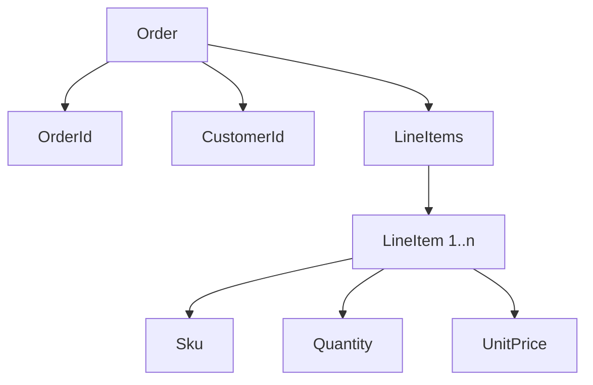
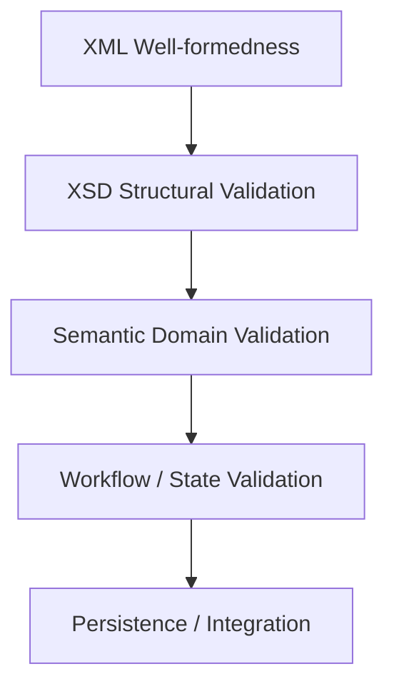

# Part 010 — XSD Foundations for Contract Design

## Tujuan Part Ini

Part ini membahas XSD sebagai **contract design language**, bukan sekadar file validasi.

Setelah part ini, targetnya kamu bisa:

- membaca XSD dengan cepat;
- mendesain schema yang stabil;
- membedakan element, type, complex type, simple type, group, dan attribute;
- memahami `minOccurs`, `maxOccurs`, optionality, ordering, dan namespace;
- menghindari schema yang terlalu kaku atau terlalu longgar;
- merancang XML contract yang bisa berevolusi;
- menyiapkan mental model sebelum masuk ke datatype/facet/modularization di part berikutnya.

XSD adalah executable contract:

```text
XSD = grammar + constraints + namespace contract + compatibility boundary
```

---

## 1. Why XSD Matters in Production

Di sistem enterprise, XML jarang hanya menjadi format data. Ia sering menjadi dokumen kontraktual.

Contoh:

- order submission;
- insurance claim;
- regulatory filing;
- invoice;
- payment instruction;
- healthcare message;
- telco provisioning request;
- government document exchange;
- partner batch feed.

Dalam konteks seperti ini, XSD menjawab pertanyaan:

| Question | XSD Role |
|---|---|
| Field apa yang wajib? | `minOccurs`, required attribute |
| Urutan elemen seperti apa? | compositor `sequence` |
| Field boleh muncul berapa kali? | `maxOccurs` |
| Nilai punya format apa? | simple type + facet |
| Struktur nested seperti apa? | complex type |
| Namespace dokumen apa? | `targetNamespace` |
| Apa yang boleh diextend? | extension point/type derivation |
| Versi contract apa? | namespace/versioning policy |

XSD bukan pengganti business rule, tetapi XSD adalah gate pertama untuk structural correctness.

---

## 2. Three Levels of Correctness

Sebelum menulis XSD, bedakan tiga level correctness.

| Level | Meaning | Example |
|---|---|---|
| Well-formed XML | XML sintaks valid | tag tertutup, quote benar, satu root |
| Schema-valid XML | XML sesuai XSD | `orderId` wajib, `lineItem` minimal satu |
| Semantically-valid document | Benar secara bisnis | order total cocok dengan price calculation |

Contoh XML well-formed tapi tidak schema-valid:

```xml
<Order xmlns="urn:commerce:order:v1">
  <CustomerId>C-100</CustomerId>
</Order>
```

Jika XSD mewajibkan `OrderId`, dokumen ini tidak valid.

Contoh XML schema-valid tapi tidak semantically valid:

```xml
<Order xmlns="urn:commerce:order:v1">
  <OrderId>O-100</OrderId>
  <CustomerId>C-100</CustomerId>
  <Currency>USD</Currency>
  <LineItems>
    <LineItem>
      <Sku>SKU-1</Sku>
      <Quantity>2</Quantity>
      <UnitPrice>10.00</UnitPrice>
      <LineTotal>999.00</LineTotal>
    </LineItem>
  </LineItems>
  <OrderTotal>20.00</OrderTotal>
</Order>
```

XSD bisa memastikan `LineTotal` adalah decimal. Tetapi XSD biasanya bukan tempat ideal untuk menghitung apakah `2 * 10.00 == 999.00`.

Production rule:

> Let XSD enforce structure and lexical/value constraints. Let domain logic enforce cross-field and stateful business semantics.

---

## 3. Minimal XSD Example

XML:

```xml
<Order xmlns="urn:commerce:order:v1">
  <OrderId>O-100</OrderId>
  <CustomerId>C-200</CustomerId>
</Order>
```

XSD:

```xml
<?xml version="1.0" encoding="UTF-8"?>
<xs:schema
    xmlns:xs="http://www.w3.org/2001/XMLSchema"
    targetNamespace="urn:commerce:order:v1"
    xmlns="urn:commerce:order:v1"
    elementFormDefault="qualified"
    attributeFormDefault="unqualified">

  <xs:element name="Order" type="OrderType"/>

  <xs:complexType name="OrderType">
    <xs:sequence>
      <xs:element name="OrderId" type="xs:string"/>
      <xs:element name="CustomerId" type="xs:string"/>
    </xs:sequence>
  </xs:complexType>

</xs:schema>
```

Key observations:

| XSD Part | Meaning |
|---|---|
| `xs:schema` | root schema declaration |
| `targetNamespace` | namespace untuk vocabulary yang didefinisikan |
| `xmlns="urn:commerce:order:v1"` | default namespace untuk reference lokal di XSD |
| `elementFormDefault="qualified"` | local elements harus berada di target namespace |
| `xs:element name="Order"` | global root element |
| `type="OrderType"` | root memakai named complex type |
| `xs:complexType` | struktur element dengan children/attributes |
| `xs:sequence` | children harus muncul dalam urutan tertentu |

---

## 4. Schema as Grammar

XSD mendefinisikan grammar: element apa boleh muncul, di mana, dan berapa kali.



XSD grammar-nya:

```xml
<xs:complexType name="OrderType">
  <xs:sequence>
    <xs:element name="OrderId" type="OrderIdType"/>
    <xs:element name="CustomerId" type="CustomerIdType"/>
    <xs:element name="LineItems" type="LineItemsType"/>
  </xs:sequence>
</xs:complexType>

<xs:complexType name="LineItemsType">
  <xs:sequence>
    <xs:element name="LineItem" type="LineItemType" minOccurs="1" maxOccurs="unbounded"/>
  </xs:sequence>
</xs:complexType>

<xs:complexType name="LineItemType">
  <xs:sequence>
    <xs:element name="Sku" type="xs:string"/>
    <xs:element name="Quantity" type="xs:positiveInteger"/>
    <xs:element name="UnitPrice" type="xs:decimal"/>
  </xs:sequence>
</xs:complexType>
```

This is not merely validation. It is a shared grammar between producer and consumer.

---

## 5. Element vs Type

Salah satu konsep XSD paling penting:

```text
Element = named thing appearing in XML document
Type    = reusable definition of allowed content/value
```

Example:

```xml
<xs:element name="OrderId" type="OrderIdType"/>

<xs:simpleType name="OrderIdType">
  <xs:restriction base="xs:string">
    <xs:minLength value="1"/>
    <xs:maxLength value="40"/>
  </xs:restriction>
</xs:simpleType>
```

`OrderId` adalah element. `OrderIdType` adalah type.

Why it matters:

| Design Choice | Impact |
|---|---|
| Reusing type | Konsistensi constraint antar element |
| Reusing element | Global element bisa dipakai untuk substitution/ref |
| Inline anonymous type | Simpler untuk local-only structure |
| Named type | Lebih mudah reuse, document, dan evolve |

---

## 6. Global vs Local Declarations

XSD punya dua gaya utama.

### 6.1 Global Element + Named Type

```xml
<xs:element name="Order" type="OrderType"/>

<xs:complexType name="OrderType">
  <xs:sequence>
    <xs:element name="OrderId" type="OrderIdType"/>
  </xs:sequence>
</xs:complexType>
```

Kelebihan:

- reusable;
- easier documentation;
- compatible with schema-first tooling;
- root element jelas;
- type bisa diextend/restrict dalam model tertentu.

Kekurangan:

- schema lebih verbose;
- terlalu banyak global type bisa membuat namespace penuh.

### 6.2 Local Anonymous Type

```xml
<xs:element name="Order">
  <xs:complexType>
    <xs:sequence>
      <xs:element name="OrderId" type="xs:string"/>
    </xs:sequence>
  </xs:complexType>
</xs:element>
```

Kelebihan:

- concise untuk dokumen kecil;
- local structure mudah dibaca.

Kekurangan:

- sulit reuse;
- sulit reference;
- generated code bisa kurang stabil;
- refactoring contract lebih mahal.

Production recommendation:

```text
Use global root elements and named business types for stable contracts.
Use local anonymous types only for simple one-off internal structures.
```

---

## 7. Namespace Design

Namespace adalah identitas vocabulary.

```xml
targetNamespace="urn:commerce:order:v1"
```

XML instance:

```xml
<Order xmlns="urn:commerce:order:v1">
  <OrderId>O-100</OrderId>
</Order>
```

### 7.1 `elementFormDefault`

Dalam schema production, biasanya gunakan:

```xml
elementFormDefault="qualified"
attributeFormDefault="unqualified"
```

Artinya local elements juga harus masuk target namespace.

Why this is usually better:

- XML instance lebih konsisten;
- XPath lebih predictable;
- cross-namespace integration lebih jelas;
- mengurangi bug karena element tidak berada di namespace yang diharapkan.

### 7.2 Namespace Anti-Pattern

Bad:

```xml
<Order xmlns="urn:commerce:order:v1">
  <OrderId>O-100</OrderId>
  <ext:PartnerData xmlns:ext="urn:partner:any">
    <Code>ABC</Code>
  </ext:PartnerData>
</Order>
```

`Code` berada di default namespace `urn:commerce:order:v1` atau inheritance default namespace tergantung context. Sering membuat XPath dan validation membingungkan.

Better:

```xml
<Order xmlns="urn:commerce:order:v1"
       xmlns:ext="urn:partner:any">
  <OrderId>O-100</OrderId>
  <ext:PartnerData>
    <ext:Code>ABC</ext:Code>
  </ext:PartnerData>
</Order>
```

Rule:

> In mixed-namespace documents, be explicit. Prefix extension vocabularies consistently.

---

## 8. Occurrence Constraints

Default `minOccurs` dan `maxOccurs` adalah `1`.

```xml
<xs:element name="OrderId" type="xs:string"/>
```

Sama dengan:

```xml
<xs:element name="OrderId" type="xs:string" minOccurs="1" maxOccurs="1"/>
```

### 8.1 Optional Element

```xml
<xs:element name="CustomerReference" type="xs:string" minOccurs="0"/>
```

Artinya element boleh tidak ada.

### 8.2 Repeated Element

```xml
<xs:element name="LineItem" type="LineItemType" minOccurs="1" maxOccurs="unbounded"/>
```

Artinya minimal satu `LineItem`, jumlah maksimum tidak dibatasi oleh XSD.

Production caution:

```text
maxOccurs="unbounded" is a contract statement, not a capacity plan.
```

Walaupun schema mengizinkan unbounded, service tetap harus punya operational limit.

### 8.3 Empty List vs Missing List

Perhatikan perbedaan:

```xml
<Order>
  <LineItems/>
</Order>
```

vs

```xml
<Order>
</Order>
```

Jika `LineItems` required tapi `LineItem` optional, empty list valid.

```xml
<xs:element name="LineItems" type="LineItemsType" minOccurs="1"/>

<xs:complexType name="LineItemsType">
  <xs:sequence>
    <xs:element name="LineItem" type="LineItemType" minOccurs="0" maxOccurs="unbounded"/>
  </xs:sequence>
</xs:complexType>
```

Jika business membutuhkan minimal satu item, set `LineItem minOccurs="1"`.

---

## 9. Compositors: `sequence`, `choice`, `all`

### 9.1 `sequence`

`sequence` berarti child elements harus muncul dalam urutan tertentu.

```xml
<xs:sequence>
  <xs:element name="OrderId" type="xs:string"/>
  <xs:element name="CustomerId" type="xs:string"/>
  <xs:element name="OrderDate" type="xs:date"/>
</xs:sequence>
```

Valid:

```xml
<Order>
  <OrderId>O-100</OrderId>
  <CustomerId>C-100</CustomerId>
  <OrderDate>2026-07-02</OrderDate>
</Order>
```

Invalid jika urutan berubah.

### 9.2 `choice`

`choice` berarti salah satu branch.

```xml
<xs:choice>
  <xs:element name="PersonCustomer" type="PersonCustomerType"/>
  <xs:element name="OrganizationCustomer" type="OrganizationCustomerType"/>
</xs:choice>
```

Useful untuk mutually exclusive variants.

### 9.3 `all`

`all` mengizinkan elemen muncul tanpa urutan tertentu, tetapi penggunaannya lebih terbatas.

```xml
<xs:all>
  <xs:element name="OrderId" type="xs:string"/>
  <xs:element name="CustomerId" type="xs:string"/>
</xs:all>
```

Use carefully. Banyak contract enterprise tetap memakai `sequence` untuk determinism.

---

## 10. Attributes vs Elements

Pertanyaan umum:

```text
Harus pakai element atau attribute?
```

Tidak ada jawaban absolut, tetapi ada guideline.

### 10.1 Use Element For Business Data

```xml
<Order>
  <OrderId>O-100</OrderId>
  <CustomerId>C-200</CustomerId>
  <OrderDate>2026-07-02</OrderDate>
</Order>
```

Cocok untuk:

- domain fields;
- data yang bisa nested;
- data yang mungkin punya metadata;
- data yang mungkin berulang;
- data yang mungkin evolve.

### 10.2 Use Attribute For Metadata/Qualifier

```xml
<Amount currency="USD">100.00</Amount>
```

Cocok untuk:

- identifiers metadata;
- qualifiers;
- flags kecil;
- language/code annotations;
- version marker tertentu.

XSD:

```xml
<xs:complexType name="AmountType">
  <xs:simpleContent>
    <xs:extension base="xs:decimal">
      <xs:attribute name="currency" type="CurrencyCodeType" use="required"/>
    </xs:extension>
  </xs:simpleContent>
</xs:complexType>
```

### 10.3 Attribute Limitations

Attributes:

- cannot repeat with same name;
- cannot contain child elements;
- are less convenient for future structural extension;
- do not preserve ordering semantics;
- can be awkward in object binding.

Production guideline:

```text
Default to elements for domain data. Use attributes for compact metadata and qualifiers.
```

---

## 11. Simple Type vs Complex Type

### 11.1 Simple Type

A simple type has text-only value.

```xml
<xs:simpleType name="CurrencyCodeType">
  <xs:restriction base="xs:string">
    <xs:pattern value="[A-Z]{3}"/>
  </xs:restriction>
</xs:simpleType>
```

### 11.2 Complex Type

A complex type can contain elements and/or attributes.

```xml
<xs:complexType name="MoneyType">
  <xs:sequence>
    <xs:element name="Amount" type="xs:decimal"/>
    <xs:element name="Currency" type="CurrencyCodeType"/>
  </xs:sequence>
</xs:complexType>
```

### 11.3 Simple Content Extension

For value + attribute:

```xml
<xs:complexType name="AmountType">
  <xs:simpleContent>
    <xs:extension base="xs:decimal">
      <xs:attribute name="currency" type="CurrencyCodeType" use="required"/>
    </xs:extension>
  </xs:simpleContent>
</xs:complexType>
```

XML:

```xml
<Amount currency="USD">100.00</Amount>
```

Good for compact document. But for extensibility, `MoneyType` with child elements may be better.

---

## 12. Nillable vs Optional

These are different.

### 12.1 Optional

```xml
<xs:element name="MiddleName" type="xs:string" minOccurs="0"/>
```

Element may be absent.

### 12.2 Nillable

```xml
<xs:element name="MiddleName" type="xs:string" nillable="true"/>
```

Element exists but explicitly has nil value.

XML:

```xml
<MiddleName xmlns:xsi="http://www.w3.org/2001/XMLSchema-instance" xsi:nil="true"/>
```

Meaning difference:

| Form | Meaning |
|---|---|
| Missing element | Not provided / not applicable / unknown depending contract |
| `xsi:nil="true"` | Explicitly provided as nil |
| Empty element `<MiddleName/>` | Present with empty string or empty content depending type |

Production warning:

> Do not use optional, nil, and empty string interchangeably.

Define semantics in contract documentation.

---

## 13. Defaults and Fixed Values

XSD supports default/fixed values.

```xml
<xs:element name="Priority" type="xs:string" default="NORMAL"/>
```

```xml
<xs:attribute name="version" type="xs:string" fixed="1.0"/>
```

Be careful.

Default values can make validation output differ from raw input depending processor behavior and post-schema validation infoset assumptions.

Production guideline:

- Use explicit values in payload for important business fields.
- Use `fixed` for protocol constants if truly stable.
- Avoid relying on defaults for domain decision making unless all consumers agree.

---

## 14. Root Element Strategy

A production schema should make root elements explicit.

```xml
<xs:element name="SubmitOrderRequest" type="SubmitOrderRequestType"/>
<xs:element name="SubmitOrderResponse" type="SubmitOrderResponseType"/>
<xs:element name="OrderStatusNotification" type="OrderStatusNotificationType"/>
```

Avoid ambiguous generic roots:

```xml
<xs:element name="Message" type="MessageType"/>
```

unless there is a clear envelope protocol.

Better envelope pattern:

```xml
<Envelope xmlns="urn:platform:message:v1">
  <Header>
    <MessageId>...</MessageId>
    <MessageType>SubmitOrderRequest</MessageType>
    <SchemaVersion>1.0</SchemaVersion>
  </Header>
  <Body>
    <ord:SubmitOrderRequest xmlns:ord="urn:commerce:order:v1">
      ...
    </ord:SubmitOrderRequest>
  </Body>
</Envelope>
```

This separates transport envelope from business document.

---

## 15. Schema Design Styles

There are common XSD design styles.

### 15.1 Russian Doll

Nested local definitions.

```xml
<xs:element name="Order">
  <xs:complexType>
    <xs:sequence>
      <xs:element name="OrderId" type="xs:string"/>
    </xs:sequence>
  </xs:complexType>
</xs:element>
```

Best for small one-off schemas.

### 15.2 Salami Slice

Global elements referenced locally.

```xml
<xs:element name="OrderId" type="xs:string"/>
<xs:element name="CustomerId" type="xs:string"/>

<xs:complexType name="OrderType">
  <xs:sequence>
    <xs:element ref="OrderId"/>
    <xs:element ref="CustomerId"/>
  </xs:sequence>
</xs:complexType>
```

Reusable but can produce many global elements.

### 15.3 Venetian Blind

Global named types, local elements.

```xml
<xs:complexType name="OrderType">
  <xs:sequence>
    <xs:element name="OrderId" type="OrderIdType"/>
    <xs:element name="CustomerId" type="CustomerIdType"/>
  </xs:sequence>
</xs:complexType>
```

Often a good enterprise default.

Recommendation:

```text
Use Venetian Blind for stable enterprise contracts: global root elements, named reusable types, local business elements.
```

---

## 16. Example: Production-Grade Order XSD Skeleton

```xml
<?xml version="1.0" encoding="UTF-8"?>
<xs:schema
    xmlns:xs="http://www.w3.org/2001/XMLSchema"
    targetNamespace="urn:commerce:order:v1"
    xmlns="urn:commerce:order:v1"
    elementFormDefault="qualified"
    attributeFormDefault="unqualified">

  <xs:element name="SubmitOrderRequest" type="SubmitOrderRequestType"/>
  <xs:element name="SubmitOrderResponse" type="SubmitOrderResponseType"/>

  <xs:complexType name="SubmitOrderRequestType">
    <xs:sequence>
      <xs:element name="RequestId" type="RequestIdType"/>
      <xs:element name="SubmittedAt" type="xs:dateTime"/>
      <xs:element name="Customer" type="CustomerRefType"/>
      <xs:element name="Order" type="OrderType"/>
    </xs:sequence>
  </xs:complexType>

  <xs:complexType name="CustomerRefType">
    <xs:sequence>
      <xs:element name="CustomerId" type="CustomerIdType"/>
    </xs:sequence>
  </xs:complexType>

  <xs:complexType name="OrderType">
    <xs:sequence>
      <xs:element name="OrderId" type="OrderIdType" minOccurs="0"/>
      <xs:element name="Currency" type="CurrencyCodeType"/>
      <xs:element name="LineItems" type="LineItemsType"/>
      <xs:element name="Notes" type="NotesType" minOccurs="0"/>
    </xs:sequence>
  </xs:complexType>

  <xs:complexType name="LineItemsType">
    <xs:sequence>
      <xs:element name="LineItem" type="LineItemType" minOccurs="1" maxOccurs="unbounded"/>
    </xs:sequence>
  </xs:complexType>

  <xs:complexType name="LineItemType">
    <xs:sequence>
      <xs:element name="LineNumber" type="xs:positiveInteger"/>
      <xs:element name="Sku" type="SkuType"/>
      <xs:element name="Quantity" type="QuantityType"/>
      <xs:element name="UnitPrice" type="xs:decimal"/>
    </xs:sequence>
  </xs:complexType>

  <xs:complexType name="SubmitOrderResponseType">
    <xs:sequence>
      <xs:element name="RequestId" type="RequestIdType"/>
      <xs:element name="Accepted" type="xs:boolean"/>
      <xs:element name="OrderId" type="OrderIdType" minOccurs="0"/>
      <xs:element name="Errors" type="ErrorsType" minOccurs="0"/>
    </xs:sequence>
  </xs:complexType>

  <xs:complexType name="ErrorsType">
    <xs:sequence>
      <xs:element name="Error" type="ErrorType" minOccurs="1" maxOccurs="unbounded"/>
    </xs:sequence>
  </xs:complexType>

  <xs:complexType name="ErrorType">
    <xs:sequence>
      <xs:element name="Code" type="xs:string"/>
      <xs:element name="Message" type="xs:string"/>
      <xs:element name="Field" type="xs:string" minOccurs="0"/>
    </xs:sequence>
  </xs:complexType>

  <xs:simpleType name="RequestIdType">
    <xs:restriction base="xs:string">
      <xs:minLength value="1"/>
      <xs:maxLength value="64"/>
    </xs:restriction>
  </xs:simpleType>

  <xs:simpleType name="CustomerIdType">
    <xs:restriction base="xs:string">
      <xs:minLength value="1"/>
      <xs:maxLength value="64"/>
    </xs:restriction>
  </xs:simpleType>

  <xs:simpleType name="OrderIdType">
    <xs:restriction base="xs:string">
      <xs:minLength value="1"/>
      <xs:maxLength value="64"/>
    </xs:restriction>
  </xs:simpleType>

  <xs:simpleType name="SkuType">
    <xs:restriction base="xs:string">
      <xs:minLength value="1"/>
      <xs:maxLength value="80"/>
    </xs:restriction>
  </xs:simpleType>

  <xs:simpleType name="QuantityType">
    <xs:restriction base="xs:positiveInteger">
      <xs:maxInclusive value="999999"/>
    </xs:restriction>
  </xs:simpleType>

  <xs:simpleType name="CurrencyCodeType">
    <xs:restriction base="xs:string">
      <xs:pattern value="[A-Z]{3}"/>
    </xs:restriction>
  </xs:simpleType>

  <xs:simpleType name="NotesType">
    <xs:restriction base="xs:string">
      <xs:maxLength value="2000"/>
    </xs:restriction>
  </xs:simpleType>

</xs:schema>
```

This schema is not perfect, but it demonstrates important production habits:

- explicit namespace;
- explicit roots;
- named business types;
- bounded strings;
- bounded quantity;
- required line items;
- separate request/response roots;
- structured errors.

---

## 17. Structural Contract vs Business Contract

XSD should not absorb all business logic.

Example business rule:

```text
If Accepted is true, OrderId must exist and Errors must not exist.
If Accepted is false, Errors must exist and OrderId must not exist.
```

Can XSD model this? In XSD 1.0, awkwardly. In XSD 1.1, assertions can help. But in many Java production systems, cross-field conditional logic is better handled in domain validator.

Layering:



Example:

| Rule | Best Layer |
|---|---|
| `OrderId` is string max 64 | XSD |
| `LineItem` at least one | XSD |
| `Currency` is 3 uppercase letters | XSD simple type |
| `OrderTotal = sum(line totals)` | Domain validator |
| Customer exists and active | Domain/service validator |
| Order can be submitted in current lifecycle state | Workflow/state machine |

---

## 18. Designing For Compatibility

Compatibility is usually more important than elegance.

### 18.1 Safe Changes

Usually safer:

- adding optional element at end of sequence;
- adding optional attribute;
- relaxing max length carefully;
- adding new enum only if consumers tolerate unknown values;
- adding extension point with clear namespace policy.

### 18.2 Breaking Changes

Usually breaking:

- removing required element;
- making optional element required;
- changing namespace unexpectedly;
- changing element order;
- renaming element;
- changing datatype from string to decimal;
- tightening max length;
- removing enum value;
- changing meaning without changing structure.

### 18.3 Sequence Compatibility Trap

Given:

```xml
<xs:sequence>
  <xs:element name="A" type="xs:string"/>
  <xs:element name="B" type="xs:string"/>
</xs:sequence>
```

Adding optional `C` between A and B:

```xml
<xs:sequence>
  <xs:element name="A" type="xs:string"/>
  <xs:element name="C" type="xs:string" minOccurs="0"/>
  <xs:element name="B" type="xs:string"/>
</xs:sequence>
```

may break strict consumers or generated bindings expecting old order.

Safer:

```xml
<xs:sequence>
  <xs:element name="A" type="xs:string"/>
  <xs:element name="B" type="xs:string"/>
  <xs:element name="C" type="xs:string" minOccurs="0"/>
</xs:sequence>
```

Contract evolution should be planned from day one.

---

## 19. Extension Points

Extension points allow future data without breaking old contracts.

### 19.1 `xs:any`

```xml
<xs:complexType name="OrderType">
  <xs:sequence>
    <xs:element name="OrderId" type="OrderIdType"/>
    <xs:element name="CustomerId" type="CustomerIdType"/>
    <xs:any namespace="##other" processContents="lax" minOccurs="0" maxOccurs="unbounded"/>
  </xs:sequence>
</xs:complexType>
```

Meaning:

- `namespace="##other"`: only elements from other namespaces;
- `processContents="lax"`: validate if schema is known, otherwise allow;
- repeated extension elements allowed.

### 19.2 Extension Point Risks

Risks:

- hidden coupling;
- payload bloat;
- inconsistent partner data;
- unclear ownership;
- XPath brittle if extension content becomes business-critical.

Policy:

```text
Extension points are for non-critical optional extension, not for avoiding contract governance.
```

---

## 20. Identity Constraints

XSD supports identity constraints such as `xs:unique`, `xs:key`, and `xs:keyref`.

Example: line number unique inside order.

```xml
<xs:element name="Order" type="OrderType">
  <xs:unique name="uniqueLineNumber">
    <xs:selector xpath="LineItems/LineItem"/>
    <xs:field xpath="LineNumber"/>
  </xs:unique>
</xs:element>
```

Use carefully.

Pros:

- catches structural consistency errors early;
- useful for document-local uniqueness;
- makes contract more expressive.

Cons:

- XPath subset limitations;
- namespace complexity;
- error messages can be hard for partners;
- generated tooling support varies;
- not a replacement for database/domain identity.

Production guideline:

> Use XSD identity constraints for document-local consistency, not system-of-record identity.

---

## 21. XSD 1.0 vs XSD 1.1 Awareness

Many Java stacks historically support XSD 1.0 by default through JAXP/Xerces-like providers. XSD 1.1 adds features such as assertions, but support depends on processor/provider.

Practical rule:

```text
Do not design a contract that requires XSD 1.1 unless every producer, consumer, validator, and toolchain explicitly supports it.
```

If you need conditional logic and your ecosystem is XSD 1.0-centric, implement it in semantic validation layer.

---

## 22. Java Validation Preview

Detailed Java validation comes in part 013, but understand the shape now.

```java
SchemaFactory factory = SchemaFactory.newInstance(XMLConstants.W3C_XML_SCHEMA_NS_URI);
Schema schema = factory.newSchema(new StreamSource(xsdInputStream));
Validator validator = schema.newValidator();
validator.validate(new StreamSource(xmlInputStream));
```

Important lifecycle:

| Object | Lifecycle Recommendation |
|---|---|
| `SchemaFactory` | Configure centrally; not your main cache unit |
| `Schema` | Immutable grammar representation; good candidate for cache |
| `Validator` | Create per validation use; not thread-safe in practice |
| `Source` | Per input |
| `ErrorHandler` | Per validation, bounded collector |

Do not compile schema on every request unless throughput is irrelevant.

---

## 23. Schema Documentation

XSD supports annotations.

```xml
<xs:element name="OrderId" type="OrderIdType">
  <xs:annotation>
    <xs:documentation>
      Stable identifier assigned by order management system. Required after order acceptance.
    </xs:documentation>
  </xs:annotation>
</xs:element>
```

Documentation should clarify semantics that XSD cannot express:

- field meaning;
- lifecycle condition;
- source of truth;
- whether empty string is allowed semantically;
- whether value is case-sensitive;
- version compatibility notes;
- deprecation plan.

Contract docs are not optional for partner-facing XML.

---

## 24. Schema Review Checklist

Before approving an XSD, review:

### Structure

- [ ] Root elements are explicit.
- [ ] Namespace is stable and intentional.
- [ ] `elementFormDefault` is chosen deliberately.
- [ ] Required vs optional fields are justified.
- [ ] Lists have correct `minOccurs`.
- [ ] `maxOccurs="unbounded"` is intentional.
- [ ] Element ordering is stable.

### Types

- [ ] Important business identifiers have named types.
- [ ] Strings have max length where appropriate.
- [ ] Numeric types fit domain precision.
- [ ] Date/time types have timezone semantics documented.
- [ ] Enumerations have evolution policy.

### Compatibility

- [ ] New fields can be added safely.
- [ ] Consumers can ignore unknown extension content if needed.
- [ ] Breaking changes require new namespace/version.
- [ ] Generated binding impact is considered.

### Operations

- [ ] Schema can be loaded without internet.
- [ ] Imports/includes resolve through approved catalog.
- [ ] Validation error messages are understandable.
- [ ] Test fixtures cover valid and invalid payloads.

---

## 25. Common XSD Anti-Patterns

### 25.1 Everything Is `xs:string`

Bad:

```xml
<xs:element name="Quantity" type="xs:string"/>
<xs:element name="Price" type="xs:string"/>
<xs:element name="SubmittedAt" type="xs:string"/>
```

Better:

```xml
<xs:element name="Quantity" type="xs:positiveInteger"/>
<xs:element name="Price" type="xs:decimal"/>
<xs:element name="SubmittedAt" type="xs:dateTime"/>
```

Use proper types, then apply business validation where needed.

### 25.2 Over-Constraining Too Early

Bad:

```xml
<xs:simpleType name="CustomerNameType">
  <xs:restriction base="xs:string">
    <xs:pattern value="[A-Z][a-z]+ [A-Z][a-z]+"/>
  </xs:restriction>
</xs:simpleType>
```

Names are culturally complex. This pattern will reject valid real-world names.

Better:

```xml
<xs:simpleType name="CustomerNameType">
  <xs:restriction base="xs:string">
    <xs:minLength value="1"/>
    <xs:maxLength value="200"/>
  </xs:restriction>
</xs:simpleType>
```

### 25.3 Unbounded Everything

Bad:

```xml
<xs:element name="Attachment" type="AttachmentType" maxOccurs="unbounded"/>
```

Better:

```xml
<xs:element name="Attachment" type="AttachmentType" minOccurs="0" maxOccurs="20"/>
```

Even if technical maximum differs from business maximum, the contract should communicate realistic constraints where possible.

### 25.4 Namespace Version Chaos

Bad:

```xml
targetNamespace="urn:order"
```

then silently change meaning over time.

Better:

```xml
targetNamespace="urn:commerce:order:v1"
```

and define compatibility rules for minor changes.

### 25.5 Schema As Database Dump

Bad XSD mirrors tables:

```xml
<TBL_ORDER>
  <ORDER_PK>...</ORDER_PK>
  <CUST_FK>...</CUST_FK>
</TBL_ORDER>
```

Better XSD models document intent:

```xml
<SubmitOrderRequest>
  <Customer>
    <CustomerId>...</CustomerId>
  </Customer>
  <Order>...</Order>
</SubmitOrderRequest>
```

Contracts should model business messages, not persistence internals.

---

## 26. Capstone Mini Exercise

Design an XSD for `CancelOrderRequest`.

Requirements:

- namespace: `urn:commerce:order:v1`;
- root: `CancelOrderRequest`;
- fields:
  - `RequestId`, required, string 1–64;
  - `OrderId`, required, string 1–64;
  - `RequestedAt`, required, `xs:dateTime`;
  - `RequestedBy`, required, string 1–120;
  - `Reason`, optional, string max 1000;
- include optional extension point from other namespaces;
- use named types.

Expected shape:

```xml
<CancelOrderRequest xmlns="urn:commerce:order:v1">
  <RequestId>REQ-100</RequestId>
  <OrderId>ORD-900</OrderId>
  <RequestedAt>2026-07-02T10:15:30Z</RequestedAt>
  <RequestedBy>ops-user-1</RequestedBy>
  <Reason>Customer requested cancellation.</Reason>
</CancelOrderRequest>
```

Self-check:

- Can you explain which rules are enforced by XSD?
- Which rules still need domain validation?
- What future field could be added without breaking old consumers?
- Would you allow `Reason` to be empty? Why?
- Should `RequestedBy` be a user ID, display name, or actor reference type?

---

## 27. Ringkasan

XSD adalah contract language untuk XML.

Mental model utama:

- XSD defines grammar, not full business truth.
- Elements appear in XML; types define allowed structure/value.
- Namespace is part of contract identity.
- `sequence`, `choice`, `all`, `minOccurs`, and `maxOccurs` define document shape.
- Optional, nil, and empty are semantically different.
- Named types improve reuse and governance.
- Compatibility must be designed before version 1 is published.
- Use XSD to reject structurally invalid documents early, then use domain validation for business semantics.

Part berikutnya akan membahas XSD types, datatypes, facets, value constraints, regex, date/time, decimal precision, enum strategy, ID/IDREF, nil/default semantics, dan validation edge cases secara lebih dalam.

---

## References

- W3C XML Schema Part 1: Structures.
- W3C XML Schema Definition Language 1.1 Part 1: Structures.
- Java `javax.xml.validation` package documentation.
- Oracle Java API for XML Processing documentation.
