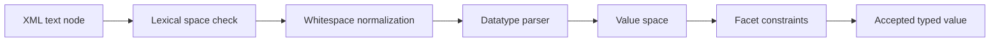
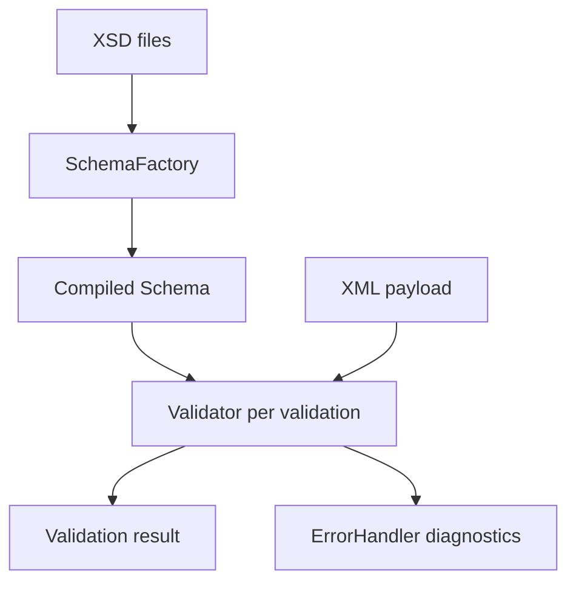
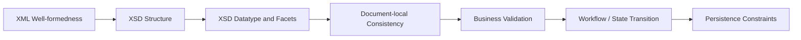

# Part 011 — XSD Types, Datatypes, and Value Constraints

## Tujuan Part Ini

Di part sebelumnya, kita melihat XSD sebagai **contract design language**: element, type, compositor, namespace, occurrence, dan boundary antara structure rule vs business rule.

Part ini masuk ke layer berikutnya: **nilai**.

Target setelah part ini:

- memahami perbedaan lexical space, value space, dan canonical representation;
- memilih built-in XSD datatype secara tepat;
- mendesain `simpleType` dengan facet yang tidak terlalu longgar dan tidak terlalu rapuh;
- memahami `restriction`, `list`, dan `union`;
- memahami efek `nillable`, default, fixed, dan whitespace normalization;
- membuat constraint yang cukup kuat untuk integrasi tanpa memasukkan business rule yang salah tempat;
- menghindari bug klasik: decimal precision, date/time timezone, regex XSD, enum drift, dan optionality ambiguity;
- menyiapkan schema yang siap divalidasi di Java menggunakan `javax.xml.validation`.

Mental model utama:

```text
XSD datatype = cara mengubah string XML menjadi nilai terkontrol

string in XML document
    -> lexical validation
    -> whitespace normalization
    -> datatype parsing
    -> value-space validation
    -> facet validation
    -> typed value for downstream processing
```

XML secara fisik adalah text. XSD memberi grammar untuk menjawab: "text ini mewakili nilai apa, dengan batasan apa, dan apakah nilai itu layak masuk pipeline?"

---

## 1. Why Datatype Design Matters

Banyak bug XML production bukan karena dokumen tidak bisa diparse. Bug terjadi karena dokumen **valid secara XML**, bahkan kadang **valid secara XSD**, tetapi nilai di dalamnya ambigu atau salah dimodelkan.

Contoh:

```xml
<Order>
  <Amount>100.00</Amount>
  <Currency>IDR</Currency>
  <SubmittedAt>2026-07-02T10:30:00</SubmittedAt>
</Order>
```

Pertanyaan engineering-nya:

| Field | Pertanyaan Contract |
|---|---|
| `Amount` | Decimal atau float? Boleh negatif? Berapa digit maksimum? Berapa fractional digit? |
| `Currency` | Free text atau ISO-like enum? Siapa yang mengelola perubahan daftar currency? |
| `SubmittedAt` | Local datetime atau instant? Wajib timezone? Bagaimana interpretasi DST? |
| Missing element | Apakah absent berarti unknown, not applicable, default, atau error? |
| Empty string | Apakah `""` nilai valid? Sama dengan null? |

XSD bisa menjawab sebagian pertanyaan ini. Tapi XSD juga bisa menyesatkan kalau dipakai terlalu agresif.

Prinsipnya:

```text
XSD should reject structurally impossible data.
XSD should not pretend to own volatile business policy.
```

Misalnya:

- `amount >= 0` bisa cocok di XSD jika semua domain memang tidak pernah negatif.
- `customerAge >= 18` mungkin business rule, bukan schema rule.
- `status` enum cocok bila status adalah protocol-level vocabulary.
- `countryCode` enum bisa berbahaya bila daftar negara berubah dan partner sulit upgrade.

---

## 2. The Three Spaces: Lexical, Value, Canonical

XSD datatype punya tiga konsep penting.

### 2.1 Lexical Space

Lexical space adalah bentuk string yang boleh muncul di XML.

Contoh untuk boolean:

```xml
<Active>true</Active>
<Active>false</Active>
<Active>1</Active>
<Active>0</Active>
```

Semua bisa valid sebagai `xs:boolean`.

### 2.2 Value Space

Value space adalah nilai konseptual setelah parsing.

```text
"true" -> true
"1"    -> true
"0"    -> false
```

Dua lexical form bisa mewakili value yang sama.

### 2.3 Canonical Representation

Canonical representation adalah bentuk string yang disarankan sebagai representasi stabil.

Untuk boolean, bentuk canonical biasanya `true` atau `false`, bukan `1` atau `0`.

Dalam production, canonical representation penting untuk:

- golden file testing;
- digital signature/canonicalization contexts;
- deterministic audit output;
- comparison antar payload;
- cache key;
- idempotency fingerprint.

Mental model:



---

## 3. Built-in Datatype Families

XSD menyediakan banyak built-in type. Jangan dihafal sebagai daftar. Pahami familinya.

```text
xs:anySimpleType
  ├── string-like
  ├── boolean
  ├── decimal/numeric
  ├── floating-point
  ├── date/time
  ├── binary
  ├── URI/QName/NOTATION
  └── identity-related/tokenized types
```

### 3.1 String-like Types

| Type | Use Case | Catatan |
|---|---|---|
| `xs:string` | free text | whitespace preserved by default |
| `xs:normalizedString` | text tanpa tab/newline mentah | whitespace replacement |
| `xs:token` | code/name/value yang harus collapsed | whitespace collapsed |
| `xs:language` | language tag | gunakan hati-hati, validasi tidak selalu cukup untuk policy |
| `xs:Name`, `xs:NCName` | XML name-like value | cocok untuk QName-ish metadata internal, bukan business name |

Practical rule:

```text
Human text    -> xs:string
Protocol code -> xs:token + pattern/enumeration
Identifier    -> xs:token + length/pattern
```

Jangan pakai `xs:string` untuk semua field. Itu membuat schema hanya memvalidasi struktur, bukan kontrak nilai.

### 3.2 Numeric Types

| Type | Use Case | Hindari Untuk |
|---|---|---|
| `xs:decimal` | money, quantity, precise measurement | floating scientific values |
| `xs:integer` | count, version, sequence number | value dengan fractional part |
| `xs:long`/`xs:int` | numeric bounded by implementation/API | public contract jangka panjang jika range bisa tumbuh |
| `xs:float`/`xs:double` | scientific approximate value | money, legal amount, financial ledger |

Untuk enterprise payload:

```text
Money -> xs:decimal + totalDigits + fractionDigits + minInclusive if needed
Count -> xs:nonNegativeInteger or restricted xs:integer
Rate  -> xs:decimal, not double, unless approximation is intended
```

### 3.3 Date and Time Types

| Type | Meaning | Common Risk |
|---|---|---|
| `xs:date` | calendar date | timezone ambiguity |
| `xs:time` | time of day | useless without date/timezone in many domains |
| `xs:dateTime` | date + time, optional timezone in XSD lexical form | local-vs-instant ambiguity |
| `xs:gYear`, `xs:gYearMonth` | partial calendar values | often overused for reporting period |
| `xs:duration` | duration | month/year durations are context-dependent |

Important design rule:

```text
If the value represents an event instant, require timezone in lexical policy.
If the value represents a local business date, use xs:date and document timezone/calendar semantics externally.
```

XSD 1.0 `xs:dateTime` allows values with and without timezone. That means this may validate:

```xml
<SubmittedAt>2026-07-02T10:30:00</SubmittedAt>
```

But the business meaning is ambiguous. Is it Jakarta time? UTC? Partner local time?

In Java, convert deliberately:

```java
OffsetDateTime instantLike = OffsetDateTime.parse("2026-07-02T10:30:00+07:00");
LocalDateTime localOnly = LocalDateTime.parse("2026-07-02T10:30:00");
```

Do not silently parse local datetime as system default timezone in server code.

### 3.4 Binary Types

| Type | Use Case |
|---|---|
| `xs:base64Binary` | embedded binary data |
| `xs:hexBinary` | digest/hash-like values |

Production rule:

```text
Prefer external object storage for large binary.
Allow base64 in XML only for bounded, contractually small payloads.
```

For regulatory or partner payloads, embedded base64 might be required. If so, add:

- maximum size at transport boundary;
- checksum field;
- content type field;
- malware scanning pipeline;
- audit redaction rule.

### 3.5 URI and QName Types

| Type | Use Case | Risk |
|---|---|---|
| `xs:anyURI` | URI-like value | validation is permissive; do not treat as security-safe URL |
| `xs:QName` | namespace-qualified name | prefix binding depends on in-scope namespace context |

Never treat `xs:anyURI` validation as SSRF protection. It only says the lexical form is URI-like enough for schema semantics. Network access policy is separate.

---

## 4. Simple Type Design

A `simpleType` defines value constraints for text-only values.

Example:

```xml
<xs:simpleType name="CurrencyCodeType">
  <xs:restriction base="xs:token">
    <xs:pattern value="[A-Z]{3}"/>
  </xs:restriction>
</xs:simpleType>
```

This says:

```text
The value must be a whitespace-collapsed token matching exactly three uppercase letters.
```

It does **not** say the code is officially active, accepted for settlement, or enabled for a tenant. That belongs to business policy.

### 4.1 Named vs Anonymous Simple Types

Anonymous type:

```xml
<xs:element name="Currency">
  <xs:simpleType>
    <xs:restriction base="xs:token">
      <xs:pattern value="[A-Z]{3}"/>
    </xs:restriction>
  </xs:simpleType>
</xs:element>
```

Named type:

```xml
<xs:simpleType name="CurrencyCodeType">
  <xs:restriction base="xs:token">
    <xs:pattern value="[A-Z]{3}"/>
  </xs:restriction>
</xs:simpleType>

<xs:element name="Currency" type="tns:CurrencyCodeType"/>
```

Production rule:

```text
Use named simple types for reusable domain vocabulary.
Use anonymous simple types only for local, one-off constraints.
```

Named types improve reuse, documentation, diff review, generated model naming, contract governance, and test fixture organization.

---

## 5. Facets: Constraint Building Blocks

Facets refine datatype values.

| Facet | Meaning | Typical Use |
|---|---|---|
| `length` | exact length | fixed-width code |
| `minLength` | minimum string/list length | required non-empty text |
| `maxLength` | maximum string/list length | payload limit, DB column alignment |
| `pattern` | regex constraint | code format |
| `enumeration` | allowed vocabulary | status, type, category |
| `whiteSpace` | preserve/replace/collapse | token normalization |
| `minInclusive` | value >= bound | amount/count/date lower bound |
| `maxInclusive` | value <= bound | bounded range |
| `minExclusive` | value > bound | positive value |
| `maxExclusive` | value < bound | threshold |
| `totalDigits` | max total decimal digits | money precision |
| `fractionDigits` | max fractional digits | cents/scale |

### 5.1 Non-empty String

Bad:

```xml
<xs:element name="CustomerName" type="xs:string"/>
```

This accepts empty string.

Better for machine-consumed fields:

```xml
<xs:simpleType name="NonBlankToken100Type">
  <xs:restriction base="xs:token">
    <xs:minLength value="1"/>
    <xs:maxLength value="100"/>
  </xs:restriction>
</xs:simpleType>
```

`xs:token` collapses whitespace, so whitespace-only input becomes empty and fails `minLength=1`.

Practical rule:

```text
Human prose -> xs:string with maxLength; handle blank semantics in app if needed.
Protocol value -> xs:token + minLength/maxLength/pattern.
```

### 5.2 Money Amount

Bad:

```xml
<xs:element name="Amount" type="xs:double"/>
```

Problems:

- floating-point approximation;
- possible scientific notation surprises;
- downstream rounding issues;
- mismatch with financial storage.

Better:

```xml
<xs:simpleType name="MoneyAmountType">
  <xs:restriction base="xs:decimal">
    <xs:totalDigits value="18"/>
    <xs:fractionDigits value="2"/>
    <xs:minInclusive value="0.00"/>
  </xs:restriction>
</xs:simpleType>
```

But be careful: not all money is 2 decimals. Some currencies have 0, 3, or special minor unit rules. XSD cannot easily express "fraction digits depends on currency field" in XSD 1.0.

So split constraints:

| Rule | Where |
|---|---|
| amount is decimal | XSD |
| max precision is bounded | XSD |
| non-negative if domain invariant | XSD |
| currency-specific minor unit | business validation |
| tenant/product-specific limit | business validation |

### 5.3 Percentage / Rate

```xml
<xs:simpleType name="PercentageType">
  <xs:restriction base="xs:decimal">
    <xs:minInclusive value="0"/>
    <xs:maxInclusive value="100"/>
    <xs:fractionDigits value="4"/>
  </xs:restriction>
</xs:simpleType>
```

This is good only if the contract represents percentage as 0..100. Some APIs represent rate as 0..1.

Name type precisely:

```text
Percentage0To100Type
Rate0To1Type
BasisPointType
```

Ambiguous names cause integration defects.

---

## 6. Pattern Facet: XSD Regex Is Not Java Regex

XSD regex is similar to familiar regex but not identical to Java regex.

Common trap:

```xml
<xs:pattern value="[A-Z]{3}"/>
```

In XSD, pattern matching has schema-specific semantics. Engineers often assume Java `matches()` semantics. Do not blindly copy Java regex.

For production schema:

- keep patterns simple;
- write examples in `xs:documentation`;
- test allowed and rejected values;
- avoid complicated lookarounds/backreferences assumptions;
- remember escaping through XML attributes.

Example:

```xml
<xs:simpleType name="PartnerReferenceType">
  <xs:annotation>
    <xs:documentation>
      Partner-assigned reference. Allowed characters: uppercase letters,
      digits, dot, underscore, hyphen. Must start with letter or digit.
      Examples: ORD-2026-0001, CLAIM_9912, ABC.123
    </xs:documentation>
  </xs:annotation>
  <xs:restriction base="xs:token">
    <xs:minLength value="1"/>
    <xs:maxLength value="40"/>
    <xs:pattern value="[A-Z0-9][A-Z0-9._-]*"/>
  </xs:restriction>
</xs:simpleType>
```

---

## 7. Enumeration: Strong Contract or Change Trap?

Enumeration is tempting:

```xml
<xs:simpleType name="OrderStatusType">
  <xs:restriction base="xs:token">
    <xs:enumeration value="DRAFT"/>
    <xs:enumeration value="SUBMITTED"/>
    <xs:enumeration value="APPROVED"/>
    <xs:enumeration value="REJECTED"/>
  </xs:restriction>
</xs:simpleType>
```

Good when:

- vocabulary is protocol-level;
- changes require coordinated release;
- unknown values should be rejected;
- generated code enum is desirable;
- audit/reporting relies on exact finite set.

Dangerous when:

- partner can introduce new values;
- values come from configurable catalog;
- values are tenant-specific;
- unknown values should be tolerated and routed;
- schema rollout is slower than business change.

Decision matrix:

| Vocabulary Type | XSD Enumeration? | Better Alternative |
|---|---:|---|
| protocol status | yes | enum |
| currency code | maybe | pattern + business code list |
| country code | maybe | pattern + reference data validation |
| product SKU | no | token + reference lookup |
| tenant-specific category | no | token + governance outside schema |
| error code owned by service | yes | enum or pattern with registry |

### 7.1 Forward-Compatible Enumeration Pattern

Sometimes you need known values but must tolerate extension.

Option 1: Use pattern instead of enum.

```xml
<xs:simpleType name="ReasonCodeType">
  <xs:restriction base="xs:token">
    <xs:minLength value="1"/>
    <xs:maxLength value="40"/>
    <xs:pattern value="[A-Z][A-Z0-9_]*"/>
  </xs:restriction>
</xs:simpleType>
```

Then validate known/allowed codes in business layer.

Option 2: Use an extension field:

```xml
<Status>REJECTED</Status>
<StatusReasonCode>PARTNER_CUSTOM_001</StatusReasonCode>
```

Keep state-machine status stable, allow reason code to evolve.

---

## 8. Whitespace Semantics

Whitespace matters more than most engineers expect.

XSD `whiteSpace` facet can be:

| Value | Meaning |
|---|---|
| `preserve` | keep whitespace |
| `replace` | replace tab/newline/carriage return with spaces |
| `collapse` | replace then collapse runs of spaces and trim ends |

String-like types behave differently:

| Type | Whitespace Behavior |
|---|---|
| `xs:string` | preserve |
| `xs:normalizedString` | replace |
| `xs:token` | collapse |

Example:

```xml
<Code>  ABC   123  </Code>
```

If `Code` is `xs:token`, the value becomes conceptually:

```text
ABC 123
```

For codes and identifiers, collapsed whitespace is usually desired. For legal text or description, preserving whitespace may matter.

Production rule:

```text
Use xs:token for machine-consumed values.
Use xs:string for human-authored prose.
```

---

## 9. Optional, Empty, Nil, Default, Fixed

This is one of the most important modelling areas.

### 9.1 Absent Element

```xml
<Order>
  <!-- Discount absent -->
</Order>
```

If schema says:

```xml
<xs:element name="Discount" type="xs:decimal" minOccurs="0"/>
```

Absent means the element is not present. It does not automatically mean zero, null, unknown, or not applicable.

### 9.2 Empty Element

```xml
<Discount/>
```

For `xs:decimal`, this is invalid because empty string is not decimal. For `xs:string`, it is valid as empty string.

### 9.3 Nillable Element

Schema:

```xml
<xs:element name="Discount" type="xs:decimal" nillable="true" minOccurs="0"/>
```

Instance:

```xml
<Discount xsi:nil="true" xmlns:xsi="http://www.w3.org/2001/XMLSchema-instance"/>
```

This explicitly states nil.

Design question:

| Representation | Meaning Candidate |
|---|---|
| absent | not provided / not applicable / unknown |
| empty string | provided as empty text |
| `xsi:nil="true"` | explicitly nil |
| `0.00` | actual zero value |

Never let these four collapse accidentally.

### 9.4 Default Values

```xml
<xs:element name="Priority" type="xs:token" default="NORMAL" minOccurs="0"/>
```

Default semantics can surprise application code. Some validators expose defaulted values into post-schema-validation infoset; many pipelines do not rely on that consistently.

Production advice:

```text
Avoid XSD default for business defaults unless every processing component is PSVI-aware and tested.
Prefer explicit defaults in application/service layer.
```

### 9.5 Fixed Values

```xml
<xs:element name="SchemaVersion" type="xs:token" fixed="1.0"/>
```

Useful for protocol discriminators, but do not overuse. Namespace/versioning often communicates version more cleanly.

---

## 10. Lists and Unions

### 10.1 List Type

A list type is whitespace-separated values in one element.

```xml
<xs:simpleType name="TagListType">
  <xs:list itemType="xs:token"/>
</xs:simpleType>
```

Instance:

```xml
<Tags>URGENT MANUAL_REVIEW VIP</Tags>
```

This is compact, but often less maintainable than repeated elements:

```xml
<Tags>
  <Tag>URGENT</Tag>
  <Tag>MANUAL_REVIEW</Tag>
  <Tag>VIP</Tag>
</Tags>
```

Use list when values are simple, order is not semantically rich, no per-item metadata is needed, compactness matters, or partner standard already uses it.

Use repeated elements when each item may later gain attributes, item-level error reporting matters, item ordering matters, or schema evolution is likely.

### 10.2 Union Type

Union allows one of several datatypes.

```xml
<xs:simpleType name="CustomerIdentifierType">
  <xs:union memberTypes="tns:NationalIdType tns:PassportNumberType tns:InternalCustomerIdType"/>
</xs:simpleType>
```

Unions can be convenient but ambiguous. Prefer explicit discriminator when possible:

```xml
<CustomerIdentifier>
  <Type>PASSPORT</Type>
  <Value>A1234567</Value>
</CustomerIdentifier>
```

Why? Because downstream systems need to know which interpretation was chosen.

---

## 11. Identity Constraints: `unique`, `key`, `keyref`

XSD can express some document-local identity constraints.

Example: order line IDs unique within an order.

```xml
<xs:element name="Order" type="tns:OrderType">
  <xs:unique name="uniqueLineId">
    <xs:selector xpath="tns:Lines/tns:Line"/>
    <xs:field xpath="tns:LineId"/>
  </xs:unique>
</xs:element>
```

Identity constraints are useful for duplicate line detection, local references, and preventing inconsistent document-internal links.

They are not a replacement for database constraints or business validation.

Key pitfalls:

- namespace prefixes inside selector/field matter;
- XPath subset is limited;
- error messages may be cryptic;
- streaming validation plus identity constraints may require buffering by validator;
- large documents with many keys can have memory implications.

Use identity constraints when document-local consistency is fundamental to the XML contract.

---

## 12. XSD 1.0 vs XSD 1.1 Constraints

XSD 1.1 adds stronger constraint capabilities such as assertions. But not every Java runtime validator supports XSD 1.1 by default.

Typical Java SE built-in validation support targets W3C XML Schema via JAXP, but advanced XSD 1.1 support often requires a different processor/library.

Example of rule that XSD 1.0 cannot naturally express:

```text
If Currency = IDR, Amount must have 0 fraction digits.
If Currency = USD, Amount may have 2 fraction digits.
```

In XSD 1.0, model it as:

- structural constraints in XSD;
- cross-field constraints in business validation;
- contract documentation;
- executable validation tests.

In XSD 1.1, assertions can express more, but introducing XSD 1.1 changes your toolchain and interoperability assumptions.

Decision rule:

```text
Use XSD 1.0-compatible contracts unless both producer and consumer ecosystems explicitly support XSD 1.1.
```

---

## 13. Java Validation Implications

A typical Java XSD validation flow:

```java
SchemaFactory factory = SchemaFactory.newInstance(XMLConstants.W3C_XML_SCHEMA_NS_URI);
Schema schema = factory.newSchema(schemaSource);
Validator validator = schema.newValidator();
validator.validate(xmlSource);
```

Conceptual lifecycle:



Production rules:

| Object | Reuse? | Notes |
|---|---:|---|
| `SchemaFactory` | configure centrally | not your validation contract itself |
| `Schema` | yes | immutable representation of compiled grammar in common usage |
| `Validator` | no/shared with care | create per validation or pool only with strict reset discipline |
| `ErrorHandler` | per validation | collect contextual errors |
| `LSResourceResolver`/catalog resolver | central policy | prevent network fetch and pin schema dependencies |

A schema datatype design affects Java code generation and parsing:

| XSD Type | Java Mapping Concern |
|---|---|
| `xs:decimal` | `BigDecimal`, scale handling |
| `xs:dateTime` | `XMLGregorianCalendar`, `OffsetDateTime`, timezone policy |
| `xs:integer` | `BigInteger` or bounded numeric |
| enum simple type | generated enum drift across schema versions |
| list type | collection parsing and whitespace normalization |
| nillable element | null semantics vs absent semantics |

---

## 14. Constraint Boundary: Schema vs Business Rule

Use this model:



Examples:

| Rule | Best Layer |
|---|---|
| XML has valid namespace and structure | XML parser + XSD |
| Amount is decimal with <= 18 digits | XSD |
| Currency is three uppercase letters | XSD |
| Currency is enabled for this tenant | business validation |
| Order status is one of protocol statuses | XSD enum or business enum |
| Cannot approve order before quote is accepted | workflow/state machine |
| Customer ID exists | business/persistence validation |
| Line IDs are unique inside document | XSD identity or business validation |
| Total amount equals sum of lines | business validation or XSD 1.1 assertion if toolchain supports it |

The mistake is not "putting too much in XSD" or "putting too little in XSD". The mistake is putting a rule in a layer that cannot evolve, test, or explain it properly.

---

## 15. Production Type Library Pattern

For enterprise XML systems, define a shared type library.

Example file structure:

```text
schemas/
  common/
    common-types.xsd
    identifiers.xsd
    money.xsd
    temporal.xsd
    audit.xsd
  order/
    order-v1.xsd
  claim/
    claim-v1.xsd
```

Common simple types:

```xml
<xs:simpleType name="CorrelationIdType">
  <xs:restriction base="xs:token">
    <xs:minLength value="1"/>
    <xs:maxLength value="128"/>
    <xs:pattern value="[A-Za-z0-9._:-]+"/>
  </xs:restriction>
</xs:simpleType>

<xs:simpleType name="IsoDateType">
  <xs:restriction base="xs:date"/>
</xs:simpleType>

<xs:simpleType name="UtcInstantTextType">
  <xs:restriction base="xs:token">
    <xs:pattern value="[0-9]{4}-[0-9]{2}-[0-9]{2}T[0-9]{2}:[0-9]{2}:[0-9]{2}(\.[0-9]+)?Z"/>
  </xs:restriction>
</xs:simpleType>
```

Notice: `UtcInstantTextType` uses token + pattern instead of `xs:dateTime` if the contract wants lexical UTC `Z` only. This is a design choice. It increases lexical strictness but may lose typed dateTime semantics from validator perspective.

Alternative:

```xml
<xs:element name="SubmittedAt" type="xs:dateTime"/>
```

Then enforce timezone requirement in application validation. Choose deliberately.

---

## 16. Naming Rules for XSD Types

Type names are API names. Treat them seriously.

Bad names:

```text
CodeType
AmountType
DateType
StringType
IdType
```

Better:

```text
CurrencyCodeType
MoneyAmount18_2Type
LocalBusinessDateType
PartnerReferenceType
OrderLineIdType
UtcTimestampType
```

Naming heuristic:

```text
<TypeDomain><SemanticMeaning><ConstraintHint>Type
```

Examples:

| Type Name | Why Good |
|---|---|
| `OrderStatusType` | domain vocabulary |
| `NonBlankToken100Type` | reusable technical constraint |
| `CorrelationIdType` | operational semantics |
| `MoneyAmountType` | value category |
| `Percentage0To100Type` | explicit range semantics |

---

## 17. Example: Production-Grade Order Type Constraints

```xml
<xs:schema
    xmlns:xs="http://www.w3.org/2001/XMLSchema"
    xmlns:tns="https://example.com/order/v1"
    targetNamespace="https://example.com/order/v1"
    elementFormDefault="qualified"
    attributeFormDefault="unqualified">

  <xs:simpleType name="OrderIdType">
    <xs:restriction base="xs:token">
      <xs:minLength value="1"/>
      <xs:maxLength value="64"/>
      <xs:pattern value="ORD-[0-9]{4}-[0-9]{8}"/>
    </xs:restriction>
  </xs:simpleType>

  <xs:simpleType name="CurrencyCodeType">
    <xs:restriction base="xs:token">
      <xs:pattern value="[A-Z]{3}"/>
    </xs:restriction>
  </xs:simpleType>

  <xs:simpleType name="MoneyAmountType">
    <xs:restriction base="xs:decimal">
      <xs:totalDigits value="18"/>
      <xs:fractionDigits value="2"/>
      <xs:minInclusive value="0.00"/>
    </xs:restriction>
  </xs:simpleType>

  <xs:simpleType name="OrderStatusType">
    <xs:restriction base="xs:token">
      <xs:enumeration value="SUBMITTED"/>
      <xs:enumeration value="ACCEPTED"/>
      <xs:enumeration value="REJECTED"/>
    </xs:restriction>
  </xs:simpleType>

  <xs:complexType name="OrderType">
    <xs:sequence>
      <xs:element name="OrderId" type="tns:OrderIdType"/>
      <xs:element name="SubmittedAt" type="xs:dateTime"/>
      <xs:element name="Status" type="tns:OrderStatusType"/>
      <xs:element name="Currency" type="tns:CurrencyCodeType"/>
      <xs:element name="TotalAmount" type="tns:MoneyAmountType"/>
    </xs:sequence>
  </xs:complexType>

  <xs:element name="Order" type="tns:OrderType"/>
</xs:schema>
```

Review it critically:

| Field | Good | Remaining Risk |
|---|---|---|
| `OrderId` | bounded, formatted | format policy may change |
| `SubmittedAt` | typed dateTime | timezone not required by XSD 1.0 alone |
| `Status` | closed protocol vocabulary | adding status is breaking change |
| `Currency` | constrained format | not validated against actual currency registry |
| `TotalAmount` | decimal precision | currency-specific fraction digits not enforced |

This is realistic. Good schemas still leave explicit business validation.

---

## 18. Failure Modes

### 18.1 `xs:string` Everywhere

Symptom:

```xml
<xs:element name="Amount" type="xs:string"/>
<xs:element name="SubmittedAt" type="xs:string"/>
<xs:element name="Status" type="xs:string"/>
```

Impact:

- invalid values pass early;
- downstream parser errors happen later;
- audit trail says payload passed schema even though semantically impossible;
- partner receives vague rejection from business layer.

Fix:

```text
Use datatype facets for stable structural/value invariants.
```

### 18.2 Enum Overfitting

Symptom:

```xml
<xs:enumeration value="PROMO_JULY_2026"/>
```

Impact:

- schema changes for campaign config;
- partner releases blocked;
- generated code redeployment needed;
- stale enum rejects valid business values.

Fix:

```text
Use enum only for protocol vocabulary, not operational catalog.
```

### 18.3 DateTime Without Timezone Policy

Symptom:

```xml
<SubmittedAt>2026-07-02T10:30:00</SubmittedAt>
```

Impact:

- environment-dependent interpretation;
- replay differs by region;
- audit chronology becomes disputed;
- SLA calculations drift.

Fix:

```text
Require offset/UTC lexically or enforce it in semantic validator.
```

### 18.4 Decimal Scale Assumption

Symptom:

```xml
<Amount>100.123456</Amount>
```

No `fractionDigits`.

Impact:

- DB write fails;
- rounding happens silently;
- reconciliation mismatch.

Fix:

```text
Bound precision explicitly and document rounding rules outside schema.
```

### 18.5 `nillable` Everywhere

Symptom:

```xml
<xs:element name="CustomerId" type="tns:CustomerIdType" nillable="true" minOccurs="0"/>
```

Impact:

- absent, nil, empty, invalid, and unknown become semantically confused;
- generated code nullable everywhere;
- validation loses useful signal.

Fix:

```text
Use nillable only when explicit nil has contract meaning.
```

---

## 19. Validation Test Matrix for Datatypes

Every important simple type should have tests.

Example for `MoneyAmountType`:

| Case | Value | Expected |
|---|---|---|
| zero | `0.00` | valid |
| normal | `12345.67` | valid |
| too many fractional digits | `12.345` | invalid |
| negative | `-1.00` | invalid if minInclusive=0 |
| too many total digits | `1234567890123456789.00` | invalid |
| non-numeric | `ABC` | invalid |
| empty | `` | invalid |
| whitespace | ` 12.00 ` | verify behavior |

For `CurrencyCodeType`:

| Case | Value | Expected |
|---|---|---|
| uppercase 3 chars | `IDR` | valid |
| lowercase | `idr` | invalid |
| too long | `USDT` | invalid |
| digit | `US1` | invalid |
| whitespace padded | ` IDR ` | depends on `xs:token` normalization, usually valid as `IDR` |

Testing should assert both validator result and diagnostic quality.

---

## 20. Kaufman Practice Drill

Spend 60–90 minutes building type judgement.

### Drill 1 — Classify Fields

Given fields:

```text
OrderId, CustomerName, Currency, Amount, SubmittedAt, Status,
ReasonCode, AttachmentDigest, CountryCode, ProductSku, Quantity,
DiscountPercentage, BillingPeriod, TenantId
```

For each field decide:

1. built-in base type;
2. facets;
3. enum or pattern;
4. XSD rule vs business rule;
5. absent/empty/nil policy.

### Drill 2 — Break Your Own Schema

Create invalid payloads:

- wrong namespace;
- empty required value;
- whitespace-only token;
- decimal overflow;
- invalid date/time;
- enum typo;
- unknown status;
- nil element;
- missing optional field.

Validate them and inspect error messages.

### Drill 3 — Versioning Thought Experiment

Ask:

```text
If this type changes next year, will it break generated code?
If a partner sends a new value, should we reject, route, or tolerate?
If this value is used for audit/legal proof, is its lexical form deterministic?
```

---

## 21. Production Checklist

Before approving an XSD datatype design, check:

- [ ] machine values use `xs:token`, not raw `xs:string`;
- [ ] human text has max length;
- [ ] money uses `xs:decimal`, not float/double;
- [ ] precision is bounded with `totalDigits`/`fractionDigits` where needed;
- [ ] date/time fields have explicit timezone policy;
- [ ] enums are reserved for stable protocol vocabulary;
- [ ] volatile catalogs are not hardcoded as schema enums;
- [ ] optional, nil, empty, default, and zero are semantically distinct;
- [ ] `nillable` is not used casually;
- [ ] patterns are simple, tested, and documented;
- [ ] identity constraints are used only where document-local consistency belongs in schema;
- [ ] Java mapping impact is reviewed;
- [ ] validation fixtures include positive and negative examples;
- [ ] error messages are useful enough for support/partner debugging.

---

## 22. Key Takeaways

- XML text becomes reliable data only after datatype and facet validation.
- `xs:string` is often too weak for machine-consumed protocol values.
- `xs:token` is a good default base for codes, identifiers, and status-like values.
- Money should normally be `xs:decimal` with explicit precision constraints.
- Date/time modelling requires explicit timezone semantics beyond just choosing `xs:dateTime`.
- Enumeration is powerful but can become a compatibility trap.
- `nillable`, absent, empty, default, and fixed values have different meanings.
- XSD constraints should capture stable invariants, not volatile business policy.
- Good datatype design reduces downstream parsing errors, improves diagnostics, and strengthens audit defensibility.

---

## References

- W3C, *XML Schema Definition Language (XSD) 1.1 Part 2: Datatypes*.
- W3C, *XML Schema Definition Language (XSD) 1.1 Part 1: Structures*.
- Oracle Java Documentation, `javax.xml.validation` package and `SchemaFactory` API.
- Oracle Java Documentation, `java.xml` module.
