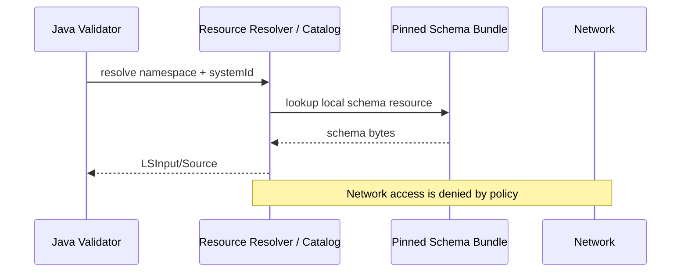
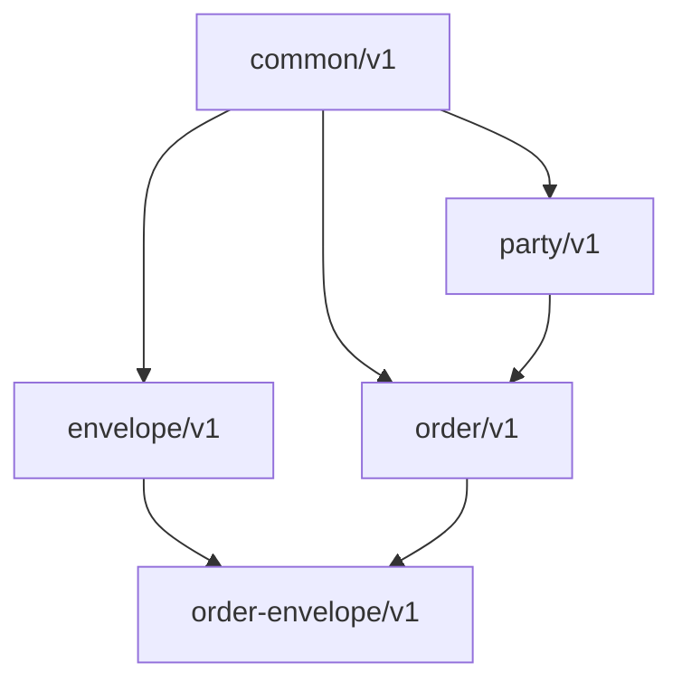
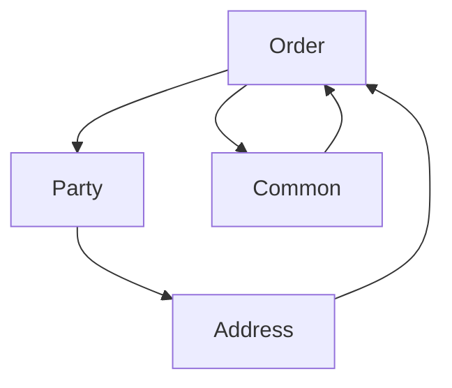
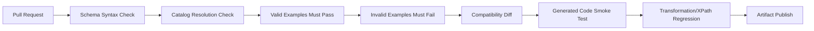
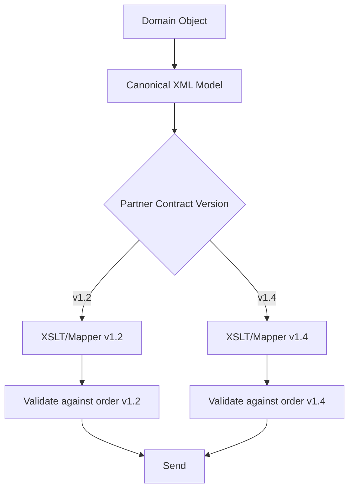
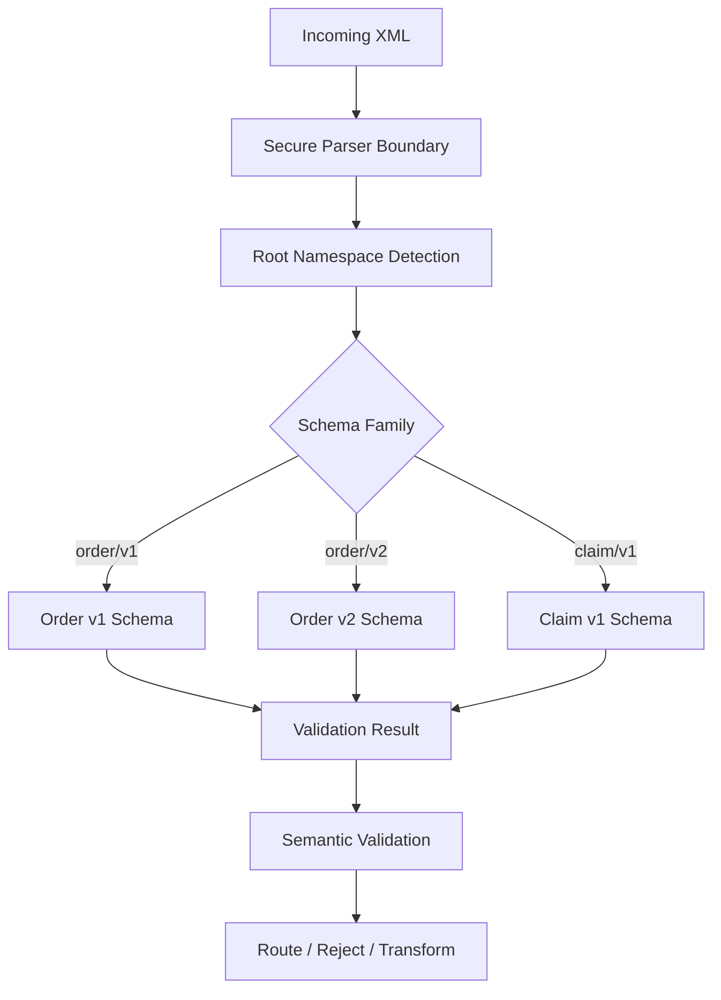

# Part 012 — XSD Modularization, Versioning, and Governance

## Tujuan Part Ini

Part ini membahas XSD sebagai artefak enterprise yang hidup lama.

Kita tidak lagi bertanya:

```text
Bagaimana menulis schema yang valid?
```

Kita bertanya:

```text
Bagaimana membuat schema yang bisa dibagi, direview, di-versioning, di-resolve secara deterministik,
berubah tanpa chaos, dan tetap defensible dalam integrasi production?
```

Target setelah part ini:

- memahami `include`, `import`, dan kapan memisahkan namespace;
- mendesain struktur folder schema yang maintainable;
- mengelola shared types tanpa membuat dependency graph berantakan;
- memahami namespace versioning vs document version field;
- merancang compatibility policy untuk producer dan consumer;
- menggunakan XML catalog/resource resolver untuk deterministic validation;
- membuat governance workflow untuk perubahan XSD;
- menghindari schema sprawl, circular dependency, dan breaking-change surprise.

Mental model:

```text
Schema design is API design.
Schema modularization is package design.
Schema versioning is compatibility engineering.
Schema governance is operational risk management.
```

---

## 1. Why Modularization Matters

Single-file XSD mudah di awal:

```text
order.xsd
```

Tetapi enterprise schema cepat tumbuh:

```text
Order
  Header
  Parties
  Addresses
  Lines
  Pricing
  Tax
  Discounts
  Attachments
  Audit
  Extensions
```

Kalau semua ditaruh dalam satu file:

- review diff menjadi sulit;
- reusable types bercampur dengan domain model;
- partner tidak tahu mana stable vs volatile;
- generated code menjadi besar dan tidak jelas;
- perubahan kecil menyebabkan konflik besar;
- ownership tidak bisa dipisah.

Modularization memberi struktur, tetapi juga memperkenalkan risiko dependency.

Good modularization:

```text
schema modules mirror conceptual ownership, not arbitrary file splitting.
```

---

## 2. XSD Module Types

Secara praktis, schema enterprise biasanya punya beberapa jenis modul.

| Module Type | Content | Owner |
|---|---|---|
| common primitive types | IDs, tokens, timestamps, money | platform/integration team |
| common business types | address, party, contact | domain shared governance |
| domain message schema | order, claim, invoice | domain service/team |
| envelope schema | headers, correlation, audit | integration/platform team |
| extension schema | partner/custom extensions | partner/domain governance |
| test schema | intentionally invalid/edge contracts | engineering/test team |

Example layout:

```text
schemas/
  common/v1/
    primitives.xsd
    identifiers.xsd
    temporal.xsd
    money.xsd
    audit.xsd
  party/v1/
    party.xsd
    address.xsd
  order/v1/
    order-message.xsd
    order-types.xsd
    order-line.xsd
  envelope/v1/
    integration-envelope.xsd
  catalog.xml
```

---

## 3. `include` vs `import`

This is foundational.

### 3.1 `xs:include`

Use `include` when the included schema has the **same target namespace** as the including schema.

```xml
<xs:include schemaLocation="order-types.xsd"/>
```

Conceptually:

```text
include = split one namespace across multiple files
```

Use it for:

- splitting large schema files;
- grouping same-domain types;
- keeping same namespace contract;
- avoiding one giant file.

Example:

```text
order/v1/order-message.xsd  targetNamespace=https://example.com/order/v1
order/v1/order-types.xsd    targetNamespace=https://example.com/order/v1
order/v1/order-line.xsd     targetNamespace=https://example.com/order/v1
```

`order-message.xsd` may include the others.

### 3.2 `xs:import`

Use `import` when referencing components from a **different namespace**.

```xml
<xs:import
    namespace="https://example.com/common/v1"
    schemaLocation="../../common/v1/primitives.xsd"/>
```

Conceptually:

```text
import = depend on another namespace
```

Use it for:

- common shared type libraries;
- domain-to-domain references;
- envelope-to-message composition;
- extension namespaces;
- standards-owned external schemas.

### 3.3 Quick Rule

```text
Same targetNamespace  -> include
Different namespace   -> import
No target namespace   -> be careful; usually avoid for enterprise contracts
```

---

## 4. Namespace Architecture

Namespace is not a folder name. Namespace is part of the contract identity.

Bad:

```xml
targetNamespace="http://tempuri.org"
```

Also weak:

```xml
targetNamespace="https://example.com/xml"
```

Better:

```xml
targetNamespace="https://example.com/contracts/order/v1"
```

Even better if organization has clear convention:

```text
https://{org-domain}/contracts/{domain}/{major-version}
https://{org-domain}/schemas/{domain}/{major-version}
urn:{org}:contracts:{domain}:v{major}
```

Examples:

```text
https://acme.example/contracts/common/v1
https://acme.example/contracts/party/v1
https://acme.example/contracts/order/v1
https://acme.example/contracts/envelope/v1
```

A namespace should answer:

- who owns this contract?
- what domain does it represent?
- what major compatibility family is this?
- is it stable enough to be referenced externally?

---

## 5. File Path Is Not Contract Identity

This is a common mistake.

```xml
<xs:import
    namespace="https://example.com/common/v1"
    schemaLocation="../../common/v1/common.xsd"/>
```

The `namespace` identifies the contract namespace. `schemaLocation` is a hint for locating schema material.

In production, never rely on remote/uncontrolled schema locations at validation time.

Bad:

```xml
<xs:import
    namespace="https://partner.example/schema/common/v1"
    schemaLocation="https://partner.example/schema/common-v1.xsd"/>
```

Problems:

- validation depends on network;
- partner may change content behind same URL;
- build is not reproducible;
- outage blocks processing;
- security risk if external fetch is enabled;
- audit cannot prove what schema was used later.

Better:

```text
Pin schema artifacts in your repository/artifact store.
Resolve namespaces and system IDs through XML catalog/resource resolver.
Disable arbitrary external access.
```

---

## 6. XML Catalog and Deterministic Resolution

Production validation must be deterministic.

A good validation system answers:

```text
For payload X at time T, exactly which schema bytes were used?
```

Use catalog-like mapping:

```xml
<catalog xmlns="urn:oasis:names:tc:entity:xmlns:xml:catalog">
  <uri
      name="https://example.com/contracts/common/v1/primitives.xsd"
      uri="schemas/common/v1/primitives.xsd"/>
  <uri
      name="https://example.com/contracts/order/v1/order-message.xsd"
      uri="schemas/order/v1/order-message.xsd"/>
</catalog>
```

In Java, this maps conceptually to resource resolution through:

- `LSResourceResolver` for schema imports/includes;
- JAXP catalog support where applicable;
- classpath resource resolver;
- artifact-pinned schema bundle;
- no-network validation policy.

Conceptual resolver flow:



Production invariant:

```text
Schema resolution must be explicit, local/pinned, auditable, and network-free by default.
```

---

## 7. Versioning Models

There are several ways to version XML contracts.

### 7.1 Namespace Major Versioning

```xml
targetNamespace="https://example.com/contracts/order/v1"
```

Next breaking version:

```xml
targetNamespace="https://example.com/contracts/order/v2"
```

Good for:

- major compatibility boundary;
- generated classes;
- routing;
- side-by-side validation;
- explicit partner contract negotiation.

Cost:

- namespace changes affect XML instance documents;
- XPath/XSLT mappings must handle new namespace;
- generated code package may change;
- consumers must upgrade intentionally.

### 7.2 Version Attribute or Element

```xml
<Order xmlns="https://example.com/contracts/order" schemaVersion="1.2">
```

or:

```xml
<Order xmlns="https://example.com/contracts/order">
  <SchemaVersion>1.2</SchemaVersion>
</Order>
```

Good for:

- minor version signalling;
- audit;
- routing within same namespace family;
- non-breaking additions.

Risk:

- schema cannot always branch easily by version value;
- same namespace with incompatible structures becomes confusing;
- generated code may not differentiate versions.

### 7.3 Artifact Versioning

The schema artifact itself has version:

```text
com.example.contracts:order-schema:1.4.2
```

Good for:

- build reproducibility;
- dependency management;
- deployment tracking;
- audit evidence.

But artifact version alone is not enough for external XML instance interpretation.

### 7.4 Recommended Strategy

Use layered versioning:

```text
Namespace        -> major compatibility family
SchemaVersion    -> minor/patch contract signal inside payload, if needed
Artifact version -> build/deployment/audit version of schema bundle
```

Example:

```text
Namespace:       https://example.com/contracts/order/v1
Payload version: 1.3
Artifact:        order-schema-bundle-1.3.7.jar
```

---

## 8. Compatibility Rules

Contract evolution must be classified.

### 8.1 Usually Backward-Compatible Changes

For consumers that ignore unknown optional content, these may be compatible:

- adding optional element at allowed extension point;
- adding optional attribute;
- relaxing `maxLength`;
- relaxing numeric upper bound;
- adding new optional complex substructure;
- adding documentation/annotation;
- widening pattern carefully.

But XML Schema content model ordering can make "add optional element" not always safe.

Example:

```xml
<xs:sequence>
  <xs:element name="A"/>
  <xs:element name="B" minOccurs="0"/>
  <xs:element name="C"/>
</xs:sequence>
```

Adding another optional element inside a sequence can create ambiguity or force ordering changes.

### 8.2 Breaking Changes

Usually breaking:

- removing an element/attribute;
- making optional element required;
- changing namespace;
- changing type to a narrower type;
- reducing `maxLength`;
- reducing numeric range;
- changing enum by removing value;
- changing element order;
- renaming element/type;
- changing meaning without changing structure;
- changing default/nil semantics;
- adding required field;
- changing `nillable` from true to false when clients send nil.

### 8.3 Grey-Area Changes

| Change | Risk |
|---|---|
| adding enum value | producer-compatible, consumer may fail generated enum handling |
| adding optional element | schema-compatible only if consumers tolerate it |
| making type wider | consumer DB/model may still be narrower |
| changing documentation | may change business interpretation |
| changing pattern to accept more | consumers may not handle new values |
| changing schemaLocation only | may break build/runtime resolution |

Production rule:

```text
Compatibility is not only XSD-validity. It includes generated code, XPath, XSLT, persistence, UI, reporting, and partner behavior.
```

---

## 9. Compatibility Matrix

Maintain a matrix.

| Producer Version | Consumer Version | Supported? | Validation Mode | Notes |
|---|---|---:|---|---|
| order v1.0 | order v1.0 | yes | strict v1.0 | baseline |
| order v1.1 | order v1.0 | conditional | strict v1.0 or tolerant | only if no new optional fields used |
| order v1.0 | order v1.1 | yes | strict v1.0/v1.1 | backward reader |
| order v2.0 | order v1.x | no | reject or transform | breaking namespace |
| order v1.x | order v2.0 | via adapter | transform then validate | migration path |

For large integrations, version policy should be explicit:

```text
- We accept v1.0 through v1.4 until 2027-06-30.
- We produce v1.4 by default.
- We can produce v1.2 for partner A until migration completion.
- v2 requires namespace change and onboarding test.
```

---

## 10. Extension Point Patterns

XML can support controlled extension.

### 10.1 `xs:any` Extension Point

```xml
<xs:complexType name="OrderExtensionType">
  <xs:sequence>
    <xs:any namespace="##other" processContents="lax" minOccurs="0" maxOccurs="unbounded"/>
  </xs:sequence>
</xs:complexType>
```

This allows elements from other namespaces.

`processContents` choices:

| Value | Meaning | Risk |
|---|---|---|
| `strict` | must validate if schema available | brittle unless schemas are available |
| `lax` | validate if possible | pragmatic for extensions |
| `skip` | no validation | flexible but weak |

Extension points are powerful but dangerous. They need governance.

### 10.2 Explicit Extension Container

```xml
<Order>
  <OrderId>ORD-2026-00000001</OrderId>
  <Extensions>
    <partner:RiskScore xmlns:partner="https://partner.example/extensions/risk/v1">87</partner:RiskScore>
  </Extensions>
</Order>
```

Benefits:

- extension data is isolated;
- core schema remains stable;
- routing/redaction can target extension section;
- validation policy can be explicit.

### 10.3 Avoid Extension Everywhere

Bad:

```xml
<xs:any minOccurs="0" maxOccurs="unbounded" processContents="skip"/>
```

inside every complex type.

Impact:

- contract becomes vague;
- invalid content hides in extensions;
- downstream transformations become fragile;
- security review becomes harder.

Rule:

```text
Extension points should be explicit, named, and placed at stable boundaries.
```

---

## 11. Modularization Dependency Graph

A healthy schema graph is mostly acyclic and layered.



Bad graph:



Circular dependency indicates unclear ownership or wrong abstraction.

Layering guideline:

```text
common primitives -> common business components -> domain messages -> envelope/composition -> partner-specific profiles
```

Do not let common modules import domain modules.

---

## 12. Schema Ownership Model

Every schema needs an owner.

| Artifact | Owner | Reviewers |
|---|---|---|
| common primitive types | platform/integration architecture | security, API governance |
| party/address | master data/domain team | consumers, legal/compliance if needed |
| order schema | order domain team | downstream consumers, integration team |
| envelope schema | platform/integration team | observability/security |
| partner extension | partner integration owner | domain owner, support |

Ownership responsibilities:

- maintain schema source;
- approve changes;
- publish versioned artifact;
- maintain migration guide;
- maintain sample payloads;
- maintain validation test suite;
- track consuming systems;
- manage deprecation timeline.

Without ownership, schema becomes shared mutable global state.

---

## 13. Schema Repository Structure

Example production repository:

```text
xml-contracts/
  README.md
  catalog.xml
  schemas/
    common/v1/
      primitives.xsd
      money.xsd
      temporal.xsd
      audit.xsd
    party/v1/
      party.xsd
      address.xsd
    order/v1/
      order.xsd
      order-types.xsd
      order-line.xsd
    order/v2/
      order.xsd
  examples/
    order/v1/
      valid/
        minimal-order.xml
        full-order.xml
      invalid/
        missing-order-id.xml
        invalid-amount-scale.xml
  tests/
    contract-cases.yml
  docs/
    changelog.md
    compatibility.md
    migration-v1-to-v2.md
  build.gradle
```

Key principles:

- schema and examples version together;
- invalid examples are first-class assets;
- catalog is versioned;
- changelog distinguishes breaking/non-breaking;
- generated documentation can be produced but source remains XSD;
- CI validates every example against intended schema.

---

## 14. CI/CD for XSD Contracts

Schema changes should go through automated checks.



Recommended checks:

| Check | Purpose |
|---|---|
| compile all schemas | catch syntax/import/include errors |
| no network resolution | ensure deterministic builds |
| validate valid examples | prevent accidental breaking |
| validate invalid examples | prevent accidental weakening |
| schema diff classification | detect breaking changes |
| generated code smoke test | catch binding impacts |
| XPath/XSLT regression | catch namespace/path breakage |
| sample payload canonical compare | detect serialization drift |
| SBOM/artifact hash | audit artifact identity |

---

## 15. Schema Diff Is Not Text Diff

Text diff is useful but insufficient.

Example text diff:

```diff
- <xs:maxLength value="40"/>
+ <xs:maxLength value="64"/>
```

This is likely compatible.

Another diff:

```diff
- <xs:minOccurs value="0"/>
+ <xs:minOccurs value="1"/>
```

Depending on syntax, making optional required is breaking.

Schema review should classify semantic changes:

| Change | Classification |
|---|---|
| add optional element at end of sequence | maybe compatible |
| add required element | breaking |
| remove optional element | breaking for producers? maybe for consumers |
| widen maxLength | usually compatible |
| narrow maxLength | breaking |
| add enum value | grey area |
| remove enum value | breaking |
| change namespace | breaking |
| change annotation only | non-breaking unless semantics changed |

For critical systems, maintain a human review checklist. Automated diff tools help, but contract semantics require judgement.

---

## 16. Consumer Tolerance Strategy

An XML consumer can be strict or tolerant.

### 16.1 Strict Consumer

```text
Validate exactly against known schema.
Reject unknown content.
```

Good for:

- regulatory submission;
- payment instruction;
- legally binding document;
- internal state transition input;
- security-sensitive boundary.

### 16.2 Tolerant Consumer

```text
Accept known schema family.
Ignore or preserve extension content.
Route unknown minor additions if safe.
```

Good for:

- partner feeds with extension points;
- analytics ingestion;
- archival/replay systems;
- migration periods;
- read-only downstream consumers.

### 16.3 Best Practice

Be strict at trust boundaries, tolerant at evolution boundaries.

```text
External untrusted ingest -> strict security + schema validation
Internal routing during migration -> controlled tolerance
Archive/replay -> preserve unknown data if possible
State-changing command -> strict semantic validation
```

---

## 17. Producer Compatibility Strategy

Producers also need version discipline.

Rules:

- do not emit new optional fields to all partners immediately;
- support partner-specific output profile during migration;
- publish sample payloads per version;
- record schema version used for each produced message;
- keep old version generation until deprecation window closes;
- avoid changing lexical representation casually.

Example producer flow:



Never assume one latest schema can serve all partners.

---

## 18. Schema Bundle as Deployable Artifact

Treat schema set as a deployable artifact.

Example Maven coordinates:

```xml
<dependency>
  <groupId>com.example.contracts</groupId>
  <artifactId>order-xml-contracts</artifactId>
  <version>1.4.2</version>
</dependency>
```

Artifact contains:

```text
/META-INF/xml-catalog.xml
/schemas/common/v1/*.xsd
/schemas/order/v1/*.xsd
/examples/order/v1/valid/*.xml
/examples/order/v1/invalid/*.xml
/docs/changelog.md
```

Benefits:

- reproducible validation;
- consistent producer/consumer toolchain;
- artifact hash for audit;
- rollback possible;
- service can report active contract artifact version.

Runtime metadata to log:

```json
{
  "schemaNamespace": "https://example.com/contracts/order/v1",
  "schemaArtifact": "com.example.contracts:order-xml-contracts:1.4.2",
  "schemaHash": "sha256:...",
  "validationMode": "STRICT",
  "payloadSchemaVersion": "1.4"
}
```

---

## 19. Multi-Version Validation Service Pattern

For enterprise systems, schema validation often becomes a service/library.



Key design choices:

- root namespace chooses schema family;
- schema version field may choose minor schema/profile;
- validation result includes error code, line, column, schema version;
- validation does not fetch network resources;
- schema objects are precompiled and cached;
- resolver is allowlisted;
- metrics track failure by namespace/version/error category.

---

## 20. Deprecation and Migration

Schema deprecation should be explicit.

Example policy:

```text
2026-01-01: order v2 published
2026-03-01: new partners onboard only on v2
2026-06-30: v1 producer support frozen
2026-12-31: v1 accepted only for approved partners
2027-03-31: v1 rejected at external boundary
```

Migration artifacts:

- migration guide;
- mapping table v1 -> v2;
- sample payload before/after;
- XSLT transformer if feasible;
- compatibility matrix;
- partner certification tests;
- replay test plan;
- rollback plan;
- support playbook.

Important: do not remove old schema artifacts from archive. Keep them for replay, dispute resolution, and audit.

---

## 21. Governance Workflow

A practical governance workflow:

```text
1. Change proposal
2. Compatibility classification
3. Impact analysis
4. Schema change PR
5. Example payload update
6. Validation test update
7. Consumer review
8. Security/resolver review if imports change
9. Artifact release
10. Partner/internal rollout
11. Deprecation tracking
```

Change proposal should include:

| Field | Required Content |
|---|---|
| reason | why change is needed |
| affected namespace | exact namespace(s) |
| affected files | XSD and examples |
| compatibility | breaking / non-breaking / grey area |
| consumers | known impacted systems |
| rollout | producer/consumer sequencing |
| fallback | rollback or dual support plan |
| test evidence | valid/invalid fixtures |
| audit impact | payload interpretation changes |

---

## 22. Anti-Patterns

### 22.1 Shared `common.xsd` Becomes Global Junk Drawer

Symptom:

```text
common.xsd contains OrderStatusType, PaymentMethodType, CustomerSegmentType, TaxRuleType, ClaimReasonType...
```

Impact:

- unrelated teams coupled;
- every change becomes global;
- circular dependencies appear;
- no clear owner.

Fix:

```text
Keep common primitive. Move domain vocabulary into domain modules.
```

### 22.2 Namespace Never Changes Despite Breaking Changes

Symptom:

```text
https://example.com/contracts/order/v1
```

but structure changes incompatibly.

Impact:

- consumers fail unpredictably;
- validators disagree depending on artifact version;
- audit cannot infer payload meaning from namespace;
- partner contracts become disputed.

Fix:

```text
Use major namespace version for breaking changes.
```

### 22.3 Runtime Fetches Schema from Internet

Symptom:

```text
Production validation fetches imported schemaLocation over HTTP.
```

Impact:

- outage risk;
- SSRF-like behavior;
- non-reproducible validation;
- dependency confusion;
- slow processing.

Fix:

```text
Pin schemas locally and deny network access.
```

### 22.4 All Modules Import All Modules

Symptom:

```text
order imports common, common imports order, party imports order, envelope imports everything.
```

Impact:

- impossible upgrade path;
- generated code tangled;
- no clear ownership.

Fix:

```text
Enforce layered schema dependency graph.
```

### 22.5 Optional Additions Without Consumer Testing

Symptom:

```text
Team adds optional element and calls it non-breaking.
```

Impact:

- strict consumers reject unknown element;
- XPath positional assumptions break;
- XSLT templates ignore or mishandle data;
- generated binding fails if schema changes are not deployed.

Fix:

```text
Run consumer compatibility suite before classifying non-breaking.
```

---

## 23. Production Review Checklist

Before publishing schema changes:

- [ ] Does every XSD file have clear target namespace policy?
- [ ] Are `include` and `import` used correctly?
- [ ] Are schema dependencies acyclic or intentionally layered?
- [ ] Are schema locations resolved locally/pinned?
- [ ] Is arbitrary external resource access disabled?
- [ ] Is namespace version aligned with compatibility impact?
- [ ] Is artifact version recorded and published?
- [ ] Are valid and invalid examples updated?
- [ ] Is schema diff classified semantically?
- [ ] Are generated code impacts tested?
- [ ] Are XPath/XSLT mappings regression-tested?
- [ ] Are old schemas preserved for replay/audit?
- [ ] Is there a compatibility matrix?
- [ ] Are consumers and partners identified?
- [ ] Is deprecation timeline documented?
- [ ] Are extension points explicit and governed?
- [ ] Is `common` kept small and stable?

---

## 24. Kaufman Practice Drill

### Drill 1 — Refactor a Monolithic Schema

Start with one large schema:

```text
order.xsd
```

Refactor into:

```text
common/v1/primitives.xsd
common/v1/money.xsd
party/v1/address.xsd
order/v1/order-types.xsd
order/v1/order.xsd
```

Rules:

- same namespace split uses `include`;
- cross-namespace references use `import`;
- no circular imports;
- all schema locations resolved through local bundle/catalog;
- all examples still validate.

### Drill 2 — Classify Changes

Classify each as breaking, non-breaking, or grey area:

1. Add optional element to end of sequence.
2. Add required element.
3. Change `maxLength` from 40 to 64.
4. Change `maxLength` from 64 to 40.
5. Add enum value.
6. Remove enum value.
7. Change namespace from v1 to v2.
8. Add `xs:any` extension point.
9. Change `xs:string` to `xs:token`.
10. Add `nillable="true"`.

Then explain consumer impact beyond validation.

### Drill 3 — Build a Schema Governance PR Template

Create a PR template with:

```text
- Change summary
- Compatibility classification
- Affected namespaces
- Affected files
- Consumer impact
- Producer impact
- Example payloads
- Invalid fixtures
- Migration notes
- Rollback plan
- Security/resource resolution impact
```

This creates self-correction loop for contract design.

---

## 25. Key Takeaways

- `include` splits the same namespace; `import` references another namespace.
- Namespace is contract identity, not merely a URL or folder name.
- File paths and `schemaLocation` are resolution hints; production should use pinned local resolution.
- Versioning needs layers: namespace major version, payload version signal, and artifact version.
- Compatibility is broader than XSD validity; it includes generated code, XPath, XSLT, persistence, and partner behavior.
- Extension points should be explicit, bounded, and governed.
- Schema bundles should be deployable, testable, reproducible artifacts.
- Governance is not bureaucracy; it is how schema contracts remain safe under change.

---

## References

- W3C, *XML Schema Definition Language (XSD) 1.1 Part 1: Structures*.
- W3C, *XML Schema Definition Language (XSD) 1.1 Part 2: Datatypes*.
- Oracle Java Documentation, `javax.xml.validation` package and `SchemaFactory` API.
- OASIS XML Catalogs concepts for deterministic resource resolution.
