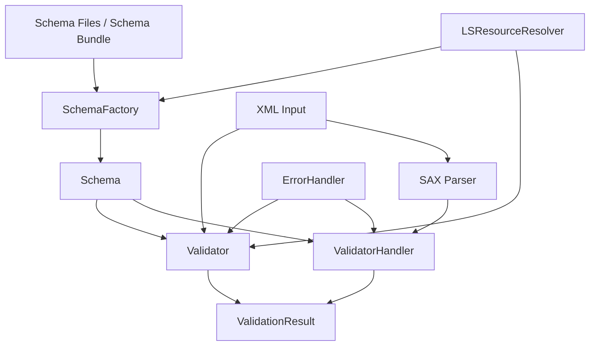
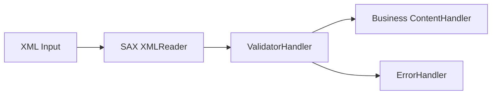
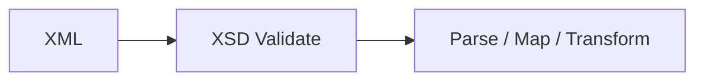
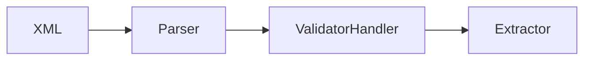
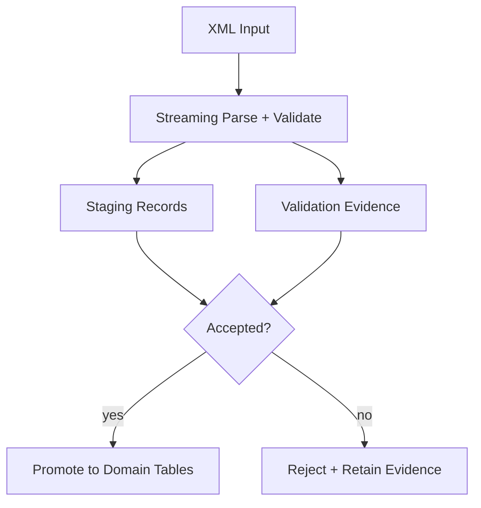
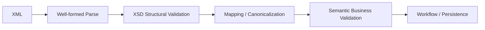
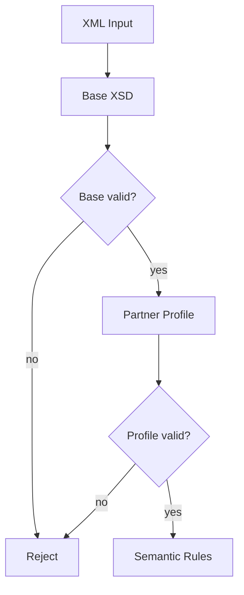
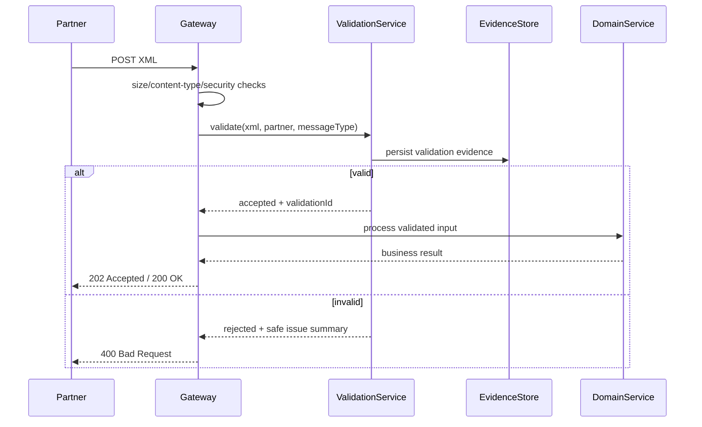
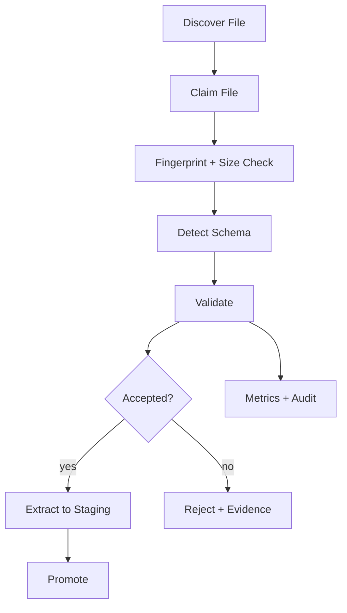

# Part 013 — Java XSD Validation Pipeline

## Tujuan Part Ini

Part sebelumnya membahas XSD sebagai kontrak yang modular, versioned, dan governed. Sekarang kita masuk ke sisi implementasi Java:

```text
Bagaimana mengubah XSD menjadi validation pipeline yang aman, cepat, observable, deterministik,
dan bisa dipertanggungjawabkan saat terjadi dispute production?
```

Target setelah part ini:

- memahami lifecycle `SchemaFactory`, `Schema`, `Validator`, dan `ValidatorHandler`;
- tahu kapan validasi dilakukan sebelum parsing, saat streaming, setelah parsing, atau di beberapa stage;
- membuat error report yang berguna untuk manusia dan mesin;
- mengamankan schema resolution agar tidak melakukan network access liar;
- mendesain schema cache dan validator lifecycle yang thread-safe;
- membedakan validation error, parse error, semantic error, dan policy error;
- membangun validation service yang production-grade.

Mental model:

```text
XSD validation is not a boolean check.
It is a boundary-control pipeline that converts untrusted XML into classified evidence.
```

---

## 1. Validation Is a Boundary, Not a Utility Method

Banyak codebase memperlakukan validasi XSD seperti ini:

```java
validate(xmlFile, xsdFile);
```

Secara teknis bisa jalan. Secara production sering tidak cukup.

Sebuah validation pipeline harus menjawab:

| Question | Why It Matters |
|---|---|
| Schema versi mana yang dipakai? | Untuk audit, replay, dan compatibility. |
| Apakah schema dependency di-resolve deterministik? | Untuk mencegah hasil validasi berubah karena network/file system. |
| Apakah parser aman dari XXE/entity expansion? | XML input sering berasal dari partner/untrusted source. |
| Apakah error bisa dikaitkan ke line/column/path? | Untuk debugging dan dispute. |
| Apakah semua error dikumpulkan atau fail-fast? | Untuk UX, batch processing, dan SLA. |
| Apakah hasil validasi disimpan sebagai evidence? | Untuk regulatory defensibility. |
| Apakah validasi menghalangi throughput? | Untuk batch besar dan event pipeline. |

A good validation boundary does not merely return `true` or `false`.

It returns:

```text
ValidationResult
  accepted/rejected
  schema identity
  parser policy
  error list
  warning list
  resource resolution trace
  input fingerprint
  timing and size metrics
```

---

## 2. Java Validation API Mental Model

Package utama adalah:

```java
javax.xml.validation
```

Core objects:

| Type | Role | Lifecycle |
|---|---|---|
| `SchemaFactory` | Membuat `Schema` dari XSD | Configure once per schema language/policy |
| `Schema` | Immutable grammar representation | Cache/reuse |
| `Validator` | Validates one document/source | Create per validation/request |
| `ValidatorHandler` | Streaming validator on SAX events | Create per streaming pipeline |
| `LSResourceResolver` | Resolves imported/included schema resources | Deterministic policy object |
| `ErrorHandler` | Receives warning/error/fatalError | Per validation context |

Diagram:



Important invariant:

```text
Schema is the reusable compiled grammar.
Validator is the per-run validation processor.
```

Do not cache and share a mutable `Validator` across threads.

---

## 3. Minimal XSD Validation in Java

A simple baseline:

```java
import javax.xml.XMLConstants;
import javax.xml.transform.stream.StreamSource;
import javax.xml.validation.Schema;
import javax.xml.validation.SchemaFactory;
import javax.xml.validation.Validator;
import java.nio.file.Path;

public final class MinimalXsdValidation {

    public static void validate(Path xml, Path xsd) throws Exception {
        SchemaFactory factory = SchemaFactory.newInstance(XMLConstants.W3C_XML_SCHEMA_NS_URI);
        Schema schema = factory.newSchema(xsd.toFile());
        Validator validator = schema.newValidator();
        validator.validate(new StreamSource(xml.toFile()));
    }
}
```

This is acceptable for learning.

It is not enough for production because it does not define:

- secure parser limits;
- external resource access policy;
- resource resolution policy;
- structured error handling;
- schema version identity;
- observability;
- deterministic schema bundle loading.

---

## 4. Production Validation Result Model

Start by rejecting the primitive result type:

```java
boolean valid;
```

Use a domain object:

```java
import java.time.Duration;
import java.util.List;
import java.util.Map;

public record XmlValidationResult(
        boolean accepted,
        String schemaId,
        String schemaVersion,
        String inputFingerprint,
        long inputSizeBytes,
        Duration elapsed,
        List<XmlValidationIssue> issues,
        Map<String, String> diagnostics
) {
    public boolean hasErrors() {
        return issues.stream().anyMatch(XmlValidationIssue::isError);
    }
}
```

Issue model:

```java
public record XmlValidationIssue(
        Severity severity,
        String code,
        String message,
        Integer line,
        Integer column,
        String systemId,
        String publicId,
        String xmlPathHint
) {
    public boolean isError() {
        return severity == Severity.ERROR || severity == Severity.FATAL;
    }
}

enum Severity {
    WARNING,
    ERROR,
    FATAL
}
```

Avoid exposing raw parser messages directly to external clients. Parser messages can leak file paths, system identifiers, schema layout, or internal implementation details.

Recommended external error response:

```json
{
  "accepted": false,
  "errorType": "XML_SCHEMA_VALIDATION_FAILED",
  "correlationId": "b7de7a2a-9d9c-4e30-9e7a-7e97d8d9b31a",
  "issues": [
    {
      "severity": "ERROR",
      "message": "The request document does not match the expected schema.",
      "line": 42,
      "column": 17
    }
  ]
}
```

Internal diagnostic event can be richer.

---

## 5. ErrorHandler That Collects Errors

`Validator.validate(...)` normally throws on validation failure. For batch UX, partner onboarding, and schema testing, you often want to collect issues.

```java
import org.xml.sax.ErrorHandler;
import org.xml.sax.SAXException;
import org.xml.sax.SAXParseException;

import java.util.ArrayList;
import java.util.List;

public final class CollectingErrorHandler implements ErrorHandler {

    private final List<XmlValidationIssue> issues = new ArrayList<>();

    @Override
    public void warning(SAXParseException exception) throws SAXException {
        issues.add(toIssue(Severity.WARNING, exception));
    }

    @Override
    public void error(SAXParseException exception) throws SAXException {
        issues.add(toIssue(Severity.ERROR, exception));
        // Do not throw if you want to keep collecting recoverable errors.
    }

    @Override
    public void fatalError(SAXParseException exception) throws SAXException {
        issues.add(toIssue(Severity.FATAL, exception));
        throw exception;
    }

    public List<XmlValidationIssue> issues() {
        return List.copyOf(issues);
    }

    private static XmlValidationIssue toIssue(Severity severity, SAXParseException e) {
        return new XmlValidationIssue(
                severity,
                "XML_SCHEMA_VALIDATION_" + severity.name(),
                e.getMessage(),
                e.getLineNumber() >= 0 ? e.getLineNumber() : null,
                e.getColumnNumber() >= 0 ? e.getColumnNumber() : null,
                e.getSystemId(),
                e.getPublicId(),
                null
        );
    }
}
```

Important nuance:

```text
Collecting validation errors is not guaranteed to produce every possible error.
After one structural error, the parser/validator may not be able to infer later structure correctly.
```

So use wording like:

```text
The validator reported these issues.
```

not:

```text
These are all issues in the document.
```

---

## 6. Secure SchemaFactory Configuration

Validation has two resource categories:

1. XML input resources: entities, DTD, external references.
2. Schema resources: XSD `include`, `import`, `redefine`, external schema locations.

Configure the factory explicitly:

```java
import javax.xml.XMLConstants;
import javax.xml.validation.SchemaFactory;

public final class SecureSchemaFactories {

    public static SchemaFactory newSecureXsdFactory() throws Exception {
        SchemaFactory factory = SchemaFactory.newInstance(XMLConstants.W3C_XML_SCHEMA_NS_URI);

        factory.setFeature(XMLConstants.FEATURE_SECURE_PROCESSING, true);

        // Deny external access by default.
        factory.setProperty(XMLConstants.ACCESS_EXTERNAL_DTD, "");
        factory.setProperty(XMLConstants.ACCESS_EXTERNAL_SCHEMA, "");

        return factory;
    }
}
```

For validator instances:

```java
Validator validator = schema.newValidator();
validator.setProperty(XMLConstants.ACCESS_EXTERNAL_DTD, "");
validator.setProperty(XMLConstants.ACCESS_EXTERNAL_SCHEMA, "");
```

Production default:

```text
No HTTP.
No arbitrary file access.
No runtime schema download.
No dependency on schemaLocation hints from untrusted XML.
```

If external access is allowed at all, it should be explicit, allowlisted, logged, and ideally resolved from immutable artifact storage.

---

## 7. Deterministic Schema Resolution

XSD files often contain:

```xml
<xs:include schemaLocation="common-types.xsd"/>
<xs:import namespace="https://example.com/schema/common" schemaLocation="../common/common.xsd"/>
```

Default resolution can become ambiguous:

- relative to current working directory;
- relative to process start location;
- relative to deployment layout;
- accidentally resolved from network;
- accidentally resolved differently in tests and production.

Use `LSResourceResolver`.

```java
import org.w3c.dom.ls.LSInput;
import org.w3c.dom.ls.LSResourceResolver;

import java.io.InputStream;
import java.util.Map;

public final class ClasspathSchemaResolver implements LSResourceResolver {

    private final Map<String, String> namespaceToClasspathResource;

    public ClasspathSchemaResolver(Map<String, String> namespaceToClasspathResource) {
        this.namespaceToClasspathResource = Map.copyOf(namespaceToClasspathResource);
    }

    @Override
    public LSInput resolveResource(
            String type,
            String namespaceURI,
            String publicId,
            String systemId,
            String baseURI
    ) {
        String resource = namespaceToClasspathResource.get(namespaceURI);
        if (resource == null) {
            throw new IllegalArgumentException(
                    "Schema namespace is not allowlisted: " + namespaceURI + ", systemId=" + systemId
            );
        }

        InputStream in = Thread.currentThread()
                .getContextClassLoader()
                .getResourceAsStream(resource);

        if (in == null) {
            throw new IllegalStateException("Schema resource not found: " + resource);
        }

        return new SimpleLsInput(publicId, systemId, in);
    }
}
```

`LSInput` implementation:

```java
import org.w3c.dom.ls.LSInput;

import java.io.InputStream;
import java.io.Reader;

public final class SimpleLsInput implements LSInput {
    private String publicId;
    private String systemId;
    private InputStream byteStream;

    public SimpleLsInput(String publicId, String systemId, InputStream byteStream) {
        this.publicId = publicId;
        this.systemId = systemId;
        this.byteStream = byteStream;
    }

    @Override public Reader getCharacterStream() { return null; }
    @Override public void setCharacterStream(Reader characterStream) { }
    @Override public InputStream getByteStream() { return byteStream; }
    @Override public void setByteStream(InputStream byteStream) { this.byteStream = byteStream; }
    @Override public String getStringData() { return null; }
    @Override public void setStringData(String stringData) { }
    @Override public String getSystemId() { return systemId; }
    @Override public void setSystemId(String systemId) { this.systemId = systemId; }
    @Override public String getPublicId() { return publicId; }
    @Override public void setPublicId(String publicId) { this.publicId = publicId; }
    @Override public String getBaseURI() { return null; }
    @Override public void setBaseURI(String baseURI) { }
    @Override public String getEncoding() { return null; }
    @Override public void setEncoding(String encoding) { }
    @Override public boolean getCertifiedText() { return false; }
    @Override public void setCertifiedText(boolean certifiedText) { }
}
```

Attach it to the factory:

```java
SchemaFactory factory = SecureSchemaFactories.newSecureXsdFactory();
factory.setResourceResolver(new ClasspathSchemaResolver(Map.of(
        "https://example.com/schema/common", "schemas/common/common.xsd",
        "https://example.com/schema/order", "schemas/order/order.xsd"
)));
```

Design invariant:

```text
Schema resolution should be a policy, not an accident.
```

---

## 8. Schema Bundle as Deployable Artifact

Do not deploy random `.xsd` files scattered through the repo.

Create a schema bundle:

```text
schemas/
  manifest.json
  order/
    order-v1.xsd
  common/
    common-v1.xsd
  catalog/
    schema-map.properties
```

Example manifest:

```json
{
  "schemaId": "order-message",
  "schemaVersion": "1.4.0",
  "targetNamespace": "https://example.com/schema/order/v1",
  "entrypoint": "schemas/order/order-v1.xsd",
  "dependencies": [
    {
      "namespace": "https://example.com/schema/common/v1",
      "resource": "schemas/common/common-v1.xsd",
      "sha256": "..."
    }
  ]
}
```

Benefits:

- deterministic deployment;
- reproducible validation;
- audit-friendly schema identity;
- compatibility testing;
- cached compilation;
- easier rollback.

In regulated systems, a validation result without schema identity is weak evidence.

---

## 9. Compiling and Caching Schema

Compiling schema can be expensive. Cache `Schema`, not `Validator`.

```java
import javax.xml.transform.stream.StreamSource;
import javax.xml.validation.Schema;
import javax.xml.validation.SchemaFactory;
import java.util.concurrent.ConcurrentHashMap;
import java.util.concurrent.ConcurrentMap;

public final class SchemaRegistry {

    private final ConcurrentMap<String, Schema> cache = new ConcurrentHashMap<>();
    private final SchemaFactory factory;

    public SchemaRegistry(SchemaFactory factory) {
        this.factory = factory;
    }

    public Schema getOrCompile(SchemaDescriptor descriptor) {
        return cache.computeIfAbsent(descriptor.cacheKey(), ignored -> compile(descriptor));
    }

    private Schema compile(SchemaDescriptor descriptor) {
        try {
            return factory.newSchema(new StreamSource(
                    descriptor.entrypointInputStream(),
                    descriptor.entrypointSystemId()
            ));
        } catch (Exception e) {
            throw new SchemaCompilationException(descriptor.cacheKey(), e);
        }
    }
}
```

Descriptor example:

```java
public record SchemaDescriptor(
        String schemaId,
        String schemaVersion,
        String targetNamespace,
        String entrypointSystemId
) {
    public String cacheKey() {
        return schemaId + ":" + schemaVersion + ":" + targetNamespace;
    }

    public java.io.InputStream entrypointInputStream() {
        java.io.InputStream in = Thread.currentThread()
                .getContextClassLoader()
                .getResourceAsStream(entrypointSystemId);
        if (in == null) {
            throw new IllegalStateException("Schema not found: " + entrypointSystemId);
        }
        return in;
    }
}
```

Rule:

```text
Schema cache key must include contract identity, not just file name.
```

Bad cache key:

```text
order.xsd
```

Good cache key:

```text
order-message:v1.4.0:https://example.com/schema/order/v1
```

---

## 10. Full Validation Service Skeleton

```java
import javax.xml.XMLConstants;
import javax.xml.transform.stream.StreamSource;
import javax.xml.validation.Schema;
import javax.xml.validation.Validator;
import java.io.InputStream;
import java.security.MessageDigest;
import java.time.Duration;
import java.time.Instant;
import java.util.HashMap;
import java.util.List;
import java.util.Map;

public final class XsdValidationService {

    private final SchemaRegistry schemaRegistry;

    public XsdValidationService(SchemaRegistry schemaRegistry) {
        this.schemaRegistry = schemaRegistry;
    }

    public XmlValidationResult validate(
            InputStream xmlInput,
            long inputSizeBytes,
            SchemaDescriptor schemaDescriptor
    ) {
        Instant started = Instant.now();
        CollectingErrorHandler errorHandler = new CollectingErrorHandler();
        String fingerprint = null;

        try {
            byte[] xmlBytes = xmlInput.readAllBytes();
            fingerprint = sha256Hex(xmlBytes);

            Schema schema = schemaRegistry.getOrCompile(schemaDescriptor);
            Validator validator = schema.newValidator();

            validator.setErrorHandler(errorHandler);
            validator.setProperty(XMLConstants.ACCESS_EXTERNAL_DTD, "");
            validator.setProperty(XMLConstants.ACCESS_EXTERNAL_SCHEMA, "");

            validator.validate(new StreamSource(new java.io.ByteArrayInputStream(xmlBytes)));

            List<XmlValidationIssue> issues = errorHandler.issues();
            boolean accepted = issues.stream().noneMatch(XmlValidationIssue::isError);

            return result(accepted, schemaDescriptor, fingerprint, inputSizeBytes, started, issues, Map.of());
        } catch (Exception e) {
            List<XmlValidationIssue> issues = mergeException(errorHandler.issues(), e);
            return result(false, schemaDescriptor, fingerprint, inputSizeBytes, started, issues, diagnostic(e));
        }
    }

    private static XmlValidationResult result(
            boolean accepted,
            SchemaDescriptor schemaDescriptor,
            String fingerprint,
            long inputSizeBytes,
            Instant started,
            List<XmlValidationIssue> issues,
            Map<String, String> diagnostics
    ) {
        return new XmlValidationResult(
                accepted,
                schemaDescriptor.schemaId(),
                schemaDescriptor.schemaVersion(),
                fingerprint,
                inputSizeBytes,
                Duration.between(started, Instant.now()),
                issues,
                diagnostics
        );
    }

    private static String sha256Hex(byte[] bytes) throws Exception {
        MessageDigest md = MessageDigest.getInstance("SHA-256");
        byte[] digest = md.digest(bytes);
        StringBuilder sb = new StringBuilder(digest.length * 2);
        for (byte b : digest) {
            sb.append(String.format("%02x", b));
        }
        return sb.toString();
    }

    private static List<XmlValidationIssue> mergeException(List<XmlValidationIssue> existing, Exception e) {
        if (!existing.isEmpty()) {
            return existing;
        }
        return List.of(new XmlValidationIssue(
                Severity.FATAL,
                "XML_VALIDATION_EXCEPTION",
                e.getMessage(),
                null,
                null,
                null,
                null,
                null
        ));
    }

    private static Map<String, String> diagnostic(Exception e) {
        Map<String, String> map = new HashMap<>();
        map.put("exceptionType", e.getClass().getName());
        return map;
    }
}
```

This skeleton reads all bytes to compute fingerprint. For very large files, use a teeing stream or compute digest while streaming.

---

## 11. Validation Source Types

`Validator.validate(Source)` supports multiple `Source` types.

Common options:

| Source | Use Case | Trade-Off |
|---|---|---|
| `StreamSource` | file/input stream validation | simple, streaming-capable depending on processor |
| `SAXSource` | validation from configured SAX parser | best for secure parser control |
| `DOMSource` | validate already-built DOM | convenient but memory-heavy |
| `StAXSource` | validate StAX reader/event reader | useful in streaming pipelines |

Example with `DOMSource`:

```java
import javax.xml.transform.dom.DOMSource;

validator.validate(new DOMSource(document));
```

Use this only when DOM already exists for another reason. Do not build DOM just to validate a 500 MB document.

---

## 12. SAXSource for Secure Parser Control

If you need strict parser feature control, create an `XMLReader` explicitly.

```java
import org.xml.sax.InputSource;
import org.xml.sax.XMLReader;

import javax.xml.parsers.SAXParserFactory;
import javax.xml.transform.sax.SAXSource;
import javax.xml.validation.Validator;
import java.io.InputStream;

public final class SaxSourceValidation {

    public static void validateWithControlledSax(
            InputStream xml,
            Validator validator
    ) throws Exception {
        SAXParserFactory spf = SAXParserFactory.newInstance();
        spf.setNamespaceAware(true);
        spf.setFeature(javax.xml.XMLConstants.FEATURE_SECURE_PROCESSING, true);
        spf.setFeature("http://apache.org/xml/features/disallow-doctype-decl", true);
        spf.setFeature("http://xml.org/sax/features/external-general-entities", false);
        spf.setFeature("http://xml.org/sax/features/external-parameter-entities", false);

        XMLReader reader = spf.newSAXParser().getXMLReader();
        SAXSource source = new SAXSource(reader, new InputSource(xml));
        validator.validate(source);
    }
}
```

This pattern is useful when you need to guarantee parser behavior across environments.

---

## 13. Streaming Validation with ValidatorHandler

`ValidatorHandler` sits inside a SAX event pipeline.

Use it when you want:

- validation and extraction in one pass;
- validation before passing events to business handler;
- large payload processing;
- event pipeline composition.

Pipeline:



Example:

```java
import org.xml.sax.InputSource;
import org.xml.sax.XMLReader;

import javax.xml.parsers.SAXParserFactory;
import javax.xml.validation.Schema;
import javax.xml.validation.ValidatorHandler;
import java.io.InputStream;

public final class StreamingValidationPipeline {

    public static void validateAndExtract(
            InputStream xml,
            Schema schema,
            org.xml.sax.ContentHandler businessHandler,
            org.xml.sax.ErrorHandler errorHandler
    ) throws Exception {
        SAXParserFactory spf = SAXParserFactory.newInstance();
        spf.setNamespaceAware(true);
        spf.setFeature(javax.xml.XMLConstants.FEATURE_SECURE_PROCESSING, true);

        XMLReader reader = spf.newSAXParser().getXMLReader();

        ValidatorHandler validatorHandler = schema.newValidatorHandler();
        validatorHandler.setErrorHandler(errorHandler);
        validatorHandler.setContentHandler(businessHandler);

        reader.setContentHandler(validatorHandler);
        reader.parse(new InputSource(xml));
    }
}
```

Important detail:

```text
ValidatorHandler validates SAX events. It does not own input parsing.
The upstream XMLReader still needs secure configuration.
```

---

## 14. Validate Then Parse vs Parse While Validate

There are two dominant designs.

### 14.1 Validate Then Parse



Pros:

- simpler mental model;
- clear boundary;
- business code sees only structurally valid XML;
- easier failure isolation.

Cons:

- may require two passes;
- expensive for huge files;
- fingerprint/stream management more complex;
- cannot short-circuit business extraction until validation completes.

Use for:

- small to medium payloads;
- API requests;
- onboarding partner integrations;
- regulatory documents where evidence clarity matters.

### 14.2 Parse While Validate



Pros:

- single pass;
- lower memory;
- can integrate with SAX streaming extraction;
- good for batch files.

Cons:

- handler composition is more complex;
- error and extraction state must be carefully coordinated;
- business handler may receive some events before a later validation failure.

Use for:

- large XML files;
- batch ingestion;
- ETL-like pipelines;
- high-throughput internal integration.

Production pattern:

```text
If side effects happen during streaming extraction, buffer or stage them until validation outcome is known.
```

Never commit irreversible business changes before validation acceptance is finalized.

---

## 15. Validation Staging Pattern

For large files, do not insert domain rows directly while parsing unless you have a rollback strategy.

Better pattern:



Staging table example:

```sql
create table xml_ingest_staging (
    ingest_id uuid not null,
    record_number bigint not null,
    record_type varchar(100) not null,
    payload_hash varchar(64) not null,
    extracted_json jsonb not null,
    validation_status varchar(30) not null,
    created_at timestamp not null,
    primary key (ingest_id, record_number)
);
```

This gives:

- replayability;
- auditability;
- partial diagnostics;
- controlled promotion;
- safer retry semantics.

---

## 16. Fail-Fast vs Error Aggregation

Validation mode should be explicit.

| Mode | Behavior | Good For |
|---|---|---|
| Fail-fast | Stop at first serious issue | API latency, attack surface reduction |
| Collect recoverable errors | Gather multiple issues | partner testing, UI feedback, QA |
| Hybrid | Stop after threshold | batch safety, noisy invalid payloads |

Example threshold handler:

```java
public final class ThresholdErrorHandler implements org.xml.sax.ErrorHandler {
    private final int maxErrors;
    private final java.util.List<XmlValidationIssue> issues = new java.util.ArrayList<>();

    public ThresholdErrorHandler(int maxErrors) {
        this.maxErrors = maxErrors;
    }

    @Override
    public void warning(org.xml.sax.SAXParseException e) {
        issues.add(toIssue(Severity.WARNING, e));
    }

    @Override
    public void error(org.xml.sax.SAXParseException e) throws org.xml.sax.SAXException {
        issues.add(toIssue(Severity.ERROR, e));
        if (countErrors() >= maxErrors) {
            throw new org.xml.sax.SAXException("Validation error threshold exceeded: " + maxErrors, e);
        }
    }

    @Override
    public void fatalError(org.xml.sax.SAXParseException e) throws org.xml.sax.SAXException {
        issues.add(toIssue(Severity.FATAL, e));
        throw e;
    }

    public java.util.List<XmlValidationIssue> issues() {
        return java.util.List.copyOf(issues);
    }

    private long countErrors() {
        return issues.stream().filter(XmlValidationIssue::isError).count();
    }

    private static XmlValidationIssue toIssue(Severity severity, org.xml.sax.SAXParseException e) {
        return new XmlValidationIssue(severity, "XML_SCHEMA_VALIDATION_" + severity,
                e.getMessage(), e.getLineNumber(), e.getColumnNumber(), e.getSystemId(), e.getPublicId(), null);
    }
}
```

Recommended defaults:

```text
external API request: fail-fast or low threshold
partner test portal: collect multiple errors
nightly batch: threshold + evidence
security-sensitive gateway: fail-fast with strict parser limits
```

---

## 17. Schema Version Selection

Validation must choose a schema version.

Common strategies:

| Strategy | Example | Risk |
|---|---|---|
| endpoint-specific | `/api/v1/orders` uses v1 schema | simple but endpoint proliferation |
| namespace-based | root namespace maps to schema | strong XML-native design |
| document field | `<schemaVersion>1.4</schemaVersion>` | must parse before validation |
| partner profile | partner A uses schema set X | operationally useful but hidden coupling |
| envelope header | integration envelope declares contract | good for messaging systems |

Recommended for enterprise XML:

```text
Use root namespace + controlled schema registry.
Optionally confirm version via envelope/header for operational routing.
```

Example version detector using StAX:

```java
import javax.xml.stream.XMLInputFactory;
import javax.xml.stream.XMLStreamConstants;
import javax.xml.stream.XMLStreamReader;
import java.io.InputStream;

public final class RootNamespaceDetector {

    public static String detectRootNamespace(InputStream xml) throws Exception {
        XMLInputFactory factory = XMLInputFactory.newFactory();
        factory.setProperty(XMLInputFactory.SUPPORT_DTD, false);
        factory.setProperty("javax.xml.stream.isSupportingExternalEntities", false);

        XMLStreamReader reader = factory.createXMLStreamReader(xml);
        try {
            while (reader.hasNext()) {
                int event = reader.next();
                if (event == XMLStreamConstants.START_ELEMENT) {
                    return reader.getNamespaceURI();
                }
            }
            throw new IllegalArgumentException("XML document has no root element");
        } finally {
            reader.close();
        }
    }
}
```

Remember: detecting root namespace consumes the stream. Use byte buffering, mark/reset, temp file, or a repeatable input abstraction.

---

## 18. Repeatable Input Abstraction

Many production bugs come from reading an `InputStream` twice.

Create an abstraction:

```java
import java.io.InputStream;

public interface RepeatableXmlInput {
    InputStream openStream() throws Exception;
    long sizeBytes();
    String fingerprint();
}
```

Implementation options:

| Payload Size | Repeatable Strategy |
|---|---|
| small API request | byte array |
| medium payload | temp file |
| large batch | object storage key + checksum |
| regulated payload | immutable evidence store |

Avoid passing raw `InputStream` through many layers unless ownership is crystal clear.

---

## 19. XML Catalogs

A catalog maps external identifiers or URIs to local resources.

Conceptual mapping:

```text
https://example.com/schema/common/v1/common.xsd
  -> classpath:/schemas/common/common-v1.xsd
```

Benefits:

- no runtime network dependency;
- deterministic schema resolution;
- faster validation;
- safer deployment;
- better offline testing.

In Java, you can implement catalog behavior with `LSResourceResolver` or use platform/catalog support depending on runtime and library choice.

Governance rule:

```text
Every schema dependency must resolve from a controlled artifact, not from the public internet.
```

---

## 20. Validation and Business Rules

XSD catches structural errors:

```text
required element missing
invalid datatype
invalid enum
wrong sequence
invalid occurrence count
identity constraint violation
```

XSD should not carry all business rules.

Examples better outside XSD:

| Rule | Reason |
|---|---|
| customer must be active | needs database/current state |
| quote expiry must consider timezone policy | business semantics |
| discount requires approval above threshold | workflow/stateful rule |
| order line product must exist | reference data lookup |
| status transition must be legal | lifecycle model |

Pipeline separation:



Do not weaken XSD just because business validation exists. Use XSD to guarantee the structural contract business validation depends on.

---

## 21. Error Taxonomy

A production validation service should classify failures.

| Error Type | Meaning | Example |
|---|---|---|
| `XML_NOT_WELL_FORMED` | XML parser cannot build event stream | missing closing tag |
| `XML_SCHEMA_NOT_FOUND` | selected schema missing | unknown namespace |
| `XML_SCHEMA_COMPILE_FAILED` | XSD bundle invalid | broken import |
| `XML_SCHEMA_VALIDATION_FAILED` | XML violates XSD | invalid enum |
| `XML_SECURITY_POLICY_VIOLATION` | disallowed DTD/entity/resource | DOCTYPE found |
| `XML_RESOURCE_RESOLUTION_FAILED` | resolver cannot map dependency | unallowlisted namespace |
| `XML_SEMANTIC_VALIDATION_FAILED` | business rule violation | inactive customer |
| `XML_PROCESSING_TIMEOUT` | exceeded processing budget | huge input |

Why taxonomy matters:

- correct retry behavior;
- partner support;
- alert routing;
- SLA reporting;
- security monitoring;
- audit explanation.

---

## 22. Observability for Validation

Minimum metrics:

```text
xml.validation.count
xml.validation.accepted.count
xml.validation.rejected.count
xml.validation.duration.ms
xml.validation.input.bytes
xml.validation.schema.compile.duration.ms
xml.validation.schema.cache.hit.count
xml.validation.schema.cache.miss.count
xml.validation.issue.count
```

Useful dimensions:

```text
schema_id
schema_version
partner_id
message_type
pipeline_stage
rejection_reason
```

Be careful with high cardinality:

```text
Do not tag metrics with correlation_id, filename, raw namespace from untrusted input, or raw error message.
```

Structured log example:

```json
{
  "event": "xml.validation.completed",
  "correlationId": "b7de7a2a-9d9c-4e30-9e7a-7e97d8d9b31a",
  "schemaId": "order-message",
  "schemaVersion": "1.4.0",
  "accepted": false,
  "issueCount": 3,
  "inputSizeBytes": 58291,
  "elapsedMs": 43,
  "inputSha256": "c8b4...",
  "primaryErrorType": "XML_SCHEMA_VALIDATION_FAILED"
}
```

Do not log full XML by default. Use controlled evidence storage with redaction and retention policy.

---

## 23. Validation Evidence Model

For regulated systems, persist evidence.

```sql
create table xml_validation_evidence (
    validation_id uuid primary key,
    correlation_id varchar(100) not null,
    schema_id varchar(100) not null,
    schema_version varchar(50) not null,
    target_namespace varchar(500) not null,
    input_sha256 varchar(64) not null,
    input_size_bytes bigint not null,
    accepted boolean not null,
    primary_error_type varchar(100),
    issue_count int not null,
    parser_policy_version varchar(50) not null,
    resolver_policy_version varchar(50) not null,
    started_at timestamp not null,
    completed_at timestamp not null
);

create table xml_validation_issue (
    validation_id uuid not null,
    issue_index int not null,
    severity varchar(20) not null,
    code varchar(100) not null,
    message text not null,
    line_number int,
    column_number int,
    system_id text,
    xml_path_hint text,
    primary key (validation_id, issue_index)
);
```

Evidence lets you answer:

```text
Which schema validated this payload?
What exactly failed?
Was the parser policy secure at that time?
Can we reproduce the decision later?
```

---

## 24. Line/Column vs XPath Path

Parser errors usually provide line/column, not XPath.

Line/column is useful for raw document debugging. XPath path is useful for application-level support.

For SAX/StAX streaming, maintaining exact XPath-like path requires a stack:

```java
public final class XmlPathStack {
    private final java.util.Deque<String> stack = new java.util.ArrayDeque<>();

    public void push(String namespaceUri, String localName) {
        String name = namespaceUri == null || namespaceUri.isBlank()
                ? localName
                : "{" + namespaceUri + "}" + localName;
        stack.push(name);
    }

    public void pop() {
        stack.pop();
    }

    public String currentPath() {
        java.util.List<String> names = new java.util.ArrayList<>(stack);
        java.util.Collections.reverse(names);
        return "/" + String.join("/", names);
    }
}
```

However, `ErrorHandler` may not directly know the business handler stack. If you need path hints, design parser/validator/handler composition carefully.

---

## 25. Handling XSD 1.0 vs XSD 1.1

The standard JDK validation stack commonly targets W3C XML Schema 1.0 behavior through JAXP providers. XSD 1.1 support generally requires choosing a provider that supports it.

XSD 1.1 features such as assertions are attractive, but be careful:

```text
A schema language upgrade is a runtime dependency decision, not just a file syntax decision.
```

Decision checklist:

- Does the chosen validator support XSD 1.1 fully enough for your constraints?
- Is it available in all deployment environments?
- Are error messages stable enough for support workflows?
- Are performance characteristics acceptable?
- Are generated bindings affected?
- Can partners validate with compatible tools?

For broad interoperability, many organizations intentionally stay with XSD 1.0 and place advanced semantic rules outside XSD.

---

## 26. Multi-Schema Validation

Some systems validate the same payload against several contracts:

```text
base schema
+ partner profile schema
+ regulatory overlay schema
```

Pattern:



Be careful with error semantics:

- If base schema fails, downstream profile errors may be meaningless.
- If partner overlay duplicates base rules, diagnostics become confusing.
- If overlay depends on transformed/canonical XML, say so explicitly.

A better model is often:

```text
XSD validates structural envelope.
Schematron/business rules validate cross-field policy.
Domain service validates stateful facts.
```

Schematron is outside this part, but it is worth knowing as a rule-oriented XML validation technology.

---

## 27. API Boundary Example

For an HTTP XML endpoint:



Boundary rules:

- reject unsupported content type before XML parsing;
- reject oversize payload before parser allocation;
- validate before business mutation;
- persist validation evidence for accepted and rejected documents;
- return safe messages externally;
- keep raw XML only under retention/redaction policy.

---

## 28. Batch Boundary Example

For files:

```text
incoming/
  partner-a/orders-2026-07-02.xml
processing/
accepted/
rejected/
quarantine/
```

Batch pipeline:



Failure handling:

| Failure | Action |
|---|---|
| not well-formed | reject file |
| unknown schema | quarantine or reject based on policy |
| schema compile failure | alert platform team, do not blame partner automatically |
| schema validation failed | reject with issue report |
| transient storage failure | retry pipeline step |
| evidence persistence failure | do not mark accepted unless policy allows degraded mode |

---

## 29. Testing Validation Pipeline

Test categories:

| Test Type | Purpose |
|---|---|
| valid golden samples | ensure accepted contracts remain accepted |
| invalid structural samples | ensure failures are caught |
| namespace variants | catch QName/default namespace mistakes |
| malicious XML samples | ensure parser hardening |
| schema import/include samples | ensure deterministic resolution |
| version routing samples | ensure correct schema selection |
| error snapshot tests | ensure diagnostics remain useful |
| performance tests | ensure validation budget is realistic |

Example JUnit test:

```java
import org.junit.jupiter.api.Test;

import static org.assertj.core.api.Assertions.assertThat;

class XsdValidationServiceTest {

    @Test
    void rejectsOrderWithInvalidStatus() throws Exception {
        XsdValidationService service = TestValidationServices.orderService();
        RepeatableXmlInput input = TestInputs.fromClasspath("samples/order-invalid-status.xml");

        XmlValidationResult result = service.validate(
                input.openStream(),
                input.sizeBytes(),
                TestSchemas.orderV1()
        );

        assertThat(result.accepted()).isFalse();
        assertThat(result.issues())
                .anyMatch(issue -> issue.message().contains("status"));
    }
}
```

Testing principle:

```text
Test the validation decision, error classification, and evidence metadata—not only exception throwing.
```

---

## 30. Performance Engineering

Validation cost depends on:

- input size;
- schema complexity;
- identity constraints;
- number of imports/includes;
- parser implementation;
- error mode;
- DOM vs streaming source;
- allocation patterns;
- schema compilation caching.

Rules of thumb:

```text
Compile schema once.
Create validator per run.
Prefer streaming sources for large input.
Reject oversize input before XML parser allocation.
Do not validate already-untrusted input by building DOM first unless size is bounded.
```

For high throughput:

- cache schema by version;
- reuse byte buffers carefully;
- avoid logging large messages;
- measure p95/p99 validation latency;
- track schema cache misses;
- benchmark representative invalid payloads, not only valid payloads;
- define max document size and max validation time.

---

## 31. Validation Timeouts and Resource Limits

JAXP has security-related limits, but your service still needs outer resource controls.

Controls:

| Control | Layer |
|---|---|
| request body max size | HTTP gateway |
| compressed payload ratio limit | gateway/ingest |
| parser secure processing | JAXP |
| DTD/entity disabled | parser/JAXP |
| external resource denied | JAXP/resolver |
| validation timeout | executor/service boundary |
| memory budget | JVM/container |
| batch file max size | ingestion policy |

Timeout wrapper example:

```java
import java.time.Duration;
import java.util.concurrent.*;

public final class TimeoutValidationRunner {
    private final ExecutorService executor;

    public TimeoutValidationRunner(ExecutorService executor) {
        this.executor = executor;
    }

    public XmlValidationResult runWithTimeout(
            Callable<XmlValidationResult> task,
            Duration timeout
    ) throws Exception {
        Future<XmlValidationResult> future = executor.submit(task);
        try {
            return future.get(timeout.toMillis(), TimeUnit.MILLISECONDS);
        } catch (TimeoutException e) {
            future.cancel(true);
            throw new XmlProcessingTimeoutException("XML validation timed out after " + timeout, e);
        }
    }
}
```

Caveat:

```text
Thread interruption may not immediately stop native/parser work.
Use layered limits, not timeout alone.
```

---

## 32. Common Production Bugs

| Bug | Root Cause | Prevention |
|---|---|---|
| works locally, fails in container | relative schema paths | classpath/catalog resolver |
| network call during validation | schemaLocation/external access | deny external schema/DTD |
| validator shared across threads | wrong lifecycle | cache `Schema`, not `Validator` |
| huge memory spike | DOMSource on large XML | streaming validation |
| accepted payload later fails mapping | XSD too loose or wrong schema version | versioned schema registry |
| invalid namespace rejected as missing element | default namespace misunderstanding | namespace-aware tests |
| partner cannot fix payload | raw parser message unclear | normalized issue report |
| security scanner flags XXE | parser not hardened | secure factory baseline |
| replay gives different result | schema changed under same file name | immutable schema bundle/version |
| alert storm on bad batch | per-record logging | aggregate batch diagnostics |

---

## 33. Production Checklist

Before putting XML validation into production:

- [ ] schema bundle has stable identity and version;
- [ ] schema dependencies resolve deterministically;
- [ ] external DTD/schema access is denied by default;
- [ ] parser features are hardened;
- [ ] schema compilation is cached;
- [ ] `Validator` is created per validation run;
- [ ] max input size is enforced;
- [ ] validation timeout/resource controls exist;
- [ ] validation result includes evidence metadata;
- [ ] error taxonomy is stable;
- [ ] external error messages are safe;
- [ ] internal diagnostics include line/column and correlation ID;
- [ ] accepted and rejected validations are observable;
- [ ] malicious XML tests exist;
- [ ] schema version routing is tested;
- [ ] replay can reproduce the original validation decision.

---

## 34. Kaufman Practice Drill

Timebox: 90–120 minutes.

Build a small validation service for `PurchaseOrder`.

Requirements:

1. Create `common.xsd` and `purchase-order.xsd`.
2. Use `xs:import` or `xs:include` intentionally.
3. Implement `SchemaRegistry` that caches compiled schema.
4. Implement `LSResourceResolver` that resolves only classpath schemas.
5. Disable external DTD/schema access.
6. Return structured `XmlValidationResult`.
7. Add tests for:
   - valid XML;
   - invalid enum;
   - missing required element;
   - wrong namespace;
   - malicious DOCTYPE;
   - unknown schema version.
8. Log one structured validation event.
9. Persist or print validation evidence.

Self-correction questions:

```text
Can I explain exactly which schema validated the payload?
Can I reproduce the decision tomorrow?
Can invalid XML produce a safe, actionable error?
Can malicious XML cause network access?
Can a 500 MB file avoid DOM allocation?
Can the service process two validations concurrently without sharing mutable Validator state?
```

---

## 35. Summary

XSD validation in Java is not just calling `validator.validate(...)`.

Production-grade validation requires:

- secure parser and resolver policy;
- deterministic schema bundle resolution;
- compiled schema caching;
- per-run validator lifecycle;
- structured issue collection;
- schema version identity;
- resource limits;
- observability and evidence;
- clear separation between structural and semantic validation.

Core invariant:

```text
The value of validation is not only rejection.
The value is a reproducible, explainable, defensible boundary decision.
```

In the next part, we move from structural validation to targeted selection and interrogation of XML documents using XPath.

---

## References

- Oracle Java API, `javax.xml.validation`: XML document validation API.
- Oracle Java API, `SchemaFactory`, `Schema`, `Validator`, and `ValidatorHandler`.
- Oracle JAXP Security Guide: secure processing, external resource access controls, and XML processing limits.
- W3C XML Schema Part 1 and Part 2 specifications.
