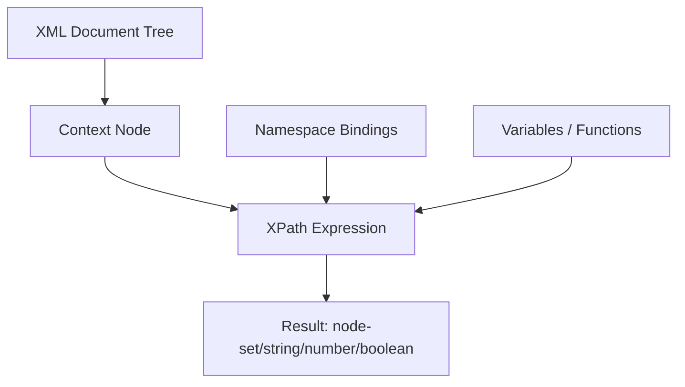
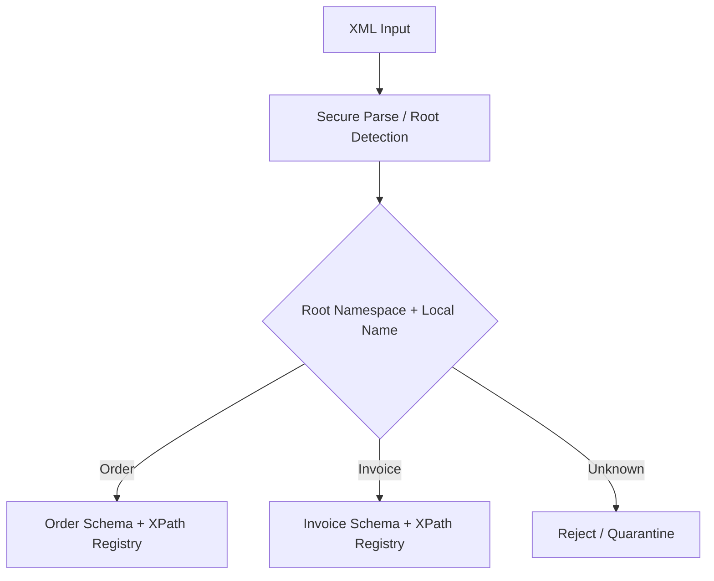
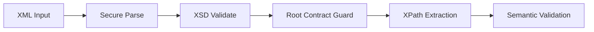

# Part 014 — XPath Mental Model and Java API

## Tujuan Part Ini

XPath adalah salah satu tool paling penting untuk XML production engineering.

Bukan karena XPath terlihat elegan, tetapi karena XPath menyelesaikan masalah yang sangat konkret:

```text
Bagaimana memilih, memeriksa, menguji, dan mengekstrak bagian spesifik dari XML document
secara deklaratif, repeatable, dan bisa direview?
```

Target setelah part ini:

- memahami XPath sebagai expression language berbasis context node;
- bisa menggunakan axes, predicates, functions, dan namespace secara benar;
- memahami batas Java JDK XPath API yang umumnya XPath 1.0;
- menulis `NamespaceContext` yang aman dan eksplisit;
- menghindari XPath injection;
- memakai compiled XPath expression secara benar;
- menggunakan XPath untuk extraction, testing, validation support, diagnostics, dan transformation support;
- tahu kapan XPath tidak cocok dan harus diganti StAX/SAX/XQuery/XSLT.

Mental model:

```text
XPath is not a string search.
XPath is navigation over an XML node tree under a context.
```

---

## 1. Why XPath Matters in Java Systems

Tanpa XPath, code sering berubah menjadi traversal DOM manual:

```java
NodeList lines = document.getElementsByTagName("line");
for (int i = 0; i < lines.getLength(); i++) {
    Element line = (Element) lines.item(i);
    // nested loops, casts, null checks, namespace mistakes...
}
```

Masalahnya:

- noisy;
- sulit direview;
- mudah salah namespace;
- sulit dipakai di tests;
- sulit menjelaskan intent;
- raw DOM traversal sering mencampur navigation dan business rule.

XPath mengubah intent menjadi expression:

```xpath
/count(/o:Order/o:Lines/o:Line)
```

atau:

```xpath
/o:Order/o:Header/o:OrderId/text()
```

Di production, XPath berguna untuk:

| Use Case | Example |
|---|---|
| extraction | ambil ID, status, amount, timestamp |
| validation support | cek existence, count, uniqueness sederhana |
| routing | pilih handler berdasarkan root/status/type |
| tests | assert struktur XML output |
| diagnostics | temukan node bermasalah |
| mapping | lookup source field sebelum transform |
| audit | record selected values tanpa menyimpan full XML |
| migration | compare old vs new output by paths |

---

## 2. XPath Core Mental Model

XPath selalu dievaluasi terhadap context.

Context mencakup:

```text
context node
context position
context size
variable bindings
function library
namespace bindings
```

Simplified model:



A path is not a filesystem path. It is navigation over an XML tree.

Example XML:

```xml
<Order xmlns="https://example.com/order">
  <Header>
    <OrderId>O-1001</OrderId>
    <Status>SUBMITTED</Status>
  </Header>
  <Lines>
    <Line number="1">
      <Sku>SKU-001</Sku>
      <Quantity>2</Quantity>
    </Line>
    <Line number="2">
      <Sku>SKU-002</Sku>
      <Quantity>5</Quantity>
    </Line>
  </Lines>
</Order>
```

Correct namespace-aware XPath:

```xpath
/o:Order/o:Header/o:OrderId/text()
```

where `o` is bound to:

```text
https://example.com/order
```

Incorrect common XPath:

```xpath
/Order/Header/OrderId/text()
```

This fails because the elements are in a default namespace. In XPath, unprefixed element names in expressions are not automatically bound to the XML document's default namespace.

---

## 3. XPath Result Types in JDK API

JDK XPath commonly returns these result types:

| `XPathConstants` | Meaning |
|---|---|
| `NODE` | first matching node |
| `NODESET` | matching node set |
| `STRING` | string value |
| `NUMBER` | double |
| `BOOLEAN` | boolean |

Example:

```java
import org.w3c.dom.Document;
import org.w3c.dom.Node;
import org.w3c.dom.NodeList;

import javax.xml.xpath.XPath;
import javax.xml.xpath.XPathConstants;
import javax.xml.xpath.XPathFactory;

public final class BasicXPathExample {

    public static void run(Document document) throws Exception {
        XPath xpath = XPathFactory.newInstance().newXPath();

        String orderId = (String) xpath.evaluate(
                "/*[local-name()='Order']/*[local-name()='Header']/*[local-name()='OrderId']/text()",
                document,
                XPathConstants.STRING
        );

        Node firstLine = (Node) xpath.evaluate(
                "//*[local-name()='Line'][1]",
                document,
                XPathConstants.NODE
        );

        NodeList lines = (NodeList) xpath.evaluate(
                "//*[local-name()='Line']",
                document,
                XPathConstants.NODESET
        );
    }
}
```

This example uses `local-name()` to dodge namespaces. That can be useful in diagnostics, but it is not the best default for production contract code.

Production preference:

```xpath
/o:Order/o:Lines/o:Line
```

not:

```xpath
//*[local-name()='Line']
```

because namespace-blind selection can accidentally match the wrong element from another vocabulary.

---

## 4. Parse DOM Securely Before XPath

JDK XPath normally operates on DOM nodes. So parser configuration still matters.

```java
import org.w3c.dom.Document;

import javax.xml.XMLConstants;
import javax.xml.parsers.DocumentBuilderFactory;
import java.io.InputStream;

public final class SecureDomParser {

    public static Document parse(InputStream xml) throws Exception {
        DocumentBuilderFactory factory = DocumentBuilderFactory.newInstance();
        factory.setNamespaceAware(true);
        factory.setFeature(XMLConstants.FEATURE_SECURE_PROCESSING, true);
        factory.setFeature("http://apache.org/xml/features/disallow-doctype-decl", true);
        factory.setFeature("http://xml.org/sax/features/external-general-entities", false);
        factory.setFeature("http://xml.org/sax/features/external-parameter-entities", false);
        factory.setXIncludeAware(false);
        factory.setExpandEntityReferences(false);

        return factory.newDocumentBuilder().parse(xml);
    }
}
```

Never think:

```text
XPath is safe because it only reads XML.
```

XPath reads a tree. The tree creation step can still be unsafe if parser hardening is missing.

---

## 5. NamespaceContext Done Properly

Create explicit namespace binding.

```java
import javax.xml.XMLConstants;
import javax.xml.namespace.NamespaceContext;
import java.util.Iterator;
import java.util.Map;

public final class FixedNamespaceContext implements NamespaceContext {

    private final Map<String, String> prefixToUri;

    public FixedNamespaceContext(Map<String, String> prefixToUri) {
        this.prefixToUri = Map.copyOf(prefixToUri);
    }

    @Override
    public String getNamespaceURI(String prefix) {
        if (prefix == null) {
            throw new IllegalArgumentException("prefix must not be null");
        }
        if (XMLConstants.XML_NS_PREFIX.equals(prefix)) {
            return XMLConstants.XML_NS_URI;
        }
        if (XMLConstants.XMLNS_ATTRIBUTE.equals(prefix)) {
            return XMLConstants.XMLNS_ATTRIBUTE_NS_URI;
        }
        return prefixToUri.getOrDefault(prefix, XMLConstants.NULL_NS_URI);
    }

    @Override
    public String getPrefix(String namespaceURI) {
        return prefixToUri.entrySet().stream()
                .filter(e -> e.getValue().equals(namespaceURI))
                .map(Map.Entry::getKey)
                .findFirst()
                .orElse(null);
    }

    @Override
    public Iterator<String> getPrefixes(String namespaceURI) {
        return prefixToUri.entrySet().stream()
                .filter(e -> e.getValue().equals(namespaceURI))
                .map(Map.Entry::getKey)
                .iterator();
    }
}
```

Usage:

```java
XPath xpath = XPathFactory.newInstance().newXPath();
xpath.setNamespaceContext(new FixedNamespaceContext(Map.of(
        "o", "https://example.com/order",
        "c", "https://example.com/common"
)));

String orderId = xpath.evaluate(
        "/o:Order/o:Header/o:OrderId/text()",
        document
);
```

Critical invariant:

```text
XPath prefixes are local to the XPath expression.
They do not need to match prefixes used in the XML document.
They only need to bind to the same namespace URI.
```

Example XML:

```xml
<abc:Order xmlns:abc="https://example.com/order"/>
```

XPath can still use:

```xpath
/o:Order
```

as long as `o` maps to `https://example.com/order`.

---

## 6. Absolute vs Relative XPath

Absolute XPath starts from the document root:

```xpath
/o:Order/o:Header/o:OrderId
```

Relative XPath starts from the context node:

```xpath
o:Sku/text()
```

Example:

```java
NodeList lines = (NodeList) xpath.evaluate(
        "/o:Order/o:Lines/o:Line",
        document,
        XPathConstants.NODESET
);

for (int i = 0; i < lines.getLength(); i++) {
    Node line = lines.item(i);
    String sku = xpath.evaluate("o:Sku/text()", line);
    String quantity = xpath.evaluate("o:Quantity/text()", line);
}
```

This is often cleaner than writing one giant expression for everything.

Rule:

```text
Use absolute XPath for document-level invariants.
Use relative XPath for local extraction from a known context node.
```

---

## 7. Axes

Axes describe direction of navigation.

Common axes:

| Axis | Meaning | Example |
|---|---|---|
| `child` | direct children | `child::o:Line` |
| `descendant` | all nested descendants | `descendant::o:Sku` |
| `parent` | parent node | `parent::o:Lines` |
| `ancestor` | all ancestors | `ancestor::o:Order` |
| `following-sibling` | next siblings | `following-sibling::o:Line` |
| `preceding-sibling` | previous siblings | `preceding-sibling::o:Line` |
| `attribute` | attributes | `attribute::number` |
| `self` | current node | `self::o:Line` |

Short forms:

```xpath
o:Line
```

means:

```xpath
child::o:Line
```

```xpath
@number
```

means:

```xpath
attribute::number
```

```xpath
//o:Line
```

means:

```xpath
/descendant-or-self::node()/child::o:Line
```

Avoid overusing `//` in production XPath. It is convenient but broad.

Better:

```xpath
/o:Order/o:Lines/o:Line
```

than:

```xpath
//o:Line
```

unless the document shape is intentionally flexible.

---

## 8. Predicates

Predicates filter selected nodes.

Examples:

```xpath
/o:Order/o:Lines/o:Line[@number='1']
```

```xpath
/o:Order/o:Lines/o:Line[o:Quantity > 0]
```

```xpath
/o:Order/o:Lines/o:Line[position() = 1]
```

```xpath
/o:Order/o:Lines/o:Line[last()]
```

Important nuance:

```xpath
/o:Order/o:Lines/o:Line[1]
```

means first `Line` among siblings for each parent context.

In many simple documents, it behaves like “first line”. But in nested contexts, predicate position semantics can surprise you.

For clarity in Java tests:

```xpath
count(/o:Order/o:Lines/o:Line) = 2
```

is clearer than iterating and counting nodes manually.

---

## 9. String Value Semantics

XPath string value is not always what engineers expect.

For an element:

```xml
<Name>
  <First>Ada</First>
  <Last>Lovelace</Last>
</Name>
```

The string value of `Name` is the concatenation of descendant text nodes.

So this:

```xpath
string(/p:Name)
```

can produce:

```text
Ada
  Lovelace
```

or whitespace-affected variants.

Production rule:

```text
Select the exact leaf text node when extracting scalar values.
```

Prefer:

```xpath
/p:Name/p:First/text()
```

not:

```xpath
/p:Name
```

---

## 10. Whitespace and normalize-space

Pretty-printed XML contains whitespace text nodes.

Example:

```xml
<Status>
  SUBMITTED
</Status>
```

Raw text can include newlines and spaces.

Use:

```xpath
normalize-space(/o:Order/o:Header/o:Status)
```

Java:

```java
String status = (String) xpath.evaluate(
        "normalize-space(/o:Order/o:Header/o:Status)",
        document,
        XPathConstants.STRING
);
```

Be careful:

```text
normalize-space is good for human-entered tokens.
It may be wrong for values where whitespace is semantically meaningful.
```

Examples where whitespace may matter:

- digital signature payload;
- base64 formatting policy;
- preformatted text;
- legal/regulatory free text;
- canonical XML comparison.

---

## 11. Compiled XPath Expressions

For repeated evaluation, compile XPath expressions.

```java
import javax.xml.xpath.XPath;
import javax.xml.xpath.XPathConstants;
import javax.xml.xpath.XPathExpression;
import javax.xml.xpath.XPathFactory;

public final class CompiledXPathExample {

    private final XPathExpression orderIdExpression;
    private final XPathExpression lineExpression;

    public CompiledXPathExample() throws Exception {
        XPath xpath = XPathFactory.newInstance().newXPath();
        xpath.setNamespaceContext(new FixedNamespaceContext(java.util.Map.of(
                "o", "https://example.com/order"
        )));

        this.orderIdExpression = xpath.compile("normalize-space(/o:Order/o:Header/o:OrderId)");
        this.lineExpression = xpath.compile("/o:Order/o:Lines/o:Line");
    }

    public String orderId(org.w3c.dom.Document document) throws Exception {
        return (String) orderIdExpression.evaluate(document, XPathConstants.STRING);
    }

    public org.w3c.dom.NodeList lines(org.w3c.dom.Document document) throws Exception {
        return (org.w3c.dom.NodeList) lineExpression.evaluate(document, XPathConstants.NODESET);
    }
}
```

Design note:

```text
Compile stable expressions.
Do not build expression strings by concatenating untrusted values.
```

Thread-safety note:

```text
Treat XPathFactory, XPath, and XPathExpression lifecycle conservatively.
Do not assume mutable XPath objects are safe to share across threads unless your chosen implementation documents it.
```

Simple production approach:

- build an immutable extractor per schema/message type;
- compile expressions during service startup;
- use thread-local or per-component instances if implementation guarantees are unclear;
- benchmark and test under concurrency.

---

## 12. XPath Extractor Pattern

Wrap expressions behind domain-specific extraction methods.

```java
import org.w3c.dom.Document;
import org.w3c.dom.Node;
import org.w3c.dom.NodeList;

import javax.xml.xpath.XPathConstants;
import javax.xml.xpath.XPathExpression;
import java.math.BigDecimal;
import java.util.ArrayList;
import java.util.List;

public final class OrderXPathExtractor {

    private final XPathExpression orderIdExpr;
    private final XPathExpression statusExpr;
    private final XPathExpression lineExpr;

    public OrderXPathExtractor(XPathExpression orderIdExpr,
                               XPathExpression statusExpr,
                               XPathExpression lineExpr) {
        this.orderIdExpr = orderIdExpr;
        this.statusExpr = statusExpr;
        this.lineExpr = lineExpr;
    }

    public ExtractedOrder extract(Document document) throws Exception {
        String orderId = requiredString(orderIdExpr, document, "orderId");
        String status = requiredString(statusExpr, document, "status");

        NodeList lineNodes = (NodeList) lineExpr.evaluate(document, XPathConstants.NODESET);
        List<ExtractedLine> lines = new ArrayList<>();

        for (int i = 0; i < lineNodes.getLength(); i++) {
            Node line = lineNodes.item(i);
            lines.add(extractLine(line));
        }

        return new ExtractedOrder(orderId, status, lines);
    }

    private ExtractedLine extractLine(Node line) throws Exception {
        // In real code, compile these too or use a local extractor with relative expressions.
        javax.xml.xpath.XPath xpath = javax.xml.xpath.XPathFactory.newInstance().newXPath();
        xpath.setNamespaceContext(new FixedNamespaceContext(java.util.Map.of(
                "o", "https://example.com/order"
        )));

        String sku = requiredString(xpath.compile("normalize-space(o:Sku)"), line, "line.sku");
        String quantityRaw = requiredString(xpath.compile("normalize-space(o:Quantity)"), line, "line.quantity");
        return new ExtractedLine(sku, new BigDecimal(quantityRaw));
    }

    private static String requiredString(XPathExpression expr, Object context, String field) throws Exception {
        String value = (String) expr.evaluate(context, XPathConstants.STRING);
        if (value == null || value.isBlank()) {
            throw new XmlExtractionException("Missing required XML value: " + field);
        }
        return value;
    }
}

record ExtractedOrder(String orderId, String status, List<ExtractedLine> lines) {}
record ExtractedLine(String sku, BigDecimal quantity) {}
```

Better implementation would compile relative line expressions once as well.

Pattern goal:

```text
Keep XPath expressions centralized, named, tested, and versioned with the XML contract.
```

---

## 13. XPath Registry

For large systems, create a registry per message contract.

```java
public enum OrderPaths {
    ORDER_ID("normalize-space(/o:Order/o:Header/o:OrderId)"),
    STATUS("normalize-space(/o:Order/o:Header/o:Status)"),
    LINE_NODES("/o:Order/o:Lines/o:Line"),
    LINE_SKU("normalize-space(o:Sku)"),
    LINE_QUANTITY("normalize-space(o:Quantity)");

    private final String expression;

    OrderPaths(String expression) {
        this.expression = expression;
    }

    public String expression() {
        return expression;
    }
}
```

This improves:

- reviewability;
- testability;
- refactoring;
- schema upgrade diff;
- incident investigation.

Bad practice:

```text
XPath expressions scattered across controllers, mappers, validators, tests, and templates.
```

Good practice:

```text
XPath expressions live next to schema contract support code.
```

---

## 14. XPath Injection

XPath injection happens when untrusted input is concatenated into an expression.

Bad:

```java
String status = request.getParameter("status");
String expr = "/o:Order/o:Lines/o:Line[o:Status='" + status + "']";
NodeList nodes = (NodeList) xpath.evaluate(expr, document, XPathConstants.NODESET);
```

If `status` contains XPath syntax, the query meaning can change.

Safer patterns:

### Pattern A: Evaluate Broadly, Filter in Java

```java
NodeList lines = (NodeList) lineExpression.evaluate(document, XPathConstants.NODESET);
for (int i = 0; i < lines.getLength(); i++) {
    Node line = lines.item(i);
    String status = lineStatus(line);
    if (requestedStatus.equals(status)) {
        // process
    }
}
```

### Pattern B: Strict Allowlist

```java
public enum AllowedStatus {
    SUBMITTED,
    APPROVED,
    REJECTED
}
```

Then use a fixed expression map:

```java
Map<AllowedStatus, XPathExpression> expressions = Map.of(
        AllowedStatus.SUBMITTED, compile("/o:Order/o:Lines/o:Line[o:Status='SUBMITTED']"),
        AllowedStatus.APPROVED, compile("/o:Order/o:Lines/o:Line[o:Status='APPROVED']"),
        AllowedStatus.REJECTED, compile("/o:Order/o:Lines/o:Line[o:Status='REJECTED']")
);
```

### Pattern C: Variables if Supported Correctly

JAXP has `XPathVariableResolver`, but support and ergonomics are limited compared with modern XPath processors.

If you use variables, still keep:

```text
untrusted data as data, not expression syntax.
```

---

## 15. XPathVariableResolver Example

```java
import javax.xml.namespace.QName;
import javax.xml.xpath.XPath;
import javax.xml.xpath.XPathConstants;
import javax.xml.xpath.XPathFactory;
import javax.xml.xpath.XPathVariableResolver;
import java.util.Map;

public final class VariableXPathExample {

    public static org.w3c.dom.NodeList linesByStatus(
            org.w3c.dom.Document document,
            String status
    ) throws Exception {
        XPath xpath = XPathFactory.newInstance().newXPath();
        xpath.setNamespaceContext(new FixedNamespaceContext(Map.of(
                "o", "https://example.com/order"
        )));
        xpath.setXPathVariableResolver(new MapVariableResolver(Map.of(
                new QName("status"), status
        )));

        return (org.w3c.dom.NodeList) xpath.evaluate(
                "/o:Order/o:Lines/o:Line[o:Status = $status]",
                document,
                XPathConstants.NODESET
        );
    }
}

final class MapVariableResolver implements XPathVariableResolver {
    private final Map<QName, Object> variables;

    MapVariableResolver(Map<QName, Object> variables) {
        this.variables = Map.copyOf(variables);
    }

    @Override
    public Object resolveVariable(QName variableName) {
        if (!variables.containsKey(variableName)) {
            throw new IllegalArgumentException("Unknown XPath variable: " + variableName);
        }
        return variables.get(variableName);
    }
}
```

Do not use variables as a way to hide arbitrary dynamic expression construction.

---

## 16. Type Conversion Pitfalls

XPath 1.0 numeric values are often represented as `Double` in JAXP.

Example:

```java
Double count = (Double) xpath.evaluate(
        "count(/o:Order/o:Lines/o:Line)",
        document,
        XPathConstants.NUMBER
);
```

For money and precision-sensitive values, avoid XPath numeric conversion.

Bad:

```xpath
sum(/o:Order/o:Lines/o:Line/o:Amount)
```

Then casting a `Double` into money logic.

Better:

```text
Extract lexical decimal strings.
Parse to BigDecimal in Java.
Apply currency/scale policy explicitly.
```

Example:

```java
String amountRaw = xpath.evaluate("normalize-space(o:Amount)", lineNode);
BigDecimal amount = new BigDecimal(amountRaw);
```

Rule:

```text
XPath is good at navigation and simple predicates.
Java/domain code is better for precision-sensitive arithmetic and policy-heavy validation.
```

---

## 17. Boolean Checks

XPath is excellent for simple existence checks.

```xpath
boolean(/o:Order/o:Header/o:OrderId)
```

Java:

```java
Boolean hasOrderId = (Boolean) xpath.evaluate(
        "boolean(/o:Order/o:Header/o:OrderId)",
        document,
        XPathConstants.BOOLEAN
);
```

But be precise:

```xpath
boolean(/o:Order/o:Header/o:OrderId)
```

means node exists.

This:

```xpath
normalize-space(/o:Order/o:Header/o:OrderId) != ''
```

means node has non-blank string value.

They are not equivalent.

---

## 18. XPath for Tests

XPath is extremely useful for asserting XML output.

Example:

```java
import org.junit.jupiter.api.Test;

import static org.assertj.core.api.Assertions.assertThat;

class OrderXmlRendererTest {

    @Test
    void rendersOrderIdAndTwoLines() throws Exception {
        String xml = OrderXmlFixtures.renderSampleOrder();
        Document document = SecureDomParser.parse(new java.io.ByteArrayInputStream(xml.getBytes(java.nio.charset.StandardCharsets.UTF_8)));

        XPath xpath = TestXPath.orderXPath();

        assertThat(xpath.evaluate("normalize-space(/o:Order/o:Header/o:OrderId)", document))
                .isEqualTo("O-1001");

        Double lineCount = (Double) xpath.evaluate(
                "count(/o:Order/o:Lines/o:Line)",
                document,
                XPathConstants.NUMBER
        );

        assertThat(lineCount.intValue()).isEqualTo(2);
    }
}
```

Test helper:

```java
public final class TestXPath {
    public static XPath orderXPath() {
        XPath xpath = XPathFactory.newInstance().newXPath();
        xpath.setNamespaceContext(new FixedNamespaceContext(java.util.Map.of(
                "o", "https://example.com/order"
        )));
        return xpath;
    }
}
```

Testing principle:

```text
Use XPath to assert contract-level meaning, not formatting trivia.
```

Avoid tests that fail because of indentation unless formatting is the contract.

---

## 19. XPath for Diagnostics

During production incidents, XPath can answer:

```text
Which line has invalid status?
Which nodes are missing IDs?
Which partner sends empty optional elements?
Which payloads contain legacy namespace?
```

Diagnostic expressions:

```xpath
/o:Order/o:Lines/o:Line[normalize-space(o:Sku) = '']
```

```xpath
/o:Order/o:Lines/o:Line[not(o:Quantity)]
```

```xpath
count(/o:Order/o:Lines/o:Line[@number])
```

For support tools, expose named checks rather than arbitrary XPath execution to users.

Risk of arbitrary XPath execution:

- expensive expressions;
- information disclosure;
- inconsistent namespace context;
- injection-like behavior;
- support results not reproducible.

Better diagnostic API:

```text
GET /xml-diagnostics/{validationId}/checks/missing-line-sku
```

backed by approved expressions.

---

## 20. XPath and Document Size

JDK XPath over DOM means the full document is usually in memory.

This is fine for:

- small API payloads;
- generated XML tests;
- configuration documents;
- metadata extraction from bounded documents.

It is risky for:

- hundreds of MB batch files;
- untrusted large payloads;
- low-memory services;
- high-throughput gateways.

Decision rule:

```text
If the XML cannot safely fit in memory as DOM, do not use JDK DOM XPath as the primary extraction strategy.
```

Alternatives:

| Need | Better Tool |
|---|---|
| large file single-pass extraction | StAX/SAX |
| complex querying across XML docs | XQuery |
| transformation | XSLT |
| repeated modern XPath 2/3 queries | Saxon/XDM |
| structural contract validation | XSD validator |

---

## 21. XPath vs XSD vs Business Validation

Do not use XPath as a substitute for XSD contract validation.

| Concern | Tool |
|---|---|
| required element structure | XSD |
| datatype lexical constraints | XSD |
| quick extraction | XPath |
| test assertion | XPath |
| cross-field stateful business rule | Java/domain rules |
| transformation | XSLT |
| large document streaming extraction | StAX/SAX |

Bad pattern:

```java
if (xpath.evaluate("boolean(/Order/Header/OrderId)", document)) {
   // assume document is valid
}
```

Good pattern:

```text
XSD validates structure.
XPath extracts selected values.
Domain validation checks business semantics.
```

---

## 22. XPath Expression Review Checklist

For every production XPath expression, review:

- [ ] Is it namespace-aware?
- [ ] Does it avoid broad `//` unless intentional?
- [ ] Is it absolute or relative intentionally?
- [ ] Does it select exact leaf values for scalar extraction?
- [ ] Does it use `normalize-space` only where safe?
- [ ] Are untrusted values kept out of expression syntax?
- [ ] Is return type explicit?
- [ ] Is missing node behavior defined?
- [ ] Is multi-node behavior defined?
- [ ] Is the expression covered by tests?
- [ ] Is it versioned with the XML contract?
- [ ] Is it safe for expected document size?

---

## 23. Missing, Empty, and Multiple Values

Extraction code must distinguish:

| Case | XML | Meaning |
|---|---|---|
| missing | no element | absent |
| empty | `<OrderId/>` | present but empty |
| blank | `<OrderId>   </OrderId>` | present but blank |
| multiple | two `OrderId` nodes | ambiguous/invalid |

Helper:

```java
public final class XPathScalars {

    public static String requiredSingleText(
            XPathExpression nodeExpression,
            XPathExpression textExpression,
            Object context,
            String fieldName
    ) throws Exception {
        NodeList nodes = (NodeList) nodeExpression.evaluate(context, XPathConstants.NODESET);

        if (nodes.getLength() == 0) {
            throw new XmlExtractionException("Missing required XML field: " + fieldName);
        }
        if (nodes.getLength() > 1) {
            throw new XmlExtractionException("Multiple XML fields found for: " + fieldName);
        }

        String value = (String) textExpression.evaluate(nodes.item(0), XPathConstants.STRING);
        if (value == null || value.isBlank()) {
            throw new XmlExtractionException("Blank required XML field: " + fieldName);
        }
        return value.trim();
    }
}
```

This is more robust than blindly calling:

```java
xpath.evaluate("normalize-space(/o:Order/o:Header/o:OrderId)", document)
```

because a missing node and an empty node both become `""`.

---

## 24. Namespace Drift Detection

A common production incident:

```xml
<Order xmlns="https://example.com/order/v2">
```

but system expects:

```text
https://example.com/order/v1
```

XPath using `o` bound to v1 returns nothing. If extraction code treats empty values as optional, corruption can happen.

Add root namespace check:

```java
public final class XmlContractGuard {

    public static void requireRoot(
            Document document,
            String expectedNamespace,
            String expectedLocalName
    ) {
        org.w3c.dom.Element root = document.getDocumentElement();
        if (!expectedNamespace.equals(root.getNamespaceURI())
                || !expectedLocalName.equals(root.getLocalName())) {
            throw new XmlContractMismatchException(
                    "Expected root {" + expectedNamespace + "}" + expectedLocalName
                            + " but got {" + root.getNamespaceURI() + "}" + root.getLocalName()
            );
        }
    }
}
```

Rule:

```text
Before evaluating contract-specific XPath expressions, assert the root contract identity.
```

---

## 25. XPath Expression Naming

Unnamed expressions become invisible architecture.

Bad:

```java
xpath.evaluate("/o:Order/o:Header/o:OrderId", doc)
```

spread everywhere.

Better:

```java
OrderXPath.ORDER_ID.evaluateAsString(doc)
```

Example wrapper:

```java
public final class NamedXPathExpression {
    private final String name;
    private final String expressionText;
    private final XPathExpression compiled;

    public NamedXPathExpression(String name, String expressionText, XPathExpression compiled) {
        this.name = name;
        this.expressionText = expressionText;
        this.compiled = compiled;
    }

    public String evaluateString(Object context) throws Exception {
        return (String) compiled.evaluate(context, XPathConstants.STRING);
    }

    public NodeList evaluateNodes(Object context) throws Exception {
        return (NodeList) compiled.evaluate(context, XPathConstants.NODESET);
    }

    public String name() { return name; }
    public String expressionText() { return expressionText; }
}
```

Benefits:

- logs can mention expression name;
- tests can enumerate coverage;
- schema migration can compare path registries;
- support docs can reference stable names.

---

## 26. XPath in XML Comparison

When comparing XML output, byte equality is often too strict.

Instead of comparing raw strings:

```java
assertThat(actualXml).isEqualTo(expectedXml);
```

Use XPath assertions for meaningful facts:

```text
order id equals O-1001
line count equals 2
total amount equals 100.00
status equals SUBMITTED
```

Raw XML equality is appropriate when:

- exact canonical form is required;
- digital signature input is generated;
- partner contract requires byte-level output;
- formatting itself is the deliverable.

Otherwise, XPath makes tests less brittle and more semantic.

---

## 27. XPath for Routing

Example routing expressions:

```xpath
local-name(/*)
```

```xpath
namespace-uri(/*)
```

```xpath
normalize-space(/o:Order/o:Header/o:MessageType)
```

Routing flow:



For large input, detect root with StAX instead of DOM XPath.

Routing rule:

```text
Use lightweight root detection before full DOM XPath when payload size or attack surface matters.
```

---

## 28. XPath Function Limits in JDK XPath

JDK XPath API commonly supports XPath 1.0 semantics.

Useful XPath 1.0 functions:

| Function | Use |
|---|---|
| `count()` | count nodes |
| `string()` | convert to string |
| `normalize-space()` | trim/collapse whitespace |
| `contains()` | substring check |
| `starts-with()` | prefix check |
| `substring()` | slicing |
| `not()` | negation |
| `boolean()` | existence truthiness |
| `number()` | numeric conversion |
| `local-name()` | local name of node |
| `namespace-uri()` | namespace URI of node |

Missing compared with XPath 2.0/3.1:

- richer types and sequences;
- regex functions;
- `if then else` expression style;
- maps/arrays;
- strong integration with XDM;
- better date/time functions;
- higher-order functions.

If you need modern XPath, use a processor such as Saxon and its APIs. That is covered in the next part.

---

## 29. Anti-Patterns

| Anti-Pattern | Why It Fails | Better Pattern |
|---|---|---|
| unprefixed XPath on namespaced XML | returns no nodes | explicit `NamespaceContext` |
| `//*[local-name()='X']` everywhere | namespace-blind matching | prefix-bound contract paths |
| XPath string concatenation | injection risk | variables/allowlist/filter in Java |
| using XPath for huge files | DOM memory cost | StAX/SAX/XQuery streaming |
| treating empty result as optional | hides contract mismatch | required extraction helper |
| using `Double` for money | precision risk | extract string, parse `BigDecimal` |
| scattered expressions | ungoverned contract coupling | path registry |
| relying on `//` broadly | accidental matches/perf cost | precise absolute path |
| ignoring root namespace | version drift | root contract guard |
| building DOM from untrusted XML insecurely | XXE/entity risk | hardened parser |

---

## 30. Production XPath Utility Design

Recommended package structure:

```text
xml/
  parser/
    SecureDomParser.java
  namespace/
    FixedNamespaceContext.java
  xpath/
    NamedXPathExpression.java
    XPathCompiler.java
    XPathScalars.java
  contracts/
    order/
      OrderNamespaces.java
      OrderPaths.java
      OrderXPathExtractor.java
      OrderContractGuard.java
```

`XPathCompiler`:

```java
import javax.xml.namespace.NamespaceContext;
import javax.xml.xpath.XPath;
import javax.xml.xpath.XPathExpression;
import javax.xml.xpath.XPathFactory;

public final class XPathCompiler {

    private final NamespaceContext namespaceContext;

    public XPathCompiler(NamespaceContext namespaceContext) {
        this.namespaceContext = namespaceContext;
    }

    public NamedXPathExpression compile(String name, String expressionText) {
        try {
            XPath xpath = XPathFactory.newInstance().newXPath();
            xpath.setNamespaceContext(namespaceContext);
            XPathExpression compiled = xpath.compile(expressionText);
            return new NamedXPathExpression(name, expressionText, compiled);
        } catch (Exception e) {
            throw new IllegalArgumentException(
                    "Invalid XPath expression " + name + ": " + expressionText,
                    e
            );
        }
    }
}
```

This turns expression compilation into startup validation. A bad XPath fails early.

---

## 31. Integration with Validation Pipeline

After XSD validation:



Important:

```text
XPath extraction should not silently compensate for schema invalidity.
```

If XML is invalid, do not continue with normal extraction unless you are building diagnostics or repair tooling.

---

## 32. Debugging Workflow

When XPath returns nothing:

1. Check document root namespace.
2. Check parser `setNamespaceAware(true)`.
3. Check `NamespaceContext` binding.
4. Check whether expression is absolute or relative.
5. Check default namespace assumption.
6. Check local name vs prefixed name.
7. Print root `{namespaceURI}localName`.
8. Evaluate `namespace-uri(/*)` and `local-name(/*)`.
9. Evaluate step by step:

```xpath
/o:Order
/o:Order/o:Header
/o:Order/o:Header/o:OrderId
```

Debug helper:

```java
public static void printRoot(Document document) {
    var root = document.getDocumentElement();
    System.out.println("root localName=" + root.getLocalName());
    System.out.println("root namespaceURI=" + root.getNamespaceURI());
    System.out.println("root nodeName=" + root.getNodeName());
}
```

Most XPath production bugs are namespace bugs, not XPath algorithm bugs.

---

## 33. Kaufman Practice Drill

Timebox: 90–120 minutes.

Use the `PurchaseOrder` XML from the previous validation part.

Implement:

1. `SecureDomParser`.
2. `FixedNamespaceContext`.
3. `XPathCompiler`.
4. `NamedXPathExpression`.
5. `PurchaseOrderPaths` registry.
6. `PurchaseOrderXPathExtractor`.
7. `requiredSingleText` helper.
8. Tests for:
   - valid extraction;
   - missing node;
   - blank node;
   - duplicate node;
   - wrong namespace;
   - XPath injection attempt;
   - broad `local-name()` diagnostic expression.

Self-correction questions:

```text
Can I explain why /Order/Header/OrderId fails on default-namespaced XML?
Can I distinguish missing, blank, and duplicate values?
Can I prevent user input from becoming XPath syntax?
Can I decide when XPath is worse than StAX?
Can I version XPath expressions with schema changes?
Can I debug namespace drift using namespace-uri(/*)?
```

---

## 34. Summary

XPath is a powerful production tool when used with the right mental model.

Key principles:

- XPath navigates an XML node tree under a context;
- namespace binding must be explicit;
- XPath prefixes are expression-local;
- use absolute paths for document invariants and relative paths for local extraction;
- avoid broad `//` unless intentional;
- distinguish missing, empty, blank, and multiple values;
- never concatenate untrusted input into XPath syntax;
- do not use DOM XPath for unbounded large XML;
- centralize XPath expressions as contract artifacts;
- use XPath for extraction and tests, not as a replacement for XSD or business validation.

Core invariant:

```text
XPath should make XML access more explicit, not more magical.
```

Next, we move beyond the JDK XPath 1.0 model into advanced XPath with XDM and Saxon.

---

## References

- Oracle Java API, `javax.xml.xpath`: object-model neutral XPath evaluation API.
- Oracle Java API, `XPathFactory`, `XPath`, `XPathExpression`, `XPathConstants`, and `XPathVariableResolver`.
- W3C XPath 1.0 Recommendation.
- W3C XPath 3.1 Recommendation for modern XPath/XDM concepts.
