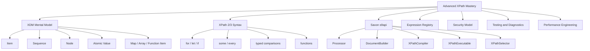
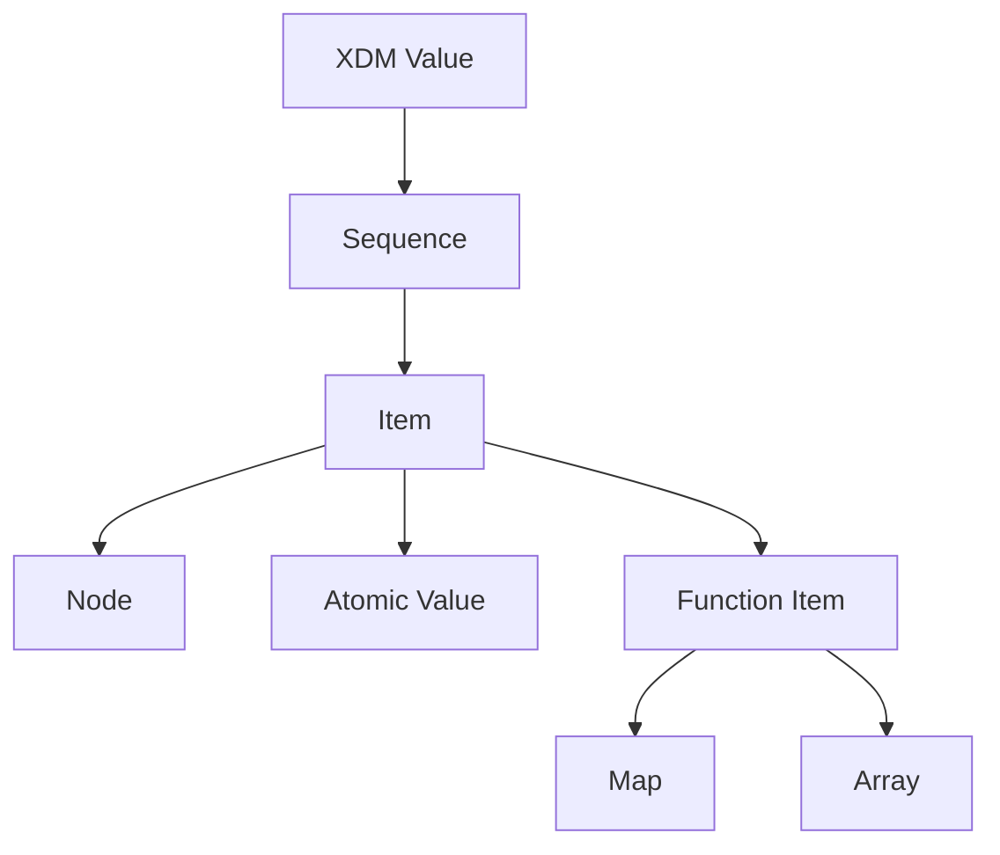
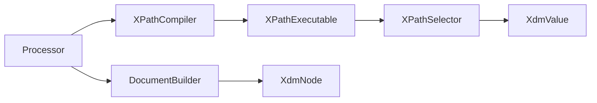
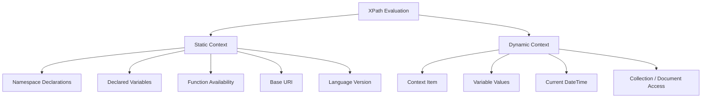
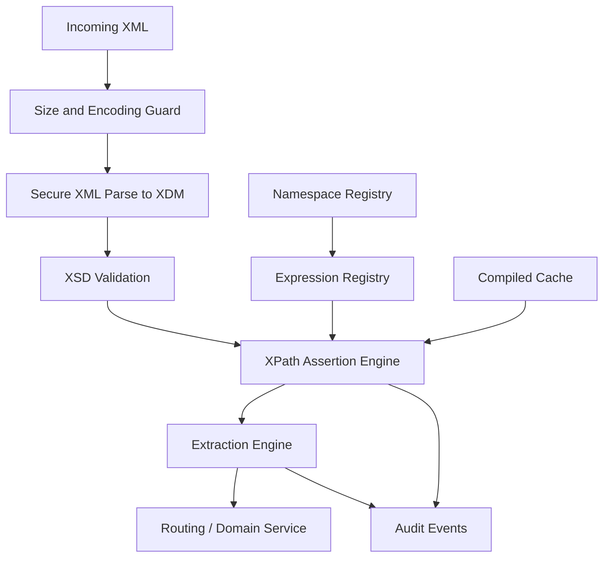

# Part 015 — Advanced XPath with XDM and Saxon

## Tujuan Part Ini

Part sebelumnya memakai XPath dari JDK/JAXP sebagai alat navigasi XML yang praktis. Itu cukup untuk banyak kasus extraction sederhana, tetapi ada batas penting:

```text
JDK XPath is convenient for basic XPath 1.0-style navigation.
Advanced XML systems often need the XPath/XQuery Data Model, stronger type handling,
sequences, richer functions, maps, arrays, variables, and processor-level control.
```

Target setelah part ini:

- memahami XDM sebagai data model modern untuk XPath/XQuery/XSLT;
- membedakan node, atomic value, function item, map, array, dan sequence;
- tahu batas XPath 1.0 dalam JDK API;
- memakai Saxon s9api untuk XPath 2.0/3.1-style expression evaluation;
- mengelola namespace, variables, context item, compiled expression, dan result conversion;
- mendesain expression registry yang aman, testable, dan versionable;
- menghindari XPath injection, uncontrolled `doc()`, dan resource access yang tidak diawasi;
- memilih kapan advanced XPath lebih tepat daripada DOM traversal, StAX, XSLT, atau XQuery.

Mental model:

```text
Advanced XPath is not “better string paths”.
It is a typed expression language over the XDM value space.
```

---

## 1. Why Move Beyond JDK XPath?

Java JDK XPath API sangat berguna untuk:

- memilih node sederhana;
- mengambil text/attribute;
- menghitung node;
- menjalankan assertion di tests;
- routing berbasis field sederhana.

Tetapi pada sistem enterprise, kebutuhan sering berkembang menjadi:

| Need | Pain with Basic XPath 1.0 Style |
|---|---|
| typed date/decimal comparison | conversion manual, raw string handling |
| sequence transformation | XPath 1.0 node-set model terbatas |
| conditional expression | logic tersebar di Java |
| quantified checks | loop manual di Java |
| rich string/date/math functions | terbatas |
| reusable functions | tidak natural di JDK XPath API |
| map/array shape | tidak ada di XPath 1.0 |
| integration with XSLT/XQuery 3.x | model tidak sama |
| stronger result model | `String`, `Boolean`, `Number`, `NodeSet` terlalu kasar |

Contoh rule yang awkward jika ditulis manual:

```text
All invoice lines with type = TAX must have amount >= 0 and currency equal to header currency.
```

Di XPath modern, ekspresi bisa lebih deklaratif:

```xpath
every $line in /i:Invoice/i:Lines/i:Line[i:Type = 'TAX']
satisfies xs:decimal($line/i:Amount) ge 0
      and string($line/i:Amount/@currency) = string(/i:Invoice/i:Header/i:Currency)
```

Di Java DOM traversal, rule ini akan menjadi nested loop, casting, null-check, dan parsing decimal manual.

---

## 2. Kaufman Deconstruction: Advanced XPath Skill Map

Untuk menguasai advanced XPath secara efektif, pecah skill menjadi sub-skill kecil:



Urutan belajar yang efisien:

1. pahami XDM value model;
2. tulis 10 ekspresi XPath 3.1 kecil;
3. jalankan dengan Saxon s9api;
4. tambahkan namespace dan variables;
5. bungkus menjadi `AdvancedXPathService`;
6. test missing/duplicate/wrong type/wrong namespace;
7. tambahkan cache dan security controls.

---

## 3. XDM: The Real Mental Model

XDM adalah data model bersama untuk XPath, XQuery, dan XSLT modern.

Simplified model:



Core invariant:

```text
Everything evaluated by XPath returns an XDM value.
An XDM value is a sequence of zero or more items.
```

Examples:

| Expression | Result Shape |
|---|---|
| `()` | empty sequence |
| `'OK'` | sequence with one string atomic value |
| `(1, 2, 3)` | sequence of integer atomic values |
| `/o:Order` | sequence of node item(s) |
| `/o:Order/o:Lines/o:Line` | sequence of line nodes |
| `map { 'status': 'OK' }` | sequence with one map item |
| `[1, 2, 3]` | sequence with one array item |

This changes how we reason.

In XPath 1.0 style, many engineers think:

```text
expression returns string or node-set
```

In XDM, think:

```text
expression returns a sequence; cardinality and item type matter.
```

---

## 4. Sequence Semantics

A sequence can contain zero, one, or many items.

```xpath
()
```

means no value.

```xpath
('A')
```

means one atomic value.

```xpath
('A', 'B', 'C')
```

means three atomic values.

For XML nodes:

```xpath
/o:Order/o:Lines/o:Line
```

returns zero or more `Line` element nodes.

Cardinality matters in production:

| Cardinality | Meaning |
|---|---|
| zero | missing or not applicable |
| one | valid singleton |
| many | collection or contract violation depending on path |

A production extractor should not blindly convert any result to string.

Bad:

```java
String orderId = selector.evaluate().toString();
```

Better model:

```text
required singleton text
optional singleton text
required non-empty sequence
bounded sequence
forbidden sequence
```

---

## 5. Atomic Values and Typed Reasoning

XDM supports atomic values such as:

- string;
- boolean;
- integer;
- decimal;
- double;
- date;
- dateTime;
- QName;
- URI;
- untyped atomic;
- schema-derived types when schema-aware processing is available.

This enables expressions such as:

```xpath
xs:decimal(/i:Invoice/i:Total) gt 1000.00
```

or:

```xpath
xs:date(/r:Report/r:Period/r:EndDate) ge current-date() - xs:dayTimeDuration('P30D')
```

But typed expressions also introduce failure modes:

| Failure | Example |
|---|---|
| invalid lexical form | `xs:decimal('ABC')` |
| empty sequence cast | `xs:date(())` |
| timezone ambiguity | dateTime without timezone |
| decimal scale assumption | `10.0` vs `10.00` |
| untyped atomic surprise | input node text has no schema type |

Production rule:

```text
Use typed XPath expressions when the type failure itself is useful evidence.
Use Java-side parsing when error reporting must be domain-specific.
```

---

## 6. XPath 2.0/3.1 Features That Matter in Java Systems

You do not need every advanced XPath feature. You need the features that remove error-prone Java traversal.

### 6.1 `if then else`

```xpath
if (/o:Order/o:Header/o:Priority = 'HIGH')
then 'EXPEDITE'
else 'STANDARD'
```

Use for small derivations, not for entire business workflows.

### 6.2 `for` expression

```xpath
for $line in /o:Order/o:Lines/o:Line
return string($line/o:Sku)
```

Useful for reshaping node sequences into values.

### 6.3 `let` binding

```xpath
let $currency := /i:Invoice/i:Header/i:Currency
return every $amount in /i:Invoice/i:Lines/i:Line/i:Amount
       satisfies $amount/@currency = $currency
```

Useful for readability and avoiding repeated long paths.

### 6.4 Quantifiers: `some` and `every`

```xpath
some $line in /o:Order/o:Lines/o:Line
satisfies xs:integer($line/o:Quantity) gt 100
```

```xpath
every $line in /o:Order/o:Lines/o:Line
satisfies normalize-space($line/o:Sku) ne ''
```

These are excellent for validation-adjacent checks.

### 6.5 Sequence functions

```xpath
count(/o:Order/o:Lines/o:Line)
```

```xpath
distinct-values(/o:Order/o:Lines/o:Line/o:Sku)
```

```xpath
exists(/o:Order/o:Header/o:CustomerId)
```

```xpath
empty(/o:Order/o:Cancellation)
```

### 6.6 String functions

```xpath
starts-with(normalize-space(/o:Order/o:Header/o:OrderId), 'ORD-')
```

```xpath
matches(/o:Order/o:Header/o:Email, '^[^@]+@[^@]+$')
```

Regex can be useful, but avoid turning XPath into a business validation dumping ground.

---

## 7. Maps and Arrays

XPath 3.1 adds maps and arrays to the data model.

Example map:

```xpath
map {
  'orderId': string(/o:Order/o:Header/o:OrderId),
  'status': string(/o:Order/o:Header/o:Status),
  'lineCount': count(/o:Order/o:Lines/o:Line)
}
```

Example array:

```xpath
array {
  for $line in /o:Order/o:Lines/o:Line
  return string($line/o:Sku)
}
```

Use cases:

- returning structured diagnostics;
- building small intermediate results;
- bridging XML query output into Java service DTOs;
- writing assertion helpers.

But do not overuse them.

If the final output is a business document, XSLT or Java object mapping may be clearer. If the query spans many documents, XQuery may be more appropriate.

---

## 8. Saxon s9api Overview

Saxon is widely used in Java systems when XPath/XQuery/XSLT beyond JDK defaults is needed.

High-level s9api model:



Concepts:

| Saxon Type | Role |
|---|---|
| `Processor` | global configuration and factory root |
| `DocumentBuilder` | builds `XdmNode` from XML source |
| `XPathCompiler` | holds static context and compiles XPath expression |
| `XPathExecutable` | compiled expression artifact |
| `XPathSelector` | evaluation instance with dynamic context |
| `XdmNode` | XML node in Saxon/XDM model |
| `XdmValue` | sequence result |
| `XdmItem` | one item in a sequence |
| `XdmAtomicValue` | atomic value wrapper |
| `QName` | qualified name for variables/functions/namespaces |

Production lifecycle:

```text
Create Processor once per application configuration.
Create/prepare compilers from the Processor.
Compile approved expressions during startup or cache warmup.
Create a selector per evaluation.
Bind context item and variables per request.
Evaluate and convert result using explicit cardinality rules.
```

---

## 9. Minimal Saxon XPath Evaluation

Maven dependency shape is typically:

```xml
<dependency>
  <groupId>net.sf.saxon</groupId>
  <artifactId>Saxon-HE</artifactId>
  <version>${saxon.version}</version>
</dependency>
```

Pin the version explicitly. Do not leave XML processor versions floating in production.

Example:

```java
import net.sf.saxon.s9api.*;

import javax.xml.transform.stream.StreamSource;
import java.io.StringReader;

public final class SaxonXPathDemo {

    public static void main(String[] args) throws SaxonApiException {
        String xml = """
            <Order xmlns="https://example.com/order">
              <Header>
                <OrderId>ORD-1001</OrderId>
                <Status>SUBMITTED</Status>
              </Header>
            </Order>
            """;

        Processor processor = new Processor(false);

        DocumentBuilder builder = processor.newDocumentBuilder();
        XdmNode document = builder.build(new StreamSource(new StringReader(xml)));

        XPathCompiler compiler = processor.newXPathCompiler();
        compiler.declareNamespace("o", "https://example.com/order");

        XPathExecutable executable = compiler.compile(
            "string(/o:Order/o:Header/o:OrderId)"
        );

        XPathSelector selector = executable.load();
        selector.setContextItem(document);

        XdmValue result = selector.evaluate();
        System.out.println(result.toString());
    }
}
```

Important details:

- namespace binding is static context;
- context item is dynamic context;
- compiled expression and evaluation are different lifecycle objects;
- result is `XdmValue`, not raw Java string;
- conversion policy should be explicit.

---

## 10. Static Context vs Dynamic Context

XPath evaluation has two broad contexts.



Static context affects compilation. Dynamic context affects evaluation.

Production consequence:

```text
If namespace declarations change, expression compilation changes.
If variable values change, selector evaluation changes.
```

Design implication:

- compile expressions after namespace registry is fixed;
- bind request-specific values at selector level;
- do not rebuild compiler for every request unless necessary;
- do not mutate shared dynamic context across threads.

---

## 11. Namespace Registry Pattern

Do not scatter namespace bindings.

Bad:

```java
compiler.declareNamespace("o", "https://example.com/order");
compiler.declareNamespace("p", "https://example.com/payment");
// repeated everywhere
```

Better:

```java
public enum XmlNamespace {
    ORDER("o", "https://example.com/order"),
    PAYMENT("p", "https://example.com/payment"),
    COMMON("c", "https://example.com/common");

    private final String prefix;
    private final String uri;

    XmlNamespace(String prefix, String uri) {
        this.prefix = prefix;
        this.uri = uri;
    }

    public String prefix() {
        return prefix;
    }

    public String uri() {
        return uri;
    }

    public static void declareAll(XPathCompiler compiler) {
        for (XmlNamespace ns : values()) {
            compiler.declareNamespace(ns.prefix, ns.uri);
        }
    }
}
```

Use one prefix registry per bounded XML contract family.

Invariant:

```text
Prefix names inside XPath are owned by your codebase, not by partner XML documents.
```

---

## 12. Variables Instead of String Concatenation

Never build XPath by concatenating untrusted values.

Bad:

```java
String expression = "/o:Order/o:Lines/o:Line[o:Sku = '" + sku + "']";
```

If `sku` contains quote characters or crafted syntax, expression semantics can change.

Better:

```java
Processor processor = new Processor(false);
XPathCompiler compiler = processor.newXPathCompiler();
compiler.declareNamespace("o", "https://example.com/order");

QName skuVar = new QName("sku");
compiler.declareVariable(skuVar);

XPathExecutable executable = compiler.compile(
    "/o:Order/o:Lines/o:Line[o:Sku = $sku]"
);

XPathSelector selector = executable.load();
selector.setContextItem(document);
selector.setVariable(skuVar, new XdmAtomicValue("SKU-001"));

XdmValue lines = selector.evaluate();
```

Rule:

```text
XPath syntax is code. User values must be variables, never syntax fragments.
```

---

## 13. Result Conversion Policy

A robust service should convert `XdmValue` through named helpers.

Example cardinality helpers:

```java
public final class XdmResults {

    private XdmResults() {}

    public static String requiredString(XdmValue value, String expressionName) {
        if (value.size() == 0) {
            throw new XmlQueryException(expressionName + " returned empty sequence");
        }
        if (value.size() > 1) {
            throw new XmlQueryException(expressionName + " returned multiple items: " + value.size());
        }
        return value.itemAt(0).getStringValue();
    }

    public static Optional<String> optionalString(XdmValue value, String expressionName) {
        if (value.size() == 0) {
            return Optional.empty();
        }
        if (value.size() > 1) {
            throw new XmlQueryException(expressionName + " returned multiple items: " + value.size());
        }
        String text = value.itemAt(0).getStringValue();
        return Optional.of(text);
    }

    public static List<String> stringList(XdmValue value) {
        List<String> result = new ArrayList<>();
        for (XdmItem item : value) {
            result.add(item.getStringValue());
        }
        return result;
    }
}
```

Do not let every caller invent conversion semantics.

---

## 14. Named Expression Registry

Treat XPath expressions as contract artifacts.

```java
public enum OrderXPathExpression {
    ORDER_ID("order.id", "string(/o:Order/o:Header/o:OrderId)"),
    STATUS("order.status", "string(/o:Order/o:Header/o:Status)"),
    LINE_SKUS("order.lineSkus", "/o:Order/o:Lines/o:Line/o:Sku/string()"),
    HAS_HIGH_VALUE_LINE(
        "order.hasHighValueLine",
        "some $line in /o:Order/o:Lines/o:Line " +
        "satisfies xs:decimal($line/o:Amount) gt 1000"
    );

    private final String id;
    private final String expression;

    OrderXPathExpression(String id, String expression) {
        this.id = id;
        this.expression = expression;
    }

    public String id() {
        return id;
    }

    public String expression() {
        return expression;
    }
}
```

Registry benefits:

- reviewable paths;
- stable IDs for logs and metrics;
- schema-version mapping;
- test coverage per expression;
- safe compilation at startup;
- easier migration.

---

## 15. AdvancedXPathService Skeleton

```java
public final class AdvancedXPathService {

    private final Processor processor;
    private final Map<String, XPathExecutable> expressions;

    public AdvancedXPathService(Map<String, String> expressionSources) {
        this.processor = new Processor(false);
        this.expressions = compileAll(expressionSources);
    }

    private Map<String, XPathExecutable> compileAll(Map<String, String> sources) {
        Map<String, XPathExecutable> compiled = new HashMap<>();

        for (Map.Entry<String, String> entry : sources.entrySet()) {
            try {
                XPathCompiler compiler = processor.newXPathCompiler();
                XmlNamespace.declareAll(compiler);
                XPathExecutable executable = compiler.compile(entry.getValue());
                compiled.put(entry.getKey(), executable);
            } catch (SaxonApiException e) {
                throw new XmlQueryConfigurationException(
                    "Failed to compile XPath expression: " + entry.getKey(), e
                );
            }
        }

        return Map.copyOf(compiled);
    }

    public XdmNode parse(String xml) {
        try {
            DocumentBuilder builder = processor.newDocumentBuilder();
            return builder.build(new StreamSource(new StringReader(xml)));
        } catch (SaxonApiException e) {
            throw new XmlQueryException("Failed to parse XML", e);
        }
    }

    public XdmValue evaluate(String expressionId, XdmNode document) {
        XPathExecutable executable = expressions.get(expressionId);
        if (executable == null) {
            throw new IllegalArgumentException("Unknown expression: " + expressionId);
        }

        try {
            XPathSelector selector = executable.load();
            selector.setContextItem(document);
            return selector.evaluate();
        } catch (SaxonApiException e) {
            throw new XmlQueryException("XPath evaluation failed: " + expressionId, e);
        }
    }
}
```

This is a baseline, not complete production code.

Production additions:

- secure XML source configuration;
- input size limits;
- structured error model;
- expression metrics;
- timeout strategy;
- resolver policy;
- schema version awareness;
- test suite for every expression.

---

## 16. XPath as Validation Support

XPath is not a replacement for XSD, but it is excellent for rules that are awkward or impossible in simple schema constraints.

Example structural rule:

```xpath
count(/o:Order/o:Lines/o:Line) ge 1
```

Example cross-field rule:

```xpath
every $line in /o:Order/o:Lines/o:Line
satisfies string($line/o:Amount/@currency) = string(/o:Order/o:Header/o:Currency)
```

Example uniqueness rule:

```xpath
count(distinct-values(/o:Order/o:Lines/o:Line/@number))
=
count(/o:Order/o:Lines/o:Line/@number)
```

But decide carefully:

| Rule Type | Prefer |
|---|---|
| element required | XSD |
| datatype lexical form | XSD |
| cross-field consistency | XPath or business validation |
| complex business lifecycle rule | Java/domain service |
| partner-specific tolerance | validation policy layer |
| regulatory evidence check | named XPath assertion + audit |

---

## 17. Assertion Registry Pattern

```java
public record XPathAssertion(
    String id,
    String description,
    String expression,
    Severity severity
) {}
```

Example assertions:

```java
List<XPathAssertion> assertions = List.of(
    new XPathAssertion(
        "order.line.count.required",
        "Order must contain at least one line",
        "count(/o:Order/o:Lines/o:Line) ge 1",
        Severity.ERROR
    ),
    new XPathAssertion(
        "order.line.currency.matches.header",
        "Every line amount currency must match header currency",
        "every $line in /o:Order/o:Lines/o:Line " +
        "satisfies string($line/o:Amount/@currency) = string(/o:Order/o:Header/o:Currency)",
        Severity.ERROR
    )
);
```

Assertion result:

```java
public record AssertionResult(
    String assertionId,
    boolean passed,
    Severity severity,
    String message
) {}
```

This gives you:

- executable documentation;
- production diagnostics;
- regulatory evidence;
- partner feedback;
- change review surface.

---

## 18. Use XPath for Diagnostics

A diagnostic expression should explain what happened, not just return true/false.

Example:

```xpath
for $line in /o:Order/o:Lines/o:Line
where not(string($line/o:Amount/@currency) = string(/o:Order/o:Header/o:Currency))
return concat('line=', string($line/@number), ', currency=', string($line/o:Amount/@currency))
```

Result might be:

```text
line=2, currency=EUR
line=5, currency=JPY
```

This is much more useful than:

```text
currency mismatch
```

Production guideline:

```text
Pair each boolean assertion with a diagnostic query when the failure needs human remediation.
```

---

## 19. When XPath Becomes Too Much

XPath is powerful, but not every rule should become XPath.

Red flags:

- expression longer than 10–15 lines;
- repeated complex logic across many expressions;
- many external document lookups;
- procedural workflow hidden in expression language;
- domain experts cannot review intent;
- error message requires reverse-engineering expression;
- performance profile is opaque;
- test fixture matrix becomes too large.

Escalate to:

| Problem | Better Tool |
|---|---|
| full document transformation | XSLT |
| multi-document query and join | XQuery |
| streaming extraction from huge file | StAX/SAX |
| domain state transition | Java domain service |
| contract shape enforcement | XSD |
| partner-specific reconciliation | pipeline rule engine or Java service |

---

## 20. Security Controls

Advanced XPath processors can expose more features than basic JAXP XPath.

Risks include:

- expression injection;
- uncontrolled `doc()` access;
- filesystem access through URI resolution;
- network access through document loading;
- extension functions;
- excessive CPU/memory from expensive expressions;
- leaking source payload values in error logs.

Security baseline:

```text
Only execute expressions from trusted, version-controlled sources.
Bind user data as variables.
Disable or restrict external document resolution.
Disable extension functions unless explicitly approved.
Apply payload size limits before parsing.
Measure expression evaluation time.
Log expression IDs, not full expression text if sensitive.
Sanitize result values in logs.
```

Design your evaluator as a sandbox boundary.

---

## 21. Controlling External Resource Access

Expressions such as this should raise suspicion:

```xpath
doc('file:///etc/passwd')
```

or:

```xpath
doc('https://partner.example.com/ref.xml')
```

Do not allow arbitrary document lookup from production XPath expressions.

Safer pattern:

```text
Expression may refer only to context document and explicitly injected variables.
If reference data is needed, load it in Java through approved infrastructure and bind it as a variable or secondary document under controlled policy.
```

Reason:

- access control belongs in platform code;
- retries/timeouts belong in platform code;
- observability belongs in platform code;
- audit belongs in platform code;
- uncontrolled URI access creates SSRF and reproducibility issues.

---

## 22. Performance Model

Advanced XPath can be fast, but performance depends on:

- document size;
- tree construction cost;
- expression complexity;
- repeated path scanning;
- function cost;
- typed conversion cost;
- compilation reuse;
- processor optimization;
- garbage allocation;
- result materialization.

Baseline performance rules:

| Rule | Reason |
|---|---|
| compile once | expression parsing/static analysis can be reused |
| evaluate many | selectors carry per-call dynamic context |
| avoid repeated parse | XML tree construction is not free |
| avoid broad `//` | may scan entire tree |
| bind variables | prevents recompilation and injection |
| measure cardinality | large result sequences allocate |
| use StAX for giant extraction | tree model may be too expensive |

Microbenchmark carefully. XML processors are sensitive to payload shape.

---

## 23. Compiled Expression Cache

A simple cache key:

```java
public record XPathCacheKey(
    String contractVersion,
    String expressionId,
    String processorProfile
) {}
```

Cache value:

```java
public record CompiledXPath(
    XPathCacheKey key,
    XPathExecutable executable,
    String source,
    Instant compiledAt
) {}
```

Why include contract version?

Because this expression:

```xpath
/o:Order/o:Header/o:OrderId
```

may be correct for schema v1 but wrong for schema v2.

Cache invalidation should be driven by:

- schema version;
- expression source checksum;
- namespace registry version;
- processor configuration version;
- feature flags if any.

---

## 24. Testing Advanced XPath

Test every approved expression as if it were code.

Test categories:

| Test | Purpose |
|---|---|
| compile test | expression is syntactically valid |
| namespace test | correct namespace binding |
| happy path | expected result |
| empty path | missing node behavior |
| duplicate path | cardinality guard |
| invalid typed value | conversion failure behavior |
| wrong namespace fixture | detects namespace drift |
| malicious variable value | prevents injection |
| large fixture | performance smoke test |
| diagnostic query | error explains itself |

Example test case shape:

```java
record XPathFixtureCase(
    String name,
    String xmlResource,
    String expressionId,
    ExpectedResult expected
) {}
```

Keep fixtures close to schema versions.

---

## 25. XPath Expression Review Checklist

Before approving an expression:

```text
[ ] Does it use explicit namespace prefixes?
[ ] Does it avoid local-name() except for diagnostics/migration?
[ ] Does it define expected cardinality?
[ ] Does it bind user data as variables?
[ ] Does it avoid doc()/collection() unless explicitly approved?
[ ] Does it avoid broad // unless justified?
[ ] Does it have tests for missing/duplicate/wrong namespace?
[ ] Does it have a stable expression ID?
[ ] Does it map to a schema/contract version?
[ ] Does it have a diagnostic expression if used for rejection?
[ ] Does it avoid business workflow logic?
```

---

## 26. XPath 3.1 Example: Contract Summary

Input:

```xml
<Order xmlns="https://example.com/order">
  <Header>
    <OrderId>ORD-1001</OrderId>
    <Status>SUBMITTED</Status>
    <Currency>USD</Currency>
  </Header>
  <Lines>
    <Line number="1">
      <Sku>SKU-001</Sku>
      <Amount currency="USD">100.00</Amount>
    </Line>
    <Line number="2">
      <Sku>SKU-002</Sku>
      <Amount currency="USD">250.00</Amount>
    </Line>
  </Lines>
</Order>
```

Expression:

```xpath
map {
  'orderId': string(/o:Order/o:Header/o:OrderId),
  'status': string(/o:Order/o:Header/o:Status),
  'currency': string(/o:Order/o:Header/o:Currency),
  'lineCount': count(/o:Order/o:Lines/o:Line),
  'skus': array {
    for $line in /o:Order/o:Lines/o:Line
    return string($line/o:Sku)
  },
  'total': sum(
    for $line in /o:Order/o:Lines/o:Line
    return xs:decimal($line/o:Amount)
  )
}
```

This can be useful for diagnostics and internal summaries.

But be careful: Java-side conversion from XDM map/array must be deliberate and tested.

---

## 27. Advanced XPath and Auditability

For regulated workflows, XPath expression execution can become evidence.

Audit event fields:

```json
{
  "eventType": "XML_XPATH_ASSERTION_EVALUATED",
  "contract": "order-v2",
  "expressionId": "order.line.currency.matches.header",
  "expressionChecksum": "sha256:...",
  "passed": false,
  "severity": "ERROR",
  "documentHash": "sha256:...",
  "processorProfile": "saxon-he-locked-down",
  "evaluatedAt": "2026-07-02T10:15:30Z"
}
```

Do not store sensitive full payload unless policy allows it.

Store:

- document hash;
- schema version;
- expression ID;
- expression checksum;
- failure path;
- sanitized diagnostic;
- processor version/profile;
- rule version.

---

## 28. Production Architecture



Key separation:

- XSD validates structure and datatypes;
- XPath assertion engine evaluates explicit cross-field checks;
- extraction engine returns typed values with cardinality policy;
- domain service makes business decisions;
- audit captures evidence.

---

## 29. Common Failure Modes

| Failure | Symptom | Fix |
|---|---|---|
| missing namespace declaration | expression returns empty sequence | central namespace registry |
| expression concatenates input | injection or syntax failure | variable binding |
| selector reused across threads | random dynamic context bugs | selector per evaluation |
| compiled expression per request | CPU overhead | compile/cache approved expressions |
| raw `toString()` conversion | cardinality bugs hidden | explicit conversion helper |
| broad `//` everywhere | slow and ambiguous | absolute paths where contract-specific |
| XPath used for workflow | unreadable logic | move to Java/domain service |
| doc() allowed | SSRF/file access/repro issue | restrict resolver/document access |
| no fixture per schema version | silent drift | versioned test fixtures |

---

## 30. Kaufman Practice Drill

Timebox: 2–3 hours.

Build `AdvancedXPathService` using Saxon s9api.

Requirements:

1. parse XML into `XdmNode`;
2. declare namespace registry;
3. compile expression registry at startup;
4. support variables;
5. implement `requiredString`, `optionalString`, `stringList`, and `requiredBoolean`;
6. implement assertion registry;
7. reject expression IDs that are not registered;
8. test wrong namespace fixture;
9. test duplicate singleton result;
10. test variable injection attempt;
11. test a quantified expression with `every`;
12. test a diagnostic expression returning multiple messages.

Self-correction questions:

```text
Can I explain XDM sequence cardinality?
Can I distinguish static context from dynamic context?
Can I explain why XPath variables prevent injection?
Can I explain why selectors should be per evaluation?
Can I decide when XPath should become XQuery or XSLT?
Can I produce audit evidence for a failed XPath assertion?
```

---

## 31. Summary

Advanced XPath is valuable when XML access needs to be more expressive, typed, testable, and reusable than JDK XPath 1.0-style extraction.

Key principles:

- reason in XDM values and sequences;
- treat XPath expressions as code and contract artifacts;
- compile trusted expressions, bind request values as variables;
- separate static context from dynamic context;
- use explicit cardinality conversion;
- centralize namespace declarations;
- lock down external resource access;
- benchmark with representative XML;
- use XPath for local assertions and extraction, not entire business workflows.

Core invariant:

```text
Advanced XPath should reduce Java traversal complexity without hiding system semantics.
```

Next, we move from expression evaluation over one document into XQuery: querying and reshaping XML across documents, collections, and richer data sets.

---

## References

- W3C XPath 3.1 Recommendation.
- W3C XQuery and XPath Data Model 3.1 Recommendation.
- W3C XPath and XQuery Functions and Operators 3.1 Recommendation.
- Saxonica Saxon s9api Java documentation: `Processor`, `DocumentBuilder`, `XPathCompiler`, `XPathExecutable`, `XPathSelector`, `XdmValue`, and `XdmNode`.
