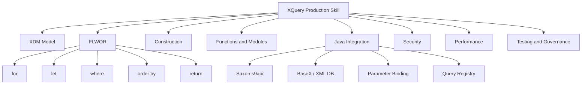
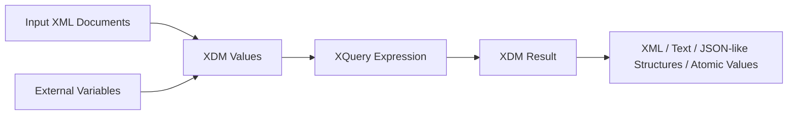
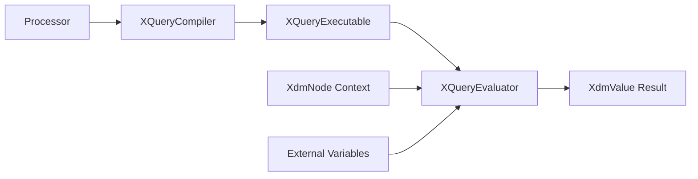
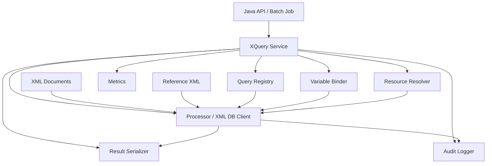
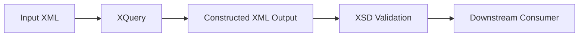

# Part 016 — XQuery in Action for Java Systems

## Tujuan Part Ini

XPath memilih dan menghitung nilai dari XML. XSLT mentransformasi dokumen dengan template. XQuery berada di tengah sebagai bahasa query dan construction untuk XML/XDM data.

Pertanyaan inti part ini:

```text
Kapan Java system sebaiknya memakai XQuery, dan bagaimana membuatnya production-grade?
```

Target setelah part ini:

- memahami XQuery sebagai query language atas XDM, bukan SQL versi XML;
- memahami FLWOR sebagai struktur query utama;
- tahu kapan XQuery lebih tepat daripada XPath, XSLT, StAX, atau Java traversal;
- bisa menjalankan XQuery dari Java menggunakan processor seperti Saxon atau XML database seperti BaseX;
- mendesain query registry, parameter binding, module layout, dan test fixtures;
- mengendalikan external resource access, dynamic query injection, timeout, memory, dan observability;
- memakai XQuery untuk reporting, reconciliation, regulatory extraction, multi-document joins, dan XML collection analysis.

Mental model:

```text
XQuery is a typed, composable query language over XDM values and XML document collections.
```

---

## 1. Why XQuery Exists

XML systems often need more than single-path extraction.

Examples:

- query all orders with at least one rejected line;
- aggregate invoice totals per counterparty from thousands of XML files;
- join a regulatory filing document with reference taxonomy XML;
- produce a compact exception report from validation result XML;
- compare partner feeds against canonical XML;
- extract audit evidence from archived XML payloads;
- run ad-hoc investigations over XML collections.

Doing this in Java alone often creates:

- nested DOM traversal;
- repeated XPath calls;
- ad-hoc data structures;
- memory-heavy preloading;
- hard-to-review query logic;
- weak testability;
- poor explainability for auditors.

XQuery lets you express XML query intent declaratively.

---

## 2. XQuery vs XPath vs XSLT vs Java

| Need | Prefer |
|---|---|
| select one value from one document | XPath |
| assert simple cross-field rule | XPath or Java rule |
| transform document to another document | XSLT |
| query multiple XML documents | XQuery |
| join XML with reference XML | XQuery |
| stream huge extraction | StAX/SAX |
| enforce structural contract | XSD |
| execute domain lifecycle decision | Java domain model |
| store and index large XML collections | XML database + XQuery |

Important framing:

```text
XQuery is not a universal replacement for Java.
It is a specialized tool for XML-shaped query problems.
```

---

## 3. Kaufman Deconstruction: XQuery Skill Map



Practice sequence:

1. write simple path query;
2. write FLWOR over one document;
3. return constructed XML;
4. bind external variables from Java;
5. split reusable functions into modules;
6. execute query against multiple documents;
7. add tests and golden outputs;
8. add security and observability wrappers.

---

## 4. XQuery Mental Model

XQuery operates over XDM values.



An XQuery program can:

- navigate XML paths;
- filter nodes;
- bind variables;
- join sequences;
- sort data;
- construct new XML;
- call functions;
- import modules;
- return nodes, atomic values, maps, arrays, or serialized documents.

Minimal query:

```xquery
/o:Order/o:Header/o:OrderId/string()
```

More typical query:

```xquery
for $line in /o:Order/o:Lines/o:Line
where xs:decimal($line/o:Amount) gt 1000
return
  <HighValueLine number="{ $line/@number }">
    <Sku>{ string($line/o:Sku) }</Sku>
    <Amount>{ string($line/o:Amount) }</Amount>
  </HighValueLine>
```

---

## 5. FLWOR Explained

FLWOR is often pronounced “flower”. It means:

```text
For
Let
Where
Order by
Return
```

Basic shape:

```xquery
for $item in $items
let $derived := some-expression($item)
where $derived gt 0
order by $derived descending
return result-expression($item, $derived)
```

Example input:

```xml
<Order xmlns="https://example.com/order">
  <Header>
    <OrderId>ORD-1001</OrderId>
    <Currency>USD</Currency>
  </Header>
  <Lines>
    <Line number="1">
      <Sku>SKU-001</Sku>
      <Amount>100.00</Amount>
    </Line>
    <Line number="2">
      <Sku>SKU-002</Sku>
      <Amount>2500.00</Amount>
    </Line>
  </Lines>
</Order>
```

Query:

```xquery
declare namespace o = "https://example.com/order";

for $line in /o:Order/o:Lines/o:Line
let $amount := xs:decimal($line/o:Amount)
where $amount gt 1000
order by $amount descending
return
  <LineAlert>
    <LineNumber>{ string($line/@number) }</LineNumber>
    <Sku>{ string($line/o:Sku) }</Sku>
    <Amount>{ $amount }</Amount>
  </LineAlert>
```

Result:

```xml
<LineAlert>
  <LineNumber>2</LineNumber>
  <Sku>SKU-002</Sku>
  <Amount>2500.00</Amount>
</LineAlert>
```

---

## 6. `for` vs `let`

This distinction is critical.

`for` iterates over each item:

```xquery
for $line in /o:Order/o:Lines/o:Line
return string($line/o:Sku)
```

If there are 10 lines, return executes 10 times.

`let` binds a value once:

```xquery
let $lines := /o:Order/o:Lines/o:Line
return count($lines)
```

If `$lines` has 10 nodes, `$lines` is bound as one sequence value.

Mental model:

```text
for expands.
let names.
```

Bad query style:

```xquery
for $headerCurrency in /o:Order/o:Header/o:Currency
for $line in /o:Order/o:Lines/o:Line
return ...
```

Better:

```xquery
let $headerCurrency := string(/o:Order/o:Header/o:Currency)
for $line in /o:Order/o:Lines/o:Line
return ...
```

---

## 7. Constructing XML Results

XQuery can construct XML directly.

```xquery
<Summary>
  <OrderId>{ string(/o:Order/o:Header/o:OrderId) }</OrderId>
  <LineCount>{ count(/o:Order/o:Lines/o:Line) }</LineCount>
</Summary>
```

Curly braces insert expression results.

Pitfall:

```xquery
<Status>/o:Order/o:Header/o:Status</Status>
```

This returns literal text, not evaluated expression.

Correct:

```xquery
<Status>{ string(/o:Order/o:Header/o:Status) }</Status>
```

Production rule:

```text
Use constructed XML for query outputs that will be stored, audited, tested, or transformed further.
Use maps/arrays for internal data exchange only when Java conversion is controlled.
```

---

## 8. External Variables

Like XPath, XQuery must not concatenate untrusted values into query syntax.

Bad:

```java
String query = "for $o in collection('orders') " +
               "where $o//CustomerId = '" + customerId + "' " +
               "return $o";
```

Better XQuery:

```xquery
declare namespace o = "https://example.com/order";
declare variable $customerId external;

for $order in collection('orders')/o:Order
where string($order/o:Header/o:CustomerId) = $customerId
return $order
```

Java binds `$customerId` as a variable.

Invariant:

```text
Query text should come from trusted source code or versioned resources.
Request data should enter through variables.
```

---

## 9. Java Integration Strategy

Java has standard APIs for XML parsing, XPath, validation, and transformation through `java.xml`, but not a universal standard JDK XQuery API.

Therefore, XQuery integration usually uses:

| Option | Good For |
|---|---|
| Saxon s9api | embedded XQuery execution in Java services |
| BaseX embedded/client/REST | XML database, indexed collections, query service |
| eXist-db / MarkLogic / vendor XML DB | enterprise XML repositories |
| custom service wrapper | isolate query processor from business services |

Production decision:

```text
If documents are request-local, embedded processor may be enough.
If documents are large collections requiring indexes, use an XML database or dedicated query service.
```

---

## 10. Saxon s9api XQuery Skeleton

Saxon s9api has XQuery-specific compiler/evaluator objects.

Conceptual lifecycle:



Example:

```java
import net.sf.saxon.s9api.*;

import javax.xml.transform.stream.StreamSource;
import java.io.StringReader;

public final class SaxonXQueryDemo {

    public static void main(String[] args) throws SaxonApiException {
        String xml = """
            <Order xmlns="https://example.com/order">
              <Header>
                <OrderId>ORD-1001</OrderId>
              </Header>
              <Lines>
                <Line number="1"><Sku>SKU-001</Sku></Line>
                <Line number="2"><Sku>SKU-002</Sku></Line>
              </Lines>
            </Order>
            """;

        String query = """
            declare namespace o = "https://example.com/order";
            <OrderSummary>
              <OrderId>{ string(/o:Order/o:Header/o:OrderId) }</OrderId>
              <LineCount>{ count(/o:Order/o:Lines/o:Line) }</LineCount>
            </OrderSummary>
            """;

        Processor processor = new Processor(false);
        DocumentBuilder documentBuilder = processor.newDocumentBuilder();
        XdmNode document = documentBuilder.build(new StreamSource(new StringReader(xml)));

        XQueryCompiler compiler = processor.newXQueryCompiler();
        XQueryExecutable executable = compiler.compile(query);

        XQueryEvaluator evaluator = executable.load();
        evaluator.setContextItem(document);

        XdmValue result = evaluator.evaluate();
        System.out.println(result.toString());
    }
}
```

Lifecycle guideline:

```text
Compile trusted query once.
Load evaluator per execution.
Bind context item and variables per request.
Convert result through explicit output policy.
```

---

## 11. Binding External Variables with Saxon

XQuery:

```xquery
declare namespace o = "https://example.com/order";
declare variable $minimumAmount external;

for $line in /o:Order/o:Lines/o:Line
let $amount := xs:decimal($line/o:Amount)
where $amount ge $minimumAmount
return $line
```

Java:

```java
QName minimumAmount = new QName("minimumAmount");

XQueryCompiler compiler = processor.newXQueryCompiler();
XQueryExecutable executable = compiler.compile(queryText);

XQueryEvaluator evaluator = executable.load();
evaluator.setContextItem(document);
evaluator.setExternalVariable(
    minimumAmount,
    new XdmAtomicValue(new BigDecimal("1000.00"))
);

XdmValue result = evaluator.evaluate();
```

Variables allow:

- safe parameterization;
- query plan reuse;
- better tests;
- audit of input parameters;
- prevention of query injection.

---

## 12. Query Registry Pattern

Do not store XQuery as random strings across services.

```java
public record XQueryDefinition(
    String id,
    String contractVersion,
    String resourcePath,
    QueryOutputType outputType,
    Set<String> requiredVariables
) {}
```

Example definitions:

```java
List<XQueryDefinition> queries = List.of(
    new XQueryDefinition(
        "order.high.value.lines.v1",
        "order-v1",
        "/xquery/order/high-value-lines.xq",
        QueryOutputType.XML_FRAGMENT,
        Set.of("minimumAmount")
    ),
    new XQueryDefinition(
        "order.summary.v1",
        "order-v1",
        "/xquery/order/summary.xq",
        QueryOutputType.XML_DOCUMENT,
        Set.of()
    )
);
```

Registry benefits:

- startup compilation;
- code review;
- version control;
- checksum audit;
- test fixture mapping;
- controlled parameter binding;
- safer deployment.

---

## 13. Query Modules

For repeated functions, use XQuery modules.

Library module:

```xquery
module namespace ord = "https://example.com/xquery/order";

declare namespace o = "https://example.com/order";

declare function ord:order-id($order as element(o:Order)) as xs:string {
  string($order/o:Header/o:OrderId)
};

declare function ord:line-count($order as element(o:Order)) as xs:integer {
  count($order/o:Lines/o:Line)
};
```

Main query:

```xquery
declare namespace o = "https://example.com/order";
import module namespace ord = "https://example.com/xquery/order"
  at "order-functions.xqm";

<Summary>
  <OrderId>{ ord:order-id(/o:Order) }</OrderId>
  <LineCount>{ ord:line-count(/o:Order) }</LineCount>
</Summary>
```

Production controls:

- modules must be resolved from packaged resources, not arbitrary filesystem paths;
- module URI/version must be governed;
- module functions need unit tests;
- module imports should be locked down by resolver policy.

---

## 14. Multi-Document Query

XQuery becomes valuable when there are multiple XML documents.

Example concept:

```xquery
declare namespace o = "https://example.com/order";
declare namespace r = "https://example.com/reference";

declare variable $orders external;
declare variable $riskCatalog external;

for $order in $orders/o:Order
let $customerType := string($order/o:Header/o:CustomerType)
let $risk := $riskCatalog/r:RiskCatalog/r:CustomerType[@code = $customerType]
where string($risk/@riskLevel) = 'HIGH'
return
  <HighRiskOrder>
    <OrderId>{ string($order/o:Header/o:OrderId) }</OrderId>
    <CustomerType>{ $customerType }</CustomerType>
  </HighRiskOrder>
```

Do not let query code fetch reference data from uncontrolled URIs. Load reference documents in Java or XML database under approved policy, then bind them.

---

## 15. Collections

XQuery has concepts such as document access and collections, but production systems must define what “collection” means.

Possible meanings:

| Collection Model | Example |
|---|---|
| in-memory sequence | Java loads N `XdmNode`s and binds as variable |
| XML database collection | BaseX/MarkLogic/eXist collection |
| repository query | query service loads by metadata |
| archive scan | batch job streams files into query batches |

Design question:

```text
Is collection access part of the query language, or part of the platform service?
```

For regulated systems, platform-controlled access is usually safer.

---

## 16. BaseX / XML Database Strategy

When XML collections become large, embedded in-memory query execution may not be enough.

XML databases such as BaseX provide:

- XML storage;
- indexing;
- XQuery execution;
- collection-oriented access;
- APIs/clients/REST integration;
- administrative tooling.

Use an XML database when:

- query spans many persisted XML documents;
- index-backed search matters;
- ad-hoc investigation over XML archive is required;
- XML is a primary persisted representation;
- query latency matters across collections;
- document version history needs to be queried.

Avoid XML database when:

- XML is only transient request payload;
- query is simple extraction;
- team lacks operational ownership;
- relational/document store already models the real query needs better;
- audit requires immutable object storage plus deterministic replay rather than mutable XML DB state.

---

## 17. XQuery Service Architecture



Service responsibilities:

- select approved query by ID;
- validate required variables;
- bind context documents;
- control external resources;
- execute query under timeout/resource policy;
- serialize result deterministically;
- emit audit event;
- expose metrics.

The business service should not know processor internals.

---

## 18. Output Policy

XQuery can return many kinds of values.

Output policy should be explicit.

| Output Type | Handling |
|---|---|
| XML document | serialize with XML declaration policy |
| XML fragment | wrap or stream carefully |
| sequence of nodes | define separator/wrapper |
| string | cardinality check |
| boolean | assertion result |
| number/decimal | typed conversion |
| map/array | controlled Java conversion |

Bad:

```java
return evaluator.evaluate().toString();
```

Better:

```java
QueryResult result = resultSerializer.serialize(
    queryDefinition.outputType(),
    evaluator.evaluate()
);
```

Reason:

```text
Serialization is a contract decision, not a side effect.
```

---

## 19. Security Model

XQuery security risks:

- dynamic query injection;
- arbitrary document access via `doc()`;
- collection enumeration;
- module import from filesystem/network;
- extension function abuse;
- CPU-heavy query;
- memory-heavy result materialization;
- leaking sensitive payload in query errors;
- over-broad diagnostic outputs.

Baseline policy:

```text
Only run registered queries.
Bind all request values as external variables.
Restrict doc(), collection(), and module resolution.
Disable or deny extension functions unless explicitly approved.
Apply input and output size limits.
Apply execution timeout where processor/platform supports it.
Avoid logging full query results.
Audit query ID, checksum, variables metadata, document hash, and result status.
```

---

## 20. Query Injection Example

Bad query generation:

```java
String query = "declare namespace o='https://example.com/order'; " +
    "for $line in /o:Order/o:Lines/o:Line " +
    "where $line/o:Sku = '" + sku + "' " +
    "return $line";
```

If `sku` contains:

```text
SKU-001' or '1'='1
```

query semantics may change or compilation may fail.

Correct query:

```xquery
declare namespace o = "https://example.com/order";
declare variable $sku external;

for $line in /o:Order/o:Lines/o:Line
where string($line/o:Sku) = $sku
return $line
```

Java binds `$sku`.

Security invariant:

```text
Query text is executable code. Data must not be concatenated into executable code.
```

---

## 21. Performance Engineering

XQuery performance depends on:

- processor implementation;
- input document count and size;
- index availability;
- query selectivity;
- path specificity;
- sorting/grouping cost;
- constructed result size;
- module/function design;
- external document access;
- serialization cost.

Rules of thumb:

| Situation | Strategy |
|---|---|
| same query many times | compile/cache query |
| many small request-local docs | embedded processor may be fine |
| huge collections | XML DB/indexed engine |
| large output | stream/serialize carefully |
| repeated reference lookup | pre-bind reference doc or use indexed store |
| expensive sort | check result cardinality and indexes |
| query uses `//` widely | review path selectivity |

Benchmark with real XML shape. Synthetic tiny XML will lie.

---

## 22. Avoid Hidden Full Scans

This is convenient:

```xquery
//o:Line[o:Sku = $sku]
```

But it can scan a large tree or collection.

Prefer contract-specific paths:

```xquery
/o:Order/o:Lines/o:Line[o:Sku = $sku]
```

In a collection:

```xquery
for $order in collection('orders')/o:Order
where $order/o:Header/o:Status = 'SUBMITTED'
return $order/o:Lines/o:Line[o:Sku = $sku]
```

Whether this is efficient depends on the processor/database and indexing.

Production principle:

```text
A query that reads well is not necessarily a query that runs well.
Measure selectivity and plan behavior.
```

---

## 23. Testing XQuery

XQuery needs tests like application code.

Test types:

| Test | Purpose |
|---|---|
| compile test | query and modules compile |
| fixture test | known input produces expected output |
| golden output | serialized XML stable |
| namespace drift | wrong namespace fails as expected |
| variable binding | required variables enforced |
| injection test | malicious variable value is data |
| empty collection | graceful no-result behavior |
| large collection smoke | performance regression guard |
| output schema validation | query output conforms to contract |
| diagnostic quality | failure result helps operator |

Golden-file comparison must be XML-aware, not raw string-only unless canonicalized.

---

## 24. Query Output Validation

If XQuery constructs XML that becomes downstream input, validate it.

Pipeline:



Reason:

```text
A query can compile and still construct invalid business XML.
```

Output validation catches:

- wrong namespace;
- missing required element;
- invalid datatype;
- unexpected multiplicity;
- bad construction logic;
- version mismatch.

---

## 25. Observability

Metrics:

- query execution count;
- latency by query ID;
- result count/size;
- compile failures;
- runtime failures;
- timeout count;
- input document size;
- output document size;
- XML DB latency if remote;
- module resolution failures.

Audit event:

```json
{
  "eventType": "XML_XQUERY_EXECUTED",
  "queryId": "order.high.value.lines.v1",
  "queryChecksum": "sha256:...",
  "contractVersion": "order-v1",
  "inputDocumentHash": "sha256:...",
  "parameterNames": ["minimumAmount"],
  "resultItemCount": 2,
  "status": "SUCCESS",
  "startedAt": "2026-07-02T10:15:30Z",
  "durationMs": 18
}
```

Avoid logging raw parameter values if they contain PII or confidential data.

---

## 26. XQuery for Regulatory and Case Management Systems

XQuery is especially useful when XML is the legally relevant representation.

Use cases:

- extract all facts submitted in a regulatory filing;
- compare current filing against previous filing;
- generate exception reports from XML evidence packs;
- validate cross-document consistency;
- join case event XML with reference classification XML;
- build audit summaries without changing original payload;
- reconstruct decisions from archived XML snapshots.

Why XQuery can fit:

- query intent is declarative;
- output can be XML and schema-validatable;
- query text can be versioned and audited;
- document hash + query checksum supports reproducibility;
- results can be explained with stable query IDs.

Important boundary:

```text
XQuery can extract and summarize evidence.
It should not silently become the source of domain state transition authority unless governed as rule code.
```

---

## 27. Anti-Patterns

| Anti-Pattern | Why It Fails |
|---|---|
| dynamic string-built queries | injection, unreviewable behavior |
| query files edited manually on server | no reproducibility |
| arbitrary `doc()` access | SSRF/file leak/retry chaos |
| using XQuery for all business logic | unreadable hidden rule engine |
| no output schema validation | downstream invalid XML |
| no query ID/checksum | weak audit trail |
| raw string golden tests only | whitespace/namespace false failures |
| XML DB without operational owner | backup/security/performance risk |
| broad `//` collection scans | performance cliff |
| no fixture per schema version | silent contract drift |

---

## 28. Reference Implementation Shape

```java
public interface XQueryService {
    QueryResult execute(QueryRequest request);
}

public record QueryRequest(
    String queryId,
    String contractVersion,
    List<XmlDocument> inputDocuments,
    Map<String, QueryVariable> variables,
    QueryExecutionPolicy policy
) {}

public record QueryResult(
    String queryId,
    QueryOutputType outputType,
    byte[] serializedOutput,
    int itemCount,
    QueryExecutionMetadata metadata
) {}
```

Supporting components:

```text
QueryRegistry
QueryCompiler
VariableBinder
DocumentBinder
ModuleResolver
ExternalResourcePolicy
ResultSerializer
OutputValidator
QueryAuditLogger
QueryMetrics
```

This keeps XQuery integration isolated from application business code.

---

## 29. Query Governance Workflow

Treat query changes like code changes.

Checklist:

```text
[ ] Query has stable ID.
[ ] Query is stored in version control.
[ ] Query declares namespaces explicitly.
[ ] Query binds request data through external variables.
[ ] Query has compile test.
[ ] Query has fixture tests.
[ ] Query output is validated if downstream-facing.
[ ] Query has expected cardinality/output type.
[ ] Query avoids uncontrolled doc()/collection().
[ ] Query has performance test for representative data.
[ ] Query change is mapped to contract/schema version.
[ ] Query has migration notes if output changes.
```

---

## 30. When Not to Use XQuery

Do not use XQuery merely because data is XML.

Avoid XQuery when:

- XML is small and one-field extraction is enough;
- processing must be streaming with very low memory;
- logic is domain workflow/state transition;
- team cannot support query processor operationally;
- output is primarily object graph manipulated by Java anyway;
- query must join heavily with relational data already indexed in SQL;
- the main problem is validation, not querying;
- maintainers cannot review query language safely.

Better alternatives:

| Situation | Alternative |
|---|---|
| one value extraction | XPath |
| shape validation | XSD |
| document transform | XSLT |
| huge linear extraction | StAX/SAX |
| aggregate relational facts | SQL |
| lifecycle rule | Java domain logic |

---

## 31. Kaufman Practice Drill

Timebox: 2–4 hours.

Build a small XQuery-backed Java component.

Input:

- `Order` XML document;
- `RiskCatalog` XML reference document;
- minimum amount variable.

Implement:

1. `XQueryRegistry` that loads `.xq` files from classpath;
2. startup compile test;
3. `XQueryService` using Saxon s9api;
4. external variable binding;
5. context document binding;
6. reference document binding as variable;
7. XML output serialization;
8. output XSD validation;
9. query audit event;
10. tests for injection, missing variable, wrong namespace, empty result, and large fixture.

Example query goal:

```text
Return HighRiskHighValueLine XML for all order lines where:
- line amount >= minimumAmount;
- customer type has HIGH risk in reference XML;
- line currency matches order header currency.
```

Self-correction questions:

```text
Can I explain why XQuery is better than repeated XPath calls for this case?
Can I bind all request data without string concatenation?
Can I restrict module/document resolution?
Can I validate query output?
Can I audit query ID, checksum, input hash, and result count?
Can I explain when this should move to an XML database?
```

---

## 32. Summary

XQuery is a powerful tool when Java systems need to query, join, reshape, and summarize XML data across documents or collections.

Key principles:

- use XQuery for XML-shaped query problems, not all XML problems;
- keep query text versioned, reviewed, and tested;
- bind runtime data as external variables;
- control `doc()`, `collection()`, module imports, and extension functions;
- compile/cache approved queries;
- define output policy explicitly;
- validate XML output when it becomes a downstream contract;
- choose XML database when collection size and indexing demand it;
- audit query execution for reproducibility.

Core invariant:

```text
XQuery should make XML query intent explicit and reproducible, not hide business logic in an opaque runtime.
```

Next, we move into XSLT foundations: template-driven XML transformation.

---

## References

- W3C XQuery 3.1 Recommendation.
- W3C XQuery and XPath Data Model 3.1 Recommendation.
- W3C XPath and XQuery Functions and Operators 3.1 Recommendation.
- Saxonica Saxon s9api Java documentation for XQuery compiler/evaluator usage.
- BaseX documentation for Java integration and XML database/XQuery usage.
