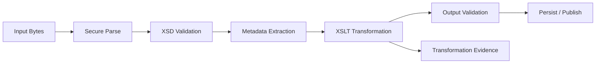
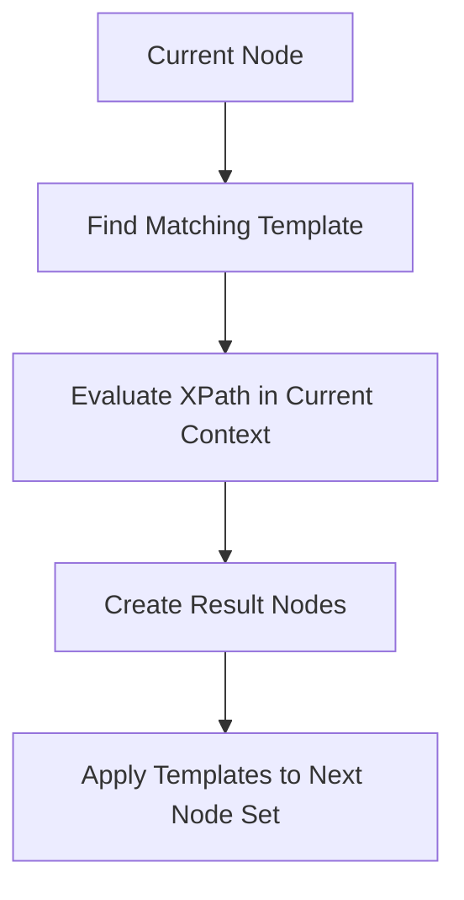
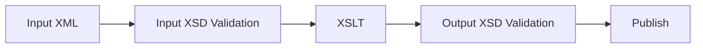

# Part 017 — XSLT Foundations: Template-Driven Transformation

## Tujuan Part Ini

Part ini membangun fondasi XSLT sebagai **transformation language**, bukan sekadar "XML templating".

Pertanyaan inti:

```text
Bagaimana berpikir dengan XSLT sehingga transformasi XML menjadi deterministic, testable, maintainable, dan audit-friendly?
```

Target setelah part ini:

- memahami XSLT sebagai bahasa deklaratif berbasis **template rules**;
- membedakan gaya **push transformation** dan **pull transformation**;
- memahami peran XPath context di dalam stylesheet;
- bisa membaca dan menulis identity transform, selective copy, rename, prune, enrich, dan render patterns;
- memahami `xsl:template`, `xsl:apply-templates`, `xsl:value-of`, `xsl:copy`, `xsl:copy-of`, `xsl:for-each`, `xsl:if`, `xsl:choose`, `xsl:param`, `xsl:variable`, dan `xsl:output`;
- memahami namespace handling dalam stylesheet dan output XML;
- mengetahui anti-pattern XSLT yang biasanya membuat stylesheet menjadi rapuh;
- menyiapkan dasar untuk part berikutnya: menjalankan XSLT dari Java dengan JAXP `TransformerFactory` dan `Templates`.

Mental model utama:

```text
XSLT is a rule-based tree transformation engine.
A stylesheet is not a script that loops over strings.
It is a set of rules that says: when this kind of node appears, produce this kind of output.
```

---

## 1. Kapan XSLT Layak Dipakai

XSLT cocok ketika input utama adalah XML dan output bisa dijelaskan sebagai hasil transformasi dari struktur XML tersebut.

Contoh workload yang cocok:

- partner XML v1 menjadi canonical XML internal;
- canonical XML menjadi partner-specific XML v2;
- regulatory filing XML menjadi readable HTML report;
- XML validation result menjadi compact error report;
- enrichment XML dengan metadata yang dikirim sebagai parameter;
- XML document normalization sebelum diff/golden-file testing;
- SOAP payload extraction dan envelope rewriting;
- batch XML file menjadi delimited text untuk downstream legacy;
- invoice XML menjadi print-friendly HTML;
- archival XML menjadi audit view yang bisa dibaca manusia.

XSLT kurang cocok ketika:

- logika dominan adalah orchestration, network calls, transaction, atau side effects;
- transformasi membutuhkan banyak lookup procedural yang lebih natural di service layer;
- input bukan tree/document tapi event stream sangat besar yang tidak bisa ditahan processor;
- rule sering berubah oleh business user tetapi tidak ada governance/review process;
- team tidak punya testing discipline untuk stylesheet.

Decision rule sederhana:

```text
Use XSLT when the transformation can be specified as structural mapping from XML tree to another representation.
Use Java when the operation is orchestration, IO, transaction, or complex domain decisioning.
```

---

## 2. XSLT dalam Pipeline Java XML

Di production Java system, XSLT biasanya bukan komponen tunggal. Ia berada di tengah pipeline.



Boundary yang perlu jelas:

| Boundary | Responsibility |
|---|---|
| Java service | IO, security policy, transaction, retry, audit, observability |
| XSD | Structural contract validation |
| XPath | Extraction, routing, assertions |
| XSLT | Tree-to-tree/tree-to-text transformation |
| Output validation | Memastikan hasil transformasi masih memenuhi contract |
| Audit layer | Menyimpan input, stylesheet version, parameters, output hash, dan diagnostics |

XSLT harus diperlakukan sebagai **artifact versioned**, bukan string yang ditempel di code.

---

## 3. Minimal Stylesheet

Contoh input:

```xml
<order xmlns="urn:example:order:v1">
  <id>ORD-1001</id>
  <customer>
    <name>Ada Lovelace</name>
  </customer>
  <lines>
    <line>
      <sku>BOOK-1</sku>
      <qty>2</qty>
      <price>150000.00</price>
    </line>
  </lines>
</order>
```

Contoh stylesheet XSLT 1.0:

```xml
<xsl:stylesheet version="1.0"
    xmlns:xsl="http://www.w3.org/1999/XSL/Transform"
    xmlns:o="urn:example:order:v1"
    exclude-result-prefixes="o">

  <xsl:output method="xml" indent="yes" encoding="UTF-8"/>

  <xsl:template match="/o:order">
    <canonicalOrder xmlns="urn:example:canonical:order:v1">
      <orderId>
        <xsl:value-of select="o:id"/>
      </orderId>
      <customerName>
        <xsl:value-of select="o:customer/o:name"/>
      </customerName>
    </canonicalOrder>
  </xsl:template>

</xsl:stylesheet>
```

Key points:

- `xsl` namespace adalah namespace instruksi XSLT;
- `o` adalah prefix untuk namespace input;
- `exclude-result-prefixes="o"` mencegah namespace input ikut muncul di output jika tidak dipakai;
- `match="/o:order"` memilih root element `order` dalam namespace `urn:example:order:v1`;
- literal result element `<canonicalOrder>` menjadi output;
- `xsl:value-of` menghasilkan string value dari selected node.

Kesalahan umum:

```xml
<xsl:template match="/order">
```

Ini tidak match input jika `order` punya default namespace. Dalam XPath/XSLT, unprefixed name biasanya berarti **no namespace**, bukan default namespace input.

---

## 4. Template Rule Mental Model

XSLT bekerja dengan template rules.

```xml
<xsl:template match="pattern">
  output instructions
</xsl:template>
```

Processor mencari template yang paling cocok untuk current node, lalu menjalankan instruksi di dalamnya.



Template rule berbeda dari function biasa:

- dipilih oleh pattern matching;
- bisa berkompetisi dengan template lain;
- punya priority;
- bisa dibatasi oleh mode;
- context node berubah saat traversal;
- output dibuat sebagai result tree.

Contoh template granular:

```xml
<xsl:template match="o:id">
  <orderId>
    <xsl:value-of select="."/>
  </orderId>
</xsl:template>
```

`.` berarti current node.

---

## 5. Push vs Pull Transformation

Ada dua gaya utama.

### 5.1 Pull Style

Pull style berarti template utama secara eksplisit mengambil data dari lokasi tertentu.

```xml
<xsl:template match="/o:order">
  <canonicalOrder>
    <orderId><xsl:value-of select="o:id"/></orderId>
    <customerName><xsl:value-of select="o:customer/o:name"/></customerName>
  </canonicalOrder>
</xsl:template>
```

Kelebihan:

- mudah dipahami untuk mapping kecil;
- output shape sangat eksplisit;
- bagus untuk one-page transform.

Kekurangan:

- cepat menjadi besar;
- logika nested menumpuk;
- sulit reuse;
- perubahan struktur input sering memaksa perubahan di template besar.

### 5.2 Push Style

Push style berarti template utama mendelegasikan ke node lain.

```xml
<xsl:template match="/o:order">
  <canonicalOrder>
    <xsl:apply-templates select="o:id"/>
    <xsl:apply-templates select="o:customer"/>
    <xsl:apply-templates select="o:lines/o:line"/>
  </canonicalOrder>
</xsl:template>

<xsl:template match="o:id">
  <orderId><xsl:value-of select="."/></orderId>
</xsl:template>

<xsl:template match="o:customer">
  <customerName><xsl:value-of select="o:name"/></customerName>
</xsl:template>

<xsl:template match="o:line">
  <item>
    <sku><xsl:value-of select="o:sku"/></sku>
    <quantity><xsl:value-of select="o:qty"/></quantity>
  </item>
</xsl:template>
```

Kelebihan:

- modular;
- mudah override;
- cocok untuk dokumen kompleks;
- template kecil lebih mudah dites.

Kekurangan:

- sulit dibaca bagi pemula;
- debugging membutuhkan pemahaman template matching;
- template priority/mode bisa membingungkan.

Production heuristic:

```text
Use pull style for small canonical mapping.
Use push style for document-like transformation and reusable mapping rules.
Use modes when the same node needs different output in different phases.
```

---

## 6. Built-in Template Rules

XSLT punya default behavior jika tidak ada template explicit.

Secara konseptual:

- root/element node: apply templates ke child;
- text/attribute node: output string value;
- comment/processing-instruction: biasanya ignored.

Itu sebabnya stylesheet minimal kadang menghasilkan text yang “bocor” ke output.

Contoh:

```xml
<xsl:stylesheet version="1.0"
    xmlns:xsl="http://www.w3.org/1999/XSL/Transform">
  <xsl:template match="/">
    <out>
      <xsl:apply-templates/>
    </out>
  </xsl:template>
</xsl:stylesheet>
```

Jika tidak ada template lain, text dari seluruh dokumen bisa muncul karena built-in rule untuk text node.

Untuk production, jangan mengandalkan built-in behavior secara tidak sadar.

Tambahkan template penahan jika ingin strict:

```xml
<xsl:template match="text()"/>
```

Atau buat mode khusus dengan template default yang explicit.

---

## 7. Identity Transform

Identity transform adalah pola paling penting di XSLT.

Ia menyalin input ke output, lalu kita override bagian tertentu.

```xml
<xsl:stylesheet version="1.0"
    xmlns:xsl="http://www.w3.org/1999/XSL/Transform">

  <xsl:output method="xml" indent="yes"/>

  <xsl:template match="@*|node()">
    <xsl:copy>
      <xsl:apply-templates select="@*|node()"/>
    </xsl:copy>
  </xsl:template>

</xsl:stylesheet>
```

Artinya:

- untuk attribute atau node apapun;
- copy node sekarang;
- apply templates ke attribute dan child node.

Ini adalah basis:

- redact field tertentu;
- rename element;
- remove element;
- normalize values;
- inject metadata;
- reorder selected nodes;
- transform subset tanpa membangun ulang seluruh dokumen.

---

## 8. Pattern: Remove Sensitive Element

Input:

```xml
<customer>
  <name>Ada</name>
  <nationalId>SECRET</nationalId>
</customer>
```

Stylesheet:

```xml
<xsl:stylesheet version="1.0"
    xmlns:xsl="http://www.w3.org/1999/XSL/Transform">

  <xsl:template match="@*|node()">
    <xsl:copy>
      <xsl:apply-templates select="@*|node()"/>
    </xsl:copy>
  </xsl:template>

  <xsl:template match="nationalId"/>

</xsl:stylesheet>
```

Template kosong menghapus node yang match.

Production note:

- gunakan namespace-aware match untuk dokumen namespaced;
- buat redaction stylesheet immutable dan versioned;
- test dengan negative fixture untuk memastikan field sensitif benar-benar hilang;
- jangan log pre-redacted output.

---

## 9. Pattern: Rename Element

```xml
<xsl:template match="oldName">
  <newName>
    <xsl:apply-templates select="@*|node()"/>
  </newName>
</xsl:template>
```

Dengan namespace:

```xml
<xsl:stylesheet version="1.0"
    xmlns:xsl="http://www.w3.org/1999/XSL/Transform"
    xmlns:old="urn:partner:v1"
    xmlns:new="urn:canonical:v1"
    exclude-result-prefixes="old">

  <xsl:template match="old:customerName">
    <new:customerFullName>
      <xsl:apply-templates select="@*|node()"/>
    </new:customerFullName>
  </xsl:template>

</xsl:stylesheet>
```

Jangan hanya mengganti prefix secara string. Identitas element adalah namespace URI + local name.

---

## 10. Pattern: Copy Only Whitelist Fields

Untuk transformasi defensif, whitelist sering lebih aman daripada blacklist.

```xml
<xsl:template match="/customer">
  <customerPublicView>
    <xsl:apply-templates select="name | email"/>
  </customerPublicView>
</xsl:template>

<xsl:template match="name">
  <name><xsl:value-of select="."/></name>
</xsl:template>

<xsl:template match="email">
  <email><xsl:value-of select="."/></email>
</xsl:template>
```

Kelebihan whitelist:

- field baru tidak otomatis bocor;
- audit lebih mudah;
- cocok untuk PII boundary;
- output contract lebih stabil.

Kekurangan:

- transformasi harus di-update jika field baru memang harus keluar;
- mapping lebih verbose.

---

## 11. XPath Context di Dalam XSLT

XSLT sangat bergantung pada XPath context.

Context terdiri dari:

- current node;
- context position;
- context size;
- variable bindings;
- namespace bindings;
- function library;
- base URI.

Contoh:

```xml
<xsl:for-each select="o:lines/o:line">
  <item index="{position()}">
    <sku><xsl:value-of select="o:sku"/></sku>
  </item>
</xsl:for-each>
```

Di dalam `for-each`, current node adalah `o:line`, bukan `o:order`.

Bug umum:

```xml
<xsl:for-each select="o:lines/o:line">
  <orderId><xsl:value-of select="o:id"/></orderId>
</xsl:for-each>
```

Ini mencari `o:id` sebagai child dari `o:line`. Jika order id ada di parent root, gunakan path relatif yang benar:

```xml
<orderId><xsl:value-of select="/o:order/o:id"/></orderId>
```

Atau simpan di variable sebelum context berubah.

---

## 12. Attribute Value Templates

Attribute Value Template memungkinkan XPath expression di dalam attribute literal dengan `{}`.

```xml
<item index="{position()}" sku="{o:sku}">
  <xsl:value-of select="o:description"/>
</item>
```

Ini berbeda dari text literal biasa.

Hati-hati:

```xml
<item sku="o:sku"/>
```

Output-nya string literal `o:sku`, bukan nilai element.

---

## 13. `xsl:value-of` vs `xsl:copy-of` vs `xsl:apply-templates`

| Instruksi | Output | Kapan Dipakai |
|---|---|---|
| `xsl:value-of` | string value | field scalar, text content |
| `xsl:copy` | current node shallow copy | identity transform, retain node name |
| `xsl:copy-of` | deep copy selected node/tree | preserve subtree tanpa transform lanjut |
| `xsl:apply-templates` | delegasi rule processing | modular push-style transform |

Contoh `copy-of`:

```xml
<xsl:copy-of select="o:attachmentMetadata"/>
```

Risiko `copy-of`:

- namespace ikut terbawa;
- field sensitive bisa ikut tersalin;
- output contract bisa melebar diam-diam;
- tidak memberi kesempatan template lain untuk override subtree.

Production heuristic:

```text
Prefer apply-templates for controlled transformation.
Use copy-of only when subtree is explicitly allowed to pass through unchanged.
```

---

## 14. Variables dan Parameters

### 14.1 `xsl:param`

Parameter dikirim dari luar stylesheet.

```xml
<xsl:param name="sourceSystem"/>
<xsl:param name="processingDate"/>

<xsl:template match="/o:order">
  <canonicalOrder source="{$sourceSystem}" processedAt="{$processingDate}">
    <orderId><xsl:value-of select="o:id"/></orderId>
  </canonicalOrder>
</xsl:template>
```

Use cases:

- source system;
- correlation ID;
- processing date;
- partner ID;
- transformation version;
- environment flag;
- feature toggle yang explicit.

### 14.2 `xsl:variable`

Variable menyimpan value expression atau result tree fragment.

```xml
<xsl:variable name="orderId" select="o:id"/>
```

XSLT variable bersifat immutable dalam model deklaratif. Jangan berpikir seperti local variable Java yang di-update di loop.

Anti-pattern:

```text
Trying to implement counters and mutable accumulators in XSLT 1.0.
```

Untuk transformasi yang membutuhkan stateful aggregation kompleks, pertimbangkan XSLT 2/3 atau pindahkan aggregation ke Java/XQuery.

---

## 15. Conditional Logic

### `xsl:if`

```xml
<xsl:if test="o:priority = 'HIGH'">
  <urgent>true</urgent>
</xsl:if>
```

### `xsl:choose`

```xml
<xsl:choose>
  <xsl:when test="o:status = 'A'">ACTIVE</xsl:when>
  <xsl:when test="o:status = 'C'">CLOSED</xsl:when>
  <xsl:otherwise>UNKNOWN</xsl:otherwise>
</xsl:choose>
```

Heuristic:

- conditional kecil di XSLT OK;
- decision table besar sebaiknya externalized atau dimodelkan sebagai lookup document;
- business decision yang memerlukan audit domain sebaiknya berada di domain service, bukan tersembunyi di stylesheet.

---

## 16. Iteration: `xsl:for-each` vs `apply-templates`

`for-each` cocok untuk mapping sederhana:

```xml
<xsl:for-each select="o:lines/o:line">
  <item>
    <sku><xsl:value-of select="o:sku"/></sku>
    <qty><xsl:value-of select="o:qty"/></qty>
  </item>
</xsl:for-each>
```

`apply-templates` lebih cocok untuk rule composition:

```xml
<xsl:template match="o:lines">
  <items>
    <xsl:apply-templates select="o:line"/>
  </items>
</xsl:template>

<xsl:template match="o:line">
  <item>
    <sku><xsl:value-of select="o:sku"/></sku>
    <qty><xsl:value-of select="o:qty"/></qty>
  </item>
</xsl:template>
```

Rule of thumb:

```text
If every selected node is transformed the same way and the rule may be reused, prefer apply-templates.
If the output is a local one-off block, for-each is acceptable.
```

---

## 17. Modes

Mode memungkinkan node yang sama diproses dengan rule berbeda.

Contoh: satu input order menghasilkan summary dan detail.

```xml
<xsl:template match="/o:order">
  <report>
    <summary>
      <xsl:apply-templates select="." mode="summary"/>
    </summary>
    <details>
      <xsl:apply-templates select="o:lines/o:line" mode="detail"/>
    </details>
  </report>
</xsl:template>

<xsl:template match="o:order" mode="summary">
  <orderId><xsl:value-of select="o:id"/></orderId>
</xsl:template>

<xsl:template match="o:line" mode="detail">
  <line>
    <sku><xsl:value-of select="o:sku"/></sku>
    <qty><xsl:value-of select="o:qty"/></qty>
  </line>
</xsl:template>
```

Modes menghindari template conflict ketika context node sama tetapi output intent berbeda.

Production naming convention:

```text
mode="canonical"
mode="audit"
mode="redact"
mode="html"
mode="summary"
mode="partner-v2"
```

---

## 18. Template Conflict dan Priority

Kadang lebih dari satu template match node yang sama.

```xml
<xsl:template match="o:line">
  ...
</xsl:template>

<xsl:template match="o:line[o:qty &gt; 10]">
  ...
</xsl:template>
```

Processor memilih template berdasarkan import precedence, priority, dan order.

Untuk production, jangan bergantung pada subtle priority jika team tidak akan mengingat rule-nya. Gunakan:

- pattern yang jelas;
- mode;
- explicit `priority` bila perlu;
- stylesheet tests yang membuktikan dispatch rule.

Contoh:

```xml
<xsl:template match="o:line[o:qty &gt; 10]" priority="10">
  <bulkItem>
    <xsl:apply-templates select="o:sku | o:qty"/>
  </bulkItem>
</xsl:template>
```

---

## 19. Namespace Handling

Namespace adalah sumber bug terbesar dalam XSLT production.

### 19.1 Input Namespace

Jika input punya default namespace:

```xml
<order xmlns="urn:example:order:v1">
  <id>ORD-1</id>
</order>
```

Maka stylesheet harus bind namespace itu ke prefix:

```xml
<xsl:stylesheet version="1.0"
    xmlns:xsl="http://www.w3.org/1999/XSL/Transform"
    xmlns:o="urn:example:order:v1">

  <xsl:template match="/o:order">
    <id><xsl:value-of select="o:id"/></id>
  </xsl:template>

</xsl:stylesheet>
```

### 19.2 Output Namespace

Jika output harus namespaced:

```xml
<xsl:template match="/o:order">
  <c:canonicalOrder xmlns:c="urn:example:canonical:v1">
    <c:orderId><xsl:value-of select="o:id"/></c:orderId>
  </c:canonicalOrder>
</xsl:template>
```

Atau gunakan default namespace pada literal output:

```xml
<canonicalOrder xmlns="urn:example:canonical:v1">
  <orderId>...</orderId>
</canonicalOrder>
```

### 19.3 Exclude Result Prefixes

```xml
exclude-result-prefixes="o util"
```

Gunakan untuk mencegah namespace stylesheet/helper yang tidak perlu muncul di output.

---

## 20. Output Methods

`xsl:output` mengontrol serialization.

```xml
<xsl:output method="xml" encoding="UTF-8" indent="yes"/>
```

Common methods:

| Method | Use Case |
|---|---|
| `xml` | XML output |
| `html` | HTML report |
| `text` | CSV, fixed-width, plain text |

Contoh text output:

```xml
<xsl:stylesheet version="1.0"
    xmlns:xsl="http://www.w3.org/1999/XSL/Transform"
    xmlns:o="urn:example:order:v1">

  <xsl:output method="text" encoding="UTF-8"/>

  <xsl:template match="/o:order">
    <xsl:value-of select="o:id"/>
    <xsl:text>,</xsl:text>
    <xsl:value-of select="o:customer/o:name"/>
    <xsl:text>&#10;</xsl:text>
  </xsl:template>

</xsl:stylesheet>
```

Risiko output text:

- delimiter escaping;
- newline convention;
- locale/decimal formatting;
- downstream parser assumptions;
- encoding mismatch.

---

## 21. Whitespace Control

XML whitespace bisa significant atau insignificant tergantung domain.

XSLT menyediakan:

```xml
<xsl:strip-space elements="*"/>
<xsl:preserve-space elements="pre code"/>
```

Gunakan hati-hati.

Untuk document-centric XML seperti legal/regulatory documents, whitespace bisa bermakna. Untuk data-centric XML, stripping whitespace sering membantu output lebih stabil.

Heuristic:

```text
Never strip whitespace globally until you know whether the input XML is data-centric or document-centric.
```

---

## 22. Sorting

```xml
<xsl:for-each select="o:lines/o:line">
  <xsl:sort select="o:sku" data-type="text" order="ascending"/>
  <item>
    <sku><xsl:value-of select="o:sku"/></sku>
  </item>
</xsl:for-each>
```

Production concern:

- sort changes semantic order;
- original order may be legally/audit relevant;
- output determinism may require explicit sort;
- numeric sort requires correct data type;
- collation behavior differs by processor/version for advanced cases.

---

## 23. Transformation Pattern: Canonical Mapping

Partner input:

```xml
<p:Purchase xmlns:p="urn:partner:a:v1">
  <p:PurchaseNo>P-100</p:PurchaseNo>
  <p:Buyer>Ada</p:Buyer>
</p:Purchase>
```

Canonical output:

```xml
<c:Order xmlns:c="urn:internal:order:v1">
  <c:orderId>P-100</c:orderId>
  <c:buyerName>Ada</c:buyerName>
</c:Order>
```

Stylesheet:

```xml
<xsl:stylesheet version="1.0"
    xmlns:xsl="http://www.w3.org/1999/XSL/Transform"
    xmlns:p="urn:partner:a:v1"
    xmlns:c="urn:internal:order:v1"
    exclude-result-prefixes="p">

  <xsl:output method="xml" encoding="UTF-8" indent="yes"/>

  <xsl:template match="/p:Purchase">
    <c:Order>
      <c:orderId><xsl:value-of select="normalize-space(p:PurchaseNo)"/></c:orderId>
      <c:buyerName><xsl:value-of select="normalize-space(p:Buyer)"/></c:buyerName>
    </c:Order>
  </xsl:template>

</xsl:stylesheet>
```

Note:

- `normalize-space()` berguna untuk data-centric text normalization;
- jangan normalize field yang whitespace-nya significant;
- output harus divalidasi terhadap canonical XSD.

---

## 24. Transformation Pattern: Envelope Unwrapping

SOAP atau B2B message sering punya envelope.

```xml
<env:Envelope xmlns:env="http://schemas.xmlsoap.org/soap/envelope/">
  <env:Body>
    <submitOrder xmlns="urn:partner:v1">
      <orderId>ORD-1</orderId>
    </submitOrder>
  </env:Body>
</env:Envelope>
```

Stylesheet:

```xml
<xsl:stylesheet version="1.0"
    xmlns:xsl="http://www.w3.org/1999/XSL/Transform"
    xmlns:env="http://schemas.xmlsoap.org/soap/envelope/"
    xmlns:p="urn:partner:v1"
    exclude-result-prefixes="env p">

  <xsl:output method="xml" indent="yes"/>

  <xsl:template match="/env:Envelope/env:Body/p:submitOrder">
    <orderCommand xmlns="urn:internal:command:v1">
      <id><xsl:value-of select="p:orderId"/></id>
    </orderCommand>
  </xsl:template>

</xsl:stylesheet>
```

Production note:

- validate envelope and body separately if their contracts differ;
- reject unexpected multiple body payloads;
- capture SOAP fault separately;
- preserve original envelope for audit.

---

## 25. Transformation Pattern: HTML Audit View

XSLT is useful for rendering XML as human-readable evidence.

```xml
<xsl:stylesheet version="1.0"
    xmlns:xsl="http://www.w3.org/1999/XSL/Transform"
    xmlns:o="urn:example:order:v1">

  <xsl:output method="html" encoding="UTF-8"/>

  <xsl:template match="/o:order">
    <html>
      <body>
        <h1>Order <xsl:value-of select="o:id"/></h1>
        <table>
          <tr><th>SKU</th><th>Qty</th></tr>
          <xsl:for-each select="o:lines/o:line">
            <tr>
              <td><xsl:value-of select="o:sku"/></td>
              <td><xsl:value-of select="o:qty"/></td>
            </tr>
          </xsl:for-each>
        </table>
      </body>
    </html>
  </xsl:template>

</xsl:stylesheet>
```

Do not confuse audit view with source of truth.

Audit view harus menyimpan:

- source payload hash;
- stylesheet version;
- rendering timestamp;
- parameters;
- processor version if relevant;
- output hash.

---

## 26. Transformation Pattern: Redaction View

```xml
<xsl:stylesheet version="1.0"
    xmlns:xsl="http://www.w3.org/1999/XSL/Transform"
    xmlns:c="urn:example:customer:v1">

  <xsl:template match="@*|node()">
    <xsl:copy>
      <xsl:apply-templates select="@*|node()"/>
    </xsl:copy>
  </xsl:template>

  <xsl:template match="c:nationalId | c:bankAccount | c:dateOfBirth">
    <xsl:copy>***REDACTED***</xsl:copy>
  </xsl:template>

</xsl:stylesheet>
```

Redaction checklist:

- whitelist lebih aman daripada blacklist untuk external exposure;
- jangan hanya redact text jika attribute juga menyimpan PII;
- test nested, repeated, optional, namespaced, and malformed variants;
- jangan mengubah original artifact;
- simpan redaction stylesheet as controlled artifact.

---

## 27. XSLT as Contract Mapping Artifact

Dalam enterprise integration, stylesheet adalah contract mapping.

Ia perlu metadata:

```yaml
mappingId: partner-a-order-v1-to-canonical-order-v2
inputSchema: urn:partner:a:order:v1
outputSchema: urn:internal:order:v2
stylesheet: partner-a-order-v1-to-canonical-order-v2.xsl
owner: integration-platform
reviewers:
  - domain-architecture
  - security
  - partner-integration
compatibility: backward-compatible
releasedAt: 2026-07-02
```

Tanpa metadata, stylesheet sulit diaudit.

---

## 28. Common Failure Modes

| Failure | Symptom | Root Cause | Prevention |
|---|---|---|---|
| Namespace mismatch | Output kosong | Match unprefixed name terhadap namespaced input | Namespace-aware fixtures |
| Text leakage | Unexpected text in output | Built-in template rules | Explicit templates/default mode |
| Sensitive data copied | PII muncul di output | `copy-of`/identity transform tanpa deny rule | Whitelist mapping/redaction tests |
| Non-deterministic output | Golden file unstable | Order tidak explicit | Sort only where semantically safe |
| Wrong context | Empty value | XPath relatif dievaluasi di node berbeda | Small templates + tests |
| Stylesheet spaghetti | Sulit maintain | Semua logic di satu template besar | Modes/modules/naming conventions |
| Hidden business rule | Audit sulit | Domain decision ditanam di XSLT | Keep decisioning in service/rule engine |
| Processor mismatch | Works locally, fails prod | XSLT version/provider berbeda | Pin processor/provider/version |

---

## 29. Testing XSLT

Testing minimal:

```text
input XML + parameters + stylesheet version -> expected output XML/text/html
```

Test categories:

1. happy path;
2. missing optional field;
3. missing required field after prior validation;
4. namespace prefix variation;
5. unexpected extra element;
6. repeated collection;
7. empty text;
8. whitespace-heavy input;
9. large collection;
10. security fixture with blocked external access;
11. redaction fixture;
12. output validation fixture.

For XML output, compare canonical semantics, not raw string, unless serialization stability is part of contract.

Golden file strategy:

```text
src/test/resources/xslt/
  partner-a-order-v1-to-canonical-v2/
    input-basic.xml
    expected-basic.xml
    input-prefix-variant.xml
    expected-prefix-variant.xml
    input-missing-optional.xml
    expected-missing-optional.xml
```

---

## 30. Debugging XSLT

Debugging steps:

1. Confirm input is what you think it is.
2. Confirm namespaces with `{uri}local` mental model.
3. Add a root template that prints known marker.
4. Test exact XPath outside stylesheet if possible.
5. Reduce stylesheet to one template.
6. Add templates incrementally.
7. Check processor version and XSLT version.
8. Check external URI resolution policy.
9. Inspect transformation errors with line/column locator.
10. Validate output against target XSD.

Common diagnostic snippet:

```xml
<xsl:message>
  Processing order id: <xsl:value-of select="o:id"/>
</xsl:message>
```

Use `xsl:message` carefully. In production, route processor messages into structured diagnostics, not random stdout.

---

## 31. Production Design Guidelines

### 31.1 Keep Stylesheets Small Enough to Review

Prefer:

```text
one stylesheet per mapping boundary
```

Avoid:

```text
one giant stylesheet that handles every partner, every version, every output type
```

### 31.2 Validate Before and After



Input validation catches broken source contract. Output validation catches broken mapping.

### 31.3 Treat Parameters as Part of Contract

Parameters can change output.

Log/audit:

- parameter name;
- type;
- value hash or redacted value;
- default value;
- source of value.

### 31.4 Avoid Network Access from Stylesheet

XSLT can reference external resources through imports/includes and `document()` depending on version/processor.

Production default:

```text
No network access from stylesheet unless explicitly approved and controlled by resolver.
```

### 31.5 Separate Mapping from Policy

Good XSLT responsibility:

```text
partner field A -> canonical field B
normalize whitespace
convert code representation
render audit view
```

Risky XSLT responsibility:

```text
approve claim
calculate penalty
decide escalation
perform authorization
call external API
```

---

## 32. Mini Case Study: Partner Order Mapping

Problem:

Partner A sends:

```xml
<a:OrderDocument xmlns:a="urn:partner:a:order:v1">
  <a:Header>
    <a:DocumentId>DOC-900</a:DocumentId>
    <a:SentAt>2026-07-02T10:00:00+07:00</a:SentAt>
  </a:Header>
  <a:Order>
    <a:OrderNumber>ORD-900</a:OrderNumber>
    <a:BuyerName>PT Example</a:BuyerName>
    <a:Items>
      <a:Item>
        <a:Code>SKU-1</a:Code>
        <a:Quantity>3</a:Quantity>
      </a:Item>
    </a:Items>
  </a:Order>
</a:OrderDocument>
```

Internal canonical expects:

```xml
<c:CanonicalOrder xmlns:c="urn:internal:order:v2">
  <c:sourceDocumentId>DOC-900</c:sourceDocumentId>
  <c:orderId>ORD-900</c:orderId>
  <c:buyer>
    <c:name>PT Example</c:name>
  </c:buyer>
  <c:lines>
    <c:line>
      <c:sku>SKU-1</c:sku>
      <c:quantity>3</c:quantity>
    </c:line>
  </c:lines>
</c:CanonicalOrder>
```

Stylesheet:

```xml
<xsl:stylesheet version="1.0"
    xmlns:xsl="http://www.w3.org/1999/XSL/Transform"
    xmlns:a="urn:partner:a:order:v1"
    xmlns:c="urn:internal:order:v2"
    exclude-result-prefixes="a">

  <xsl:output method="xml" encoding="UTF-8" indent="yes"/>

  <xsl:template match="/a:OrderDocument">
    <c:CanonicalOrder>
      <c:sourceDocumentId>
        <xsl:value-of select="normalize-space(a:Header/a:DocumentId)"/>
      </c:sourceDocumentId>
      <xsl:apply-templates select="a:Order"/>
    </c:CanonicalOrder>
  </xsl:template>

  <xsl:template match="a:Order">
    <c:orderId>
      <xsl:value-of select="normalize-space(a:OrderNumber)"/>
    </c:orderId>
    <c:buyer>
      <c:name><xsl:value-of select="normalize-space(a:BuyerName)"/></c:name>
    </c:buyer>
    <c:lines>
      <xsl:apply-templates select="a:Items/a:Item"/>
    </c:lines>
  </xsl:template>

  <xsl:template match="a:Item">
    <c:line>
      <c:sku><xsl:value-of select="normalize-space(a:Code)"/></c:sku>
      <c:quantity><xsl:value-of select="normalize-space(a:Quantity)"/></c:quantity>
    </c:line>
  </xsl:template>

</xsl:stylesheet>
```

Review notes:

- input namespace explicit;
- output namespace explicit;
- mapping decomposed into document/order/item templates;
- whitespace normalization applied to data-centric scalar fields;
- no `copy-of` leakage;
- still needs output XSD validation;
- quantities remain text at transformation level; numeric validation should be in XSD/domain validation.

---

## 33. What Not To Do

### 33.1 String Concatenation XML Mapping

Bad:

```java
String xml = "<orderId>" + input.getOrderId() + "</orderId>";
```

Problems:

- escaping bugs;
- injection risk;
- namespace errors;
- invalid output;
- poor testability.

### 33.2 XPath Everywhere Instead of Templates

Bad XSLT often looks like this:

```xml
<xsl:template match="/">
  <out>
    <a><xsl:value-of select="/root/a"/></a>
    <b><xsl:value-of select="/root/b"/></b>
    <c><xsl:value-of select="/root/group/item[1]/c"/></c>
    <!-- hundreds more -->
  </out>
</xsl:template>
```

For small mapping, acceptable. For large document, this becomes unmaintainable.

### 33.3 Hiding Domain Logic

Bad:

```xml
<xsl:when test="amount &gt; 10000000 and risk = 'HIGH'">
  <decision>REJECT</decision>
</xsl:when>
```

Unless XSLT is explicitly the approved rule artifact, keep domain decisioning out of stylesheet.

---

## 34. Kaufman Practice Drill

Practice goal for this part:

```text
In 60-90 minutes, transform three XML inputs into canonical XML and HTML audit view using reusable templates and namespace-aware tests.
```

Drill:

1. Create input XML with default namespace.
2. Write a stylesheet that fails because of namespace mismatch.
3. Fix namespace binding.
4. Create canonical XML output.
5. Add one repeated collection.
6. Split mapping into multiple templates.
7. Add one parameter: `sourceSystem`.
8. Add output XSD validation in test.
9. Add prefix-variant input fixture.
10. Add redaction stylesheet using identity transform.

Self-correction questions:

- Did any output appear empty because of namespace mismatch?
- Did any text leak because built-in template rules ran?
- Did `copy-of` pass through more data than intended?
- Is the output valid against target XSD?
- Can another engineer review the mapping without reverse-engineering one giant template?
- Can you replay the same input with same stylesheet version and parameters?

---

## 35. Checklist

Before approving an XSLT mapping:

- [ ] Input namespace handled explicitly.
- [ ] Output namespace handled explicitly.
- [ ] Stylesheet version declared intentionally.
- [ ] Output method and encoding declared.
- [ ] Parameters documented.
- [ ] No uncontrolled external resource access.
- [ ] No accidental `copy-of` sensitive subtree.
- [ ] Prefix-variant fixture tested.
- [ ] Optional/missing/repeated fields tested.
- [ ] Output validated against target XSD.
- [ ] Stylesheet artifact versioned.
- [ ] Processor/version pinned in runtime.
- [ ] Error diagnostics include stylesheet location.
- [ ] Transformation is deterministic enough for replay/audit.

---

## 36. Ringkasan

XSLT kuat karena ia memodelkan transformasi sebagai rule atas tree, bukan loop string procedural.

Fondasi yang harus melekat:

- template rule adalah unit utama;
- `apply-templates` adalah mekanisme delegasi;
- mode memisahkan intent transformasi;
- identity transform adalah pola dasar untuk selective transformation;
- XPath context menentukan arti semua expression;
- namespace harus eksplisit;
- `copy-of` harus dianggap berisiko kecuali subtree memang diizinkan pass-through;
- stylesheet harus versioned, tested, validated, dan observable.

Part berikutnya akan mengeksekusi fondasi ini dari Java menggunakan JAXP `TransformerFactory`, `Templates`, `Transformer`, `Source`, `Result`, `URIResolver`, `ErrorListener`, secure configuration, cache, dan production runtime pattern.

---

## Referensi

- W3C — XSL Transformations (XSLT) Version 3.0: https://www.w3.org/TR/xslt-30/
- W3C — XSL Transformations (XSLT) Version 1.0: https://www.w3.org/TR/xslt-10/
- Oracle Java API — `javax.xml.transform`: https://docs.oracle.com/en/java/javase/25/docs/api/java.xml/javax/xml/transform/package-summary.html
- Oracle Java API — `TransformerFactory`: https://docs.oracle.com/en/java/javase/25/docs/api/java.xml/javax/xml/transform/TransformerFactory.html
