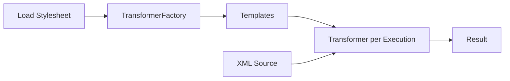
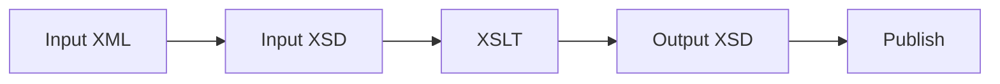
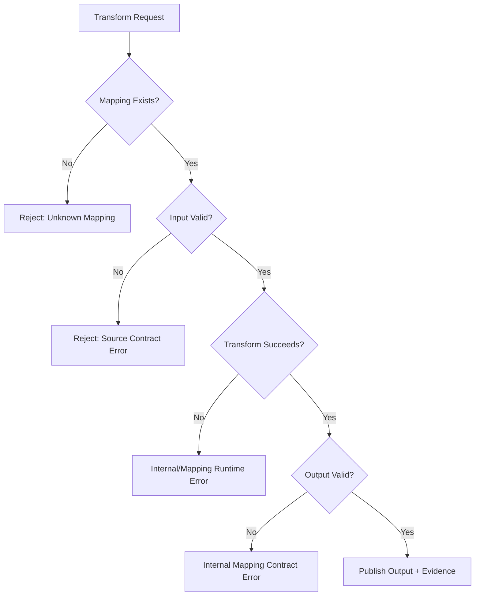
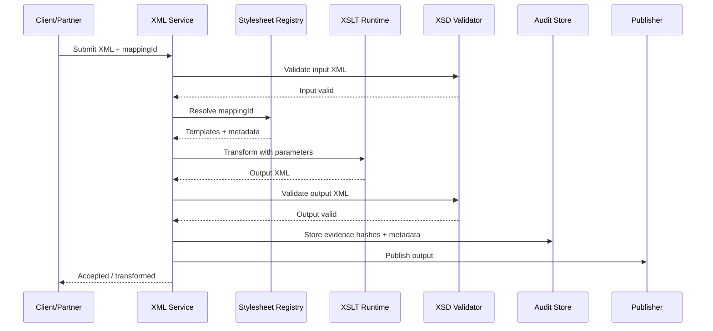

# Part 018 — XSLT Processor in Java: JAXP TransformerFactory

## Tujuan Part Ini

Part sebelumnya membahas cara berpikir XSLT. Part ini membahas cara menjalankannya dari Java secara production-grade.

Pertanyaan inti:

```text
Bagaimana membangun runtime XSLT di Java yang aman, cepat, deterministic, observable, dan mudah dioperasikan?
```

Target setelah part ini:

- memahami JAXP transformation API: `TransformerFactory`, `Templates`, `Transformer`, `Source`, dan `Result`;
- memahami provider discovery dan cara mengunci processor;
- tahu kapan memakai JDK default transformer dan kapan memakai Saxon;
- bisa mengompilasi stylesheet menjadi `Templates` dan meng-cache-nya dengan aman;
- tahu bahwa `Transformer` tidak boleh dipakai concurrent;
- bisa mengatur `URIResolver`, `ErrorListener`, output properties, parameter, dan secure processing;
- bisa membatasi external stylesheet/document access;
- bisa membangun service transformasi dengan audit evidence dan diagnostics yang layak production;
- bisa mengetes transformasi secara deterministic.

Mental model:

```text
TransformerFactory configures a transformation processor.
Templates is compiled stylesheet artifact.
Transformer is one execution context.
Source is input.
Result is output.
```

---

## 1. Java Transformation API Overview

JAXP transformation API berada di package `javax.xml.transform`.

Core objects:

| Object | Role | Production Rule |
|---|---|---|
| `TransformerFactory` | Membuat `Transformer` dan `Templates` | Konfigurasi processor, security, resolver, error listener |
| `Templates` | Compiled stylesheet | Cache dan reuse; aman untuk concurrent use menurut JAXP contract |
| `Transformer` | Runtime transformation execution | Buat baru per request/execution; jangan share concurrent |
| `Source` | Input XML atau stylesheet source | Set systemId/base URI jika ada include/import |
| `Result` | Output target | Stream/DOM/SAX/StAX sesuai kebutuhan |
| `URIResolver` | Resolve `xsl:include`, `xsl:import`, `document()` | Default deny atau allowlist |
| `ErrorListener` | Warnings/errors/fatal errors | Convert ke structured diagnostics |

Pipeline minimal:



---

## 2. Minimal Java Transformation

```java
import javax.xml.transform.*;
import javax.xml.transform.stream.StreamResult;
import javax.xml.transform.stream.StreamSource;
import java.io.*;

public final class SimpleXsltRunner {
    public static void main(String[] args) throws Exception {
        TransformerFactory factory = TransformerFactory.newInstance();

        Source stylesheet = new StreamSource(new File("order-to-canonical.xsl"));
        Transformer transformer = factory.newTransformer(stylesheet);

        Source input = new StreamSource(new File("order.xml"));
        Result output = new StreamResult(new File("canonical-order.xml"));

        transformer.transform(input, output);
    }
}
```

Ini cukup untuk demo. Untuk production, belum cukup karena:

- provider tidak dipin;
- secure processing belum dikonfigurasi;
- external access belum dibatasi;
- stylesheet dikompilasi setiap request;
- error listener belum structured;
- parameter belum di-audit;
- output belum divalidasi;
- timeout/resource policy belum jelas;
- file path langsung dipakai tanpa registry/governance.

---

## 3. JAXP Provider Discovery

`TransformerFactory.newInstance()` menggunakan JAXP lookup mechanism untuk menemukan implementation.

Runtime bisa berubah karena:

- JDK default provider;
- dependency Saxon di classpath/module-path;
- system property `javax.xml.transform.TransformerFactory`;
- service provider configuration;
- application server/container classloader.

Production rule:

```text
Do not let the XSLT processor be accidental.
Pin or verify the provider at startup.
```

Contoh diagnostic:

```java
TransformerFactory factory = TransformerFactory.newInstance();
String provider = factory.getClass().getName();
logger.info("xslt.transformerFactory.provider={}", provider);
```

Jika memakai JDK default XSLT 1.0 processor, pastikan stylesheet tidak memakai XSLT 2.0/3.0 features.

Jika butuh XSLT 2.0/3.0, gunakan processor seperti Saxon dan pin dependency/version.

---

## 4. Choosing JDK Transformer vs Saxon

| Need | JDK Default JAXP | Saxon HE/PE/EE |
|---|---:|---:|
| XSLT 1.0 basic transform | Good | Good |
| XPath 2.0/3.1 | No | Yes |
| XSLT 2.0/3.0 | No | Yes |
| XQuery | No | Yes via Saxon APIs |
| Advanced grouping/functions | Limited | Yes depending edition/features |
| Standards-modern XML stack | Limited | Strong |
| Zero extra dependency | Yes | No |
| Vendor-specific features | Less | Yes |

Decision heuristic:

```text
Use JDK transformer for simple, controlled XSLT 1.0 transforms.
Use Saxon when you need XSLT 2.0/3.0, XPath 2/3, XQuery, XDM, or advanced transformation features.
```

Important:

- JAXP API can run with different providers;
- not every provider supports every attribute/feature;
- always test with the exact provider used in production;
- document processor edition if using Saxon feature beyond HE.

---

## 5. Secure TransformerFactory Configuration

A secure baseline should start with:

```java
import javax.xml.XMLConstants;
import javax.xml.transform.TransformerFactory;

public final class XsltFactories {
    public static TransformerFactory secureTransformerFactory() {
        TransformerFactory factory = TransformerFactory.newInstance();

        try {
            factory.setFeature(XMLConstants.FEATURE_SECURE_PROCESSING, true);
        } catch (TransformerConfigurationException e) {
            throw new IllegalStateException("XSLT processor does not support secure processing", e);
        }

        // Default deny external resources.
        trySetAttribute(factory, XMLConstants.ACCESS_EXTERNAL_DTD, "");
        trySetAttribute(factory, XMLConstants.ACCESS_EXTERNAL_STYLESHEET, "");

        factory.setURIResolver(new DenyByDefaultUriResolver());
        factory.setErrorListener(new StructuredXsltErrorListener("factory"));

        return factory;
    }

    private static void trySetAttribute(TransformerFactory factory, String name, String value) {
        try {
            factory.setAttribute(name, value);
        } catch (IllegalArgumentException ex) {
            throw new IllegalStateException("XSLT processor does not support attribute: " + name, ex);
        }
    }
}
```

Security goals:

- disable uncontrolled external DTD access;
- disable uncontrolled stylesheet include/import access;
- disable uncontrolled `document()` access;
- control URI resolution via resolver;
- set secure processing feature;
- fail startup if processor does not support required controls.

Do not silently ignore unsupported security attributes.

---

## 6. URIResolver as Policy Boundary

XSLT can reference external resources through:

- `xsl:include`;
- `xsl:import`;
- `document()` function;
- associated stylesheets depending on usage.

`URIResolver` lets Java control those references.

Default deny resolver:

```java
import javax.xml.transform.Source;
import javax.xml.transform.TransformerException;
import javax.xml.transform.URIResolver;

public final class DenyByDefaultUriResolver implements URIResolver {
    @Override
    public Source resolve(String href, String base) throws TransformerException {
        throw new TransformerException(
            "External URI resolution is disabled. href=" + href + ", base=" + base
        );
    }
}
```

Allowlist resolver:

```java
import javax.xml.transform.Source;
import javax.xml.transform.TransformerException;
import javax.xml.transform.URIResolver;
import javax.xml.transform.stream.StreamSource;
import java.io.InputStream;
import java.util.Map;

public final class ClasspathStylesheetResolver implements URIResolver {
    private final Map<String, String> allowedResources;

    public ClasspathStylesheetResolver(Map<String, String> allowedResources) {
        this.allowedResources = Map.copyOf(allowedResources);
    }

    @Override
    public Source resolve(String href, String base) throws TransformerException {
        String resource = allowedResources.get(href);
        if (resource == null) {
            throw new TransformerException("Stylesheet URI is not allowlisted: " + href);
        }

        InputStream stream = Thread.currentThread()
            .getContextClassLoader()
            .getResourceAsStream(resource);

        if (stream == null) {
            throw new TransformerException("Allowlisted stylesheet not found: " + resource);
        }

        StreamSource source = new StreamSource(stream);
        source.setSystemId("classpath:/" + resource);
        return source;
    }
}
```

Production rules:

- resolver should not perform arbitrary network calls;
- resolver should be deterministic;
- resolver should have allowlisted logical names;
- resolver should set `systemId` for meaningful error locations;
- resolver should emit structured diagnostics for blocked references.

---

## 7. Compile Stylesheets to Templates

Do not compile stylesheet on every request.

Bad:

```java
Transformer transformer = factory.newTransformer(new StreamSource(stylesheetFile));
transformer.transform(input, output);
```

Better:

```java
Templates templates = factory.newTemplates(new StreamSource(stylesheetFile));
Transformer transformer = templates.newTransformer();
transformer.transform(input, output);
```

Why:

- stylesheet parse/compile is expensive;
- compile-time errors surface earlier;
- compiled representation can be cached;
- runtime execution becomes cheaper;
- `Templates` can be used to create separate `Transformer` instances per request.

JAXP specifies that a `Templates` object may be used concurrently across multiple threads. `Transformer` objects created for execution should be treated as single-execution/single-thread contexts.

---

## 8. Stylesheet Registry

A production service should not accept arbitrary stylesheet path from request.

Use a registry:

```java
public record StylesheetKey(
    String mappingId,
    String inputContract,
    String outputContract,
    String version
) {}

public record StylesheetDefinition(
    StylesheetKey key,
    String classpathResource,
    String sha256,
    boolean outputValidationRequired
) {}
```

Registry responsibilities:

- map logical transformation ID to physical stylesheet;
- pin version;
- expose input/output schema metadata;
- precompile at startup;
- fail fast on missing/invalid stylesheet;
- compute/check artifact hash;
- provide audit metadata.

Example:

```java
public final class StylesheetRegistry {
    private final Map<String, Templates> templatesByMappingId;
    private final Map<String, StylesheetDefinition> definitionsByMappingId;

    public StylesheetRegistry(
        Map<String, Templates> templatesByMappingId,
        Map<String, StylesheetDefinition> definitionsByMappingId
    ) {
        this.templatesByMappingId = Map.copyOf(templatesByMappingId);
        this.definitionsByMappingId = Map.copyOf(definitionsByMappingId);
    }

    public Templates templates(String mappingId) {
        Templates templates = templatesByMappingId.get(mappingId);
        if (templates == null) {
            throw new IllegalArgumentException("Unknown XSLT mapping: " + mappingId);
        }
        return templates;
    }

    public StylesheetDefinition definition(String mappingId) {
        StylesheetDefinition definition = definitionsByMappingId.get(mappingId);
        if (definition == null) {
            throw new IllegalArgumentException("Unknown XSLT mapping: " + mappingId);
        }
        return definition;
    }
}
```

---

## 9. Precompile at Startup

```java
public final class StylesheetCompiler {
    private final TransformerFactory factory;

    public StylesheetCompiler(TransformerFactory factory) {
        this.factory = factory;
    }

    public Templates compileClasspathResource(String resourcePath) {
        InputStream stream = Thread.currentThread()
            .getContextClassLoader()
            .getResourceAsStream(resourcePath);

        if (stream == null) {
            throw new IllegalArgumentException("Stylesheet not found: " + resourcePath);
        }

        try (InputStream closeable = stream) {
            StreamSource source = new StreamSource(closeable);
            source.setSystemId("classpath:/" + resourcePath);
            return factory.newTemplates(source);
        } catch (Exception e) {
            throw new IllegalStateException("Failed to compile stylesheet: " + resourcePath, e);
        }
    }
}
```

Startup failure is better than first production request failure.

---

## 10. Transformer Per Execution

Each execution should create its own `Transformer` from cached `Templates`.

```java
public byte[] transform(Templates templates, byte[] inputXml, Map<String, Object> params) {
    try {
        Transformer transformer = templates.newTransformer();
        transformer.setErrorListener(new StructuredXsltErrorListener("runtime"));

        for (Map.Entry<String, Object> entry : params.entrySet()) {
            transformer.setParameter(entry.getKey(), entry.getValue());
        }

        ByteArrayOutputStream out = new ByteArrayOutputStream();
        transformer.transform(
            new StreamSource(new ByteArrayInputStream(inputXml)),
            new StreamResult(out)
        );
        return out.toByteArray();
    } catch (TransformerException e) {
        throw new XsltExecutionException("XSLT transformation failed", e);
    }
}
```

Do not store a mutable `Transformer` in singleton and share it across threads.

---

## 11. Parameter Binding

XSLT:

```xml
<xsl:param name="sourceSystem"/>
<xsl:param name="correlationId"/>
```

Java:

```java
transformer.setParameter("sourceSystem", "PARTNER_A");
transformer.setParameter("correlationId", correlationId);
```

Parameter governance:

| Concern | Guideline |
|---|---|
| Type | Define expected Java/XSLT type per parameter |
| Required | Fail before transform if missing |
| Sensitive | Redact in logs/audit |
| Determinism | Include parameter values or hashes in replay metadata |
| Defaults | Prefer explicit Java-side defaults over hidden stylesheet defaults for business-critical params |

Parameter object:

```java
public record XsltParameter(
    String name,
    Object value,
    boolean sensitive
) {}
```

Audit redacted values:

```java
public String auditValue(XsltParameter parameter) {
    if (parameter.sensitive()) {
        return "***REDACTED***";
    }
    return String.valueOf(parameter.value());
}
```

---

## 12. Source and Result Types

JAXP supports multiple source/result forms.

| Source/Result | Use Case |
|---|---|
| `StreamSource` | File/input stream/string reader based XML |
| `DOMSource` | Already parsed DOM tree |
| `SAXSource` | Parser-driven source, useful for configured XMLReader |
| `StAXSource` | Integration with StAX reader |
| `StreamResult` | File/output stream/writer output |
| `DOMResult` | Build DOM result tree |
| `SAXResult` | Send result as SAX events |
| `StAXResult` | Write result to StAX writer |

Default choice:

```text
Use StreamSource + StreamResult unless you have a clear reason to use DOM/SAX/StAX boundary.
```

Avoid converting to DOM just to transform unless:

- XML is already DOM for earlier operations;
- random access mutation happened before transform;
- output is consumed as DOM immediately;
- payload size is bounded.

---

## 13. Base URI and `systemId`

Set `systemId` on sources.

Why:

- better diagnostics;
- relative include/import resolution;
- meaningful error location;
- reproducible audit.

Example:

```java
StreamSource stylesheet = new StreamSource(stream);
stylesheet.setSystemId("classpath:/xslt/partner-a/order-v1-to-canonical-v2.xsl");
```

For request payload:

```java
StreamSource input = new StreamSource(new ByteArrayInputStream(inputXml));
input.setSystemId("payload:" + correlationId);
```

Do not set `systemId` to a real internal file path if it may leak in error responses.

---

## 14. ErrorListener

JAXP uses `ErrorListener` for transformation warnings/errors.

```java
import javax.xml.transform.ErrorListener;
import javax.xml.transform.TransformerException;

public final class StructuredXsltErrorListener implements ErrorListener {
    private final String phase;

    public StructuredXsltErrorListener(String phase) {
        this.phase = phase;
    }

    @Override
    public void warning(TransformerException exception) throws TransformerException {
        log("warning", exception);
    }

    @Override
    public void error(TransformerException exception) throws TransformerException {
        log("error", exception);
        throw exception;
    }

    @Override
    public void fatalError(TransformerException exception) throws TransformerException {
        log("fatal", exception);
        throw exception;
    }

    private void log(String severity, TransformerException exception) {
        SourceLocatorView locator = SourceLocatorView.from(exception);
        System.err.printf(
            "xslt.%s severity=%s message=%s location=%s%n",
            phase,
            severity,
            exception.getMessageAndLocation(),
            locator
        );
    }
}
```

Locator helper:

```java
import javax.xml.transform.SourceLocator;
import javax.xml.transform.TransformerException;

public record SourceLocatorView(String systemId, int line, int column) {
    static SourceLocatorView from(TransformerException e) {
        SourceLocator locator = e.getLocator();
        if (locator == null) {
            return new SourceLocatorView(null, -1, -1);
        }
        return new SourceLocatorView(
            locator.getSystemId(),
            locator.getLineNumber(),
            locator.getColumnNumber()
        );
    }
}
```

Production behavior:

- warnings should be visible;
- non-fatal errors should usually fail the transform unless explicitly tolerated;
- fatal errors must fail;
- messages returned to external callers should be sanitized;
- internal logs can contain richer locator details but must avoid leaking sensitive payload.

---

## 15. Exception Taxonomy

Important JAXP exceptions:

| Exception | Meaning |
|---|---|
| `TransformerFactoryConfigurationError` | Factory/provider configuration problem |
| `TransformerConfigurationException` | Cannot compile/create transformer, often stylesheet syntax/config error |
| `TransformerException` | Runtime transformation failure |

Operational classification:

```text
startup/configuration error -> deployment failure
stylesheet compile error -> release artifact failure
runtime transform error -> bad input, bad parameter, blocked resolver, processor limit, or mapping bug
```

In service design, expose stable error codes:

```java
public enum XsltErrorCode {
    XSLT_PROVIDER_UNAVAILABLE,
    XSLT_SECURITY_CONFIGURATION_UNSUPPORTED,
    XSLT_STYLESHEET_NOT_FOUND,
    XSLT_STYLESHEET_COMPILE_FAILED,
    XSLT_RUNTIME_FAILED,
    XSLT_EXTERNAL_RESOURCE_BLOCKED,
    XSLT_OUTPUT_VALIDATION_FAILED
}
```

---

## 16. Production Transformation Service

```java
public final class XsltTransformationService {
    private final StylesheetRegistry registry;

    public XsltTransformationService(StylesheetRegistry registry) {
        this.registry = registry;
    }

    public TransformationResult transform(TransformationRequest request) {
        StylesheetDefinition definition = registry.definition(request.mappingId());
        Templates templates = registry.templates(request.mappingId());

        long startedNanos = System.nanoTime();

        try {
            Transformer transformer = templates.newTransformer();
            transformer.setErrorListener(new StructuredXsltErrorListener("runtime"));

            for (XsltParameter parameter : request.parameters()) {
                transformer.setParameter(parameter.name(), parameter.value());
            }

            ByteArrayOutputStream output = new ByteArrayOutputStream(request.expectedOutputSizeHint());

            StreamSource source = new StreamSource(new ByteArrayInputStream(request.inputXml()));
            source.setSystemId("payload:" + request.correlationId());

            transformer.transform(source, new StreamResult(output));

            long durationNanos = System.nanoTime() - startedNanos;

            return new TransformationResult(
                request.mappingId(),
                definition.key().version(),
                output.toByteArray(),
                durationNanos
            );
        } catch (TransformerException e) {
            throw new XsltExecutionException(
                "Transformation failed for mappingId=" + request.mappingId(),
                e
            );
        }
    }
}
```

Request/response:

```java
public record TransformationRequest(
    String mappingId,
    String correlationId,
    byte[] inputXml,
    java.util.List<XsltParameter> parameters,
    int expectedOutputSizeHint
) {}

public record TransformationResult(
    String mappingId,
    String stylesheetVersion,
    byte[] output,
    long durationNanos
) {}
```

---

## 17. Output Validation

For XML-to-XML mapping, validate output.



If output validation fails, it usually means:

- mapping bug;
- unexpected input variant not constrained by input schema;
- wrong parameter;
- output schema changed without mapping update;
- processor/version difference.

Output validation should be classified differently from input validation.

```text
Input validation failure = caller/source contract problem.
Output validation failure = internal transformation/configuration problem.
```

---

## 18. Observability

Metrics:

- `xslt_transform_total{mappingId,version,status}`;
- `xslt_transform_duration_ms{mappingId,version}`;
- `xslt_transform_input_bytes{mappingId}`;
- `xslt_transform_output_bytes{mappingId}`;
- `xslt_transform_compile_total{mappingId,status}`;
- `xslt_external_resource_block_total{mappingId,href}`;
- `xslt_output_validation_failure_total{mappingId}`.

Structured log fields:

```json
{
  "event": "xslt.transform.completed",
  "correlationId": "c-123",
  "mappingId": "partner-a-order-v1-to-canonical-v2",
  "stylesheetVersion": "2.3.1",
  "processor": "com.sun.org.apache.xalan.internal.xsltc.trax.TransformerFactoryImpl",
  "inputBytes": 18421,
  "outputBytes": 9034,
  "durationMs": 17,
  "status": "SUCCESS"
}
```

Do not log full XML payload by default. Store payload in controlled evidence storage if needed.

---

## 19. Audit Evidence

For regulated systems, record transformation evidence:

```java
public record TransformationEvidence(
    String correlationId,
    String mappingId,
    String stylesheetVersion,
    String stylesheetSha256,
    String inputSha256,
    String outputSha256,
    java.time.Instant transformedAt,
    String processorClass,
    String processorVersion,
    Map<String, String> parameterAuditValues
) {}
```

This supports replay:

```text
same input bytes + same stylesheet bytes + same parameters + same processor family -> expected same output
```

Caveat:

- current date/time functions break determinism if not parameterized;
- external document lookup breaks determinism if not pinned;
- processor upgrade can alter serialization details;
- floating/decimal formatting can differ if not specified.

---

## 20. Caching Strategy

Cache `Templates`, not `Transformer`.

```java
public final class TemplatesCache {
    private final java.util.concurrent.ConcurrentHashMap<String, Templates> cache = new java.util.concurrent.ConcurrentHashMap<>();
    private final StylesheetCompiler compiler;

    public TemplatesCache(StylesheetCompiler compiler) {
        this.compiler = compiler;
    }

    public Templates get(String mappingId, String resource) {
        return cache.computeIfAbsent(mappingId, ignored -> compiler.compileClasspathResource(resource));
    }
}
```

For dynamic stylesheet update, prefer controlled deployment over hot-swapping.

If hot reload is mandatory:

- use immutable registry snapshots;
- version every mapping;
- switch atomically;
- keep previous version for in-flight/replay;
- audit exact version used;
- never mutate cached `Templates`.

---

## 21. Handling Large Inputs

XSLT processors often build internal tree representation. Even if input is a stream, transformation may not be truly streaming unless processor/version/style supports it.

Strategies:

- enforce input size limit;
- use StAX/SAX pre-filter for huge files;
- split large batch XML into smaller document units;
- transform per unit;
- avoid DOMSource for large payloads;
- avoid unbounded `copy-of` on large subtrees;
- benchmark with realistic files;
- track memory and GC under load.

Architecture for huge batch:


---

## 22. Timeouts and Resource Control

JAXP `Transformer` does not provide a universal timeout API.

Options:

- run transformation in bounded executor with timeout;
- limit input size before transformation;
- avoid untrusted stylesheets;
- restrict external resources;
- use processor-specific limits where available;
- design stylesheets to avoid pathological recursion;
- monitor latency percentiles.

Executor pattern:

```java
Future<byte[]> future = executor.submit(() -> transform(templates, inputXml, params));
try {
    return future.get(2, TimeUnit.SECONDS);
} catch (TimeoutException e) {
    future.cancel(true);
    throw new XsltExecutionException("XSLT transformation timed out", e);
}
```

Caveat:

```text
Thread interruption may not immediately stop all processor work.
Timeout is not a substitute for input limits and stylesheet governance.
```

---

## 23. Output Serialization Control

JAXP output properties:

```java
Transformer transformer = templates.newTransformer();
transformer.setOutputProperty(OutputKeys.METHOD, "xml");
transformer.setOutputProperty(OutputKeys.ENCODING, "UTF-8");
transformer.setOutputProperty(OutputKeys.INDENT, "yes");
```

Prefer declaring stable output in stylesheet:

```xml
<xsl:output method="xml" encoding="UTF-8" indent="yes"/>
```

Use Java override only when it is runtime policy.

Golden-file caution:

- indentation may vary by processor;
- attribute order is not semantically meaningful;
- namespace prefix choice may vary;
- XML declaration may vary;
- line endings may vary.

For semantic comparison, use XML-aware comparison.

---

## 24. Testing JAXP XSLT Runtime

Test categories:

### 24.1 Compile Test

Every stylesheet compiles at startup/test.

```java
@Test
void allStylesheetsCompile() {
    registryDefinitions.forEach(definition ->
        assertDoesNotThrow(() -> compiler.compileClasspathResource(definition.classpathResource()))
    );
}
```

### 24.2 Golden Output Test

```java
@Test
void mapsPartnerOrderToCanonicalOrder() {
    byte[] input = resourceBytes("input.xml");
    byte[] expected = resourceBytes("expected.xml");

    byte[] actual = service.transform(request("partner-a-order", input)).output();

    assertXmlEquivalent(expected, actual);
}
```

### 24.3 Namespace Prefix Variation Test

Same namespace URI, different prefix.

```xml
<x:OrderDocument xmlns:x="urn:partner:a:order:v1">
  ...
</x:OrderDocument>
```

This should still transform if stylesheet uses namespace URI correctly.

### 24.4 External Resource Block Test

Stylesheet fixture attempts:

```xml
<xsl:copy-of select="document('http://example.com/secret.xml')"/>
```

Expected: blocked.

### 24.5 Output Validation Test

After transform, validate against output XSD.

### 24.6 Processor Identity Test

```java
assertEquals(
    "net.sf.saxon.TransformerFactoryImpl",
    factory.getClass().getName()
);
```

Or if using JDK default, assert allowed provider list.

---

## 25. Saxon Through JAXP vs s9api

Saxon can be used through JAXP for many transformations:

```java
TransformerFactory factory = TransformerFactory.newInstance(
    "net.sf.saxon.TransformerFactoryImpl",
    Thread.currentThread().getContextClassLoader()
);
```

But for advanced Saxon features, s9api is often clearer:

```java
Processor processor = new Processor(false);
XsltCompiler compiler = processor.newXsltCompiler();
XsltExecutable executable = compiler.compile(new StreamSource(stylesheetFile));
Xslt30Transformer transformer = executable.load30();
```

Use JAXP when:

- you want standard Java transformation API;
- XSLT 1.0/simple provider swap is enough;
- existing framework expects `TransformerFactory`.

Use Saxon s9api when:

- you need XSLT 2/3 constructs explicitly;
- you use XDM values, maps, arrays, or advanced parameters;
- you need Saxon-specific controls/features;
- you want consistent APIs across XPath/XQuery/XSLT.

This part stays on JAXP. The next part will discuss XSLT 2/3 and Saxon more deeply.

---

## 26. Service-Level Failure Model



Map errors to ownership:

| Failure | Owner |
|---|---|
| Unknown mapping | Platform/configuration |
| Input invalid | Source system/partner |
| Stylesheet compile fails | Development/release process |
| External URI blocked | Security policy or bad stylesheet |
| Runtime transform fails | Mapping bug or unexpected data shape |
| Output invalid | Internal mapping/schema incompatibility |
| Publish fails | Downstream/transport |

---

## 27. Avoiding Dynamic Stylesheet Injection

Bad API:

```http
POST /transform
Content-Type: application/json

{
  "stylesheet": "<xsl:stylesheet>...</xsl:stylesheet>",
  "xml": "<payload/>"
}
```

This allows:

- unreviewed transformation logic;
- external resource attempts;
- resource exhaustion;
- data exfiltration via output;
- audit bypass.

Better API:

```http
POST /transform/partner-a-order-v1-to-canonical-v2
Content-Type: application/xml

<order>...</order>
```

Server chooses approved mapping by ID and version.

---

## 28. Threading Model

Correct:

```text
Singleton TransformerFactory configured at startup
Singleton cache of Templates
New Transformer per request
```

Question: can `TransformerFactory` be shared?

Practical guidance:

- configure factory at startup;
- do not mutate factory after publishing it to worker threads;
- compile templates during startup or controlled cache load;
- use `Templates` as reusable compiled artifact;
- create `Transformer` per request.

Avoid:

```java
static Transformer sharedTransformer;
```

Because runtime parameters, output properties, resolver/listener state, and execution context are mutable.

---

## 29. Deployment Checklist

For each mapping deployment:

- [ ] Stylesheet is in version control.
- [ ] Stylesheet has owner and mapping metadata.
- [ ] Input XSD version documented.
- [ ] Output XSD version documented.
- [ ] Processor/provider pinned or verified.
- [ ] Stylesheet compiles in CI.
- [ ] Golden tests pass.
- [ ] Prefix variation tests pass.
- [ ] External resource block test passes.
- [ ] Output validation passes.
- [ ] Transformation evidence schema updated.
- [ ] Metrics/log fields include mapping ID and version.
- [ ] Rollback version available.
- [ ] Runtime does not accept arbitrary stylesheet content.

---

## 30. Kaufman Practice Drill

Practice goal:

```text
Build a Java XSLT runtime that compiles three stylesheets at startup, transforms XML by mapping ID, blocks external URI access, records diagnostics, and validates output.
```

Steps:

1. Create three XSLT files under `src/main/resources/xslt`.
2. Create a `StylesheetDefinition` registry.
3. Configure secure `TransformerFactory`.
4. Add deny-by-default `URIResolver`.
5. Compile all stylesheets into `Templates` at startup.
6. Write transformation service with `Transformer` per request.
7. Bind parameters explicitly.
8. Record mapping ID, version, input hash, output hash, and duration.
9. Add output XSD validation.
10. Add tests for namespace prefix variation and blocked `document()`.

Self-correction questions:

- Does the service fail startup if stylesheet compile fails?
- Does the service still work under concurrent load?
- Is `Transformer` shared anywhere?
- Are external resources blocked?
- Is provider identity logged and tested?
- Can you replay an output from stored evidence?
- Can support tell whether failure is input validation, stylesheet runtime, or output validation?

---

## 31. Production Reference Flow



---

## 32. Ringkasan

Production-grade Java XSLT runtime bukan hanya `factory.newTransformer().transform()`.

Fondasi yang harus dipegang:

- `TransformerFactory` adalah processor factory yang harus dikonfigurasi dan diverifikasi;
- `Templates` adalah compiled stylesheet yang harus di-cache;
- `Transformer` adalah execution object yang dibuat per request;
- `URIResolver` adalah security/governance boundary;
- `ErrorListener` harus mengubah warning/error menjadi structured diagnostics;
- external resource access harus default deny;
- output XML harus divalidasi jika merupakan contract artifact;
- provider/version harus jelas;
- audit evidence harus cukup untuk replay dan incident analysis.

Part berikutnya akan naik level ke **XSLT 2.0/3.0 with Saxon**: grouping, functions, packages, maps/arrays, result documents, XDM, XSLT 3 processing model, dan migrasi dari JAXP/XSLT 1.0 ke processor modern.

---

## Referensi

- Oracle Java API — `TransformerFactory`: https://docs.oracle.com/en/java/javase/25/docs/api/java.xml/javax/xml/transform/TransformerFactory.html
- Oracle Java API — `javax.xml.transform`: https://docs.oracle.com/en/java/javase/25/docs/api/java.xml/javax/xml/transform/package-summary.html
- Oracle Java API — `XMLConstants`: https://docs.oracle.com/en/java/javase/25/docs/api/java.xml/javax/xml/XMLConstants.html
- Saxonica Documentation — Using s9api for transformations: https://www.saxonica.com/html/documentation12/using-xsl/embedding/s9api-transformation.html
- Saxonica Javadoc — `XsltExecutable`: https://www.saxonica.com/html/documentation12/javadoc/net/sf/saxon/s9api/XsltExecutable.html
