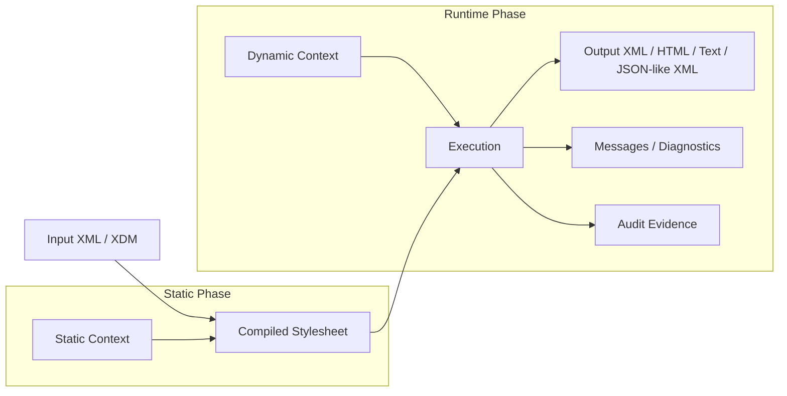
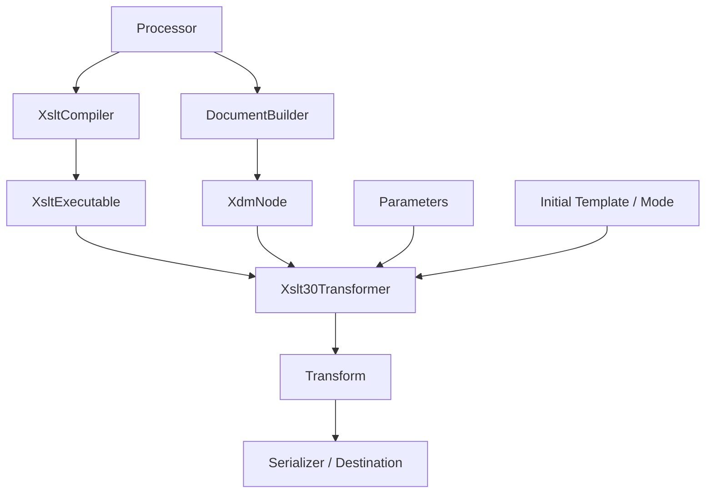
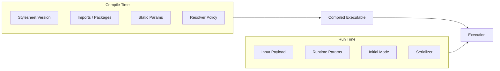
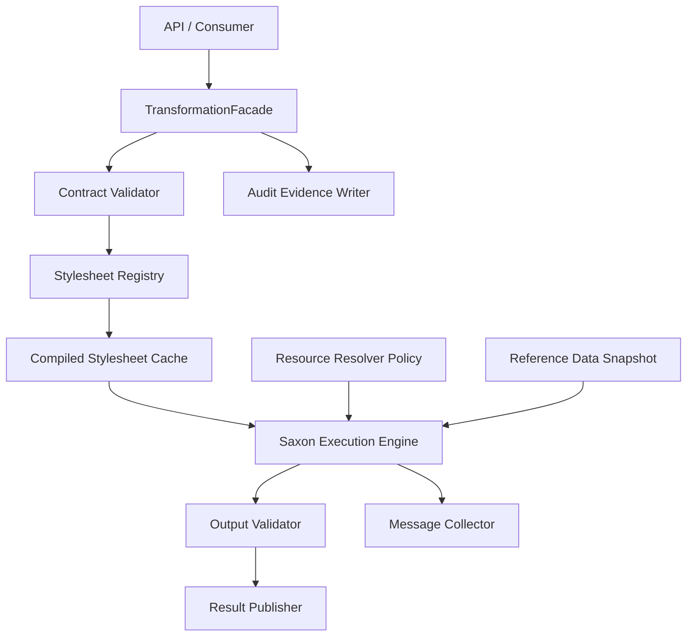
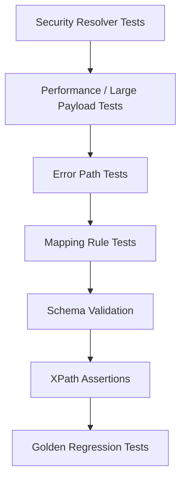

# Part 019 — XSLT 2.0/3.0 with Saxon

> Goal: mampu memakai XSLT 2.0/3.0 secara production-grade di Java, bukan hanya menjalankan stylesheet. Setelah part ini, kita ingin bisa memilih kapan JDK XSLT 1.0 cukup, kapan perlu Saxon, bagaimana mengatur lifecycle processor, bagaimana menguji transformasi, dan bagaimana menghindari security/performance failure mode.

Part 018 sudah membahas JAXP `TransformerFactory`. Itu adalah interface penting di Java, tetapi baseline JDK umumnya berhenti pada XSLT 1.0 semantics. Banyak sistem enterprise modern yang masih XML-heavy membutuhkan fitur yang jauh lebih kuat: grouping, typing, sequence processing, function, package modularity, error handling, streaming-oriented design, dan XPath 3.1 data model. Di titik itulah Saxon sering menjadi pilihan praktis.

XSLT dengan Saxon harus dipahami sebagai **transformation runtime**, bukan sekadar library utility.



Mental model utama:

- **compile stylesheet once** jika stylesheet stabil;
- **execute many times** dengan context berbeda;
- **pisahkan static context dari dynamic context**;
- **jangan biarkan stylesheet production melakukan I/O liar**;
- **validasi input dan output ketika transformasi adalah contract boundary**;
- **perlakukan transformasi sebagai fungsi deterministik yang bisa diaudit**.

---

## 1. Kaufman Deconstruction: Skill yang Harus Dikuasai

Agar skill ini tidak menjadi “hafal syntax XSLT”, pecah menjadi sub-skill berikut.

| Sub-skill | Output Praktis | Self-Correction Signal |
|---|---|---|
| Memilih XSLT version | Bisa memutuskan XSLT 1.0 vs 2.0/3.0 | Tidak memakai XSLT 3.0 hanya karena lebih baru |
| Memahami XDM | Bisa berpikir dalam sequence, item, atomic value, node, map, array | Tidak menganggap semua output XPath sebagai string |
| Saxon s9api lifecycle | Bisa compile, cache, load, execute, serialize | Tidak membuat processor/compiler setiap request |
| Parameterization | Bisa inject variable/context secara eksplisit | Tidak concatenate string ke stylesheet/query |
| Modular stylesheet | Bisa memecah transformasi menjadi function/mode/package | Tidak membuat stylesheet 3000 baris tanpa boundary |
| Error handling | Bisa menangkap recoverable/non-recoverable transform failure | Tidak menelan error menjadi output kosong |
| Secure resource access | Bisa mengontrol `document()`, URI resolution, extension functions | Tidak membiarkan stylesheet membaca filesystem/network |
| Testing transformasi | Bisa golden test, XPath assertion, schema validation | Test tidak bergantung pada whitespace/prefix accidental |
| Performance engineering | Bisa mengurangi compile overhead, memory pressure, repeated lookup | Tidak benchmark tanpa warm-up dan payload realistik |

Latihan 20 jam untuk part ini tidak mengejar semua fitur Saxon. Fokusnya: mampu membuat **transformation module** yang aman, cepat, testable, dan bisa berubah versi.

---

## 2. Kenapa XSLT 2.0/3.0?

XSLT 1.0 cukup untuk transformasi sederhana:

- rename element;
- copy dengan perubahan kecil;
- generate HTML sederhana;
- mapping field langsung;
- identity transform override.

Namun begitu transformasi mulai memiliki grouping, typed conversion, conditional routing, multi-output, modular function, robust error handling, atau large-document strategy, XSLT 1.0 sering memaksa workaround yang rapuh.

### 2.1 Capability Shift

| Area | XSLT 1.0 Style | XSLT 2.0/3.0 Style |
|---|---|---|
| Data model | Node-set dan string conversion sering implisit | XDM sequence dan typed value lebih eksplisit |
| Grouping | Muenchian grouping dengan key | `xsl:for-each-group` |
| Functions | Extension atau named template workaround | `xsl:function` |
| Regex | Terbatas atau extension | `matches`, `replace`, `analyze-string` |
| Error handling | Biasanya fail hard atau message | `xsl:try` / `xsl:catch` di XSLT 3.0 |
| Iteration | Recursive template | `xsl:iterate` di XSLT 3.0 |
| Modularity | `include` / `import` | Package model di XSLT 3.0 |
| Data structures | XML temporary trees | Maps/arrays via XPath 3.1 in XSLT 3.0 processors |
| Streaming concept | Implementation-dependent | XSLT 3.0 mendefinisikan streaming feature model |

### 2.2 Contoh: Grouping Order Lines

Masalah: partner mengirim order line flat, kita perlu group by SKU.

XSLT 1.0 bisa, tapi pattern-nya sulit dibaca. XSLT 2.0 membuat intent eksplisit.

```xml
<xsl:for-each-group select="/order/line" group-by="sku">
  <item sku="{current-grouping-key()}">
    <quantity>
      <xsl:value-of select="sum(current-group()/quantity/xs:decimal(.))"/>
    </quantity>
  </item>
</xsl:for-each-group>
```

Kelebihan production-nya bukan hanya lebih pendek. Kelebihannya adalah:

- grouping key terlihat jelas;
- aggregation terlihat jelas;
- lebih mudah diuji;
- lebih mudah direview oleh engineer lain;
- lebih mudah dikaitkan ke business mapping rule.

---

## 3. Saxon sebagai Advanced XML Runtime di Java

Saxon biasanya dipakai ketika Java application membutuhkan implementasi XPath/XQuery/XSLT modern.

Ada dua pendekatan integrasi umum:

1. **JAXP compatibility mode** — masih memakai `TransformerFactory`, tetapi provider-nya Saxon.
2. **Saxon s9api** — memakai API native Saxon yang lebih ekspresif untuk XPath/XQuery/XSLT modern.

Untuk production-grade usage, s9api sering lebih nyaman karena memberi objek yang lebih sesuai dengan mental model Saxon: `Processor`, compiler, executable, transformer, serializer, XDM value.



### 3.1 Object Lifecycle

| Object | Role | Production Rule |
|---|---|---|
| `Processor` | Global Saxon configuration holder | Buat sedikit, biasanya singleton per configuration |
| `XsltCompiler` | Compile stylesheet dengan static context | Jangan compile per request jika stylesheet stabil |
| `XsltExecutable` | Compiled stylesheet | Cache berdasarkan stylesheet identity/version |
| `Xslt30Transformer` | Loaded executable dengan dynamic context | Buat per execution atau pastikan lifecycle aman |
| `Serializer` | Output serialization target | Buat per output/request |
| `XdmNode` / `XdmValue` | XDM input/value | Jangan diperlakukan seperti DOM mutable tree |

Rule penting: **compiled artifact boleh panjang umur; execution context harus pendek umur**.

---

## 4. Minimal s9api Transformation Skeleton

Contoh berikut adalah skeleton, bukan copy-paste final. Tujuannya menunjukkan boundary yang benar.

```java
import net.sf.saxon.s9api.*;

import javax.xml.transform.stream.StreamSource;
import java.io.StringReader;
import java.io.StringWriter;

public final class SaxonTransformService {
    private final Processor processor;
    private final XsltExecutable executable;

    public SaxonTransformService(String stylesheetXml) throws SaxonApiException {
        this.processor = new Processor(false); // false = do not request licensed features
        XsltCompiler compiler = processor.newXsltCompiler();

        // Static context configuration should be explicit.
        // Examples: schema awareness, URI resolver/resource policy, base URI, error listener.

        this.executable = compiler.compile(
            new StreamSource(new StringReader(stylesheetXml))
        );
    }

    public String transform(String inputXml, String correlationId) throws SaxonApiException {
        Xslt30Transformer transformer = executable.load30();

        transformer.setStylesheetParameters(java.util.Map.of(
            new QName("correlationId"), new XdmAtomicValue(correlationId)
        ));

        Serializer serializer = processor.newSerializer();
        StringWriter output = new StringWriter();
        serializer.setOutputWriter(output);
        serializer.setOutputProperty(Serializer.Property.METHOD, "xml");
        serializer.setOutputProperty(Serializer.Property.INDENT, "no");

        transformer.transform(
            new StreamSource(new StringReader(inputXml)),
            serializer
        );

        return output.toString();
    }
}
```

Production notes:

- jangan menaruh XML sebagai `String` jika payload besar;
- gunakan stream/file/channel sesuai workload;
- compile stylesheet saat deployment startup atau saat registry refresh;
- lakukan health check dengan sample transformasi;
- jangan membangun stylesheet dari input user;
- jangan expose Saxon exception mentah ke external caller.

---

## 5. Static Context vs Dynamic Context

Banyak bug XSLT production muncul karena static dan dynamic context dicampur.

### 5.1 Static Context

Static context adalah hal yang diketahui saat compile stylesheet:

- stylesheet source;
- imported/included modules;
- namespace declarations;
- static variables/parameters;
- schema awareness jika dipakai;
- base URI untuk resolving relative reference;
- processor edition/configuration;
- enabled/disabled extension function;
- package dependency.

Perubahan static context biasanya berarti compiled stylesheet harus dibuat ulang.

### 5.2 Dynamic Context

Dynamic context adalah hal yang diberikan saat execution:

- input XML;
- initial mode/template;
- runtime parameters;
- current date/time jika tidak dikunci;
- message listener;
- output destination;
- request/correlation metadata.

Dynamic context tidak boleh mempengaruhi compiled artifact secara diam-diam.



### 5.3 Checklist

Sebelum deploy stylesheet baru, tanyakan:

- apakah static dependency berubah?
- apakah imported stylesheet berubah?
- apakah output schema masih sama?
- apakah parameter wajib berubah?
- apakah package version berubah?
- apakah resolver policy masih menutup network/file access yang tidak diizinkan?
- apakah compiled cache key akan berubah?

---

## 6. XDM: Data Model yang Harus Dipahami

Saxon modern berpikir dalam XDM, bukan DOM.

XDM item dapat berupa:

- node;
- atomic value;
- function item;
- map;
- array;
- sequence dari item.

Konsekuensi:

- `select="item"` tidak selalu satu node;
- `value-of` melakukan atomization dan string joining;
- function bisa menerima sequence;
- absence bukan sama dengan empty string;
- `()` adalah empty sequence, bukan `null`;
- map/array berguna untuk lookup/mapping, tapi harus dijaga agar tidak menjadi “mini application” di stylesheet.

### 6.1 Empty Sequence vs Empty String vs Missing Node

```xml
<customer>
  <name></name>
</customer>
```

XPath examples:

| Expression | Meaning |
|---|---|
| `customer/name` | node exists |
| `customer/email` | empty sequence jika tidak ada |
| `string(customer/name)` | empty string |
| `exists(customer/name)` | true |
| `exists(customer/email)` | false |
| `normalize-space(customer/name)` | empty string |

Mapping rule harus membedakan:

- field tidak dikirim;
- field dikirim kosong;
- field dikirim `xsi:nil="true"`;
- field dikirim whitespace;
- field dikirim default value hasil schema.

---

## 7. XSLT 2.0 Features yang Paling Bernilai

### 7.1 `xsl:for-each-group`

Gunakan untuk grouping, aggregation, rollup, dan duplicate detection.

```xml
<xsl:for-each-group select="/invoice/line" group-by="normalize-space(productCode)">
  <product code="{current-grouping-key()}">
    <lineCount><xsl:value-of select="count(current-group())"/></lineCount>
    <total><xsl:value-of select="sum(current-group()/amount/xs:decimal(.))"/></total>
  </product>
</xsl:for-each-group>
```

Production pattern:

- group key harus normalized;
- type conversion harus eksplisit;
- missing key harus diarahkan ke error/exception flow;
- output aggregate harus divalidasi.

### 7.2 `xsl:function`

Gunakan untuk logic murni yang reuseable.

```xml
<xsl:function name="m:normalize-country" as="xs:string">
  <xsl:param name="raw" as="xs:string?"/>
  <xsl:sequence select="upper-case(normalize-space($raw))"/>
</xsl:function>
```

Batasan:

- function harus pure;
- jangan melakukan I/O;
- jangan menyembunyikan business rule besar di function kecil tanpa test;
- tipe parameter dan return wajib eksplisit untuk stylesheet penting.

### 7.3 Regex Processing

```xml
<xsl:analyze-string select="$customerRef" regex="^([A-Z]{3})-(\d{8})$">
  <xsl:matching-substring>
    <prefix><xsl:value-of select="regex-group(1)"/></prefix>
    <number><xsl:value-of select="regex-group(2)"/></number>
  </xsl:matching-substring>
  <xsl:non-matching-substring>
    <invalidCustomerRef><xsl:value-of select="$customerRef"/></invalidCustomerRef>
  </xsl:non-matching-substring>
</xsl:analyze-string>
```

Regex di stylesheet harus:

- memiliki test case positif dan negatif;
- tidak terlalu permisif;
- tidak menjadi substitute untuk parser domain yang lebih cocok;
- tidak menimbulkan catastrophic backtracking pada input besar.

---

## 8. XSLT 3.0 Features yang Paling Bernilai

### 8.1 `xsl:try` / `xsl:catch`

Useful untuk local error handling, terutama ketika transformasi punya fallback yang benar.

```xml
<xsl:try>
  <amount>
    <xsl:value-of select="format-number(xs:decimal($rawAmount), '0.00')"/>
  </amount>
  <xsl:catch>
    <mappingError code="INVALID_AMOUNT">
      <raw><xsl:value-of select="$rawAmount"/></raw>
    </mappingError>
  </xsl:catch>
</xsl:try>
```

Gunakan dengan hati-hati:

- jangan catch semua error lalu output tampak sukses;
- error semantic besar sebaiknya gagal transformasi;
- fallback harus jelas dan diuji;
- audit trail harus mencatat catch path.

### 8.2 `xsl:iterate`

Berguna untuk iterative processing dengan state eksplisit.

```xml
<xsl:iterate select="/events/event">
  <xsl:param name="runningTotal" select="0" as="xs:decimal"/>

  <xsl:on-completion>
    <total><xsl:value-of select="$runningTotal"/></total>
  </xsl:on-completion>

  <xsl:next-iteration>
    <xsl:with-param name="runningTotal" select="$runningTotal + xs:decimal(amount)"/>
  </xsl:next-iteration>
</xsl:iterate>
```

Ini lebih maintainable dibanding recursive template ketika state-nya memang linear.

### 8.3 Maps untuk Lookup

```xml
<xsl:variable name="countryMap" as="map(xs:string, xs:string)" select="map {
  'ID': 'Indonesia',
  'SG': 'Singapore',
  'MY': 'Malaysia'
}"/>

<countryName>
  <xsl:value-of select="map:get($countryMap, upper-case(countryCode))"/>
</countryName>
```

Gunakan map untuk lookup kecil/stabil. Untuk lookup besar atau berubah cepat:

- inject sebagai external document;
- precompile sebagai XDM map di Java;
- kelola sebagai versioned reference data;
- hindari call database langsung dari stylesheet.

### 8.4 Packages

XSLT 3.0 package membantu modularisasi transformation library.

Pattern:

```text
transform-core/
  normalize.xsl
  date-functions.xsl
  money-functions.xsl

partner-a/
  inbound-order-v3.xsl
  outbound-status-v2.xsl

partner-b/
  inbound-order-v1.xsl
```

Package/module boundary yang sehat:

- core function tidak tahu partner;
- partner adapter tahu source/target contract;
- output schema validation tetap di luar stylesheet atau di final stage;
- package version dicatat di audit metadata;
- breaking change harus memicu major version.

### 8.5 Streaming Concepts

XSLT 3.0 punya model streaming, tetapi production engineer harus hati-hati:

- tidak semua stylesheet streamable;
- tidak semua processor edition mendukung fitur streaming penuh;
- operasi seperti arbitrary ancestor/descendant navigation bisa memecahkan streamability;
- streaming mengubah cara berpikir: satu pass, no random access, limited lookahead.

Gunakan streaming ketika:

- payload sangat besar;
- transformasi mostly linear;
- latency/memory lebih penting daripada complex random access;
- output bisa dihasilkan incremental.

Jangan gunakan streaming ketika:

- transformasi perlu global grouping kompleks;
- perlu sort seluruh dokumen;
- perlu cross-reference bebas;
- payload cukup kecil dan DOM/XDM tree lebih sederhana.

---

## 9. Java Architecture: Versioned Transformation Engine

Di production, jangan biarkan controller/service langsung memanggil Saxon. Buat layer eksplisit.



### 9.1 Interface Design

```java
public interface XmlTransformationEngine {
    TransformationResult transform(TransformationRequest request)
        throws TransformationException;
}

public record TransformationRequest(
    String transformationId,
    String transformationVersion,
    javax.xml.transform.Source input,
    java.util.Map<String, Object> parameters,
    String correlationId
) {}

public record TransformationResult(
    byte[] output,
    String outputMediaType,
    TransformationEvidence evidence
) {}

public record TransformationEvidence(
    String transformationId,
    String transformationVersion,
    String stylesheetChecksum,
    String inputSchemaVersion,
    String outputSchemaVersion,
    java.time.Instant startedAt,
    java.time.Instant completedAt,
    java.util.List<String> warnings
) {}
```

### 9.2 Cache Key

Compiled stylesheet cache key minimal:

```text
transformationId
+ transformationVersion
+ stylesheetChecksum
+ processorConfigurationVersion
+ staticParameterFingerprint
+ dependencyBundleChecksum
```

Jangan hanya memakai filename. Filename tidak cukup untuk audit dan cache invalidation.

### 9.3 Hot Reload Strategy

Untuk enterprise integration, stylesheet sering berubah lebih cepat daripada application code.

Pilihan:

| Strategy | Benefit | Risk |
|---|---|---|
| Bundle with application | deterministic deployment | lambat untuk partner fix |
| External registry | update cepat | governance/security lebih sulit |
| Hybrid | stable core + external adapter | complexity sedang |

Rule praktis:

- stylesheet production harus immutable setelah published;
- update membuat version baru;
- rollback harus bisa menunjuk ke previous compiled version;
- setiap version punya test fixture dan checksum;
- jangan overwrite stylesheet lama secara diam-diam.

---

## 10. Resource Resolution and Security

XSLT bisa membaca resource external melalui mekanisme seperti import/include, `document()`, `unparsed-text()`, collection access, atau extension function. Ini powerful, tapi berbahaya.

### 10.1 Threat Model

| Threat | Example | Control |
|---|---|---|
| SSRF | Stylesheet membaca `http://169.254...` | Block network URI |
| File disclosure | `file:///etc/passwd` via document | Block file URI kecuali allowlist |
| Supply-chain substitution | imported stylesheet berubah | checksum + immutable bundle |
| Extension abuse | Java extension function melakukan I/O | disable atau allowlist ketat |
| Data exfiltration | output menyertakan secret dari resolver | redaction + resolver policy |
| DoS | stylesheet mahal atau input huge | timeout, size limit, execution budget |

### 10.2 Resolver Policy

Design resolver sebagai whitelist, bukan blacklist.

```java
public interface TransformationResourceResolver {
    javax.xml.transform.Source resolve(String href, String baseUri)
        throws TransformationResourceDeniedException;
}
```

Policy contoh:

```text
ALLOW classpath:/xslt/common/*.xsl
ALLOW registry:/transformations/{id}/{version}/dependencies/*
DENY  file:*
DENY  http:*
DENY  https:* unless explicitly configured for internal immutable repository
DENY  relative path escaping bundle root
```

### 10.3 Secure Defaults

- stylesheet source harus trusted;
- input XML bisa untrusted;
- external resource access default deny;
- network access default deny;
- extension function default deny;
- output escaping tidak boleh dimatikan tanpa review;
- `disable-output-escaping` biasanya anti-pattern;
- logging tidak boleh mencetak payload sensitif penuh;
- error message tidak boleh membocorkan path internal.

---

## 11. Error Handling Model

Transformation error bukan satu kategori.

| Error Type | Example | Recommended Handling |
|---|---|---|
| Static compile error | invalid stylesheet syntax | fail deployment/startup |
| Missing dependency | import not found | fail version publication |
| Input parse error | malformed XML | reject input |
| Input contract error | invalid XSD | reject/quarantine input |
| Mapping error | invalid amount/date/code | fail transform or emit structured rejection |
| Output contract error | invalid output XSD | fail transform and alert |
| Processor internal error | Saxon exception unexpected | fail safely, alert |
| Resource denied | stylesheet tries forbidden URI | fail and security log |

### 11.1 Structured Exception

```java
public final class TransformationException extends RuntimeException {
    private final String transformationId;
    private final String transformationVersion;
    private final String errorCode;
    private final boolean retryable;

    public TransformationException(
        String transformationId,
        String transformationVersion,
        String errorCode,
        boolean retryable,
        String message,
        Throwable cause
    ) {
        super(message, cause);
        this.transformationId = transformationId;
        this.transformationVersion = transformationVersion;
        this.errorCode = errorCode;
        this.retryable = retryable;
    }
}
```

Retryability rule:

- bad input: usually not retryable;
- missing reference data due to transient registry outage: maybe retryable;
- stylesheet compile error: not retryable until deployment fixed;
- output schema mismatch: not retryable without transformation fix.

---

## 12. Performance Engineering

### 12.1 Main Cost Centers

| Cost | Cause | Control |
|---|---|---|
| Compile cost | compiling stylesheet per request | cache `XsltExecutable` |
| Parse cost | repeated XML parse | pass stream or XDM carefully |
| Memory cost | building full tree | streaming strategy or StAX pre-filter |
| Lookup cost | repeated document/reference access | snapshot reference data |
| Serialization cost | pretty print, encoding conversion | deterministic output settings |
| XPath cost | expensive global selection | keys, grouping, mode design |

### 12.2 Avoid Compile Per Request

Bad:

```java
public String transform(String xml) {
    Processor p = new Processor(false);
    XsltCompiler c = p.newXsltCompiler();
    XsltExecutable e = c.compile(stylesheetSource());
    return execute(e, xml);
}
```

Better:

```java
public final class CompiledTransformation {
    private final XsltExecutable executable;

    public CompiledTransformation(XsltExecutable executable) {
        this.executable = executable;
    }

    public void execute(Source input, Destination output) throws SaxonApiException {
        Xslt30Transformer transformer = executable.load30();
        transformer.transform(input, output);
    }
}
```

### 12.3 Benchmarking Rules

- benchmark dengan payload realistik;
- pisahkan compile time dari execution time;
- ukur p50/p95/p99 latency;
- ukur allocation dan GC;
- jalankan warm-up;
- benchmark output validation secara terpisah dan gabungan;
- catat processor version, JVM version, stylesheet checksum;
- jangan hanya benchmark happy path.

### 12.4 Large Payload Strategy

Decision matrix:

| Payload Shape | Recommended Strategy |
|---|---|
| small config XML | XDM/DOM OK |
| medium transactional payload | Saxon normal transform OK |
| huge flat document | streaming/StAX prefilter/XSLT streaming if supported |
| huge document needing global sort | consider staged external sort or database |
| many independent records in one file | split + transform records + aggregate evidence |

---

## 13. Testing XSLT 2.0/3.0

Testing harus menangkap semantic correctness, bukan hanya exact string.

### 13.1 Test Pyramid



### 13.2 Golden Test Rules

Golden output berguna, tapi raw string comparison rapuh karena:

- attribute order;
- prefix choice;
- whitespace;
- XML declaration;
- line ending;
- serializer version.

Gunakan golden test dengan canonicalization atau XML-aware comparison.

### 13.3 XPath Assertion Example

```java
assertThat(xml).hasXPath("/Order/customer/id", "C-123");
assertThat(xml).hasXPath("count(/Order/items/item)", "3");
assertThat(xml).hasXPath("sum(/Order/items/item/quantity)", "10");
```

### 13.4 Mapping Table Test

Untuk mapping partner, buat fixture berbasis rule.

| Rule ID | Source XPath | Target XPath | Case |
|---|---|---|---|
| ORD-001 | `/order/id` | `/Order/orderId` | present |
| ORD-002 | `/order/customer/email` | `/Order/customer/email` | missing |
| ORD-003 | `/order/line` | `/Order/items/item` | multiple |
| ORD-004 | `/order/date` | `/Order/orderDate` | timezone edge |

Setiap rule harus punya minimal:

- positive case;
- missing field case;
- invalid value case;
- boundary value case;
- backward compatibility case jika schema berubah.

### 13.5 Security Tests

Test resolver denial:

- stylesheet mencoba `document('file:///etc/passwd')`;
- stylesheet mencoba `document('http://example.com/a.xml')`;
- stylesheet mencoba relative path traversal;
- stylesheet import dependency tidak terdaftar;
- input mengandung DTD/entity;
- transformation output mencoba menghasilkan field sensitif tidak diizinkan.

---

## 14. Observability and Audit

Transformation service harus menjawab:

- stylesheet version apa yang dipakai?
- input schema version apa?
- output schema version apa?
- parameter apa yang diberikan?
- reference data version apa?
- error terjadi pada phase mana?
- output valid atau tidak?
- transformasi deterministic atau memakai current date/random value?

### 14.1 Metrics

Minimal metrics:

```text
xml_transform_requests_total{transformation_id,version,result}
xml_transform_duration_seconds{transformation_id,version}
xml_transform_input_bytes{transformation_id,version}
xml_transform_output_bytes{transformation_id,version}
xml_transform_compile_duration_seconds{transformation_id,version}
xml_transform_cache_hit_total{transformation_id,version}
xml_transform_validation_failures_total{schema_version,phase}
xml_transform_resource_denied_total{resource_scheme,transformation_id}
```

### 14.2 Log Events

```json
{
  "event": "xml_transformation_completed",
  "correlationId": "abc-123",
  "transformationId": "partner-a-order-inbound",
  "transformationVersion": "3.2.1",
  "stylesheetChecksum": "sha256:...",
  "inputSchemaVersion": "partner-a-order-v3",
  "outputSchemaVersion": "canonical-order-v5",
  "durationMs": 42,
  "inputBytes": 18342,
  "outputBytes": 9210,
  "warningCount": 0
}
```

Do not log full XML payload by default. Log payload references, hashes, and redacted snippets.

---

## 15. XSLT Review Checklist

Gunakan checklist ini sebelum stylesheet dipromosikan ke production.

### 15.1 Correctness

- [ ] Input contract jelas.
- [ ] Output contract jelas.
- [ ] Missing/blank/nil semantics ditentukan.
- [ ] Date/time conversion eksplisit.
- [ ] Decimal/currency precision eksplisit.
- [ ] Namespace target benar.
- [ ] Output divalidasi.
- [ ] Mapping rule punya traceability.

### 15.2 Maintainability

- [ ] Stylesheet tidak terlalu panjang tanpa module.
- [ ] Function reusable diberi type signature.
- [ ] Mode dipakai untuk phase yang berbeda.
- [ ] Parameter terdokumentasi.
- [ ] Tidak ada magic string tanpa registry.
- [ ] Tidak ada commented-out production logic.

### 15.3 Security

- [ ] External resource access default deny.
- [ ] Extension function disabled atau allowlisted.
- [ ] Stylesheet source trusted.
- [ ] Input parser secure.
- [ ] Output escaping tidak dimatikan.
- [ ] Error tidak leak path/secret.

### 15.4 Performance

- [ ] Stylesheet compiled/cached.
- [ ] Payload size sudah diuji.
- [ ] Global XPath mahal direview.
- [ ] Reference data tidak dibaca per node dari source eksternal.
- [ ] p95/p99 latency diketahui.

### 15.5 Operations

- [ ] Version immutable.
- [ ] Rollback path ada.
- [ ] Audit metadata lengkap.
- [ ] Metrics ada.
- [ ] Fixture regression lengkap.
- [ ] Owner schema/stylesheet jelas.

---

## 16. Common Anti-Patterns

### 16.1 Stylesheet as Application Server

Gejala:

- stylesheet call database;
- stylesheet call HTTP service;
- stylesheet membaca banyak file dynamic;
- business workflow ditulis dalam XSLT;
- retry logic ada di stylesheet.

Masalah:

- sulit diobservasi;
- sulit di-scale;
- sulit di-secure;
- sulit di-test;
- error semantics tidak jelas.

Solusi:

- lakukan enrichment di Java pipeline sebelum XSLT;
- inject reference snapshot sebagai parameter/document yang versioned;
- biarkan XSLT fokus ke deterministic transformation.

### 16.2 Catch-and-Continue Everything

Gejala:

```xml
<xsl:try>
  <!-- all mapping -->
  <xsl:catch>
    <xsl:message>ignored</xsl:message>
  </xsl:catch>
</xsl:try>
```

Ini berbahaya karena output bisa tampak valid tetapi salah secara bisnis.

### 16.3 Prefix-Coupled Stylesheet

Salah:

```xml
<xsl:value-of select="/p:Order/p:Customer/p:Name"/>
```

Ini benar jika namespace binding tepat. Yang salah adalah berpikir prefix literal di XML input harus sama. XPath harus bind namespace URI, bukan tergantung prefix input.

### 16.4 Non-Deterministic Transform

Gejala:

- current date dipakai tanpa parameter;
- random ID dibuat di stylesheet;
- reference data dibaca dari lokasi mutable;
- output berbeda untuk input sama tanpa evidence.

Untuk regulatory/audit systems, ini fatal. Determinism harus dijaga.

---

## 17. Practice Drill

Buat transformation module berikut.

### Input

Partner order XML:

```xml
<po:purchaseOrder xmlns:po="urn:partner:a:po:v3">
  <po:id>PO-1001</po:id>
  <po:customer>
    <po:id>C-77</po:id>
    <po:country>id</po:country>
  </po:customer>
  <po:lines>
    <po:line>
      <po:sku>A-1</po:sku>
      <po:qty>2</po:qty>
      <po:price>100.00</po:price>
    </po:line>
    <po:line>
      <po:sku>A-1</po:sku>
      <po:qty>3</po:qty>
      <po:price>100.00</po:price>
    </po:line>
  </po:lines>
</po:purchaseOrder>
```

### Output

Canonical order XML:

```xml
<Order xmlns="urn:company:canonical:order:v5">
  <orderId>PO-1001</orderId>
  <customerId>C-77</customerId>
  <countryCode>ID</countryCode>
  <items>
    <item sku="A-1">
      <quantity>5</quantity>
      <totalAmount>500.00</totalAmount>
    </item>
  </items>
</Order>
```

### Requirements

- group lines by SKU;
- normalize country to uppercase;
- reject missing SKU;
- amount must be decimal with two fraction digits;
- stylesheet must accept `correlationId` parameter;
- output must be schema-valid;
- compiled stylesheet must be cached;
- test must include duplicate SKU, missing SKU, invalid decimal, unknown country.

Self-correction:

- jika output valid tapi quantity salah, grouping logic salah;
- jika test tergantung prefix, namespace test salah;
- jika missing SKU menjadi empty attribute, error handling salah;
- jika repeated execution compile ulang, lifecycle salah;
- jika invalid decimal menjadi `NaN`/empty output, type conversion/error handling salah.

---

## 18. Summary

XSLT 2.0/3.0 dengan Saxon memberi Java system kemampuan transformation yang jauh lebih kuat daripada XSLT 1.0 default. Tetapi kemampuan ini harus dibatasi dengan architecture yang jelas.

Prinsip inti:

1. treat stylesheet as versioned executable contract;
2. compile once, execute many times;
3. separate static context from dynamic context;
4. control all resource access;
5. validate input and output where transformation crosses contract boundary;
6. test semantic result with XPath/schema/golden fixtures;
7. capture audit evidence;
8. avoid turning XSLT into application server.

Part berikutnya akan membahas transformation patterns, canonicalization, dan mapping strategy agar kita bisa mendesain transformasi sebagai architecture layer, bukan sekadar file `.xsl` yang menumpuk.

---

## References

- W3C, *XSL Transformations (XSLT) Version 3.0*.
- W3C, *XPath and XQuery Functions and Operators 3.1*.
- W3C, *XPath 3.1*.
- Saxonica, *Saxon s9api documentation*.
- Saxonica, *Using s9api for XSLT transformations*.
- Oracle, *Java XML Processing APIs*.
